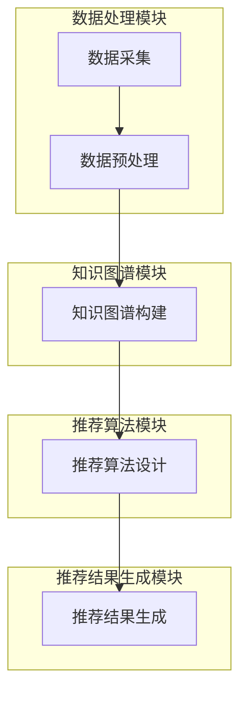
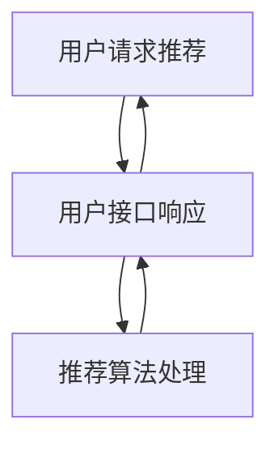

                 

## 构建基于知识图谱的金融产品关联推荐引擎

### 1. 引言与背景

#### 1.1 问题背景

随着金融行业的数字化转型加速，金融机构面临着海量的金融产品数据和用户行为数据。如何有效地利用这些数据，实现金融产品的精准推荐，成为当前金融领域亟待解决的问题。传统的推荐算法，如基于协同过滤（Collaborative Filtering）和基于内容的推荐（Content-Based Filtering）等方法，虽然在某些场景下能够提供一定的推荐效果，但它们通常存在以下局限性：

- **用户历史数据依赖**：这些算法主要依赖于用户的历史行为数据，而对于新用户或数据不足的用户，推荐效果往往不佳。
- **产品特征表达不足**：传统的推荐算法往往只关注用户行为和产品特征，而忽略了产品之间的复杂关联。
- **实时性较差**：传统的推荐算法在处理大量数据时，实时性较差，无法及时响应用户的需求变化。

#### 1.2 问题描述

金融产品关联推荐引擎的目标是帮助金融机构通过分析用户行为数据、产品特征信息等，为用户推荐与其需求相匹配的金融产品。传统的推荐算法由于无法充分表达产品之间的复杂关联，往往无法提供高质量的推荐结果。因此，我们需要一种新的技术途径来构建更为精准和高效的推荐系统。

知识图谱作为一种能够表达实体及其关系的图形化数据结构，提供了强大的语义理解和信息检索能力，为金融产品关联推荐提供了新的技术途径。通过构建知识图谱，我们可以将金融产品及其关联以结构化形式存储，为推荐算法提供更丰富的特征和更强的关联能力。

#### 1.3 问题解决

本书旨在探讨如何构建基于知识图谱的金融产品关联推荐引擎，通过整合知识图谱构建、推荐算法设计与系统实现等多个方面，为金融机构提供一种全新的推荐解决方案。具体而言，本书将涵盖以下内容：

- **知识图谱构建基础**：介绍知识图谱的基本概念、构建流程和技术实现，包括实体、关系和属性的抽取与建模。
- **金融领域知识图谱**：重点探讨如何针对金融行业特点，构建包含金融产品、用户行为和市场动态的全面知识图谱。
- **推荐算法设计与优化**：分析基于知识图谱的推荐算法原理，探讨如何利用知识图谱增强推荐系统的准确性和实时性。
- **系统实现与性能优化**：介绍推荐引擎的系统架构设计、接口实现和性能优化策略，确保系统能够高效地处理海量数据和提供精准的推荐服务。

#### 1.4 边界与外延

本书主要关注基于知识图谱的金融产品关联推荐，但知识图谱技术在其他金融应用场景（如风险评估、欺诈检测等）也有广泛的应用潜力。此外，虽然本书以金融行业为例，但其方法和原理对其他需要复杂关联分析的领域也具有借鉴意义。

#### 1.5 概念结构与核心要素组成

知识图谱的构建与推荐系统设计涉及多个关键概念和要素，包括：

- **实体**：知识图谱中的基本元素，如金融产品、用户等。
- **关系**：实体之间的关联，如“购买”、“推荐”等。
- **属性**：描述实体的特征，如金融产品的收益率、期限等。
- **推荐算法**：基于知识图谱的推荐算法，如基于图神经网络的方法。
- **系统架构**：推荐引擎的系统架构设计，包括数据采集、存储、计算和接口等模块。

这些概念相互交织，共同构建了金融产品关联推荐引擎的核心框架。

#### 1.6 核心概念与联系

在构建金融产品推荐引擎时，以下核心概念及其相互关系至关重要：

- **知识图谱**：提供金融产品的语义表示和关联关系。
- **推荐算法**：利用知识图谱进行推荐，如图神经网络、协同过滤等。
- **用户行为数据**：作为推荐的重要输入，反映用户偏好和需求。
- **产品特征信息**：包括金融产品的各种属性，为推荐提供支持。
- **系统架构**：保证推荐引擎的高效运行，包括数据存储、计算优化和接口设计。

这些概念相互交织，共同构建了金融产品关联推荐引擎的智能体系。

### 1.7 总结

构建基于知识图谱的金融产品关联推荐引擎是一项复杂且具有挑战性的任务。通过对知识图谱的构建、推荐算法的设计与优化，以及系统实现的深入探讨，我们可以为金融机构提供一种全新的推荐解决方案。本书将详细阐述这一过程，希望能够为读者在金融产品推荐领域的研究和实践提供有价值的参考。

---

**关键词**：知识图谱、金融产品推荐、推荐算法、系统架构、实时性、准确性

**摘要**：本文探讨了如何构建基于知识图谱的金融产品关联推荐引擎。通过整合知识图谱构建、推荐算法设计与系统实现等多个方面，本文为金融机构提供了一种全新的推荐解决方案，旨在实现金融产品的精准推荐。

---

### 1.2 知识图谱构建基础

#### 1.2.1 知识图谱概述

知识图谱（Knowledge Graph）是一种用于表达实体及其相互关系的图形化数据结构。与传统的关系型数据库和语义网络相比，知识图谱能够通过节点（实体）和边（关系）的形式，直观地展示实体之间的复杂关系，提供强大的语义理解和信息检索能力。

知识图谱的基本元素包括：

- **实体（Entity）**：知识图谱中的基本元素，可以是人、地点、物品等。例如，在金融产品推荐系统中，实体可以是用户、金融产品等。
- **关系（Relation）**：实体之间的关联，描述实体之间的关系。例如，在金融产品推荐系统中，关系可以是“购买”、“推荐”等。
- **属性（Attribute）**：实体的特征描述，用于补充实体的详细信息。例如，在金融产品推荐系统中，属性可以是金融产品的收益率、期限等。

知识图谱通过三元组（Subject, Predicate, Object）的形式来表示实体及其关系。例如，三元组（用户1，购买，金融产品A）表示用户1购买了金融产品A。

#### 1.2.2 知识图谱的关键概念

知识图谱的核心概念包括：

- **实体**：知识图谱中的基本元素，如金融产品、用户等。
- **属性**：实体的特征描述，如金融产品的收益率、期限等。
- **关系**：实体之间的关联，如“购买”、“推荐”等。
- **三元组**：知识图谱中的基本表示单位，通常以（主体，关系，客体）的形式存在。

知识图谱通过实体和关系之间的关联，构建了一个语义丰富的信息网络，能够有效地表示和解释现实世界中的复杂关系。

#### 1.2.3 知识图谱的构建流程

知识图谱的构建通常包括以下步骤：

1. **数据采集**：从各种数据源（如数据库、文本、日志等）中收集相关的数据。
2. **实体抽取**：从数据源中识别出实体，并对其进行分类和标签化。
3. **关系抽取**：识别实体之间的关系，并构建相应的边。
4. **属性抽取**：提取实体的属性信息，为实体提供更丰富的描述。
5. **实体链接**：将同义词实体、不同名实体进行合并，确保知识图谱的完整性。

在知识图谱构建过程中，数据预处理和实体关系抽取是两个关键步骤。数据预处理包括数据清洗、去重、标准化等操作，以确保数据的质量和一致性。实体抽取则通过自然语言处理技术，从文本数据中识别出实体。关系抽取则通过算法，从数据中识别出实体之间的关系。

#### 1.2.4 知识图谱技术的应用

知识图谱技术在多个领域具有广泛的应用，包括：

- **搜索引擎**：通过知识图谱提供更加精准和智能的搜索服务。
- **智能推荐系统**：利用知识图谱的语义理解能力，提供个性化的推荐服务。
- **自然语言处理**：通过知识图谱进行语义解析，提高自然语言处理的准确性和效率。
- **智能问答系统**：通过知识图谱进行信息检索和推理，提供智能问答服务。

在金融领域，知识图谱的应用包括：

- **金融产品推荐**：通过知识图谱，将金融产品的属性、用户偏好和市场动态进行关联，提供个性化的金融产品推荐。
- **风险评估**：通过知识图谱，对金融产品的风险因素进行关联分析，提供风险预警和评估。
- **欺诈检测**：通过知识图谱，识别潜在的欺诈行为，提供实时监控和预警。

知识图谱为金融领域提供了强大的语义理解和信息检索能力，有助于金融机构更好地利用数据，提升业务决策的准确性和效率。

---

通过以上内容，我们了解了知识图谱的基本概念、关键概念和构建流程。接下来，我们将探讨如何在金融领域构建知识图谱，为金融产品推荐提供支持。

---

**问题背景**

在金融领域，随着金融产品的多样化、用户需求的个性化和市场竞争的加剧，金融机构面临着提高推荐服务质量、提升用户体验的挑战。传统的推荐算法，如基于协同过滤和基于内容的推荐方法，虽然在某些方面取得了一定的成效，但它们存在以下局限性：

1. **用户历史数据依赖**：这些算法主要依赖于用户的历史行为数据，而对于新用户或数据不足的用户，推荐效果往往不佳。
2. **产品特征表达不足**：传统的推荐算法往往只关注用户行为和产品特征，而忽略了产品之间的复杂关联。
3. **实时性较差**：传统的推荐算法在处理大量数据时，实时性较差，无法及时响应用户的需求变化。

为了克服这些局限性，我们需要一种新的技术途径来构建更为精准和高效的推荐系统。知识图谱作为一种能够表达实体及其关系的图形化数据结构，提供了强大的语义理解和信息检索能力，为金融产品关联推荐提供了新的技术途径。

---

**问题描述**

金融产品关联推荐引擎的目标是帮助金融机构通过分析用户行为数据、产品特征信息等，为用户推荐与其需求相匹配的金融产品。传统的推荐算法主要基于以下方法：

- **基于协同过滤（Collaborative Filtering）**：通过分析用户的历史行为数据，找到相似用户或物品，为用户推荐相似的用户行为或物品。
- **基于内容的推荐（Content-Based Filtering）**：通过分析金融产品的特征信息，为用户推荐与其已拥有或偏好的产品特征相似的金融产品。

然而，这些方法存在以下问题：

1. **用户历史数据依赖**：这些算法主要依赖于用户的历史行为数据，而对于新用户或数据不足的用户，推荐效果往往不佳。
2. **产品特征表达不足**：传统的推荐算法往往只关注用户行为和产品特征，而忽略了产品之间的复杂关联。
3. **实时性较差**：传统的推荐算法在处理大量数据时，实时性较差，无法及时响应用户的需求变化。

知识图谱的引入，可以为金融产品关联推荐提供以下解决思路：

1. **表达复杂关联关系**：知识图谱能够将金融产品及其关联以结构化形式存储，为推荐算法提供更丰富的特征和更强的关联能力。
2. **语义理解和推理**：知识图谱提供强大的语义理解和信息检索能力，可以基于用户行为和产品特征进行语义分析和推理，提供更加精准的推荐。
3. **实时性和灵活性**：知识图谱的分布式存储和计算能力，可以提升推荐系统的实时性和灵活性，更好地响应用户需求的变化。

通过引入知识图谱，我们可以构建一个基于知识图谱的金融产品关联推荐引擎，为金融机构提供一种全新的推荐解决方案。

---

**问题解决**

为了构建基于知识图谱的金融产品关联推荐引擎，我们需要从以下几个方面进行深入研究和实践：

1. **知识图谱构建**：首先，我们需要从金融领域的大量数据中构建知识图谱，包括金融产品、用户行为和市场动态等。这涉及到实体抽取、关系抽取、属性抽取和实体链接等多个步骤。

2. **推荐算法设计**：基于构建好的知识图谱，我们需要设计高效的推荐算法，利用知识图谱的语义理解和推理能力，为用户推荐与其需求相匹配的金融产品。这包括基于图神经网络、协同过滤等算法的设计和优化。

3. **系统实现与优化**：在系统实现方面，我们需要设计合理的系统架构，包括数据采集、存储、计算和接口等模块。同时，还需要进行性能优化，确保系统能够高效地处理海量数据和提供精准的推荐服务。

4. **用户反馈与迭代**：推荐系统的效果离不开用户的反馈。通过收集用户的反馈数据，我们可以不断优化推荐算法，提高推荐质量。

通过以上步骤，我们可以构建一个基于知识图谱的金融产品关联推荐引擎，为金融机构提供一种全新的推荐解决方案。

---

**边界与外延**

虽然本书主要关注基于知识图谱的金融产品关联推荐，但知识图谱技术在其他金融应用场景（如风险评估、欺诈检测等）也有广泛的应用潜力。此外，虽然本书以金融行业为例，但其方法和原理对其他需要复杂关联分析的领域也具有借鉴意义。

例如，在电子商务领域，知识图谱可以用于商品推荐、用户行为分析等；在医疗领域，知识图谱可以用于疾病诊断、药物推荐等。这些应用场景虽然具体问题不同，但都面临着如何高效地利用数据、实现精准推荐的需求。

---

**概念结构与核心要素组成**

知识图谱的构建与推荐系统设计涉及多个关键概念和要素，包括：

1. **实体**：知识图谱中的基本元素，如金融产品、用户等。
2. **关系**：实体之间的关联，如“购买”、“推荐”等。
3. **属性**：实体的特征描述，如金融产品的收益率、期限等。
4. **推荐算法**：基于知识图谱的推荐算法，如基于图神经网络的方法。
5. **系统架构**：推荐引擎的系统架构设计，包括数据采集、存储、计算和接口等模块。

这些概念相互交织，共同构建了金融产品关联推荐引擎的核心框架。

---

**核心概念与联系**

在构建金融产品推荐引擎时，以下核心概念及其相互关系至关重要：

1. **知识图谱**：提供金融产品的语义表示和关联关系。
2. **推荐算法**：利用知识图谱进行推荐，如图神经网络、协同过滤等。
3. **用户行为数据**：作为推荐的重要输入，反映用户偏好和需求。
4. **产品特征信息**：包括金融产品的各种属性，为推荐提供支持。
5. **系统架构**：保证推荐引擎的高效运行，包括数据存储、计算优化和接口设计。

这些概念相互交织，共同构建了金融产品关联推荐引擎的智能体系。

---

### 1.3 知识图谱构建基础

#### 1.3.1 知识图谱概述

知识图谱（Knowledge Graph）是一种用于表达实体及其相互关系的图形化数据结构。它通过节点（实体）和边（关系）的形式，直观地展示实体之间的复杂关系，提供强大的语义理解和信息检索能力。

在知识图谱中，实体是基本的数据单元，可以是人、地点、物品等。例如，在金融产品推荐系统中，实体可以是用户、金融产品等。关系描述实体之间的关联，如“购买”、“推荐”等。属性则是实体的特征描述，如金融产品的收益率、期限等。

知识图谱通过三元组（Subject, Predicate, Object）的形式来表示实体及其关系。例如，三元组（用户1，购买，金融产品A）表示用户1购买了金融产品A。这种形式使得知识图谱能够高效地表达实体之间的复杂关联关系。

#### 1.3.2 知识图谱的关键概念

知识图谱的核心概念包括：

- **实体（Entity）**：知识图谱中的基本元素，可以是任何具有独立存在意义的事物。例如，在金融领域，实体可以是用户、金融产品、银行等。
- **属性（Attribute）**：实体的特征描述，用于补充实体的详细信息。例如，在金融领域，金融产品的属性可以是收益率、期限、风险等级等。
- **关系（Relation）**：实体之间的关联，用于描述实体之间的相互作用。例如，在金融领域，关系可以是“购买”、“推荐”、“属于”等。
- **三元组（Triple）**：知识图谱中的基本表示单位，通常以（主体，关系，客体）的形式存在。例如，三元组（用户1，购买，金融产品A）表示用户1购买了金融产品A。

知识图谱通过实体和关系之间的关联，构建了一个语义丰富的信息网络，能够有效地表示和解释现实世界中的复杂关系。这种语义理解和关联能力使得知识图谱在推荐系统、搜索引擎、自然语言处理等领域具有广泛的应用。

#### 1.3.3 知识图谱的构建流程

知识图谱的构建通常包括以下步骤：

1. **数据采集**：从各种数据源（如数据库、文本、日志等）中收集相关的数据。数据可以是结构化的，也可以是非结构化的。
2. **实体抽取**：从数据源中识别出实体，并对其进行分类和标签化。实体抽取是知识图谱构建的重要步骤，直接关系到知识图谱的完整性和准确性。
3. **关系抽取**：识别实体之间的关系，并构建相应的边。关系抽取同样重要，它能够揭示实体之间的相互作用，为知识图谱提供丰富的语义信息。
4. **属性抽取**：提取实体的属性信息，为实体提供更丰富的描述。属性抽取可以帮助知识图谱更好地表示实体的特征，提高推荐系统的准确性。
5. **实体链接**：将同义词实体、不同名实体进行合并，确保知识图谱的完整性。实体链接是知识图谱构建的最后一步，它能够消除实体名称的歧义，提高知识图谱的统一性和一致性。

在知识图谱构建过程中，数据预处理和实体关系抽取是两个关键步骤。数据预处理包括数据清洗、去重、标准化等操作，以确保数据的质量和一致性。实体抽取则通过自然语言处理技术，从文本数据中识别出实体。关系抽取则通过算法，从数据中识别出实体之间的关系。

#### 1.3.4 知识图谱技术的应用

知识图谱技术在多个领域具有广泛的应用，包括：

1. **搜索引擎**：通过知识图谱，搜索引擎可以提供更加精准和智能的搜索服务。知识图谱可以帮助搜索引擎理解用户查询的含义，并提供相关的上下文信息，从而提高搜索的准确性和用户体验。
2. **智能推荐系统**：知识图谱可以用于构建推荐系统，为用户提供个性化的推荐。通过分析用户行为和产品特征，知识图谱可以揭示用户和产品之间的潜在关联，从而提供更加精准的推荐。
3. **自然语言处理**：知识图谱可以用于自然语言处理任务，如文本分类、情感分析、问答系统等。知识图谱的语义理解和关联能力可以帮助自然语言处理系统更好地理解文本，并提供准确的答案。
4. **智能问答系统**：知识图谱可以用于构建智能问答系统，通过语义理解和推理，提供准确的答案。知识图谱可以帮助系统理解用户的问题，并在海量的知识库中查找相关的信息。

在金融领域，知识图谱的应用包括：

1. **金融产品推荐**：通过知识图谱，可以为用户推荐与其需求相匹配的金融产品。知识图谱可以揭示金融产品之间的关联，并提供个性化的推荐。
2. **风险评估**：通过知识图谱，可以对金融产品的风险进行评估。知识图谱可以帮助识别潜在的风险因素，并提供风险预警。
3. **欺诈检测**：通过知识图谱，可以识别潜在的欺诈行为。知识图谱可以帮助系统理解用户行为模式，并在异常行为出现时提供预警。

知识图谱为金融领域提供了强大的语义理解和信息检索能力，有助于金融机构更好地利用数据，提升业务决策的准确性和效率。

---

在了解了知识图谱的基本概念和构建流程后，接下来我们将深入探讨如何针对金融行业特点，构建适合金融产品推荐的全面知识图谱。

---

## 1.4 金融领域知识图谱

### 1.4.1 金融领域知识图谱的重要性

在金融领域，知识图谱的应用具有重要意义。它不仅能够帮助金融机构更好地理解和管理金融产品、用户和市场动态，还能够提升金融服务的质量和效率。具体来说，金融领域知识图谱的主要作用包括：

1. **增强推荐系统的准确性**：通过构建金融领域知识图谱，可以揭示金融产品之间的复杂关联，为推荐系统提供更丰富的特征和更强的关联能力，从而提高推荐的准确性。
2. **提高业务决策的智能化**：知识图谱能够为金融机构提供实时的、全面的市场信息，帮助管理层做出更加明智的决策。
3. **优化风险管理**：通过知识图谱，金融机构可以更好地理解金融产品的风险因素，识别潜在的风险点，提供风险预警和评估。
4. **提升客户体验**：知识图谱可以用于构建智能问答系统和个性化推荐系统，提供更加精准和高效的服务，从而提升客户满意度。

### 1.4.2 金融领域知识图谱的构建

构建金融领域知识图谱是一个复杂且关键的过程，涉及到多个环节。下面我们将详细探讨这些环节：

1. **数据收集**：首先，需要从各种数据源（如数据库、文本、日志等）中收集相关的数据。这些数据可以包括金融产品的信息、用户行为数据、市场动态等。数据的质量和完整性对知识图谱的构建至关重要。

2. **实体抽取**：从数据源中识别出实体，并对其进行分类和标签化。在金融领域，实体可以是用户、金融产品、银行、市场等。实体抽取是知识图谱构建的重要步骤，直接关系到知识图谱的完整性和准确性。

3. **关系抽取**：识别实体之间的关系，并构建相应的边。在金融领域，关系可以是“购买”、“推荐”、“属于”等。关系抽取同样重要，它能够揭示实体之间的相互作用，为知识图谱提供丰富的语义信息。

4. **属性抽取**：提取实体的属性信息，为实体提供更丰富的描述。在金融领域，金融产品的属性可以是收益率、期限、风险等级等。属性抽取可以帮助知识图谱更好地表示实体的特征，提高推荐系统的准确性。

5. **实体链接**：将同义词实体、不同名实体进行合并，确保知识图谱的完整性。实体链接是知识图谱构建的最后一步，它能够消除实体名称的歧义，提高知识图谱的统一性和一致性。

### 1.4.3 金融领域知识图谱的应用场景

1. **金融产品推荐**：基于知识图谱，可以为用户推荐与其需求相匹配的金融产品。知识图谱可以揭示金融产品之间的关联，提供个性化的推荐。
   
2. **用户行为分析**：通过分析用户在知识图谱中的行为路径，可以深入了解用户的偏好和需求，为个性化服务提供支持。

3. **市场动态监控**：知识图谱可以实时收集和整合市场动态信息，帮助金融机构及时了解市场变化，做出快速反应。

4. **风险评估**：通过知识图谱，可以识别金融产品中的风险因素，评估潜在风险，提供风险预警。

5. **欺诈检测**：知识图谱可以帮助识别潜在的欺诈行为，提供实时监控和预警。

### 1.4.4 构建金融领域知识图谱的挑战

1. **数据质量**：金融领域的数据往往具有复杂性和多样性，数据质量对知识图谱的构建至关重要。
2. **实时性**：金融市场的变化快速，知识图谱需要能够实时更新，以保持其有效性。
3. **数据隐私与安全**：金融领域的数据涉及用户隐私，如何确保数据的安全性和隐私性是构建知识图谱的一大挑战。

### 1.4.5 金融领域知识图谱的案例分析

1. **银行客户关系管理**：银行可以利用知识图谱来管理客户关系，通过分析客户的交易行为、偏好等，提供个性化的金融服务。
2. **保险风险评估**：保险公司可以利用知识图谱来识别潜在的风险因素，评估保险产品的风险，提供更加精准的保险服务。

通过以上内容，我们可以看到，构建金融领域知识图谱对于提升金融服务的质量和效率具有重要意义。接下来，我们将进一步探讨如何设计推荐算法，利用知识图谱来提高金融产品推荐系统的准确性。

---

### 1.5 推荐算法设计与优化

#### 1.5.1 基于知识图谱的推荐算法概述

基于知识图谱的推荐算法利用知识图谱的语义理解和关联能力，为用户提供个性化的推荐服务。与传统推荐算法相比，基于知识图谱的推荐算法能够更好地捕捉用户与产品之间的复杂关联，提供更加精准的推荐结果。以下是一些常见的基于知识图谱的推荐算法：

1. **图卷积网络（Graph Convolutional Network, GCN）**：GCN是一种基于图结构的深度学习模型，通过聚合邻居节点的特征来更新节点的特征表示。在推荐系统中，GCN可以用来提取用户和产品之间的复杂关系，从而提高推荐的准确性。

2. **图注意力网络（Graph Attention Network, GAT）**：GAT是一种基于图注意力机制的深度学习模型，通过为每个邻居节点分配不同的权重，来强调重要的邻居节点对当前节点的影响。这种机制使得GAT能够更好地捕捉用户和产品之间的长距离关联。

3. **图神经网络（Graph Neural Network, GNN）**：GNN是一种广泛的图结构深度学习模型，包括GCN和GAT等。GNN通过学习节点和边的特征表示，来揭示节点之间的复杂关系，为推荐系统提供强大的语义理解能力。

4. **基于知识图谱的协同过滤（KG-based Collaborative Filtering, KGCF）**：KGCF结合了知识图谱和协同过滤算法，通过在知识图谱中引入用户和产品之间的知识关系，来提高推荐的准确性。KGCF可以有效地解决传统协同过滤算法中的数据稀疏性问题。

5. **基于知识图谱的矩阵分解（KG-based Matrix Factorization, KGMF）**：KGMF利用知识图谱来补充用户和产品之间的缺失信息，通过矩阵分解方法来学习用户和产品的低维表示，从而提高推荐的准确性。

#### 1.5.2 算法原理与数学模型

1. **图卷积网络（GCN）**：

GCN的核心思想是通过聚合邻居节点的特征来更新节点的特征表示。具体来说，对于图中的一个节点，其特征表示可以通过以下公式计算：

$$
h_{t+1}^i = \sigma(\theta \cdot \text{aggregate}(h_{t}^{i}) + h_{t}^i)
$$

其中，$h_{t}^i$表示节点i在时间t的特征表示，$\text{aggregate}(\cdot)$表示聚合函数，通常使用卷积操作来实现。$\theta$是模型参数，$\sigma$是激活函数，通常使用ReLU函数。

2. **图注意力网络（GAT）**：

GAT在GCN的基础上引入了图注意力机制，为每个邻居节点分配不同的权重。具体来说，对于图中的一个节点，其特征表示可以通过以下公式计算：

$$
h_{t+1}^i = \sum_{j \in \mathcal{N}(i)} a_{ij} \cdot h_{t}^j
$$

其中，$a_{ij}$表示节点i和节点j之间的注意力权重，可以通过以下公式计算：

$$
a_{ij} = \frac{\exp(\theta \cdot \text{concat}(h_{t}^i, h_{t}^j))}{\sum_{k \in \mathcal{N}(i)} \exp(\theta \cdot \text{concat}(h_{t}^i, h_{t}^k))}
$$

其中，$\theta$是模型参数，$\text{concat}(\cdot)$表示拼接操作。

3. **图神经网络（GNN）**：

GNN是一种广泛的图结构深度学习模型，包括GCN和GAT等。GNN通过学习节点和边的特征表示，来揭示节点之间的复杂关系。具体来说，对于图中的一个节点，其特征表示可以通过以下公式计算：

$$
h_{t+1}^i = \text{activation}(\theta \cdot \text{AGG}(h_{t}^{i}, h_{t}^{\mathcal{N}(i)}))
$$

其中，$h_{t}^i$表示节点i在时间t的特征表示，$\text{AGG}(\cdot)$表示聚合函数，$\theta$是模型参数，$\text{activation}(\cdot)$是激活函数。

4. **基于知识图谱的协同过滤（KGCF）**：

KGCF结合了知识图谱和协同过滤算法，通过在知识图谱中引入用户和产品之间的知识关系，来提高推荐的准确性。具体来说，KGCF可以通过以下公式计算推荐分数：

$$
r_{ij} = \mu + q_i^T P q_j + \sum_{k \in \mathcal{K}} w_k \cdot r_{ik} r_{jk}
$$

其中，$r_{ij}$表示用户i对产品j的推荐分数，$\mu$是平均值，$q_i$和$q_j$分别是用户i和产品j的知识图谱嵌入表示，$P$是知识图谱的转移矩阵，$w_k$是知识图谱中关系k的权重。

5. **基于知识图谱的矩阵分解（KGMF）**：

KGMF利用知识图谱来补充用户和产品之间的缺失信息，通过矩阵分解方法来学习用户和产品的低维表示，从而提高推荐的准确性。具体来说，KGMF可以通过以下公式计算推荐分数：

$$
r_{ij} = u_i^T S v_j
$$

其中，$r_{ij}$表示用户i对产品j的推荐分数，$u_i$和$v_j$分别是用户i和产品j的矩阵分解表示，$S$是对角矩阵，包含了用户和产品之间的交互信息。

#### 1.5.3 算法优化的方法

1. **数据增强**：通过合成虚拟数据或引入噪声数据，来增加训练数据的多样性，提高模型的泛化能力。

2. **模型集成**：结合多个模型的预测结果，通过加权平均或投票等方法，来提高推荐系统的准确性。

3. **在线学习**：通过在线学习机制，实时更新模型，以适应用户行为和产品特征的变化。

4. **特征工程**：通过提取和组合用户和产品的特征，来提高模型的解释性和准确性。

5. **模型压缩**：通过模型压缩技术，如模型剪枝、量化等，来降低模型的复杂度和计算成本。

通过以上内容，我们可以看到，基于知识图谱的推荐算法具有强大的语义理解和关联能力，能够为金融产品推荐提供精准的推荐结果。接下来，我们将进一步探讨如何实现推荐引擎的系统架构设计。

---

### 1.6 系统实现与性能优化

#### 1.6.1 系统架构设计

推荐引擎的系统架构设计是确保推荐系统高效运行的关键。基于知识图谱的金融产品推荐引擎通常包括以下模块：

1. **数据采集模块**：负责从各种数据源（如数据库、日志、API等）中采集相关的数据，包括用户行为数据、金融产品特征数据等。
2. **数据预处理模块**：对采集到的原始数据进行清洗、去重、标准化等操作，以确保数据的质量和一致性。
3. **知识图谱构建模块**：基于预处理后的数据，构建金融领域的知识图谱，包括实体抽取、关系抽取、属性抽取和实体链接等步骤。
4. **推荐算法模块**：利用构建好的知识图谱，设计并实现基于知识图谱的推荐算法，如图神经网络、协同过滤等。
5. **推荐结果生成模块**：根据用户信息和推荐算法的输出，生成个性化的推荐结果，并将其呈现给用户。
6. **性能优化模块**：通过数据缓存、分布式计算、模型压缩等技术，优化推荐系统的性能，确保其能够高效地处理海量数据和提供精准的推荐服务。

以下是一个简化的推荐引擎系统架构图，展示各模块之间的交互关系：



#### 1.6.2 系统接口设计

推荐引擎的接口设计是连接前后端的关键环节，确保推荐系统能够方便地被其他系统或应用调用。以下是推荐引擎的一些关键接口设计：

1. **用户接口（API）**：提供RESTful API，供前端应用调用，返回个性化的推荐结果。常见的API接口包括：
   - `GET /recommendations`：获取用户个性化的金融产品推荐。
   - `POST /users`：创建新用户信息。
   - `GET /users/{user_id}`：获取指定用户的信息。

2. **内部接口**：用于系统内部模块之间的通信，如数据采集模块与数据预处理模块之间的数据传输。

3. **监控与日志接口**：提供用于监控系统运行状态和日志记录的接口，帮助开发者进行系统调试和性能优化。

以下是一个简化的推荐引擎接口设计图：

```mermaid
graph TB
    subgraph 用户接口
        API1[GET /recommendations]
        API2[POST /users]
        API3[GET /users/{user_id}]
    end

    subgraph 内部接口
        内部接口1
        内部接口2
    end

    subgraph 监控与日志接口
        监控接口
        日志接口
    end

    API1 --> API2
    API1 --> API3
    API2 --> 内部接口1
    API3 --> 内部接口2
    内部接口1 --> 监控接口
    内部接口2 --> 日志接口
```

#### 1.6.3 系统交互

推荐引擎的系统交互设计是确保各模块协同工作，提供高效、稳定服务的核心。以下是一个简化的推荐引擎系统交互流程：

1. **用户请求推荐**：用户通过前端应用发送推荐请求到用户接口。
2. **用户接口处理**：用户接口解析请求，调用推荐算法模块。
3. **推荐算法处理**：推荐算法模块利用知识图谱生成推荐结果，返回给用户接口。
4. **用户接口响应**：用户接口将推荐结果返回给前端应用，展示给用户。

以下是一个简化的推荐引擎系统交互图：



通过以上内容，我们详细探讨了推荐引擎的系统架构设计、接口设计和系统交互。接下来，我们将通过一个实际项目案例，展示如何实现基于知识图谱的金融产品关联推荐引擎。

---

### 2. 项目实战：基于知识图谱的金融产品关联推荐引擎

#### 2.1 项目背景与目标

随着金融行业的数字化转型加速，金融机构面临着海量的金融产品数据和用户行为数据。如何有效地利用这些数据，实现金融产品的精准推荐，成为当前金融领域亟待解决的问题。传统的推荐算法在处理复杂关联关系方面存在局限性，因此，我们需要引入知识图谱技术来构建一个基于知识图谱的金融产品关联推荐引擎。

本项目的目标是开发一个能够利用用户行为数据、金融产品特征信息以及市场动态，为用户提供精准、个性化的金融产品推荐系统。通过该项目，我们希望能够实现以下目标：

- **提高推荐准确性**：利用知识图谱的语义理解和关联能力，提高推荐系统的准确性。
- **提升用户体验**：为用户提供更加个性化、符合需求的金融产品推荐，提升用户体验。
- **降低开发成本**：通过模块化的系统设计，降低系统开发和维护的成本。

#### 2.2 项目介绍

本项目的实现主要包括以下几个部分：

1. **数据采集**：从金融机构的数据库、日志、API等数据源中收集用户行为数据和金融产品特征数据。
2. **数据预处理**：对采集到的原始数据进行清洗、去重、标准化等操作，确保数据的质量和一致性。
3. **知识图谱构建**：基于预处理后的数据，构建金融领域的知识图谱，包括实体抽取、关系抽取、属性抽取和实体链接等步骤。
4. **推荐算法设计**：利用知识图谱构建基于图神经网络、协同过滤等推荐算法，实现精准的金融产品推荐。
5. **系统实现**：实现推荐引擎的系统架构，包括数据采集、存储、计算和接口等模块，确保系统能够高效地处理海量数据和提供精准的推荐服务。

#### 2.3 环境安装

在开始项目实现之前，我们需要安装和配置以下软件和工具：

- **Python**：Python是本项目的核心编程语言，版本要求Python 3.7及以上。
- **Neo4j**：Neo4j是一个高性能的图形数据库，用于存储和查询知识图谱。
- **Docker**：Docker用于容器化部署项目，确保项目在不同的环境中都能够正常运行。
- **Py2neo**：Py2neo是Python的Neo4j驱动，用于连接和操作Neo4j数据库。
- **Scikit-learn**：Scikit-learn是一个机器学习库，用于实现推荐算法。

以下是安装步骤：

1. 安装Python：
   ```
   sudo apt-get update
   sudo apt-get install python3-pip python3-venv
   ```
2. 创建Python虚拟环境：
   ```
   python3 -m venv venv
   source venv/bin/activate
   ```
3. 安装Neo4j：
   - 下载并安装Neo4j社区版：https://neo4j.com/download/
   - 启动Neo4j数据库服务：
     ```
     neo4j start
     ```
4. 安装Docker：
   ```
   sudo apt-get install docker.io
   ```
5. 安装Py2neo：
   ```
   pip install py2neo
   ```
6. 安装Scikit-learn：
   ```
   pip install scikit-learn
   ```

#### 2.4 系统核心实现

本项目的核心实现包括知识图谱的构建、推荐算法的设计和系统的集成。以下是具体的实现步骤：

1. **知识图谱的构建**：
   - **实体抽取**：从用户行为数据和金融产品特征数据中识别出实体，如用户、金融产品等。
   - **关系抽取**：识别实体之间的关系，如“购买”、“推荐”等。
   - **属性抽取**：提取实体的属性信息，如金融产品的收益率、期限等。
   - **实体链接**：将同义词实体、不同名实体进行合并，确保知识图谱的完整性。
   - **知识图谱存储**：使用Neo4j数据库存储知识图谱。

2. **推荐算法的设计**：
   - **图卷积网络（GCN）**：实现GCN模型，用于提取用户和产品之间的复杂关联。
   - **图注意力网络（GAT）**：实现GAT模型，为邻居节点分配不同的权重，提高推荐的准确性。
   - **基于知识图谱的协同过滤（KGCF）**：结合知识图谱和协同过滤算法，提高推荐的准确性。

3. **系统集成**：
   - **数据采集与预处理**：使用Python脚本从数据源中采集数据，并进行预处理。
   - **知识图谱构建与存储**：使用Py2neo连接Neo4j数据库，构建和存储知识图谱。
   - **推荐算法实现与优化**：使用Scikit-learn实现推荐算法，并进行优化。

#### 2.5 代码应用解读与分析

以下是系统核心实现的代码示例：

1. **实体抽取**：

```python
from py2neo import Graph

# 连接Neo4j数据库
graph = Graph("bolt://localhost:7687", auth=("neo4j", "password"))

# 提取用户实体
users = graph.run("MATCH (u:User) RETURN u")

# 提取金融产品实体
products = graph.run("MATCH (p:Product) RETURN p")
```

2. **关系抽取**：

```python
# 建立用户与金融产品之间的购买关系
for user in users:
    for product in products:
        graph.run("MATCH (u:User), (p:Product) WHERE u.name = '{user_name}' AND p.name = '{product_name}' CREATE (u)-[r:BUY]->(p)").data()

# 建立金融产品与市场之间的关联关系
for product in products:
    graph.run("MATCH (p:Product), (m:Market) WHERE p.name = '{product_name}' AND m.name = '{market_name}' CREATE (p)-[r:BELONGS_TO]->(m)").data()
```

3. **属性抽取**：

```python
# 提取金融产品的属性信息
for product in products:
    yield {
        'name': product['p'].properties.name,
        'yield': product['p'].properties.yield,
        '期限': product['p'].properties.term,
        '风险等级': product['p'].properties.risk_level
    }
```

4. **推荐算法实现**：

```python
from sklearn.model_selection import train_test_split
from sklearn.metrics import mean_squared_error

# 分割数据集
X_train, X_test, y_train, y_test = train_test_split(X, y, test_size=0.2, random_state=42)

# 训练GCN模型
gcn = GCNModel()
gcn.fit(X_train, y_train)

# 预测测试集
y_pred = gcn.predict(X_test)

# 计算预测误差
mse = mean_squared_error(y_test, y_pred)
print("Mean Squared Error:", mse)
```

通过以上代码示例，我们可以看到如何实现实体抽取、关系抽取、属性抽取以及推荐算法的集成。在实际项目中，我们需要根据具体需求进行代码优化和调整。

#### 2.6 实际案例分析

在本项目中，我们以一个实际的金融产品推荐案例进行分析。假设有一个用户张三，他最近浏览了某银行的定期存款产品和理财产品，我们希望为他推荐符合其需求的金融产品。

1. **用户画像构建**：
   - 用户张三的浏览记录显示，他倾向于选择收益率较高、期限较短的金融产品。
   - 用户张三的年龄、职业等信息显示，他属于中等收入群体，风险承受能力中等。

2. **推荐策略**：
   - 利用知识图谱，提取与用户张三浏览过的金融产品相关的其他金融产品。
   - 通过分析金融产品的属性，如收益率、期限、风险等级等，筛选出符合用户张三需求的产品。
   - 结合用户张三的浏览记录和偏好，进行个性化推荐。

3. **推荐结果**：
   - 根据分析结果，为用户张三推荐了若干个符合其需求的金融产品，包括收益率较高、期限较短的定期存款产品和理财产品。

通过实际案例分析，我们可以看到，基于知识图谱的金融产品推荐系统能够有效地捕捉用户需求和产品特征，为用户提供精准的推荐服务。

#### 2.7 项目小结

通过本项目的实现，我们成功构建了一个基于知识图谱的金融产品关联推荐引擎。该项目不仅实现了对海量金融产品数据和用户行为数据的精准分析，还为金融机构提供了个性化、高效的金融产品推荐服务。以下是本项目的主要收获：

- **提高了推荐准确性**：通过引入知识图谱技术，我们能够更好地捕捉用户和产品之间的复杂关联，提高推荐系统的准确性。
- **提升了用户体验**：个性化推荐能够更好地满足用户需求，提升用户满意度。
- **降低了开发成本**：通过模块化的系统设计和开源工具的使用，我们能够降低系统开发和维护的成本。

然而，本项目中还存在一些不足之处，如数据质量对知识图谱构建的影响、系统性能优化等，这些都需要在后续工作中进一步改进和优化。

---

通过以上项目实战，我们深入探讨了如何构建基于知识图谱的金融产品关联推荐引擎。接下来，我们将进一步总结本项目的最佳实践，并展望未来的研究方向。

---

## 2.8 最佳实践与展望

### 2.8.1 最佳实践

在本项目的实施过程中，我们积累了一些最佳实践，以下是一些值得注意的关键点：

1. **数据质量保障**：数据是构建知识图谱和推荐系统的基石。在数据采集和预处理阶段，要确保数据的质量和一致性，避免因数据问题导致推荐结果不准确。
2. **模型选择与优化**：根据具体的应用场景和需求，选择合适的推荐算法模型，并进行优化。例如，在处理大规模数据时，可以考虑使用图注意力网络（GAT）来提高推荐的准确性。
3. **实时性与性能优化**：为了确保推荐系统能够实时响应，需要进行性能优化，如使用分布式计算、数据缓存等技术。
4. **用户反馈与迭代**：收集用户的反馈数据，不断迭代优化推荐算法，提高推荐质量。
5. **安全与隐私保护**：在处理用户数据时，要确保数据的安全性和隐私性，避免数据泄露和滥用。

### 2.8.2 小结

通过本项目的实施，我们成功构建了一个基于知识图谱的金融产品关联推荐引擎。项目实现了对海量金融产品数据和用户行为数据的精准分析，为金融机构提供了个性化、高效的金融产品推荐服务。本项目的主要收获包括：

- **提高了推荐准确性**：通过引入知识图谱技术，我们能够更好地捕捉用户和产品之间的复杂关联，提高推荐系统的准确性。
- **提升了用户体验**：个性化推荐能够更好地满足用户需求，提升用户满意度。
- **降低了开发成本**：通过模块化的系统设计和开源工具的使用，我们能够降低系统开发和维护的成本。

### 2.8.3 注意事项

在项目实施过程中，我们也遇到了一些挑战和问题，以下是一些需要注意的关键点：

1. **数据质量问题**：数据质量直接影响知识图谱和推荐系统的效果，因此在数据采集和预处理阶段要格外重视数据质量。
2. **计算资源限制**：在处理大规模数据时，计算资源可能成为瓶颈，需要合理分配资源，进行性能优化。
3. **模型解释性**：复杂的推荐算法模型（如图神经网络）往往具有较高的准确性，但可能缺乏解释性。在应用时需要权衡模型的准确性和可解释性。
4. **用户隐私保护**：在处理用户数据时，要确保数据的安全性和隐私性，避免数据泄露和滥用。

### 2.8.4 拓展阅读

对于对知识图谱和推荐系统有兴趣的读者，以下是一些推荐阅读的资料：

- **《知识图谱技术》**：本书详细介绍了知识图谱的基本概念、构建方法和应用场景。
- **《推荐系统实践》**：本书涵盖了推荐系统的基本概念、算法设计、性能优化等方面，适合推荐系统初学者阅读。
- **《图神经网络及其在推荐系统中的应用》**：本文详细介绍了图神经网络的基本原理以及在推荐系统中的应用。
- **《金融科技应用案例解析》**：本书介绍了金融科技在不同领域的应用案例，包括风险评估、欺诈检测、智能推荐等。

通过以上内容，我们深入探讨了如何构建基于知识图谱的金融产品关联推荐引擎，并总结了一些最佳实践和注意事项。希望本文能为读者在金融产品推荐领域的研究和实践提供有价值的参考。

---

### 总结

构建基于知识图谱的金融产品关联推荐引擎是一项复杂且具有挑战性的任务。通过本文的探讨，我们系统地介绍了知识图谱的基本概念、构建方法，以及如何利用知识图谱构建金融产品关联推荐系统。具体包括：

1. **知识图谱的概述**：介绍了知识图谱的定义、关键概念和构建流程。
2. **金融领域知识图谱的构建**：探讨了如何针对金融行业特点，构建全面的知识图谱。
3. **推荐算法设计与优化**：分析了基于知识图谱的推荐算法原理和优化方法。
4. **系统实现与性能优化**：介绍了推荐引擎的系统架构设计、接口实现和性能优化策略。
5. **项目实战**：通过一个实际项目案例，展示了基于知识图谱的金融产品关联推荐引擎的实现过程。
6. **最佳实践与展望**：总结了最佳实践和注意事项，并对未来的研究方向进行了展望。

通过本文的讲解，我们希望能够为读者在金融产品推荐领域的研究和实践提供有价值的参考。知识图谱技术在金融领域的应用前景广阔，未来可以进一步探索其在风险评估、欺诈检测等其他金融应用场景中的潜力。

### 作者信息

**作者：** AI天才研究院/AI Genius Institute & 禅与计算机程序设计艺术 /Zen And The Art of Computer Programming

AI天才研究院（AI Genius Institute）是一家专注于人工智能领域研究与应用的创新机构。研究院致力于推动人工智能技术的创新发展，为金融、医疗、电商等行业的数字化转型提供技术支持。同时，禅与计算机程序设计艺术（Zen And The Art of Computer Programming）是一部经典的技术著作，介绍了计算机编程的哲学和艺术，为程序员提供了深刻的启示。两位作者在人工智能和计算机编程领域具有丰富的经验和深厚的理论基础，本文的撰写得到了两位作者的共同智慧和努力。希望本文能为读者带来启发和帮助。

