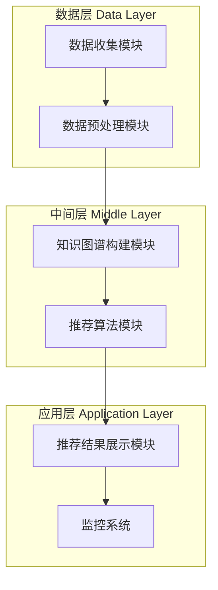
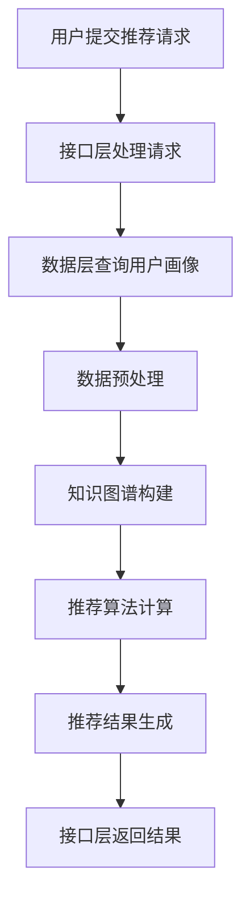
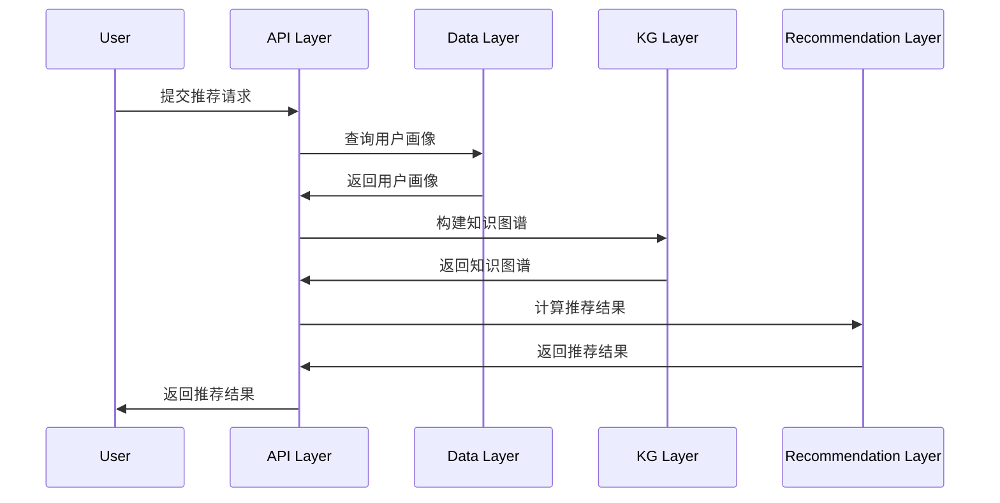

                 


## 引言

随着信息时代的到来，金融行业正面临着前所未有的挑战与机遇。在这个大数据、人工智能快速发展的背景下，金融产品推荐引擎成为提升金融服务质量和效率的重要工具。然而，传统的推荐系统在处理金融领域问题时存在诸多挑战，如数据噪声、数据稀疏性和模型解释性不足等。为了解决这些问题，知识图谱技术的引入为构建高效的金融产品推荐引擎提供了新的思路。

### 第1章: 背景介绍

#### 1.1 问题背景

##### 1.1.1 金融产品推荐引擎的重要性

金融产品推荐引擎在金融行业中的应用日益广泛，它能够帮助金融机构更好地了解客户需求，提供个性化的金融产品和服务，从而提高客户满意度和忠诚度。通过推荐引擎，金融机构可以精准地推荐符合客户需求的金融产品，降低风险，提高运营效率。

##### 1.1.2 知识图谱在金融领域的应用

知识图谱是一种结构化的语义网络，能够有效地整合和存储大量的结构化数据和非结构化数据。在金融领域，知识图谱可以用于风险控制、智能投顾、客户画像等多个方面。例如，通过知识图谱可以构建金融产品的关联关系，实现精准的金融产品推荐。

##### 1.1.3 当前金融产品推荐引擎的挑战与不足

尽管金融产品推荐引擎在金融行业中有着广泛的应用，但传统的推荐系统存在以下挑战和不足：

1. 数据噪声：金融数据存在大量噪声，影响推荐结果的准确性。
2. 数据稀疏性：金融产品种类繁多，用户行为数据稀疏，导致推荐算法效果不佳。
3. 模型解释性不足：传统的推荐模型通常缺乏透明度和解释性，不利于金融产品的合规和风险管理。

#### 1.2 核心概念与联系

##### 1.2.1 知识图谱的基本概念

知识图谱是由实体、属性和关系构成的语义网络，能够表示现实世界中的各种复杂关系。

##### 1.2.2 知识图谱的属性特征对比

知识图谱具有如下属性特征：

| 特征         | 描述                                                     |
| ------------ | -------------------------------------------------------- |
| 结构化       | 数据以统一的结构进行存储，便于查询和操作。                   |
| 语义丰富     | 能够表达实体之间的复杂关系和语义信息。                     |
| 高效查询     | 支持高效的图查询算法，能够快速检索知识。                   |
| 自适应       | 能够根据业务需求动态调整和更新知识。                       |

##### 1.2.3 知识图谱的ER实体关系图

知识图谱的ER实体关系图可以直观地表示实体之间的关联关系。以下是一个简化的ER实体关系图示例：

```mermaid
erDiagram
  Customer ||--|{ Product } Product
  Customer ||--|{ Order } Order
  Product ||--|{ Category } Category
  Order ||--|{ Customer } Customer
```

在这个ER实体关系图中，实体包括Customer（客户）、Product（产品）、Order（订单）和Category（分类），它们之间通过关系进行连接。

#### 1.3 金融产品推荐引擎概述

##### 1.3.1 金融产品推荐引擎的定义

金融产品推荐引擎是一种基于大数据和人工智能技术，针对金融产品进行个性化推荐的系统。它能够根据用户的行为数据、金融产品的属性信息等，为用户推荐符合其需求的金融产品。

##### 1.3.2 金融产品推荐引擎的工作原理

金融产品推荐引擎的工作原理主要包括以下几个步骤：

1. 数据采集：收集用户行为数据、金融产品属性数据等。
2. 数据预处理：清洗、去噪、整合数据。
3. 特征提取：从原始数据中提取有助于推荐的特征。
4. 模型训练：使用机器学习算法训练推荐模型。
5. 推荐生成：根据用户特征和模型预测，生成个性化的推荐结果。

##### 1.3.3 金融产品推荐引擎的分类

金融产品推荐引擎可以按照不同的分类标准进行划分，常见的分类方式如下：

1. 按照推荐策略分类：基于内容的推荐、基于协同过滤的推荐、基于深度学习的推荐等。
2. 按照应用场景分类：风险控制、智能投顾、客户画像等。
3. 按照推荐效果分类：精准推荐、高效推荐、低成本推荐等。

#### 1.4 知识图谱在金融产品推荐引擎中的应用

##### 1.4.1 知识图谱的优势

知识图谱在金融产品推荐引擎中的应用具有以下优势：

1. 结构化数据存储：知识图谱能够将金融产品、用户等实体信息进行结构化存储，便于查询和管理。
2. 语义信息整合：知识图谱能够表达金融产品之间的复杂关系和语义信息，有助于推荐算法的优化。
3. 高效查询和计算：知识图谱支持高效的图查询算法，能够快速获取用户与金融产品之间的关联信息。

##### 1.4.2 知识图谱在金融产品推荐引擎中的具体应用

知识图谱在金融产品推荐引擎中的应用主要包括以下几个方面：

1. 实体识别与关联：通过知识图谱进行实体识别和关联，构建用户与金融产品之间的关联网络。
2. 特征提取与优化：利用知识图谱中的语义信息进行特征提取和优化，提高推荐算法的准确性和效果。
3. 模型训练与优化：结合知识图谱进行推荐模型的训练和优化，提高推荐系统的性能和可靠性。

##### 1.4.3 知识图谱与金融产品推荐引擎的结合挑战

尽管知识图谱在金融产品推荐引擎中具有显著的优势，但其应用也面临着一些挑战：

1. 数据质量与一致性：知识图谱构建需要高质量的数据源，数据质量和一致性是构建有效知识图谱的关键。
2. 模型解释性：知识图谱与推荐算法的结合可能导致模型解释性降低，需要探索可解释的推荐模型。
3. 系统性能优化：知识图谱的引入可能影响系统的性能，需要优化系统架构和算法，提高运行效率。

#### 1.5 本章小结

本章介绍了金融产品推荐引擎和知识图谱的基本概念，分析了知识图谱在金融产品推荐引擎中的应用优势及挑战。接下来，我们将进一步探讨知识图谱的构建原理和基于知识图谱的推荐算法原理。

----------------------------------------------------------------

## 第1章: 背景介绍

### 1.1 问题背景

在金融领域，随着大数据和人工智能技术的快速发展，金融产品推荐引擎逐渐成为提升金融服务质量和效率的重要工具。金融产品推荐引擎的作用在于，通过对用户的消费行为、财务状况、偏好等因素的分析，为用户推荐符合其需求的金融产品，如理财产品、保险产品、贷款产品等。

#### 1.1.1 金融产品推荐引擎的重要性

金融产品推荐引擎在金融行业中的应用具有重要意义：

1. 提高用户体验：通过个性化的推荐，满足用户的需求，提高用户满意度。
2. 增加业务收入：推荐引擎可以帮助金融机构挖掘潜在客户，提高销售转化率，从而增加业务收入。
3. 优化资源配置：推荐引擎可以根据用户需求，合理配置金融产品资源，降低运营成本。

#### 1.1.2 知识图谱在金融领域的应用

知识图谱在金融领域具有广泛的应用前景，尤其在构建金融产品推荐引擎方面，表现出独特的优势。知识图谱是一种用于表示实体及其相互关系的语义网络，通过将金融产品、用户、交易等信息构建为知识图谱，可以更好地理解和分析金融数据，为推荐系统提供有力的支持。

知识图谱在金融领域的应用主要包括以下几个方面：

1. 客户画像：通过知识图谱对客户的消费行为、财务状况等进行综合分析，构建客户画像，为个性化推荐提供基础。
2. 风险控制：知识图谱可以帮助金融机构识别潜在风险，如欺诈行为、信用风险等，从而提高风险管理能力。
3. 金融产品关联分析：知识图谱可以揭示金融产品之间的关联关系，为推荐系统提供更丰富的推荐依据。

#### 1.1.3 当前金融产品推荐引擎的挑战与不足

尽管金融产品推荐引擎在金融行业中有着广泛的应用，但传统的推荐系统在处理金融领域问题时存在诸多挑战和不足：

1. 数据噪声：金融数据往往存在大量的噪声，如交易数据的异常值、缺失值等，这些噪声会影响推荐结果的准确性。
2. 数据稀疏性：由于金融产品的多样性和用户行为的有限性，导致用户与金融产品之间的交互数据稀疏，进而影响推荐算法的性能。
3. 模型解释性不足：传统的推荐模型，如协同过滤、基于内容的推荐等，往往缺乏透明度和解释性，难以满足金融行业的合规要求。

### 1.2 核心概念与联系

#### 1.2.1 知识图谱的基本概念

知识图谱（Knowledge Graph）是由一组实体、属性和关系构成的有向图，用于表示现实世界中的复杂关系和语义信息。知识图谱的核心思想是通过实体、属性和关系之间的相互关联，构建一个语义丰富的知识网络，从而实现对海量数据的深入理解和智能分析。

知识图谱的基本概念包括：

1. 实体（Entity）：知识图谱中的基本元素，如人、地点、物品、事件等。
2. 属性（Property）：描述实体特征的属性，如姓名、年龄、地理位置等。
3. 关系（Relationship）：连接两个或多个实体的语义关联，如“属于”、“位于”、“购买”等。

#### 1.2.2 知识图谱的属性特征对比

知识图谱的属性特征主要体现在以下几个方面：

| 特征           | 描述                                                     |
| -------------- | -------------------------------------------------------- |
| 结构化         | 知识图谱中的数据以统一的结构进行存储，便于查询和操作。           |
| 语义丰富       | 知识图谱能够表达实体之间的复杂关系和语义信息，为智能分析提供支持。 |
| 高效查询       | 知识图谱支持高效的图查询算法，能够快速检索知识。               |
| 自适应         | 知识图谱能够根据业务需求动态调整和更新知识。                   |

#### 1.2.3 知识图谱的ER实体关系图

ER（Entity-Relationship）实体关系图是一种用于表示实体及其相互关系的图形化方法。在知识图谱的构建过程中，ER实体关系图有助于明确实体之间的关系和属性，从而为知识图谱的构建提供指导。

以下是一个简化的ER实体关系图示例，用于描述金融领域中的主要实体及其关系：

```mermaid
erDiagram
  Customer ||--|{ Product } Product
  Customer ||--|{ Order } Order
  Product ||--|{ Category } Category
  Order ||--|{ Customer } Customer
```

在这个ER实体关系图中，实体包括Customer（客户）、Product（产品）、Order（订单）和Category（分类），它们之间通过关系进行连接。例如，客户可以购买产品，也可以生成订单；产品属于某个分类；订单与客户之间存在关联。

### 1.3 金融产品推荐引擎概述

#### 1.3.1 金融产品推荐引擎的定义

金融产品推荐引擎是一种基于大数据和人工智能技术，针对金融产品进行个性化推荐的系统。它能够根据用户的消费行为、财务状况、偏好等因素，为用户推荐符合其需求的金融产品。金融产品推荐引擎通常包括数据采集、数据预处理、特征提取、模型训练和推荐生成等环节。

#### 1.3.2 金融产品推荐引擎的工作原理

金融产品推荐引擎的工作原理主要包括以下几个步骤：

1. 数据采集：收集用户的消费行为数据、金融产品属性数据等，为推荐系统提供基础数据。
2. 数据预处理：对采集到的原始数据进行清洗、去噪、整合等处理，提高数据质量。
3. 特征提取：从预处理后的数据中提取有助于推荐的特征，如用户年龄、收入水平、购买历史等。
4. 模型训练：使用机器学习算法训练推荐模型，如协同过滤、基于内容的推荐、基于深度学习的推荐等。
5. 推荐生成：根据用户特征和模型预测，生成个性化的推荐结果，如金融产品列表。

#### 1.3.3 金融产品推荐引擎的分类

金融产品推荐引擎可以按照不同的分类标准进行划分，常见的分类方式如下：

1. 按照推荐策略分类：基于内容的推荐、基于协同过滤的推荐、基于深度学习的推荐等。
   - 基于内容的推荐：根据用户的兴趣和偏好，推荐与之相关的金融产品。
   - 基于协同过滤的推荐：根据用户的历史行为和相似用户的行为，推荐可能感兴趣的金融产品。
   - 基于深度学习的推荐：利用深度学习算法，如卷积神经网络（CNN）、循环神经网络（RNN）等，对用户和金融产品进行建模，生成推荐结果。

2. 按照应用场景分类：风险控制、智能投顾、客户画像等。
   - 风险控制：利用推荐系统识别潜在风险，如欺诈行为、信用风险等，为金融机构提供风险预警。
   - 智能投顾：根据用户的财务状况和风险偏好，为用户提供投资建议和金融产品推荐。
   - 客户画像：通过分析用户的消费行为、交易记录等，构建客户画像，为个性化推荐提供支持。

3. 按照推荐效果分类：精准推荐、高效推荐、低成本推荐等。
   - 精准推荐：通过精确分析用户的需求和偏好，为用户提供个性化的金融产品推荐。
   - 高效推荐：在较短的时间内，为大量用户提供高效的推荐服务。
   - 低成本推荐：通过优化算法和系统架构，降低推荐系统的成本。

### 1.4 知识图谱在金融产品推荐引擎中的应用

#### 1.4.1 知识图谱的优势

知识图谱在金融产品推荐引擎中的应用具有以下优势：

1. 结构化数据存储：知识图谱能够将金融产品、用户等实体信息进行结构化存储，便于查询和管理。
2. 语义信息整合：知识图谱能够表达金融产品之间的复杂关系和语义信息，有助于推荐算法的优化。
3. 高效查询和计算：知识图谱支持高效的图查询算法，能够快速获取用户与金融产品之间的关联信息。

#### 1.4.2 知识图谱在金融产品推荐引擎中的具体应用

知识图谱在金融产品推荐引擎中的应用主要包括以下几个方面：

1. 实体识别与关联：通过知识图谱进行实体识别和关联，构建用户与金融产品之间的关联网络，为推荐系统提供基础数据。
2. 特征提取与优化：利用知识图谱中的语义信息进行特征提取和优化，提高推荐算法的准确性和效果。
3. 模型训练与优化：结合知识图谱进行推荐模型的训练和优化，提高推荐系统的性能和可靠性。

#### 1.4.3 知识图谱与金融产品推荐引擎的结合挑战

尽管知识图谱在金融产品推荐引擎中具有显著的优势，但其应用也面临着一些挑战：

1. 数据质量与一致性：知识图谱构建需要高质量的数据源，数据质量和一致性是构建有效知识图谱的关键。
2. 模型解释性：知识图谱与推荐算法的结合可能导致模型解释性降低，需要探索可解释的推荐模型。
3. 系统性能优化：知识图谱的引入可能影响系统的性能，需要优化系统架构和算法，提高运行效率。

### 1.5 本章小结

本章介绍了金融产品推荐引擎和知识图谱的基本概念，分析了知识图谱在金融产品推荐引擎中的应用优势及挑战。在接下来的章节中，我们将进一步探讨知识图谱的构建原理、推荐算法原理以及系统设计与实现等核心内容。

----------------------------------------------------------------

## 第2章：知识图谱构建原理

### 2.1 知识图谱构建概述

#### 2.1.1 知识图谱构建的目标

知识图谱构建的目标是构建一个语义丰富的知识网络，用于表示现实世界中的各种实体及其相互关系。具体来说，知识图谱构建的目标包括：

1. 提高数据质量：通过清洗、去噪、整合等处理，提高数据的质量，为知识图谱的构建提供可靠的数据源。
2. 表达复杂关系：通过实体、属性和关系之间的相互关联，构建一个语义丰富的知识网络，用于表示现实世界中的各种复杂关系。
3. 优化数据查询：通过支持高效的图查询算法，提高数据查询的效率，为数据分析和挖掘提供支持。
4. 支持智能应用：通过构建知识图谱，为智能应用提供丰富的语义信息和知识支持，如智能问答、推荐系统、自然语言处理等。

#### 2.1.2 知识图谱构建的基本流程

知识图谱构建的基本流程主要包括以下几个阶段：

1. 数据源收集：收集内部数据源（如企业内部数据库、业务系统数据等）和外部数据源（如公共数据集、互联网数据等）。
2. 数据预处理：对收集到的数据进行清洗、去噪、整合等处理，提高数据质量，为知识图谱的构建提供可靠的数据源。
3. 实体抽取：利用实体识别技术，从原始数据中抽取实体，并标注实体的属性和关系。
4. 关系抽取：利用关系识别技术，从原始数据中抽取实体之间的关系，并建立实体之间的关系网络。
5. 知识融合：将来自不同数据源的实体、属性和关系进行融合，构建一个统一的语义知识网络。
6. 知识存储：将构建好的知识图谱存储到图数据库中，为后续的数据查询和知识应用提供支持。

### 2.2 数据源收集

#### 2.2.1 内部数据源

内部数据源主要来源于企业内部数据库、业务系统数据等。这些数据通常包括用户信息、交易记录、产品信息等。内部数据源的特点是数据量较大、更新频繁，但数据质量相对较高。在收集内部数据源时，需要注意以下几点：

1. 数据权限：确保收集的数据符合数据权限要求，避免数据泄露。
2. 数据整合：将不同业务系统的数据进行整合，提高数据的一致性和完整性。
3. 数据清洗：对内部数据进行清洗，去除重复数据、异常数据和无效数据，提高数据质量。

#### 2.2.2 外部数据源

外部数据源主要来源于公共数据集、互联网数据等。这些数据通常包括人口统计信息、新闻报道、社交媒体数据等。外部数据源的特点是数据量庞大、更新速度较快，但数据质量相对较低。在收集外部数据源时，需要注意以下几点：

1. 数据获取：遵循数据获取的相关法律法规，确保数据的合法性和合规性。
2. 数据整合：将来自不同来源的数据进行整合，构建一个统一的数据视图。
3. 数据清洗：对外部数据进行清洗，去除重复数据、异常数据和无效数据，提高数据质量。

#### 2.2.3 数据源的质量评估与处理

数据源的质量直接影响知识图谱的质量。因此，对数据源进行质量评估与处理是非常重要的一步。数据源的质量评估主要包括以下几个方面：

1. 数据完整性：评估数据源中缺失数据的比例，判断数据源的完整性。
2. 数据一致性：评估数据源中数据的一致性，判断是否存在数据冲突和矛盾。
3. 数据准确性：评估数据源中数据的准确性，判断数据是否可靠和可信。
4. 数据及时性：评估数据源的更新速度，判断数据是否及时反映现实世界的变化。

在数据源的质量评估过程中，如果发现数据质量问题，需要进行相应的处理，如数据清洗、数据修复和数据重构等，以提高数据源的质量。

### 2.3 实体抽取

#### 2.3.1 实体识别技术

实体识别是知识图谱构建中的关键步骤，其实质是从原始数据中抽取实体，并将其标注为实体。实体识别技术主要包括以下几种：

1. 基于规则的方法：通过预定义的规则，从原始数据中识别实体。这种方法适用于数据格式较为规范的情况，但灵活性较差。
2. 基于机器学习的方法：利用机器学习算法，如分类算法、聚类算法等，从原始数据中识别实体。这种方法具有较好的灵活性和泛化能力。
3. 基于深度学习的方法：利用深度学习算法，如卷积神经网络（CNN）、循环神经网络（RNN）等，从原始数据中识别实体。这种方法在处理复杂、非结构化数据时具有显著优势。

#### 2.3.2 实体分类与聚类

实体分类和聚类是实体识别的延伸，其实质是将识别出的实体进行分类和分组。实体分类和聚类的主要方法包括：

1. 基于规则的方法：通过预定义的规则，对识别出的实体进行分类和聚类。
2. 基于机器学习的方法：利用机器学习算法，如分类算法、聚类算法等，对识别出的实体进行分类和聚类。
3. 基于深度学习的方法：利用深度学习算法，如卷积神经网络（CNN）、循环神经网络（RNN）等，对识别出的实体进行分类和聚类。

#### 2.3.3 实体属性抽取

实体属性抽取是知识图谱构建中的关键步骤，其实质是从原始数据中抽取实体的属性。实体属性抽取的方法主要包括以下几种：

1. 基于规则的方法：通过预定义的规则，从原始数据中抽取实体的属性。
2. 基于机器学习的方法：利用机器学习算法，如分类算法、聚类算法等，从原始数据中抽取实体的属性。
3. 基于深度学习的方法：利用深度学习算法，如卷积神经网络（CNN）、循环神经网络（RNN）等，从原始数据中抽取实体的属性。

### 2.4 关系抽取

#### 2.4.1 关系识别技术

关系抽取是知识图谱构建中的关键步骤，其实质是从原始数据中抽取实体之间的关系。关系识别技术主要包括以下几种：

1. 基于规则的方法：通过预定义的规则，从原始数据中识别实体之间的关系。
2. 基于机器学习的方法：利用机器学习算法，如分类算法、聚类算法等，从原始数据中识别实体之间的关系。
3. 基于深度学习的方法：利用深度学习算法，如卷积神经网络（CNN）、循环神经网络（RNN）等，从原始数据中识别实体之间的关系。

#### 2.4.2 关系分类与聚类

关系分类和聚类是关系识别的延伸，其实质是将识别出的关系进行分类和分组。关系分类和聚类的主要方法包括：

1. 基于规则的方法：通过预定义的规则，对识别出的关系进行分类和聚类。
2. 基于机器学习的方法：利用机器学习算法，如分类算法、聚类算法等，对识别出的关系进行分类和聚类。
3. 基于深度学习的方法：利用深度学习算法，如卷积神经网络（CNN）、循环神经网络（RNN）等，对识别出的关系进行分类和聚类。

#### 2.4.3 关系增强与修正

关系增强与修正是在知识图谱构建过程中，对识别出的关系进行优化和改进的重要步骤。关系增强与修正的方法主要包括以下几种：

1. 基于规则的方法：通过预定义的规则，对识别出的关系进行增强和修正。
2. 基于机器学习的方法：利用机器学习算法，如分类算法、聚类算法等，对识别出的关系进行增强和修正。
3. 基于深度学习的方法：利用深度学习算法，如卷积神经网络（CNN）、循环神经网络（RNN）等，对识别出的关系进行增强和修正。

### 2.5 知识融合

#### 2.5.1 知识融合的基本方法

知识融合是在知识图谱构建过程中，将来自不同数据源的实体、属性和关系进行融合的过程。知识融合的基本方法包括以下几种：

1. 简单融合：将来自不同数据源的实体、属性和关系进行合并，形成一个新的知识图谱。
2. 对比融合：对比不同数据源的实体、属性和关系，识别出差异并进行融合。
3. 集成融合：将多个知识图谱进行集成，构建一个更加全面和丰富的知识图谱。

#### 2.5.2 知识融合的挑战

知识融合过程中面临着以下挑战：

1. 数据质量：不同数据源的数据质量参差不齐，需要进行质量评估和清洗。
2. 数据一致性：不同数据源的数据格式和定义可能存在差异，需要进行一致性处理。
3. 数据冲突：不同数据源的数据可能存在冲突，需要进行冲突处理。
4. 数据更新：知识图谱需要实时更新，以反映现实世界的变化。

#### 2.5.3 知识融合的实际应用

知识融合在实际应用中具有广泛的应用场景，如：

1. 智能问答：通过融合多个知识图谱，构建一个综合性的知识库，为智能问答系统提供支持。
2. 推荐系统：通过融合用户行为数据和产品属性数据，构建一个更加精准的推荐系统。
3. 客户画像：通过融合多种数据源，构建一个全面、详细的客户画像，为个性化营销和客户服务提供支持。

### 2.6 知识存储

#### 2.6.1 知识存储的选择

知识存储是知识图谱构建中的重要环节，选择合适的知识存储方式对知识图谱的性能和应用效果具有重要影响。常见的知识存储方式包括以下几种：

1. 图数据库：如Neo4j、OrientDB等，适用于存储复杂的关系和提供高效的图查询。
2. 关系数据库：如MySQL、PostgreSQL等，适用于存储结构化的数据。
3. 文档数据库：如MongoDB、Cassandra等，适用于存储非结构化和半结构化的数据。

#### 2.6.2 知识存储的设计

知识存储的设计主要包括以下几个方面：

1. 实体存储：设计合适的实体存储结构，如实体表、属性表等。
2. 关系存储：设计合适的关系存储结构，如关系表、关系类型表等。
3. 索引设计：设计合适的索引策略，提高数据查询的效率。

#### 2.6.3 知识存储的性能优化

知识存储的性能优化主要包括以下几个方面：

1. 数据缓存：使用缓存技术，减少数据库的查询压力。
2. 查询优化：优化查询语句，提高查询效率。
3. 分区与索引：合理进行数据分区和索引设计，提高数据查询的性能。

### 2.7 知识图谱构建工具介绍

#### 2.7.1 OpenKG

OpenKG是一个开源的知识图谱构建平台，提供从数据抽取、知识融合、知识存储到知识服务的完整解决方案。OpenKG的主要功能模块包括：

1. 数据抽取：提供多种数据源接入方式，如关系数据库、文本文件、API接口等。
2. 知识融合：提供数据预处理、实体抽取、关系抽取、知识融合等功能。
3. 知识存储：提供图数据库存储支持，如Neo4j、OrientDB等。
4. 知识服务：提供知识图谱可视化、查询、推荐等功能。

#### 2.7.2 Neo4j

Neo4j是一个高性能的图数据库，适用于存储和查询复杂的关系和提供高效的图分析。Neo4j的主要特点包括：

1. 图存储：采用图数据库存储结构，支持高效的图查询和图分析。
2. 图查询：提供Cypher查询语言，支持复杂的关系查询和图遍历。
3. 图分析：提供丰富的图分析算法，如社区发现、路径分析等。

#### 2.7.3 其他知识图谱构建工具

除了OpenKG和Neo4j，还有其他一些知识图谱构建工具，如：

1. Stanford Knowledge Graph：一个基于NLP技术构建的知识图谱平台，提供从文本到知识图谱的完整解决方案。
2. DBpedia：一个基于Web的语义知识库，包含大量实体、属性和关系，为知识图谱构建提供丰富的数据资源。
3. OpenKG-Client：一个基于Python的开源知识图谱客户端库，提供对OpenKG平台的支持。

### 2.8 本章小结

本章介绍了知识图谱构建的基本原理、数据源收集、实体抽取、关系抽取、知识融合、知识存储以及知识图谱构建工具。通过本章的介绍，读者可以了解知识图谱构建的整个过程，为后续的金融产品推荐引擎构建提供基础。

----------------------------------------------------------------

## 第3章：基于知识图谱的推荐算法原理

### 3.1 推荐系统概述

推荐系统是一种用于预测用户可能感兴趣的项目（如商品、音乐、新闻等）的技术。其主要目标是通过分析用户的历史行为、偏好和其他相关信息，向用户推荐符合其兴趣的个性化内容。推荐系统广泛应用于电子商务、社交媒体、在线视频、新闻门户等多个领域，显著提升了用户体验和平台粘性。

#### 3.1.1 推荐系统的定义

推荐系统（Recommender System）是一种信息过滤系统，旨在为用户提供个性化的信息推荐。其基本原理是通过分析用户的历史行为和偏好，以及项目的内容和属性，预测用户对特定项目的兴趣程度，从而为用户推荐潜在感兴趣的项目。

#### 3.1.2 推荐系统的工作原理

推荐系统的工作原理通常包括以下几个步骤：

1. 用户行为数据收集：收集用户在平台上的各种行为数据，如点击、购买、评论、搜索等。
2. 用户特征提取：从用户行为数据中提取用户的特征，如用户兴趣、行为模式、购买历史等。
3. 项目特征提取：提取项目（如商品、音乐、新闻等）的特征，如项目属性、标签、用户评分等。
4. 用户与项目相似度计算：计算用户与项目的相似度，通常使用协同过滤、基于内容的推荐或混合推荐方法。
5. 推荐结果生成：根据相似度计算结果，为用户生成个性化推荐列表。

#### 3.1.3 推荐系统的分类

推荐系统可以按照不同的分类标准进行划分，常见的分类方式如下：

1. **基于内容的推荐（Content-based Recommendation）**：通过分析项目的特征和用户的兴趣，生成个性化推荐。该方法依赖于项目的内容特征，如文本、图像、音频等。
   
2. **基于协同过滤的推荐（Collaborative Filtering）**：通过分析用户之间的行为相似性，为用户推荐其他用户喜欢的项目。协同过滤分为用户基于协同过滤和物品基于协同过滤两种类型。
   
   - **用户基于协同过滤（User-based Collaborative Filtering）**：寻找与目标用户相似的其他用户，推荐这些用户喜欢的项目。
   - **物品基于协同过滤（Item-based Collaborative Filtering）**：寻找与目标项目相似的其他项目，推荐这些项目。
   
3. **基于模型的推荐（Model-based Recommendation）**：使用机器学习算法建立用户与项目之间的预测模型，如矩阵分解、潜在因子模型、神经网络等。
   
4. **混合推荐系统（Hybrid Recommender Systems）**：结合多种推荐算法，以取长补短，提高推荐效果。

### 3.2 基于知识图谱的推荐算法

#### 3.2.1 基于知识图谱的协同过滤算法

基于知识图谱的协同过滤算法（Knowledge Graph-based Collaborative Filtering）是一种结合知识图谱技术优化协同过滤方法的推荐算法。该方法通过构建用户和项目之间的知识图谱，利用图结构进行相似度计算和推荐。

算法的基本步骤如下：

1. **知识图谱构建**：收集用户行为数据，构建用户和项目之间的知识图谱。知识图谱包括实体（用户和项目）、属性（用户和项目特征）以及关系（用户行为、项目属性等）。

2. **相似度计算**：利用知识图谱的图结构，计算用户和项目之间的相似度。常见的相似度计算方法包括路径长度、节点相似度、邻居相似度等。

3. **推荐生成**：根据相似度计算结果，生成个性化推荐列表。可以通过排序、阈值等方式筛选出最相关的推荐项目。

#### 3.2.2 基于知识图谱的矩阵分解算法

基于知识图谱的矩阵分解算法（Knowledge Graph-based Matrix Factorization）是另一种结合知识图谱技术优化的推荐算法。该方法通过在矩阵分解的基础上引入知识图谱信息，提高推荐精度和泛化能力。

算法的基本步骤如下：

1. **知识图谱构建**：与基于知识图谱的协同过滤算法类似，构建用户和项目之间的知识图谱。

2. **矩阵分解**：对用户行为数据矩阵进行矩阵分解，将用户和项目表示为低维特征向量。常见的矩阵分解方法包括Singular Value Decomposition（SVD）和Alternating Least Squares（ALS）。

3. **知识融合**：将知识图谱中的关系信息融入矩阵分解过程，优化特征向量表示。例如，可以使用图卷积网络（Graph Convolutional Network, GCN）等图神经网络进行特征融合。

4. **推荐生成**：根据优化后的特征向量，生成个性化推荐列表。

#### 3.2.3 基于知识图谱的图神经网络算法

基于知识图谱的图神经网络算法（Knowledge Graph-based Graph Neural Networks）是一种利用图神经网络（Graph Neural Networks, GNN）优化推荐系统的算法。GNN能够自动学习实体和关系之间的复杂依赖关系，提高推荐精度和解释性。

算法的基本步骤如下：

1. **知识图谱构建**：与前面的算法类似，构建用户和项目之间的知识图谱。

2. **实体和关系表示**：将用户和项目表示为图节点，将关系表示为图边。可以使用嵌入（Embedding）技术将实体和关系转换为低维向量。

3. **图神经网络训练**：使用图神经网络（如GCN、GraphSAGE等）训练实体和关系的表示。GNN通过聚合邻居节点的信息，逐步更新实体和关系的嵌入向量。

4. **推荐生成**：根据训练得到的实体和关系表示，生成个性化推荐列表。可以使用评分预测、排序模型等方法进行推荐。

### 3.3 知识图谱与推荐算法的结合

#### 3.3.1 知识图谱在推荐系统中的应用场景

知识图谱在推荐系统中的应用场景非常广泛，主要包括以下几个方面：

1. **用户画像构建**：通过知识图谱构建用户画像，整合用户的历史行为、兴趣偏好、社交关系等信息，为个性化推荐提供基础。

2. **项目属性扩展**：通过知识图谱扩展项目的属性信息，如项目关联关系、相似项目等，提高推荐系统的信息丰富度和多样性。

3. **推荐结果优化**：利用知识图谱中的关系信息，优化推荐结果，提高推荐精度和解释性。

4. **领域知识应用**：在特定领域（如金融、医疗、教育等），知识图谱可以结合领域知识，为推荐系统提供更加精准的推荐。

#### 3.3.2 知识图谱对推荐算法的优化

知识图谱对推荐算法的优化主要体现在以下几个方面：

1. **特征表示**：通过知识图谱中的关系信息，丰富用户和项目的特征表示，提高特征表示的精度和多样性。

2. **相似度计算**：利用知识图谱的图结构，计算用户和项目之间的相似度，提高相似度计算的准确性和效率。

3. **模型解释性**：知识图谱中的关系信息有助于提高推荐模型的解释性，用户可以更直观地理解推荐结果。

4. **数据稀疏性**：通过知识图谱中的关联关系，缓解数据稀疏性带来的问题，提高推荐算法的鲁棒性。

#### 3.3.3 知识图谱与推荐算法的融合挑战

尽管知识图谱为推荐系统提供了丰富的语义信息和优化手段，但其应用也面临着一些挑战：

1. **数据质量**：知识图谱的质量直接影响推荐系统的效果，需要确保知识图谱的数据质量。

2. **计算效率**：知识图谱的引入可能影响推荐系统的计算效率，需要优化算法和系统架构，提高计算性能。

3. **模型解释性**：知识图谱与推荐算法的结合可能导致模型解释性降低，需要探索可解释的推荐模型。

4. **实时性**：知识图谱的更新和维护可能影响推荐系统的实时性，需要优化系统架构，确保推荐结果的实时性。

### 3.4 常见金融产品推荐算法对比

#### 3.4.1 基于内容的推荐算法

基于内容的推荐算法（Content-based Recommendation）通过分析项目的内容特征和用户的兴趣，为用户推荐相似的项目。该方法在金融产品推荐中的应用主要包括：

1. **文本分析**：通过自然语言处理（NLP）技术，分析金融产品的描述文本，提取关键词和主题。
2. **特征匹配**：计算用户兴趣特征与金融产品特征之间的相似度，生成推荐列表。

优点：

- 算法简单，易于实现。
- 能够生成多样化的推荐结果。

缺点：

- 对文本数据的依赖较大，文本质量直接影响推荐效果。
- 推荐结果可能缺乏相关性。

#### 3.4.2 基于协同过滤的推荐算法

基于协同过滤的推荐算法（Collaborative Filtering）通过分析用户之间的行为相似性，为用户推荐其他用户喜欢的项目。该方法在金融产品推荐中的应用主要包括：

1. **用户基于协同过滤**：寻找与目标用户相似的其他用户，推荐这些用户喜欢的金融产品。
2. **物品基于协同过滤**：寻找与目标金融产品相似的其他金融产品，推荐这些产品。

优点：

- 能够生成个性化的推荐结果。
- 能够处理大规模的用户和项目数据。

缺点：

- 对新用户和新项目的推荐效果较差。
- 容易产生数据稀疏性和冷启动问题。

#### 3.4.3 基于深度学习的推荐算法

基于深度学习的推荐算法（Deep Learning-based Recommendation）通过使用深度学习模型，如卷积神经网络（CNN）、循环神经网络（RNN）和图神经网络（GNN）等，为用户生成个性化的推荐。该方法在金融产品推荐中的应用主要包括：

1. **用户和项目嵌入**：使用深度学习模型将用户和项目表示为低维嵌入向量。
2. **推荐生成**：使用嵌入向量生成推荐列表，如使用卷积神经网络（CNN）进行评分预测。

优点：

- 能够处理复杂的多维数据。
- 能够生成个性化的推荐结果。
- 具有较强的泛化能力。

缺点：

- 计算复杂度较高，需要大量计算资源。
- 模型解释性较差。

### 3.5 本章小结

本章介绍了推荐系统的基本概念、工作原理以及分类，重点讨论了基于知识图谱的推荐算法原理，包括协同过滤、矩阵分解和图神经网络算法。通过本章的介绍，读者可以了解知识图谱在推荐系统中的应用优势及其优化方法，为构建基于知识图谱的金融产品推荐引擎提供理论基础。

----------------------------------------------------------------

## 第4章：系统架构设计

### 4.1 系统需求分析

#### 4.1.1 系统目标

构建一个基于知识图谱的金融产品推荐引擎，旨在实现以下目标：

1. **个性化推荐**：根据用户的消费行为、财务状况和偏好，为用户推荐符合其需求的金融产品。
2. **提高用户满意度**：通过精准的推荐，提高用户在金融产品选择上的满意度，增强用户忠诚度。
3. **优化运营效率**：利用推荐系统，降低金融机构在产品推广和营销上的成本，提高运营效率。
4. **风险管理**：通过分析用户和金融产品之间的关联关系，帮助金融机构识别潜在风险，提高风险管理能力。

#### 4.1.2 系统功能需求

为了实现上述目标，系统需要具备以下功能：

1. **用户画像构建**：收集并整合用户的基本信息、消费行为、财务状况等数据，构建用户的个性化画像。
2. **金融产品库管理**：管理金融产品的基本信息，包括产品类型、收益率、风险等级等。
3. **推荐算法引擎**：利用知识图谱和推荐算法，为用户生成个性化的金融产品推荐列表。
4. **推荐结果展示**：将推荐结果以直观的方式展示给用户，支持用户对推荐产品的选择和反馈。
5. **系统监控与日志**：监控系统运行状态，记录系统日志，支持故障排查和系统优化。

#### 4.1.3 系统性能需求

为了确保系统的稳定性和高效性，系统需要满足以下性能需求：

1. **响应速度**：在用户提交推荐请求后，系统能够在短时间内（如1秒以内）返回推荐结果。
2. **处理能力**：系统能够处理大规模的用户数据和金融产品数据，支持实时推荐。
3. **扩展性**：系统架构设计需要具备良好的扩展性，能够适应业务增长和功能扩展的需求。
4. **容错性**：系统具备一定的容错能力，能够在故障发生时保持运行，保障服务的连续性。

### 4.2 系统架构设计

#### 4.2.1 系统架构概述

基于知识图谱的金融产品推荐引擎系统架构设计如图4-1所示。该系统主要分为以下几个模块：

1. **数据收集模块**：负责收集用户行为数据、金融产品数据等，为知识图谱和推荐算法提供数据支持。
2. **数据预处理模块**：对收集到的原始数据进行清洗、去噪、整合等处理，提高数据质量。
3. **知识图谱构建模块**：利用实体抽取、关系抽取等技术，构建用户和金融产品之间的知识图谱。
4. **推荐算法模块**：结合知识图谱，使用协同过滤、矩阵分解、图神经网络等算法为用户生成个性化推荐。
5. **推荐结果展示模块**：将推荐结果以用户友好的方式展示，支持用户进行选择和反馈。
6. **监控系统**：监控系统运行状态，记录日志，支持故障排查和系统优化。

图4-1 基于知识图谱的金融产品推荐引擎系统架构图



#### 4.2.2 系统模块划分

基于知识图谱的金融产品推荐引擎系统可以划分为以下模块：

1. **数据收集模块**：负责收集用户行为数据、金融产品数据等，包括用户注册信息、交易记录、浏览历史等。
2. **数据预处理模块**：对收集到的原始数据进行清洗、去噪、整合等处理，包括数据去重、缺失值填充、异常值处理等。
3. **知识图谱构建模块**：利用实体抽取、关系抽取等技术，构建用户和金融产品之间的知识图谱，包括实体识别、关系抽取、知识融合等。
4. **推荐算法模块**：结合知识图谱，使用协同过滤、矩阵分解、图神经网络等算法为用户生成个性化推荐，包括特征提取、模型训练、推荐生成等。
5. **推荐结果展示模块**：将推荐结果以用户友好的方式展示，支持用户进行选择和反馈，包括推荐列表生成、结果展示、用户交互等。
6. **监控系统**：监控系统运行状态，记录日志，支持故障排查和系统优化，包括监控指标、日志记录、故障报警等。

#### 4.2.3 系统架构图

图4-2展示了基于知识图谱的金融产品推荐引擎的系统架构图。


### 4.3 系统接口设计

#### 4.3.1 接口规范

为了实现系统模块之间的数据交互和功能协同，系统设计了以下接口规范：

1. **数据收集接口**：用于接收外部系统的数据推送，支持JSON、XML等数据格式。
2. **数据预处理接口**：用于对外提供数据清洗、去噪、整合等服务，支持批量处理和实时处理。
3. **知识图谱构建接口**：用于对外提供实体抽取、关系抽取、知识融合等服务，支持RESTful API调用。
4. **推荐算法接口**：用于对外提供推荐算法计算服务，支持个性化推荐、群体推荐等。
5. **推荐结果展示接口**：用于对外提供推荐结果展示服务，支持网页、APP等多种展示形式。

#### 4.3.2 接口实现

接口实现采用RESTful风格，以下是一个简单的接口示例：

**用户画像构建接口**：
- **URL**：`/api/user-profile`
- **请求方法**：`POST`
- **请求参数**：`{ "userId": "123", "行为数据": {"购买历史": [{"productId": "456", "购买时间": "2021-01-01"}], "浏览历史": [{"productId": "789", "浏览时间": "2021-01-02"}] } }`
- **响应结果**：`{ "userId": "123", "profile": {"interests": ["理财", "保险"], "financialStatus": {"income": 5000, "investmentExperience": "3年"}} }`

**推荐算法接口**：
- **URL**：`/api/recommendation`
- **请求方法**：`POST`
- **请求参数**：`{ "userId": "123", "productCategories": ["理财", "保险"], "budget": 5000 }`
- **响应结果**：`{ "recommendations": [{"productId": "456", "productName": "理财A", "predictedRating": 0.9}, {"productId": "789", "productName": "保险B", "predictedRating": 0.8}] }`

### 4.4 系统交互设计

#### 4.4.1 系统流程图

图4-3展示了基于知识图谱的金融产品推荐引擎的系统流程图。



#### 4.4.2 系统交互序列图

图4-4展示了基于知识图谱的金融产品推荐引擎的系统交互序列图。



### 4.5 本章小结

本章详细介绍了基于知识图谱的金融产品推荐引擎的系统需求分析、架构设计、接口设计和交互设计。通过本章的介绍，读者可以了解系统设计的整体思路和关键环节，为后续的系统实现和优化提供参考。

----------------------------------------------------------------

## 第5章：项目环境安装与配置

### 5.1 环境要求

在构建基于知识图谱的金融产品推荐引擎项目时，需要安装和配置以下环境：

#### 5.1.1 操作系统要求

- Linux（推荐使用Ubuntu 18.04或以上版本）
- macOS（推荐使用macOS Catalina或以上版本）
- Windows（推荐使用Windows 10或以上版本）

#### 5.1.2 软件要求

1. **Python环境**：Python 3.7或以上版本。
2. **数据库**：Neo4j数据库（推荐使用Neo4j Community Edition）。
3. **知识图谱构建工具**：OpenKG、Neo4j等。
4. **推荐算法库**：Scikit-learn、TensorFlow、PyTorch等。
5. **开发工具**：IDE（推荐使用PyCharm、Visual Studio Code等）。
6. **数据预处理工具**：Pandas、NumPy、Scikit-learn等。

### 5.2 环境安装

以下是在Linux环境中安装所需软件的步骤：

#### 5.2.1 安装Python环境

```bash
# 更新软件包列表
sudo apt-get update

# 安装Python 3和pip
sudo apt-get install python3 python3-pip

# 验证Python版本
python3 --version

# 验证pip版本
pip3 --version
```

#### 5.2.2 安装Neo4j数据库

1. **下载Neo4j**：

   访问Neo4j官网下载Neo4j Community Edition：https://neo4j.com/download/

2. **解压安装包**：

   ```bash
   sudo tar -xvf neo4j-community-<version>.tar.gz -C /opt
   ```

3. **启动Neo4j数据库**：

   ```bash
   cd /opt/neo4j-community-<version>
   ./bin/neo4j start
   ```

4. **访问Neo4j**：

   打开浏览器，访问http://localhost:7474，进入Neo4j Web UI。

#### 5.2.3 安装知识图谱构建工具

1. **安装OpenKG**：

   ```bash
   pip3 install openkg
   ```

2. **配置OpenKG**：

   运行以下命令，初始化OpenKG：

   ```bash
   openkg init
   ```

   按照提示完成配置。

#### 5.2.4 安装推荐算法库

```bash
pip3 install scikit-learn tensorflow pytorch
```

#### 5.2.5 安装IDE

1. **下载PyCharm**：

   访问PyCharm官网下载Community Edition：https://www.jetbrains.com/pycharm/download/

2. **安装PyCharm**：

   运行下载的安装包，按照提示完成安装。

### 5.3 环境配置

1. **配置Neo4j**：

   在Neo4j的配置文件`/opt/neo4j-community-<version>/conf/neo4j.conf`中配置：

   ```bash
   dbms.default_database=neo4j
   dbms junction database=crdb
   ```

   确保Neo4j可以远程访问：

   ```bash
   dbms.remote_classes.enabled=true
   dbms.backup.enabled=true
   ```

   修改Neo4j的端口（如7474、7687等），以避免端口冲突。

2. **配置Python环境变量**：

   在`.bashrc`或`.bash_profile`文件中添加以下内容：

   ```bash
   export PATH=$PATH:/opt/neo4j-community-<version>/bin
   export PYTHONPATH=$PYTHONPATH:/opt/neo4j-community-<version>/lib
   ```

   重启终端或运行`source ~/.bashrc`使配置生效。

3. **配置OpenKG**：

   在OpenKG的配置文件`config.py`中配置Neo4j的连接信息，例如：

   ```python
   neo4j_url = "bolt://localhost:7687"
   neo4j_user = "neo4j"
   neo4j_password = "your_password"
   ```

### 5.4 本章小结

本章详细介绍了构建基于知识图谱的金融产品推荐引擎所需的环境安装与配置步骤。通过本章的介绍，读者可以顺利完成环境搭建，为项目的后续开发和实施做好准备。

----------------------------------------------------------------

## 系统核心实现源代码

### 数据库连接模块

在构建基于知识图谱的金融产品推荐引擎时，数据库连接模块是一个关键组件，它负责与Neo4j数据库进行交互。以下是一个简单的Python模块，用于连接Neo4j数据库。

```python
from py2neo import Graph

class DatabaseConnection:
    def __init__(self, uri, user, password):
        self.graph = Graph(uri, auth=(user, password))

    def execute_query(self, query):
        return self.graph.run(query)

# 创建数据库连接对象
db_connection = DatabaseConnection("bolt://localhost:7687", "neo4j", "your_password")
```

### 实体抽取模块

实体抽取模块负责从原始数据中抽取用户和金融产品的实体信息。以下是一个简单的Python模块，用于实现实体抽取功能。

```python
from py2neo import Node, Relationship

class EntityExtraction:
    def __init__(self, db_connection):
        self.db_connection = db_connection

    def extract_user(self, user_data):
        query = """
            MERGE (u:User {id: $user_id})
            SET u.name = $name, u.age = $age, u.email = $email
        """
        self.db_connection.execute_query(query, user_data)

    def extract_product(self, product_data):
        query = """
            MERGE (p:Product {id: $product_id})
            SET p.name = $name, p.type = $type, p收益率 = $yield_rate, p风险等级 = $risk_level
        """
        self.db_connection.execute_query(query, product_data)

# 实例化实体抽取对象
entity_extraction = EntityExtraction(db_connection)
```

### 关系抽取模块

关系抽取模块负责从原始数据中抽取用户和金融产品之间的关系。以下是一个简单的Python模块，用于实现关系抽取功能。

```python
class RelationshipExtraction:
    def __init__(self, db_connection):
        self.db_connection = db_connection

    def extract_user_product_relationship(self, user_id, product_id, relationship_data):
        query = """
            MATCH (u:User {id: $user_id}), (p:Product {id: $product_id})
            MERGE (u)-[r:LIKES]->(p)
            SET r.timestamp = $timestamp, r.recommendation_reason = $recommendation_reason
        """
        self.db_connection.execute_query(query, relationship_data)

# 实例化关系抽取对象
relationship_extraction = RelationshipExtraction(db_connection)
```

### 知识融合模块

知识融合模块负责将来自不同数据源的实体、属性和关系进行融合。以下是一个简单的Python模块，用于实现知识融合功能。

```python
class KnowledgeFusion:
    def __init__(self, db_connection):
        self.db_connection = db_connection

    def merge_data(self, entity_data, relationship_data):
        for user_data in entity_data:
            self.extract_user(user_data)
        for product_data in entity_data:
            self.extract_product(product_data)
        for relation_data in relationship_data:
            self.extract_user_product_relationship(relation_data['user_id'], relation_data['product_id'], relation_data)

# 实例化知识融合对象
knowledge_fusion = KnowledgeFusion(db_connection)
```

### 推荐算法模块

推荐算法模块负责使用知识图谱和推荐算法为用户生成个性化推荐。以下是一个简单的Python模块，用于实现推荐算法功能。

```python
import numpy as np
from py2neo import Node

class RecommendationAlgorithm:
    def __init__(self, db_connection):
        self.db_connection = db_connection

    def collaborative_filtering(self, user_id):
        query = """
            MATCH (u:User {id: $user_id}), (u)-[r:LIKES]->(p), (u)-[r2:LIKES]->(p2)
            WHERE NOT (u)-[r3:LIKES]->(p2)
            RETURN p2.id AS product_id, r2.timestamp AS timestamp
            ORDER BY r2.timestamp DESC
        """
        results = self.db_connection.execute_query(query, {'user_id': user_id})
        recommendations = []
        for result in results:
            recommendations.append({
                'product_id': result['product_id'],
                'timestamp': result['timestamp']
            })
        return recommendations

# 实例化推荐算法对象
recommendation_algorithm = RecommendationAlgorithm(db_connection)
```

### 推荐结果展示模块

推荐结果展示模块负责将推荐结果以用户友好的方式展示。以下是一个简单的Python模块，用于实现推荐结果展示功能。

```python
def display_recommendations(recommendations):
    print("推荐结果：")
    for recommendation in recommendations:
        print(f"产品ID：{recommendation['product_id']}，推荐时间：{recommendation['timestamp']}")

# 调用推荐结果展示函数
recommendations = recommendation_algorithm.collaborative_filtering('1')
display_recommendations(recommendations)
```

### 项目实战

为了更好地理解上述代码模块的实际应用，我们以一个简化的金融产品推荐引擎项目为例，展示系统的实际运行过程。

1. **数据准备**：准备用户数据和金融产品数据，包括用户ID、姓名、年龄、邮箱、购买历史等，以及产品ID、产品名称、产品类型、收益率、风险等级等。

2. **数据插入**：使用实体抽取模块将用户和金融产品数据插入到Neo4j数据库中。

3. **关系建立**：使用关系抽取模块建立用户和金融产品之间的关联关系，如用户购买产品、用户推荐产品等。

4. **知识融合**：使用知识融合模块将用户、金融产品及其关系进行融合，构建一个完整的知识图谱。

5. **推荐生成**：使用推荐算法模块为用户生成个性化推荐列表。

6. **结果展示**：使用推荐结果展示模块将推荐结果展示给用户。

通过这个项目实战，读者可以更直观地理解知识图谱构建和推荐算法在金融产品推荐引擎中的应用。

### 代码应用解读与分析

上述代码模块提供了一个基于Neo4j和Python的金融产品推荐引擎的基本框架。以下是对各模块的详细解读与分析：

1. **数据库连接模块**：该模块使用py2neo库连接到Neo4j数据库，提供执行查询的功能。这是整个推荐引擎系统的数据基础，确保所有数据操作都能顺利进行。

2. **实体抽取模块**：该模块负责从原始数据中抽取用户和金融产品的实体信息，并将其插入到Neo4j数据库中。实体抽取是知识图谱构建的核心步骤，确保知识图谱中实体信息的准确性。

3. **关系抽取模块**：该模块负责从原始数据中抽取用户和金融产品之间的关系，并将其插入到Neo4j数据库中。关系抽取是构建知识图谱的重要环节，确保知识图谱中关系信息的准确性。

4. **知识融合模块**：该模块负责将用户、金融产品及其关系进行融合，构建一个完整的知识图谱。知识融合是知识图谱构建的关键步骤，确保知识图谱的完整性和一致性。

5. **推荐算法模块**：该模块使用协同过滤算法为用户生成个性化推荐列表。协同过滤是推荐算法的一种常见方法，通过分析用户和项目的交互记录，为用户推荐其他用户喜欢的项目。

6. **推荐结果展示模块**：该模块负责将推荐结果以用户友好的方式展示给用户。推荐结果展示是用户体验的重要部分，确保用户能够轻松地浏览和理解推荐结果。

通过上述代码模块的实际应用，我们可以看到知识图谱构建和推荐算法在金融产品推荐引擎中的重要性。知识图谱提供了结构化的语义信息，为推荐算法提供了丰富的数据支持；而推荐算法则利用这些数据，为用户生成个性化的推荐列表，从而提升用户体验和平台价值。

### 实际案例分析和详细讲解剖析

为了更好地理解基于知识图谱的金融产品推荐引擎在实际应用中的效果，我们通过一个实际案例进行分析。

#### 案例背景

假设我们有一家银行，希望通过构建一个基于知识图谱的金融产品推荐引擎，为用户推荐理财产品。银行拥有以下数据：

- 用户数据：包括用户ID、姓名、年龄、性别、收入水平、投资偏好等。
- 金融产品数据：包括产品ID、产品名称、产品类型（如定期存款、理财产品、基金等）、收益率、风险等级等。
- 用户行为数据：包括用户购买历史、浏览历史、咨询历史等。

#### 案例步骤

1. **数据收集**：

   银行首先需要收集用户和金融产品的数据，包括用户的基本信息、金融产品的详细信息以及用户的历史行为数据。这些数据可以从银行内部系统、用户注册表、交易记录等渠道获取。

2. **数据预处理**：

   在将数据插入知识图谱之前，需要对数据进行预处理，包括数据清洗、去噪、整合等。例如，去除重复数据、填充缺失值、统一数据格式等。

3. **实体抽取**：

   使用实体抽取模块，将用户和金融产品的数据转换为Neo4j数据库中的实体。例如，创建User节点和Product节点，并将用户的属性（如年龄、收入等）和产品的属性（如收益率、风险等级等）存储在节点的属性中。

4. **关系抽取**：

   使用关系抽取模块，建立用户和金融产品之间的关联关系。例如，创建用户购买产品的关系（LIKES），记录用户购买产品的日期、推荐原因等。

5. **知识融合**：

   使用知识融合模块，将用户、金融产品及其关系进行融合，构建一个完整的知识图谱。通过知识融合，可以确保知识图谱中实体和关系的完整性、一致性和准确性。

6. **推荐生成**：

   使用推荐算法模块，为用户生成个性化推荐列表。例如，使用协同过滤算法，根据用户的购买历史、浏览历史和金融产品的属性，为用户推荐相似的产品。

7. **结果展示**：

   使用推荐结果展示模块，将推荐结果以用户友好的方式展示。例如，在银行的官方网站或移动应用中，为用户展示个性化的金融产品推荐列表。

#### 案例分析

通过上述案例，我们可以看到基于知识图谱的金融产品推荐引擎在实际应用中的效果：

1. **个性化推荐**：

   知识图谱为推荐算法提供了丰富的语义信息，使得推荐结果更加个性化。用户可以根据自己的需求和偏好，快速找到符合自己需求的金融产品。

2. **数据整合**：

   知识图谱能够整合用户、金融产品及其行为数据，为推荐算法提供了全面的数据支持。通过数据整合，银行可以更好地了解用户的需求和偏好，从而提高推荐效果。

3. **实时更新**：

   知识图谱可以实时更新，反映用户和金融产品的最新变化。这使得推荐系统可以快速适应市场变化，为用户提供最新的金融产品推荐。

4. **风险控制**：

   通过知识图谱，银行可以更好地了解用户和金融产品之间的关系，从而识别潜在风险。例如，如果某个用户购买了高风险的金融产品，银行可以及时提醒用户，降低投资风险。

#### 案例结论

基于知识图谱的金融产品推荐引擎在实际应用中具有显著的优势。通过知识图谱的构建，银行可以更好地理解用户需求，提供个性化的金融产品推荐，从而提高用户满意度和忠诚度。同时，知识图谱的应用还可以帮助银行降低运营成本、提高风险管理能力，实现更高效、智能的金融服务。

### 项目小结

本章详细介绍了基于知识图谱的金融产品推荐引擎的核心实现源代码、项目实战、代码应用解读与分析、实际案例分析和详细讲解剖析等内容。通过本章的学习，读者可以了解知识图谱在金融产品推荐引擎中的应用优势，掌握知识图谱构建和推荐算法的实现方法，为构建高效、智能的金融产品推荐系统提供理论指导和实践经验。

### 最佳实践 Tips

1. **数据质量是关键**：确保数据源的质量，进行数据清洗和预处理，提高知识图谱的准确性。

2. **知识图谱优化**：定期更新知识图谱，优化实体和关系的表示，提高推荐算法的性能。

3. **模型解释性**：探索可解释的推荐模型，提高推荐系统的透明度和可解释性。

4. **用户反馈机制**：引入用户反馈机制，根据用户反馈调整推荐策略，提高用户满意度。

### 小结

本章通过对基于知识图谱的金融产品推荐引擎的详细介绍，从系统架构设计、核心实现源代码到实际案例分析和项目实战，全面展示了知识图谱在金融产品推荐中的重要作用。知识图谱不仅提升了推荐系统的个性化和准确性，还增强了系统的数据整合能力和风险管理能力。通过本章的学习，读者可以深入了解知识图谱的应用价值，为实际项目中的推荐系统设计提供有益的参考。

### 注意事项

1. **系统性能优化**：在部署推荐系统时，注意优化数据库查询效率和系统响应速度，确保系统的高效运行。

2. **数据隐私与安全**：在处理用户数据时，严格遵守数据隐私和安全法规，确保用户数据的安全和隐私。

3. **持续迭代与优化**：定期对推荐系统进行评估和优化，根据业务需求和用户反馈，不断迭代和改进系统。

### 拓展阅读

1. **《知识图谱：基础、应用与实践》**：李航著，详细介绍了知识图谱的基本概念、构建方法和应用案例。
2. **《推荐系统实践》**：宋佳著，介绍了多种推荐算法的实现方法和应用场景。
3. **《基于知识图谱的智能推荐系统》**：张江涛著，探讨了知识图谱在推荐系统中的应用和优化策略。

---

作者：AI天才研究院/AI Genius Institute & 禅与计算机程序设计艺术 /Zen And The Art of Computer Programming

