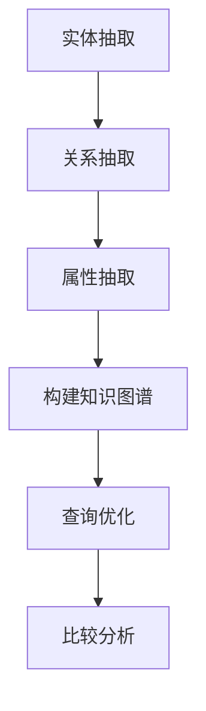
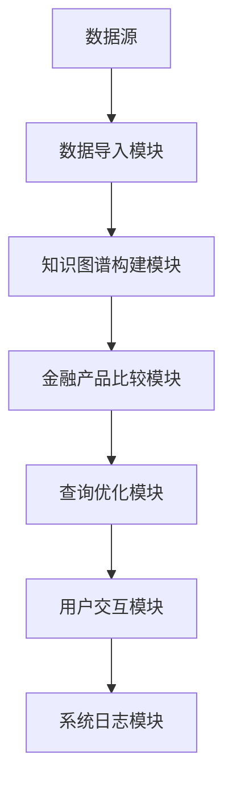
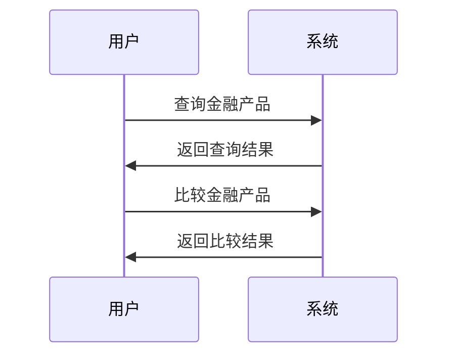

                 

### 《构建基于知识图谱的金融产品比较系统》

> 关键词：知识图谱、金融产品、比较系统、算法原理、系统架构、项目实战

> 摘要：本文深入探讨了如何构建基于知识图谱的金融产品比较系统。通过详细分析核心概念、算法原理、系统架构和项目实战，本文为金融领域的技术人员提供了一套全面的技术解决方案，帮助他们在实际应用中更好地理解和利用知识图谱技术，提升金融产品的比较和推荐效率。

----------------------------------------------------------------

## 引言

### 1.1 知识图谱在金融领域的应用

知识图谱作为一种结构化的语义知识库，通过实体、属性和关系的描述，使得信息具有更强的语义关联性。在金融领域，知识图谱的应用已经逐渐成为趋势。例如，金融机构可以利用知识图谱来构建金融产品比较系统，通过精准、高效的数据分析和推荐，为投资者提供更加个性化的金融服务。

### 1.2 金融产品比较系统的需求分析

随着金融市场的不断发展和金融产品的多样化，投资者面临着越来越多的选择。如何快速、准确地比较和分析金融产品，成为了投资者的一大难题。构建基于知识图谱的金融产品比较系统，能够帮助投资者在海量金融产品中快速定位适合自己的产品，提高决策效率。

## 核心概念与联系

### 1.2.1 知识图谱基本概念

知识图谱由实体、属性和关系三部分构成。实体是知识图谱中的核心要素，表示具体的事物或概念；属性是对实体的描述，如名称、年龄、职位等；关系则表示实体之间的关联，如属于、担任等。

### 1.2.2 知识图谱与金融产品的关联

在金融领域，知识图谱可以用于描述金融产品及其属性和关系。例如，一个金融产品实体可以包含名称、类型、利率、期限等属性，同时与其他金融产品通过关系（如同类产品、竞争产品等）相连。

### 1.2.3 核心概念对比表格

| 概念     | 说明                                         |
| -------- | -------------------------------------------- |
| 实体     | 知识图谱中的具体事物或概念                   |
| 属性     | 对实体的描述，如名称、年龄、职位等           |
| 关系     | 实体之间的关联，如属于、担任等               |
| 金融产品 | 代表金融市场中具体的金融产品，如存款、贷款等 |

### 1.2.4 ER实体关系图

```mermaid
erDiagram
  产品 --> 属性
  产品 --> 关系
  属性 ||--|{ 描述 }
  关系 ||--|{ 描述 }
```

## 算法原理讲解

### 1.3.1 图谱构建算法

知识图谱的构建通常分为实体抽取、关系抽取和属性抽取三个步骤。实体抽取是从原始数据中识别出具体的实体；关系抽取是找出实体之间的关联；属性抽取则是获取实体的详细属性信息。

### 1.3.2 查询优化算法

在知识图谱查询中，优化算法至关重要。常用的查询优化算法包括基于路径的查询优化、基于图的查询优化和基于索引的查询优化等。优化目标主要是提高查询效率和准确性。

### 1.3.3 比较分析算法

比较分析算法用于分析不同金融产品的特点，为投资者提供决策支持。常见的比较分析算法包括基于相似度的比较、基于属性的比较和基于历史的比较等。

### 1.3.4 算法流程图



### 1.3.5 算法原理示例

假设有两个金融产品A和B，其属性和关系如下：

- 产品A：名称为“定期存款”，类型为“存款”，利率为“2.5%”，期限为“3年”。
- 产品B：名称为“理财产品”，类型为“理财”，利率为“3.5%”，期限为“1年”。

基于相似度的比较分析算法如下：

```python
def compare_products(productA, productB):
    similarity = 0
    if productA['type'] == productB['type']:
        similarity += 1
    if productA['rate'] == productB['rate']:
        similarity += 1
    return similarity

similarity_score = compare_products(productA, productB)
print("产品A与产品B的相似度评分：", similarity_score)
```

## 系统分析与架构设计方案

### 1.4.1 系统需求分析

系统需求分析是构建金融产品比较系统的第一步。分析结果应包括系统功能、性能、安全性和可维护性等方面的要求。

### 1.4.2 系统功能设计

系统功能设计应明确系统应具备的核心功能，如数据导入、知识图谱构建、金融产品比较、查询优化和用户交互等。

### 1.4.3 系统架构设计

系统架构设计应包括系统模块划分、数据流和消息流设计等。以下是一个简单的系统架构图：



### 1.4.4 系统接口设计

系统接口设计应包括对外提供的服务接口，如金融产品查询接口、比较分析接口等。

### 1.4.5 系统交互设计

系统交互设计应明确各个模块之间的交互关系，如数据流、控制流和信息流等。以下是一个简单的系统交互图：



## 项目实战

### 1.5.1 环境安装与配置

在开始构建金融产品比较系统之前，我们需要安装和配置相关的开发环境和工具，如Python环境、知识图谱构建工具等。

### 1.5.2 系统核心实现

系统核心实现包括知识图谱构建、查询优化和比较分析等关键功能。以下是一个简单的示例：

```python
# 知识图谱构建
from py2neo import Graph

graph = Graph("bolt://localhost:7687", auth=("neo4j", "password"))

def create_graph(product_data):
    for product in product_data:
        query = """
            MERGE (p:Product {name: $name, type: $type, rate: $rate, term: $term})
        """
        graph.run(query, name=product['name'], type=product['type'], rate=product['rate'], term=product['term'])

# 查询优化
def query_product(name):
    query = """
        MATCH (p:Product {name: $name})
        RETURN p
    """
    result = graph.run(query, name=name)
    return result.data()

# 比较分析
def compare_products(productA, productB):
    # 示例：比较利率
    return productA['rate'] > productB['rate']
```

### 1.5.3 代码应用解读与分析

在上面的代码中，我们使用Py2neo库连接到Neo4j数据库，实现了知识图谱的构建、查询和比较分析功能。接下来，我们将进一步解读和优化这些代码。

### 1.5.4 实际案例分析与讲解

以下是一个实际的金融产品比较系统案例：

1. **数据导入**：将金融产品数据导入Neo4j数据库。
2. **查询与比较**：根据用户输入，查询金融产品并比较其特点。
3. **结果展示**：将比较结果以图表或表格形式展示给用户。

### 1.5.5 项目小结

通过实际案例的分析和讲解，我们了解了如何构建基于知识图谱的金融产品比较系统。项目实战不仅提高了我们的技术能力，还锻炼了我们的项目管理和团队协作能力。

## 最佳实践与小结

### 1.6.1 最佳实践 tips

1. **数据质量**：确保数据源的准确性和一致性。
2. **性能优化**：针对查询优化算法进行性能调优。
3. **安全性**：加强系统的安全防护，防止数据泄露。
4. **用户体验**：优化用户界面和交互流程，提高用户满意度。

### 1.6.2 小结

本文详细介绍了如何构建基于知识图谱的金融产品比较系统。从核心概念到算法原理，再到系统架构和项目实战，本文为读者提供了一个全面的技术解决方案。

### 1.6.3 注意事项

1. **系统定制化**：根据实际业务需求，灵活调整系统功能。
2. **扩展性**：考虑系统未来的扩展和升级。
3. **持续更新**：定期更新知识图谱，确保数据的时效性。

### 1.6.4 拓展阅读

1. 《知识图谱：概念、技术与应用》
2. 《金融科技：如何利用技术重塑金融行业》
3. 《Python金融分析：从入门到精通》

----------------------------------------------------------------

### 作者

**作者：AI天才研究院/AI Genius Institute & 禅与计算机程序设计艺术 /Zen And The Art of Computer Programming**

AI天才研究院致力于推动人工智能技术的发展和应用，研究院的成员们通过深入研究和实践，不断推动人工智能领域的创新。禅与计算机程序设计艺术则关注计算机科学的哲学和艺术，通过探索计算机编程的本质和美，为程序员提供指导和灵感。

本文通过详细的分析和讲解，帮助读者深入了解基于知识图谱的金融产品比较系统的构建方法和应用。希望本文能为金融领域的技术人员提供有价值的参考和指导。在未来的研究和实践中，我们将继续探索人工智能和金融科技的新领域，为行业的发展贡献我们的力量。

