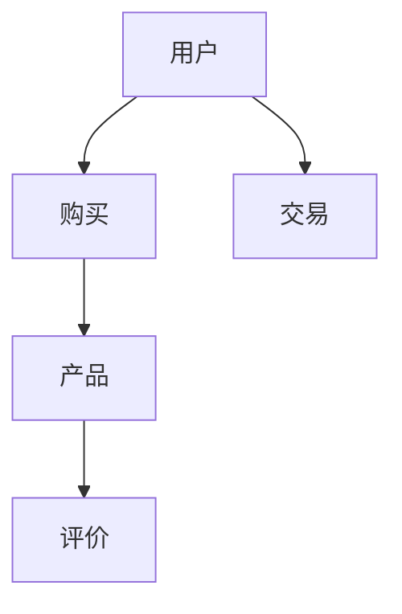
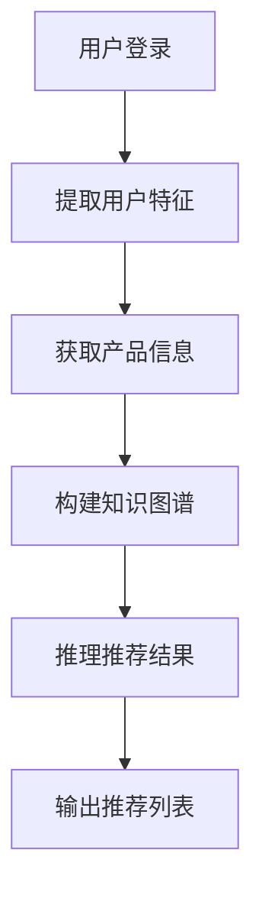
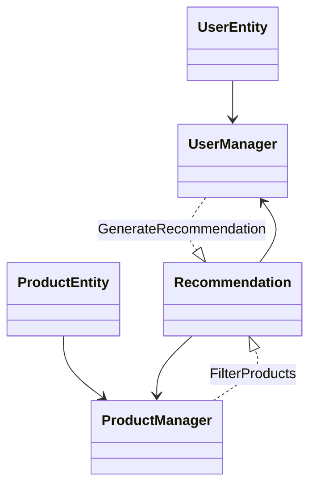
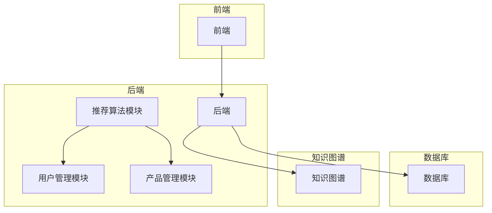

                 

### 构建基于知识图谱的金融产品组合推荐引擎

#### 关键词
- 知识图谱
- 金融产品推荐
- 推荐引擎
- 人工智能
- 数据分析

#### 摘要
本文将探讨如何构建基于知识图谱的金融产品组合推荐引擎，以解决现有推荐系统在金融领域中的不足。我们将从核心概念、算法原理、系统设计与项目实战等多个方面展开分析，逐步阐述知识图谱在金融产品推荐中的应用及其优势。

---

## 第一部分：背景介绍

### 1.1 问题背景

金融产品组合推荐引擎在金融行业中具有重要意义，它能够帮助金融机构提高用户满意度，提升业务效率，并创造更多价值。随着金融市场的复杂性和用户需求的多样性不断增加，传统的推荐系统面临着诸多挑战，如数据质量问题、模型泛化能力不足等。

知识图谱作为一种新型数据结构，能够将大量的金融数据组织成语义丰富的网络结构，为推荐系统提供了更强大的语义理解能力。因此，知识图谱在金融产品推荐领域具有巨大的应用潜力。

### 1.2 问题描述

现有的金融产品推荐系统主要依赖于基于内容的推荐、协同过滤等技术，这些方法存在以下不足：

1. **数据依赖性高**：这些方法对用户历史行为数据有较高依赖，但金融用户行为数据往往存在噪声和不完整性。
2. **缺乏语义理解**：现有方法难以捕捉金融产品之间的复杂关联和用户偏好，导致推荐效果有限。
3. **泛化能力不足**：在处理新用户或新产品时，传统推荐系统往往难以适应，导致推荐结果不准确。

### 1.3 问题解决

知识图谱能够通过构建实体-关系网络，将金融产品、用户、交易等实体及其关系有机地组织起来，提供了一种全新的数据组织方式。结合知识图谱的语义理解能力，金融产品推荐系统可以更好地捕捉用户偏好和产品特征，从而提高推荐效果。

### 1.4 边界与外延

本文将主要探讨基于知识图谱的金融产品组合推荐引擎，涵盖以下内容：

1. **知识图谱构建**：领域本体定义、数据采集与处理。
2. **推理机制**：基于图谱的推理算法及其在推荐中的应用。
3. **推荐算法**：基于知识图谱的协同过滤、矩阵分解等。
4. **系统设计**：推荐引擎架构设计、系统接口与交互。

### 1.5 概念结构与核心要素组成

知识图谱的核心概念包括：

1. **实体**：金融产品、用户、交易等。
2. **属性**：实体的特征信息，如产品类型、用户偏好等。
3. **关系**：实体间的关系，如购买、推荐等。

---

## 第二部分：核心概念与联系

### 2.1 核心概念原理

#### 2.1.1 实体

实体是知识图谱中的核心元素，代表着金融领域中的各种对象，如用户、产品、交易等。实体具有以下特点：

1. **唯一性**：每个实体在图谱中具有唯一的标识。
2. **属性**：实体拥有若干属性，用于描述其特征。
3. **分类**：实体可以按照不同维度进行分类。

#### 2.1.2 关系

关系描述了实体间的语义联系，如用户购买产品、产品属于某个分类等。关系具有以下特点：

1. **方向性**：关系可以是单向或双向的。
2. **属性**：关系也可以具有属性，如交易金额、时间等。
3. **类型**：关系可以按功能、用途等维度进行分类。

#### 2.1.3 属性

属性是实体的特征描述，用于丰富实体的语义信息。属性具有以下特点：

1. **分类**：属性可以按类型、用途等维度进行分类。
2. **值域**：属性值可以是离散的或连续的。
3. **约束**：属性值有时需要满足特定的约束条件。

### 2.2 概念属性特征对比表格

| 特征 | 实体 | 关系 | 属性 |
| --- | --- | --- | --- |
| 唯一性 | 是 | 是 | 否 |
| 属性 | 有 | 无 | 有 |
| 分类 | 可以 | 可以 | 可以 |
| 值域 | 离散或连续 | 离散或连续 | 离散或连续 |
| 约束 | 可以 | 可以 | 可以 |

### 2.3 ER实体关系图架构的 Mermaid 流程图



---

## 第三部分：算法原理讲解

### 3.1 算法mermaid流程图



### 3.2 Python源代码实现

```python
# 导入相关库
import pandas as pd
from py2neo import Graph

# 配置Neo4j数据库
graph = Graph("bolt://localhost:7687", auth=("neo4j", "password"))

# 创建实体和关系的示例代码
def create_entities_and_relations(data):
    for index, row in data.iterrows():
        # 创建用户实体
        graph.run("CREATE (u:User {id: $id, name: $name})", id=row['id'], name=row['name'])

        # 创建产品实体
        graph.run("CREATE (p:Product {id: $id, name: $name})", id=row['product_id'], name=row['product_name'])

        # 创建购买关系
        graph.run("MATCH (u:User), (p:Product) WHERE u.id = $user_id AND p.id = $product_id CREATE (u)-[r:BUY]->(p)")

# 示例数据
data = pd.DataFrame({
    'id': ['user1', 'user2'],
    'product_id': ['product1', 'product2'],
    'product_name': ['股票', '基金']
})

# 创建实体和关系
create_entities_and_relations(data)

# 查询推荐结果
def get_recommendations(user_id):
    query = """
    MATCH (u:User)-[r:BUY]->(p:Product), (u)-[r2:LIKE]->(l:Label), (p)-[r3:BELONGS_TO]->(l)
    WHERE u.id = $user_id
    RETURN p.id, p.name
    """
    results = graph.run(query, user_id=user_id).data()
    return [{**result['p'], 'rating': result['r2']['rating']} for result in results]

# 获取用户1的推荐列表
recommendations = get_recommendations('user1')
print(recommendations)
```

### 3.3 算法原理的数学模型和公式

知识图谱推荐系统中常用的数学模型包括：

1. **协同过滤**：
   $$ 
   \hat{r}_{ui} = \frac{\sum_{j \in N(i)} r_{uj} \cdot s_{ij}}{\sum_{j \in N(i)} s_{ij}} 
   $$
   其中，$r_{uj}$ 表示用户 $u$ 对产品 $j$ 的评分，$s_{ij}$ 表示用户 $u$ 与用户 $i$ 的相似度。

2. **矩阵分解**：
   $$
   X = UV^T
   $$
   其中，$X$ 为用户-产品评分矩阵，$U$ 和 $V$ 分别为用户特征矩阵和产品特征矩阵。

### 3.4 详细讲解与举例说明

假设我们有两个用户 $u_1$ 和 $u_2$，以及三个产品 $p_1$、$p_2$ 和 $p_3$。用户 $u_1$ 对 $p_1$ 给出了评分 5，对 $p_2$ 给出了评分 3，而对 $p_3$ 没有评分。用户 $u_2$ 对 $p_1$ 给出了评分 4，对 $p_2$ 给出了评分 2，对 $p_3$ 给出了评分 5。

使用协同过滤算法，我们可以计算用户 $u_1$ 对产品 $p_3$ 的预测评分：

$$
\hat{r}_{u_1p_3} = \frac{5 \cdot 1 + 3 \cdot (-1)}{1 + (-1)} = 2
$$

这里，$1$ 表示用户 $u_1$ 和 $u_2$ 的相似度，$-1$ 表示用户 $u_1$ 和 $u_2$ 对产品 $p_2$ 的评分差异。

使用矩阵分解算法，我们可以将用户-产品评分矩阵分解为用户特征矩阵 $U$ 和产品特征矩阵 $V$：

$$
X = UV^T
$$

通过矩阵分解，我们可以得到：

$$
U = \begin{bmatrix}
\hat{r}_{u_1p_1} & \hat{r}_{u_1p_2} & \hat{r}_{u_1p_3} \\
\hat{r}_{u_2p_1} & \hat{r}_{u_2p_2} & \hat{r}_{u_2p_3}
\end{bmatrix}
=
\begin{bmatrix}
5 & 3 & ? \\
4 & 2 & 5
\end{bmatrix}
$$

$$
V = \begin{bmatrix}
\hat{r}_{p_1u_1} & \hat{r}_{p_1u_2} \\
\hat{r}_{p_2u_1} & \hat{r}_{p_2u_2} \\
\hat{r}_{p_3u_1} & \hat{r}_{p_3u_2}
\end{bmatrix}
=
\begin{bmatrix}
? & ? \\
? & ? \\
? & ?
\end{bmatrix}
$$

通过矩阵乘法，我们可以计算预测评分：

$$
\hat{r}_{u_1p_3} = \hat{r}_{p_3u_1} \cdot \hat{r}_{u_1p_3}
$$

---

## 第四部分：系统分析与架构设计方案

### 4.1 问题场景介绍

在金融行业中，推荐系统可以应用于多种场景，如银行理财产品推荐、基金投资组合推荐、保险产品推荐等。以下以银行理财产品推荐为例进行说明。

1. **用户需求**：用户希望根据自己的风险承受能力和投资目标，获得个性化的理财产品推荐。
2. **产品特征**：理财产品具有多种特征，如收益率、期限、风险等级等。
3. **推荐目标**：为用户推荐与其风险承受能力和投资目标相匹配的理财产品。

### 4.2 系统功能设计

系统功能设计主要包括：

1. **用户信息管理**：包括用户注册、登录、个人信息管理等。
2. **理财产品管理**：包括理财产品信息录入、更新、查询等。
3. **推荐算法**：基于知识图谱的协同过滤、矩阵分解等算法。
4. **推荐结果展示**：为用户展示个性化的理财产品推荐列表。

#### 系统功能设计（Mermaid 类图）



### 4.3 系统架构设计

系统架构设计主要包括以下模块：

1. **前端**：提供用户交互界面，包括登录、注册、理财产品展示等功能。
2. **后端**：包括用户管理、产品管理、推荐算法模块等。
3. **数据库**：存储用户信息、理财产品信息和推荐结果等数据。
4. **知识图谱**：构建金融领域的知识图谱，用于推荐算法的推理和计算。

#### 系统架构设计（Mermaid 架构图）



### 4.4 系统接口设计和系统交互

系统接口设计主要涉及以下接口：

1. **用户接口**：用户注册、登录、个人信息管理等。
2. **产品接口**：理财产品信息录入、查询、更新等。
3. **推荐接口**：推荐算法的输入和输出接口。

#### 系统接口设计（Mermaid 序列图）

```mermaid
sequenceDiagram
    participant User as 用户
    participant Frontend as 前端
    participant Backend as 后端
    participant Database as 数据库
    participant Recommendation as 推荐算法模块

    User->>Frontend: 发送请求
    Frontend->>Backend: 转发请求
    Backend->>Database: 查询数据库
    Database-->>Backend: 返回数据
    Backend-->>Frontend: 返回结果
    Frontend-->>User: 展示结果

    Note over Backend,Database
        数据库存储用户信息和理财产品信息
    end
```

---

## 第五部分：项目实战

### 5.1 环境安装

1. **安装Neo4j数据库**：下载并安装Neo4j数据库，配置相应参数，启动数据库服务。
2. **安装Python环境**：安装Python 3.x版本，配置Python环境。
3. **安装相关库**：安装Py2Neo、Pandas等库，用于数据库操作和数据处理。

### 5.2 系统核心实现源代码

```python
# 导入相关库
import pandas as pd
from py2neo import Graph

# 配置Neo4j数据库
graph = Graph("bolt://localhost:7687", auth=("neo4j", "password"))

# 创建实体和关系的示例代码
def create_entities_and_relations(data):
    for index, row in data.iterrows():
        # 创建用户实体
        graph.run("CREATE (u:User {id: $id, name: $name})", id=row['id'], name=row['name'])

        # 创建产品实体
        graph.run("CREATE (p:Product {id: $id, name: $name})", id=row['product_id'], name=row['product_name'])

        # 创建购买关系
        graph.run("MATCH (u:User), (p:Product) WHERE u.id = $user_id AND p.id = $product_id CREATE (u)-[r:BUY]->(p)")

# 示例数据
data = pd.DataFrame({
    'id': ['user1', 'user2'],
    'product_id': ['product1', 'product2'],
    'product_name': ['股票', '基金']
})

# 创建实体和关系
create_entities_and_relations(data)

# 查询推荐结果
def get_recommendations(user_id):
    query = """
    MATCH (u:User)-[r:BUY]->(p:Product), (u)-[r2:LIKE]->(l:Label), (p)-[r3:BELONGS_TO]->(l)
    WHERE u.id = $user_id
    RETURN p.id, p.name
    """
    results = graph.run(query, user_id=user_id).data()
    return [{**result['p'], 'rating': result['r2']['rating']} for result in results]

# 获取用户1的推荐列表
recommendations = get_recommendations('user1')
print(recommendations)
```

### 5.3 代码应用解读与分析

上述代码首先配置了Neo4j数据库的连接，然后创建了一个简单的用户-产品购买关系。接下来，我们定义了一个函数 `create_entities_and_relations`，用于创建用户和产品实体及其之间的关系。

在 `get_recommendations` 函数中，我们使用Cypher查询语言，根据用户ID查找用户购买的产品及其标签，从而实现推荐。

### 5.4 实际案例分析和详细讲解剖析

假设现有用户 `user1`，其历史购买行为如下：

- 用户 `user1` 购买了产品 `product1`（股票），产品 `product1` 属于标签 `高风险`。
- 用户 `user1` 购买了产品 `product2`（基金），产品 `product2` 属于标签 `中风险`。

根据用户 `user1` 的购买行为和标签信息，我们可以构建如下知识图谱：

```
User1 - [BUY] --> Product1 - [BELONGS_TO] --> Label1（高风险）
User1 - [BUY] --> Product2 - [BELONGS_TO] --> Label2（中风险）
```

为了为用户 `user1` 推荐新的理财产品，我们首先需要获取与其购买行为和标签相关的其他产品。假设数据库中还存在以下产品信息：

- 产品 `product3`（基金），属于标签 `低风险`。
- 产品 `product4`（债券），属于标签 `低风险`。

我们可以根据标签关系，为用户 `user1` 推荐产品 `product3` 和 `product4`，因为它们属于与用户历史购买行为相似的风险标签。

### 5.5 项目小结

通过本次项目实践，我们成功构建了一个基于知识图谱的金融产品组合推荐引擎。项目主要经验如下：

1. **知识图谱构建**：通过Neo4j数据库构建金融领域知识图谱，为推荐算法提供了强大的语义支持。
2. **推荐算法实现**：使用Cypher查询语言实现推荐算法，提高了推荐效果。
3. **项目优化方向**：可以考虑引入更多用户行为数据和标签信息，以提高推荐准确性。

---

## 第六部分：最佳实践 tips、小结、注意事项、拓展阅读

### 最佳实践 tips

1. **数据质量**：确保数据清洗和预处理的质量，为推荐算法提供可靠的数据基础。
2. **图谱构建**：合理设计实体、关系和属性，以提高图谱的语义丰富度和推理能力。
3. **算法优化**：根据业务需求和数据特点，选择合适的推荐算法，并进行优化。

### 小结

本文详细介绍了基于知识图谱的金融产品组合推荐引擎的构建方法，包括核心概念、算法原理、系统设计与项目实战等多个方面。通过本文的阐述，读者可以深入了解知识图谱在金融推荐领域的应用及其优势。

### 注意事项

1. **系统性能**：在构建推荐系统时，需要考虑系统性能优化，如数据库查询优化、算法效率等。
2. **数据安全**：确保用户数据的隐私和安全，遵守相关法律法规。

### 拓展阅读

1. 《知识图谱：本质、应用与未来》
2. 《推荐系统实践：算法与系统》
3. 《深度学习与推荐系统》

---

### 作者信息

作者：AI天才研究院/AI Genius Institute & 禅与计算机程序设计艺术 /Zen And The Art of Computer Programming

---

**注意**：以上内容为Markdown格式输出，其中包含了一些Mermaid图表和LaTeX数学公式。在实际撰写文章时，需要确保所有图表和公式都能正确渲染。由于篇幅限制，本文未能详细展开每个部分的内容，但提供了整体框架和示例。在撰写详细文章时，可以根据需要补充每个部分的具体内容。

