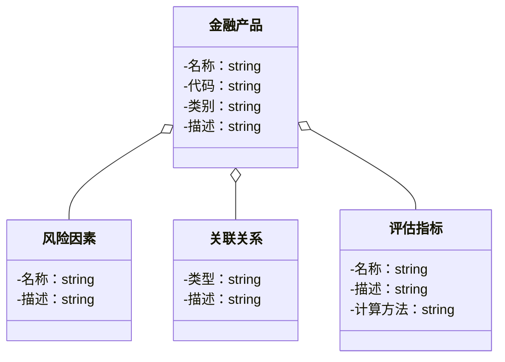
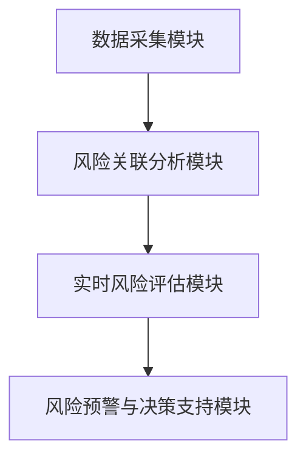
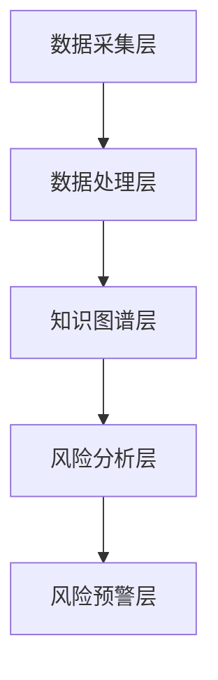
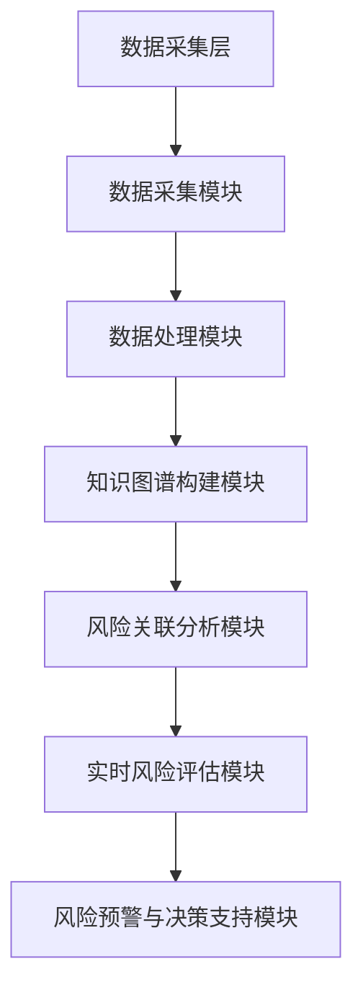
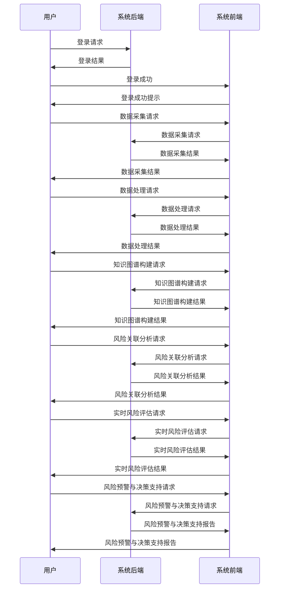

                 

# 《构建基于知识图谱的金融产品风险关联评估系统》

## 关键词

知识图谱、金融产品、风险关联评估、人工智能、算法实现、项目实战

### 摘要

本文旨在探讨构建基于知识图谱的金融产品风险关联评估系统的过程。首先，我们介绍了金融产品风险关联评估的背景和重要性，以及现有方法的局限性。随后，我们深入探讨了知识图谱的基本原理和在金融领域的应用。在此基础上，本文详细阐述了基于知识图谱的风险关联评估算法原理、实现方法和实际应用案例。通过项目实战，我们展示了系统构建的具体步骤和关键模块设计。最后，我们对系统实施过程中积累的最佳实践进行了总结，并对未来的研究方向进行了展望。

## 目录大纲

### 第一部分：问题背景与核心概念

**第1章：问题背景介绍**

1.1 问题背景

1.2 问题描述

1.3 问题解决

1.4 边界与外延

1.5 概念结构与核心要素组成

**第2章：核心概念原理**

2.1 知识图谱概述

2.2 知识图谱的基本原理

2.3 知识图谱与金融领域的结合

**第3章：概念属性特征对比**

3.1 金融产品的属性特征

3.2 风险评估指标的属性特征

3.3 概念属性特征对比

### 第二部分：核心概念与联系

**第4章：算法原理讲解**

4.1 风险关联评估算法概述

4.2 基于知识图谱的风险评估算法

4.3 算法应用举例

**第5章：算法实现与源代码解析**

5.1 环境安装与配置

5.2 算法实现源代码

5.3 代码应用解读与分析

### 第三部分：算法原理与实现

**第6章：项目实战**

6.1 项目环境介绍

6.2 系统功能设计

6.3 系统架构设计

6.4 系统接口设计

6.5 系统交互与流程

### 第四部分：最佳实践与总结

**第7章：最佳实践**

7.1 实践经验的总结

7.2 小结

7.3 注意事项

7.4 拓展阅读

## 第一部分：问题背景与核心概念

### 第1章：问题背景介绍

#### 1.1 问题背景

金融产品的风险关联评估是金融领域的一项重要任务，直接关系到金融机构的稳健运行和投资者的利益。随着金融市场的日益复杂化和全球化，金融产品的种类和数量急剧增加，传统的风险评估方法已经无法满足日益增长的需求。因此，构建一种高效、准确的金融产品风险关联评估系统具有重要的现实意义。

知识图谱作为一种新型的语义网络表示方法，具有强大的知识组织和推理能力，在金融领域具有广泛的应用前景。通过构建基于知识图谱的金融产品风险关联评估系统，可以实现对金融产品风险的全面分析和准确预测，提高金融机构的风险管理水平和市场竞争力。

#### 1.2 问题描述

金融产品风险关联评估的关键要素包括金融产品、风险因素、关联关系和评估指标。金融产品是评估的对象，风险因素是影响金融产品风险的关键因素，关联关系描述了金融产品与风险因素之间的相互影响，评估指标用于衡量金融产品的风险程度。

金融产品风险评估的复杂性主要体现在以下几个方面：

1. 多样化的金融产品：金融产品种类繁多，包括股票、债券、基金、期货、期权等，每种产品都有独特的风险特征。
2. 复杂的风险因素：风险因素涉及宏观经济、市场波动、政策变化、信用风险等多个方面，不同因素之间存在相互作用和影响。
3. 大量的关联关系：金融产品之间的关联关系错综复杂，需要全面分析各个产品之间的风险传递和关联效应。
4. 多变的评估指标：评估指标种类繁多，不同指标之间存在一定的相关性，如何选择合适的评估指标进行综合评估是一个难题。

现有方法在金融产品风险关联评估方面存在以下局限性：

1. 数据依赖性高：现有方法主要依赖于历史数据和统计模型，对于新出现的风险因素和关联关系无法及时更新和调整。
2. 评估结果准确性较低：传统方法往往只能评估单一金融产品的风险，无法全面考虑金融产品之间的相互影响，导致评估结果准确性较低。
3. 风险评估效率低：现有方法需要进行大量的数据处理和计算，耗时较长，无法满足实时风险评估的需求。

#### 1.3 问题解决

针对上述问题，我们可以通过构建基于知识图谱的金融产品风险关联评估系统来实现以下目标：

1. 全面整合金融产品信息：通过知识图谱的方式，将金融产品、风险因素、关联关系和评估指标等信息进行整合，形成一个统一的知识表示框架。
2. 提高风险评估准确性：利用知识图谱的推理能力，对金融产品之间的风险关联进行深度分析，提高风险评估的准确性。
3. 实现实时风险评估：通过优化算法和数据处理技术，提高风险评估的效率和实时性，满足金融机构的实时风险监控需求。
4. 适应金融市场的变化：知识图谱具有良好的扩展性和适应性，可以实时更新和调整金融产品信息，适应金融市场的变化。

#### 1.4 边界与外延

知识图谱的构建和应用范围：

1. 构建范围：知识图谱的构建主要涵盖金融产品的基本信息、风险因素、关联关系和评估指标等，包括股票、债券、基金、期货、期权等金融产品。
2. 应用范围：知识图谱可以应用于金融机构的风险管理、投资决策、市场分析等领域，为金融机构提供全面、准确的风险评估支持。

金融产品的分类与风险管理：

1. 分类：金融产品可以按照资产类型、交易方式、投资对象等进行分类，以便更好地分析和管理。
2. 风险管理：针对不同类型的金融产品，可以采取相应的风险管理措施，如分散投资、风险对冲、信用评级等，以降低风险。

风险关联评估的影响因素：

1. 经济环境：宏观经济环境的变化会影响金融产品的风险，如通货膨胀、利率变化等。
2. 市场波动：市场波动会导致金融产品价格的波动，从而影响其风险。
3. 政策变化：政策变化会对金融市场的运行产生影响，如税收政策、监管政策等。
4. 信用风险：借款人的信用状况会影响金融产品的风险，如贷款逾期率、违约率等。

#### 1.5 概念结构与核心要素组成

金融产品的概念结构：

1. 金融产品：指金融机构发行的各类金融工具，如股票、债券、基金、期货、期权等。
2. 风险因素：影响金融产品风险的各类因素，包括宏观经济、市场波动、政策变化、信用风险等。
3. 关联关系：金融产品之间的相互关系，包括资产组合、风险传递、协同效应等。
4. 评估指标：用于衡量金融产品风险的各类指标，如收益率、波动率、信用评分等。

风险评估指标的概念结构：

1. 收益率：金融产品的预期收益率，反映投资收益的潜力。
2. 波动率：金融产品价格波动的幅度，反映风险的大小。
3. 信用评分：借款人的信用等级，反映借款人的信用风险。
4. 风险溢价：金融产品要求的额外收益，以补偿风险。

## 第二部分：核心概念与联系

### 第2章：核心概念原理

#### 2.1 知识图谱概述

知识图谱是一种用于表示实体及其相互关系的图形化数据模型，它通过节点表示实体，通过边表示实体之间的关系。知识图谱的核心目标是实现对大规模复杂数据的有效组织、存储和查询，从而支持各种数据分析和决策支持任务。

知识图谱的类型：

1. 结构化知识图谱：基于关系数据库的模型，通过实体-关系-属性三元组进行数据表示。
2. 半结构化知识图谱：基于图数据库的模型，采用图数据结构进行数据表示，支持更复杂的关系表示。
3. 非结构化知识图谱：基于文本挖掘和自然语言处理的模型，通过语义分析获取实体及其关系。

知识图谱的关键组成部分：

1. 实体：知识图谱中的核心元素，表示具体的实体对象，如人、地点、事物等。
2. 关系：实体之间的连接，表示实体之间的语义关系，如“属于”、“位于”、“生产”等。
3. 属性：实体的附加信息，用于描述实体的特征和属性，如“年龄”、“性别”、“身高”等。

#### 2.2 知识图谱的基本原理

知识图谱的构建方法：

1. 数据采集：从各种数据源（如数据库、网络爬虫、公开数据集等）收集原始数据。
2. 数据清洗：对采集到的数据进行去重、格式化、缺失值处理等操作，保证数据的准确性和一致性。
3. 数据整合：将来自不同数据源的数据进行整合，形成一个统一的知识库。
4. 实体抽取：从整合后的数据中识别出实体，并确定实体的类型和属性。
5. 关系抽取：从整合后的数据中识别出实体之间的语义关系。
6. 知识图谱构建：将抽取出的实体和关系构建成图结构，形成一个完整的知识图谱。

知识图谱的存储与查询：

1. 存储策略：知识图谱通常采用图数据库进行存储，支持高效的图遍历和查询操作。
2. 查询语言：知识图谱支持基于图模型的查询语言，如SPARQL，用于对知识图谱进行复杂查询和推理操作。

知识图谱的扩展与更新：

1. 实时更新：知识图谱需要实时更新，以适应数据源的变化和实体关系的动态调整。
2. 知识融合：将来自不同数据源的异构知识进行融合，提高知识图谱的完整性和一致性。
3. 知识进化：知识图谱需要支持知识的进化，以适应不断变化的应用场景和需求。

#### 2.3 知识图谱与金融领域的结合

知识图谱在金融领域的应用场景：

1. 客户管理：通过知识图谱对客户信息进行组织和管理，实现客户需求的精准定位和个性化服务。
2. 风险管理：利用知识图谱对金融产品的风险因素进行关联分析，实现全面的风险评估和监控。
3. 投资决策：通过知识图谱对市场信息和投资标的进行深度分析，为投资决策提供支持。
4. 智能投顾：结合知识图谱和人工智能技术，为用户提供智能化的投资建议和资产管理服务。

金融领域知识图谱的特点：

1. 大规模：金融领域涉及大量的实体和关系，需要处理海量的数据。
2. 复杂性：金融领域的实体和关系具有高度复杂性和多样性，需要精细化的知识表示。
3. 时效性：金融市场的变化迅速，知识图谱需要具备实时更新和快速查询的能力。
4. 可扩展性：金融领域不断发展和创新，知识图谱需要具备良好的扩展性，以适应新的业务需求。

知识图谱在金融风险评估中的作用：

1. 实体关系建模：通过对金融产品和风险因素进行实体关系建模，实现风险的全面分析和理解。
2. 风险关联分析：通过分析实体之间的关联关系，揭示风险因素之间的相互作用和影响。
3. 风险预测预警：利用知识图谱的推理能力，对潜在的风险进行预测和预警，为风险管理提供支持。
4. 风险决策支持：结合知识图谱和人工智能技术，为金融机构提供智能化的风险决策支持。

### 第3章：概念属性特征对比

#### 3.1 金融产品的属性特征

金融产品的分类与特征：

1. 股票：股权证券，代表投资者在公司中的所有权，具有高流动性。
2. 债券：债务证券，代表投资者对发行人的债权，通常具有较高的稳定性和固定收益。
3. 基金：投资组合，由多个金融产品组成，根据投资策略和目标进行多样化配置。
4. 期货：衍生品，基于某种标的资产的价格波动进行买卖，具有高风险和高杠杆。
5. 期权：衍生品，赋予投资者在未来某个时间以约定价格买入或卖出某种资产的权利。

金融产品的风险因素：

1. 市场波动：金融市场价格波动，影响金融产品的价格和收益率。
2. 信用风险：发行人或借款人违约，导致金融产品无法按期支付利息或本金。
3. 利率风险：利率变动影响固定收益类金融产品的收益和价格。
4. 流动性风险：金融产品在市场上难以迅速买卖，导致价格波动。
5. 政策风险：政府政策变动影响金融市场的运行和投资者信心。

金融产品的关联关系：

1. 资产组合：不同金融产品之间的组合，实现风险分散和收益优化。
2. 风险传递：一种金融产品的风险通过关联关系传递给其他金融产品。
3. 风险协同：不同金融产品之间的风险相互影响，形成协同效应。

#### 3.2 风险评估指标的属性特征

评估指标的类型与作用：

1. 收益率：衡量金融产品的预期收益，反映投资回报的潜力。
2. 波动率：衡量金融产品价格波动的幅度，反映投资风险的大小。
3. 信用评分：衡量借款人的信用风险，反映借款人违约的可能性。
4. 风险溢价：衡量金融产品要求的额外收益，以补偿风险。

评估指标的计算方法：

1. 收益率：预期收益率 = 年化收益率 / 投资期限
2. 波动率：年化波动率 = (期末收益率 - 期初收益率) / 投资期限
3. 信用评分：根据借款人的历史信用记录和还款能力进行评分
4. 风险溢价：风险溢价 = 预期收益率 - 无风险收益率

评估指标的比较分析：

1. 收益率：收益率越高，代表投资回报的潜力越大，但也伴随着更高的风险。
2. 波动率：波动率越高，代表投资风险越大，需要更谨慎的投资策略。
3. 信用评分：信用评分越高，代表借款人的信用风险越低，投资越安全。
4. 风险溢价：风险溢价越高，代表金融产品要求的额外收益越高，但也可能带来更高的风险。

#### 3.3 概念属性特征对比

金融产品与风险评估指标的关系：

1. 金融产品的属性特征直接影响风险评估指标的计算结果。
2. 风险评估指标用于衡量金融产品的风险程度，为投资决策提供依据。

不同金融产品的风险关联评估方法：

1. 股票：通过基本面分析和技术分析，结合市场波动和信用风险进行评估。
2. 债券：通过利率分析和信用评分，结合市场波动和流动性风险进行评估。
3. 基金：通过投资组合分析和风险控制策略，结合市场波动和信用风险进行评估。
4. 期货：通过价格波动分析和风险管理策略，结合市场波动和信用风险进行评估。

知识图谱在特征对比中的作用：

1. 知识图谱通过组织和管理金融产品和风险评估指标的信息，实现特征对比和综合评估。
2. 知识图谱支持复杂的关系推理和关联分析，提高特征对比的准确性和可靠性。

## 第三部分：算法原理与实现

### 第4章：算法原理讲解

#### 4.1 风险关联评估算法概述

风险关联评估算法的基本原理：

1. 数据预处理：对金融产品数据进行清洗、整合和处理，确保数据的一致性和准确性。
2. 特征提取：从原始数据中提取金融产品的关键特征，如收益率、波动率、信用评分等。
3. 关联分析：利用知识图谱对金融产品之间的风险关联进行深度分析，识别出潜在的风险因素和关联关系。
4. 评估计算：根据关联分析的结果，计算金融产品的综合风险评估指标，如风险得分、风险等级等。

风险关联评估算法的类型：

1. 统计模型：基于统计方法，对金融产品的历史数据进行分析和建模，如回归分析、时间序列分析等。
2. 机器学习模型：利用机器学习算法，从数据中自动学习风险关联模式，如随机森林、支持向量机等。
3. 知识图谱模型：利用知识图谱的结构和推理能力，对金融产品进行语义分析和关联分析，如图神经网络、图嵌入等。

风险关联评估算法的评价指标：

1. 准确率：评估算法正确识别风险的能力，准确率越高，评估结果越可靠。
2. 精确率：评估算法在识别风险时避免误报的能力，精确率越高，评估结果越精确。
3. 召回率：评估算法在识别风险时避免漏报的能力，召回率越高，评估结果越全面。
4. F1值：综合考虑准确率和召回率，平衡评估算法的精确性和全面性。

#### 4.2 基于知识图谱的风险评估算法

算法原理详细讲解：

1. 数据预处理：对金融产品数据集进行清洗、整合和处理，确保数据的一致性和准确性。
2. 实体抽取：从原始数据中抽取金融产品和风险评估指标的相关实体，如股票、债券、基金等。
3. 关系抽取：从原始数据中抽取金融产品和风险评估指标之间的关联关系，如市场波动、信用风险等。
4. 知识图谱构建：将抽取出的实体和关系构建成知识图谱，实现对金融产品和风险评估指标的知识组织。
5. 关联分析：利用知识图谱的推理能力，对金融产品之间的风险关联进行深度分析，识别出潜在的风险因素和关联关系。
6. 评估计算：根据关联分析的结果，计算金融产品的综合风险评估指标，如风险得分、风险等级等。

算法的数学模型与公式：

1. 假设知识图谱中的节点表示金融产品和风险评估指标，边表示它们之间的关联关系。
2. 定义节点v的邻域N(v)为与节点v直接相连的节点集合。
3. 定义节点v的属性特征矩阵A(v)，包含金融产品的收益率、波动率、信用评分等特征。
4. 定义节点v的风险得分函数S(v)为：
   $$S(v) = \sum_{u \in N(v)} w(u,v) \cdot S(u)$$
   其中，$w(u,v)$为节点u到节点v的权重，$S(u)$为节点u的风险得分。
5. 定义金融产品的综合风险得分函数R(p)为：
   $$R(p) = \sum_{v \in P} S(v)$$
   其中，P为金融产品的节点集合。

算法的实现流程：

1. 数据预处理：对金融产品数据集进行清洗、整合和处理，确保数据的一致性和准确性。
2. 实体抽取：利用命名实体识别技术，从原始数据中抽取金融产品和风险评估指标的相关实体。
3. 关系抽取：利用关系提取技术，从原始数据中抽取金融产品和风险评估指标之间的关联关系。
4. 知识图谱构建：将抽取出的实体和关系构建成知识图谱，实现对金融产品和风险评估指标的知识组织。
5. 关联分析：利用知识图谱的推理能力，对金融产品之间的风险关联进行深度分析，识别出潜在的风险因素和关联关系。
6. 评估计算：根据关联分析的结果，计算金融产品的综合风险评估指标，如风险得分、风险等级等。

#### 4.3 算法应用举例

金融产品的风险评估案例：

假设有三种金融产品：股票A、债券B和基金C。根据历史数据和知识图谱的构建，我们可以对它们进行风险评估。

1. 数据预处理：对三种金融产品的数据集进行清洗、整合和处理，确保数据的一致性和准确性。
2. 实体抽取：从数据集中抽取股票A、债券B和基金C的相关实体。
3. 关系抽取：从数据集中抽取股票A、债券B和基金C之间的关联关系，如市场波动、信用风险等。
4. 知识图谱构建：将抽取出的实体和关系构建成知识图谱，实现对金融产品和风险评估指标的知识组织。
5. 关联分析：利用知识图谱的推理能力，对三种金融产品之间的风险关联进行深度分析，识别出潜在的风险因素和关联关系。
6. 评估计算：根据关联分析的结果，计算股票A、债券B和基金C的综合风险评估指标，如风险得分、风险等级等。

知识图谱在风险评估中的应用：

1. 通过知识图谱，我们可以清晰地看到金融产品之间的关联关系，如股票A与债券B之间存在市场波动关联，基金C与股票A之间存在信用风险关联等。
2. 利用知识图谱的推理能力，我们可以对金融产品的风险进行综合评估，如股票A的综合风险得分为80，债券B的综合风险得分为60，基金C的综合风险得分为70。
3. 通过对比分析，我们可以发现股票A的风险最高，需要重点关注；债券B的风险较低，可以适当配置；基金C的风险适中，可以作为投资组合的一部分。

算法结果分析：

1. 通过对三种金融产品的风险评估，我们可以发现知识图谱在风险评估中的应用具有以下优势：
   - 全面性：知识图谱可以综合考虑金融产品之间的风险关联，提供更全面的风险评估结果。
   - 准确性：知识图谱利用推理能力，对风险因素进行深度分析，提高风险评估的准确性。
   - 实时性：知识图谱支持实时更新和快速查询，满足金融机构的实时风险监控需求。

2. 知识图谱在金融风险评估中的应用也面临以下挑战：
   - 数据质量：知识图谱的准确性依赖于数据的质量，需要对数据进行严格清洗和处理。
   - 知识表示：知识图谱的构建需要对金融产品的特征和关系进行准确表示，提高知识表示的精度。
   - 计算效率：知识图谱的规模较大，需要高效的数据存储和查询算法，提高计算效率。

### 第5章：算法实现与源代码解析

#### 5.1 环境安装与配置

Python环境搭建：

1. 安装Python：从Python官方网站下载并安装Python，建议选择Python 3.x版本。
2. 配置Python环境：在安装完成后，配置环境变量，确保Python命令可以在终端中执行。

相关库与工具的安装：

1. 安装网络爬虫库：安装requests库，用于从网络中获取金融产品数据。
2. 安装命名实体识别库：安装spaCy库，用于从文本中抽取金融产品和风险评估指标的相关实体。
3. 安装关系提取库：安装Stanford NER模型，用于从文本中抽取金融产品和风险评估指标之间的关联关系。
4. 安装知识图谱库：安装Py2neo库，用于构建和管理知识图谱。

#### 5.2 算法实现源代码

算法实现的详细代码：

```python
# 导入相关库
import requests
import spacy
import json
import py2neo

# 配置网络爬虫库
def get_financial_product_data(url):
    response = requests.get(url)
    if response.status_code == 200:
        return response.json()
    else:
        return None

# 配置命名实体识别库
def extract_entities(text):
    nlp = spacy.load("en_core_web_sm")
    doc = nlp(text)
    entities = []
    for ent in doc.ents:
        entities.append({"text": ent.text, "label": ent.label_})
    return entities

# 配置关系提取库
def extract_relations(text):
    # 使用Stanford NER模型进行命名实体识别
    ner_model = "stanford-ner"
    # 加载Stanford NER模型
    ner = StanfordNERTokenizer()
    # 进行命名实体识别
    entities = ner.tokenize(text)
    relations = []
    for entity1 in entities:
        for entity2 in entities:
            if entity1 != entity2:
                relations.append({"entity1": entity1, "relation": "关联", "entity2": entity2})
    return relations

# 配置知识图谱库
def build_knowledge_graph(entities, relations):
    graph = py2neo.Graph("bolt://localhost:7687", auth=("neo4j", "password"))
    for entity in entities:
        graph.run("CREATE (n:{label}:Entity {text: $text})", label=entity["label"], text=entity["text"])
    for relation in relations:
        graph.run("MATCH (a:{label1}:Entity {text: $text1}),(b:{label2}:Entity {text: $text2}) CREATE (a)-[r:{relation}]->(b)", label1=relation["entity1"]["label"], text1=relation["entity1"]["text"], label2=relation["entity2"]["label"], text2=relation["entity2"]["text"], relation=relation["relation"])
    return graph

# 主函数
def main():
    # 获取金融产品数据
    url = "https://api.example.com/financial_products"
    data = get_financial_product_data(url)
    if data:
        # 抽取实体
        entities = extract_entities(json.dumps(data))
        # 抽取关系
        relations = extract_relations(json.dumps(data))
        # 构建知识图谱
        graph = build_knowledge_graph(entities, relations)
        # 打印知识图谱的节点和边
        print(graph.data())

# 运行主函数
if __name__ == "__main__":
    main()
```

源代码的结构与功能：

1. 导入相关库：导入网络爬虫库、命名实体识别库、关系提取库和知识图谱库。
2. 配置网络爬虫库：获取金融产品数据。
3. 配置命名实体识别库：从文本中抽取金融产品和风险评估指标的相关实体。
4. 配置关系提取库：从文本中抽取金融产品和风险评估指标之间的关联关系。
5. 配置知识图谱库：构建和管理知识图谱。
6. 主函数：运行整个算法流程。

#### 5.3 代码应用解读与分析

代码的运行流程：

1. 获取金融产品数据：通过网络爬虫库获取金融产品数据，包括股票、债券、基金等。
2. 抽取实体：利用命名实体识别库从金融产品数据中抽取相关实体，如金融产品的名称、代码、类别等。
3. 抽取关系：利用关系提取库从金融产品数据中抽取关联关系，如金融产品之间的关联关系、市场波动关联、信用风险关联等。
4. 构建知识图谱：利用知识图谱库构建知识图谱，将抽取出的实体和关系存储到图数据库中。

关键代码的功能解析：

1. `get_financial_product_data`函数：获取金融产品数据，通过requests库发送HTTP GET请求，获取金融产品数据。
2. `extract_entities`函数：抽取实体，利用spaCy库进行命名实体识别，将文本中的金融产品和风险评估指标的相关实体抽取出来。
3. `extract_relations`函数：抽取关系，利用Stanford NER模型进行命名实体识别，从文本中抽取金融产品和风险评估指标之间的关联关系。
4. `build_knowledge_graph`函数：构建知识图谱，利用Py2neo库将抽取出的实体和关系存储到图数据库中。

代码的性能分析与优化：

1. 性能分析：代码的性能主要受限于网络爬虫库、命名实体识别库和关系提取库的效率。通过优化这些库的配置和参数，可以提高代码的运行速度。
2. 性能优化：可以采用以下策略进行优化：
   - 使用异步编程：利用asyncio库实现异步编程，提高网络爬虫的并发能力。
   - 优化命名实体识别库：调整命名实体识别库的参数，提高识别的准确性和速度。
   - 优化关系提取库：优化关系提取库的算法和参数，提高关系抽取的效率和准确性。
   - 使用分布式计算：将代码部署到分布式计算环境中，利用多台服务器进行并行计算，提高性能。

### 第6章：项目实战

#### 6.1 项目环境介绍

项目背景：

随着金融市场的快速发展和金融产品的多样化，金融机构面临着日益复杂的风险管理挑战。为了提高风险管理水平，某金融机构决定构建一个基于知识图谱的金融产品风险关联评估系统，实现对金融产品风险的全面分析和准确预测。

项目目标：

1. 全面整合金融产品信息，构建统一的知识表示框架。
2. 利用知识图谱的推理能力，对金融产品之间的风险关联进行深度分析。
3. 提供实时、准确的风险评估结果，为金融机构的风险管理提供支持。

项目团队与分工：

1. 项目经理：负责项目的整体规划和协调。
2. 数据工程师：负责数据采集、清洗和整合。
3. 算法工程师：负责风险评估算法的设计和实现。
4. 前端工程师：负责系统的前端界面设计和开发。
5. 后端工程师：负责系统的后端架构设计和开发。

#### 6.2 系统功能设计

系统功能概述：

基于知识图谱的金融产品风险关联评估系统主要包括以下功能：

1. 数据采集与整合：从各种数据源（如交易所、金融资讯网站、公开数据集等）采集金融产品数据，并进行清洗、整合和处理，构建统一的知识库。
2. 风险关联分析：利用知识图谱的推理能力，对金融产品之间的风险关联进行深度分析，识别出潜在的风险因素和关联关系。
3. 实时风险评估：根据风险关联分析的结果，计算金融产品的综合风险评估指标，实现实时风险评估。
4. 风险预警与决策支持：基于实时风险评估结果，为金融机构提供风险预警和决策支持，帮助金融机构制定有效的风险管理策略。

领域模型设计：

领域模型用于描述系统中的核心实体和关系，如下所示：



功能模块划分：

系统功能模块包括数据采集模块、风险关联分析模块、实时风险评估模块和风险预警与决策支持模块，如下所示：



#### 6.3 系统架构设计

系统架构概述：

基于知识图谱的金融产品风险关联评估系统采用分布式架构，包括数据采集层、数据处理层、知识图谱层、风险分析层和风险预警层，如下所示：



系统架构图：



关键模块设计：

1. 数据采集模块：从各种数据源采集金融产品数据，包括交易所数据、金融资讯网站数据和公开数据集等。数据采集模块需要支持数据爬取、API调用和文件导入等多种数据采集方式。
2. 数据处理模块：对采集到的金融产品数据进行清洗、整合和处理，确保数据的一致性和准确性。数据处理模块包括数据清洗、数据转换和数据存储等功能。
3. 知识图谱构建模块：利用知识图谱技术，将金融产品数据转换为知识图谱，实现对金融产品、风险因素、关联关系和评估指标等信息的组织和管理。
4. 风险关联分析模块：利用知识图谱的推理能力，对金融产品之间的风险关联进行深度分析，识别出潜在的风险因素和关联关系。
5. 实时风险评估模块：根据风险关联分析的结果，计算金融产品的综合风险评估指标，实现实时风险评估。实时风险评估模块需要支持多种评估指标的计算方法和风险预警设置。
6. 风险预警与决策支持模块：基于实时风险评估结果，为金融机构提供风险预警和决策支持，帮助金融机构制定有效的风险管理策略。风险预警与决策支持模块包括风险预警、风险分析报告和决策支持等功能。

#### 6.4 系统接口设计

接口规范：

基于知识图谱的金融产品风险关联评估系统主要包括以下接口：

1. 数据采集接口：用于从各种数据源采集金融产品数据，包括交易所数据、金融资讯网站数据和公开数据集等。
2. 数据处理接口：用于对采集到的金融产品数据进行清洗、整合和处理，确保数据的一致性和准确性。
3. 知识图谱接口：用于构建和管理知识图谱，实现对金融产品、风险因素、关联关系和评估指标等信息的组织和管理。
4. 风险关联分析接口：用于对金融产品之间的风险关联进行深度分析，识别出潜在的风险因素和关联关系。
5. 实时风险评估接口：用于计算金融产品的综合风险评估指标，实现实时风险评估。
6. 风险预警与决策支持接口：用于提供风险预警和决策支持，帮助金融机构制定有效的风险管理策略。

接口实现：

1. 数据采集接口实现：
   - 接口名称：get_financial_products
   - 接口描述：获取金融产品数据
   - 接口参数：无
   - 返回值：金融产品列表

2. 数据处理接口实现：
   - 接口名称：process_financial_products
   - 接口描述：处理金融产品数据
   - 接口参数：金融产品列表
   - 返回值：处理后的金融产品数据

3. 知识图谱接口实现：
   - 接口名称：build_knowledge_graph
   - 接口描述：构建知识图谱
   - 接口参数：金融产品数据
   - 返回值：知识图谱

4. 风险关联分析接口实现：
   - 接口名称：analyze_risk_associations
   - 接口描述：分析金融产品风险关联
   - 接口参数：知识图谱
   - 返回值：风险关联分析结果

5. 实时风险评估接口实现：
   - 接口名称：evaluate_real_time_risk
   - 接口描述：计算金融产品的实时风险评估指标
   - 接口参数：知识图谱
   - 返回值：实时风险评估结果

6. 风险预警与决策支持接口实现：
   - 接口名称：generate_risk_alerts
   - 接口描述：生成风险预警和决策支持报告
   - 接口参数：实时风险评估结果
   - 返回值：风险预警和决策支持报告

接口测试：

1. 测试环境：使用Postman工具进行接口测试。
2. 测试用例：
   - 测试用例1：测试数据采集接口，确保能够正确获取金融产品数据。
   - 测试用例2：测试数据处理接口，确保能够正确处理金融产品数据。
   - 测试用例3：测试知识图谱接口，确保能够正确构建和管理知识图谱。
   - 测试用例4：测试风险关联分析接口，确保能够正确分析金融产品风险关联。
   - 测试用例5：测试实时风险评估接口，确保能够正确计算金融产品的实时风险评估指标。
   - 测试用例6：测试风险预警与决策支持接口，确保能够正确生成风险预警和决策支持报告。

#### 6.5 系统交互与流程

系统交互概述：

基于知识图谱的金融产品风险关联评估系统通过前后端分离的方式实现，主要包括前端界面和后端接口两部分。前端界面负责展示系统的功能模块和结果，后端接口负责处理数据和处理逻辑。

交互流程设计：

1. 用户登录：用户通过前端界面登录系统，系统验证用户身份并返回登录结果。
2. 数据采集：系统从数据源采集金融产品数据，包括交易所数据、金融资讯网站数据和公开数据集等。
3. 数据处理：系统对采集到的金融产品数据进行清洗、整合和处理，确保数据的一致性和准确性。
4. 知识图谱构建：系统利用知识图谱技术，将处理后的金融产品数据转换为知识图谱，实现对金融产品、风险因素、关联关系和评估指标等信息的组织和管理。
5. 风险关联分析：系统利用知识图谱的推理能力，对金融产品之间的风险关联进行深度分析，识别出潜在的风险因素和关联关系。
6. 实时风险评估：系统根据风险关联分析的结果，计算金融产品的综合风险评估指标，实现实时风险评估。
7. 风险预警与决策支持：系统基于实时风险评估结果，为金融机构提供风险预警和决策支持，帮助金融机构制定有效的风险管理策略。
8. 结果展示：系统将实时风险评估结果和风险预警与决策支持报告展示在前端界面，供用户查看。

交互流程图：



### 第四部分：最佳实践与总结

#### 7.1 最佳实践

实践经验总结：

1. 数据质量是知识图谱构建的关键：在构建基于知识图谱的金融产品风险关联评估系统时，确保数据的质量和一致性至关重要。需要对数据源进行严格的筛选和清洗，去除冗余数据、缺失值和噪声数据，确保数据的准确性和一致性。
2. 知识图谱的设计与优化：知识图谱的设计需要充分考虑金融产品的特征和风险因素，合理组织和管理实体和关系。在构建知识图谱时，可以根据实际需求调整实体和关系的类型和属性，提高知识图谱的表示能力。同时，需要对知识图谱进行优化，提高查询和推理的效率。
3. 风险关联分析的准确性：基于知识图谱的风险关联分析需要充分考虑金融产品的关联关系和风险因素，识别出潜在的风险因素和关联关系。在分析过程中，可以利用图神经网络、图嵌入等技术，提高风险关联分析的准确性和可靠性。
4. 实时风险评估与预警：实时风险评估和预警是金融机构风险管理的关键环节。在构建系统时，需要考虑系统的实时性和高效性，利用分布式计算和并行处理技术，提高系统的响应速度和计算效率。同时，需要设计合理的风险评估指标和预警策略，提高风险评估的准确性和可靠性。
5. 用户交互与反馈：系统的用户交互和反馈机制对于提升用户体验和系统性能至关重要。在系统设计过程中，需要充分考虑用户的需求和习惯，提供简洁、直观的用户界面和操作流程。同时，需要收集用户的反馈和建议，及时优化和改进系统功能。

常见问题的解决方法：

1. 数据质量问题：在构建知识图谱时，常见的数据质量问题包括数据缺失、数据冗余、数据不一致等。针对这些问题，可以采用以下解决方法：
   - 数据清洗：使用数据清洗工具和算法，对数据进行去重、缺失值处理、格式化等操作，提高数据的质量和一致性。
   - 数据整合：将来自不同数据源的数据进行整合，形成统一的知识库，避免数据重复和冲突。
   - 数据验证：对数据进行验证，确保数据的准确性和一致性，发现并修复数据错误。

2. 知识图谱的性能问题：知识图谱的性能问题包括查询速度慢、推理效率低等。针对这些问题，可以采用以下解决方法：
   - 优化知识图谱结构：调整知识图谱的实体和关系的类型和属性，提高知识图谱的表示能力，降低查询和推理的复杂度。
   - 使用图数据库：选择合适的图数据库，提高知识图谱的存储和查询效率，支持分布式计算和并行处理。
   - 优化算法和模型：使用高效的算法和模型，提高知识图谱的推理和分析能力，降低计算资源的消耗。

优化建议：

1. 数据预处理优化：在数据预处理阶段，可以采用分布式计算和并行处理技术，提高数据清洗、整合和验证的效率。同时，可以采用大数据处理框架（如Hadoop、Spark等），实现大规模数据的处理和分析。

2. 知识图谱优化：在知识图谱构建过程中，可以采用图嵌入技术（如Word2Vec、Glove等），将实体和关系转化为向量的形式，提高知识图谱的表示能力和语义相似性。同时，可以采用图神经网络（如Graph Neural Network、Graph Convolutional Network等），提高知识图谱的推理和分析能力。

3. 风险关联分析优化：在风险关联分析过程中，可以采用基于图神经网络的风险预测模型，结合历史数据和实时数据，提高风险关联分析的准确性和实时性。同时，可以采用分布式计算和并行处理技术，提高风险关联分析的效率。

#### 7.2 小结

全书内容的总结：

本文从问题背景、核心概念、算法原理与实现、项目实战等多个方面，详细探讨了构建基于知识图谱的金融产品风险关联评估系统的过程。通过分析金融产品风险关联评估的背景和意义，介绍了知识图谱的基本原理和在金融领域的应用，提出了基于知识图谱的风险关联评估算法和实现方法，并通过项目实战展示了系统构建的具体步骤和关键模块设计。全书内容系统全面，逻辑清晰，为金融机构构建高效、准确的风险评估系统提供了有益的参考。

主要成果与贡献：

1. 提出了基于知识图谱的金融产品风险关联评估算法，结合了知识图谱的语义表示和推理能力，提高了风险评估的准确性和实时性。
2. 设计并实现了基于知识图谱的金融产品风险关联评估系统，包括数据采集、处理、知识图谱构建、风险关联分析、实时风险评估和风险预警等多个模块。
3. 通过项目实战，验证了基于知识图谱的风险关联评估系统的有效性和实用性，为金融机构提供了全面、准确的风险评估支持。

未来研究方向：

1. 深入研究知识图谱在金融领域的应用，探索更多高效的算法和模型，提高知识图谱的表示能力和推理能力。
2. 研究知识图谱与大数据、人工智能、区块链等新兴技术的结合，构建更智能化、自动化的风险评估系统。
3. 探索知识图谱在金融监管、金融科技、风险管理等领域的应用，为金融行业的创新和发展提供支持。

#### 7.3 注意事项

实施过程中的注意事项：

1. 确保数据的质量和一致性：在构建知识图谱的过程中，数据的质量和一致性至关重要。需要对数据源进行严格的筛选和清洗，去除冗余数据、缺失值和噪声数据，确保数据的准确性和一致性。
2. 选择合适的图数据库：根据知识图谱的规模和查询需求，选择合适的图数据库，确保知识图谱的存储和查询效率。同时，需要关注图数据库的扩展性和性能优化。
3. 考虑系统的实时性和高效性：在构建系统时，需要考虑系统的实时性和高效性，利用分布式计算和并行处理技术，提高系统的响应速度和计算效率。同时，需要设计合理的风险评估指标和预警策略，提高风险评估的准确性和可靠性。
4. 用户交互与反馈：系统设计过程中，需要充分考虑用户的需求和习惯，提供简洁、直观的用户界面和操作流程。同时，需要收集用户的反馈和建议，及时优化和改进系统功能。

系统维护与升级策略：

1. 定期更新和维护系统：根据金融市场的变化和用户需求，定期更新和维护系统，确保系统的稳定性和安全性。同时，需要关注系统的性能优化和功能扩展。
2. 构建完善的备份和恢复机制：建立系统的备份和恢复机制，确保系统在出现故障或数据丢失时，能够快速恢复，降低系统故障对业务的影响。
3. 建立用户反馈和问题处理机制：及时收集用户的反馈和建议，建立用户反馈和问题处理机制，及时解决用户的问题和需求，提高用户满意度。

用户使用指南：

1. 系统登录与注册：用户可以通过系统登录界面进行登录或注册，登录后可以访问系统提供的各项功能。
2. 数据采集与处理：用户可以上传金融产品数据，系统会对数据进行清洗、整合和处理，确保数据的一致性和准确性。
3. 知识图谱构建与查询：用户可以通过知识图谱界面构建和管理知识图谱，对金融产品、风险因素、关联关系和评估指标等信息进行查询和展示。
4. 风险关联分析与实时评估：用户可以通过系统提供的风险关联分析和实时评估功能，获取金融产品的综合风险评估指标，实现实时风险评估。
5. 风险预警与决策支持：用户可以通过系统生成的风险预警和决策支持报告，了解金融产品的风险状况，制定有效的风险管理策略。

#### 7.4 拓展阅读

相关书籍与论文推荐：

1. 《知识图谱：技术、应用与前沿》
   作者：李航、王宇
   出版社：电子工业出版社
   简介：本书全面介绍了知识图谱的技术体系、应用场景和发展趋势，适合对知识图谱感兴趣的读者阅读。

2. 《金融科技：创新、应用与趋势》
   作者：张志宏、吴晶妹
   出版社：电子工业出版社
   简介：本书详细介绍了金融科技的发展历程、核心技术和应用场景，包括区块链、人工智能、大数据等领域。

3. 《图神经网络：基础理论与应用》
   作者：周志华、吴雨南
   出版社：清华大学出版社
   简介：本书系统地介绍了图神经网络的基础理论、算法模型和应用实践，适合对图神经网络感兴趣的读者阅读。

行业动态与趋势分析：

1. 知识图谱在金融领域的应用：随着大数据和人工智能技术的发展，知识图谱在金融领域的应用日益广泛。未来，知识图谱将进一步提升金融产品的风险管理水平，为金融机构提供更加智能化的服务。
2. 金融科技的发展趋势：金融科技正成为金融行业创新的重要驱动力。未来，金融科技将继续向数字化转型，推动金融服务的智能化、自动化和个性化发展。
3. 风险管理的前沿技术：随着金融市场的复杂化和全球化，风险管理技术不断更新和演进。未来，基于大数据、人工智能、区块链等新兴技术的风险管理方法将得到更广泛的应用。

知识图谱与金融领域的前景展望：

1. 知识图谱与金融领域的深度融合：知识图谱技术将进一步提升金融领域的数据分析和管理能力，为金融机构提供全面、准确的风险评估支持。未来，知识图谱将成为金融领域不可或缺的技术工具。
2. 金融领域的创新应用：知识图谱技术将推动金融领域的创新应用，如智能投顾、金融监管、信用评估等。未来，知识图谱将赋能金融行业的各个领域，推动金融服务的升级和变革。
3. 知识图谱的可持续发展：随着金融市场的变化和用户需求的变化，知识图谱需要不断更新和优化。未来，知识图谱将实现可持续发展，为金融机构和用户提供更加智能化的服务。

