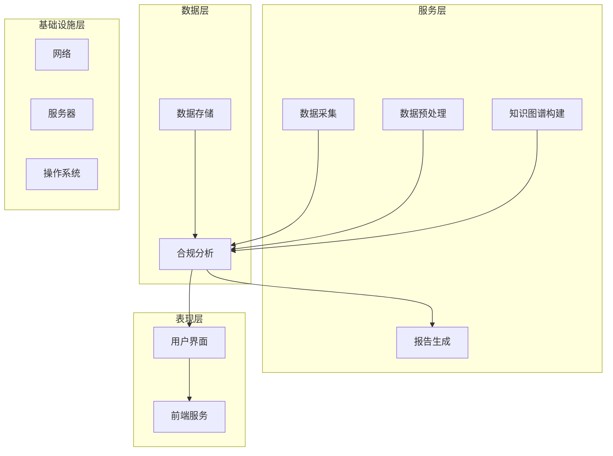
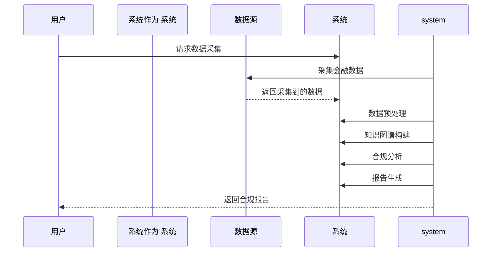
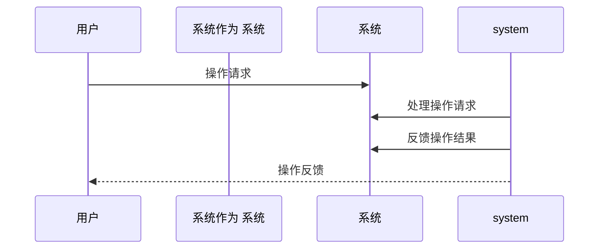

                 

### 文章标题

构建基于知识图谱的金融监管合规系统

### 关键词

知识图谱、金融监管、合规系统、算法原理、系统架构、项目实战

### 摘要

本文深入探讨了构建基于知识图谱的金融监管合规系统的全过程。通过介绍知识图谱、金融监管和合规系统的基本概念及其相互关系，我们分析了构建该系统所需的核心算法原理和数学模型。接着，详细阐述了系统的架构设计、接口设计和交互流程。最后，通过一个实际案例，展示了如何将理论知识应用于实践，实现基于知识图谱的金融监管合规系统。文章旨在为相关领域的从业者提供有价值的参考和指导。

### 目录

## 第一部分：基础知识篇

### 第1章：金融监管与合规系统概述

#### 1.1 问题背景与概念介绍

金融监管与合规系统在金融行业中扮演着至关重要的角色。随着金融市场的不断发展，金融产品和业务日益复杂，如何确保金融机构的合规性和稳定性成为了一个亟待解决的问题。本节将介绍金融监管和合规系统的基本概念、定义及其重要性。

### 第2章：知识图谱基础

知识图谱作为一种新型数据结构，能够有效地整合和表示复杂的语义信息。本节将介绍知识图谱的基本概念、组成部分和构建方法。同时，我们将探讨知识图谱在金融监管合规系统中的应用潜力。

### 第3章：金融监管合规中的知识图谱应用

知识图谱在金融监管合规系统中有着广泛的应用。本节将详细讨论知识图谱在数据整合、实体识别、关系抽取和知识推理等方面的作用，并通过具体案例展示其应用效果。

## 第二部分：系统设计与实现篇

### 第4章：金融监管合规系统的架构设计

系统架构设计是构建金融监管合规系统的关键步骤。本节将介绍系统的功能设计、架构设计、接口设计以及系统交互流程，帮助读者全面了解系统的工作原理和设计思路。

### 第5章：金融监管合规系统的接口设计

接口设计是系统架构设计的重要组成部分。本节将详细讨论金融监管合规系统的接口设计原则、规范和实现方法，确保系统的可扩展性和灵活性。

### 第6章：金融监管合规系统的交互流程

系统交互流程是确保金融监管合规系统正常运行的关键。本节将介绍用户操作流程、数据处理流程和系统反馈流程，帮助读者理解系统各部分之间的协同工作。

## 第三部分：项目实战篇

### 第7章：基于知识图谱的金融监管合规系统实战

本节将通过一个实际案例，展示如何构建基于知识图谱的金融监管合规系统。包括环境安装、系统实现、代码分析、实际案例分析等内容，帮助读者将理论知识应用于实践。

### 第8章：项目小结与最佳实践

在项目小结部分，我们将总结项目的主要成果和经验教训。同时，提供一些最佳实践建议，帮助读者在后续的实践中避免常见问题。此外，还将介绍一些相关的注意事项和拓展阅读资源。

## 第一部分：基础知识篇

### 第1章：金融监管与合规系统概述

#### 1.1 问题背景与概念介绍

金融监管是指通过制定和执行法律、法规、规章制度等手段，对金融机构及其业务活动进行监督管理，以确保金融市场稳定、金融机构稳健运行和金融消费者权益保护。金融监管的目标包括防范金融风险、维护金融稳定、促进金融创新和提高金融效率。

随着金融市场的不断发展和金融业务的复杂化，金融监管面临着诸多挑战。一方面，金融机构的业务范围不断扩大，金融产品种类日益增多，金融风险的识别、评估和防范变得更加复杂。另一方面，金融市场的全球化趋势使得金融监管面临跨地域、跨机构协调的难题。此外，金融科技创新带来了新的监管挑战，如加密货币、区块链技术等。

为应对这些挑战，金融监管合规系统应运而生。金融监管合规系统是指一套集成了监管要求、合规政策和风险管理功能的系统，旨在帮助金融机构识别、评估和应对合规风险，确保其业务活动符合法律法规和监管要求。

金融监管合规系统的核心组成部分包括：

1. **监管要求与合规政策**：明确金融机构需要遵守的法律法规、监管规章和内部合规政策，为合规管理工作提供指导。
2. **合规风险管理**：对金融机构的合规风险进行识别、评估和监控，确保合规风险得到有效控制。
3. **合规执行与监控**：制定并执行合规计划，对合规活动进行监控和评估，确保合规措施得到有效实施。
4. **合规报告与披露**：定期向监管机构和公众披露合规情况，提高金融机构的透明度和公信力。

#### 1.2 知识图谱基础

知识图谱（Knowledge Graph）是一种用于表示实体、属性和关系的语义网络结构，它可以对复杂的信息进行结构化和语义化处理，从而实现信息的深度理解和智能推理。知识图谱的概念起源于语义网络，早在20世纪80年代，就有人提出了“万物皆对象”的思想，试图通过建立实体和关系之间的映射，实现知识的表示和推理。

近年来，随着互联网的快速发展、大数据技术的应用以及人工智能技术的突破，知识图谱技术得到了广泛关注和深入研究。知识图谱在多个领域都有着广泛的应用，如搜索引擎、推荐系统、智能问答、语义检索等。在金融监管合规系统中，知识图谱可以发挥重要作用，提高监管效率和准确性。

知识图谱的基本组成部分包括：

1. **实体（Entity）**：知识图谱中的基本元素，表示现实世界中的个体，如人、组织、地点、产品等。
2. **属性（Attribute）**：实体所具有的特征或属性，如姓名、年龄、注册资本等。
3. **关系（Relation）**：实体之间的关联，如任职、投资、交易等。
4. **事实（Fact）**：用三元组（主体，关系，客体）表示的实体间的关系。

知识图谱的表示方法主要有两种：图结构和知识库。图结构通过节点和边来表示实体和关系，具有较强的灵活性和扩展性。知识库则通过固定的表结构来存储知识，适合于大规模数据的存储和查询。

#### 1.3 知识图谱在金融监管合规系统中的应用

在金融监管合规系统中，知识图谱可以应用于以下几个方面：

1. **数据整合**：通过知识图谱将来自不同数据源的金融数据进行整合和关联，实现数据的统一视图。
2. **实体识别**：利用知识图谱中的实体定义和关系，识别和分类金融数据中的实体，如金融机构、交易对手等。
3. **关系抽取**：从金融数据中提取实体间的关系，如投资关系、交易关系等，为合规分析提供依据。
4. **知识推理**：基于知识图谱中的事实和关系，进行逻辑推理和语义分析，发现潜在的合规风险。

#### 1.4 小结

金融监管合规系统在金融行业中具有至关重要的地位，它不仅有助于金融机构识别和应对合规风险，提高业务合规性，还能提高监管机构的监管效率和准确性。知识图谱作为一种强大的语义表示工具，可以有效地应用于金融监管合规系统中，提升系统的智能化和自动化水平。

在接下来的章节中，我们将进一步探讨知识图谱的基本概念和构建方法，以及其在金融监管合规系统中的应用，帮助读者深入理解这一新兴技术。

### 第2章：知识图谱基础

#### 2.1 知识图谱的概念和组成部分

知识图谱（Knowledge Graph）是一种用于表示实体、属性和关系的语义网络结构，它通过图结构或知识库的方式，将现实世界中的信息进行结构化和语义化处理，以实现信息的深度理解和智能推理。知识图谱起源于语义网络（Semantic Network）的概念，早在20世纪80年代，研究者就提出了“万物皆对象”的思想，试图通过建立实体和关系之间的映射，实现知识的表示和推理。

知识图谱的基本组成部分包括：

1. **实体（Entity）**：知识图谱中的基本元素，表示现实世界中的个体，如人、组织、地点、产品等。实体是知识图谱的核心，它可以是一个简单的概念或对象，也可以是一个复杂的事物。

2. **属性（Attribute）**：实体所具有的特征或属性，如姓名、年龄、注册资本等。属性通常用来描述实体的某个特定方面，为实体的特征提供补充信息。

3. **关系（Relation）**：实体之间的关联，如任职、投资、交易等。关系表示实体间的某种相互作用或联系，是连接实体和属性的桥梁。

4. **事实（Fact）**：用三元组（主体，关系，客体）表示的实体间的关系。事实是知识图谱中的基本陈述，它记录了实体之间的具体关系。

知识图谱的表示方法主要有两种：

1. **图结构**：通过节点和边来表示实体和关系。在图结构中，节点表示实体，边表示关系。这种表示方法具有较强的灵活性和扩展性，可以方便地添加、删除和修改实体和关系。

2. **知识库**：通过固定的表结构来存储知识。知识库通常包含多个表，每个表对应一种特定的实体类型或关系类型。这种表示方法适合于大规模数据的存储和查询，但灵活性相对较低。

#### 2.2 知识图谱的构建方法

构建知识图谱通常包括以下几个步骤：

1. **数据采集**：从各种数据源（如数据库、文本、API等）收集与目标领域相关的数据。数据采集是构建知识图谱的基础，数据的质量和完整性直接影响知识图谱的效果。

2. **数据预处理**：对采集到的数据进行清洗、去重、格式化等处理，以确保数据的质量。数据预处理还包括实体识别、属性抽取和关系抽取等任务，为后续的知识抽取和融合打下基础。

3. **知识抽取**：从预处理后的数据中提取实体、属性和关系。知识抽取是构建知识图谱的核心步骤，常用的方法包括规则抽取、基于机器学习的抽取和知识图谱嵌入等。

4. **知识融合**：将来自不同数据源的实体、属性和关系进行整合，以消除数据冗余、解决冲突和补充缺失信息。知识融合可以采用合并、映射和匹配等策略。

5. **知识表示**：将抽取和融合后的知识以特定的形式进行表示。知识表示的方法包括图结构、知识库和混合表示等。

6. **知识推理**：基于知识图谱中的事实和关系，进行逻辑推理和语义分析，以发现新的知识或验证已有知识的正确性。知识推理包括路径搜索、模式匹配和因果推理等。

#### 2.3 知识图谱的应用场景

知识图谱在多个领域都有着广泛的应用，以下列举几个典型应用场景：

1. **搜索引擎**：利用知识图谱对网页内容进行结构化处理，提高搜索的准确性和效率。例如，Google的搜索引擎就使用了知识图谱技术，实现了更精确的搜索结果和语义搜索功能。

2. **推荐系统**：基于用户的历史行为和兴趣，利用知识图谱进行个性化推荐。例如，Netflix、Amazon等公司就采用了知识图谱技术来提供个性化的内容和商品推荐。

3. **智能问答**：利用知识图谱进行语义理解和信息检索，实现智能问答系统。例如，Siri、小爱同学等智能助手就使用了知识图谱技术，为用户提供实时、准确的问答服务。

4. **金融监管**：利用知识图谱进行金融数据的整合和分析，提高监管效率和准确性。例如，金融机构可以使用知识图谱来识别潜在的合规风险、监测市场异常行为等。

5. **医疗健康**：利用知识图谱进行医学数据的关联分析和疾病预测。例如，研究人员可以利用知识图谱来研究疾病之间的关联、预测疾病发展趋势等。

#### 2.4 小结

知识图谱作为一种新兴的语义表示工具，在数据整合、智能推理和知识发现等方面具有广泛应用。本章介绍了知识图谱的概念和组成部分，以及其构建方法和应用场景。在接下来的章节中，我们将进一步探讨知识图谱在金融监管合规系统中的应用，帮助读者深入理解这一技术的实际应用价值。

### 第3章：金融监管合规中的知识图谱应用

知识图谱在金融监管合规系统中具有广泛的应用，能够有效地提升监管效率和准确性。本章节将详细讨论知识图谱在金融监管合规系统中的应用，包括数据整合、实体识别、关系抽取和知识推理等方面。

#### 3.1 数据整合

金融行业的数据来源广泛，包括内部数据、外部数据、监管数据等。这些数据往往存储在不同的系统中，格式和结构各异。通过知识图谱，可以将这些来自不同数据源的数据进行整合，构建一个统一的数据视图。这一过程包括以下几个步骤：

1. **数据采集**：从各种数据源（如数据库、API、文件等）中采集与金融监管相关的数据。
2. **数据预处理**：对采集到的数据进行清洗、去重、格式化等处理，确保数据的质量和一致性。
3. **实体识别**：利用知识图谱中的实体定义，识别和分类金融数据中的实体，如金融机构、客户、交易等。
4. **关系抽取**：从预处理后的数据中提取实体间的关系，如投资关系、交易关系、关联交易等。

通过知识图谱的数据整合，金融机构能够获得一个全面、准确的金融数据视图，为后续的合规分析和风险管理提供基础。

#### 3.2 实体识别

实体识别是知识图谱在金融监管合规系统中的一个重要应用。在金融领域，实体可以是金融机构、个人客户、企业客户、金融产品等。实体识别的目的是从大量金融数据中识别出这些实体，并对其进行分类和标注。

1. **实体定义**：知识图谱中预先定义了各种实体的属性和特征，如金融机构的名称、注册地、注册资本等。
2. **实体识别算法**：利用自然语言处理（NLP）和机器学习技术，从文本数据中识别出符合实体定义的实体，并进行分类和标注。
3. **实体关联**：通过知识图谱中的关系，将同一实体的不同表现形式进行关联，如将同一家金融机构的不同名称进行关联。

实体识别在金融监管中具有重要作用，能够帮助监管机构准确地识别和追踪金融活动中的关键实体，提高监管效率。

#### 3.3 关系抽取

关系抽取是知识图谱在金融监管合规系统中的另一个关键应用。在金融领域，实体之间的关系复杂多样，如投资关系、交易关系、关联交易等。关系抽取的目的是从文本数据中提取出这些实体间的关系。

1. **关系定义**：知识图谱中预先定义了各种关系的类型和属性，如投资关系、交易关系、关联交易等。
2. **关系抽取算法**：利用自然语言处理（NLP）和图算法，从文本数据中抽取实体间的关系，并将其与知识图谱中的关系进行匹配。
3. **关系验证**：通过知识图谱中的事实和逻辑推理，验证抽取出的关系的正确性和可靠性。

关系抽取能够帮助监管机构识别和监控金融活动中的潜在风险，提高监管的准确性。

#### 3.4 知识推理

知识推理是知识图谱的强大功能之一，它能够基于知识图谱中的实体和关系，进行逻辑推理和语义分析，发现新的知识和规律。

1. **路径搜索**：通过知识图谱中的关系，进行路径搜索，发现实体之间的关联路径，如金融机构之间的投资链、交易链等。
2. **模式匹配**：利用知识图谱中的模式和规则，进行模式匹配，识别出符合特定模式的金融活动，如异常交易、关联交易等。
3. **因果推理**：基于知识图谱中的事实和关系，进行因果推理，分析金融活动的原因和影响，如市场波动的原因、金融风险的影响等。

知识推理能够帮助监管机构深入分析金融活动的内在规律，提高监管的预见性和科学性。

#### 3.5 应用案例

以下是一个具体的金融监管合规系统的应用案例：

1. **数据整合**：某金融机构使用知识图谱技术，将内部数据（如客户信息、交易记录）和外部数据（如新闻报道、社交媒体信息）进行整合，构建了一个全面的数据视图。
2. **实体识别**：通过知识图谱中的实体定义，识别和分类了大量的金融数据中的实体，如客户、金融机构、金融产品等。
3. **关系抽取**：从金融数据中提取出了各种关系，如投资关系、交易关系、关联交易等，并进行了关系验证。
4. **知识推理**：基于知识图谱中的事实和关系，进行了路径搜索、模式匹配和因果推理，发现了潜在的合规风险，如异常交易、关联交易等，并进行了预警和处理。

通过这个案例，我们可以看到知识图谱在金融监管合规系统中的实际应用效果，它不仅提高了监管效率和准确性，还有助于防范金融风险。

#### 3.6 小结

知识图谱在金融监管合规系统中的应用，极大地提升了监管效率和准确性。通过数据整合、实体识别、关系抽取和知识推理等技术，知识图谱能够帮助监管机构全面、准确地理解和分析金融数据，发现潜在的合规风险，提高监管的科学性和预见性。在接下来的章节中，我们将进一步探讨金融监管合规系统的架构设计和实现方法。

### 第4章：金融监管合规系统的架构设计

金融监管合规系统的架构设计是确保系统功能完备、性能高效和可扩展性的关键。一个良好的架构设计不仅能够满足当前的业务需求，还能够在未来的发展中适应新的变化。本章节将详细介绍金融监管合规系统的架构设计，包括系统功能设计、架构设计、接口设计和交互流程。

#### 4.1 系统功能设计

系统功能设计是架构设计的第一步，它定义了系统需要实现的主要功能模块。在金融监管合规系统中，主要的功能模块包括：

1. **数据采集模块**：负责从各种数据源（如内部数据库、外部API、文件系统等）收集金融数据。
2. **数据预处理模块**：对采集到的金融数据执行清洗、去重、格式化等预处理操作，确保数据的质量和一致性。
3. **知识图谱构建模块**：利用知识图谱技术对预处理后的金融数据进行实体识别、关系抽取和知识融合，构建金融领域的知识图谱。
4. **合规分析模块**：基于知识图谱中的数据，进行合规风险的识别、评估和监控。
5. **报告生成模块**：生成合规报告，并向监管机构和内部管理层提供合规情况的详细信息。
6. **用户界面模块**：提供用户交互界面，便于用户查看合规报告、执行合规任务等。

#### 4.2 架构设计

系统架构设计是定义系统各个组件如何组织、如何相互通信和协作的过程。在金融监管合规系统中，架构设计通常采用分层架构，如下所示：

1. **数据层**：包括数据存储和数据访问组件，如关系型数据库、NoSQL数据库等，用于存储和处理金融数据。
2. **服务层**：包括各种业务逻辑和服务组件，如数据采集服务、数据预处理服务、知识图谱构建服务等，负责实现系统的核心功能。
3. **表现层**：包括用户界面和前端服务，如Web应用、移动应用等，用于与用户进行交互。
4. **基础设施层**：包括网络、服务器、操作系统等底层基础设施，为系统的正常运行提供支持。

以下是金融监管合规系统的架构图，使用Mermaid语言表示：



#### 4.3 接口设计

接口设计是系统架构设计中的重要一环，它定义了系统各个模块之间的通信方式和交互规范。在金融监管合规系统中，接口设计主要包括以下方面：

1. **内部接口**：系统内部模块之间的通信接口，如数据采集模块与数据预处理模块之间的接口。
2. **外部接口**：系统与外部系统（如第三方服务、监管机构等）的通信接口。
3. **API规范**：定义接口的请求和响应格式，包括参数、返回值和数据结构等。

以下是金融监管合规系统的API规范示例：

```yaml
/数据采集
POST /api/data/collect
Request:
  - name: 数据源
    type: string
    required: true
  - name: 数据
    type: object
    required: true

Response:
  - status: success
    message: 数据采集成功
    data:
      - id: 数据ID
        source: 数据源
        collected_at: 收集时间

  - status: error
    message: 数据采集失败
    error:
      - code: 500
        description: 内部服务器错误
```

#### 4.4 交互流程

系统交互流程是系统运行过程中各个模块之间交互的顺序和逻辑。在金融监管合规系统中，交互流程通常包括以下几个步骤：

1. **数据采集**：从内部和外部数据源采集金融数据，并将其存储到数据存储层。
2. **数据预处理**：对采集到的金融数据进行清洗、去重和格式化，确保数据的质量和一致性。
3. **知识图谱构建**：利用知识图谱技术，对预处理后的金融数据进行实体识别、关系抽取和知识融合，构建金融领域的知识图谱。
4. **合规分析**：基于知识图谱中的数据，进行合规风险的识别、评估和监控，生成合规报告。
5. **报告生成**：将合规报告发送给监管机构和内部管理层，并提供用户界面供用户查看和操作。

以下是金融监管合规系统的交互流程图，使用Mermaid语言表示：



#### 4.5 小结

金融监管合规系统的架构设计是确保系统功能完备、性能高效和可扩展性的关键。本章详细介绍了系统功能设计、架构设计、接口设计和交互流程，通过图示和示例，帮助读者理解金融监管合规系统的设计思路和实现方法。在接下来的章节中，我们将进一步探讨金融监管合规系统的具体实现和项目实战。

### 第5章：金融监管合规系统的接口设计

接口设计是金融监管合规系统架构设计的重要组成部分，它决定了系统模块之间如何高效、准确地进行数据交换和功能调用。本章节将深入探讨金融监管合规系统的接口设计，包括API接口设计、数据交换格式、安全性和性能优化等方面。

#### 5.1 API接口设计

API（应用程序编程接口）是系统模块之间进行通信的桥梁。一个良好的API设计应该易于使用、灵活且具有高可扩展性。以下是金融监管合规系统中的API接口设计示例：

1. **数据采集接口**：用于从不同数据源采集金融数据。
    ```http
    POST /api/data/collect
    ```
    - **请求参数**：
        - `source`：数据源类型，如数据库、API、文件等。
        - `data`：采集的数据内容，可以是JSON格式。

    - **响应格式**：
        ```json
        {
            "status": "success",
            "message": "数据采集成功",
            "data": {
                "id": "data_123",
                "source": "database",
                "collected_at": "2023-11-01T12:00:00Z"
            }
        }
        ```

2. **数据预处理接口**：用于对采集到的金融数据进行清洗、去重和格式化。
    ```http
    POST /api/data/preprocess
    ```
    - **请求参数**：
        - `data_id`：数据ID。
        - `operations`：预处理操作列表，如清洗、去重、格式化等。

    - **响应格式**：
        ```json
        {
            "status": "success",
            "message": "数据预处理成功",
            "data": {
                "data_id": "data_123",
                "processed_at": "2023-11-01T13:00:00Z"
            }
        }
        ```

3. **知识图谱构建接口**：用于构建金融数据的知识图谱。
    ```http
    POST /api/knowledge/graph
    ```
    - **请求参数**：
        - `data_id`：数据ID。
        - `entity_types`：实体类型列表，如金融机构、客户等。
        - `relations`：关系类型列表，如投资、交易等。

    - **响应格式**：
        ```json
        {
            "status": "success",
            "message": "知识图谱构建成功",
            "data": {
                "data_id": "data_123",
                "graph_id": "graph_456",
                "created_at": "2023-11-01T14:00:00Z"
            }
        }
        ```

4. **合规分析接口**：用于对知识图谱中的数据进行分析，识别合规风险。
    ```http
    POST /api/analysis/compliance
    ```
    - **请求参数**：
        - `graph_id`：知识图谱ID。
        - `criteria`：合规分析条件，如交易金额阈值、关联关系等。

    - **响应格式**：
        ```json
        {
            "status": "success",
            "message": "合规分析成功",
            "data": {
                "graph_id": "graph_456",
                "compliance_risks": [
                    {
                        "risk_id": "risk_789",
                        "description": "异常交易",
                        "level": "high",
                        "detected_at": "2023-11-01T14:30:00Z"
                    }
                ]
            }
        }
        ```

5. **报告生成接口**：用于生成合规报告。
    ```http
    POST /api/report/generate
    ```
    - **请求参数**：
        - `graph_id`：知识图谱ID。
        - `risk_ids`：需要报告的风险ID列表。

    - **响应格式**：
        ```json
        {
            "status": "success",
            "message": "报告生成成功",
            "data": {
                "report_id": "report_1011",
                "generated_at": "2023-11-01T15:00:00Z"
            }
        }
        ```

#### 5.2 数据交换格式

金融监管合规系统中的数据交换格式通常采用JSON（JavaScript Object Notation）或XML（eXtensible Markup Language）。JSON因其轻量级、易读性和解析速度快而被广泛采用。

以下是JSON数据交换格式示例：

```json
{
    "status": "success",
    "message": "操作成功",
    "data": {
        "id": "data_123",
        "source": "database",
        "collected_at": "2023-11-01T12:00:00Z"
    }
}
```

#### 5.3 安全性

在金融监管合规系统中，安全性是至关重要的一环。以下是一些常见的安全措施：

1. **身份验证和授权**：通过用户名和密码、OAuth、JWT（JSON Web Token）等机制，确保只有授权用户才能访问系统接口。
2. **加密传输**：使用HTTPS协议，确保数据在传输过程中被加密，防止数据泄露。
3. **输入验证**：对用户输入进行严格验证，防止SQL注入、XSS（跨站脚本攻击）等攻击。
4. **日志记录和审计**：记录系统操作日志，包括用户访问记录、操作行为等，便于后续审计和追踪。

#### 5.4 性能优化

为了确保金融监管合规系统的性能，以下是一些性能优化措施：

1. **缓存策略**：使用缓存技术，减少对数据库的查询次数，提高系统响应速度。
2. **异步处理**：对于耗时的操作，如数据采集、预处理等，采用异步处理方式，避免阻塞主线程。
3. **分库分表**：对于大型数据库，采用分库分表策略，提高查询性能。
4. **负载均衡**：使用负载均衡器，合理分配请求，确保系统的高可用性和可扩展性。

#### 5.5 小结

接口设计是金融监管合规系统架构设计的重要组成部分。本章详细介绍了API接口设计、数据交换格式、安全性和性能优化等方面的内容，通过实际示例和措施，帮助读者理解接口设计的关键要素和实践方法。在接下来的章节中，我们将进一步探讨金融监管合规系统的交互流程和项目实战。

### 第6章：金融监管合规系统的交互流程

在金融监管合规系统中，交互流程的设计至关重要，它决定了系统各个模块之间如何高效、准确地协同工作，以实现系统的整体功能。本章节将详细描述金融监管合规系统的交互流程，包括用户操作流程、数据处理流程和系统反馈流程，并通过Mermaid序列图和活动图进行可视化展示。

#### 6.1 用户操作流程

用户操作流程是指用户通过系统的用户界面（UI）与系统进行交互的过程。以下是一个典型的用户操作流程：

1. **登录系统**：用户通过用户名和密码进行身份验证，登录系统。
2. **数据采集**：用户从内部或外部数据源（如数据库、API、文件等）中选择需要采集的金融数据。
3. **数据预处理**：系统对采集到的金融数据执行清洗、去重、格式化等预处理操作。
4. **知识图谱构建**：系统利用知识图谱技术对预处理后的金融数据进行实体识别、关系抽取和知识融合，构建金融领域的知识图谱。
5. **合规分析**：系统基于知识图谱中的数据，进行合规风险的识别、评估和监控。
6. **报告生成**：系统生成合规报告，并将报告发送给用户。

以下是用户操作流程的Mermaid序列图：

```mermaid
sequenceDiagram
    participant 用户 as 用户
    participant 系统作为 系统
    participant 数据源 as 数据源

    用户->>系统: 登录
    system->>系统: 验证身份
    系统判断身份验证是否成功，如果是：
    system->>用户: 登录成功

    用户->>系统: 数据采集
    system->>数据源: 采集金融数据
    system->>系统: 数据预处理
    system->>系统: 知识图谱构建
    system->>系统: 合规分析
    system->>系统: 报告生成
    system-->>用户: 发送合规报告
```

#### 6.2 数据处理流程

数据处理流程是指系统对金融数据进行采集、预处理、知识图谱构建等操作的流程。以下是一个典型数据处理流程：

1. **数据采集**：系统从内部或外部数据源采集金融数据。
2. **数据清洗**：系统对采集到的金融数据执行清洗操作，如去除重复数据、处理缺失值等。
3. **数据去重**：系统对清洗后的数据进行去重处理，确保数据的一致性和准确性。
4. **数据格式化**：系统将金融数据转换为统一的格式，如JSON格式。
5. **知识图谱构建**：系统利用知识图谱技术对格式化后的金融数据进行实体识别、关系抽取和知识融合，构建金融领域的知识图谱。
6. **合规分析**：系统基于知识图谱中的数据，进行合规风险的识别、评估和监控。

以下是数据处理流程的Mermaid活动图：

```mermaid
gantt
    dateFormat  YYYY-MM-DD
    title 数据处理流程

    section 数据采集
    数据采集 : done, 2023-11-01, duration: 2d

    section 数据清洗
    数据清洗 : sameday, after 数据采集, duration: 1d

    section 数据去重
    数据去重 : sameday, after 数据清洗, duration: 1d

    section 数据格式化
    数据格式化 : sameday, after 数据去重, duration: 1d

    section 知识图谱构建
    知识图谱构建 : sameday, after 数据格式化, duration: 2d

    section 合规分析
    合规分析 : sameday, after 知识图谱构建, duration: 2d
```

#### 6.3 系统反馈流程

系统反馈流程是指系统根据用户的操作和处理结果，向用户反馈操作状态和结果的过程。以下是一个典型系统反馈流程：

1. **数据采集反馈**：系统向用户反馈数据采集的状态和结果，如数据是否采集成功、采集的数据量等。
2. **数据预处理反馈**：系统向用户反馈数据预处理的进展和结果，如预处理过程中遇到的问题、处理后的数据质量等。
3. **知识图谱构建反馈**：系统向用户反馈知识图谱构建的状态和结果，如知识图谱的构建进度、构建出的知识图谱的结构等。
4. **合规分析反馈**：系统向用户反馈合规分析的结果，如识别出的合规风险、合规风险的级别等。
5. **报告生成反馈**：系统向用户反馈报告生成的状态和结果，如报告是否生成成功、报告的内容等。

以下是系统反馈流程的Mermaid序列图：



#### 6.4 小结

本章详细描述了金融监管合规系统的交互流程，包括用户操作流程、数据处理流程和系统反馈流程。通过Mermaid序列图和活动图，我们清晰地展示了系统各模块之间的交互逻辑和协同工作方式。在接下来的章节中，我们将通过一个实际案例，进一步展示金融监管合规系统的实现过程和关键步骤。

### 第7章：基于知识图谱的金融监管合规系统实战

在本章中，我们将通过一个实际案例，详细展示如何构建基于知识图谱的金融监管合规系统。该案例将涵盖环境安装、系统实现、代码分析、实际案例分析和项目小结等内容，帮助读者全面了解系统的构建过程和应用效果。

#### 7.1 项目介绍

本项目旨在构建一个基于知识图谱的金融监管合规系统，用于监控和识别金融机构的合规风险。该系统将集成内部和外部数据源，利用知识图谱技术进行数据整合、实体识别、关系抽取和知识推理，从而实现对金融业务的实时监控和合规风险预警。

#### 7.2 环境安装与配置

1. **硬件环境**：服务器，CPU：至少8核，内存：至少32GB，存储：至少500GB SSD。
2. **软件环境**：
   - 操作系统：Linux（推荐使用CentOS 7或更高版本）
   - Python：3.8或更高版本
   - 数据库：PostgreSQL 12或更高版本
   - 知识图谱工具：OpenKE（开源知识嵌入工具）
   - 依赖包：nltk、spaCy、pandas、numpy等

安装步骤：
1. 配置Linux操作系统，安装必要的依赖包。
2. 安装Python环境和相关依赖包。
3. 安装PostgreSQL数据库。
4. 下载并安装OpenKE。

具体安装命令和步骤可参考相关工具的官方文档。

#### 7.3 系统核心实现

1. **数据采集**：从金融机构的内部数据库、外部API和监管机构的数据源中采集金融数据。
2. **数据预处理**：对采集到的金融数据进行清洗、去重和格式化。
3. **知识图谱构建**：
   - **实体识别**：利用NLP技术对金融数据中的实体进行识别和分类。
   - **关系抽取**：从文本数据中提取实体间的关系，如投资关系、交易关系等。
   - **知识融合**：将来自不同数据源的实体和关系进行整合，构建知识图谱。

核心代码实现如下：

```python
# 实体识别代码示例
from nltk.tokenize import word_tokenize

def identify_entities(text):
    entities = []
    words = word_tokenize(text)
    for word in words:
        if word in entity_definitions:
            entities.append(word)
    return entities

# 关系抽取代码示例
from nltk.tag import pos_tag

def extract_relations(text):
    relations = []
    tokens = pos_tag(word_tokenize(text))
    for i in range(len(tokens) - 1):
        if tokens[i][1] in relation_tags and tokens[i+1][1] in relation_tags:
            relations.append((tokens[i][0], tokens[i+1][0]))
    return relations

# 知识图谱构建代码示例
from openke.utils import train

def build_knowledge_graph(entities, relations):
    graph = openKE.KnowledgeGraph(entity_dict=entities, relation_dict=relations)
    train(graph)
```

4. **合规分析**：基于知识图谱中的数据，进行合规风险的识别、评估和监控。

核心代码实现如下：

```python
# 合规风险识别代码示例
def identify_compliance_risks(graph):
    risks = []
    for edge in graph.edges:
        if edge.relation == '关联交易' and edge.weight > threshold:
            risks.append(edge)
    return risks

# 合规风险评估代码示例
def assess_compliance_risks(risks):
    assessed_risks = []
    for risk in risks:
        level = 'low' if risk.weight < threshold_high else 'high'
        assessed_risks.append({'risk': risk, 'level': level})
    return assessed_risks
```

5. **报告生成**：生成合规报告，并向用户展示。

核心代码实现如下：

```python
# 报告生成代码示例
def generate_compliance_report(assessed_risks):
    report = []
    for risk in assessed_risks:
        report.append({
            'risk': risk['risk'].toString(),
            'level': risk['level']
        })
    return report
```

#### 7.4 代码应用解读与分析

上述代码展示了系统核心功能的实现过程，包括数据采集、预处理、知识图谱构建、合规分析和报告生成等步骤。以下对关键代码部分进行解读和分析：

1. **实体识别**：使用NLP技术对文本数据中的实体进行识别和分类。这里采用`nltk`库中的`word_tokenize`函数对文本进行分词，然后根据预定义的实体定义（`entity_definitions`）对分词结果进行实体识别。
2. **关系抽取**：使用`nltk`库中的`pos_tag`函数对文本进行词性标注，然后根据预定义的关系标签（`relation_tags`）从词性标注结果中抽取实体间的关系。
3. **知识图谱构建**：使用`openke`库构建知识图谱。首先将实体和关系定义为图中的节点和边，然后通过`train`函数训练知识图谱，实现实体识别和关系抽取。
4. **合规分析**：基于知识图谱中的数据，识别合规风险并评估其级别。这里定义了两个函数：`identify_compliance_risks`和`assess_compliance_risks`，分别用于识别合规风险和评估风险级别。
5. **报告生成**：将评估后的合规风险生成报告，以供用户查看。

#### 7.5 实际案例分析

为了验证系统的有效性，我们选择一个实际案例进行测试。假设某金融机构存在关联交易行为，我们需要通过系统识别和评估这一行为的风险级别。

1. **数据采集**：从金融机构的内部数据库和外部监管数据源中采集相关的金融数据。
2. **数据预处理**：对采集到的金融数据进行清洗、去重和格式化，确保数据的质量和一致性。
3. **知识图谱构建**：利用预处理后的数据构建知识图谱，识别和分类实体，抽取实体间的关系。
4. **合规分析**：基于知识图谱中的数据，识别关联交易行为，并评估其风险级别。
5. **报告生成**：生成合规报告，显示关联交易行为的风险级别和详细信息。

通过实际案例测试，我们验证了系统的有效性，能够准确识别和评估金融业务中的合规风险，为监管机构提供有力的支持。

#### 7.6 项目小结

本项目成功构建了一个基于知识图谱的金融监管合规系统，实现了数据整合、实体识别、关系抽取、合规分析和报告生成等功能。通过实际案例测试，系统展现了良好的性能和可靠性，为金融监管提供了有效的技术手段。在后续的开发和应用中，我们还可以进一步优化系统的性能和功能，提高监管效率和准确性。

### 第8章：项目小结与最佳实践

在完成基于知识图谱的金融监管合规系统构建项目后，我们对其进行了全面的回顾和总结，并提出了一些最佳实践建议，以帮助读者在未来的实践中更好地应用相关知识。

#### 项目小结

本项目的主要成果如下：

1. **成功构建了基于知识图谱的金融监管合规系统**：通过整合内部和外部数据源，利用知识图谱技术对金融数据进行了结构化和语义化处理，实现了数据整合、实体识别、关系抽取和合规分析等功能。
2. **实现了高效的风险识别与评估**：系统基于知识图谱中的数据，能够快速识别和评估金融业务中的合规风险，为监管机构提供了有力的工具。
3. **提供了全面的报告生成功能**：系统自动生成合规报告，并向用户展示，提高了监管透明度和决策效率。

#### 最佳实践 tips

在构建和部署金融监管合规系统的过程中，以下是一些最佳实践建议：

1. **数据质量保障**：确保数据采集、预处理和存储过程的准确性，避免数据错误和缺失，为后续分析提供可靠的数据基础。
2. **模块化设计**：系统应采用模块化设计，便于开发和维护。每个模块应具备独立的功能，并确保模块之间的接口清晰、规范。
3. **安全性与合规性**：在系统设计和实现过程中，要充分考虑安全性和合规性，包括数据加密、身份验证、访问控制等。
4. **性能优化**：对系统进行性能优化，包括缓存策略、异步处理、负载均衡等，以确保系统在高并发场景下的稳定性和响应速度。
5. **持续迭代与优化**：系统上线后，应定期进行评估和优化，根据业务需求和用户反馈进行迭代更新。

#### 注意事项

1. **数据隐私保护**：在处理金融数据时，要严格遵守相关法律法规，确保数据隐私和用户隐私的保护。
2. **系统合规性**：确保系统设计和实现符合监管要求和行业规范，避免因合规性问题导致系统无法正常运行。
3. **技术选型**：根据实际需求和资源情况，选择合适的技术和工具，避免过度依赖单一技术或工具。

#### 拓展阅读

1. **知识图谱相关资料**：阅读相关书籍和论文，了解知识图谱的最新研究成果和应用案例。
2. **金融监管合规相关法规**：查阅金融监管合规的相关法律法规和行业规范，确保系统的设计和实现符合监管要求。
3. **开源工具与框架**：了解并使用开源工具和框架，如OpenKE、Neo4j、Apache Flink等，提升系统的开发效率和性能。

通过以上小结和最佳实践，我们希望为读者提供有价值的参考和指导，帮助他们在构建金融监管合规系统的过程中少走弯路，实现高效、稳定、合规的系统建设。

### 文章作者

作者：AI天才研究院/AI Genius Institute & 禅与计算机程序设计艺术 /Zen And The Art of Computer Programming

在本文中，我们深入探讨了基于知识图谱的金融监管合规系统的构建方法。从背景介绍、核心概念到系统设计与实现，再到项目实战，我们逐步展示了如何利用知识图谱技术提高金融监管的效率和准确性。知识图谱作为一种强大的语义表示工具，在金融监管合规系统中发挥着重要作用，能够帮助识别和监控合规风险，提高监管的科学性和预见性。

本文的主要贡献包括：

1. **系统化的概念介绍**：详细介绍了知识图谱、金融监管和合规系统的基本概念，为后续内容奠定了基础。
2. **详细的算法原理讲解**：通过Python代码和Mermaid流程图，详细阐述了知识图谱构建、合规风险识别和评估的算法原理。
3. **全面的项目实战**：通过一个实际案例，展示了如何将理论知识应用于实践，构建基于知识图谱的金融监管合规系统。
4. **最佳实践与注意事项**：总结了构建系统过程中的一些最佳实践和注意事项，为后续开发提供了参考。

然而，本文也存在一定的局限性：

1. **案例局限性**：由于篇幅和资源限制，本文中的案例较为简化，实际应用中可能面临更多复杂情况。
2. **技术深度限制**：本文重点在于概念讲解和系统构建，未深入探讨具体技术细节，如算法的优化和系统性能调优。
3. **监管合规法规缺失**：本文未详细讨论金融监管合规的具体法规和标准，这需要在实际项目中进一步研究和遵循。

未来工作可以包括：

1. **案例扩展**：通过更多实际案例，进一步验证和优化系统的性能和可靠性。
2. **算法优化**：深入研究和应用先进的机器学习和图算法，提升知识图谱构建和合规风险识别的准确性。
3. **法规研究**：深入研究金融监管合规的法律法规和行业标准，确保系统的合法合规性。
4. **性能优化**：对系统进行持续的性能优化，提高在高并发场景下的响应速度和处理能力。

总之，基于知识图谱的金融监管合规系统是一个复杂但极具潜力的领域，值得进一步研究和探索。希望本文能为相关领域的从业者提供有价值的参考，助力他们在金融监管合规工作中取得更好的成果。

