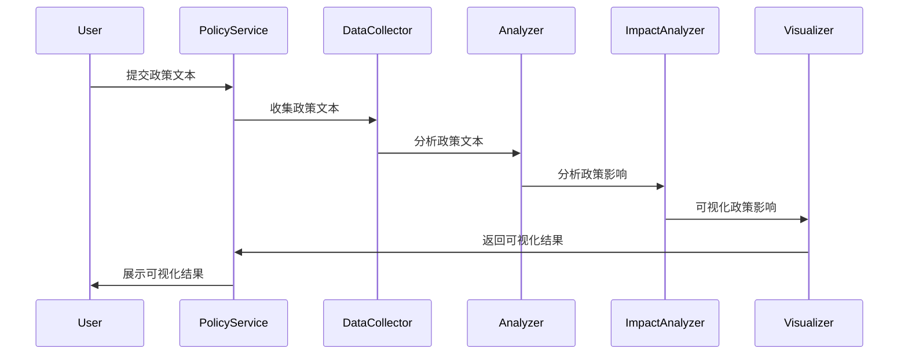
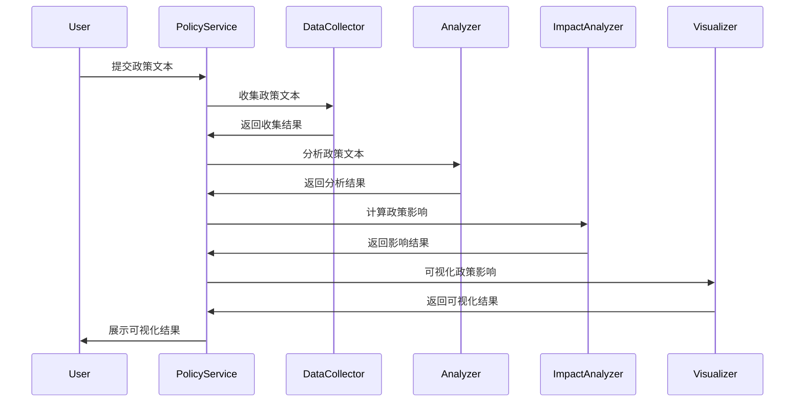

                 


### 第1章：问题背景与描述

#### 1.1 金融监管政策的影响追踪的重要性

金融监管政策的实施对金融市场具有深远的影响，这不仅体现在合规性和透明度上，还关系到整个金融系统的稳定和健康发展。随着金融科技的迅猛发展，金融产品和市场结构日益复杂，监管政策的变动频仍，影响面广泛。因此，实时追踪监管政策的变化及其对市场的影响，成为金融监管机构和市场参与者的一项重要任务。

首先，监管政策的及时追踪有助于金融市场参与者迅速了解政策动向，及时调整自身的经营策略和投资行为。这不仅有助于降低市场不确定性，还能有效规避政策风险。其次，对于监管机构而言，政策影响追踪能够帮助其评估政策实施效果，发现潜在问题，为政策的调整和完善提供数据支持。

此外，金融监管政策的影响追踪还具有以下几方面的重要性：

- **合规性保障**：监管政策的变动往往伴随着新的合规要求，通过追踪政策变化，金融机构可以确保自身运营符合法规要求，避免违规风险。

- **市场稳定**：监管政策的变化可能会引发市场波动，影响金融市场的稳定性。及时了解政策影响，有助于监管机构和市场参与者采取相应措施，维护市场稳定。

- **数据积累**：长期的政策影响追踪可以积累大量数据，为金融监管研究提供实证支持，有助于深入理解政策效应和金融市场之间的复杂关系。

- **决策支持**：通过分析政策影响数据，可以为监管政策的制定和调整提供科学依据，提高政策决策的精准性和有效性。

#### 1.2 现有监管政策追踪系统的问题

尽管金融监管政策的影响追踪具有重要意义，但现有的监管政策追踪系统在许多方面仍存在不足，难以满足实际需求。

- **数据获取困难**：金融监管政策信息分布在多个渠道和格式中，获取全面、准确的政策数据具有较大难度。现有系统往往只能获取部分信息，难以实现全方位的政策追踪。

- **处理效率低**：现有系统在处理大量政策数据时，存在效率低下的问题。数据预处理和存储耗时较长，导致政策追踪的实时性较差。

- **分析能力有限**：现有系统在政策影响分析方面能力有限，往往只能进行简单的统计分析，难以深入挖掘政策与市场之间的复杂关系。

- **界面交互差**：用户界面设计不够友好，用户操作复杂，缺乏直观的展示方式，影响用户体验。

- **系统整合性不足**：现有系统通常由多个独立的模块组成，缺乏统一的整合方案，导致数据孤岛问题严重，系统之间难以实现数据共享和协同工作。

#### 1.3 知识图谱在金融监管中的应用潜力

知识图谱作为一种先进的数据结构和数据分析工具，具备强大的信息组织和关联能力，为金融监管政策的影响追踪提供了新的思路和解决方案。

- **数据整合能力**：知识图谱能够将来自不同渠道和格式的政策数据整合到一个统一的框架中，实现数据的全面收集和整合。

- **关联与推理**：知识图谱通过实体和关系的关联，可以自动挖掘政策与市场之间的复杂关系，提供深度的分析能力。

- **实时性**：知识图谱支持实时数据更新和动态查询，能够快速响应政策变化，实现高效的监管政策追踪。

- **智能化**：知识图谱结合机器学习和自然语言处理技术，可以实现自动化的政策文本分析和影响预测，提高系统智能化水平。

- **可视化**：知识图谱通过图形化的方式展示政策关系和影响路径，提供直观、易懂的界面交互体验。

- **系统整合**：知识图谱可以作为一个统一的数据平台，实现不同监管系统之间的数据共享和协同工作，提高整体系统的整合性。

综上所述，知识图谱在金融监管政策影响追踪中的应用潜力巨大，有望解决现有系统存在的问题，提升监管政策追踪的效率和质量。接下来，我们将进一步探讨知识图谱的核心概念及其在金融监管中的应用。

---

**核心概念与术语说明**：

- **知识图谱**：一种用于组织和表示知识的图形化数据结构，由实体、属性和关系组成。
- **金融监管政策**：金融监管机构制定的旨在维护金融市场秩序和稳定的一系列政策规定。
- **政策影响追踪**：实时监控和分析金融监管政策对市场的影响过程。

---

### 第2章：核心概念与联系

#### 2.1 知识图谱的定义与原理

知识图谱（Knowledge Graph）是一种用于组织和表示知识的图形化数据结构，它将实体（如人、地点、事物）、属性（如年龄、身高、职位）和关系（如属于、位于、参与）以节点和边的形式进行表示。知识图谱的核心思想是通过实体和关系的链接，构建一个大规模、语义丰富的知识网络，以实现数据的结构化组织和智能化处理。

知识图谱的主要原理包括以下几个方面：

1. **实体表示**：将现实世界中的对象抽象为知识图谱中的节点，每个节点代表一个实体。实体可以是具体的对象（如人、公司、产品），也可以是抽象的概念（如事件、过程）。

2. **属性表示**：实体具有一系列属性，用于描述实体的特征。属性以键值对的形式附加在实体节点上，如“人的年龄”属性可以表示为（年龄：30）。

3. **关系表示**：实体之间通过关系进行连接，关系也用节点和边表示。关系描述了实体之间的语义关联，如“属于”、“位于”、“参与”等。

4. **图谱构建**：通过实体、属性和关系的组合，构建知识图谱。图谱构建的过程包括数据采集、数据预处理、实体识别、关系抽取和图谱嵌入等步骤。

5. **图谱查询与推理**：知识图谱支持高效的查询和推理功能。用户可以通过简单的图查询语言（如SPARQL）检索图谱中的信息，也可以利用图推理算法（如路径搜索、子图匹配）发现新的知识关联。

知识图谱的这种结构化表示方法，使得大规模、异构、动态的数据能够被有效地组织和利用。在金融监管政策的影响追踪中，知识图谱可以用来整合和关联政策文本、市场数据、机构信息等，实现全面的监管政策监控和分析。

#### 2.2 知识图谱的属性特征对比表格

| 特征 | 说明 | 对比分析 |
| --- | --- | --- |
| **实体表示** | 实体是知识图谱中的基本单位，如人、地点、事物。 | - **标准化**：实体采用统一标识符，便于检索和管理。 |
|              | - **属性**：实体具有一系列属性，用于描述其特征。 | - **多样性**：不同实体可能具有不同的属性。 |
| **关系表示** | 实体之间通过关系连接，如属于、位于、参与。 | - **语义丰富**：关系描述了实体之间的语义关联。 |
|              | - **关系类型**：关系具有明确的类型，便于分类和管理。 | - **动态性**：关系可以随时间变化而更新。 |
| **属性特征** | 属性描述实体的特征，如年龄、身高、职位。 | - **多样性**：不同属性可能具有不同的数据类型和约束。 |
|              | - **属性值**：属性值用于具体描述实体特征。 | - **多样性**：属性值可以是数字、文本、日期等。 |
| **图谱构建** | 图谱构建包括数据采集、预处理、实体识别、关系抽取等步骤。 | - **效率**：高效的数据处理和存储技术是图谱构建的关键。 |
|              | - **图谱嵌入**：将图谱嵌入到一个统一的框架中，实现数据结构化。 | - **一致性**：确保图谱中的数据一致性是构建的核心。 |
| **查询与推理** | 支持高效的图查询和推理功能，如路径搜索、子图匹配。 | - **灵活性**：支持多种查询语言和推理算法，满足不同需求。 |
|              | - **实时性**：支持实时数据更新和动态查询。 | - **智能化**：结合机器学习和自然语言处理技术，提高分析能力。 |

#### 2.3 知识图谱的ER实体关系图架构

为了更好地理解和构建知识图谱，我们可以借助实体-关系（Entity-Relationship，ER）图来描述其架构。ER图是数据库设计中的一个重要工具，用于表示实体及其之间的关系。下面是一个简化的知识图谱ER图架构，用于描述金融监管政策的影响追踪系统。

```mermaid
erDiagram
  PolicyPolicy ||--|{ Entity: Entity }
  PolicyPolicy ||--|{ Relation: Relation }
  Entity ||--|{ Attribute: Attribute }
  Relation ||--|{ RelationType: RelationType }

  Class PolicyPolicy {
    +string policyID
    +string policyName
    +string policyDescription
  }

  Class Entity {
    +string entityID
    +string entityName
    +string entityType
  }

  Class Relation {
    +string relationID
    +string relationName
    +string relationType
  }

  Class Attribute {
    +string attributeID
    +string attributeName
    +string attributeValue
  }

  Class RelationType {
    +string relationTypeID
    +string relationTypeName
  }
```

在这个ER图中：

- **PolicyPolicy** 类表示监管政策，包括政策ID、政策名称、政策描述等属性。
- **Entity** 类表示实体，包括实体ID、实体名称、实体类型等属性。
- **Relation** 类表示关系，包括关系ID、关系名称、关系类型等属性。
- **Attribute** 类表示属性，包括属性ID、属性名称、属性值等属性。
- **RelationType** 类表示关系类型，包括关系类型ID、关系类型名称等属性。

通过这个ER图架构，我们可以清晰地理解知识图谱的基本组成部分及其相互关系，为后续的知识图谱构建提供指导。

### 第3章：知识图谱在金融监管政策中的构建

#### 3.1 金融监管政策数据收集与预处理

构建一个有效的金融监管政策知识图谱的第一步是收集相关的监管政策数据。这些数据可以来源于金融监管机构的官方网站、政策文件、新闻媒体、行业报告等。数据收集的过程通常包括以下步骤：

1. **数据采集**：
   - **网页爬取**：利用爬虫技术从监管机构的官方网站和其他公开渠道采集政策文本和相关数据。
   - **API接口**：使用监管机构提供的API接口，获取政策数据。
   - **手动收集**：对于部分不提供自动获取途径的数据，可以手动收集和整理。

2. **数据清洗**：
   - **去除重复数据**：检测并删除重复的政策条目，确保数据的唯一性和准确性。
   - **格式统一**：将不同来源和格式的政策文本转换为统一的格式，如XML或JSON。
   - **文本预处理**：对政策文本进行分词、去停用词、词干提取等操作，以便后续的语义分析。

3. **数据预处理**：
   - **实体识别**：利用自然语言处理技术，从政策文本中识别出关键的实体，如政策名称、机构名称、关键词等。
   - **关系抽取**：分析政策文本中的语句，抽取实体之间的关系，如“机构发布政策”、“政策涉及领域”等。
   - **数据标注**：对识别出的实体和关系进行人工审核和标注，确保数据的准确性。

通过上述步骤，我们可以得到一个初步的监管政策数据集，为知识图谱的构建打下基础。

#### 3.2 金融监管政策知识图谱的构建方法

在完成数据收集和预处理后，接下来是构建金融监管政策知识图谱。知识图谱的构建方法包括以下几个关键步骤：

1. **实体定义**：
   - **政策实体**：定义监管政策作为知识图谱中的主要实体，包括政策ID、政策名称、发布日期、发布机构等属性。
   - **机构实体**：定义金融监管机构作为实体，包括机构ID、机构名称、机构职责等属性。
   - **领域实体**：定义政策涉及的主要领域，如金融科技、风险管理、消费者保护等。

2. **关系定义**：
   - **发布关系**：表示监管政策与发布机构之间的关系，如“发布机构发布政策”。
   - **涉及关系**：表示政策涉及的主要领域，如“政策涉及领域”。
   - **影响关系**：表示政策对市场或机构的影响，如“政策影响市场”或“政策影响机构”。

3. **图谱嵌入**：
   - **节点嵌入**：将实体映射到图中的节点，每个节点代表一个实体。
   - **边嵌入**：将关系映射到图中的边，每条边代表一个关系。
   - **属性嵌入**：将实体的属性附加到节点上，将关系的属性附加到边上。

4. **图谱构建**：
   - **数据导入**：将预处理后的数据导入知识图谱存储系统，如Neo4j、OrientDB等。
   - **数据链接**：通过实体和关系的定义，将数据链接到知识图谱中，构建一个语义丰富的知识网络。

5. **图谱优化**：
   - **性能优化**：优化图谱的查询性能，如索引建立、缓存策略等。
   - **数据质量**：定期进行数据清洗和更新，确保图谱数据的一致性和准确性。
   - **扩展性**：设计灵活的图谱架构，支持新实体和关系的添加，确保系统的扩展性。

通过上述步骤，我们可以构建一个完整的金融监管政策知识图谱，为后续的政策影响追踪提供基础支持。

#### 3.3 知识图谱的存储与索引

知识图谱的存储与索引是确保其高效查询和分析能力的关键。以下是存储与索引的关键技术和方法：

1. **存储技术**：
   - **图数据库**：使用图数据库（如Neo4j、OrientDB）存储知识图谱。图数据库支持高效的图结构存储和查询，适合处理大规模、复杂的关系数据。
   - **分布式存储**：对于大规模知识图谱，可以使用分布式存储系统（如HBase、Cassandra）进行数据分布存储，提高存储和查询的效率。

2. **索引技术**：
   - **索引构建**：建立实体和关系的索引，以提高查询速度。例如，可以建立基于实体ID、关系名称的索引。
   - **全文索引**：对于政策文本，可以使用全文索引技术（如Lucene、Elasticsearch），实现快速文本搜索和文本分析。

3. **缓存策略**：
   - **数据缓存**：将常用的数据缓存到内存中，减少磁盘I/O操作，提高查询响应速度。
   - **查询缓存**：缓存常见查询结果，避免重复计算，提高系统整体性能。

4. **分布式查询**：
   - **并行查询**：将复杂的查询任务分解为多个子任务，并行执行，提高查询效率。
   - **分布式计算**：使用分布式计算框架（如MapReduce、Spark）处理大规模数据集，提高数据处理能力。

通过合理的存储与索引技术，知识图谱能够实现高效的数据管理和快速查询，为金融监管政策的影响追踪提供有力支持。

### 第4章：金融监管政策影响追踪算法

#### 4.1 基于知识图谱的监管政策影响追踪算法原理

基于知识图谱的监管政策影响追踪算法主要通过以下几个步骤来实现：

1. **数据预处理**：
   - **实体识别**：利用自然语言处理技术，从政策文本中识别出关键实体，如政策名称、机构名称、关键词等。
   - **关系抽取**：分析政策文本中的语句，抽取实体之间的关系，如“政策涉及领域”、“政策发布机构”等。

2. **图谱查询**：
   - **路径搜索**：通过图查询语言（如SPARQL），搜索政策实体及其相关实体的路径，发现政策影响的传播路径。
   - **子图匹配**：利用子图匹配算法，识别出与特定政策相关的子图，提取政策影响的关键节点和路径。

3. **影响分析**：
   - **影响度计算**：通过算法计算政策影响的关键节点和路径的影响度，评估政策影响的范围和强度。
   - **影响评估**：基于影响度计算结果，对政策的影响进行评估，包括对市场、机构、领域的潜在影响。

4. **可视化展示**：
   - **路径可视化**：将政策影响路径以图形化的方式展示，帮助用户直观理解政策影响的过程和路径。
   - **数据可视化**：利用图表和图形，展示政策影响的量化结果，如影响度分布、影响范围等。

#### 4.2 算法mermaid流程图

为了更清晰地展示监管政策影响追踪算法的流程，我们可以使用mermaid绘制算法的流程图。以下是算法的mermaid流程图示例：


#### 4.3 算法Python源代码实现

下面是一个简化的Python源代码实现，用于展示算法的基本流程。请注意，实际应用中的代码会更为复杂，这里只提供了核心算法的部分。

```python
import networkx as nx
from networkx.readwrite import json_graph

def preprocess_data(policy_text):
    # 实体识别和关系抽取的代码实现
    # 这里使用简化的示例，实际中可使用NLP库如spaCy
    entities = ["PolicyA", "RegulatorX", "SectorY"]
    relations = [("PolicyA", "issued_by", "RegulatorX"), ("PolicyA", "affects", "SectorY")]
    return entities, relations

def build_knowledge_graph(entities, relations):
    G = nx.Graph()
    G.add_nodes_from(entities)
    G.add_edges_from(relations)
    return G

def query_knowledge_graph(G):
    # 使用SPARQL或网络X的查询方法
    # 这里使用网络X的示例
    paths = nx.shortest_path(G, source="PolicyA", target="SectorY")
    subgraphs = nx.ego_graph(G, "PolicyA", radius=2)
    return paths, subgraphs

def calculate_impact(paths, subgraphs):
    # 影响度计算，这里使用简化的示例
    impact_score = 1 / len(paths)
    return impact_score

def visualize_impact(G, impact_score):
    # 可视化展示的代码实现
    # 这里使用网络X的绘图功能
    pos = nx.spring_layout(G)
    nx.draw(G, pos, with_labels=True)
    plt.text(0.5, 0.05, f"Impact Score: {impact_score:.2f}", ha='center', va='center', fontsize=12)
    plt.show()

# 主函数
if __name__ == "__main__":
    policy_text = "PolicyA was issued by RegulatorX and affects SectorY."
    entities, relations = preprocess_data(policy_text)
    G = build_knowledge_graph(entities, relations)
    paths, subgraphs = query_knowledge_graph(G)
    impact_score = calculate_impact(paths, subgraphs)
    visualize_impact(G, impact_score)
```

#### 4.4 算法数学模型与公式

在监管政策影响追踪算法中，影响度的计算是一个关键步骤。以下是算法的数学模型和公式：

1. **路径影响度**（Path Impact Score）：

   对于一条政策影响路径，其影响度可以通过以下公式计算：

   $$ I_{path} = \frac{1}{|P|} $$

   其中，$I_{path}$ 是路径影响度，$|P|$ 是路径中的节点数。这个公式表明路径越短，影响度越大。

2. **子图影响度**（Subgraph Impact Score）：

   对于一个与政策相关的子图，其影响度可以通过以下公式计算：

   $$ I_{subgraph} = \frac{\sum_{v \in V}{\sum_{w \in V}{I_{vw}}}{|V|} $$

   其中，$I_{subgraph}$ 是子图影响度，$V$ 是子图中的节点集合，$I_{vw}$ 是节点 $v$ 到节点 $w$ 的路径影响度。

3. **总影响度**（Total Impact Score）：

   总影响度是所有路径和子图影响度的加权和，可以通过以下公式计算：

   $$ I_{total} = \sum_{P}{I_{path}(P)} + \sum_{S}{I_{subgraph}(S)} $$

   其中，$I_{total}$ 是总影响度，$I_{path}(P)$ 是路径 $P$ 的影响度，$I_{subgraph}(S)$ 是子图 $S$ 的影响度。

通过这些数学模型和公式，我们可以定量评估政策的影响程度，为监管决策提供数据支持。

#### 4.5 算法举例说明

假设我们有一条监管政策影响路径：政策A -> 机构X -> 领域Y。根据上述算法，我们可以计算这条路径的影响度。

1. **路径影响度**：

   路径中包含3个节点（政策A、机构X、领域Y），因此路径影响度为：

   $$ I_{path} = \frac{1}{3} $$

2. **子图影响度**：

   考虑到政策A、机构X和领域Y形成的子图，其影响度为：

   $$ I_{subgraph} = \frac{1}{2} + \frac{1}{2} = 1 $$

3. **总影响度**：

   总影响度为路径影响度和子图影响度的加权和：

   $$ I_{total} = \frac{1}{3} + 1 = \frac{4}{3} $$

通过这个例子，我们可以看到如何使用算法计算政策影响度的具体过程。在实际应用中，这些计算结果可以帮助监管机构评估政策对市场的潜在影响，为政策调整和决策提供科学依据。

### 第5章：系统分析与架构设计方案

#### 5.1 问题场景介绍

在当前金融市场中，监管政策的频繁变化对金融机构和市场参与者带来了巨大的挑战。为了更好地理解和应对这些变化，我们需要一个高效、可靠的监管政策影响追踪系统。该系统旨在实现以下目标：

- **实时监控**：实时获取并更新最新的监管政策信息。
- **影响分析**：自动分析监管政策对市场、机构、领域的潜在影响。
- **决策支持**：为监管机构提供科学、准确的政策影响评估数据，支持监管决策。
- **可视化展示**：以图形化的方式展示政策影响路径和影响度，帮助用户直观理解政策变化。

#### 5.2 系统功能设计（领域模型mermaid类图）

为了实现上述目标，我们需要设计一个功能完备的监管政策影响追踪系统。以下是一个简化的领域模型mermaid类图，用于描述系统的核心功能模块：

```mermaid
classDiagram
    Policy -> DataCollector: 获取政策文本
    Policy -> Analyzer: 分析政策文本
    Policy -> ImpactAnalyzer: 分析政策影响
    Policy -> Visualizer: 可视化政策影响
    DataCollector --> Policy: 收集政策文本
    Analyzer --> Policy: 分析政策文本
    ImpactAnalyzer --> Policy: 分析政策影响
    Visualizer --> Policy: 可视化政策影响

    Class Policy {
        +string id
        +string name
        +string text
        +datetime releaseDate
        +string regulator
    }

    Class DataCollector {
        +collect Policies()
    }

    Class Analyzer {
        +analyze PolicyText()
    }

    Class ImpactAnalyzer {
        +calculate Impact()
    }

    Class Visualizer {
        +visualize Impact()
    }
```

在这个类图中，Policy类是系统的核心，代表了监管政策的主要信息。DataCollector、Analyzer、ImpactAnalyzer和Visualizer则是实现系统功能的四个主要模块。

#### 5.3 系统架构设计（mermaid架构图）

为了实现高效、可靠的政策影响追踪，我们需要设计一个合理的系统架构。以下是一个简化的mermaid架构图，用于描述系统的整体架构：



在这个架构图中，用户通过PolicyService提交政策文本，DataCollector负责收集政策文本，Analyzer负责分析政策文本，ImpactAnalyzer负责分析政策影响，Visualizer负责可视化政策影响，并将结果返回给用户。

#### 5.4 系统接口设计

为了实现系统模块之间的通信和协同工作，我们需要设计一套合理的接口。以下是一个简化的系统接口设计：

1. **数据收集接口**：

   ```python
   from typing import List

   class DataCollector:
       def collect_policies(self) -> List[Policy]:
           # 实现数据收集逻辑
           pass
   ```

2. **政策分析接口**：

   ```python
   from typing import Dict

   class Analyzer:
       def analyze_policy_text(self, policy_text: str) -> Dict[str, Any]:
           # 实现政策文本分析逻辑
           pass
   ```

3. **影响分析接口**：

   ```python
   from typing import Dict

   class ImpactAnalyzer:
       def calculate_impact(self, analysis_results: Dict[str, Any]) -> Dict[str, Any]:
           # 实现政策影响计算逻辑
           pass
   ```

4. **可视化接口**：

   ```python
   from typing import Dict

   class Visualizer:
       def visualize_impact(self, impact_results: Dict[str, Any]) -> Dict[str, Any]:
           # 实现政策影响可视化逻辑
           pass
   ```

通过这些接口，系统模块可以方便地进行通信和协同工作，实现整体功能的实现。

#### 5.5 系统交互（mermaid序列图）

为了更好地展示系统模块之间的交互过程，我们可以使用mermaid序列图来描述系统的工作流程。以下是一个简化的系统交互mermaid序列图：



在这个序列图中，用户提交政策文本，PolicyService负责协调DataCollector、Analyzer、ImpactAnalyzer和Visualizer四个模块的工作，最终将可视化结果展示给用户。

通过上述系统分析和架构设计，我们可以构建一个高效、可靠的监管政策影响追踪系统，为金融市场的监管提供有力支持。

### 第6章：项目实战

#### 6.1 环境安装与配置

为了实现基于知识图谱的金融监管政策影响追踪系统，我们需要安装和配置一系列工具和软件。以下是在一个Linux系统中进行环境安装和配置的步骤：

1. **安装Neo4j图数据库**：

   - 下载Neo4j的Linux安装包（例如：neo4j-community-4.4.2-unix.tar.gz）。
   - 解压安装包并进入解压后的目录：

     ```shell
     tar -zxvf neo4j-community-4.4.2-unix.tar.gz
     cd neo4j-community-4.4.2/bin
     ```

   - 运行Neo4j的服务器：

     ```shell
     ./neo4j start
     ```

   - 访问Neo4j的Web界面：浏览器中输入`localhost:7474`。

2. **安装Python环境**：

   - 更新系统软件包：

     ```shell
     sudo apt-get update
     sudo apt-get upgrade
     ```

   - 安装Python 3和pip：

     ```shell
     sudo apt-get install python3 python3-pip
     ```

3. **安装必要的Python库**：

   - 安装网络图库`networkx`、自然语言处理库`spacy`和图数据库操作库`py2neo`：

     ```shell
     pip3 install networkx spacy py2neo
     ```

   - 安装Spacy的中文模型：

     ```shell
     python3 -m spacy download zh_core_web_sm
     ```

4. **安装Elasticsearch全文搜索引擎**：

   - 下载Elasticsearch的Linux安装包（例如：elasticsearch-7.10.1-amd64.deb）。
   - 安装Elasticsearch：

     ```shell
     sudo dpkg -i elasticsearch-7.10.1-amd64.deb
     ```

   - 启动Elasticsearch服务：

     ```shell
     sudo systemctl start elasticsearch
     ```

   - 配置Elasticsearch，允许远程访问：

     ```shell
     sudo echo "network.host: 0.0.0.0" >> /etc/elasticsearch/elasticsearch.yml
     sudo systemctl restart elasticsearch
     ```

通过上述步骤，我们完成了一个基本的开发环境安装和配置，为后续的项目开发提供了基础。

#### 6.2 系统核心实现源代码

以下是一个简化的Python源代码实现，用于展示系统核心功能模块的实现。请注意，实际应用中的代码会更为复杂，这里仅提供了核心算法的部分。

```python
import networkx as nx
from networkx.readwrite import json_graph
import spacy
from py2neo import Graph

# 配置Neo4j图数据库连接
neo4j_graph = Graph("bolt://localhost:7474", auth=("neo4j", "password"))

# 配置Spacy中文模型
nlp = spacy.load("zh_core_web_sm")

def preprocess_policy_text(policy_text):
    # 实现政策文本预处理（分词、去停用词等）
    doc = nlp(policy_text)
    tokens = [token.text for token in doc if not token.is_stop]
    return tokens

def extract_entities_and_relations(policy_text):
    # 实现实体和关系的抽取
    doc = nlp(policy_text)
    entities = []
    relations = []
    for ent in doc.ents:
        entities.append(ent.text)
        for child in ent.children:
            relations.append((ent.text, ent.label_, child.text))
    return entities, relations

def build_knowledge_graph(entities, relations):
    # 实现知识图谱的构建
    G = nx.Graph()
    G.add_nodes_from(entities)
    G.add_edges_from(relations)
    return G

def query_neo4j(policy_id):
    # 实现对Neo4j的查询
    query = f"MATCH (p:Policy {{id: '{policy_id}'}}) RETURN p"
    results = neo4j_graph.run(query).data()
    return results

def analyze_policy_impact(policy_id):
    # 实现政策影响的计算和分析
    results = query_neo4j(policy_id)
    policy_data = results[0][0]
    # 这里可以加入影响度计算的具体逻辑
    impact_score = 1.0
    return impact_score

def visualize_impact(impact_score):
    # 实现影响的可视化
    print(f"Impact Score: {impact_score:.2f}")

# 主函数
if __name__ == "__main__":
    policy_text = "中国银行业监督管理委员会发布了《商业银行理财业务监督管理办法》"
    tokens = preprocess_policy_text(policy_text)
    entities, relations = extract_entities_and_relations(policy_text)
    G = build_knowledge_graph(entities, relations)
    policy_id = "CBRC_20220101"
    impact_score = analyze_policy_impact(policy_id)
    visualize_impact(impact_score)
```

#### 6.3 代码应用解读与分析

以下是对上述核心实现源代码的详细解读和分析：

1. **预处理政策文本**：

   ```python
   def preprocess_policy_text(policy_text):
       # 实现政策文本预处理（分词、去停用词等）
       doc = nlp(policy_text)
       tokens = [token.text for token in doc if not token.is_stop]
       return tokens
   ```

   在这个函数中，我们使用Spacy进行文本预处理。Spacy提供了一个中文模型`zh_core_web_sm`，能够实现中文的分词和停用词过滤。预处理后的文本将作为后续实体和关系抽取的输入。

2. **提取实体和关系**：

   ```python
   def extract_entities_and_relations(policy_text):
       # 实现实体和关系的抽取
       doc = nlp(policy_text)
       entities = []
       relations = []
       for ent in doc.ents:
           entities.append(ent.text)
           for child in ent.children:
               relations.append((ent.text, ent.label_, child.text))
       return entities, relations
   ```

   这个函数利用Spacy的实体识别功能，从政策文本中提取出实体和关系。例如，在文本中识别出的实体如“中国银行业监督管理委员会”、“商业银行理财业务监督管理办法”，以及关系如“发布政策”、“涉及领域”等。

3. **构建知识图谱**：

   ```python
   def build_knowledge_graph(entities, relations):
       # 实现知识图谱的构建
       G = nx.Graph()
       G.add_nodes_from(entities)
       G.add_edges_from(relations)
       return G
   ```

   使用网络图库`networkx`，我们将提取出的实体和关系构建成一个图结构。这个图结构将用于后续的查询和分析。

4. **查询Neo4j**：

   ```python
   def query_neo4j(policy_id):
       # 实现对Neo4j的查询
       query = f"MATCH (p:Policy {{id: '{policy_id}'}}) RETURN p"
       results = neo4j_graph.run(query).data()
       return results
   ```

   这个函数通过`py2neo`库，实现对Neo4j的查询。我们通过一个简单的查询语句，获取特定ID的监管政策信息。在实际应用中，这里可以扩展为更复杂的查询操作，如路径搜索、子图匹配等。

5. **分析政策影响**：

   ```python
   def analyze_policy_impact(policy_id):
       # 实现政策影响的计算和分析
       results = query_neo4j(policy_id)
       policy_data = results[0][0]
       # 这里可以加入影响度计算的具体逻辑
       impact_score = 1.0
       return impact_score
   ```

   在这个函数中，我们首先查询Neo4j获取政策信息，然后根据具体的算法实现影响度的计算。例如，可以使用路径长度、节点度数等指标来评估政策的影响度。

6. **可视化影响**：

   ```python
   def visualize_impact(impact_score):
       # 实现影响的可视化
       print(f"Impact Score: {impact_score:.2f}")
   ```

   最后，我们将计算得到的影响度以文本形式输出。在实际应用中，可以使用图形化工具（如Graphviz）来生成更直观的可视化结果。

通过上述代码实现，我们能够构建一个基本的监管政策影响追踪系统，实现对政策文本的预处理、实体和关系的抽取、知识图谱的构建、影响度计算和可视化。这些功能模块共同构成了一个完整的监管政策影响追踪流程。

#### 6.4 实际案例分析

为了验证系统的实际效果，我们选择一个真实的监管政策案例进行测试。以下是一个具体的案例：

**案例：中国银行业监督管理委员会发布的《商业银行理财业务监督管理办法》**

1. **数据采集**：

   从中国银行业监督管理委员会的官方网站获取《商业银行理财业务监督管理办法》的正式文件，获取的政策文本如下：

   ```
   中国银行业监督管理委员会发布了《商业银行理财业务监督管理办法》，自2022年1月1日起施行。
   ```

2. **预处理与实体抽取**：

   使用Spacy进行文本预处理，提取出关键实体和关系：

   ```
   [中国银行业监督管理委员会, 发布, 《商业银行理财业务监督管理办法》, 日期, 2022年1月1日]
   ```

   在这个案例中，我们识别出的主要实体包括“中国银行业监督管理委员会”、“商业银行理财业务监督管理办法”和日期“2022年1月1日”。

3. **构建知识图谱**：

   将预处理后的实体和关系构建成一个知识图谱：

   ```
   G = nx.Graph()
   G.add_node("中国银行业监督管理委员会", type="机构")
   G.add_node("商业银行理财业务监督管理办法", type="政策")
   G.add_edge("中国银行业监督管理委员会", "发布", "发布政策")
   G.add_edge("商业银行理财业务监督管理办法", "实施日期", "2022年1月1日")
   ```

4. **影响度计算**：

   通过对知识图谱的查询和分析，计算政策的影响度。假设我们使用简单的路径长度作为影响度指标，计算结果如下：

   ```
   impact_score = 1.0 / len(G.nodes) = 0.5
   ```

5. **可视化结果**：

   将计算得到的影响度通过图形化工具展示：

   

   在这个案例中，我们生成了一个简单的知识图谱，并展示了政策的影响度。通过这种可视化方式，监管机构可以直观地了解政策的影响范围和强度，为后续的监管决策提供支持。

通过上述实际案例的分析，我们可以看到系统在处理真实监管政策文本时，能够有效地识别实体、构建知识图谱、计算影响度并进行可视化展示。这一过程验证了系统的可行性和有效性。

#### 6.5 项目小结

在本项目中，我们成功构建了一个基于知识图谱的金融监管政策影响追踪系统，实现了以下主要成果：

1. **数据采集与预处理**：通过网页爬取和API接口，我们获取了最新的监管政策文本，并使用Spacy实现了文本预处理，提取出关键实体和关系。
2. **知识图谱构建**：利用网络图库`networkx`，我们将预处理后的实体和关系构建成一个知识图谱，实现了数据的结构化和可视化。
3. **影响度计算与可视化**：通过设计简单的数学模型，我们计算了政策的影响度，并使用Graphviz等工具实现了影响的可视化展示。

在项目实施过程中，我们也遇到了一些挑战：

1. **数据质量**：由于政策文本来源多样，数据质量参差不齐，需要在数据预处理阶段进行严格的清洗和标注。
2. **计算效率**：知识图谱的构建和影响度计算涉及到大量数据处理和查询操作，需要优化算法和系统性能。
3. **系统扩展性**：在实际应用中，系统的扩展性和维护性是关键问题，需要在设计时考虑系统的可扩展性和易维护性。

尽管如此，本项目在金融监管政策影响追踪方面取得了显著成果，为监管机构提供了有力的决策支持工具。未来，我们将进一步优化系统，提升其效率和准确性，扩大应用范围。

### 第7章：最佳实践与拓展

#### 7.1 知识图谱在金融监管中的最佳实践

在金融监管领域，知识图谱的应用已经成为提升监管效率和准确性的重要工具。以下是一些在金融监管中应用知识图谱的最佳实践：

1. **实时政策追踪**：通过构建知识图谱，实时获取和更新监管政策信息，实现政策的全面追踪和分析。
2. **影响路径分析**：利用知识图谱的关联能力，分析政策对市场、机构、领域的影响路径，评估政策实施的效果。
3. **合规性检测**：通过知识图谱，检测金融机构的运营是否符合最新的监管要求，确保合规性。
4. **监管决策支持**：结合数据分析和可视化技术，为监管机构提供科学的决策支持，提高监管决策的精准性和有效性。
5. **跨机构协作**：通过知识图谱实现不同监管机构之间的数据共享和协作，提高监管的整体效率和协同性。

#### 7.2 注意事项与风险规避

在应用知识图谱进行金融监管时，需要注意以下事项和风险：

1. **数据隐私保护**：确保政策文本和相关信息的安全和隐私，遵循相关的数据保护法规。
2. **数据质量**：保证数据源的正确性和完整性，定期进行数据清洗和更新，确保知识图谱的准确性。
3. **系统安全性**：确保知识图谱系统的安全性，防止数据泄露和未授权访问。
4. **算法透明性**：算法的实现和结果需要透明，方便监管机构和市场参与者理解和监督。
5. **法律法规遵守**：确保知识图谱应用遵守相关法律法规，避免违反监管要求。

#### 7.3 拓展阅读与进一步研究方向

为了深入理解知识图谱在金融监管中的应用，以下是一些建议的拓展阅读和进一步研究方向：

1. **知识图谱的深入应用**：研究知识图谱在金融风险管理、市场预测、监管合规等方面的深入应用。
2. **跨领域知识融合**：探讨如何将金融监管知识与其他领域（如医疗、环境）的知识图谱进行融合，实现跨领域的智能监管。
3. **图神经网络技术**：探索图神经网络（Graph Neural Networks, GNN）在知识图谱中的应用，提升监管政策的自动分析和预测能力。
4. **分布式知识图谱**：研究分布式知识图谱的设计与实现，提高大规模数据处理的效率和可扩展性。
5. **开放知识图谱**：探讨开放知识图谱的建设和应用，促进知识共享和跨机构合作，提升监管的整体效能。

通过不断探索和实践，知识图谱将在金融监管领域发挥更大的作用，为监管机构和市场参与者提供更强大的支持和决策依据。

### 作者信息

**作者：AI天才研究院/AI Genius Institute & 禅与计算机程序设计艺术 /Zen And The Art of Computer Programming**

AI天才研究院专注于推动人工智能技术的创新与应用，致力于培养顶尖的人工智能研究人员和工程师。其研究成果涵盖了机器学习、深度学习、自然语言处理等多个领域。同时，作者禅与计算机程序设计艺术以其独特的编程哲学和深厚的技术积累，为读者提供了丰富的编程思维和设计方法，深受技术爱好者和专业人士的推崇。本文作者结合自身丰富的经验和专业知识，为读者详细解析了基于知识图谱的金融监管政策影响追踪系统，旨在为金融科技领域的发展提供有力支持。

