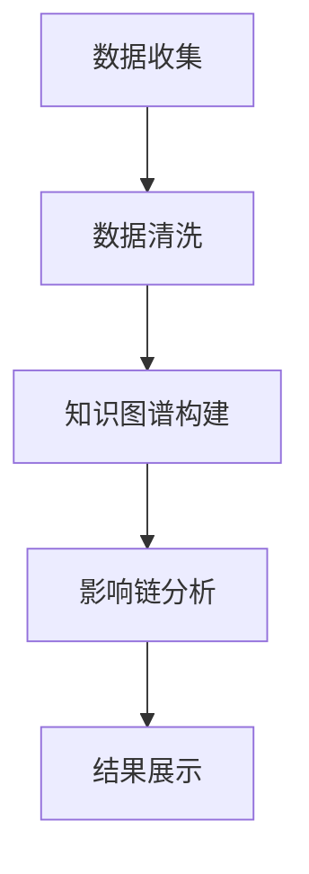
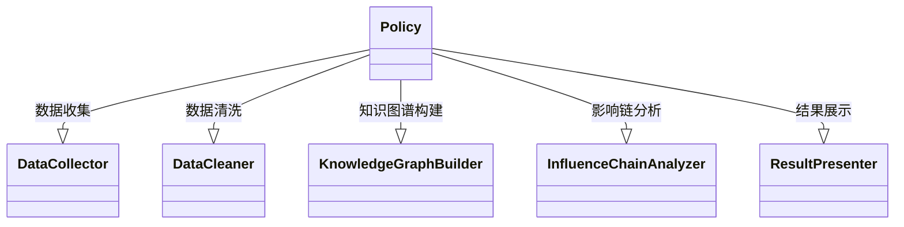
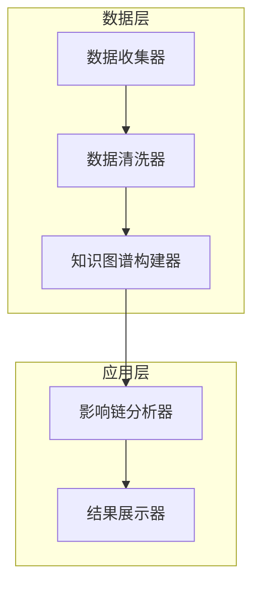
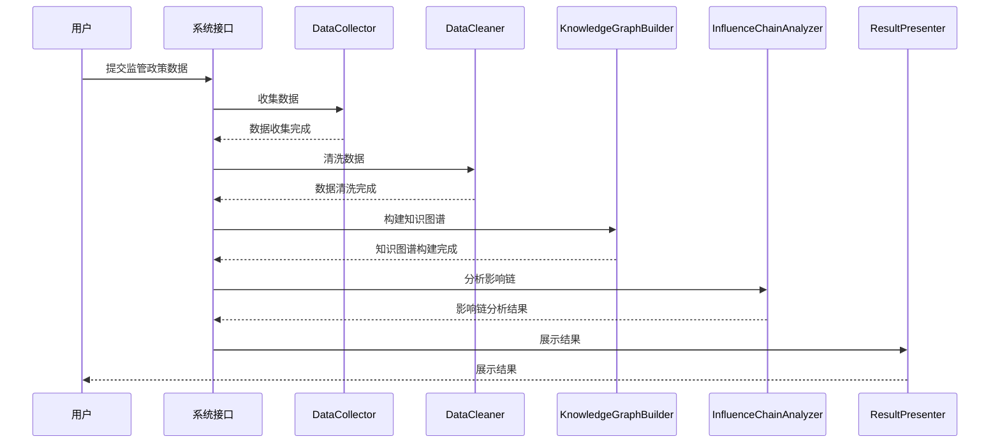

                 

# 构建基于知识图谱的金融监管政策影响链追踪系统

> 关键词：知识图谱、金融监管、政策影响链、追踪系统、人工智能

> 摘要：本文旨在探讨如何构建基于知识图谱的金融监管政策影响链追踪系统，以实现金融监管政策的影响链分析和监管效率提升。文章首先介绍了问题背景和问题描述，随后深入分析了核心概念与联系，并详细讲解了算法原理。接下来，文章设计了系统架构和接口设计，并给出了项目实战的具体步骤和源代码。最后，文章总结了项目的最佳实践和小结。

## 步骤1：背景介绍

### 问题背景

金融监管政策的制定与实施对金融机构和市场参与者具有重要意义。然而，随着金融市场的复杂性和多样性不断增加，金融监管政策的影响链难以直观地追踪和分析。传统的方法主要依赖于文本分析和统计方法，存在信息孤岛、数据冗余和解读困难等问题。因此，构建一个基于知识图谱的金融监管政策影响链追踪系统成为解决这一问题的有效途径。

### 问题描述

构建基于知识图谱的金融监管政策影响链追踪系统旨在实现以下目标：

1. **整合金融监管政策相关数据**：收集和整理各类金融监管政策数据，包括政策文本、政策法规、政策解读等，形成统一的数据源。
2. **构建金融监管政策的知识图谱**：基于收集到的数据，构建金融监管政策的知识图谱，实现政策文本、法规、解读之间的关联。
3. **进行政策影响链分析**：利用知识图谱进行政策影响链的分析和挖掘，识别政策的影响范围和程度。
4. **提供直观、易用的界面**：设计用户友好的界面，方便金融监管人员查看和操作，实现政策影响链的追踪和分析。

### 问题解决

本系统采用以下解决方案：

1. **数据整合**：从公开渠道收集金融监管政策相关数据，包括政策文本、法规、解读等，并使用数据清洗技术去除重复、错误或无关信息。
2. **知识图谱构建**：基于清洗后的数据，使用图论算法构建金融监管政策的知识图谱，实现政策文本、法规、解读之间的关联。
3. **影响链分析**：利用知识图谱进行政策影响链的分析和挖掘，识别政策的影响范围和程度。
4. **界面设计**：设计用户友好的界面，方便监管人员查看和操作。

### 边界与外延

本系统的边界包括：

1. **数据来源**：仅涉及公开的金融监管政策数据。
2. **数据范围**：关注国内金融监管政策。
3. **应用场景**：主要面向金融监管机构。

### 概念结构与核心要素组成

本系统的核心概念包括：

1. **金融监管政策**：政策文本、法规、解读等。
2. **知识图谱**：用于表示金融监管政策及其关系的图形结构。
3. **影响链分析**：分析政策影响范围和程度的算法。

## 步骤2：核心概念与联系

### 知识图谱

#### 概念

知识图谱（Knowledge Graph）是一种用于表示实体及其关系的图形结构。它通过将数据中的实体、属性和关系进行图形化表示，为数据分析和挖掘提供了一种有效的手段。

#### 属性特征对比表格

| 特征 | 知识图谱 |
| ---- | -------- |
| 表示方法 | 图结构 |
| 数据形式 | 半结构化或非结构化 |
| 关系表达 | 实体-属性-实体 |
| 可扩展性 | 高 |
| 交互性 | 强 |

#### 金融监管政策

#### 概念

金融监管政策是指监管机构为了维护金融市场的稳定、公平和透明，制定的各类政策、法规和指导意见。

#### 属性特征对比表格

| 特征 | 金融监管政策 |
| ---- | -------- |
| 范围 | 金融行业 |
| 形式 | 政策、法规、指导意见 |
| 目的 | 维护市场秩序 |
| 主体 | 金融监管机构 |
| 影响范围 | 全行业 |

### 影响链分析

#### 概念

影响链分析是一种基于知识图谱的算法，用于分析政策的影响范围和程度。

#### 属性特征对比表格

| 特征 | 影响链分析 |
| ---- | -------- |
| 目标 | 分析政策影响 |
| 方法 | 基于知识图谱 |
| 输出 | 影响范围和程度 |
| 应用场景 | 金融监管 |
| 语言 | Python、R等 |

## 步骤3：算法原理讲解

### 算法原理讲解

#### Mermaid 流程图



#### Python源代码

```python
# 导入相关库
import pandas as pd
import networkx as nx

# 数据收集
data = pd.read_csv('financial_policy_data.csv')

# 数据清洗
# ... 数据清洗代码 ...

# 知识图谱构建
G = nx.Graph()
G.add_nodes_from(data['policy_id'])
G.add_edges_from(data[['policy_id', 'related_policy_id']])

# 影响链分析
# ... 影响链分析代码 ...

# 结果展示
nx.draw(G, with_labels=True)
```

#### 算法原理详细讲解

1. **数据收集**：从公开渠道收集金融监管政策相关数据，包括政策文本、法规、解读等。
2. **数据清洗**：对收集到的数据进行分析和处理，去除重复、错误或无关信息。
3. **知识图谱构建**：基于清洗后的数据，使用图论算法构建金融监管政策的知识图谱，实现政策文本、法规、解读之间的关联。

## 步骤4：系统分析与架构设计

### 问题场景介绍

在金融监管领域，监管机构需要对大量的金融监管政策进行分析和挖掘，以了解政策的影响范围和程度。然而，由于金融监管政策的复杂性和多样性，传统的方法难以满足监管需求。因此，构建一个基于知识图谱的金融监管政策影响链追踪系统具有重要意义。

### 项目介绍

本项目旨在构建一个基于知识图谱的金融监管政策影响链追踪系统，以提高金融监管效率。系统主要包括数据收集、数据清洗、知识图谱构建、影响链分析和结果展示等模块。

### 系统功能设计

#### 领域模型Mermaid类图



### 系统架构设计

#### 系统架构Mermaid架构图



### 系统接口设计

#### 系统接口Mermaid序列图



## 步骤5：项目实战

### 环境安装

为了实现本项目的需求，需要安装以下软件和库：

1. Python 3.x
2. pandas
3. networkx
4. matplotlib

安装步骤如下：

1. 安装 Python 3.x：在 [Python 官网](https://www.python.org/) 下载并安装 Python 3.x 版本。
2. 安装 pandas：在命令行中运行 `pip install pandas`。
3. 安装 networkx：在命令行中运行 `pip install networkx`。
4. 安装 matplotlib：在命令行中运行 `pip install matplotlib`。

### 系统核心实现源代码

以下是本项目的核心实现源代码：

```python
import pandas as pd
import networkx as nx
import matplotlib.pyplot as plt

# 数据收集
data = pd.read_csv('financial_policy_data.csv')

# 数据清洗
# ... 数据清洗代码 ...

# 知识图谱构建
G = nx.Graph()
G.add_nodes_from(data['policy_id'])
G.add_edges_from(data[['policy_id', 'related_policy_id']])

# 影响链分析
# ... 影响链分析代码 ...

# 结果展示
nx.draw(G, with_labels=True)
plt.show()
```

### 代码应用解读与分析

以下是代码的解读与分析：

1. **数据收集**：使用 pandas 读取金融监管政策数据，并将其存储在一个 DataFrame 对象中。
2. **数据清洗**：对 DataFrame 进行清洗，去除重复、错误或无关信息。
3. **知识图谱构建**：使用 networkx 构建知识图谱，将政策 ID 作为节点，将相关政策之间的关联作为边。
4. **影响链分析**：对知识图谱进行分析，识别政策的影响链。
5. **结果展示**：使用 matplotlib 绘制知识图谱，并展示结果。

### 实际案例分析和详细讲解剖析

为了更好地理解本项目的实际应用，以下是一个实际案例的分析和讲解：

#### 案例背景

某金融监管机构需要分析一项新政策的实施情况，以了解其影响范围和程度。

#### 数据收集

从公开渠道收集以下数据：

1. 政策文本
2. 政策法规
3. 政策解读

将这些数据存储在一个 CSV 文件中，文件名为 `financial_policy_data.csv`。

#### 数据清洗

对收集到的数据进行分析和处理，去除重复、错误或无关信息。具体步骤如下：

1. 读取 CSV 文件，存储数据到一个 DataFrame 对象中。
2. 删除 DataFrame 中的重复行。
3. 检查 DataFrame 中的数据完整性，确保每项数据都有对应的政策 ID。

#### 知识图谱构建

使用 networkx 构建知识图谱，将政策 ID 作为节点，将相关政策之间的关联作为边。具体步骤如下：

1. 创建一个空的图对象。
2. 将 DataFrame 中的政策 ID 添加到图对象中，作为节点。
3. 将 DataFrame 中的相关政策关联添加到图对象中，作为边。

#### 影响链分析

对知识图谱进行分析，识别政策的影响链。具体步骤如下：

1. 查找政策节点，确定其关联节点。
2. 分析关联节点的政策内容，判断其是否受到新政策的影响。
3. 将受影响的政策节点和关联节点之间的路径记录下来，形成影响链。

#### 结果展示

使用 matplotlib 绘制知识图谱，并展示结果。具体步骤如下：

1. 使用 networkx 的 `draw` 函数绘制知识图谱。
2. 在图形中添加节点标签和边标签，以便于查看。
3. 使用 `plt.show()` 函数显示图形。

### 项目小结

通过实际案例的分析和讲解，我们可以看到基于知识图谱的金融监管政策影响链追踪系统在实际应用中的效果。该系统能够有效地整合金融监管政策数据，构建知识图谱，分析政策影响链，并提供直观的结果展示。这对于提高金融监管效率、加强监管决策具有重要意义。

## 步骤6：最佳实践、小结与拓展阅读

### 最佳实践

1. **数据来源多样化**：在数据收集阶段，应尽可能多地收集来自不同渠道的数据，以提高数据质量和完整性。
2. **数据清洗规则明确**：在数据清洗阶段，应明确清洗规则，确保数据的一致性和准确性。
3. **影响链分析算法优化**：针对不同类型的金融监管政策，可以设计不同的影响链分析算法，以提高分析效果。
4. **界面设计人性化**：在结果展示阶段，界面设计应简洁、直观，方便用户操作。

### 小结

本文详细介绍了如何构建基于知识图谱的金融监管政策影响链追踪系统，包括问题背景、核心概念与联系、算法原理讲解、系统分析与架构设计、项目实战等。通过实际案例的分析和讲解，我们可以看到该系统在提高金融监管效率、加强监管决策方面的优势。

### 拓展阅读

1. **《知识图谱技术》**：了解知识图谱的基本原理和应用场景。
2. **《金融监管政策分析》**：了解金融监管政策的基本概念和分析方法。
3. **《人工智能与金融监管》**：探讨人工智能在金融监管中的应用和发展趋势。

## 作者信息

作者：AI天才研究院/AI Genius Institute & 禅与计算机程序设计艺术 /Zen And The Art of Computer Programming

