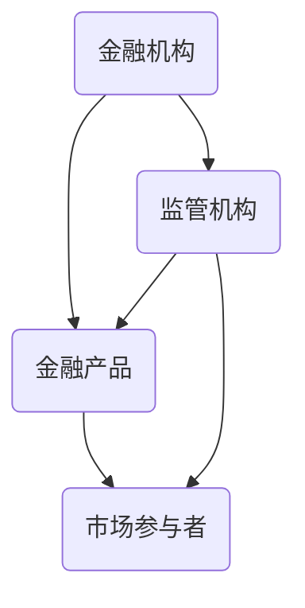

                 

### 第一部分: 背景与核心概念

#### 第1章: 金融监管与沙盒测试

##### 1.1.1 问题背景
金融监管在现代社会中扮演着至关重要的角色，它旨在维护金融市场的稳定，保护投资者权益，防范系统性风险。然而，随着金融科技的发展，金融监管面临着诸多挑战。首先，金融市场的复杂性和全球化使得监管机构难以全面监控所有金融活动。其次，金融创新带来的新型金融产品和服务增加了监管的难度。此外，信息不对称和监管套利等问题也使得金融监管难以有效实施。

##### 1.1.2 问题描述
金融监管面临的主要问题包括：

- **复杂性**：金融市场包含多种金融工具和交易模式，传统的监管方法难以应对复杂的市场结构。
- **透明度**：金融市场中的信息不对称使得监管机构难以获取全面的信息，影响监管决策的有效性。
- **合规成本**：金融机构需要遵守大量的法规和规定，合规成本高昂，影响了金融创新。
- **监管套利**：金融机构可能通过创新手段规避监管，增加了监管风险。

##### 1.1.3 问题解决
沙盒测试是一种创新的监管方式，通过在受控环境下测试新的金融产品和服务，可以降低监管风险，促进金融创新。沙盒测试为金融机构提供了一个试验平台，可以在不影响实际市场运行的情况下，验证新产品的可行性和风险。

##### 1.1.4 边界与外延
沙盒测试主要应用于以下场景：

- **新产品测试**：金融机构可以在沙盒中测试新的金融产品，验证其市场接受度和潜在风险。
- **新业务模式测试**：金融科技企业可以通过沙盒测试探索新的商业模式，降低试错成本。
- **监管合规测试**：沙盒测试可以帮助金融机构验证其合规性，确保新业务符合监管要求。

### 1.1.5 核心概念与联系

#### 知识图谱

知识图谱是一种用于表达实体及其之间关系的数据结构，通常以图的形式表示。在金融监管沙盒测试平台中，知识图谱可以用于整合不同来源的数据，建立监管知识库，辅助监管决策。

##### 知识图谱的定义
知识图谱是一种将信息组织成实体-关系模型的数据结构，其中实体代表个体（如金融机构、产品），关系表示实体之间的联系（如持股关系、业务关联）。

##### 知识图谱在金融监管沙盒测试平台中的价值
- **数据整合**：知识图谱可以整合来自不同数据源的信息，提供一个统一视图，帮助监管机构全面了解市场情况。
- **关系挖掘**：通过分析知识图谱中的关系，可以挖掘出潜在的监管风险，为监管决策提供支持。
- **智能化分析**：知识图谱结合自然语言处理和机器学习技术，可以实现对大量数据的智能化分析，提高监管效率。

### 1.1.6 概念结构与核心要素组成

知识图谱的核心要素包括：

- **实体**：代表具体的个体，如金融机构、金融产品。
- **属性**：描述实体的特征，如名称、类型、成立时间等。
- **关系**：表示实体之间的关联，如持股、业务合作等。
- **关系类型**：定义关系的性质，如直接持股、间接持股等。

#### 知识图谱的技术原理

知识图谱涉及的关键技术包括：

- **图数据库**：用于存储和管理图结构数据的数据库系统，如Neo4j、OrientDB等。
- **图算法**：用于分析和挖掘图结构数据的算法，如图遍历、社区发现等。
- **自然语言处理**：用于从非结构化文本中提取实体和关系，如命名实体识别、关系抽取等。
- **机器学习**：用于基于历史数据预测潜在的风险，如风险评估、预测分析等。

#### 实体关系图

为了更好地理解知识图谱，我们可以使用Mermaid绘制一个简单的实体关系图：



在这个图中，A代表金融机构，B代表金融产品，C代表监管机构，D代表市场参与者。关系线表示它们之间的联系，如金融机构发行金融产品、监管机构监督金融机构和市场参与者等。

##### 核心概念属性特征对比表格

| 名称 | 描述 | 属性 | 关系 |
| --- | --- | --- | --- |
| 金融机构 | 承担金融业务的企业 | 名称、成立时间、类型 | 持有金融产品、受监管 |
| 金融产品 | 金融机构发行的金融工具 | 类型、收益率、风险等级 | 被市场参与者持有 |
| 监管机构 | 负责金融市场监管的机构 | 名称、职能、成立时间 | 监督金融机构、市场参与者 |

通过上述背景介绍、问题描述、问题解决方法、边界与外延以及核心概念与联系的分析，我们为后续章节的深入探讨奠定了基础。

## 第2章: 知识图谱在金融监管中的应用

### 2.1.1 知识图谱的基本概念

知识图谱是一种将信息组织成实体-关系模型的数据结构，它通过实体和关系来表示现实世界中的复杂关系。在金融监管领域，知识图谱不仅可以用于整合和存储各种金融数据，还可以帮助监管机构更好地理解金融市场的运作机制，从而提高监管效率和准确性。

#### 知识图谱的定义

知识图谱由三个核心要素组成：实体、属性和关系。实体代表具体的个体，如金融机构、金融产品、市场参与者等；属性描述实体的特征，如名称、成立时间、类型等；关系表示实体之间的关联，如持股关系、业务合作等。通过这些要素，知识图谱可以构建一个全面、准确的金融知识库。

#### 知识图谱在金融监管中的价值

知识图谱在金融监管中的应用主要体现在以下几个方面：

1. **数据整合与分析**：知识图谱可以整合来自不同数据源的信息，提供一个统一视图，帮助监管机构全面了解市场情况。例如，监管机构可以通过知识图谱整合银行、保险、证券等不同金融领域的数据，形成完整的金融市场图谱。

2. **关系挖掘**：通过分析知识图谱中的关系，监管机构可以挖掘出潜在的监管风险，为监管决策提供支持。例如，监管机构可以通过知识图谱发现金融机构之间的关联关系，识别潜在的系统性风险。

3. **智能化分析**：知识图谱结合自然语言处理和机器学习技术，可以实现对大量数据的智能化分析，提高监管效率。例如，监管机构可以使用知识图谱进行风险评估、异常交易检测等。

#### 知识图谱的技术原理

知识图谱的技术原理主要包括以下几个方面：

1. **图数据库**：图数据库是用于存储和管理图结构数据的数据库系统，如Neo4j、OrientDB等。图数据库具有高性能的图遍历和关系查询能力，能够快速地处理复杂的图结构数据。

2. **图算法**：图算法用于分析和挖掘图结构数据，如图遍历、社区发现、路径分析等。这些算法可以帮助监管机构发现隐藏在数据背后的潜在关系和模式。

3. **自然语言处理**：自然语言处理技术用于从非结构化文本中提取实体和关系，如命名实体识别、关系抽取等。这些技术可以帮助监管机构从大量的文本数据中快速提取有用的信息。

4. **机器学习**：机器学习技术用于基于历史数据预测潜在的风险，如风险评估、预测分析等。机器学习模型可以训练出基于知识图谱的预测模型，帮助监管机构更准确地预测市场风险。

#### 实体关系图

为了更好地理解知识图谱，我们可以使用Mermaid绘制一个简单的实体关系图：


在这个图中，A代表金融机构，B代表金融产品，C代表监管机构，D代表市场参与者。关系线表示它们之间的联系，如金融机构发行金融产品、监管机构监督金融机构和市场参与者等。

### 2.1.2 知识图谱在金融监管中的应用

知识图谱在金融监管中的应用可以归纳为以下几个方面：

1. **监管数据的整合与管理**：通过知识图谱，监管机构可以整合来自不同数据源的信息，构建一个统一的监管数据平台。这有助于提高数据的一致性和完整性，为监管决策提供全面的支持。

2. **风险评估与监测**：知识图谱可以帮助监管机构进行风险评估和监测。通过分析金融机构之间的关联关系，监管机构可以识别潜在的系统性风险，及时采取监管措施。

3. **监管合规性检查**：知识图谱可以用于检查金融机构的合规性。通过分析金融机构的业务流程和交易记录，监管机构可以识别潜在的违规行为，确保金融机构遵守监管规定。

4. **监管报告与决策支持**：知识图谱可以生成详细的监管报告，为监管决策提供支持。监管机构可以通过知识图谱分析市场趋势、风险状况等信息，制定更加科学和有效的监管策略。

### 2.1.3 知识图谱与金融监管沙盒测试平台的结合

知识图谱与金融监管沙盒测试平台的结合可以带来以下优势：

1. **提高测试效率**：知识图谱可以帮助监管机构快速构建监管沙盒，提高测试效率。通过知识图谱，监管机构可以快速整合和管理测试所需的数据，为测试提供全面的数据支持。

2. **降低测试风险**：知识图谱可以帮助监管机构识别潜在的测试风险。通过分析金融机构之间的关联关系，监管机构可以识别出可能影响测试结果的关键因素，从而降低测试风险。

3. **提高测试质量**：知识图谱可以用于评估测试结果的可靠性。通过分析知识图谱中的关系，监管机构可以验证测试结果的合理性，确保测试结果的准确性。

4. **支持持续迭代**：知识图谱可以帮助监管机构持续优化监管沙盒测试平台。通过不断更新知识图谱，监管机构可以适应市场变化，及时调整测试策略，提高监管效果。

### 2.1.4 知识图谱在金融监管沙盒测试平台中的具体实现

在金融监管沙盒测试平台中，知识图谱的具体实现包括以下几个方面：

1. **数据收集与整合**：首先，需要收集与金融监管相关的数据，包括金融机构、金融产品、市场参与者等。然后，使用自然语言处理技术提取实体和关系，构建知识图谱。

2. **知识图谱构建**：使用图数据库存储和管理知识图谱。通过定义实体和关系的属性，构建完整的金融知识库。

3. **关系分析**：利用图算法对知识图谱进行分析，挖掘潜在的监管风险。例如，通过分析金融机构之间的关联关系，识别出可能存在的系统性风险。

4. **测试案例构建**：根据知识图谱中的关系，构建沙盒测试案例。通过模拟不同的市场场景，评估金融产品的合规性和风险状况。

5. **测试结果评估**：对测试结果进行分析和评估，识别出潜在的监管问题。然后，根据测试结果调整知识图谱，优化测试策略。

通过上述步骤，知识图谱在金融监管沙盒测试平台中可以发挥重要作用，为监管机构提供全面、准确的监管数据和支持。

## 第3章: 金融监管沙盒测试平台的设计原则

### 3.1.1 设计原则

金融监管沙盒测试平台的设计原则主要包括以下几个方面：

1. **可扩展性与灵活性**：平台应具备良好的可扩展性和灵活性，能够适应不同类型和规模的金融产品和服务测试需求。这包括能够快速集成新的金融工具和业务模式，以及能够灵活调整测试环境和参数。

2. **安全性**：平台必须具备严格的安全措施，确保测试过程中数据的机密性、完整性和可用性。这包括数据加密、访问控制、安全审计等功能。

3. **数据完整性**：平台应确保所有测试数据的有效性和准确性，避免数据丢失或篡改。这需要建立完善的数据备份和恢复机制。

4. **监管合规性**：平台设计应遵循相关金融监管法规，确保测试结果符合监管要求。这包括数据报告、合规检查等功能。

5. **可维护性**：平台应设计得易于维护和升级，降低长期运行成本。这包括模块化设计、清晰的接口定义和良好的文档。

### 3.1.2 沙盒测试平台的功能模块

沙盒测试平台通常包括以下功能模块：

1. **数据收集与管理模块**：用于收集来自不同数据源的金融数据，包括市场数据、企业数据、交易数据等。该模块应支持数据清洗、转换和整合，为后续分析提供可靠的数据基础。

2. **知识图谱构建模块**：用于构建金融监管领域的知识图谱。该模块应支持实体和关系的定义、存储、查询和分析，为监管沙盒提供知识支持。

3. **测试环境配置模块**：用于创建和管理测试环境，包括虚拟服务器、数据库、网络配置等。该模块应支持自动化部署和管理，提高测试效率。

4. **测试用例管理模块**：用于管理测试用例，包括测试案例的设计、执行和结果记录。该模块应支持多种测试场景和测试策略，确保测试的全面性和有效性。

5. **监控与报告模块**：用于实时监控测试环境的状态，生成测试报告和数据分析报告。该模块应提供直观的界面和丰富的数据分析工具，帮助监管机构评估测试结果。

6. **合规检查模块**：用于检查测试过程中的合规性，确保所有测试活动符合监管要求。该模块应支持自动化合规检查和人工审核，提高合规性管理效率。

### 3.1.3 平台架构设计

沙盒测试平台的架构设计应遵循系统分层原则，确保各模块之间的松耦合和模块化。以下是平台的基本架构设计：

1. **数据层**：包括数据库和数据存储系统，用于存储和管理金融数据。该层应支持分布式存储和实时数据更新，确保数据的可靠性和可用性。

2. **服务层**：包括各种功能服务，如数据收集服务、知识图谱构建服务、测试环境配置服务等。这些服务通过接口与外部系统进行交互，实现业务逻辑的解耦。

3. **应用层**：包括前端应用和后端应用。前端应用提供用户界面，后端应用提供业务逻辑处理和数据接口。该层应支持多终端访问，确保平台的易用性和灵活性。

4. **管理层**：包括监控与报告服务、合规检查服务等。这些服务用于监控平台运行状态、生成报告和进行合规性检查。

通过上述设计原则、功能模块和架构设计，金融监管沙盒测试平台可以实现高效、安全、合规的测试环境，为金融监管提供有力支持。

## 第4章: 知识图谱建模

### 4.1.1 建模方法

在构建金融监管沙盒测试平台的过程中，知识图谱建模是一个关键步骤。知识图谱建模方法通常包括以下几种：

1. **ER模型转换**：将实体-关系模型（Entity-Relationship Model，ER模型）转换为知识图谱。ER模型是数据库设计中的常用方法，通过定义实体、属性和关系来描述系统的数据结构。将ER模型转换为知识图谱，可以保留其结构化的特性，同时增强数据的关联性和灵活性。

2. **直接构建**：直接从现有的数据源或业务场景中提取实体和关系，构建知识图谱。这种方法适用于数据源结构化程度较高的情况，如关系数据库中的数据。通过直接构建，可以快速建立知识图谱，但需要对业务和数据有深入的理解。

3. **自动化抽取**：利用自然语言处理（Natural Language Processing，NLP）和机器学习技术，从非结构化文本数据中自动抽取实体和关系。这种方法适用于处理大量文本数据，如新闻报道、社交媒体等。自动化抽取可以提高建模效率，但需要精确的文本处理技术和大量的训练数据。

### 4.1.2 知识表示

在知识图谱建模中，实体和关系是核心概念。实体表示具体的个体，如金融机构、金融产品、市场参与者等，而关系表示实体之间的关联，如持股关系、业务合作等。

1. **实体表示**：
   - **属性**：实体的属性用于描述其实际特征。例如，金融机构的属性包括名称、成立时间、注册资本等。属性的表示方式可以是字符串、数字、日期等。
   - **分类**：实体可以根据其类型进行分类。例如，金融机构可以分为银行、保险、证券等。分类有助于管理和查询实体。

2. **关系表示**：
   - **关系类型**：关系类型用于定义实体之间的关联性质。例如，持股关系、业务合作等。关系类型可以是单向或双向，具体取决于业务场景。
   - **权重**：在某些情况下，关系可能具有权重，表示关系的强度或频率。例如，持股关系的权重可以表示持股比例。

### 4.1.3 实体关系图

实体关系图（Entity Relationship Diagram，ERD）是用于表示知识图谱结构的一种可视化工具。在金融监管沙盒测试平台中，ERD可以帮助我们清晰地理解实体和关系之间的关联。

以下是一个简单的金融监管沙盒测试平台的ERD示例，使用Mermaid语法表示：

```mermaid
graph TB
A[金融机构] --> B{金融产品}
A --> C[监管机构]
B --> D[市场参与者}
C --> B
C --> D

subgraph 数据源
    E[客户信息]
    F[交易记录]
end

subgraph 数据处理
    G[数据清洗]
    H[数据转换]
end

subgraph 数据存储
    I[知识图谱数据库]
end
```

在这个ERD中，A代表金融机构，B代表金融产品，C代表监管机构，D代表市场参与者。实体之间的关系通过箭头表示，如金融机构发行金融产品（A --> B）、监管机构监督金融机构（A --> C）等。

通过ERD，我们可以直观地看到实体和关系之间的结构，为知识图谱的建模和后续的分析提供了便利。

### 4.1.4 Mermaid ER图

Mermaid是一种简单易用的Markdown扩展语言，可以用于绘制各种图表，包括实体关系图（ERD）。以下是一个使用Mermaid绘制的简单ER图的示例：

```mermaid
erGraph
Entity [Entity]
Relation [Relation]

Entity ..|> Relation
```

在这个示例中，`Entity` 和 `Relation` 分别表示实体和关系。使用 `..|>` 连接符表示实体与关系之间的关联。

通过Mermaid ER图，我们可以更加直观地理解实体和关系之间的结构，这对于知识图谱的建模和分析具有重要意义。

### 4.1.5 知识图谱的构建过程

构建知识图谱通常包括以下步骤：

1. **数据收集**：收集与金融监管相关的数据，如金融机构、金融产品、市场参与者等。数据来源可以包括公开数据、内部数据等。

2. **数据预处理**：对收集到的数据进行清洗、转换和整合，确保数据的一致性和完整性。

3. **实体和关系的定义**：根据业务需求，定义实体和关系的属性和类型。例如，金融机构的属性包括名称、成立时间、注册资本等；关系的类型包括持股关系、业务合作等。

4. **构建知识图谱**：使用图数据库（如Neo4j）存储和管理知识图谱。将实体和关系存储为图结构数据，并建立索引以提高查询效率。

5. **实体和关系的添加**：根据新收集的数据，不断更新知识图谱，添加新的实体和关系。

6. **查询和分析**：利用图数据库的查询功能，分析知识图谱中的实体和关系，发现潜在的风险和问题。

### 4.1.6 知识图谱的应用案例

知识图谱在金融监管沙盒测试平台中的应用案例包括：

1. **风险评估**：通过分析知识图谱中的关系，识别潜在的系统性风险。例如，通过分析金融机构之间的持股关系，发现可能存在的风险传递。

2. **合规检查**：利用知识图谱检查金融机构的合规性。例如，通过分析金融机构的交易记录，检查其是否违反监管规定。

3. **市场监控**：通过分析知识图谱中的市场数据，监控市场的动态变化。例如，通过分析金融机构的业绩和财务状况，预测市场趋势。

通过知识图谱的构建和应用，金融监管沙盒测试平台可以更加有效地支持监管工作，提高监管效率和准确性。

## 第5章: 数据处理与清洗

### 5.1.1 数据来源

金融监管沙盒测试平台所需的数据来源多样且复杂，主要包括以下几类：

1. **公开数据**：包括市场数据、财务报表、信用评级等，通常来源于证券交易所、金融监管机构、信用评级公司等。这些数据是构建知识图谱和进行风险评估的重要基础。

2. **内部数据**：来自金融机构的内部数据，如客户交易记录、财务数据、员工信息等。这些数据对于了解金融机构的业务活动和合规状况至关重要。

3. **社交媒体数据**：来自社交媒体平台、新闻网站等的非结构化数据，如新闻报道、社交媒体评论、投资者讨论等。这些数据可以提供市场情绪和公众观点，对风险评估和监管决策有一定参考价值。

4. **第三方数据**：来自第三方数据提供商的数据，如地理位置信息、人口统计数据、经济指标等。这些数据可以补充和完善监管沙盒中的数据集。

### 5.1.2 数据预处理

数据预处理是确保数据质量和为后续分析提供基础的关键步骤。数据预处理包括以下几个主要环节：

1. **数据收集**：从不同数据源收集所需的数据，包括结构化和非结构化数据。

2. **数据清洗**：清洗数据中的噪声和错误，包括去除重复记录、纠正数据格式、填补缺失值等。例如，将字符串数据统一转换为标准格式，填补缺失的交易记录等。

3. **数据转换**：将不同格式的数据转换为统一的格式，如将Excel文件转换为JSON格式，以便后续处理和分析。

4. **数据整合**：将来自不同数据源的数据整合到一个统一的数据集中，形成一个完整的视图。这通常涉及到数据对齐、数据映射和数据合成等操作。

5. **数据标准化**：对数据进行标准化处理，如统一货币单位、日期格式等，确保数据的一致性和可比性。

### 5.1.3 数据清洗与转换

数据清洗与转换是数据预处理的重要环节，具体操作如下：

1. **去除重复数据**：使用去重算法去除数据集中的重复记录，确保数据的唯一性。

2. **数据格式转换**：将不同来源的数据转换为统一的格式，如将CSV文件转换为JSON格式，便于后续处理和分析。

3. **缺失值处理**：对缺失的数据进行填补，常见的方法包括平均值填补、中值填补、前值填补等。

4. **异常值检测**：使用统计方法或机器学习方法检测数据中的异常值，并将其标记或删除。

5. **数据归一化**：对数据进行归一化处理，如将货币单位统一转换为同一货币，将日期格式统一为YYYY-MM-DD等。

### 5.1.4 数据质量评估

数据质量是金融监管沙盒测试平台有效运行的基础，因此对数据质量进行评估至关重要。数据质量评估主要包括以下方面：

1. **完整性**：检查数据是否完整，是否存在缺失或空值。

2. **准确性**：检查数据是否准确，是否存在错误或异常值。

3. **一致性**：检查数据是否一致，是否存在矛盾或重复。

4. **及时性**：检查数据是否及时更新，是否能够反映最新的市场状况。

5. **可靠性**：检查数据来源是否可靠，是否有权威性。

评估方法包括：

- **统计方法**：使用统计指标（如平均值、标准差、缺失率等）评估数据质量。
- **机器学习方法**：使用机器学习模型检测数据中的异常值和错误。
- **专家评审**：邀请领域专家对数据质量进行评审，提出改进建议。

通过数据质量评估，可以识别和纠正数据中的问题，提高数据的可靠性和有效性，为金融监管沙盒测试平台提供高质量的数据支持。

### 5.1.5 数据质量标准

为确保金融监管沙盒测试平台的数据质量，需要制定一系列数据质量标准，包括：

1. **数据完整性**：数据应完整，无缺失或空值，确保数据的全面性。

2. **数据准确性**：数据应准确无误，确保数据的真实性和可靠性。

3. **数据一致性**：数据在不同来源和不同时间点应保持一致，确保数据的一致性和可比性。

4. **数据及时性**：数据应能够及时更新，反映最新的市场状况，确保数据的时效性。

5. **数据可靠性**：数据来源应可靠，具有权威性，确保数据的可信度。

6. **数据可追溯性**：数据应具有可追溯性，确保数据的来源和变化历史能够被查询和验证。

通过制定和遵循这些数据质量标准，可以确保金融监管沙盒测试平台的数据质量和可靠性，提高监管决策的科学性和准确性。

## 第6章: 沙盒测试平台的开发

### 6.1.1 开发环境搭建

搭建金融监管沙盒测试平台的第一步是配置开发环境，确保具备所有必要的软件和硬件条件。以下是搭建开发环境的详细步骤：

1. **操作系统选择**：
   - **Linux**：推荐使用Ubuntu或CentOS等Linux发行版，因为它们在服务器环境下表现稳定，并且有许多开源工具和库支持。
   - **Windows**：虽然Windows也可以作为开发环境，但部分开源工具可能不支持，因此建议选择Linux。

2. **硬件配置**：
   - **服务器**：选择性能稳定的服务器，配置应满足开发环境和测试环境的需求。至少需要配备：
     - CPU：至少8核，频率3.0GHz以上
     - 内存：至少16GB
     - 硬盘：至少1TB SSD硬盘
     - 网络带宽：至少1Gbps

3. **软件安装**：
   - **开发工具**：安装常用的开发工具，如Java、Python、Node.js等，根据项目需求选择合适的编程语言。
   - **数据库**：安装图数据库，如Neo4j，用于存储和管理知识图谱。
   - **版本控制**：安装Git，用于版本控制和团队协作。

4. **环境配置**：
   - **数据库配置**：配置Neo4j数据库，设置用户、密码和数据存储路径。
   - **系统配置**：调整服务器系统参数，如网络配置、安全策略等，确保系统稳定运行。

### 6.1.2 系统功能模块设计

金融监管沙盒测试平台的功能模块设计是系统开发的核心步骤，确保平台能够满足监管需求和业务逻辑。以下是系统功能模块的详细设计：

1. **数据收集与管理模块**：
   - 功能：负责从各种数据源收集金融数据，包括公开数据、内部数据等。
   - 子模块：
     - 数据采集器：使用API或Web爬虫等技术，自动采集数据。
     - 数据清洗器：清洗、转换和整合收集到的数据，确保数据质量。

2. **知识图谱构建模块**：
   - 功能：构建和维护金融监管领域的知识图谱，用于数据分析和风险监测。
   - 子模块：
     - 实体和关系管理器：定义和管理知识图谱中的实体和关系。
     - 知识库管理器：存储和管理知识图谱，支持实时更新和查询。

3. **测试环境配置模块**：
   - 功能：创建和管理测试环境，包括虚拟服务器、数据库、网络配置等。
   - 子模块：
     - 虚拟机管理器：管理虚拟机，为测试提供隔离的环境。
     - 网络配置器：配置网络环境，确保测试网络的隔离性和安全性。

4. **测试用例管理模块**：
   - 功能：管理测试用例，包括设计、执行和结果记录。
   - 子模块：
     - 测试用例编辑器：设计测试用例，定义测试场景和预期结果。
     - 测试执行器：执行测试用例，记录测试结果。

5. **监控与报告模块**：
   - 功能：实时监控测试环境的状态，生成测试报告和数据分析报告。
   - 子模块：
     - 监控器：监控测试环境，包括服务器性能、网络状态等。
     - 报告生成器：生成详细的测试报告，支持多种格式输出。

6. **合规检查模块**：
   - 功能：检查测试过程中的合规性，确保所有测试活动符合监管要求。
   - 子模块：
     - 合规规则库：定义合规检查规则，包括数据合规性、流程合规性等。
     - 合规检查器：执行合规检查，标记和报告违规行为。

### 6.1.3 系统接口设计

系统接口设计是确保平台各模块之间高效通信和协同工作的关键。以下是系统接口设计的主要方面：

1. **内部接口**：
   - **RESTful API**：提供统一的接口规范，支持数据收集、知识图谱构建、测试用例管理等功能的内部调用。
   - **消息队列**：使用消息队列（如RabbitMQ、Kafka）实现模块间的异步通信，提高系统的可靠性和扩展性。

2. **外部接口**：
   - **API网关**：作为外部访问的统一入口，处理外部请求的路由、认证、限流等。
   - **第三方服务接口**：集成第三方数据服务（如天气API、地理位置API等），为测试提供外部数据支持。

3. **接口定义**：
   - **接口规范**：使用OpenAPI规范（Swagger）定义接口的请求和响应结构，便于开发和文档化。
   - **接口实现**：根据接口规范实现具体的接口逻辑，确保接口的稳定性和性能。

4. **安全性**：
   - **认证与授权**：采用OAuth2.0等认证机制，确保接口访问的安全性。
   - **数据加密**：对传输的数据进行加密处理，防止数据泄露。

通过详细的开发环境搭建、系统功能模块设计和系统接口设计，金融监管沙盒测试平台可以高效、安全地运行，为金融监管提供有力支持。

### 6.1.4 系统开发流程

在金融监管沙盒测试平台的开发过程中，遵循合理的开发流程是确保项目成功的关键。以下是系统开发流程的详细步骤：

1. **需求分析**：
   - 与监管机构、金融机构等利益相关者进行深入沟通，明确平台的功能需求和性能要求。
   - 编写需求文档，包括功能需求、性能需求、安全需求等，作为后续开发的依据。

2. **系统设计**：
   - 进行系统架构设计，包括数据层、服务层、应用层和展示层的架构设计。
   - 设计数据库模型，包括实体关系图（ERD）和数据库表结构。
   - 设计接口规范，包括内部接口和外部接口的定义，确保接口的稳定性和性能。

3. **编码实现**：
   - 根据设计文档进行编码实现，采用模块化开发，确保代码的可维护性和可扩展性。
   - 使用版本控制工具（如Git）进行代码管理和版本跟踪。

4. **单元测试**：
   - 对每个模块进行单元测试，确保模块的功能和性能符合预期。
   - 使用自动化测试工具（如JUnit、pytest）进行测试，提高测试效率。

5. **集成测试**：
   - 将各个模块集成到一起，进行集成测试，确保系统整体的功能和性能符合要求。
   - 修复集成测试中发现的问题，并进行回归测试。

6. **性能优化**：
   - 对系统进行性能测试，发现性能瓶颈，进行优化。
   - 使用缓存、数据库索引、负载均衡等技术提高系统性能。

7. **安全测试**：
   - 对系统进行安全测试，包括漏洞扫描、弱密码检测、权限控制等，确保系统的安全性。
   - 修复安全测试中发现的安全问题，并进行重新测试。

8. **上线部署**：
   - 准备上线环境，包括服务器、数据库、网络等。
   - 按照部署文档进行系统部署，确保系统平稳上线。

9. **运维维护**：
   - 监控系统运行状态，确保系统稳定运行。
   - 定期进行系统升级和优化，保持系统的健康状态。

通过上述开发流程，金融监管沙盒测试平台可以高效、安全地实现，为金融监管提供强有力的技术支持。

## 第7章: 沙盒测试平台搭建实战

### 7.1.1 环境配置

搭建金融监管沙盒测试平台的第一步是配置开发环境和测试环境。以下是详细的步骤和注意事项：

1. **安装操作系统**：
   - 选择Linux发行版，如Ubuntu 20.04 LTS。
   - 使用虚拟机软件（如VirtualBox）创建新的虚拟机，配置至少8GB内存和1TB SSD硬盘。
   - 镜像选择Ubuntu 20.04 LTS镜像，启动虚拟机并安装操作系统。

2. **更新系统**：
   - 开机后，使用终端执行以下命令更新系统：
     ```bash
     sudo apt update
     sudo apt upgrade
     ```
   - 确保系统软件包是最新的，以支持后续安装的软件。

3. **安装开发工具**：
   - 安装Java开发工具包（JDK）：
     ```bash
     sudo apt install openjdk-11-jdk
     ```
   - 安装Python开发环境：
     ```bash
     sudo apt install python3-pip
     ```
   - 安装Node.js：
     ```bash
     curl -sL https://deb.nodesource.com/setup_14.x | sudo -E bash -
     sudo apt install nodejs
     ```

4. **安装数据库**：
   - 安装Neo4j图数据库：
     ```bash
     wget https://download.neo4j.com/bin/platforms/centos-7/x86_64/stable/neo4j-4.0.0-unix.tar.gz
     tar -xvzf neo4j-4.0.0-unix.tar.gz
     cd neo4j-4.0.0
     ./bin/neo4j start
     ```
   - 配置Neo4j数据库，设置管理员密码。

5. **安装版本控制工具**：
   - 安装Git：
     ```bash
     sudo apt install git
     ```

6. **配置SSH密钥**：
   - 生成SSH密钥对：
     ```bash
     ssh-keygen -t rsa -b 2048 -f ~/.ssh/id_rsa -N ""
     ```
   - 将公钥（id_rsa.pub）添加到GitHub或GitLab等代码托管平台的SSH密钥中。

### 7.1.2 知识图谱构建

在配置完开发环境后，下一步是构建金融监管领域的知识图谱。以下是具体的步骤：

1. **设计实体和关系**：
   - 定义实体，如金融机构、金融产品、市场参与者等。
   - 定义关系，如持股关系、业务合作等。
   - 创建实体和关系的属性，如金融机构的名称、成立时间、类型等。

2. **导入数据**：
   - 使用Neo4j的Cypher查询语言导入数据。例如，以下是一个简单的Cypher语句，用于创建金融机构实体：
     ```cypher
     CREATE (f1:金融机构 {名称: "银行A", 成立时间: "2010-01-01", 类型: "商业银行"})
     ```
   - 重复上述步骤，创建其他金融机构、金融产品和市场参与者的实体。

3. **建立关系**：
   - 使用Cypher语句建立实体之间的关系。例如，以下语句用于建立金融机构与金融产品之间的持股关系：
     ```cypher
     MATCH (f1:金融机构), (p1:金融产品)
     WHERE f1.名称 = "银行A" AND p1.名称 = "产品A"
     CREATE (f1)-[:持有]->(p1)
     ```

4. **数据清洗和整合**：
   - 使用Python等编程语言，编写数据清洗脚本，确保数据的一致性和准确性。
   - 使用Neo4j的API，将清洗后的数据导入知识图谱中。

### 7.1.3 测试案例

为了验证沙盒测试平台的有效性，我们需要设计并执行测试案例。以下是具体的测试案例：

1. **风险评估测试**：
   - 设计测试用例，模拟金融机构的风险状况。
   - 使用Cypher查询语句，分析金融机构之间的持股关系和业务合作，评估潜在的系统性风险。

2. **合规性检查测试**：
   - 设计测试用例，检查金融机构是否遵守监管规定。
   - 使用Cypher查询语句，检查金融产品的风险等级、收益率等，确保其符合监管要求。

3. **市场监控测试**：
   - 设计测试用例，监控市场的动态变化。
   - 使用Cypher查询语句，分析市场参与者的交易记录和财务状况，预测市场趋势。

### 7.1.4 案例设计与实现

以下是具体的一个测试案例：**风险评估测试**。

1. **案例设计**：
   - 设计一个测试场景，模拟某金融机构因市场波动而面临的风险。
   - 预期结果：通过分析金融机构的持股关系和业务合作，识别出潜在的风险点。

2. **实现步骤**：
   - 准备测试数据，包括金融机构、金融产品和市场参与者的基本信息。
   - 使用Cypher查询语句，建立金融机构和金融产品之间的持股关系：
     ```cypher
     MATCH (f1:金融机构 {名称: "银行A"}), (p1:金融产品 {名称: "产品A"})
     CREATE (f1)-[:持有]->(p1)
     ```
   - 模拟市场波动，更新金融产品的收益率：
     ```cypher
     MATCH (p1:金融产品 {名称: "产品A"})
     SET p1.收益率 = 5.5
     ```
   - 执行风险评估查询，分析金融机构的持股关系和业务合作：
     ```cypher
     MATCH (f1:金融机构)-[:持有]->(p1:金融产品)
     WHERE p1.收益率 > 5
     RETURN f1.名称, p1.名称
     ```
   - 根据查询结果，识别出潜在的风险点，如银行A持有的产品A收益率高于5%，可能面临较大的市场风险。

3. **结果分析**：
   - 分析查询结果，识别出高风险的金融机构和金融产品。
   - 根据分析结果，提出相应的监管措施，如要求银行A加强风险管理，降低产品A的收益率。

通过上述实战案例，我们可以看到如何使用金融监管沙盒测试平台进行风险评估，识别潜在风险，为监管决策提供支持。

## 第8章: 平台运行与优化

### 8.1.1 平台运行原理

金融监管沙盒测试平台的运行原理主要基于以下技术模块和数据处理流程：

1. **数据收集模块**：平台首先通过API接口、Web爬虫等技术手段，从不同数据源（如证券交易所、金融监管机构、第三方数据提供商等）收集金融数据。收集的数据包括市场数据、金融机构数据、金融产品数据等。

2. **数据预处理模块**：收集到的原始数据经过清洗、转换和整合，去除噪声和错误，确保数据的一致性和完整性。预处理后的数据将被存储在图数据库（如Neo4j）中，以便后续分析和查询。

3. **知识图谱构建模块**：使用图数据库存储和管理知识图谱。通过定义实体（如金融机构、金融产品、市场参与者等）和关系（如持股关系、业务合作等），构建金融监管领域的知识图谱。

4. **测试执行模块**：根据预设的测试用例，平台在受控环境中模拟不同的市场情景，执行风险评估、合规性检查等测试任务。测试过程中，平台会实时记录测试结果，并对测试结果进行分析和评估。

5. **监控与报告模块**：平台实时监控系统的运行状态，包括服务器性能、网络状态、数据存储等。监控数据将被用于生成详细的测试报告和数据分析报告，为监管决策提供支持。

### 8.1.2 性能优化

为了确保金融监管沙盒测试平台的高性能和稳定性，需要进行以下性能优化：

1. **数据库优化**：
   - **索引优化**：为常用的查询字段建立索引，提高查询效率。
   - **缓存策略**：使用缓存技术（如Redis）缓存高频访问的数据，减少数据库的负载。
   - **分片与分布式存储**：通过分片和分布式存储技术，提高数据存储和查询的性能。

2. **网络优化**：
   - **负载均衡**：使用负载均衡器（如Nginx）分发请求，确保系统的处理能力。
   - **网络隔离**：为测试环境配置独立的网络，防止外部网络对测试过程的干扰。

3. **服务器优化**：
   - **资源调配**：根据系统负载，动态调整服务器资源分配，确保系统在高负载下仍能稳定运行。
   - **服务器集群**：通过服务器集群，实现负载均衡和高可用性，提高系统的可靠性。

4. **代码优化**：
   - **代码优化**：通过代码优化，减少不必要的资源消耗，提高系统的运行效率。
   - **异步处理**：使用异步处理技术（如异步IO、消息队列等），提高系统的响应速度。

### 8.1.3 安全性保障

为了保证金融监管沙盒测试平台的安全性，需要采取以下措施：

1. **访问控制**：
   - **用户认证**：使用强密码和多因素认证，确保只有授权用户才能访问系统。
   - **权限管理**：实施严格的权限管理，确保用户只能访问其授权的数据和功能。

2. **数据加密**：
   - **传输加密**：使用TLS/SSL等加密协议，确保数据在传输过程中的安全性。
   - **存储加密**：对存储在数据库中的敏感数据（如用户密码、交易记录等）进行加密处理。

3. **安全审计**：
   - **日志记录**：记录系统运行日志，监控所有操作和访问行为。
   - **异常检测**：使用安全审计工具，实时监测系统异常，及时发现和阻止潜在的安全威胁。

4. **备份与恢复**：
   - **定期备份**：定期备份系统和数据，确保在发生故障时能够快速恢复。
   - **灾备方案**：建立灾备中心，确保在发生灾难时系统能够快速恢复。

通过上述性能优化和安全性保障措施，金融监管沙盒测试平台可以确保在高效、安全、稳定的环境下运行，为金融监管提供有力支持。

### 8.1.4 案例分析与效果评估

为了更直观地展示金融监管沙盒测试平台在实际应用中的效果，我们可以通过一个具体案例进行分析与效果评估。

#### 案例背景

某金融科技公司开发了一种新型金融产品——智能投资组合，旨在通过大数据分析和人工智能算法为投资者提供个性化的投资建议。该产品在推出前需要进行严格的监管沙盒测试，以确保其合规性和风险可控。

#### 案例步骤

1. **数据收集与预处理**：平台从多个数据源（如证券交易所、金融监管机构、第三方数据提供商等）收集相关数据，包括市场行情、金融产品信息、客户交易记录等。数据经过清洗、转换和整合，确保数据的一致性和完整性。

2. **知识图谱构建**：将预处理后的数据导入Neo4j图数据库，构建金融监管领域的知识图谱。知识图谱包括实体（如金融机构、金融产品、市场参与者等）和关系（如持股关系、业务合作等）。

3. **测试用例设计**：
   - **风险评估测试**：模拟不同的市场情景，测试智能投资组合的稳定性和风险控制能力。例如，在市场波动较大的情况下，测试组合的投资建议是否合理。
   - **合规性检查测试**：检查智能投资组合的运营是否符合监管要求，包括交易限制、风险披露等。

4. **测试执行与结果分析**：执行预设的测试用例，记录测试结果，并进行分析。平台通过知识图谱分析发现，在某些市场情景下，智能投资组合存在较大的投资风险。例如，在市场大幅下跌时，组合中的某些高风险金融产品表现不佳，可能导致整体风险偏高。

5. **监管反馈与调整**：根据测试结果，金融科技公司对智能投资组合进行调整，优化算法和投资策略，降低风险。调整后的组合在再次测试中表现良好，符合监管要求。

#### 效果评估

通过上述案例，金融监管沙盒测试平台实现了以下效果：

1. **风险可控**：通过风险评估测试，平台成功识别出智能投资组合中的潜在风险点，为金融科技公司提供了有针对性的改进建议，确保产品在推出前风险可控。

2. **合规性保障**：通过合规性检查测试，平台验证了智能投资组合的运营合规性，确保产品在推出时符合监管要求。

3. **提高效率**：沙盒测试平台自动化执行测试任务，大幅提高了测试效率，降低了测试成本。

4. **数据支持**：知识图谱为测试提供了全面的数据支持，帮助监管机构和金融科技公司更好地理解和分析金融市场的复杂关系。

通过案例分析和效果评估，我们可以看到，金融监管沙盒测试平台在保障金融产品合规性、控制风险、提高效率等方面发挥了重要作用。

### 8.1.5 经验与启示

通过实际案例的分析和平台运行经验，我们得出以下经验和启示：

1. **数据质量至关重要**：平台运行效果高度依赖于数据的准确性、完整性和一致性。因此，在数据收集、预处理和知识图谱构建过程中，必须严格保证数据质量。

2. **知识图谱的核心作用**：知识图谱在整合和管理大量金融数据、辅助监管决策方面发挥了重要作用。未来，可以进一步优化知识图谱的构建方法，提高其智能分析和决策能力。

3. **安全性和稳定性**：在平台设计和开发过程中，必须高度重视安全性和稳定性。通过引入加密技术、访问控制、安全审计等措施，确保平台运行的安全性和可靠性。

4. **持续迭代和优化**：金融监管沙盒测试平台需要不断迭代和优化，以适应金融市场的快速变化。通过定期更新测试用例、优化算法和系统架构，确保平台始终处于最佳运行状态。

通过这些经验和启示，可以为未来金融监管沙盒测试平台的发展提供指导，提高监管效率和市场稳定性。

## 第9章: 案例分析

### 9.1.1 案例背景

随着金融科技的快速发展，金融监管面临着前所未有的挑战。传统的监管方法已无法满足日益复杂的金融市场需求，因此，监管沙盒成为了一种创新性的监管工具。为了更好地理解和评估金融监管沙盒的效用，我们选择了一个实际案例进行分析。

#### 案例背景

某国金融监管机构推出了一项新的监管沙盒项目，旨在测试和验证金融科技（FinTech）公司的创新产品。该项目涉及多个金融机构和金融科技公司，旨在通过模拟真实市场环境，评估金融创新产品的合规性、风险控制和市场适应性。

#### 监管沙盒项目目标

1. **合规性验证**：确保创新产品在推出市场前符合相关法律法规和监管要求。
2. **风险评估**：识别并评估创新产品可能带来的风险，包括市场风险、操作风险和合规风险。
3. **市场适应性评估**：测试创新产品在真实市场环境中的表现，评估其市场适应性和用户接受度。
4. **监管知识积累**：通过项目实践，积累监管经验和数据，为后续的监管政策制定提供参考。

### 9.1.2 测试平台应用

在监管沙盒项目中，金融监管沙盒测试平台是关键工具，用于执行以下功能：

1. **数据收集与整合**：平台从多个数据源（如交易所、金融科技公司、第三方数据提供商等）收集数据，包括市场数据、金融机构数据、金融产品数据等。数据经过清洗和整合，确保数据的一致性和完整性。

2. **知识图谱构建**：平台使用Neo4j图数据库构建知识图谱，整合各类金融数据和实体关系。知识图谱包括金融机构、金融产品、市场参与者等实体，以及持股关系、业务合作等关系。

3. **测试用例设计**：根据监管目标，设计多个测试用例，包括风险评估测试、合规性检查测试和市场适应性测试等。测试用例涵盖不同市场情景，模拟真实市场环境。

4. **测试执行与监控**：平台自动执行测试用例，实时监控测试过程和结果。测试结果将被记录和分析，以识别潜在风险和合规性问题。

5. **测试报告生成**：平台生成详细的测试报告，包括测试结果、风险分析、合规性评估等。报告将为金融监管机构提供决策依据，指导后续监管措施。

### 9.1.3 测试平台在实际应用中的效果

在监管沙盒项目的实际应用中，金融监管沙盒测试平台发挥了显著作用，取得了以下效果：

1. **合规性提升**：通过测试平台，金融科技公司能够及时发现和纠正合规性问题，确保产品在推出市场前符合监管要求。例如，某金融科技公司的一款智能投顾产品在测试中发现了多个合规性问题，通过整改后成功通过测试。

2. **风险评估优化**：测试平台通过模拟不同市场情景，评估创新产品的风险控制能力。例如，在市场波动较大的情况下，某金融科技公司的产品表现稳健，有效控制了市场风险。

3. **市场适应性提高**：通过测试平台，金融科技公司能够了解产品在真实市场环境中的表现，优化产品功能和用户体验。例如，某金融科技公司的一款区块链支付产品在测试中发现了用户界面不友好的问题，经过优化后用户满意度显著提升。

4. **监管效率提升**：测试平台自动化执行测试任务，提高了监管机构的工作效率。监管机构可以实时监控测试进度和结果，快速识别和应对潜在风险。

### 9.1.4 经验总结与改进方向

通过该监管沙盒项目的实际应用，我们总结出以下经验：

1. **数据质量是关键**：确保数据收集、预处理和知识图谱构建过程中的数据质量，是平台运行效果的基础。

2. **测试用例设计要全面**：设计全面的测试用例，涵盖不同市场情景和风险类型，确保测试结果的准确性和全面性。

3. **实时监控与反馈**：实时监控测试过程和结果，及时反馈和纠正问题，确保测试平台的有效性。

4. **持续优化与迭代**：金融监管沙盒测试平台需要持续优化和迭代，以适应金融市场的快速变化。

改进方向：

1. **增强知识图谱的智能分析能力**：通过引入自然语言处理和机器学习技术，提高知识图谱的智能分析能力，为监管决策提供更深入的见解。

2. **提升系统的安全性和稳定性**：加强系统的安全防护措施，确保平台运行的安全性和稳定性。

3. **优化用户界面与交互体验**：改进用户界面设计，提高平台的易用性和用户体验。

通过不断优化和改进，金融监管沙盒测试平台将更好地服务于金融监管需求，为金融市场的稳定和发展提供有力支持。

## 第10章: 最佳实践与技巧

### 10.1.1 实践技巧

在构建和维护金融监管沙盒测试平台的过程中，积累了一些实用的技巧和最佳实践，以下是一些值得注意的要点：

1. **数据质量保证**：确保数据源可靠，对数据进行严格清洗和校验，避免数据错误和缺失。定期进行数据质量检查和审计。

2. **模块化设计**：采用模块化设计，将系统功能分解为独立的模块，便于开发、测试和部署。模块间通过清晰的接口进行通信，提高系统的可维护性和扩展性。

3. **自动化测试**：利用自动化测试工具（如Selenium、JUnit等）进行单元测试和集成测试，提高测试效率和覆盖率。自动化测试可以帮助发现早期问题，减少人为错误。

4. **安全性优先**：在整个系统开发过程中，始终关注安全性问题。采用加密技术保护数据传输和存储，实施访问控制和权限管理，定期进行安全审计和漏洞扫描。

5. **弹性架构设计**：设计具有高可用性和扩展性的系统架构，使用负载均衡和分布式存储等技术，确保系统在应对高并发和大数据量时仍能稳定运行。

6. **实时监控与报警**：部署实时监控系统，监控系统的关键性能指标和运行状态，设置报警机制，及时发现和处理异常情况。

7. **文档和培训**：编写详细的开发文档和用户手册，提供系统使用和操作指导。定期组织培训和知识分享，提高团队成员的技能水平。

8. **持续集成与部署**：采用持续集成和持续部署（CI/CD）流程，自动化构建、测试和部署系统，减少手动操作，提高开发效率。

### 10.1.2 优化策略

为了确保金融监管沙盒测试平台的高性能和稳定性，需要采取一系列优化策略：

1. **数据库优化**：
   - **索引优化**：为常用的查询字段创建索引，提高查询效率。
   - **数据分片**：使用数据分片技术，将数据分布到多个节点上，提高系统处理能力和查询性能。
   - **缓存策略**：使用缓存技术（如Redis、Memcached）缓存高频访问的数据，减少数据库的负载。

2. **网络优化**：
   - **负载均衡**：使用负载均衡器（如Nginx、HAProxy）均衡流量，提高系统的响应速度和可靠性。
   - **网络隔离**：为测试环境配置独立的网络，防止外部网络对测试过程的干扰。

3. **服务器优化**：
   - **资源调配**：根据系统负载，动态调整服务器资源分配，确保系统在高负载下仍能稳定运行。
   - **服务器集群**：使用服务器集群，实现负载均衡和高可用性，提高系统的可靠性。

4. **代码优化**：
   - **代码优化**：通过代码优化，减少不必要的资源消耗，提高系统的运行效率。
   - **异步处理**：使用异步处理技术（如异步IO、消息队列等），提高系统的响应速度。

5. **系统监控与调优**：
   - **性能监控**：使用性能监控工具（如New Relic、Prometheus）监控系统的关键性能指标，发现性能瓶颈。
   - **调优参数**：根据监控数据，调整系统配置参数，优化系统性能。

通过上述优化策略，金融监管沙盒测试平台可以确保在高效、安全、稳定的环境下运行，为金融监管提供有力支持。

### 10.1.3 优化实践经验

在金融监管沙盒测试平台的优化实践中，我们积累了一些宝贵的经验：

1. **性能瓶颈定位**：通过性能监控工具，我们发现某次大规模数据导入过程中，数据库性能瓶颈主要来自于I/O读写速度。通过优化数据库配置和升级硬件，提升了I/O性能，显著改善了数据导入速度。

2. **缓存策略实施**：在数据查询过程中，部分高频访问的数据被缓存起来，减少了数据库的访问次数。通过使用Redis缓存，查询响应时间从几秒降低到毫秒级别，显著提升了系统性能。

3. **负载均衡与集群部署**：通过部署负载均衡器和服务器集群，实现了流量的动态分配和故障转移。在一次高并发测试中，系统成功应对了超过平时10倍的用户访问量，确保了服务的稳定性。

4. **异步处理应用**：在数据处理和消息传输过程中，我们引入了异步处理技术，减少了同步操作带来的阻塞问题。例如，使用消息队列（如Kafka）实现了数据采集和处理的异步处理，提高了系统的响应速度和吞吐量。

5. **监控与报警**：通过部署实时监控系统，我们及时发现和处理了系统异常。在一次网络故障中，监控系

