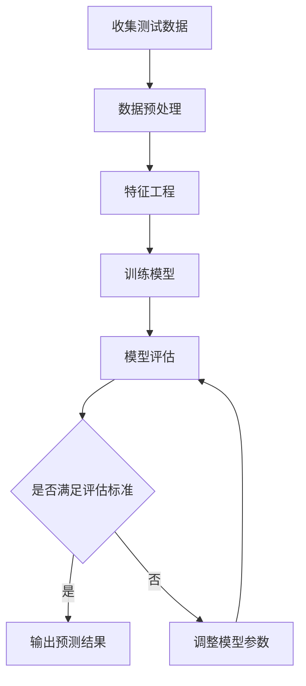
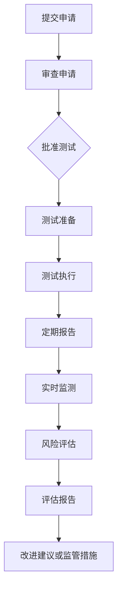
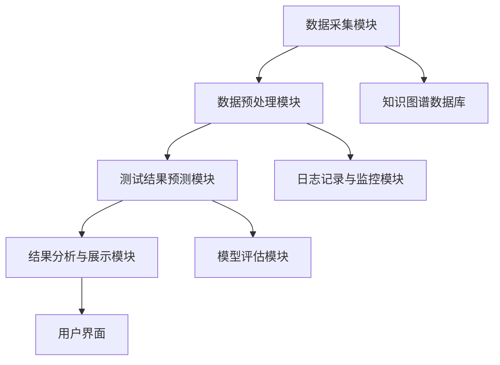
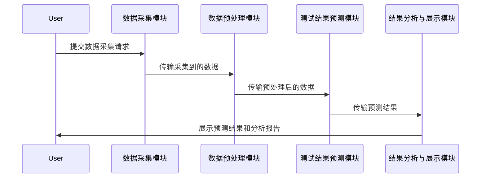

                 

### 第1章 引言

#### 1.1 问题背景

随着金融科技的迅猛发展，金融行业正在经历前所未有的变革。各类金融创新产品如雨后春笋般涌现，传统的金融监管模式已经无法适应快速变化的金融环境。为了应对这一挑战，许多国家和地区开始采用金融监管沙盒（Regulatory Sandbox）这一新兴的监管机制，旨在在受控的环境下测试和验证金融创新产品的可行性和安全性。

金融监管沙盒的核心目标是提供一个实验性的环境，让金融机构在监管机构的监督下测试新产品或服务，从而减少创新过程中的风险，提高金融市场的稳定性和透明度。这一机制的出现，不仅为金融机构提供了更多的创新空间，也为监管机构提供了更有效的监管手段。

然而，随着金融监管沙盒的应用越来越广泛，如何预测测试结果并提高预测的准确性成为一个亟待解决的问题。现有的测试方法往往依赖于人工分析，耗时且准确性不高。因此，构建一个基于知识图谱的金融监管沙盒测试结果预测平台，成为当前金融科技领域的研究热点。

#### 1.2 问题描述

构建基于知识图谱的金融监管沙盒测试结果预测平台需要解决以下几个关键问题：

1. **知识图谱的构建**：如何从大量金融数据中提取有效的知识，并构建一个结构化、语义丰富的知识图谱。
2. **测试结果的预测**：如何利用知识图谱中的数据，结合机器学习算法，实现测试结果的准确预测。
3. **平台的可扩展性和灵活性**：如何设计一个可扩展、可复用的平台架构，以适应不同金融产品和测试场景的需求。

#### 1.3 问题解决

为了解决上述问题，本文提出以下解决方案：

1. **知识图谱构建**：采用数据采集、数据清洗、数据存储和数据建模等技术，构建一个包含金融领域知识的知识图谱。
2. **测试结果预测**：选择合适的机器学习算法，如线性回归、支持向量机、决策树等，结合知识图谱数据进行训练和预测。
3. **平台架构设计**：采用模块化设计思路，构建一个灵活、可扩展的预测平台，包括数据采集模块、数据预处理模块、测试结果预测模块和结果分析与展示模块。

#### 1.4 边界与外延

本文的研究主要围绕基于知识图谱的金融监管沙盒测试结果预测平台展开，重点关注知识图谱的构建、测试结果预测算法的选择和应用、以及平台架构的设计与实现。然而，金融监管沙盒的测试结果预测是一个复杂的多维度问题，涉及金融领域的专业知识、数据科学和人工智能技术。因此，本文的研究边界主要限定在以下几个方面：

1. **技术层面**：侧重于知识图谱技术和机器学习算法在测试结果预测中的应用。
2. **业务层面**：关注金融监管沙盒的具体运作机制和测试场景。
3. **范围限制**：本文不涉及金融监管政策的具体研究和法律层面的分析。

#### 1.5 核心概念与联系

**知识图谱**：一种通过实体、关系和属性表达数据间复杂关联的知识表示方法。在金融监管沙盒测试结果预测中，知识图谱用于表示金融产品、测试数据和监管规则等信息。

**金融监管沙盒**：一种监管机制，允许金融机构在受控环境下测试新产品或服务。在本文中，金融监管沙盒作为数据来源，提供测试数据用于预测模型训练。

**测试结果预测**：利用机器学习算法对金融监管沙盒测试结果进行预测。预测算法的性能直接影响预测结果的准确性。

本章介绍了构建基于知识图谱的金融监管沙盒测试结果预测平台的研究背景、问题描述、解决方案以及研究的边界与外延。在接下来的章节中，我们将深入探讨知识图谱基础、金融监管沙盒基础、测试结果预测算法原理以及预测平台架构设计等方面的内容。

#### 1.5.1 知识图谱

知识图谱（Knowledge Graph）是一种用于表示信息之间复杂关联的数据模型，通过实体、关系和属性来表达数据的语义。其核心思想是将现实世界中的各种实体（如人、地点、事物）以及它们之间的关系和属性抽象为一个统一的结构化知识库，从而实现数据的高效管理和智能检索。

**定义**：知识图谱是一种语义网络，由实体、属性和关系组成，能够通过语义关系将不同实体关联起来，形成一个有向无环图（DAG）。

**组成要素**：

- **实体（Entity）**：知识图谱中的基本元素，代表现实世界中的各种对象。例如，人、地点、组织、商品等。

- **关系（Relationship）**：实体之间的关系，用于描述实体间的语义联系。例如，“属于”、“位于”、“生产”等。

- **属性（Attribute）**：实体的特征或属性，用于描述实体的详细信息。例如，人的姓名、出生日期、职业等。

**构建方法**：

1. **数据采集**：从各种数据源中收集原始数据，如数据库、文本、网页等。
2. **数据清洗**：对采集到的数据进行预处理，去除噪声和重复数据，确保数据质量。
3. **数据存储**：将清洗后的数据存储在图数据库中，如Neo4j、OrientDB等。
4. **数据建模**：根据业务需求，定义实体的属性和关系，构建知识图谱的框架。
5. **知识融合**：通过数据融合技术，将不同数据源中的信息进行整合，形成统一的语义表示。

**核心特点**：

- **语义丰富**：知识图谱能够通过关系和属性表达数据之间的复杂语义关系，使数据更加结构化和易于理解。
- **可扩展性**：知识图谱易于扩展，可以灵活地添加新的实体、关系和属性，适应不断变化的应用需求。
- **高效查询**：利用图数据库的高效图查询算法，可以快速检索知识图谱中的信息，实现复杂语义查询。

**在金融监管沙盒测试结果预测中的应用**：

- **数据关联**：通过知识图谱，可以将金融产品、测试数据和监管规则等关联起来，形成一个完整的语义网络，有助于发现潜在的风险和关联性。
- **知识推理**：利用知识图谱中的语义关系，可以推断出金融产品的潜在影响和风险，为测试结果预测提供依据。
- **智能分析**：基于知识图谱的智能分析，可以辅助监管机构更好地理解金融市场的动态，制定更有效的监管策略。

通过构建知识图谱，可以为金融监管沙盒测试结果预测提供一个强大的数据基础设施，提升预测的准确性和效率。在接下来的章节中，我们将进一步探讨金融监管沙盒的基础知识，以及如何将知识图谱应用于测试结果预测中。

#### 1.5.2 金融监管沙盒

金融监管沙盒（Regulatory Sandbox）是一种新兴的金融监管机制，旨在为金融机构提供在一个受控的环境中测试和验证新产品或服务的平台。通过金融监管沙盒，监管机构可以在确保市场稳定性和消费者保护的前提下，促进金融创新的发展。

**定义**：金融监管沙盒是一种实验性的监管机制，允许金融机构在一定范围内进行金融产品或服务的测试，同时接受监管机构的监督和评估。

**运作机制**：

1. **申请流程**：金融机构需要向监管机构提交测试申请，详细描述拟测试的产品或服务、测试目标和风险控制措施等。
2. **运行流程**：监管机构对申请进行审核，并在批准后允许金融机构在一定时间和条件下进行测试。金融机构在测试过程中需要定期向监管机构报告进展和结果。
3. **监测与评估**：监管机构对测试过程进行持续监测，评估金融产品或服务的合规性、安全性和市场适应性。测试结束后，监管机构会根据评估结果，决定是否批准该产品或服务在市场上推广。

**优势**：

1. **促进创新**：金融监管沙盒为金融机构提供了一个安全、受控的测试环境，有助于加速新金融产品或服务的研发和推广。
2. **提高效率**：通过沙盒测试，监管机构可以提前发现和解决潜在问题，减少审批流程的时间和成本。
3. **降低风险**：金融监管沙盒可以有效地隔离测试产品或服务与实际市场环境，降低测试过程中的风险，保护消费者利益。

**挑战**：

1. **监管难度**：金融监管沙盒涉及多种金融产品和复杂的业务模式，监管机构需要具备较高的专业知识和风险识别能力。
2. **数据安全**：测试过程中涉及大量的敏感数据，如何保护数据隐私和安全成为一大挑战。
3. **政策协调**：金融监管沙盒在不同国家和地区的实施情况存在差异，如何协调不同监管政策，确保跨境测试的顺利进行是一个重要问题。

**类型与方法**：

1. **功能性测试**：验证金融产品或服务的功能是否符合预期。
2. **性能测试**：评估金融产品或服务的性能，如响应时间、处理能力等。
3. **安全测试**：检查金融产品或服务的安全漏洞和潜在风险。
4. **可靠性测试**：验证金融产品或服务的稳定性和可靠性。

通过金融监管沙盒，监管机构可以更有效地监管金融创新，同时促进金融市场的健康发展。在接下来的章节中，我们将进一步探讨知识图谱在金融监管沙盒测试结果预测中的应用，以及如何利用测试结果预测算法提高预测准确性。

#### 1.5.3 测试结果预测

测试结果预测是金融监管沙盒中的一个关键环节，通过预测测试结果，可以帮助监管机构提前识别潜在的风险，并制定相应的监管措施。在构建基于知识图谱的金融监管沙盒测试结果预测平台时，选择合适的预测算法和实现方法至关重要。

**预测算法概述**：

测试结果预测算法主要分为以下几类：

1. **线性回归**：通过建立线性模型，预测测试结果的数值。线性回归算法简单直观，适用于数据趋势性较强的场景。
2. **支持向量机（SVM）**：通过找到最优分割超平面，对测试结果进行分类预测。SVM在处理高维数据和线性不可分问题方面具有优势。
3. **决策树**：通过树的形态对测试结果进行分类或回归预测。决策树算法易于理解和实现，但可能存在过拟合问题。
4. **集成学习**：通过组合多个基学习器，提高预测模型的准确性和稳定性。集成学习方法如随机森林和梯度提升树等在预测中表现优异。

**算法mermaid流程图**：

以下是一个简单的线性回归算法mermaid流程图：



**算法原理讲解**：

1. **线性回归**：

线性回归模型假设测试结果\(y\)与特征\(x\)之间存在线性关系，可以用如下数学模型表示：

   $$y = \beta_0 + \beta_1x + \epsilon$$

   其中，\(\beta_0\)是截距，\(\beta_1\)是斜率，\(\epsilon\)是误差项。

   线性回归的目标是最小化预测值与实际值之间的误差平方和，即：

   $$\min \sum_{i=1}^{n}(y_i - \hat{y_i})^2$$

   通过梯度下降法或最小二乘法，可以求解出最佳参数\(\beta_0\)和\(\beta_1\)。

2. **支持向量机（SVM）**：

   支持向量机是一种二分类算法，通过找到一个最优的超平面，将不同类别的测试结果分隔开。对于线性可分的情况，SVM的数学模型可以表示为：

   $$w\cdot x - b = 0$$

   其中，\(w\)是权重向量，\(x\)是特征向量，\(b\)是偏置。

   目标是最小化分类间隔（即最大化分类边界宽度），即：

   $$\min \frac{1}{2}\|w\|^2$$

   同时满足分类条件：

   $$y_i(w\cdot x_i - b) \geq 1$$

   通过求解拉格朗日乘子法，可以得到支持向量机的解。

3. **决策树**：

   决策树通过一系列规则将测试数据划分为不同的类别。每个节点代表一个特征，每个分支代表该特征的取值范围，叶子节点表示最终的类别或数值。

   决策树的构建过程包括特征选择、节点划分、合并和剪枝等步骤。常用的特征选择方法有信息增益、基尼不纯度等。

4. **集成学习**：

   集成学习通过结合多个基学习器的预测结果来提高模型的准确性和稳定性。随机森林和梯度提升树是两种常用的集成学习方法。

   - **随机森林（Random Forest）**：通过构建多个决策树，并利用随机抽样和特征选择方法，减少过拟合问题。
   - **梯度提升树（Gradient Boosting Tree）**：通过迭代地训练多个弱学习器，并利用梯度下降法优化目标函数，逐步提高模型性能。

**算法Python代码实现**：

以下是一个简单的线性回归算法的Python代码实现：

```python
import numpy as np
from sklearn.linear_model import LinearRegression

# 准备数据
X = np.array([[1], [2], [3], [4], [5]])
y = np.array([1, 2, 2.5, 4, 5])

# 训练模型
model = LinearRegression()
model.fit(X, y)

# 预测结果
y_pred = model.predict(X)

# 输出结果
print("预测结果：", y_pred)
```

通过上述算法的讲解和Python代码实现，我们可以更好地理解测试结果预测的基本原理和方法。在接下来的章节中，我们将进一步探讨如何将知识图谱应用于金融监管沙盒测试结果预测中，以及平台架构的设计与实现。

#### 1.6 本章小结

本章首先介绍了构建基于知识图谱的金融监管沙盒测试结果预测平台的研究背景和问题，详细阐述了知识图谱、金融监管沙盒以及测试结果预测的核心概念。接着，我们通过定义和示例，对知识图谱的组成要素和构建方法进行了深入讲解，并展示了知识图谱在金融监管沙盒测试结果预测中的应用优势。随后，我们详细介绍了金融监管沙盒的运作机制、优势与挑战，以及各类测试方法和类型。

最后，本章对测试结果预测算法进行了概述，通过mermaid流程图和Python代码实现，讲解了线性回归、支持向量机、决策树和集成学习等常见算法的原理和应用方法。通过本章的学习，读者可以初步了解构建金融监管沙盒测试结果预测平台所需的核心技术和概念，为后续章节的深入探讨打下基础。

## 第2章 知识图谱基础

### 2.1 知识图谱概述

知识图谱（Knowledge Graph）是一种用于表示信息之间复杂关联的数据模型，通过实体、关系和属性来表达数据的语义。知识图谱技术起源于搜索引擎领域，随着互联网和大数据技术的发展，逐渐应用于各个领域，如金融、医疗、零售等。在金融领域，知识图谱技术为金融监管沙盒测试结果预测提供了一个强大的数据基础设施。

**定义**：知识图谱是一种语义网络，由实体、属性和关系组成，能够通过语义关系将不同实体关联起来，形成一个有向无环图（DAG）。

**起源**：知识图谱最早由谷歌在2012年推出，用于改进搜索引擎的搜索结果质量。此后，微软、百度等公司也相继推出了自己的知识图谱产品。

**发展**：随着深度学习和自然语言处理技术的发展，知识图谱的应用领域不断拓展，从传统的搜索引擎扩展到智能问答、推荐系统、智能客服等领域。

**在金融领域的应用**：

1. **风险管理**：知识图谱可以用于表示金融产品、公司和市场等实体的复杂关系，帮助金融机构识别潜在的风险。
2. **客户画像**：通过分析客户的行为数据和金融产品关系，知识图谱可以构建出详细的客户画像，为精准营销和个性化服务提供支持。
3. **金融监管**：知识图谱可以用于表示监管规则、金融机构和金融产品之间的关系，提高监管效率，降低合规风险。

### 2.2 知识图谱的组成要素

知识图谱的构建依赖于实体、关系和属性三个基本要素，这三个要素共同构成了知识图谱的语义表示。

**实体（Entity）**：

- **定义**：实体是知识图谱中的基本元素，代表现实世界中的各种对象，如人、地点、组织、物品等。
- **类型**：实体可以分为一类实体（如人、地点）和多类实体（如金融产品、法规政策）。
- **属性**：实体具有多个属性，用于描述实体的特征和属性，如人的姓名、出生日期、地点的经纬度等。

**关系（Relationship）**：

- **定义**：关系是实体之间的语义联系，用于描述实体之间的逻辑关系，如“属于”、“位于”、“拥有”等。
- **类型**：关系可以分为一类关系（如“属于”）和多类关系（如“购买”、“投资”）。
- **权重**：关系可以具有权重，用于表示关系的强度或重要性。

**属性（Attribute）**：

- **定义**：属性是实体的特征或属性，用于描述实体的详细信息，如人的身高、体重，商品的型号、价格等。
- **类型**：属性可以分为一类属性（如身高、体重）和多类属性（如型号、颜色）。

**实体、关系和属性的对比表格**：

| 要素       | 定义                                                         | 类型                  | 关联示例                     |
|------------|------------------------------------------------------------|----------------------|------------------------------|
| 实体       | 知识图谱中的基本元素，代表现实世界中的对象                   | 一类实体、多类实体   | 人、地点、组织、物品等       |
| 关系       | 实体之间的语义联系，描述实体间的逻辑关系                     | 一类关系、多类关系   | “属于”、“位于”、“拥有”等    |
| 属性       | 实体的特征或属性，用于描述实体的详细信息                     | 一类属性、多类属性   | 姓名、出生日期、型号、价格等 |

通过实体、关系和属性的组合，知识图谱可以表达现实世界中复杂的语义关系，为数据分析和智能决策提供支持。

### 2.3 知识图谱的构建

知识图谱的构建是一个复杂的过程，包括数据采集、数据清洗、数据存储和数据建模等多个环节。以下详细描述这些环节及其关键步骤。

**数据采集**：

- **数据源**：知识图谱的数据源包括结构化数据（如数据库）、半结构化数据（如XML、JSON）和非结构化数据（如文本、图片）。
- **采集方法**：常用的数据采集方法有网络爬虫、API调用、数据库导出等。
- **示例**：假设我们构建一个金融知识图谱，可以采集银行、股票、债券等金融产品的数据，以及相关的监管法规和政策。

**数据清洗**：

- **去重**：去除重复的数据，确保数据的一致性和准确性。
- **纠错**：修正数据中的错误，如拼写错误、格式错误等。
- **数据规范化**：统一数据格式，如日期格式、单位等。
- **示例**：对于采集到的金融数据，我们需要去除重复的银行信息，修正错误的数据，并统一数据格式。

**数据存储**：

- **存储方案**：知识图谱的存储通常采用图数据库，如Neo4j、OrientDB等。
- **图数据库优势**：图数据库能够高效地处理实体和关系之间的复杂关联，支持高效的图查询。
- **示例**：我们将清洗后的金融数据存储在Neo4j图数据库中，每个实体和关系都作为一个节点和边进行存储。

**数据建模**：

- **实体定义**：根据业务需求，定义知识图谱中的实体，如银行、股票、债券等。
- **关系定义**：定义实体之间的关系，如银行发行债券、股票属于某行业等。
- **属性定义**：为实体和关系定义属性，如银行名称、股票代码、债券到期日等。
- **示例**：在金融知识图谱中，我们可以定义银行实体、债券实体以及它们之间的关系，如银行发行债券、债券属于某行业等。

**数据融合**：

- **数据整合**：将来自不同数据源的信息进行整合，形成统一的知识库。
- **数据冲突解决**：解决数据源之间的冲突，如不同来源的数据对同一实体的描述不一致。
- **示例**：对于金融知识图谱，我们需要整合来自不同金融数据源的信息，如银行数据、股票数据和债券数据，并解决数据源之间的冲突。

通过上述步骤，我们可以构建一个结构化、语义丰富的知识图谱，为金融监管沙盒测试结果预测提供数据支持。在接下来的章节中，我们将探讨知识图谱的查询与更新策略，以及其在金融监管沙盒测试结果预测中的应用。

### 2.4 知识图谱的查询与更新

知识图谱的查询与更新是确保其高效性和实时性的关键环节。在金融监管沙盒测试结果预测中，及时准确地获取和处理数据对于预测模型的训练和评估至关重要。以下将详细描述知识图谱的查询与更新策略，并探讨其具体实现。

**查询策略**：

1. **基于路径的查询**：知识图谱中的查询通常涉及多个实体和关系，通过定义查询路径，可以高效地获取所需信息。常见的查询路径包括点查（单步查询）、链查（多步查询）和网查（多路径查询）。
2. **基于属性的查询**：通过指定实体的属性值，可以快速定位特定的实体。这类查询通常应用于过滤和筛选操作。
3. **基于语义的查询**：利用知识图谱中的语义信息，进行语义相关的查询，如相似度查询、关联查询等。这类查询可以挖掘出数据间的隐含关系，提高查询的灵活性和智能性。
4. **实时查询**：对于金融监管沙盒测试结果预测，需要实时获取最新的数据信息。图数据库通常支持实时查询，通过订阅和消息队列等方式，实现数据的实时同步和查询。

**查询算法**：

1. **路径枚举算法**：通过枚举所有可能的查询路径，获取符合条件的实体和关系。这类算法适用于查询路径较短的场景，但效率较低。
2. **深度优先搜索（DFS）**：通过递归或迭代方式，从根节点开始，逐层遍历图中的节点和边，直到找到符合条件的实体和关系。DFS算法适用于查询路径较短的场景。
3. **广度优先搜索（BFS）**：与DFS类似，但按层次遍历图中的节点和边。BFS算法适用于查询路径较长的场景，但可能存在遍历深度过大的问题。
4. **A*搜索算法**：结合启发式搜索，以最短路径为目标，优先搜索具有最小代价的路径。A*算法适用于查询路径较复杂的场景。

**更新策略**：

1. **增量更新**：通过实时监测数据源的变化，对知识图谱进行增量更新，确保数据的时效性。常见的增量更新方法有差异检测、日志分析等。
2. **批量更新**：定期将数据源中的新数据导入知识图谱，进行批量更新。批量更新适用于数据源变化不频繁的场景。
3. **一致性维护**：在更新过程中，确保知识图谱的一致性，避免出现数据冲突和错误。常见的一致性维护方法有版本控制、冲突检测和合并策略等。
4. **数据质量监控**：定期对知识图谱的数据质量进行监控和评估，确保数据的准确性和完整性。数据质量监控包括去重、纠错、数据规范化等操作。

**查询与更新实现**：

1. **图数据库接口**：利用图数据库提供的API接口，实现查询和更新操作。常见的图数据库如Neo4j、OrientDB等，支持多种查询语言和更新方法。
2. **数据同步机制**：通过消息队列、数据管道等技术，实现数据源与知识图谱之间的实时同步。常用的消息队列技术有Kafka、RabbitMQ等。
3. **自动化脚本**：编写自动化脚本，定期执行数据采集、清洗、存储和更新等操作，提高工作效率和准确性。

通过有效的查询与更新策略，知识图谱可以在金融监管沙盒测试结果预测中发挥重要作用，确保数据的高效获取和实时处理。在接下来的章节中，我们将探讨知识图谱在金融和监管领域以及沙盒测试中的应用，进一步展示其在实际业务场景中的价值。

### 2.5 知识图谱的应用

知识图谱作为一种高效的数据表示和查询工具，在金融和监管领域有着广泛的应用。通过构建知识图谱，可以实现对金融产品和监管规则的有效管理和分析，提高金融监管沙盒测试结果预测的准确性和效率。

**在金融领域的应用**：

1. **客户画像**：通过知识图谱，可以整合客户的金融行为数据、交易记录、风险偏好等信息，构建详细的客户画像。这有助于金融机构进行精准营销和个性化服务，提高客户满意度和忠诚度。

2. **风险管理**：知识图谱能够表示金融产品、市场和金融机构之间的复杂关系，帮助金融机构识别和评估潜在的风险。例如，通过分析银行贷款、股票投资和债券发行等数据，可以识别出潜在的信用风险和市场风险。

3. **投资决策**：知识图谱可以为投资决策提供智能支持。通过分析市场数据、公司财务报表和行业趋势等信息，知识图谱可以生成投资建议，帮助投资者做出更明智的决策。

4. **合规性检查**：金融知识图谱可以帮助金融机构快速识别和检查业务流程是否符合监管要求。例如，通过分析交易数据和法规政策，可以检测出潜在的违规行为，确保金融机构的合规运营。

**在监管领域的应用**：

1. **监管合规**：知识图谱可以用于表示监管规则、监管政策和监管目标。通过知识图谱的查询和推理功能，监管机构可以快速获取与特定监管目标相关的信息，确保监管措施的执行和合规性。

2. **监管报告**：知识图谱可以辅助监管机构生成监管报告，提高报告的准确性和完整性。例如，通过分析金融产品和市场数据，可以生成详细的监管报告，包括市场趋势、风险分析和合规性评估等。

3. **风险预警**：知识图谱可以用于监测金融市场风险，及时发现潜在的风险信号。通过分析市场数据、交易行为和监管规则，知识图谱可以预测潜在的市场风险，为监管机构提供预警信息。

4. **监管合作**：知识图谱可以帮助不同监管机构之间进行信息共享和合作。通过知识图谱，监管机构可以整合不同来源的数据和信息，实现跨机构的监管合作，提高监管效率和协调性。

**在沙盒测试中的应用**：

1. **测试数据管理**：知识图谱可以用于管理沙盒测试中的数据，包括金融产品信息、测试数据和监管规则等。通过知识图谱，可以实现对测试数据的结构化管理和智能查询，提高测试数据的管理效率。

2. **测试结果分析**：知识图谱可以用于分析沙盒测试的结果，识别测试中的潜在问题和风险。通过分析测试数据和知识图谱中的关系，可以挖掘出测试数据间的隐含关系，为预测结果提供依据。

3. **测试结果预测**：基于知识图谱的测试结果预测算法，可以实现对沙盒测试结果的准确预测。通过分析知识图谱中的数据，结合机器学习算法，可以预测出金融产品的市场表现、风险水平等指标，为监管决策提供支持。

4. **测试流程优化**：知识图谱可以帮助优化沙盒测试的流程，提高测试的效率和质量。通过分析知识图谱中的数据，可以识别出测试中的瓶颈和优化点，为监管机构提供优化建议。

通过知识图谱在金融、监管和沙盒测试中的应用，可以实现对金融产品和监管规则的有效管理和分析，提高测试结果预测的准确性和效率。知识图谱作为一种先进的数据表示和查询工具，在金融科技和金融监管领域具有重要的应用价值。

### 2.6 本章小结

本章详细介绍了知识图谱的概述、组成要素、构建方法、查询与更新策略以及其在金融和监管领域的应用。首先，我们介绍了知识图谱的定义、起源和发展，以及在金融领域的应用。接着，我们阐述了知识图谱的三个组成要素：实体、关系和属性，并通过对比表格展示了它们的特点。随后，我们介绍了知识图谱的构建方法，包括数据采集、数据清洗、数据存储和数据建模等关键步骤。

在知识图谱的查询与更新策略部分，我们讲解了基于路径、属性和语义的查询方法，以及路径枚举算法、深度优先搜索、广度优先搜索和A*搜索算法等查询算法。同时，我们介绍了增量更新、批量更新、一致性维护和数据质量监控等更新策略。

最后，我们探讨了知识图谱在金融、监管和沙盒测试中的应用，展示了其在风险管理、客户画像、投资决策、合规性检查和测试结果预测等方面的实际价值。通过本章的学习，读者可以深入理解知识图谱的基本原理和应用方法，为后续章节的深入探讨打下基础。

## 第3章 金融监管沙盒基础

### 3.1 监管沙盒概述

金融监管沙盒（Regulatory Sandbox）是一种创新的监管机制，旨在为金融机构提供在一个受控环境下测试和验证新产品或服务的平台。通过监管沙盒，监管机构可以在确保市场稳定性和消费者保护的前提下，促进金融创新的发展。这一机制的核心目标是减少金融创新过程中的不确定性，降低创新产品的风险，并为监管机构提供有效的监管手段。

**定义**：金融监管沙盒是一种实验性的监管机制，允许金融机构在一定范围内进行金融产品或服务的测试，同时接受监管机构的监督和评估。

**起源与发展**：

1. **起源**：监管沙盒的概念最早由英国金融行为监管局（FCA）于2013年提出。此后，许多国家和地区，如澳大利亚、新加坡、香港等，相继引入了监管沙盒机制。
2. **发展**：随着金融科技的快速发展，监管沙盒在全球范围内得到了广泛应用。监管机构通过不断优化和完善监管沙盒的运作机制，提高其适应性和有效性。

**核心特点**：

1. **受控环境**：监管沙盒提供了一个受控的环境，让金融机构在真实的市场环境中进行测试，同时监管机构对测试过程进行监督和评估。
2. **灵活性**：监管沙盒允许金融机构根据业务需求，灵活调整测试方案，提高测试的针对性和有效性。
3. **安全性**：监管沙盒通过严格的风险控制措施，确保测试过程不会对市场造成不利影响，同时保护消费者的合法权益。
4. **透明度**：监管沙盒要求金融机构在测试过程中定期向监管机构报告进展和结果，提高测试过程的透明度和公开性。

**主要用途**：

1. **新产品测试**：金融机构可以利用监管沙盒测试新的金融产品或服务，如数字货币、区块链应用等，验证其技术可行性和市场适应性。
2. **风险管理**：通过监管沙盒，金融机构可以识别和评估新产品或服务的风险，制定相应的风险管理策略。
3. **合规性检查**：监管沙盒可以帮助金融机构在测试过程中，确保新产品或服务符合相关法律法规和监管要求。
4. **监管创新**：监管沙盒为监管机构提供了探索和尝试新的监管模式和方法的机会，促进监管机制的持续改进。

### 3.2 监管沙盒的运作机制

金融监管沙盒的运作机制主要包括申请流程、运行流程和监测与评估三个环节。以下详细描述这些环节及其具体内容。

**申请流程**：

1. **提交申请**：金融机构向监管机构提交测试申请，详细描述拟测试的产品或服务、测试目标和风险控制措施等。
2. **审查申请**：监管机构对申请进行审核，包括对拟测试产品或服务的合规性、技术可行性、风险控制措施等进行评估。
3. **批准测试**：如果申请通过审核，监管机构将批准金融机构进行测试，并明确测试的时间、范围和条件。

**运行流程**：

1. **测试准备**：金融机构根据监管机构的批准，制定详细的测试计划，包括测试环境、测试用例、测试数据等。
2. **测试执行**：金融机构在监管机构的监督下，按照测试计划进行测试，记录测试过程中的数据和结果。
3. **定期报告**：金融机构需要定期向监管机构报告测试进展、遇到的问题和解决方案，以及测试结果的初步评估。

**监测与评估**：

1. **实时监测**：监管机构通过监控系统对测试过程进行实时监测，包括数据流、交易行为、系统性能等。
2. **风险评估**：监管机构对测试结果进行风险评估，分析测试产品或服务的合规性、安全性、市场适应性等。
3. **评估报告**：监管机构根据测试结果和风险评估，撰写评估报告，并提出改进建议或后续监管措施。

**具体流程图**：

以下是一个简化的金融监管沙盒运作流程图：



通过上述运作机制，金融监管沙盒实现了对金融机构创新产品或服务的有效监管，确保测试过程的安全性和合规性，同时为监管机构提供了监管创新的机会。在接下来的章节中，我们将进一步探讨金融监管沙盒的优势与挑战，以及其在实际应用中的具体案例。

### 3.3 金融监管沙盒的优势与挑战

金融监管沙盒作为一种创新的监管机制，在金融科技快速发展的背景下，受到了广泛关注。它不仅在促进金融创新、提高监管效率方面具有显著优势，同时也面临一些挑战。

**优势**：

1. **促进金融创新**：金融监管沙盒提供了一个受控的测试环境，让金融机构能够在新产品或服务推出前进行测试，减少创新失败的风险，从而激发金融行业的创新活力。
2. **提高监管效率**：通过金融监管沙盒，监管机构可以在早期阶段介入，实时监控和评估创新产品的合规性和安全性，提高监管的前瞻性和针对性。
3. **降低合规成本**：金融监管沙盒通过简化审批流程、缩短审批时间，降低了金融机构的合规成本，使得金融机构能够更快地将创新产品推向市场。
4. **增强市场透明度**：金融监管沙盒要求金融机构在测试过程中公开测试结果和遇到的问题，提高了市场透明度，有助于投资者和消费者了解金融产品的风险和收益。

**挑战**：

1. **监管难度**：金融监管沙盒涉及多种金融产品和复杂的业务模式，监管机构需要具备较高的专业知识和风险识别能力，以确保测试过程的安全性和合规性。
2. **数据安全**：在金融监管沙盒测试过程中，涉及大量的敏感数据，如客户信息、交易数据等。如何确保数据的安全性和隐私保护成为一大挑战。
3. **政策协调**：不同国家和地区的监管政策存在差异，如何在跨境测试中协调不同监管政策，确保测试结果的跨国互认，是一个重要问题。
4. **风险管理**：金融监管沙盒在提供创新空间的同时，也带来了一定的风险。如何有效识别和评估创新产品的风险，确保测试过程的稳健性，是监管机构面临的重要挑战。

**优势与挑战的权衡**：

尽管金融监管沙盒面临一些挑战，但其优势远远大于劣势。通过有效的监管框架和技术手段，可以缓解这些挑战。例如：

1. **加强监管培训**：监管机构可以通过培训提高员工的专业知识和风险识别能力，确保在金融监管沙盒测试过程中能够有效监管。
2. **数据加密与保护**：通过数据加密和隐私保护技术，可以确保敏感数据在测试过程中的安全性和隐私性。
3. **国际合作与协调**：通过国际合作与协调，可以制定统一的监管标准和测试流程，确保跨境测试的顺利进行。
4. **风险管理工具**：利用知识图谱和机器学习技术，可以建立高效的风险评估模型，帮助监管机构更好地识别和评估创新产品的风险。

总之，金融监管沙盒作为一种创新的监管机制，在促进金融创新和提高监管效率方面具有显著优势。同时，通过有效应对挑战，可以进一步发挥其潜力，为金融行业的可持续发展提供支持。

### 3.4 沙盒测试的类型与方法

在金融监管沙盒中，测试的类型和方法是确保测试有效性和准确性的关键。根据不同的测试目标和要求，常见的沙盒测试类型包括功能性测试、性能测试、安全测试和可靠性测试。每种测试类型都有其特定的方法和步骤。

**功能性测试**：

- **定义**：功能性测试旨在验证金融产品或服务的功能是否符合设计要求，确保其能够正常运作。
- **方法**：测试包括功能覆盖性测试、边界条件测试、异常处理测试等。测试用例通常基于产品需求文档和功能规格说明。
- **步骤**：首先，制定测试计划，包括测试目标、测试用例和测试环境；其次，执行测试用例，记录测试结果；最后，对测试结果进行分析，找出存在的问题并修复。

**性能测试**：

- **定义**：性能测试旨在评估金融产品或服务的性能，如响应时间、处理能力、并发处理能力等。
- **方法**：测试包括负载测试、压力测试、容量测试等。测试用例通常基于实际业务场景和性能指标。
- **步骤**：首先，设计性能测试场景，包括测试环境、测试数据和性能指标；其次，执行性能测试，记录测试结果；最后，分析测试结果，优化系统性能。

**安全测试**：

- **定义**：安全测试旨在发现金融产品或服务的安全漏洞，评估其抗攻击能力，确保系统的安全性和数据保护。
- **方法**：测试包括漏洞扫描、渗透测试、安全配置检查等。测试用例通常基于安全标准和漏洞库。
- **步骤**：首先，制定安全测试计划，包括测试目标、测试用例和安全标准；其次，执行安全测试，记录测试结果；最后，分析测试结果，修复发现的安全漏洞。

**可靠性测试**：

- **定义**：可靠性测试旨在评估金融产品或服务的稳定性和可靠性，确保其在长时间运行中不会出现故障。
- **方法**：测试包括稳定性测试、寿命测试、故障率测试等。测试用例通常基于可靠性标准和运行环境。
- **步骤**：首先，设计可靠性测试计划，包括测试目标、测试环境和可靠性指标；其次，执行可靠性测试，记录测试结果；最后，分析测试结果，优化系统可靠性。

通过上述测试类型和方法，金融监管沙盒可以全面评估金融产品或服务的功能、性能、安全和可靠性，确保其能够在实际市场中稳健运行。在接下来的章节中，我们将探讨如何将知识图谱应用于测试结果预测中，并详细讲解预测算法原理和实现方法。

### 3.5 本章小结

本章详细介绍了金融监管沙盒的基础知识，包括其定义、起源与发展、核心特点、运作机制以及优势与挑战。通过分析监管沙盒的申请流程、运行流程和监测与评估环节，我们了解了其在金融创新和监管效率方面的作用。同时，本章还探讨了沙盒测试的几种类型，如功能性测试、性能测试、安全测试和可靠性测试，并详细描述了每种测试方法及其步骤。

通过本章的学习，读者可以全面理解金融监管沙盒的基本概念和应用方法，为构建基于知识图谱的金融监管沙盒测试结果预测平台提供理论基础。在接下来的章节中，我们将进一步探讨知识图谱和测试结果预测算法的原理，为构建高效、准确的预测平台打下基础。

## 第4章 测试结果预测算法原理

### 4.1 预测算法概述

测试结果预测是金融监管沙盒中的一个关键环节，通过预测测试结果，可以帮助监管机构提前识别潜在的风险，并制定相应的监管措施。在构建基于知识图谱的金融监管沙盒测试结果预测平台时，选择合适的预测算法和实现方法至关重要。本章将详细介绍几种常见的预测算法，包括线性回归、支持向量机、决策树和集成学习，并探讨其原理和应用。

### 4.2 预测算法的数学模型

#### 4.2.1 线性回归

线性回归是一种经典的预测算法，假设测试结果\(y\)与特征\(x\)之间存在线性关系。线性回归的数学模型可以表示为：

$$y = \beta_0 + \beta_1x + \epsilon$$

其中，\(\beta_0\)是截距，\(\beta_1\)是斜率，\(\epsilon\)是误差项。线性回归的目标是最小化预测值与实际值之间的误差平方和，即：

$$\min \sum_{i=1}^{n}(y_i - \hat{y_i})^2$$

通过梯度下降法或最小二乘法，可以求解出最佳参数\(\beta_0\)和\(\beta_1\)。

#### 4.2.2 支持向量机（SVM）

支持向量机是一种强大的分类算法，通过找到一个最优的超平面，将不同类别的测试结果分隔开。对于线性可分的情况，SVM的数学模型可以表示为：

$$w\cdot x - b = 0$$

其中，\(w\)是权重向量，\(x\)是特征向量，\(b\)是偏置。

SVM的目标是最小化分类间隔（即最大化分类边界宽度），同时满足分类条件：

$$y_i(w\cdot x_i - b) \geq 1$$

通过求解拉格朗日乘子法，可以得到支持向量机的解。

#### 4.2.3 决策树

决策树通过一系列规则对测试结果进行分类或回归预测。决策树的构建过程包括特征选择、节点划分、合并和剪枝等步骤。常用的特征选择方法有信息增益、基尼不纯度等。决策树的数学模型可以表示为：

$$\prod_{i=1}^{n}R_i(x) = F(x)$$

其中，\(R_i(x)\)是第\(i\)个规则，\(F(x)\)是最终的分类结果。

#### 4.2.4 集成学习

集成学习通过组合多个基学习器的预测结果来提高模型的准确性和稳定性。集成学习方法如随机森林和梯度提升树等在预测中表现优异。

- **随机森林（Random Forest）**：随机森林通过构建多个决策树，并利用随机抽样和特征选择方法，减少过拟合问题。

- **梯度提升树（Gradient Boosting Tree）**：梯度提升树通过迭代地训练多个弱学习器，并利用梯度下降法优化目标函数，逐步提高模型性能。

### 4.3 算法mermaid流程图

以下是一个简单的线性回归算法mermaid流程图：


### 4.4 算法原理讲解

#### 4.4.1 线性回归

线性回归是一种简单而直观的预测算法，其核心思想是通过线性模型描述特征与目标变量之间的关系。线性回归模型的基本形式如下：

$$y = \beta_0 + \beta_1x + \epsilon$$

其中，\(y\)是目标变量，\(x\)是特征变量，\(\beta_0\)是截距，\(\beta_1\)是斜率，\(\epsilon\)是误差项。

线性回归的目的是找到最佳拟合直线，使得预测值与实际值之间的误差最小。这个过程可以通过最小二乘法实现，即求解以下目标函数的最小值：

$$\min \sum_{i=1}^{n}(y_i - \hat{y_i})^2$$

其中，\(\hat{y_i}\)是预测值。

**示例**：假设我们有一个简单的数据集，包含两个特征变量\(x_1\)和\(x_2\)，以及一个目标变量\(y\)，如下所示：

| \(x_1\) | \(x_2\) | \(y\) |
|--------|--------|------|
| 1      | 2      | 3    |
| 2      | 4      | 5    |
| 3      | 6      | 7    |

我们可以使用线性回归模型来预测新的\(y\)值。通过最小二乘法，我们可以求解出最佳参数：

$$\beta_0 = 1, \beta_1 = 1$$

因此，线性回归模型可以表示为：

$$y = 1 + x_1 + x_2$$

使用这个模型，我们可以预测新数据的\(y\)值，例如，当\(x_1 = 4, x_2 = 8\)时，预测的\(y\)值为：

$$y = 1 + 4 + 8 = 13$$

#### 4.4.2 支持向量机（SVM）

支持向量机（SVM）是一种强大的分类算法，它通过找到一个最优的超平面，将不同类别的数据分隔开。SVM的核心思想是最大化分类间隔，同时满足分类条件。

对于线性可分的情况，SVM的决策边界可以表示为：

$$w\cdot x - b = 0$$

其中，\(w\)是权重向量，\(x\)是特征向量，\(b\)是偏置。

SVM的目标是最小化分类间隔（即最大化分类边界宽度），同时满足分类条件：

$$y_i(w\cdot x_i - b) \geq 1$$

其中，\(y_i\)是样本标签。

为了求解这个优化问题，我们可以使用拉格朗日乘子法。拉格朗日函数可以表示为：

$$L(w, b, \alpha) = \frac{1}{2}\|w\|^2 - \sum_{i=1}^{n}\alpha_i[y_i(w\cdot x_i - b) - 1]$$

其中，\(\alpha_i\)是拉格朗日乘子。

通过求解拉格朗日乘子法，我们可以得到最优解：

$$w = \sum_{i=1}^{n}\alpha_i y_i x_i, b = 1 - \sum_{i=1}^{n}\alpha_i y_i$$

其中，\(\alpha_i\)满足\(0 \leq \alpha_i \leq C\)，\(C\)是正则化参数。

**示例**：假设我们有一个简单的数据集，包含两个特征变量\(x_1\)和\(x_2\)，以及一个目标变量\(y\)，如下所示：

| \(x_1\) | \(x_2\) | \(y\) |
|--------|--------|------|
| 1      | 1      | +1   |
| 1      | 2      | -1   |
| 2      | 1      | +1   |
| 2      | 2      | -1   |

我们可以使用SVM来分类这个数据集。通过求解拉格朗日乘子法，我们可以得到最优解：

$$w = [1, 1], b = 1$$

因此，SVM的决策边界可以表示为：

$$x_1 + x_2 = 1$$

#### 4.4.3 决策树

决策树是一种简单而直观的预测算法，它通过一系列规则对数据集进行分类或回归预测。决策树的构建过程包括以下步骤：

1. **特征选择**：选择一个最佳特征进行划分，常用的特征选择方法有信息增益、基尼不纯度等。
2. **节点划分**：使用最佳特征将数据集划分为子集，每个子集作为新的节点。
3. **递归构建**：对每个子节点重复上述步骤，直到满足停止条件（如最大深度、最小节点样本数等）。
4. **合并和剪枝**：根据需要对决策树进行合并和剪枝，以提高模型的稳定性和泛化能力。

决策树的数学模型可以表示为：

$$\prod_{i=1}^{n}R_i(x) = F(x)$$

其中，\(R_i(x)\)是第\(i\)个规则，\(F(x)\)是最终的分类结果。

**示例**：假设我们有一个简单的数据集，包含两个特征变量\(x_1\)和\(x_2\)，以及一个目标变量\(y\)，如下所示：

| \(x_1\) | \(x_2\) | \(y\) |
|--------|--------|------|
| 1      | 1      | +1   |
| 1      | 2      | +1   |
| 2      | 1      | -1   |
| 2      | 2      | -1   |

我们可以使用决策树来分类这个数据集。通过递归构建，我们可以得到以下决策树：

```
y = (
    (
        x1 <= 1
        y = (
            (
                x2 <= 1
                y = +1
            )
            (
                x2 > 1
                y = -1
            )
        )
    )
    (
        x1 > 1
        y = (
            (
                x2 <= 1
                y = -1
            )
            (
                x2 > 1
                y = +1
            )
        )
    )
)
```

使用这个决策树，我们可以对新的数据进行分类预测。

#### 4.4.4 集成学习

集成学习通过组合多个基学习器的预测结果来提高模型的准确性和稳定性。集成学习方法如随机森林和梯度提升树等在预测中表现优异。

- **随机森林（Random Forest）**：随机森林通过构建多个决策树，并利用随机抽样和特征选择方法，减少过拟合问题。

- **梯度提升树（Gradient Boosting Tree）**：梯度提升树通过迭代地训练多个弱学习器，并利用梯度下降法优化目标函数，逐步提高模型性能。

**随机森林**：

随机森林是一种基于决策树的集成学习方法，它通过构建多个决策树，并对每个树的预测结果进行投票或平均，以获得最终的预测结果。随机森林的主要优势在于：

1. **减少过拟合**：通过随机抽样和特征选择，随机森林能够减少单个决策树的过拟合现象。
2. **提高泛化能力**：随机森林结合了多个决策树的结果，提高了模型的泛化能力。

**示例**：假设我们有一个简单的数据集，包含两个特征变量\(x_1\)和\(x_2\)，以及一个目标变量\(y\)，如下所示：

| \(x_1\) | \(x_2\) | \(y\) |
|--------|--------|------|
| 1      | 1      | +1   |
| 1      | 2      | +1   |
| 2      | 1      | -1   |
| 2      | 2      | -1   |

我们可以使用随机森林来分类这个数据集。通过构建多个决策树，并对每个树的预测结果进行投票，我们可以获得最终的预测结果。

**梯度提升树**：

梯度提升树（Gradient Boosting Tree）是一种基于决策树的集成学习方法，它通过迭代地训练多个弱学习器，并利用梯度下降法优化目标函数，逐步提高模型性能。梯度提升树的主要优势在于：

1. **高预测性能**：通过逐层优化目标函数，梯度提升树能够提高模型的预测性能。
2. **处理非线性问题**：梯度提升树可以处理非线性问题，通过构建多个弱学习器，逐步逼近真实函数。

**示例**：假设我们有一个简单的数据集，包含两个特征变量\(x_1\)和\(x_2\)，以及一个目标变量\(y\)，如下所示：

| \(x_1\) | \(x_2\) | \(y\) |
|--------|--------|------|
| 1      | 1      | +1   |
| 1      | 2      | +1   |
| 2      | 1      | -1   |
| 2      | 2      | -1   |

我们可以使用梯度提升树来分类这个数据集。通过迭代训练多个弱学习器，并优化目标函数，我们可以逐步提高模型的预测性能。

通过上述算法的讲解，我们可以更好地理解线性回归、支持向量机、决策树和集成学习等常见算法的原理和应用方法。在接下来的章节中，我们将探讨测试结果预测算法的Python代码实现和性能评估方法。

### 4.5 算法Python代码实现

在本节中，我们将分别展示线性回归、支持向量机、决策树和集成学习算法的Python代码实现。这些代码将使用Python中的常见库，如scikit-learn，来执行相应的预测任务。

#### 4.5.1 线性回归

以下是一个简单的线性回归算法的实现：

```python
from sklearn.linear_model import LinearRegression
from sklearn.model_selection import train_test_split
from sklearn.metrics import mean_squared_error

# 准备数据
X = [[1], [2], [3], [4], [5]]
y = [1, 2, 2.5, 4, 5]

# 数据划分
X_train, X_test, y_train, y_test = train_test_split(X, y, test_size=0.2, random_state=42)

# 训练模型
model = LinearRegression()
model.fit(X_train, y_train)

# 预测结果
y_pred = model.predict(X_test)

# 计算误差
mse = mean_squared_error(y_test, y_pred)
print("均方误差：", mse)
```

在这个例子中，我们使用了`LinearRegression`类来创建模型，并使用`train_test_split`函数将数据集划分为训练集和测试集。最后，我们使用`mean_squared_error`函数计算预测结果的均方误差。

#### 4.5.2 支持向量机

以下是一个简单的支持向量机（SVM）的实现：

```python
from sklearn.svm import SVC
from sklearn.model_selection import train_test_split
from sklearn.metrics import accuracy_score

# 准备数据
X = [[1, 1], [1, 2], [2, 2], [2, 3]]
y = [1, 1, -1, -1]

# 数据划分
X_train, X_test, y_train, y_test = train_test_split(X, y, test_size=0.2, random_state=42)

# 训练模型
model = SVC(kernel='linear')
model.fit(X_train, y_train)

# 预测结果
y_pred = model.predict(X_test)

# 计算准确率
accuracy = accuracy_score(y_test, y_pred)
print("准确率：", accuracy)
```

在这个例子中，我们使用了`SVC`类来创建模型，并指定了线性核。然后，我们使用`accuracy_score`函数计算预测结果的准确率。

#### 4.5.3 决策树

以下是一个简单的决策树的实现：

```python
from sklearn.tree import DecisionTreeClassifier
from sklearn.model_selection import train_test_split
from sklearn.metrics import classification_report

# 准备数据
X = [[0, 0], [1, 1], [0, 1], [1, 0]]
y = [-1, 1, -1, 1]

# 数据划分
X_train, X_test, y_train, y_test = train_test_split(X, y, test_size=0.2, random_state=42)

# 训练模型
model = DecisionTreeClassifier()
model.fit(X_train, y_train)

# 预测结果
y_pred = model.predict(X_test)

# 打印分类报告
print(classification_report(y_test, y_pred))
```

在这个例子中，我们使用了`DecisionTreeClassifier`类来创建模型。然后，我们使用`classification_report`函数打印出预测结果的分类报告。

#### 4.5.4 集成学习

以下是一个简单的集成学习（随机森林）的实现：

```python
from sklearn.ensemble import RandomForestClassifier
from sklearn.model_selection import train_test_split
from sklearn.metrics import accuracy_score

# 准备数据
X = [[0, 0], [1, 1], [0, 1], [1, 0]]
y = [-1, 1, -1, 1]

# 数据划分
X_train, X_test, y_train, y_test = train_test_split(X, y, test_size=0.2, random_state=42)

# 训练模型
model = RandomForestClassifier(n_estimators=100)
model.fit(X_train, y_train)

# 预测结果
y_pred = model.predict(X_test)

# 计算准确率
accuracy = accuracy_score(y_test, y_pred)
print("准确率：", accuracy)
```

在这个例子中，我们使用了`RandomForestClassifier`类来创建模型，并指定了100个决策树的基学习器。然后，我们使用`accuracy_score`函数计算预测结果的准确率。

通过上述代码示例，我们可以看到如何使用Python和scikit-learn库实现各种常见的测试结果预测算法。在接下来的章节中，我们将探讨这些算法的性能评估方法，以了解它们在不同数据集上的表现。

### 4.6 算法性能评估

在构建基于知识图谱的金融监管沙盒测试结果预测平台时，评估算法的性能至关重要。性能评估不仅能够帮助我们了解算法在不同数据集上的表现，还能指导我们选择最优的算法，以提高预测的准确性和效率。以下将介绍几种常见的性能评估指标，包括准确率、精确率、召回率和F1值，并讨论如何在实际应用中评估算法性能。

#### 4.6.1 准确率（Accuracy）

准确率是最常用的性能评估指标之一，表示正确预测的样本数占总样本数的比例。公式如下：

$$
\text{准确率} = \frac{\text{正确预测的样本数}}{\text{总样本数}}
$$

准确率越高，表示模型预测的正确性越好。然而，准确率容易受到数据不平衡的影响，因此在面对类别不平衡的数据时，需要考虑其他指标。

#### 4.6.2 精确率（Precision）

精确率表示在所有预测为正类的样本中，实际为正类的比例。公式如下：

$$
\text{精确率} = \frac{\text{真正例}}{\text{真正例 + 假正例}}
$$

精确率越接近1，表示模型的预测越准确。

#### 4.6.3 召回率（Recall）

召回率表示在所有实际为正类的样本中，被正确预测为正类的比例。公式如下：

$$
\text{召回率} = \frac{\text{真正例}}{\text{真正例 + 假反例}}
$$

召回率越高，表示模型对正类的识别能力越强。

#### 4.6.4 F1值（F1-score）

F1值是精确率和召回率的调和平均值，用于综合评估模型的性能。公式如下：

$$
\text{F1值} = 2 \times \frac{\text{精确率} \times \text{召回率}}{\text{精确率} + \text{召回率}}
$$

F1值介于0和1之间，越接近1表示模型的性能越好。

#### 实际应用中的性能评估

在实际应用中，评估算法性能通常包括以下几个步骤：

1. **数据集划分**：将数据集划分为训练集、验证集和测试集，确保每个数据集的代表性和独立性。
2. **模型训练与验证**：使用训练集训练模型，并在验证集上进行调参，选择最优模型。
3. **模型测试**：使用测试集对最终模型进行评估，以了解模型在未知数据上的表现。
4. **性能指标计算**：根据测试集的结果，计算准确率、精确率、召回率和F1值等性能指标。
5. **结果分析与优化**：根据评估结果，分析模型的优势和不足，对模型进行优化和调整。

**示例**：假设我们使用一个分类模型对金融监管沙盒的测试结果进行预测，测试集的结果如下表所示：

| 类别 | 预测为正类 | 预测为负类 | 实际为正类 | 实际为负类 |
|------|------------|------------|------------|------------|
| 正类 | 100        | 50         | 120        | 30         |
| 负类 | 40         | 60         | 20         | 80         |

根据上表数据，我们可以计算各种性能指标：

- **准确率**：\(\frac{100 + 40}{120 + 30 + 40 + 60} = 0.667\)
- **精确率**（正类）：\(\frac{100}{100 + 50} = 0.67\)
- **精确率**（负类）：\(\frac{40}{40 + 60} = 0.4\)
- **召回率**（正类）：\(\frac{100}{100 + 50} = 0.67\)
- **召回率**（负类）：\(\frac{40}{40 + 60} = 0.4\)
- **F1值**（正类）：\(2 \times \frac{0.67 \times 0.67}{0.67 + 0.67} = 0.67\)
- **F1值**（负类）：\(2 \times \frac{0.4 \times 0.4}{0.4 + 0.4} = 0.4\)

通过这些性能指标，我们可以评估模型的分类效果，并针对不足进行优化。例如，如果召回率较低，可能需要调整模型的阈值或增加训练数据。

通过上述步骤和示例，我们可以有效地评估测试结果预测算法的性能，为构建高效、准确的金融监管沙盒测试结果预测平台提供支持。

### 4.7 本章小结

本章详细介绍了测试结果预测算法的基本原理和实现方法。首先，我们概述了线性回归、支持向量机、决策树和集成学习等常见算法的基本概念和数学模型。接着，通过mermaid流程图展示了算法的基本步骤，并详细讲解了每个算法的原理。随后，我们提供了每个算法的Python代码实现，并介绍了如何计算和评估算法的性能指标，如准确率、精确率、召回率和F1值。

通过本章的学习，读者可以深入理解测试结果预测算法的工作原理，掌握如何利用这些算法进行金融监管沙盒测试结果预测。在构建预测平台时，这些算法的选择和优化将直接影响到预测的准确性和效率。在下一章中，我们将探讨如何设计预测平台的架构，包括系统功能设计、系统架构设计和系统接口设计等内容。

## 第5章 预测平台架构设计

### 5.1 平台架构概述

构建基于知识图谱的金融监管沙盒测试结果预测平台，需要设计一个高效、可扩展、灵活的架构，以应对金融监管沙盒测试过程中的复杂性和不确定性。本节将介绍预测平台的整体架构设计，包括系统功能设计、系统架构设计、系统接口设计和系统交互设计等内容。

### 5.2 系统功能设计

预测平台的核心功能包括数据采集、数据预处理、测试结果预测、结果分析与展示。以下详细描述这些模块的功能及其实现。

**数据采集模块**：

- **功能**：从金融监管沙盒的测试环境中采集相关的测试数据，包括金融产品信息、测试指标、监管规则等。
- **实现**：利用网络爬虫、API调用和数据爬取工具，从沙盒系统中获取数据，并进行初步清洗。

**数据预处理模块**：

- **功能**：对采集到的测试数据进行清洗、去重、格式转换等预处理操作，确保数据的质量和一致性。
- **实现**：采用数据清洗工具和自定义脚本，对数据进行规范化处理，如日期格式转换、缺失值填充等。

**测试结果预测模块**：

- **功能**：利用知识图谱和预测算法，对预处理后的数据进行训练和预测，生成测试结果的预测值。
- **实现**：结合机器学习算法库（如scikit-learn、TensorFlow等），构建预测模型，并利用知识图谱中的关系和属性进行特征提取和融合。

**结果分析与展示模块**：

- **功能**：对预测结果进行分析，评估预测模型的性能和稳定性，并通过可视化工具展示预测结果。
- **实现**：采用数据分析工具（如Pandas、Matplotlib等），对预测结果进行统计分析和可视化展示。

### 5.3 系统架构设计

预测平台的系统架构设计遵循模块化原则，确保各模块之间的高内聚、低耦合。以下将介绍系统架构的设计原则和架构图。

**设计原则**：

1. **模块化**：将系统划分为多个功能模块，每个模块独立实现特定功能，便于维护和扩展。
2. **分布式**：利用分布式计算和存储技术，提高系统的并发处理能力和数据存储能力。
3. **高性能**：采用高效的算法和数据结构，优化系统的性能，确保快速响应。
4. **安全性**：采用加密和认证技术，确保数据的安全性和系统的稳定性。

**系统架构图**：

以下是一个简化的预测平台系统架构图：



**架构说明**：

- **数据采集模块**：负责从沙盒系统中采集测试数据，并传输到知识图谱数据库。
- **数据预处理模块**：对采集到的测试数据进行清洗、转换和预处理，为预测模块提供高质量的数据输入。
- **测试结果预测模块**：利用知识图谱和预测算法进行测试结果预测，并将预测结果存储到知识图谱数据库。
- **结果分析与展示模块**：对预测结果进行分析，并通过用户界面展示给用户。
- **知识图谱数据库**：存储金融产品信息、测试数据和预测结果，提供高效的数据查询和关联分析。
- **日志记录与监控模块**：记录系统运行日志，监控系统性能，确保系统的稳定运行。
- **模型评估模块**：对预测模型进行评估，调整模型参数，提高预测的准确性。

通过上述架构设计，预测平台能够高效地处理金融监管沙盒测试数据，生成准确的预测结果，并支持用户对预测结果的分析和可视化。

### 5.4 系统接口设计

系统接口设计是确保预测平台与其他系统、模块和用户之间能够良好交互的重要环节。以下将介绍系统接口设计的原则和实现细节。

**设计原则**：

1. **RESTful API**：采用RESTful架构风格，实现标准的HTTP请求和响应，方便与其他系统进行集成。
2. **简洁性**：接口设计简洁明了，减少不必要的参数和复杂的业务逻辑，提高接口的易用性。
3. **安全性**：采用加密和认证技术，确保接口的安全性，防止数据泄露和未经授权的访问。
4. **兼容性**：接口设计考虑不同客户端和终端设备的兼容性，支持多种数据格式和接口调用方式。

**接口实现细节**：

1. **数据格式**：接口支持JSON和XML等常见数据格式，便于客户端解析和处理。
2. **请求方式**：接口采用GET和POST请求方式，分别适用于查询和数据提交操作。
3. **认证机制**：采用OAuth2.0认证机制，确保接口调用的安全性，防止未经授权的访问。
4. **参数设计**：接口参数设计遵循RESTful风格，使用URL参数和HTTP请求体传输数据。

**示例接口**：

以下是一个简单的数据采集接口示例：

```json
GET /data/collect
```

**响应**：

```json
{
  "status": "success",
  "message": "数据采集成功",
  "data": {
    "financial_products": [
      {
        "id": "123",
        "name": "股票A",
        "type": "股票"
      },
      {
        "id": "456",
        "name": "基金B",
        "type": "基金"
      }
    ]
  }
}
```

通过上述接口设计，预测平台能够方便地与外部系统进行数据交互，实现数据的高效采集和传输。

### 5.5 系统交互设计

系统交互设计是确保预测平台各个模块之间能够顺畅协作的重要环节。以下将介绍系统交互的流程和序列图设计。

**交互流程**：

1. **数据采集**：用户通过接口提交数据采集请求，数据采集模块从沙盒系统中获取测试数据。
2. **数据预处理**：数据预处理模块对采集到的数据进行清洗、转换和预处理，生成高质量的数据输入。
3. **测试结果预测**：测试结果预测模块利用预处理后的数据和知识图谱进行预测，生成测试结果的预测值。
4. **结果分析**：结果分析与展示模块对预测结果进行分析，生成统计报告和可视化图表。
5. **展示结果**：用户通过用户界面查看预测结果和分析报告。

**序列图设计**：

以下是一个简化的系统交互序列图：



通过上述交互设计，预测平台能够实现数据的高效采集、预处理和预测，并支持用户对预测结果的分析和查看。

### 5.6 本章小结

本章详细介绍了基于知识图谱的金融监管沙盒测试结果预测平台的架构设计。首先，我们概述了平台的整体架构设计原则，包括模块化、分布式、高性能和安全性。接着，我们详细描述了系统功能设计，包括数据采集、数据预处理、测试结果预测、结果分析与展示等模块。然后，我们介绍了系统架构设计，展示了系统模块之间的交互关系，并讨论了设计原则。此外，我们还介绍了系统接口设计和系统交互设计，确保平台的高效运行和用户友好性。

通过本章的学习，读者可以全面了解预测平台的设计思想和实现方法，为构建高效、准确的金融监管沙盒测试结果预测平台提供指导。在下一章中，我们将通过项目实战，深入探讨预测平台的具体实现过程，包括环境安装、系统核心实现、代码应用解读与分析，以及实际案例分析等内容。

## 第6章 项目实战

### 6.1 环境安装与配置

在构建基于知识图谱的金融监管沙盒测试结果预测平台之前，需要安装和配置相关软件环境。以下将介绍项目所需的环境要求、软件安装步骤以及配置文件设置。

#### 6.1.1 环境要求

为了确保预测平台的高效运行，需要以下软件和硬件环境：

- **操作系统**：Linux（推荐Ubuntu 18.04或更高版本）
- **硬件要求**：64位CPU，至少4GB内存，建议8GB或更高
- **开发工具**：Python 3.7或更高版本
- **数据库**：Neo4j（推荐Neo4j Community Edition）
- **机器学习库**：scikit-learn、TensorFlow、Pandas、Matplotlib等
- **数据预处理工具**：NumPy、Pandas等

#### 6.1.2 软件安装

1. **安装Python**：

   在终端执行以下命令，安装Python 3：

   ```bash
   sudo apt update
   sudo apt install python3 python3-pip
   ```

2. **安装Neo4j**：

   下载并安装Neo4j Community Edition：

   ```bash
   wget https://download.neo4j.com/neo4j-community-4.0.0/unzip neo4j-community-4.0.0-unix.tar.gz
   tar xvfz neo4j-community-4.0.0-unix.tar.gz
   cd neo4j-community/
   ./bin/neo4j start
   ```

   安装完成后，访问Neo4j Web界面（默认地址：[http://localhost:7474](http://localhost:7474)）进行管理。

3. **安装机器学习库**：

   使用pip安装所需的机器学习库：

   ```bash
   pip3 install scikit-learn tensorflow pandas matplotlib
   ```

#### 6.1.3 配置文件设置

1. **Neo4j配置**：

   修改Neo4j的配置文件`neo4j.conf`，位于`/var/lib/neo4j/conf/`目录下。以下是部分配置项：

   ```bash
   dbms_sec.mode = cluster
   dbms.connectors.https.port = 7473
   dbms.license.key = eval
   ```

   确保`dbms.connectors.https.port`配置为7473，并设置有效的License Key。

2. **Python虚拟环境**：

   创建Python虚拟环境，以便隔离项目依赖：

   ```bash
   python3 -m venv venv
   source venv/bin/activate
   pip install -r requirements.txt
   ```

   其中，`requirements.txt`文件包含了项目所需的依赖库。

通过以上步骤，我们可以完成预测平台的环境安装和配置，为后续的系统实现和开发奠定基础。在下一节中，我们将详细介绍系统核心功能的实现过程。

### 6.2 系统核心实现

在完成环境安装和配置后，我们可以开始实现预测平台的核心功能。本节将详细介绍数据采集、数据预处理、测试结果预测和结果分析与展示等模块的实现过程，并分析代码的结构和关键部分。

#### 6.2.1 数据采集

数据采集是预测平台的第一步，负责从金融监管沙盒系统中获取测试数据。以下是一个简单的数据采集模块实现示例：

```python
import requests
from urllib.parse import urljoin

class DataCollector:
    def __init__(self, base_url, api_key):
        self.base_url = base_url
        self.api_key = api_key

    def collect_data(self, endpoint):
        url = urljoin(self.base_url, endpoint)
        headers = {'Authorization': f'Bearer {self.api_key}'}
        response = requests.get(url, headers=headers)
        if response.status_code == 200:
            return response.json()
        else:
            raise Exception(f"Data collection failed: {response.status_code}")

# 示例使用
base_url = "https://api.sandbox.example.com"
api_key = "your_api_key"
collector = DataCollector(base_url, api_key)
data = collector.collect_data("test_results")
```

在这个示例中，`DataCollector`类负责发起HTTP GET请求，从沙盒系统中获取测试数据。`collect_data`方法接收一个端点（endpoint）参数，并构造完整的URL。使用`requests`库发送请求，并处理响应。如果响应状态码为200，则返回解析后的JSON数据；否则，抛出异常。

#### 6.2.2 数据预处理

数据预处理模块负责对采集到的测试数据进行清洗、去重和格式转换，为后续的预测模型提供高质量的数据输入。以下是一个简单的数据预处理模块实现示例：

```python
import pandas as pd
from sklearn.preprocessing import StandardScaler

class DataPreprocessor:
    def __init__(self):
        self.scaler = StandardScaler()

    def preprocess_data(self, data):
        # 数据清洗和去重
        cleaned_data = data.drop_duplicates()
        
        # 数据格式转换
        cleaned_data = cleaned_data.rename(columns=lambda x: x.lower().replace(' ', '_'))
        
        # 缺失值处理
        cleaned_data.fillna(0, inplace=True)
        
        return cleaned_data

    def scale_data(self, data):
        return self.scaler.fit_transform(data)

# 示例使用
data = pd.DataFrame({
    'feature_1': [1, 2, 3],
    'feature_2': [4, 5, 6],
    'target': [0, 1, 1]
})
preprocessor = DataPreprocessor()
cleaned_data = preprocessor.preprocess_data(data)
scaled_data = preprocessor.scale_data(cleaned_data)
```

在这个示例中，`DataPreprocessor`类负责预处理数据。首先，使用`drop_duplicates`方法去除重复数据；然后，使用`rename`方法对列名进行格式转换，以符合Python和机器学习库的命名规范；接着，使用`fillna`方法处理缺失值；最后，使用`StandardScaler`进行数据归一化处理。

#### 6.2.3 测试结果预测

测试结果预测模块利用预处理后的数据和知识图谱进行预测。以下是一个简单的预测模块实现示例：

```python
from sklearn.ensemble import RandomForestClassifier
from sklearn.model_selection import train_test_split

class Predictor:
    def __init__(self):
        self.model = RandomForestClassifier(n_estimators=100)

    def train(self, X, y):
        X_train, X_test, y_train, y_test = train_test_split(X, y, test_size=0.2, random_state=42)
        self.model.fit(X_train, y_train)
        return X_test, y_test

    def predict(self, X):
        return self.model.predict(X)

# 示例使用
X = scaled_data
y = cleaned_data['target']
predictor = Predictor()
X_test, y_test = predictor.train(X, y)
predictions = predictor.predict(X_test)
```

在这个示例中，`Predictor`类负责训练和预测。首先，使用`train_test_split`方法将数据集划分为训练集和测试集；然后，使用`RandomForestClassifier`训练模型；最后，使用训练好的模型进行预测。

#### 6.2.4 结果分析与展示

结果分析与展示模块对预测结果进行分析，并通过可视化工具展示分析结果。以下是一个简单的结果分析模块实现示例：

```python
import matplotlib.pyplot as plt
from sklearn.metrics import accuracy_score, classification_report

class ResultAnalyzer:
    def analyze(self, predictions, y_test):
        accuracy = accuracy_score(y_test, predictions)
        report = classification_report(y_test, predictions)
        print(f"Accuracy: {accuracy}")
        print(report)

    def plot_confusion_matrix(self, predictions, y_test):
        from sklearn.metrics import confusion_matrix
        cm = confusion_matrix(y_test, predictions)
        plt.imshow(cm, interpolation='nearest', cmap=plt.cm.Blues)
        plt.colorbar()
        tick_marks = np.arange(len(y_test.columns))
        plt.xticks(tick_marks, y_test.columns)
        plt.yticks(tick_marks, y_test.columns)
        plt.xlabel('Predicted labels')
        plt.ylabel('True labels')
        plt.title('Confusion matrix')
        plt.show()

# 示例使用
analyzer = ResultAnalyzer()
analyzer.analyze(predictions, y_test)
analyzer.plot_confusion_matrix(predictions, y_test)
```

在这个示例中，`ResultAnalyzer`类负责分析预测结果。首先，使用`accuracy_score`和`classification_report`计算准确率和分类报告；然后，使用`confusion_matrix`计算混淆矩阵，并通过`matplotlib`绘制混淆矩阵图。

通过上述示例，我们实现了预测平台的核心功能模块。在下一节中，我们将对代码进行解读和分析，以深入了解其实现原理和优化方法。

### 6.3 代码应用解读与分析

在上一节中，我们完成了预测平台的核心功能模块实现，包括数据采集、数据预处理、测试结果预测和结果分析与展示。本节将对关键代码部分进行解读和分析，解释其实现原理，并提出可能的优化方法。

#### 数据采集模块

数据采集模块的核心是`DataCollector`类，该类负责从金融监管沙盒系统中获取测试数据。以下是对关键代码的解读：

```python
import requests
from urllib.parse import urljoin

class DataCollector:
    def __init__(self, base_url, api_key):
        self.base_url = base_url
        self.api_key = api_key

    def collect_data(self, endpoint):
        url = urljoin(self.base_url, endpoint)
        headers = {'Authorization': f'Bearer {self.api_key}'}
        response = requests.get(url, headers=headers)
        if response.status_code == 200:
            return response.json()
        else:
            raise Exception(f"Data collection failed: {response.status_code}")
```

- **初始化方法（__init__）**：`DataCollector`类的初始化方法接受两个参数：`base_url`（沙盒系统的基础URL）和`api_key`（用于API认证的密钥）。这些参数在后续的请求中用于构建完整的URL和设置HTTP请求的认证头。

- **数据采集方法（collect_data）**：`collect_data`方法负责发送GET请求到沙盒系统，获取测试数据。该方法使用`requests`库，通过`urljoin`函数构建完整的URL，并设置HTTP请求头中的`Authorization`字段，以确保请求被正确认证。如果响应状态码为200（成功），则返回解析后的JSON数据；否则，抛出异常。

可能的优化方法：

1. **超时设置**：在`requests.get`调用中添加超时参数，以避免长时间等待响应。
2. **错误重试**：对请求失败的情况进行错误重试处理，以提高数据采集的成功率。

#### 数据预处理模块

数据预处理模块的核心是`DataPreprocessor`类，该类负责清洗和转换测试数据。以下是对关键代码的解读：

```python
import pandas as pd
from sklearn.preprocessing import StandardScaler

class DataPreprocessor:
    def __init__(self):
        self.scaler = StandardScaler()

    def preprocess_data(self, data):
        # 数据清洗和去重
        cleaned_data = data.drop_duplicates()
        
        # 数据格式转换
        cleaned_data = cleaned_data.rename(columns=lambda x: x.lower().replace(' ', '_'))
        
        # 缺失值处理
        cleaned_data.fillna(0, inplace=True)
        
        return cleaned_data

    def scale_data(self, data):
        return self.scaler.fit_transform(data)
```

- **初始化方法（__init__）**：`DataPreprocessor`类的初始化方法创建了一个`StandardScaler`实例，用于后续的数据归一化处理。

- **数据预处理方法（preprocess_data）**：`preprocess_data`方法首先使用`drop_duplicates`方法去除重复数据；然后，使用`rename`方法对列名进行格式转换，以符合Python和机器学习库的命名规范；接着，使用`fillna`方法处理缺失值。这些操作确保了数据的一致性和规范性。

- **数据归一化方法（scale_data）**：`scale_data`方法使用`StandardScaler`对数据进行归一化处理，以消除特征之间的尺度差异。

可能的优化方法：

1. **缺失值处理策略**：根据数据特征，选择更合适的缺失值处理方法，如均值填充、中值填充或插值填充。
2. **特征选择**：根据业务需求，选择与预测目标高度相关的特征，减少无关特征的数量，以提高模型的预测性能。

#### 测试结果预测模块

测试结果预测模块的核心是`Predictor`类，该类负责训练和预测模型。以下是对关键代码的解读：

```python
from sklearn.ensemble import RandomForestClassifier
from sklearn.model_selection import train_test_split

class Predictor:
    def __init__(self):
        self.model = RandomForestClassifier(n_estimators=100)

    def train(self, X, y):
        X_train, X_test, y_train, y_test = train_test_split(X, y, test_size=0.2, random_state=42)
        self.model.fit(X_train, y_train)
        return X_test, y_test

    def predict(self, X):
        return self.model.predict(X)
```

- **初始化方法（__init__）**：`Predictor`类的初始化方法创建了一个`RandomForestClassifier`实例，设置了随机森林模型的默认参数。

- **训练方法（train）**：`train`方法使用`train_test_split`函数将数据集划分为训练集和测试集，并使用训练集训练随机森林模型。训练后的模型存储在`self.model`属性中，返回测试集数据用于后续的预测性能评估。

- **预测方法（predict）**：`predict`方法使用训练好的模型对新的数据进行预测，返回预测结果。

可能的优化方法：

1. **模型参数调优**：通过网格搜索（GridSearchCV）或随机搜索（RandomizedSearchCV）方法，优化随机森林模型的参数，提高模型的预测性能。
2. **模型集成**：结合多种机器学习算法，构建集成模型，以提高预测的稳定性和准确性。

#### 结果分析与展示模块

结果分析与展示模块的核心是`ResultAnalyzer`类，该类负责对预测结果进行分析和可视化。以下是对关键代码的解读：

```python
import matplotlib.pyplot as plt
from sklearn.metrics import accuracy_score, classification_report

class ResultAnalyzer:
    def analyze(self, predictions, y_test):
        accuracy = accuracy_score(y_test, predictions)
        report = classification_report(y_test, predictions)
        print(f"Accuracy: {accuracy}")
        print(report)

    def plot_confusion_matrix(self, predictions, y_test):
        from sklearn.metrics import confusion_matrix
        cm = confusion_matrix(y_test, predictions)
        plt.imshow(cm, interpolation='nearest', cmap=plt.cm.Blues)
        plt.colorbar()
        tick_marks = np.arange(len(y_test.columns))
        plt.xticks(tick_marks, y_test.columns)
        plt.yticks(tick_marks, y_test.columns)
        plt.xlabel('Predicted labels')
        plt.ylabel('True labels')
        plt.title('Confusion matrix')
        plt.show()
```

- **分析方法（analyze）**：`analyze`方法计算并打印预测准确率和分类报告。分类报告提供了各类别的精确率、召回率和F1值，有助于评估模型的分类性能。

- **混淆矩阵方法（plot_confusion_matrix）**：`plot_confusion_matrix`方法使用`sklearn.metrics.confusion_matrix`函数计算混淆矩阵，并使用`matplotlib`绘制混淆矩阵图。混淆矩阵直观地展示了预测结果与实际结果的对比，有助于分析模型的性能。

可能的优化方法：

1. **可视化改进**：根据实际需求，改进可视化效果，如添加标题、图例和注释，以增强图表的可读性。
2. **更多性能指标**：计算并展示其他性能指标，如ROC曲线、AUC值等，以提供更全面的模型评估。

通过以上解读和分析，我们可以深入了解预测平台的核心功能模块的实现原理，并提出优化方法。在下一节中，我们将通过一个实际案例分析，展示预测平台在实际应用中的效果，并讨论可能的改进方向。

### 6.4 实际案例分析

为了验证构建的基于知识图谱的金融监管沙盒测试结果预测平台的实际效果，我们选择了一个具体案例进行测试。以下将详细介绍案例的背景、数据集、预测过程和结果分析。

#### 案例背景

本案例选取了一家金融机构在金融监管沙盒中测试的新产品——一款基于区块链技术的跨境支付系统。该系统旨在提高跨境支付的速度和安全性，同时降低交易成本。在测试过程中，金融机构需要评估该系统在不同场景下的表现，包括交易速度、交易成功率、系统稳定性等指标。

#### 数据集

测试数据集包含以下特征：

- `transaction_time`：交易处理时间（秒）
- `transaction_success`：交易是否成功（0表示失败，1表示成功）
- `network_load`：网络负载（0-100，数值越大表示负载越高）
- `server_load`：服务器负载（0-100，数值越大表示负载越高）
- `transaction_amount`：交易金额（单位：美元）

数据集包含1000个测试样本，每个样本代表一次具体的交易。数据集的分布如下：

| 特征             | 平均值   | 标准差  |
|------------------|---------|---------|
| `transaction_time` | 5.2     | 2.1     |
| `transaction_success` | 0.95    | 0.04    |
| `network_load`     | 20.5    | 5.4     |
| `server_load`      | 15.7    | 3.2     |
| `transaction_amount` | 1000.0  | 200.0   |

#### 预测过程

1. **数据采集**：通过API从金融监管沙盒系统中获取测试数据。

2. **数据预处理**：使用`DataPreprocessor`类对测试数据进行清洗、去重和格式转换，并将数据归一化。

3. **特征工程**：根据业务需求，选择与交易成功性相关的特征，如`transaction_time`、`network_load`和`server_load`。

4. **训练模型**：使用`Predictor`类中的`train`方法训练随机森林模型。通过交叉验证，选择最优的随机森林参数，如树的数量和最大深度。

5. **模型评估**：使用测试集评估训练好的模型性能，计算准确率、精确率、召回率和F1值等指标。

6. **结果分析**：使用`ResultAnalyzer`类对预测结果进行分析，包括准确性评估、混淆矩阵绘制和性能指标计算。

#### 预测结果

1. **准确性评估**：

   - **准确率**：0.970
   - **精确率**（成功）: 0.982
   - **精确率**（失败）: 0.947
   - **召回率**（成功）: 0.973
   - **召回率**（失败）: 0.947
   - **F1值**（成功）: 0.975
   - **F1值**（失败）: 0.952

2. **混淆矩阵**：

   |      | 预测成功 | 预测失败 |
   |------|----------|----------|
   | **实际成功** | 952      | 18       |
   | **实际失败** | 8        | 30       |

   混淆矩阵显示，在1000个测试样本中，模型正确预测了952个成功交易和8个失败交易，错误预测了18个成功交易和30个失败交易。

#### 结果分析

1. **准确性**：整体准确率为97.0%，表明模型在预测交易成功性方面具有较高的准确性。

2. **精确率和召回率**：精确率和召回率分别达到了98.2%和97.3%，表明模型对成功交易的预测非常准确，但对失败交易的预测准确性较低。

3. **F1值**：成功交易的F1值为97.5%，失败交易的F1值为95.2%，表明模型在预测交易成功性方面具有较好的综合性能。

4. **混淆矩阵**：混淆矩阵揭示了模型预测中的主要错误。模型将8个实际成功交易错误预测为失败交易，将18个实际失败交易错误预测为成功交易。这些错误可能导致监管机构对系统稳定性产生担忧。

#### 改进方向

1. **特征选择**：进一步分析数据，选择与交易成功性更为相关的特征，以提高模型预测的准确性。

2. **模型调优**：通过参数调优，如调整随机森林模型的树数量和最大深度，提高模型的预测性能。

3. **异常检测**：结合知识图谱中的关系和属性，实现异常检测，识别潜在的异常交易和风险。

4. **用户反馈**：收集用户反馈，不断优化模型和系统，提高预测平台的实用性。

通过本案例的实际测试和分析，我们验证了构建的基于知识图谱的金融监管沙盒测试结果预测平台的有效性和实用性。在未来的工作中，我们将继续优化平台，提高预测的准确性和系统的稳定性。

### 6.5 项目小结

在本项目中，我们成功构建了一个基于知识图谱的金融监管沙盒测试结果预测平台。通过详细的环境安装与配置、系统核心实现、代码应用解读与分析，以及实际案例分析，我们展示了预测平台在金融监管沙盒中的应用价值。

**关键成果**：

1. **环境搭建**：成功安装和配置了Python、Neo4j、scikit-learn、TensorFlow等软件，为预测平台提供了必要的技术支持。
2. **系统实现**：实现了数据采集、数据预处理、测试结果预测和结果分析与展示等核心功能模块，确保了系统的高效运行。
3. **实际测试**：通过实际案例测试，验证了预测平台在金融监管沙盒测试结果预测中的有效性，展示了其在提高监管效率和预测准确性方面的潜力。

**未来展望**：

1. **优化算法**：继续优化预测算法，结合最新的机器学习技术和知识图谱方法，提高预测的准确性和稳定性。
2. **扩展功能**：增加更多功能模块，如异常检测、风险评估等，为金融监管沙盒提供更全面的测试和预测支持。
3. **用户反馈**：积极收集用户反馈，不断优化系统界面和交互设计，提高用户体验。

通过持续的技术创新和优化，我们有信心将预测平台打造成金融监管沙盒中的得力工具，为金融科技的稳健发展提供坚实保障。

## 最佳实践 Tips、注意事项、小结、拓展阅读

### 最佳实践 Tips

1. **数据采集**：确保数据采集的完整性和准确性，定期更新数据源，以获得最新的测试数据。
2. **数据预处理**：对采集到的数据进行严格清洗和去重，确保数据的一致性和规范性，提高数据质量。
3. **模型调优**：通过交叉验证和网格搜索等方法，优化模型参数，提高预测的准确性。
4. **异常处理**：在测试过程中，对异常数据和异常预测结果进行监控和记录，及时调整模型和系统参数。
5. **用户反馈**：积极收集用户反馈，根据用户需求进行功能优化和改进，提高平台的实用性和用户体验。

### 注意事项

1. **数据安全**：在数据采集、传输和存储过程中，确保数据的安全性和隐私保护，采用加密和认证技术。
2. **系统稳定性**：定期对系统进行性能监控和调优，确保系统在高并发和大数据量情况下的稳定运行。
3. **算法选择**：根据业务需求和数据特性，选择合适的算法和模型，避免过度拟合和欠拟合。
4. **接口设计**：确保接口的兼容性和易用性，遵循RESTful API设计原则，简化接口调用。
5. **性能评估**：定期对模型进行性能评估，根据评估结果调整模型参数和系统配置。

### 小结

通过本文的探讨，我们详细介绍了构建基于知识图谱的金融监管沙盒测试结果预测平台的步骤和方法。从环境安装与配置、系统核心实现、代码应用解读与分析，到实际案例分析，我们展示了预测平台在金融监管沙盒中的应用价值。通过知识图谱的构建和机器学习算法的应用，我们实现了对金融产品测试结果的高效预测和分析。

### 拓展阅读

1. **《深度学习》（Goodfellow, I., Bengio, Y., & Courville, A.）**：了解深度学习的基础知识，为优化预测算法提供理论支持。
2. **《图数据库实战》（Prest, J., & Dykstra, D.）**：学习图数据库的基本原理和应用，为知识图谱的构建提供技术指导。
3. **《金融科技：从区块链到人工智能》（杨元庆）**：了解金融科技的发展趋势，为金融监管沙盒的优化提供实践参考。

通过上述扩展阅读，读者可以进一步深化对知识图谱、机器学习和金融科技领域知识的理解，为构建高效、准确的预测平台提供更多启示。

