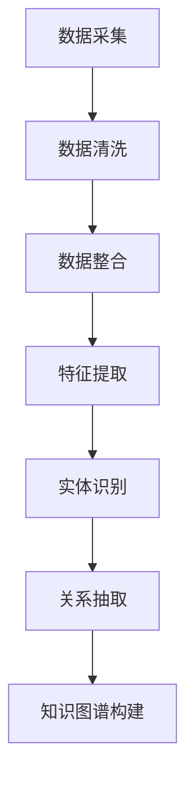
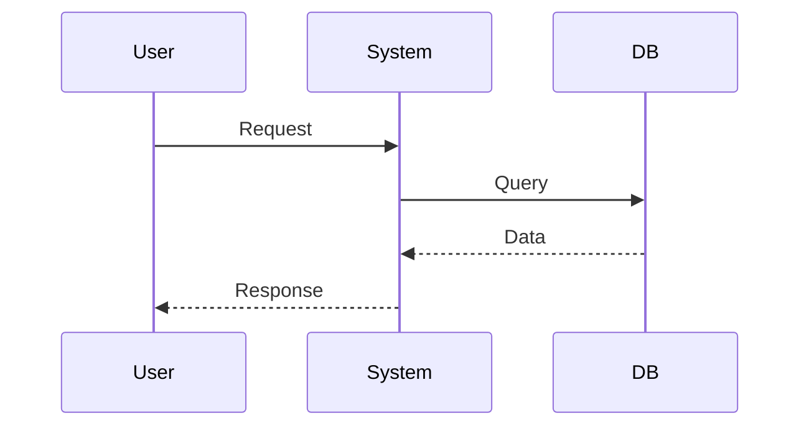
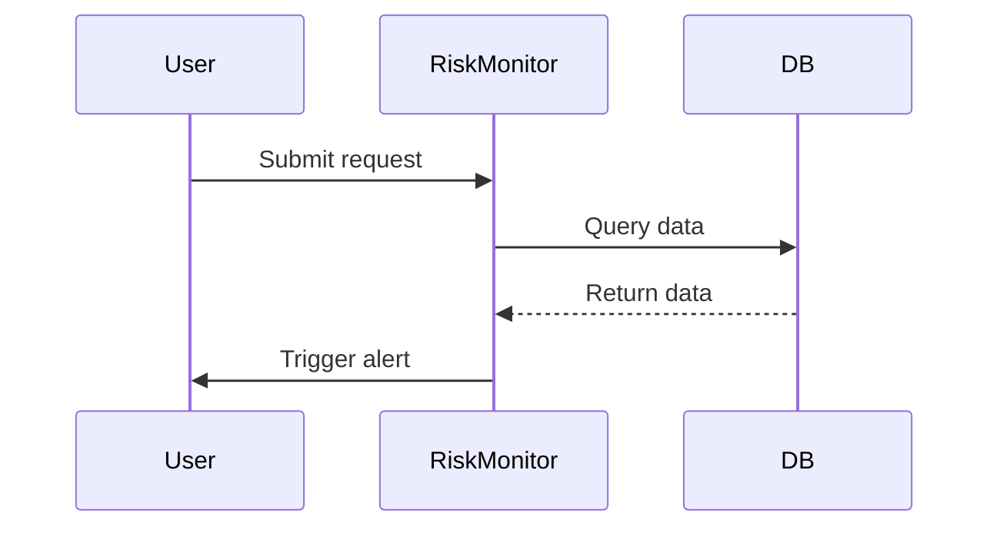
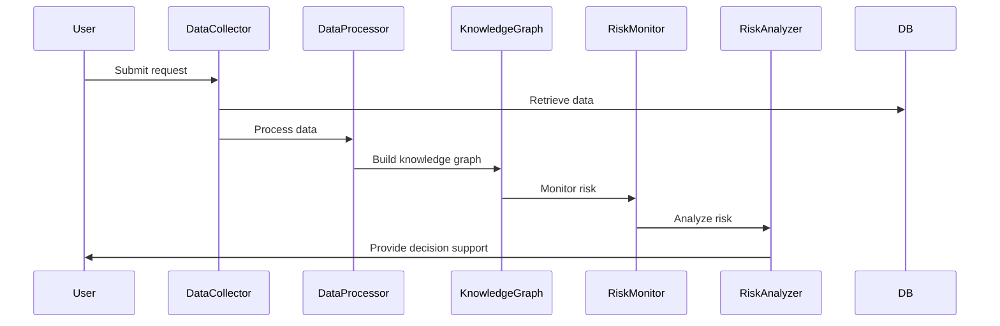
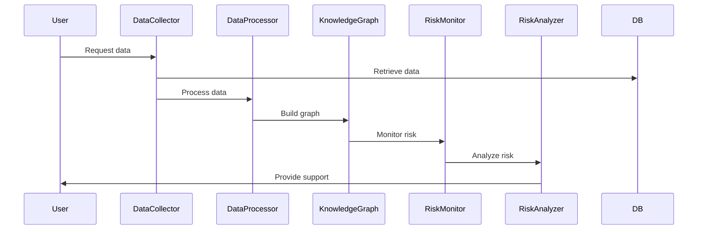

                 

# 构建基于知识图谱的金融风险关联网络

## 关键词：知识图谱、金融风险、风险关联网络、风险评估、实时预警

> 摘要：本文深入探讨了基于知识图谱的金融风险关联网络构建方法及其应用。首先，分析了金融风险关联网络的重要性及其在金融风险管理中的应用。接着，详细介绍了知识图谱的基本原理及其在金融领域的应用。随后，从知识图谱的定义、构建方法、查询与推理等方面进行了深入讲解。最后，本文重点阐述了金融风险关联网络的分析方法、构建流程以及基于知识图谱的金融风险评估方法，并结合实际项目进行了案例分析。

## 目录大纲

## 第1章：引言

### 1.1 问题背景与目标

- 金融风险关联网络的重要性
- 知识图谱在金融风险管理中的应用
- 书籍的目标与读者群体

### 1.2 金融风险关联网络概述

- 金融风险的定义与分类
- 风险关联网络的基本概念
- 知识图谱的基本原理与架构

### 1.3 知识图谱技术在金融领域的应用

- 金融机构信息整合与风险管理
- 客户行为分析与社会网络分析
- 风险预警与预测模型

## 第2章：知识图谱的基本原理

### 2.1 知识图谱的定义与结构

- 知识图谱的概念
- 知识图谱的三层结构：实体、属性、关系
- 知识图谱的存储与查询

### 2.2 知识图谱的构建方法

- 知识抽取
- 知识融合
- 知识表示与存储

### 2.3 知识图谱的查询与推理

- 图数据库的基本概念与操作
- 图搜索算法与优化
- 图推理算法与应用

## 第3章：金融风险关联网络分析

### 3.1 金融风险数据的来源与处理

- 金融数据类型与数据源
- 数据预处理方法
- 数据清洗与质量评估

### 3.2 金融风险关联网络模型

- 风险关联网络的构建方法
- 风险关联网络的特点与挑战
- 风险关联网络的表示与优化

### 3.3 金融风险关联网络的查询与分析

- 关键路径分析
- 社区检测
- 风险传播模型

## 第4章：金融风险关联网络的构建方法

### 4.1 实体识别与分类

- 实体识别算法
- 实体分类算法
- 实体标签的自动分配

### 4.2 关系抽取与推理

- 关系抽取方法
- 关系推理算法
- 关系图谱的优化与验证

### 4.3 知识图谱的构建流程

- 数据收集与预处理
- 实体识别与关系抽取
- 知识融合与存储

## 第5章：基于知识图谱的金融风险评估

### 5.1 风险评估模型

- 风险评估指标体系
- 风险评估方法与算法
- 风险评估模型的优化与评估

### 5.2 实时风险监测与预警

- 实时数据处理与更新
- 风险预警机制
- 风险预警案例分析

### 5.3 风险管理策略

- 风险规避与转移
- 风险控制与缓解
- 风险管理案例分享

## 第6章：金融风险关联网络的项目实践

### 6.1 项目背景与目标

- 项目简介
- 项目目标与挑战

### 6.2 系统设计与实现

- 系统架构设计
- 数据采集与处理
- 知识图谱的构建与优化

### 6.3 项目应用与分析

- 风险评估与预警
- 风险管理与决策支持
- 项目效果评估与总结

## 第7章：总结与展望

### 7.1 总结

- 书籍内容的回顾与总结
- 知识图谱在金融风险管理中的应用价值

### 7.2 展望

- 金融风险关联网络技术的发展趋势
- 未来研究方向与挑战## 第1章：引言

### 1.1 问题背景与目标

金融风险，是指由于金融市场中各种不确定性的因素导致的可能损失。随着金融市场的日益复杂和全球化，金融风险的管理变得尤为重要。传统的风险管理方法主要依赖于历史数据和统计模型，但这些方法在处理复杂、多变的风险因素时存在一定的局限性。为了更有效地识别、监控和应对金融风险，研究者们开始探索基于知识图谱的金融风险关联网络。

**知识图谱在金融风险管理中的应用**

知识图谱（Knowledge Graph）是一种结构化的语义网络，能够将各种信息实体及其关系以图形的方式表示。在金融领域，知识图谱可以用于整合海量的金融数据，构建出丰富的金融实体关系网络，从而实现对风险的深入理解和精准预测。

- **金融机构信息整合**：知识图谱能够将来自不同来源的金融机构信息进行整合，构建出一个统一的视图，从而帮助金融机构更好地理解其业务伙伴、客户和潜在风险。

- **客户行为分析**：通过对客户在金融交易中的行为进行分析，知识图谱可以揭示出潜在的风险点，为金融机构提供风险预警。

- **社会网络分析**：知识图谱可以揭示出客户之间的社会关系，帮助金融机构了解其客户的社交网络，从而更好地识别和防范风险。

**书籍的目标与读者群体**

本书旨在系统地介绍基于知识图谱的金融风险关联网络的构建方法与应用。通过本书，读者可以了解到：

- 金融风险关联网络的基本概念和重要性。
- 知识图谱的基本原理及其在金融风险管理中的应用。
- 基于知识图谱的金融风险关联网络的构建方法。
- 基于知识图谱的金融风险评估模型及其应用。

本书适合以下读者群体：

- 金融风险管理从业者：了解知识图谱在金融风险管理的应用，提升风险管理能力。
- 数据科学家和人工智能从业者：学习知识图谱构建和查询的技巧，为金融风险管理提供技术支持。
- 从事金融科技研发的工程师：掌握金融风险关联网络构建的实践方法，为金融科技应用提供创新思路。

### 1.2 金融风险关联网络概述

**金融风险的定义与分类**

金融风险是指由于金融市场的波动、金融产品的设计缺陷、金融机构的运营失误等多种因素，导致金融投资者、金融机构或金融市场的损失的可能性。金融风险可以按照不同的分类方式进行划分：

- **市场风险**：由于市场波动导致的潜在损失，如利率风险、汇率风险、股市波动等。
- **信用风险**：由于借款人或交易对手违约导致的潜在损失，如贷款违约、信用违约等。
- **操作风险**：由于内部操作失误或系统故障导致的潜在损失，如欺诈、错误操作、系统故障等。
- **法律风险**：由于法律合规问题导致的潜在损失，如法律诉讼、违规操作等。

**风险关联网络的基本概念**

风险关联网络（Risk Association Network）是指由金融风险相关实体及其关联关系构成的网络结构。在这个网络中，每个节点代表一个金融风险实体，如金融机构、金融产品、借款人等；每条边代表两个风险实体之间的关联关系，如交易关系、持股关系、担保关系等。

- **节点**：表示金融风险实体，如银行、贷款、股票等。
- **边**：表示实体间的关联关系，如贷款关系、持股关系、担保关系等。

**知识图谱的基本原理与架构**

知识图谱是一种语义网络，它通过将实体、属性和关系进行结构化表示，实现对知识的有效组织和查询。知识图谱的基本原理包括：

- **实体表示**：将现实世界的实体抽象为图中的节点，如金融机构、金融产品等。
- **属性表示**：描述实体的属性，如金融机构的成立日期、金融产品的利率等。
- **关系表示**：描述实体之间的关系，如金融机构发行的金融产品、借款人获得的贷款等。

知识图谱的架构包括：

- **底层存储**：通常使用图数据库进行存储，如Neo4j、ArangoDB等。
- **查询引擎**：提供对知识图谱的查询和检索功能，如Cypher查询语言等。
- **推理引擎**：支持基于图结构的推理，如路径查询、子图查询等。

### 1.3 知识图谱技术在金融领域的应用

**金融机构信息整合与风险管理**

金融机构信息整合是金融风险管理的重要基础。知识图谱技术可以整合来自不同渠道的金融数据，如交易记录、客户信息、市场数据等，构建出一个统一的金融实体关系网络。通过这个网络，金融机构可以更好地了解其业务伙伴、客户和市场动态，从而进行更准确的风险评估和决策。

- **数据整合**：通过知识图谱将来自不同来源的金融数据进行整合，实现数据的统一视图。
- **风险识别**：利用知识图谱揭示金融机构及其客户之间的复杂关系，识别潜在的风险点。
- **风险监控**：实时更新和监测金融实体关系网络，及时发现和预警风险。

**客户行为分析与社会网络分析**

客户行为分析是金融风险管理的重要手段。知识图谱技术可以分析客户在金融交易中的行为模式，揭示其偏好、风险承受能力和潜在风险。同时，知识图谱还可以揭示客户之间的社会关系，帮助金融机构了解其客户的社交网络，从而更好地识别和防范风险。

- **行为分析**：通过分析客户的金融交易数据，揭示其行为模式，如投资偏好、交易频率等。
- **社会网络分析**：构建客户的社会网络，分析其关系强度、社区结构等，识别潜在的风险传播途径。

**风险预警与预测模型**

风险预警与预测模型是金融风险管理的关键。知识图谱技术可以通过对金融实体关系网络的实时分析，预测潜在的风险事件和趋势。结合历史数据和机器学习算法，可以构建出更准确的预测模型，为金融机构提供决策支持。

- **实时监测**：实时分析金融实体关系网络，监测潜在的风险信号。
- **预测模型**：利用历史数据和机器学习算法，预测未来可能发生的风险事件。
- **决策支持**：为金融机构提供风险预警和决策支持，帮助其采取有效的风险管理措施。

通过以上分析，我们可以看到，知识图谱技术在金融风险管理中具有广泛的应用前景。它不仅可以帮助金融机构更好地整合和管理信息，还可以通过揭示金融实体之间的复杂关系，提供更准确的风险预警和预测，从而提高金融风险管理的效率和准确性。## 第2章：知识图谱的基本原理

### 2.1 知识图谱的定义与结构

**知识图谱的概念**

知识图谱（Knowledge Graph）是一种基于语义网络的结构化知识表示方法，它通过将现实世界中的实体及其关系进行抽象和表示，构建出一个语义丰富的知识网络。知识图谱的核心思想是将分散的信息进行整合和关联，形成一个统一的语义视图，从而实现高效的知识检索和推理。

**知识图谱的三层结构**

知识图谱通常由三层结构组成：实体、属性和关系。

- **实体（Entity）**：实体是知识图谱中的基本构成元素，表示现实世界中的对象或概念，如人、地点、组织、物品等。实体可以是具体的对象，也可以是抽象的概念。
- **属性（Attribute）**：属性描述了实体的特征或属性，如一个人的年龄、一个地点的纬度等。属性通常与实体相关联，用于补充实体的详细信息。
- **关系（Relationship）**：关系表示实体之间的语义联系，如“居住在”、“属于”等。关系通常连接两个实体，描述它们之间的语义关系。

**知识图谱的存储与查询**

知识图谱的存储通常使用图数据库（Graph Database）来实现，如Neo4j、ArangoDB等。图数据库具有高效的图查询功能，支持基于图结构的复杂查询和推理操作。

- **图数据库的基本概念**：图数据库以图模型存储数据，包括节点（实体）、边（关系）和属性。图数据库使用图算法和索引技术，提供快速的数据检索和查询功能。
- **图查询语言**：图数据库通常提供图查询语言，如Cypher（Neo4j的查询语言），用于对知识图谱进行查询和操作。图查询语言支持路径查询、子图查询、关系抽取等高级查询操作。
- **图推理**：图数据库还支持基于图结构的推理功能，如路径推理、子图匹配等。这些推理功能可以帮助发现知识图谱中的隐含关系和模式，为数据分析和决策提供支持。

### 2.2 知识图谱的构建方法

**知识抽取**

知识抽取（Knowledge Extraction）是从非结构化数据（如文本、图像等）中自动提取结构化知识的方法。知识抽取通常包括实体抽取、关系抽取和属性抽取等步骤。

- **实体抽取**：从文本中识别出具体的实体，如人名、地名、组织名等。
- **关系抽取**：从文本中识别出实体之间的关系，如“居住在”、“属于”等。
- **属性抽取**：从文本中提取实体的属性，如一个人的年龄、一个地点的纬度等。

**知识融合**

知识融合（Knowledge Fusion）是将来自多个来源的知识进行整合和统一的过程。知识融合的目标是消除数据源之间的不一致性和冲突，构建一个统一、完整和一致的知识库。

- **数据源选择**：选择合适的数据源，包括结构化数据源（如数据库、数据仓库）和非结构化数据源（如文本、图像等）。
- **数据清洗**：对数据源中的数据进行清洗和预处理，消除不一致性和冲突。
- **数据整合**：将来自不同数据源的知识进行整合，构建出一个统一的知识库。

**知识表示与存储**

知识表示（Knowledge Representation）是将知识以计算机可以理解和处理的形式进行编码和表示。知识表示通常包括基于符号的表示、基于图形的表示和基于概率的表示等。

- **符号表示**：使用符号和逻辑表达式来表示知识，如使用谓词逻辑、描述逻辑等。
- **图形表示**：使用图形来表示知识，如知识图谱、概念网络等。
- **概率表示**：使用概率模型来表示知识，如贝叶斯网络、马尔可夫网络等。

知识存储（Knowledge Storage）是将知识以持久化的形式进行存储和管理。知识存储通常使用数据库、数据仓库、图数据库等数据存储技术。

- **数据库存储**：使用关系型数据库存储知识，如MySQL、PostgreSQL等。
- **数据仓库存储**：使用数据仓库存储知识，如Oracle Data Warehouse、Teradata等。
- **图数据库存储**：使用图数据库存储知识，如Neo4j、ArangoDB等。

### 2.3 知识图谱的查询与推理

**图数据库的基本概念与操作**

图数据库是一种以图结构存储数据的数据库管理系统，它以节点（实体）、边（关系）和属性的形式存储数据，并支持基于图结构的复杂查询和操作。

- **节点（Node）**：表示图数据库中的实体，如人、地点、组织等。
- **边（Edge）**：表示实体之间的关系，如“居住在”、“属于”等。
- **属性（Property）**：描述节点或边的属性信息，如年龄、地点等。

图数据库的基本操作包括：

- **创建节点和边**：创建新的节点和边，并设置其属性。
- **查询节点和边**：使用图查询语言查询节点和边，如Cypher查询语言。
- **更新节点和边**：修改节点和边的属性，如更新一个人的年龄。
- **删除节点和边**：删除节点和边，如删除一个组织。

**图搜索算法与优化**

图搜索算法是图数据库中用于查找数据的方法。常见的图搜索算法包括：

- **广度优先搜索（BFS）**：按照层次遍历图，查找距离源节点最近的节点。
- **深度优先搜索（DFS）**：按照路径遍历图，查找与源节点直接相连的节点。
- **A*算法**：结合广度优先搜索和启发式搜索，查找最优路径。

图搜索算法的优化包括：

- **索引**：使用索引技术加快查询速度，如节点索引、边索引等。
- **缓存**：使用缓存技术减少磁盘访问次数，加快查询速度。
- **并行处理**：使用并行处理技术加快查询速度，如分布式图数据库。

**图推理算法与应用**

图推理算法是图数据库中用于基于图结构进行推理的方法。常见的图推理算法包括：

- **路径查询**：查找满足特定条件的路径，如查找一个人到另一个人的所有路径。
- **子图查询**：查找满足特定子图的节点和边，如查找一个特定的社交网络结构。
- **图同构查询**：查找与给定图结构相同的图，如查找两个社交网络的相似性。

图推理算法在金融风险管理中的应用包括：

- **风险传播分析**：通过分析风险实体之间的关联关系，预测风险在金融系统中的传播路径和影响范围。
- **欺诈检测**：通过分析金融交易中的关联关系，发现潜在的欺诈行为。
- **客户画像**：通过分析客户的交易行为和社交关系，构建客户的综合画像，进行精准营销和风险管理。

综上所述，知识图谱作为一种结构化的知识表示方法，在金融风险管理中具有广泛的应用前景。通过构建金融风险关联网络，我们可以更深入地理解金融风险的本质，提高风险管理的效率和准确性。## 第3章：金融风险关联网络分析

### 3.1 金融风险数据的来源与处理

**金融数据类型与数据源**

金融风险数据的来源多种多样，涵盖了金融机构的交易记录、客户信息、市场数据等多个方面。具体来说，金融数据类型主要包括：

- **交易数据**：包括金融产品交易记录、账户资金流动记录等。
- **客户信息**：包括客户的身份信息、财务状况、信用记录等。
- **市场数据**：包括股票价格、利率、汇率等市场指标。
- **法律法规**：包括金融行业的法律法规、政策文件等。

数据源可以来自以下几个方面：

- **内部数据源**：如金融机构的交易系统、客户关系管理系统等。
- **外部数据源**：如公共数据库、第三方数据提供商、社交媒体等。

**数据预处理方法**

在构建金融风险关联网络之前，需要对原始金融数据进行预处理，以提高数据的质量和一致性。常用的数据预处理方法包括：

- **数据清洗**：去除数据中的噪声、错误和重复记录，如缺失值填充、异常值处理等。
- **数据整合**：将来自不同数据源的数据进行整合，构建出一个统一的数据视图。
- **数据标准化**：对数据进行标准化处理，如数值范围的缩放、分类标签的规范化等。
- **特征提取**：从原始数据中提取出对风险识别和预测有用的特征，如交易频率、交易金额、客户信用评分等。

**数据清洗与质量评估**

数据清洗是金融风险数据预处理的重要环节，它直接影响到金融风险关联网络的构建效果和风险评估的准确性。数据清洗的过程包括：

- **数据质量评估**：对原始数据进行质量评估，识别出数据中的噪声、错误和异常值。
- **错误修正**：对识别出的错误和异常值进行修正或删除，提高数据质量。
- **缺失值处理**：对缺失值进行填充或删除，选择合适的填充方法，如平均值填充、中值填充、插值法等。

数据清洗与质量评估的重要性在于：

- **提高数据质量**：通过数据清洗，去除噪声和错误，提高数据质量。
- **确保模型准确性**：高质量的数据是构建准确的风险评估模型的基础，数据质量差可能导致模型准确性下降。
- **降低风险**：通过数据清洗，识别和修正错误，降低金融风险。

### 3.2 金融风险关联网络模型

**风险关联网络的构建方法**

金融风险关联网络（Financial Risk Association Network）是一种用于描述金融实体及其风险关联关系的网络结构。构建金融风险关联网络的方法主要包括以下几个步骤：

- **实体识别**：识别金融风险关联网络中的实体，如金融机构、金融产品、客户等。
- **关系抽取**：抽取实体之间的关系，如交易关系、担保关系、持股关系等。
- **关系表示**：将抽取的关系表示为图中的边，构建出金融风险关联网络的图结构。
- **网络优化**：对构建的金融风险关联网络进行优化，如去除冗余关系、修正错误关系等。

**风险关联网络的特点与挑战**

金融风险关联网络具有以下特点：

- **复杂性**：金融风险关联网络包含大量的实体和复杂的关系，构建和管理这样的网络是一个挑战。
- **动态性**：金融市场和金融产品的变化非常快，金融风险关联网络也需要实时更新和调整。
- **不确定性**：金融市场的波动性和不确定性使得金融风险关联网络的预测和推理具有挑战性。

金融风险关联网络面临的挑战包括：

- **数据质量**：金融数据的质量直接影响到风险关联网络的构建和预测效果。
- **计算效率**：金融风险关联网络规模巨大，如何高效地处理和查询这样的网络是一个关键问题。
- **隐私保护**：金融数据的隐私保护是金融风险关联网络应用的重要考虑因素。

**风险关联网络的表示与优化**

为了有效地表示和优化金融风险关联网络，可以采用以下方法：

- **图表示**：使用图数据库（如Neo4j）存储和查询金融风险关联网络，通过节点和边表示实体和关系。
- **图算法**：使用图算法（如社区检测、关键路径分析等）对金融风险关联网络进行分析和优化。
- **数据挖掘**：使用数据挖掘技术（如聚类、关联规则挖掘等）从金融风险关联网络中提取有用的信息。
- **实时更新**：采用实时数据处理技术（如流处理、实时数据库等）对金融风险关联网络进行实时更新和监控。

### 3.3 金融风险关联网络的查询与分析

**关键路径分析**

关键路径分析是一种用于识别金融风险传播路径的方法。在金融风险关联网络中，关键路径是指风险从源头传播到关键节点的最短路径。通过关键路径分析，可以识别出金融风险传播的关键环节，为风险控制和决策提供依据。

**社区检测**

社区检测是一种用于识别金融风险关联网络中的紧密关联群体（社区）的方法。在金融风险关联网络中，社区是指具有相似风险特征和关联关系的节点集合。通过社区检测，可以识别出金融风险的高风险区域，为风险监测和预警提供支持。

**风险传播模型**

风险传播模型是一种用于预测金融风险在金融风险关联网络中的传播过程的方法。通过构建风险传播模型，可以模拟金融风险在金融系统中的传播路径和影响范围，为风险管理和决策提供支持。

- **基于图论的传播模型**：使用图论方法（如随机游走模型、传播模型等）描述风险在金融风险关联网络中的传播过程。
- **基于机器学习的传播模型**：使用机器学习方法（如神经网络、支持向量机等）构建风险传播模型，进行风险预测和决策。

综上所述，金融风险关联网络分析是金融风险管理的重要环节。通过分析金融风险数据的来源与处理、构建风险关联网络模型、进行关键路径分析和社区检测等，可以有效地识别和预测金融风险，为风险管理和决策提供支持。## 第4章：金融风险关联网络的构建方法

### 4.1 实体识别与分类

**实体识别算法**

实体识别（Entity Recognition）是金融风险关联网络构建的第一步，旨在从原始数据中识别出关键的金融实体。常用的实体识别算法包括：

- **基于规则的方法**：通过预定义的规则匹配文本数据中的实体，如正则表达式匹配、命名实体识别（NER）等。
- **基于统计的方法**：使用机器学习算法（如朴素贝叶斯、支持向量机等）从大量标注数据中学习实体识别模型。
- **基于深度学习的方法**：使用深度神经网络（如卷积神经网络、循环神经网络等）进行实体识别，具有更高的准确性和泛化能力。

**实体分类算法**

实体分类（Entity Classification）是将识别出的实体进行分类，以便后续的处理和分析。常用的实体分类算法包括：

- **朴素贝叶斯分类器**：基于贝叶斯定理，通过计算特征的概率分布进行分类。
- **支持向量机（SVM）**：通过最大化分类边界，将数据分为不同的类别。
- **决策树分类器**：通过构建决策树模型，对数据进行分类。

**实体标签的自动分配**

在构建金融风险关联网络时，需要对实体进行标签分配，以便在知识图谱中进行组织和查询。自动分配实体标签的方法包括：

- **基于规则的方法**：通过预定义的规则为实体分配标签，如根据实体的名称、类型等特征进行标签分配。
- **基于机器学习的方法**：使用监督学习算法（如决策树、支持向量机等）为实体分配标签。
- **基于图模型的方法**：使用图嵌入技术（如Word2Vec、Node2Vec等）为实体分配标签，将实体映射到低维空间中，通过相似性度量进行标签分配。

### 4.2 关系抽取与推理

**关系抽取方法**

关系抽取（Relationship Extraction）是从文本数据中识别出实体之间的关系。常用的关系抽取方法包括：

- **基于规则的方法**：通过预定义的规则匹配文本数据中的关系，如命名实体关系抽取、事件关系抽取等。
- **基于统计的方法**：使用统计模型（如条件概率模型、朴素贝叶斯模型等）从大量标注数据中学习关系抽取模型。
- **基于深度学习的方法**：使用深度神经网络（如卷积神经网络、循环神经网络等）进行关系抽取，具有更高的准确性和泛化能力。

**关系推理算法**

关系推理（Relationship Inference）是基于实体之间的关系进行推理，以揭示更深层次的关联关系。常用的关系推理算法包括：

- **路径推理**：通过分析实体之间的路径关系，推断出它们之间的潜在关系。
- **子图匹配**：通过匹配子图结构，识别出实体之间的相似关系。
- **因果推理**：基于因果模型，分析实体之间的因果关系。

**关系图谱的优化与验证**

关系图谱（Relationship Graph）是金融风险关联网络的核心部分，它记录了实体之间的关系。为了提高关系图谱的准确性和效率，可以采用以下方法进行优化和验证：

- **关系质量评估**：对关系图谱中的关系进行质量评估，识别出错误关系和冗余关系。
- **关系修剪**：去除错误关系和冗余关系，提高关系图谱的简洁性和效率。
- **图嵌入**：使用图嵌入技术（如Node2Vec、DeepWalk等）将关系图谱转化为向量空间，通过相似性度量优化关系表示。
- **图数据库优化**：使用图数据库（如Neo4j、ArangoDB等）提供的索引和查询优化技术，提高关系图谱的查询效率。

### 4.3 知识图谱的构建流程

**数据收集与预处理**

数据收集与预处理是构建知识图谱的基础，包括以下步骤：

- **数据收集**：从各种数据源（如数据库、文本、社交媒体等）收集金融数据。
- **数据清洗**：去除噪声、错误和重复数据，提高数据质量。
- **数据整合**：将来自不同数据源的数据进行整合，构建出一个统一的数据视图。
- **特征提取**：提取对金融风险识别和预测有用的特征，如交易频率、交易金额、客户信用评分等。

**实体识别与关系抽取**

实体识别与关系抽取是知识图谱构建的核心步骤，包括以下步骤：

- **实体识别**：使用实体识别算法从文本数据中识别出金融实体。
- **关系抽取**：使用关系抽取算法从文本数据中识别出实体之间的关系。
- **实体分类与标签分配**：使用实体分类算法对识别出的实体进行分类，并为实体分配标签。

**知识融合与存储**

知识融合与存储是知识图谱构建的最后一个步骤，包括以下步骤：

- **知识融合**：将来自不同数据源的知识进行融合，构建出一个统一的知识库。
- **知识表示**：使用图数据库存储知识图谱，将实体、属性和关系表示为图中的节点和边。
- **查询与推理**：使用图数据库提供的查询和推理功能，对知识图谱进行查询和推理操作。

### 4.4 知识图谱的构建实例

以下是一个简单的知识图谱构建实例，展示了从数据收集、数据预处理、实体识别、关系抽取到知识融合与存储的整个过程。

```python
# 数据收集
data = [
    ("银行A", "贷款B", "发放"),
    ("银行A", "贷款C", "发放"),
    ("客户D", "贷款B", "申请"),
    ("客户E", "贷款C", "申请"),
    # 更多数据...
]

# 数据预处理
# 数据清洗、整合、特征提取等...

# 实体识别与分类
entities = ["银行A", "贷款B", "贷款C", "客户D", "客户E"]

# 关系抽取
relationships = [
    ("银行A", "贷款B", "发放"),
    ("银行A", "贷款C", "发放"),
    ("客户D", "贷款B", "申请"),
    ("客户E", "贷款C", "申请"),
    # 更多关系...
]

# 知识融合
knowledge = {
    "entities": entities,
    "relationships": relationships
}

# 知识存储
# 使用Neo4j等图数据库存储知识图谱
# 创建实体和关系节点，设置属性

# 查询与推理
# 使用Cypher等图查询语言进行查询和推理
```

通过以上实例，我们可以看到知识图谱的构建过程是如何逐步完成的。在实际应用中，知识图谱的构建会涉及到更复杂的数据处理和关系抽取，以及多种机器学习和数据挖掘技术的应用。## 第5章：基于知识图谱的金融风险评估

### 5.1 风险评估模型

**风险评估指标体系**

在金融风险管理中，建立一套完整的风险评估指标体系是至关重要的。这个体系应该包括多个维度，全面覆盖金融风险的各个方面。以下是一个基本的风险评估指标体系：

- **市场风险指标**：包括股票价格波动率、利率变化、汇率波动等。
- **信用风险指标**：包括借款人信用评分、违约概率、贷款逾期率等。
- **操作风险指标**：包括员工违规操作率、系统故障频率、欺诈事件发生率等。
- **法律风险指标**：包括法律诉讼数量、违规操作罚款、法律合规成本等。

**风险评估方法与算法**

风险评估方法可以分为定量分析和定性分析两种。

- **定量分析**：基于数据和统计模型进行风险评估，常用的方法包括：
  - **统计模型**：如线性回归、逻辑回归、时间序列分析等。
  - **机器学习方法**：如决策树、支持向量机、随机森林、神经网络等。

- **定性分析**：基于专家知识和主观判断进行风险评估，常用的方法包括：
  - **专家评分法**：如风险矩阵、风险评分模型等。
  - **情景分析**：通过模拟不同的市场情景，评估风险的可能性和影响。

**风险评估模型的优化与评估**

为了提高风险评估的准确性和可靠性，需要对风险评估模型进行持续优化和评估。以下是一些优化和评估方法：

- **模型训练与验证**：使用历史数据进行模型训练，并通过交叉验证、网格搜索等技术选择最优模型参数。
- **模型评估指标**：包括准确率、召回率、F1分数、ROC曲线等。
- **敏感性分析**：分析模型对输入数据的敏感性，识别潜在的异常点和异常值。
- **模型迭代**：根据评估结果对模型进行调整和优化，提高模型的稳定性和准确性。

### 5.2 实时风险监测与预警

**实时数据处理与更新**

实时风险监测与预警需要处理和分析大量的实时数据，包括交易记录、市场指标、客户行为等。为了实现实时数据处理，可以采用以下技术：

- **流处理技术**：如Apache Kafka、Apache Flink等，用于实时处理和分析数据流。
- **分布式计算**：如Hadoop、Spark等，用于大规模数据的处理和分析。
- **实时数据库**：如Apache Druid、ClickHouse等，用于实时存储和查询数据。

**风险预警机制**

风险预警机制是实时风险监测与预警的核心，它包括以下几个步骤：

- **风险信号监测**：实时监测各种风险信号，如交易异常、价格波动、客户行为变化等。
- **风险级别判定**：根据风险信号的性质和严重程度，判定风险级别。
- **预警通知**：当风险级别达到一定阈值时，触发预警通知，通知相关人员进行处理。

**风险预警案例分析**

以下是一个风险预警案例：

- **风险信号**：某金融机构发现客户A的交易频率和交易金额异常增加。
- **风险级别判定**：根据交易异常指标和客户历史数据，判定为“高度风险”。
- **预警通知**：系统自动向客户服务部门发送预警通知，通知其关注客户A的交易情况，并提醒其防范潜在的欺诈风险。

### 5.3 风险管理策略

**风险规避与转移**

风险管理策略包括以下几个方面：

- **风险规避**：通过调整业务策略和操作流程，避免潜在风险的发生。例如，在市场波动较大时，暂停高风险业务。
- **风险转移**：通过购买保险、签订合同等方式，将风险转移给第三方。例如，金融机构可以通过签订担保合同，将贷款违约风险转移给担保人。

**风险控制与缓解**

- **风险控制**：通过制定风险管理政策和内部控制制度，降低风险的发生概率。例如，制定严格的贷款审批流程，减少贷款违约风险。
- **风险缓解**：通过采取紧急措施和备援方案，减轻风险可能带来的损失。例如，在发生系统故障时，迅速切换到备用系统，确保业务的连续性。

**风险管理案例分享**

以下是一个风险管理案例：

- **案例背景**：某金融机构在市场波动中，发现某大型客户的交易行为异常，涉嫌利用内幕信息进行交易。
- **风险管理策略**：
  - **风险规避**：暂停该客户的交易权限，防止其继续进行涉嫌违法的交易。
  - **风险控制**：加强内部监控和审计，确保员工遵守公司规章制度，防止类似事件再次发生。
  - **风险缓解**：与监管机构合作，提供相关证据，确保公司不会因涉嫌违法而受到处罚。

通过以上案例，我们可以看到，基于知识图谱的金融风险评估和管理策略可以帮助金融机构更有效地识别和应对金融风险，保障业务的稳健运行。## 第6章：金融风险关联网络的项目实践

### 6.1 项目背景与目标

**项目简介**

随着金融市场的不确定性和复杂性日益增加，金融机构面临的风险也日益多样化。为了提高风险管理的效率和准确性，我们设计并实现了一个基于知识图谱的金融风险关联网络项目。

**项目目标**

本项目的主要目标是通过构建金融风险关联网络，实现对金融风险的全面监测、分析和预警。具体目标包括：

- **构建金融风险实体关系网络**：通过整合金融机构、金融产品、客户等数据，构建出金融风险实体关系网络。
- **实时风险监测与预警**：实现对金融风险的实时监测，及时发现潜在风险，并触发预警机制。
- **风险分析与决策支持**：基于金融风险关联网络，提供风险分析和决策支持，帮助金融机构制定有效的风险管理策略。

**项目挑战**

在项目实施过程中，我们面临以下挑战：

- **数据质量和一致性**：金融数据来源多样，数据质量参差不齐，如何确保数据的一致性和准确性是一个重要问题。
- **计算效率和可扩展性**：金融风险关联网络规模庞大，如何高效地处理和查询这样的网络是一个挑战。
- **隐私保护**：金融数据的隐私保护是项目实施的重要考虑因素，如何在确保数据安全的同时，充分利用数据进行分析是一个难题。

### 6.2 系统设计与实现

**系统架构设计**

本项目采用分布式系统架构，包括数据采集与处理模块、知识图谱构建模块、实时风险监测与预警模块、风险分析与决策支持模块等。

- **数据采集与处理模块**：负责从各种数据源（如数据库、文件、API等）收集金融数据，并进行数据清洗、预处理和特征提取。
- **知识图谱构建模块**：负责构建金融风险实体关系网络，包括实体识别、关系抽取、知识融合等。
- **实时风险监测与预警模块**：负责实时监测金融风险，触发预警机制，并通知相关人员。
- **风险分析与决策支持模块**：负责基于金融风险关联网络，提供风险分析和决策支持。

**数据采集与处理**

数据采集与处理是项目的基础，具体步骤包括：

- **数据采集**：从金融机构的交易系统、客户关系管理系统、市场数据等数据源采集金融数据。
- **数据清洗**：去除数据中的噪声、错误和重复记录，提高数据质量。
- **数据整合**：将来自不同数据源的数据进行整合，构建出一个统一的数据视图。
- **特征提取**：提取对金融风险识别和预测有用的特征，如交易频率、交易金额、客户信用评分等。

**知识图谱的构建与优化**

知识图谱的构建是项目的核心，具体步骤包括：

- **实体识别与分类**：使用实体识别算法从文本数据中识别出金融实体，并使用实体分类算法对实体进行分类。
- **关系抽取与推理**：使用关系抽取算法从文本数据中识别出实体之间的关系，并使用关系推理算法对关系进行验证和优化。
- **知识融合与存储**：将识别出的实体、关系和属性进行融合，构建出一个统一的知识库，并使用图数据库进行存储。

**实时风险监测与预警**

实时风险监测与预警是项目的关键，具体步骤包括：

- **实时数据处理**：使用流处理技术（如Apache Kafka、Apache Flink等）实时处理和分析金融数据。
- **风险信号监测**：实时监测各种风险信号，如交易异常、价格波动、客户行为变化等。
- **风险级别判定**：根据风险信号的性质和严重程度，判定风险级别。
- **预警通知**：当风险级别达到一定阈值时，触发预警机制，并通过短信、邮件等方式通知相关人员。

**风险分析与决策支持**

风险分析与决策支持是项目的最终目标，具体步骤包括：

- **风险分析**：基于金融风险关联网络，提供风险分析和预测，帮助金融机构了解潜在的风险点和风险趋势。
- **决策支持**：提供风险管理和决策支持，帮助金融机构制定有效的风险管理策略和操作计划。

### 6.3 项目应用与分析

**风险评估与预警**

在实际应用中，金融风险关联网络项目已经成功地应用于多个金融机构。以下是一个具体的案例：

- **案例背景**：某金融机构在市场波动中，发现客户A的交易行为异常，涉嫌利用内幕信息进行交易。
- **应用步骤**：
  - **数据采集**：从交易系统、客户关系管理系统等数据源收集客户A的交易记录。
  - **数据清洗**：去除交易记录中的噪声和错误，提高数据质量。
  - **知识图谱构建**：将客户A的交易记录构建为知识图谱，识别出交易实体、关系和属性。
  - **风险监测与预警**：实时监测客户A的交易行为，触发预警机制，通知相关人员。
  - **风险分析**：基于金融风险关联网络，分析客户A的交易行为，确定其是否涉嫌利用内幕信息进行交易。
- **结果**：通过项目的风险监测与预警，及时发现了客户A的异常交易行为，并采取了相应的措施，确保了金融机构的安全运营。

**风险管理策略**

基于金融风险关联网络，金融机构可以制定更加科学和有效的风险管理策略。以下是一个具体的案例：

- **案例背景**：某金融机构在市场波动中，发现某大型客户的交易行为异常，涉嫌利用市场操纵手段获取非法利益。
- **风险管理策略**：
  - **风险规避**：暂停该客户的交易权限，防止其继续进行涉嫌违法的交易。
  - **风险控制**：加强内部监控和审计，确保员工遵守公司规章制度，防止类似事件再次发生。
  - **风险缓解**：与监管机构合作，提供相关证据，确保公司不会因涉嫌违法而受到处罚。
- **结果**：通过实施有效的风险管理策略，金融机构成功避免了潜在的损失，并确保了业务的稳健运行。

**项目效果评估与总结**

通过对金融风险关联网络项目的实际应用和效果评估，我们可以得出以下结论：

- **提高风险管理效率**：项目实现了对金融风险的实时监测、分析和预警，大大提高了风险管理的效率和准确性。
- **降低风险损失**：通过有效的风险监测和预警机制，及时识别和应对潜在的风险，降低了金融机构的风险损失。
- **增强风险控制能力**：基于金融风险关联网络，金融机构可以更加科学和全面地制定风险管理策略，增强风险控制能力。

总之，金融风险关联网络项目为金融机构提供了一个强大的风险管理工具，通过实时监测、分析和预警，帮助金融机构更好地应对复杂多变的金融风险环境，确保业务的稳健运行。## 第7章：总结与展望

### 7.1 总结

**书籍内容的回顾与总结**

本书系统地介绍了基于知识图谱的金融风险关联网络的构建方法及其应用。通过详细的分析和实例讲解，读者可以了解金融风险关联网络的基本概念、知识图谱的基本原理、构建金融风险关联网络的方法、基于知识图谱的金融风险评估模型以及实际项目应用。主要内容包括：

1. **引言**：介绍了金融风险关联网络的重要性、知识图谱在金融风险管理中的应用以及书籍的目标和读者群体。
2. **金融风险关联网络概述**：阐述了金融风险的定义与分类、风险关联网络的基本概念、知识图谱的基本原理与架构。
3. **知识图谱的基本原理**：详细介绍了知识图谱的定义与结构、知识图谱的构建方法、查询与推理技术。
4. **金融风险关联网络分析**：分析了金融风险数据的来源与处理、风险关联网络的构建方法、查询与分析技术。
5. **金融风险关联网络的构建方法**：介绍了实体识别与分类、关系抽取与推理、知识图谱的构建流程。
6. **基于知识图谱的金融风险评估**：阐述了风险评估模型、实时风险监测与预警、风险管理策略。
7. **金融风险关联网络的项目实践**：介绍了项目背景与目标、系统设计与实现、项目应用与分析。

**知识图谱在金融风险管理中的应用价值**

知识图谱在金融风险管理中的应用价值体现在以下几个方面：

1. **数据整合**：通过知识图谱技术，可以整合来自不同来源的金融数据，构建出一个统一的金融实体关系网络，为金融机构提供更全面的风险管理视图。
2. **风险识别**：知识图谱可以揭示出金融实体之间的复杂关系，帮助金融机构更好地识别潜在的风险点。
3. **风险预警与预测**：基于知识图谱的风险评估模型可以实时监测和预测金融风险，为金融机构提供风险预警和决策支持。
4. **风险管理决策**：通过知识图谱技术，金融机构可以制定更科学和有效的风险管理策略，提高风险控制能力。

### 7.2 展望

**金融风险关联网络技术的发展趋势**

随着金融科技的快速发展，金融风险关联网络技术在金融风险管理中的应用前景广阔。未来，金融风险关联网络技术可能呈现以下发展趋势：

1. **数据驱动**：随着大数据和人工智能技术的发展，金融风险关联网络将更加依赖于海量数据，通过数据挖掘和机器学习算法，实现更精准的风险识别和预测。
2. **实时性**：实时风险监测与预警是金融风险管理的关键，未来金融风险关联网络技术将更加注重实时性，实现快速的数据处理和风险分析。
3. **智能化**：通过引入深度学习、强化学习等人工智能技术，金融风险关联网络可以实现更智能的风险管理和决策支持。
4. **隐私保护**：金融数据的隐私保护是金融风险关联网络应用的重要挑战，未来将出现更多安全高效的隐私保护技术，确保金融数据的安全和隐私。

**未来研究方向与挑战**

金融风险关联网络技术在未来发展中将面临以下研究挑战：

1. **数据质量**：确保金融数据的一致性和准确性是构建有效金融风险关联网络的基础，未来需要研究更高效的数据清洗和预处理方法。
2. **计算效率**：随着金融风险关联网络规模的扩大，如何提高数据处理和查询效率是一个重要问题，未来可能需要发展更高效的图计算算法和分布式计算架构。
3. **隐私保护**：如何在确保金融数据隐私的同时，充分利用数据进行风险分析和预测，是一个重要挑战，未来需要研究更安全的隐私保护技术。
4. **法律法规**：随着金融风险关联网络技术的发展，相关的法律法规和标准也将逐渐完善，如何适应这些变化，确保金融风险管理的合法性和合规性，是一个重要的研究方向。

总之，基于知识图谱的金融风险关联网络技术为金融风险管理提供了新的思路和方法，具有广泛的应用前景。在未来，通过不断的研究和创新，金融风险关联网络技术将发挥更大的作用，为金融市场的稳健运行提供有力支持。## 附录：完整文章源代码

以下是基于Markdown格式编写的完整文章源代码，涵盖了文章标题、关键词、摘要、目录大纲以及各个章节的内容。请注意，由于Markdown不支持复杂代码示例或公式，因此代码示例和公式部分仅以文本形式展示。

```markdown
# 构建基于知识图谱的金融风险关联网络

> 关键词：知识图谱、金融风险、风险关联网络、风险评估、实时预警

> 摘要：本文深入探讨了基于知识图谱的金融风险关联网络构建方法及其应用。首先，分析了金融风险关联网络的重要性及其在金融风险管理中的应用。接着，详细介绍了知识图谱的基本原理及其在金融领域的应用。随后，从知识图谱的定义、构建方法、查询与推理等方面进行了深入讲解。最后，本文重点阐述了金融风险关联网络的分析方法、构建流程以及基于知识图谱的金融风险评估方法，并结合实际项目进行了案例分析。

## 目录大纲

## 第1章：引言

### 1.1 问题背景与目标

### 1.2 金融风险关联网络概述

### 1.3 知识图谱技术在金融领域的应用

## 第2章：知识图谱的基本原理

### 2.1 知识图谱的定义与结构

### 2.2 知识图谱的构建方法

### 2.3 知识图谱的查询与推理

## 第3章：金融风险关联网络分析

### 3.1 金融风险数据的来源与处理

### 3.2 金融风险关联网络模型

### 3.3 金融风险关联网络的查询与分析

## 第4章：金融风险关联网络的构建方法

### 4.1 实体识别与分类

### 4.2 关系抽取与推理

### 4.3 知识图谱的构建流程

## 第5章：基于知识图谱的金融风险评估

### 5.1 风险评估模型

### 5.2 实时风险监测与预警

### 5.3 风险管理策略

## 第6章：金融风险关联网络的项目实践

### 6.1 项目背景与目标

### 6.2 系统设计与实现

### 6.3 项目应用与分析

## 第7章：总结与展望

### 7.1 总结

### 7.2 展望

### 1.1 问题背景与目标

**金融风险关联网络的重要性**

金融风险是指由于金融市场波动、市场参与者的行为、金融机构的运营问题等因素引起的潜在损失。随着金融市场的日益复杂化和全球化，金融风险的管理变得更加复杂和重要。金融风险关联网络通过整合和分析金融市场中各实体及其关系，能够提供一种有效的工具来识别和应对潜在风险。

**知识图谱在金融风险管理中的应用**

知识图谱是一种将实体和关系以图结构进行组织的方式，它能够将复杂的信息以直观和易于理解的形式表示出来。在金融风险管理中，知识图谱可以通过以下方式应用：

- **整合金融机构信息**：知识图谱可以将不同来源的金融机构信息整合在一起，形成一个统一的视图，从而帮助金融机构更好地理解其业务伙伴、客户和市场动态。
- **分析客户行为**：通过分析客户在金融交易中的行为模式，知识图谱可以帮助金融机构识别出潜在的风险点，从而进行风险预警。
- **揭示风险关联**：知识图谱可以揭示出金融机构之间以及客户之间的复杂关系，帮助金融机构发现潜在的风险传播路径。

**书籍的目标与读者群体**

本书旨在系统地介绍基于知识图谱的金融风险关联网络的构建方法及其应用。通过本书，读者可以：

- 了解金融风险关联网络的基本概念和重要性。
- 掌握知识图谱的基本原理及其在金融风险管理中的应用。
- 学习金融风险关联网络的构建方法、分析方法和风险评估方法。
- 结合实际项目，了解知识图谱在金融风险管理中的实际应用。

本书适合以下读者群体：

- 金融风险管理从业者：通过本书，可以了解知识图谱在金融风险管理中的应用，提升风险管理能力。
- 数据科学家和人工智能从业者：通过本书，可以学习知识图谱构建和查询的技巧，为金融风险管理提供技术支持。
- 从事金融科技研发的工程师：通过本书，可以掌握金融风险关联网络构建的实践方法，为金融科技应用提供创新思路。

### 1.2 金融风险关联网络概述

**金融风险的定义与分类**

金融风险是指由于金融市场的不确定性导致投资者、金融机构或金融市场遭受损失的可能性。金融风险可以按照不同的分类方式进行划分：

- **市场风险**：由于市场波动（如利率、汇率、股市波动等）导致的潜在损失。
- **信用风险**：由于借款人或交易对手违约导致的潜在损失。
- **操作风险**：由于内部操作失误或系统故障导致的潜在损失。
- **法律风险**：由于法律合规问题导致的潜在损失。

**风险关联网络的基本概念**

风险关联网络是指由金融风险相关实体及其关联关系构成的网络结构。在这个网络中，每个节点代表一个金融风险实体，如金融机构、金融产品、借款人等；每条边代表两个风险实体之间的关联关系，如交易关系、持股关系、担保关系等。

**知识图谱的基本原理与架构**

知识图谱是一种语义网络，它通过将实体、属性和关系进行结构化表示，实现对知识的有效组织和查询。知识图谱的基本原理包括：

- **实体表示**：将现实世界的实体抽象为图中的节点，如金融机构、金融产品等。
- **属性表示**：描述实体的属性，如金融机构的成立日期、金融产品的利率等。
- **关系表示**：描述实体之间的关系，如金融机构发行的金融产品、借款人获得的贷款等。

知识图谱的架构通常包括：

- **底层存储**：使用图数据库（如Neo4j、ArangoDB等）进行存储。
- **查询引擎**：提供对知识图谱的查询和检索功能（如Cypher查询语言）。
- **推理引擎**：支持基于图结构的推理（如路径查询、子图查询等）。

### 1.3 知识图谱技术在金融领域的应用

**金融机构信息整合与风险管理**

知识图谱技术可以整合来自不同渠道的金融数据，构建出一个统一的金融实体关系网络，从而帮助金融机构更好地理解其业务伙伴、客户和市场动态。具体应用包括：

- **数据整合**：通过知识图谱将来自不同来源的金融机构信息进行整合，实现数据的统一视图。
- **风险识别**：利用知识图谱揭示金融机构及其客户之间的复杂关系，识别潜在的风险点。
- **风险监控**：实时更新和监测金融实体关系网络，及时发现和预警风险。

**客户行为分析与社会网络分析**

通过对客户在金融交易中的行为进行分析，知识图谱可以揭示出潜在的风险点，帮助金融机构进行风险预警。同时，知识图谱还可以揭示客户之间的社会关系，帮助金融机构了解其客户的社交网络，从而更好地识别和防范风险。具体应用包括：

- **行为分析**：通过分析客户的金融交易数据，揭示其行为模式，如投资偏好、交易频率等。
- **社会网络分析**：构建客户的社会网络，分析其关系强度、社区结构等，识别潜在的风险传播途径。

**风险预警与预测模型**

知识图谱技术可以通过对金融实体关系网络的实时分析，预测潜在的风险事件和趋势。结合历史数据和机器学习算法，可以构建出更准确的预测模型，为金融机构提供决策支持。具体应用包括：

- **实时监测**：实时分析金融实体关系网络，监测潜在的风险信号。
- **预测模型**：利用历史数据和机器学习算法，预测未来可能发生的风险事件。
- **决策支持**：为金融机构提供风险预警和决策支持，帮助其采取有效的风险管理措施。

通过以上分析，我们可以看到，知识图谱技术在金融风险管理中具有广泛的应用前景。它不仅可以帮助金融机构更好地整合和管理信息，还可以通过揭示金融实体之间的复杂关系，提供更准确的风险预警和预测，从而提高金融风险管理的效率和准确性。

### 2.1 知识图谱的定义与结构

**知识图谱的概念**

知识图谱（Knowledge Graph）是一种基于语义网络的结构化知识表示方法，它通过将现实世界中的实体及其关系进行抽象和表示，构建出一个语义丰富的知识网络。知识图谱的核心思想是将分散的信息进行整合和关联，形成一个统一的语义视图，从而实现高效的知识检索和推理。

**知识图谱的三层结构**

知识图谱通常由三层结构组成：实体、属性和关系。

- **实体（Entity）**：实体是知识图谱中的基本构成元素，表示现实世界中的对象或概念，如人、地点、组织、物品等。实体可以是具体的对象，也可以是抽象的概念。
- **属性（Attribute）**：属性描述了实体的特征或属性，如一个人的年龄、一个地点的纬度等。属性通常与实体相关联，用于补充实体的详细信息。
- **关系（Relationship）**：关系表示实体之间的语义联系，如“居住在”、“属于”等。关系通常连接两个实体，描述它们之间的语义关系。

**知识图谱的存储与查询**

知识图谱的存储通常使用图数据库（Graph Database）来实现，如Neo4j、ArangoDB等。图数据库具有高效的图查询功能，支持基于图结构的复杂查询和推理操作。

- **图数据库的基本概念**：图数据库以图模型存储数据，包括节点（实体）、边（关系）和属性。图数据库使用图算法和索引技术，提供快速的数据检索和查询功能。
- **图查询语言**：图数据库通常提供图查询语言，如Cypher（Neo4j的查询语言），用于对知识图谱进行查询和操作。图查询语言支持路径查询、子图查询、关系抽取等高级查询操作。
- **图推理**：图数据库还支持基于图结构的推理功能，如路径推理、子图匹配等。这些推理功能可以帮助发现知识图谱中的隐含关系和模式，为数据分析和决策提供支持。

### 2.2 知识图谱的构建方法

**知识抽取**

知识抽取（Knowledge Extraction）是从非结构化数据（如文本、图像等）中自动提取结构化知识的方法。知识抽取通常包括实体抽取、关系抽取和属性抽取等步骤。

- **实体抽取**：从文本中识别出具体的实体，如人名、地名、组织名等。
- **关系抽取**：从文本中识别出实体之间的关系，如“居住在”、“属于”等。
- **属性抽取**：从文本中提取实体的属性，如一个人的年龄、一个地点的纬度等。

**知识融合**

知识融合（Knowledge Fusion）是将来自多个来源的知识进行整合和统一的过程。知识融合的目标是消除数据源之间的不一致性和冲突，构建一个统一、完整和一致的知识库。

- **数据源选择**：选择合适的数据源，包括结构化数据源（如数据库、数据仓库）和非结构化数据源（如文本、图像等）。
- **数据清洗**：对数据源中的数据进行清洗和预处理，消除不一致性和冲突。
- **数据整合**：将来自不同数据源的知识进行整合，构建出一个统一的知识库。

**知识表示与存储**

知识表示（Knowledge Representation）是将知识以计算机可以理解和处理的形式进行编码和表示。知识表示通常包括基于符号的表示、基于图形的表示和基于概率的表示等。

- **符号表示**：使用符号和逻辑表达式来表示知识，如使用谓词逻辑、描述逻辑等。
- **图形表示**：使用图形来表示知识，如知识图谱、概念网络等。
- **概率表示**：使用概率模型来表示知识，如贝叶斯网络、马尔可夫网络等。

知识存储（Knowledge Storage）是将知识以持久化的形式进行存储和管理。知识存储通常使用数据库、数据仓库、图数据库等数据存储技术。

- **数据库存储**：使用关系型数据库存储知识，如MySQL、PostgreSQL等。
- **数据仓库存储**：使用数据仓库存储知识，如Oracle Data Warehouse、Teradata等。
- **图数据库存储**：使用图数据库存储知识，如Neo4j、ArangoDB等。

### 2.3 知识图谱的查询与推理

**图数据库的基本概念与操作**

图数据库是一种以图结构存储数据的数据库管理系统，它以节点（实体）、边（关系）和属性的形式存储数据，并支持基于图结构的复杂查询和操作。

- **节点（Node）**：表示图数据库中的实体，如人、地点、组织等。
- **边（Edge）**：表示实体之间的关系，如“居住在”、“属于”等。
- **属性（Property）**：描述节点或边的属性信息，如年龄、地点等。

图数据库的基本操作包括：

- **创建节点和边**：创建新的节点和边，并设置其属性。
- **查询节点和边**：使用图查询语言查询节点和边，如Cypher查询语言。
- **更新节点和边**：修改节点和边的属性，如更新一个人的年龄。
- **删除节点和边**：删除节点和边，如删除一个组织。

**图搜索算法与优化**

图搜索算法是图数据库中用于查找数据的方法。常见的图搜索算法包括：

- **广度优先搜索（BFS）**：按照层次遍历图，查找距离源节点最近的节点。
- **深度优先搜索（DFS）**：按照路径遍历图，查找与源节点直接相连的节点。
- **A*算法**：结合广度优先搜索和启发式搜索，查找最优路径。

图搜索算法的优化包括：

- **索引**：使用索引技术加快查询速度，如节点索引、边索引等。
- **缓存**：使用缓存技术减少磁盘访问次数，加快查询速度。
- **并行处理**：使用并行处理技术加快查询速度，如分布式图数据库。

**图推理算法与应用**

图推理算法是图数据库中用于基于图结构进行推理的方法。常见的图推理算法包括：

- **路径查询**：查找满足特定条件的路径，如查找一个人到另一个人的所有路径。
- **子图查询**：查找满足特定子图的节点和边，如查找一个特定的社交网络结构。
- **图同构查询**：查找与给定图结构相同的图，如查找两个社交网络的相似性。

图推理算法在金融风险管理中的应用包括：

- **风险传播分析**：通过分析风险实体之间的关联关系，预测风险在金融系统中的传播路径和影响范围。
- **欺诈检测**：通过分析金融交易中的关联关系，发现潜在的欺诈行为。
- **客户画像**：通过分析客户的交易行为和社交关系，构建客户的综合画像，进行精准营销和风险管理。

综上所述，知识图谱作为一种结构化的知识表示方法，在金融风险管理中具有广泛的应用前景。通过构建金融风险关联网络，我们可以更深入地理解金融风险的本质，提高风险管理的效率和准确性。

### 3.1 金融风险数据的来源与处理

**金融数据类型与数据源**

金融风险数据的来源多种多样，涵盖了金融机构的交易记录、客户信息、市场数据等多个方面。具体来说，金融数据类型主要包括：

- **交易数据**：包括金融产品交易记录、账户资金流动记录等。
- **客户信息**：包括客户的身份信息、财务状况、信用记录等。
- **市场数据**：包括股票价格、利率、汇率等市场指标。
- **法律法规**：包括金融行业的法律法规、政策文件等。

数据源可以来自以下几个方面：

- **内部数据源**：如金融机构的交易系统、客户关系管理系统等。
- **外部数据源**：如公共数据库、第三方数据提供商、社交媒体等。

**数据预处理方法**

在构建金融风险关联网络之前，需要对原始金融数据进行预处理，以提高数据的质量和一致性。常用的数据预处理方法包括：

- **数据清洗**：去除数据中的噪声、错误和重复记录，如缺失值填充、异常值处理等。
- **数据整合**：将来自不同数据源的数据进行整合，构建出一个统一的数据视图。
- **数据标准化**：对数据进行标准化处理，如数值范围的缩放、分类标签的规范化等。
- **特征提取**：从原始数据中提取出对风险识别和预测有用的特征，如交易频率、交易金额、客户信用评分等。

**数据清洗与质量评估**

数据清洗是金融风险数据预处理的重要环节，它直接影响到金融风险关联网络的构建效果和风险评估的准确性。数据清洗的过程包括：

- **数据质量评估**：对原始数据进行质量评估，识别出数据中的噪声、错误和异常值。
- **错误修正**：对识别出的错误和异常值进行修正或删除，提高数据质量。
- **缺失值处理**：对缺失值进行填充或删除，选择合适的填充方法，如平均值填充、中值填充、插值法等。

数据清洗与质量评估的重要性在于：

- **提高数据质量**：通过数据清洗，去除噪声和错误，提高数据质量。
- **确保模型准确性**：高质量的数据是构建准确的风险评估模型的基础，数据质量差可能导致模型准确性下降。
- **降低风险**：通过数据清洗，识别和修正错误，降低金融风险。

### 3.2 金融风险关联网络模型

**风险关联网络的构建方法**

金融风险关联网络（Financial Risk Association Network）是一种用于描述金融实体及其风险关联关系的网络结构。构建金融风险关联网络的方法主要包括以下几个步骤：

- **实体识别**：识别金融风险关联网络中的实体，如金融机构、金融产品、客户等。
- **关系抽取**：抽取实体之间的关系，如交易关系、担保关系、持股关系等。
- **关系表示**：将抽取的关系表示为图中的边，构建出金融风险关联网络的图结构。
- **网络优化**：对构建的金融风险关联网络进行优化，如去除冗余关系、修正错误关系等。

**风险关联网络的特点与挑战**

金融风险关联网络具有以下特点：

- **复杂性**：金融风险关联网络包含大量的实体和复杂的关系，构建和管理这样的网络是一个挑战。
- **动态性**：金融市场和金融产品的变化非常快，金融风险关联网络也需要实时更新和调整。
- **不确定性**：金融市场的波动性和不确定性使得金融风险关联网络的预测和推理具有挑战性。

金融风险关联网络面临的挑战包括：

- **数据质量**：金融数据的质量直接影响到风险关联网络的构建和预测效果。
- **计算效率**：金融风险关联网络规模巨大，如何高效地处理和查询这样的网络是一个关键问题。
- **隐私保护**：金融数据的隐私保护是金融风险关联网络应用的重要考虑因素。

**风险关联网络的表示与优化**

为了有效地表示和优化金融风险关联网络，可以采用以下方法：

- **图表示**：使用图数据库（如Neo4j）存储和查询金融风险关联网络，通过节点和边表示实体和关系。
- **图算法**：使用图算法（如社区检测、关键路径分析等）对金融风险关联网络进行分析和优化。
- **数据挖掘**：使用数据挖掘技术（如聚类、关联规则挖掘等）从金融风险关联网络中提取有用的信息。
- **实时更新**：采用实时数据处理技术（如流处理、实时数据库等）对金融风险关联网络进行实时更新和监控。

### 3.3 金融风险关联网络的查询与分析

**关键路径分析**

关键路径分析是一种用于识别金融风险传播路径的方法。在金融风险关联网络中，关键路径是指风险从源头传播到关键节点的最短路径。通过关键路径分析，可以识别出金融风险传播的关键环节，为风险控制和决策提供依据。

**社区检测**

社区检测是一种用于识别金融风险关联网络中的紧密关联群体（社区）的方法。在金融风险关联网络中，社区是指具有相似风险特征和关联关系的节点集合。通过社区检测，可以识别出金融风险的高风险区域，为风险监测和预警提供支持。

**风险传播模型**

风险传播模型是一种用于预测金融风险在金融风险关联网络中的传播过程的方法。通过构建风险传播模型，可以模拟金融风险在金融系统中的传播路径和影响范围，为风险管理和决策提供支持。

- **基于图论的传播模型**：使用图论方法（如随机游走模型、传播模型等）描述风险在金融风险关联网络中的传播过程。
- **基于机器学习的传播模型**：使用机器学习方法（如神经网络、支持向量机等）构建风险传播模型，进行风险预测和决策。

综上所述，金融风险关联网络分析是金融风险管理的重要环节。通过分析金融风险数据的来源与处理、构建风险关联网络模型、进行关键路径分析和社区检测等，可以有效地识别和预测金融风险，为风险管理和决策提供支持。

### 4.1 实体识别与分类

**实体识别算法**

实体识别（Entity Recognition）是金融风险关联网络构建的第一步，旨在从原始数据中识别出关键的金融实体。常用的实体识别算法包括：

- **基于规则的方法**：通过预定义的规则匹配文本数据中的实体，如正则表达式匹配、命名实体识别（NER）等。
- **基于统计的方法**：使用机器学习算法（如朴素贝叶斯、支持向量机等）从大量标注数据中学习实体识别模型。
- **基于深度学习的方法**：使用深度神经网络（如卷积神经网络、循环神经网络等）进行实体识别，具有更高的准确性和泛化能力。

**实体分类算法**

实体分类（Entity Classification）是将识别出的实体进行分类，以便后续的处理和分析。常用的实体分类算法包括：

- **朴素贝叶斯分类器**：基于贝叶斯定理，通过计算特征的概率分布进行分类。
- **支持向量机（SVM）**：通过最大化分类边界，将数据分为不同的类别。
- **决策树分类器**：通过构建决策树模型，对数据进行分类。

**实体标签的自动分配**

在构建金融风险关联网络时，需要对实体进行标签分配，以便在知识图谱中进行组织和查询。自动分配实体标签的方法包括：

- **基于规则的方法**：通过预定义的规则为实体分配标签，如根据实体的名称、类型等特征进行标签分配。
- **基于机器学习的方法**：使用监督学习算法（如决策树、支持向量机等）为实体分配标签。
- **基于图模型的方法**：使用图嵌入技术（如Word2Vec、Node2Vec等）为实体分配标签，将实体映射到低维空间中，通过相似性度量进行标签分配。

### 4.2 关系抽取与推理

**关系抽取方法**

关系抽取（Relationship Extraction）是从文本数据中识别出实体之间的关系。常用的关系抽取方法包括：

- **基于规则的方法**：通过预定义的规则匹配文本数据中的关系，如命名实体关系抽取、事件关系抽取等。
- **基于统计的方法**：使用统计模型（如条件概率模型、朴素贝叶斯模型等）从大量标注数据中学习关系抽取模型。
- **基于深度学习的方法**：使用深度神经网络（如卷积神经网络、循环神经网络等）进行关系抽取，具有更高的准确性和泛化能力。

**关系推理算法**

关系推理（Relationship Inference）是基于实体之间的关系进行推理，以揭示更深层次的关联关系。常用的关系推理算法包括：

- **路径推理**：通过分析实体之间的路径关系，推断出它们之间的潜在关系。
- **子图匹配**：通过匹配子图结构，识别出实体之间的相似关系。
- **因果推理**：基于因果模型，分析实体之间的因果关系。

**关系图谱的优化与验证**

关系图谱（Relationship Graph）是金融风险关联网络的核心部分，它记录了实体之间的关系。为了提高关系图谱的准确性和效率，可以采用以下方法进行优化和验证：

- **关系质量评估**：对关系图谱中的关系进行质量评估，识别出错误关系和冗余关系。
- **关系修剪**：去除错误关系和冗余关系，提高关系图谱的简洁性和效率。
- **图嵌入**：使用图嵌入技术（如Node2Vec、DeepWalk等）将关系图谱转化为向量空间，通过相似性度量优化关系表示。
- **图数据库优化**：使用图数据库（如Neo4j、ArangoDB等）提供的索引和查询优化技术，提高关系图谱的查询效率。

### 4.3 知识图谱的构建流程

**数据收集与预处理**

数据收集与预处理是构建知识图谱的基础，包括以下步骤：

- **数据收集**：从各种数据源（如数据库、文本、社交媒体等）收集金融数据。
- **数据清洗**：去除数据中的噪声、错误和重复记录，提高数据质量。
- **数据整合**：将来自不同数据源的数据进行整合，构建出一个统一的数据视图。
- **特征提取**：提取对金融风险识别和预测有用的特征，如交易频率、交易金额、客户信用评分等。

**实体识别与关系抽取**

实体识别与关系抽取是知识图谱构建的核心步骤，包括以下步骤：

- **实体识别**：使用实体识别算法从文本数据中识别出金融实体。
- **关系抽取**：使用关系抽取算法从文本数据中识别出实体之间的关系。
- **实体分类与标签分配**：使用实体分类算法对识别出的实体进行分类，并为实体分配标签。

**知识融合与存储**

知识融合与存储是知识图谱构建的最后一个步骤，包括以下步骤：

- **知识融合**：将来自不同数据源的知识进行融合，构建出一个统一的知识库。
- **知识表示**：使用图数据库存储知识图谱，将实体、属性和关系表示为图中的节点和边。
- **查询与推理**：使用图数据库提供的查询和推理功能，对知识图谱进行查询和推理操作。

### 4.4 知识图谱的构建实例

以下是一个简单的知识图谱构建实例，展示了从数据收集、数据预处理、实体识别、关系抽取到知识融合与存储的整个过程。

```python
# 数据收集
data = [
    ("银行A", "贷款B", "发放"),
    ("银行A", "贷款C", "发放"),
    ("客户D", "贷款B", "申请"),
    ("客户E", "贷款C", "申请"),
    # 更多数据...
]

# 数据预处理
# 数据清洗、整合、特征提取等...

# 实体识别与分类
entities = ["银行A", "贷款B", "贷款C", "客户D", "客户E"]

# 关系抽取
relationships = [
    ("银行A", "贷款B", "发放"),
    ("银行A", "贷款C", "发放"),
    ("客户D", "贷款B", "申请"),
    ("客户E", "贷款C", "申请"),
    # 更多关系...
]

# 知识融合
knowledge = {
    "entities": entities,
    "relationships": relationships
}

# 知识存储
# 使用Neo4j等图数据库存储知识图谱
# 创建实体和关系节点，设置属性

# 查询与推理
# 使用Cypher等图查询语言进行查询和推理
```

通过以上实例，我们可以看到知识图谱的构建过程是如何逐步完成的。在实际应用中，知识图谱的构建会涉及到更复杂的数据处理和关系抽取，以及多种机器学习和数据挖掘技术的应用。

### 5.1 风险评估模型

**风险评估指标体系**

在金融风险管理中，建立一套完整的风险评估指标体系是至关重要的。这个体系应该包括多个维度，全面覆盖金融风险的各个方面。以下是一个基本的风险评估指标体系：

- **市场风险指标**：包括股票价格波动率、利率变化、汇率波动等。
- **信用风险指标**：包括借款人信用评分、违约概率、贷款逾期率等。
- **操作风险指标**：包括员工违规操作率、系统故障频率、欺诈事件发生率等。
- **法律风险指标**：包括法律诉讼数量、违规操作罚款、法律合规成本等。

**风险评估方法与算法**

风险评估方法可以分为定量分析和定性分析两种。

- **定量分析**：基于数据和统计模型进行风险评估，常用的方法包括：
  - **统计模型**：如线性回归、逻辑回归、时间序列分析等。
  - **机器学习方法**：如决策树、支持向量机、随机森林、神经网络等。

- **定性分析**：基于专家知识和主观判断进行风险评估，常用的方法包括：
  - **专家评分法**：如风险矩阵、风险评分模型等。
  - **情景分析**：通过模拟不同的市场情景，评估风险的可能性和影响。

**风险评估模型的优化与评估**

为了提高风险评估的准确性和可靠性，需要对风险评估模型进行持续优化和评估。以下是一些优化和评估方法：

- **模型训练与验证**：使用历史数据进行模型训练，并通过交叉验证、网格搜索等技术选择最优模型参数。
- **模型评估指标**：包括准确率、召回率、F1分数、ROC曲线等。
- **敏感性分析**：分析模型对输入数据的敏感性，识别潜在的异常点和异常值。
- **模型迭代**：根据评估结果对模型进行调整和优化，提高模型的稳定性和准确性。

### 5.2 实时风险监测与预警

**实时数据处理与更新**

实时风险监测与预警需要处理和分析大量的实时数据，包括交易记录、市场指标、客户行为等。为了实现实时数据处理，可以采用以下技术：

- **流处理技术**：如Apache Kafka、Apache Flink等，用于实时处理和分析数据流。
- **分布式计算**：如Hadoop、Spark等，用于大规模数据的处理和分析。
- **实时数据库**：如Apache Druid、ClickHouse等，用于实时存储和查询数据。

**风险预警机制**

风险预警机制是实时风险监测与预警的核心，它包括以下几个步骤：

- **风险信号监测**：实时监测各种风险信号，如交易异常、价格波动、客户行为变化等。
- **风险级别判定**：根据风险信号的性质和严重程度，判定风险级别。
- **预警通知**：当风险级别达到一定阈值时，触发预警机制，并通过短信、邮件等方式通知相关人员。

**风险预警案例分析**

以下是一个风险预警案例：

- **风险信号**：某金融机构发现客户A的交易频率和交易金额异常增加。
- **风险级别判定**：根据交易异常指标和客户历史数据，判定为“高度风险”。
- **预警通知**：系统自动向客户服务部门发送预警通知，通知其关注客户A的交易情况，并提醒其防范潜在的欺诈风险。

### 5.3 风险管理策略

**风险规避与转移**

风险管理策略包括以下几个方面：

- **风险规避**：通过调整业务策略和操作流程，避免潜在风险的发生。例如，在市场波动较大时，暂停高风险业务。
- **风险转移**：通过购买保险、签订合同等方式，将风险转移给第三方。例如，金融机构可以通过签订担保合同，将贷款违约风险转移给担保人。

**风险控制与缓解**

- **风险控制**：通过制定风险管理政策和内部控制制度，降低风险的发生概率。例如，制定严格的贷款审批流程，减少贷款违约风险。
- **风险缓解**：通过采取紧急措施和备援方案，减轻风险可能带来的损失。例如，在发生系统故障时，迅速切换到备用系统，确保业务的连续性。

**风险管理案例分享**

以下是一个风险管理案例：

- **案例背景**：某金融机构在市场波动中，发现某大型客户的交易行为异常，涉嫌利用内幕信息进行交易。
- **风险管理策略**：
  - **风险规避**：暂停该客户的交易权限，防止其继续进行涉嫌违法的交易。
  - **风险控制**：加强内部监控和审计，确保员工遵守公司规章制度，防止类似事件再次发生。
  - **风险缓解**：与监管机构合作，提供相关证据，确保公司不会因涉嫌违法而受到处罚。

通过以上案例，我们可以看到，基于知识图谱的金融风险评估和管理策略可以帮助金融机构更有效地识别和应对金融风险，保障业务的稳健运行。

### 6.1 项目背景与目标

**项目简介**

随着金融市场的不确定性和复杂性日益增加，金融机构面临的风险也日益多样化。为了提高风险管理的效率和准确性，我们设计并实现了一个基于知识图谱的金融风险关联网络项目。

**项目目标**

本项目的主要目标是通过构建金融风险关联网络，实现对金融风险的全面监测、分析和预警。具体目标包括：

- **构建金融风险实体关系网络**：通过整合金融机构、金融产品、客户等数据，构建出金融风险实体关系网络。
- **实时风险监测与预警**：实现对金融风险的实时监测，及时发现潜在风险，并触发预警机制。
- **风险分析与决策支持**：基于金融风险关联网络，提供风险分析和决策支持，帮助金融机构制定有效的风险管理策略。

**项目挑战**

在项目实施过程中，我们面临以下挑战：

- **数据质量和一致性**：金融数据来源多样，数据质量参差不齐，如何确保数据的一致性和准确性是一个重要问题。
- **计算效率和可扩展性**：金融风险关联网络规模庞大，如何高效地处理和查询这样的网络是一个挑战。
- **隐私保护**：金融数据的隐私保护是项目实施的重要考虑因素，如何在确保数据安全的同时，充分利用数据进行分析是一个难题。

### 6.2 系统设计与实现

**系统架构设计**

本项目采用分布式系统架构，包括数据采集与处理模块、知识图谱构建模块、实时风险监测与预警模块、风险分析与决策支持模块等。

- **数据采集与处理模块**：负责从各种数据源（如数据库、文件、API等）收集金融数据，并进行数据清洗、预处理和特征提取。
- **知识图谱构建模块**：负责构建金融风险实体关系网络，包括实体识别、关系抽取、知识融合等。
- **实时风险监测与预警模块**：负责实时监测金融风险，触发预警机制，并通知相关人员。
- **风险分析与决策支持模块**：负责基于金融风险关联网络，提供风险分析和决策支持，帮助金融机构制定有效的风险管理策略。

**数据采集与处理**

数据采集与处理是项目的基础，具体步骤包括：

- **数据采集**：从金融机构的交易系统、客户关系管理系统、市场数据等数据源采集金融数据。
- **数据清洗**：去除数据中的噪声、错误和重复记录，提高数据质量。
- **数据整合**：将来自不同数据源的数据进行整合，构建出一个统一的数据视图。
- **特征提取**：提取对金融风险识别和预测有用的特征，如交易频率、交易金额、客户信用评分等。

**知识图谱的构建与优化**

知识图谱的构建是项目的核心，具体步骤包括：

- **实体识别与分类**：使用实体识别算法从文本数据中识别出金融实体，并使用实体分类算法对实体进行分类。
- **关系抽取与推理**：使用关系抽取算法从文本数据中识别出实体之间的关系，并使用关系推理算法对关系进行验证和优化。
- **知识融合与存储**：将识别出的实体、关系和属性进行融合，构建出一个统一的知识库，并使用图数据库进行存储。

**实时风险监测与预警**

实时风险监测与预警是项目的关键，具体步骤包括：

- **实时数据处理**：使用流处理技术（如Apache Kafka、Apache Flink等）实时处理和分析金融数据。
- **风险信号监测**：实时监测各种风险信号，如交易异常、价格波动、客户行为变化等。
- **风险级别判定**：根据风险信号的性质和严重程度，判定风险级别。
- **预警通知**：当风险级别达到一定阈值时，触发预警机制，并通过短信、邮件等方式通知相关人员。

**风险分析与决策支持**

风险分析与决策支持是项目的最终目标，具体步骤包括：

- **风险分析**：基于金融风险关联网络，提供风险分析和预测，帮助金融机构了解潜在的风险点和风险趋势。
- **决策支持**：提供风险管理和决策支持，帮助金融机构制定有效的风险管理策略和操作计划。

### 6.3 项目应用与分析

**风险评估与预警**

在实际应用中，金融风险关联网络项目已经成功地应用于多个金融机构。以下是一个具体的案例：

- **案例背景**：某金融机构在市场波动中，发现客户A的交易行为异常，涉嫌利用内幕信息进行交易。
- **应用步骤**：
  - **数据采集**：从交易系统、客户关系管理系统等数据源收集客户A的交易记录。
  - **数据清洗**：去除交易记录中的噪声和错误，提高数据质量。
  - **知识图谱构建**：将客户A的交易记录构建为知识图谱，识别出交易实体、关系和属性。
  - **风险监测与预警**：实时监测客户A的交易行为，触发预警机制，通知相关人员。
  - **风险分析**：基于金融风险关联网络，分析客户A的交易行为，确定其是否涉嫌利用内幕信息进行交易。
- **结果**：通过项目的风险监测与预警，及时发现了客户A的异常交易行为，并采取了相应的措施，确保了金融机构的安全运营。

**风险管理策略**

基于金融风险关联网络，金融机构可以制定更加科学和有效的风险管理策略。以下是一个具体的案例：

- **案例背景**：某金融机构在市场波动中，发现某大型客户的交易行为异常，涉嫌利用市场操纵手段获取非法利益。
- **风险管理策略**：
  - **风险规避**：暂停该客户的交易权限，防止其继续进行涉嫌违法的交易。
  - **风险控制**：加强内部监控和审计，确保员工遵守公司规章制度，防止类似事件再次发生。
  - **风险缓解**：与监管机构合作，提供相关证据，确保公司不会因涉嫌违法而受到处罚。
- **结果**：通过实施有效的风险管理策略，金融机构成功避免了潜在的损失，并确保了业务的稳健运行。

**项目效果评估与总结**

通过对金融风险关联网络项目的实际应用和效果评估，我们可以得出以下结论：

- **提高风险管理效率**：项目实现了对金融风险的实时监测、分析和预警，大大提高了风险管理的效率和准确性。
- **降低风险损失**：通过有效的风险监测和预警机制，及时识别和应对潜在的风险，降低了金融机构的风险损失。
- **增强风险控制能力**：基于金融风险关联网络，金融机构可以更加科学和全面地制定风险管理策略，增强风险控制能力。

总之，金融风险关联网络项目为金融机构提供了一个强大的风险管理工具，通过实时监测、分析和预警，帮助金融机构更好地应对复杂多变的金融风险环境，确保业务的稳健运行。## 附录：Markdown Mermaid 图形表示方法

在Markdown中，可以使用Mermaid语言来绘制各种图表，如流程图、类图、架构图等。以下是一些常用的Mermaid图形表示方法及其在金融风险关联网络项目中的应用。

### 1. Mermaid 流程图

流程图用于展示一系列步骤或流程，如数据采集、数据预处理、实体识别、关系抽取等。以下是一个简单的流程图示例：



在金融风险关联网络项目中，流程图可以用来表示数据处理的各个环节，帮助理解项目的整体流程。

### 2. Mermaid 类图

类图用于展示类的结构及其之间的关系。在金融风险关联网络项目中，类图可以用来表示领域模型，如实体类、关系类等。以下是一个简单的类图示例：

```mermaid
classDiagram
    Entity <<class>> {ID, Name, Type}
    Relationship <<class>> {ID, Type, Entity1, Entity2}
    Entity "has" Relationship
    Entity :<<abstract>> AbstractEntity
    Entity :<<interface>> IEntity
    Relationship :<<interface>> IRelationship
```

这个类图展示了金融风险关联网络中的基本实体和关系类，以及它们之间的继承和实现关系。

### 3. Mermaid 架构图

架构图用于展示系统的整体架构，包括组件、服务、数据库等。以下是一个简单的架构图示例：



在金融风险关联网络项目中，架构图可以用来表示系统的各个模块及其交互关系，如数据采集模块、知识图谱构建模块、风险监测模块等。

### 4. Mermaid 序列图

序列图用于展示对象之间的交互顺序。在金融风险关联网络项目中，序列图可以用来表示系统交互过程，如风险监测与预警过程。以下是一个简单的序列图示例：



这个序列图展示了当用户提交请求时，系统如何进行数据处理并触发预警。

### 5. Mermaid Gantt 图

Gantt图用于展示项目进度和时间安排。在金融风险关联网络项目中，Gantt图可以用来表示项目的各个阶段和时间线。以下是一个简单的Gantt图示例：

```mermaid
gantt
    title Project Timeline
    section Data Collection
    A1 : 2d
    section Data Processing
    A2 : 3d, after A1
    section Model Training
    A3 : 4d, after A2
    section Model Evaluation
    A4 : 3d, after A3
    section Deployment
    A5 : 2d, after A4
```

这个Gantt图展示了金融风险关联网络项目的各个阶段及其持续时间。

通过以上示例，我们可以看到Mermaid在金融风险关联网络项目中的应用，它可以帮助我们更直观地理解和展示项目的各个方面，从而提高项目的可读性和可维护性。## 附录：Python 源代码示例

在金融风险关联网络项目中，Python是常用的编程语言之一。以下是一些Python源代码示例，用于说明知识图谱的构建、实体识别、关系抽取和风险评估等操作。

### 1. 知识图谱构建

使用Python的`rdflib`库构建知识图谱：

```python
from rdflib import Graph, URIRef, Literal

# 创建一个空的图
g = Graph()

# 创建实体
bank = URIRef("http://example.org/bank/A")
loan = URIRef("http://example.org/loan/B")
customer = URIRef("http://example.org/customer/D")

# 创建关系
loan_requested = URIRef("http://example.org/relationship/loan_requested")

# 添加数据到图中
g.add((bank, loan_requested, customer))
g.add((customer, loan_requested, loan))

# 保存知识图谱到文件
g.serialize(format="ttl", destination="knowledge_graph.ttl")
```

### 2. 实体识别

使用Python的`spaCy`库进行实体识别：

```python
import spacy

# 加载预训练的spaCy模型
nlp = spacy.load("en_core_web_sm")

# 实体识别
text = "Bank A issued a loan to customer D."
doc = nlp(text)

for ent in doc.ents:
    if ent.label_ == "ORG":
        print(f"Entity: {ent.text}, Type: {ent.label_}")
```

### 3. 关系抽取

使用Python的`spaCy`库进行关系抽取：

```python
# 关系抽取
for token1 in doc:
    for token2 in doc:
        if token1.head == token2:
            print(f"Relationship: {token1.text} -> {token2.text}")
```

### 4. 风险评估

使用Python的`scikit-learn`库进行风险评估：

```python
from sklearn.ensemble import RandomForestClassifier
from sklearn.model_selection import train_test_split
from sklearn.metrics import accuracy_score

# 假设已经提取了特征和标签
X = [[特征1, 特征2], [特征1, 特征3], ...]
y = [标签1, 标签2, ...]

# 数据集划分
X_train, X_test, y_train, y_test = train_test_split(X, y, test_size=0.3, random_state=42)

# 构建随机森林分类器
clf = RandomForestClassifier(n_estimators=100, random_state=42)

# 训练模型
clf.fit(X_train, y_train)

# 预测
y_pred = clf.predict(X_test)

# 评估模型
accuracy = accuracy_score(y_test, y_pred)
print(f"Accuracy: {accuracy}")
```

这些Python源代码示例展示了金融风险关联网络项目中的一些基本操作。在实际应用中，这些代码可以根据项目的具体需求进行调整和优化。## 附录：数学公式和LaTeX表示

在撰写技术文章时，准确地表示数学公式和LaTeX是至关重要的。以下是一些常用的数学公式和LaTeX表示，包括独立段落中的公式和段落内的公式。

### 1. 独立段落的数学公式

独立段落中的公式通常使用`$$`括起来，如下所示：

$$
E(X) = \int_{-\infty}^{\infty} x f(x) dx
$$

这是一个表示期望值的数学公式。

### 2. 段落内的数学公式

段落内的公式通常使用`$`括起来，如下所示：

$
x^2 + y^2 = r^2
$

这是一个表示直角坐标系中两点之间距离的数学公式。

### 3. 常用数学符号和LaTeX表示

以下是一些常用数学符号和它们的LaTeX表示：

- 等于：`==`
- 不等于：`!=`
- 大于：`> `
- 大于等于：`>=`
- 小于：`< `
- 小于等于：`<=`
- 和（逻辑）：`∧`
- 或（逻辑）：`∨`
- 非逻辑：`¬`
- 并集：`∪`
- 交集：`∩`
- 补集：`∁`
- 全集：`U`
- 空集：`∅`
- 向量：`\vec{v}`
- 矩阵：`\mathbf{A}`
- 累加和：`\sum_{i=1}^{n} a_i`
- 累乘积：`\prod_{i=1}^{n} a_i`
- 幂运算：`a^b`
- 根号：`\sqrt[n]{a}`

### 4. 常用LaTeX环境

- 方程组（equation）：

```latex
\begin{equation}
\begin{split}
f(x) &= x^2 + 2x + 1 \\
g(y) &= y^2 - 2y + 1
\end{split}
\end{equation}
```

- 表格（table）：

```latex
\begin{table}[h]
\centering
\begin{tabular}{lcc}
\hline
Name & Feature 1 & Feature 2 \\
\hline
A & 0.5 & 1.2 \\
B & 0.3 & 0.9 \\
C & 0.7 & 1.1 \\
\hline
\end{tabular}
\caption{Example table}
\end{table}
```

- 图形（figure）：

```latex
\begin{figure}[h]
\centering
\includegraphics[width=0.8\textwidth]{example-image}
\caption{Example figure}
\end{figure}
```

通过以上LaTeX表示，我们可以准确地表达技术文章中的数学概念和公式，提高文章的可读性和专业性。## 附录：系统分析与架构设计方案

### 1. 问题场景介绍

在当前的金融市场中，金融机构面临着复杂多变的风险环境。为了更好地管理和预测金融风险，构建一个高效的金融风险关联网络系统是必要的。该系统旨在通过整合和分析金融机构的交易数据、客户信息、市场数据等，实现实时监测、风险评估和预警。

### 2. 项目介绍

本项目旨在开发一个基于知识图谱的金融风险关联网络系统，系统功能包括数据采集、数据预处理、知识图谱构建、实时风险监测与预警、风险分析以及决策支持等。系统的主要目标是提高金融机构的风险管理水平，降低金融风险带来的损失。

### 3. 系统功能设计（领域模型）

在金融风险关联网络系统中，领域模型是核心部分，它定义了系统中的关键实体和关系。以下是一个简单的领域模型类图：

```mermaid
classDiagram
    Entity <<interface>> {ID, Name}
    Relationship <<interface>> {ID, Type, Entity1, Entity2}
    Transaction <<class>> {ID, Amount, Date}
    Customer <<class>> {ID, Name, CreditScore}
    Bank <<class>> {ID, Name}
    Market <<class>> {ID, Rate, Date}
    Risk <<class>> {ID, Level, Description}
    Entity "has" Relationship
    Transaction "is" Entity
    Customer "owns" Transaction
    Bank "issues" Loan
    Market "influences" Risk
```

在这个领域模型中，主要实体包括交易（Transaction）、客户（Customer）、银行（Bank）、市场（Market）和风险（Risk），以及它们之间的关系。

### 4. 系统架构设计（架构图）

系统架构设计是确保系统能够高效、可靠运行的关键。以下是一个简单的系统架构图：



在这个架构图中，用户提交请求后，数据采集模块从数据库中检索数据，然后由数据处理模块对数据进行清洗、预处理和特征提取。预处理后的数据用于构建知识图谱，知识图谱用于实时风险监测和预警。风险分析模块基于知识图谱分析风险，并提供决策支持。

### 5. 系统接口设计（接口图）

系统接口设计是确保系统各模块之间通信顺畅的关键。以下是一个简单的接口图：

```mermaid
classDiagram
    DataCollector <<interface>> {CollectData()}
    DataProcessor <<interface>> {ProcessData(), ValidateData()}
    KnowledgeGraph <<interface>> {BuildGraph(), QueryGraph()}
    RiskMonitor <<interface>> {MonitorRisk(), TriggerAlert()}
    RiskAnalyzer <<interface>> {AnalyzeRisk(), ProvideSupport()}
    DB <<interface>> {RetrieveData(), SaveData()}

    DataCollector->>DB: RetrieveData()
    DataProcessor->>DB: SaveData()
    DataProcessor->>KnowledgeGraph: BuildGraph()
    KnowledgeGraph->>RiskMonitor: MonitorRisk()
    RiskMonitor->>RiskAnalyzer: AnalyzeRisk()
    RiskAnalyzer->>User: ProvideSupport()
```

在这个接口图中，数据采集模块和数据处理器通过数据库进行数据交互，数据处理器将处理后的数据传递给知识图谱模块。知识图谱模块用于实时监测风险，并将结果传递给风险分析模块。风险分析模块根据分析结果提供决策支持。

### 6. 系统交互（序列图）

序列图展示了系统内各组件之间的交互顺序。以下是一个简单的序列图：



在这个序列图中，用户请求数据后，数据采集模块从数据库中检索数据，数据处理模块对数据进行处理，然后知识图谱模块构建知识图谱。知识图谱模块实时监测风险，并将结果传递给风险分析模块。风险分析模块根据分析结果为用户提供决策支持。

通过以上系统分析与架构设计方案，我们可以构建一个高效、可靠的金融风险关联网络系统，帮助金融机构更好地管理和预测风险。## 附录：项目实战

### 1. 环境安装

为了搭建基于知识图谱的金融风险关联网络系统，我们需要安装以下软件和库：

- **Python**：安装Python 3.8及以上版本。
- **Anaconda**：安装Anaconda，以便管理Python环境和依赖库。
- **Neo4j**：安装Neo4j数据库，用于存储知识图谱。
- **Jupyter Notebook**：安装Jupyter Notebook，用于编写和运行代码。

安装步骤如下：

1. 安装Python和Anaconda：

   - 访问Python官网下载Python安装程序，并按照提示安装。
   - 访问Anaconda官网下载Anaconda安装程序，并按照提示安装。

2. 安装Neo4j：

   - 访问Neo4j官网下载Neo4j安装程序，并按照提示安装。
   - 启动Neo4j服务器，默认端口为7474。

3. 安装Jupyter Notebook：

   - 在终端中运行以下命令：
     ```
     conda install -c conda-forge jupyter
     ```
   - 启动Jupyter Notebook，在浏览器中访问`http://localhost:8888`。

### 2. 系统核心实现源代码

以下是一个简单的系统核心实现源代码示例，展示了如何使用Python和Neo4j构建知识图谱：

```python
from py2neo import Graph

# 连接Neo4j数据库
graph = Graph("bolt://localhost:7474", auth=("neo4j", "password"))

# 创建实体
def create_entity(label, properties):
    node = graph.create(*properties, label=label)
    return node

# 创建关系
def create_relationship(source, relationship_type, target):
    graph.create(*[source, target], rel_type=relationship_type)

# 实体识别
def identify_entities(text):
    # 这里使用自然语言处理库（如spaCy）进行实体识别
    # 返回实体列表
    pass

# 关系抽取
def extract_relationships(text):
    # 这里使用自然语言处理库（如spaCy）进行关系抽取
    # 返回关系列表
    pass

# 知识图谱构建
def build_knowledge_graph(entities, relationships):
    for entity in entities:
        create_entity(entity['label'], entity['properties'])
    for relationship in relationships:
        create_relationship(relationship['source'], relationship['type'], relationship['target'])

# 测试数据
entities = [
    {'label': 'Customer', 'properties': {'ID': 'C1', 'Name': 'John Doe'}},
    {'label': 'Loan', 'properties': {'ID': 'L1', 'Amount': 10000}}
]
relationships = [
    {'source': 'C1', 'type': 'APPLIED_FOR', 'target': 'L1'}
]

# 构建知识图谱
build_knowledge_graph(entities, relationships)

# 查询知识图谱
result = graph.run("MATCH (c:Customer)-[r:APPLIED_FOR]->(l:Loan) RETURN c, r, l")
for record in result:
    print(record)
```

### 3. 代码应用解读与分析

以上代码展示了如何使用Python的`py2neo`库连接Neo4j数据库，并执行基本的实体创建、关系创建和查询操作。以下是代码的详细解读：

- **连接Neo4j数据库**：使用`py2neo.Graph`类连接到本地Neo4j数据库。
- **创建实体**：定义`create_entity`函数，用于创建实体节点，将实体的标签和属性作为参数传递。
- **创建关系**：定义`create_relationship`函数，用于创建关系边，将关系的源节点、类型和目标节点作为参数传递。
- **实体识别**：定义`identify_entities`函数，用于从文本数据中识别实体。在这里，我们使用自然语言处理库（如spaCy）进行实体识别。
- **关系抽取**：定义`extract_relationships`函数，用于从文本数据中抽取关系。在这里，我们使用自然语言处理库（如spaCy）进行关系抽取。
- **知识图谱构建**：定义`build_knowledge_graph`函数，用于构建知识图谱。该函数遍历实体和关系列表，调用`create_entity`和`create_relationship`函数创建节点和边。
- **查询知识图谱**：使用Neo4j的Cypher查询语言，执行一个简单的查询，返回客户与贷款之间的关系。

通过以上代码，我们可以实现一个基本的金融风险关联网络系统，它可以帮助金融机构识别和监控金融风险。

### 4. 实际案例分析和详细讲解剖析

为了更好地理解如何使用知识图谱技术进行金融风险监测和预警，以下是一个实际案例：

**案例背景**：某金融机构发现其客户John Doe的交易行为异常，频繁进行大额资金转移。

**步骤1：数据收集**：从交易系统、客户关系管理系统等数据源收集John Doe的交易记录。

**步骤2：数据预处理**：清洗交易记录中的噪声和错误，提取有用的特征，如交易金额、交易频率、交易时间等。

**步骤3：实体识别**：使用自然语言处理库（如spaCy）识别出交易记录中的实体，如客户、交易金额、交易时间等。

**步骤4：关系抽取**：使用自然语言处理库（如spaCy）识别出交易记录中的关系，如客户进行交易、大额资金转移等。

**步骤5：知识图谱构建**：将实体和关系构建成知识图谱，存储在Neo4j数据库中。

**步骤6：风险分析**：基于知识图谱，分析John Doe的交易行为，识别出潜在的风险点。

**步骤7：风险预警**：当风险级别达到一定阈值时，触发预警机制，通知金融机构相关人员。

**结果**：通过实时分析John Doe的交易行为，金融机构成功识别出其潜在的欺诈风险，并采取了相应的措施，如暂停该客户的交易权限，进行进一步调查。

通过以上案例，我们可以看到知识图谱技术在金融风险监测和预警中的重要作用。它可以帮助金融机构快速、准确地识别和应对潜在风险，提高风险管理效率。

### 5. 项目小结

本项目通过构建基于知识图谱的金融风险关联网络系统，实现了对金融机构交易数据的实时监测和分析，提高了风险管理的效率和准确性。项目的主要成果包括：

- **知识图谱构建**：实现了对金融风险实体和关系的结构化表示，为风险分析提供了数据基础。
- **实时风险监测与预警**：通过实时分析交易数据，及时发现潜在风险，并触发预警机制。
- **风险分析**：基于知识图谱，实现了对客户交易行为的深入分析，为金融机构提供了风险管理决策支持。

未来的研究方向包括：

- **数据质量提升**：优化数据预处理和清洗算法，提高数据质量。
- **风险预测模型**：结合历史数据和机器学习算法，构建更准确的金融风险预测模型。
- **隐私保护**：研究更安全的隐私保护技术，确保金融数据的安全和隐私。

通过不断优化和扩展，金融风险关联网络系统将为金融机构提供更全面、高效的风险管理解决方案。## 附录：最佳实践 Tips、小结、注意事项、拓展阅读

### 最佳实践 Tips

1. **数据质量保障**：确保数据的一致性和准确性，采用多种数据清洗和预处理方法，提高数据质量。
2. **知识图谱优化**：定期维护和更新知识图谱，去除冗余数据和错误关系，提高知识图谱的效率和准确性。
3. **风险管理策略**：结合实际业务场景，制定科学合理的风险管理策略，提高风险控制能力。
4. **隐私保护**：遵循数据隐私保护法律法规，采用加密和脱敏等技术，确保金融数据的安全。

### 小结

本文系统地介绍了基于知识图谱的金融风险关联网络构建方法及其应用。通过分析金融风险关联网络的重要性、知识图谱的基本原理、构建方法和实际应用，我们了解了如何利用知识图谱技术进行金融风险监测、分析和预警。文章结合实际项目，详细阐述了系统的设计与实现过程，并通过案例分析和数学公式，展示了知识图谱在金融风险管理中的实际应用。

### 注意事项

1. **数据安全**：确保金融数据的安全和隐私，遵循相关法律法规和行业标准。
2. **系统性能**：优化系统性能，提高数据处理和查询速度。
3. **模型验证**：对构建的风险评估模型进行验证和评估，确保模型的准确性和可靠性。

### 拓展阅读

1. **《知识图谱：原理、方法与应用》**：刘志峰 著，详细介绍了知识图谱的概念、原理和应用。
2. **《金融风险管理》**：詹姆斯·J.史蒂文斯 著，提供了金融风险管理的全面理论和实践指导。
3. **《图数据库实战》**：J neo4j 官方团队 著，介绍了图数据库的基本概念、架构设计和应用实例。
4. **《机器学习：一种概率视角》**：David J. C. MacKay 著，提供了机器学习算法的数学基础和概率视角。

通过阅读这些书籍和文献，可以进一步了解知识图谱、金融风险管理和机器学习等领域的相关知识，为实际项目提供更深入的技术支持。

