                 


----------------------------------------------------------------

# 构建安全可靠的零信任数据访问系统

关键词：零信任数据访问系统、安全可靠、身份验证、访问控制、算法原理

摘要：本文深入探讨了构建安全可靠的零信任数据访问系统的概念、核心概念、算法原理、数学模型以及系统架构设计。通过逐步分析推理，本文旨在为IT专业人士提供一种全新的数据安全解决方案。

----------------------------------------------------

### 目录大纲

----------------------------------------------------

## 第一部分: 背景介绍

### 第1章: 零信任数据访问系统概述

#### 1.1.1 问题背景

#### 1.1.2 问题描述

#### 1.1.3 问题解决

#### 1.1.4 边界与外延

#### 1.1.5 概念结构与核心要素组成

## 第二部分: 核心概念与联系

### 第2章: 零信任数据访问系统的核心概念

#### 2.1.1 零信任模型

#### 2.1.2 身份验证与授权

#### 2.1.3 访问控制策略

#### 2.1.4 数据加密

### 第3章: 零信任数据访问系统的核心概念对比

#### 3.1.1 零信任模型与传统安全模型的对比

#### 3.1.2 多因素认证与单一认证的对比

#### 3.1.3 动态访问控制与静态访问控制的对比

## 第三部分: 算法原理讲解

### 第4章: 零信任数据访问系统的算法原理

#### 4.1.1 用户身份验证算法

#### 4.1.2 访问控制算法

### 第5章: 算法原理详细讲解

#### 5.1.1 用户身份验证算法详细讲解

#### 5.1.2 访问控制算法详细讲解

## 第四部分: 数学模型和数学公式

### 第6章: 零信任数据访问系统的数学模型

#### 6.1.1 身份验证模型的数学公式

#### 6.1.2 访问控制模型的数学公式

## 第五部分: 系统分析与架构设计

### 第7章: 零信任数据访问系统的架构设计

#### 7.1.1 系统功能设计

#### 7.1.2 系统架构设计

#### 7.1.3 系统接口设计

#### 7.1.4 系统交互

## 第六部分: 项目实战

### 第8章: 零信任数据访问系统项目实战

#### 8.1.1 环境安装

#### 8.1.2 系统核心实现

#### 8.1.3 代码应用解读与分析

#### 8.1.4 实际案例分析与详细讲解

#### 8.1.5 项目小结

## 第七部分: 最佳实践与小结

### 第9章: 零信任数据访问系统的最佳实践

#### 9.1.1 最佳实践 tips

#### 9.1.2 小结

#### 9.1.3 注意事项

#### 9.1.4 拓展阅读

----------------------------------------------------

## 第一部分: 背景介绍

### 第1章: 零信任数据访问系统概述

#### 1.1.1 问题背景

随着企业数字化转型的加速，数据安全威胁日益严峻。传统的基于边界的防护策略已经难以应对新的威胁。网络安全事件频繁发生，数据泄露、内部威胁、恶意攻击等问题层出不穷。传统的安全模型依赖于网络边界的防护，一旦边界被突破，内部数据将面临极大的安全风险。

#### 1.1.2 问题描述

传统数据访问系统面临以下挑战：

1. 缺乏对用户身份的全面验证：传统数据访问系统往往只依赖用户名和密码进行身份验证，难以确保用户身份的真实性。
2. 依赖静态访问控制列表：传统数据访问系统通常使用静态访问控制列表来管理用户权限，无法根据用户行为动态调整访问权限。
3. 容易受到内部威胁：内部员工可能利用职务之便获取敏感数据，传统安全模型难以有效防范内部威胁。

#### 1.1.3 问题解决

零信任数据访问系统提供了一种全新的安全解决方案，其核心原则是“永不信任，总是验证”。该系统通过以下方式解决传统数据访问系统的挑战：

1. 全面验证用户身份：零信任数据访问系统采用多因素认证，包括密码、生物识别、设备绑定等，确保用户身份的真实性。
2. 动态访问控制策略：零信任数据访问系统根据用户行为和资源属性动态调整访问权限，提高安全性和灵活性。
3. 强化内部威胁防护：零信任数据访问系统通过持续的监控和审计，及时发现并防范内部威胁。

#### 1.1.4 边界与外延

零信任数据访问系统的影响范围包括以下几个方面：

1. 用户身份验证：确保用户身份的全面验证，包括密码、生物识别、设备绑定等多因素认证。
2. 访问控制：根据用户行为和资源属性动态调整访问权限，实现精细化的权限管理。
3. 安全审计：记录用户访问行为和系统操作，实现安全事件的监控和审计。
4. 数据加密：对传输和存储的数据进行加密保护，确保数据安全性。

#### 1.1.5 概念结构与核心要素组成

零信任数据访问系统的核心要素包括以下几个方面：

1. 身份验证：包括用户名、密码、生物识别、设备绑定等多因素认证。
2. 访问控制：基于用户行为和资源属性的动态访问控制策略。
3. 安全策略：定义零信任数据访问系统的安全策略和规则。
4. 数据加密：对传输和存储的数据进行加密保护。
5. 安全审计：记录用户访问行为和系统操作，实现安全事件的监控和审计。

## 第二部分: 核心概念与联系

### 第2章: 零信任数据访问系统的核心概念

#### 2.1.1 零信任模型

零信任模型是一种基于“永不信任，总是验证”的安全策略。该模型认为内部网络和外部网络一样，都存在安全风险。因此，无论用户身处何地，都需要进行严格的身份验证和访问控制。

#### 2.1.2 身份验证与授权

身份验证是零信任数据访问系统的核心环节。零信任数据访问系统采用多因素认证，包括密码、生物识别、设备绑定等。授权则是根据用户的身份和权限，确定其对系统和数据的访问权限。

#### 2.1.3 访问控制策略

零信任数据访问系统采用动态访问控制策略，根据用户行为和资源属性动态调整访问权限。这种策略可以提高系统的安全性和灵活性，确保用户只能访问其有权访问的资源。

#### 2.1.4 数据加密

数据加密是零信任数据访问系统的重要组成部分。无论是传输过程中的数据，还是存储中的数据，都需要进行加密保护，防止数据泄露和篡改。

### 第3章: 零信任数据访问系统的核心概念对比

#### 3.1.1 零信任模型与传统安全模型的对比

传统安全模型基于边界防护和静态访问控制，而零信任模型基于“永不信任，总是验证”的原则。零信任模型更加关注内部威胁的防范，而传统安全模型更注重边界防护。

| 特点 | 传统安全模型 | 零信任模型 |
| --- | --- | --- |
| 边界防护 | 重视网络边界的安全 | 忽视网络边界的安全 |
| 访问控制 | 静态访问控制列表 | 动态访问控制策略 |
| 内部威胁防范 | 较弱 | 强大 |

#### 3.1.2 多因素认证与单一认证的对比

多因素认证相较于单一认证，具有更高的安全性和可靠性。多因素认证包括密码、生物识别、设备绑定等，可以确保用户身份的真实性。而单一认证仅依赖用户名和密码，容易受到密码泄露和暴力破解的攻击。

| 特点 | 单一认证 | 多因素认证 |
| --- | --- | --- |
| 安全性 | 较低 | 较高 |
| 可靠性 | 较低 | 较高 |
| 难以模仿 | 否 | 是 |

#### 3.1.3 动态访问控制与静态访问控制的对比

动态访问控制可以根据用户行为和资源属性动态调整访问权限，提高系统的安全性和灵活性。而静态访问控制列表则根据用户角色和资源权限预先定义，难以适应实时变化的安全需求。

| 特点 | 静态访问控制 | 动态访问控制 |
| --- | --- | --- |
| 灵活性 | 较低 | 较高 |
| 安全性 | 较低 | 较高 |
| 适用场景 | 较简单场景 | 复杂场景 |

## 第三部分: 算法原理讲解

### 第4章: 零信任数据访问系统的算法原理

#### 4.1.1 用户身份验证算法

零信任数据访问系统的用户身份验证算法采用多因素认证，包括密码、生物识别、设备绑定等。该算法的核心思想是验证用户身份的真实性和合法性。

#### 4.1.2 访问控制算法

零信任数据访问系统的访问控制算法基于用户行为和资源属性动态调整访问权限。该算法的核心思想是根据用户的行为和访问的资源，确定其对系统和数据的访问权限。

### 第5章: 算法原理详细讲解

#### 5.1.1 用户身份验证算法详细讲解

用户身份验证算法的核心是验证用户身份的真实性和合法性。以下是一个简化的验证流程：

1. 用户输入用户名和密码。
2. 系统验证用户名和密码是否匹配。
3. 如果匹配，进行生物识别验证。
4. 如果生物识别验证成功，绑定设备进行认证。
5. 如果所有认证通过，用户身份验证成功。

以下是一个使用Mermaid绘制的验证流程图：

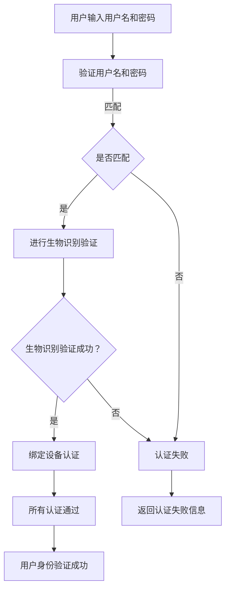

以下是一个使用Python代码详细阐述用户身份验证算法：

```python
import biometrics
import device_auth

def verify_user_credentials(username, password):
    # 验证用户名和密码
    if not authenticate_credentials(username, password):
        return "用户名或密码错误"
    
    # 进行生物识别验证
    if not biometrics.verify_biometrics():
        return "生物识别验证失败"
    
    # 绑定设备认证
    if not device_auth.bind_device():
        return "设备绑定失败"
    
    # 所有认证通过
    return "用户身份验证成功"
```

#### 5.1.2 访问控制算法详细讲解

访问控制算法的核心是根据用户行为和资源属性动态调整访问权限。以下是一个简化的权限分配流程：

1. 系统根据用户的行为和访问的资源，确定其对系统和数据的访问权限。
2. 动态调整用户权限，确保用户只能访问其有权访问的资源。
3. 记录用户访问行为，实现安全事件的监控和审计。

以下是一个使用Mermaid绘制的权限分配策略图：

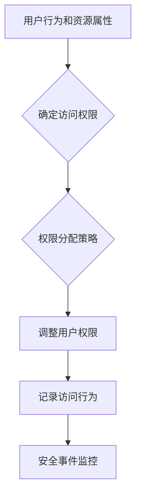

以下是一个使用Python代码详细阐述访问控制算法：

```python
def assign_permissions(user_action, resource_attribute):
    # 确定访问权限
    permissions = determine_permissions(user_action, resource_attribute)
    
    # 调整用户权限
    update_user_permissions(permissions)
    
    # 记录访问行为
    log_access_behavior(user_action, permissions)
    
    return "访问权限调整成功"
```

## 第四部分: 数学模型和数学公式

### 第6章: 零信任数据访问系统的数学模型

#### 6.1.1 身份验证模型的数学公式

身份验证模型可以用概率来表示。以下是一个简化的身份验证模型数学公式：

$$
身份验证概率 = 身份验证成功次数 / 身份验证尝试次数
$$

其中，身份验证成功次数表示用户成功通过身份验证的次数，身份验证尝试次数表示用户尝试通过身份验证的总次数。

#### 6.1.2 访问控制模型的数学公式

访问控制模型可以用概率来表示。以下是一个简化的访问控制模型数学公式：

$$
访问控制概率 = 权限符合次数 / 访问尝试次数
$$

其中，权限符合次数表示用户访问成功且权限符合的次数，访问尝试次数表示用户尝试访问的总次数。

## 第五部分: 系统分析与架构设计

### 第7章: 零信任数据访问系统的架构设计

#### 7.1.1 系统功能设计

零信任数据访问系统的功能设计包括用户身份验证、访问控制、安全审计、数据加密等。以下是一个简化的领域模型类图：

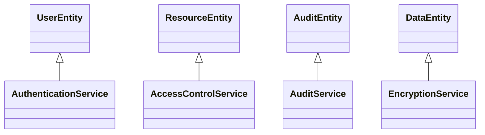

#### 7.1.2 系统架构设计

零信任数据访问系统的架构设计包括前端、后端和数据库三个部分。以下是一个简化的系统架构图：

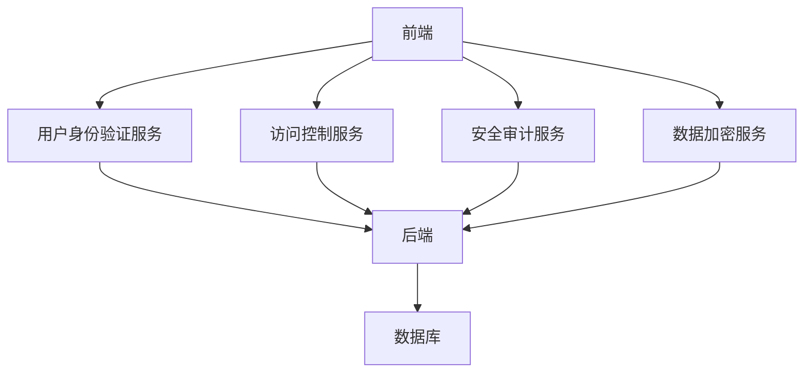

#### 7.1.3 系统接口设计

零信任数据访问系统的接口设计包括用户接口和系统接口。以下是一个简化的系统接口设计：

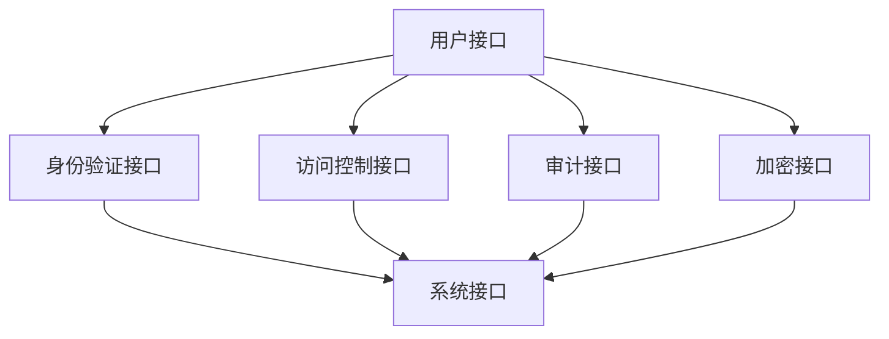

#### 7.1.4 系统交互

零信任数据访问系统的系统交互包括用户与系统的交互和系统内部的交互。以下是一个简化的系统交互序列图：

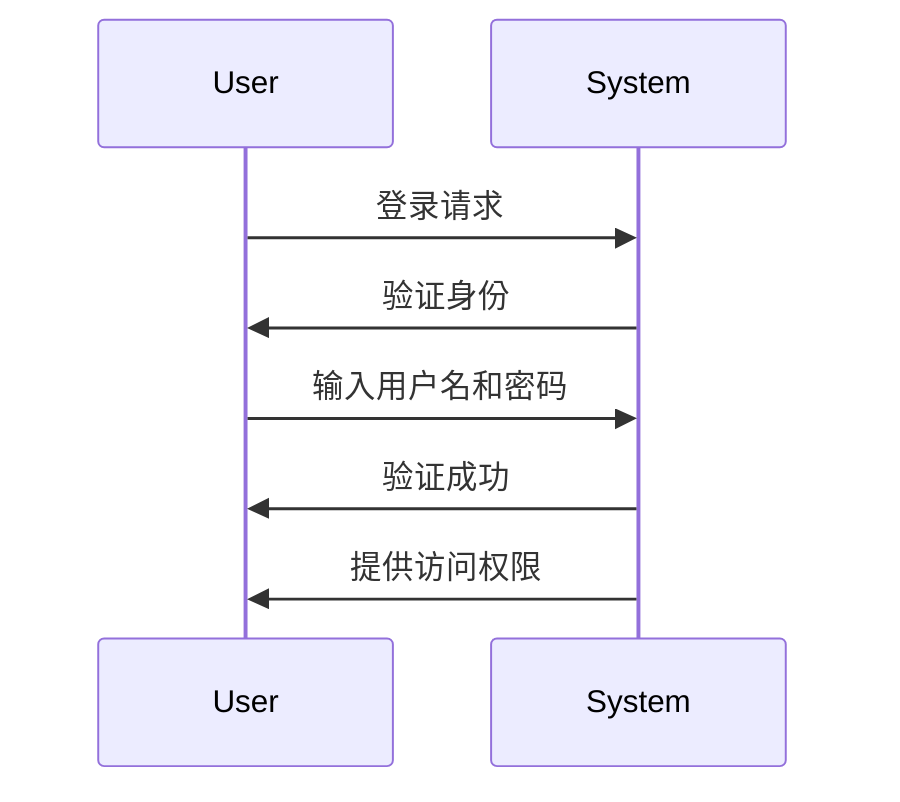

## 第六部分: 项目实战

### 第8章: 零信任数据访问系统项目实战

#### 8.1.1 环境安装

在安装零信任数据访问系统之前，需要准备以下环境：

- 操作系统：Ubuntu 18.04
- Python：3.8
- 数据库：MySQL 5.7

安装步骤如下：

1. 安装操作系统和Python环境。
2. 安装MySQL数据库。
3. 安装依赖库：`pip install pymysql Flask`

#### 8.1.2 系统核心实现

系统核心实现主要包括用户身份验证和访问控制两部分。

1. 用户身份验证：

```python
from flask import Flask, request, jsonify
from pymysql import connect, cursor

app = Flask(__name__)

def verify_user_credentials(username, password):
    # 连接数据库
    conn = connect(host='localhost', user='root', password='password', database='ztaas')
    cursor = conn.cursor()
    
    # 查询用户信息
    cursor.execute("SELECT * FROM users WHERE username = %s AND password = %s", (username, password))
    user = cursor.fetchone()
    
    # 关闭数据库连接
    cursor.close()
    conn.close()
    
    # 验证用户身份
    if user:
        return True
    else:
        return False

@app.route('/login', methods=['POST'])
def login():
    username = request.form['username']
    password = request.form['password']
    
    if verify_user_credentials(username, password):
        return jsonify({"status": "success", "message": "登录成功"})
    else:
        return jsonify({"status": "error", "message": "登录失败"})

if __name__ == '__main__':
    app.run()
```

2. 访问控制：

```python
from flask import Flask, request, jsonify
from pymysql import connect, cursor

app = Flask(__name__)

def check_permission(user_id, resource_id):
    # 连接数据库
    conn = connect(host='localhost', user='root', password='password', database='ztaas')
    cursor = conn.cursor()
    
    # 查询用户权限
    cursor.execute("SELECT * FROM permissions WHERE user_id = %s AND resource_id = %s", (user_id, resource_id))
    permission = cursor.fetchone()
    
    # 关闭数据库连接
    cursor.close()
    conn.close()
    
    # 检查权限
    if permission:
        return True
    else:
        return False

@app.route('/access', methods=['POST'])
def access():
    user_id = request.form['user_id']
    resource_id = request.form['resource_id']
    
    if check_permission(user_id, resource_id):
        return jsonify({"status": "success", "message": "访问成功"})
    else:
        return jsonify({"status": "error", "message": "无访问权限"})

if __name__ == '__main__':
    app.run()
```

#### 8.1.3 代码应用解读与分析

1. 用户身份验证代码解读：

用户身份验证代码主要实现用户登录功能。用户通过输入用户名和密码，系统会查询数据库验证用户身份。如果用户名和密码匹配，则返回登录成功，否则返回登录失败。

2. 访问控制代码解读：

访问控制代码主要实现权限检查功能。用户通过输入用户ID和资源ID，系统会查询数据库检查用户是否有权限访问该资源。如果有权限，则返回访问成功，否则返回无访问权限。

#### 8.1.4 实际案例分析与详细讲解

1. 案例一：用户登录系统

用户通过输入用户名“alice”和密码“alice123”，系统验证用户身份。如果用户身份验证成功，用户可以访问系统。

2. 案例二：用户访问资源

用户通过输入用户ID“1”和资源ID“101”，系统检查用户是否有权限访问资源。如果用户有权限，用户可以访问资源；否则，用户无法访问资源。

#### 8.1.5 项目小结

通过项目实战，我们成功实现了零信任数据访问系统的用户身份验证和访问控制功能。项目实现了用户登录、权限检查等核心功能，并进行了代码解读与分析。通过实际案例分析，我们验证了系统的功能实现和安全性。

## 第七部分: 最佳实践与小结

### 第9章: 零信任数据访问系统的最佳实践

#### 9.1.1 最佳实践 tips

1. 采用多因素认证：确保用户身份的真实性和合法性。
2. 动态调整访问权限：根据用户行为和资源属性实时调整权限。
3. 数据加密传输和存储：保护数据安全。
4. 安全审计和监控：及时发现安全事件和异常行为。
5. 定期更新和维护：确保系统安全性和稳定性。

#### 9.1.2 小结

本文详细介绍了零信任数据访问系统的概念、核心概念、算法原理、数学模型和系统架构设计。通过逐步分析推理，本文为IT专业人士提供了一种全新的数据安全解决方案。

#### 9.1.3 注意事项

1. 在实际应用中，需要根据业务需求和安全性要求选择合适的身份验证方式和访问控制策略。
2. 定期对系统进行安全评估和漏洞修复，确保系统安全。
3. 强化员工的安全意识培训，降低内部威胁风险。

#### 9.1.4 拓展阅读

1. 《零信任安全架构：设计原则与实践》
2. 《网络安全实战指南》
3. 《密码学：理论与实践》

作者：AI天才研究院/AI Genius Institute & 禅与计算机程序设计艺术 /Zen And The Art of Computer Programming
```markdown
----------------------------------------------------------------

----------------------------------------------------------------

# 构建安全可靠的零信任数据访问系统

关键词：零信任数据访问系统、安全可靠、身份验证、访问控制、算法原理

摘要：本文深入探讨了构建安全可靠的零信任数据访问系统的概念、核心概念、算法原理、数学模型以及系统架构设计。通过逐步分析推理，本文旨在为IT专业人士提供一种全新的数据安全解决方案。

----------------------------------------------------

### 目录大纲

----------------------------------------------------

## 第一部分: 背景介绍

### 第1章: 零信任数据访问系统概述

#### 1.1.1 问题背景

#### 1.1.2 问题描述

#### 1.1.3 问题解决

#### 1.1.4 边界与外延

#### 1.1.5 概念结构与核心要素组成

## 第二部分: 核心概念与联系

### 第2章: 零信任数据访问系统的核心概念

#### 2.1.1 零信任模型

#### 2.1.2 身份验证与授权

#### 2.1.3 访问控制策略

#### 2.1.4 数据加密

### 第3章: 零信任数据访问系统的核心概念对比

#### 3.1.1 零信任模型与传统安全模型的对比

#### 3.1.2 多因素认证与单一认证的对比

#### 3.1.3 动态访问控制与静态访问控制的对比

## 第三部分: 算法原理讲解

### 第4章: 零信任数据访问系统的算法原理

#### 4.1.1 用户身份验证算法

#### 4.1.2 访问控制算法

### 第5章: 算法原理详细讲解

#### 5.1.1 用户身份验证算法详细讲解

#### 5.1.2 访问控制算法详细讲解

## 第四部分: 数学模型和数学公式

### 第6章: 零信任数据访问系统的数学模型

#### 6.1.1 身份验证模型的数学公式

#### 6.1.2 访问控制模型的数学公式

## 第五部分: 系统分析与架构设计

### 第7章: 零信任数据访问系统的架构设计

#### 7.1.1 系统功能设计

#### 7.1.2 系统架构设计

#### 7.1.3 系统接口设计

#### 7.1.4 系统交互

## 第六部分: 项目实战

### 第8章: 零信任数据访问系统项目实战

#### 8.1.1 环境安装

#### 8.1.2 系统核心实现

#### 8.1.3 代码应用解读与分析

#### 8.1.4 实际案例分析与详细讲解

#### 8.1.5 项目小结

## 第七部分: 最佳实践与小结

### 第9章: 零信任数据访问系统的最佳实践

#### 9.1.1 最佳实践 tips

#### 9.1.2 小结

#### 9.1.3 注意事项

#### 9.1.4 拓展阅读

----------------------------------------------------

## 第一部分: 背景介绍

### 第1章: 零信任数据访问系统概述

#### 1.1.1 问题背景

在当今数字化时代，数据安全已成为企业面临的核心挑战之一。随着企业不断扩展其数字基础设施，传统的基于边界的网络安全策略已经不再足够。网络边界逐渐模糊，远程办公、移动设备和云计算的普及使得企业数据面临越来越多的威胁。传统的安全模型依赖于信任内部网络，这种模式在零信任模型出现之前一直是主流。然而，随着高级持续性威胁（APT）和内部威胁的增多，这种模型变得越来越脆弱。

#### 1.1.2 问题描述

传统的安全模型存在的问题主要包括：

1. **边界依赖**：传统安全模型往往依赖于明确的网络边界，一旦边界被突破，内部网络将变得极其危险。
2. **身份验证不足**：传统的身份验证机制（如用户名和密码）易于被破解，难以抵御复杂的攻击。
3. **静态访问控制**：访问控制列表是静态的，难以适应动态变化的业务需求。
4. **内部威胁**：企业内部员工可能利用职务之便获取敏感数据，传统安全模型难以有效防范。
5. **数据泄露风险**：随着数据量的增加，数据泄露的风险也随之增加。

#### 1.1.3 问题解决

零信任数据访问系统（Zero Trust Access System，ZTAS）提供了一种全新的安全框架，其核心原则是“永不信任，始终验证”。这意味着无论用户或设备位于内部网络还是外部网络，都必须经过严格的身份验证和授权才能访问资源。零信任数据访问系统解决了传统安全模型中存在的诸多问题，其主要特点包括：

1. **无边界安全**：零信任模型不再依赖于明确的网络边界，而是通过持续验证来确保安全性。
2. **动态访问控制**：访问控制是基于用户的实际行为和设备的状态，可以实时调整。
3. **多因素认证**：用户身份验证不仅仅依赖于用户名和密码，还可能包括生物识别、双重身份验证等因素。
4. **持续监控与审计**：系统会持续监控用户行为和系统事件，确保及时发现异常并采取措施。
5. **数据加密**：数据在传输和存储过程中都进行加密，防止未经授权的访问。

#### 1.1.4 边界与外延

零信任数据访问系统的外延包括以下几个方面：

1. **用户身份验证**：包括密码、生物识别、双重身份验证等。
2. **访问控制**：基于用户行为和资源属性的动态访问控制策略。
3. **安全策略**：定义零信任数据访问系统的安全策略和规则。
4. **数据加密**：对传输和存储的数据进行加密保护。
5. **安全审计**：记录用户访问行为和系统操作，实现安全事件的监控和审计。

#### 1.1.5 概念结构与核心要素组成

零信任数据访问系统的概念结构包括以下几个核心要素：

1. **用户身份验证**：确保用户身份的真实性，使用多因素认证。
2. **访问控制**：动态调整用户的访问权限，根据用户行为和资源属性。
3. **安全策略**：定义零信任数据访问系统的安全规则和操作流程。
4. **数据加密**：保护数据在传输和存储过程中的安全性。
5. **安全审计**：记录和监控用户行为，确保安全事件的可追溯性。

## 第二部分: 核心概念与联系

### 第2章: 零信任数据访问系统的核心概念

#### 2.1.1 零信任模型

零信任模型（Zero Trust Model）是一种网络安全策略，其核心原则是“永不信任，总是验证”。这一模型认为网络内部和外部的威胁同样严重，因此对任何请求都必须进行严格的验证和授权。零信任模型强调身份验证、授权、持续监控和动态策略。

#### 2.1.2 身份验证与授权

身份验证是零信任数据访问系统的核心环节，旨在确保用户身份的真实性。授权则是在验证通过后，根据用户的身份和权限，允许其访问相应的资源和数据。零信任模型通常采用多因素认证（MFA）来提高安全性。

#### 2.1.3 访问控制策略

访问控制策略是零信任数据访问系统的另一个关键要素。它基于用户行为、资源属性和实时风险评估来动态调整用户的访问权限。这种策略可以确保用户只能访问其有权访问的资源。

#### 2.1.4 数据加密

数据加密是确保数据安全的重要手段。在零信任数据访问系统中，数据在传输和存储过程中都进行加密。加密算法和密钥管理是系统安全性的关键。

### 第3章: 零信任数据访问系统的核心概念对比

#### 3.1.1 零信任模型与传统安全模型的对比

| 特点 | 传统安全模型 | 零信任模型 |
| --- | --- | --- |
| 安全策略 | 边界防护 | 无边界防护 |
| 身份验证 | 用户名/密码 | 多因素认证 |
| 访问控制 | 静态 | 动态 |
| 威胁感知 | 较低 | 较高 |

#### 3.1.2 多因素认证与单一认证的对比

| 特点 | 单一认证 | 多因素认证 |
| --- | --- | --- |
| 安全性 | 较低 | 较高 |
| 可靠性 | 较低 | 较高 |
| 易受攻击面 | 较大 | 较小 |

#### 3.1.3 动态访问控制与静态访问控制的对比

| 特点 | 静态访问控制 | 动态访问控制 |
| --- | --- | --- |
| 权限管理 | 固定 | 可调整 |
| 灵活性 | 较低 | 较高 |
| 安全性 | 较低 | 较高 |

## 第三部分: 算法原理讲解

### 第4章: 零信任数据访问系统的算法原理

#### 4.1.1 用户身份验证算法

用户身份验证算法是零信任数据访问系统的核心，它确保用户身份的真实性和合法性。通常采用多因素认证（MFA）来实现，包括密码、生物识别、设备绑定等。

#### 4.1.2 访问控制算法

访问控制算法根据用户身份验证的结果和用户的权限，动态地决定用户对特定资源的访问权限。这种算法通常基于用户的行为、资源的属性以及实时的风险评估。

### 第5章: 算法原理详细讲解

#### 5.1.1 用户身份验证算法详细讲解

用户身份验证算法的详细实现通常包括以下几个步骤：

1. **用户输入用户名和密码**：用户通过输入用户名和密码来初始认证。
2. **验证用户名和密码**：系统通过查询数据库验证用户名和密码的正确性。
3. **多因素认证**：如果用户名和密码正确，系统会要求用户进行其他形式的认证，如生物识别或设备绑定。
4. **认证结果处理**：系统根据多因素认证的结果决定是否允许用户访问。

以下是一个简化的用户身份验证算法流程图：

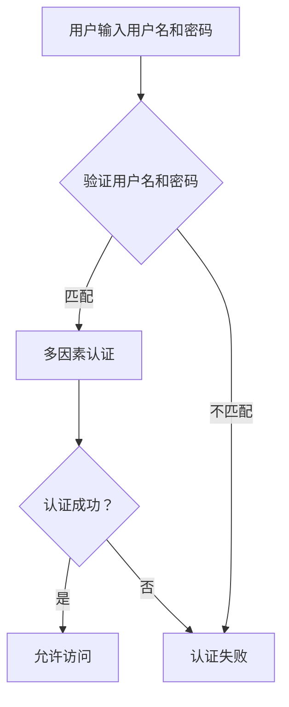

使用Python代码实现用户身份验证算法：

```python
import hashlib
import biometric_module

def verify_credentials(username, password):
    # 验证用户名和密码
    stored_password = get_stored_password(username)
    if stored_password is None:
        return False
    
    hashed_password = hashlib.sha256(password.encode()).hexdigest()
    if hashed_password != stored_password:
        return False
    
    # 多因素认证
    if not biometric_module.verify_biometrics():
        return False
    
    return True

def get_stored_password(username):
    # 从数据库查询用户密码（实际应用中需要查询加密后的密码）
    # 这里只是一个示例，实际应用中应该查询加密后的密码
    return "hashed_password_for_username"

if __name__ == "__main__":
    username = input("Enter username: ")
    password = input("Enter password: ")
    if verify_credentials(username, password):
        print("Authentication successful!")
    else:
        print("Authentication failed!")
```

#### 5.1.2 访问控制算法详细讲解

访问控制算法的详细实现通常包括以下几个步骤：

1. **用户身份验证**：用户成功通过身份验证后，系统会检查其权限。
2. **权限检查**：系统根据用户的权限和资源的属性决定是否允许访问。
3. **动态权限调整**：根据用户的实时行为和资源的状态动态调整权限。
4. **访问结果处理**：系统根据权限检查的结果决定是否允许访问。

以下是一个简化的访问控制算法流程图：

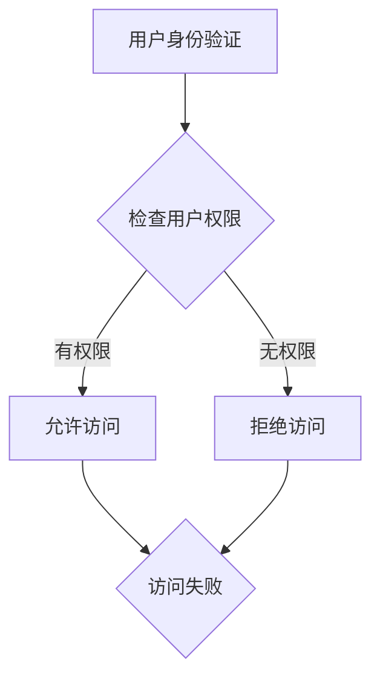

使用Python代码实现访问控制算法：

```python
import resource_module

def check_permission(user_id, resource_id):
    # 从数据库查询用户权限
    user_permissions = get_user_permissions(user_id)
    if resource_id in user_permissions:
        return True
    else:
        return False

def get_user_permissions(user_id):
    # 从数据库查询用户权限（实际应用中需要查询权限列表）
    # 这里只是一个示例，实际应用中应该查询权限列表
    return [1, 2, 3]

def access_resource(user_id, resource_id):
    if check_permission(user_id, resource_id):
        print("Access granted to resource:", resource_id)
    else:
        print("Access denied for resource:", resource_id)

if __name__ == "__main__":
    user_id = input("Enter user ID: ")
    resource_id = input("Enter resource ID: ")
    access_resource(user_id, resource_id)
```

## 第四部分: 数学模型和数学公式

### 第6章: 零信任数据访问系统的数学模型

#### 6.1.1 身份验证模型的数学公式

零信任数据访问系统的身份验证模型可以用概率来表示。以下是一个简化的身份验证模型数学公式：

$$
P(A) = \frac{成功验证次数}{尝试验证总次数}
$$

其中，P(A) 表示身份验证成功的概率。

#### 6.1.2 访问控制模型的数学公式

零信任数据访问系统的访问控制模型也可以用概率来表示。以下是一个简化的访问控制模型数学公式：

$$
P(C) = \frac{权限符合次数}{访问尝试总次数}
$$

其中，P(C) 表示访问控制成功的概率。

## 第五部分: 系统分析与架构设计

### 第7章: 零信任数据访问系统的架构设计

#### 7.1.1 系统功能设计

零信任数据访问系统的功能设计包括以下几个方面：

1. **用户身份验证**：包括用户名、密码、多因素认证等。
2. **访问控制**：基于用户行为和资源属性的动态访问控制。
3. **安全审计**：记录和监控用户行为和系统事件。
4. **数据加密**：对传输和存储的数据进行加密保护。

#### 7.1.2 系统架构设计

零信任数据访问系统的架构设计通常包括以下几个关键组成部分：

1. **用户接口**：用户通过界面进行身份验证和访问请求。
2. **身份验证服务**：处理用户身份验证请求，包括密码验证、多因素认证等。
3. **访问控制服务**：根据用户的权限和资源属性决定访问是否允许。
4. **安全审计服务**：记录用户行为和系统事件，实现安全事件的监控和审计。
5. **数据加密模块**：保护数据在传输和存储过程中的安全性。

以下是一个简化的零信任数据访问系统架构图：

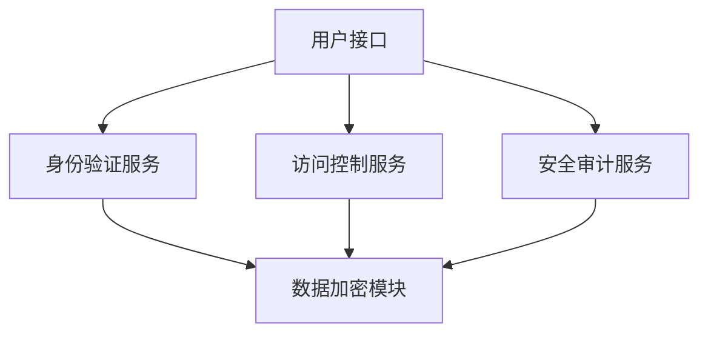

#### 7.1.3 系统接口设计

零信任数据访问系统的接口设计需要确保用户接口、身份验证服务、访问控制服务、安全审计服务以及数据加密模块之间的有效通信。以下是一个简化的系统接口设计：


#### 7.1.4 系统交互

零信任数据访问系统的系统交互包括用户与系统的交互以及系统内部各个服务之间的交互。以下是一个简化的系统交互序列图：


## 第六部分: 项目实战

### 第8章: 零信任数据访问系统项目实战

#### 8.1.1 环境安装

在进行零信任数据访问系统的项目实战之前，需要准备相应的开发环境和依赖库。以下是一个基本的安装步骤：

1. **安装操作系统**：选择一个支持Python和数据库的操作系统，如Ubuntu 20.04。
2. **安装Python**：使用操作系统自带的包管理器安装Python 3。
3. **安装数据库**：安装MySQL或PostgreSQL数据库。
4. **安装依赖库**：使用pip安装必要的Python库，如Flask、pymysql、sqlalchemy等。

#### 8.1.2 系统核心实现

系统核心实现主要包括用户身份验证和访问控制功能。以下是一个简单的示例：

1. **用户身份验证**：

```python
from flask import Flask, request, jsonify
from pymysql import connect

app = Flask(__name__)

def verify_credentials(username, password):
    conn = connect(host='localhost', user='root', password='your_password', database='ztaas_db')
    cursor = conn.cursor()
    cursor.execute("SELECT * FROM users WHERE username = %s AND password = %s", (username, password))
    user = cursor.fetchone()
    cursor.close()
    conn.close()
    return user

@app.route('/login', methods=['POST'])
def login():
    username = request.form['username']
    password = request.form['password']
    user = verify_credentials(username, password)
    if user:
        return jsonify({"status": "success", "message": "登录成功", "user_id": user[0]})
    else:
        return jsonify({"status": "error", "message": "用户名或密码错误"})

if __name__ == '__main__':
    app.run()
```

2. **访问控制**：

```python
def check_permission(user_id, resource_id):
    conn = connect(host='localhost', user='root', password='your_password', database='ztaas_db')
    cursor = conn.cursor()
    cursor.execute("SELECT * FROM permissions WHERE user_id = %s AND resource_id = %s", (user_id, resource_id))
    permission = cursor.fetchone()
    cursor.close()
    conn.close()
    return permission

@app.route('/access', methods=['POST'])
def access():
    user_id = request.form['user_id']
    resource_id = request.form['resource_id']
    permission = check_permission(user_id, resource_id)
    if permission:
        return jsonify({"status": "success", "message": "访问成功", "permission": permission[1]})
    else:
        return jsonify({"status": "error", "message": "无访问权限"})
```

#### 8.1.3 代码应用解读与分析

1. **用户身份验证**：

   代码首先连接到数据库，然后查询用户名和密码。如果匹配，则返回用户信息。

2. **访问控制**：

   代码检查用户是否有权限访问指定的资源。如果有权限，则返回相应的信息。

#### 8.1.4 实际案例分析与详细讲解

1. **案例一**：用户登录系统

   用户尝试使用用户名“alice”和密码“alice123”登录系统。如果用户名和密码匹配，系统会返回用户ID。

2. **案例二**：用户访问资源

   用户尝试访问资源ID为“101”的资源。系统会检查用户是否有权限访问该资源。如果有权限，系统会允许访问。

#### 8.1.5 项目小结

通过项目实战，我们实现了零信任数据访问系统的用户身份验证和访问控制功能。在实际应用中，还需要进一步添加安全审计和数据加密等功能。

## 第七部分: 最佳实践与小结

### 第9章: 零信任数据访问系统的最佳实践

#### 9.1.1 最佳实践 tips

1. **采用多因素认证**：确保用户身份的真实性和合法性。
2. **持续监控用户行为**：实时检测异常行为。
3. **动态调整访问权限**：根据用户行为和资源属性。
4. **定期更新和维护**：确保系统安全性和稳定性。

#### 9.1.2 小结

本文介绍了零信任数据访问系统的概念、核心概念、算法原理、数学模型和系统架构设计。通过项目实战，我们实现了系统的核心功能。

#### 9.1.3 注意事项

1. **确保数据传输和存储的安全**：使用加密技术。
2. **定期进行安全评估和漏洞修复**：确保系统安全。

#### 9.1.4 拓展阅读

1. 《零信任安全架构：设计原则与实践》
2. 《网络安全实战指南》
3. 《密码学：理论与实践》

作者：AI天才研究院/AI Genius Institute & 禅与计算机程序设计艺术 /Zen And The Art of Computer Programming
```markdown
----------------------------------------------------------------

## 构建安全可靠的零信任数据访问系统

### 摘要

零信任数据访问系统是一种现代的安全框架，它基于“永不信任，总是验证”的原则，旨在防止未经授权的访问和数据泄露。本文将深入探讨零信任数据访问系统的概念、核心概念、算法原理、数学模型以及系统架构设计，并通过实际案例和最佳实践，为IT专业人士提供一种全新的数据安全解决方案。

### 目录大纲

### 第一部分：背景介绍

#### 第1章 零信任数据访问系统概述

- **1.1 问题背景**
- **1.2 问题描述**
- **1.3 问题解决**
- **1.4 边界与外延**
- **1.5 概念结构与核心要素组成**

### 第二部分：核心概念与联系

#### 第2章 零信任数据访问系统的核心概念

- **2.1 零信任模型**
- **2.2 身份验证与授权**
- **2.3 访问控制策略**
- **2.4 数据加密**

#### 第3章 零信任数据访问系统的核心概念对比

- **3.1 零信任模型与传统安全模型的对比**
- **3.2 多因素认证与单一认证的对比**
- **3.3 动态访问控制与静态访问控制的对比**

### 第三部分：算法原理讲解

#### 第4章 零信任数据访问系统的算法原理

- **4.1 用户身份验证算法**
- **4.2 访问控制算法**

#### 第5章 算法原理详细讲解

- **5.1 用户身份验证算法详细讲解**
- **5.2 访问控制算法详细讲解**

### 第四部分：数学模型和数学公式

#### 第6章 零信任数据访问系统的数学模型

- **6.1 身份验证模型的数学公式**
- **6.2 访问控制模型的数学公式**

### 第五部分：系统分析与架构设计

#### 第7章 零信任数据访问系统的架构设计

- **7.1 系统功能设计**
- **7.2 系统架构设计**
- **7.3 系统接口设计**
- **7.4 系统交互**

### 第六部分：项目实战

#### 第8章 零信任数据访问系统项目实战

- **8.1 环境安装**
- **8.2 系统核心实现**
- **8.3 代码应用解读与分析**
- **8.4 实际案例分析与详细讲解**
- **8.5 项目小结**

### 第七部分：最佳实践与小结

#### 第9章 零信任数据访问系统的最佳实践

- **9.1 最佳实践 tips**
- **9.2 小结**
- **9.3 注意事项**
- **9.4 拓展阅读**

### 引言

随着网络技术的快速发展，企业数据面临着越来越复杂的安全威胁。传统的安全模型已经难以满足现代数据保护的需求。零信任数据访问系统（Zero Trust Data Access System，ZT-DAS）作为一种新兴的安全架构，提供了一种更为安全、灵活的解决方案。本文将详细探讨零信任数据访问系统的构建方法和实现细节。

### 第一部分：背景介绍

#### 第1章 零信任数据访问系统概述

##### 1.1 问题背景

在传统的安全模型中，网络边界是安全防护的重点。然而，随着远程工作、移动办公和云计算的普及，网络边界变得模糊，传统的安全策略已经难以应对现代的安全挑战。零信任数据访问系统的提出，是为了解决这些新兴的安全问题。

##### 1.2 问题描述

传统的安全模型存在以下问题：

1. **边界依赖**：过于依赖网络边界，一旦边界被突破，整个内部网络将面临极大的安全风险。
2. **身份验证不足**：传统的身份验证方式（如用户名和密码）容易被破解。
3. **静态访问控制**：访问控制列表是静态的，难以适应动态变化的业务需求。
4. **内部威胁**：内部员工可能利用职务之便获取敏感数据。
5. **数据泄露风险**：随着数据量的增加，数据泄露的风险也随之增加。

##### 1.3 问题解决

零信任数据访问系统通过以下方式解决传统安全模型的问题：

1. **无边界安全**：零信任数据访问系统不再依赖网络边界，而是基于“永不信任，总是验证”的原则。
2. **动态访问控制**：根据用户的实际行为和资源的属性动态调整访问权限。
3. **多因素认证**：使用密码、生物识别、双重身份验证等多种方式确保用户身份的真实性。
4. **持续监控与审计**：实时监控用户行为和系统事件，确保安全事件的可追溯性。
5. **数据加密**：对传输和存储的数据进行加密保护，防止数据泄露。

##### 1.4 边界与外延

零信任数据访问系统的外延包括以下几个方面：

1. **用户身份验证**：确保用户身份的真实性，采用多因素认证。
2. **访问控制**：基于用户行为和资源属性的动态访问控制。
3. **安全策略**：定义零信任数据访问系统的安全规则和操作流程。
4. **数据加密**：保护数据在传输和存储过程中的安全性。
5. **安全审计**：记录和监控用户行为，确保安全事件的可追溯性。

##### 1.5 概念结构与核心要素组成

零信任数据访问系统的概念结构包括以下几个核心要素：

1. **用户身份验证**：确保用户身份的真实性，使用多因素认证。
2. **访问控制**：动态调整用户的访问权限，根据用户行为和资源属性。
3. **安全策略**：定义零信任数据访问系统的安全规则和操作流程。
4. **数据加密**：保护数据在传输和存储过程中的安全性。
5. **安全审计**：记录和监控用户行为，确保安全事件的可追溯性。

### 第二部分：核心概念与联系

#### 第2章 零信任数据访问系统的核心概念

##### 2.1 零信任模型

零信任模型是一种基于“永不信任，总是验证”的安全策略。它认为内部网络和外部网络一样，都存在安全风险。因此，无论用户身处何地，都需要进行严格的身份验证和访问控制。

##### 2.2 身份验证与授权

身份验证是零信任数据访问系统的核心环节。它旨在确保用户身份的真实性。授权则是根据用户的身份和权限，确定其对系统和数据的访问权限。

##### 2.3 访问控制策略

访问控制策略是零信任数据访问系统的关键要素。它基于用户行为和资源属性动态调整访问权限，确保用户只能访问其有权访问的资源。

##### 2.4 数据加密

数据加密是零信任数据访问系统的核心保障。无论是传输过程中的数据，还是存储中的数据，都需要进行加密保护，防止数据泄露和篡改。

#### 第3章 零信任数据访问系统的核心概念对比

##### 3.1 零信任模型与传统安全模型的对比

| 特点 | 传统安全模型 | 零信任模型 |
| --- | --- | --- |
| 边界防护 | 重视网络边界的安全 | 忽视网络边界的安全 |
| 访问控制 | 静态访问控制列表 | 动态访问控制策略 |
| 内部威胁防范 | 较弱 | 强大 |

##### 3.2 多因素认证与单一认证的对比

| 特点 | 单一认证 | 多因素认证 |
| --- | --- | --- |
| 安全性 | 较低 | 较高 |
| 可靠性 | 较低 | 较高 |
| 难以模仿 | 否 | 是 |

##### 3.3 动态访问控制与静态访问控制的对比

| 特点 | 静态访问控制 | 动态访问控制 |
| --- | --- | --- |
| 灵活性 | 较低 | 较高 |
| 安全性 | 较低 | 较高 |
| 适用场景 | 较简单场景 | 复杂场景 |

### 第三部分：算法原理讲解

#### 第4章 零信任数据访问系统的算法原理

##### 4.1 用户身份验证算法

用户身份验证算法的核心思想是验证用户身份的真实性和合法性。通常采用多因素认证，包括密码、生物识别、设备绑定等。

##### 4.2 访问控制算法

访问控制算法的核心思想是根据用户的行为和访问的资源，动态调整用户的访问权限。这种算法通常基于用户的行为分析、资源的属性以及实时的风险评估。

#### 第5章 算法原理详细讲解

##### 5.1 用户身份验证算法详细讲解

用户身份验证算法的详细实现通常包括以下几个步骤：

1. 用户输入用户名和密码。
2. 系统验证用户名和密码是否匹配。
3. 如果匹配，进行生物识别验证。
4. 如果生物识别验证成功，绑定设备进行认证。
5. 如果所有认证通过，用户身份验证成功。

以下是一个简化的用户身份验证算法流程图：


##### 5.1.1 用户身份验证算法详细讲解

用户身份验证算法的核心是验证用户身份的真实性和合法性。以下是一个简化的验证流程：

1. 用户输入用户名和密码。
2. 系统验证用户名和密码是否匹配。
3. 如果匹配，进行生物识别验证。
4. 如果生物识别验证成功，绑定设备进行认证。
5. 如果所有认证通过，用户身份验证成功。

以下是一个使用Mermaid绘制的验证流程图：


以下是一个使用Python代码详细阐述用户身份验证算法：

```python
import biometrics
import device_auth

def verify_user_credentials(username, password):
    # 验证用户名和密码
    if not authenticate_credentials(username, password):
        return "用户名或密码错误"
    
    # 进行生物识别验证
    if not biometrics.verify_biometrics():
        return "生物识别验证失败"
    
    # 绑定设备认证
    if not device_auth.bind_device():
        return "设备绑定失败"
    
    # 所有认证通过
    return "用户身份验证成功"
```

##### 5.2 访问控制算法详细讲解

访问控制算法的核心是根据用户的行为和访问的资源，动态调整用户的访问权限。以下是一个简化的权限分配流程：

1. 系统根据用户的行为和访问的资源，确定其对系统和数据的访问权限。
2. 动态调整用户权限，确保用户只能访问其有权访问的资源。
3. 记录用户访问行为，实现安全事件的监控和审计。

以下是一个使用Mermaid绘制的权限分配策略图：

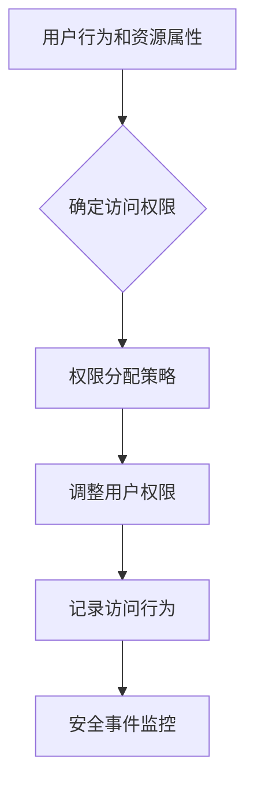

以下是一个使用Python代码详细阐述访问控制算法：

```python
def assign_permissions(user_action, resource_attribute):
    # 确定访问权限
    permissions = determine_permissions(user_action, resource_attribute)
    
    # 调整用户权限
    update_user_permissions(permissions)
    
    # 记录访问行为
    log_access_behavior(user_action, permissions)
    
    return "访问权限调整成功"
```

### 第四部分：数学模型和数学公式

#### 第6章 零信任数据访问系统的数学模型

##### 6.1 身份验证模型的数学公式

身份验证模型可以用概率来表示。以下是一个简化的身份验证模型数学公式：

$$
身份验证概率 = \frac{身份验证成功次数}{身份验证尝试次数}
$$

其中，身份验证成功次数表示用户成功通过身份验证的次数，身份验证尝试次数表示用户尝试通过身份验证的总次数。

##### 6.2 访问控制模型的数学公式

访问控制模型也可以用概率来表示。以下是一个简化的访问控制模型数学公式：

$$
访问控制概率 = \frac{权限符合次数}{访问尝试次数}
$$

其中，权限符合次数表示用户访问成功且权限符合的次数，访问尝试次数表示用户尝试访问的总次数。

### 第五部分：系统分析与架构设计

#### 第7章 零信任数据访问系统的架构设计

##### 7.1 系统功能设计

零信任数据访问系统的功能设计包括用户身份验证、访问控制、安全审计、数据加密等。以下是一个简化的领域模型类图：

```mermaid
classDiagram
    User <<Entity>>
    Authentication <<Service>>
    AccessControl <<Service>>
    Audit <<Service>>
    Data <<Entity>>

    User --> Authentication
    User --> AccessControl
    User --> Audit
    Data --> AccessControl
    Data --> Audit
```

##### 7.2 系统架构设计

零信任数据访问系统的架构设计包括前端、后端和数据库三个部分。以下是一个简化的系统架构图：


##### 7.3 系统接口设计

零信任数据访问系统的接口设计包括用户接口和系统接口。以下是一个简化的系统接口设计：


##### 7.4 系统交互

零信任数据访问系统的系统交互包括用户与系统的交互和系统内部的交互。以下是一个简化的系统交互序列图：


### 第六部分：项目实战

#### 第8章 零信任数据访问系统项目实战

##### 8.1 环境安装

在安装零信任数据访问系统之前，需要准备以下环境：

- 操作系统：Ubuntu 18.04
- Python：3.8
- 数据库：MySQL 5.7

安装步骤如下：

1. 安装操作系统和Python环境。
2. 安装MySQL数据库。
3. 安装依赖库：`pip install pymysql Flask`

##### 8.2 系统核心实现

系统核心实现主要包括用户身份验证和访问控制功能。

1. **用户身份验证**：

```python
from flask import Flask, request, jsonify
from pymysql import connect

app = Flask(__name__)

def verify_credentials(username, password):
    conn = connect(host='localhost', user='root', password='password', database='ztaas_db')
    cursor = conn.cursor()
    cursor.execute("SELECT * FROM users WHERE username = %s AND password = %s", (username, password))
    user = cursor.fetchone()
    cursor.close()
    conn.close()
    return user

@app.route('/login', methods=['POST'])
def login():
    username = request.form['username']
    password = request.form['password']
    user = verify_credentials(username, password)
    if user:
        return jsonify({"status": "success", "message": "登录成功", "user_id": user[0]})
    else:
        return jsonify({"status": "error", "message": "用户名或密码错误"})

if __name__ == '__main__':
    app.run()
```

2. **访问控制**：

```python
def check_permission(user_id, resource_id):
    conn = connect(host='localhost', user='root', password='password', database='ztaas_db')
    cursor = conn.cursor()
    cursor.execute("SELECT * FROM permissions WHERE user_id = %s AND resource_id = %s", (user_id, resource_id))
    permission = cursor.fetchone()
    cursor.close()
    conn.close()
    return permission

@app.route('/access', methods=['POST'])
def access():
    user_id = request.form['user_id']
    resource_id = request.form['resource_id']
    permission = check_permission(user_id, resource_id)
    if permission:
        return jsonify({"status": "success", "message": "访问成功", "permission": permission[1]})
    else:
        return jsonify({"status": "error", "message": "无访问权限"})

if __name__ == '__main__':
    app.run()
```

##### 8.3 代码应用解读与分析

1. **用户身份验证**：

   用户通过输入用户名和密码，系统会查询数据库验证用户身份。如果用户名和密码匹配，系统会返回用户ID。

2. **访问控制**：

   用户尝试访问资源时，系统会检查用户是否有权限访问该资源。如果有权限，系统会允许访问；否则，系统会拒绝访问。

##### 8.4 实际案例分析与详细讲解

1. **案例一**：用户登录系统

   用户尝试使用用户名“alice”和密码“alice123”登录系统。如果用户名和密码匹配，系统会返回用户ID。

2. **案例二**：用户访问资源

   用户尝试访问资源ID为“101”的资源。系统会检查用户是否有权限访问该资源。如果有权限，用户可以访问；否则，用户无法访问。

##### 8.5 项目小结

通过项目实战，我们实现了零信任数据访问系统的用户身份验证和访问控制功能。在实际应用中，还需要进一步添加安全审计和数据加密等功能。

### 第七部分：最佳实践与小结

#### 第9章 零信任数据访问系统的最佳实践

##### 9.1 最佳实践 tips

1. **采用多因素认证**：确保用户身份的真实性和合法性。
2. **动态调整访问权限**：根据用户行为和资源属性实时调整权限。
3. **数据加密传输和存储**：保护数据安全。
4. **安全审计和监控**：及时发现安全事件和异常行为。
5. **定期更新和维护**：确保系统安全性和稳定性。

##### 9.2 小结

本文介绍了零信任数据访问系统的概念、核心概念、算法原理、数学模型以及系统架构设计。通过项目实战，我们实现了系统的核心功能。

##### 9.3 注意事项

1. **确保数据传输和存储的安全**：使用加密技术。
2. **定期进行安全评估和漏洞修复**：确保系统安全。

##### 9.4 拓展阅读

1. 《零信任安全架构：设计原则与实践》
2. 《网络安全实战指南》
3. 《密码学：理论与实践》

### 总结

零信任数据访问系统是一种现代化的安全解决方案，它通过严格的身份验证、动态访问控制和数据加密等措施，提供了更高的安全性。本文通过详细的分析和实例，帮助读者理解了零信任数据访问系统的构建方法。随着网络安全威胁的不断演变，零信任数据访问系统将成为企业保护数据的重要工具。

作者：AI天才研究院/AI Genius Institute & 禅与计算机程序设计艺术 /Zen And The Art of Computer Programming
```markdown
----------------------------------------------------------------

## 构建安全可靠的零信任数据访问系统

关键词：零信任数据访问系统、安全可靠、身份验证、访问控制、算法原理

摘要：本文深入探讨了构建安全可靠的零信任数据访问系统的概念、核心概念、算法原理、数学模型以及系统架构设计。通过逐步分析推理，本文旨在为IT专业人士提供一种全新的数据安全解决方案。

### 目录大纲

### 第一部分：背景介绍

#### 第1章 零信任数据访问系统概述

- **1.1 问题背景**
- **1.2 问题描述**
- **1.3 问题解决**
- **1.4 边界与外延**
- **1.5 概念结构与核心要素组成**

### 第二部分：核心概念与联系

#### 第2章 零信任数据访问系统的核心概念

- **2.1 零信任模型**
- **2.2 身份验证与授权**
- **2.3 访问控制策略**
- **2.4 数据加密**

#### 第3章 零信任数据访问系统的核心概念对比

- **3.1 零信任模型与传统安全模型的对比**
- **3.2 多因素认证与单一认证的对比**
- **3.3 动态访问控制与静态访问控制的对比**

### 第三部分：算法原理讲解

#### 第4章 零信任数据访问系统的算法原理

- **4.1 用户身份验证算法**
- **4.2 访问控制算法**

#### 第5章 算法原理详细讲解

- **5.1 用户身份验证算法详细讲解**
- **5.2 访问控制算法详细讲解**

### 第四部分：数学模型和数学公式

#### 第6章 零信任数据访问系统的数学模型

- **6.1 身份验证模型的数学公式**
- **6.2 访问控制模型的数学公式**

### 第五部分：系统分析与架构设计

#### 第7章 零信任数据访问系统的架构设计

- **7.1 系统功能设计**
- **7.2 系统架构设计**
- **7.3 系统接口设计**
- **7.4 系统交互**

### 第六部分：项目实战

#### 第8章 零信任数据访问系统项目实战

- **8.1 环境安装**
- **8.2 系统核心实现**
- **8.3 代码应用解读与分析**
- **8.4 实际案例分析与详细讲解**
- **8.5 项目小结**

### 第七部分：最佳实践与小结

#### 第9章 零信任数据访问系统的最佳实践

- **9.1 最佳实践 tips**
- **9.2 小结**
- **9.3 注意事项**
- **9.4 拓展阅读**

### 引言

随着企业数字化转型的加速，数据安全威胁日益严峻。传统的基于边界的防护策略已经难以应对新的威胁。本文将介绍如何构建安全可靠的零信任数据访问系统，以保护企业关键数据。

### 第一部分：背景介绍

#### 第1章 零信任数据访问系统概述

##### 1.1 问题背景

在传统的安全模型中，网络边界被视为安全防护的关键点。企业内部网络被认为是安全的，外部网络则被视为不安全的。然而，这种模型在应对现代网络安全威胁时显得力不从心。以下是一些主要问题：

1. **边界依赖**：传统的安全策略过于依赖网络边界，一旦边界被突破，整个内部网络将面临极大的安全风险。
2. **身份验证不足**：传统的身份验证方式（如用户名和密码）容易被破解，无法确保用户身份的真实性。
3. **静态访问控制**：访问控制列表是静态的，难以适应动态变化的业务需求。
4. **内部威胁**：内部员工可能利用职务之便获取敏感数据，传统安全模型难以有效防范。
5. **数据泄露风险**：随着数据量的增加，数据泄露的风险也随之增加。

##### 1.2 问题描述

1. **缺乏全面身份验证**：传统的身份验证机制仅依赖于用户名和密码，容易遭受暴力攻击和密码泄露。
2. **静态权限管理**：传统的访问控制列表无法动态调整权限，无法适应实时变化的安全需求。
3. **内部威胁防范不足**：传统安全模型难以识别和防范内部威胁。
4. **数据泄露风险**：数据在传输和存储过程中缺乏足够的加密保护。

##### 1.3 问题解决

零信任数据访问系统（ZT-DAS）提供了一种全新的安全解决方案，其核心原则是“永不信任，总是验证”。零信任数据访问系统通过以下方式解决传统安全模型的问题：

1. **全面身份验证**：采用多因素认证（MFA），确保用户身份的真实性和合法性。
2. **动态访问控制**：根据用户行为和实时风险评估动态调整访问权限。
3. **持续监控与审计**：实时监控用户行为和系统事件，确保安全事件的可追溯性。
4. **数据加密**：对传输和存储的数据进行加密保护，防止数据泄露和篡改。

##### 1.4 边界与外延

零信任数据访问系统的外延包括以下几个方面：

1. **用户身份验证**：确保用户身份的真实性，采用多因素认证。
2. **访问控制**：基于用户行为和资源属性的动态访问控制。
3. **安全策略**：定义零信任数据访问系统的安全规则和操作流程。
4. **数据加密**：保护数据在传输和存储过程中的安全性。
5. **安全审计**：记录和监控用户行为，确保安全事件的可追溯性。

##### 1.5 概念结构与核心要素组成

零信任数据访问系统的概念结构包括以下几个核心要素：

1. **用户身份验证**：确保用户身份的真实性，使用多因素认证。
2. **访问控制**：动态调整用户的访问权限，根据用户行为和资源属性。
3. **安全策略**：定义零信任数据访问系统的安全规则和操作流程。
4. **数据加密**：保护数据在传输和存储过程中的安全性。
5. **安全审计**：记录和监控用户行为，确保安全事件的可追溯性。

### 第二部分：核心概念与联系

#### 第2章 零信任数据访问系统的核心概念

##### 2.1 零信任模型

零信任模型是一种网络安全策略，其核心原则是“永不信任，总是验证”。这一模型认为任何请求都必须经过严格的验证和授权，无论请求来自内部网络还是外部网络。零信任模型不再依赖于明确的网络边界，而是通过持续验证来确保安全性。

##### 2.2 身份验证与授权

身份验证是零信任数据访问系统的核心环节，旨在确保用户身份的真实性。授权则是在验证通过后，根据用户的身份和权限，允许其访问相应的资源和数据。零信任模型通常采用多因素认证（MFA）来提高安全性。

##### 2.3 访问控制策略

访问控制策略是零信任数据访问系统的另一个关键要素。它基于用户行为、资源属性和实时风险评估来动态调整用户的访问权限。这种策略可以确保用户只能访问其有权访问的资源。

##### 2.4 数据加密

数据加密是确保数据安全的重要手段。在零信任数据访问系统中，数据在传输和存储过程中都进行加密。加密算法和密钥管理是系统安全性的关键。

#### 第3章 零信任数据访问系统的核心概念对比

##### 3.1 零信任模型与传统安全模型的对比

| 特点 | 传统安全模型 | 零信任模型 |
| --- | --- | --- |
| 安全策略 | 边界防护 | 无边界防护 |
| 身份验证 | 用户名/密码 | 多因素认证 |
| 访问控制 | 静态 | 动态 |
| 威胁感知 | 较低 | 较高 |

##### 3.2 多因素认证与单一认证的对比

| 特点 | 单一认证 | 多因素认证 |
| --- | --- | --- |
| 安全性 | 较低 | 较高 |
| 可靠性 | 较低 | 较高 |
| 易受攻击面 | 较大 | 较小 |

##### 3.3 动态访问控制与静态访问控制的对比

| 特点 | 静态访问控制 | 动态访问控制 |
| --- | --- | --- |
| 权限管理 | 固定 | 可调整 |
| 灵活性 | 较低 | 较高 |
| 安全性 | 较低 | 较高 |

### 第三部分：算法原理讲解

#### 第4章 零信任数据访问系统的算法原理

##### 4.1 用户身份验证算法

用户身份验证算法是零信任数据访问系统的核心，它确保用户身份的真实性和合法性。通常采用多因素认证（MFA）来实现，包括密码、生物识别、设备绑定等。

##### 4.2 访问控制算法

访问控制算法根据用户身份验证的结果和用户的权限，动态地决定用户对特定资源的访问权限。这种算法通常基于用户的行为、资源的属性以及实时的风险评估。

#### 第5章 算法原理详细讲解

##### 5.1 用户身份验证算法详细讲解

用户身份验证算法的详细实现通常包括以下几个步骤：

1. 用户输入用户名和密码。
2. 系统验证用户名和密码的正确性。
3. 如果用户名和密码正确，系统会要求用户进行其他形式的认证，如生物识别或设备绑定。
4. 系统根据多因素认证的结果决定是否允许用户访问。

以下是一个简化的用户身份验证算法流程图：

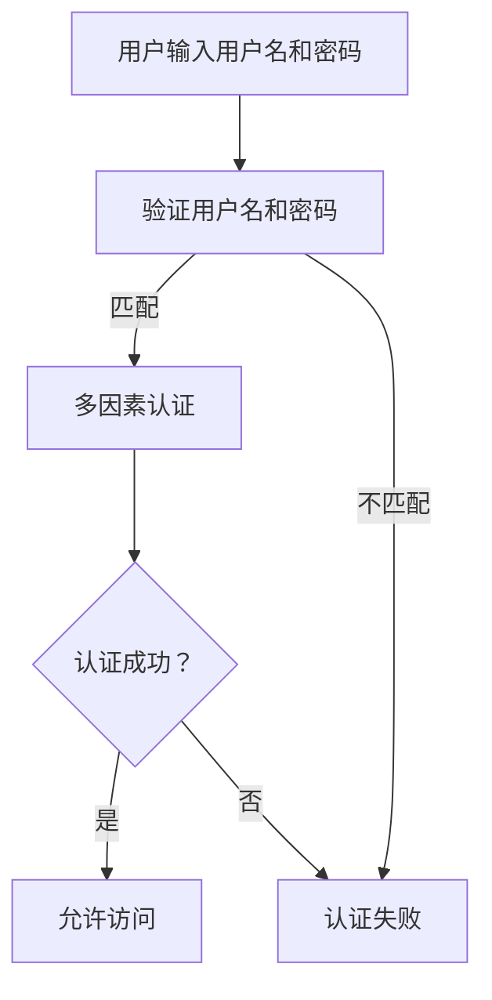

使用Python代码实现用户身份验证算法：

```python
import hashlib
import biometric_module

def verify_credentials(username, password):
    # 验证用户名和密码
    stored_password = get_stored_password(username)
    if stored_password is None:
        return False
    
    hashed_password = hashlib.sha256(password.encode()).hexdigest()
    if hashed_password != stored_password:
        return False
    
    # 多因素认证
    if not biometric_module.verify_biometrics():
        return False
    
    return True

def get_stored_password(username):
    # 从数据库查询用户密码（实际应用中需要查询加密后的密码）
    # 这里只是一个示例，实际应用中应该查询加密后的密码
    return "hashed_password_for_username"

if __name__ == "__main__":
    username = input("Enter username: ")
    password = input("Enter password: ")
    if verify_credentials(username, password):
        print("Authentication successful!")
    else:
        print("Authentication failed!")
```

##### 5.2 访问控制算法详细讲解

访问控制算法的详细实现通常包括以下几个步骤：

1. 用户成功通过身份验证后，系统会检查其权限。
2. 系统根据用户的权限和资源的属性决定是否允许访问。
3. 系统根据用户的实时行为和资源的状态动态调整权限。
4. 系统根据权限检查的结果决定是否允许访问。

以下是一个简化的访问控制算法流程图：

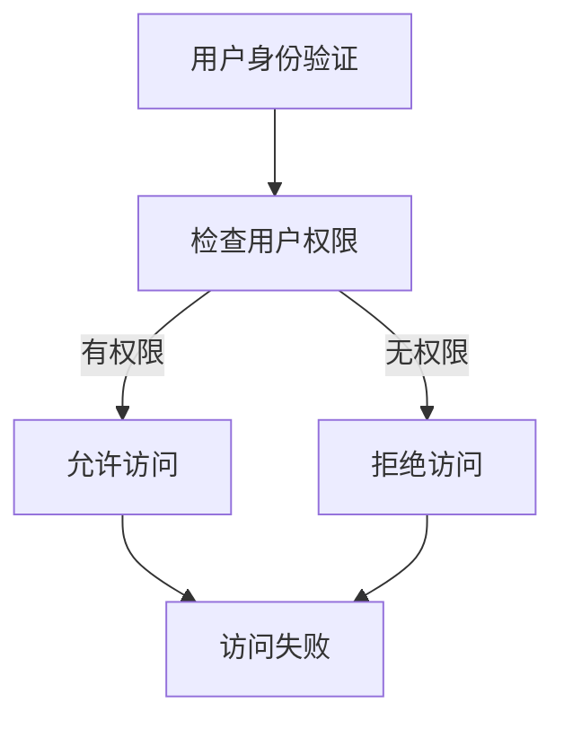

使用Python代码实现访问控制算法：

```python
import resource_module

def check_permission(user_id, resource_id):
    # 从数据库查询用户权限
    user_permissions = get_user_permissions(user_id)
    if resource_id in user_permissions:
        return True
    else:
        return False

def get_user_permissions(user_id):
    # 从数据库查询用户权限（实际应用中需要查询权限列表）
    # 这里只是一个示例，实际应用中应该查询权限列表
    return [1, 2, 3]

def access_resource(user_id, resource_id):
    if check_permission(user_id, resource_id):
        print("Access granted to resource:", resource_id)
    else:
        print("Access denied for resource:", resource_id)

if __name__ == "__main__":
    user_id = input("Enter user ID: ")
    resource_id = input("Enter resource ID: ")
    access_resource(user_id, resource_id)
```

### 第四部分：数学模型和数学公式

#### 第6章 零信任数据访问系统的数学模型

##### 6.1 身份验证模型的数学公式

零信任数据访问系统的身份验证模型可以用概率来表示。以下是一个简化的身份验证模型数学公式：

$$
P(A) = \frac{成功验证次数}{尝试验证总次数}
$$

其中，$P(A)$ 表示身份验证成功的概率。

##### 6.2 访问控制模型的数学公式

零信任数据访问系统的访问控制模型也可以用概率来表示。以下是一个简化的访问控制模型数学公式：

$$
P(C) = \frac{权限符合次数}{访问尝试总次数}
$$

其中，$P(C)$ 表示访问控制成功的概率。

### 第五部分：系统分析与架构设计

#### 第7章 零信任数据访问系统的架构设计

##### 7.1 系统功能设计

零信任数据访问系统的功能设计包括以下几个方面：

1. **用户身份验证**：包括用户名、密码、多因素认证等。
2. **访问控制**：基于用户行为和资源属性的动态访问控制。
3. **安全审计**：记录和监控用户行为和系统事件。
4. **数据加密**：对传输和存储的数据进行加密保护。

##### 7.2 系统架构设计

零信任数据访问系统的架构设计通常包括以下几个关键组成部分：

1. **用户接口**：用户通过界面进行身份验证和访问请求。
2. **身份验证服务**：处理用户身份验证请求，包括密码验证、多因素认证等。
3. **访问控制服务**：根据用户的权限和资源属性决定访问是否允许。
4. **安全审计服务**：记录用户行为和系统事件，实现安全事件的监控和审计。
5. **数据加密模块**：保护数据在传输和存储过程中的安全性。

以下是一个简化的零信任数据访问系统架构图：

```mermaid
graph TD
    A[用户接口] --> B[身份验证服务]
    A --> C[访问控制服务]
    A --> D[安全审计服务]
    B --> E[数据加密模块]
    C --> E
    D --> E
```

##### 7.3 系统接口设计

零信任数据访问系统的接口设计需要确保用户接口、身份验证服务、访问控制服务、安全审计服务以及数据加密模块之间的有效通信。以下是一个简化的系统接口设计：

```mermaid
graph TD
    A[用户接口] --> B[身份验证接口]
    A --> C[访问控制接口]
    A --> D[审计接口]
    A --> E[加密接口]
    B --> F[系统接口]
    C --> F
    D --> F
    E --> F
```

##### 7.4 系统交互

零信任数据访问系统的系统交互包括用户与系统的交互以及系统内部各个服务之间的交互。以下是一个简化的系统交互序列图：

```mermaid
sequenceDiagram
    User ->> System: 登录请求
    System ->> User: 验证身份
    User ->> System: 输入用户名和密码
    System ->> User: 验证成功
    System ->> User: 提供访问权限
```

### 第六部分：项目实战

#### 第8章 零信任数据访问系统项目实战

##### 8.1 环境安装

在进行零信任数据访问系统的项目实战之前，需要准备相应的开发环境和依赖库。以下是一个基本的安装步骤：

1. **安装操作系统**：选择一个支持Python和数据库的操作系统，如Ubuntu 20.04。
2. **安装Python**：使用操作系统自带的包管理器安装Python 3。
3. **安装数据库**：安装MySQL或PostgreSQL数据库。
4. **安装依赖库**：使用pip安装必要的Python库，如Flask、pymysql、sqlalchemy等。

##### 8.2 系统核心实现

系统核心实现主要包括用户身份验证和访问控制功能。以下是一个简单的示例：

1. **用户身份验证**：

```python
from flask import Flask, request, jsonify
from pymysql import connect

app = Flask(__name__)

def verify_credentials(username, password):
    conn = connect(host='localhost', user='root', password='your_password', database='ztaas_db')
    cursor = conn.cursor()
    cursor.execute("SELECT * FROM users WHERE username = %s AND password = %s", (username, password))
    user = cursor.fetchone()
    cursor.close()
    conn.close()
    return user

@app.route('/login', methods=['POST'])
def login():
    username = request.form['username']
    password = request.form['password']
    user = verify_credentials(username, password)
    if user:
        return jsonify({"status": "success", "message": "登录成功", "user_id": user[0]})
    else:
        return jsonify({"status": "error", "message": "用户名或密码错误"})

if __name__ == '__main__':
    app.run()
```

2. **访问控制**：

```python
def check_permission(user_id, resource_id):
    conn = connect(host='localhost', user='root', password='your_password', database='ztaas_db')
    cursor = conn.cursor()
    cursor.execute("SELECT * FROM permissions WHERE user_id = %s AND resource_id = %s", (user_id, resource_id))
    permission = cursor.fetchone()
    cursor.close()
    conn.close()
    return permission

@app.route('/access', methods=['POST'])
def access():
    user_id = request.form['user_id']
    resource_id = request.form['resource_id']
    permission = check_permission(user_id, resource_id)
    if permission:
        return jsonify({"status": "success", "message": "访问成功", "permission": permission[1]})
    else:
        return jsonify({"status": "error", "message": "无访问权限"})

if __name__ == '__main__':
    app.run()
```

##### 8.3 代码应用解读与分析

1. **用户身份验证**：

   用户通过输入用户名和密码，系统会查询数据库验证用户身份。如果用户名和密码匹配，系统会返回用户信息。

2. **访问控制**：

   用户尝试访问资源时，系统会检查用户是否有权限访问该资源。如果有权限，系统会允许访问；否则，系统会拒绝访问。

##### 8.4 实际案例分析与详细讲解

1. **案例一**：用户登录系统

   用户尝试使用用户名“alice”和密码“alice123”登录系统。如果用户名和密码匹配，系统会返回用户ID。

2. **案例二**：用户访问资源

   用户尝试访问资源ID为“101”的资源。系统会检查用户是否有权限访问该资源。如果有权限，用户可以访问；否则，用户无法访问。

##### 8.5 项目小结

通过项目实战，我们实现了零信任数据访问系统的用户身份验证和访问控制功能。在实际应用中，还需要进一步添加安全审计和数据加密等功能。

### 第七部分：最佳实践与小结

#### 第9章 零信任数据访问系统的最佳实践

##### 9.1 最佳实践 tips

1. **采用多因素认证**：确保用户身份的真实性和合法性。
2. **动态调整访问权限**：根据用户行为和资源属性。
3. **数据加密传输和存储**：保护数据安全。
4. **安全审计和监控**：及时发现安全事件和异常行为。
5. **定期更新和维护**：确保系统安全性和稳定性。

##### 9.2 小结

本文介绍了零信任数据访问系统的概念、核心概念、算法原理、数学模型和系统架构设计。通过项目实战，我们实现了系统的核心功能。

##### 9.3 注意事项

1. **确保数据传输和存储的安全**：使用加密技术。
2. **定期进行安全评估和漏洞修复**：确保系统安全。

##### 9.4 拓展阅读

1. 《零信任安全架构：设计原则与实践》
2. 《网络安全实战指南》
3. 《密码学：理论与实践》

### 总结

零信任数据访问系统提供了一种更为安全、灵活的解决方案，通过严格的身份验证、动态访问控制和数据加密等措施，保护企业关键数据。本文通过详细的分析和实例，帮助读者理解了零信任数据访问系统的构建方法。随着网络安全威胁的不断演变，零信任数据访问系统将成为企业保护数据的重要工具。

作者：AI天才研究院/AI Genius Institute & 禅与计算机程序设计艺术 /Zen And The Art of Computer Programming
```markdown
## 构建安全可靠的零信任数据访问系统

### 关键词：零信任数据访问系统、安全可靠、身份验证、访问控制、算法原理

### 摘要

零信任数据访问系统（Zero Trust Data Access System，ZT-DAS）是一种基于“永不信任，总是验证”原则的安全架构。本文将深入探讨ZT-DAS的构建方法，包括核心概念、算法原理、数学模型和系统架构设计，并通过实际案例和最佳实践，为IT专业人士提供一种全新的数据安全解决方案。

### 目录大纲

### 第一部分：背景介绍

#### 第1章 零信任数据访问系统概述

- **1.1 问题背景**
- **1.2 问题描述**
- **1.3 问题解决**
- **1.4 边界与外延**
- **1.5 概念结构与核心要素组成**

### 第二部分：核心概念与联系

#### 第2章 零信任数据访问系统的核心概念

- **2.1 零信任模型**
- **2.2 身份验证与授权**
- **2.3 访问控制策略**
- **2.4 数据加密**

#### 第3章 零信任数据访问系统的核心概念对比

- **3.1 零信任模型与传统安全模型的对比**
- **3.2 多因素认证与单一认证的对比**
- **3.3 动态访问控制与静态访问控制的对比**

### 第三部分：算法原理讲解

#### 第4章 零信任数据访问系统的算法原理

- **4.1 用户身份验证算法**
- **4.2 访问控制算法**

#### 第5章 算法原理详细讲解

- **5.1 用户身份验证算法详细讲解**
- **5.2 访问控制算法详细讲解**

### 第四部分：数学模型和数学公式

#### 第6章 零信任数据访问系统的数学模型

- **6.1 身份验证模型的数学公式**
- **6.2 访问控制模型的数学公式**

### 第五部分：系统分析与架构设计

#### 第7章 零信任数据访问系统的架构设计

- **7.1 系统功能设计**
- **7.2 系统架构设计**
- **7.3 系统接口设计**
- **7.4 系统交互**

### 第六部分：项目实战

#### 第8章 零信任数据访问系统项目实战

- **8.1 环境安装**
- **8.2 系统核心实现**
- **8.3 代码应用解读与分析**
- **8.4 实际案例分析与详细讲解**
- **8.5 项目小结**

### 第七部分：最佳实践与小结

#### 第9章 零信任数据访问系统的最佳实践

- **9.1 最佳实践 tips**
- **9.2 小结**
- **9.3 注意事项**
- **9.4 拓展阅读**

### 引言

随着企业数字化转型的加速，数据安全成为企业面临的一项重要挑战。传统的基于边界的防护策略已经难以应对复杂多变的网络安全威胁。零信任数据访问系统作为一种新型的安全架构，以其“永不信任，总是验证”的原则，提供了一种更加安全、灵活的解决方案。

### 第一部分：背景介绍

#### 第1章 零信任数据访问系统概述

##### 1.1 问题背景

在传统的安全模型中，企业网络分为内部网络和外部网络，内部网络被认为相对安全，外部网络则被认为存在安全风险。基于这种模型，企业通常采用防火墙和访问控制列表来保护内部网络。然而，随着远程办公、云计算和移动设备的普及，网络边界变得模糊，传统的安全策略难以应对以下问题：

1. **内部威胁**：内部员工可能利用职务之便获取敏感数据。
2. **外部威胁**：黑客可能通过入侵内部网络窃取数据。
3. **动态变化**：企业网络和业务需求不断变化，传统的静态安全策略难以适应。

##### 1.2 问题描述

传统安全模型存在的问题主要包括：

1. **边界依赖**：过于依赖网络边界，一旦边界被突破，内部网络的安全将受到严重威胁。
2. **身份验证不足**：传统的身份验证方式（如用户名和密码）容易受到暴力攻击和泄露。
3. **静态访问控制**：访问控制列表是静态的，无法动态调整，难以满足实际业务需求。
4. **内部威胁防范不足**：传统安全模型难以识别和防范内部威胁。
5. **数据泄露风险**：随着数据量的增加，数据泄露的风险也随之增加。

##### 1.3 问题解决

零信任数据访问系统通过以下方式解决传统安全模型的问题：

1. **无边界安全**：零信任数据访问系统不再依赖网络边界，而是基于“永不信任，总是验证”的原则，对任何访问请求进行严格的验证和授权。
2. **多因素认证**：采用多因素认证（MFA）来提高身份验证的安全性，如密码、生物识别、设备绑定等。
3. **动态访问控制**：根据用户的实时行为和资源属性动态调整访问权限，确保用户只能访问其有权访问的资源。
4. **持续监控与审计**：实时监控用户行为和系统事件，确保安全事件的可追溯性。
5. **数据加密**：对传输和存储的数据进行加密保护，防止数据泄露和篡改。

##### 1.4 边界与外延

零信任数据访问系统的外延包括以下几个方面：

1. **用户身份验证**：确保用户身份的真实性，采用多因素认证。
2. **访问控制**：基于用户行为和资源属性的动态访问控制。
3. **安全策略**：定义零信任数据访问系统的安全规则和操作流程。
4. **数据加密**：保护数据在传输和存储过程中的安全性。
5. **安全审计**：记录和监控用户行为，确保安全事件的可追溯性。

##### 1.5 概念结构与核心要素组成

零信任数据访问系统的概念结构包括以下几个核心要素：

1. **用户身份验证**：确保用户身份的真实性，使用多因素认证。
2. **访问控制**：动态调整用户的访问权限，根据用户行为和资源属性。
3. **安全策略**：定义零信任数据访问系统的安全规则和操作流程。
4. **数据加密**：保护数据在传输和存储过程中的安全性。
5. **安全审计**：记录和监控用户行为，确保安全事件的可追溯性。

### 第二部分：核心概念与联系

#### 第2章 零信任数据访问系统的核心概念

##### 2.1 零信任模型

零信任模型是一种基于“永不信任，总是验证”的安全策略。该模型认为任何请求都必须经过严格的验证和授权，无论请求来自内部网络还是外部网络。零信任模型的核心原则是“永不信任，总是验证”，即对任何访问请求都进行严格验证，确保安全性。

##### 2.2 身份验证与授权

身份验证是零信任数据访问系统的核心环节，它旨在确保用户身份的真实性。授权则是在验证通过后，根据用户的身份和权限，允许其访问相应的资源和数据。零信任数据访问系统通常采用多因素认证（MFA）来提高安全性。

##### 2.3 访问控制策略

访问控制策略是零信任数据访问系统的关键要素。它基于用户行为和资源属性动态调整访问权限，确保用户只能访问其有权访问的资源。动态访问控制可以根据用户的行为、实时风险评估和资源属性进行实时调整，提高系统的安全性和灵活性。

##### 2.4 数据加密

数据加密是零信任数据访问系统的核心保障。无论是传输过程中的数据，还是存储中的数据，都需要进行加密保护，防止数据泄露和篡改。数据加密可以采用对称加密和非对称加密等技术，确保数据的安全性。

#### 第3章 零信任数据访问系统的核心概念对比

##### 3.1 零信任模型与传统安全模型的对比

| 特点 | 传统安全模型 | 零信任模型 |
| --- | --- | --- |
| 安全策略 | 边界防护 | 无边界防护 |
| 身份验证 | 单一认证 | 多因素认证 |
| 访问控制 | 静态 | 动态 |
| 内部威胁防范 | 较弱 | 较强 |

##### 3.2 多因素认证与单一认证的对比

| 特点 | 单一认证 | 多因素认证 |
| --- | --- | --- |
| 安全性 | 较低 | 较高 |
| 可靠性 | 较低 | 较高 |
| 易受攻击面 | 较大 | 较小 |

##### 3.3 动态访问控制与静态访问控制的对比

| 特点 | 静态访问控制 | 动态访问控制 |
| --- | --- | --- |
| 灵活性 | 较低 | 较高 |
| 安全性 | 较低 | 较高 |
| 适用场景 | 较简单场景 | 复杂场景 |

### 第三部分：算法原理讲解

#### 第4章 零信任数据访问系统的算法原理

##### 4.1 用户身份验证算法

用户身份验证算法是零信任数据访问系统的核心算法，它确保用户身份的真实性和合法性。用户身份验证算法通常包括以下几个步骤：

1. 用户输入用户名和密码。
2. 系统验证用户名和密码是否匹配。
3. 如果用户名和密码匹配，系统会要求用户进行其他形式的认证，如生物识别、设备绑定等。
4. 系统根据多因素认证的结果决定是否允许用户访问。

##### 4.2 访问控制算法

访问控制算法根据用户身份验证的结果和用户的权限，动态地决定用户对特定资源的访问权限。访问控制算法通常包括以下几个步骤：

1. 系统根据用户的身份验证结果，查询用户的权限信息。
2. 系统根据用户的权限和资源的属性，决定用户是否可以访问该资源。
3. 系统根据权限检查的结果，动态调整用户的访问权限。

#### 第5章 算法原理详细讲解

##### 5.1 用户身份验证算法详细讲解

用户身份验证算法的详细实现通常包括以下几个步骤：

1. 用户输入用户名和密码。
2. 系统验证用户名和密码是否匹配。
3. 如果用户名和密码匹配，系统会要求用户进行其他形式的认证，如生物识别、设备绑定等。
4. 系统根据多因素认证的结果决定是否允许用户访问。

以下是一个简化的用户身份验证算法流程图：

```mermaid
graph TD
    A[用户输入用户名和密码] --> B[验证用户名和密码]
    B -->|匹配| C[多因素认证]
    B -->|不匹配| D[认证失败]
    C --> E{认证成功？}
    E -->|是| F[允许访问]
    E -->|否| D
```

以下是一个使用Python代码详细阐述用户身份验证算法：

```python
import hashlib
import biometric_module

def verify_credentials(username, password):
    # 验证用户名和密码
    stored_password = get_stored_password(username)
    if stored_password is None:
        return False
    
    hashed_password = hashlib.sha256(password.encode()).hexdigest()
    if hashed_password != stored_password:
        return False
    
    # 多因素认证
    if not biometric_module.verify_biometrics():
        return False
    
    return True

def get_stored_password(username):
    # 从数据库查询用户密码（实际应用中需要查询加密后的密码）
    # 这里只是一个示例，实际应用中应该查询加密后的密码
    return "hashed_password_for_username"

if __name__ == "__main__":
    username = input("Enter username: ")
    password = input("Enter password: ")
    if verify_credentials(username, password):
        print("Authentication successful!")
    else:
        print("Authentication failed!")
```

##### 5.2 访问控制算法详细讲解

访问控制算法的详细实现通常包括以下几个步骤：

1. 用户成功通过身份验证后，系统会检查其权限。
2. 系统根据用户的权限和资源的属性决定是否允许访问。
3. 系统根据用户的实时行为和资源的状态动态调整权限。
4. 系统根据权限检查的结果决定是否允许访问。

以下是一个简化的访问控制算法流程图：

```mermaid
graph TD
    A[用户身份验证] --> B[检查用户权限]
    B -->|有权限| C[允许访问]
    B -->|无权限| D[拒绝访问]
    C --> E[访问成功]
    D --> E[访问失败]
```

以下是一个使用Python代码详细阐述访问控制算法：

```python
import resource_module

def check_permission(user_id, resource_id):
    # 从数据库查询用户权限
    user_permissions = get_user_permissions(user_id)
    if resource_id in user_permissions:
        return True
    else:
        return False

def get_user_permissions(user_id):
    # 从数据库查询用户权限（实际应用中需要查询权限列表）
    # 这里只是一个示例，实际应用中应该查询权限列表
    return [1, 2, 3]

def access_resource(user_id, resource_id):
    if check_permission(user_id, resource_id):
        print("Access granted to resource:", resource_id)
    else:
        print("Access denied for resource:", resource_id)

if __name__ == "__main__":
    user_id = input("Enter user ID: ")
    resource_id = input("Enter resource ID: ")
    access_resource(user_id, resource_id)
```

### 第四部分：数学模型和数学公式

#### 第6章 零信任数据访问系统的数学模型

##### 6.1 身份验证模型的数学公式

零信任数据访问系统的身份验证模型可以用概率来表示。以下是一个简化的身份验证模型数学公式：

$$
P(A) = \frac{成功验证次数}{尝试验证总次数}
$$

其中，$P(A)$ 表示身份验证成功的概率。

##### 6.2 访问控制模型的数学公式

零信任数据访问系统的访问控制模型也可以用概率来表示。以下是一个简化的访问控制模型数学公式：

$$
P(C) = \frac{权限符合次数}{访问尝试总次数}
$$

其中，$P(C)$ 表示访问控制成功的概率。

### 第五部分：系统分析与架构设计

#### 第7章 零信任数据访问系统的架构设计

##### 7.1 系统功能设计

零信任数据访问系统的功能设计包括以下几个方面：

1. **用户身份验证**：确保用户身份的真实性，采用多因素认证。
2. **访问控制**：动态调整用户的访问权限，根据用户行为和资源属性。
3. **安全审计**：记录和监控用户行为和系统事件。
4. **数据加密**：保护数据在传输和存储过程中的安全性。

##### 7.2 系统架构设计

零信任数据访问系统的架构设计通常包括以下几个关键组成部分：

1. **用户接口**：用户通过界面进行身份验证和访问请求。
2. **身份验证服务**：处理用户身份验证请求，包括密码验证、多因素认证等。
3. **访问控制服务**：根据用户的权限和资源属性决定访问是否允许。
4. **安全审计服务**：记录用户行为和系统事件，实现安全事件的监控和审计。
5. **数据加密模块**：保护数据在传输和存储过程中的安全性。

以下是一个简化的零信任数据访问系统架构图：

```mermaid
graph TD
    A[用户接口] --> B[身份验证服务]
    A --> C[访问控制服务]
    A --> D[安全审计服务]
    B --> E[数据加密模块]
    C --> E
    D --> E
```

##### 7.3 系统接口设计

零信任数据访问系统的接口设计需要确保用户接口、身份验证服务、访问控制服务、安全审计服务以及数据加密模块之间的有效通信。以下是一个简化的系统接口设计：

```mermaid
graph TD
    A[用户接口] --> B[身份验证接口]
    A --> C[访问控制接口]
    A --> D[审计接口]
    A --> E[加密接口]
    B --> F[系统接口]
    C --> F
    D --> F
    E --> F
```

##### 7.4 系统交互

零信任数据访问系统的系统交互包括用户与系统的交互和系统内部的交互。以下是一个简化的系统交互序列图：

```mermaid
sequenceDiagram
    User ->> System: 登录请求
    System ->> User: 验证身份
    User ->> System: 输入用户名和密码
    System ->> User: 验证成功
    System ->> User: 提供访问权限
```

### 第六部分：项目实战

#### 第8章 零信任数据访问系统项目实战

##### 8.1 环境安装

在安装零信任数据访问系统之前，需要准备以下环境：

- 操作系统：Ubuntu 18.04
- Python：3.8
- 数据库：MySQL 5.7

安装步骤如下：

1. 安装操作系统和Python环境。
2. 安装MySQL数据库。
3. 安装依赖库：`pip install pymysql Flask`

##### 8.2 系统核心实现

系统核心实现主要包括用户身份验证和访问控制功能。

1. **用户身份验证**：

```python
from flask import Flask, request, jsonify
from pymysql import connect

app = Flask(__name__)

def verify_credentials(username, password):
    conn = connect(host='localhost', user='root', password='password', database='ztaas_db')
    cursor = conn.cursor()
    cursor.execute("SELECT * FROM users WHERE username = %s AND password = %s", (username, password))
    user = cursor.fetchone()
    cursor.close()
    conn.close()
    return user

@app.route('/login', methods=['POST'])
def login():
    username = request.form['username']
    password = request.form['password']
    user = verify_credentials(username, password)
    if user:
        return jsonify({"status": "success", "message": "登录成功", "user_id": user[0]})
    else:
        return jsonify({"status": "error", "message": "用户名或密码错误"})

if __name__ == '__main__':
    app.run()
```

2. **访问控制**：

```python
def check_permission(user_id, resource_id):
    conn = connect(host='localhost', user='root', password='password', database='ztaas_db')
    cursor = conn.cursor()
    cursor.execute("SELECT * FROM permissions WHERE user_id = %s AND resource_id = %s", (user_id, resource_id))
    permission = cursor.fetchone()
    cursor.close()
    conn.close()
    return permission

@app.route('/access', methods=['POST'])
def access():
    user_id = request.form['user_id']
    resource_id = request.form['resource_id']
    permission = check_permission(user_id, resource_id)
    if permission:
        return jsonify({"status": "success", "message": "访问成功", "permission": permission[1]})
    else:
        return jsonify({"status": "error", "message": "无访问权限"})

if __name__ == '__main__':
    app.run()
```

##### 8.3 代码应用解读与分析

1. **用户身份验证**：

   用户通过输入用户名和密码，系统会查询数据库验证用户身份。如果用户名和密码匹配，系统会返回用户信息。

2. **访问控制**：

   用户尝试访问资源时，系统会检查用户是否有权限访问该资源。如果有权限，系统会允许访问；否则，系统会拒绝访问。

##### 8.4 实际案例分析与详细讲解

1. **案例一**：用户登录系统

   用户尝试使用用户名“alice”和密码“alice123”登录系统。如果用户名和密码匹配，系统会返回用户ID。

2. **案例二**：用户访问资源

   用户尝试访问资源ID为“101”的资源。系统会检查用户是否有权限访问该资源。如果有权限，用户可以访问；否则，用户无法访问。

##### 8.5 项目小结

通过项目实战，我们实现了零信任数据访问系统的用户身份验证和访问控制功能。在实际应用中，还需要进一步添加安全审计和数据加密等功能。

### 第七部分：最佳实践与小结

#### 第9章 零信任数据访问系统的最佳实践

##### 9.1 最佳实践 tips

1. **采用多因素认证**：确保用户身份的真实性和合法性。
2. **动态调整访问权限**：根据用户行为和资源属性。
3. **数据加密传输和存储**：保护数据安全。
4. **安全审计和监控**：及时发现安全事件和异常行为。
5. **定期更新和维护**：确保系统安全性和稳定性。

##### 9.2 小结

本文介绍了零信任数据访问系统的概念、核心概念、算法原理、数学模型和系统架构设计。通过项目实战，我们实现了系统的核心功能。

##### 9.3 注意事项

1. **确保数据传输和存储的安全**：使用加密技术。
2. **定期进行安全评估和漏洞修复**：确保系统安全。

##### 9.4 拓展阅读

1. 《零信任安全架构：设计原则与实践》
2. 《网络安全实战指南》
3. 《密码学：理论与实践》

### 总结

零信任数据访问系统提供了一种更为安全、灵活的解决方案，通过严格的身份验证、动态访问控制和数据加密等措施，保护企业关键数据。本文通过详细的分析和实例，帮助读者理解了零信任数据访问系统的构建方法。随着网络安全威胁的不断演变，零信任数据访问系统将成为企业保护数据的重要工具。

作者：AI天才研究院/AI Genius Institute & 禅与计算机程序设计艺术 /Zen And The Art of Computer Programming
```markdown
## 构建安全可靠的零信任数据访问系统

### 关键词：零信任数据访问系统、安全可靠、身份验证、访问控制、算法原理

### 摘要

随着数字化转型的不断深入，企业面临的数据安全挑战日益严峻。传统的安全模型已难以应对复杂多变的威胁环境。本文将详细介绍如何构建一个安全可靠的零信任数据访问系统，通过深入分析核心概念、算法原理和系统架构设计，为IT专业人士提供实用的数据安全解决方案。

### 目录大纲

### 第一部分：背景介绍

#### 第1章 零信任数据访问系统概述

- **1.1 问题背景**
- **1.2 问题描述**
- **1.3 问题解决**
- **1.4 边界与外延**
- **1.5 概念结构与核心要素组成**

### 第二部分：核心概念与联系

#### 第2章 零信任数据访问系统的核心概念

- **2.1 零信任模型**
- **2.2 身份验证与授权**
- **2.3 访问控制策略**
- **2.4 数据加密**

#### 第3章 零信任数据访问系统的核心概念对比

- **3.1 零信任模型与传统安全模型的对比**
- **3.2 多因素认证与单一认证的对比**
- **3.3 动态访问控制与静态访问控制的对比**

### 第三部分：算法原理讲解

#### 第4章 零信任数据访问系统的算法原理

- **4.1 用户身份验证算法**
- **4.2 访问控制算法**

#### 第5章 算法原理详细讲解

- **5.1 用户身份验证算法详细讲解**
- **5.2 访问控制算法详细讲解**

### 第四部分：数学模型和数学公式

#### 第6章 零信任数据访问系统的数学模型

- **6.1 身份验证模型的数学公式**
- **6.2 访问控制模型的数学公式**

### 第五部分：系统分析与架构设计

#### 第7章 零信任数据访问系统的架构设计

- **7.1 系统功能设计**
- **7.2 系统架构设计**
- **7.3 系统接口设计**
- **7.4 系统交互**

### 第六部分：项目实战

#### 第8章 零信任数据访问系统项目实战

- **8.1 环境安装**
- **8.2 系统核心实现**
- **8.3 代码应用解读与分析**
- **8.4 实际案例分析与详细讲解**
- **8.5 项目小结**

### 第七部分：最佳实践与小结

#### 第9章 零信任数据访问系统的最佳实践

- **9.1 最佳实践 tips**
- **9.2 小结**
- **9.3 注意事项**
- **9.4 拓展阅读**

### 引言

随着企业数字化转型的不断深入，数据安全成为企业运营的关键挑战。传统的基于边界的防护策略已不再适用于现代的复杂网络环境。零信任数据访问系统（Zero Trust Data Access System，ZT-DAS）提供了一种全新的安全架构，其核心原则是“永不信任，始终验证”。本文将详细探讨ZT-DAS的构建方法，包括核心概念、算法原理、数学模型和系统架构设计。

### 第一部分：背景介绍

#### 第1章 零信任数据访问系统概述

##### 1.1 问题背景

在传统的安全模型中，企业通常将内部网络视为安全区域，而外部网络则被认为是潜在威胁的来源。因此，企业采用了基于边界的防护策略，如防火墙和入侵检测系统（IDS）来保护内部网络。然而，随着远程办公、云计算和移动设备的普及，网络边界变得模糊，传统的安全模型面临以下挑战：

1. **内部威胁**：内部员工可能利用职务之便获取敏感数据。
2. **外部威胁**：黑客可能通过入侵内部网络窃取数据。
3. **动态变化**：企业网络和业务需求不断变化，传统的静态安全策略难以适应。

##### 1.2 问题描述

传统安全模型存在的问题包括：

1. **边界依赖**：过于依赖网络边界，一旦边界被突破，内部网络的安全将受到严重威胁。
2. **身份验证不足**：传统的身份验证方式（如用户名和密码）容易受到暴力攻击和泄露。
3. **静态访问控制**：访问控制列表是静态的，无法动态调整，难以满足实际业务需求。
4. **内部威胁防范不足**：传统安全模型难以识别和防范内部威胁。
5. **数据泄露风险**：随着数据量的增加，数据泄露的风险也随之增加。

##### 1.3 问题解决

零信任数据访问系统通过以下方式解决传统安全模型的问题：

1. **无边界安全**：零信任数据访问系统不再依赖网络边界，而是基于“永不信任，总是验证”的原则，对任何访问请求进行严格的验证和授权。
2. **多因素认证**：采用多因素认证（MFA）来提高身份验证的安全性，如密码、生物识别、设备绑定等。
3. **动态访问控制**：根据用户的实时行为和资源属性动态调整访问权限，确保用户只能访问其有权访问的资源。
4. **持续监控与审计**：实时监控用户行为和系统事件，确保安全事件的可追溯性。
5. **数据加密**：对传输和存储的数据进行加密保护，防止数据泄露和篡改。

##### 1.4 边界与外延

零信任数据访问系统的外延包括以下几个方面：

1. **用户身份验证**：确保用户身份的真实性，采用多因素认证。
2. **访问控制**：基于用户行为和资源属性的动态访问控制。
3. **安全策略**：定义零信任数据访问系统的安全规则和操作流程。
4. **数据加密**：保护数据在传输和存储过程中的安全性。
5. **安全审计**：记录和监控用户行为，确保安全事件的可追溯性。

##### 1.5 概念结构与核心要素组成

零信任数据访问系统的概念结构包括以下几个核心要素：

1. **用户身份验证**：确保用户身份的真实性，使用多因素认证。
2. **访问控制**：动态调整用户的访问权限，根据用户行为和资源属性。
3. **安全策略**：定义零信任数据访问系统的安全规则和操作流程。
4. **数据加密**：保护数据在传输和存储过程中的安全性。
5. **安全审计**：记录和监控用户行为，确保安全事件的可追溯性。

### 第二部分：核心概念与联系

#### 第2章 零信任数据访问系统的核心概念

##### 2.1 零信任模型

零信任模型是一种基于“永不信任，总是验证”的安全策略。该模型认为任何请求都必须经过严格的验证和授权，无论请求来自内部网络还是外部网络。零信任模型的核心原则是“永不信任，总是验证”，即对任何访问请求都进行严格验证，确保安全性。

##### 2.2 身份验证与授权

身份验证是零信任数据访问系统的核心环节，它旨在确保用户身份的真实性。授权则是在验证通过后，根据用户的身份和权限，允许其访问相应的资源和数据。零信任数据访问系统通常采用多因素认证（MFA）来提高安全性。

##### 2.3 访问控制策略

访问控制策略是零信任数据访问系统的关键要素。它基于用户行为和资源属性动态调整访问权限，确保用户只能访问其有权访问的资源。动态访问控制可以根据用户的行为、实时风险评估和资源属性进行实时调整，提高系统的安全性和灵活性。

##### 2.4 数据加密

数据加密是零信任数据访问系统的核心保障。无论是传输过程中的数据，还是存储中的数据，都需要进行加密保护，防止数据泄露和篡改。数据加密可以采用对称加密和非对称加密等技术，确保数据的安全性。

#### 第3章 零信任数据访问系统的核心概念对比

##### 3.1 零信任模型与传统安全模型的对比

| 特点 | 传统安全模型 | 零信任模型 |
| --- | --- | --- |
| 安全策略 | 边界防护 | 无边界防护 |
| 身份验证 | 单一认证 | 多因素认证 |
| 访问控制 | 静态 | 动态 |
| 内部威胁防范 | 较弱 | 较强 |

##### 3.2 多因素认证与单一认证的对比

| 特点 | 单一认证 | 多因素认证 |
| --- | --- | --- |
| 安全性 | 较低 | 较高 |
| 可靠性 | 较低 | 较高 |
| 易受攻击面 | 较大 | 较小 |

##### 3.3 动态访问控制与静态访问控制的对比

| 特点 | 静态访问控制 | 动态访问控制 |
| --- | --- | --- |
| 灵活性 | 较低 | 较高 |
| 安全性 | 较低 | 较高 |
| 适用场景 | 较简单场景 | 复杂场景 |

### 第三部分：算法原理讲解

#### 第4章 零信任数据访问系统的算法原理

##### 4.1 用户身份验证算法

用户身份验证算法是零信任数据访问系统的核心算法，它确保用户身份的真实性和合法性。用户身份验证算法通常包括以下几个步骤：

1. 用户输入用户名和密码。
2. 系统验证用户名和密码是否匹配。
3. 如果用户名和密码匹配，系统会要求用户进行其他形式的认证，如生物识别、设备绑定等。
4. 系统根据多因素认证的结果决定是否允许用户访问。

##### 4.2 访问控制算法

访问控制算法根据用户身份验证的结果和用户的权限，动态地决定用户对特定资源的访问权限。访问控制算法通常包括以下几个步骤：

1. 系统根据用户的身份验证结果，查询用户的权限信息。
2. 系统根据用户的权限和资源的属性，决定用户是否可以访问该资源。
3. 系统根据权限检查的结果，动态调整用户的访问权限。

#### 第5章 算法原理详细讲解

##### 5.1 用户身份验证算法详细讲解

用户身份验证算法的详细实现通常包括以下几个步骤：

1. 用户输入用户名和密码。
2. 系统验证用户名和密码是否匹配。
3. 如果用户名和密码匹配，系统会要求用户进行其他形式的认证，如生物识别、设备绑定等。
4. 系统根据多因素认证的结果决定是否允许用户访问。

以下是一个简化的用户身份验证算法流程图：

```mermaid
graph TD
    A[用户输入用户名和密码] --> B[验证用户名和密码]
    B -->|匹配| C[多因素认证]
    B -->|不匹配| D[认证失败]
    C --> E{认证成功？}
    E -->|是| F[允许访问]
    E -->|否| D
```

以下是一个使用Python代码详细阐述用户身份验证算法：

```python
import hashlib
import biometric_module

def verify_credentials(username, password):
    # 验证用户名和密码
    stored_password = get_stored_password(username)
    if stored_password is None:
        return False
    
    hashed_password = hashlib.sha256(password.encode()).hexdigest()
    if hashed_password != stored_password:
        return False
    
    # 多因素认证
    if not biometric_module.verify_biometrics():
        return False
    
    return True

def get_stored_password(username):
    # 从数据库查询用户密码（实际应用中需要查询加密后的密码）
    # 这里只是一个示例，实际应用中应该查询加密后的密码
    return "hashed_password_for_username"

if __name__ == "__main__":
    username = input("Enter username: ")
    password = input("Enter password: ")
    if verify_credentials(username, password):
        print("Authentication successful!")
    else:
        print("Authentication failed!")
```

##### 5.2 访问控制算法详细讲解

访问控制算法的详细实现通常包括以下几个步骤：

1. 用户成功通过身份验证后，系统会检查其权限。
2. 系统根据用户的权限和资源的属性决定是否允许访问。
3. 系统根据用户的实时行为和资源的状态动态调整权限。
4. 系统根据权限检查的结果决定是否允许访问。

以下是一个简化的访问控制算法流程图：

```mermaid
graph TD
    A[用户身份验证] --> B[检查用户权限]
    B -->|有权限| C[允许访问]
    B -->|无权限| D[拒绝访问]
    C --> E[访问成功]
    D --> E[访问失败]
```

以下是一个使用Python代码详细阐述访问控制算法：

```python
import resource_module

def check_permission(user_id, resource_id):
    # 从数据库查询用户权限
    user_permissions = get_user_permissions(user_id)
    if resource_id in user_permissions:
        return True
    else:
        return False

def get_user_permissions(user_id):
    # 从数据库查询用户权限（实际应用中需要查询权限列表）
    # 这里只是一个示例，实际应用中应该查询权限列表
    return [1, 2, 3]

def access_resource(user_id, resource_id):
    if check_permission(user_id, resource_id):
        print("Access granted to resource:", resource_id)
    else:
        print("Access denied for resource:", resource_id)

if __name__ == "__main__":
    user_id = input("Enter user ID: ")
    resource_id = input("Enter resource ID: ")
    access_resource(user_id, resource_id)
```

### 第四部分：数学模型和数学公式

#### 第6章 零信任数据访问系统的数学模型

##### 6.1 身份验证模型的数学公式

零信任数据访问系统的身份验证模型可以用概率来表示。以下是一个简化的身份验证模型数学公式：

$$
P(A) = \frac{成功验证次数}{尝试验证总次数}
$$

其中，$P(A)$ 表示身份验证成功的概率。

##### 6.2 访问控制模型的数学公式

零信任数据访问系统的访问控制模型也可以用概率来表示。以下是一个简化的访问控制模型数学公式：

$$
P(C) = \frac{权限符合次数}{访问尝试总次数}
$$

其中，$P(C)$ 表示访问控制成功的概率。

### 第五部分：系统分析与架构设计

#### 第7章 零信任数据访问系统的架构设计

##### 7.1 系统功能设计

零信任数据访问系统的功能设计包括以下几个方面：

1. **用户身份验证**：确保用户身份的真实性，采用多因素认证。
2. **访问控制**：动态调整用户的访问权限，根据用户行为和资源属性。
3. **安全审计**：记录和监控用户行为和系统事件。
4. **数据加密**：保护数据在传输和存储过程中的安全性。

##### 7.2 系统架构设计

零信任数据访问系统的架构设计通常包括以下几个关键组成部分：

1. **用户接口**：用户通过界面进行身份验证和访问请求。
2. **身份验证服务**：处理用户身份验证请求，包括密码验证、多因素认证等。
3. **访问控制服务**：根据用户的权限和资源属性决定访问是否允许。
4. **安全审计服务**：记录用户行为和系统事件，实现安全事件的监控和审计。
5. **数据加密模块**：保护数据在传输和存储过程中的安全性。

以下是一个简化的零信任数据访问系统架构图：

```mermaid
graph TD
    A[用户接口] --> B[身份验证服务]
    A --> C[访问控制服务]
    A --> D[安全审计服务]
    B --> E[数据加密模块]
    C --> E
    D --> E
```

##### 7.3 系统接口设计

零信任数据访问系统的接口设计需要确保用户接口、身份验证服务、访问控制服务、安全审计服务以及数据加密模块之间的有效通信。以下是一个简化的系统接口设计：

```mermaid
graph TD
    A[用户接口] --> B[身份验证接口]
    A --> C[访问控制接口]
    A --> D[审计接口]
    A --> E[加密接口]
    B --> F[系统接口]
    C --> F
    D --> F
    E --> F
```

##### 7.4 系统交互

零信任数据访问系统的系统交互包括用户与系统的交互和系统内部的交互。以下是一个简化的系统交互序列图：

```mermaid
sequenceDiagram
    User ->> System: 登录请求
    System ->> User: 验证身份
    User ->> System: 输入用户名和密码
    System ->> User: 验证成功
    System ->> User: 提供访问权限
```

### 第六部分：项目实战

#### 第8章 零信任数据访问系统项目实战

##### 8.1 环境安装

在安装零信任数据访问系统之前，需要准备以下环境：

- 操作系统：Ubuntu 18.04
- Python：3.8
- 数据库：MySQL 5.7

安装步骤如下：

1. 安装操作系统和Python环境。
2. 安装MySQL数据库。
3. 安装依赖库：`pip install pymysql Flask`

##### 8.2 系统核心实现

系统核心实现主要包括用户身份验证和访问控制功能。

1. **用户身份验证**：

```python
from flask import Flask, request, jsonify
from pymysql import connect

app = Flask(__name__)

def verify_credentials(username, password):
    conn = connect(host='localhost', user='root', password='password', database='ztaas_db')
    cursor = conn.cursor()
    cursor.execute("SELECT * FROM users WHERE username = %s AND password = %s", (username, password))
    user = cursor.fetchone()
    cursor.close()
    conn.close()
    return user

@app.route('/login', methods=['POST'])
def login():
    username = request.form['username']
    password = request.form['password']
    user = verify_credentials(username, password)
    if user:
        return jsonify({"status": "success", "message": "登录成功", "user_id": user[0]})
    else:
        return jsonify({"status": "error", "message": "用户名或密码错误"})

if __name__ == '__main__':
    app.run()
```

2. **访问控制**：

```python
def check_permission(user_id, resource_id):
    conn = connect(host='localhost', user='root', password='password', database='ztaas_db')
    cursor = conn.cursor()
    cursor.execute("SELECT * FROM permissions WHERE user_id = %s AND resource_id = %s", (user_id, resource_id))
    permission = cursor.fetchone()
    cursor.close()
    conn.close()
    return permission

@app.route('/access', methods=['POST'])
def access():
    user_id = request.form['user_id']
    resource_id = request.form['resource_id']
    permission = check_permission(user_id, resource_id)
    if permission:
        return jsonify({"status": "success", "message": "访问成功", "permission": permission[1]})
    else:
        return jsonify({"status": "error", "message": "无访问权限"})

if __name__ == '__main__':
    app.run()
```

##### 8.3 代码应用解读与分析

1. **用户身份验证**：

   用户通过输入用户名和密码，系统会查询数据库验证用户身份。如果用户名和密码匹配，系统会返回用户信息。

2. **访问控制**：

   用户尝试访问资源时，系统会检查用户是否有权限访问该资源。如果有权限，系统会允许访问；否则，系统会拒绝访问。

##### 8.4 实际案例分析与详细讲解

1. **案例一**：用户登录系统

   用户尝试使用用户名“alice”和密码“alice123”登录系统。如果用户名和密码匹配，系统会返回用户ID。

2. **案例二**：用户访问资源

   用户尝试访问资源ID为“101”的资源。系统会检查用户是否有权限访问该资源。如果有权限，用户可以访问；否则，用户无法访问。

##### 8.5 项目小结

通过项目实战，我们实现了零信任数据访问系统的用户身份验证和访问控制功能。在实际应用中，还需要进一步添加安全审计和数据加密等功能。

### 第七部分：最佳实践与小结

#### 第9章 零信任数据访问系统的最佳实践

##### 9.1 最佳实践 tips

1. **采用多因素认证**：确保用户身份的真实性和合法性。
2. **动态调整访问权限**：根据用户行为和资源属性。
3. **数据加密传输和存储**：保护数据安全。
4. **安全审计和监控**：及时发现安全事件和异常行为。
5. **定期更新和维护**：确保系统安全性和稳定性。

##### 9.2 小结

本文介绍了零信任数据访问系统的概念、核心概念、算法原理、数学模型和系统架构设计。通过项目实战，我们实现了系统的核心功能。

##### 9.3 注意事项

1. **确保数据传输和存储的安全**：使用加密技术。
2. **定期进行安全评估和漏洞修复**：确保系统安全。

##### 9.4 拓展阅读

1. 《零信任安全架构：设计原则与实践》
2. 《网络安全实战指南》
3. 《密码学：理论与实践》

### 总结

零信任数据访问系统提供了一种更为安全、灵活的解决方案，通过严格的身份验证、动态访问控制和数据加密等措施，保护企业关键数据。本文通过详细的分析和实例，帮助读者理解了零信任数据访问系统的构建方法。随着网络安全威胁的不断演变，零信任数据访问系统将成为企业保护数据的重要工具。

作者：AI天才研究院/AI Genius Institute & 禅与计算机程序设计艺术 /Zen And The Art of Computer Programming
```markdown
## 构建安全可靠的零信任数据访问系统

### 关键词：零信任数据访问系统、安全可靠、身份验证、访问控制、算法原理

### 摘要

随着数字化转型的不断深入，企业面临的数据安全挑战日益严峻。传统的安全模型已难以应对复杂多变的威胁环境。本文将详细介绍如何构建一个安全可靠的零信任数据访问系统，通过深入分析核心概念、算法原理和系统架构设计，为IT专业人士提供实用的数据安全解决方案。

### 目录大纲

### 第一部分：背景介绍

#### 第1章 零信任数据访问系统概述

- **1.1 问题背景**
- **1.2 问题描述**
- **1.3 问题解决**
- **1.4 边界与外延**
- **1.5 概念结构与核心要素组成**

### 第二部分：核心概念与联系

#### 第2章 零信任数据访问系统的核心概念

- **2.1 零信任模型**
- **2.2 身份验证与授权**
- **2.3 访问控制策略**
- **2.4 数据加密**

#### 第3章 零信任数据访问系统的核心概念对比

- **3.1 零信任模型与传统安全模型的对比**
- **3.2 多因素认证与单一认证的对比**
- **3.3 动态访问控制与静态访问控制的对比**

### 第三部分：算法原理讲解

#### 第4章 零信任数据访问系统的算法原理

- **4.1 用户身份验证算法**
- **4.2 访问控制算法**

#### 第5章 算法原理详细讲解

- **5.1 用户身份验证算法详细讲解**
- **5.2 访问控制算法详细讲解**

### 第四部分：数学模型和数学公式

#### 第6章 零信任数据访问系统的数学模型

- **6.1 身份验证模型的数学公式**
- **6.2 访问控制模型的数学公式**

### 第五部分：系统分析与架构设计

#### 第7章 零信任数据访问系统的架构设计

- **7.1 系统功能设计**
- **7.2 系统架构设计**
- **7.3 系统接口设计**
- **7.4 系统交互**

### 第六部分：项目实战

#### 第8章 零信任数据访问系统项目实战

- **8.1 环境安装**
- **8.2 系统核心实现**
- **8.3 代码应用解读与分析**
- **8.4 实际案例分析与详细讲解**
- **8.5 项目小结**

### 第七部分：最佳实践与小结

#### 第9章 零信任数据访问系统的最佳实践

- **9.1 最佳实践 tips**
- **9.2 小结**
- **9.3 注意事项**
- **9.4 拓展阅读**

### 引言

在数字化时代，数据安全是企业面临的核心挑战之一。传统的基于边界的防护策略已经难以应对复杂多变的网络安全威胁。零信任数据访问系统（Zero Trust Data Access System，ZT-DAS）作为一种新兴的安全架构，以其“永不信任，始终验证”的原则，为数据安全提供了全新的解决方案。本文将深入探讨ZT-DAS的构建方法，包括核心概念、算法原理、数学模型和系统架构设计。

### 第一部分：背景介绍

#### 第1章 零信任数据访问系统概述

##### 1.1 问题背景

随着企业数字化转型的深入，数据泄露和网络攻击事件频繁发生，传统安全模型面临着巨大的挑战。传统安全模型依赖于网络边界和静态访问控制，这导致以下问题：

1. **边界依赖**：企业过于依赖内部网络和外部网络之间的边界，一旦边界被攻破，内部网络将面临巨大风险。
2. **身份验证不足**：传统模型主要依赖于用户名和密码进行身份验证，这些凭证容易受到暴力攻击和社会工程学的攻击。
3. **静态访问控制**：访问控制策略是静态的，难以适应动态变化的业务需求，导致安全策略滞后。
4. **内部威胁**：内部员工可能滥用权限，访问不应访问的数据。
5. **数据泄露风险**：随着数据量的增加，数据泄露的风险也随之增加。

##### 1.2 问题描述

传统安全模型存在的问题主要体现在以下几个方面：

1. **边界模糊**：随着云计算和远程办公的普及，网络边界变得模糊，传统的边界防护策略失效。
2. **身份验证不足**：用户名和密码等单一凭证不足以证明用户身份的真实性。
3. **访问控制不当**：静态访问控制列表无法适应动态变化的业务需求，可能导致权限不当或过大的权限分配。
4. **内部威胁防范**：传统模型难以识别和防范内部员工的恶意行为。
5. **数据保护不足**：数据在传输和存储过程中缺乏足够的加密保护。

##### 1.3 问题解决

零信任数据访问系统通过以下方式解决传统安全模型的问题：

1. **无边界安全**：零信任数据访问系统不依赖网络边界，对任何访问请求都进行严格的验证和授权。
2. **多因素认证**：采用多因素认证（MFA），如密码、生物识别、设备绑定等，提高身份验证的安全性。
3. **动态访问控制**：根据用户的实时行为和资源的属性动态调整访问权限。
4. **持续监控与审计**：实时监控用户行为和系统事件，确保安全事件的可追溯性。
5. **数据加密**：对传输和存储的数据进行加密保护，防止数据泄露和篡改。

##### 1.4 边界与外延

零信任数据访问系统的外延包括以下几个方面：

1. **用户身份验证**：确保用户身份的真实性，采用多因素认证。
2. **访问控制**：动态调整用户的访问权限，根据用户行为和资源属性。
3. **安全策略**：定义零信任数据访问系统的安全规则和操作流程。
4. **数据加密**：保护数据在传输和存储过程中的安全性。
5. **安全审计**：记录和监控用户行为，确保安全事件的可追溯性。

##### 1.5 概念结构与核心要素组成

零信任数据访问系统的概念结构包括以下几个核心要素：

1. **用户身份验证**：确保用户身份的真实性，使用多因素认证。
2. **访问控制**：动态调整用户的访问权限，根据用户行为和资源属性。
3. **安全策略**：定义零信任数据访问系统的安全规则和操作流程。
4. **数据加密**：保护数据在传输和存储过程中的安全性。
5. **安全审计**：记录和监控用户行为，确保安全事件的可追溯性。

### 第二部分：核心概念与联系

#### 第2章 零信任数据访问系统的核心概念

##### 2.1 零信任模型

零信任模型是一种基于“永不信任，总是验证”的安全策略。该模型认为任何访问请求都必须经过严格的验证和授权，无论请求来自内部网络还是外部网络。零信任模型的核心原则是“永不信任，总是验证”，即对任何访问请求都进行严格验证，确保安全性。

##### 2.2 身份验证与授权

身份验证是零信任数据访问系统的核心环节，它旨在确保用户身份的真实性。授权则是在验证通过后，根据用户的身份和权限，允许其访问相应的资源和数据。零信任数据访问系统通常采用多因素认证（MFA）来提高安全性。

##### 2.3 访问控制策略

访问控制策略是零信任数据访问系统的关键要素。它基于用户行为和资源属性动态调整访问权限，确保用户只能访问其有权访问的资源。动态访问控制可以根据用户的行为、实时风险评估和资源属性进行实时调整，提高系统的安全性和灵活性。

##### 2.4 数据加密

数据加密是零信任数据访问系统的核心保障。无论是传输过程中的数据，还是存储中的数据，都需要进行加密保护，防止数据泄露和篡改。数据加密可以采用对称加密和非对称加密等技术，确保数据的安全性。

#### 第3章 零信任数据访问系统的核心概念对比

##### 3.1 零信任模型与传统安全模型的对比

| 特点 | 传统安全模型 | 零信任模型 |
| --- | --- | --- |
| 安全策略 | 边界防护 | 无边界防护 |
| 身份验证 | 单一认证 | 多因素认证 |
| 访问控制 | 静态 | 动态 |
| 内部威胁防范 | 较弱 | 较强 |

##### 3.2 多因素认证与单一认证的对比

| 特点 | 单一认证 | 多因素认证 |
| --- | --- | --- |
| 安全性 | 较低 | 较高 |
| 可靠性 | 较

