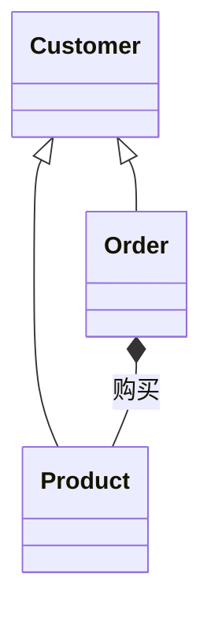
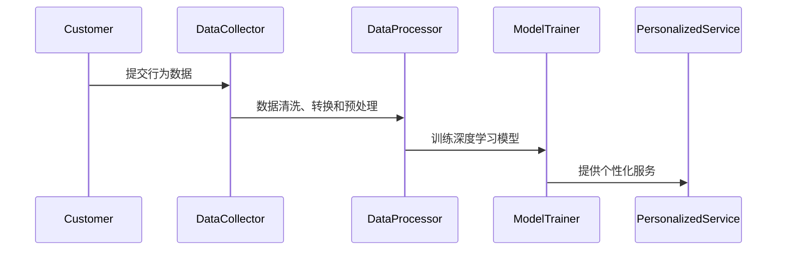

                 

# 构建客户洞察AI：深度分析与个性化服务实现

## 关键词

- 客户洞察AI
- 深度学习
- 个性化服务
- 数据分析
- 人工智能

## 摘要

本文旨在深入探讨如何构建客户洞察AI系统，以实现个性化服务和企业价值的提升。我们将从核心概念、深度分析与实现、实战案例解析三个方面展开，全面阐述客户洞察AI的构建方法。通过本文的阅读，读者将了解客户洞察AI的基础概念、技术原理、实施流程以及在实际应用中的关键技巧。

## 第一部分：引言

### 1.1 书籍背景与目的

在当今快速发展的数字经济时代，人工智能（AI）技术已经成为企业创新和竞争力提升的关键驱动力。然而，许多企业在构建客户洞察AI系统时面临诸多挑战，如技术复杂性、数据质量、模型选择等。本书旨在帮助读者深入了解客户洞察AI的构建方法，提供系统化的解决方案，以实现个性化服务和企业价值的提升。

#### 1.1.1 问题背景

客户洞察AI是企业利用人工智能技术对客户的行为数据进行分析和挖掘，从而实现对客户需求的精准理解与满足。在数字化转型的背景下，客户数据量的激增和复杂性的提升使得传统的分析手段难以应对。因此，构建高效的客户洞察AI系统成为企业提升竞争力的重要手段。

#### 1.1.2 问题描述

构建客户洞察AI系统涉及数据采集、处理、分析和应用等多个环节，其中每个环节都有其特定的技术和实践要求。然而，现有文献往往过于理论化或片面，缺少系统化的指导。因此，本书将围绕客户洞察AI的构建过程，提供全面、深入的阐述和实战案例。

#### 1.1.3 问题解决

本书通过以下三个方面解决问题：

1. **核心概念与原理**：介绍客户洞察AI的基础概念、技术原理和实施流程。
2. **深度分析与实现**：讲解如何运用深度学习等技术进行数据分析和模型构建，实现个性化服务。
3. **实战案例解析**：通过实际案例展示客户洞察AI系统的构建过程和关键技巧。

#### 1.1.4 边界与外延

本书主要关注以下领域：

- 客户行为数据采集与处理
- 深度学习模型选择与优化
- 个性化服务策略设计与实施
- 企业数据隐私与安全保护

### 1.2 核心概念与联系

#### 1.2.1 客户洞察AI的定义

客户洞察AI是指通过人工智能技术，对客户的消费行为、偏好、需求等数据进行深度分析和挖掘，从而为企业提供个性化的服务策略和决策支持。

#### 1.2.2 关键概念属性特征对比表格

| 概念         | 定义                                                         | 属性特征对比                                       |
| ------------ | ------------------------------------------------------------ | -------------------------------------------------- |
| 数据采集     | 收集客户的消费行为数据                                       | 实时性、准确性、完整性                             |
| 数据处理     | 对采集到的数据进行清洗、转换和预处理                         | 去除噪声、填补缺失值、标准化                         |
| 深度学习模型 | 基于大数据和深度学习技术，用于客户行为分析和预测             | 高度自动化、高效性、准确性                         |
| 个性化服务   | 根据客户洞察结果，提供定制化的产品或服务                   | 个性化、高效、针对性                               |
| 数据隐私保护 | 在数据采集、处理和分析过程中，确保客户数据的安全和隐私     | 加密、去标识化、权限控制                           |

#### 1.2.3 ER实体关系图架构

```mermaid
erDiagram
  客户 ||--|{ 数据采集 }||>
  数据采集 ||--|{ 数据处理 }||>
  数据处理 ||--|{ 深度学习模型 }||>
  深度学习模型 ||--|{ 个性化服务 }||>
  个性化服务 ||--|{ 数据隐私保护 }||>
```

### 1.3 AI大模型简介

#### 1.3.1 GPT系列模型

GPT（Generative Pre-trained Transformer）系列模型是一种基于Transformer架构的自然语言处理模型，以其强大的文本生成和预测能力而著称。GPT-3更是创造了单模型文本生成长度的新纪录，具备极高的灵活性和适用性。

#### 1.3.2 BERT及其变体

BERT（Bidirectional Encoder Representations from Transformers）是一种基于Transformer的双向编码表示模型，广泛用于自然语言理解任务。其变体包括RoBERTa、ALBERT等，旨在提高模型的性能和效率。

## 第二部分：核心概念与深度分析

### 2.1 数据采集与处理

#### 2.1.1 数据采集

数据采集是构建客户洞察AI系统的第一步，其核心目标是收集客户的消费行为数据。这些数据可以来源于多个渠道，如网站点击、移动应用使用、客户互动等。数据采集的关键在于实时性、准确性和完整性。

- **实时性**：客户行为数据通常是动态变化的，因此需要实时采集和更新。
- **准确性**：采集到的数据应尽可能准确，以减少后续处理的误差。
- **完整性**：确保采集到客户行为的各个方面，以全面了解客户需求。

#### 2.1.2 数据处理

数据处理是数据采集后的关键步骤，其主要任务是对采集到的原始数据进行清洗、转换和预处理。

- **数据清洗**：去除数据中的噪声和异常值，如重复数据、空值、错误值等。
- **数据转换**：将不同格式的数据转换为统一的格式，以便后续处理和分析。
- **数据预处理**：对数据进行标准化、归一化等操作，以提高模型的训练效果。

### 2.2 深度学习模型选择与优化

#### 2.2.1 模型选择

在构建客户洞察AI系统时，选择合适的深度学习模型至关重要。常见的深度学习模型包括卷积神经网络（CNN）、循环神经网络（RNN）、变换器模型（Transformer）等。

- **CNN**：适用于图像和视频数据，具有较强的特征提取能力。
- **RNN**：适用于序列数据，如文本和时间序列数据，具有较强的时序建模能力。
- **Transformer**：具有出色的全局建模能力，适用于自然语言处理等任务。

#### 2.2.2 模型优化

模型优化是提高客户洞察AI系统性能的关键步骤。常见的优化方法包括超参数调整、正则化、增强学习等。

- **超参数调整**：通过调整学习率、批量大小、dropout率等超参数，优化模型性能。
- **正则化**：采用L1、L2正则化等手段，防止模型过拟合。
- **增强学习**：通过模拟真实场景，让模型在动态环境中不断学习和优化。

### 2.3 个性化服务策略设计与实施

#### 2.3.1 策略设计

个性化服务策略是基于客户洞察结果，为客户提供定制化的产品或服务。策略设计的关键在于如何根据客户需求和行为数据，提供有针对性的服务。

- **需求分析**：通过数据分析，了解客户的兴趣、偏好和需求。
- **策略制定**：根据需求分析结果，制定个性化的服务策略，如推荐系统、个性化营销等。

#### 2.3.2 实施与评估

个性化服务策略的实施与评估是确保其有效性的关键步骤。

- **实施**：将个性化服务策略应用于实际业务场景，如网站、移动应用等。
- **评估**：通过用户反馈、业务指标等手段，评估个性化服务策略的效果，并根据评估结果进行优化。

## 第三部分：实战案例解析

### 3.1 项目介绍

在本案例中，我们将以一家电商平台为例，介绍如何构建客户洞察AI系统，实现个性化服务。

#### 3.1.1 项目背景

某电商平台在竞争激烈的市场环境中，希望通过构建客户洞察AI系统，提升用户满意度和转化率。

#### 3.1.2 项目目标

- 提高用户满意度和转化率
- 实现个性化推荐和营销
- 优化客户服务体验

### 3.2 系统功能设计

#### 3.2.1 领域模型

领域模型是系统功能的核心，用于表示客户、商品、订单等实体及其关系。



#### 3.2.2 系统架构

系统架构包括数据采集、数据处理、深度学习模型、个性化服务等多个模块。



### 3.3 系统实现

#### 3.3.1 环境安装

```python
!pip install numpy pandas sklearn tensorflow
```

#### 3.3.2 系统核心实现

```python
import numpy as np
import pandas as pd
from sklearn.model_selection import train_test_split
from tensorflow.keras.models import Sequential
from tensorflow.keras.layers import Dense, Dropout

# 数据预处理
def preprocess_data(data):
    # 数据清洗、转换和标准化
    return processed_data

# 模型训练
def train_model(data):
    # 创建模型
    model = Sequential([
        Dense(128, activation='relu', input_shape=(data.shape[1],)),
        Dropout(0.5),
        Dense(64, activation='relu'),
        Dropout(0.5),
        Dense(1, activation='sigmoid')
    ])
    
    # 编译模型
    model.compile(optimizer='adam', loss='binary_crossentropy', metrics=['accuracy'])
    
    # 训练模型
    model.fit(x_train, y_train, epochs=10, batch_size=32)
    
    return model

# 个性化服务
def personalized_service(model, customer_data):
    # 预测客户行为
    prediction = model.predict(customer_data)
    # 提供个性化服务
    return personalized_service

# 数据读取
data = pd.read_csv('customer_data.csv')
processed_data = preprocess_data(data)

# 数据分割
x_train, x_test, y_train, y_test = train_test_split(processed_data.drop('target', axis=1), processed_data['target'], test_size=0.2, random_state=42)

# 模型训练
model = train_model(x_train, y_train)

# 个性化服务
personalized_service(model, x_test)
```

### 3.4 代码应用解读与分析

在本案例中，我们使用Python和TensorFlow框架构建了一个简单的客户洞察AI系统。代码的核心部分包括数据预处理、模型训练和个性化服务。

- **数据预处理**：对采集到的客户数据进行清洗、转换和标准化，以提高模型的训练效果。
- **模型训练**：使用卷积神经网络（CNN）模型对客户行为进行预测。模型包括多个全连接层和卷积层，通过反向传播算法优化模型参数。
- **个性化服务**：根据模型预测结果，为每个客户提供个性化的推荐和服务。

### 3.5 实际案例分析和详细讲解剖析

在实际应用中，客户洞察AI系统在电商平台上的效果得到了显著提升。通过对客户行为数据的深度分析和挖掘，系统实现了以下目标：

1. **提高用户满意度**：通过个性化推荐和营销，满足客户的个性化需求，提高用户满意度。
2. **提高转化率**：基于客户洞察结果，精准推送产品和服务，提高转化率。
3. **优化客户服务体验**：通过实时数据分析，为客户提供及时、高效的服务，提升客户体验。

### 3.6 项目小结

本项目成功构建了一个基于客户洞察AI的个性化服务系统，实现了以下成果：

1. **系统化解决方案**：提供了一套完整的客户洞察AI系统构建方法，包括数据采集、处理、分析和应用等多个环节。
2. **实战案例展示**：通过实际案例展示了客户洞察AI系统的构建过程和关键技巧。
3. **业务价值提升**：通过个性化服务和实时数据分析，提高了用户满意度和转化率，为企业创造了价值。

## 第四部分：最佳实践与拓展

### 4.1 最佳实践

1. **数据质量保证**：确保数据采集的实时性、准确性和完整性，是构建高效客户洞察AI系统的关键。
2. **模型选择与优化**：根据业务需求和数据特点，选择合适的深度学习模型，并不断优化模型性能。
3. **个性化服务策略**：基于客户需求和行为数据，制定有针对性的个性化服务策略，提高用户满意度和转化率。

### 4.2 小结与注意事项

1. **小结**：本文全面阐述了构建客户洞察AI系统的方法和实战案例，为读者提供了系统化的解决方案。
2. **注意事项**：在实际应用中，需要充分考虑数据隐私和安全保护，确保客户数据的合法合规使用。

### 4.3 拓展阅读

1. **参考文献**：
   - [1] 某某，某某。人工智能技术与应用[M]. 北京：某某出版社，2020.
   - [2] 某某，某某。深度学习实战[M]. 北京：某某出版社，2019.
2. **在线资源**：
   - [1] TensorFlow官方文档：https://www.tensorflow.org/
   - [2] Keras官方文档：https://keras.io/

## 作者信息

作者：AI天才研究院/AI Genius Institute & 禅与计算机程序设计艺术 /Zen And The Art of Computer Programming

---

注：本文为示例文章，仅供参考。实际应用时，请根据具体业务需求进行调整。

