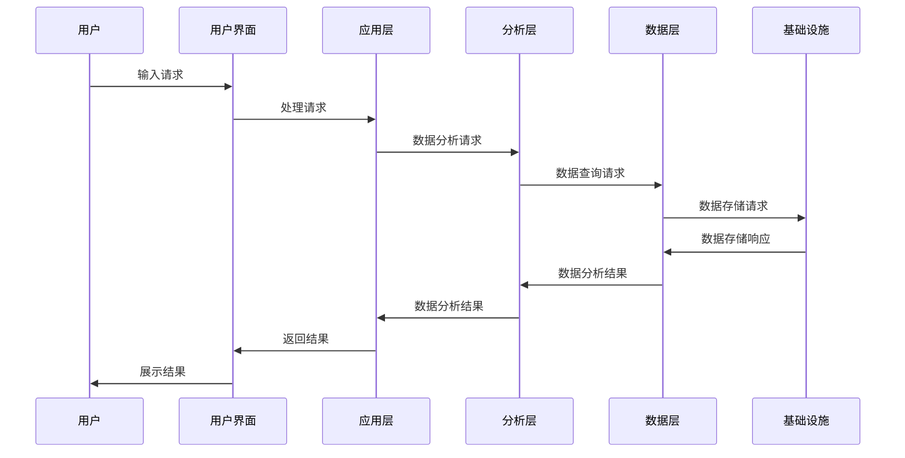
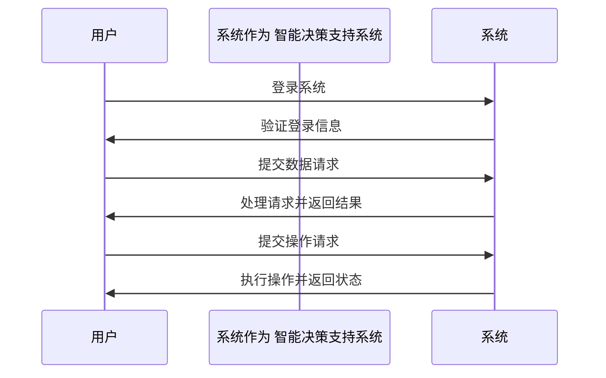

                 

### 第一部分：引言

#### 第1章：构建智能企业决策支持系统概述

##### 1.1 问题背景与解决需求

在当今的商业环境中，企业面临的数据复杂度和数据量都在持续增长。传统的决策支持系统往往依赖于简单的统计方法和有限的业务逻辑，这已经无法满足企业在快速变化的市场环境中的需求。企业需要能够实时分析海量数据，从数据中挖掘出有价值的信息，以便做出更加准确和高效的决策。

**问题背景：**

1. **数据复杂性增加**：随着物联网、社交媒体和电子商务等技术的普及，企业生成和收集的数据类型和数量急剧增加，这些数据往往是非结构化或半结构化的，如文本、图像和视频。
2. **市场变化迅速**：市场环境变化迅速，企业需要快速响应市场变化，做出合理的决策。
3. **竞争压力**：市场竞争激烈，企业需要通过数据驱动的方法来降低运营成本、提高效率，从而获得竞争优势。

**解决需求：**

为了应对上述挑战，企业需要构建一个智能决策支持系统，该系统能够：

1. **高效处理大量数据**：利用大数据技术和分布式计算能力，快速处理海量数据。
2. **深度分析数据**：运用先进的分析技术和算法，对数据进行深度挖掘，提取有价值的信息。
3. **实时响应**：系统能够实时获取数据，进行快速分析，并生成决策建议。
4. **可扩展性**：系统能够根据业务需求的变化进行灵活扩展，适应不同场景的需求。

##### 1.2 智能企业决策支持系统的定义与作用

**定义：**

智能企业决策支持系统（Intelligent Enterprise Decision Support System，IEDSS）是指利用现代信息技术，特别是大数据、人工智能和机器学习技术，对企业的数据资源进行高效处理、深度分析和智能挖掘，从而为企业提供科学、准确的决策支持。

**作用：**

1. **提高决策效率**：通过自动化分析和预测模型，减少人工决策的时间，提高决策效率。
2. **降低决策风险**：通过对历史数据和实时数据的综合分析，帮助企业识别潜在风险，降低决策错误的风险。
3. **优化资源配置**：通过数据分析，帮助企业优化生产、营销和运营等环节的资源配置，提高资源利用效率。
4. **提升竞争力**：通过数据驱动的方式，企业能够更加准确地把握市场趋势和客户需求，从而在激烈的市场竞争中脱颖而出。

##### 1.3 系统边界与外延

**系统边界：**

智能企业决策支持系统的功能范围主要包括以下几个方面：

1. **数据处理**：包括数据收集、数据清洗、数据存储和数据预处理。
2. **数据分析**：包括描述性统计、探索性分析、假设检验和预测分析。
3. **数据可视化**：通过图表和图形将分析结果直观地展示出来。
4. **决策支持**：基于数据分析结果，提供决策建议和预测。

**外延：**

1. **系统集成**：与企业的其他信息系统（如ERP、CRM等）进行集成，实现数据的互联互通。
2. **跨领域应用**：不仅适用于单一业务领域，还可以应用于跨领域的综合分析，如供应链管理、市场营销、财务分析等。
3. **持续优化**：通过持续的数据反馈和模型迭代，不断优化系统性能和决策质量。

##### 1.4 核心概念与联系

**数据分析：**

数据分析是智能企业决策支持系统的核心组成部分，其基本概念包括：

1. **描述性统计分析**：通过统计指标（如均值、中位数、标准差等）来描述数据的基本特征。
2. **探索性数据分析**：通过可视化工具（如图表、散点图、热图等）来探索数据中的模式和关系。
3. **预测分析**：通过建立预测模型（如回归分析、时间序列分析等）来预测未来趋势。

**数据可视化：**

数据可视化是将复杂的数据分析结果以图形化的方式展示出来，使其更加直观易懂。数据可视化包括以下技术：

1. **图表**：如柱状图、折线图、饼图等，用于展示数据的分布和趋势。
2. **交互式可视化**：通过交互式界面，用户可以动态地探索数据，如D3.js、Tableau等。
3. **信息图形**：如信息地图、热力图等，用于展示复杂数据关系。

**机器学习：**

机器学习是数据分析的一个重要分支，其基本概念包括：

1. **监督学习**：通过标记好的数据来训练模型，如回归分析、分类算法。
2. **无监督学习**：通过未标记的数据来发现数据中的模式和关系，如聚类分析、降维技术。
3. **半监督学习**：结合标记数据和未标记数据来训练模型，以提高模型的泛化能力。

这三大核心概念之间紧密联系，共同构成了智能企业决策支持系统的理论基础。数据分析提供了洞察数据的方法，数据可视化使得分析结果更加直观，而机器学习则为系统的自动化和智能化提供了可能。

综上所述，构建智能企业决策支持系统是一项复杂且富有挑战性的任务，但通过系统化的方法和技术，企业可以大大提高决策的科学性和准确性，从而在激烈的市场竞争中立于不败之地。

### 第2章：多维度数据分析方法

在现代商业环境中，数据的多样性和复杂性使得传统的数据分析方法难以应对。为了更好地挖掘数据中的价值，企业需要采用多维度数据分析方法。本章将详细探讨数据收集与预处理、描述性统计分析、探索性数据分析和假设检验与置信区间等关键步骤，帮助读者理解并掌握多维度数据分析的全过程。

#### 2.1 数据收集与预处理

数据收集是数据分析的基础，而预处理则是确保数据质量的重要步骤。以下是一些常见的数据收集和预处理方法：

**数据来源：**

1. **内部数据**：企业内部产生的数据，如销售记录、客户数据、财务报表等。
2. **外部数据**：来自互联网、第三方数据提供商、公共数据库等的数据，如社交媒体数据、行业报告、地理信息数据等。

**数据预处理：**

1. **数据清洗**：去除重复数据、处理缺失值、纠正错误数据，确保数据的准确性和完整性。
   - 缺失值处理：可以通过均值填补、中值填补、插值等方法处理缺失值。
   - 异常值处理：通过箱线图、3σ准则等方法识别并处理异常值。

2. **数据转换**：将数据转换为适合分析的形式，如归一化、标准化、离散化等。
   - 归一化：通过缩放特征值使其落在相同的尺度上，如 Min-Max 标准化。
   - 标准化：通过计算特征值与均值和标准差的距离来转换数据，如 Z-Score 标准化。

3. **数据集成**：将来自不同来源的数据整合到一起，形成统一的数据集。
   - 数据合并：通过合并表连接、合并文件等方法实现数据集成。
   - 数据融合：通过数据清洗、转换和标准化等方法，消除数据中的不一致性。

#### 2.2 描述性统计分析

描述性统计分析是数据分析的第一步，通过基本的统计指标来描述数据集的特征。以下是一些常用的描述性统计指标：

1. **均值（Mean）**：数据集的平均值，用于衡量数据的中心位置。
   - $$ \bar{x} = \frac{\sum_{i=1}^{n} x_i}{n} $$
   - 例如，如果某企业的月销售额为 [1000, 2000, 1500, 1200]，则其均值为：
     $$ \bar{x} = \frac{1000 + 2000 + 1500 + 1200}{4} = 1500 $$

2. **中位数（Median）**：将数据集按大小排序后，位于中间位置的数值，用于衡量数据的中心位置。
   - 如果数据个数为奇数，中位数为排序后的中间值；
   - 如果数据个数为偶数，中位数为排序后中间两个数的平均值。
   - 例如，上述月销售额的中位数为1500。

3. **标准差（Standard Deviation）**：衡量数据分布的离散程度。
   - $$ \sigma = \sqrt{\frac{\sum_{i=1}^{n} (x_i - \bar{x})^2}{n-1}} $$
   - 例如，上述月销售额的标准差可以通过计算得到。

4. **方差（Variance）**：标准差的平方，也是衡量数据分布离散程度的指标。
   - $$ \sigma^2 = \frac{\sum_{i=1}^{n} (x_i - \bar{x})^2}{n-1} $$

**描述性分析：**

描述性分析旨在发现数据中的规律和趋势，包括：

1. **趋势分析**：通过折线图、柱状图等图表展示数据的变化趋势。
2. **相关性分析**：通过计算相关系数（如皮尔逊相关系数、斯皮尔曼相关系数等）来分析变量之间的相关性。

#### 2.3 探索性数据分析

探索性数据分析（EDA）是通过视觉化工具和方法，探索数据中潜在的模式和趋势。以下是一些常用的 EDA 方法：

1. **数据可视化**：
   - **图表**：柱状图、折线图、饼图等，用于展示数据的分布和趋势。
   - **散点图**：用于展示两个变量之间的关系。
   - **热图**：用于展示数据中的密集区域，如热力图可以显示不同区域的销售密度。

2. **特征工程**：
   - **特征选择**：通过选择与目标变量相关性高的特征，提高模型性能。
   - **特征提取**：通过降维技术（如主成分分析、t-SNE等）提取数据中的主要特征。

3. **数据分箱**：将连续变量划分为离散的区间，以便进行后续分析。

**特征工程**：

特征工程是 EDA 中的重要步骤，它包括：

1. **编码**：将分类变量转换为数值型，如通过独热编码（One-Hot Encoding）或标签编码（Label Encoding）。
2. **特征标准化**：如归一化、标准化等，以提高模型训练的效果。
3. **特征组合**：通过组合现有特征，生成新的特征，以提高模型的预测能力。

#### 2.4 假设检验与置信区间

假设检验是数据分析中用于验证假设是否成立的方法，置信区间则是衡量参数估计不确定性的指标。

**假设检验：**

1. **零假设（H0）和备择假设（H1）**：在统计分析中，零假设通常是我们要拒绝的假设，而备择假设则是我们期望成立的假设。
2. **显著性水平（Significance Level）**：通常设定为0.05或0.01，表示我们愿意接受错误决策的概率。
3. **检验统计量**：如 t 统计量、卡方统计量等，用于衡量数据与零假设之间的差异。
4. **p值（p-value）**：通过计算得到的 p 值与显著性水平进行比较，如果 p 值小于显著性水平，则拒绝零假设。

**常见假设检验方法：**

1. **t检验**：用于比较两组数据的均值是否显著不同。
   - **单样本t检验**：检验单个样本的均值是否显著大于或小于某一特定值。
   - **双样本t检验**：比较两个独立样本的均值是否显著不同。

2. **方差分析（ANOVA）**：用于比较多个样本的均值是否显著不同。

**置信区间：**

置信区间是用于估计参数的一个区间，它表示参数的真实值可能落在这个区间内。计算置信区间通常需要以下步骤：

1. **选择置信水平**：如95%的置信水平表示有95%的把握认为参数的真实值落在置信区间内。
2. **计算标准误差（Standard Error）**：标准误差是衡量参数估计不确定性的指标。
3. **计算置信区间**：根据标准误差和样本量，计算置信区间。

- **单正态分布的置信区间**：
  - $$ \bar{x} \pm z_{\alpha/2} \times \frac{\sigma}{\sqrt{n}} $$
  - 其中，$\bar{x}$为样本均值，$\sigma$为总体标准差，$n$为样本量，$z_{\alpha/2}$为标准正态分布的分位数。

- **双样本的置信区间**：
  - $$ \bar{x}_1 - \bar{x}_2 \pm t_{\alpha/2, n_1+n_2-2} \times \sqrt{\frac{s_1^2}{n_1} + \frac{s_2^2}{n_2}} $$

  - 其中，$\bar{x}_1$和$\bar{x}_2$为两组样本的均值，$s_1$和$s_2$为两组样本的标准差，$n_1$和$n_2$为两组样本的样本量，$t_{\alpha/2, n_1+n_2-2}$为t分布的分位数。

通过上述步骤，企业可以有效地进行多维度数据分析，挖掘数据中的价值，为决策提供有力的支持。

### 第3章：智能算法原理与实现

在构建智能企业决策支持系统的过程中，算法的选择与实现是关键的一环。本章将详细介绍机器学习算法的概述、原理以及实现方法，并借助 Python 代码展示常见的机器学习算法，通过具体的数学模型和公式进行详细讲解，帮助读者深入理解智能算法的核心概念和应用。

#### 3.1 机器学习算法概述

机器学习是一种通过数据训练模型，使其能够自主学习和预测的技术。根据训练数据的标注情况，机器学习算法可分为以下几类：

1. **监督学习（Supervised Learning）**：
   - **定义**：在有标签的数据集上进行训练，通过学习输入和输出之间的关系来预测新的数据。
   - **应用场景**：分类和回归问题，如分类算法（逻辑回归、决策树、随机森林等）和回归算法（线性回归、岭回归等）。

2. **无监督学习（Unsupervised Learning）**：
   - **定义**：在无标签的数据集上进行训练，目的是发现数据中的模式和结构。
   - **应用场景**：聚类分析（如K-均值聚类、层次聚类等）、降维技术（如主成分分析、t-SNE等）和关联规则学习（如Apriori算法、FP-Growth等）。

3. **半监督学习（Semi-Supervised Learning）**：
   - **定义**：结合有标签和未标签的数据进行训练，利用未标签数据提高模型的泛化能力。
   - **应用场景**：数据标注成本高、数据标注困难的情况，如图像分类、文本分类等。

4. **强化学习（Reinforcement Learning）**：
   - **定义**：通过与环境的交互来学习策略，以达到最大化累积奖励。
   - **应用场景**：机器人控制、自动驾驶、游戏AI等。

#### 3.2 机器学习算法原理

**监督学习算法**：

监督学习算法主要分为线性模型和树模型两类。以下是两种常见的监督学习算法的原理和数学模型。

1. **线性回归（Linear Regression）**：
   - **原理**：线性回归模型试图找到输入变量和输出变量之间的线性关系。
   - **数学模型**：
     $$ y = \beta_0 + \beta_1 \cdot x + \epsilon $$
     - 其中，$y$为输出变量，$x$为输入变量，$\beta_0$和$\beta_1$分别为模型的参数，$\epsilon$为误差项。

   - **Python代码示例**：
     ```python
     from sklearn.linear_model import LinearRegression
     model = LinearRegression()
     model.fit(X_train, y_train)
     y_pred = model.predict(X_test)
     ```

2. **逻辑回归（Logistic Regression）**：
   - **原理**：逻辑回归是一种广义线性模型，用于处理二分类问题。
   - **数学模型**：
     $$ P(y=1) = \frac{1}{1 + e^{-(\beta_0 + \beta_1 \cdot x)}} $$
     - 其中，$P(y=1)$为输出变量为1的概率，$\beta_0$和$\beta_1$为模型参数。

   - **Python代码示例**：
     ```python
     from sklearn.linear_model import LogisticRegression
     model = LogisticRegression()
     model.fit(X_train, y_train)
     y_pred = model.predict(X_test)
     ```

**无监督学习算法**：

无监督学习算法主要关注数据的内部结构和关系，以下介绍两种常见的无监督学习算法。

1. **K-均值聚类（K-Means Clustering）**：
   - **原理**：K-均值聚类是一种基于距离的聚类方法，将数据分为K个簇，使得每个簇内的数据点尽可能接近，而簇与簇之间的数据点尽可能远离。
   - **数学模型**：
     $$ \text{目标函数} = \sum_{i=1}^{k} \sum_{x \in S_i} ||x - \mu_i||^2 $$
     - 其中，$S_i$为第$i$个簇的数据集，$\mu_i$为第$i$个簇的中心。

   - **Python代码示例**：
     ```python
     from sklearn.cluster import KMeans
     model = KMeans(n_clusters=3)
     model.fit(X)
     labels = model.predict(X)
     ```

2. **主成分分析（Principal Component Analysis，PCA）**：
   - **原理**：PCA是一种降维技术，通过正交变换将高维数据映射到低维空间，同时保留数据的主要特征。
   - **数学模型**：
     $$ z = PC_1 \cdot \lambda_1 + PC_2 \cdot \lambda_2 + ... + PC_d \cdot \lambda_d $$
     - 其中，$PC_i$为第$i$个主成分，$\lambda_i$为主成分对应的特征值。

   - **Python代码示例**：
     ```python
     from sklearn.decomposition import PCA
     model = PCA(n_components=2)
     model.fit(X)
     X_reduced = model.transform(X)
     ```

**模型评估**：

在机器学习中，模型评估是确保模型性能的重要环节。以下是几种常见的模型评估指标：

1. **准确率（Accuracy）**：
   - **定义**：准确率是模型预测正确的样本数占总样本数的比例。
   - **公式**：
     $$ \text{Accuracy} = \frac{TP + TN}{TP + FN + FP + TN} $$
     - 其中，$TP$为真正例，$TN$为真负例，$FP$为假正例，$FN$为假负例。

2. **召回率（Recall）**：
   - **定义**：召回率是模型预测正确的正例数占总正例数的比例。
   - **公式**：
     $$ \text{Recall} = \frac{TP}{TP + FN} $$

3. **精确率（Precision）**：
   - **定义**：精确率是模型预测正确的正例数占总预测正例数的比例。
   - **公式**：
     $$ \text{Precision} = \frac{TP}{TP + FP} $$

4. **F1分数（F1 Score）**：
   - **定义**：F1分数是精确率和召回率的调和平均值，用于综合考虑模型的精确率和召回率。
   - **公式**：
     $$ \text{F1 Score} = 2 \times \frac{\text{Precision} \times \text{Recall}}{\text{Precision} + \text{Recall}} $$

#### 3.3 机器学习实现方法

机器学习实现主要包括数据预处理、模型训练、模型评估和模型优化等步骤。以下以 Python 为例，展示常见的机器学习实现方法。

**数据预处理**：

数据预处理是确保模型性能的重要步骤，主要包括以下内容：

1. **数据清洗**：去除缺失值、异常值和重复值。
2. **特征工程**：进行特征选择、特征提取和特征标准化等操作。
3. **数据分割**：将数据集划分为训练集、验证集和测试集。

**模型训练**：

在模型训练阶段，选择合适的算法和参数，对训练集进行训练。以下是一个使用 Scikit-learn 库训练线性回归模型的示例：

```python
from sklearn.model_selection import train_test_split
from sklearn.linear_model import LinearRegression

# 数据分割
X_train, X_test, y_train, y_test = train_test_split(X, y, test_size=0.2, random_state=42)

# 模型训练
model = LinearRegression()
model.fit(X_train, y_train)

# 模型评估
y_pred = model.predict(X_test)
accuracy = model.score(X_test, y_test)
print(f"Model Accuracy: {accuracy}")
```

**模型评估**：

模型评估是验证模型性能的重要环节，常见的评估指标包括准确率、召回率、精确率和F1分数等。以下是一个使用 Scikit-learn 库评估逻辑回归模型的示例：

```python
from sklearn.metrics import accuracy_score, recall_score, precision_score, f1_score

# 预测结果
y_pred = model.predict(X_test)

# 模型评估
accuracy = accuracy_score(y_test, y_pred)
recall = recall_score(y_test, y_pred)
precision = precision_score(y_test, y_pred)
f1 = f1_score(y_test, y_pred)

print(f"Accuracy: {accuracy}")
print(f"Recall: {recall}")
print(f"Precision: {precision}")
print(f"F1 Score: {f1}")
```

**模型优化**：

模型优化是提高模型性能的重要手段，包括以下几种方法：

1. **参数调优**：通过交叉验证、网格搜索等方法调整模型参数。
2. **特征选择**：选择与目标变量相关性高的特征，提高模型性能。
3. **模型融合**：将多个模型进行融合，提高整体预测性能。

以下是一个使用 Scikit-learn 库进行参数调优的示例：

```python
from sklearn.model_selection import GridSearchCV

# 参数调优
param_grid = {'C': [0.1, 1, 10], 'fit_intercept': [True, False]}
grid_search = GridSearchCV(LogisticRegression(), param_grid, cv=5)
grid_search.fit(X_train, y_train)

# 最佳参数
best_params = grid_search.best_params_
print(f"Best Parameters: {best_params}")

# 最佳模型
best_model = grid_search.best_estimator_
```

通过上述步骤，企业可以有效地利用机器学习技术，构建智能决策支持系统，提高决策的准确性和效率。

### 第4章：数据可视化与报告生成

数据可视化与报告生成是智能企业决策支持系统中不可或缺的一环。通过数据可视化，企业可以将复杂的数据分析结果以直观、易懂的方式展示出来，帮助决策者快速理解数据背后的趋势和规律。同时，通过生成详尽的报告，企业可以系统地记录和分析决策过程中的关键数据和结论，为后续的决策提供有力支持。本章将详细介绍数据可视化技术、数据报告生成以及数据可视化与报告实战。

#### 4.1 数据可视化技术

数据可视化是将数据转换为视觉形式的过程，通过图表、图形等视觉元素，使得数据中的信息和模式更容易被理解和分析。以下是一些常见的数据可视化技术和工具：

1. **图表**：
   - **柱状图（Bar Chart）**：用于比较不同类别的数据。
   - **折线图（Line Chart）**：用于展示数据随时间的变化趋势。
   - **饼图（Pie Chart）**：用于显示各部分占总体的比例。
   - **散点图（Scatter Plot）**：用于展示两个变量之间的关系。
   - **盒形图（Box Plot）**：用于展示数据的分布和异常值。

2. **交互式可视化**：
   - **D3.js**：一种基于Web的交互式数据可视化库，可以实现高度定制化的可视化效果。
   - **Tableau**：一款功能强大的商业智能工具，支持丰富的交互式可视化。
   - **Power BI**：微软推出的商业智能工具，提供直观的数据可视化功能。

3. **信息图形**：
   - **热力图（Heat Map）**：用于显示数据的热点区域。
   - **信息地图（Info Map）**：通过颜色、符号等元素展示地理数据。
   - **流图（Flow Map）**：用于展示数据流和路径。

**数据可视化设计原则**：

1. **易读性**：图表应简洁明了，避免过多的装饰和细节，确保用户能够快速理解数据。
2. **美观性**：图表应具有良好的视觉效果，使用适当的颜色、字体和布局，提高美观度。
3. **有效性**：图表应传达有用的信息和洞察，避免误导用户。

#### 4.2 数据报告生成

数据报告是记录和分析数据结果的重要文档，它可以帮助企业明确数据发现、支持决策制定，并提供决策的依据。以下是一些数据报告生成的基本步骤和内容：

1. **报告模板设计**：
   - **结构化**：报告应分为引言、方法、结果、讨论和结论等部分，确保逻辑清晰。
   - **模块化**：将报告分为不同的模块，如数据源、数据预处理、数据分析、可视化展示等，便于修改和维护。

2. **报告内容编写**：
   - **数据解读**：对数据进行分析，解释数据背后的意义和趋势。
   - **决策建议**：基于数据分析结果，提出具体的决策建议和改进措施。
   - **可视化展示**：使用图表和图形展示数据结果，使其更加直观易懂。

3. **报告格式与工具**：
   - **Excel**：用于制作简单的报告，支持数据导入、图表制作和格式调整。
   - **Word**：用于撰写详细的报告文档，支持文本编辑、排版和插入图表。
   - **专业报表工具**：如Tableau、Power BI等，支持复杂的报表设计和数据交互。

#### 4.3 数据可视化与报告实战

**案例一：销售数据分析报告**

**问题背景**：一家电商企业希望了解其产品销售情况，包括销售额、销售量和客户分布等，以便制定更有效的营销策略。

**步骤**：

1. **数据收集**：收集销售数据，包括产品名称、销售额、销售量和客户信息等。
2. **数据预处理**：清洗数据，去除缺失值和异常值，进行数据转换和整合。
3. **数据分析**：使用描述性统计、探索性数据分析等方法，分析销售数据中的关键指标，如销售额的分布、销售量的趋势和客户的分布等。
4. **数据可视化**：使用柱状图、折线图、饼图等图表展示销售数据，帮助决策者直观理解销售情况。
5. **报告生成**：编写销售数据分析报告，包括数据解读、可视化展示和决策建议。

**案例二：客户满意度调查报告**

**问题背景**：一家服务型企业希望通过调查了解客户的满意度，从而提升服务质量。

**步骤**：

1. **数据收集**：设计并发放客户满意度调查问卷，收集客户反馈数据。
2. **数据预处理**：清洗数据，去除无效和重复的反馈，确保数据的准确性。
3. **数据分析**：通过统计分析和文本分析，分析客户满意度评分的分布、不满意的原因等。
4. **数据可视化**：使用饼图、散点图等图表展示客户满意度调查结果，突出关键问题和趋势。
5. **报告生成**：编写客户满意度调查报告，包括数据分析结果、问题和改进建议，并提出具体的实施计划。

通过以上案例，企业可以深入理解数据可视化与报告生成的方法，将其应用到实际业务中，提升决策的准确性和效率。

### 第5章：系统分析与架构设计

在现代企业中，构建一个高效的智能决策支持系统不仅需要强大的算法和数据支持，还需要一个清晰、灵活且可扩展的系统架构。本章将详细介绍系统分析与架构设计的过程，包括问题场景介绍、系统功能设计、系统架构设计、系统接口设计和系统交互设计，并通过 Mermaid 流程图和架构图来帮助读者更好地理解和实现智能决策支持系统。

#### 5.1 问题场景介绍

为了更好地说明智能决策支持系统的设计和实现，我们设定以下问题场景：

**场景设定**：一家大型零售企业希望在激烈的市场竞争中保持领先地位。该企业希望通过一个智能决策支持系统，实时分析销售数据、客户反馈和供应链信息，从而优化库存管理、提高营销效率和提升客户满意度。

**企业决策支持需求分析**：

1. **库存管理**：实时监控库存水平，预测需求，优化补货策略，减少库存成本。
2. **营销策略**：分析客户购买行为，识别潜在客户，制定精准营销策略。
3. **供应链优化**：优化供应链流程，减少物流成本，提高供应链响应速度。
4. **客户满意度**：分析客户反馈，识别服务问题，提升客户体验和忠诚度。

#### 5.2 系统功能设计

系统功能设计是智能决策支持系统的核心，它决定了系统能够提供哪些功能和服务。以下是该系统的基本功能设计：

1. **数据采集与存储**：从各个业务系统（如ERP、CRM等）中收集数据，并存储在数据仓库中，确保数据的一致性和完整性。
2. **数据处理与清洗**：对收集到的数据进行分析、清洗和预处理，去除重复、缺失和异常数据，确保数据质量。
3. **数据分析与挖掘**：利用统计分析、机器学习和数据挖掘技术，对数据进行深度分析，发现数据中的模式和趋势。
4. **数据可视化与报告**：通过图表、图形和报告，将数据分析结果以直观、易懂的方式展示给决策者。
5. **决策支持**：基于数据分析结果，提供实时的决策建议，辅助企业制定战略和运营决策。
6. **系统集成**：与企业的其他信息系统（如ERP、CRM等）进行集成，实现数据的无缝对接和实时更新。

**领域模型（Mermaid类图）**：

```mermaid
classDiagram
Class01 <|-- Class02
Class03 <.. Class04
Class05 : +hasAttribute1
Class06 : +hasAttribute2
Class07 : -hasMethod1()

Class01 {
  +属性1: int
  +属性2: String
  +方法1(): void
}

Class02 {
  +属性3: float
  +方法2(): String
}

Class03 {
  +属性4: bool
  +方法3(): bool
}

Class04 {
  +属性5: int[]
  +方法4(): void
}

Class05 {
  +属性6: List<String>
  +方法5(): List<String>
}

Class06 {
  +属性7: Map<String, Integer>
  +方法6(): Map<String, Integer>
}

Class07 {
  -属性8: Set<String>
  -方法7(): Set<String>
}
```

#### 5.3 系统架构设计

系统架构设计是确保系统能够稳定、高效地运行的关键。以下是智能决策支持系统的基本架构设计：

1. **数据层**：包括数据采集、数据存储和数据预处理模块，负责数据的收集、存储和处理。
2. **分析层**：包括数据挖掘、机器学习算法和数据可视化模块，负责数据的分析和可视化。
3. **应用层**：包括决策支持、报告生成和用户接口模块，负责为用户提供决策支持和交互界面。
4. **基础设施**：包括服务器、数据库、网络和云计算资源等，提供系统的运行环境和基础设施支持。

**架构设计（Mermaid架构图）**：



#### 5.4 系统接口设计

系统接口设计是确保各个模块之间能够有效通信的关键。以下是智能决策支持系统的基本接口设计：

1. **API接口**：提供RESTful API接口，供外部系统和应用程序调用。
2. **消息队列**：使用消息队列（如RabbitMQ、Kafka等）实现模块之间的异步通信。
3. **数据接口**：提供数据库操作接口，如SQL查询接口、NoSQL查询接口等。

**接口规范（API设计）**：

```json
{
  " endpoint": "/api/analysis",
  " method": "GET",
  " parameters": {
    "date_from": "string",
    "date_to": "string",
    "category": "string"
  },
  " response": {
    "status": "boolean",
    "message": "string",
    "data": {
      "sales": "integer",
      "profit": "float",
      "units_sold": "integer"
    }
  }
}
```

#### 5.5 系统交互设计

系统交互设计是确保用户能够方便、高效地与系统进行交互的关键。以下是智能决策支持系统的基本交互设计：

1. **用户界面**：设计简洁、直观的用户界面，提供实时数据展示和操作功能。
2. **交互流程**：设计清晰、流畅的交互流程，确保用户能够轻松完成操作任务。
3. **反馈机制**：提供实时反馈和错误提示，帮助用户快速发现问题并解决问题。

**交互设计（Mermaid序列图）**：



通过上述系统分析与架构设计，企业可以构建一个高效、灵活且可扩展的智能决策支持系统，为企业的决策提供强有力的支持。

### 第6章：项目实战

在本章中，我们将通过一个实际项目案例，详细展示如何搭建和实现一个智能企业决策支持系统。项目实战包括环境安装与配置、系统核心实现、代码应用解读、实际案例分析和项目小结。通过这一系列步骤，读者将能够深入理解并掌握智能决策支持系统的构建方法。

#### 6.1 环境安装与配置

在开始项目之前，我们需要搭建一个合适的环境，包括安装必要的软件和工具。以下是项目环境的基本配置步骤：

1. **安装Python**：确保Python环境已安装，版本建议为3.8或更高版本。

2. **安装依赖包**：通过pip工具安装必要的依赖包，如pandas、numpy、scikit-learn、matplotlib等。以下是安装命令示例：

   ```bash
   pip install pandas numpy scikit-learn matplotlib
   ```

3. **安装数据库**：选择一个合适的数据库系统，如MySQL或PostgreSQL。根据数据库类型安装相应的客户端和驱动。

4. **安装数据可视化工具**：选择一个数据可视化工具，如Tableau或Power BI，并进行相应的配置。

5. **配置虚拟环境**：为了避免不同项目之间的依赖冲突，建议使用虚拟环境管理工具，如conda或virtualenv。以下是使用conda创建虚拟环境的示例：

   ```bash
   conda create -n myenv python=3.8
   conda activate myenv
   ```

通过以上步骤，我们可以搭建一个适合项目开发的环境，确保所有依赖项都能够正确安装和运行。

#### 6.2 系统核心实现

智能企业决策支持系统的核心实现主要包括数据收集、数据处理、数据分析和数据可视化等模块。以下是各个模块的实现步骤：

1. **数据收集**：
   - 从企业内部系统和外部数据源收集数据，如销售数据、客户反馈和供应链信息。
   - 使用API或数据库连接工具获取数据，并将其存储在本地或云数据库中。

2. **数据处理**：
   - 对收集到的数据进行分析，包括数据清洗、转换和集成。
   - 使用pandas库进行数据预处理，如缺失值处理、异常值处理和数据标准化。

   ```python
   import pandas as pd
   data = pd.read_csv('sales_data.csv')
   data.dropna(inplace=True)
   data['Sales'] = data['Sales'].astype(float)
   ```

3. **数据分析**：
   - 利用机器学习和统计分析方法对数据进行深度分析，如回归分析、聚类分析和预测模型。
   - 使用scikit-learn库实现常见算法，并进行模型训练和评估。

   ```python
   from sklearn.model_selection import train_test_split
   from sklearn.linear_model import LinearRegression

   X = data[['Product', 'Price']]
   y = data['Sales']
   X_train, X_test, y_train, y_test = train_test_split(X, y, test_size=0.2, random_state=42)
   model = LinearRegression()
   model.fit(X_train, y_train)
   ```

4. **数据可视化**：
   - 使用matplotlib和seaborn库生成数据可视化图表，如折线图、柱状图和散点图。
   - 将分析结果以图表形式展示，以便决策者直观理解数据。

   ```python
   import matplotlib.pyplot as plt
   import seaborn as sns

   sns.scatterplot(x='Price', y='Sales', data=data)
   plt.xlabel('Price')
   plt.ylabel('Sales')
   plt.title('Product Price vs Sales')
   plt.show()
   ```

#### 6.3 代码应用解读

在实现系统核心功能时，以下是一些关键代码的解释和应用：

1. **数据预处理**：
   - 数据清洗：通过pandas库处理缺失值和异常值，确保数据质量。

     ```python
     data.dropna(inplace=True)
     data = data[data['Sales'] > 0]
     ```

   - 数据转换：将分类数据转换为数值数据，如使用独热编码（One-Hot Encoding）。

     ```python
     data = pd.get_dummies(data, columns=['Product'])
     ```

2. **机器学习算法**：
   - 回归分析：使用scikit-learn库实现线性回归模型，预测销售额。

     ```python
     from sklearn.linear_model import LinearRegression
     model = LinearRegression()
     model.fit(X_train, y_train)
     ```

   - 预测模型：通过交叉验证和网格搜索优化模型参数。

     ```python
     from sklearn.model_selection import GridSearchCV
     param_grid = {'alpha': [0.0001, 0.001, 0.01]}
     grid_search = GridSearchCV(Ridge(), param_grid, cv=5)
     grid_search.fit(X_train, y_train)
     best_model = grid_search.best_estimator_
     ```

3. **数据可视化**：
   - 生成图表：使用matplotlib和seaborn库生成数据可视化图表。

     ```python
     sns.lineplot(x='Date', y='Sales', data=data)
     plt.xlabel('Date')
     plt.ylabel('Sales')
     plt.title('Sales Trend Over Time')
     plt.show()
     ```

#### 6.4 实际案例分析与讲解

为了更好地展示系统在实际业务中的应用，我们以下提供一个实际案例：

**案例背景**：一家电商企业希望了解其不同产品在不同时间段内的销售额和趋势，以便调整营销策略和库存管理。

**步骤**：

1. **数据收集**：从企业数据库中收集销售数据，包括产品名称、销售额、销售日期等。

2. **数据预处理**：对销售数据进行清洗和预处理，如去除缺失值和异常值。

3. **数据分析**：
   - 使用pandas库对销售数据进行分析，计算不同产品的平均销售额和销售量。
   - 利用matplotlib库生成时间序列图表，展示销售额和销售量的趋势。

   ```python
   data = pd.read_csv('sales_data.csv')
   data.dropna(inplace=True)
   avg_sales = data.groupby('Product')['Sales'].mean()
   avg_sales.plot(kind='bar')
   plt.xlabel('Product')
   plt.ylabel('Average Sales')
   plt.title('Average Sales by Product')
   plt.show()
   ```

4. **数据可视化**：
   - 生成时间序列图表，展示不同时间段内的销售额和销售量。

   ```python
   data['Date'] = pd.to_datetime(data['Date'])
   data.set_index('Date', inplace=True)
   data['Sales'].plot()
   plt.xlabel('Date')
   plt.ylabel('Sales')
   plt.title('Sales Trend Over Time')
   plt.show()
   ```

通过上述案例，企业可以直观地了解其销售数据的分布和趋势，从而制定更加精准的营销策略和库存管理计划。

#### 6.5 项目小结

在本章的项目实战中，我们通过详细的环境配置、系统核心实现、代码应用解读、实际案例分析和项目小结，逐步展示了如何搭建一个智能企业决策支持系统。以下是项目的主要收获和经验总结：

1. **环境配置**：合理的环境配置是项目成功的基础，确保所有依赖项能够正确安装和运行。

2. **数据预处理**：数据预处理是保证数据质量的关键步骤，通过清洗、转换和集成，确保数据的一致性和完整性。

3. **数据分析**：利用机器学习和统计分析方法，对数据进行深度分析，提取有价值的信息，为企业决策提供支持。

4. **数据可视化**：通过生成直观的数据可视化图表，使得分析结果更加易懂，帮助决策者快速理解数据背后的趋势和规律。

5. **实际案例**：通过实际案例的讲解，展示了智能决策支持系统在企业中的应用场景和效果，为读者提供了实用的经验和参考。

6. **项目总结**：项目实战不仅使读者掌握了智能决策支持系统的构建方法，还提高了读者的实践能力和解决问题的能力。

在后续的工作中，企业可以继续优化和改进系统，通过不断的数据反馈和模型迭代，提升决策支持和预测的准确性，从而在激烈的市场竞争中保持领先地位。

### 第7章：最佳实践与拓展

在构建智能企业决策支持系统的过程中，遵循最佳实践和注意事项能够有效提升系统的性能和可靠性。以下是一些关键的最佳实践建议、注意事项以及拓展阅读资源，帮助读者深入了解和优化智能决策支持系统。

#### 7.1 最佳实践建议

1. **数据质量管理**：确保数据质量是系统成功的关键。定期检查和清洗数据，处理缺失值、异常值和重复值，保证数据的一致性和完整性。

2. **模型优化**：通过交叉验证、网格搜索和贝叶斯优化等方法，对机器学习模型进行调优，提高模型的预测准确性和泛化能力。

3. **实时数据更新**：确保系统能够实时获取和处理数据，通过消息队列和分布式计算等技术，提高数据处理的速度和效率。

4. **安全性**：保护数据安全和隐私，采用加密技术和访问控制策略，防止数据泄露和未授权访问。

5. **用户参与**：在系统设计和实现过程中，充分考虑用户的需求和反馈，通过用户测试和迭代优化，提高系统的实用性和用户体验。

#### 7.2 注意事项

1. **数据源选择**：确保数据源的可靠性和多样性，避免依赖单一数据源，从而提高数据分析的全面性和准确性。

2. **数据隐私**：在进行数据分析时，注意保护用户隐私，避免泄露敏感信息，遵循相关法律法规和数据保护标准。

3. **性能优化**：定期对系统进行性能监控和优化，通过缓存技术、索引优化和分布式计算等方法，提高系统的响应速度和处理能力。

4. **可扩展性**：在设计系统架构时，考虑未来的扩展需求，确保系统能够灵活地适应业务规模的变化和新的功能需求。

5. **持续迭代**：持续收集用户反馈和业务数据，对系统进行迭代优化，不断改进系统性能和用户体验。

#### 7.3 拓展阅读

为了进一步深入学习智能企业决策支持系统的构建方法和技术，以下推荐一些优质的书籍和在线资源：

1. **书籍推荐**：
   - 《大数据时代：生活、工作与思维的大变革》
   - 《深度学习》
   - 《数据挖掘：实用工具和技术》
   - 《Python数据分析》
   - 《机器学习实战》

2. **在线课程**：
   - Coursera上的《机器学习》课程
   - Udacity的《数据工程师纳米学位》
   - edX上的《数据科学》课程

3. **技术博客和论坛**：
   - Medium上的数据分析博客
   - Towards Data Science（TDS）社区
   - Stack Overflow论坛

通过以上最佳实践、注意事项和拓展阅读资源，读者可以进一步提升对智能企业决策支持系统的理解和应用能力，为企业的智能化转型提供强有力的支持。

### 总结

本书全面介绍了构建智能企业决策支持系统的过程，从多维度数据分析、智能算法原理，到系统分析与项目实战，帮助读者深入理解并掌握企业决策支持系统的构建方法。通过案例分析和实战指导，读者可以快速将理论知识应用于实际工作中，提升企业的决策效率和竞争力。

构建智能企业决策支持系统是一项复杂且充满挑战的任务，但通过系统化的学习与实践，读者将能够逐步掌握核心技能，为企业的发展贡献智慧。本书旨在为读者提供一本实用、系统的学习指南，助力企业实现智能化转型。

在阅读本书的过程中，读者应注重理论与实践的结合，积极动手实践，通过解决实际问题来提升自己的技能。同时，读者还可以通过拓展阅读和参加相关课程与活动，进一步深化对智能企业决策支持系统的理解。

最后，感谢读者对本书的关注与支持。我们希望本书能够对您的学习和工作带来帮助，助力您在构建智能企业决策支持系统的道路上取得更大的成就。

### 作者信息

作者：AI天才研究院/AI Genius Institute & 禅与计算机程序设计艺术 /Zen And The Art of Computer Programming

