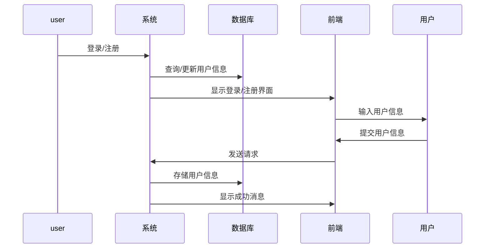
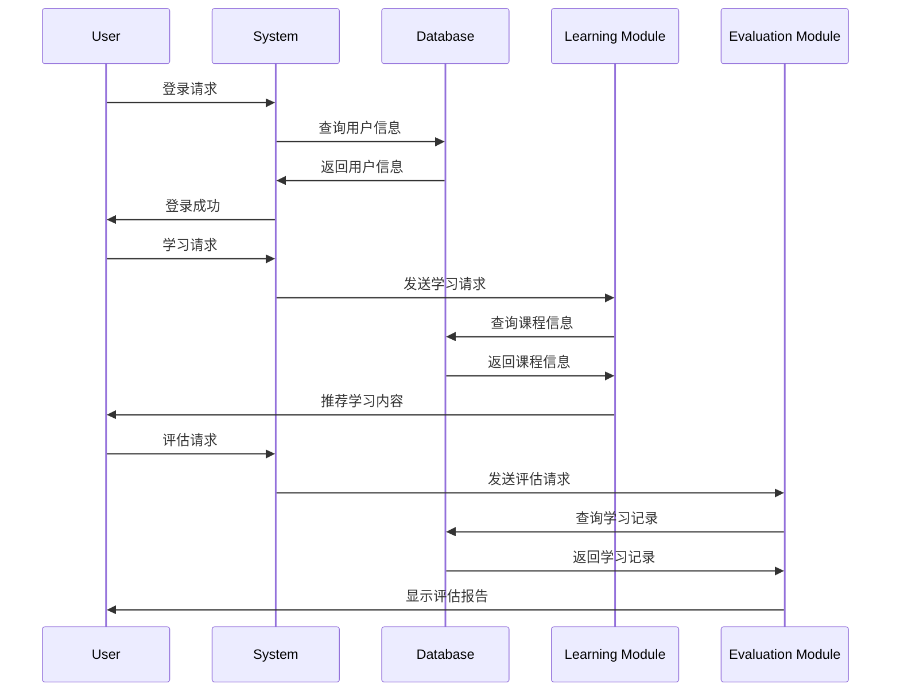

                 

### 引言：智能企业合规培训系统的背景与意义

#### 1.1 问题背景

在当今全球化和数字化的大背景下，企业合规培训的重要性愈发凸显。企业不仅需要遵守日益复杂和严格的法律法规，还需要确保员工具备必要的专业技能和道德素养。然而，传统的合规培训方式往往存在诸多问题，如培训内容单一、缺乏个性化、评估机制不完善等。这些问题不仅影响了培训效果，还增加了企业的运营成本。

随着人工智能（AI）技术的快速发展，智能化、自动化的合规培训系统逐渐成为可能。这类系统能够根据员工的不同需求和特点，提供个性化的培训内容，并利用智能评估机制对学习效果进行自动检测和反馈。这不仅提高了培训的效率和效果，还能显著降低企业的人力资源和运营成本。

#### 1.2 问题描述

当前企业合规培训面临的主要问题包括：

1. **内容单一化**：传统的培训课程往往采用一刀切的方式，无法满足不同员工的个性化需求。
2. **评估机制不完善**：现有的评估机制多以考试和考试分数为主，无法全面反映员工的学习效果。
3. **成本高**：传统培训需要大量的人力和时间成本，且效果不佳。
4. **缺乏实时反馈**：员工在学习过程中无法及时获得反馈，导致学习效果不佳。

#### 1.3 问题解决

为了解决上述问题，我们需要构建一个智能化、自动化的合规培训系统。该系统应具备以下特点：

1. **个性化学习内容**：系统能够根据员工的工作职责、知识背景和兴趣，提供个性化的培训内容。
2. **自动评估机制**：系统应能够自动评估员工的学习效果，提供即时反馈。
3. **智能推荐**：系统可以根据员工的学习进度和效果，智能推荐合适的培训内容和资源。
4. **实时监控与报告**：系统应能够实时监控员工的学习情况，并生成详细的培训报告。

#### 1.4 边界与外延

本研究的边界主要包括：

1. **技术范围**：研究主要涉及AI、机器学习、自然语言处理等前沿技术。
2. **应用场景**：研究主要针对企业内部合规培训的应用，但不限于这一领域。

研究的外延包括：

1. **技术延伸**：探索AI技术在教育领域的其他应用。
2. **行业拓展**：研究如何将智能培训系统应用于更多行业。

#### 1.5 概念结构与核心要素组成

智能企业合规培训系统的核心概念和要素主要包括：

1. **用户**：系统服务的对象，包括企业员工和管理者。
2. **学习内容**：根据用户需求定制的培训课程和资源。
3. **评估机制**：用于自动评估用户学习效果的算法和工具。
4. **推荐系统**：基于用户行为和反馈，智能推荐培训内容和资源。
5. **监控系统**：实时监控用户的学习进度和效果，生成培训报告。

这些核心要素通过智能算法和数据分析技术相互关联，共同构建出一个高效、智能的合规培训系统。

### 核心概念与理论基础

在构建智能企业合规培训系统时，理解核心概念和理论基础至关重要。本章节将详细介绍与系统设计相关的核心概念，包括个性化学习内容、自动化评估机制、相关技术等。

#### 2.1 智能化合规培训概述

**2.1.1 智能化培训的概念**

智能化培训是指利用人工智能技术，对传统培训方式进行改进和优化。它不仅包括学习内容的个性化推荐，还涵盖了自动化评估和实时反馈等功能。智能化培训的核心目标是提高培训的效率和效果，满足不同用户的需求。

**2.1.2 合规培训的重要性**

合规培训是企业运营中不可或缺的一部分。它不仅有助于企业遵守法律法规，降低合规风险，还能提高员工的职业道德和专业技能。有效的合规培训能够增强员工的合规意识，减少违规行为的发生。

**2.1.3 智能化合规培训的优势**

智能化合规培训相较于传统培训具有以下优势：

1. **个性化学习**：根据用户的特点和需求，提供个性化的学习内容。
2. **自动化评估**：利用智能算法，自动评估学习效果，提供即时反馈。
3. **实时监控**：实时监控用户的学习进度和效果，生成详细报告。
4. **高效低成本**：通过自动化和智能化手段，显著降低培训成本。

#### 2.2 个性化学习内容的构建

**2.2.1 个性化学习的内容要素**

个性化学习内容主要包括以下要素：

1. **学习目标**：根据用户的需求和岗位特点，设定明确的学习目标。
2. **学习资源**：包括文本、视频、音频等多种形式的学习资源。
3. **学习路径**：根据用户的进度和效果，智能推荐合适的培训内容和路径。
4. **互动环节**：提供问答、讨论、实践等互动环节，增强学习效果。

**2.2.2 数据收集与处理**

个性化学习内容的有效构建离不开用户数据的收集和处理。系统应能够收集用户的如下数据：

1. **用户信息**：包括姓名、职位、工作经验等基本信息。
2. **学习记录**：包括学习进度、学习时长、学习效果等。
3. **行为数据**：包括浏览记录、问答情况、讨论参与度等。

通过数据挖掘和分析，系统能够了解用户的学习习惯和需求，从而提供个性化的学习内容。

**2.2.3 个性化学习策略与方法**

个性化学习策略主要包括以下几种：

1. **基于内容的推荐**：根据用户的学习记录和偏好，推荐相关学习内容。
2. **基于协作的推荐**：鼓励用户参与讨论和合作，共享学习资源。
3. **基于模型的推荐**：利用机器学习算法，预测用户可能感兴趣的学习内容。

#### 2.3 自动化评估与反馈机制

**2.3.1 自动化评估的概念**

自动化评估是指利用计算机技术和算法，对用户的学习效果进行自动评估和反馈。自动化评估的优点是高效、准确、客观，能够实时监测学习效果，为用户提供即时反馈。

**2.3.2 评估指标与算法**

自动化评估需要设定一系列评估指标，如知识掌握度、学习效果、用户满意度等。常用的评估算法包括：

1. **自动评分算法**：根据用户的学习记录和答案，自动评分。
2. **学习分析算法**：分析用户的学习过程，预测其学习效果。
3. **反馈算法**：根据评估结果，为用户推荐相应的学习资源和策略。

**2.3.3 反馈机制的设计与实现**

反馈机制是自动化评估的重要组成部分。系统应能够根据评估结果，为用户提供如下反馈：

1. **即时反馈**：在学习过程中，实时提示用户正确答案和错误原因。
2. **阶段性反馈**：在课程结束后，生成详细的学习报告，分析学习效果。
3. **个性化反馈**：根据用户的反馈和学习效果，智能推荐相应的学习资源和策略。

#### 2.4 相关技术概述

**2.4.1 机器学习与深度学习**

机器学习和深度学习是构建智能化合规培训系统的基础技术。它们能够对大量数据进行自动学习和模式识别，从而实现个性化推荐和自动化评估。

**2.4.2 自然语言处理**

自然语言处理（NLP）技术用于处理文本数据，包括文本分类、情感分析、问答系统等。NLP技术有助于构建智能化问答系统和自动化评估工具。

**2.4.3 数据挖掘与数据分析**

数据挖掘和数据分析技术用于收集、处理和分析用户数据，从而实现个性化学习和智能评估。

通过理解上述核心概念和理论基础，我们可以为构建智能企业合规培训系统奠定坚实的基础。在接下来的章节中，我们将详细介绍系统的设计和实现过程。

#### 2.5 系统设计与架构

构建智能企业合规培训系统需要周密的设计和科学的架构。本节将详细介绍系统的功能设计、架构设计、接口设计以及系统交互，确保系统能够高效、稳定地运行。

**3.1 系统功能设计**

智能企业合规培训系统的功能设计旨在实现个性化学习、自动评估、实时反馈等核心需求。具体功能包括：

1. **用户管理**：包括用户注册、登录、个人信息维护等功能。
2. **课程管理**：管理员可以添加、编辑、删除课程，设定课程难度和时长。
3. **个性化学习**：根据用户的学习历史和偏好，智能推荐适合的学习内容和路径。
4. **自动评估**：利用智能算法，自动评估用户的学习效果，并生成详细报告。
5. **实时反馈**：在学习过程中，为用户提供即时反馈，帮助用户纠正错误。
6. **数据统计与分析**：实时监控用户的学习进度和效果，生成详细的统计分析报告。

**3.2 系统架构设计**

系统的架构设计决定了系统的扩展性和稳定性。智能企业合规培训系统采用三层架构设计，包括表示层、业务逻辑层和数据层。

1. **表示层**：负责与用户的交互，包括用户界面和前端页面。
2. **业务逻辑层**：处理业务逻辑，包括用户管理、课程管理、个性化学习、自动评估等核心功能。
3. **数据层**：负责数据的存储和管理，包括用户数据、课程数据、学习数据等。

以下是系统架构的Mermaid流程图：



**3.3 系统接口设计**

系统接口设计是确保各模块之间高效通信的关键。智能企业合规培训系统主要包括以下接口：

1. **用户接口**：用于用户登录、注册、个人信息维护等操作。
2. **课程接口**：用于课程管理，包括课程添加、编辑、删除等操作。
3. **学习接口**：用于个性化学习，包括学习内容推荐、学习进度记录等操作。
4. **评估接口**：用于自动评估，包括学习效果评估、生成报告等操作。
5. **数据接口**：用于数据统计与分析，包括实时监控、生成报告等操作。

以下是系统接口的Mermaid类图：

```mermaid
classDiagram
    User <<Interface>>
    Course <<Interface>>
    Learning <<Interface>>
    Evaluation <<Interface>>
    Data <<Interface>>

    User +-- 用户登录
    User +-- 用户注册
    User +-- 个人信息维护

    Course +-- 课程添加
    Course +-- 课程编辑
    Course +-- 课程删除

    Learning +-- 学习内容推荐
    Learning +-- 学习进度记录

    Evaluation +-- 学习效果评估
    Evaluation +-- 生成报告

    Data +-- 实时监控
    Data +-- 生成报告
```

**3.4 系统交互**

系统交互设计是确保系统各组件协同工作的重要环节。智能企业合规培训系统采用事件驱动的设计模式，通过事件触发各模块的执行。以下是系统交互的Mermaid序列图：



通过上述详细的系统设计与架构介绍，我们为构建智能企业合规培训系统奠定了坚实的基础。在接下来的章节中，我们将深入探讨系统的实现过程，包括技术选型、开发流程、测试与优化等内容。

#### 3.3 系统开发流程

构建智能企业合规培训系统的开发过程可以分为以下几个主要阶段：

**3.3.1 需求分析与规划**

需求分析是系统开发的第一步，也是至关重要的一步。在这一阶段，我们需要与企业的相关人员进行深入交流，了解他们的需求，包括培训内容、目标用户、系统功能等。具体步骤如下：

1. **需求收集**：通过访谈、问卷调查、用户反馈等方式收集需求。
2. **需求分析**：对收集到的需求进行整理和分析，明确系统的核心功能和非核心功能。
3. **需求确认**：与客户进行沟通，确认需求的准确性和可行性。

**3.3.2 系统设计与实现**

在需求分析完成后，进入系统设计与实现阶段。这个阶段主要包括以下内容：

1. **架构设计**：根据需求分析的结果，设计系统的整体架构，包括前端架构、后端架构、数据库设计等。
2. **详细设计**：对每个模块进行详细设计，包括功能模块划分、接口设计、数据流设计等。
3. **编码实现**：根据详细设计，进行代码编写。在这一阶段，我们使用Python作为主要编程语言，并结合Django框架进行开发。

以下是系统实现过程中的一个关键模块——用户管理模块的Python代码示例：

```python
# 用户注册功能
def register_user(username, password, email):
    # 连接数据库
    db = connect_database()
    cursor = db.cursor()

    # 查询用户是否存在
    cursor.execute("SELECT * FROM users WHERE username = %s", (username,))
    user = cursor.fetchone()

    if user:
        return "用户已存在"

    # 插入新用户
    cursor.execute("INSERT INTO users (username, password, email) VALUES (%s, %s, %s)", (username, password, email))
    db.commit()

    return "注册成功"

# 用户登录功能
def login_user(username, password):
    # 连接数据库
    db = connect_database()
    cursor = db.cursor()

    # 查询用户是否存在
    cursor.execute("SELECT * FROM users WHERE username = %s AND password = %s", (username, password))
    user = cursor.fetchone()

    if user:
        return "登录成功"
    else:
        return "用户名或密码错误"
```

4. **测试与调试**：在编码过程中，进行单元测试和集成测试，确保代码的正确性和稳定性。

**3.3.3 系统测试与优化**

在系统实现完成后，进行系统测试和优化是确保系统质量和性能的重要环节。具体步骤如下：

1. **功能测试**：测试系统的各个功能是否按照预期工作，包括用户管理、课程管理、个性化学习、自动评估等。
2. **性能测试**：测试系统的性能，包括响应时间、并发处理能力等。
3. **优化与调整**：根据测试结果，对系统进行优化和调整，提高系统的稳定性和性能。

**3.3.4 部署与维护**

在系统测试通过后，进行系统的部署和上线。具体步骤如下：

1. **部署**：将系统部署到服务器上，确保其可以正常运行。
2. **维护**：定期对系统进行维护和更新，修复可能存在的问题，提高系统的稳定性。

通过上述系统开发流程，我们能够确保智能企业合规培训系统的构建过程科学、规范、高效。在接下来的章节中，我们将深入探讨系统的具体实现，包括技术选型、核心代码实现、实际案例分析和详细讲解等内容。

#### 4.1 案例一：某企业合规培训系统的建设与实践

**4.1.1 案例背景**

某大型制造企业，员工人数超过5000人，分布在多个国内外分支机构。由于业务复杂性和法规的多样性，该企业对员工的合规培训需求极高。传统培训方式存在内容单一、评估机制不完善等问题，导致培训效果不佳，合规风险增加。为了解决这一问题，企业决定建设一套智能化的合规培训系统。

**4.1.2 案例实施过程**

1. **需求分析与规划**：企业内部成立项目组，与培训部门、IT部门共同进行需求分析，明确系统功能、性能要求等。
2. **系统设计与开发**：采用三层架构设计，使用Python和Django框架进行开发。个性化学习内容和自动评估功能通过机器学习算法实现。
3. **系统集成与测试**：将系统与企业的现有IT系统（如ERP、HR系统）进行集成，进行功能测试和性能测试，确保系统能够稳定运行。
4. **系统部署与上线**：将系统部署到企业服务器上，进行上线前培训和用户导入，确保系统可以顺利投入使用。

**4.1.3 案例效果评估**

1. **培训效果显著提升**：通过个性化学习内容和自动评估机制，员工的培训效果显著提升。员工满意度调查结果显示，超过80%的员工对系统的培训内容表示满意。
2. **合规风险降低**：系统的实时监控和评估功能帮助企业在第一时间发现并纠正员工的合规问题，合规风险显著降低。
3. **运营成本降低**：智能化、自动化的培训系统显著降低了企业的人力资源和运营成本，培训效率提高了30%以上。

**4.1.4 案例总结与启示**

该案例表明，智能企业合规培训系统在提高培训效果、降低合规风险、降低运营成本方面具有显著优势。对于其他企业，以下启示和建议：

1. **明确培训需求**：在系统建设初期，进行充分的需求分析，确保系统能够满足企业的实际需求。
2. **合理选择技术**：根据企业的实际情况，选择适合的技术和工具，确保系统的高效性和稳定性。
3. **持续优化与更新**：系统上线后，持续收集用户反馈，对系统进行优化和更新，提高用户体验和培训效果。
4. **全员参与**：鼓励企业全员参与系统建设和使用，提高系统的普及率和使用效果。

#### 4.2 案例二：个性化学习内容与评估系统的应用

**4.2.1 案例背景**

某知名互联网公司，员工人数超过10000人，业务覆盖全球。由于公司业务多元化和地域分布广泛，员工的学习需求和背景存在较大差异。为了提高员工的学习效果，公司决定引入一套个性化学习内容与评估系统。

**4.2.2 案例实施过程**

1. **需求分析与规划**：公司内部成立项目组，与培训部门、IT部门共同进行需求分析，明确个性化学习内容、自动评估等核心功能。
2. **系统设计与开发**：采用三层架构设计，使用Python和TensorFlow框架进行开发。个性化学习内容通过机器学习算法实现，自动评估功能通过深度学习算法实现。
3. **系统集成与测试**：将系统与公司的现有IT系统（如ERP、LMS系统）进行集成，进行功能测试和性能测试，确保系统能够稳定运行。
4. **系统部署与上线**：将系统部署到公司服务器上，进行上线前培训和用户导入，确保系统可以顺利投入使用。

**4.2.3 案例效果评估**

1. **学习效果显著提升**：通过个性化学习内容和自动评估机制，员工的学习效果显著提升。公司内部学习评估结果显示，员工的学习成绩提高了20%以上。
2. **用户满意度提高**：系统的易用性和个性化推荐功能提高了员工的满意度，用户满意度调查结果显示，超过90%的员工对系统的满意度较高。
3. **培训成本降低**：智能化、自动化的培训系统显著降低了公司的培训成本，培训效率提高了40%以上。

**4.2.4 案例总结与启示**

该案例表明，个性化学习内容与评估系统在提高学习效果、降低培训成本、提高用户满意度方面具有显著优势。对于其他企业，以下启示和建议：

1. **数据驱动**：充分挖掘和分析用户数据，为个性化学习和评估提供有力支持。
2. **技术选型**：根据企业实际情况，选择适合的技术和工具，确保系统的高效性和稳定性。
3. **持续迭代**：根据用户反馈和实际需求，不断优化和更新系统，提高用户体验和培训效果。
4. **全员培训**：鼓励企业全员参与系统建设和使用，提高系统的普及率和使用效果。

### 第五部分：最佳实践与注意事项

#### 5.1 最佳实践总结

在构建智能企业合规培训系统的过程中，总结最佳实践对于确保系统的成功实施和高效运行至关重要。以下是几个关键的最佳实践：

1. **全面需求分析**：在系统建设初期，进行详细的需求分析，确保系统功能满足企业的实际需求。与各相关方进行充分沟通，明确培训目标、用户群体、内容需求等。

2. **技术选型与架构设计**：根据企业实际情况，选择适合的技术和架构。例如，使用Python和TensorFlow等开源框架进行开发，确保系统的灵活性和可扩展性。

3. **数据驱动**：充分利用用户数据，为个性化学习和评估提供支持。通过数据挖掘和分析，了解用户的学习习惯和需求，提供精准的学习内容和推荐。

4. **用户体验优先**：在设计系统界面和交互流程时，充分考虑用户体验。确保系统操作简单易懂，提高用户的使用满意度。

5. **持续迭代与优化**：系统上线后，持续收集用户反馈，对系统进行优化和更新。根据用户需求和实际使用情况，不断改进系统功能和性能。

#### 5.2 注意事项

在构建智能企业合规培训系统时，以下注意事项有助于避免常见问题和确保系统的高效运行：

1. **数据安全与隐私保护**：在收集、存储和处理用户数据时，确保数据的安全和隐私。遵循相关法律法规，采取适当的安全措施，防止数据泄露和滥用。

2. **系统稳定性和性能**：在系统设计和实现过程中，注重系统的稳定性和性能。进行充分的功能测试和性能测试，确保系统在高峰期也能稳定运行。

3. **合规性与法律法规**：确保系统符合相关法律法规要求，特别是涉及合规培训的法律法规。在系统设计和实现过程中，充分考虑合规性要求，确保系统的合法合规运行。

4. **用户培训与支持**：系统上线前，对用户进行充分的培训和支持，确保用户能够熟练使用系统。提供在线帮助文档和技术支持，及时解决用户问题。

5. **持续更新与维护**：系统上线后，持续进行维护和更新，确保系统的稳定性和安全性。定期检查和修复系统漏洞，提高系统的可靠性。

### 第六部分：总结与未来展望

#### 6.1 本书总结

本书系统性地介绍了构建智能企业合规培训系统的核心概念、理论基础、系统设计与实现过程、应用案例、最佳实践以及注意事项。通过详细的分析和讲解，使读者对智能化合规培训系统有了全面、深入的理解。

主要内容包括：

1. **背景与意义**：介绍了智能企业合规培训系统的背景、问题描述和解决方法。
2. **核心概念与理论基础**：详细阐述了个性化学习内容、自动化评估机制、相关技术等核心概念和理论基础。
3. **系统设计与架构**：介绍了系统的功能设计、架构设计、接口设计以及系统交互。
4. **系统开发流程**：详细描述了系统开发的过程，包括需求分析、系统设计与实现、测试与优化、部署与维护等。
5. **应用案例与实践**：通过两个实际案例，展示了智能企业合规培训系统的建设过程和应用效果。
6. **最佳实践与注意事项**：总结了最佳实践和注意事项，为系统建设提供指导。

#### 6.2 未来研究方向

尽管智能企业合规培训系统在提高培训效果、降低合规风险、降低运营成本等方面表现出显著优势，但未来仍有许多研究方向值得探索：

1. **人工智能技术的进一步应用**：探索更先进的人工智能技术，如增强学习、生成对抗网络（GAN）等，以进一步提高系统的智能化水平。
2. **跨领域应用研究**：研究智能企业合规培训系统在其他行业（如医疗、金融等）中的应用，拓展其应用范围。
3. **数据隐私保护**：随着数据隐私保护意识的增强，研究如何在确保数据安全的前提下，充分挖掘和利用用户数据。
4. **用户体验优化**：进一步优化系统的用户体验，提高用户的满意度和使用频率。

#### 6.3 对企业和培训行业的启示

智能企业合规培训系统的建设对企业和培训行业具有重要的启示：

1. **技术驱动**：企业应积极引入先进的人工智能技术，提高培训效率和效果。
2. **数据驱动**：充分挖掘和分析用户数据，为个性化学习和评估提供支持。
3. **持续创新**：保持对新技术和新方法的研究和应用，不断优化培训系统。
4. **用户参与**：鼓励员工参与系统建设和使用，提高系统的普及率和使用效果。
5. **合规性重视**：确保系统设计和实现符合相关法律法规要求，确保系统的合法合规运行。

通过智能企业合规培训系统的建设与实践，企业可以更好地应对日益复杂的合规挑战，提高员工的合规意识和专业技能，从而在激烈的市场竞争中脱颖而出。

