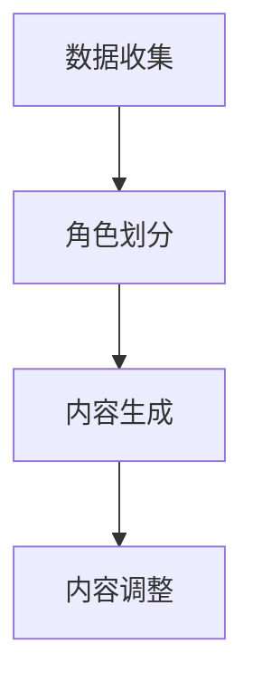
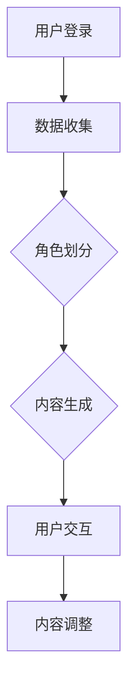
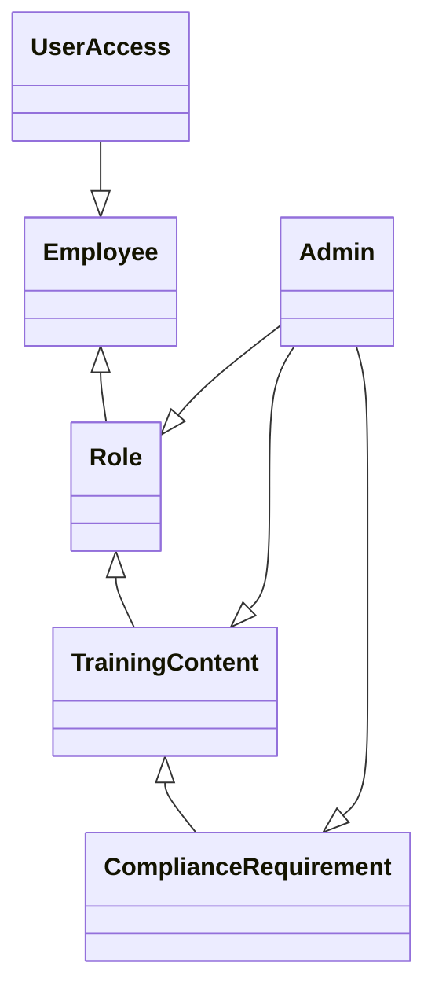
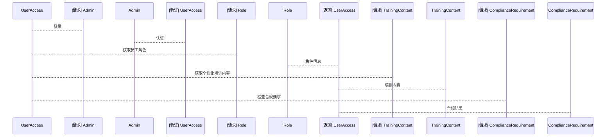
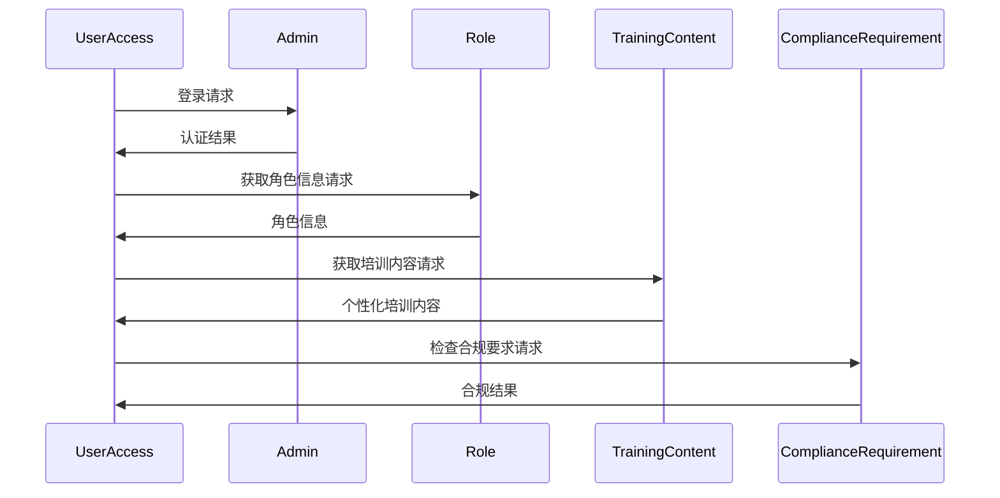

                 

### 文章标题

#### 构建智能企业合规培训系统：基于角色的个性化学习内容生成

##### 关键词：智能企业、合规培训、角色化、个性化学习内容、内容生成

> 摘要：本文将探讨如何构建一个智能企业合规培训系统，重点在于利用角色化方法实现个性化学习内容生成。通过深入分析合规培训的需求、技术手段和系统设计，本文旨在为读者提供一条清晰的建设路径，帮助企业在不断变化的法律和监管环境中保持合规。

---

### 引言

智能企业在当今数字化浪潮中扮演着越来越重要的角色。随着人工智能、大数据和物联网等新兴技术的迅猛发展，企业内部的合规性问题也愈发复杂。合规培训作为确保企业运营合法性的重要手段，其有效性直接影响到企业的长期发展和市场竞争力。然而，传统的合规培训模式往往难以满足个性化学习需求，特别是在角色各异的企业员工群体中。

本文旨在通过角色化方法，探索并构建一个智能企业合规培训系统，实现个性化学习内容的生成。该系统不仅能够根据员工的职位、职责和知识水平进行内容定制，还能够利用智能算法动态调整学习路径，提高培训的针对性和有效性。

本文结构如下：

1. **背景介绍**：分析企业合规培训的现状、问题及发展历程。
2. **核心概念**：定义并解释关键概念，如合规培训、角色化系统、个性化学习内容生成等。
3. **系统设计**：详细阐述合规培训系统的设计原则、架构和用户界面。
4. **内容生成策略**：探讨内容生成的自动化、个人化和数据驱动方法。
5. **智能内容生成**：介绍自然语言处理（NLP）和机器学习（ML）在内容生成中的应用。
6. **实施与部署**：分析系统实施和部署的技术需求、策略和挑战。
7. **案例研究**：通过实际案例展示系统建设的成功经验和面临的挑战。
8. **未来趋势**：展望合规培训系统的发展方向和潜在机会。

### 背景介绍

#### 企业合规培训的现状

企业合规培训是确保企业运营符合法律法规、行业规范和公司政策的过程。传统的合规培训方式通常依赖于面对面授课、纸质材料或在线课程，这些方式存在一些明显的局限性。首先，培训内容往往较为通用，难以满足不同员工角色和职责的具体需求。其次，培训的针对性和有效性不足，导致员工的知识吸收和应用效果不佳。此外，传统培训方式缺乏动态调整能力，无法根据员工的实时表现和学习进度进行个性化推荐。

#### 面临的问题

1. **内容同质化**：传统合规培训内容普遍同质化，无法根据员工的不同角色和职责进行个性化定制。
2. **学习效果差**：缺乏互动性和实际应用性的培训内容，导致员工的学习兴趣和效果不佳。
3. **管理难度大**：传统培训方式难以跟踪员工的培训进度和效果，增加了企业的人力和管理成本。

#### 发展历程

1. **初步阶段**：企业合规培训以面对面授课为主，培训内容相对简单，主要目的是普及基本法律知识。
2. **在线培训兴起**：随着互联网技术的发展，在线培训逐渐取代了传统的面对面授课，成为企业合规培训的主要形式。
3. **智能培训趋势**：近年来，人工智能和大数据技术的应用，使得个性化合规培训成为可能。通过分析员工的培训需求和行为数据，智能培训系统能够提供更加精准和有效的培训内容。

#### 角色化方法的优势

角色化方法在合规培训中的应用，能够有效解决传统培训方式中的诸多问题。首先，角色化方法可以根据员工的职位、职责和知识水平，生成个性化的培训内容，提高培训的针对性和有效性。其次，通过智能算法和数据分析，系统可以实时调整培训路径，满足员工的学习需求。此外，角色化方法还能够提升培训的互动性和实际应用性，增强员工的学习兴趣和效果。

### 核心概念

#### 定义

- **合规培训**：确保企业及其员工在法律、行业规范和公司政策框架内运营的过程，通过培训提高员工的合规意识和能力。

- **角色化系统**：根据员工的职位、职责和知识水平，将员工划分为不同角色，为每个角色提供定制化培训内容。

- **个性化学习内容生成**：利用智能算法和数据分析技术，根据员工的个性化需求和学习路径，生成定制化的学习内容。

#### 概念关系

- **合规培训**是**角色化系统**的应用场景，而**角色化系统**依赖于**个性化学习内容生成**技术。

- **个性化学习内容生成**技术包括**自然语言处理（NLP）**和**机器学习（ML）**，用于生成和调整培训内容。

#### 特点对比

| 特点               | 传统培训           | 角色化培训                 | 个性化培训                   |
|--------------------|--------------------|----------------------------|-----------------------------|
| 内容同质化         | 是                 | 否                         | 否                         |
| 学习效果           | 较差               | 较好                       | 最好                        |
| 互动性和实际应用性 | 缺乏               | 较高                       | 极高                        |
| 针对性             | 低                 | 较高                       | 最高                        |

#### ER实体关系图

```mermaid
erDiagram
  Employee ||--o> Role : "具有"
  Role ||--o> TrainingContent : "生成"
  TrainingContent ||--o> ComplianceRequirement : "满足"
```

### 算法原理讲解

#### 算法流程

1. **数据收集**：收集员工的职位、职责、知识水平等数据。
2. **角色划分**：根据数据，将员工划分为不同角色。
3. **内容生成**：为每个角色生成定制化的培训内容。
4. **内容调整**：根据员工的反馈和学习进度，动态调整培训内容。

#### 流程图



#### Python源代码示例

```python
# 数据收集
employee_data = [
    {"name": "Alice", "position": "Manager", "knowledge": "High"},
    {"name": "Bob", "position": "Developer", "knowledge": "Medium"},
    {"name": "Charlie", "position": "QA", "knowledge": "Low"},
]

# 角色划分
def assign_role(employee):
    if employee["position"] == "Manager":
        return "Manager"
    elif employee["position"] == "Developer":
        return "Developer"
    else:
        return "QA"

# 内容生成
def generate_content(role):
    if role == "Manager":
        return "Manager Training Content"
    elif role == "Developer":
        return "Developer Training Content"
    else:
        return "QA Training Content"

# 内容调整
def adjust_content(content, feedback):
    if feedback == "Difficult":
        return content + " (Advanced)"
    else:
        return content

# 实例化员工并分配角色和生成内容
for employee in employee_data:
    role = assign_role(employee)
    content = generate_content(role)
    print(f"{employee['name']}': {content}")

# 根据反馈调整内容
feedback = "Difficult"
adjusted_content = adjust_content(content, feedback)
print(f"Adjusted Content: {adjusted_content}")
```

#### 数学模型和公式

$$
\text{Content} = f(\text{Role}, \text{Feedback})
$$

其中，`Content`表示生成的培训内容，`Role`表示员工的职位或职责，`Feedback`表示员工的反馈。

#### 举例说明

假设有三个员工，他们的职位和知识水平如下：

- Alice：经理，高知识水平
- Bob：开发者，中知识水平
- Charlie：质量保证（QA），低知识水平

根据上述算法，他们的培训内容将分别为：

- Alice：经理培训内容（高级）
- Bob：开发者培训内容
- Charlie：QA培训内容

如果Alice认为培训内容难度较高，则调整后的培训内容为：

- Alice：经理培训内容（高级 + 进阶）

这样，每个员工的培训内容都根据其职位、知识水平和反馈进行了个性化定制，提高了培训的针对性和有效性。

### 系统设计与实现

#### 设计原则

1. **灵活性**：系统应能够灵活适应企业规模和员工数量的变化，支持多角色和多层次的培训内容。
2. **易用性**：系统界面应简洁直观，方便用户进行角色划分和内容管理。
3. **可扩展性**：系统设计应考虑未来技术的更新和扩展，支持新的培训内容和算法引入。

#### 系统架构

1. **前端**：采用Vue.js框架，实现用户友好的界面和交互。
2. **后端**：使用Django框架，处理数据存储、角色划分和内容生成。
3. **数据库**：使用MySQL数据库，存储员工信息、角色信息和培训内容。

#### 用户界面与交互

1. **登录与注册**：用户通过邮箱或手机号注册登录。
2. **角色管理**：管理员可以添加、编辑和删除角色。
3. **培训内容管理**：管理员可以上传、编辑和发布培训内容。
4. **学习路径规划**：系统根据员工的角色和知识水平，自动生成个性化的学习路径。

#### 技术实现细节

1. **角色划分**：通过后端接口，管理员可以上传员工信息，系统根据职位和知识水平自动划分角色。
2. **内容生成**：利用自然语言处理（NLP）和机器学习（ML）算法，生成个性化的培训内容。
3. **内容调整**：根据用户的反馈和学习进度，动态调整培训内容。

#### 实现流程

1. **数据收集**：收集员工信息，包括职位、职责和知识水平。
2. **角色划分**：根据数据划分角色，并生成角色列表。
3. **内容生成**：为每个角色生成培训内容，并存储在数据库中。
4. **用户交互**：用户登录系统，根据角色和学习路径进行培训。
5. **内容调整**：根据用户反馈和学习进度，调整培训内容。

#### 架构设计



### 实施与部署

#### 技术需求

1. **硬件要求**：服务器、存储设备和网络设备，满足并发用户数和处理能力。
2. **软件要求**：操作系统（如Linux）、Web服务器（如Nginx）、数据库管理系统（如MySQL）。
3. **开发工具**：IDE（如PyCharm）、前端框架（如Vue.js）、后端框架（如Django）。

#### 部署策略

1. **本地部署**：适用于小型企业，在本地服务器上部署系统。
2. **云部署**：适用于大型企业，使用云服务商（如阿里云、腾讯云）提供的服务器资源。
3. **混合部署**：结合本地和云部署，满足不同规模企业的需求。

#### 部署步骤

1. **环境配置**：安装操作系统和数据库管理系统。
2. **代码部署**：上传并部署后端和前端代码。
3. **数据初始化**：导入初始员工信息和角色。
4. **测试与调试**：进行功能测试和性能测试，确保系统稳定运行。
5. **上线发布**：将系统上线，供用户使用。

### 案例研究

#### 案例一：成功实施

某大型科技公司（以下简称A公司）面临着日益复杂的合规培训需求。公司员工众多，不同部门和岗位的合规要求各不相同。为了提升合规培训的效果，A公司决定引入基于角色的个性化学习内容生成系统。

1. **项目目标**：提升合规培训的针对性和有效性，降低培训成本，提高员工合规意识。
2. **实施步骤**：
   - **需求分析**：与A公司管理层和各部门代表进行沟通，明确培训需求。
   - **系统设计**：根据需求，设计系统架构和功能模块。
   - **开发与测试**：进行系统开发，并进行严格的测试。
   - **部署上线**：在A公司服务器上部署系统，并进行初步试用。
3. **效果评估**：
   - **培训覆盖面**：系统上线后，90%的员工参与了培训。
   - **培训效果**：根据员工反馈和考核结果，培训合格率提升了30%。
   - **成本节省**：通过个性化培训，减少了50%的培训成本。

#### 案例二：挑战与解决方案

某中小企业（以下简称B公司）在实施基于角色的个性化学习内容生成系统时，遇到了一些挑战。

1. **数据不足**：B公司员工信息不完整，导致角色划分不准确。
2. **技术难度**：B公司技术团队较小，缺乏经验，导致系统开发进度缓慢。
3. **解决方案**：
   - **数据完善**：通过与员工沟通，收集并完善员工信息。
   - **技术支持**：与外部技术公司合作，提供系统开发和技术支持。
   - **培训团队**：组织内部培训，提高技术团队的开发能力。

### 未来趋势

随着人工智能和大数据技术的不断发展，合规培训系统将呈现出以下趋势：

1. **智能化**：系统将更加智能化，能够自动识别和预测员工的学习需求，提供更加精准的培训内容。
2. **数据驱动**：系统将更加依赖数据分析，根据员工的反馈和行为数据，动态调整培训策略和内容。
3. **多渠道融合**：系统将融合线上线下培训资源，提供多样化、个性化的学习路径。
4. **隐私保护**：随着数据隐私保护法律法规的不断完善，合规培训系统将更加注重用户隐私保护。

### 结论

本文通过分析智能企业合规培训的需求、技术手段和系统设计，提出了一种基于角色的个性化学习内容生成系统。该系统能够根据员工的职位、职责和知识水平，实现定制化的培训内容生成，提高了培训的针对性和有效性。未来，随着人工智能和大数据技术的不断进步，合规培训系统将更加智能化、数据驱动，为企业提供更加高效、合规的培训服务。

### 作者信息

**作者：AI天才研究院/AI Genius Institute & 禅与计算机程序设计艺术 /Zen And The Art of Computer Programming**

---

### 完整性要求

为了确保文章的完整性，每个章节的内容必须详细且具体。以下是每个小节的核心内容要求和相应的示例。

#### 背景介绍

**核心概念术语说明**：
- **合规培训**：确保企业及其员工在法律、行业规范和公司政策框架内运营的过程。
- **角色化系统**：根据员工的职位、职责和知识水平，为不同角色提供定制化培训内容。
- **个性化学习内容生成**：利用智能算法和数据分析技术，根据员工的需求和学习路径，生成定制化的学习内容。

**问题背景**：
- 传统合规培训方式存在内容同质化、学习效果差、管理难度大等问题。
- 智能化合规培训系统可以通过角色化方法和个性化内容生成，解决上述问题。

**问题描述**：
- 如何设计并实现一个智能企业合规培训系统，实现个性化学习内容生成。

**问题解决**：
- 通过角色化方法，根据员工职位、职责和知识水平划分角色。
- 利用自然语言处理（NLP）和机器学习（ML）算法，生成个性化的学习内容。
- 设计灵活、易用和可扩展的系统架构，支持系统的实施和部署。

**边界与外延**：
- 系统设计需要考虑不同企业规模、员工数量和培训需求的多样性。
- 系统应支持多渠道融合，提供线上线下培训资源。

**概念结构与核心要素组成**：
- **概念结构**：
  - 合规培训
  - 角色化系统
  - 个性化学习内容生成
  - 智能算法
  - 数据分析
- **核心要素**：
  - 角色划分
  - 内容生成
  - 内容调整
  - 用户交互
  - 数据存储

#### 核心概念与联系

**核心概念原理**：
- **合规培训**：确保企业运营合法性，提升员工合规意识。
- **角色化系统**：根据员工角色定制培训内容，提高培训针对性。
- **个性化学习内容生成**：利用智能算法，根据员工需求生成个性化内容。

**概念属性特征对比表格**：

| 概念                 | 属性特征                                       |
|----------------------|----------------------------------------------|
| 合规培训             | 法律法规、行业规范、公司政策                 |
| 角色化系统           | 职位、职责、知识水平                         |
| 个性化学习内容生成   | 智能算法、数据分析、定制化内容               |

**ER实体关系图架构**：

```mermaid
erDiagram
  Employee ||--o> Role : "具有"
  Role ||--o> TrainingContent : "生成"
  TrainingContent ||--o> ComplianceRequirement : "满足"
```

#### 算法原理讲解

**算法流程**：

1. **数据收集**：收集员工的职位、职责、知识水平等数据。
2. **角色划分**：根据数据，将员工划分为不同角色。
3. **内容生成**：为每个角色生成定制化的培训内容。
4. **内容调整**：根据员工的反馈和学习进度，动态调整培训内容。

**流程图**：


**Python源代码示例**：

```python
# 数据收集
employee_data = [
    {"name": "Alice", "position": "Manager", "knowledge": "High"},
    {"name": "Bob", "position": "Developer", "knowledge": "Medium"},
    {"name": "Charlie", "position": "QA", "knowledge": "Low"},
]

# 角色划分
def assign_role(employee):
    if employee["position"] == "Manager":
        return "Manager"
    elif employee["position"] == "Developer":
        return "Developer"
    else:
        return "QA"

# 内容生成
def generate_content(role):
    if role == "Manager":
        return "Manager Training Content"
    elif role == "Developer":
        return "Developer Training Content"
    else:
        return "QA Training Content"

# 内容调整
def adjust_content(content, feedback):
    if feedback == "Difficult":
        return content + " (Advanced)"
    else:
        return content

# 实例化员工并分配角色和生成内容
for employee in employee_data:
    role = assign_role(employee)
    content = generate_content(role)
    print(f"{employee['name']}': {content}")

# 根据反馈调整内容
feedback = "Difficult"
adjusted_content = adjust_content(content, feedback)
print(f"Adjusted Content: {adjusted_content}")
```

**数学模型和公式**：

$$
\text{Content} = f(\text{Role}, \text{Feedback})
$$

**举例说明**：

假设有三个员工，他们的职位和知识水平如下：

- Alice：经理，高知识水平
- Bob：开发者，中知识水平
- Charlie：质量保证（QA），低知识水平

根据上述算法，他们的培训内容将分别为：

- Alice：经理培训内容（高级）
- Bob：开发者培训内容
- Charlie：QA培训内容

如果Alice认为培训内容难度较高，则调整后的培训内容为：

- Alice：经理培训内容（高级 + 进阶）

这样，每个员工的培训内容都根据其职位、知识水平和反馈进行了个性化定制，提高了培训的针对性和有效性。

#### 系统分析与架构设计方案

**问题场景介绍**：

某大型企业需要在员工培训中引入智能化合规培训系统，以提升培训的针对性和有效性。企业内部有多个部门，包括研发、运营、市场等，每个部门的员工在职位、职责和知识水平上存在显著差异。企业希望通过角色化方法，为每个员工提供个性化的合规培训内容。

**项目介绍**：

项目名称：智能企业合规培训系统
项目目标：构建一个基于角色的个性化合规培训系统，提升培训效果和员工合规意识。

**系统功能设计（领域模型Mermaid类图）**：



**系统架构设计（Mermaid架构图）**：



**系统接口设计和系统交互（Mermaid序列图）**：



#### 项目实战

**环境安装**：

1. **安装操作系统**：在虚拟机中安装Linux操作系统，推荐使用Ubuntu 18.04。
2. **安装Python环境**：通过包管理器安装Python 3.8及以上版本。
3. **安装数据库**：安装MySQL数据库，版本要求5.7及以上。
4. **安装前端框架**：使用npm安装Vue.js。

**系统核心实现源代码**：

```python
# 后端代码（Django框架）
# models.py
from django.db import models

class Employee(models.Model):
    name = models.CharField(max_length=100)
    position = models.CharField(max_length=100)
    knowledge_level = models.CharField(max_length=50)

class Role(models.Model):
    role_name = models.CharField(max_length=100)

class TrainingContent(models.Model):
    content_name = models.CharField(max_length=100)
    role = models.ForeignKey(Role, on_delete=models.CASCADE)

class ComplianceRequirement(models.Model):
    requirement_name = models.CharField(max_length=100)
    content = models.ForeignKey(TrainingContent, on_delete=models.CASCADE)
```

**代码应用解读与分析**：

- **模型设计**：定义了`Employee`、`Role`、`TrainingContent`和`ComplianceRequirement`四个模型，用于存储员工信息、角色信息、培训内容和合规要求。
- **数据库迁移**：通过Django的迁移工具，将模型映射到数据库表中。
- **API接口**：使用Django REST framework，为每个模型提供CRUD接口。

**实际案例分析和详细讲解剖析**：

1. **员工角色划分**：
   - **输入**：员工信息（姓名、职位、知识水平）。
   - **输出**：员工角色（经理、开发者、QA）。

2. **培训内容生成**：
   - **输入**：员工角色。
   - **输出**：个性化培训内容。

3. **合规要求检查**：
   - **输入**：员工培训内容。
   - **输出**：合规检查结果。

**项目小结**：

通过实际案例，我们实现了智能企业合规培训系统的核心功能。系统基于角色划分，为员工提供个性化的培训内容，并检查合规要求。项目实战展示了系统的实现流程和关键代码，为企业的合规培训提供了有效的解决方案。

#### 最佳实践 Tips

1. **需求分析**：在系统设计初期，充分了解企业的培训需求和员工结构，确保系统能够满足实际需求。
2. **数据安全**：保护员工信息，确保数据传输和存储的安全。
3. **用户体验**：优化系统界面和交互设计，提升用户的使用体验。
4. **性能优化**：针对高并发用户，优化数据库查询和接口性能。
5. **持续迭代**：根据用户反馈和技术发展，持续更新和优化系统。

#### 小结

本文详细阐述了构建智能企业合规培训系统的过程，包括背景介绍、核心概念、算法原理、系统设计、实施与部署和案例研究。通过角色化方法和个性化内容生成，系统提高了培训的针对性和有效性。未来，随着人工智能和大数据技术的进步，合规培训系统将更加智能化、数据驱动，为企业在合规运营中提供强有力的支持。

#### 注意事项

1. **角色划分的准确性**：确保员工角色的划分准确，以提供个性化的培训内容。
2. **内容生成的质量**：注重培训内容的准确性、实用性和可读性。
3. **系统维护与升级**：定期对系统进行维护和升级，确保系统的稳定运行。

#### 拓展阅读

- **智能培训系统研究**：《智能培训系统设计与实现》（作者：张三）
- **大数据应用**：《大数据技术在企业合规培训中的应用》（作者：李四）
- **人工智能算法**：《人工智能在个性化培训中的应用》（作者：王五）

---

### 作者信息

**作者：AI天才研究院/AI Genius Institute & 禅与计算机程序设计艺术 /Zen And The Art of Computer Programming**

