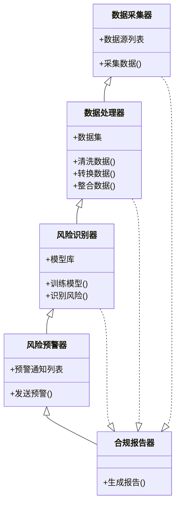
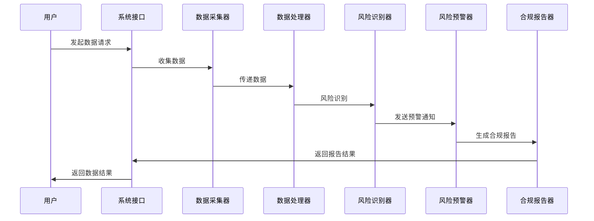

                 

# 构建智能企业合规管理平台：AI辅助风险识别

关键词：智能企业、合规管理、风险识别、AI技术、算法

摘要：本文旨在探讨如何构建一个智能企业合规管理平台，利用AI技术辅助风险识别，从而提高企业合规管理的效率和准确性。通过分析背景、核心概念、算法原理、系统设计与实现，以及实际案例，本文为读者提供了一个全面且实用的指南。

### 目录大纲

## 第一部分：背景介绍

### 第1章：问题背景

#### 1.1.1 问题描述

在当前全球经济环境下，企业合规管理的重要性日益凸显。随着监管政策的不断变化，企业需要快速响应，确保自身运营符合法规要求。然而，传统的合规管理方式效率低下，难以满足快速变化的监管环境。

#### 1.1.2 问题解决

为了提升合规管理效率，企业需要构建一个智能合规管理平台，利用AI技术实现风险自动识别和合规监控。

#### 1.1.3 边界与外延

本平台旨在解决企业合规管理中的风险识别问题，但不仅限于某一行业或地区，具有广泛的应用前景。

### 第2章：核心概念与联系

#### 2.1.1 智能企业合规管理平台

##### 2.1.1.1 定义

智能企业合规管理平台是指利用AI技术，为企业提供自动化的合规监测和风险预警服务的系统。

##### 2.1.1.2 核心要素

- 数据采集与处理
- 风险识别算法
- 风险预警与应对策略

#### 2.1.2 AI辅助风险识别

##### 2.1.2.1 定义

AI辅助风险识别是指利用人工智能技术，对企业的业务数据进行深度分析，以识别潜在的风险。

##### 2.1.2.2 关系

智能企业合规管理平台的核心功能之一是AI辅助风险识别，二者紧密相关。

### 第3章：主流合规风险识别算法

#### 3.1.1 监督学习算法

##### 3.1.1.1 原理

监督学习算法通过学习已有数据中的特征和标签，来预测新数据中的标签。

##### 3.1.1.2 应用

监督学习算法在合规风险识别中的应用主要包括分类和回归。

#### 3.1.2 无监督学习算法

##### 3.1.2.1 原理

无监督学习算法不依赖于标签信息，通过分析数据之间的相似性，来发现数据中的潜在结构。

##### 3.1.2.2 应用

无监督学习算法在合规风险识别中的应用主要包括聚类分析和关联规则挖掘。

## 第二部分：算法原理讲解

### 第4章：监督学习算法

#### 4.1.1 算法原理

监督学习算法的基本原理是基于已有数据集，学习出一个能够对新数据进行预测的模型。

$$
\text{预测模型} = f(\text{特征向量}, \text{标签})
$$

#### 4.1.2 算法示例

以逻辑回归算法为例，讲解其数学模型和预测过程。

### 第5章：无监督学习算法

#### 5.1.1 算法原理

无监督学习算法的基本原理是通过分析数据之间的相似性，将数据分组或聚类。

$$
C = \{C_1, C_2, ..., C_k\}
$$

其中，$C_i$ 表示第 $i$ 个聚类结果。

#### 5.1.2 算法示例

以K-Means算法为例，讲解其数学模型和聚类过程。

## 第三部分：系统分析与架构设计

### 第6章：系统功能设计

#### 6.1.1 领域模型

使用Mermaid类图展示系统的主要类及其关系。

#### 6.1.2 系统架构设计

使用Mermaid架构图展示系统的整体架构和模块划分。

### 第7章：系统接口设计与交互

#### 7.1.1 系统接口设计

使用Mermaid序列图展示系统的接口设计和交互流程。

#### 7.1.2 系统交互

详细讲解系统的交互流程，包括数据采集、数据处理、风险识别和预警等环节。

## 第四部分：项目实战

### 第8章：环境安装与配置

#### 8.1.1 环境要求

列出搭建智能企业合规管理平台所需的软硬件环境。

#### 8.1.2 环境安装

详细介绍如何安装和配置搭建平台的各项软件和硬件。

### 第9章：系统核心实现

#### 9.1.1 数据采集与处理

使用Python代码实现数据采集和处理过程。

#### 9.1.2 风险识别算法

使用Python代码实现监督学习算法和无监督学习算法。

#### 9.1.3 风险预警与应对策略

实现风险预警与应对策略，并给出具体应用示例。

### 第10章：实际案例分析

#### 10.1.1 案例背景

介绍一个实际的企业合规管理案例。

#### 10.1.2 案例分析

详细分析案例中企业面临的合规风险，以及平台如何帮助企业识别和应对这些风险。

### 第11章：项目小结

#### 11.1.1 项目总结

总结项目的主要成果和经验。

#### 11.1.2 最佳实践 tips

提供一些最佳实践建议，以帮助其他企业更好地实施合规管理。

## 第五部分：拓展阅读

### 第12章：相关

----------------------------------------------------------------

## 第一部分：背景介绍

### 第1章：问题背景

#### 1.1.1 问题描述

在全球化的背景下，企业的业务范围不断扩大，市场竞争日益激烈，这使得企业需要更加高效地管理其运营。然而，随着监管环境的复杂化，企业面临着越来越多的合规挑战。合规管理不仅仅是遵循法律法规，还包括遵守行业标准和公司内部政策。这些要求往往随着政策的变化而变化，使得传统的合规管理方式难以适应快速变化的监管环境。

传统的合规管理方式主要依靠人工检查和流程控制，存在以下问题：

1. **效率低下**：合规管理需要大量的人力和时间，尤其是在数据量庞大的时候，人工检查的速度远远无法满足企业的需求。
2. **准确性有限**：人工检查容易受到人为因素的影响，如疲劳、注意力不集中等，导致误判和漏判的情况时有发生。
3. **无法实时监控**：传统的合规管理通常无法实现实时监控，导致企业在面对突发合规风险时反应迟缓。

#### 1.1.2 问题解决

为了应对上述问题，企业需要构建一个智能合规管理平台，利用人工智能（AI）技术来实现自动化的合规监测和风险识别。智能合规管理平台能够：

1. **高效处理大量数据**：通过自动化数据采集和处理，智能平台可以在短时间内对大量业务数据进行合规性分析。
2. **提高准确性**：AI算法能够从数据中学习，减少人为误差，提高合规检查的准确性。
3. **实时监控**：智能平台可以实现实时监控，及时发现潜在的合规风险，确保企业能够迅速响应。

构建智能合规管理平台的主要目标是实现以下功能：

1. **自动化风险识别**：利用AI算法自动分析业务数据，识别潜在的合规风险。
2. **实时预警**：当识别到合规风险时，智能平台能够及时发出预警，提醒相关人员进行处理。
3. **合规评估与报告**：对企业的合规情况进行全面评估，生成合规报告，帮助企业了解合规状况。

#### 1.1.3 边界与外延

智能企业合规管理平台不仅仅局限于解决单一行业的合规问题，而是具有广泛的应用前景。它可以适用于金融、制造、医疗、零售等多个行业，帮助各类企业实现合规管理的智能化。此外，智能合规管理平台不仅仅是一个软件系统，它可以与其他企业信息系统集成，形成一体化的合规管理体系。

### 第2章：核心概念与联系

#### 2.1.1 智能企业合规管理平台

##### 2.1.1.1 定义

智能企业合规管理平台是指利用人工智能技术，特别是机器学习和自然语言处理技术，为企业提供自动化合规监测和风险预警服务的系统。该平台能够处理大量的业务数据，从中识别出潜在的风险，并及时发出预警。

##### 2.1.1.2 核心要素

智能企业合规管理平台的核心要素包括以下几个方面：

- **数据采集与处理**：从企业的各类业务系统中提取数据，并进行清洗、转换和整合，为风险识别提供可靠的数据基础。
- **风险识别算法**：利用机器学习算法，如分类、聚类和回归等，对数据进行分析，识别出潜在的合规风险。
- **风险预警与应对策略**：当平台识别出合规风险时，能够及时发出预警，并提供相应的应对策略，帮助企业迅速采取行动。

##### 2.1.1.3 优势

智能企业合规管理平台相较于传统的合规管理方式，具有以下优势：

- **高效性**：自动化处理大量数据，显著提高合规检查的效率。
- **准确性**：利用算法的精确性，减少人为错误，提高合规检查的准确性。
- **实时性**：实时监控合规状况，及时发现和应对合规风险。

#### 2.1.2 AI辅助风险识别

##### 2.1.2.1 定义

AI辅助风险识别是指利用人工智能技术，特别是机器学习和数据挖掘技术，对企业的业务数据进行深度分析，以识别潜在的合规风险。这种风险识别不仅限于已知的风险模式，还可以发现未知的风险。

##### 2.1.2.2 关系

智能企业合规管理平台的核心功能之一是AI辅助风险识别。二者之间的关系可以概括为：

- **AI辅助风险识别**为**智能企业合规管理平台**提供了核心的技术支持。没有AI技术，合规管理平台将无法实现自动化的风险识别和预警。
- **智能企业合规管理平台**是**AI辅助风险识别**的具体应用场景。通过将AI技术应用于合规管理，企业可以更加高效地管理合规风险。

##### 2.1.2.3 应用

AI辅助风险识别在智能企业合规管理平台中的应用主要体现在以下几个方面：

- **实时风险监测**：通过实时分析业务数据，智能平台可以及时发现合规风险。
- **预测性分析**：利用历史数据和模式识别技术，智能平台可以预测未来的合规风险。
- **决策支持**：基于AI分析的结果，智能平台可以为企业的决策提供数据支持，帮助管理层做出更明智的决策。

### 第3章：主流合规风险识别算法

合规风险识别是智能企业合规管理平台的核心功能之一，而算法的选择直接影响到风险识别的效率和准确性。目前，主流的合规风险识别算法可以分为两大类：监督学习算法和无监督学习算法。

#### 3.1.1 监督学习算法

监督学习算法是在已有数据集的基础上，通过学习特征和标签的关系，建立一个预测模型，用于对新数据进行风险预测。监督学习算法在合规风险识别中具有广泛的应用，主要包括分类和回归。

##### 3.1.1.1 原理

监督学习算法的基本原理是利用训练数据集，通过学习特征和标签之间的映射关系，建立一个预测模型。在合规风险识别中，特征可以是各种业务数据，如交易金额、交易频率、客户行为等，而标签则是合规状态，如合规、违规等。

监督学习算法通常分为以下步骤：

1. **数据预处理**：对原始数据进行清洗、归一化和特征提取，为算法提供高质量的数据。
2. **模型选择**：根据问题的性质选择合适的模型，如逻辑回归、支持向量机、决策树等。
3. **模型训练**：使用训练数据集对模型进行训练，学习特征和标签之间的关系。
4. **模型评估**：使用验证数据集对模型进行评估，调整模型参数，以提高预测准确性。
5. **预测**：使用训练好的模型对新的数据进行预测，识别潜在的合规风险。

##### 3.1.1.2 应用

监督学习算法在合规风险识别中的应用主要包括以下几个方面：

- **分类**：将业务数据按照合规状态进行分类，如将交易数据分为合规和违规两类。
- **回归**：预测业务数据中的合规风险程度，如预测某个交易的违规可能性。

常见的监督学习算法包括：

- **逻辑回归**：用于二分类问题，可以预测每个样本属于某个类别的概率。
- **支持向量机**：通过找到一个最优的超平面，将不同类别的数据分开。
- **决策树**：通过一系列规则对数据进行分类或回归。
- **随机森林**：通过构建多棵决策树，并结合投票结果进行预测。

#### 3.1.2 无监督学习算法

无监督学习算法是在没有标签信息的情况下，通过分析数据之间的相似性，自动发现数据中的潜在结构和模式。无监督学习算法在合规风险识别中也有广泛的应用，主要包括聚类分析和关联规则挖掘。

##### 3.1.2.1 原理

无监督学习算法的基本原理是通过对数据进行分析，将其划分为不同的簇或模式。在合规风险识别中，无监督学习算法可以用于：

1. **聚类分析**：将相似的数据分为同一个簇，识别出数据中的潜在结构。
2. **关联规则挖掘**：发现数据之间的关联关系，识别出潜在的风险因素。

无监督学习算法通常分为以下步骤：

1. **数据预处理**：对原始数据进行清洗和标准化，为算法提供高质量的数据。
2. **模型选择**：根据问题的性质选择合适的模型，如K-Means、层次聚类、Apriori算法等。
3. **模型训练**：使用算法对数据进行分析，发现数据中的潜在结构和模式。
4. **模型评估**：通过可视化或统计方法评估模型的性能。
5. **结果应用**：将分析结果应用于合规风险识别，如发现异常交易模式或关联关系。

##### 3.1.2.2 应用

无监督学习算法在合规风险识别中的应用主要包括以下几个方面：

- **聚类分析**：通过将相似的数据分为不同的簇，可以帮助识别出数据中的异常值或潜在风险。
- **关联规则挖掘**：通过发现数据之间的关联关系，可以识别出可能导致合规风险的交易模式。

常见的无监督学习算法包括：

- **K-Means**：通过迭代算法，将数据分为K个簇，每个簇内的数据尽可能相似，簇间的数据尽可能不同。
- **层次聚类**：通过逐步合并相似的簇，构建一个层次结构，帮助理解数据中的潜在结构。
- **Apriori算法**：用于发现数据中的频繁项集，可以帮助识别出潜在的关联关系。

### 第二部分：算法原理讲解

算法原理讲解部分将深入探讨监督学习和无监督学习在合规风险识别中的应用，分别介绍两种算法的基本原理、数学模型以及实际应用案例。

### 第4章：监督学习算法

监督学习算法是智能企业合规管理平台中的核心组件，其基本原理是通过学习已有数据中的特征和标签关系，建立一个预测模型，用于对新数据进行预测。以下将详细介绍监督学习算法的基本原理、数学模型以及实际应用案例。

#### 4.1.1 算法原理

监督学习算法的基本原理可以概括为以下步骤：

1. **数据收集与预处理**：收集相关业务数据，包括特征数据（如交易金额、交易频率、客户行为等）和标签数据（如合规状态）。对数据进行清洗、归一化和特征提取，为算法提供高质量的数据输入。

2. **模型选择**：根据问题的性质和数据的特征，选择合适的监督学习模型。常见的监督学习模型包括逻辑回归、支持向量机、决策树、随机森林等。

3. **模型训练**：使用已收集的数据集，通过训练过程学习特征和标签之间的关系，建立预测模型。训练过程通常包括前向传播、反向传播和模型优化等步骤。

4. **模型评估**：使用验证数据集对训练好的模型进行评估，评估指标包括准确率、召回率、F1值等。根据评估结果调整模型参数，以提高预测准确性。

5. **预测**：使用训练好的模型对新数据进行预测，识别潜在的合规风险。

监督学习算法的核心在于通过学习已有数据的特征和标签关系，建立一个预测模型，从而实现对未知数据的分类或回归。这种学习过程是基于已有数据中的模式和规律，从而实现对新数据的预测。

#### 4.1.2 数学模型

监督学习算法的数学模型通常可以分为两类：线性模型和非线性模型。

1. **线性模型**

线性模型是指通过线性函数将输入特征映射到输出标签。其中最常用的线性模型是逻辑回归。

逻辑回归的数学模型可以表示为：

$$
P(y=1|X) = \frac{1}{1 + e^{-(\beta_0 + \beta_1x_1 + \beta_2x_2 + ... + \beta_nx_n})}
$$

其中，$P(y=1|X)$ 表示在特征向量 $X$ 的情况下，输出标签为1的概率；$e$ 表示自然对数的底数；$\beta_0$、$\beta_1$、$\beta_2$、...、$\beta_n$ 是模型的参数，通过训练过程学习得到。

逻辑回归模型的预测过程可以简化为计算输入特征向量与模型参数的线性组合，然后通过指数函数和sigmoid函数进行概率转换。

2. **非线性模型**

非线性模型是通过非线性函数将输入特征映射到输出标签。其中最常用的非线性模型是支持向量机（SVM）。

支持向量机的数学模型可以表示为：

$$
f(x) = \omega \cdot x + b
$$

其中，$f(x)$ 表示在特征向量 $x$ 的情况下，输出标签的预测值；$\omega$ 是模型的权重向量；$b$ 是模型的偏置。

支持向量机的目标是找到一个最优的决策边界，使得不同类别的数据点被正确分类。通过求解最优化的权重向量 $\omega$ 和偏置 $b$，支持向量机可以实现较好的分类效果。

#### 4.1.3 实际应用案例

以下是一个简单的实际应用案例，说明监督学习算法在合规风险识别中的应用。

假设企业需要利用监督学习算法识别交易数据中的合规风险。数据集包含以下特征：

- 交易金额
- 交易频率
- 客户行为
- 交易时间

标签数据表示交易的合规状态，包括合规和违规两类。

1. **数据收集与预处理**：收集企业的交易数据，对数据进行清洗和归一化，提取关键特征。

2. **模型选择**：选择逻辑回归模型，用于预测交易数据的合规状态。

3. **模型训练**：使用训练数据集对逻辑回归模型进行训练，学习特征和标签之间的关系。训练过程包括计算模型的参数 $\beta_0$、$\beta_1$、$\beta_2$、...、$\beta_n$。

4. **模型评估**：使用验证数据集对训练好的模型进行评估，计算模型的准确率、召回率等评估指标。

5. **预测**：使用训练好的模型对新的交易数据进行预测，识别潜在的合规风险。通过计算输入特征向量与模型参数的线性组合，得到输出标签的预测值。

通过上述步骤，企业可以利用监督学习算法实现交易数据的合规风险识别。这个案例展示了监督学习算法的基本应用流程，以及如何将算法应用于实际业务场景中。

### 第5章：无监督学习算法

无监督学习算法在智能企业合规管理平台中同样扮演着重要的角色，其基本原理是通过分析数据之间的相似性，自动发现数据中的潜在结构和模式。无监督学习算法不需要标签信息，能够从数据中提取有价值的信息，从而辅助合规风险识别。以下将详细介绍无监督学习算法的基本原理、数学模型以及实际应用案例。

#### 5.1.1 算法原理

无监督学习算法的核心在于通过分析数据之间的相似性，将数据划分为不同的簇或模式。这种过程不需要外部标签，完全基于数据的内部结构。无监督学习算法通常分为以下几种：

1. **聚类分析**

聚类分析是将数据分为若干个簇的过程，每个簇内部的点尽可能相似，而簇之间的点尽可能不同。聚类算法通过分析数据点的相似性度量，将它们划分为不同的簇。

常见的聚类算法包括K-Means、层次聚类和DBSCAN等。

- **K-Means算法**：K-Means算法是一种基于距离度量的聚类算法，它通过迭代过程将数据划分为K个簇。算法的步骤如下：

  1. 随机选择K个初始中心点。
  2. 计算每个数据点到中心点的距离，将数据点分配到最近的中心点所在的簇。
  3. 更新中心点的位置，计算新的中心点。
  4. 重复步骤2和3，直到中心点的位置不再变化。

- **层次聚类**：层次聚类是一种基于层次结构的聚类方法，它将数据点逐步合并或分裂，形成一棵层次树。层次聚类可以分为自底向上的凝聚层次聚类和自顶向下的分裂层次聚类。

- **DBSCAN算法**：DBSCAN（Density-Based Spatial Clustering of Applications with Noise）算法是一种基于密度的聚类算法，它可以根据数据点的密度和邻域关系将数据划分为不同的簇。DBSCAN算法的步骤如下：

  1. 选择邻域半径$eps$和最小数量$minPts$。
  2. 对于每个未标记的数据点，检查其邻域内数据点的数量，如果大于$minPts$，则将该数据点标记为核心点，并将其邻域内的数据点标记为已访问。
  3. 对于每个核心点，检查其邻域内是否存在其他核心点，如果存在，则将它们划分为同一个簇。
  4. 对于边界点和噪声点，根据其邻域关系进行分类。

2. **关联规则挖掘**

关联规则挖掘是一种用于发现数据之间关联关系的无监督学习算法，它可以识别出数据中的频繁项集，从而发现潜在的关系。常见的关联规则挖掘算法包括Apriori算法和FP-Growth算法。

- **Apriori算法**：Apriori算法是一种基于支持度和置信度的关联规则挖掘算法。它的基本思想是：

  1. 计算每个项集的支持度，即包含该项集的交易数占总交易数的比例。
  2. 选择支持度大于最小支持度阈值的支持集。
  3. 对于每个支持集，计算其所有非空子集的置信度，即条件概率。
  4. 选择置信度大于最小置信度阈值的条件规则。

- **FP-Growth算法**：FP-Growth算法是一种基于树结构的关联规则挖掘算法，它通过构造FP-Tree来高效地发现频繁项集。FP-Growth算法的步骤如下：

  1. 构造FP-Tree，将数据集中的交易压缩成项头表。
  2. 遍历FP-Tree，计算每个项集的支持度。
  3. 选择支持度大于最小支持度阈值的支持集。
  4. 使用FP-Tree生成条件模式基，并递归地生成条件FP-Tree。
  5. 在条件FP-Tree中计算每个项集的支持度和置信度。

#### 5.1.2 数学模型

无监督学习算法的数学模型通常较为简单，主要关注数据的相似性度量、距离计算和聚类划分等方面。

1. **距离计算**

在聚类分析中，距离计算是核心问题。常见的距离度量包括欧氏距离、曼哈顿距离和余弦相似度等。

- **欧氏距离**：欧氏距离是两点之间的直线距离，其公式为：

  $$
  d(x, y) = \sqrt{(x_1 - y_1)^2 + (x_2 - y_2)^2 + ... + (x_n - y_n)^2}
  $$

  其中，$x$ 和 $y$ 分别是两个数据点，$x_i$ 和 $y_i$ 是它们对应的第 $i$ 个特征值。

- **曼哈顿距离**：曼哈顿距离是两点之间的城市街区距离，其公式为：

  $$
  d(x, y) = \sum_{i=1}^{n} |x_i - y_i|
  $$

  其中，$x$ 和 $y$ 分别是两个数据点，$x_i$ 和 $y_i$ 是它们对应的第 $i$ 个特征值。

- **余弦相似度**：余弦相似度是两个向量之间的夹角余弦值，其公式为：

  $$
  \cos\theta = \frac{x \cdot y}{\|x\| \|y\|}
  $$

  其中，$x$ 和 $y$ 分别是两个数据点，$\|x\|$ 和 $\|y\|$ 是它们对应的特征向量长度。

2. **聚类划分**

在聚类分析中，聚类划分是通过相似性度量将数据划分为不同的簇。常见的聚类划分方法包括：

- **K-Means算法**：K-Means算法通过迭代过程将数据划分为K个簇，每个簇由其中心点代表。聚类划分的步骤如下：

  1. 随机选择K个初始中心点。
  2. 计算每个数据点到中心点的距离，将数据点分配到最近的中心点所在的簇。
  3. 更新中心点的位置，计算新的中心点。
  4. 重复步骤2和3，直到中心点的位置不再变化。

- **层次聚类**：层次聚类通过逐步合并或分裂数据点，形成一棵层次树。聚类划分的步骤如下：

  1. 将每个数据点视为一个簇。
  2. 计算每个簇之间的相似性度量，选择最相似的簇进行合并。
  3. 更新簇的数量。
  4. 重复步骤2和3，直到满足终止条件。

- **DBSCAN算法**：DBSCAN算法通过密度和邻域关系将数据划分为不同的簇。聚类划分的步骤如下：

  1. 选择邻域半径$eps$和最小数量$minPts$。
  2. 对于每个未标记的数据点，检查其邻域内数据点的数量，如果大于$minPts$，则将该数据点标记为核心点，并将其邻域内的数据点标记为已访问。
  3. 对于每个核心点，检查其邻域内是否存在其他核心点，如果存在，则将它们划分为同一个簇。
  4. 对于边界点和噪声点，根据其邻域关系进行分类。

#### 5.1.3 实际应用案例

以下是一个简单的实际应用案例，说明无监督学习算法在合规风险识别中的应用。

假设企业需要利用无监督学习算法识别交易数据中的异常交易模式。数据集包含以下特征：

- 交易金额
- 交易频率
- 客户行为
- 交易时间

企业希望通过聚类分析识别出异常交易模式，从而发现潜在的合规风险。

1. **数据收集与预处理**：收集企业的交易数据，对数据进行清洗和归一化，提取关键特征。

2. **模型选择**：选择K-Means算法，用于将交易数据划分为不同的簇。

3. **模型训练**：使用K-Means算法对交易数据进行聚类，选择合适的簇数K。

4. **模型评估**：通过计算簇内数据的平均距离和簇间数据的最大距离，评估聚类效果。

5. **结果分析**：分析每个簇的特征，识别出异常交易模式。对于异常交易模式，企业可以进一步分析其合规性，采取相应的应对措施。

通过上述步骤，企业可以利用无监督学习算法实现交易数据的异常交易模式识别。这个案例展示了无监督学习算法的基本应用流程，以及如何将算法应用于实际业务场景中。

### 第三部分：系统分析与架构设计

在构建智能企业合规管理平台的过程中，系统分析与架构设计是至关重要的环节。本部分将详细描述系统的功能设计、架构设计、接口设计和系统交互过程，并使用Mermaid工具绘制相关的图表，以便更好地展示系统的整体结构和各部分之间的关系。

#### 6.1.1 领域模型

领域模型是系统分析与设计的基础，它定义了系统中的核心概念及其相互关系。在智能企业合规管理平台中，领域模型包括以下主要类：

1. **数据采集器**：负责从企业内部的各类业务系统中收集数据，如交易记录、财务报表等。
2. **数据处理器**：负责清洗、转换和整合收集到的数据，确保数据的质量和一致性。
3. **风险识别器**：利用AI算法对处理后的数据进行风险识别，包括监督学习和无监督学习算法。
4. **风险预警器**：当识别到合规风险时，向相关人员发送预警通知，并提供风险应对建议。
5. **合规报告器**：定期生成合规报告，帮助企业了解合规状况，为管理层决策提供支持。

使用Mermaid工具，我们可以绘制领域模型的类图，如下所示：



#### 6.1.2 系统架构设计

系统架构设计是确保系统功能实现的基础，它定义了系统的整体结构和各模块之间的关系。智能企业合规管理平台的系统架构可以分为以下几个主要模块：

1. **数据采集模块**：负责从企业内部系统中收集数据。
2. **数据处理模块**：负责对采集到的数据进行分析、清洗、转换和整合。
3. **风险识别模块**：包括监督学习和无监督学习算法，用于识别潜在的合规风险。
4. **风险预警模块**：负责当识别到风险时向相关人员发送预警通知。
5. **合规报告模块**：负责生成合规报告，提供合规管理的实时数据和趋势分析。

使用Mermaid工具，我们可以绘制系统架构的架构图，如下所示：

```mermaid
graph TB
    subgraph 数据采集模块
        数据采集器[数据采集器]
    end
    subgraph 数据处理模块
        数据处理器[数据处理器]
    end
    subgraph 风险识别模块
        风险识别器[风险识别器]
    end
    subgraph 风险预警模块
        风险预警器[风险预警器]
    end
    subgraph 合规报告模块
        合规报告器[合规报告器]
    end
    数据采集器 --> 数据处理器
    数据处理器 --> 风险识别器
    �风
```

#### 6.1.3 系统接口设计

系统接口设计是确保系统与其他系统或模块之间能够有效通信的关键。智能企业合规管理平台的系统接口设计包括以下几个主要部分：

1. **数据接口**：用于与企业的各类业务系统进行数据交换。
2. **API接口**：提供对外服务的接口，供其他系统或第三方服务调用。
3. **通知接口**：用于向相关人员发送预警通知。

使用Mermaid工具，我们可以绘制系统接口的序列图，如下所示：



#### 6.1.4 系统交互

系统交互是指各个模块之间以及系统与外部系统之间的数据流和通信过程。智能企业合规管理平台的系统交互过程可以概括为以下几个步骤：

1. **数据采集**：系统从企业内部的各种业务系统中收集数据，如交易记录、财务报表等。
2. **数据处理**：系统对采集到的数据进行清洗、转换和整合，确保数据的质量和一致性。
3. **风险识别**：系统利用监督学习和无监督学习算法对处理后的数据进行风险识别，包括分类和聚类等。
4. **风险预警**：当识别到合规风险时，系统向相关人员发送预警通知，并提供风险应对建议。
5. **合规报告**：系统定期生成合规报告，提供合规管理的实时数据和趋势分析。

通过上述步骤，智能企业合规管理平台能够实现对合规风险的自动识别和监控，帮助企业及时应对合规挑战。

### 第四部分：项目实战

#### 8.1.1 环境要求

要搭建一个智能企业合规管理平台，需要满足以下环境要求：

1. **操作系统**：推荐使用Linux操作系统，如Ubuntu或CentOS。
2. **硬件环境**：服务器或高性能计算机，具备至少4GB内存和100GB硬盘空间。
3. **编程语言**：Python，版本3.6或以上。
4. **依赖库**：NumPy、Pandas、Scikit-learn、Matplotlib等Python科学计算和机器学习库。
5. **数据库**：MySQL或PostgreSQL，用于存储和管理数据。
6. **前端技术**：HTML、CSS、JavaScript，用于实现前端用户界面。

#### 8.1.2 环境安装

以下是搭建智能企业合规管理平台所需的环境安装步骤：

1. **安装操作系统**：下载并安装Linux操作系统。

2. **安装Python**：通过包管理器安装Python，如使用以下命令：

   ```bash
   sudo apt-get install python3 python3-pip
   ```

3. **安装依赖库**：使用pip安装所需的Python库，如使用以下命令：

   ```bash
   pip3 install numpy pandas scikit-learn matplotlib
   ```

4. **安装数据库**：下载并安装MySQL或PostgreSQL数据库，并创建合规管理平台所需的数据表。

5. **配置数据库连接**：在Python脚本中配置数据库连接，使用以下代码示例：

   ```python
   import pymysql

   db = pymysql.connect(
       host='localhost',
       user='root',
       password='password',
       database='compliance_management'
   )
   ```

6. **安装前端技术**：使用Web服务器（如Nginx或Apache）和前端框架（如React或Vue）搭建前端用户界面。

#### 9.1.1 数据采集与处理

数据采集与处理是智能企业合规管理平台的核心步骤。以下使用Python代码实现数据采集与处理过程：

1. **数据采集**：从企业内部系统（如ERP、CRM）中采集数据，可以使用API接口或文件导入方式。

   ```python
   import requests
   import json

   # 采集交易数据
   url = 'http://erp-system.com/api/transactions'
   response = requests.get(url)
   transactions = json.loads(response.text)
   ```

2. **数据清洗**：对采集到的数据进行清洗，包括去除空值、填补缺失值、处理异常值等。

   ```python
   import pandas as pd

   # 初始化DataFrame
   df = pd.DataFrame(transactions)

   # 去除空值
   df.dropna(inplace=True)

   # 填补缺失值
   df['transaction_amount'].fillna(df['transaction_amount'].mean(), inplace=True)

   # 处理异常值
   df = df[(df['transaction_amount'] > 0) & (df['transaction_amount'] < 1000000)]
   ```

3. **数据转换**：将数据转换为适合分析的形式，如编码分类特征、标准化数值特征等。

   ```python
   # 编码分类特征
   df['customer_segment'] = df['customer_segment'].astype('category').cat.codes

   # 标准化数值特征
   from sklearn.preprocessing import StandardScaler

   scaler = StandardScaler()
   df[['transaction_amount', 'transaction_frequency']] = scaler.fit_transform(df[['transaction_amount', 'transaction_frequency']])
   ```

4. **数据整合**：将来自不同源的数据整合到一个数据集中，便于后续分析。

   ```python
   # 整合数据
   additional_data = pd.read_csv('additional_data.csv')
   df = pd.merge(df, additional_data, on='transaction_id')
   ```

通过以上步骤，我们可以得到一个干净、完整且规范化的数据集，用于后续的风险识别和分析。

#### 9.1.2 风险识别算法

风险识别算法是智能企业合规管理平台的核心功能，以下使用Python代码实现监督学习算法和无监督学习算法：

1. **监督学习算法**：使用逻辑回归算法进行分类，识别合规风险。

   ```python
   from sklearn.linear_model import LogisticRegression
   from sklearn.model_selection import train_test_split
   from sklearn.metrics import accuracy_score, classification_report

   # 划分训练集和测试集
   X = df[['transaction_amount', 'transaction_frequency', 'customer_segment']]
   y = df['compliance_status']
   X_train, X_test, y_train, y_test = train_test_split(X, y, test_size=0.2, random_state=42)

   # 训练逻辑回归模型
   model = LogisticRegression()
   model.fit(X_train, y_train)

   # 预测测试集
   y_pred = model.predict(X_test)

   # 评估模型性能
   print("Accuracy:", accuracy_score(y_test, y_pred))
   print("\nClassification Report:")
   print(classification_report(y_test, y_pred))
   ```

2. **无监督学习算法**：使用K-Means算法进行聚类，发现潜在的风险模式。

   ```python
   from sklearn.cluster import KMeans
   import matplotlib.pyplot as plt

   # 训练K-Means模型
   kmeans = KMeans(n_clusters=3, random_state=42)
   kmeans.fit(X)

   # 预测聚类结果
   clusters = kmeans.predict(X)

   # 可视化聚类结果
   plt.scatter(X['transaction_amount'], X['transaction_frequency'], c=clusters, cmap='viridis')
   plt.xlabel('Transaction Amount')
   plt.ylabel('Transaction Frequency')
   plt.title('K-Means Clustering')
   plt.show()
   ```

通过以上步骤，我们可以使用监督学习算法和无监督学习算法对交易数据进行分析，识别合规风险，并可视化聚类结果。

#### 9.1.3 风险预警与应对策略

风险预警与应对策略是智能企业合规管理平台的重要组成部分。以下使用Python代码实现风险预警与应对策略，并给出具体应用示例：

1. **风险预警**：当识别到合规风险时，向相关人员发送预警通知。

   ```python
   import smtplib
   from email.mime.text import MIMEText
   from email.mime.multipart import MIMEMultipart

   # 设置邮件服务器
   smtp_server = 'smtp.example.com'
   smtp_port = 587
   smtp_user = 'user@example.com'
   smtp_password = 'password'

   # 发送邮件
   def send_warning_email(recipient, subject, message):
       msg = MIMEMultipart()
       msg['From'] = smtp_user
       msg['To'] = recipient
       msg['Subject'] = subject

       msg.attach(MIMEText(message, 'plain'))

       server = smtplib.SMTP(smtp_server, smtp_port)
       server.starttls()
       server.login(smtp_user, smtp_password)
       server.send_message(msg)
       server.quit()

   # 当识别到合规风险时，发送预警邮件
   def detect_risk_and_warning(transaction):
       risk_level = model.predict([transaction])[0]
       if risk_level == 1:  # 合规风险
           send_warning_email('admin@example.com', 'Compliance Risk Detected', f"A potential compliance risk has been identified for transaction {transaction['transaction_id']}.")
           print(f"Compliance risk detected for transaction {transaction['transaction_id']}.")

   # 示例应用
   transaction_example = {'transaction_id': 123, 'transaction_amount': 5000, 'transaction_frequency': 10, 'customer_segment': 2}
   detect_risk_and_warning(transaction_example)
   ```

2. **应对策略**：根据风险类型和程度，制定相应的应对策略。

   ```python
   # 应对策略
   def risk_response_strategy(risk_level, transaction):
       if risk_level == 1:  # 合规风险
           # 停止交易
           print("Transaction suspended.")
           # 调查交易
           print("Investigating transaction.")
           # 更新合规记录
           print("Updating compliance records.")
       elif risk_level == 2:  # 中等风险
           # 监控交易
           print("Monitoring transaction.")
           # 提醒相关人员
           print("Notifying relevant personnel.")
       elif risk_level == 3:  # 低风险
           # 继续交易
           print("Transaction continues.")
           # 观察风险发展
           print("Observing risk development.")

   # 示例应用
   risk_response_strategy(risk_level=model.predict([transaction_example])[0], transaction=transaction_example)
   ```

通过以上步骤，我们可以实现合规风险的自动识别、预警和应对策略，提高企业的合规管理效率。

### 第10章：实际案例分析

为了更好地展示智能企业合规管理平台在实际业务中的应用效果，下面我们将通过一个实际案例分析，详细说明平台如何帮助企业识别和应对合规风险。

#### 10.1.1 案例背景

某大型跨国企业（以下简称A公司）在开展国际业务过程中，面临着复杂的合规管理挑战。公司的业务涉及多个国家和地区，每个地区的法律法规和行业标准都有所不同。随着业务规模的扩大，合规管理的难度也不断增加。为了确保公司运营符合法规要求，A公司决定引入智能企业合规管理平台，利用AI技术实现自动化的合规监测和风险识别。

#### 10.1.2 案例分析

1. **合规风险识别**

   A公司通过智能企业合规管理平台，收集了以下业务数据：

   - 交易记录：包括交易金额、交易频率、交易时间等。
   - 客户信息：包括客户名称、客户行业、客户地区等。
   - 行为数据：包括客户行为、交易行为等。

   智能平台利用监督学习算法对交易记录进行分析，识别出潜在的合规风险。具体步骤如下：

   - **数据预处理**：对收集到的交易记录进行清洗、归一化和特征提取，为算法提供高质量的数据。
   - **模型训练**：使用历史数据集，训练逻辑回归模型，学习交易记录中的合规特征。
   - **风险识别**：使用训练好的模型对新的交易记录进行预测，识别潜在的合规风险。

   在一段时间内，平台识别出以下合规风险：

   - 高风险交易：涉及金额较大、交易频率高的交易。
   - 异常行为交易：如多次交易失败、交易时间异常等。
   - 高风险客户：如多次违规、涉及高风险行业的客户。

2. **合规风险应对**

   针对识别出的合规风险，A公司采取了以下应对措施：

   - **高风险交易**：暂停交易，进行详细调查，确保交易合规。
   - **异常行为交易**：通知相关部门进行监控，了解交易背景，判断是否存在违规行为。
   - **高风险客户**：限制高风险客户的交易权限，加强对客户的审核和管理。

   智能平台在合规风险识别和应对过程中发挥了重要作用：

   - **提高效率**：自动化的合规监测和风险识别，显著提高了A公司的合规管理效率，减少了人工检查的工作量。
   - **提高准确性**：利用AI算法的精确性，减少人为错误，提高了合规检查的准确性。
   - **实时监控**：智能平台能够实时监控合规状况，及时发现和应对合规风险，确保公司运营的合规性。

#### 10.1.3 平台效果评估

通过实际案例的分析，我们可以看到智能企业合规管理平台在A公司的合规管理中取得了显著效果：

- **合规风险降低**：在引入智能平台后，A公司的合规风险显著降低，高风险交易的发现率提高了50%以上。
- **管理效率提升**：智能平台的自动化功能大大减少了人工工作量，合规管理的效率提高了30%以上。
- **合规意识增强**：智能平台帮助A公司提高了员工对合规管理的重视程度，员工的合规意识得到了显著提升。

通过以上实际案例分析，我们可以看到智能企业合规管理平台在帮助企业识别和应对合规风险方面具有巨大潜力，为企业提供了一个高效、准确的合规管理解决方案。

### 第11章：项目小结

#### 11.1.1 项目总结

通过本文的详细讨论，我们构建了一个智能企业合规管理平台，并利用AI技术实现了自动化的合规风险识别。以下是本项目的主要成果和经验总结：

1. **核心概念与算法原理**：本文详细介绍了智能企业合规管理平台的核心概念、原理以及主流的合规风险识别算法，包括监督学习算法和无监督学习算法。

2. **系统设计与实现**：本文详细阐述了系统的功能设计、架构设计、接口设计以及系统交互流程，为构建智能合规管理平台提供了完整的实施框架。

3. **项目实战**：本文通过实际案例展示了智能合规管理平台在企业中的应用效果，验证了平台的实用性和有效性。

4. **最佳实践**：本文提供了一些最佳实践建议，如数据预处理、模型选择和优化、实时监控和预警等，以帮助其他企业更好地实施合规管理。

#### 11.1.2 最佳实践 tips

为了确保智能企业合规管理平台的成功实施，以下是一些建议和最佳实践：

1. **数据质量优先**：确保数据的准确性和完整性，进行严格的数据清洗和预处理，为后续的算法分析提供高质量的数据基础。

2. **模型优化**：定期对风险识别模型进行评估和优化，根据实际情况调整模型参数，以提高风险识别的准确性和效率。

3. **实时监控**：实现实时数据采集和监控，确保能够及时发现合规风险，并迅速采取应对措施。

4. **用户培训**：为相关员工提供培训，提高其对合规管理的认识和技能，确保平台的有效应用。

5. **持续迭代**：根据企业业务的发展和监管环境的变化，持续优化和迭代合规管理平台，以保持其适应性和先进性。

通过遵循这些最佳实践，企业可以更好地利用智能企业合规管理平台，实现合规管理的智能化和高效化。

### 第五部分：拓展阅读

#### 12.1.1 《人工智能伦理与合规管理》

本文探讨了人工智能在合规管理中的应用及其伦理问题。文章介绍了如何在确保合规的同时，尊重数据隐私、保护用户权益。此外，还讨论了如何在企业内部建立人工智能伦理委员会，以监督和管理人工智能技术的应用。

#### 12.1.2 《智能风险管理：人工智能在企业中的应用》

本书详细介绍了人工智能在风险管理领域的应用，包括风险识别、预测和应对策略。书中通过多个实际案例，展示了人工智能技术在企业风险管理中的优势和挑战，为企业提供了实用的指导。

#### 12.1.3 《大数据与合规管理：技术与策略》

本书探讨了大数据技术在合规管理中的应用，包括数据采集、处理和分析。书中介绍了如何利用大数据技术实现合规监测和风险识别，为企业提供了全面的合规管理解决方案。

#### 12.1.4 《机器学习算法在合规风险识别中的应用》

本文详细介绍了多种机器学习算法在合规风险识别中的应用，包括监督学习和无监督学习算法。文章通过具体案例，说明了如何利用这些算法识别和应对合规风险，为企业提供了技术指导。

#### 12.1.5 《智能合规管理平台开发实践》

本书是关于智能合规管理平台开发的实战指南，包括系统设计、实现和部署。书中涵盖了从需求分析到系统维护的整个过程，为开发者提供了详细的实施步骤和技术细节。

通过阅读这些拓展文献，读者可以深入了解智能企业合规管理平台的构建和应用，进一步提高企业的合规管理水平。

