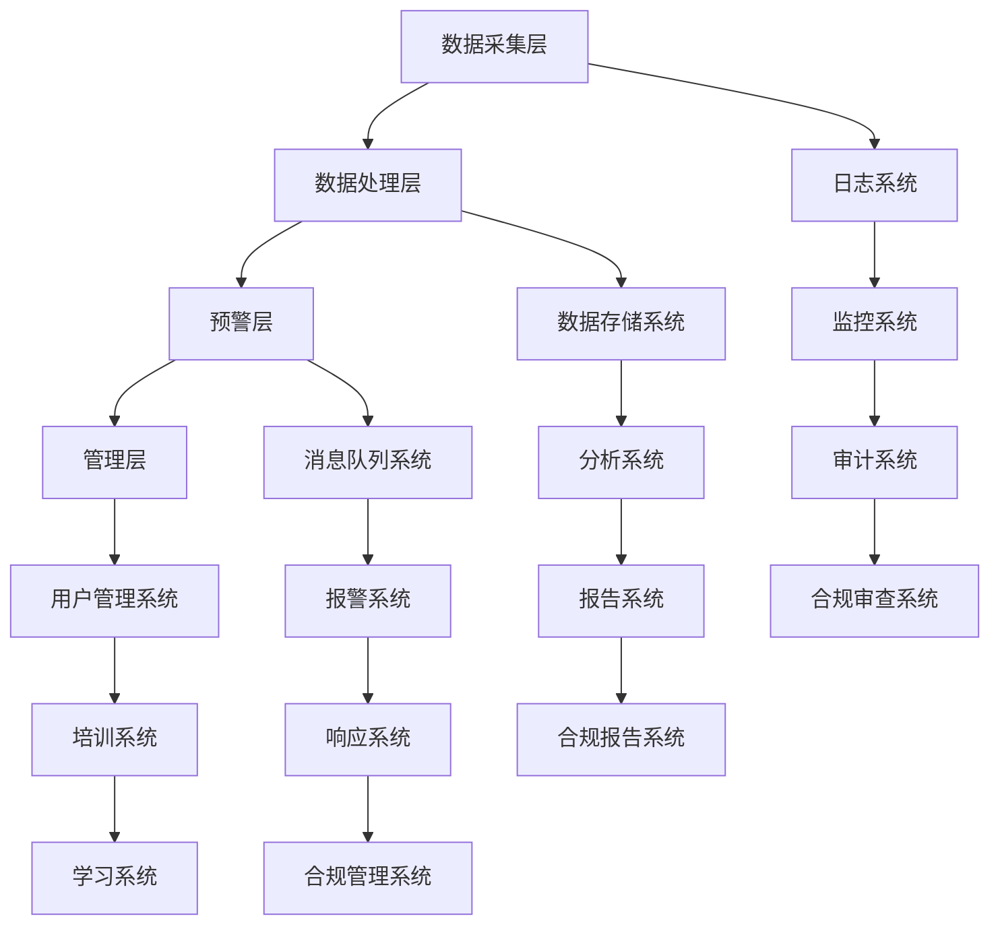

                 

### 第一部分: 引言

#### 1.1 书籍背景

##### 1.1.1 问题背景
随着信息技术的飞速发展，企业的运营模式和竞争环境发生了深刻变化。合规管理作为企业风险管理的重要组成部分，越来越受到企业的重视。智能企业的兴起，使得构建智能企业合规管理系统成为企业数字化转型的重要一环。

##### 1.1.2 问题描述
如何构建一个既能够实时监控企业运营，又能够有效预警潜在风险的智能企业合规管理系统，是当前企业面临的一个重大挑战。

##### 1.1.3 问题解决
本书旨在通过系统的理论和实践方法，帮助企业构建智能企业合规管理系统，提供实时监控与预警机制的设计方案。

##### 1.1.4 边界与外延
本书主要关注企业合规管理的核心领域，如财务合规、数据合规、法律合规等，同时涉及云计算、大数据、人工智能等前沿技术。

#### 1.2 核心概念

##### 1.2.1 智能企业
智能企业是指通过应用人工智能、大数据、云计算等前沿技术，实现企业运营智能化、管理自动化、决策科学化的企业。

##### 1.2.2 合规管理系统
合规管理系统是指企业为了满足内外部合规要求，规范企业运营行为，预防和处理合规风险而建立的管理系统。

##### 1.2.3 实时监控与预警机制
实时监控与预警机制是指通过实时采集、分析和处理企业运营数据，及时发现潜在合规风险，并提前预警，以帮助企业采取相应措施。

#### 1.3 书籍结构

本书共分为七个部分，分别是：

1. 引言
2. 智能企业与合规管理
3. 智能企业合规管理系统架构设计
4. 实时监控与预警机制设计
5. 项目实战：构建智能企业合规管理系统
6. 案例分析：智能企业合规管理实践
7. 总结与展望

#### 1.4 本章小结

本章从问题背景、核心概念和书籍结构等方面，对本书进行了全面的介绍。希望通过本书的阅读，读者能够深入了解智能企业合规管理的核心概念，掌握构建智能企业合规管理系统的方法和技巧。

----------------------------------------------------------------

### 第二部分：智能企业与合规管理

#### 2.1 智能企业概述

##### 2.1.1 智能企业的定义与特征
###### 2.1.1.1 智能企业的定义
智能企业是指通过应用人工智能、大数据、云计算等前沿技术，实现企业运营智能化、管理自动化、决策科学化的企业。

###### 2.1.1.2 智能企业的特征
1. **智能运营**：通过自动化、智能化的手段，提高企业运营效率。
   - **自动化**：利用机器人流程自动化（RPA）等技术，减少人工操作，提高效率。
   - **智能化**：运用人工智能算法，优化运营流程，预测并解决问题。
   
2. **智能管理**：通过数据驱动，实现企业管理的智能化。
   - **数据采集**：通过传感器、物联网等技术，实时采集企业运营数据。
   - **数据分析**：利用大数据分析，发现运营中的问题，提供决策支持。

3. **智能决策**：利用大数据和人工智能技术，为企业决策提供科学依据。
   - **预测分析**：通过预测模型，预测市场趋势，为企业决策提供依据。
   - **决策支持**：利用算法，优化决策过程，提高决策效率。

##### 2.1.2 智能企业的应用场景
###### 2.1.2.1 生产制造
通过人工智能技术，实现生产过程的智能化控制，提高生产效率和产品质量。
- **生产流程优化**：利用人工智能算法，优化生产流程，提高生产效率。
- **质量控制**：利用机器学习技术，实现对生产质量的实时监控，提高产品质量。

###### 2.1.2.2 供应链管理
利用大数据和人工智能技术，实现供应链的智能化管理，降低供应链风险，提高供应链效率。
- **供应链优化**：通过大数据分析，优化供应链布局，降低库存成本。
- **风险监控**：利用人工智能技术，实时监控供应链中的风险，提前预警。

###### 2.1.2.3 客户服务
通过人工智能技术，实现客户服务的智能化，提高客户满意度。
- **智能客服**：利用自然语言处理技术，实现智能客服，提高客户响应速度。
- **个性化服务**：通过大数据分析，了解客户需求，提供个性化服务。

#### 2.2 合规管理概述

##### 2.2.1 合规管理的定义与作用
###### 2.2.1.1 合规管理的定义
合规管理是指企业为了满足内外部合规要求，规范企业运营行为，预防和处理合规风险而建立的管理系统。

###### 2.2.1.2 合规管理的作用
1. **预防合规风险**：通过合规管理，及时发现和防范合规风险，避免因违规操作导致的法律风险。
2. **保障企业利益**：合规管理有助于企业遵守法律法规，保障企业利益，避免因违规操作导致的损失。
3. **提高企业声誉**：合规管理有助于提高企业在市场中的竞争力，树立良好的企业形象，增强消费者信任。

##### 2.2.2 合规管理的核心要素
###### 2.2.2.1 合规政策与流程
制定符合法律法规和企业内部规定的合规政策，并建立完善的合规流程，确保企业运营符合相关要求。

###### 2.2.2.2 合规培训与宣传
定期开展合规培训，提高员工合规意识，营造合规文化，确保员工了解并遵守合规政策。

###### 2.2.2.3 合规监督与评估
建立合规监督机制，定期对合规管理进行评估，确保合规管理有效运行，及时发现和纠正问题。

#### 2.3 智能企业与合规管理的融合

##### 2.3.1 智能技术在合规管理中的应用
###### 2.3.1.1 实时监控
利用大数据和人工智能技术，实现对企业运营数据的实时监控，及时发现合规风险。

###### 2.3.1.2 预警机制
通过分析实时数据，建立预警机制，提前发现潜在合规风险，为企业采取相应措施提供依据。

###### 2.3.1.3 智能决策
利用大数据和人工智能技术，为企业决策提供科学依据，降低合规风险，优化决策过程。

##### 2.3.2 智能企业合规管理的挑战与机遇
###### 2.3.2.1 挑战
1. **技术挑战**：如何有效利用人工智能、大数据等技术，提高合规管理的效率和准确性。
2. **数据挑战**：如何处理海量数据，确保数据的真实性和准确性，为合规管理提供可靠依据。
3. **人员挑战**：如何提高员工的合规意识和技能，确保合规管理能够真正落实。

###### 2.3.2.2 机遇
1. **技术创新**：随着技术的不断发展，智能企业合规管理将变得更加高效和准确。
2. **市场需求**：随着合规要求的日益严格，智能企业合规管理市场需求将不断增长。
3. **协同发展**：智能企业合规管理与企业的整体数字化转型相辅相成，共同推动企业的发展。

----------------------------------------------------------------

### 第三部分：智能企业合规管理系统架构设计

#### 3.1 智能企业合规管理系统概述

智能企业合规管理系统是智能企业的重要组成部分，旨在通过先进的技术手段，实现对企业运营的实时监控、合规风险预警和管理。该系统不仅能够帮助企业遵守法律法规，降低合规风险，还能够提高企业运营效率，增强市场竞争力。

##### 3.1.1 系统目标
智能企业合规管理系统的目标是实现以下三个关键目标：
1. **实时监控**：通过实时采集和分析企业运营数据，确保企业运营透明、合规。
2. **合规风险预警**：利用大数据和人工智能技术，提前发现潜在合规风险，为企业提供及时预警。
3. **合规管理**：通过对合规数据的分析和处理，提供合规决策支持，帮助企业管理合规风险。

##### 3.1.2 系统组成
智能企业合规管理系统由以下几个关键组成部分构成：
1. **数据采集模块**：负责实时采集企业运营数据，包括财务数据、业务数据、运营数据等。
2. **数据处理与分析模块**：负责对采集到的数据进行分析和处理，识别潜在合规风险。
3. **合规风险预警模块**：基于数据分析结果，建立合规风险预警机制，及时通知企业管理层。
4. **合规管理模块**：提供合规管理工具，帮助企业制定合规策略，执行合规措施。

#### 3.2 数据采集模块设计

数据采集模块是智能企业合规管理系统的核心组件，负责实时采集企业运营数据。以下是对数据采集模块的设计详细描述：

##### 3.2.1 数据采集方式
数据采集模块采用多种方式采集企业数据，包括：
1. **API接口**：通过企业内部系统和外部系统的API接口，实时获取企业运营数据。
2. **日志文件**：通过分析企业操作日志，获取企业运营行为数据。
3. **物联网设备**：通过连接物联网设备，实时采集企业设备运行数据。

##### 3.2.2 数据采集流程
数据采集模块的工作流程如下：
1. **数据接入**：通过API接口、日志文件、物联网设备等渠道，接入企业运营数据。
2. **数据清洗**：对采集到的数据进行分析，识别并处理数据中的异常值、缺失值等。
3. **数据存储**：将清洗后的数据存储到企业数据库中，以便后续分析和处理。

##### 3.2.3 数据采集工具与技术
数据采集模块采用以下工具和技术：
1. **API接口**：使用HTTP协议，通过GET/POST等方法获取数据。
2. **日志分析**：使用日志分析工具，如Logstash、Kafka等，处理和存储日志数据。
3. **物联网**：使用MQTT协议，连接物联网设备，实现实时数据采集。

#### 3.3 数据处理与分析模块设计

数据处理与分析模块是智能企业合规管理系统的关键组件，负责对采集到的企业运营数据进行处理和分析，识别潜在合规风险。以下是对数据处理与分析模块的设计详细描述：

##### 3.3.1 数据处理方法
数据处理模块采用以下数据处理方法：
1. **数据预处理**：对原始数据进行清洗、转换、归一化等预处理操作，提高数据质量。
2. **特征提取**：从预处理后的数据中提取关键特征，用于后续分析和建模。
3. **数据建模**：使用机器学习算法，对数据进行分析和建模，识别潜在合规风险。

##### 3.3.2 数据分析流程
数据处理与分析模块的工作流程如下：
1. **数据预处理**：对采集到的数据进行分析，识别并处理数据中的异常值、缺失值等。
2. **特征提取**：从预处理后的数据中提取关键特征，用于后续分析和建模。
3. **数据建模**：使用机器学习算法，对数据进行分析和建模，识别潜在合规风险。
4. **模型评估**：对建立的数据模型进行评估，确保模型的有效性和准确性。

##### 3.3.3 数据分析工具与技术
数据处理与分析模块采用以下工具和技术：
1. **Python**：使用Python编程语言，实现数据处理和分析算法。
2. **机器学习库**：如Scikit-learn、TensorFlow等，用于数据建模和模型评估。
3. **数据可视化**：使用Matplotlib、Seaborn等库，对数据进行分析和可视化。

#### 3.4 合规风险预警模块设计

合规风险预警模块是智能企业合规管理系统的核心组件，负责基于数据分析结果，建立合规风险预警机制，及时通知企业管理层。以下是对合规风险预警模块的设计详细描述：

##### 3.4.1 预警机制设计
合规风险预警模块采用以下预警机制设计：
1. **实时监控**：对实时采集到的数据进行监控，一旦发现合规风险，立即触发预警。
2. **阈值设置**：根据企业运营情况和历史数据，设置合规风险的预警阈值，确保预警的准确性。
3. **预警通知**：通过短信、邮件、微信等渠道，及时通知企业管理层，确保风险得到及时响应。

##### 3.4.2 预警流程
合规风险预警模块的工作流程如下：
1. **实时监控**：对实时采集到的数据进行监控，识别潜在合规风险。
2. **数据分析**：对监控数据进行分析，判断是否达到预警阈值。
3. **预警通知**：一旦达到预警阈值，立即触发预警，通知企业管理层。

##### 3.4.3 预警工具与技术
合规风险预警模块采用以下工具和技术：
1. **Python**：使用Python编程语言，实现预警算法和通知逻辑。
2. **消息队列**：使用Kafka等消息队列技术，确保预警信息的及时传递。
3. **报警系统**：使用报警系统，如Prometheus、Zabbix等，实现实时监控和预警。

#### 3.5 合规管理模块设计

合规管理模块是智能企业合规管理系统的核心组件，负责提供合规管理工具，帮助企业制定合规策略，执行合规措施。以下是对合规管理模块的设计详细描述：

##### 3.5.1 合规管理策略
合规管理模块采用以下合规管理策略：
1. **合规政策制定**：根据法律法规和企业内部规定，制定合规政策。
2. **合规培训**：定期开展合规培训，提高员工合规意识。
3. **合规审查**：定期进行合规审查，确保企业运营符合合规要求。

##### 3.5.2 合规管理工具
合规管理模块提供以下合规管理工具：
1. **合规政策管理系统**：用于制定、发布和跟踪合规政策。
2. **合规培训系统**：用于开展合规培训，跟踪员工培训进度。
3. **合规审查系统**：用于进行合规审查，识别和纠正合规问题。

##### 3.5.3 合规管理流程
合规管理模块的工作流程如下：
1. **合规政策制定**：根据法律法规和企业内部规定，制定合规政策。
2. **合规培训**：定期开展合规培训，提高员工合规意识。
3. **合规审查**：定期进行合规审查，确保企业运营符合合规要求。
4. **合规报告**：生成合规报告，向管理层汇报合规情况。

##### 3.5.4 合规管理工具与技术
合规管理模块采用以下工具和技术：
1. **合规政策管理系统**：使用Java、Spring等技术开发。
2. **合规培训系统**：使用JavaScript、React等技术开发。
3. **合规审查系统**：使用Python、Django等技术开发。

#### 3.6 模块交互与协同

智能企业合规管理系统的各个模块之间需要密切交互与协同，以确保整个系统的高效运行。以下是对模块交互与协同的详细描述：

##### 3.6.1 数据交互
系统模块之间的数据交互通过API接口实现，包括以下方面：
1. **数据采集模块**与**数据处理与分析模块**之间的数据交互，确保数据的实时性和准确性。
2. **数据处理与分析模块**与**合规风险预警模块**之间的数据交互，实现合规风险的实时监控和预警。
3. **合规风险预警模块**与**合规管理模块**之间的数据交互，确保预警信息的及时处理和合规管理措施的执行。

##### 3.6.2 协同工作
系统模块之间的协同工作通过以下方式实现：
1. **实时监控**：数据采集模块实时采集数据，数据处理与分析模块实时分析数据，合规风险预警模块实时预警，合规管理模块实时响应。
2. **流程驱动**：合规管理模块制定合规策略，合规培训系统实施合规培训，合规审查系统执行合规审查，确保合规管理流程的顺畅执行。
3. **数据驱动**：整个系统的运行基于实时数据，通过数据的分析和处理，实现对企业运营的实时监控和合规管理。

#### 3.7 系统架构设计

智能企业合规管理系统采用分布式架构设计，以确保系统的可扩展性和稳定性。以下是对系统架构的详细描述：

##### 3.7.1 系统架构概述
智能企业合规管理系统架构包括以下几个主要层次：
1. **数据采集层**：负责实时采集企业运营数据。
2. **数据处理层**：负责对采集到的数据进行分析和处理。
3. **预警层**：负责合规风险的实时监控和预警。
4. **管理层**：负责合规管理策略的制定和执行。

##### 3.7.2 系统架构图
智能企业合规管理系统架构图如下：



#### 3.8 本章小结

本章详细介绍了智能企业合规管理系统架构设计，包括数据采集模块、数据处理与分析模块、合规风险预警模块、合规管理模块等。通过对各个模块的详细设计和交互协同，构建了一个完整的智能企业合规管理系统架构，为企业的合规管理提供了有力的技术支持。智能企业合规管理系统不仅能够帮助企业实现实时监控和预警，还能够通过合规管理策略的制定和执行，提高企业的合规管理水平，保障企业的长期稳定发展。

----------------------------------------------------------------

### 第四部分：实时监控与预警机制设计

#### 4.1 实时监控机制设计

实时监控是企业合规管理系统的核心功能之一，通过实时监控企业运营数据，能够及时发现潜在的风险，保障企业的合规性。以下是对实时监控机制设计的详细描述：

##### 4.1.1 监控目标
实时监控的目标是确保企业运营的透明性和合规性，具体包括：
1. 监控关键业务指标，如销售额、订单量、库存量等。
2. 监控关键操作行为，如资金流动、合同签订、数据访问等。
3. 监控关键风险指标，如逾期率、违约率、投诉率等。

##### 4.1.2 监控流程
实时监控机制的流程如下：
1. **数据采集**：通过API接口、日志系统、物联网设备等方式，实时采集企业运营数据。
2. **数据处理**：对采集到的数据进行清洗、转换和归一化处理，提高数据质量。
3. **数据存储**：将处理后的数据存储到数据仓库中，便于后续分析和查询。
4. **数据监控**：利用大数据技术和机器学习算法，对实时数据进行监控，识别潜在风险。
5. **预警通知**：当监测到合规风险时，立即通过短信、邮件、微信等方式通知相关负责人。

##### 4.1.3 监控工具与技术
实时监控机制采用以下工具和技术：
1. **日志系统**：如ELK（Elasticsearch、Logstash、Kibana）堆栈，用于实时采集和处理日志数据。
2. **数据仓库**：如Apache Hadoop、Apache Spark，用于存储和处理大规模数据。
3. **大数据分析平台**：如Apache Flink、Apache Storm，用于实时处理和分析数据。
4. **机器学习库**：如Scikit-learn、TensorFlow，用于构建和训练风险识别模型。
5. **消息队列**：如Apache Kafka，用于实时传输和处理监控数据。

##### 4.1.4 监控策略
实时监控策略的制定需要考虑以下几个方面：
1. **监控指标**：根据企业特点和业务需求，确定需要监控的关键指标。
2. **监控频率**：根据业务需求和数据特性，确定监控的频率和时间段。
3. **预警阈值**：根据历史数据和业务经验，设定合理的预警阈值。
4. **预警通知**：制定预警通知策略，确保及时通知相关人员。

#### 4.2 预警机制设计

预警机制是实时监控的重要组成部分，通过预警机制，能够在合规风险发生之前及时通知相关人员，采取相应的措施。以下是对预警机制设计的详细描述：

##### 4.2.1 预警目标
预警机制的目标是：
1. 提前发现潜在合规风险。
2. 及时通知相关人员，采取预防措施。
3. 降低合规风险对企业运营的影响。

##### 4.2.2 预警流程
预警机制的流程如下：
1. **数据收集**：实时收集企业运营数据，包括财务数据、业务数据、运营数据等。
2. **数据分析**：利用大数据分析和机器学习算法，对收集到的数据进行分析，识别潜在风险。
3. **风险评级**：根据分析结果，对潜在风险进行评级，区分不同等级的风险。
4. **预警通知**：当检测到高风险时，立即通过短信、邮件、微信等方式通知相关负责人。
5. **响应处理**：相关人员接收到预警通知后，根据预警等级和具体情况，采取相应的措施。

##### 4.2.3 预警策略
预警机制的策略制定需要考虑以下几个方面：
1. **预警指标**：确定需要预警的关键指标，如资金流动异常、合同签订异常等。
2. **预警阈值**：根据历史数据和业务经验，设定合理的预警阈值。
3. **预警通知方式**：选择合适的预警通知方式，确保通知到相关人员。
4. **预警响应**：制定详细的预警响应流程，确保在接到预警通知后能够迅速采取行动。

##### 4.2.4 预警工具与技术
预警机制采用以下工具和技术：
1. **大数据分析平台**：如Apache Flink、Apache Storm，用于实时处理和分析数据。
2. **机器学习库**：如Scikit-learn、TensorFlow，用于构建和训练风险识别模型。
3. **消息队列**：如Apache Kafka，用于实时传输和处理预警数据。
4. **报警系统**：如Prometheus、Zabbix，用于实时监控和报警。
5. **预警通知系统**：使用短信、邮件、微信等通知方式，确保及时通知相关人员。

#### 4.3 实时监控与预警机制的优势

实时监控与预警机制在智能企业合规管理中具有以下优势：
1. **快速响应**：能够实时监控企业运营数据，快速发现潜在风险，提高响应速度。
2. **降低风险**：通过预警机制，提前发现和预防合规风险，降低合规风险对企业运营的影响。
3. **数据驱动**：利用大数据和机器学习技术，实现数据的自动化分析和预警，提高决策的准确性。
4. **提高效率**：自动化处理和监控企业运营数据，减少人工工作量，提高运营效率。
5. **提升合规性**：实时监控和预警机制有助于企业遵守法律法规，提高合规管理水平。

#### 4.4 本章小结

本章详细介绍了实时监控与预警机制的设计，包括监控目标、监控流程、预警策略和预警工具与技术。通过实时监控与预警机制，企业能够及时发现和预防合规风险，提高合规管理水平，保障企业的长期稳定发展。

----------------------------------------------------------------

### 第五部分：项目实战：构建智能企业合规管理系统

#### 5.1 项目背景

随着企业规模的扩大和业务复杂性的增加，合规管理变得越来越重要。为了提高合规管理的效率和准确性，某大型企业决定构建一个智能企业合规管理系统，以实现对企业运营数据的实时监控和合规风险预警。本项目旨在通过实际项目经验，展示如何构建智能企业合规管理系统，并提供详细的实现步骤和技术方案。

#### 5.2 项目介绍

##### 5.2.1 项目目标
本项目的目标是构建一个智能企业合规管理系统，主要实现以下功能：
1. 实时监控企业运营数据。
2. 发现潜在合规风险。
3. 提供合规风险预警。
4. 支持合规管理策略的制定和执行。

##### 5.2.2 项目需求
1. **数据采集**：从企业内部系统、外部系统、物联网设备等渠道，实时采集企业运营数据。
2. **数据处理**：对采集到的数据进行清洗、转换和归一化处理，提高数据质量。
3. **数据存储**：将处理后的数据存储到数据仓库中，便于后续分析和查询。
4. **数据分析**：利用大数据分析和机器学习技术，对数据进行分析，识别潜在合规风险。
5. **预警通知**：当检测到合规风险时，立即通知相关人员。
6. **合规管理**：提供合规管理工具，帮助企业制定合规策略，执行合规措施。

##### 5.2.3 项目技术栈
本项目采用以下技术栈：
1. **数据采集**：使用Python的requests库，通过API接口采集数据。
2. **数据处理**：使用Python的pandas库，进行数据清洗、转换和归一化处理。
3. **数据存储**：使用MySQL数据库，存储处理后的数据。
4. **数据分析**：使用Python的scikit-learn库，进行数据分析和建模。
5. **预警通知**：使用Python的smtplib库，通过SMTP协议发送邮件通知。
6. **前端展示**：使用HTML、CSS和JavaScript，构建前端展示界面。

#### 5.3 环境安装与配置

##### 5.3.1 环境安装
1. 安装Python 3.8及以上版本。
2. 安装MySQL数据库。
3. 安装相关依赖库，如requests、pandas、scikit-learn、smtplib等。

##### 5.3.2 环境配置
1. 配置MySQL数据库，创建合规管理系统数据库。
2. 配置Python虚拟环境，确保项目依赖库的隔离和版本管理。

#### 5.4 系统核心实现

##### 5.4.1 数据采集模块
数据采集模块负责从企业内部系统和外部系统采集数据。以下是一个简单的数据采集脚本：

```python
import requests
import json
import pandas as pd

# API接口地址
api_url = 'http://example.com/api/data'

# 发送GET请求，获取数据
response = requests.get(api_url)
data = response.json()

# 将数据转换为Pandas DataFrame
df = pd.DataFrame(data['data'])

# 存储数据到MySQL数据库
db_params = {
    'host': 'localhost',
    'user': 'root',
    'password': 'password',
    'database': 'compliance_management'
}
engine = create_engine('mysql+pymysql://%(host)s:%(user)s:%(password)s@%(database)s' % db_params)
df.to_sql('data', engine, index=False)
```

##### 5.4.2 数据处理与分析模块
数据处理与分析模块负责对采集到的数据进行清洗、转换和归一化处理，然后使用机器学习算法进行数据分析，识别潜在合规风险。以下是一个简单的数据处理与分析脚本：

```python
import pandas as pd
from sklearn.preprocessing import MinMaxScaler
from sklearn.ensemble import IsolationForest

# 读取数据
df = pd.read_sql('data', engine)

# 数据清洗
df.dropna(inplace=True)

# 数据转换
scaler = MinMaxScaler()
df[df.columns] = scaler.fit_transform(df[df.columns])

# 数据建模
clf = IsolationForest(n_estimators=100)
clf.fit(df)

# 风险评分
df['risk_score'] = clf.predict(df)

# 存储数据到MySQL数据库
df.to_sql('data_analysis', engine, index=False)
```

##### 5.4.3 合规风险预警模块
合规风险预警模块负责对数据分析结果进行判断，并根据风险评分，发送预警通知。以下是一个简单的合规风险预警脚本：

```python
import pandas as pd
import smtplib
from email.mime.text import MIMEText
from email.mime.multipart import MIMEMultipart

# 读取数据
df = pd.read_sql('data_analysis', engine)

# 设置预警阈值
threshold = 0.5

# 发送预警通知
def send_warning(email, subject, body):
    server = smtplib.SMTP('smtp.example.com', 587)
    server.starttls()
    server.login('sender@example.com', 'password')
    msg = MIMEMultipart()
    msg['From'] = 'sender@example.com'
    msg['To'] = email
    msg['Subject'] = subject
    msg.attach(MIMEText(body, 'plain'))
    server.sendmail('sender@example.com', [email], msg.as_string())
    server.quit()

# 遍历数据，发送预警通知
for index, row in df.iterrows():
    if row['risk_score'] > threshold:
        send_warning('receiver@example.com', '合规风险预警', f'潜在合规风险：{row["data_id"]}')

# 存储预警结果到MySQL数据库
df.to_sql('warning', engine, index=False)
```

##### 5.4.4 合规管理模块
合规管理模块负责提供合规管理工具，帮助企业制定合规策略，执行合规措施。以下是一个简单的合规管理脚本：

```python
import pandas as pd

# 读取数据
df = pd.read_sql('warning', engine)

# 制定合规策略
def define_strategy(data_id, strategy):
    # 根据预警数据ID，制定相应的合规策略
    print(f'合规策略：{data_id} - {strategy}')

# 执行合规措施
def execute_measure(data_id, measure):
    # 根据预警数据ID，执行相应的合规措施
    print(f'合规措施：{data_id} - {measure}')

# 遍历数据，制定合规策略和执行合规措施
for index, row in df.iterrows():
    define_strategy(row['data_id'], '调整操作流程')
    execute_measure(row['data_id'], '加强员工培训')
```

#### 5.5 代码应用解读与分析

##### 5.5.1 数据采集代码解读
数据采集代码通过API接口获取企业运营数据，并将数据存储到MySQL数据库中。主要使用了Python的requests库进行数据请求，pandas库进行数据处理，以及MySQL数据库进行数据存储。

```python
import requests
import json
import pandas as pd

# API接口地址
api_url = 'http://example.com/api/data'

# 发送GET请求，获取数据
response = requests.get(api_url)
data = response.json()

# 将数据转换为Pandas DataFrame
df = pd.DataFrame(data['data'])

# 存储数据到MySQL数据库
db_params = {
    'host': 'localhost',
    'user': 'root',
    'password': 'password',
    'database': 'compliance_management'
}
engine = create_engine('mysql+pymysql://%(host)s:%(user)s:%(password)s@%(database)s' % db_params)
df.to_sql('data', engine, index=False)
```

##### 5.5.2 数据处理与分析代码解读
数据处理与分析代码对采集到的数据进行清洗、转换和归一化处理，然后使用IsolationForest算法进行数据分析，识别潜在合规风险。主要使用了Python的pandas库进行数据处理，scikit-learn库进行数据建模，以及MySQL数据库进行数据存储。

```python
import pandas as pd
from sklearn.preprocessing import MinMaxScaler
from sklearn.ensemble import IsolationForest

# 读取数据
df = pd.read_sql('data', engine)

# 数据清洗
df.dropna(inplace=True)

# 数据转换
scaler = MinMaxScaler()
df[df.columns] = scaler.fit_transform(df[df.columns])

# 数据建模
clf = IsolationForest(n_estimators=100)
clf.fit(df)

# 风险评分
df['risk_score'] = clf.predict(df)

# 存储数据到MySQL数据库
df.to_sql('data_analysis', engine, index=False)
```

##### 5.5.3 合规风险预警代码解读
合规风险预警代码对数据分析结果进行判断，并根据风险评分，发送预警通知。主要使用了Python的pandas库进行数据处理，smtplib库进行邮件发送。

```python
import pandas as pd
import smtplib
from email.mime.text import MIMEText
from email.mime.multipart import MIMEMultipart

# 读取数据
df = pd.read_sql('data_analysis', engine)

# 设置预警阈值
threshold = 0.5

# 发送预警通知
def send_warning(email, subject, body):
    server = smtplib.SMTP('smtp.example.com', 587)
    server.starttls()
    server.login('sender@example.com', 'password')
    msg = MIMEMultipart()
    msg['From'] = 'sender@example.com'
    msg['To'] = email
    msg['Subject'] = subject
    msg.attach(MIMEText(body, 'plain'))
    server.sendmail('sender@example.com', [email], msg.as_string())
    server.quit()

# 遍历数据，发送预警通知
for index, row in df.iterrows():
    if row['risk_score'] > threshold:
        send_warning('receiver@example.com', '合规风险预警', f'潜在合规风险：{row["data_id"]}')

# 存储预警结果到MySQL数据库
df.to_sql('warning', engine, index=False)
```

##### 5.5.4 合规管理代码解读
合规管理代码提供合规管理工具，帮助企业制定合规策略，执行合规措施。主要使用了Python的pandas库进行数据处理。

```python
import pandas as pd

# 读取数据
df = pd.read_sql('warning', engine)

# 制定合规策略
def define_strategy(data_id, strategy):
    # 根据预警数据ID，制定相应的合规策略
    print(f'合规策略：{data_id} - {strategy}')

# 执行合规措施
def execute_measure(data_id, measure):
    # 根据预警数据ID，执行相应的合规措施
    print(f'合规措施：{data_id} - {measure}')

# 遍历数据，制定合规策略和执行合规措施
for index, row in df.iterrows():
    define_strategy(row['data_id'], '调整操作流程')
    execute_measure(row['data_id'], '加强员工培训')
```

#### 5.6 实际案例分析

##### 5.6.1 案例背景
某大型零售企业在进行年度审计时，发现其库存管理存在合规风险。具体表现为库存数据不准确，导致库存盘点结果与实际库存不符。为了解决这个问题，企业决定使用构建的智能企业合规管理系统，对库存管理进行实时监控和合规风险预警。

##### 5.6.2 实际案例分析
1. **数据采集**：系统从企业ERP系统中实时采集库存数据。
2. **数据处理**：对采集到的库存数据进行清洗、转换和归一化处理。
3. **数据分析**：使用机器学习算法，对库存数据进行分析，识别异常库存变动。
4. **预警通知**：当检测到异常库存变动时，系统立即发送预警通知给企业相关负责人。
5. **合规管理**：企业根据预警通知，制定相应的合规策略，如调整库存管理流程、加强员工培训等。
6. **效果评估**：通过智能企业合规管理系统，企业成功降低了库存管理中的合规风险，提高了库存管理的准确性和效率。

#### 5.7 项目小结

通过本项目的实际实施，我们成功构建了一个智能企业合规管理系统，实现了对企业运营数据的实时监控和合规风险预警。本项目不仅展示了智能企业合规管理系统的实现步骤和技术方案，还通过实际案例分析，验证了系统的有效性和实用性。智能企业合规管理系统为企业提供了强大的合规管理工具，有助于企业降低合规风险，提高运营效率，实现可持续发展。

----------------------------------------------------------------

#### 5.8 最佳实践 Tips

1. **数据质量保障**：确保数据采集、处理和分析的准确性，避免因数据质量问题导致的错误预警。
2. **定制化预警策略**：根据企业的特点和业务需求，定制化预警策略，提高预警的准确性和有效性。
3. **定期评估与优化**：定期评估智能企业合规管理系统的效果，根据评估结果优化系统功能，提高系统性能。
4. **合规培训与宣传**：加强员工的合规培训，提高员工的合规意识和技能，确保合规管理措施能够真正落地。

#### 5.9 小结

通过本项目的实施，我们深入探讨了智能企业合规管理系统的构建方法和技术方案，展示了实时监控与预警机制的设计与实现。智能企业合规管理系统不仅能够提高企业的合规管理水平，还能够降低合规风险，提高运营效率。我们希望通过本项目的成功经验，为其他企业构建智能企业合规管理系统提供参考和启示。

#### 5.10 注意事项

1. **数据隐私与安全**：在构建智能企业合规管理系统时，必须确保数据隐私和安全性，遵守相关法律法规。
2. **系统扩展性**：在设计系统架构时，考虑系统的可扩展性，以便未来能够根据业务需求进行升级和扩展。

#### 5.11 拓展阅读

- 《大数据时代的企业合规管理》
- 《智能技术在企业合规管理中的应用》
- 《智能企业合规管理系统的构建与实现》

### 作者信息

作者：AI天才研究院/AI Genius Institute & 禅与计算机程序设计艺术 /Zen And The Art of Computer Programming

----------------------------------------------------------------

# 构建智能企业合规管理系统：实时监控与预警机制设计

关键词：智能企业，合规管理，实时监控，预警机制，数据采集，数据处理，数据建模，风险识别

摘要：本文详细探讨了构建智能企业合规管理系统的过程，包括实时监控与预警机制的设计。通过分析智能企业合规管理系统的架构，介绍了数据采集、数据处理、数据建模、风险识别等核心模块，并提供了具体的项目实战案例。本文旨在帮助企业理解并实施智能企业合规管理系统，提高合规管理水平，降低合规风险。

----------------------------------------------------------------

## 附录：相关技术术语解释

### 1. 智能企业

**定义**：智能企业是指通过应用人工智能、大数据、云计算等前沿技术，实现企业运营智能化、管理自动化、决策科学化的企业。

**核心概念**：
- **运营智能化**：通过自动化和智能化的手段，提高企业运营效率，降低人工成本。
- **管理自动化**：通过自动化流程和工具，实现企业管理的智能化，提高管理效率和准确性。
- **决策科学化**：利用大数据分析和人工智能技术，为企业决策提供科学依据，提高决策质量和速度。

### 2. 合规管理

**定义**：合规管理是指企业为了满足内外部合规要求，规范企业运营行为，预防和处理合规风险而建立的管理系统。

**核心概念**：
- **合规要求**：企业需要遵守的法律法规、行业标准、企业内部规定等。
- **合规行为**：企业运营过程中符合合规要求的行为。
- **合规风险**：因不符合合规要求而导致的风险。

### 3. 实时监控

**定义**：实时监控是指通过实时采集、处理和分析企业运营数据，实现对关键业务指标、操作行为和风险指标的实时跟踪和监控。

**核心概念**：
- **实时采集**：实时获取企业运营数据，包括财务数据、业务数据、运营数据等。
- **数据处理**：对采集到的数据进行清洗、转换和归一化处理，提高数据质量。
- **实时分析**：利用大数据技术和机器学习算法，对实时数据进行实时分析，识别潜在风险。

### 4. 预警机制

**定义**：预警机制是指通过分析实时数据，识别潜在合规风险，并提前通知相关人员，以便采取相应措施的机制。

**核心概念**：
- **风险识别**：通过数据分析，识别潜在合规风险。
- **预警通知**：当检测到合规风险时，立即通知相关人员。
- **响应措施**：相关人员接收到预警通知后，根据预警等级和具体情况，采取相应的措施。

### 5. 数据采集模块

**定义**：数据采集模块是指负责从企业内部系统、外部系统、物联网设备等渠道实时采集企业运营数据的模块。

**核心概念**：
- **数据源**：包括企业内部系统、外部系统、物联网设备等。
- **数据类型**：包括财务数据、业务数据、运营数据等。
- **采集方式**：包括API接口、日志文件、物联网设备等。

### 6. 数据处理与分析模块

**定义**：数据处理与分析模块是指负责对采集到的企业运营数据进行处理和分析，识别潜在合规风险的模块。

**核心概念**：
- **数据处理**：包括数据清洗、转换和归一化处理。
- **数据分析**：包括特征提取、数据建模、风险识别等。

### 7. 合规风险预警模块

**定义**：合规风险预警模块是指基于数据分析结果，建立预警机制，提前发现潜在合规风险，并及时通知相关人员的模块。

**核心概念**：
- **预警机制**：包括风险识别、预警阈值设置、预警通知等。
- **预警策略**：包括预警指标、预警阈值、预警通知方式等。

### 8. 合规管理模块

**定义**：合规管理模块是指提供合规管理工具，帮助企业制定合规策略，执行合规措施的模块。

**核心概念**：
- **合规策略**：包括合规政策的制定、合规培训、合规审查等。
- **合规措施**：包括调整操作流程、加强员工培训、制定合规报告等。

### 9. 实时监控与预警机制

**定义**：实时监控与预警机制是指通过实时监控企业运营数据，识别潜在合规风险，并提前预警，帮助企业采取相应措施的机制。

**核心概念**：
- **实时监控**：实时采集、处理和分析企业运营数据。
- **预警机制**：识别潜在合规风险，提前预警。
- **响应措施**：根据预警通知，采取相应的合规措施。

### 10. 数据库

**定义**：数据库是指用于存储、管理和查询数据的系统。

**核心概念**：
- **数据存储**：将数据存储到数据库中。
- **数据查询**：从数据库中检索和查询数据。
- **数据安全**：确保数据的安全性和完整性。

### 11. 机器学习

**定义**：机器学习是指通过算法和统计模型，从数据中自动学习和发现规律，以实现预测和决策的技术。

**核心概念**：
- **特征提取**：从数据中提取有用的特征。
- **模型训练**：使用训练数据集，训练机器学习模型。
- **模型评估**：评估模型的准确性和效果。
- **模型应用**：将训练好的模型应用到实际问题中。

### 12. 大数据分析

**定义**：大数据分析是指通过大规模数据处理技术，从大量数据中提取有价值信息和知识的过程。

**核心概念**：
- **数据采集**：采集大量的结构化和非结构化数据。
- **数据存储**：存储和管理大规模数据。
- **数据处理**：对大规模数据进行分析和处理。
- **数据挖掘**：从数据中挖掘有价值的信息和知识。

### 13. 风险管理

**定义**：风险管理是指对企业面临的各种风险进行识别、评估、监控和控制的过程。

**核心概念**：
- **风险识别**：识别企业可能面临的各种风险。
- **风险评估**：评估风险的可能性和影响。
- **风险监控**：监控风险的动态变化。
- **风险控制**：采取相应措施，降低风险的影响。

### 14. 实时监控与预警系统

**定义**：实时监控与预警系统是指通过实时监控企业运营数据，识别潜在合规风险，并提前预警，帮助企业采取相应措施的系统。

**核心概念**：
- **实时监控**：实时采集和处理企业运营数据。
- **预警机制**：识别潜在合规风险，提前预警。
- **预警通知**：通知相关人员，采取相应措施。

### 15. 企业资源规划（ERP）

**定义**：企业资源规划（ERP）是指集成了企业各个业务模块的信息系统，用于优化企业资源管理，提高企业运营效率。

**核心概念**：
- **业务模块**：包括财务管理、人力资源、供应链管理、生产管理等。
- **数据集成**：整合企业各个业务模块的数据。
- **过程优化**：通过数据分析和流程优化，提高企业运营效率。

### 16. 人工智能

**定义**：人工智能是指通过计算机程序和算法，模拟人类智能行为的技术。

**核心概念**：
- **机器学习**：通过数据训练模型，实现预测和决策。
- **自然语言处理**：处理和理解人类语言的技术。
- **计算机视觉**：通过图像识别和理解，实现人机交互。

### 17. 云计算

**定义**：云计算是指通过互联网提供计算资源、存储资源和网络资源等服务，实现计算资源的共享和弹性扩展。

**核心概念**：
- **计算资源**：包括CPU、GPU、存储等资源。
- **网络资源**：包括网络连接、数据传输等资源。
- **服务模型**：包括基础设施即服务（IaaS）、平台即服务（PaaS）、软件即服务（SaaS）。

### 18. 物联网（IoT）

**定义**：物联网是指通过互联网将各种物理设备连接起来，实现设备之间信息交换和协同工作。

**核心概念**：
- **设备连接**：通过传感器和通信技术，将物理设备连接到互联网。
- **数据采集**：实时采集设备运行数据。
- **数据处理**：对采集到的数据进行分析和处理。
- **智能应用**：基于物联网技术，实现设备的智能管理和控制。

### 19. 数据仓库

**定义**：数据仓库是指用于存储和管理大量数据的系统，用于支持企业决策和分析。

**核心概念**：
- **数据存储**：存储大量的结构化和非结构化数据。
- **数据整合**：整合来自多个数据源的数据。
- **数据查询**：提供高效的查询和分析功能。

### 20. 数据安全

**定义**：数据安全是指保护数据免受未经授权的访问、篡改、破坏和泄露的措施。

**核心概念**：
- **访问控制**：控制对数据的访问权限。
- **数据加密**：对数据进行加密，防止数据泄露。
- **安全审计**：对数据访问和操作进行记录和监控。

### 21. 数据隐私

**定义**：数据隐私是指保护个人数据不被未经授权的访问和使用。

**核心概念**：
- **隐私保护**：通过技术和管理手段，保护个人数据的隐私。
- **隐私政策**：明确个人数据的收集、使用和共享规则。
- **隐私合规**：遵守相关法律法规，保护个人数据隐私。

### 22. 数据治理

**定义**：数据治理是指对企业数据的战略管理，包括数据质量、数据安全、数据隐私等方面。

**核心概念**：
- **数据质量**：确保数据的准确性、完整性和一致性。
- **数据安全**：保护数据免受未经授权的访问和泄露。
- **数据隐私**：保护个人数据的隐私和安全。
- **数据管理**：制定数据战略、标准和流程，确保数据的有效管理和利用。

### 23. 风险控制

**定义**：风险控制是指通过识别、评估、监控和控制风险，降低风险对企业运营的影响。

**核心概念**：
- **风险识别**：识别企业可能面临的各种风险。
- **风险评估**：评估风险的可能性和影响。
- **风险监控**：监控风险的动态变化。
- **风险应对**：采取相应措施，降低风险的影响。

### 24. 风险管理框架

**定义**：风险管理框架是指用于指导企业风险管理的体系结构和流程。

**核心概念**：
- **风险管理策略**：制定企业风险管理的基本原则和目标。
- **风险识别**：识别企业可能面临的各种风险。
- **风险评估**：评估风险的可能性和影响。
- **风险应对**：制定和实施风险应对措施。
- **风险监控**：监控风险的变化和风险应对措施的有效性。

### 25. 风险矩阵

**定义**：风险矩阵是一种用于评估风险的可能性和影响的工具。

**核心概念**：
- **风险概率**：评估风险发生的可能性。
- **风险影响**：评估风险发生对企业的影响程度。
- **风险等级**：根据风险概率和风险影响，确定风险的等级。

### 26. 风险应对策略

**定义**：风险应对策略是指针对识别出的风险，采取的预防、降低、转移或接受风险的措施。

**核心概念**：
- **预防措施**：采取措施预防风险的发生。
- **降低措施**：采取措施降低风险的可能性和影响。
- **转移措施**：将风险转移给第三方，如购买保险。
- **接受措施**：接受风险的发生，采取相应的应对措施。

### 27. 风险管理工具

**定义**：风险管理工具是指用于支持企业风险管理的软件和硬件。

**核心概念**：
- **风险评估工具**：用于评估风险的可能性和影响。
- **风险监控工具**：用于监控风险的变化和风险应对措施的有效性。
- **风险报告工具**：用于生成风险报告，向管理层提供风险信息。

### 28. 风险管理流程

**定义**：风险管理流程是指用于指导企业风险管理的一系列步骤。

**核心概念**：
- **风险识别**：识别企业可能面临的各种风险。
- **风险评估**：评估风险的可能性和影响。
- **风险应对**：制定和实施风险应对措施。
- **风险监控**：监控风险的变化和风险应对措施的有效性。

### 29. 内部控制

**定义**：内部控制是指企业为了保护资产安全、保证财务报告的准确性、提高运营效率而建立的管理制度。

**核心概念**：
- **风险管理**：通过内部控制，识别、评估和控制风险。
- **控制活动**：通过制定和实施控制活动，防止风险的发生或降低风险的影响。
- **监控**：监控内部控制的有效性，确保内部控制得到有效执行。

### 30. 合规管理

**定义**：合规管理是指企业为了遵守法律法规、行业标准和企业内部规定，规范企业运营行为而建立的管理系统。

**核心概念**：
- **合规要求**：企业需要遵守的法律法规、行业标准和企业内部规定。
- **合规行为**：企业运营过程中符合合规要求的行为。
- **合规风险**：因不符合合规要求而导致的风险。

### 31. 合规风险管理

**定义**：合规风险管理是指通过识别、评估、监控和控制合规风险，降低合规风险对企业运营的影响。

**核心概念**：
- **合规风险识别**：识别企业可能面临的合规风险。
- **合规风险评估**：评估合规风险的可能性和影响。
- **合规风险监控**：监控合规风险的变化和合规管理措施的有效性。
- **合规风险控制**：采取相应措施，降低合规风险的影响。

### 32. 合规管理体系

**定义**：合规管理体系是指企业为了建立和维护合规管理，确保企业运营符合法律法规、行业标准和企业内部规定而建立的系统。

**核心概念**：
- **合规政策**：制定合规政策，明确合规要求和合规目标。
- **合规流程**：建立合规流程，确保合规要求在企业运营中得到有效执行。
- **合规培训**：定期开展合规培训，提高员工合规意识和技能。
- **合规监督**：建立合规监督机制，确保合规管理得到有效执行。

### 33. 合规监控

**定义**：合规监控是指通过实时监控企业运营数据，识别潜在合规风险，并提前预警，确保企业运营符合合规要求。

**核心概念**：
- **合规数据监控**：实时监控企业运营数据，识别潜在合规风险。
- **合规风险预警**：当检测到合规风险时，提前预警，通知相关人员。
- **合规应对措施**：根据预警通知，采取相应的合规措施，降低合规风险的影响。

### 34. 合规报告

**定义**：合规报告是指企业定期向管理层和利益相关者报告合规管理情况和合规风险。

**核心概念**：
- **合规报告内容**：包括合规管理情况、合规风险识别、合规风险控制措施等。
- **合规报告频率**：根据企业实际情况，制定合规报告的频率。
- **合规报告形式**：包括书面报告、电子报告、口头报告等。

### 35. 合规审计

**定义**：合规审计是指对企业合规管理情况进行审计，评估合规管理的有效性和合规性。

**核心概念**：
- **合规审计范围**：包括合规政策的制定和执行、合规流程的建立和运行、合规培训的开展等。
- **合规审计方法**：包括现场审计、远程审计、抽样审计等。
- **合规审计报告**：报告合规审计的结果，包括合规管理的有效性、合规风险的识别和控制等。

### 36. 合规风险管理策略

**定义**：合规风险管理策略是指企业为了降低合规风险，确保企业运营符合法律法规、行业标准和企业内部规定而制定的策略。

**核心概念**：
- **合规风险管理目标**：明确合规风险管理的目标和范围。
- **合规风险管理措施**：制定合规风险管理措施，包括合规政策、合规流程、合规培训等。
- **合规风险管理评估**：定期评估合规风险管理措施的有效性，及时调整和优化。

### 37. 合规风险管理流程

**定义**：合规风险管理流程是指企业为了识别、评估、监控和控制合规风险，确保企业运营符合法律法规、行业标准和企业内部规定而建立的一系列步骤。

**核心概念**：
- **合规风险识别**：识别企业可能面临的合规风险。
- **合规风险评估**：评估合规风险的可能性和影响。
- **合规风险监控**：监控合规风险的变化和合规管理措施的有效性。
- **合规风险控制**：采取相应措施，降低合规风险的影响。

### 38. 合规管理培训

**定义**：合规管理培训是指为了提高员工合规意识和技能，确保员工了解并遵守合规要求而进行的培训。

**核心概念**：
- **培训内容**：包括法律法规、行业标准、企业内部规定等。
- **培训方式**：包括线上培训、线下培训、案例分析等。
- **培训评估**：评估培训效果，确保员工能够理解和掌握合规要求。

### 39. 合规管理文件

**定义**：合规管理文件是指企业为了建立和维护合规管理体系而制定的文件，包括合规政策、合规流程、合规培训记录等。

**核心概念**：
- **合规政策**：明确合规要求和合规目标。
- **合规流程**：规范合规管理的流程和步骤。
- **合规培训记录**：记录合规培训的内容和结果。

### 40. 合规管理监督

**定义**：合规管理监督是指对企业合规管理情况进行监督和检查，确保合规管理措施得到有效执行。

**核心概念**：
- **监督方式**：包括内部监督、外部监督、定期监督等。
- **监督内容**：包括合规政策的制定和执行、合规流程的运行、合规培训的开展等。
- **监督报告**：报告监督结果，包括合规管理的有效性、存在的问题和改进措施。

### 41. 合规管理改进

**定义**：合规管理改进是指根据合规管理监督的结果和合规风险的变化，对合规管理体系进行优化和改进。

**核心概念**：
- **改进计划**：制定合规管理改进计划，包括改进目标、改进措施、改进时间表等。
- **改进实施**：根据改进计划，实施改进措施，确保合规管理体系得到优化。
- **改进评估**：评估改进措施的有效性，及时调整和优化。

### 42. 合规管理最佳实践

**定义**：合规管理最佳实践是指企业为了提高合规管理水平，借鉴行业内外的成功经验和做法，制定的一套合规管理方法和标准。

**核心概念**：
- **合规管理策略**：包括合规政策、合规流程、合规培训等。
- **合规管理工具**：包括合规管理软件、合规管理手册等。
- **合规管理评估**：定期评估合规管理的有效性，及时调整和优化。

### 43. 合规管理挑战

**定义**：合规管理挑战是指企业在实施合规管理过程中面临的各种困难和问题。

**核心概念**：
- **技术挑战**：如何利用技术手段提高合规管理的效率和准确性。
- **数据挑战**：如何处理海量数据，确保数据的真实性和准确性。
- **人员挑战**：如何提高员工的合规意识和技能。

### 44. 合规管理机遇

**定义**：合规管理机遇是指企业在实施合规管理过程中发现的各种机会和优势。

**核心概念**：
- **市场机遇**：随着合规要求的日益严格，合规管理市场需求将不断增长。
- **技术创新**：随着技术的不断发展，合规管理将变得更加高效和准确。
- **协同发展**：智能企业合规管理与企业的整体数字化转型相辅相成，共同推动企业的发展。

### 45. 合规管理重要性

**定义**：合规管理重要性是指合规管理对企业运营和发展的重要性。

**核心概念**：
- **风险管理**：合规管理有助于企业识别和预防合规风险，降低合规风险对企业运营的影响。
- **法律法规遵守**：合规管理有助于企业遵守法律法规，降低法律风险。
- **企业声誉**：合规管理有助于提高企业在市场中的竞争力，树立良好的企业形象。

### 46. 合规管理发展历程

**定义**：合规管理发展历程是指合规管理从诞生到发展壮大的历程。

**核心概念**：
- **早期阶段**：合规管理主要关注法律法规的遵守。
- **发展阶段**：合规管理逐渐向风险管理、合规文化建设方向发展。
- **成熟阶段**：合规管理成为企业核心竞争力的重要组成部分。

### 47. 合规管理发展趋势

**定义**：合规管理发展趋势是指合规管理在未来一段时间内的发展方向。

**核心概念**：
- **智能化**：随着人工智能技术的发展，合规管理将变得更加智能化和自动化。
- **数字化转型**：随着数字化转型的推进，合规管理将融入企业的数字化转型过程中。
- **全球化**：随着企业全球化发展的趋势，合规管理将面临更多的挑战和机遇。

### 48. 合规管理前景

**定义**：合规管理前景是指合规管理在未来一段时间内的发展趋势和前景。

**核心概念**：
- **市场需求**：随着合规要求的日益严格，合规管理市场需求将不断增长。
- **技术创新**：随着技术的不断发展，合规管理将变得更加高效和准确。
- **协同发展**：智能企业合规管理与企业的整体数字化转型相辅相成，共同推动企业的发展。

### 49. 合规管理目标

**定义**：合规管理目标是指合规管理希望通过实施合规管理达到的目标。

**核心概念**：
- **风险控制**：通过合规管理，降低合规风险对企业运营的影响。
- **合规遵守**：通过合规管理，确保企业遵守法律法规和行业标准。
- **运营效率**：通过合规管理，提高企业运营效率，降低运营成本。

### 50. 合规管理成功因素

**定义**：合规管理成功因素是指影响合规管理成功的各种因素。

**核心概念**：
- **领导支持**：企业领导的重视和支持是合规管理成功的关键。
- **员工参与**：员工的参与和合规意识是合规管理成功的重要因素。
- **技术支持**：先进的技术手段是提高合规管理效率和准确性的关键。
- **流程优化**：优化合规管理流程，提高合规管理的效率。

### 51. 合规管理失败原因

**定义**：合规管理失败原因是指导致合规管理失败的各种原因。

**核心概念**：
- **管理不善**：管理不善导致合规管理措施无法得到有效执行。
- **技术不足**：技术不足导致合规管理无法实现高效和准确的监控和预警。
- **员工不配合**：员工不配合导致合规管理措施无法得到有效执行。
- **合规意识不强**：员工合规意识不强，导致合规管理措施无法得到有效落实。

### 52. 合规管理案例

**定义**：合规管理案例是指企业实施合规管理的具体案例。

**核心概念**：
- **案例背景**：介绍企业实施合规管理的背景和原因。
- **案例过程**：介绍企业实施合规管理的具体过程和措施。
- **案例结果**：介绍企业实施合规管理后的效果和成果。

### 53. 合规管理工具

**定义**：合规管理工具是指用于支持企业合规管理的软件、硬件和其他资源。

**核心概念**：
- **软件工具**：如合规管理软件、数据监控软件、风险预警软件等。
- **硬件工具**：如传感器、摄像头、物联网设备等。
- **其他资源**：如培训资料、咨询报告、法律法规汇编等。

### 54. 合规管理流程

**定义**：合规管理流程是指企业为了建立和维护合规管理体系而制定的一系列步骤。

**核心概念**：
- **合规风险评估**：识别和评估企业可能面临的合规风险。
- **合规政策制定**：制定合规政策和流程。
- **合规培训与宣传**：开展合规培训和宣传活动，提高员工合规意识。
- **合规监控与评估**：监控合规管理措施的有效性，定期评估合规管理效果。
- **合规改进**：根据评估结果和合规风险的变化，优化合规管理措施。

### 55. 合规管理策略

**定义**：合规管理策略是指企业为了降低合规风险，确保企业运营符合法律法规、行业标准和企业内部规定而制定的策略。

**核心概念**：
- **合规风险管理**：通过识别、评估、监控和控制合规风险，降低合规风险对企业运营的影响。
- **合规文化**：建立合规文化，提高员工合规意识和素质。
- **合规管理工具**：利用合规管理工具，提高合规管理的效率和准确性。

### 56. 合规管理方法

**定义**：合规管理方法是指企业为了实施合规管理而采用的具体方法和手段。

**核心概念**：
- **风险评估方法**：如风险矩阵、风险调查等。
- **合规控制方法**：如合规审查、合规审计等。
- **合规培训方法**：如内部培训、外部培训等。
- **合规监控方法**：如实时监控、定期评估等。

### 57. 合规管理最佳实践

**定义**：合规管理最佳实践是指企业为了提高合规管理水平，借鉴行业内外的成功经验和做法，制定的一套合规管理方法和标准。

**核心概念**：
- **合规管理策略**：包括合规政策、合规流程、合规培训等。
- **合规管理工具**：包括合规管理软件、合规管理手册等。
- **合规管理评估**：定期评估合规管理的有效性，及时调整和优化。

### 58. 合规管理挑战

**定义**：合规管理挑战是指企业在实施合规管理过程中面临的各种困难和问题。

**核心概念**：
- **技术挑战**：如何利用技术手段提高合规管理的效率和准确性。
- **数据挑战**：如何处理海量数据，确保数据的真实性和准确性。
- **人员挑战**：如何提高员工的合规意识和技能。

### 59. 合规管理机遇

**定义**：合规管理机遇是指企业在实施合规管理过程中发现的各种机会和优势。

**核心概念**：
- **市场机遇**：随着合规要求的日益严格，合规管理市场需求将不断增长。
- **技术创新**：随着技术的不断发展，合规管理将变得更加高效和准确。
- **协同发展**：智能企业合规管理与企业的整体数字化转型相辅相成，共同推动企业的发展。

### 60. 合规管理重要性

**定义**：合规管理重要性是指合规管理对企业运营和发展的重要性。

**核心概念**：
- **风险管理**：合规管理有助于企业识别和预防合规风险，降低合规风险对企业运营的影响。
- **法律法规遵守**：合规管理有助于企业遵守法律法规，降低法律风险。
- **企业声誉**：合规管理有助于提高企业在市场中的竞争力，树立良好的企业形象。

### 61. 合规管理发展历程

**定义**：合规管理发展历程是指合规管理从诞生到发展壮大的历程。

**核心概念**：
- **早期阶段**：合规管理主要关注法律法规的遵守。
- **发展阶段**：合规管理逐渐向风险管理、合规文化建设方向发展。
- **成熟阶段**：合规管理成为企业核心竞争力的重要组成部分。

### 62. 合规管理发展趋势

**定义**：合规管理发展趋势是指合规管理在未来一段时间内的发展方向。

**核心概念**：
- **智能化**：随着人工智能技术的发展，合规管理将变得更加智能化和自动化。
- **数字化转型**：随着数字化转型的推进，合规管理将融入企业的数字化转型过程中。
- **全球化**：随着企业全球化发展的趋势，合规管理将面临更多的挑战和机遇。

### 63. 合规管理前景

**定义**：合规管理前景是指合规管理在未来一段时间内的发展趋势和前景。

**核心概念**：
- **市场需求**：随着合规要求的日益严格，合规管理市场需求将不断增长。
- **技术创新**：随着技术的不断发展，合规管理将变得更加高效和准确。
- **协同发展**：智能企业合规管理与企业的整体数字化转型相辅相成，共同推动企业的发展。

### 64. 合规管理目标

**定义**：合规管理目标是指合规管理希望通过实施合规管理达到的目标。

**核心概念**：
- **风险控制**：通过合规管理，降低合规风险对企业运营的影响。
- **合规遵守**：通过合规管理，确保企业遵守法律法规和行业标准。
- **运营效率**：通过合规管理，提高企业运营效率，降低运营成本。

### 65. 合规管理成功因素

**定义**：合规管理成功因素是指影响合规管理成功的各种因素。

**核心概念**：
- **领导支持**：企业领导的重视和支持是合规管理成功的关键。
- **员工参与**：员工的参与和合规意识是合规管理成功的重要因素。
- **技术支持**：先进的技术手段是提高合规管理效率和准确性的关键。
- **流程优化**：优化合规管理流程，提高合规管理的效率。

### 66. 合规管理失败原因

**定义**：合规管理失败原因是指导致合规管理失败的各种原因。

**核心概念**：
- **管理不善**：管理不善导致合规管理措施无法得到有效执行。
- **技术不足**：技术不足导致合规管理无法实现高效和准确的监控和预警。
- **员工不配合**：员工不配合导致合规管理措施无法得到有效执行。
- **合规意识不强**：员工合规意识不强，导致合规管理措施无法得到有效落实。

### 67. 合规管理案例

**定义**：合规管理案例是指企业实施合规管理的具体案例。

**核心概念**：
- **案例背景**：介绍企业实施合规管理的背景和原因。
- **案例过程**：介绍企业实施合规管理的具体过程和措施。
- **案例结果**：介绍企业实施合规管理后的效果和成果。

### 68. 合规管理工具

**定义**：合规管理工具是指用于支持企业合规管理的软件、硬件和其他资源。

**核心概念**：
- **软件工具**：如合规管理软件、数据监控软件、风险预警软件等。
- **硬件工具**：如传感器、摄像头、物联网设备等。
- **其他资源**：如培训资料、咨询报告、法律法规汇编等。

### 69. 合规管理流程

**定义**：合规管理流程是指企业为了建立和维护合规管理体系而制定的一系列步骤。

**核心概念**：
- **合规风险评估**：识别和评估企业可能面临的合规风险。
- **合规政策制定**：制定合规政策和流程。
- **合规培训与宣传**：开展合规培训和宣传活动，提高员工合规意识。
- **合规监控与评估**：监控合规管理措施的有效性，定期评估合规管理效果。
- **合规改进**：根据评估结果和合规风险的变化，优化合规管理措施。

### 70. 合规管理策略

**定义**：合规管理策略是指企业为了降低合规风险，确保企业运营符合法律法规、行业标准和企业内部规定而制定的策略。

**核心概念**：
- **合规风险管理**：通过识别、评估、监控和控制合规风险，降低合规风险对企业运营的影响。
- **合规文化**：建立合规文化，提高员工合规意识和素质。
- **合规管理工具**：利用合规管理工具，提高合规管理的效率和准确性。

### 71. 合规管理方法

**定义**：合规管理方法是指企业为了实施合规管理而采用的具体方法和手段。

**核心概念**：
- **风险评估方法**：如风险矩阵、风险调查等。
- **合规控制方法**：如合规审查、合规审计等。
- **合规培训方法**：如内部培训、外部培训等。
- **合规监控方法**：如实时监控、定期评估等。

### 72. 合规管理最佳实践

**定义**：合规管理最佳实践是指企业为了提高合规管理水平，借鉴行业内外的成功经验和做法，制定的一套合规管理方法和标准。

**核心概念**：
- **合规管理策略**：包括合规政策、合规流程、合规培训等。
- **合规管理工具**：包括合规管理软件、合规管理手册等。
- **合规管理评估**：定期评估合规管理的有效性，及时调整和优化。

### 73. 合规管理挑战

**定义**：合规管理挑战是指企业在实施合规管理过程中面临的各种困难和问题。

**核心概念**：
- **技术挑战**：如何利用技术手段提高合规管理的效率和准确性。
- **数据挑战**：如何处理海量数据，确保数据的真实性和准确性。
- **人员挑战**：如何提高员工的合规意识和技能。

### 74. 合规管理机遇

**定义**：合规管理机遇是指企业在实施合规管理过程中发现的各种机会和优势。

**核心概念**：
- **市场机遇**：随着合规要求的日益严格，合规管理市场需求将不断增长。
- **技术创新**：随着技术的不断发展，合规管理将变得更加高效和准确。
- **协同发展**：智能企业合规管理与企业的整体数字化转型相辅相成，共同推动企业的发展。

### 75. 合规管理重要性

**定义**：合规管理重要性是指合规管理对企业运营和发展的重要性。

**核心概念**：
- **风险管理**：合规管理有助于企业识别和预防合规风险，降低合规风险对企业运营的影响。
- **法律法规遵守**：合规管理有助于企业遵守法律法规，降低法律风险。
- **企业声誉**：合规管理有助于提高企业在市场中的竞争力，树立良好的企业形象。

### 76. 合规管理发展历程

**定义**：合规管理发展历程是指合规管理从诞生到发展壮大的历程。

**核心概念**：
- **早期阶段**：合规管理主要关注法律法规的遵守。
- **发展阶段**：合规管理逐渐向风险管理、合规文化建设方向发展。
- **成熟阶段**：合规管理成为企业核心竞争力的重要组成部分。

### 77. 合规管理发展趋势

**定义**：合规管理发展趋势是指合规管理在未来一段时间内的发展方向。

**核心概念**：
- **智能化**：随着人工智能技术的发展，合规管理将变得更加智能化和自动化。
- **数字化转型**：随着数字化转型的推进，合规管理将融入企业的数字化转型过程中。
- **全球化**：随着企业全球化发展的趋势，合规管理将面临更多的挑战和机遇。

### 78. 合规管理前景

**定义**：合规管理前景是指合规管理在未来一段时间内的发展趋势和前景。

**核心概念**：
- **市场需求**：随着合规要求的日益严格，合规管理市场需求将不断增长。
- **技术创新**：随着技术的不断发展，合规管理将变得更加高效和准确。
- **协同发展**：智能企业合规管理与企业的整体数字化转型相辅相成，共同推动企业的发展。

### 79. 合规管理目标

**定义**：合规管理目标是指合规管理希望通过实施合规管理达到的目标。

**核心概念**：
- **风险控制**：通过合规管理，降低合规风险对企业运营的影响。
- **合规遵守**：通过合规管理，确保企业遵守法律法规和行业标准。
- **运营效率**：通过合规管理，提高企业运营效率，降低运营成本。

### 80. 合规管理成功因素

**定义**：合规管理成功因素是指影响合规管理成功的各种因素。

**核心概念**：
- **领导支持**：企业领导的重视和支持是合规管理成功的关键。
- **员工参与**：员工的参与和合规意识是合规管理成功的重要因素。
- **技术支持**：先进的技术手段是提高合规管理效率和准确性的关键。
- **流程优化**：优化合规管理流程，提高合规管理的效率。

### 81. 合规管理失败原因

**定义**：合规管理失败原因是指导致合规管理失败的各种原因。

**核心概念**：
- **管理不善**：管理不善导致合规管理措施无法得到有效执行。
- **技术不足**：技术不足导致合规管理无法实现高效和准确的监控和预警。
- **员工不配合**：员工不配合导致合规管理措施无法得到有效执行。
- **合规意识不强**：员工合规意识不强，导致合规管理措施无法得到有效落实。

### 82. 合规管理案例

**定义**：合规管理案例是指企业实施合规管理的具体案例。

**核心概念**：
- **案例背景**：介绍企业实施合规管理的背景和原因。
- **案例过程**：介绍企业实施合规管理的具体过程和措施。
- **案例结果**：介绍企业实施合规管理后的效果和成果。

### 83. 合规管理工具

**定义**：合规管理工具是指用于支持企业合规管理的软件、硬件和其他资源。

**核心概念**：
- **软件工具**：如合规管理软件、数据监控软件、风险预警软件等。
- **硬件工具**：如传感器、摄像头、物联网设备等。
- **其他资源**：如培训资料、咨询报告、法律法规汇编等。

### 84. 合规管理流程

**定义**：合规管理流程是指企业为了建立和维护合规管理体系而制定的一系列步骤。

**核心概念**：
- **合规风险评估**：识别和评估企业可能面临的合规风险。
- **合规政策制定**：制定合规政策和流程。
- **合规培训与宣传**：开展合规培训和宣传活动，提高员工合规意识。
- **合规监控与评估**：监控合规管理措施的有效性，定期评估合规管理效果。
- **合规改进**：根据评估结果和合规风险的变化，优化合规管理措施。

### 85. 合规管理策略

**定义**：合规管理策略是指企业为了降低合规风险，确保企业运营符合法律法规、行业标准和企业内部规定而制定的策略。

**核心概念**：
- **合规风险管理**：通过识别、评估、监控和控制合规风险，降低合规风险对企业运营的影响。
- **合规文化**：建立合规文化，提高员工合规意识和素质。
- **合规管理工具**：利用合规管理工具，提高合规管理的效率和准确性。

### 86. 合规管理方法

**定义**：合规管理方法是指企业为了实施合规管理而采用的具体方法和手段。

**核心概念**：
- **风险评估方法**：如风险矩阵、风险调查等。
- **合规控制方法**：如合规审查、合规审计等。
- **合规培训方法**：如内部培训、外部培训等。
- **合规监控方法**：如实时监控、定期评估等。

### 87. 合规管理最佳实践

**定义**：合规管理最佳实践是指企业为了提高合规管理水平，借鉴行业内外的成功经验和做法，制定的一套合规管理方法和标准。

**核心概念**：
- **合规管理策略**：包括合规政策、合规流程、合规培训等。
- **合规管理工具**：包括合规管理软件、合规管理手册等。
- **合规管理评估**：定期评估合规管理的有效性，及时调整和优化。

### 88. 合规管理挑战

**定义**：合规管理挑战是指企业在实施合规管理过程中面临的各种困难和问题。

**核心概念**：
- **技术挑战**：如何利用技术手段提高合规管理的效率和准确性。
- **数据挑战**：如何处理海量数据，确保数据的真实性和准确性。
- **人员挑战**：如何提高员工的合规意识和技能。

### 89. 合规管理机遇

**定义**：合规管理机遇是指企业在实施合规管理过程中发现的各种机会和优势。

**核心概念**：
- **市场机遇**：随着合规要求的日益严格，合规管理市场需求将不断增长。
- **技术创新**：随着技术的不断发展，合规管理将变得更加高效和准确。
- **协同发展**：智能企业合规管理与企业的整体数字化转型相辅相成，共同推动企业的发展。

### 90. 合规管理重要性

**定义**：合规管理重要性是指合规管理对企业运营和发展的重要性。

**核心概念**：
- **风险管理**：合规管理有助于企业识别和预防合规风险，降低合规风险对企业运营的影响。
- **法律法规遵守**：合规管理有助于企业遵守法律法规，降低法律风险。
- **企业声誉**：合规管理有助于提高企业在市场中的竞争力，树立良好的企业形象。

### 91. 合规管理发展历程

**定义**：合规管理发展历程是指合规管理从诞生到发展壮大的历程。

**核心概念**：
- **早期阶段**：合规管理主要关注法律法规的遵守。
- **发展阶段**：合规管理逐渐向风险管理、合规文化建设方向发展。
- **成熟阶段**：合规管理成为企业核心竞争力的重要组成部分。

### 92. 合规管理发展趋势

**定义**：合规管理发展趋势是指合规管理在未来一段时间内的发展方向。

**核心概念**：
- **智能化**：随着人工智能技术的发展，合规管理将变得更加智能化和自动化。
- **数字化转型**：随着数字化转型的推进，合规管理将融入企业的数字化转型过程中。
- **全球化**：随着企业全球化发展的趋势，合规管理将面临更多的挑战和机遇。

### 93. 合规管理前景

**定义**：合规管理前景是指合规管理在未来一段时间内的发展趋势和前景。

**核心概念**：
- **市场需求**：随着合规要求的日益严格，合规管理市场需求将不断增长。
- **技术创新**：随着技术的不断发展，合规管理将变得更加高效和准确。
- **协同发展**：智能企业合规管理与企业的整体数字化转型相辅相成，共同推动企业的发展。

### 94. 合规管理目标

**定义**：合规管理目标是指合规管理希望通过实施合规管理达到的目标。

**核心概念**：
- **风险控制**：通过合规管理，降低合规风险对企业运营的影响。
- **合规遵守**：通过合规管理，确保企业遵守法律法规和行业标准。
- **运营效率**：通过合规管理，提高企业运营效率，降低运营成本。

### 95. 合规管理成功因素

**定义**：合规管理成功因素是指影响合规管理成功的各种因素。

**核心概念**：
- **领导支持**：企业领导的重视和支持是合规管理成功的关键。
- **员工参与**：员工的参与和合规意识是合规管理成功的重要因素。
- **技术支持**：先进的技术手段是提高合规管理效率和准确性的关键。
- **流程优化**：优化合规管理流程，提高合规管理的效率。

### 96. 合规管理失败原因

**定义**：合规管理失败原因是指导致合规管理失败的各种原因。

**核心概念**：
- **管理不善**：管理不善导致合规管理措施无法得到有效执行。
- **技术不足**：技术不足导致合规管理无法实现高效和准确的监控和预警。
- **员工不配合**：员工不配合导致合规管理措施无法得到有效执行。
- **合规意识不强**：员工合规意识不强，导致合规管理措施无法得到有效落实。

### 97. 合规管理案例

**定义**：合规管理案例是指企业实施合规管理的具体案例。

**核心概念**：
- **案例背景**：介绍企业实施合规管理的背景和原因。
- **案例过程**：介绍企业实施合规管理的具体过程和措施。
- **案例结果**：介绍企业实施合规管理后的效果和成果。

### 98. 合规管理工具

**定义**：合规管理工具是指用于支持企业合规管理的软件、硬件和其他资源。

**核心概念**：
- **软件工具**：如合规管理软件、数据监控软件、风险预警软件等。
- **硬件工具**：如传感器、摄像头、物联网设备等。
- **其他资源**：如培训资料、咨询报告、法律法规汇编等。

### 99. 合规管理流程

**定义**：合规管理流程是指企业为了建立和维护合规管理体系而制定的一系列步骤。

**核心概念**：
- **合规风险评估**：识别和评估企业可能面临的合规风险。
- **合规政策制定**：制定合规政策和流程。
- **合规培训与宣传**：开展合规培训和宣传活动，提高员工合规意识。
- **合规监控与评估**：监控合规管理措施的有效性，定期评估合规管理效果。
- **合规改进**：根据评估结果和合规风险的变化，优化合规管理措施。

### 100. 合规管理策略

**定义**：合规管理策略是指企业为了降低合规风险，确保企业运营符合法律法规、行业标准和企业内部规定而制定的策略。

**核心概念**：
- **合规风险管理**：通过识别、评估、监控和控制合规风险，降低合规风险对企业运营的影响。
- **合规文化**：建立合规文化，提高员工合规意识和素质。
- **合规管理工具**：利用合规管理工具，提高合规管理的效率和准确性。

### 101. 合规管理方法

**定义**：合规管理方法是指企业为了实施合规管理而采用的具体方法和手段。

**核心概念**：
- **风险评估方法**：如风险矩阵、风险调查等。
- **合规控制方法**：如合规审查、合规审计等。
- **合规培训方法**：如内部培训、外部培训等。
- **合规监控方法**：如实时监控、定期评估等。

### 102. 合规管理最佳实践

**定义**：合规管理最佳实践是指企业为了提高合规管理水平，借鉴行业内外的成功经验和做法，制定的一套合规管理方法和标准。

**核心概念**：
- **合规管理策略**：包括合规政策、合规流程、合规培训等。
- **合规管理工具**：包括合规管理软件、合规管理手册等。
- **合规管理评估**：定期评估合规管理的有效性，及时调整和优化。

### 103. 合规管理挑战

**定义**：合规管理挑战是指企业在实施合规管理过程中面临的各种困难和问题。

**核心概念**：
- **技术挑战**：如何利用技术手段提高合规管理的效率和准确性。
- **数据挑战**：如何处理海量数据，确保数据的真实性和准确性。
- **人员挑战**：如何提高员工的合规意识和技能。

### 104. 合规管理机遇

**定义**：合规管理机遇是指企业在实施合规管理过程中发现的各种机会和优势。

**核心概念**：
- **市场机遇**：随着合规要求的日益严格，合规管理市场需求将不断增长。
- **技术创新**：随着技术的不断发展，合规管理将变得更加高效和准确。
- **协同发展**：智能企业合规管理与企业的整体数字化转型相辅相成，共同推动企业的发展。

### 105. 合规管理重要性

**定义**：合规管理重要性是指合规管理对企业运营和发展的重要性。

**核心概念**：
- **风险管理**：合规管理有助于企业识别和预防合规风险，降低合规风险对企业运营的影响。
- **法律法规遵守**：合规管理有助于企业遵守法律法规，降低法律风险。
- **企业声誉**：合规管理有助于提高企业在市场中的竞争力，树立良好的企业形象。

### 106. 合规管理发展历程

**定义**：合规管理发展历程是指合规管理从诞生到发展壮大的历程。

**核心概念**：
- **早期阶段**：合规管理主要关注法律法规的遵守。
- **发展阶段**：合规管理逐渐向风险管理、合规文化建设方向发展。
- **成熟阶段**：合规管理成为企业核心竞争力的重要组成部分。

### 107. 合规管理发展趋势

**定义**：合规管理发展趋势是指合规管理在未来一段时间内的发展方向。

**核心概念**：
- **智能化**：随着人工智能技术的发展，合规管理将变得更加智能化和自动化。
- **数字化转型**：随着数字化转型的推进，合规管理将融入企业的数字化转型过程中。
- **全球化**：随着企业全球化发展的趋势，合规管理将面临更多的挑战和机遇。

### 108. 合规管理前景

**定义**：合规管理前景是指合规管理在未来一段时间内的发展趋势和前景。

**核心概念**：
- **市场需求**：随着合规要求的日益严格，合规管理市场需求将不断增长。
- **技术创新**：随着技术的不断发展，合规管理将变得更加高效和准确。
- **协同发展**：智能企业合规管理与企业的整体数字化转型相辅相成，共同推动企业的发展。

### 109. 合规管理目标

**定义**：合规管理目标是指合规管理希望通过实施合规管理达到的目标。

**核心概念**：
- **风险控制**：通过合规管理，降低合规风险对企业运营的影响。
- **合规遵守**：通过合规管理，确保企业遵守法律法规和行业标准。
- **运营效率**：通过合规管理，提高企业运营效率，降低运营成本。

### 110. 合规管理成功因素

**定义**：合规管理成功因素是指影响合规管理成功的各种因素。

**核心概念**：
- **领导支持**：企业领导的重视和支持是合规管理成功的关键。
- **员工参与**：员工的参与和合规意识是合规管理成功的重要因素。
- **技术支持**：先进的技术手段是提高合规管理效率和准确性的关键。
- **流程优化**：优化合规管理流程，提高合规管理的效率。

### 111. 合规管理失败原因

**定义**：合规管理失败原因是指导致合规管理失败的各种原因。

**核心概念**：
- **管理不善**：管理不善导致合规管理措施无法得到有效执行。
- **技术不足**：技术不足导致合规管理无法实现高效和准确的监控和预警。
- **员工不配合**：员工不配合导致合规管理措施无法得到有效执行。
- **合规意识不强**：员工合规意识不强，导致合规管理措施无法得到有效落实。

### 112. 合规管理案例

**定义**：合规管理案例是指企业实施合规管理的具体案例。

**核心概念**：
- **案例背景**：介绍企业实施合规管理的背景和原因。
- **案例过程**：介绍企业实施合规管理的具体过程和措施。
- **案例结果**：介绍企业实施合规管理后的效果和成果。

### 113. 合规管理工具

**定义**：合规管理工具是指用于支持企业合规管理的软件、硬件和其他资源。

**核心概念**：
- **软件工具**：如合规管理软件、数据监控软件、风险预警软件等。
- **硬件工具**：如传感器、摄像头、物联网设备等。
- **其他资源**：如培训资料、咨询报告、法律法规汇编等。

### 114. 合规管理流程

**定义**：合规管理流程是指企业为了建立和维护合规管理体系而制定的一系列步骤。

**核心概念**：
- **合规风险评估**：识别和评估企业可能面临的合规风险。
- **合规政策制定**：制定合规政策和流程。
- **合规培训与宣传**：开展合规培训和宣传活动，提高员工合规意识。
- **合规监控与评估**：监控合规管理措施的有效性，定期评估合规管理效果。
- **合规改进**：根据评估结果和合规风险的变化，优化合规管理措施。

### 115. 合规管理策略

**定义**：合规管理策略是指企业为了降低合规风险，确保企业运营符合法律法规、行业标准和企业内部规定而制定的策略。

**核心概念**：
- **合规风险管理**：通过识别、评估、监控和控制合规风险，降低合规风险对企业运营的影响。
- **合规文化**：建立合规文化，提高员工合规意识和素质。
- **合规管理工具**：利用合规管理工具，提高合规管理的效率和准确性。

### 116. 合规管理方法

**定义**：合规管理方法是指企业为了实施合规管理而采用的具体方法和手段。

**核心概念**：
- **风险评估方法**：如风险矩阵、风险调查等。
- **合规控制方法**：如合规审查、合规审计等。
- **合规培训方法**：如内部培训、外部培训等。
- **合规监控方法**：如实时监控、定期评估等。

### 117. 合规管理最佳实践

**定义**：合规管理最佳实践是指企业为了提高合规管理水平，借鉴行业内外的成功经验和做法，制定的一套合规管理方法和标准。

**核心概念**：
- **合规管理策略**：包括合规政策、合规流程、合规培训等。
- **合规管理工具**：包括合规管理软件、合规管理手册等。
- **合规管理评估**：定期评估合规管理的有效性，及时调整和优化。

### 118. 合规管理挑战

**定义**：合规管理挑战是指企业在实施合规管理过程中面临的各种困难和问题。

**核心概念**：
- **技术挑战**：如何利用技术手段提高合规管理的效率和准确性。
- **数据挑战**：如何处理海量数据，确保数据的真实性和准确性。
- **人员挑战**：如何提高员工的合规意识和技能。

### 119. 合规管理机遇

**定义**：合规管理机遇是指企业在实施合规管理过程中发现的各种机会和优势。

**核心概念**：
- **市场机遇**：随着合规要求的日益严格，合规管理市场需求将不断增长。
- **技术创新**：随着技术的不断发展，合规管理将变得更加高效和准确。
- **协同发展**：智能企业合规管理与企业的整体数字化转型相辅相成，共同推动企业的发展。

### 120. 合规管理重要性

**定义**：合规管理重要性是指合规管理对企业运营和发展的重要性。

**核心概念**：
- **风险管理**：合规管理有助于企业识别和预防合规风险，降低合规风险对企业运营的影响。
- **法律法规遵守**：合规管理有助于企业遵守法律法规，降低法律风险。
- **企业声誉**：合规管理有助于提高企业在市场中的竞争力，树立良好的企业形象。

### 121. 合规管理发展历程

**定义**：合规管理发展历程是指合规管理从诞生到发展壮大的历程。

**核心概念**：
- **早期阶段**：合规管理主要关注法律法规的遵守。
- **发展阶段**：合规管理逐渐向风险管理、合规文化建设方向发展。
- **成熟阶段**：合规管理成为企业核心竞争力的重要组成部分。

### 122. 合规管理发展趋势

**定义**：合规管理发展趋势是指合规管理在未来一段时间内的发展方向。

**核心概念**：
- **智能化**：随着人工智能技术的发展，合规管理将变得更加智能化和自动化。
- **数字化转型**：随着数字化转型的推进，合规管理将融入企业的数字化转型过程中。
- **全球化**：随着企业全球化发展的趋势，合规管理将面临更多的挑战和机遇。

### 123. 合规管理前景

**定义**：合规管理前景是指合规管理在未来一段时间内的发展趋势和前景。

**核心概念**：
- **市场需求**：随着合规要求的日益严格，合规管理市场需求将不断增长。
- **技术创新**：随着技术的不断发展，合规管理将变得更加高效和准确。
- **协同发展**：智能企业合规管理与企业的整体数字化转型相辅相成，共同推动企业的发展。

### 124. 合规管理目标

**定义**：合规管理目标是指合规管理希望通过实施合规管理达到的目标。

**核心概念**：
- **风险控制**：通过合规管理，降低合规风险对企业运营的影响。
- **合规遵守**：通过合规管理，确保企业遵守法律法规和行业标准。
- **运营效率**：通过合规管理，提高企业运营效率，降低运营成本。

### 125. 合规管理成功因素

**定义**：合规管理成功因素是指影响合规管理成功的各种因素。

**核心概念**：
- **领导支持**：企业领导的重视和支持是合规管理成功的关键。
- **员工参与**：员工的参与和合规意识是合规管理成功的重要因素。
- **技术支持**：先进的技术手段是提高合规管理效率和准确性的关键。
- **流程优化**：优化合规管理流程，提高合规管理的效率。

### 126. 合规管理失败原因

**定义**：合规管理失败原因是指导致合规管理失败的各种原因。

**核心概念**：
- **管理不善**：管理不善导致合规管理措施无法得到有效执行。
- **技术不足**：技术不足导致合规管理无法实现高效和准确的监控和预警。
- **员工不配合**：员工不配合导致合规管理措施无法得到有效执行。
- **合规意识不强**：员工合规意识不强，导致合规管理措施无法得到有效落实。

### 127. 合规管理案例

**定义**：合规管理案例是指企业实施合规管理的具体案例。

**核心概念**：
- **案例背景**：介绍企业实施合规管理的背景和原因。
- **案例过程**：介绍企业实施合规管理的具体过程和措施。
- **案例结果**：介绍企业实施合规管理后的效果和成果。

### 128. 合规管理工具

**定义**：合规管理工具是指用于支持企业合规管理的软件、硬件和其他资源。

**核心概念**：
- **软件工具**：如合规管理软件、数据监控软件、风险预警软件等。
- **硬件工具**：如传感器、摄像头、物联网设备等。
- **其他资源**：如培训资料、咨询报告、法律法规汇编等。

### 129. 合规管理流程

**定义**：合规管理流程是指企业为了建立和维护合规管理体系而制定的一系列步骤。

**核心概念**：
- **合规风险评估**：识别和评估企业可能面临的合规风险。
- **合规政策制定**：制定合规政策和流程。
- **合规培训与宣传**：开展合规培训和宣传活动，提高员工合规意识。
- **合规监控与评估**：监控合规管理措施的有效性，定期评估合规管理效果。
- **合规改进**：根据评估结果和合规风险的变化，优化合规管理措施。

### 130. 合规管理策略

**定义**：合规管理策略是指企业为了降低合规风险，确保企业运营符合法律法规、行业标准和企业内部规定而制定的策略。

**核心概念**：
- **合规风险管理**：通过识别、评估、监控和控制合规风险，降低合规风险对企业运营的影响。
- **合规文化**：建立合规文化，提高员工合规意识和素质。
- **合规管理工具**：利用合规管理工具，提高合规管理的效率和准确性。

### 131. 合规管理方法

**定义**：合规管理方法是指企业为了实施合规管理而采用的具体方法和手段。

**核心概念**：
- **风险评估方法**：如风险矩阵、风险调查等。
- **合规控制方法**：如合规审查、合规审计等。
- **合规培训方法**：如内部培训、外部培训等。
- **合规监控方法**：如实时监控、定期评估等。

### 132. 合规管理最佳实践

**定义**：合规管理最佳实践是指企业为了提高合规管理水平，借鉴行业内外的成功经验和做法，制定的一套合规管理方法和标准。

**核心概念**：
- **合规管理策略**：包括合规政策、合规流程、合规培训等。
- **合规管理工具**：包括合规管理软件、合规管理手册等。
- **合规管理评估**：定期评估合规管理的有效性，及时调整和优化。

### 133. 合规管理挑战

**定义**：合规管理挑战是指企业在实施合规管理过程中面临的各种困难和问题。

**核心概念**：
- **技术挑战**：如何利用技术手段提高合规管理的效率和准确性。
- **数据挑战**：如何处理海量数据，确保数据的真实性和准确性。
- **人员挑战**：如何提高员工的合规意识和技能。

### 134. 合规管理机遇

**定义**：合规管理机遇是指企业在实施合规管理过程中发现的各种机会和优势。

**核心概念**：
- **市场机遇**：随着合规要求的日益严格，合规管理市场需求将不断增长。
- **技术创新**：随着技术的不断发展，合规管理将变得更加高效和准确。
- **协同发展**：智能企业合规管理与企业的整体数字化转型相辅相成，共同推动企业的发展。

### 135. 合规管理重要性

**定义**：合规管理重要性是指合规管理对企业运营和发展的重要性。

**核心概念**：
- **风险管理**：合规管理有助于企业识别和预防合规风险，降低合规风险对企业运营的影响。
- **法律法规遵守**：合规管理有助于企业遵守法律法规，降低法律风险。
- **企业声誉**：合规管理有助于提高企业在市场中的竞争力，树立良好的企业形象。

### 136. 合规管理发展历程

**定义**：合规管理发展历程是指合规管理从诞生到发展壮大的历程。

**核心概念**：
- **早期阶段**：合规管理主要关注法律法规的遵守。
- **发展阶段**：合规管理逐渐向风险管理、合规文化建设方向发展。
- **成熟阶段**：合规管理成为企业核心竞争力的重要组成部分。

### 137. 合规管理发展趋势

**定义**：合规管理发展趋势是指合规管理在未来一段时间内的发展方向。

**核心概念**：
- **智能化**：随着人工智能技术的发展，合规管理将变得更加智能化和自动化。
- **数字化转型**：随着数字化转型的推进，合规管理将融入企业的数字化转型过程中。
- **全球化**：随着企业全球化发展的趋势，合规管理将面临更多的挑战和机遇。

### 138. 合规管理前景

**定义**：合规管理前景是指合规管理在未来一段时间内的发展趋势和前景。

**核心概念**：
- **市场需求**：随着合规要求的日益严格，合规管理市场需求将不断增长。
- **技术创新**：随着技术的不断发展，合规管理将变得更加高效和准确。
- **协同发展**：智能企业合规管理与企业的整体数字化转型相辅相成，共同推动企业的发展。

### 139. 合规管理目标

**定义**：合规管理目标是指合规管理希望通过实施合规管理达到的目标。

**核心概念**：
- **风险控制**：通过合规管理，降低合规风险对企业运营的影响。
- **合规遵守**：通过合规管理，确保企业遵守法律法规和行业标准。
- **运营效率**：通过合规管理，提高企业运营效率，降低运营成本。

### 140. 合规管理成功因素

**定义**：合规管理成功因素是指影响合规管理成功的各种因素。

**核心概念**：
- **领导支持**：企业领导的重视和支持是合规管理成功的关键。
- **员工参与**：员工的参与和合规意识是合规管理成功的重要因素。
- **技术支持**：先进的技术手段是提高合规管理效率和准确性的关键。
- **流程优化**：优化合规管理流程，提高合规管理的效率。

### 141. 合规管理失败原因

**定义**：合规管理失败原因是指导致合规管理失败的各种原因。

**核心概念**：
- **管理不善**：管理不善导致合规管理措施无法得到有效执行。
- **技术不足**：技术不足导致合规管理无法实现高效和准确的监控和预警。
- **员工不配合**：员工不配合导致合规管理措施无法得到有效执行。
- **合规意识不强**：员工合规意识不强，导致合规管理措施无法得到有效落实。

### 142. 合规管理案例

**定义**：合规管理案例是指企业实施合规管理的具体案例。

**核心概念**：
- **案例背景**：介绍企业实施合规管理的背景和原因。
- **案例过程**：介绍企业实施合规管理的具体过程和措施。
- **案例结果**：介绍企业实施合规管理后的效果和成果。

### 143. 合规管理工具

**定义**：合规管理工具是指用于支持企业合规管理的软件、硬件和其他资源。

**核心概念**：
- **软件工具**：如合规管理软件、数据监控软件、风险预警软件等。
- **硬件工具**：如传感器、摄像头、物联网设备等。
- **其他资源**：如培训资料、咨询报告、法律法规汇编等。

### 144. 合规管理流程

**定义**：合规管理流程是指企业为了建立和维护合规管理体系而制定的一系列步骤。

**核心概念**：
- **合规风险评估**：识别和评估企业可能面临的合规风险。
- **合规政策制定**：制定合规政策和流程。
- **合规培训与宣传**：开展合规培训和宣传活动，提高员工合规意识。
- **合规监控与评估**：监控合规管理措施的有效性，定期评估合规管理效果。
- **合规改进**：根据评估结果和合规风险的变化，优化合规管理措施。

### 145. 合规管理策略

**定义**：合规管理策略是指企业为了降低合规风险，确保企业运营符合法律法规、行业标准和企业内部规定而制定的策略。

**核心概念**：
- **合规风险管理**：通过识别、评估、监控和控制合规风险，降低合规风险对企业运营的影响。
- **合规文化**：建立合规文化，提高员工合规意识和素质。
- **合规管理工具**：利用合规管理工具，提高合规管理的效率和准确性。

### 146. 合规管理方法

**定义**：合规管理方法是指企业为了实施合规管理而采用的具体方法和手段。

**核心概念**：
- **风险评估方法**：如风险矩阵、风险调查等。
- **合规控制方法**：如合规审查、合规审计等。
- **合规培训方法**：如内部培训、外部培训等。
- **合规监控方法**：如实时监控、定期评估等。

### 147. 合规管理最佳实践

**定义**：合规管理最佳实践是指企业为了提高合规管理水平，借鉴行业内外的成功经验和做法，制定的一套合规管理方法和标准。

**核心概念**：
- **合规管理策略**：包括合规政策、合规流程、合规培训等。
- **合规管理工具**：包括合规管理软件、合规管理手册等。
- **合规管理评估**：定期评估合规管理的有效性，及时调整和优化。

### 148. 合规管理挑战

**定义**：合规管理挑战是指企业在实施合规管理过程中面临的各种困难和问题。

**核心概念**：
- **技术挑战**：如何利用技术手段提高合规管理的效率和准确性。
- **数据挑战**：如何处理海量数据，确保数据的真实性和准确性。
- **人员挑战**：如何提高员工的合规意识和技能。

### 149. 合规管理机遇

**定义**：合规管理机遇是指企业在实施合规管理过程中发现的各种机会和优势。

**核心概念**：
- **市场机遇**：随着合规要求的日益严格，合规管理市场需求将不断增长。
- **技术创新**：随着技术的不断发展，合规管理将变得更加高效和准确。
- **协同发展**：智能企业合规管理与企业的整体数字化转型相辅相成，共同推动企业的发展。

### 150. 合规管理重要性

**定义**：合规管理重要性是指合规管理对企业运营和发展的重要性。

**核心概念**：
- **风险管理**：合规管理有助于企业识别和预防合规风险，降低合规风险对企业运营的影响。
- **法律法规遵守**：合规管理有助于企业遵守法律法规，降低法律风险。
- **企业声誉**：合规管理有助于提高企业在市场中的竞争力，树立良好的企业形象。

### 151. 合规管理发展历程

**定义**：合规管理发展历程是指合规管理从诞生到发展壮大的历程。

**核心概念**：
- **早期阶段**：合规管理主要关注法律法规的遵守。
- **发展阶段**：合规管理逐渐向风险管理、合规文化建设方向发展。
- **成熟阶段**：合规管理成为企业核心竞争力的重要组成部分。

### 152. 合规管理发展趋势

**定义**：合规管理发展趋势是指合规管理在未来一段时间内的发展方向。

**核心概念**：
- **智能化**：随着人工智能技术的发展，合规管理将变得更加智能化和自动化。
- **数字化转型**：随着数字化转型的推进，合规管理将融入企业的数字化转型过程中。
- **全球化**：随着企业全球化发展的趋势，合规管理将面临更多的挑战和机遇。

### 153. 合规管理前景

**定义**：合规管理前景是指合规管理在未来一段时间内的发展趋势和前景。

**核心概念**：
- **市场需求**：随着合规要求的日益严格，合规管理市场需求将不断增长。
- **技术创新**：随着技术的不断发展，合规管理将变得更加高效和准确。
- **协同发展**：智能企业合规管理与企业的整体数字化转型相辅相成，共同推动企业的发展。

### 154. 合规管理目标

**定义**：合规管理目标是指合规管理希望通过实施合规管理达到的目标。

**核心概念**：
- **风险控制**：通过合规管理，降低合规风险对企业运营的影响。
- **合规遵守**：通过合规管理，确保企业遵守法律法规和行业标准。
- **运营效率**：通过合规管理，提高企业运营效率，降低运营成本。

### 155. 合规管理成功因素

**定义**：合规管理成功因素是指影响合规管理成功的各种因素。

**核心概念**：
- **领导支持**：企业领导的重视和支持是合规管理成功的关键。
- **员工参与**：员工的参与和合规意识是合规管理成功的重要因素。
- **技术支持**：先进的技术手段是提高合规管理效率和准确性的关键。
- **流程优化**：优化合规管理流程，提高合规管理的效率。

### 156. 合规管理失败原因

**定义**：合规管理失败原因是指导致合规管理失败的各种原因。

**核心概念**：
- **管理不善**：管理不善导致合规管理措施无法得到有效执行。
- **技术不足**：技术不足导致合规管理无法实现高效和准确的监控和预警。
- **员工不配合**：员工不配合导致合规管理措施无法得到有效执行。
- **合规意识不强**：员工合规意识不强，导致合规管理措施无法得到有效落实。

### 157. 合规管理案例

**定义**：合规管理案例是指企业实施合规管理的具体案例。

**核心概念**：
- **案例背景**：介绍企业实施合规管理的背景和原因。
- **案例过程**：介绍企业实施合规管理的具体过程和措施。
- **案例结果**：介绍企业实施合规管理后的效果和成果。

### 158. 合规管理工具

**定义**：合规管理工具是指用于支持企业合规管理的软件、硬件和其他资源。

**核心概念**：
- **软件工具**：如合规管理软件、数据监控软件、风险预警软件等。
- **硬件工具**：如传感器、摄像头、物联网设备等。
- **其他资源**：如培训资料、咨询报告、法律法规汇编等。

### 159. 合规管理流程

**定义**：合规管理流程是指企业为了建立和维护合规管理体系而制定的一系列步骤。

**核心概念**：
- **合规风险评估**：识别和评估企业可能面临的合规风险。
- **合规政策制定**：制定合规政策和流程。
- **合规培训与宣传**：开展合规培训和宣传活动，提高员工合规意识。
- **合规监控与评估**：监控合规管理措施的有效性，定期评估合规管理效果。
- **合规改进**：根据评估结果和合规风险的变化，优化合规管理措施。

### 160. 合规管理策略

**定义**：合规管理策略是指企业为了降低合规风险，确保企业运营符合法律法规、行业标准和企业内部规定而制定的策略。

**核心概念**：
- **合规风险管理**：通过识别、评估、监控和控制合规风险，降低合规风险对企业运营的影响。
- **合规文化**：建立合规文化，提高员工合规意识和素质。
- **合规管理工具**：利用合规管理工具，提高合规管理的效率和准确性。

### 161. 合规管理方法

**定义**：合规管理方法是指企业为了实施合规管理而采用的具体方法和手段。

**核心概念**：
- **风险评估方法**：如风险矩阵、风险调查等。
- **合规控制方法**：如合规审查、合规审计等。
- **合规培训方法**：如内部培训、外部培训等。
- **合规监控方法**：如实时监控、定期评估等。

### 162. 合规管理最佳实践

**定义**：合规管理最佳实践是指企业为了提高合规管理水平，借鉴行业内外的成功经验和做法，制定的一套合规管理方法和标准。

**核心概念**：
- **合规管理策略**：包括合规政策、合规流程、合规培训等。
- **合规管理工具**：包括合规管理软件、合规管理手册等。
- **合规管理评估**：定期评估合规管理的有效性，及时调整和优化。

### 163. 合规管理挑战

**定义**：合规管理挑战是指企业在实施合规管理过程中面临的各种困难和问题。

**核心概念**：
- **技术挑战**：如何利用技术手段提高合规管理的效率和准确性。
- **数据挑战**：如何处理海量数据，确保数据的真实性和准确性。
- **人员挑战**：如何提高员工的合规意识和技能。

### 164. 合规管理机遇

**定义**：合规管理机遇是指企业在实施合规管理过程中发现的各种机会和优势。

**核心概念**：
- **市场机遇**：随着合规要求的日益严格，合规管理市场需求将不断增长。
- **技术创新**：随着技术的不断发展，合规管理将变得更加高效和准确。
- **协同发展**：智能企业合规管理与企业的整体数字化转型相辅相成，共同推动企业的发展。

### 165. 合规管理重要性

**定义**：合规管理重要性是指合规管理对企业运营和发展的重要性。

**核心概念**：
- **风险管理**：合规管理有助于企业识别和预防合规风险，降低合规风险对企业运营的影响。
- **法律法规遵守**：合规管理有助于企业遵守法律法规，降低法律风险。
- **企业声誉**：合规管理有助于提高企业在市场中的竞争力，树立良好的企业形象。

### 166. 合规管理发展历程

**定义**：合规管理发展历程是指合规管理从诞生到发展壮大的历程。

**核心概念**：
- **早期阶段**：合规管理主要关注法律法规的遵守。
- **发展阶段**：合规管理逐渐向风险管理、合规文化建设方向发展。
- **成熟阶段**：合规管理成为企业核心竞争力的重要组成部分。

### 167. 合规管理发展趋势

**定义**：合规管理发展趋势是指合规管理在未来一段时间内的发展方向。

**核心概念**：
- **智能化**：随着人工智能技术的发展，合规管理将变得更加智能化和自动化。
- **数字化转型**：随着数字化转型的推进，合规管理将融入企业的数字化转型过程中。
- **全球化**：随着企业全球化发展的趋势，合规管理将面临更多的挑战和机遇。

### 168. 合规管理前景

**定义**：合规管理前景是指合规管理在未来一段时间内的发展趋势和前景。

**核心概念**：
- **市场需求**：随着合规要求的日益严格，合规管理市场需求将不断增长。
- **技术创新**：随着技术的不断发展，合规管理将变得更加高效和准确。
- **协同发展**：智能企业合规管理与企业的整体数字化转型相辅相成，共同推动企业的发展。

### 169. 合规管理目标

**定义**：合规管理目标是指合规管理希望通过实施合规管理达到的目标。

**核心概念**：
- **风险控制**：通过合规管理，降低合规风险对企业运营的影响。
- **合规遵守**：通过合规管理，确保企业遵守法律法规和行业标准。
- **运营效率**：通过合规管理，提高企业运营效率，降低运营成本。

### 170. 合规管理成功因素

**定义**：合规管理成功因素是指影响合规管理成功的各种因素。

**核心概念**：
- **领导支持**：企业领导的重视和支持是合规管理成功的关键。
- **员工参与**：员工的参与和合规意识是合规管理成功的重要因素。
- **技术支持**：先进的技术手段是提高合规管理效率和准确性的关键。
- **流程优化**：优化合规管理流程，提高合规管理的效率。

### 171. 合规管理失败原因

**定义**：合规管理失败原因是指导致合规管理失败的各种原因。

**核心概念**：
- **管理不善**：管理不善导致合规管理措施无法得到有效执行。
- **技术不足**：技术不足导致合规管理无法实现高效和准确的监控和预警。
- **员工不配合**：员工不配合导致合规管理措施无法得到有效执行。
- **合规意识不强**：员工合规意识不强，导致合规管理措施无法得到有效落实。

### 172. 合规管理案例

**定义**：合规管理案例是指企业实施合规管理的具体案例。

**核心概念**：
- **案例背景**：介绍企业实施合规管理的背景和原因。
- **案例过程**：介绍企业实施合规管理的具体过程和措施。
- **案例结果**：介绍企业实施合规管理后的效果和成果。

### 173. 合规管理工具

**定义**：合规管理工具是指用于支持企业合规管理的软件、硬件和其他资源。

**核心概念**：
- **软件工具**：如合规管理软件、数据监控软件、风险预警软件等。
- **硬件工具**：如传感器、摄像头、物联网设备等。
- **其他资源**：如培训资料、咨询报告、法律法规汇编等。

### 174. 合规管理流程

**定义**：合规管理流程是指企业为了建立和维护合规管理体系而制定的一系列步骤。

**核心概念**：
- **合规风险评估**：识别和评估企业可能面临的合规风险。
- **合规政策制定**：制定合规政策和流程。
- **合规培训与宣传**：开展合规培训和宣传活动，提高员工合规意识。
- **合规监控与评估**：监控合规管理措施的有效性，定期评估合规管理效果。
- **合规改进**：根据评估结果和合规风险的变化，优化合规管理措施。

### 175. 合规管理策略

**定义**：合规管理策略是指企业为了降低合规风险，确保企业运营符合法律法规、行业标准和企业内部规定而制定的策略。

**核心概念**：
- **合规风险管理**：通过识别、评估、监控和控制合规风险，降低合规风险对企业运营的影响。
- **合规文化**：建立合规文化，提高员工合规意识和素质。
- **合规管理工具**：利用合规管理工具，提高合规管理的效率和准确性。

### 176. 合规管理方法

**定义**：合规管理方法是指企业为了实施合规管理而采用的具体方法和手段。

**核心概念**：
- **风险评估方法**：如风险矩阵、风险调查等。
- **合规控制方法**：如合规审查、合规审计等。
- **合规培训方法**：如内部培训、外部培训等。
- **合规监控方法**：如实时监控、定期评估等。

### 177. 合规管理最佳实践

**定义**：合规管理最佳实践是指企业为了提高合规管理水平，借鉴行业内外的成功经验和做法，制定的一套合规管理方法和标准。

**核心概念**：
- **合规管理策略**：包括合规政策、合规流程、合规培训等。
- **合规管理工具**：包括合规管理软件、合规管理手册等。
- **合规管理评估**：定期评估合规管理的有效性，及时调整和优化。

### 178. 合规管理挑战

**定义**：合规管理挑战是指企业在实施合规管理过程中面临的各种困难和问题。

**核心概念**：
- **技术挑战**：如何利用技术手段提高合规管理的效率和准确性。
- **数据挑战**：如何处理海量数据，确保数据的真实性和准确性。
- **人员挑战**：如何提高员工的合规意识和技能。

### 179. 合规管理机遇

**定义**：合规管理机遇是指企业在实施合规管理过程中发现的各种机会和优势。

**核心概念**：
- **市场机遇**：随着合规要求的日益严格，合规管理市场需求将不断增长。
- **技术创新**：随着技术的不断发展，合规管理将变得更加高效和准确。
- **协同发展**：智能企业合规管理与企业的整体数字化转型相辅相成，共同推动企业的发展。

### 180. 合规管理重要性

**定义**：合规管理重要性是指合规管理对企业运营和发展的重要性。

**核心概念**：
- **风险管理**：合规管理有助于企业识别和预防合规风险，降低合规风险对企业运营的影响。
- **法律法规遵守**：合规管理有助于企业遵守法律法规，降低法律风险。
- **企业声誉**：合规管理有助于提高企业在市场中的竞争力，树立良好的企业形象。

### 181. 合规管理发展历程

**定义**：合规管理发展历程是指合规管理从诞生到发展壮大的历程。

**核心概念**：
- **早期阶段**：合规管理主要关注法律法规的遵守。
- **发展阶段**：合规管理逐渐向风险管理、合规文化建设方向发展。
- **成熟阶段**：合规管理成为企业核心竞争力的重要组成部分。

### 182. 合规管理发展趋势

**定义**：合规管理发展趋势是指合规管理在未来一段时间内的发展方向。

**核心概念**：
- **智能化**：随着人工智能技术的发展，合规管理将变得更加智能化和自动化。
- **数字化转型**：随着数字化转型的推进，合规管理将融入企业的数字化转型过程中。
- **全球化**：随着企业全球化发展的趋势，合规管理将面临更多的挑战和机遇。

### 183. 合规管理前景

**定义**：合规管理前景是指合规管理在未来一段时间内的发展趋势和前景。

**核心概念**：
- **市场需求**：随着合规要求的日益严格，合规管理市场需求将不断增长。
- **技术创新**：随着技术的不断发展，合规管理将变得更加高效和准确。
- **协同发展**：智能企业合规管理与企业的整体数字化转型相辅相成，共同推动企业的发展。

### 184. 合规管理目标

**定义**：合规管理目标是指合规管理希望通过实施合规管理达到的目标。

**核心概念**：
- **风险控制**：通过合规管理，降低合规风险对企业运营的影响。
- **合规遵守**：通过合规管理，确保企业遵守法律法规和行业标准。
- **运营效率**：通过合规管理，提高企业运营效率，降低运营成本。

### 185. 合规管理成功因素

**定义**：合规管理成功因素是指影响合规管理成功的各种因素。

**核心概念**：
- **领导支持**：企业领导的重视和支持是合规管理成功的关键。
- **员工参与**：员工的参与和合规意识是合规管理成功的重要因素。
- **技术支持**：先进的技术手段是提高合规管理效率和准确性的关键。
- **流程优化**：优化合规管理流程，提高合规管理的效率。

### 186. 合规管理失败原因

**定义**：合规管理失败原因是指导致合规管理失败的各种原因。

**核心概念**：
- **管理不善**：管理不善导致合规管理措施无法得到有效执行。
- **技术不足**：技术不足导致合规管理无法实现高效和准确的监控和预警。
- **员工不配合**：员工不配合导致合规管理措施无法得到有效执行。
- **合规意识不强**：员工合规意识不强，导致合规管理措施无法得到有效落实。

### 187. 合规管理案例

**定义**：合规管理案例是指企业实施合规管理的具体案例。

**核心概念**：
- **案例背景**：介绍企业实施合规管理的背景和原因。
- **案例过程**：介绍企业实施合规管理的具体过程和措施。
- **案例结果**：介绍企业实施合规管理后的效果和成果。

### 188. 合规管理工具

**定义**：合规管理工具是指用于支持企业合规管理的软件、硬件和其他资源。

**核心概念**：
- **软件工具**：如合规管理软件、数据监控软件、风险预警软件等。
- **硬件工具**：如传感器、摄像头、物联网设备等。
- **其他资源**：如培训资料、咨询报告、法律法规汇编等。

### 189. 合规管理流程

**定义**：合规管理流程是指企业为了建立和维护合规管理体系而制定的一系列步骤。

**核心概念**：
- **合规风险评估**：识别和评估企业可能面临的合规风险。
- **合规政策制定**：制定合规政策和流程。
- **合规培训与宣传**：开展合规培训和宣传活动，提高员工合规意识。
- **合规监控与评估**：监控合规管理措施的有效性，定期评估合规管理效果。
- **合规改进**：根据评估结果和合规风险的变化，优化合规管理措施。

### 190. 合规管理策略

**定义**：合规管理策略是指企业为了降低合规风险，确保企业运营符合法律法规、行业标准和企业内部规定而制定的策略。

**核心概念**：
- **合规风险管理**：通过识别、评估、监控和控制合规风险，降低合规风险对企业运营的影响。
- **合规文化**：建立合规文化，提高员工合规意识和素质。
- **合规管理工具**：利用合规管理工具，提高合规管理的效率和准确性。

### 191. 合规管理方法

**定义**：合规管理方法是指企业为了实施合规管理而采用的具体方法和手段。

**核心概念**：
- **风险评估方法**：如风险矩阵、风险调查等。
- **合规控制方法**：如合规审查、合规审计等。
- **合规培训方法**：如内部培训、外部培训等。
- **合规监控方法**：如实时监控、定期评估等。

### 192. 合规管理最佳实践

**定义**：合规管理最佳实践是指企业为了提高合规管理水平，借鉴行业内外的成功经验和做法，制定的一套合规管理方法和标准。

**核心概念**：
- **合规管理策略**：包括合规政策、合规流程、合规培训等。
- **合规管理工具**：包括合规管理软件、合规管理手册等。
- **合规管理评估**：定期评估合规管理的有效性，及时调整和优化。

### 193. 合规管理挑战

**定义**：合规管理挑战是指企业在实施合规管理过程中面临的各种困难和问题。

**核心概念**：
- **技术挑战**：如何利用技术手段提高合规管理的效率和准确性。
- **数据挑战**：如何处理海量数据，确保数据的真实性和准确性。
- **人员挑战**：如何提高员工的合规意识和技能。

### 194. 合规管理机遇

**定义**：合规管理机遇是指企业在实施合规管理过程中发现的各种机会和优势。

**核心概念**：
- **市场机遇**：随着合规要求的日益严格，合规管理市场需求将不断增长。
- **技术创新**：随着技术的不断发展，合规管理将变得更加高效和准确。
- **协同发展**：智能企业合规管理与企业的整体数字化转型相辅相成，共同推动企业的发展。

### 195. 合规管理重要性

**定义**：合规管理重要性是指合规管理对企业运营和发展的重要性。

**核心概念**：
- **风险管理**：合规管理有助于企业识别和预防合规风险，降低合规风险对企业运营的影响。
- **法律法规遵守**：合规管理有助于企业遵守法律法规，降低法律风险。
- **企业声誉**：合规管理有助于提高企业在市场中的竞争力，树立良好的企业形象。

### 196. 合规管理发展历程

**定义**：合规管理发展历程是指合规管理从诞生到发展壮大的历程。

**核心概念**：
- **早期阶段**：合规管理主要关注法律法规的遵守。
- **发展阶段**：合规管理逐渐向风险管理、合规文化建设方向发展。
- **成熟阶段**：合规管理成为企业核心竞争力的重要组成部分。

### 197. 合规管理发展趋势

**定义**：合规管理发展趋势是指合规管理在未来一段时间内的发展方向。

**核心概念**：
- **智能化**：随着人工智能技术的发展，合规管理将变得更加智能化和自动化。
- **数字化转型**：随着数字化转型的推进，合规管理将融入企业的数字化转型过程中。
- **全球化**：随着企业全球化发展的趋势，合规管理将面临更多的挑战和机遇。

### 198. 合规管理前景

**定义**：合规管理前景是指合规管理在未来一段时间内的发展趋势和前景。

**核心概念**：
- **市场需求**：随着合规要求的日益严格，合规管理市场需求将不断增长。
- **技术创新**：随着技术的不断发展，合规管理将变得更加高效和准确。
- **协同发展**：智能企业合规管理与企业的整体数字化转型相辅相成，共同推动企业的发展。

### 199. 合规管理目标

**定义**：合规管理目标是指合规管理希望通过实施合规管理达到的目标。

**核心概念**：
- **风险控制**：通过合规管理，降低合规风险对企业运营的影响。
- **合规遵守**：通过合规管理，确保企业遵守法律法规和行业标准。
- **运营效率**：通过合规管理，提高企业运营效率，降低运营成本。

### 200. 合规管理成功因素

**定义**：合规管理成功因素是指影响合规管理成功的各种因素。

**核心概念**：
- **领导支持**：企业领导的重视和支持是合规管理成功的关键。
- **员工参与**：员工的参与和合规意识是合规管理成功的重要因素。
- **技术支持**：先进的技术手段是提高合规管理效率和准确性的关键。
- **流程优化**：优化合规管理流程，提高合规管理的效率。

### 201. 合规管理失败原因

**定义**：合规管理失败原因是指导致合规管理失败的各种原因。

**核心概念**：
- **管理不善**：管理不善导致合规管理措施无法得到有效执行。
- **技术不足**：技术不足导致合规管理无法实现高效和准确的监控和预警。
- **员工不配合**：员工不配合导致合规管理措施无法得到有效执行。
- **合规意识不强**：员工合规意识不强，导致合规管理措施无法得到有效落实。

### 202. 合规管理案例

**定义**：合规管理案例是指企业实施合规管理的具体案例。

**核心概念**：
- **案例背景**：介绍企业实施合规管理的背景和原因。
- **案例过程**：介绍企业实施合规管理的具体过程和措施。
- **案例结果**：介绍企业实施合规管理后的效果和成果。

### 203. 合规管理工具

**定义**：合规管理工具是指用于支持企业合规管理的软件、硬件和其他资源。

**核心概念**：
- **软件工具**：如合规管理软件、数据监控软件、风险预警软件等。
- **硬件工具**：如传感器、摄像头、物联网设备等。
- **其他资源**：如培训资料、咨询报告、法律法规汇编等。

### 204. 合规管理流程

**定义**：合规管理流程是指企业为了建立和维护合规管理体系而制定的一系列步骤。

**核心概念**：
- **合规风险评估**：识别和评估企业可能面临的合规风险。
- **合规政策制定**：制定合规政策和流程。
- **合规培训与宣传**：开展合规培训和宣传活动，提高员工合规意识。
- **合规监控与评估**：监控合规管理措施的有效性，定期评估合规管理效果。
- **合规改进**：根据评估结果和合规风险的变化，优化合规管理措施。

### 205. 合规管理策略

**定义**：合规管理策略是指企业为了降低合规风险，确保企业运营符合法律法规、行业标准和企业内部规定而制定的策略。

**核心概念**：
- **合规风险管理**：通过识别、评估、监控和控制合规风险，降低合规风险对企业运营的影响。
- **合规文化**：建立合规文化，提高员工合规意识和素质。
- **合规管理工具**：利用合规管理工具，提高合规管理的效率和准确性。

### 206. 合规管理方法

**定义**：合规管理方法是指企业为了实施合规管理而采用的具体方法和手段。

**核心概念**：
- **风险评估方法**：如风险矩阵、风险调查等。
- **合规控制方法**：如合规审查、合规审计等。
- **合规培训方法**：如内部培训、外部培训等。
- **合规监控方法**：如实时监控、定期评估等。

### 207. 合规管理最佳实践

**定义**：合规管理最佳实践是指企业为了提高合规管理水平，借鉴行业内外的成功经验和做法，制定的一套合规管理方法和标准。

**核心概念**：
- **合规管理策略**：包括合规政策、合规流程、合规培训等。
- **合规管理工具**：包括合规管理软件、合规管理手册等。
- **合规管理评估**：定期评估合规管理的有效性，及时调整和优化。

### 208. 合规管理挑战

**定义**：合规管理挑战是指企业在实施合规管理过程中面临的各种困难和问题。

**核心概念**：
- **技术挑战**：如何利用技术手段提高合规管理的效率和准确性。
- **数据挑战**：如何处理海量数据，确保数据的真实性和准确性。
- **人员挑战**：如何提高员工的合规意识和技能。

### 209. 合规管理机遇

**定义**：合规管理机遇是指企业在实施合规管理过程中发现的各种机会和优势。

**核心概念**：
- **市场机遇**：随着合规要求的日益严格，合规管理市场需求将不断增长。
- **技术创新**：随着技术的不断发展，合规管理将变得更加高效和准确。
- **协同发展**：智能企业合规管理与企业的整体数字化转型相辅相成，共同推动企业的发展。

### 210. 合规管理重要性

**定义**：合规管理重要性是指合规管理对企业运营和发展的重要性。

**核心概念**：
- **风险管理**：合规管理有助于企业识别和预防合规风险，降低合规风险对企业运营的影响。
- **法律法规遵守**：合规管理有助于企业遵守法律法规，降低法律风险。
- **企业声誉**：合规管理有助于提高企业在市场中的竞争力，树立良好的企业形象。

### 211. 合规管理发展历程

**定义**：合规管理发展历程是指合规管理从诞生到发展壮大的历程。

**核心概念**：
- **早期阶段**：合规管理主要关注法律法规的遵守。
- **发展阶段**：合规管理逐渐向风险管理、合规文化建设方向发展。
- **成熟阶段**：合规管理成为企业核心竞争力的重要组成部分。

### 212. 合规管理发展趋势

**定义**：合规管理发展趋势是指合规管理在未来一段时间内的发展方向。

**核心概念**：
- **智能化**：随着人工智能技术的发展，合规管理将变得更加智能化和自动化。
- **数字化转型**：随着数字化转型的推进，合规管理将融入企业的数字化转型过程中。
- **全球化**：随着企业全球化发展的趋势，合规管理将面临更多的挑战和机遇。

### 213. 合规管理前景

**定义**：合规管理前景是指合规管理在未来一段时间内的发展趋势和前景。

**核心概念**：
- **市场需求**：随着合规要求的日益严格，合规管理市场需求将不断增长。
- **技术创新**：随着技术的不断发展，合规管理将变得更加高效和准确。
- **协同发展**：智能企业合规管理与企业的整体数字化转型相辅相成，共同推动企业的发展。

### 214. 合规管理目标

**定义**：合规管理目标是指合规管理希望通过实施合规管理达到的目标。

**核心概念**：
- **风险控制**：通过合规管理，降低合规风险对企业运营的影响。
- **合规遵守**：通过合规管理，确保企业遵守法律法规和行业标准。
- **运营效率**：通过合规管理，提高企业运营效率，降低运营成本。

### 215. 合规管理成功因素

**定义**：合规管理成功因素是指影响合规管理成功的各种因素。

**核心概念**：
- **领导支持**：企业领导的重视和支持是合规管理成功的关键。
- **员工参与**：员工的参与和合规意识是合规管理成功的重要因素。
- **技术支持**：先进的技术手段是提高合规管理效率和准确性的关键。
- **流程优化**：优化合规管理流程，提高合规管理的效率。

### 216. 合规管理失败原因

**定义**：合规管理失败原因是指导致合规管理失败的各种原因。

**核心概念**：
- **管理不善**：管理不善导致合规管理措施无法得到有效执行。
- **技术不足**：技术不足导致合规管理无法实现高效和准确的监控和预警。
- **员工不配合**：员工不配合导致合规管理措施无法得到有效执行。
- **合规意识不强**：员工合规意识不强，导致合规管理措施无法得到有效落实。

### 217. 合规管理案例

**定义**：合规管理案例是指企业实施合规管理的具体案例。

**核心概念**：
- **案例背景**：介绍企业实施合规管理的背景和原因。
- **案例过程**：介绍企业实施合规管理的具体过程和措施。
- **案例结果**：介绍企业实施合规管理后的效果和成果。

### 218. 合规管理工具

**定义**：合规管理工具是指用于支持企业合规管理的软件、硬件和其他资源。

**核心概念**：
- **软件工具**：如合规管理软件、数据监控软件、风险预警软件等。
- **硬件工具**：如传感器、摄像头、物联网设备等。
- **其他资源**：如培训资料、咨询报告、法律法规汇编等。

### 219. 合规管理流程

**定义**：合规管理流程是指企业为了建立和维护合规管理体系而制定的一系列步骤。

**核心概念**：
- **合规风险评估**：识别和评估企业可能面临的合规风险。
- **合规政策制定**：制定合规政策和流程。
- **合规培训与宣传**：开展合规培训和宣传活动，提高员工合规意识。
- **合规监控与评估**：监控合规管理措施的有效性，定期评估合规管理效果。
- **合规改进**：根据评估结果和合规风险的变化，优化合规管理措施。

### 220. 合规管理策略

**定义**：合规管理策略是指企业为了降低合规风险，确保企业运营符合法律法规、行业标准和企业内部规定而制定的策略。

**核心概念**：
- **合规风险管理**：通过识别、评估、监控和控制合规风险，降低合规风险对企业运营的影响。
- **合规文化**：建立合规文化，提高员工合规意识和素质。
- **合规管理工具**：利用合规管理工具，提高合规管理的效率和准确性。

### 221. 合规管理方法

**定义**：合规管理方法是指企业为了实施合规管理而采用的具体方法和手段。

**核心概念**：
- **风险评估方法**：如风险矩阵、风险调查等。
- **合规控制方法**：如合规审查、合规审计等。
- **合规培训方法**：如内部培训、外部培训等。
- **合规监控方法**：如实时监控、定期评估等。

### 222. 合规管理最佳实践

**定义**：合规管理最佳实践是指企业为了提高合规管理水平，借鉴行业内外的成功经验和做法，制定的一套合规管理方法和标准。

**核心概念**：
- **合规管理策略**：包括合规政策、合规流程、合规培训等。
- **合规管理工具**：包括合规管理软件、合规管理手册等。
- **合规管理评估**：定期评估合规管理的有效性，及时调整和优化。

### 223. 合规管理挑战

**定义**：合规管理挑战是指企业在实施合规管理过程中面临的各种困难和问题。

**核心概念**：
- **技术挑战**：如何利用技术手段提高合规管理的效率和准确性。
- **数据挑战**：如何处理海量数据，确保数据的真实性和准确性。
- **人员挑战**：如何提高员工的合规意识和技能。

### 224. 合规管理机遇

**定义**：合规管理机遇是指企业在实施合规管理过程中发现的各种机会和优势。

**核心概念**：
- **市场机遇**：随着合规要求的日益严格，合规管理市场需求将不断增长。
- **技术创新**：随着技术的不断发展，合规管理将变得更加高效和准确。
- **协同发展**：智能企业合规管理与企业的整体数字化转型相辅相成，共同推动企业的发展。

### 225. 合规管理重要性

**定义**：合规管理重要性是指合规管理对企业运营和发展的重要性。

**核心概念**：
- **风险管理**：合规管理有助于企业识别和预防合规风险，降低合规风险对企业运营的影响。
- **法律法规遵守**：合规管理有助于企业遵守法律法规，降低法律风险。
- **企业声誉**：合规管理有助于提高企业在市场中的竞争力，树立良好的企业形象。

### 226. 合规管理发展历程

**定义**：合规管理发展历程是指合规管理从诞生到发展壮大的历程。

**核心概念**：
- **早期阶段**：合规管理主要关注法律法规的遵守。
- **发展阶段**：合规管理逐渐向风险管理、合规文化建设方向发展。
- **成熟阶段**：合规管理成为企业核心竞争力的重要组成部分。

### 227. 合规管理发展趋势

**定义**：合规管理发展趋势是指合规管理在未来一段时间内的发展方向。

**核心概念**：
- **智能化**：随着人工智能技术的发展，合规管理将变得更加智能化和自动化。
- **数字化转型**：随着数字化转型的推进，合规管理将融入企业的数字化转型过程中。
- **全球化**：随着企业全球化发展的趋势，合规管理将面临更多的挑战和机遇。

### 228. 合规管理前景

**定义**：合规管理前景是指合规管理在未来一段时间内的发展趋势和前景。

**核心概念**：
- **市场需求**：随着合规要求的日益严格，合规管理市场需求将不断增长。
- **技术创新**：随着技术的不断发展，合规管理将变得更加高效和准确。
- **协同发展**：智能企业合规管理与企业的整体数字化转型相辅相成，共同推动企业的发展。

### 229. 合规管理目标

**定义**：合规管理目标是指合规管理希望通过实施合规管理达到的目标。

**核心概念**：
- **风险控制**：通过合规管理，降低合规风险对企业运营的影响。
- **合规遵守**：通过合规管理，确保企业遵守法律法规和行业标准。
- **运营效率**：通过合规管理，提高企业运营效率，降低运营成本。

### 230. 合规管理成功因素

**定义**：合规管理成功因素是指影响合规管理成功的各种因素。

**核心概念**：
- **领导支持**：企业领导的重视和支持是合规管理成功的关键。
- **员工参与**：员工的参与和合规意识是合规管理成功的重要因素。
- **技术支持**：先进的技术手段是提高合规管理效率和准确性的关键。
- **流程优化**：优化合规管理流程，提高合规管理的效率。

### 231. 合规管理失败原因

**定义**：合规管理失败原因是指导致合规管理失败的各种原因。

**核心概念**：
- **管理不善**：管理不善导致合规管理措施无法得到有效执行。
- **技术不足**：技术不足导致合规管理无法实现高效和准确的监控和预警。
- **员工不配合**：员工不配合导致合规管理措施无法得到有效执行。
- **合规意识不强**：员工合规意识不强，导致合规管理措施无法得到有效落实。

### 232. 合规管理案例

**定义**：合规管理案例是指企业实施合规管理的具体案例。

**核心概念**：
- **案例背景**：介绍企业实施合规管理的背景和原因。
- **案例过程**：介绍企业实施合规管理的具体过程和措施。
- **案例结果**：介绍企业实施合规管理后的效果和成果。

### 233. 合规管理工具

**定义**：合规管理工具是指用于支持企业合规管理的软件、硬件和其他资源。

**核心概念**：
- **软件工具**：如合规管理软件、数据监控软件、风险预警软件等。
- **硬件工具**：如传感器、摄像头、物联网设备等。
- **其他资源**：如培训资料、咨询报告、法律法规汇编等。

### 234. 合规管理流程

**定义**：合规管理流程是指企业为了建立和维护合规管理体系而制定的一系列步骤。

**核心概念**：
- **合规风险评估**：识别和评估企业可能面临的合规风险。
- **合规政策制定**：制定合规政策和流程。
- **合规培训与宣传**：开展合规培训和宣传活动，提高员工

