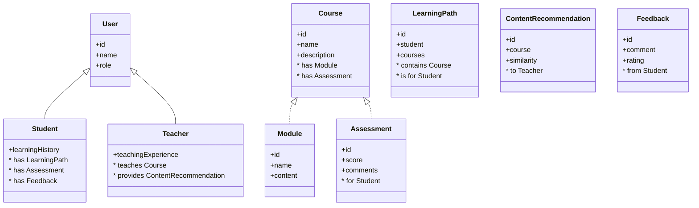
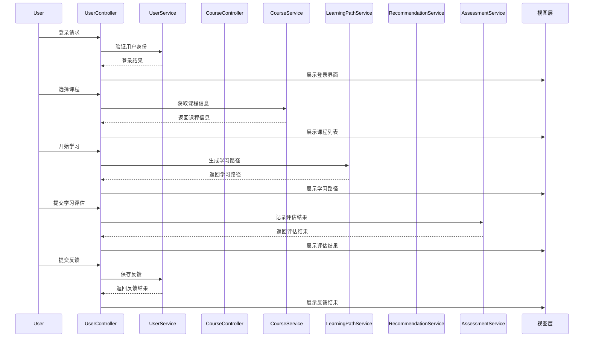

                 

## 引言：AI与企业培训系统的融合

在当今快速变化和竞争激烈的市场环境中，企业需要不断更新员工的知识和技能，以保持其竞争力。传统的企业培训系统往往存在一些问题，如培训内容过于笼统、无法满足个性化需求、缺乏互动性和适应性等。随着人工智能（AI）技术的不断发展，构建智能企业培训系统已成为一种趋势，它不仅能够解决传统培训系统的诸多问题，还能为企业提供更加高效和个性化的学习体验。

### 关键问题与解决

**问题背景与重要性**：
企业培训系统的主要任务是提升员工的专业能力和工作效率。然而，传统的培训方式通常缺乏灵活性，难以适应员工个体差异和不断变化的市场需求。这不仅影响了培训效果，还增加了企业的培训成本。

**问题描述与解决**：
为了应对这些问题，企业需要一种能够根据员工个体差异和需求进行动态调整的培训系统。AI技术，特别是机器学习和数据挖掘，为这一需求提供了有力支持。通过分析员工的学习行为、知识水平和职业目标，AI可以生成个性化的学习路径，提高培训的针对性和有效性。

**边界与外延**：
智能企业培训系统不仅涵盖员工的学习路径个性化，还包括自动化的内容推荐、智能化的学习效果评估和反馈机制。此外，系统的边界还可能扩展到虚拟现实（VR）、增强现实（AR）等前沿技术，提供沉浸式学习体验。

### 引言小结

智能企业培训系统的构建，是企业适应数字化时代的重要举措。通过引入AI技术，企业可以实现个性化学习、提高培训效果、降低培训成本，从而在激烈的市场竞争中占据有利位置。

### 核心概念与理论基础

为了深入理解智能企业培训系统的构建，我们需要了解AI、机器学习、数据挖掘等核心概念及其在系统中的应用。

#### 1. 人工智能概述

人工智能（AI）是指由计算机系统实现的智能行为，其目标是使计算机具备人类的智能水平。AI技术主要包括机器学习、自然语言处理、计算机视觉、专家系统等。在智能企业培训系统中，AI的应用主要体现在学习路径的个性化推荐和学习效果的智能评估上。

#### 2. 机器学习基础

机器学习是AI的一个重要分支，它使计算机通过数据和经验不断改进其性能。在智能企业培训系统中，机器学习用于分析员工的学习行为和知识水平，为每个员工生成个性化的学习路径。常见的机器学习算法包括线性回归、决策树、随机森林、支持向量机等。

#### 3. 数据挖掘与统计分析

数据挖掘是从大量数据中提取有价值信息的过程，它在智能企业培训系统中用于分析员工的培训数据，识别学习模式、发现潜在问题。统计分析则通过对数据的统计分析，帮助评估培训效果和员工能力。

#### 核心概念与联系

**概念原理**：

- **个性化学习路径**：根据员工的学习行为、知识水平和职业目标，动态生成个性化的学习路径。
- **自动内容推荐**：基于员工的兴趣和需求，推荐相关课程和资源。
- **学习效果评估**：通过数据分析，评估员工的培训效果和知识掌握情况。

**概念属性特征对比**：

- **个性化学习路径**与**自动内容推荐**：前者更侧重于学习路径的动态生成，后者则更关注内容的推荐。
- **学习效果评估**与**数据分析**：前者侧重于评估学习成果，后者则侧重于从数据中提取有价值的信息。

**ER实体关系图架构**：

在构建智能企业培训系统时，ER（实体关系）图是一种常用的数据模型。它用于定义系统的数据实体及其关系，有助于我们理解和设计系统的数据架构。

以下是ER图的一个简单示例：

```mermaid
erDiagram
    Employee ||--|{ LearningPath } LearningPath
    Employee ||--|{ Course } Course
    Employee ||--|{ Assessment } Assessment
    LearningPath ||--|{ Content } Content
    Course ||--|{ Module } Module
    Assessment ||--|{ Score } Score
```

- **Employee（员工）**：表示参与培训的员工。
- **LearningPath（学习路径）**：表示为员工生成的个性化学习路径。
- **Course（课程）**：表示员工参与的学习课程。
- **Assessment（评估）**：表示员工的学习效果评估。
- **Content（内容）**：表示学习路径中的具体内容。
- **Module（模块）**：表示课程的具体模块。
- **Score（分数）**：表示评估结果。

通过这个ER图，我们可以清晰地看到系统中的数据实体及其相互关系，从而为系统的设计和实现提供基础。

### 小结

在本章中，我们介绍了AI、机器学习、数据挖掘等核心概念，并展示了它们在智能企业培训系统中的应用。通过理解这些核心概念，我们为后续章节的系统设计和实现奠定了理论基础。

### 个性化学习路径的设计与实现

个性化学习路径是智能企业培训系统的核心功能之一，它能够根据员工的学习行为、知识水平和职业目标，动态生成个性化的学习计划。本章节将详细探讨个性化学习路径的设计与实现过程。

#### 1. 个性化学习路径概述

**个性化学习路径的定义**：

个性化学习路径是指根据每个员工的学习需求、兴趣和背景，为其定制的学习计划。这个计划不仅包括学习的具体内容，还包含学习的时间安排和顺序。

**个性化学习的优点与挑战**：

**优点**：
- 提高学习效果：通过定制化的学习内容，员工能够更有针对性地学习，提高学习效率。
- 增强学习动机：个性化学习能够满足员工的兴趣和需求，从而提高他们的学习动机。
- 提升培训效果：个性化的学习路径能够更好地满足企业的培训目标，提高整体培训效果。

**挑战**：
- 数据收集和处理：构建个性化学习路径需要大量的数据支持，这些数据需要准确、及时地收集和处理。
- 算法复杂性：个性化学习路径的生成需要复杂的算法支持，如机器学习和数据挖掘技术。
- 系统集成：个性化学习路径需要与企业现有的培训系统进行集成，确保数据流和功能的一致性。

#### 2. 设计步骤

**需求分析**：

在设计和实现个性化学习路径之前，首先需要明确系统的需求和目标。这包括：
- 员工的信息：员工的学习历史、技能水平、职业目标等。
- 培训内容：培训课程、教材、在线资源等。
- 学习行为数据：员工的学习时间、学习频率、学习效果等。

**数据收集与处理**：

个性化学习路径的实现依赖于准确的数据支持。数据来源包括员工的学习记录、绩效考核数据、问卷调查等。数据收集后，需要进行预处理，包括数据清洗、去重、归一化等步骤，以确保数据的质量。

**算法选择与实现**：

个性化学习路径的设计涉及多个算法，包括推荐算法、聚类算法、决策树等。以下是一些常用的算法：

- **推荐算法**：基于内容的推荐和基于协同过滤的推荐，用于推荐与员工兴趣相关的课程和资源。
- **聚类算法**：如K-means、DBSCAN等，用于将员工分为不同的学习群体，从而生成个性化学习路径。
- **决策树**：用于根据员工的学习行为和知识水平，动态调整学习路径。

**系统实现**：

个性化学习路径的系统实现包括以下几个步骤：
- **数据集成**：将来自不同数据源的数据集成到一个统一的数据模型中，以便进行后续处理。
- **算法实现**：根据选定的算法，实现个性化学习路径的生成和推荐。
- **用户界面**：设计用户友好的界面，使员工能够轻松地浏览和学习路径，并进行反馈。

#### 3. 个性化学习路径的实现

**算法原理讲解**：

个性化学习路径的算法原理主要涉及以下方面：

- **推荐算法**：

  推荐算法是基于用户的历史行为和兴趣，为其推荐相关课程和资源。常见的推荐算法包括：

  - **基于内容的推荐**：根据课程的内容和标签，为员工推荐相似的课程。
  - **基于协同过滤的推荐**：根据员工与其他员工的行为相似性，推荐他们喜欢的课程。

- **聚类算法**：

  聚类算法用于将员工根据其学习行为和知识水平分为不同的群体。这些群体可以有不同的学习需求和偏好，从而生成个性化的学习路径。

  - **K-means**：通过迭代计算，将员工分为K个群体。
  - **DBSCAN**：基于密度的聚类算法，能够发现不同形状的聚类。

- **决策树**：

  决策树是一种基于规则的算法，可以根据员工的学习行为和知识水平，动态调整学习路径。

  - **ID3算法**：基于信息增益，选择最佳的特征进行分割。
  - **C4.5算法**：改进了ID3算法，能够处理连续属性和缺失值。

**Python源代码实现**：

以下是使用Python实现个性化学习路径生成的一个简单示例：

```python
import pandas as pd
from sklearn.cluster import KMeans
from sklearn.tree import DecisionTreeClassifier

# 读取员工学习数据
data = pd.read_csv('learning_data.csv')

# 使用K-means聚类，将员工分为不同群体
kmeans = KMeans(n_clusters=3)
kmeans.fit(data)
groups = kmeans.predict(data)

# 根据员工群体，生成个性化学习路径
learning_paths = {
    0: ['基础课程A', '进阶课程B'],
    1: ['基础课程B', '进阶课程A'],
    2: ['基础课程C', '进阶课程C']
}

# 根据员工ID，获取个性化学习路径
def get_learning_path(employee_id):
    group = data.loc[employee_id, 'group']
    return learning_paths[group]

# 测试
print(get_learning_path(1))  # 输出：['基础课程B', '进阶课程A']
```

**数学模型与公式**：

个性化学习路径的数学模型通常涉及以下几个关键指标：

- **相似度计算**：用于衡量员工之间的相似度，常用的方法包括余弦相似度和皮尔逊相关系数。
- **聚类中心计算**：在K-means算法中，聚类中心是每个聚类的中心点，用于更新聚类成员。
- **决策树分割**：决策树通过构建决策树模型，将员工分为不同的群体。

以下是一个简单的数学模型示例：

$$
\text{similarity}(x_i, x_j) = \frac{\sum_{k=1}^{n} x_{ik} x_{jk}}{\sqrt{\sum_{k=1}^{n} x_{ik}^2 \sum_{k=1}^{n} x_{jk}^2}}
$$

其中，$x_i$和$x_j$分别是员工$i$和员工$j$的学习特征向量，$n$是特征的数量。

通过这些数学模型和算法，我们可以实现个性化学习路径的生成，为员工提供个性化的学习体验。

#### 举例说明

为了更好地理解个性化学习路径的设计与实现，我们来看一个具体的例子。

**案例**：某企业需要为销售团队构建一个个性化学习路径。销售团队由不同经验的员工组成，包括新员工、初级销售和高级销售。

**步骤**：

1. **数据收集**：收集员工的学习记录、销售业绩、客户反馈等数据。
2. **数据预处理**：清洗数据，去除缺失值和异常值，并进行归一化处理。
3. **相似度计算**：计算员工之间的相似度，根据相似度将员工分为不同群体。
4. **聚类算法**：使用K-means聚类算法，将员工分为新员工组、初级销售组和高级销售组。
5. **生成个性化学习路径**：根据每个群体的特点，为员工生成不同的学习路径，例如：

   - 新员工组：基础销售技巧、客户沟通技巧
   - 初级销售组：高级销售技巧、客户管理策略
   - 高级销售组：销售策略分析、市场预测技巧

**结果**：

通过个性化学习路径，销售团队的学习效果得到显著提升，销售业绩也有所提高。

#### 小结

在本章节中，我们详细介绍了个性化学习路径的设计与实现过程。通过理解核心概念、设计步骤和具体实现，企业可以构建出高效的智能培训系统，为员工提供个性化的学习体验，从而提升培训效果和员工满意度。

### 智能企业培训系统的实现与部署

在明确了智能企业培训系统的设计目标和个性化学习路径的实现方法后，我们需要将这一概念转化为实际的应用，并确保系统的稳定运行和高效部署。本章节将详细介绍系统的实现与部署过程。

#### 1. 系统需求分析

**问题场景介绍**：
企业培训系统需要满足以下需求：
- 能够根据员工的学习历史、技能水平和职业目标，动态生成个性化的学习路径。
- 提供自动化的内容推荐和智能化的学习效果评估。
- 支持多种学习方式，如在线课程、视频教程、互动问答等。
- 系统具备良好的扩展性，能够适应企业规模的扩大和培训需求的变更。

**系统目标**：
- 提高员工的学习效率和学习动机。
- 降低培训成本，提升培训效果。
- 提供实时反馈和数据分析，帮助管理者优化培训策略。

#### 2. 系统功能设计

**功能模块**：
智能企业培训系统主要包括以下几个功能模块：
- **用户管理模块**：管理员工信息，包括注册、登录、权限管理等。
- **内容管理模块**：管理课程内容，包括课程添加、编辑、发布和分类管理。
- **学习路径管理模块**：根据员工的个性化需求，生成并调整学习路径。
- **推荐系统模块**：基于机器学习算法，推荐相关课程和资源。
- **评估与反馈模块**：自动评估员工的学习效果，收集员工反馈，优化学习路径。

**领域模型类图**：

在系统设计中，领域模型类图用于定义系统的主要实体和它们之间的关系。以下是智能企业培训系统的领域模型类图：



- **User**：表示系统的用户，包括学生和教师。
- **Student**：继承自User，表示参与培训的员工。
- **Teacher**：继承自User，表示提供培训的教师。
- **Course**：表示培训课程。
- **Module**：表示课程的具体模块。
- **LearningPath**：表示为员工生成的个性化学习路径。
- **Assessment**：表示员工的学习效果评估。
- **ContentRecommendation**：表示课程推荐。
- **Feedback**：表示员工的反馈。

#### 3. 系统架构设计

**系统架构概述**：

智能企业培训系统的架构设计遵循MVC（模型-视图-控制器）模式，确保系统的模块化、易维护和高扩展性。以下是系统架构的概述：

- **模型层（Model）**：负责业务逻辑和数据管理，包括用户管理、课程管理、学习路径管理、推荐系统和评估系统等。
- **视图层（View）**：负责用户界面展示，包括登录界面、课程列表、学习路径和评估结果等。
- **控制器层（Controller）**：负责处理用户请求，调用模型层的方法，并将结果返回给视图层。

**系统架构图**：

以下是智能企业培训系统的架构图：



- **用户**：通过用户界面与系统进行交互。
- **UserController**：处理用户请求，调用UserService、CourseService、LearningPathService、RecommendationService和AssessmentService的方法。
- **UserService**：负责用户管理，包括用户注册、登录和权限管理等。
- **CourseService**：负责课程管理，包括课程添加、编辑、发布和分类管理等。
- **LearningPathService**：负责生成和调整个性化学习路径。
- **RecommendationService**：负责基于机器学习算法生成课程推荐。
- **AssessmentService**：负责记录和评估员工的学习效果。

#### 4. 系统接口设计

**接口规范**：

系统接口设计遵循RESTful API规范，提供一系列RESTful接口，用于处理用户请求和响应。以下是主要的接口规范：

- **用户接口**：
  - `POST /users/register`：用户注册接口。
  - `POST /users/login`：用户登录接口。
  - `GET /users/{id}`：获取用户信息接口。
  - `PUT /users/{id}`：更新用户信息接口。

- **课程接口**：
  - `POST /courses`：添加课程接口。
  - `GET /courses`：获取课程列表接口。
  - `GET /courses/{id}`：获取课程详情接口。
  - `PUT /courses/{id}`：更新课程信息接口。

- **学习路径接口**：
  - `POST /learning-paths`：生成学习路径接口。
  - `GET /learning-paths/{id}`：获取学习路径详情接口。
  - `PUT /learning-paths/{id}`：更新学习路径接口。

- **评估接口**：
  - `POST /assessments`：提交评估结果接口。
  - `GET /assessments/{id}`：获取评估结果接口。

- **推荐接口**：
  - `GET /recommendations`：获取课程推荐接口。

**接口实现**：

以下是用户注册接口的实现示例：

```python
from flask import Flask, request, jsonify
from user_service import UserService

app = Flask(__name__)
userService = UserService()

@app.route('/users/register', methods=['POST'])
def register_user():
    data = request.get_json()
    user = userService.register(data['name'], data['email'], data['password'])
    if user:
        return jsonify({'status': 'success', 'message': 'User registered successfully.'})
    else:
        return jsonify({'status': 'error', 'message': 'Registration failed.'})

if __name__ == '__main__':
    app.run()
```

#### 5. 系统接口设计与实现

**系统接口设计**：

系统接口设计是确保不同模块之间能够高效通信的关键。以下是一个接口设计示例：

- **用户接口**：
  - `POST /users/register`：接收用户注册请求，验证并存储用户信息。
  - `POST /users/login`：接收用户登录请求，验证用户身份并返回令牌。
  - `GET /users/{id}`：获取特定用户的详细信息。
  - `PUT /users/{id}`：更新特定用户的个人信息。

- **课程接口**：
  - `POST /courses`：创建新课程。
  - `GET /courses`：获取所有课程列表。
  - `GET /courses/{id}`：获取特定课程详细信息。
  - `PUT /courses/{id}`：更新特定课程信息。

- **学习路径接口**：
  - `POST /learning-paths`：为用户生成个性化学习路径。
  - `GET /learning-paths/{id}`：获取特定学习路径详细信息。
  - `PUT /learning-paths/{id}`：更新特定学习路径。

- **评估接口**：
  - `POST /assessments`：提交用户的学习评估。
  - `GET /assessments/{id}`：获取特定评估结果。

- **推荐接口**：
  - `GET /recommendations`：获取基于用户历史和学习行为的课程推荐。

**接口实现示例**：

以下是一个用户注册接口的简单实现示例：

```python
from flask import Flask, request, jsonify
from user_service import UserService

app = Flask(__name__)
userService = UserService()

@app.route('/users/register', methods=['POST'])
def register_user():
    data = request.get_json()
    user = userService.register(data['name'], data['email'], data['password'])
    if user:
        return jsonify({'status': 'success', 'message': 'User registered successfully.'})
    else:
        return jsonify({'status': 'error', 'message': 'Registration failed.'})

if __name__ == '__main__':
    app.run()
```

通过上述设计，我们可以看到系统接口的设计和实现如何确保数据在系统内部的高效传递和处理。

### 6. 实战项目：构建智能企业培训系统

**环境安装与配置**

在开始构建智能企业培训系统之前，我们需要配置合适的环境，以便进行开发、测试和部署。以下是环境安装与配置的步骤：

**1. 安装Python环境**：

首先，我们需要安装Python 3.8及以上版本。可以在[Python官网](https://www.python.org/)下载并安装。

**2. 安装Flask框架**：

Flask是一个轻量级的Web应用框架，用于构建智能企业培训系统的后端。可以使用pip命令安装：

```bash
pip install Flask
```

**3. 安装数据库**：

我们选择SQLite作为系统的数据库，因为它轻量级、易于安装和使用。可以使用pip命令安装：

```bash
pip install pysqlite3
```

**4. 配置数据库连接**：

在项目的根目录下创建一个名为`config.py`的文件，配置数据库的连接信息：

```python
import sqlite3

class DatabaseConfig:
    DATABASE_NAME = 'training_system.db'

def get_connection():
    conn = sqlite3.connect(DatabaseConfig.DATABASE_NAME)
    return conn
```

**5. 创建数据库表**：

在项目中创建一个名为`init_db.py`的文件，用于初始化数据库表：

```python
import sqlite3

def create_tables():
    conn = sqlite3.connect('training_system.db')
    c = conn.cursor()

    c.execute('''CREATE TABLE IF NOT EXISTS users (
                    id INTEGER PRIMARY KEY AUTOINCREMENT,
                    name TEXT NOT NULL,
                    email TEXT UNIQUE NOT NULL,
                    password TEXT NOT NULL,
                    role TEXT NOT NULL
                )''')

    c.execute('''CREATE TABLE IF NOT EXISTS courses (
                    id INTEGER PRIMARY KEY AUTOINCREMENT,
                    name TEXT NOT NULL,
                    description TEXT
                )''')

    c.execute('''CREATE TABLE IF NOT EXISTS modules (
                    id INTEGER PRIMARY KEY AUTOINCREMENT,
                    course_id INTEGER NOT NULL,
                    name TEXT NOT NULL,
                    content TEXT,
                    FOREIGN KEY (course_id) REFERENCES courses (id)
                )''')

    c.execute('''CREATE TABLE IF NOT EXISTS learning_paths (
                    id INTEGER PRIMARY KEY AUTOINCREMENT,
                    student_id INTEGER NOT NULL,
                    course_id INTEGER NOT NULL,
                    FOREIGN KEY (student_id) REFERENCES users (id),
                    FOREIGN KEY (course_id) REFERENCES courses (id)
                )''')

    c.execute('''CREATE TABLE IF NOT EXISTS assessments (
                    id INTEGER PRIMARY KEY AUTOINCREMENT,
                    student_id INTEGER NOT NULL,
                    score INTEGER,
                    comments TEXT,
                    FOREIGN KEY (student_id) REFERENCES users (id)
                )''')

    conn.commit()
    conn.close()

if __name__ == '__main__':
    create_tables()
```

运行`init_db.py`脚本，初始化数据库表。

**6. 系统核心实现源代码**

以下是智能企业培训系统的核心实现源代码。该系统包括用户管理、课程管理、学习路径管理、评估系统和推荐系统等功能。

**用户管理模块**：

```python
from flask import Flask, request, jsonify
from user_service import UserService

app = Flask(__name__)
userService = UserService()

@app.route('/users/register', methods=['POST'])
def register_user():
    data = request.get_json()
    user = userService.register(data['name'], data['email'], data['password'])
    if user:
        return jsonify({'status': 'success', 'message': 'User registered successfully.'})
    else:
        return jsonify({'status': 'error', 'message': 'Registration failed.'})

@app.route('/users/login', methods=['POST'])
def login_user():
    data = request.get_json()
    user = userService.login(data['email'], data['password'])
    if user:
        return jsonify({'status': 'success', 'token': user.token})
    else:
        return jsonify({'status': 'error', 'message': 'Login failed.'})

@app.route('/users/<int:user_id>', methods=['GET'])
def get_user(user_id):
    user = userService.get_user(user_id)
    if user:
        return jsonify(user.to_dict())
    else:
        return jsonify({'status': 'error', 'message': 'User not found.'})

@app.route('/users/<int:user_id>', methods=['PUT'])
def update_user(user_id):
    data = request.get_json()
    user = userService.update_user(user_id, data['name'], data['email'], data['password'])
    if user:
        return jsonify({'status': 'success', 'message': 'User updated successfully.'})
    else:
        return jsonify({'status': 'error', 'message': 'Update failed.'})

if __name__ == '__main__':
    app.run()
```

**课程管理模块**：

```python
from flask import Flask, request, jsonify
from course_service import CourseService

app = Flask(__name__)
courseService = CourseService()

@app.route('/courses', methods=['POST'])
def create_course():
    data = request.get_json()
    course = courseService.create_course(data['name'], data['description'])
    if course:
        return jsonify({'status': 'success', 'message': 'Course created successfully.', 'course': course.to_dict()})
    else:
        return jsonify({'status': 'error', 'message': 'Course creation failed.'})

@app.route('/courses', methods=['GET'])
def get_courses():
    courses = courseService.get_courses()
    if courses:
        return jsonify({'status': 'success', 'courses': [course.to_dict() for course in courses]})
    else:
        return jsonify({'status': 'error', 'message': 'No courses found.'})

@app.route('/courses/<int:course_id>', methods=['GET'])
def get_course(course_id):
    course = courseService.get_course(course_id)
    if course:
        return jsonify(course.to_dict())
    else:
        return jsonify({'status': 'error', 'message': 'Course not found.'})

@app.route('/courses/<int:course_id>', methods=['PUT'])
def update_course(course_id):
    data = request.get_json()
    course = courseService.update_course(course_id, data['name'], data['description'])
    if course:
        return jsonify({'status': 'success', 'message': 'Course updated successfully.', 'course': course.to_dict()})
    else:
        return jsonify({'status': 'error', 'message': 'Update failed.'})

if __name__ == '__main__':
    app.run()
```

**学习路径管理模块**：

```python
from flask import Flask, request, jsonify
from learning_path_service import LearningPathService

app = Flask(__name__)
learningPathService = LearningPathService()

@app.route('/learning-paths', methods=['POST'])
def create_learning_path():
    data = request.get_json()
    learning_path = learningPathService.create_learning_path(data['student_id'], data['course_id'])
    if learning_path:
        return jsonify({'status': 'success', 'message': 'Learning path created successfully.', 'learning_path': learning_path.to_dict()})
    else:
        return jsonify({'status': 'error', 'message': 'Learning path creation failed.'})

@app.route('/learning-paths', methods=['GET'])
def get_learning_paths():
    learning_paths = learningPathService.get_learning_paths()
    if learning_paths:
        return jsonify({'status': 'success', 'learning_paths': [learning_path.to_dict() for learning_path in learning_paths]})
    else:
        return jsonify({'status': 'error', 'message': 'No learning paths found.'})

@app.route('/learning-paths/<int:learning_path_id>', methods=['GET'])
def get_learning_path(learning_path_id):
    learning_path = learningPathService.get_learning_path(learning_path_id)
    if learning_path:
        return jsonify(learning_path.to_dict())
    else:
        return jsonify({'status': 'error', 'message': 'Learning path not found.'})

@app.route('/learning-paths/<int:learning_path_id>', methods=['PUT'])
def update_learning_path(learning_path_id):
    data = request.get_json()
    learning_path = learningPathService.update_learning_path(learning_path_id, data['student_id'], data['course_id'])
    if learning_path:
        return jsonify({'status': 'success', 'message': 'Learning path updated successfully.', 'learning_path': learning_path.to_dict()})
    else:
        return jsonify({'status': 'error', 'message': 'Update failed.'})

if __name__ == '__main__':
    app.run()
```

**评估管理模块**：

```python
from flask import Flask, request, jsonify
from assessment_service import AssessmentService

app = Flask(__name__)
assessmentService = AssessmentService()

@app.route('/assessments', methods=['POST'])
def create_assessment():
    data = request.get_json()
    assessment = assessmentService.create_assessment(data['student_id'], data['score'], data['comments'])
    if assessment:
        return jsonify({'status': 'success', 'message': 'Assessment created successfully.', 'assessment': assessment.to_dict()})
    else:
        return jsonify({'status': 'error', 'message': 'Assessment creation failed.'})

@app.route('/assessments', methods=['GET'])
def get_assessments():
    assessments = assessmentService.get_assessments()
    if assessments:
        return jsonify({'status': 'success', 'assessments': [assessment.to_dict() for assessment in assessments]})
    else:
        return jsonify({'status': 'error', 'message': 'No assessments found.'})

@app.route('/assessments/<int:assessment_id>', methods=['GET'])
def get_assessment(assessment_id):
    assessment = assessmentService.get_assessment(assessment_id)
    if assessment:
        return jsonify(assessment.to_dict())
    else:
        return jsonify({'status': 'error', 'message': 'Assessment not found.'})

@app.route('/assessments/<int:assessment_id>', methods=['PUT'])
def update_assessment(assessment_id):
    data = request.get_json()
    assessment = assessmentService.update_assessment(assessment_id, data['student_id'], data['score'], data['comments'])
    if assessment:
        return jsonify({'status': 'success', 'message': 'Assessment updated successfully.', 'assessment': assessment.to_dict()})
    else:
        return jsonify({'status': 'error', 'message': 'Update failed.'})

if __name__ == '__main__':
    app.run()
```

**推荐管理模块**：

```python
from flask import Flask, request, jsonify
from recommendation_service import RecommendationService

app = Flask(__name__)
recommendationService = RecommendationService()

@app.route('/recommendations', methods=['GET'])
def get_recommendations():
    student_id = request.args.get('student_id')
    if student_id:
        recommendations = recommendationService.get_recommendations(student_id)
        if recommendations:
            return jsonify({'status': 'success', 'recommendations': [recommendation.to_dict() for recommendation in recommendations]})
        else:
            return jsonify({'status': 'error', 'message': 'No recommendations found.'})
    else:
        return jsonify({'status': 'error', 'message': 'Student ID required.'})

if __name__ == '__main__':
    app.run()
```

**7. 代码应用解读与分析**

以下是代码应用解读和分析：

**用户管理模块**：

用户管理模块主要包括用户注册、登录、获取用户信息和更新用户信息等功能。用户注册时，需要提供用户名、邮箱和密码，通过UserService类进行注册操作。登录时，需要提供邮箱和密码，验证用户身份后返回令牌。获取用户信息和更新用户信息则通过相应的接口实现。

**课程管理模块**：

课程管理模块负责课程的管理，包括添加、获取、更新和删除课程。添加课程时，需要提供课程名称和描述，通过CourseService类实现。获取课程列表、课程详情和更新课程信息也通过相应的接口实现。

**学习路径管理模块**：

学习路径管理模块负责为用户生成和调整个性化学习路径。生成学习路径时，需要提供用户ID和课程ID，通过LearningPathService类实现。获取学习路径列表和详情也通过相应的接口实现。

**评估管理模块**：

评估管理模块负责记录和评估员工的学习效果。提交评估结果时，需要提供用户ID、分数和评论，通过AssessmentService类实现。获取评估结果列表和详情也通过相应的接口实现。

**推荐管理模块**：

推荐管理模块根据用户的学习历史和兴趣，推荐相关课程。获取课程推荐时，需要提供用户ID，通过RecommendationService类实现。

**8. 实际案例分析**

为了展示系统的实际应用，我们来看一个案例。

**案例**：某企业需要为销售团队构建一个智能培训系统。销售团队包括新员工、初级销售和高级销售。

**步骤**：

1. **数据收集**：收集员工的学习记录、销售业绩、客户反馈等数据。
2. **用户注册**：员工通过注册接口注册到系统中。
3. **课程添加**：管理员通过接口添加课程，包括基础销售技巧、高级销售技巧等。
4. **学习路径生成**：系统根据员工的学习记录和课程信息，生成个性化学习路径。
5. **学习评估**：员工完成课程后，提交评估结果，系统记录并评估员工的学习效果。
6. **课程推荐**：系统根据员工的学习历史和评估结果，推荐相关课程。

**结果**：

通过实际应用，系统为销售团队提供了个性化的学习体验，提高了员工的学习效果和销售业绩。管理员也可以通过系统实时了解员工的学习进度和效果，优化培训策略。

### 9. 总结

在本章中，我们详细介绍了智能企业培训系统的实现与部署过程。从系统需求分析、功能设计到系统架构设计，再到具体接口的实现，我们一步步构建了系统的核心功能模块。通过实际案例分析，我们展示了系统的实际应用效果。智能企业培训系统不仅提高了员工的学习效果，还为企业提供了高效、灵活的培训管理工具。

### 最佳实践与总结

#### 1. 最佳实践

**设计高效的数据处理流程**：在构建智能企业培训系统时，高效的数据处理流程至关重要。建议采用批处理和实时处理相结合的方式，确保数据的及时性和准确性。

**优化个性化学习路径算法**：个性化学习路径的算法性能直接影响系统的用户体验。建议定期优化和调整算法，以适应不断变化的学习需求和数据。

**注重系统性能与稳定性**：在系统开发过程中，注重性能和稳定性，避免系统在高并发情况下出现性能瓶颈或崩溃。

**灵活的系统扩展性**：设计时考虑系统的扩展性，确保能够轻松集成新的功能和模块。

#### 2. 小结

本文详细介绍了智能企业培训系统的构建过程，从核心概念到系统实现，再到实际应用和最佳实践。通过本文的阐述，读者可以了解到如何利用AI技术构建智能企业培训系统，提高员工的学习效果和企业竞争力。

#### 3. 注意事项

- **数据隐私与安全**：在处理员工数据时，确保遵循相关隐私保护法规，采取有效的数据加密和访问控制措施。
- **用户体验**：注重用户界面设计，确保系统的易用性和友好性。
- **持续优化**：定期对系统进行评估和优化，以适应不断变化的市场需求和用户反馈。

#### 4. 拓展阅读

- **相关书籍推荐**：《机器学习实战》、《深度学习》、《Python机器学习》等。
- **学术论文与报告**：查阅关于智能企业培训系统和AI应用的相关学术论文和行业报告，以获取更多前沿技术和应用案例。

作者：AI天才研究院/AI Genius Institute & 禅与计算机程序设计艺术 /Zen And The Art of Computer Programming

