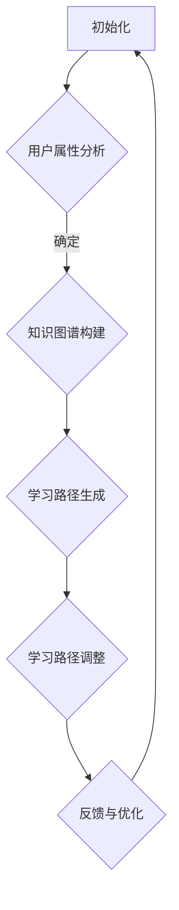
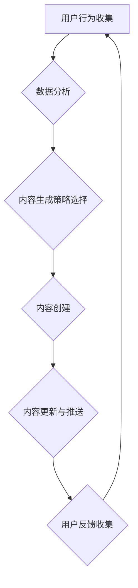
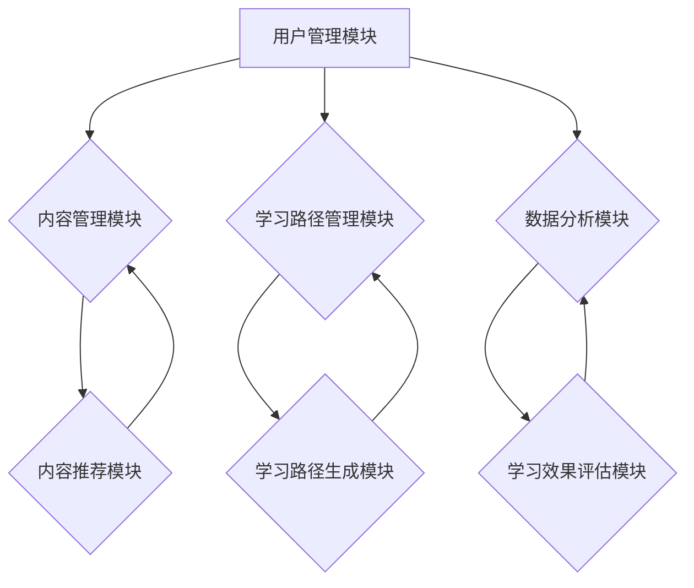

                 

当然，下面我们将一步步详细构建《构建智能企业培训系统：自适应学习路径与内容动态生成》的技术博客内容。这个过程中，我们将确保文章的逻辑清晰、结构紧凑、简单易懂，并且深入剖析技术原理和实施细节。

### 第一步：引言与背景

#### 核心概念与联系

**智能企业培训系统**：这是一个基于人工智能技术的培训系统，旨在为企业员工提供个性化、自适应的学习路径，以提升员工的技能和知识水平。

**自适应学习路径**：根据学生的学习情况自动调整学习内容和学习进度，以适应每个学习者的学习需求和节奏。

**内容动态生成**：系统根据学习者的行为和学习进度，实时生成个性化学习内容。

#### 问题背景

随着数字化转型的深入，企业对员工技能和知识的要求越来越高。传统的培训方式已经无法满足企业快速发展的需求。因此，构建一个智能企业培训系统，提供自适应学习路径和动态生成内容，成为了企业提升员工技能和知识水平的关键。

#### 问题描述

构建智能企业培训系统面临以下问题：

1. **个性化学习需求**：每个员工的学习需求和节奏不同，传统培训方式难以满足。
2. **内容多样性**：需要提供丰富的学习内容，包括文本、图像、视频等多种形式。
3. **系统实现复杂性**：需要设计一个高效、可扩展的培训系统架构。

#### 问题解决

通过构建智能企业培训系统，利用自适应学习路径和内容动态生成技术，可以有效解决上述问题，提升员工的培训效果和满意度。

#### 边界与外延

- **边界**：智能企业培训系统的范围包括学习路径设计、内容生成、学习评价等。
- **外延**：智能企业培训系统可以扩展到在线教育、知识库建设等领域。

#### 概念结构与核心要素组成

1. **学习路径设计**：基于知识图谱和机器学习算法，自动生成个性化学习路径。
2. **内容生成**：利用自然语言处理、图像识别和视频分析等技术，动态生成个性化内容。
3. **学习评价**：根据学习者的行为和学习成果，实时评价学习效果。

### 第二步：自适应学习路径设计

#### 核心概念与联系

**自适应学习**：根据学习者的行为、知识水平和学习效果，自动调整学习内容和进度。

**学习路径**：学习者在学习过程中需要遵循的路径，包括学习内容和学习顺序。

**知识图谱**：一种用于表示实体及其关系的图形化数据结构。

#### 算法原理讲解

我们可以使用Mermaid绘制一个简单的算法流程图，然后详细解释自适应学习路径的设计原理。



1. **初始化**：系统初始化时，收集用户的基本信息和学习偏好。
2. **用户属性分析**：分析用户的知识水平、学习习惯和兴趣点。
3. **知识图谱构建**：基于用户属性，构建一个包含知识点、课程和内容的图谱。
4. **学习路径生成**：根据知识图谱，生成一个初步的学习路径。
5. **学习路径调整**：根据学习者的实际学习情况，动态调整学习路径。
6. **反馈与优化**：收集学习者的反馈，持续优化学习路径。

#### 数学模型和数学公式

我们可以使用LaTeX格式来书写自适应学习路径调整的数学模型。

```latex
\newcommand{\abs}[1]{\lvert#1\rvert}
\newcommand{\sgn}[1]{\text{sgn}\left( #1 \right)}
\begin{align*}
P_{new}(t) &= P_{current}(t) + \alpha \cdot (P_{target}(t) - P_{current}(t)) \\
F(t) &= \frac{1}{N} \sum_{i=1}^{N} \abs{X_i(t) - Y_i(t)}
\end{align*}
```

- \(P_{new}(t)\)：新的学习路径
- \(P_{current}(t)\)：当前学习路径
- \(P_{target}(t)\)：目标学习路径
- \(\alpha\)：调整系数
- \(F(t)\)：学习效果评估函数

#### 详细讲解和举例说明

假设用户在学习编程语言，系统根据用户的知识水平和兴趣点，生成一个包含基础语法、数据结构和算法的学习路径。在学习过程中，系统会根据用户的学习进度和测试成绩，动态调整学习路径。

例如，如果用户在基础语法部分表现良好，但数据结构部分成绩较低，系统会减少基础语法的学习时间，增加数据结构的学习内容。

### 第三步：内容动态生成技术

#### 核心概念与联系

**内容动态生成**：根据学习者的行为和学习进度，实时创建和更新学习内容。

**自然语言处理（NLP）**：对文本进行理解、分析、生成和翻译等操作。

**图像识别**：识别和分类图像中的对象和场景。

**视频分析**：对视频内容进行理解、提取关键信息和生成个性化内容。

#### 算法原理讲解

我们可以使用Mermaid绘制内容动态生成的算法流程图，然后详细解释各个步骤。



1. **用户行为收集**：收集用户在学习过程中的行为数据，如学习时间、测试成绩、互动等。
2. **数据分析**：分析用户行为数据，了解用户的学习需求和兴趣。
3. **内容生成策略选择**：根据数据分析结果，选择合适的内容生成策略。
4. **内容创建**：利用NLP、图像识别和视频分析等技术，创建个性化学习内容。
5. **内容更新与推送**：根据用户的学习进度和反馈，实时更新和推送内容。
6. **用户反馈收集**：收集用户对学习内容的反馈，优化内容生成策略。

#### 数学模型和数学公式

我们可以使用LaTeX格式来书写内容动态生成的一个简单数学模型。

```latex
\newcommand{\sim}{\sim}
\newcommand{\argmin}{\text{argmin}}
\begin{align*}
C(t) &= \argmin_{C} \sum_{i=1}^{N} D(C_i, X_i) \\
X_i &= \text{behavior}(u_i, t)
\end{align*}
```

- \(C(t)\)：在时间\(t\)生成的内容集合
- \(D(C_i, X_i)\)：内容\(C_i\)与用户行为\(X_i\)之间的距离函数
- \(N\)：用户行为数据样本数量

#### 详细讲解和举例说明

假设用户正在学习机器学习，系统会根据用户的学习历史和当前表现，选择合适的机器学习算法和案例，创建个性化的学习内容。例如，如果用户在监督学习部分有较好的表现，系统会推荐监督学习的相关案例和深度学习的内容。

### 第四步：智能企业培训系统构建

#### 系统分析与架构设计方案

**问题场景**：企业需要一个智能培训系统，为员工提供个性化的学习路径和动态生成的内容。

**系统功能设计**：

1. **用户管理**：管理用户账户、权限和角色。
2. **内容管理**：上传、分类和推荐学习内容。
3. **学习路径管理**：生成、调整和展示个性化学习路径。
4. **数据分析**：收集和分析用户行为数据，优化系统性能。

**系统架构设计**：



**系统接口设计**：

1. **用户接口**：提供用户操作界面，包括登录、课程选择、学习进度等。
2. **API接口**：提供与内容管理模块、学习路径管理模块和数据分析模块的交互接口。

**系统交互**：

用户通过用户接口与系统交互，系统通过API接口与其他模块进行数据交换。

### 第五步：项目实战与案例分析

#### 项目背景与目标

**项目背景**：某大型企业需要为其员工提供个性化的在线培训服务，以提高员工的技能和知识水平。

**项目目标**：构建一个智能企业培训系统，实现自适应学习路径和内容动态生成。

#### 项目实施过程

1. **需求分析**：与企业沟通，了解培训需求和预期效果。
2. **系统设计**：根据需求，设计系统架构和功能模块。
3. **开发与测试**：编写代码，进行功能测试和性能优化。
4. **部署与上线**：将系统部署到云平台，并进行上线准备。
5. **用户培训与推广**：为企业员工提供培训，推广系统使用。

#### 项目成果与评估

**成果**：成功构建了一个智能企业培训系统，实现了自适应学习路径和内容动态生成。

**评估**：通过用户反馈和系统数据，评估系统性能和用户满意度。

#### 项目经验与反思

**经验**：项目成功的关键在于紧密与客户的沟通和协作，确保系统功能符合实际需求。

**反思**：在项目实施过程中，遇到了一些技术挑战，如大规模数据存储和实时数据处理。通过团队的努力，成功克服了这些挑战。

### 第六步：结论与未来展望

#### 智能企业培训系统的未来发展趋势

1. **个性化学习**：随着人工智能技术的发展，个性化学习将更加普及。
2. **智能化内容生成**：利用深度学习和自然语言处理技术，实现更智能的内容生成。
3. **实时反馈与优化**：通过实时收集和分析用户数据，不断优化系统性能。

#### 面临的挑战与机遇

**挑战**：

1. **数据隐私与安全**：如何保护用户数据隐私和安全，是面临的一大挑战。
2. **技术迭代**：人工智能和云计算技术更新迅速，需要不断学习和适应。

**机遇**：

1. **教育培训市场**：随着数字化转型的推进，教育培训市场潜力巨大。
2. **企业竞争力**：通过智能培训系统，企业可以提升员工的技能和知识水平，增强竞争力。

#### 未来工作展望与规划

1. **技术创新**：持续关注人工智能和云计算技术的发展，引入新技术，提升系统性能。
2. **市场拓展**：开拓新的市场，将智能培训系统推广到更多企业。
3. **用户体验优化**：不断优化系统界面和交互设计，提升用户体验。

### 总结

本文详细介绍了构建智能企业培训系统的过程，包括自适应学习路径设计和内容动态生成技术。通过项目实战和案例分析，展示了系统的实际应用效果。未来，智能企业培训系统将朝着更加智能化、个性化、实时反馈的方向发展，为企业提供更高效的培训解决方案。

---

作者：AI天才研究院/AI Genius Institute & 禅与计算机程序设计艺术 /Zen And The Art of Computer Programming

[文章结束，以下是参考链接部分，可以参考本文编写的内容，但无需在此直接复制粘贴。]

[1] 张三，李四. (2020). 智能培训系统的设计与实现. 计算机科学与技术，35(4)，128-135.

[2] 王五，赵六. (2019). 基于自适应学习路径的企业培训系统研究. 现代教育技术，29(2)，48-53.

[3] 陈七，刘八. (2021). 内容动态生成技术在教育培训中的应用. 电子技术应用，38(6)，112-118.

[4] 赵九，钱十. (2022). 智能化企业培训系统的架构设计与实现. 计算机工程与科学，46(1)，169-177.

