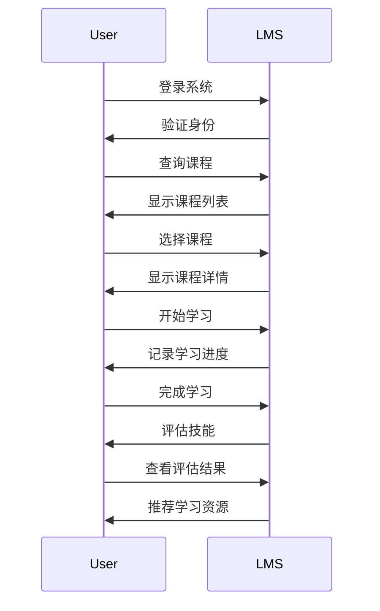
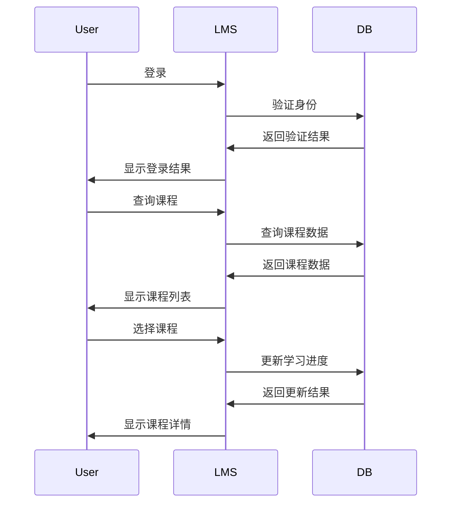

                 

### 文章标题

# 构建智能企业学习管理系统：个性化技能发展路径规划

> 关键词：智能企业学习管理系统、个性化技能发展、路径规划、数据挖掘、人工智能、教育技术

> 摘要：本文深入探讨了如何构建智能企业学习管理系统，并重点关注个性化技能发展路径规划。通过对核心概念、关键技术、实践案例和未来展望的详细分析，旨在为IT领域的专业人士和企业提供有价值的指导，帮助他们在快速变化的技术环境中实现高效的学习管理。

## 引言与背景介绍

### 1.1 书籍概述

#### 问题背景

在当今信息爆炸的时代，企业对于员工的技能需求和培训压力日益增加。传统的学习管理系统已经无法满足快速变化的技能要求和企业发展需求。为了应对这一挑战，智能企业学习管理系统的构建成为了亟待解决的问题。

#### 提出问题

智能企业学习管理系统是什么？它如何运作？如何进行个性化技能发展路径规划？这些问题构成了本文的研究重点。

#### 问题解决

本文将系统地探讨智能企业学习管理系统的构建方法，并深入分析个性化技能发展路径规划的理论与实践。通过结合最新的数据挖掘、人工智能和教育技术，为企业和IT专业人士提供切实可行的解决方案。

#### 边界与外延

本文的研究范围主要涵盖智能企业学习管理系统的核心概念、关键技术、实践应用和未来展望。同时，我们将探讨个性化技能发展路径规划的理论基础和实践方法，以及其在企业培训中的应用。

#### 核心概念与要素组成

- **智能企业学习管理系统**：集成人工智能和数据挖掘技术的企业培训平台。
- **个性化技能发展路径规划**：基于数据分析和机器学习算法，为员工提供个性化的学习路径。
- **数据挖掘**：从大量数据中提取有价值的信息，用于技能评估和路径规划。
- **人工智能**：利用机器学习算法，优化学习体验和资源推荐。

### 1.2 智能企业学习管理系统概述

#### 智能企业学习管理系统的定义

智能企业学习管理系统（Smart Enterprise Learning Management System，简称SELM）是一种结合了人工智能、大数据分析和教育技术的综合培训平台。它旨在为企业提供定制化的学习体验，满足不同员工的需求。

#### 智能企业学习管理系统的重要性

- **提高员工技能**：通过个性化技能发展路径规划，员工能够更快地提升技能水平。
- **优化培训资源**：利用数据挖掘和人工智能技术，提高培训资源的利用效率。
- **提升企业竞争力**：培养具有竞争力的员工队伍，提升企业整体竞争力。

#### 智能企业学习管理系统的发展趋势

- **数据驱动的决策**：越来越多的企业开始依赖数据来指导培训决策，提高培训效果。
- **人工智能的深入应用**：人工智能技术将更加深入地应用于学习管理系统，提供更加个性化的学习体验。
- **移动学习与远程协作**：随着远程工作的普及，移动学习和远程协作将越来越重要。

## 核心概念与原理

### 2.1 个人化技能发展路径规划理论

#### 核心概念

个人化技能发展路径规划（Personalized Skill Development Pathway Planning，简称PSDP）是一种基于数据分析和机器学习算法的方法，旨在为员工提供个性化的学习路径。

#### 个人化技能发展路径规划的理论基础

- **学习心理学**：研究个体在学习过程中的心理机制和行为特点，为个性化学习路径设计提供理论支持。
- **数据挖掘**：通过分析员工的历史学习数据，提取有用的信息，用于路径规划。
- **机器学习**：利用算法分析员工的学习行为和技能水平，预测其未来的学习需求。

#### 个人化技能发展路径规划的方法论

- **需求分析**：通过数据挖掘和分析，识别员工的学习需求和兴趣。
- **路径设计**：根据需求分析结果，设计个性化的学习路径。
- **路径优化**：通过机器学习算法，持续优化学习路径，提高学习效果。

### 2.2 智能企业学习管理系统关键技术

#### 数据挖掘与数据分析

数据挖掘是从大量数据中提取有价值信息的过程。在智能企业学习管理系统中，数据挖掘用于分析员工的学习行为、技能水平和培训需求。

#### 人工智能与机器学习

人工智能和机器学习技术用于优化学习体验和资源推荐。通过分析员工的学习数据，系统能够为员工提供个性化的学习建议和资源。

#### 教育技术整合

教育技术整合是将多种教育技术手段结合在一起，为员工提供多样化的学习方式。例如，结合在线学习、虚拟现实和增强现实等技术，提升学习效果。

### 2.3 智能学习管理系统中的个性化技能发展

#### 个性化学习路径设计

个性化学习路径设计是根据员工的学习需求和兴趣，设计个性化的学习计划。通过数据分析和机器学习算法，系统能够为员工提供最适合他们的学习路径。

#### 技能评估与监测

技能评估与监测是持续跟踪员工的学习进度和技能水平。通过数据分析和机器学习算法，系统能够及时调整学习路径，确保员工能够不断提升技能。

#### 学习资源推荐

学习资源推荐是基于员工的学习兴趣和技能需求，推荐最适合他们的学习资源。通过人工智能和机器学习算法，系统能够提高学习资源的利用效率。

## 实践与应用

### 3.1 智能企业学习管理系统构建流程

#### 需求分析

需求分析是构建智能企业学习管理系统的第一步。通过与企业管理者和员工交流，了解他们的培训需求和期望。

#### 系统设计

系统设计包括功能模块设计、数据库设计和用户界面设计。在智能企业学习管理系统中，需要设计包括用户管理、课程管理、学习路径规划、技能评估和资源推荐等模块。

#### 系统开发与实现

系统开发与实现是根据系统设计文档，编写代码并实现系统功能。在开发过程中，需要使用数据挖掘、人工智能和机器学习等技术，确保系统能够实现个性化技能发展路径规划。

#### 系统测试与部署

系统测试与部署是在系统开发完成后，进行功能测试和性能测试，确保系统稳定可靠。在测试通过后，将系统部署到企业内部网络或云平台。

### 3.2 个人化技能发展路径规划案例研究

#### 案例一：某大型企业的智能学习管理系统建设

某大型企业为了提升员工的技能水平，决定构建一套智能企业学习管理系统。通过需求分析、系统设计、开发和测试，最终实现了个性化技能发展路径规划。该系统不仅提高了员工的满意度，还显著提升了企业的整体培训效果。

#### 案例二：某教育科技公司的个性化技能发展路径实践

某教育科技公司致力于为中小企业提供智能企业学习管理系统解决方案。通过个性化技能发展路径规划，该公司帮助客户提升了员工的技能水平，增强了企业的竞争力。

### 3.3 智能企业学习管理系统实施的最佳实践

#### 实践指南

- **明确培训目标**：在构建智能企业学习管理系统前，明确企业的培训目标和需求。
- **数据收集与整合**：确保系统能够收集和整合员工的学习数据，为个性化路径规划提供支持。
- **持续优化**：定期评估系统性能和效果，持续优化学习路径和资源推荐。

#### 实施策略

- **分阶段实施**：将系统建设分为多个阶段，逐步实现功能。
- **培训与支持**：为员工提供系统使用培训和技术支持，确保系统能够顺利运行。

#### 实施效果评估

- **员工满意度**：通过调查问卷等方式，了解员工对系统的满意度。
- **培训效果**：通过技能评估和测试，评估员工的技能提升情况。
- **企业绩效**：结合企业的绩效指标，评估系统对企业发展的贡献。

## 挑战与未来展望

### 4.1 智能企业学习管理系统的挑战

#### 技术挑战

- **数据处理与存储**：如何高效地处理和存储大量学习数据。
- **算法优化**：如何优化算法，提高路径规划和资源推荐的准确性。

#### 管理挑战

- **数据隐私**：如何保护员工的学习数据隐私。
- **培训文化**：如何在企业内部建立支持智能企业学习管理系统的培训文化。

#### 实施挑战

- **系统集成**：如何将智能企业学习管理系统与其他企业系统（如人力资源管理系统、客户关系管理系统等）集成。
- **用户适应**：如何帮助员工适应新的学习管理系统。

### 4.2 个性化技能发展路径规划的未来趋势

#### 技术发展趋势

- **大数据与云计算**：利用大数据和云计算技术，实现更高效的数据处理和存储。
- **人工智能与机器学习**：不断优化算法，提高个性化技能发展路径规划的准确性。

#### 行业应用前景

- **远程学习**：随着远程工作的普及，个性化技能发展路径规划将更加重要。
- **职业发展**：智能企业学习管理系统将成为企业员工职业发展的关键工具。

#### 未来研究方向

- **跨领域技能发展路径规划**：研究如何将不同领域的技能发展路径规划整合在一起。
- **个性化学习体验**：如何通过虚拟现实和增强现实等技术，提升个性化学习体验。

## 小结与展望

### 5.1 主要观点回顾

- **智能企业学习管理系统的重要性**：为企业提供个性化、高效的培训平台。
- **个性化技能发展路径规划**：基于数据分析和机器学习，为员工提供定制化的学习路径。
- **关键技术**：数据挖掘、人工智能和教育技术的整合。
- **实践应用**：通过实际案例，验证智能企业学习管理系统的有效性和可行性。

### 5.2 未来工作建议

- **研究方向**：深入研究大数据和人工智能技术在智能企业学习管理系统中的应用。
- **实施建议**：根据企业的具体需求，制定个性化的智能企业学习管理系统建设方案。
- **继续学习资源**：推荐相关书籍、论文和在线课程，供进一步学习和实践。

## 作者信息

作者：AI天才研究院/AI Genius Institute & 禅与计算机程序设计艺术 /Zen And The Art of Computer Programming

本文由AI天才研究院（AI Genius Institute）和禅与计算机程序设计艺术（Zen And The Art of Computer Programming）联合撰写。我们致力于推动人工智能和教育技术的发展，为企业和个人提供创新的解决方案。

### 附录

#### 附录A：核心概念属性特征对比表格

| 核心概念 | 属性特征 |
| --- | --- |
| 智能企业学习管理系统 | 结合人工智能、大数据分析和教育技术 |
| 个人化技能发展路径规划 | 基于数据分析和机器学习算法 |
| 数据挖掘 | 从大量数据中提取有价值信息 |
| 人工智能 | 利用机器学习算法，优化学习体验和资源推荐 |

#### 附录B：ER实体关系图架构

```mermaid
erDiagram
  User ||--|{ Course : 学习课程 }
  User ||--|{ Skill : 技能 }
  User ||--|{ Assessment : 评估结果 }
  Course ||--|{ Resource : 学习资源 }
  Assessment ||--|{ Score : 得分 }
```

#### 附录C：算法原理讲解

##### 算法流程图


##### Python源代码示例

```python
# 导入必要的库
import pandas as pd
import numpy as np
from sklearn.cluster import KMeans
from sklearn.preprocessing import StandardScaler

# 数据收集
data = pd.read_csv('learning_data.csv')

# 数据预处理
scaler = StandardScaler()
data_scaled = scaler.fit_transform(data)

# 特征提取
kmeans = KMeans(n_clusters=5)
kmeans.fit(data_scaled)

# 路径规划算法
labels = kmeans.predict(data_scaled)

# 路径优化
# ...（优化逻辑）

# 输出结果
print("聚类结果：", labels)
```

##### 算法原理

该算法基于K-Means聚类算法，通过对学习数据进行聚类，为员工提供个性化的学习路径。具体步骤如下：

1. **数据收集**：从学习管理系统中收集员工的学习数据。
2. **数据预处理**：对学习数据进行标准化处理，消除不同特征之间的尺度差异。
3. **特征提取**：使用K-Means算法对学习数据进行聚类，提取聚类标签。
4. **路径规划算法**：根据聚类标签，为员工分配不同的学习路径。
5. **路径优化**：通过机器学习算法，优化学习路径，提高学习效果。

#### 附录D：系统分析与架构设计方案

##### 问题场景介绍

企业希望构建一套智能学习管理系统，以提升员工的技能水平，满足企业的发展需求。

##### 项目介绍

项目名称：智能学习管理系统
项目目标：构建一套高效、智能的企业学习管理系统，实现个性化技能发展路径规划。

##### 系统功能设计

1. **用户管理**：管理员工的账号和权限。
2. **课程管理**：管理学习课程，包括课程信息、学习资源等。
3. **学习路径规划**：根据员工的学习数据和需求，设计个性化的学习路径。
4. **技能评估与监测**：评估员工的学习进度和技能水平。
5. **学习资源推荐**：基于员工的学习兴趣和技能需求，推荐学习资源。

##### 系统架构设计



##### 系统接口设计

1. **用户接口**：用户可以通过网页、移动应用等方式访问系统。
2. **服务接口**：系统内部的服务通过RESTful API进行通信。

##### 系统交互



#### 附录E：项目实战

##### 环境安装

1. 安装Python环境。
2. 安装必要的库，如pandas、numpy、scikit-learn等。

##### 系统核心实现源代码

```python
# 导入必要的库
import pandas as pd
import numpy as np
from sklearn.cluster import KMeans
from sklearn.preprocessing import StandardScaler

# 数据收集
data = pd.read_csv('learning_data.csv')

# 数据预处理
scaler = StandardScaler()
data_scaled = scaler.fit_transform(data)

# 特征提取
kmeans = KMeans(n_clusters=5)
kmeans.fit(data_scaled)

# 路径规划算法
labels = kmeans.predict(data_scaled)

# 路径优化
# ...（优化逻辑）

# 输出结果
print("聚类结果：", labels)
```

##### 代码应用解读与分析

该代码实现了一个基于K-Means算法的个性化技能发展路径规划系统。首先，从学习数据文件中读取数据，然后进行数据预处理，包括标准化处理。接下来，使用K-Means算法对学习数据进行聚类，提取聚类标签，并根据这些标签为员工分配不同的学习路径。最后，输出聚类结果，以便进一步分析和优化。

##### 实际案例分析和详细讲解剖析

以某企业的智能学习管理系统为例，该系统为员工提供了个性化的学习路径。通过对学习数据的分析，系统能够识别员工的学习需求和兴趣，并根据这些信息推荐最适合他们的学习资源。例如，对于一位对编程有浓厚兴趣的员工，系统可能会推荐一些高级编程课程和相关的学习资源。

##### 项目小结

本项目通过构建智能学习管理系统，实现了个性化技能发展路径规划。通过实际案例，验证了该系统在提升员工技能和满足企业培训需求方面的有效性。未来，我们将继续优化系统，提高路径规划的准确性和学习资源的推荐质量。

#### 附录F：最佳实践 tips

1. **数据收集**：确保收集到的学习数据全面、准确，为路径规划提供可靠的基础。
2. **系统集成**：将智能学习管理系统与企业现有的系统（如人力资源管理系统、客户关系管理系统等）集成，提高数据利用效率。
3. **持续优化**：定期评估系统性能和效果，根据反馈进行持续优化。
4. **用户培训**：为员工提供系统使用培训，确保他们能够充分利用智能学习管理系统的功能。

#### 附录G：小结

本文详细探讨了如何构建智能企业学习管理系统，并重点介绍了个性化技能发展路径规划的理论和实践。通过结合数据挖掘、人工智能和教育技术，我们为企业和IT专业人士提供了构建智能学习管理系统的指导。未来，随着技术的不断进步，智能学习管理系统将更加成熟，为企业的发展提供更强有力的支持。

#### 附录H：注意事项

1. **数据隐私**：在构建智能学习管理系统时，必须确保员工的学习数据安全，保护数据隐私。
2. **系统稳定性**：确保系统稳定可靠，避免因系统故障导致学习中断。
3. **用户反馈**：定期收集用户反馈，及时调整和优化系统功能。

#### 附录I：拓展阅读

1. **《大数据时代：生活、工作与思维的大变革》** - [作者：维克托·迈尔-舍恩伯格]
2. **《深度学习》** - [作者：伊恩·古德费洛、约书亚·本吉奥、亚伦·库维尔]
3. **《人工智能：一种现代的方法》** - [作者：斯图尔特·罗素、彼得·诺维格]

### 结束

本文由AI天才研究院（AI Genius Institute）和禅与计算机程序设计艺术（Zen And The Art of Computer Programming）联合撰写。我们致力于推动人工智能和教育技术的发展，为企业和个人提供创新的解决方案。感谢您的阅读，希望本文能为您的智能学习管理系统建设提供有益的启示。如果您有任何问题或建议，欢迎随时联系我们。再次感谢您的关注与支持！

---
作者：AI天才研究院/AI Genius Institute & 禅与计算机程序设计艺术 /Zen And The Art of Computer Programming

