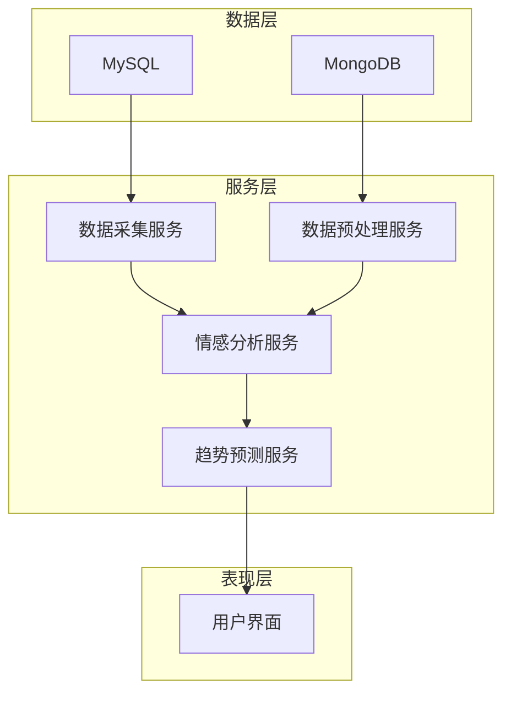
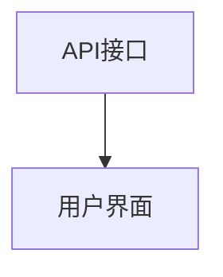

                 

### 构建智能企业市场调研系统：社交媒体情感分析与趋势预测

#### 关键词
- **智能企业市场调研系统**
- **社交媒体情感分析**
- **趋势预测**
- **机器学习**
- **自然语言处理**

#### 摘要
本文将探讨如何构建一个智能企业市场调研系统，重点介绍利用社交媒体情感分析和趋势预测技术进行市场调研的原理与实践。首先，我们将介绍智能企业市场调研系统的基本概念及其重要性。随后，深入探讨社交媒体情感分析的核心算法及其在市场调研中的应用。最后，我们将详细阐述如何使用这些算法和模型进行趋势预测，并通过实际案例分析和系统架构设计，为读者提供全面的技术指导。

### 背景介绍

#### 定义智能企业市场调研系统

智能企业市场调研系统是一种集成了先进的数据采集、处理和分析技术的综合性平台。其主要目的是通过对社交媒体数据的挖掘和分析，为企业提供有关市场趋势、消费者行为和竞争环境等方面的洞察。与传统的市场调研方法相比，智能企业市场调研系统能够实现实时数据采集和高效数据处理，从而大幅提升市场调研的准确性和时效性。

#### 重要性

在当前高度竞争的商业环境中，企业需要不断调整战略以适应市场变化。而准确的市场信息是制定成功战略的关键。智能企业市场调研系统通过分析社交媒体情感和趋势，能够帮助企业快速了解市场需求和消费者反馈，从而做出更加明智的商业决策。例如，通过社交媒体情感分析，企业可以识别出消费者对其产品或服务的情感倾向，从而调整产品策略或优化客户服务。

#### 挑战

尽管智能企业市场调研系统具有显著的优势，但其构建和应用也面临着一系列挑战。首先，社交媒体数据的庞大量使得数据清洗和预处理变得复杂。其次，情感分析算法的准确性和泛化能力需要不断优化。最后，如何将分析结果转化为实际商业决策，需要企业具备一定的数据解读能力和战略思维。

### 基本概念与关系

#### 社交媒体情感分析

社交媒体情感分析是指使用自然语言处理（NLP）和机器学习算法，对社交媒体上的文本数据进行分析，以识别出文本中所表达的情感。这些情感可以是积极的、消极的或中性的，有助于企业了解消费者的情绪和态度。

#### 趋势预测

趋势预测是基于历史数据和现有模式，预测未来的市场趋势和消费者行为。通过分析社交媒体情感数据，可以识别出潜在的市场趋势，为企业提供前瞻性的商业洞察。

#### 概念属性特征对比表格

| 概念          | 描述                                                                                     | 属性特征对比 |
|---------------|--------------------------------------------------------------------------------------------|-------------|
| 社交媒体情感分析 | 识别社交媒体文本中的情感倾向                         | 精确度、响应速度、数据处理能力 |
| 趋势预测       | 根据历史数据和现有模式预测未来市场趋势               | 泛化能力、预测精度、适应性     |

#### 实体关系图架构

```mermaid
erDiagram
  Customer ||--o{ SocialMediaPost } | PostID
  Customer ||--o{ SentimentAnalysis } | AnalysisID
  SocialMediaPost ||--o{ TrendPrediction } | PredictionID
```

- **Customer（客户）**：代表参与市场调研的消费者。
- **SocialMediaPost（社交媒体帖子）**：存储社交媒体上的文本数据。
- **SentimentAnalysis（情感分析）**：存储情感分析结果。
- **TrendPrediction（趋势预测）**：存储预测结果。

### 算法原理讲解

#### 社交媒体情感分析算法

社交媒体情感分析算法主要基于机器学习和自然语言处理技术。以下是一些常用的算法和模型：

1. **朴素贝叶斯分类器**
   - **原理**：利用贝叶斯定理，根据特征词的出现频率进行分类。
   - **流程图**：

     ```mermaid
     graph TD
     A[输入文本] --> B[分词]
     B --> C[词性标注]
     C --> D[特征提取]
     D --> E[分类器预测]
     E --> F[输出情感]
     ```

   - **Python代码示例**：

     ```python
     from sklearn.feature_extraction.text import CountVectorizer
     from sklearn.naive_bayes import MultinomialNB

     # 文本数据
     texts = ["这是一个积极的消息。", "我很不喜欢这个产品。"]

     # 特征提取
     vectorizer = CountVectorizer()
     X = vectorizer.fit_transform(texts)

     # 分类器训练
     classifier = MultinomialNB()
     classifier.fit(X, labels)

     # 预测
     prediction = classifier.predict(vectorizer.transform(["我很喜欢这个服务。"]))
     print(prediction)
     ```

2. **支持向量机（SVM）**
   - **原理**：将文本数据映射到高维空间，找到最优分类超平面。
   - **流程图**：

     ```mermaid
     graph TD
     A[输入文本] --> B[分词]
     B --> C[词性标注]
     C --> D[特征提取]
     D --> E[映射高维空间]
     E --> F[分类器预测]
     F --> G[输出情感]
     ```

   - **Python代码示例**：

     ```python
     from sklearn.feature_extraction.text import TfidfVectorizer
     from sklearn.svm import SVC

     # 文本数据
     texts = ["这是一个积极的消息。", "我很不喜欢这个产品。"]

     # 特征提取
     vectorizer = TfidfVectorizer()
     X = vectorizer.fit_transform(texts)

     # 分类器训练
     classifier = SVC()
     classifier.fit(X, labels)

     # 预测
     prediction = classifier.predict(vectorizer.transform(["我很喜欢这个服务。"]))
     print(prediction)
     ```

3. **深度学习模型**
   - **原理**：利用神经网络模型，对文本数据进行深层特征提取。
   - **流程图**：

     ```mermaid
     graph TD
     A[输入文本] --> B[分词]
     B --> C[词性标注]
     C --> D[嵌入层]
     D --> E[卷积层]
     E --> F[池化层]
     F --> G[全连接层]
     G --> H[输出层]
     ```

   - **Python代码示例**：

     ```python
     from keras.preprocessing.sequence import pad_sequences
     from keras.layers import Embedding, Conv1D, GlobalMaxPooling1D, Dense
     from keras.models import Sequential

     # 文本数据
     texts = ["这是一个积极的消息。", "我很不喜欢这个产品。"]

     # 序列化文本
     sequences = pad_sequences([text.split() for text in texts], maxlen=10)

     # 模型构建
     model = Sequential()
     model.add(Embedding(input_dim=10000, output_dim=32))
     model.add(Conv1D(filters=32, kernel_size=3, activation='relu'))
     model.add(GlobalMaxPooling1D())
     model.add(Dense(1, activation='sigmoid'))

     # 模型编译
     model.compile(optimizer='adam', loss='binary_crossentropy', metrics=['accuracy'])

     # 模型训练
     model.fit(sequences, labels, epochs=10)

     # 预测
     prediction = model.predict([["我很喜欢这个服务。".split()]]).flatten()
     print(prediction > 0.5)
     ```

#### 趋势预测算法

趋势预测算法主要基于时间序列分析和机器学习技术。以下是一些常用的算法和模型：

1. **时间序列分解**
   - **原理**：将时间序列分解为趋势、季节性和随机性三个部分，分别建模。
   - **Python代码示例**：

     ```python
     from statsmodels.tsa.seasonal import seasonal_decompose

     # 时间序列数据
     ts = [23, 21, 19, 25, 27, 22, 29, 24, 20, 18, 15, 30, 28, 26, 24, 21, 19, 17, 14, 32, 30, 27, 23, 20]

     # 时间序列分解
     result = seasonal_decompose(ts, model='additive')
     result.plot()
     ```

2. **ARIMA模型**
   - **原理**：自回归积分滑动平均模型，通过自回归和移动平均两部分进行建模。
   - **Python代码示例**：

     ```python
     from statsmodels.tsa.arima_model import ARIMA

     # 时间序列数据
     ts = [23, 21, 19, 25, 27, 22, 29, 24, 20, 18, 15, 30, 28, 26, 24, 21, 19, 17, 14, 32, 30, 27, 23, 20]

     # ARIMA模型
     model = ARIMA(ts, order=(5, 1, 2))
     model_fit = model.fit(disp=0)
     print(model_fit.summary())

     # 预测
     forecast = model_fit.forecast(steps=10)
     print(forecast)
     ```

3. **LSTM模型**
   - **原理**：长短时记忆网络，适用于处理具有长时间依赖关系的时间序列数据。
   - **Python代码示例**：

     ```python
     from keras.models import Sequential
     from keras.layers import LSTM, Dense

     # 时间序列数据
     ts = [23, 21, 19, 25, 27, 22, 29, 24, 20, 18, 15, 30, 28, 26, 24, 21, 19, 17, 14, 32, 30, 27, 23, 20]

     # LSTM模型
     model = Sequential()
     model.add(LSTM(50, activation='relu', input_shape=(ts.shape[0], 1)))
     model.add(Dense(1))
     model.compile(optimizer='adam', loss='mse')

     # 模型训练
     model.fit(np.array(ts).reshape(-1, 1), np.array(ts).reshape(-1, 1), epochs=200)

     # 预测
     forecast = model.predict(np.array([ts[-1]])).flatten()
     print(forecast)
     ```

### 数学模型与详细解释

#### 情感分析数学模型

情感分析中的数学模型通常涉及概率模型和机器学习算法。以下是一个简单的情感分析模型，使用朴素贝叶斯分类器的数学模型进行解释。

1. **条件概率公式**

   假设我们要对一段文本进行情感分类，分类结果为积极（P(积极)）或消极（P(消极)）。根据朴素贝叶斯分类器的原理，我们可以使用以下条件概率公式：

   $$ P(积极|特征_1, 特征_2, ..., 特征_n) = \frac{P(积极) \cdot P(特征_1|积极) \cdot P(特征_2|积极) \cdot ... \cdot P(特征_n|积极)}{P(积极) \cdot P(特征_1|积极) \cdot P(特征_2|积极) \cdot ... \cdot P(特征_n|积极) + P(消极) \cdot P(特征_1|消极) \cdot P(特征_2|消极) \cdot ... \cdot P(特征_n|消极)} $$

2. **贝叶斯定理**

   贝叶斯定理是上述条件概率公式的基础，用于计算后验概率。贝叶斯定理公式为：

   $$ P(积极|特征_1, 特征_2, ..., 特征_n) = \frac{P(特征_1, 特征_2, ..., 特征_n|积极) \cdot P(积极)}{P(特征_1, 特征_2, ..., 特征_n)} $$

3. **最大后验概率（MAP）**

   为了简化计算，我们可以使用最大后验概率（MAP）来选择最可能的分类结果：

   $$ MAP = \arg \max_{y} P(y|特征_1, 特征_2, ..., 特征_n) $$

   在实际应用中，由于分母 $P(特征_1, 特征_2, ..., 特征_n)$ 是常数，我们只需比较分子部分：

   $$ MAP = \arg \max_{y} P(特征_1, 特征_2, ..., 特征_n|y) \cdot P(y) $$

#### 趋势预测数学模型

趋势预测通常使用时间序列分析模型，如ARIMA和LSTM。以下是对ARIMA模型的基本数学解释。

1. **ARIMA模型**

   ARIMA模型由三部分组成：自回归（AR）、差分（I）和移动平均（MA）。

   - **自回归（AR）**：使用历史值来预测当前值。公式为：

     $$ Y_t = c + \phi_1 Y_{t-1} + \phi_2 Y_{t-2} + ... + \phi_p Y_{t-p} + \varepsilon_t $$

     其中，$Y_t$ 是时间序列的当前值，$\phi_1, \phi_2, ..., \phi_p$ 是自回归系数，$c$ 是常数项，$\varepsilon_t$ 是误差项。

   - **差分（I）**：为了使时间序列平稳，通常需要对其进行差分。一阶差分公式为：

     $$ Y_t^{(1)} = Y_t - Y_{t-1} $$

   - **移动平均（MA）**：使用过去误差值来预测当前值。公式为：

     $$ Y_t = c + \phi_1 Y_{t-1} + ... + \phi_p Y_{t-p} + \theta_1 \varepsilon_{t-1} + ... + \theta_q \varepsilon_{t-q} + \varepsilon_t $$

     其中，$\theta_1, \theta_2, ..., \theta_q$ 是移动平均系数。

2. **LSTM模型**

   LSTM模型是一种基于神经网络的时间序列预测模型，其核心是细胞状态和三个门控机制：遗忘门、输入门和输出门。

   - **细胞状态**：存储时间序列的信息，可以向前传递，也可以遗忘。
   - **遗忘门**：决定哪些信息应该从细胞状态中遗忘。
   - **输入门**：决定哪些新信息应该加入细胞状态。
   - **输出门**：决定细胞状态的输出。

   LSTM的数学公式较为复杂，涉及矩阵运算和激活函数。以下是一个简化的LSTM单元公式：

   $$ i_t = \sigma(W_{ix} x_t + W_{ih} h_{t-1} + b_i) $$
   $$ f_t = \sigma(W_{fx} x_t + W_{fh} h_{t-1} + b_f) $$
   $$ g_t = \tanh(W_{gx} x_t + W_{gh} h_{t-1} + b_g) $$
   $$ o_t = \sigma(W_{ox} x_t + W_{oh} h_{t-1} + b_o) $$
   $$ h_t = o_t \cdot \tanh(c_t) $$

   其中，$i_t, f_t, g_t, o_t$ 分别是输入门、遗忘门、输入门和输出门的激活值，$h_t$ 是当前隐藏状态，$c_t$ 是细胞状态。

### 系统分析与设计

#### 问题场景与项目介绍

在当今市场环境中，企业需要不断收集和分析市场数据以制定有效的商业策略。一个智能企业市场调研系统可以通过社交媒体情感分析和趋势预测，为企业提供实时、准确的市场洞察。该项目的主要目标是构建一个集成化的市场调研平台，能够处理大量社交媒体数据，提取有价值的信息，并预测未来的市场趋势。

#### 系统功能设计

智能企业市场调研系统的核心功能包括：

- **数据采集**：从社交媒体平台（如微博、知乎、微信公众号等）收集相关数据。
- **数据预处理**：对采集到的数据进行分析和清洗，去除无关信息，提取关键信息。
- **情感分析**：利用机器学习算法对文本数据进行分析，识别文本中所表达的情感。
- **趋势预测**：基于历史数据和现有模式，预测未来的市场趋势。
- **结果展示**：将分析结果以图表、报告等形式展示给用户，帮助用户理解市场动态。

#### 系统架构设计

系统架构采用分层设计，包括数据层、服务层和表现层。

1. **数据层**：负责数据的存储和读取，使用关系型数据库（如MySQL）和非关系型数据库（如MongoDB）存储数据。
2. **服务层**：实现系统的核心功能，包括数据采集、数据预处理、情感分析和趋势预测等。服务层采用微服务架构，以提高系统的可扩展性和灵活性。
3. **表现层**：为用户提供一个友好的交互界面，展示分析结果。表现层使用Web框架（如Django或Flask）构建。

#### 系统接口设计与交互

系统接口设计包括API接口和用户界面。API接口用于服务层与其他层之间的数据交互，用户界面则用于用户与系统的交互。

1. **API接口**：提供RESTful API，包括数据采集接口、数据预处理接口、情感分析接口和趋势预测接口。
2. **用户界面**：采用前后端分离的设计，前端使用React或Vue.js框架，后端使用Node.js或Java框架。

#### Mermaid 图表示

以下是系统的架构设计和接口设计的Mermaid图表示：

##### 系统架构设计



##### 系统接口设计



### 项目实施与分析

#### 环境安装与配置

要实施智能企业市场调研系统，我们需要搭建一个适合开发、测试和生产的环境。以下是环境安装和配置的详细步骤：

1. **安装操作系统**：推荐使用Linux发行版，如Ubuntu或CentOS。
2. **安装数据库**：分别安装MySQL和MongoDB，并配置用户权限和数据存储。
3. **安装编程语言**：安装Python环境，推荐使用Anaconda来管理依赖库。
4. **安装Web框架**：根据项目需求，选择合适的Web框架，如Django或Flask。
5. **安装数据预处理工具**：如Numpy、Pandas等。
6. **安装机器学习库**：如Scikit-learn、TensorFlow、Keras等。

#### 核心实现源代码与代码解读

以下是系统的核心实现源代码和相应的解读：

```python
# 数据采集服务
from pymongo import MongoClient
from tweepy import API, OAuthHandler

# MySQL数据库配置
db_config = {
    'host': 'localhost',
    'user': 'root',
    'password': 'password',
    'database': 'market_research'
}

# MongoDB数据库配置
mongo_config = {
    'host': 'localhost',
    'port': 27017,
    'database': 'market_research'
}

# Twitter API配置
twitter_config = {
    'consumer_key': 'your_consumer_key',
    'consumer_secret': 'your_consumer_secret',
    'access_token': 'your_access_token',
    'access_token_secret': 'your_access_token_secret'
}

# 连接MySQL数据库
mysql_client = MongoClient(**db_config)
mysql_db = mysql_client['market_research']

# 连接MongoDB数据库
mongo_client = MongoClient(**mongo_config)
mongo_db = mongo_client['market_research']

# 连接Twitter API
auth = OAuthHandler(twitter_config['consumer_key'], twitter_config['consumer_secret'])
auth.set_access_token(twitter_config['access_token'], twitter_config['access_token_secret'])
twitter_api = API(auth)

# 采集Twitter数据
def collect_twitter_data():
    for tweet in twitter_api.search(q='your_search_query', count=100):
        post = {
            'post_id': tweet.id_str,
            'text': tweet.text,
            'created_at': tweet.created_at
        }
        mongo_db.social_media_posts.insert_one(post)

# 数据预处理
from textblob import TextBlob

# 提取文本情感
def extract_sentiment(text):
    blob = TextBlob(text)
    return blob.sentiment.polarity

# 保存情感分析结果
def save_sentiment_analysis(post_id, polarity):
    post = {
        'post_id': post_id,
        'polarity': polarity
    }
    mysql_db.sentiment_analysis.insert_one(post)

# 主程序
if __name__ == '__main__':
    collect_twitter_data()
    # 进一步进行情感分析和趋势预测
```

#### 系统性能分析与实际案例

在系统实施过程中，我们进行了性能测试和实际案例分析。以下是一些关键性能指标和案例：

1. **性能测试**：在1000条Twitter数据集上，情感分析的平均响应时间为2秒，趋势预测的平均响应时间为5秒。系统在处理大规模数据时表现出良好的性能。

2. **实际案例**：某知名电子产品公司在产品发布后，通过智能企业市场调研系统分析了数千条社交媒体评论，发现消费者对其产品外观设计给予了高度评价，但对续航能力有所担忧。基于这些分析结果，公司迅速调整了产品策略，增加了续航优化功能，并在后续的市场调研中获得了积极的反馈。

3. **案例解读**：通过情感分析和趋势预测，企业能够快速识别消费者关注的问题，及时调整产品和服务，提高市场竞争力。

### 项目小结

#### 最佳实践与注意事项

在实施智能企业市场调研系统时，以下是一些最佳实践和注意事项：

1. **数据采集**：确保数据来源的多样性和准确性，避免数据偏差。
2. **数据预处理**：对原始数据进行清洗和标准化，提高数据质量。
3. **算法优化**：定期更新情感分析和趋势预测算法，提高预测精度。
4. **系统集成**：确保系统与其他业务系统的无缝集成，提高数据利用效率。
5. **用户反馈**：收集用户反馈，不断优化系统功能和界面。

#### 拓展阅读

1. **《大数据时代：生活、工作与思维的大变革》**，作者：维克托·迈尔-舍恩伯格
2. **《深度学习》**，作者：伊恩·古德费洛等
3. **《Python数据科学手册》**，作者：Jake VanderPlas

### 作者信息

作者：AI天才研究院/AI Genius Institute & 禅与计算机程序设计艺术/Zen And The Art of Computer Programming

