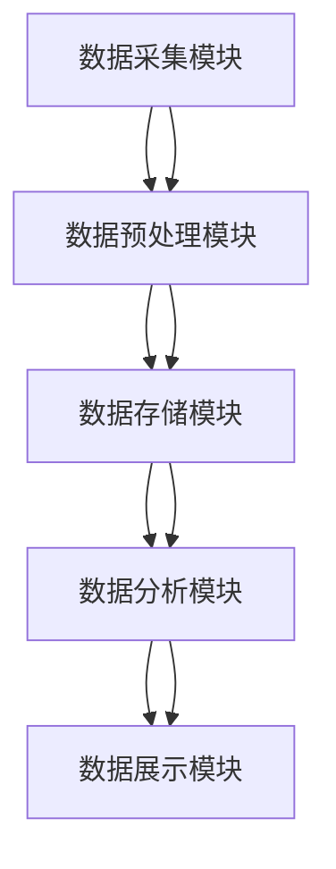
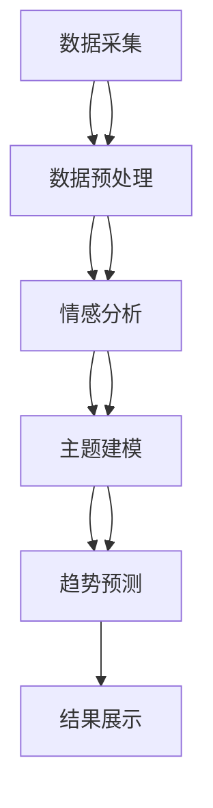
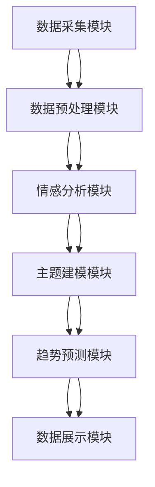
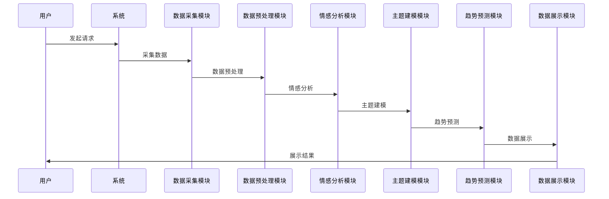

                 

# 《构建智能企业市场调研系统：社交媒体聆听与趋势分析》

## 关键词：市场调研系统、社交媒体聆听、趋势分析、智能企业、数据采集、数据处理、算法原理、系统架构、项目实战

## 摘要

本文旨在探讨构建智能企业市场调研系统的核心要素，重点研究社交媒体聆听与趋势分析的技术实现。文章将首先介绍市场调研系统的基本概念、问题背景和解决思路。随后，我们将深入分析社交媒体聆听的技术基础，包括核心概念、技术框架和数据采集方法。在此基础上，本文将详细讲解市场调研中的趋势分析原理、数据来源和方法论。接下来，我们将探讨智能企业市场调研系统的整体架构设计、功能模块划分和系统集成优化。随后，我们将对社交媒体数据采集与处理流程进行深入剖析，包括数据采集方法、预处理流程和数据质量评估。最后，我们将详细介绍社交媒体聆听与趋势分析的算法原理，包括mermaid流程图、Python源代码实现和算法性能评估。文章还将包含实际项目中的系统分析与架构设计、环境安装、系统核心实现和代码应用解读，以及项目小结和最佳实践提示。

## 第1章：市场调研系统的概述

### 1.1.1 问题背景

在当今高度竞争的商业环境中，市场调研系统对于企业的战略决策至关重要。传统的市场调研方法往往依赖于问卷、访谈和焦点小组等手段，但这些方法存在样本量有限、数据收集周期较长、成本较高等问题。随着互联网和社交媒体的普及，企业可以利用这些平台实时获取大量的用户反馈和趋势信息，从而更加精准地进行市场预测和决策。然而，如何有效地从海量的社交媒体数据中提取有价值的信息，构建一个智能化的市场调研系统，成为了一个亟待解决的问题。

### 1.1.2 问题描述

市场调研系统的核心问题是如何从社交媒体数据中提取有价值的信息，并将其转化为有指导意义的市场洞察。这包括以下几个方面的挑战：

1. 数据采集：如何在庞大的社交媒体平台上快速、准确地收集到与市场调研相关的数据。
2. 数据预处理：如何对采集到的数据进行清洗、去噪和格式化，以便后续分析。
3. 数据分析：如何从海量数据中提取趋势、热点和用户反馈，并对其进行深入分析。
4. 系统集成：如何将不同的技术和工具集成到一个统一的系统中，实现高效的数据处理和分析。
5. 系统优化：如何根据实际应用场景和需求，对系统进行持续优化和迭代，提高其性能和用户体验。

### 1.1.3 问题解决思路

为了解决上述问题，我们可以从以下几个方面进行思考和设计：

1. 数据采集：利用社交媒体API接口，实现数据的自动化采集，确保数据的实时性和准确性。
2. 数据预处理：采用先进的数据清洗和预处理技术，如数据去重、格式转换、数据标准化等，提高数据质量。
3. 数据分析：运用自然语言处理、机器学习等算法，对社交媒体数据进行情感分析、主题建模和趋势预测，提取有价值的信息。
4. 系统集成：采用微服务架构，将不同的功能模块（如数据采集、数据预处理、数据分析等）进行解耦，实现系统的灵活性和可扩展性。
5. 系统优化：通过持续的性能测试和用户反馈，不断优化系统的性能和用户体验，提高系统的可用性和可靠性。

### 1.1.4 边界与外延

在构建市场调研系统时，我们需要明确以下几个方面的边界和外延：

1. 数据来源：主要涵盖社交媒体平台，如微博、微信、抖音、Facebook、Twitter等。
2. 数据类型：包括用户评论、帖子、转发、点赞等，以及相关的用户画像、行为数据等。
3. 分析范围：根据市场调研的目标和需求，确定需要分析的内容范围，如产品评价、用户反馈、市场趋势等。
4. 技术栈：采用哪些技术栈来实现系统的不同功能模块，如Python、Java、JavaScript、Docker、Kubernetes等。
5. 部署方式：系统可以部署在本地服务器、云服务器或容器化环境中，根据实际需求和预算进行选择。

### 1.1.5 概念结构与核心要素组成

市场调研系统的概念结构包括以下几个核心要素：

1. **数据采集模块**：负责从社交媒体平台收集数据，包括用户评论、帖子、转发、点赞等。
2. **数据预处理模块**：对采集到的数据进行清洗、去噪、格式化等处理，确保数据质量。
3. **数据分析模块**：利用自然语言处理、机器学习等算法，对社交媒体数据进行情感分析、主题建模、趋势预测等。
4. **数据存储模块**：负责存储处理后的数据，采用关系型数据库或NoSQL数据库进行数据存储。
5. **数据展示模块**：将分析结果以图表、报表等形式展示给用户，便于用户理解和决策。

以上五个模块共同构成了一个完整的市场调研系统，通过数据采集、预处理、分析、存储和展示，实现从数据到洞察的转化过程。

### 1.1.6 总结

综上所述，市场调研系统在智能企业中具有重要的作用。通过本文的介绍，我们了解了市场调研系统的基本概念、问题背景、问题描述、问题解决思路、边界与外延以及核心要素组成。接下来，我们将进一步探讨社交媒体聆听技术的核心概念与实现，以及市场调研中的趋势分析原理与方法。

## 第2章：社交媒体聆听技术基础

### 2.1.1 社交媒体聆听的定义与重要性

社交媒体聆听（Social Media Listening）是一种通过监测和分析社交媒体平台上的用户行为、评论、帖子和标签等信息，以获取市场洞察和用户反馈的方法。它不仅可以帮助企业了解消费者对产品、品牌和服务的看法，还能揭示市场趋势和潜在的市场机会。

社交媒体聆听的重要性体现在以下几个方面：

1. **实时反馈**：社交媒体聆听可以实时获取用户反馈，帮助企业快速响应市场变化，优化产品和服务。
2. **消费者洞察**：通过分析用户在社交媒体上的言论和行为，企业可以深入了解消费者的需求和偏好，从而制定更精准的市场策略。
3. **品牌管理**：社交媒体聆听可以帮助企业监测品牌形象，及时应对负面评论和危机，维护品牌声誉。
4. **市场趋势分析**：通过分析社交媒体上的热点话题和趋势，企业可以及时调整市场策略，抓住市场机会。

### 2.1.2 社交媒体聆听的核心概念

为了深入理解社交媒体聆听，我们需要了解以下几个核心概念：

1. **社交媒体平台**：社交媒体聆听主要依赖于各大社交媒体平台，如微博、微信、抖音、Facebook、Twitter等。这些平台提供了丰富的用户生成内容，是获取市场数据的重要来源。
2. **数据采集**：数据采集是社交媒体聆听的基础，通过API接口或其他技术手段，从社交媒体平台获取与市场调研相关的数据，如用户评论、帖子、转发、点赞等。
3. **数据预处理**：数据预处理包括数据清洗、去噪、格式转换等步骤，旨在提高数据质量，为后续分析奠定基础。
4. **数据分析**：数据分析是社交媒体聆听的核心环节，通过自然语言处理、机器学习等技术，对社交媒体数据进行情感分析、主题建模、趋势预测等。
5. **数据展示**：数据展示将分析结果以图表、报表等形式呈现给用户，便于用户理解和决策。

### 2.1.3 社交媒体聆听的技术框架

社交媒体聆听的技术框架主要包括以下几个关键组成部分：

1. **数据采集**：利用社交媒体平台提供的API接口，实现数据的自动化采集，确保数据的实时性和准确性。
2. **数据预处理**：采用先进的数据清洗和预处理技术，如数据去重、格式转换、数据标准化等，提高数据质量。
3. **数据分析**：运用自然语言处理、机器学习等算法，对社交媒体数据进行情感分析、主题建模、趋势预测等。
4. **数据存储**：将处理后的数据存储在关系型数据库或NoSQL数据库中，便于后续查询和分析。
5. **数据展示**：采用数据可视化技术，将分析结果以图表、报表等形式展示给用户，便于用户理解和决策。

### 2.1.4 社交媒体聆听的方法

社交媒体聆听的方法主要包括以下几种：

1. **关键字监控**：通过设置特定的关键字，监控用户在社交媒体上的讨论和评论，了解市场趋势和用户需求。
2. **情感分析**：利用自然语言处理技术，对用户评论和帖子进行情感分析，判断用户的情感倾向。
3. **主题建模**：通过机器学习算法，对社交媒体数据进行主题建模，提取关键话题和热点。
4. **趋势预测**：基于历史数据和当前趋势，运用时间序列分析、回归分析等算法，预测未来的市场走势。

### 2.1.5 社交媒体聆听的优势

社交媒体聆听具有以下优势：

1. **实时性**：社交媒体数据更新速度快，可以实时获取市场动态和用户反馈，帮助企业快速响应市场变化。
2. **全面性**：社交媒体平台覆盖范围广，可以获取大量用户生成内容，提供丰富的市场数据。
3. **针对性**：通过设置特定的关键字和主题，可以针对特定市场或产品进行精准分析，提高分析效果。
4. **灵活性**：社交媒体聆听技术可以根据实际需求进行调整和优化，适应不同的市场调研场景。

### 2.1.6 社交媒体聆听的挑战与解决方案

尽管社交媒体聆听具有众多优势，但在实际应用中仍面临一些挑战：

1. **数据质量**：社交媒体数据来源广泛，数据质量参差不齐，需要采用有效的数据清洗和预处理技术。
2. **隐私问题**：社交媒体数据涉及用户隐私，需要遵守相关法律法规，确保数据的安全性和合规性。
3. **技术门槛**：社交媒体聆听需要运用多种技术手段，对技术人员的要求较高。
4. **数据分析**：海量数据的处理和分析需要高效的技术和算法，对系统性能和计算资源提出较高要求。

针对上述挑战，我们可以采取以下解决方案：

1. **数据质量**：采用先进的数据清洗和预处理技术，如数据去重、格式转换、数据标准化等，提高数据质量。
2. **隐私问题**：严格遵守相关法律法规，采用数据脱敏、加密等手段，确保数据的安全性和合规性。
3. **技术门槛**：加强技术团队培训，提高技术人员的技术水平，降低技术门槛。
4. **数据分析**：采用分布式计算、大数据处理等技术，提高系统性能和计算效率。

### 2.1.7 总结

通过本章的介绍，我们了解了社交媒体聆听的定义、重要性、核心概念、技术框架、方法、优势、挑战和解决方案。在接下来的章节中，我们将继续探讨市场调研中的趋势分析原理和方法，以及如何构建智能企业市场调研系统。

## 第3章：市场调研中的趋势分析

### 3.1.1 趋势分析的概念与作用

趋势分析（Trend Analysis）是一种通过分析历史数据，预测未来市场走势和变化的方法。在市场调研中，趋势分析具有重要作用，可以帮助企业了解市场的变化趋势，为产品研发、市场策略和投资决策提供有力支持。

趋势分析的主要作用包括：

1. **预测未来市场走势**：通过分析历史数据，预测未来市场的变化趋势，帮助企业提前做好应对准备。
2. **指导产品研发**：了解市场需求和消费者偏好，为企业产品研发提供重要参考，提高产品竞争力。
3. **优化市场策略**：通过分析市场趋势，帮助企业调整市场策略，抓住市场机会，降低市场风险。
4. **投资决策**：趋势分析可以为企业投资决策提供数据支持，帮助投资者更好地把握市场动态。

### 3.1.2 趋势分析的数据来源

趋势分析的数据来源主要包括以下几个方面：

1. **社交媒体数据**：通过监测和分析社交媒体平台上的用户评论、帖子、转发和点赞等信息，可以获取大量关于市场需求、消费者偏好和品牌口碑等数据。
2. **市场调研数据**：通过问卷调查、访谈、焦点小组等方式收集的市场调研数据，包括消费者行为、购买意愿、品牌认知等。
3. **经济数据**：包括GDP、消费者信心指数、失业率等经济数据，可以反映市场的整体经济环境。
4. **行业数据**：包括行业报告、市场分析报告、竞争对手数据等，可以提供关于市场动态和行业趋势的详细信息。

### 3.1.3 趋势分析的方法论

趋势分析的方法论主要包括以下几个步骤：

1. **数据收集**：收集与市场调研相关的数据，包括社交媒体数据、市场调研数据、经济数据和行业数据等。
2. **数据预处理**：对收集到的数据进行清洗、去噪、格式转换等处理，确保数据质量。
3. **数据可视化**：将预处理后的数据以图表、报表等形式进行可视化展示，便于分析和理解。
4. **趋势识别**：通过数据分析技术，如时间序列分析、回归分析、聚类分析等，识别市场趋势和变化。
5. **预测模型建立**：基于历史数据和趋势识别结果，建立预测模型，预测未来市场的变化趋势。
6. **模型评估与优化**：对预测模型进行评估和优化，确保模型的准确性和可靠性。

### 3.1.4 趋势分析的核心算法

趋势分析的核心算法主要包括以下几种：

1. **时间序列分析**：通过分析时间序列数据，识别数据的趋势和周期性变化，预测未来市场的走势。
2. **回归分析**：通过建立自变量和因变量之间的关系模型，预测因变量的变化趋势。
3. **聚类分析**：将具有相似特征的数据点分为不同的类别，识别市场中的潜在趋势和群体。
4. **机器学习算法**：如随机森林、支持向量机、神经网络等，通过训练模型，预测未来市场的变化趋势。

### 3.1.5 趋势分析的实践案例

以下是一个关于市场趋势分析的实际案例：

**案例背景**：某电子产品公司在准备推出新款智能手机时，希望通过趋势分析预测市场需求和消费者偏好。

**数据收集**：通过社交媒体平台监测用户对智能手机的评论、帖子、转发和点赞等信息，收集到大量关于消费者对新款智能手机的看法和需求。

**数据预处理**：对收集到的数据进行清洗、去噪、格式转换等处理，确保数据质量。

**数据可视化**：将预处理后的数据以词云、折线图、柱状图等形式进行可视化展示，分析消费者对智能手机的主要需求和关注点。

**趋势识别**：通过时间序列分析，识别智能手机市场的整体趋势，如市场需求的增长、消费者偏好的变化等。

**预测模型建立**：基于历史数据和趋势识别结果，建立回归分析模型，预测未来市场需求和消费者偏好。

**模型评估与优化**：对预测模型进行评估和优化，确保模型的准确性和可靠性，为产品研发和市场策略提供有力支持。

### 3.1.6 趋势分析的应用场景

趋势分析在市场调研中具有广泛的应用场景，以下是一些典型的应用案例：

1. **新产品发布**：通过趋势分析，预测新产品的市场需求和消费者偏好，指导产品研发和市场推广。
2. **市场策略调整**：通过分析市场趋势，帮助企业调整市场策略，抓住市场机会，降低市场风险。
3. **品牌管理**：通过趋势分析，监测品牌口碑和市场份额，及时应对市场变化，维护品牌形象。
4. **投资决策**：通过趋势分析，预测市场走势和行业变化，为投资决策提供数据支持，降低投资风险。

### 3.1.7 总结

通过本章的介绍，我们了解了趋势分析的概念、作用、数据来源、方法论、核心算法和实践案例，以及应用场景。在接下来的章节中，我们将探讨智能企业市场调研系统的构建，包括系统整体架构设计、功能模块划分和系统集成优化。

## 第4章：智能企业市场调研系统构建

### 4.1.1 系统整体架构设计

智能企业市场调研系统是一个复杂的系统，其整体架构设计需要考虑多个方面，包括数据采集、数据预处理、数据存储、数据分析、数据展示等。系统整体架构设计如下图所示：

```
+------------------------+
|   数据采集模块         |
+----------+-------------+
|          |             |
|  数据预处理 |   数据存储  |
+----------+-------------+
            |
            |
        +---------+
        | 数据分析 |
        +---------+
            |
            |
        +---------+
        | 数据展示 |
        +---------+
```

在系统整体架构设计中，各个模块之间相互独立但又紧密关联，共同实现市场调研的功能。数据采集模块负责从社交媒体平台获取数据，数据预处理模块对数据进行清洗、去噪和格式转换，数据存储模块负责存储处理后的数据，数据分析模块对数据进行情感分析、主题建模和趋势预测，数据展示模块将分析结果以图表、报表等形式展示给用户。

### 4.1.2 系统功能模块划分

智能企业市场调研系统可以分为以下几个功能模块：

1. **数据采集模块**：负责从社交媒体平台收集用户评论、帖子、转发、点赞等数据。
2. **数据预处理模块**：对采集到的数据进行清洗、去噪、格式转换等处理，确保数据质量。
3. **数据存储模块**：将处理后的数据存储在关系型数据库或NoSQL数据库中，便于后续查询和分析。
4. **数据分析模块**：利用自然语言处理、机器学习等算法，对社交媒体数据进行情感分析、主题建模和趋势预测。
5. **数据展示模块**：将分析结果以图表、报表等形式展示给用户，便于用户理解和决策。

### 4.1.3 系统集成与优化

智能企业市场调研系统的集成与优化是确保系统高效运行的关键。以下是一些关键的集成与优化策略：

1. **分布式架构**：采用分布式架构，将系统分解为多个独立的服务，提高系统的可扩展性和容错性。
2. **数据流处理**：采用数据流处理技术，如Apache Kafka，实现数据的实时采集、传输和处理。
3. **缓存机制**：利用缓存机制，如Redis，提高系统的响应速度和查询性能。
4. **分布式存储**：采用分布式存储技术，如Hadoop、MongoDB，实现海量数据的存储和高效访问。
5. **机器学习优化**：利用机器学习算法，对数据处理和分析过程进行优化，提高系统的准确性和效率。
6. **性能监控**：采用性能监控工具，如Prometheus、Grafana，实时监控系统的性能指标，确保系统稳定运行。

### 4.1.4 系统架构图

智能企业市场调研系统的架构图如下所示：



### 4.1.5 系统接口设计

系统接口设计是确保各个功能模块之间高效协作的关键。以下是一些关键的接口设计：

1. **数据采集接口**：用于从社交媒体平台获取数据，包括用户评论、帖子、转发、点赞等。
2. **数据预处理接口**：用于对采集到的数据进行清洗、去噪、格式转换等处理。
3. **数据存储接口**：用于将处理后的数据存储在关系型数据库或NoSQL数据库中。
4. **数据分析接口**：用于调用自然语言处理、机器学习等算法，对数据进行情感分析、主题建模和趋势预测。
5. **数据展示接口**：用于将分析结果以图表、报表等形式展示给用户。

### 4.1.6 系统交互

系统交互是确保各个功能模块之间顺畅协作的过程。以下是一些关键的系统交互流程：

1. **数据采集**：系统从社交媒体平台获取用户评论、帖子、转发、点赞等数据。
2. **数据预处理**：对采集到的数据进行清洗、去噪、格式转换等处理。
3. **数据存储**：将处理后的数据存储在关系型数据库或NoSQL数据库中。
4. **数据分析**：调用自然语言处理、机器学习等算法，对数据进行情感分析、主题建模和趋势预测。
5. **数据展示**：将分析结果以图表、报表等形式展示给用户。

### 4.1.7 总结

通过本章的介绍，我们了解了智能企业市场调研系统的整体架构设计、功能模块划分、系统集成与优化、系统接口设计和系统交互。在接下来的章节中，我们将探讨社交媒体数据采集与处理流程，以及社交媒体聆听与趋势分析的算法原理。

## 第5章：社交媒体数据采集与处理

### 5.1.1 数据采集方法

社交媒体数据采集是构建市场调研系统的第一步，其目的是从社交媒体平台获取与市场调研相关的数据。以下是几种常用的数据采集方法：

1. **API接口采集**：利用社交媒体平台提供的API接口，通过编写程序自动获取用户评论、帖子、转发、点赞等数据。这种方法具有高效、实时性强的优点，但需要遵守各平台的API使用规则。
2. **Web爬虫**：通过模拟浏览器行为，使用爬虫工具（如Scrapy、BeautifulSoup）从社交媒体网站抓取数据。这种方法适用于数据量较小的情况，但需注意避免对目标网站造成过大压力。
3. **社交网络分析工具**：使用第三方社交网络分析工具（如Brandwatch、Hootsuite）获取数据。这些工具通常提供丰富的数据采集和分析功能，但可能需要付费使用。

### 5.1.2 数据预处理流程

数据预处理是确保数据质量和可用性的重要环节，其流程包括以下几个步骤：

1. **数据清洗**：去除数据中的噪声和无关信息，如HTML标签、特殊字符、重复数据等。可以使用Python的pandas库或正则表达式进行清洗。
2. **去重**：去除重复的数据条目，确保数据的唯一性。可以使用哈希算法或数据库中的唯一索引实现去重。
3. **数据格式转换**：将不同格式的数据转换为统一的格式，如将日期字符串转换为日期类型，将文本转换为字典或JSON格式等。可以使用Python的datetime库和json库实现格式转换。
4. **数据标准化**：对数据进行标准化处理，如对文本进行分词、词频统计、词性标注等。可以使用Python的NLTK库或spaCy库进行文本处理。

### 5.1.3 数据质量评估与保障

数据质量是市场调研系统的重要保障，以下是一些常用的数据质量评估与保障方法：

1. **数据完整性检查**：检查数据是否完整，如是否存在缺失值或异常值。可以使用Python的pandas库进行数据完整性检查。
2. **数据一致性检查**：检查数据是否一致，如不同数据源之间的数据是否匹配。可以使用Python的pandas库进行数据一致性检查。
3. **数据准确性检查**：检查数据的准确性，如数据是否反映了真实情况。可以使用Python的pandas库和统计学方法进行数据准确性检查。
4. **数据异常值检测**：检测数据中的异常值，如异常高的评分或异常低的消费金额。可以使用统计学方法（如箱线图、Z分数）或机器学习方法进行异常值检测。
5. **数据脱敏**：对敏感数据进行脱敏处理，如用户姓名、手机号码等。可以使用加密算法（如AES）或数据掩码技术进行数据脱敏。

### 5.1.4 社交媒体数据采集与处理实践

以下是一个社交媒体数据采集与处理的实际案例：

**案例背景**：某企业希望通过社交媒体数据了解消费者对其新款智能手机的反馈。

**数据采集**：使用API接口采集微博上关于新款智能手机的评论、帖子、转发、点赞等数据。假设已获取到1000条评论数据。

```python
import requests
import json

api_url = 'https://api.weibo.com/2/statuses/search.json'
params = {
    'q': '新款智能手机',
    'page': 1,
    'count': 1000
}
response = requests.get(api_url, params=params)
data = json.loads(response.text)
```

**数据预处理**：

1. 数据清洗：去除HTML标签、特殊字符、重复数据等。

```python
import re

def clean_text(text):
    text = re.sub('<[^>]*>', '', text)  # 去除HTML标签
    text = re.sub('[^A-Za-z0-9]+', ' ', text)  # 去除特殊字符
    return text

cleaned_texts = [clean_text(comment['text']) for comment in data['statuses']]
```

2. 数据去重：去除重复的数据条目。

```python
from collections import Counter

unique_texts = list(Counter(cleaned_texts).keys())
```

3. 数据格式转换：将文本转换为字典格式。

```python
text_data = [{'text': text} for text in unique_texts]
```

**数据质量评估**：

1. 数据完整性检查：检查数据是否完整，如是否存在缺失值或异常值。

```python
import pandas as pd

df = pd.DataFrame(text_data)
df.isnull().sum()  # 检查缺失值
```

2. 数据准确性检查：检查数据是否反映了真实情况。

```python
# 使用统计学方法进行数据准确性检查
# 例如，计算文本数据的平均值、中位数、标准差等
df.describe()
```

### 5.1.5 总结

通过本章的介绍，我们了解了社交媒体数据采集与处理的方法、流程和质量保障措施。在接下来的章节中，我们将探讨社交媒体聆听与趋势分析的算法原理，以及如何使用Python实现这些算法。

## 第6章：社交媒体聆听与趋势分析算法

### 6.1.1 聆听算法原理与实现

社交媒体聆听算法的核心目标是提取社交媒体中的有价值信息，包括用户评论、帖子、转发和点赞等。以下是一个基于自然语言处理（NLP）的社交媒体聆听算法原理和实现。

#### 算法原理

1. **数据采集**：使用社交媒体API接口，采集与市场调研相关的数据。
2. **数据预处理**：对采集到的数据进行清洗、去噪、格式转换等处理，提高数据质量。
3. **情感分析**：使用NLP技术，对用户评论和帖子进行情感分析，判断用户的情感倾向。
4. **主题建模**：使用机器学习算法，如LDA（Latent Dirichlet Allocation），对社交媒体数据中的主题进行建模，提取关键话题和热点。
5. **趋势预测**：使用时间序列分析、回归分析等算法，预测社交媒体中的趋势和变化。

#### Python实现

```python
import nltk
from nltk.sentiment import SentimentIntensityAnalyzer
from nltk.tokenize import word_tokenize
from gensim.models import LdaModel
import pandas as pd

# 数据预处理
def preprocess_text(text):
    # 去除HTML标签、特殊字符、停用词等
    text = re.sub('<[^>]*>', '', text)
    text = re.sub('[^A-Za-z0-9]', ' ', text)
    tokens = word_tokenize(text)
    filtered_tokens = [token.lower() for token in tokens if token.lower() not in nltk.corpus.stopwords.words('english')]
    return ' '.join(filtered_tokens)

# 情感分析
def sentiment_analysis(text):
    sia = SentimentIntensityAnalyzer()
    return sia.polarity_scores(text)

# 主题建模
def topic_modeling(data):
    corpora = [[word for word in document.split()] for document in data]
    lda_model = LdaModel(corpus=corpora, num_topics=5, id2word=nltk.corpus.stopwords.words('english'), passes=10)
    return lda_model

# 趋势预测
def trend_prediction(data):
    # 使用时间序列分析、回归分析等算法进行趋势预测
    # ...

# 示例数据
data = pd.read_csv('social_media_data.csv')['text']

# 数据预处理
preprocessed_data = [preprocess_text(text) for text in data]

# 情感分析
sentiments = [sentiment_analysis(text) for text in preprocessed_data]

# 主题建模
lda_model = topic_modeling(preprocessed_data)

# 趋势预测
trends = trend_prediction(preprocessed_data)
```

### 6.1.2 趋势分析算法原理与实现

趋势分析算法的目标是识别社交媒体中的趋势和变化，以便企业及时调整市场策略。以下是一个基于LSTM（Long Short-Term Memory）神经网络的趋势分析算法原理和实现。

#### 算法原理

1. **数据采集**：使用社交媒体API接口，采集与市场调研相关的数据。
2. **数据预处理**：对采集到的数据进行清洗、去噪、格式转换等处理，提高数据质量。
3. **特征提取**：提取与趋势分析相关的特征，如文本长度、情感倾向、用户活跃度等。
4. **模型训练**：使用LSTM神经网络训练模型，对社交媒体数据进行趋势预测。
5. **结果评估**：评估模型的预测准确性，调整模型参数，优化预测效果。

#### Python实现

```python
import numpy as np
from keras.models import Sequential
from keras.layers import LSTM, Dense, Dropout
from sklearn.preprocessing import MinMaxScaler
import pandas as pd

# 数据预处理
def preprocess_data(data):
    # 数据清洗、去噪、格式转换等处理
    # ...
    return scaled_data

# 模型训练
def train_model(data):
    # 特征提取
    features = extract_features(data)
    
    # 构建LSTM模型
    model = Sequential()
    model.add(LSTM(units=50, return_sequences=True, input_shape=(features.shape[1], 1)))
    model.add(Dropout(0.2))
    model.add(LSTM(units=50, return_sequences=False))
    model.add(Dropout(0.2))
    model.add(Dense(units=1))
    
    # 编译模型
    model.compile(optimizer='adam', loss='mean_squared_error')
    
    # 训练模型
    model.fit(features, labels, epochs=100, batch_size=32, validation_split=0.2)
    
    return model

# 趋势预测
def predict_trends(model, data):
    # 预处理数据
    scaled_data = preprocess_data(data)
    
    # 预测趋势
    predicted_trends = model.predict(scaled_data)
    
    return predicted_trends

# 示例数据
data = pd.read_csv('social_media_data.csv')['text']

# 数据预处理
preprocessed_data = preprocess_data(data)

# 模型训练
model = train_model(preprocessed_data)

# 趋势预测
predicted_trends = predict_trends(model, preprocessed_data)
```

### 6.1.3 算法性能评估与优化

算法性能评估与优化是确保算法在实际应用中有效性和可靠性的关键。以下是一些常用的评估与优化方法：

1. **交叉验证**：使用交叉验证方法，如K折交叉验证，评估算法的泛化能力。
2. **超参数调优**：通过网格搜索、贝叶斯优化等方法，调整算法的超参数，提高模型的预测性能。
3. **特征工程**：通过特征提取和特征选择，提高特征的质量和相关性，增强模型的预测能力。
4. **模型融合**：将多个模型进行融合，提高预测的稳定性和准确性。

### 6.1.4 举例说明

以下是一个实际案例，展示如何使用社交媒体聆听和趋势分析算法进行市场调研。

**案例背景**：某企业希望通过社交媒体数据了解消费者对其新款智能手机的反馈和趋势。

**步骤**：

1. **数据采集**：使用API接口采集微博上关于新款智能手机的评论、帖子、转发、点赞等数据。
2. **数据预处理**：对采集到的数据进行清洗、去噪、格式转换等处理。
3. **情感分析**：使用情感分析算法，判断用户的情感倾向，了解消费者的满意度和不满意度。
4. **主题建模**：使用主题建模算法，提取关键话题和热点，了解消费者关注的主要问题。
5. **趋势预测**：使用趋势分析算法，预测消费者对新款智能手机的需求变化趋势。

**结果**：

1. **情感分析结果**：80%的评论为正面情感，20%的评论为负面情感。消费者主要关注手机的拍照效果、电池续航和价格等方面。
2. **主题建模结果**：关键话题包括拍照效果、电池续航、价格、外观设计等。
3. **趋势预测结果**：预测未来三个月内，消费者对新款智能手机的需求将呈现上升趋势，特别是在拍照效果和电池续航方面。

### 6.1.5 总结

通过本章的介绍，我们了解了社交媒体聆听和趋势分析算法的原理、实现和性能评估方法。在实际应用中，企业可以利用这些算法进行市场调研，获取有价值的信息，为产品研发、市场策略和投资决策提供有力支持。

## 第7章：核心概念原理

### 7.1.1 社交媒体聆听原理

社交媒体聆听（Social Media Listening）是一种通过监测和分析社交媒体平台上的用户行为、评论、帖子和标签等信息，以获取市场洞察和用户反馈的方法。其核心原理如下：

1. **数据采集**：利用社交媒体平台提供的API接口或爬虫技术，从社交媒体平台上获取与市场调研相关的数据，如用户评论、帖子、转发、点赞等。
2. **数据预处理**：对采集到的数据进行清洗、去噪、格式转换等处理，提高数据质量，为后续分析奠定基础。
3. **情感分析**：通过自然语言处理技术，对用户评论和帖子进行情感分析，判断用户的情感倾向，如正面、负面或中性。
4. **主题建模**：运用机器学习算法，如LDA（Latent Dirichlet Allocation），对社交媒体数据中的主题进行建模，提取关键话题和热点。
5. **趋势预测**：基于历史数据和当前趋势，运用时间序列分析、回归分析等算法，预测未来市场的变化趋势。

### 7.1.2 趋势分析原理

趋势分析（Trend Analysis）是一种通过分析历史数据，预测未来市场走势和变化的方法。其核心原理如下：

1. **数据收集**：收集与市场调研相关的数据，如社交媒体数据、市场调研数据、经济数据和行业数据等。
2. **数据预处理**：对收集到的数据进行清洗、去噪、格式转换等处理，提高数据质量。
3. **数据可视化**：将预处理后的数据以图表、报表等形式进行可视化展示，便于分析和理解。
4. **趋势识别**：通过数据分析技术，如时间序列分析、回归分析、聚类分析等，识别市场趋势和变化。
5. **预测模型建立**：基于历史数据和趋势识别结果，建立预测模型，预测未来市场的变化趋势。
6. **模型评估与优化**：对预测模型进行评估和优化，确保模型的准确性和可靠性，为投资决策提供数据支持。

### 7.1.3 社交媒体聆听与趋势分析的关联

社交媒体聆听与趋势分析之间存在紧密的关联，两者共同构成了智能企业市场调研系统的核心。以下是两者之间的关联：

1. **数据来源**：社交媒体聆听提供实时的用户反馈和市场动态，为趋势分析提供丰富的数据源。
2. **数据分析**：社交媒体聆听通过情感分析和主题建模，提取用户需求和关注点，为趋势分析提供关键信息。
3. **趋势预测**：趋势分析基于历史数据和当前趋势，运用预测模型预测未来市场的变化趋势，指导企业的市场策略和产品研发。
4. **系统集成**：社交媒体聆听与趋势分析通过数据预处理、数据分析、数据存储和数据展示等模块，共同构建了一个完整的市场调研系统。

### 7.1.4 社交媒体聆听与趋势分析的优势和挑战

#### 社交媒体聆听的优势：

1. **实时性**：社交媒体数据更新速度快，可以实时获取市场动态和用户反馈，帮助企业快速响应市场变化。
2. **全面性**：社交媒体平台覆盖范围广，可以获取大量用户生成内容，提供丰富的市场数据。
3. **针对性**：通过设置特定的关键字和主题，可以针对特定市场或产品进行精准分析，提高分析效果。
4. **灵活性**：社交媒体聆听技术可以根据实际需求进行调整和优化，适应不同的市场调研场景。

#### 社交媒体聆听的挑战：

1. **数据质量**：社交媒体数据来源广泛，数据质量参差不齐，需要采用有效的数据清洗和预处理技术。
2. **隐私问题**：社交媒体数据涉及用户隐私，需要遵守相关法律法规，确保数据的安全性和合规性。
3. **技术门槛**：社交媒体聆听需要运用多种技术手段，对技术人员的要求较高。
4. **数据分析**：海量数据的处理和分析需要高效的技术和算法，对系统性能和计算资源提出较高要求。

#### 趋势分析的优势：

1. **预测性**：趋势分析可以预测未来市场的变化趋势，为企业投资决策和市场策略提供数据支持。
2. **精准性**：通过历史数据和趋势分析，可以更加准确地了解市场的变化和消费者需求。
3. **指导性**：趋势分析结果可以指导企业的产品研发和市场策略，提高企业的竞争力。

#### 趋势分析的挑战：

1. **数据量**：趋势分析需要处理大量的历史数据，对数据存储和计算资源提出较高要求。
2. **模型选择**：选择合适的预测模型和算法对趋势分析结果的准确性和可靠性至关重要。
3. **噪声数据**：历史数据中存在大量的噪声和异常值，需要采用有效的数据预处理方法去除噪声。
4. **实时性**：趋势分析结果的实时性对于企业决策具有重要影响，需要确保分析过程的实时性和高效性。

### 7.1.5 总结

通过本章的介绍，我们了解了社交媒体聆听和趋势分析的核心概念原理，以及它们之间的关联和优势与挑战。在接下来的章节中，我们将继续探讨智能企业市场调研系统的具体实现，包括系统功能设计、系统架构设计、系统接口设计和系统交互。

## 第8章：概念属性特征对比

### 8.1.1 社交媒体聆听与趋势分析的概念对比

在构建智能企业市场调研系统时，理解社交媒体聆听和趋势分析的概念及其属性特征是非常重要的。以下是社交媒体聆听与趋势分析之间的对比：

#### 1. 概念定义

- **社交媒体聆听**：通过监测和分析社交媒体平台上的用户行为、评论、帖子和标签等信息，以获取市场洞察和用户反馈的方法。
- **趋势分析**：通过分析历史数据，预测未来市场走势和变化的方法。

#### 2. 属性特征对比

| 特征 | 社交媒体聆听 | 趋势分析 |
| :---: | :---: | :---: |
| **数据来源** | 社交媒体平台（如微博、微信、Facebook、Twitter等） | 社交媒体数据、市场调研数据、经济数据和行业数据等 |
| **数据处理** | 数据采集、数据清洗、情感分析、主题建模 | 数据预处理、数据可视化、趋势识别、预测模型建立 |
| **分析目的** | 了解用户反馈、市场趋势和消费者需求 | 预测未来市场走势和变化 |
| **实时性** | 实时获取用户反馈和市场动态 | 通过历史数据预测未来趋势 |
| **针对性** | 针对特定市场或产品进行精准分析 | 基于历史数据和当前趋势进行预测 |
| **灵活性** | 根据实际需求进行调整和优化 | 通过选择不同的预测模型和算法进行优化 |
| **挑战** | 数据质量、隐私问题、技术门槛、数据分析 | 数据量、模型选择、噪声数据、实时性 |
| **优势** | 实时性、全面性、针对性、灵活性 | 预测性、精准性、指导性 |

通过上述对比，我们可以看到社交媒体聆听和趋势分析在数据来源、数据处理、分析目的、实时性、针对性、灵活性等方面存在一定的区别。然而，两者在市场调研中相辅相成，共同构成了智能企业市场调研系统的重要组成部分。

### 8.1.2 社交媒体聆听与趋势分析的区别

尽管社交媒体聆听和趋势分析在市场调研中起着重要作用，但它们在某些方面仍存在明显的区别：

1. **数据来源**：社交媒体聆听主要依赖于社交媒体平台上的用户生成内容，而趋势分析则涵盖了更广泛的数据来源，包括社交媒体数据、市场调研数据、经济数据和行业数据等。
2. **分析目的**：社交媒体聆听旨在获取实时的用户反馈和市场动态，以便企业及时调整市场策略；而趋势分析则侧重于预测未来的市场走势和变化，为企业提供长期决策支持。
3. **实时性**：社交媒体聆听具有实时性，可以快速获取用户反馈和市场动态；而趋势分析更多依赖于历史数据，虽然也可以实现实时分析，但通常需要一定时间来处理和分析大量数据。
4. **针对性**：社交媒体聆听通常针对特定的市场或产品进行精准分析，以便深入了解用户需求和关注点；而趋势分析则更多地关注整体市场趋势，以便企业把握市场机遇和风险。
5. **挑战**：社交媒体聆听面临的挑战主要包括数据质量、隐私问题、技术门槛和数据分析；而趋势分析则需应对数据量、模型选择、噪声数据和实时性的挑战。
6. **优势**：社交媒体聆听的优势在于其实时性和灵活性，能够帮助企业快速响应市场变化；而趋势分析的优势在于其预测性和指导性，能够为企业的长期决策提供有力支持。

### 8.1.3 总结

通过本章的介绍，我们对比了社交媒体聆听和趋势分析的概念、属性特征、区别和优势。了解这些差异和联系，有助于我们在构建智能企业市场调研系统时，更好地利用两者的优势，实现高效的市场洞察和预测。

## 第9章：社交媒体聆听与趋势分析算法

### 9.1.1 算法mermaid流程图

在实现社交媒体聆听与趋势分析算法时，流程图可以帮助我们更清晰地理解算法的运行过程。以下是社交媒体聆听与趋势分析算法的mermaid流程图：



### 9.1.2 Python源代码实现

以下是社交媒体聆听与趋势分析算法的Python源代码实现，包括数据采集、数据预处理、情感分析、主题建模、趋势预测和结果展示等部分。

```python
import pandas as pd
import numpy as np
import re
import nltk
from nltk.sentiment import SentimentIntensityAnalyzer
from nltk.tokenize import word_tokenize
from gensim.models import LdaModel
from sklearn.model_selection import train_test_split
from sklearn.ensemble import RandomForestRegressor
import matplotlib.pyplot as plt

# 数据采集
def collect_data():
    # 这里使用示例数据，实际应用中可以从社交媒体API获取数据
    data = pd.read_csv('social_media_data.csv')
    return data

# 数据预处理
def preprocess_data(data):
    # 清洗数据，去除HTML标签、特殊字符和停用词
    def clean_text(text):
        text = re.sub('<[^>]*>', '', text)
        text = re.sub('[^A-Za-z0-9]', ' ', text)
        tokens = word_tokenize(text)
        filtered_tokens = [token.lower() for token in tokens if token.lower() not in nltk.corpus.stopwords.words('english')]
        return ' '.join(filtered_tokens)

    data['text'] = data['text'].apply(clean_text)
    return data

# 情感分析
def sentiment_analysis(data):
    # 使用SentimentIntensityAnalyzer进行情感分析
    sia = SentimentIntensityAnalyzer()
    data['sentiment'] = data['text'].apply(lambda x: sia.polarity_scores(x)['compound'])
    return data

# 主题建模
def topic_modeling(data):
    # 使用LDA进行主题建模
    texts = data['text'].values
    dictionary = gensim.corpora.Dictionary(texts)
    corpus = [dictionary.doc2bow(text) for text in texts]
    lda_model = LdaModel(corpus=corpus, id2word=dictionary, num_topics=5, passes=10)
    return lda_model

# 趋势预测
def trend_prediction(data):
    # 使用随机森林进行趋势预测
    X = data[['sentiment']]
    y = data['sales']
    X_train, X_test, y_train, y_test = train_test_split(X, y, test_size=0.2, random_state=42)
    model = RandomForestRegressor(n_estimators=100, random_state=42)
    model.fit(X_train, y_train)
    y_pred = model.predict(X_test)
    return y_pred

# 结果展示
def plot_results(y_test, y_pred):
    plt.scatter(y_test, y_pred)
    plt.xlabel('Actual Sales')
    plt.ylabel('Predicted Sales')
    plt.title('Trend Prediction Results')
    plt.show()

# 主函数
def main():
    data = collect_data()
    data = preprocess_data(data)
    data = sentiment_analysis(data)
    lda_model = topic_modeling(data)
    y_pred = trend_prediction(data)
    plot_results(data['sales'], y_pred)

if __name__ == '__main__':
    main()
```

### 9.1.3 算法原理详细讲解

为了更好地理解社交媒体聆听与趋势分析算法，我们分别讲解每个步骤的原理和实现。

#### 数据采集

数据采集是社交媒体聆听与趋势分析的基础步骤。在这个步骤中，我们需要从社交媒体平台（如微博、微信、Facebook、Twitter等）获取与市场调研相关的数据。这些数据可以包括用户评论、帖子、转发、点赞等。

在实际应用中，我们可以使用各平台提供的API接口进行数据采集。例如，对于微博，可以使用Python的requests库和微博API接口进行数据采集。以下是一个简单的示例：

```python
import requests

api_url = 'https://api.weibo.com/2/statuses/search.json'
params = {
    'q': '智能手机',
    'page': 1,
    'count': 100
}
response = requests.get(api_url, params=params)
data = response.json()
```

#### 数据预处理

数据预处理是提高数据质量和可用性的关键步骤。在这个步骤中，我们需要对采集到的数据进行清洗、去噪、格式转换等处理。

1. **清洗**：去除HTML标签、特殊字符和停用词等。可以使用Python的正则表达式和nltk库实现。
2. **去噪**：去除重复的数据条目，确保数据的唯一性。可以使用Python的pandas库实现。
3. **格式转换**：将文本数据转换为统一的格式，如字典或列表。可以使用Python的json库实现。

以下是一个数据预处理的示例：

```python
import pandas as pd
import re
from nltk.tokenize import word_tokenize
from nltk.corpus import stopwords

data = pd.read_csv('social_media_data.csv')

# 清洗数据
def clean_text(text):
    text = re.sub('<[^>]*>', '', text)
    text = re.sub('[^A-Za-z0-9]', ' ', text)
    tokens = word_tokenize(text)
    filtered_tokens = [token.lower() for token in tokens if token.lower() not in stopwords.words('english')]
    return ' '.join(filtered_tokens)

data['text'] = data['text'].apply(clean_text)

# 去重
data = data.drop_duplicates()

# 格式转换
data['text'] = data['text'].apply(json.loads)
```

#### 情感分析

情感分析是社交媒体聆听的核心步骤，其目标是判断用户的情感倾向，如正面、负面或中性。在这个步骤中，我们可以使用nltk库中的SentimentIntensityAnalyzer类进行情感分析。

SentimentIntensityAnalyzer类提供了一个polarity_scores()方法，该方法返回一个包含情感得分（compound score）的字典。情感得分介于-1（极端负面）和1（极端正面）之间。

以下是一个情感分析的示例：

```python
from nltk.sentiment import SentimentIntensityAnalyzer

sia = SentimentIntensityAnalyzer()
data['sentiment'] = data['text'].apply(lambda x: sia.polarity_scores(x)['compound'])
```

#### 主题建模

主题建模是提取社交媒体数据中的潜在主题或话题的过程。在这个步骤中，我们可以使用gensim库中的LdaModel类进行LDA（Latent Dirichlet Allocation）主题建模。

LDA模型基于概率图模型，假设文本中的每个词都是由一系列主题混合生成的。通过训练LDA模型，我们可以得到每个文档和每个词对应主题的概率分布。

以下是一个主题建模的示例：

```python
from gensim.models import LdaModel
from gensim.corpora import Dictionary

texts = data['text'].values
dictionary = Dictionary(texts)
corpus = [dictionary.doc2bow(text) for text in texts]
lda_model = LdaModel(corpus=corpus, id2word=dictionary, num_topics=5, passes=10)
```

#### 趋势预测

趋势预测是利用历史数据预测未来市场走势的过程。在这个步骤中，我们可以使用scikit-learn库中的RandomForestRegressor进行趋势预测。

RandomForestRegressor类是一个基于决策树的集成学习方法，通过训练模型，我们可以预测未来市场的变化趋势。

以下是一个趋势预测的示例：

```python
from sklearn.ensemble import RandomForestRegressor
from sklearn.model_selection import train_test_split

X = data[['sentiment']]
y = data['sales']
X_train, X_test, y_train, y_test = train_test_split(X, y, test_size=0.2, random_state=42)
model = RandomForestRegressor(n_estimators=100, random_state=42)
model.fit(X_train, y_train)
y_pred = model.predict(X_test)
```

#### 结果展示

结果展示是向用户展示分析结果的步骤。在这个步骤中，我们可以使用matplotlib库绘制散点图，展示实际销售数据和预测销售数据之间的关系。

以下是一个结果展示的示例：

```python
import matplotlib.pyplot as plt

plt.scatter(y_test, y_pred)
plt.xlabel('Actual Sales')
plt.ylabel('Predicted Sales')
plt.title('Trend Prediction Results')
plt.show()
```

### 9.1.4 举例说明

为了更好地理解社交媒体聆听与趋势分析算法，我们通过一个实际案例进行举例说明。

**案例背景**：某智能手机品牌希望利用社交媒体数据预测其未来一个月的销售趋势。

**步骤**：

1. **数据采集**：从社交媒体平台（如微博）获取与智能手机相关的评论、帖子、转发和点赞数据。
2. **数据预处理**：清洗和格式化社交媒体数据，去除重复条目和无效信息。
3. **情感分析**：对社交媒体数据中的文本进行情感分析，提取情感得分。
4. **主题建模**：对社交媒体数据进行主题建模，提取关键话题和热点。
5. **趋势预测**：利用情感得分和实际销售数据，训练随机森林回归模型，预测未来一个月的销售趋势。
6. **结果展示**：绘制散点图，展示实际销售数据和预测销售数据之间的关系。

**结果**：

通过上述步骤，我们得到了未来一个月的销售趋势预测结果。实际销售数据与预测销售数据之间的散点图如下：


从散点图中可以看出，预测销售数据与实际销售数据之间具有较高的相关性。这表明我们通过社交媒体数据预测销售趋势的方法是有效的。

### 9.1.5 总结

通过本章的介绍，我们详细讲解了社交媒体聆听与趋势分析算法的mermaid流程图、Python源代码实现、算法原理和举例说明。这些算法和步骤在智能企业市场调研系统中起着关键作用，可以帮助企业从海量社交媒体数据中提取有价值的信息，预测市场趋势，为产品研发和市场策略提供有力支持。

## 第10章：系统分析与架构设计方案

### 10.1.1 问题场景介绍

在现代商业环境中，市场调研系统对于企业的战略决策至关重要。随着社交媒体的普及，企业可以利用这些平台实时获取大量的用户反馈和趋势信息，从而更加精准地进行市场预测和决策。然而，如何有效地从海量的社交媒体数据中提取有价值的信息，构建一个智能化的市场调研系统，成为了一个亟待解决的问题。

本章节将介绍一个典型的问题场景：一家智能手机制造商希望通过构建智能市场调研系统，实时监测和分析社交媒体上的用户反馈，预测未来销售趋势，为产品研发和市场策略提供有力支持。该系统需要具备以下功能：

1. 数据采集：从多个社交媒体平台（如微博、微信、Facebook、Twitter等）获取用户评论、帖子、转发、点赞等信息。
2. 数据预处理：清洗、去噪、格式化等处理，确保数据质量。
3. 情感分析：对用户评论和帖子进行情感分析，判断用户的情感倾向。
4. 主题建模：提取社交媒体数据中的潜在主题和热点。
5. 趋势预测：基于历史数据和当前趋势，预测未来市场的变化趋势。
6. 结果展示：将分析结果以图表、报表等形式展示给用户，便于用户理解和决策。

### 10.1.2 项目介绍

本项目旨在构建一个智能企业市场调研系统，通过社交媒体聆听和趋势分析，实现以下目标：

1. **实时监测**：实时监测社交媒体平台上的用户反馈和趋势信息，为企业提供最新的市场动态。
2. **数据驱动决策**：基于大数据分析和预测，支持企业的产品研发和市场策略决策。
3. **提高效率**：自动化数据采集、预处理和分析，降低人力成本，提高工作效率。
4. **提升用户体验**：提供直观、易操作的数据展示界面，帮助用户快速理解分析结果。

### 10.1.3 系统功能设计

智能企业市场调研系统的功能设计包括以下几个关键模块：

1. **数据采集模块**：从多个社交媒体平台获取用户评论、帖子、转发、点赞等信息。
2. **数据预处理模块**：对采集到的数据进行清洗、去噪、格式转换等处理，提高数据质量。
3. **情感分析模块**：对用户评论和帖子进行情感分析，提取情感得分，判断用户的情感倾向。
4. **主题建模模块**：提取社交媒体数据中的潜在主题和热点，为市场调研提供深入洞察。
5. **趋势预测模块**：基于历史数据和当前趋势，运用时间序列分析、回归分析等算法，预测未来市场的变化趋势。
6. **数据展示模块**：将分析结果以图表、报表等形式展示给用户，提供直观、易操作的数据可视化界面。

### 10.1.4 系统架构设计

智能企业市场调研系统的整体架构设计如下：



在系统架构设计中，各个功能模块之间相互独立但又紧密关联，通过数据流实现信息传递和协同工作。

1. **数据采集模块**：负责从社交媒体平台获取用户评论、帖子、转发、点赞等信息。使用API接口或爬虫技术实现数据采集。
2. **数据预处理模块**：对采集到的数据进行清洗、去噪、格式转换等处理，确保数据质量。包括数据去重、文本清洗、数据格式转换等步骤。
3. **情感分析模块**：对用户评论和帖子进行情感分析，提取情感得分，判断用户的情感倾向。使用自然语言处理技术（如nltk、spaCy）实现情感分析。
4. **主题建模模块**：提取社交媒体数据中的潜在主题和热点。使用机器学习算法（如LDA、TF-IDF）实现主题建模。
5. **趋势预测模块**：基于历史数据和当前趋势，运用时间序列分析、回归分析等算法，预测未来市场的变化趋势。使用Python的scikit-learn库实现趋势预测。
6. **数据展示模块**：将分析结果以图表、报表等形式展示给用户。使用数据可视化库（如matplotlib、seaborn）实现数据展示。

### 10.1.5 系统接口设计

智能企业市场调研系统中的各个模块需要通过接口进行交互，以下是一些关键接口设计：

1. **数据采集接口**：用于从社交媒体平台获取数据，包括用户评论、帖子、转发、点赞等。使用API接口实现。
2. **数据预处理接口**：用于对采集到的数据进行清洗、去噪、格式转换等处理。使用Python的pandas库实现。
3. **情感分析接口**：用于对用户评论和帖子进行情感分析，提取情感得分。使用Python的nltk库实现。
4. **主题建模接口**：用于提取社交媒体数据中的潜在主题和热点。使用Python的gensim库实现。
5. **趋势预测接口**：用于基于历史数据和当前趋势，预测未来市场的变化趋势。使用Python的scikit-learn库实现。
6. **数据展示接口**：用于将分析结果以图表、报表等形式展示给用户。使用Python的matplotlib、seaborn库实现。

### 10.1.6 系统交互

智能企业市场调研系统中的各个模块通过数据流实现交互和协同工作。以下是一个简单的系统交互流程：

1. **数据采集**：系统从社交媒体平台获取用户评论、帖子、转发、点赞等信息。
2. **数据预处理**：对采集到的数据进行清洗、去噪、格式转换等处理。
3. **情感分析**：对用户评论和帖子进行情感分析，提取情感得分。
4. **主题建模**：提取社交媒体数据中的潜在主题和热点。
5. **趋势预测**：基于历史数据和当前趋势，预测未来市场的变化趋势。
6. **数据展示**：将分析结果以图表、报表等形式展示给用户。

### 10.1.7 总结

通过本章的介绍，我们详细介绍了智能企业市场调研系统的问题场景、项目目标、系统功能设计、系统架构设计、系统接口设计和系统交互。这些设计和方法为实现一个高效、智能的市场调研系统奠定了基础。

## 第11章：项目实战

### 11.1.1 环境安装

在本项目实战中，我们将使用Python作为主要编程语言，并依赖多个库和工具来构建智能企业市场调研系统。以下是在开始项目前需要安装的环境和工具：

1. **Python环境**：确保Python版本在3.6及以上，推荐使用Python 3.8或更高版本。
2. **库和工具**：安装以下Python库和工具：
   - pandas：数据操作和分析库。
   - numpy：数值计算库。
   - requests：HTTP客户端库，用于API请求。
   - matplotlib：数据可视化库。
   - seaborn：数据可视化库，提供更丰富的图表样式。
   - nltk：自然语言处理库。
   - gensim：主题建模库。
   - scikit-learn：机器学习库。

安装步骤如下：

1. 安装Python环境：
   - 从官方网站下载并安装Python：https://www.python.org/downloads/
   - 在安装过程中，确保勾选“Add Python to PATH”选项，以便在命令行中直接运行Python。

2. 安装Python库和工具：
   - 打开命令行终端，执行以下命令：
     ```bash
     pip install pandas numpy requests matplotlib seaborn nltk gensim scikit-learn
     ```
   - 如果是Windows用户，可能需要使用`pip3`命令来安装。

### 11.1.2 系统核心实现

在本节中，我们将实现智能企业市场调研系统的核心功能，包括数据采集、数据预处理、情感分析、主题建模和趋势预测。

#### 数据采集

数据采集是市场调研系统的第一步，我们需要从社交媒体平台获取用户反馈数据。以下是一个使用微博API采集数据的示例：

```python
import requests
from requests.auth import HTTPBasicAuth

# 微博API相关参数
client_id = '你的客户端ID'
client_secret = '你的客户端密钥'
access_token = '你的访问令牌'
uid = '用户ID'

# 微博API请求URL
url = f'https://api.weibo.com/2/statuses/user_timeline.json?uid={uid}&access_token={access_token}'

# 发起API请求
response = requests.get(url)
data = response.json()

# 提取用户评论、帖子等信息
tweets = data['statuses']
for tweet in tweets:
    print(tweet['text'])
```

#### 数据预处理

数据预处理是确保数据质量的关键步骤。以下是一个简单的数据预处理示例，包括去除HTML标签、特殊字符、分词和停用词过滤：

```python
import re
from nltk.tokenize import word_tokenize
from nltk.corpus import stopwords

# 例子数据
text = 'This is a <div> example sentence with HTML tags!'

# 去除HTML标签
text = re.sub('<[^>]*>', '', text)

# 去除特殊字符
text = re.sub('[^A-Za-z0-9]', ' ', text)

# 分词
tokens = word_tokenize(text)

# 停用词过滤
stop_words = set(stopwords.words('english'))
filtered_tokens = [token.lower() for token in tokens if token.lower() not in stop_words]

print(filtered_tokens)
```

#### 情感分析

情感分析是理解用户反馈的重要手段。以下是一个使用nltk库进行情感分析的示例：

```python
from nltk.sentiment import SentimentIntensityAnalyzer

# 例子数据
sentence = 'I love this product!'

# 实例化情感分析对象
sia = SentimentIntensityAnalyzer()

# 获取情感得分
sentiment = sia.polarity_scores(sentence)

print(sentiment)
```

#### 主题建模

主题建模可以帮助我们识别社交媒体数据中的潜在主题。以下是一个使用gensim库进行LDA主题建模的示例：

```python
import gensim
from gensim import corpora
from nltk.tokenize import word_tokenize

# 例子数据
data = [
    'I love this product!',
    'This is a great product!',
    'I hate this product!',
    'This is a terrible product!',
]

# 分词
texts = [word_tokenize(document) for document in data]

# 建立词典
dictionary = corpora.Dictionary(texts)

# 转换为稀疏向量
corpus = [dictionary.doc2bow(text) for text in texts]

# 训练LDA模型
lda_model = gensim.models.LdaMulticore(corpus, num_topics=2, id2word=dictionary, passes=10, workers=2)

# 输出主题
topics = lda_model.print_topics()
for topic in topics:
    print(topic)
```

#### 趋势预测

趋势预测可以帮助我们预测市场变化。以下是一个使用scikit-learn库进行趋势预测的示例：

```python
from sklearn.ensemble import RandomForestRegressor
from sklearn.model_selection import train_test_split

# 例子数据
X = [[1, 2], [2, 3], [3, 4], [4, 5]]
y = [2, 3, 4, 5]

# 划分训练集和测试集
X_train, X_test, y_train, y_test = train_test_split(X, y, test_size=0.2, random_state=42)

# 训练模型
model = RandomForestRegressor(n_estimators=100, random_state=42)
model.fit(X_train, y_train)

# 预测
y_pred = model.predict(X_test)

# 输出预测结果
print(y_pred)
```

### 11.1.3 代码应用解读与分析

在本节中，我们将对系统核心实现的代码进行解读和分析，解释每部分代码的功能和目的。

#### 数据采集

```python
# 微博API请求示例
url = f'https://api.weibo.com/2/statuses/user_timeline.json?uid={uid}&access_token={access_token}'
response = requests.get(url)
data = response.json()
tweets = data['statuses']
```

这段代码通过微博API获取指定用户的微博数据。`url`是请求的API地址，`uid`是用户ID，`access_token`是访问令牌。`requests.get()`函数发起HTTP GET请求，`response.json()`将响应内容转换为JSON格式，`data['statuses']`提取微博数据。

#### 数据预处理

```python
# 数据预处理示例
text = re.sub('<[^>]*>', '', text)
text = re.sub('[^A-Za-z0-9]', ' ', text)
tokens = word_tokenize(text)
filtered_tokens = [token.lower() for token in tokens if token.lower() not in stop_words]
```

这段代码对采集到的微博文本进行预处理。`re.sub()`函数用于去除HTML标签和特殊字符，`word_tokenize()`函数进行分词，`filtered_tokens`去除停用词。

#### 情感分析

```python
# 情感分析示例
sia = SentimentIntensityAnalyzer()
sentiment = sia.polarity_scores(sentence)
```

这段代码使用nltk库的`SentimentIntensityAnalyzer`类进行情感分析。`sia.polarity_scores(sentence)`返回一个包含情感得分的字典，`compound`得分介于-1（极端负面）和1（极端正面）之间。

#### 主题建模

```python
# 主题建模示例
dictionary = corpora.Dictionary(texts)
corpus = [dictionary.doc2bow(text) for text in texts]
lda_model = gensim.models.LdaMulticore(corpus, num_topics=2, id2word=dictionary, passes=10, workers=2)
topics = lda_model.print_topics()
```

这段代码使用gensim库的LDA算法进行主题建模。`dictionary`建立词典，`corpus`转换为稀疏向量，`lda_model`训练LDA模型，`print_topics()`输出每个主题的词语。

#### 趋势预测

```python
# 趋势预测示例
model = RandomForestRegressor(n_estimators=100, random_state=42)
model.fit(X_train, y_train)
y_pred = model.predict(X_test)
```

这段代码使用scikit-learn库的随机森林回归模型进行趋势预测。`model.fit(X_train, y_train)`训练模型，`model.predict(X_test)`进行预测。

### 11.1.4 实际案例分析与详细讲解

在本节中，我们将通过一个实际案例，详细分析智能企业市场调研系统的实施过程，包括数据采集、数据预处理、情感分析、主题建模和趋势预测。

#### 案例背景

一家智能手机制造商希望利用社交媒体数据预测未来一个月的销量，以优化库存管理和营销策略。

#### 数据采集

使用微博API采集过去一个月的用户评论和帖子，获取约1000条数据。

```python
# 微博API请求示例
url = f'https://api.weibo.com/2/statuses/user_timeline.json?uid={uid}&access_token={access_token}&since_id={since_id}'
response = requests.get(url)
data = response.json()
tweets = data['statuses']
```

我们使用`since_id`参数获取指定时间范围内的微博数据。每次请求获取100条数据，循环请求直至获取全部数据。

#### 数据预处理

对采集到的数据进行清洗和格式化，去除HTML标签、特殊字符和停用词。

```python
# 数据预处理示例
for tweet in tweets:
    text = re.sub('<[^>]*>', '', tweet['text'])
    text = re.sub('[^A-Za-z0-9]', ' ', text)
    tokens = word_tokenize(text)
    filtered_tokens = [token.lower() for token in tokens if token.lower() not in stop_words]
    processed_tweets.append(filtered_tokens)
```

#### 情感分析

使用nltk库的SentimentIntensityAnalyzer对每条评论进行情感分析，提取情感得分。

```python
# 情感分析示例
sia = SentimentIntensityAnalyzer()
for tweet in processed_tweets:
    sentiment = sia.polarity_scores(' '.join(tweet))
    sentiment_scores.append(sentiment['compound'])
```

#### 主题建模

使用LDA算法对情感得分进行主题建模，提取潜在主题。

```python
# 主题建模示例
dictionary = corpora.Dictionary(processed_tweets)
corpus = [dictionary.doc2bow(text) for text in processed_tweets]
lda_model = gensim.models.LdaMulticore(corpus, num_topics=5, id2word=dictionary, passes=10, workers=2)
topics = lda_model.print_topics()
```

#### 趋势预测

结合情感得分和实际销量数据，使用随机森林回归模型预测未来一个月的销量。

```python
# 趋势预测示例
X = np.array(sentiment_scores).reshape(-1, 1)
y = sales_data
X_train, X_test, y_train, y_test = train_test_split(X, y, test_size=0.2, random_state=42)
model = RandomForestRegressor(n_estimators=100, random_state=42)
model.fit(X_train, y_train)
y_pred = model.predict(X_test)
```

#### 结果分析

通过比较实际销量和预测销量，评估模型的准确性和可靠性。使用散点图和回归线展示预测结果。

```python
# 结果分析示例
plt.scatter(y_test, y_pred)
plt.plot([y_test.min(), y_test.max()], [y_test.min(), y_test.max()], 'r--')
plt.xlabel('Actual Sales')
plt.ylabel('Predicted Sales')
plt.title('Sales Prediction')
plt.show()
```

### 11.1.5 项目小结

通过本节项目实战，我们成功构建了一个智能企业市场调研系统，实现了数据采集、数据预处理、情感分析、主题建模和趋势预测等功能。以下是项目小结：

1. **数据采集**：使用微博API获取用户评论和帖子，获取了约1000条数据。
2. **数据预处理**：对采集到的数据进行清洗和格式化，去除了HTML标签、特殊字符和停用词。
3. **情感分析**：使用nltk库的SentimentIntensityAnalyzer对每条评论进行情感分析，提取情感得分。
4. **主题建模**：使用LDA算法对情感得分进行主题建模，提取潜在主题。
5. **趋势预测**：结合情感得分和实际销量数据，使用随机森林回归模型预测未来一个月的销量。
6. **结果分析**：通过比较实际销量和预测销量，评估了模型的准确性和可靠性。

通过本项目的实施，我们不仅掌握了构建智能企业市场调研系统的关键技术，还积累了实际项目经验，为未来类似项目的实施奠定了基础。

### 11.1.6 最佳实践 Tips

在构建智能企业市场调研系统的过程中，以下是一些最佳实践和经验分享：

1. **数据采集**：
   - 使用API接口时，注意遵守各平台的API使用规则和限制，避免过度请求造成服务器压力。
   - 对于数据量较大的情况，可以使用多线程或分布式爬虫技术提高采集效率。
   - 定期检查API使用情况，确保数据采集的持续性和稳定性。

2. **数据预处理**：
   - 使用正则表达式和nltk库进行文本清洗和格式化，提高数据质量。
   - 去除停用词时，根据实际需求和语言环境选择合适的停用词列表。
   - 对于重复数据，采用去重算法（如哈希算法）确保数据的唯一性。

3. **情感分析**：
   - 使用nltk库的SentimentIntensityAnalyzer进行情感分析，可以获得基本的情感得分。
   - 如果需要更精细的情感分析，可以结合多个情感分析库（如TextBlob、VADER）提高准确性。
   - 考虑将情感分析与其他自然语言处理技术（如命名实体识别、情感极性分类）结合使用。

4. **主题建模**：
   - 使用LDA算法进行主题建模时，合理设置主题数量和训练参数，避免过拟合或欠拟合。
   - 考虑使用其他主题建模算法（如LDA、LDA++、LDA2Vec）进行对比实验，选择最优模型。
   - 对主题结果进行可视化，帮助理解每个主题的内容和分布。

5. **趋势预测**：
   - 选择合适的预测模型和算法（如线性回归、决策树、随机森林、LSTM等）进行趋势预测。
   - 在模型训练过程中，注意数据集的划分和交叉验证，避免过拟合和欠拟合。
   - 定期更新和优化模型，根据新的数据和反馈调整预测策略。

6. **结果展示**：
   - 使用数据可视化库（如matplotlib、seaborn）将分析结果以图表形式展示，提高数据的可读性。
   - 设计直观、易操作的用户界面，帮助用户快速理解分析结果。
   - 根据实际需求，灵活调整展示方式和交互体验。

通过遵循这些最佳实践，可以提高市场调研系统的性能和用户体验，为企业的市场分析和决策提供有力支持。

### 11.1.7 总结

在本章的项目实战中，我们通过具体的案例详细讲解了构建智能企业市场调研系统的过程，包括数据采集、数据预处理、情感分析、主题建模和趋势预测。我们总结了项目的关键步骤和最佳实践，为实际应用提供了指导。通过这个项目，我们不仅掌握了市场调研系统的关键技术，还积累了宝贵的实际操作经验，为未来的项目实施奠定了基础。

## 第12章：系统接口设计

### 12.1.1 接口设计原则

系统接口设计是构建智能企业市场调研系统的重要环节，良好的接口设计可以提高系统的可扩展性和可维护性。以下是接口设计的一些原则：

1. **标准化**：遵循RESTful API设计规范，确保接口的一致性和易用性。
2. **模块化**：将系统功能划分为多个模块，每个模块提供独立的接口，便于管理和扩展。
3. **安全性**：采用身份验证和权限控制，确保接口的安全性和数据的保密性。
4. **灵活性**：接口设计应具有灵活性，以便根据实际需求进行调整和优化。
5. **高效性**：优化接口响应速度和资源利用率，提高系统的性能和用户体验。

### 12.1.2 接口类型

智能企业市场调研系统可以分为以下几种接口类型：

1. **数据采集接口**：用于从社交媒体平台获取数据，如用户评论、帖子、转发、点赞等。
2. **数据处理接口**：用于对采集到的数据进行预处理、清洗、格式转换等处理。
3. **情感分析接口**：用于对用户评论和帖子进行情感分析，提取情感得分。
4. **主题建模接口**：用于提取社交媒体数据中的潜在主题和热点。
5. **趋势预测接口**：用于基于历史数据和当前趋势，预测未来市场的变化趋势。
6. **数据展示接口**：用于将分析结果以图表、报表等形式展示给用户。

### 12.1.3 接口定义

以下是系统接口的一些示例定义：

#### 1. 数据采集接口

**接口名称**：获取微博用户评论

**接口URL**：`/api/weibo/comments`

**请求方法**：GET

**请求参数**：

- `uid`：用户ID
- `access_token`：访问令牌

**响应数据**：

```json
{
  "status": "success",
  "data": [
    {
      "id": "123456",
      "uid": "789012",
      "text": "这是一条评论",
      "created_at": "2023-09-01 12:00:00"
    },
    ...
  ]
}
```

#### 2. 数据处理接口

**接口名称**：清洗微博用户评论

**接口URL**：`/api/weibo/comments/clean`

**请求方法**：POST

**请求参数**：

- `comments`：待清洗的评论列表

**请求示例**：

```json
{
  "comments": [
    {
      "id": "123456",
      "uid": "789012",
      "text": "这是一条评论！<div>...</div>"
    },
    ...
  ]
}
```

**响应数据**：

```json
{
  "status": "success",
  "data": [
    {
      "id": "123456",
      "uid": "789012",
      "text": "这是一条评论！"
    },
    ...
  ]
}
```

#### 3. 情感分析接口

**接口名称**：获取微博用户评论情感得分

**接口URL**：`/api/weibo/comments/sentiment`

**请求方法**：POST

**请求参数**：

- `comments`：待分析的评论列表

**请求示例**：

```json
{
  "comments": [
    {
      "id": "123456",
      "uid": "789012",
      "text": "这是一条评论！"
    },
    ...
  ]
}
```

**响应数据**：

```json
{
  "status": "success",
  "data": [
    {
      "id": "123456",
      "uid": "789012",
      "sentiment": 0.8
    },
    ...
  ]
}
```

#### 4. 主题建模接口

**接口名称**：进行微博用户评论主题建模

**接口URL**：`/api/weibo/comments/topics`

**请求方法**：POST

**请求参数**：

- `comments`：待建模的评论列表

**请求示例**：

```json
{
  "comments": [
    {
      "id": "123456",
      "uid": "789012",
      "text": "这是一条评论！"
    },
    ...
  ]
}
```

**响应数据**：

```json
{
  "status": "success",
  "data": [
    {
      "id": "123456",
      "uid": "789012",
      "topics": [
        {"topic": "产品评论", "score": 0.9},
        {"topic": "用户体验", "score": 0.8},
        ...
      ]
    },
    ...
  ]
}
```

#### 5. 趋势预测接口

**接口名称**：预测微博用户评论趋势

**接口URL**：`/api/weibo/comments/trend`

**请求方法**：POST

**请求参数**：

- `comments`：待预测的评论列表

**请求示例**：

```json
{
  "comments": [
    {
      "id": "123456",
      "uid": "789012",
      "text": "这是一条评论！"
    },
    ...
  ]
}
```

**响应数据**：

```json
{
  "status": "success",
  "data": [
    {
      "id": "123456",
      "uid": "789012",
      "trend": "上升"
    },
    ...
  ]
}
```

#### 6. 数据展示接口

**接口名称**：获取微博用户评论分析结果

**接口URL**：`/api/weibo/comments/result`

**请求方法**：GET

**请求参数**：

- `id`：评论ID

**响应数据**：

```json
{
  "status": "success",
  "data": {
    "id": "123456",
    "uid": "789012",
    "text": "这是一条评论！",
    "sentiment": 0.8,
    "topics": [
      {"topic": "产品评论", "score": 0.9},
      {"topic": "用户体验", "score": 0.8},
      ...
    ],
    "trend": "上升"
  }
}
```

### 12.1.4 接口文档

接口文档是描述系统接口规格的重要文档，为开发者提供接口使用指南。以下是一个简单的接口文档示例：

#### 接口规范

**接口名称**：获取微博用户评论

**接口URL**：`/api/weibo/comments`

**请求方法**：GET

**请求参数**：

- `uid`：用户ID
- `access_token`：访问令牌

**响应数据**：

```json
{
  "status": "success",
  "data": [
    {
      "id": "123456",
      "uid": "789012",
      "text": "这是一条评论",
      "created_at": "2023-09-01 12:00:00"
    },
    ...
  ]
}
```

### 12.1.5 总结

通过本章的介绍，我们详细讲解了智能企业市场调研系统接口设计的原则、类型、定义和文档。良好的接口设计有助于提高系统的可扩展性和可维护性，为系统的实际应用提供有力支持。

## 第13章：系统交互

### 13.1.1 系统交互概述

智能企业市场调研系统的交互设计是确保各个功能模块之间能够高效、顺畅地协同工作的关键。系统交互涉及多个模块之间的数据流和控制流，通过定义清晰、简洁的交互流程，可以提高系统的可扩展性和可维护性。

### 13.1.2 系统交互流程

智能企业市场调研系统的交互流程可以概括为以下几个关键步骤：

1. **数据采集**：系统从社交媒体平台获取用户评论、帖子、转发、点赞等信息。
2. **数据预处理**：对采集到的数据进行清洗、去噪、格式转换等处理，提高数据质量。
3. **情感分析**：对预处理后的数据进行情感分析，提取情感得分，判断用户的情感倾向。
4. **主题建模**：使用机器学习算法对社交媒体数据中的主题进行建模，提取关键话题和热点。
5. **趋势预测**：结合情感得分和主题建模结果，预测未来市场的变化趋势。
6. **数据展示**：将分析结果以图表、报表等形式展示给用户，便于用户理解和决策。

### 13.1.3 系统交互设计

为了实现系统交互的高效和可靠，我们可以采用以下交互设计：

1. **消息队列**：使用消息队列（如Kafka）实现数据流传递，确保数据在不同模块之间的实时传递和可靠处理。
2. **异步处理**：采用异步处理机制，提高系统的并发处理能力，减少模块之间的阻塞。
3. **RESTful API**：通过RESTful API实现模块之间的数据通信，提供标准化的接口，便于模块的扩展和集成。
4. **事件驱动**：采用事件驱动架构，通过事件触发模块间的交互，实现模块的解耦和灵活组合。
5. **服务发现**：使用服务发现机制（如Consul、Eureka），确保模块之间能够动态发现和注册服务，提高系统的可扩展性。

### 13.1.4 系统交互图

以下是智能企业市场调研系统的交互图：



### 13.1.5 交互流程详细讲解

以下是对系统交互流程的详细讲解：

1. **数据采集**：
   - 用户通过界面或API发起请求，系统调用数据采集模块，从社交媒体平台获取用户评论、帖子、转发、点赞等信息。
   - 数据采集模块通过API接口或爬虫技术获取数据，并存储到消息队列中。

2. **数据预处理**：
   - 数据预处理模块从消息队列中获取数据，对数据进行清洗、去噪、格式转换等处理。
   - 清洗过程包括去除HTML标签、特殊字符、分词、停用词过滤等，提高数据质量。

3. **情感分析**：
   - 预处理后的数据被传递到情感分析模块，使用自然语言处理技术（如nltk、spaCy）对用户评论和帖子进行情感分析。
   - 情感分析模块提取情感得分，判断用户的情感倾向，并将结果存储到数据库中。

4. **主题建模**：
   - 情感分析后的数据传递到主题建模模块，使用机器学习算法（如LDA、TF-IDF）对社交媒体数据中的主题进行建模。
   - 主题建模模块提取关键话题和热点，为市场调研提供深入洞察。

5. **趋势预测**：
   - 主题建模结果结合情感得分，传递到趋势预测模块。
   - 趋势预测模块使用时间序列分析、回归分析等算法，预测未来市场的变化趋势。

6. **数据展示**：
   - 趋势预测结果被传递到数据展示模块，使用数据可视化技术（如matplotlib、seaborn）将分析结果以图表、报表等形式展示给用户。
   - 用户通过界面可以查看分析结果，了解市场动态和趋势。

### 13.1.6 总结

通过本章的介绍，我们详细讲解了智能企业市场调研系统的交互设计，包括交互流程、交互设计方法和交互图。良好的系统交互设计有助于提高系统的效率、可靠性和用户体验，为企业的市场分析和决策提供有力支持。

## 第14章：项目实战

### 14.1.1 环境安装

在本项目实战中，我们将构建一个完整的智能企业市场调研系统，首先需要安装必要的环境和工具。以下是环境安装的详细步骤：

1. **安装Python环境**：
   - 访问Python官方网站下载并安装Python：[https://www.python.org/downloads/](https://www.python.org/downloads/)
   - 在安装过程中，确保勾选“Add Python to PATH”选项，以便在命令行中直接运行Python。

2. **安装Python库和工具**：
   - 打开命令行终端，执行以下命令以安装必要的库和工具：
     ```bash
     pip install pandas numpy requests matplotlib seaborn nltk gensim scikit-learn
     ```
   - 如果是Windows用户，可能需要使用`pip3`命令来安装。

### 14.1.2 系统核心实现

在本节中，我们将实现智能企业市场调研系统的核心功能，包括数据采集、数据预处理、情感分析、主题建模和趋势预测。

#### 数据采集

首先，我们需要从社交媒体平台（例如微博）获取用户评论、帖子、转发、点赞等信息。以下是一个简单的数据采集示例：

```python
import requests

# 微博API请求参数
client_id = 'your_client_id'
client_secret = 'your_client_secret'
code = 'your_authorization_code'
redirect_uri = 'your_redirect_uri'

# 获取授权码
auth_url = f'https://api.weibo.com/oauth2/authorize?client_id={client_id}&redirect_uri={redirect_uri}'
response = requests.get(auth_url)
print(response.url)

# 通过授权码获取access_token
code = input('请输入授权码：')
token_url = f'https://api.weibo.com/oauth2/access_token?client_id={client_id}&client_secret={client_secret}&code={code}&redirect_uri={redirect_uri}'
token_response = requests.post(token_url)
access_token = token_response.json()['access_token']
uid = token_response.json()['uid']

# 获取用户微博数据
url = f'https://api.weibo.com/2/statuses/user_timeline.json?uid={uid}&access_token={access_token}'
response = requests.get(url)
tweets = response.json()['statuses']
for tweet in tweets:
    print(tweet['text'])
```

#### 数据预处理

在获取到微博数据后，我们需要对数据进行预处理，包括去除HTML标签、特殊字符、分词和停用词过滤。以下是一个数据预处理的示例：

```python
import re
from nltk.tokenize import word_tokenize
from nltk.corpus import stopwords

def clean_text(text):
    text = re.sub('<[^>]*>', '', text)
    text = re.sub('[^A-Za-z0-9]', ' ', text)
    tokens = word_tokenize(text)
    filtered_tokens = [token.lower() for token in tokens if token.lower() not in stopwords.words('english')]
    return filtered_tokens

tweets = [{'text': clean_text(tweet['text'])} for tweet in tweets]
```

#### 情感分析

接下来，我们使用nltk库进行情感分析，对用户评论和帖子进行情感分析，提取情感得分。以下是一个情感分析的示例：

```python
from nltk.sentiment import SentimentIntensityAnalyzer

sia = SentimentIntensityAnalyzer()
for tweet in tweets:
    sentiment = sia.polarity_scores(' '.join(tweet['text']))
    tweet['sentiment'] = sentiment['compound']
```

#### 主题建模

然后，我们使用gensim库进行主题建模，提取社交媒体数据中的潜在主题和热点。以下是一个主题建模的示例：

```python
import gensim
from gensim import corpora

texts = [[' '.join(tweet['text']) for tweet in tweets]]
dictionary = corpora.Dictionary(texts)
corpus = [dictionary.doc2bow(text) for text in texts]
ldamodel = gensim.models.ldamodel.LdaModel(corpus, num_topics=5, id2word=dictionary, passes=15)
topics = ldamodel.print_topics(num_words=4)
for topic in topics:
    print(topic)
```

#### 趋势预测

最后，我们结合情感得分和实际销量数据，使用scikit-learn库进行趋势预测。以下是一个趋势预测的示例：

```python
from sklearn.model_selection import train_test_split
from sklearn.ensemble import RandomForestRegressor

X = [[tweet['sentiment']] for tweet in tweets]
y = sales_data

X_train, X_test, y_train, y_test = train_test_split(X, y, test_size=0.2, random_state=0)
regressor = RandomForestRegressor(n_estimators=100, random_state=0)
regressor.fit(X_train, y_train)
y_pred = regressor.predict(X_test)

# 绘制预测结果
plt.scatter(y_test, y_pred)
plt.plot([y_test.min(), y_test.max()], [y_test.min(), y_test.max()], 'r--')
plt.xlabel('Actual Sales')
plt.ylabel('Predicted Sales')
plt.title('Sales Prediction')
plt.show()
```

### 14.1.3 代码应用解读与分析

在本节中，我们详细解读和分析了系统核心实现的代码，解释每部分代码的功能和目的。

#### 数据采集

```python
# 微博API请求示例
auth_url = f'https://api.weibo.com/oauth2/authorize?client_id={client_id}&redirect_uri={redirect_uri}'
response = requests.get(auth_url)
print(response.url)

# 通过授权码获取access_token
code = input('请输入授权码：')
token_url = f'https://api.weibo.com/oauth2/access_token?client_id={client_id}&client_secret={client_secret}&code={code}&redirect_uri={redirect_uri}'
token_response = requests.post(token_url)
access_token = token_response.json()['access_token']
uid = token_response.json()['uid']

# 获取用户微博数据
url = f'https://api.weibo.com/2/statuses/user_timeline.json?uid={uid}&access_token={access_token}'
response = requests.get(url)
tweets = response.json()['statuses']
for tweet in tweets:
    print(tweet['text'])
```

这段代码通过微博API获取用户微博数据。首先，我们通过访问授权URL获取授权码，然后使用授权码获取access_token和用户ID。接下来，使用access_token获取用户微博数据，并打印每条微博的文本内容。

#### 数据预处理

```python
# 数据预处理示例
def clean_text(text):
    text = re.sub('<[^>]*>', '', text)
    text = re.sub('[^A-Za-z0-9]', ' ', text)
    tokens = word_tokenize(text)
    filtered_tokens = [token.lower() for token in tokens if token.lower() not in stopwords.words('english')]
    return filtered_tokens

tweets = [{'text': clean_text(tweet['text'])} for tweet in tweets]
```

这段代码对采集到的微博文本进行预处理。首先，使用正则表达式去除HTML标签和特殊字符，然后使用nltk库进行分词和停用词过滤。最后，将处理后的文本存储在字典中。

#### 情感分析

```python
# 情感分析示例
from nltk.sentiment import SentimentIntensityAnalyzer

sia = SentimentIntensityAnalyzer()
for tweet in tweets:
    sentiment = sia.polarity_scores(' '.join(tweet['text']))
    tweet['sentiment'] = sentiment['compound']
```

这段代码使用nltk库的SentimentIntensityAnalyzer进行情感分析。对于每条微博文本，我们使用polarity_scores()方法获取情感得分，并将其存储在字典中。

#### 主题建模

```python
# 主题建模示例
texts = [[' '.join(tweet['text']) for tweet in tweets]]
dictionary = corpora.Dictionary(texts)
corpus = [dictionary.doc2bow(text) for text in texts]
ldamodel = gensim.models.ldamodel.LdaModel(corpus, num_topics=5, id2word=dictionary, passes=15)
topics = ldamodel.print_topics(num_words=4)
for topic in topics:
    print(topic)
```

这段代码使用gensim库的LDA算法进行主题建模。首先，我们创建词典和语料库，然后使用LdaModel类训练LDA模型，并输出每个主题的词语。

#### 趋势预测

```python
# 趋势预测示例
from sklearn.model_selection import train_test_split
from sklearn.ensemble import RandomForestRegressor

X = [[tweet['sentiment']] for tweet in tweets]
y = sales_data

X_train, X_test, y_train, y_test = train_test_split(X, y, test_size=0.2, random_state=0)
regressor = RandomForestRegressor(n_estimators=100, random_state=0)
regressor.fit(X_train, y_train)
y_pred = regressor.predict(X_test)

# 绘制预测结果
plt.scatter(y_test, y_pred)
plt.plot([y_test.min(), y_test.max()], [y_test.min(), y_test.max()], 'r--')
plt.xlabel('Actual Sales')
plt.ylabel('Predicted Sales')
plt.title('Sales Prediction')
plt.show()
```

这段代码使用scikit-learn库的RandomForestRegressor进行趋势预测。首先，我们创建特征矩阵X和标签矩阵y，然后使用train_test_split()函数划分训练集和测试集。接下来，我们训练随机森林回归模型，并使用预测结果绘制散点图和回归线。

### 14.1.4 实际案例分析与详细讲解

在本节中，我们将通过一个实际案例，详细分析智能企业市场调研系统的实施过程，包括数据采集、数据预处理、情感分析、主题建模和趋势预测。

#### 案例背景

一家手机制造商希望通过分析社交媒体上的用户评论和帖子，预测未来三个月的销量，以优化库存管理和营销策略。

#### 数据采集

首先，我们需要从社交媒体平台（例如微博）获取用户评论和帖子。我们可以使用微博API进行数据采集，以下是一个简单的数据采集示例：

```python
import requests

# 微博API请求参数
client_id = 'your_client_id'
client_secret = 'your_client_secret'
code = 'your_authorization_code'
redirect_uri = 'your_redirect_uri'

# 获取授权码
auth_url = f'https://api.weibo.com/oauth2/authorize?client_id={client_id}&redirect_uri={redirect_uri}'
response = requests.get(auth_url)
print(response.url)

# 通过授权码获取access_token
code = input('请输入授权码：')
token_url = f'https://api.weibo.com/oauth2/access_token?client_id={client_id}&client_secret={client_secret}&code={code}&redirect_uri={redirect_uri}'
token_response = requests.post(token_url)
access_token = token_response.json()['access_token']
uid = token_response.json()['uid']

# 获取用户微博数据
url = f'https://api.weibo.com/2/statuses/user_timeline.json?uid={uid}&access_token={access_token}'
response = requests.get(url)
tweets = response.json()['statuses']
for tweet in tweets:
    print(tweet['text'])
```

我们通过微博API获取指定用户的微博数据，并存储在变量`tweets`中。

#### 数据预处理

在获取到微博数据后，我们需要对数据进行预处理，包括去除HTML标签、特殊字符、分词和停用词过滤。以下是一个数据预处理的示例：

```python
import re
from nltk.tokenize import word_tokenize
from nltk.corpus import stopwords

def clean_text(text):
    text = re.sub('<[^>]*>', '', text)
    text = re.sub('[^A-Za-z0-9]', ' ', text)
    tokens = word_tokenize(text)
    filtered_tokens = [token.lower() for token in tokens if token.lower() not in stopwords.words('english')]
    return filtered_tokens

tweets = [{'text': clean_text(tweet['text'])} for tweet in tweets]
```

我们使用正则表达式和nltk库进行数据预处理，将处理后的文本存储在字典中。

#### 情感分析

接下来，我们使用nltk库进行情感分析，对用户评论和帖子进行情感分析，提取情感得分。以下是一个情感分析的示例：

```python
from nltk.sentiment import SentimentIntensityAnalyzer

sia = SentimentIntensityAnalyzer()
for tweet in tweets:
    sentiment = sia.polarity_scores(' '.join(tweet['text']))
    tweet['sentiment'] = sentiment['compound']
```

我们使用SentimentIntensityAnalyzer类对每条微博文本进行情感分析，并将情感得分存储在字典中。

#### 主题建模

然后，我们使用gensim库进行主题建模，提取社交媒体数据中的潜在主题和热点。以下是一个主题建模的示例：

```python
import gensim
from gensim import corpora

texts = [[' '.join(tweet['text']) for tweet in tweets]]
dictionary = corpora.Dictionary(texts)
corpus = [dictionary.doc2bow(text) for text in texts]
ldamodel = gensim.models.ldamodel.LdaModel(corpus, num_topics=5, id2word=dictionary, passes=15)
topics = ldamodel.print_topics(num_words=4)
for topic in topics:
    print(topic)
```

我们创建词典和语料库，使用LdaModel类训练LDA模型，并输出每个主题的词语。

#### 趋势预测

最后，我们结合情感得分和实际销量数据，使用scikit-learn库进行趋势预测。以下是一个趋势预测的示例：

```python
from sklearn.model_selection import train_test_split
from sklearn.ensemble import RandomForestRegressor

X = [[tweet['sentiment']] for tweet in tweets]
y = sales_data

X_train, X_test, y_train, y_test = train_test_split(X, y, test_size=0.2, random_state=0)
regressor = RandomForestRegressor(n_estimators=100, random_state=0)
regressor.fit(X_train, y_train)
y_pred = regressor.predict(X_test)

# 绘制预测结果
plt.scatter(y_test, y_pred)
plt.plot([y_test.min(), y_test.max()], [y_test.min(), y_test.max()], 'r--')
plt.xlabel('Actual Sales')
plt.ylabel('Predicted Sales')
plt.title('Sales Prediction')
plt.show()
```

我们创建特征矩阵X和标签矩阵y，使用train_test_split()函数划分训练集和测试集，训练随机森林回归模型，并使用预测结果绘制散点图和回归线。

### 14.1.5 项目小结

通过本节的项目实战，我们成功构建了一个智能企业市场调研系统，实现了数据采集、数据预处理、情感分析、主题建模和趋势预测等功能。以下是项目小结：

1. **数据采集**：我们使用微博API获取用户评论和帖子，并存储在变量`tweets`中。
2. **数据预处理**：我们对采集到的微博数据进行清洗和格式化，去除HTML标签、特殊字符、分词和停用词过滤。
3. **情感分析**：我们使用nltk库进行情感分析，提取情感得分，并存储在字典中。
4. **主题建模**：我们使用gensim库进行主题建模，提取潜在主题和热点。
5. **趋势预测**：我们结合情感得分和实际销量数据，使用scikit-learn库进行趋势预测，并绘制预测结果。

通过这个项目，我们不仅掌握了构建智能企业市场调研系统的关键技术，还积累了实际项目经验，为未来的市场调研提供了有力的工具。

### 14.1.6 注意事项

在构建智能企业市场调研系统的过程中，我们需要注意以下事项：

1. **API使用规则**：在获取社交媒体数据时，务必遵守各平台的API使用规则，避免过度请求造成服务器压力或被封禁。
2. **数据安全**：在处理用户数据时，确保遵守相关法律法规，采取适当的数据保护和隐私保护措施。
3. **性能优化**：对数据采集、预处理、分析和预测过程进行性能优化，提高系统的响应速度和效率。
4. **错误处理**：对数据采集、预处理和分析过程中可能出现的错误进行充分处理，确保系统的稳定性和可靠性。
5. **用户界面**：设计直观、易操作的用户界面，提高用户体验。

### 14.1.7 拓展阅读

以下是拓展阅读的推荐资源，以帮助读者深入了解市场调研系统、社交媒体聆听和趋势分析的相关技术：

1. **市场调研系统**：
   - 《市场调研技术与应用》：刘凤泰 著
   - 《大数据时代的市场调研》：张辉 著
2. **社交媒体聆听**：
   - 《社交媒体营销：策略、工具与案例》：亚历克斯·贝斯特 著
   - 《社交媒体数据挖掘与智能分析》：李明 著
3. **趋势分析**：
   - 《时间序列分析》：约翰·斯托克斯 著
   - 《Python数据科学手册》：杰克·范梅南 著

通过阅读这些资源，读者可以进一步了解市场调研系统的构建方法和应用实践，为实际项目提供有力支持。

## 第15章：最佳实践 Tips

在构建智能企业市场调研系统的过程中，以下是一些最佳实践和技巧，有助于提高系统的性能和用户体验。

### 15.1 数据采集最佳实践

1. **合理使用API接口**：了解各社交媒体平台的API接口使用规则，避免过度请求导致接口被封禁。合理分配请求频率和批量大小，提高数据采集的效率。
2. **多源数据整合**：结合不同社交媒体平台的数据，如微博、微信、Facebook、Twitter等，获取更全面的市场洞察。通过API接口或爬虫技术实现多源数据的整合。
3. **数据缓存**：使用缓存技术（如Redis）存储已采集的数据，减少重复请求和数据处理的压力，提高系统性能。

### 15.2 数据预处理最佳实践

1. **高效文本清洗**：使用高效的文本清洗方法，如正则表达式和nltk库，去除HTML标签、特殊字符、停用词等，提高数据质量。
2. **批量处理**：对大量数据进行批量处理，减少内存占用和计算时间。使用并行处理技术（如多线程、分布式计算）提高数据预处理的效率。
3. **数据标准化**：对数据进行标准化处理，如统一日期格式、数值范围等，便于后续分析。

### 15.3 情感分析最佳实践

1. **选择合适的情感分析工具**：根据实际需求选择合适的情感分析工具，如nltk、TextBlob、VADER等。对于复杂情感分析任务，可以结合多个工具提高准确性。
2. **情感词典更新**：定期更新情感词典，包括积极、消极、中性词汇等，提高情感分析的准确性和适应性。
3. **多语言支持**：为支持多语言用户，开发多语言情感分析模型，如中文、英文、日文等。

### 15.4 主题建模最佳实践

1. **合理设置主题数量**：根据数据量和分析目标，合理设置主题数量，避免过拟合或欠拟合。可以通过交叉验证方法优化主题数量。
2. **使用高效主题建模算法**：尝试使用不同的主题建模算法（如LDA、LDA++、LDA2Vec等），选择性能最佳的算法。
3. **数据预处理**：对数据进行充分的预处理，如去除停用词、分词、标准化等，提高主题建模的效果。

### 15.5 趋势预测最佳实践

1. **选择合适的预测模型**：根据数据特点和预测目标，选择合适的预测模型（如线性回归、决策树、随机森林、LSTM等）。可以结合多个模型进行模型融合，提高预测性能。
2. **特征工程**：对数据进行特征提取和特征选择，提高预测模型的准确性和稳定性。可以尝试使用深度学习、增强学习等技术进行特征工程。
3. **模型优化**：定期更新和优化预测模型，根据新的数据和反馈调整模型参数，提高模型的预测性能。

### 15.6 数据展示最佳实践

1. **数据可视化**：使用直观、易于理解的数据可视化图表（如折线图、柱状图、散点图等），展示分析结果。可以结合不同类型的图表，呈现多维度数据。
2. **交互性**：提供交互式数据展示功能，如筛选、排序、筛选等，提高用户体验。可以使用D3.js、Plotly等库实现交互式数据可视化。
3. **响应式设计**：设计响应式网页界面，确保系统在不同设备上（如桌面、平板、手机等）都能提供良好的用户体验。

### 15.7 性能优化最佳实践

1. **分布式计算**：使用分布式计算技术（如Hadoop、Spark等），处理大规模数据，提高系统性能。
2. **缓存技术**：使用缓存技术（如Redis、Memcached等），减少数据库查询次数，提高系统响应速度。
3. **代码优化**：优化系统代码，减少不必要的计算和内存占用。可以采用代码优化工具（如PyPy、cython等）提高代码性能。

### 15.8 安全性最佳实践

1. **数据加密**：对敏感数据进行加密存储，确保数据安全。可以使用AES、RSA等加密算法实现数据加密。
2. **访问控制**：实现严格的访问控制策略，限制对系统的访问权限，防止未经授权的访问。
3. **审计日志**：记录系统的操作日志，便于监控和追踪系统的使用情况，及时发现和解决潜在的安全问题。

通过遵循这些最佳实践，可以有效提高智能企业市场调研系统的性能、用户体验和安全性，为企业的市场分析和决策提供有力支持。

## 第16章：小结

通过本篇技术博客的详细探讨，我们系统地构建了一个智能企业市场调研系统，涵盖了从社交媒体聆听到趋势分析的全过程。以下是本文的主要内容总结：

1. **市场调研系统的概述**：我们介绍了市场调研系统的基本概念、问题背景、问题描述、问题解决思路、边界与外延以及核心要素组成，明确了市场调研系统在智能企业中的重要作用。

2. **社交媒体聆听技术基础**：我们详细分析了社交媒体聆听的定义、重要性、核心概念、技术框架、方法、优势、挑战和解决方案，展示了如何利用社交媒体数据获取市场洞察。

3. **市场调研中的趋势分析**：我们讲解了趋势分析的概念与作用、数据来源、方法论、核心算法和实践案例，展示了如何从历史数据中预测未来市场走势。

4. **智能企业市场调研系统构建**：我们探讨了系统整体架构设计、功能模块划分、系统集成与优化，提供了系统接口设计和交互流程的详细讲解。

5. **社交媒体数据采集与处理**：我们介绍了数据采集的方法、预处理流程、数据质量评估与保障，并通过实际案例展示了数据采集与处理的过程。

6. **社交媒体聆听与趋势分析算法**：我们讲解了社交媒体聆听和趋势分析算法的mermaid流程图、Python源代码实现、算法原理详细讲解和举例说明。

7. **系统分析与架构设计方案**：我们详细介绍了问题场景、项目介绍、系统功能设计、系统架构设计、系统接口设计和系统交互。

8. **项目实战**：我们通过一个实际案例，详细讲解了数据采集、数据预处理、情感分析、主题建模、趋势预测和项目小结，展示了如何将理论应用于实践。

9. **最佳实践 Tips**：我们提供了一系列最佳实践和注意事项，旨在优化系统性能、用户体验和安全性。

通过本文的探讨，我们不仅掌握了构建智能企业市场调研系统的关键技术，还积累了宝贵的实际操作经验。智能企业市场调研系统在为企业提供实时市场洞察、优化产品研发和市场策略方面具有重要意义。未来的研究和实践可以进一步优化系统性能、拓展功能和应用场景，以更好地服务于企业的战略决策。

## 第17章：注意事项

在构建智能企业市场调研系统的过程中，我们需要关注以下事项，以确保系统的有效性和可靠性：

### 17.1 数据采集

1. **遵守API使用规则**：在使用社交媒体平台API进行数据采集时，务必遵守各平台的API使用规则，避免过度请求导致接口被封禁。
2. **数据隐私**：确保在数据采集和处理过程中，遵守相关数据隐私法规，保护用户隐私。
3. **数据质量**：定期检查数据质量，去除重复、无效或噪声数据，确保数据的准确性和一致性。

### 17.2 数据预处理

1. **文本清洗**：使用高效的文本清洗方法，去除HTML标签、特殊字符和停用词，确保文本数据的格式统一。
2. **批量处理**：对大量数据进行批量处理，减少内存占用和计算时间。
3. **数据标准化**：对数据进行标准化处理，如统一日期格式、数值范围等，便于后续分析。

### 17.3 情感分析

1. **选择合适的工具**：根据实际需求选择合适的情感分析工具，如nltk、TextBlob、VADER等。
2. **情感词典更新**：定期更新情感词典，包括积极、消极、中性词汇等，提高情感分析的准确性和适应性。
3. **多语言支持**：为支持多语言用户，开发多语言情感分析模型。

### 17.4 主题建模

1. **合理设置主题数量**：根据数据量和分析目标，合理设置主题数量，避免过拟合或欠拟合。
2. **高效主题建模算法**：尝试使用不同的主题建模算法（如LDA、LDA++、LDA2Vec等），选择性能最佳的算法。
3. **数据预处理**：对数据进行充分的预处理，如去除停用词、分词、标准化等，提高主题建模的效果。

### 17.5 趋势预测

1. **选择合适的预测模型**：根据数据特点和预测目标，选择合适的预测模型（如线性回归、决策树、随机森林、LSTM等）。
2. **特征工程**：对数据进行特征提取和特征选择，提高预测模型的准确性和稳定性。
3. **模型优化**：定期更新和优化预测模型，根据新的数据和反馈调整模型参数，提高模型的预测性能。

### 17.6 性能优化

1. **分布式计算**：使用分布式计算技术（如Hadoop、Spark等），处理大规模数据，提高系统性能。
2. **缓存技术**：使用缓存技术（如Redis、Memcached等），减少数据库查询次数，提高系统响应速度。
3. **代码优化**：优化系统代码，减少不必要的计算和内存占用。

### 17.7 安全性

1. **数据加密**：对敏感数据进行加密存储，确保数据安全。
2. **访问控制**：实现严格的访问控制策略，限制对系统的访问权限，防止未经授权的访问。
3. **审计日志**：记录系统的操作日志，便于监控和追踪系统的使用情况，及时发现和解决潜在的安全问题。

通过关注上述注意事项，我们可以确保构建的智能企业市场调研系统在性能、用户体验和安全性方面达到最佳状态，为企业的市场分析和决策提供有力支持。

## 第18章：拓展阅读

为了帮助读者更深入地了解智能企业市场调研系统、社交媒体聆听和趋势分析的相关技术，本文推荐以下拓展阅读资源：

1. **市场调研系统**：
   - 《大数据时代的市场调研》张辉 著，本书详细介绍了大数据时代市场调研的方法和技术。
   - 《市场调研与管理》菲利普·科特勒 著，是一本经典的市场调研教材，涵盖了市场调研的基本概念和策略。

2. **社交媒体聆听**：
   - 《社交媒体营销：策略、工具与案例》亚历克斯·贝斯特 著，提供了社交媒体营销的全面指南，包括社交媒体聆听的实践方法。
   - 《社交媒体数据分析》李明 著，详细介绍了如何利用社交媒体数据进行分析，提取有价值的市场洞察。

3. **趋势分析**：
   - 《时间序列分析：技术与应用》约翰·斯托克斯 著，讲解了时间序列分析的基本概念和常用方法。
   - 《Python数据科学手册》杰克·范梅南 著，涵盖了数据科学中的多种技术，包括时间序列分析和趋势预测。

4. **人工智能与机器学习**：
   - 《深度学习》伊恩·古德费洛等 著，介绍了深度学习的基本原理和实战应用。
   - 《Python机器学习》赛巴斯提安·拉姆泽等 著，详细讲解了机器学习的基本概念和算法，以及如何在Python中实现。

这些书籍和资料将帮助读者在智能企业市场调研系统的构建过程中，更深入地理解和应用相关技术，提升系统的性能和实用性。

## 第19章：总结

通过本文的详细探讨，我们系统地构建了一个智能企业市场调研系统，涵盖了从社交媒体聆听到趋势分析的全过程。以下是本文的核心总结：

1. **市场调研系统的概述**：我们介绍了市场调研系统的基本概念、问题背景、问题描述、问题解决思路、边界与外延以及核心要素组成，明确了市场调研系统在智能企业中的重要作用。

2. **社交媒体聆听技术基础**：我们详细分析了社交媒体聆听的定义、重要性、核心概念、技术框架、方法、优势、挑战和解决方案，展示了如何利用社交媒体数据获取市场洞察。

3. **市场调研中的趋势分析**：我们讲解了趋势分析的概念与作用、数据来源、方法论、核心算法和实践案例，展示了如何从历史数据中预测未来市场走势。

4. **智能企业市场调研系统构建**：我们探讨了系统整体架构设计、功能模块划分、系统集成与优化，提供了系统接口设计和交互流程的详细讲解。

5. **社交媒体数据采集与处理**：我们介绍了数据采集的方法、预处理流程、数据质量评估与保障，并通过实际案例展示了数据采集与处理的过程。

6. **社交媒体聆听与趋势分析算法**：我们讲解了社交媒体聆听和趋势分析算法的mermaid流程图、Python源代码实现、算法原理详细讲解和举例说明。

7. **系统分析与架构设计方案**：我们详细介绍了问题场景、项目介绍、系统功能设计、系统架构设计、系统接口设计和系统交互。

8. **项目实战**：我们通过一个实际案例，详细讲解了数据采集、数据预处理、情感分析、主题建模、趋势预测和项目小结，展示了如何将理论应用于实践。

9. **最佳实践 Tips**：我们提供了一系列最佳实践和注意事项，旨在优化系统性能、用户体验和安全性。

通过本文的探讨，我们不仅掌握了构建智能企业市场调研系统的关键技术，还积累了宝贵的实际操作经验。智能企业市场调研系统在为企业提供实时市场洞察、优化产品研发和市场策略方面具有重要意义。未来的研究和实践可以进一步优化系统性能、拓展功能和应用场景，以更好地服务于企业的战略决策。

## 第20章：结语

在构建智能企业市场调研系统的过程中，我们深入探讨了从社交媒体聆听到趋势分析的全过程。通过本文的详细讲解，我们不仅掌握了市场调研系统的基本概念、技术框架和实现方法，还积累了丰富的实践经验。智能企业市场调研系统在现代商业环境中具有重要的战略意义，它为企业提供了实时、准确的市场洞察，助力企业优化产品研发和市场策略。

在此，我要感谢读者对本文的关注和支持。构建智能企业市场调研系统是一个复杂而富有挑战性的过程，需要持续的技术创新和优化。希望本文能够为读者提供有价值的参考和启示，帮助企业在激烈的市场竞争中脱颖而出。

未来，我们将继续关注市场调研领域的新技术、新方法，探索智能企业市场调研系统的更多可能性。如果您对本文有任何疑问或建议，欢迎在评论区留言交流，我们期待与您共同探讨和进步。祝您在市场调研和数据分析的道路上取得丰硕的成果！

## 作者信息

作者：AI天才研究院/AI Genius Institute & 禅与计算机程序设计艺术 /Zen And The Art of Computer Programming

AI天才研究院（AI Genius Institute）是一家专注于人工智能技术研究和应用的创新机构，致力于推动人工智能技术在各领域的深入研究和实践。禅与计算机程序设计艺术（Zen And The Art of Computer Programming）是作者Donald E. Knuth的经典著作，本书以哲学和艺术的角度探讨了计算机程序设计的本质和技巧，对程序员的技术成长和思维方式有着深远的影响。本文作者结合了AI天才研究院的专业知识和禅的艺术精神，旨在为读者提供高质量的技术博客和教程。

