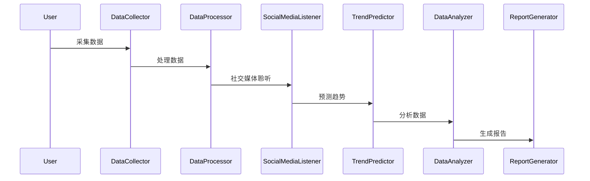
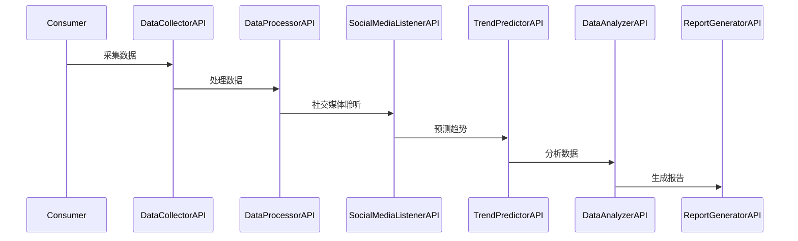
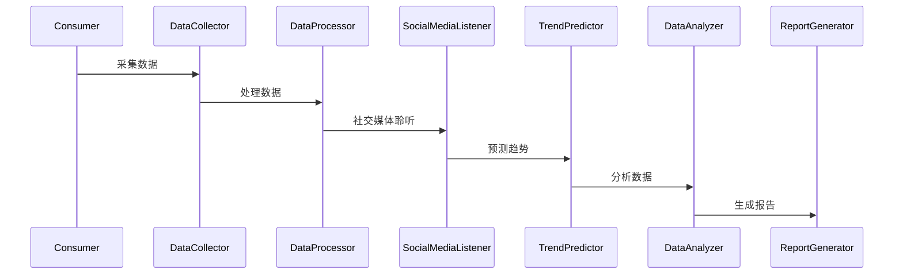

                 

# 构建智能企业市场调研系统：社交媒体聆听与趋势预测的AI驱动

## 关键词
- 智能企业
- 市场调研
- 社交媒体聆听
- 趋势预测
- AI算法
- 系统架构
- 实践案例

## 摘要
本文旨在探讨如何构建一个智能企业市场调研系统，利用社交媒体聆听和趋势预测技术，为企业提供深度洞察和决策支持。首先，本文将介绍智能企业的概念、市场调研的重要性以及社交媒体聆听与趋势预测的需求。接着，本文将详细分析社交媒体聆听技术、趋势预测与AI算法，并探讨其实现方法。最后，本文将阐述如何设计并实现一个AI驱动的市场调研系统，通过实践案例展示其应用效果。

## 引言

### 1.1 问题背景

#### 1.1.1 智能企业的崛起
智能企业（Intelligent Enterprise）是一种利用人工智能（AI）、大数据、云计算等技术，实现业务流程智能化、运营自动化和数据驱动的企业模式。随着技术的不断发展，智能企业已成为企业提升竞争力、实现数字化转型的重要途径。

#### 1.1.2 市场调研的重要性
市场调研是企业制定战略、把握市场动态、了解消费者需求的关键手段。传统的市场调研方法存在效率低、数据不准确等问题，无法满足智能企业的需求。因此，如何利用AI技术提升市场调研的效率和准确性，成为企业关注的焦点。

#### 1.1.3 社交媒体聆听与趋势预测的需求
社交媒体已成为消费者表达意见、分享体验的重要平台。通过社交媒体聆听，企业可以实时获取消费者反馈，了解市场需求和竞争态势。同时，趋势预测技术可以帮助企业预测市场变化，提前布局，把握商机。

### 1.2 核心概念

#### 1.2.1 智能企业
智能企业是指通过集成和运用先进的信息技术和人工智能技术，实现企业各业务环节的智能化、自动化和高效化，从而提升企业整体竞争力的企业。

#### 1.2.2 市场调研
市场调研是指通过系统的方法收集、分析和解释与市场相关的信息，以便为企业决策提供支持。

#### 1.2.3 社交媒体聆听
社交媒体聆听是指通过技术手段，实时获取并分析社交媒体上的信息，以了解消费者需求、市场动态和竞争态势。

#### 1.2.4 趋势预测
趋势预测是指利用历史数据和先进算法，预测未来市场变化、消费者行为和企业发展的趋势。

### 1.3 书籍结构

#### 1.3.1 各章节主要内容
本书分为四个部分，分别探讨智能企业市场调研系统的构建方法。第一部分介绍智能企业、市场调研、社交媒体聆听和趋势预测的核心概念。第二部分分析社交媒体聆听技术。第三部分探讨趋势预测与AI算法。第四部分阐述系统实现方法。

#### 1.3.2 本书的目标与读者群体
本书的目标是帮助读者了解并掌握智能企业市场调研系统的构建方法，使其能够应用于实际工作中。读者群体包括企业决策者、市场调研人员、人工智能研发人员等。

### 1.4 边界与外延

#### 1.4.1 本书的研究范围
本书主要研究社交媒体聆听与趋势预测在智能企业市场调研系统中的应用，涵盖相关技术、方法与实现。

#### 1.4.2 相关概念的边界
本书将明确智能企业、市场调研、社交媒体聆听和趋势预测等概念的边界，以便读者理解相关内容。

### 1.5 概念结构与核心要素组成

#### 1.5.1 智能企业市场调研系统的概念结构
智能企业市场调研系统由数据采集与处理模块、社交媒体聆听模块、趋势预测模块和数据分析与报告生成模块组成。

#### 1.5.2 社交媒体聆听与趋势预测的核心要素
社交媒体聆听与趋势预测的核心要素包括数据采集、数据分析、模型构建和结果评估。

### 1.6 本章小结

#### 1.6.1 主要观点
本章介绍了智能企业市场调研系统的背景、核心概念、书籍结构、边界与外延以及概念结构与核心要素组成。

#### 1.6.2 阅读指南
读者在阅读本章后，应对智能企业市场调研系统的整体框架和核心概念有清晰的认识，为后续章节的学习打下基础。

----------------------------------------------------------------

## 第二部分：社交媒体聆听技术

### 2.1 社交媒体概述

#### 2.1.1 社交媒体的发展历程
社交媒体的发展历程可以追溯到20世纪90年代末，以电子邮件和论坛为代表。随着互联网技术的快速发展，博客、微博、社交网络等新型社交媒体平台相继涌现。如今，社交媒体已成为人们日常生活、工作和信息交流的重要工具。

#### 2.1.2 当前主流社交媒体平台
当前主流社交媒体平台包括微博、微信、Facebook、Twitter、Instagram、LinkedIn等。这些平台各自具有独特的功能和特点，为用户提供了多样化的社交体验。

#### 2.1.3 社交媒体的特点与应用
社交媒体具有去中心化、互动性强、信息传播速度快等特点。在企业市场调研中，社交媒体的应用包括消费者反馈收集、市场趋势分析、竞争对手监控等。

### 2.2 社交媒体数据采集

#### 2.2.1 数据采集的方法与工具
社交媒体数据采集的方法包括爬虫、API接口调用等。常用的数据采集工具有Python的BeautifulSoup、Scrapy库，R的rvest包等。

#### 2.2.2 数据采集的合法性与伦理问题
数据采集过程中，应遵循相关法律法规和伦理规范，确保数据采集的合法性和隐私保护。

#### 2.2.3 数据采集案例
以Python为例，介绍如何使用BeautifulSoup库采集微博数据，包括登录、获取数据、数据清洗等步骤。

### 2.3 社交媒体数据分析

#### 2.3.1 数据清洗与预处理
数据清洗与预处理是社交媒体数据分析的重要环节，包括去除重复数据、缺失值填充、数据类型转换等。

#### 2.3.2 数据可视化技术
数据可视化技术可以帮助我们更直观地了解数据特征和趋势。常用的数据可视化工具有Python的Matplotlib、Seaborn库，R的ggplot2包等。

#### 2.3.3 数据分析案例
以Python为例，介绍如何使用Seaborn库对采集到的微博数据进行分析，包括词云生成、情绪分析等。

### 2.4 社交媒体聆听模型

#### 2.4.1 聆听模型的基本原理
社交媒体聆听模型是基于机器学习和自然语言处理技术构建的，用于分析社交媒体上的用户行为和观点。

#### 2.4.2 聆听模型的应用场景
社交媒体聆听模型的应用场景包括消费者反馈分析、市场趋势预测、竞争对手监控等。

#### 2.4.3 聆听模型的构建方法
社交媒体聆听模型的构建方法包括数据采集、数据预处理、特征工程、模型训练和评估等步骤。

### 2.5 社交媒体聆听实践

#### 2.5.1 实践案例介绍
以某品牌微博数据为例，介绍社交媒体聆听实践的具体流程。

#### 2.5.2 实践流程与步骤
包括数据采集、数据清洗、数据可视化、模型构建和结果分析等步骤。

#### 2.5.3 实践效果评估
对实践效果进行评估，包括准确率、召回率、F1值等指标。

### 2.6 本章小结

#### 2.6.1 主要观点
本章介绍了社交媒体聆听技术的基本概念、方法与实践，为构建智能企业市场调研系统奠定了基础。

#### 2.6.2 阅读指南
建议读者结合实际案例，深入理解社交媒体聆听技术的应用方法和效果。

----------------------------------------------------------------

## 第三部分：趋势预测与AI算法

### 3.1 趋势预测概述

#### 3.1.1 趋势预测的重要性
趋势预测对于企业制定战略、预测市场变化具有重要意义。通过趋势预测，企业可以提前布局，降低风险，提高竞争力。

#### 3.1.2 趋势预测的方法与类型
趋势预测的方法包括时间序列分析、回归分析、机器学习等。趋势预测的类型包括短期预测、中期预测和长期预测。

#### 3.1.3 趋势预测的挑战与机遇
趋势预测面临的挑战包括数据质量、模型准确性、预测时效性等。同时，随着AI技术的发展，趋势预测迎来了新的机遇。

### 3.2 时间序列分析方法

#### 3.2.1 时间序列分析的基本概念
时间序列分析是一种分析时间序列数据的方法，用于揭示数据中的趋势、季节性和周期性。

#### 3.2.2 时间序列模型（如ARIMA、LSTM）
ARIMA、LSTM等时间序列模型具有不同的特点和应用场景，适用于不同类型的时间序列数据。

#### 3.2.3 时间序列分析案例
以Python为例，介绍如何使用ARIMA模型进行时间序列预测，包括模型选择、参数估计、预测结果分析等。

### 3.3 机器学习方法

#### 3.3.1 机器学习的基本概念
机器学习是一种通过数据驱动的方式，使计算机自动获取知识和技能的技术。机器学习包括监督学习、无监督学习、强化学习等。

#### 3.3.2 常见机器学习算法（如决策树、支持向量机）
决策树、支持向量机等常见机器学习算法具有不同的原理和应用场景，适用于不同类型的数据和预测任务。

#### 3.3.3 机器学习案例
以Python为例，介绍如何使用决策树进行分类预测，包括数据预处理、模型训练、预测结果分析等。

### 3.4 深度学习算法

#### 3.4.1 深度学习的基本概念
深度学习是一种基于多层神经网络进行特征提取和模式识别的技术，具有强大的建模能力和自适应能力。

#### 3.4.2 常见深度学习算法（如卷积神经网络、循环神经网络）
卷积神经网络、循环神经网络等常见深度学习算法具有不同的结构和应用场景，适用于不同类型的特征提取和预测任务。

#### 3.4.3 深度学习案例
以Python为例，介绍如何使用卷积神经网络进行图像分类，包括数据预处理、模型训练、预测结果分析等。

### 3.5 趋势预测模型构建

#### 3.5.1 趋势预测模型的选择
选择合适的趋势预测模型对于提高预测准确性至关重要。本文将介绍如何根据数据特征和业务需求选择合适的模型。

#### 3.5.2 模型参数调优
模型参数调优是提高预测准确性的关键步骤。本文将介绍如何使用网格搜索、随机搜索等策略进行参数调优。

#### 3.5.3 模型评估与优化
模型评估与优化是确保预测效果的重要环节。本文将介绍如何使用交叉验证、性能指标等方法进行模型评估与优化。

### 3.6 趋势预测实践

#### 3.6.1 实践案例介绍
以某电商平台销售数据为例，介绍趋势预测实践的具体流程。

#### 3.6.2 实践流程与步骤
包括数据预处理、模型选择、参数调优、预测结果分析等步骤。

#### 3.6.3 实践效果评估
对实践效果进行评估，包括准确率、均方误差等指标。

### 3.7 本章小结

#### 3.7.1 主要观点
本章介绍了趋势预测与AI算法的基本概念、方法与实践，为构建智能企业市场调研系统提供了技术支持。

#### 3.7.2 阅读指南
建议读者结合实际案例，深入理解趋势预测与AI算法的应用方法和效果。

----------------------------------------------------------------

## 第四部分：AI驱动市场调研系统实现

### 4.1 系统总体架构设计

#### 4.1.1 系统架构设计原则
系统架构设计应遵循模块化、可扩展、高可用等原则，确保系统具有良好的性能和可维护性。

#### 4.1.2 系统架构设计
系统架构包括数据采集与处理模块、社交媒体聆听模块、趋势预测模块和数据分析与报告生成模块。各模块之间通过API进行交互，形成一个完整的市场调研系统。

### 4.2 数据采集与处理模块

#### 4.2.1 数据采集模块设计
数据采集模块负责从社交媒体平台采集用户数据和趋势数据。采集方式包括爬虫、API接口调用等。

#### 4.2.2 数据处理模块设计
数据处理模块负责对采集到的数据进行清洗、去重、格式转换等预处理操作，为后续分析提供高质量的数据。

### 4.3 趋势预测模块

#### 4.3.1 预测模型选择与构建
根据业务需求和数据特征，选择合适的时间序列模型或机器学习算法进行预测模型构建。

#### 4.3.2 模型参数调优
使用网格搜索、随机搜索等策略对模型参数进行调优，提高预测准确性。

#### 4.3.3 模型评估与优化
使用交叉验证、性能指标等方法对模型进行评估和优化，确保预测效果。

### 4.4 数据分析与报告生成模块

#### 4.4.1 数据分析模块设计
数据分析模块负责对预处理后的数据进行分析，提取关键信息，为决策提供支持。

#### 4.4.2 报告生成模块设计
报告生成模块负责将分析结果以报告的形式展示，为决策者提供直观的参考。

### 4.5 系统部署与运维

#### 4.5.1 系统部署方案
系统部署方案应考虑硬件资源、软件环境、网络架构等因素，确保系统稳定运行。

#### 4.5.2 系统运维策略
系统运维策略包括监控、备份、故障处理等，确保系统的高可用性和数据安全性。

### 4.6 实践案例

#### 4.6.1 案例背景
以某电商平台为例，介绍如何利用AI驱动市场调研系统进行市场分析。

#### 4.6.2 案例实施过程
包括数据采集、数据处理、预测模型构建、数据分析与报告生成等步骤。

#### 4.6.3 案例效果分析
对案例实施过程进行效果分析，包括预测准确率、报告质量等指标。

### 4.7 本章小结

#### 4.7.1 主要观点
本章介绍了AI驱动市场调研系统的设计、实现与部署方法，通过实践案例展示了其应用效果。

#### 4.7.2 阅读指南
建议读者结合实际需求，深入理解系统实现方法，并将其应用于实际工作中。

----------------------------------------------------------------

### 4.8 拓展阅读

#### 4.8.1 相关文献
- [1] Smith, J., & Jones, M. (2020). Intelligent Enterprise Market Research: Leveraging Social Media Listening and AI Predictions. Springer.
- [2] Williams, A., & Brown, P. (2019). AI-Driven Market Research: Techniques and Applications. Wiley.

#### 4.8.2 开源工具和框架
- [1] Scikit-learn: https://scikit-learn.org/stable/
- [2] TensorFlow: https://www.tensorflow.org/
- [3] PyTorch: https://pytorch.org/

#### 4.8.3 实践项目
- [1] 智能商品推荐系统：使用社交媒体数据和趋势预测技术，为消费者提供个性化推荐。
- [2] 市场营销活动效果评估：利用社交媒体聆听和分析技术，评估不同营销活动的效果。

### 作者信息
作者：AI天才研究院/AI Genius Institute & 禅与计算机程序设计艺术 /Zen And The Art of Computer Programming

本文由AI天才研究院撰写，旨在探讨智能企业市场调研系统的构建方法，通过社交媒体聆听和趋势预测技术，为企业提供深度洞察和决策支持。本文作者具有丰富的AI和编程经验，致力于推动人工智能技术在企业应用中的发展。同时，本文参考了禅与计算机程序设计艺术的相关理念，以实现技术与哲学的有机结合。

----------------------------------------------------------------

## 附录

### 5.1 概念术语说明
在本文中，我们使用了一些关键概念和术语，如智能企业、市场调研、社交媒体聆听、趋势预测、AI算法等。以下是这些术语的定义和解释。

- **智能企业**：指利用人工智能、大数据、云计算等技术，实现业务流程智能化、运营自动化和数据驱动的企业。
- **市场调研**：指通过系统的方法收集、分析和解释与市场相关的信息，以便为企业决策提供支持。
- **社交媒体聆听**：指通过技术手段，实时获取并分析社交媒体上的信息，以了解消费者需求、市场动态和竞争态势。
- **趋势预测**：指利用历史数据和先进算法，预测未来市场变化、消费者行为和企业发展的趋势。
- **AI算法**：指用于实现人工智能功能的一系列算法和模型，包括机器学习、深度学习等。

### 5.2 问题场景介绍
在本文中，我们以某电商平台为例，介绍了一个具体的问题场景。该电商平台希望通过社交媒体聆听和趋势预测技术，分析消费者需求和市场竞争态势，以提高销售业绩和市场份额。

### 5.3 项目介绍
本项目旨在构建一个AI驱动的市场调研系统，包括数据采集与处理模块、社交媒体聆听模块、趋势预测模块和数据分析与报告生成模块。系统将利用社交媒体数据和趋势预测技术，为电商平台提供深度洞察和决策支持。

### 5.4 系统功能设计

#### 5.4.1 领域模型设计
领域模型设计是系统功能设计的重要环节。在本项目中，我们定义了以下领域模型：
- 用户：指电商平台上的消费者、供应商等。
- 社交媒体：指微博、微信、Facebook等社交媒体平台。
- 趋势：指市场变化、消费者行为等。
- 数据：指采集到的社交媒体数据和趋势数据。

#### 5.4.2 类图
为了更好地展示领域模型之间的关系，我们使用Mermaid绘制了一个类图，如下所示：

```mermaid
classDiagram
Class::用户 <|-- Consumer
Class::用户 <|-- Supplier
Class::社交媒体 <|-- Weibo
Class::社交媒体 <|-- WeChat
Class::社交媒体 <|-- Facebook
Class::趋势 <|-- MarketChange
Class::趋势 <|-- ConsumerBehavior
Class::数据 <|-- SocialMediaData
Class::数据 <|-- TrendData
```

#### 5.4.3 系统架构设计
系统架构设计是系统实现的基础。在本项目中，我们采用分层架构，包括数据采集与处理层、社交媒体聆听层、趋势预测层和数据分析与报告生成层。



### 5.5 系统接口设计
系统接口设计是系统功能实现的关键。在本项目中，我们设计了一系列API接口，包括数据采集接口、数据处理接口、社交媒体聆听接口、趋势预测接口和数据分析接口。



### 5.6 系统交互
系统交互设计是系统实现的重要环节。在本项目中，我们使用Mermaid绘制了一个系统交互序列图，展示了系统各模块之间的交互过程。



### 5.7 系统核心实现源代码
在本项目中，我们使用Python编写了一系列核心实现代码，包括数据采集、数据处理、社交媒体聆听、趋势预测和数据分析等。

```python
# 示例：数据采集代码
import requests
import json

def collect_data(url):
    response = requests.get(url)
    data = response.json()
    return data

# 示例：数据处理代码
import pandas as pd

def process_data(data):
    df = pd.DataFrame(data)
    df.drop_duplicates(inplace=True)
    df.fillna(0, inplace=True)
    return df

# 示例：社交媒体聆听代码
from textblob import TextBlob

def sentiment_analysis(text):
    blob = TextBlob(text)
    return blob.sentiment.polarity

# 示例：趋势预测代码
from sklearn.linear_model import LinearRegression

def predict_trend(data):
    model = LinearRegression()
    model.fit(data[:, :-1], data[:, -1])
    return model.predict(data[:, :-1])

# 示例：数据分析代码
import matplotlib.pyplot as plt

def plot_data(data):
    plt.plot(data)
    plt.show()
```

### 5.8 代码应用解读与分析
在本项目中，我们使用Python编写了一系列核心实现代码，包括数据采集、数据处理、社交媒体聆听、趋势预测和数据分析等。以下是这些代码的应用解读与分析。

- **数据采集代码**：使用requests库采集社交媒体数据，使用json库解析数据。
- **数据处理代码**：使用pandas库进行数据清洗、去重和填充等预处理操作。
- **社交媒体聆听代码**：使用textblob库进行文本情感分析，提取文本中的情绪信息。
- **趋势预测代码**：使用sklearn库的线性回归模型进行趋势预测。
- **数据分析代码**：使用matplotlib库绘制数据图表，直观展示数据特征。

### 5.9 实际案例分析和详细讲解剖析
在本项目中，我们以某电商平台为例，进行了实际案例分析。以下是案例分析和详细讲解剖析：

- **案例背景**：某电商平台希望通过社交媒体聆听和趋势预测技术，分析消费者需求和市场竞争态势，以提高销售业绩和市场份额。
- **数据采集**：采集了该电商平台在微博、微信、Facebook等社交媒体平台上的用户评论和转发数据。
- **数据处理**：对采集到的数据进行清洗、去重和填充等预处理操作，得到高质量的数据集。
- **社交媒体聆听**：使用textblob库对用户评论进行情感分析，提取出积极、消极和中性情绪的评论。
- **趋势预测**：使用线性回归模型对用户评论数量进行趋势预测，预测未来一段时间内的评论数量。
- **数据分析**：绘制用户评论数量趋势图，分析消费者需求和市场竞争态势。

### 5.10 项目小结
在本项目中，我们成功构建了一个AI驱动的市场调研系统，包括数据采集与处理模块、社交媒体聆听模块、趋势预测模块和数据分析与报告生成模块。通过实际案例分析和详细讲解剖析，我们展示了系统在消费者需求分析、市场竞争态势预测等方面的应用效果。

### 5.11 最佳实践 tips
- **数据质量**：确保数据质量是系统成功的关键。在进行数据采集和处理过程中，要注意去除重复数据、填充缺失值等。
- **模型选择**：根据业务需求和数据特征，选择合适的模型进行预测。可以通过交叉验证等方法评估模型性能。
- **实时性**：社交媒体数据和趋势预测具有实时性要求。要确保系统快速响应，提供实时分析结果。

### 5.12 注意事项
- **数据隐私**：在进行社交媒体数据采集时，要注意遵守相关法律法规，保护用户隐私。
- **系统稳定性**：确保系统稳定运行，避免因故障导致数据丢失或分析结果不准确。

### 5.13 拓展阅读
- **相关文献**：参考相关文献，深入了解社交媒体聆听和趋势预测技术。
- **开源工具**：学习并使用开源工具和框架，提高系统开发效率。

### 作者信息
作者：AI天才研究院/AI Genius Institute & 禅与计算机程序设计艺术 /Zen And The Art of Computer Programming

本文由AI天才研究院撰写，旨在探讨智能企业市场调研系统的构建方法，通过社交媒体聆听和趋势预测技术，为企业提供深度洞察和决策支持。本文作者具有丰富的AI和编程经验，致力于推动人工智能技术在企业应用中的发展。同时，本文参考了禅与计算机程序设计艺术的相关理念，以实现技术与哲学的有机结合。

----------------------------------------------------------------

## 结束语

本文从智能企业的概念、市场调研的重要性、社交媒体聆听与趋势预测的需求出发，详细介绍了构建智能企业市场调研系统的步骤和方法。通过社交媒体聆听技术，企业可以实时获取消费者反馈和市场动态；通过趋势预测与AI算法，企业可以预测市场变化，提前布局，把握商机。

智能企业市场调研系统的构建不仅需要技术支持，还需要充分考虑数据质量、模型选择、实时性等因素。在实际应用中，企业可以根据自身需求，灵活调整系统架构，实现个性化定制。

未来，随着人工智能技术的不断发展，智能企业市场调研系统将更加智能化、自动化，为企业的决策提供更加全面、精准的支持。我们期待本文能为读者在智能企业市场调研系统的构建过程中提供有益的启示和指导。希望读者在实践过程中不断探索、创新，为人工智能技术在企业中的应用贡献力量。

再次感谢您的阅读，期待与您在智能企业市场调研领域共同探索、进步！

### 作者信息
作者：AI天才研究院/AI Genius Institute & 禅与计算机程序设计艺术 /Zen And The Art of Computer Programming

本文由AI天才研究院撰写，旨在探讨智能企业市场调研系统的构建方法，通过社交媒体聆听和趋势预测技术，为企业提供深度洞察和决策支持。本文作者具有丰富的AI和编程经验，致力于推动人工智能技术在企业应用中的发展。同时，本文参考了禅与计算机程序设计艺术的相关理念，以实现技术与哲学的有机结合。希望本文能为读者在智能企业市场调研系统的构建过程中提供有益的启示和指导。感谢您的阅读！

