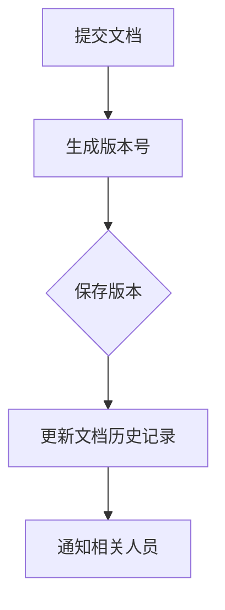
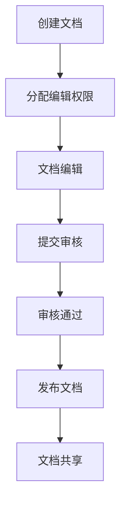

                 

# 构建智能企业文档管理系统：版本控制与协作优化的AI增强

> 关键词：智能企业，文档管理系统，版本控制，协作优化，AI增强

> 摘要：本文深入探讨构建智能企业文档管理系统的关键要素，重点关注版本控制和协作优化方面的AI增强技术。通过分析问题背景、核心概念、AI技术应用及系统架构设计，本文旨在为IT专业人士提供切实可行的解决方案，以提升企业文档管理的效率和安全性。

----------------------------------------------------------------

## 第一部分：背景介绍与核心概念

### 第1章：问题背景与需求分析

#### 1.1.1 问题背景

智能企业在快速发展的同时，面临着文档管理方面的诸多挑战。传统的文档管理系统往往存在以下几个局限性：

1. **文档版本控制困难**：在多人协作环境中，文档版本容易混乱，导致文档的完整性和一致性难以保证。
2. **文档协作效率低下**：缺乏有效的协作工具，团队成员之间的沟通和文档共享不畅，影响工作效率。
3. **文档安全与权限管理不足**：文档的安全性得不到保障，权限管理机制不完善，容易造成信息泄露。

#### 1.1.2 问题描述

文档管理中的主要问题可以归结为以下几点：

1. **文档版本控制困难**：不同版本之间的文档更新难以跟踪，历史版本容易丢失。
2. **文档协作效率低下**：团队成员之间的文档协作不畅，沟通成本高，文档同步困难。
3. **文档安全与权限管理不足**：文档的安全性和权限管理机制薄弱，可能导致敏感信息泄露。

#### 1.1.3 问题解决

为了解决上述问题，引入AI技术进行文档管理和优化，从而实现版本控制与协作优化的AI增强。以下是具体解决方案：

1. **版本控制机制**：通过AI算法实现智能版本控制，自动生成版本号，并保存历史版本，确保文档的完整性和一致性。
2. **协作优化工具**：利用AI技术提供智能推荐和搜索功能，提高团队成员之间的协作效率和文档共享体验。
3. **安全与权限管理**：通过AI技术进行文档安全检测和权限控制，确保文档的安全性和合规性。

#### 1.1.4 边界与外延

智能文档管理系统适用于各类企业，特别适合那些文档量庞大、多人协作频繁的场景。AI技术在文档管理中的应用边界包括：

1. **自动分类与标签生成**：对文档进行自动分类和标签标注，提高文档检索效率。
2. **内容审核与风险检测**：利用自然语言处理技术对文档内容进行审核，识别潜在风险。
3. **文档推荐与搜索优化**：基于用户行为和文档内容，提供智能文档推荐和搜索服务。

#### 1.1.5 概念结构与核心要素组成

智能企业文档管理系统由以下几个核心要素组成：

1. **智能企业**：指采用先进技术进行管理和运营的企业。
2. **文档管理系统**：用于管理企业文档的软件系统，提供文档存储、检索、共享等功能。
3. **版本控制**：管理文档版本，确保文档的完整性和一致性。
4. **协作优化**：提高团队成员之间的协作效率和文档共享体验。
5. **AI增强**：利用人工智能技术提升文档管理系统的性能和用户体验。

----------------------------------------------------------------

### 第2章：核心概念与联系

#### 2.1.1 核心概念原理

1. **文档管理系统**：管理企业文档的软件系统，提供文档存储、检索、共享等功能。
2. **版本控制机制**：管理文档版本，确保文档的完整性和一致性。
3. **协作工具**：促进团队成员之间的文档协作，提高工作效率。
4. **AI技术**：应用人工智能算法，提升文档管理效率和用户体验。

#### 2.1.2 概念属性特征对比

| 概念       | 特征                                 |
|------------|--------------------------------------|
| 文档管理系统 | 管理企业文档，提供存储、检索、共享功能 |
| 版本控制   | 管理文档版本，确保文档的完整性和一致性 |
| 协作工具   | 促进团队成员之间的文档协作           |
| AI技术     | 应用人工智能算法，提升文档管理效率   |

#### 2.1.3 ER实体关系图架构

```mermaid
erDiagram
  DOC --> USER : 用户创建文档
  DOC --> VERSION : 存储文档版本
  USER --> GROUP : 用户属于某个团队
  GROUP --> PROJECT : 团队参与项目
  PROJECT --> DOCUMENT : 项目关联文档
  VERSION --> COMMENT : 版本包含评论
```

----------------------------------------------------------------

### 第3章：AI在文档管理系统中的应用

#### 3.1.1 AI技术的应用场景

AI技术在文档管理系统中具有广泛的应用场景，主要包括以下几个方面：

1. **文档自动分类与标签生成**：利用机器学习算法对文档进行自动分类和标签标注，提高文档检索效率。
2. **文档内容审核与风险检测**：通过自然语言处理技术对文档内容进行审核，识别潜在风险，确保文档合规性。
3. **文档推荐与搜索优化**：基于用户行为和文档内容，提供智能文档推荐和搜索服务，提高用户体验。

#### 3.1.2 AI技术的工作原理

AI技术的工作原理主要涉及以下几个核心环节：

1. **机器学习算法**：通过训练大量数据集，使机器学习算法能够自动识别和预测文档特征。
2. **自然语言处理技术**：对文档内容进行文本分析、情感分析和语义理解，以便更好地管理文档。
3. **数据挖掘与数据分析**：从大量文档数据中提取有价值的信息，为文档管理提供决策支持。

#### 3.1.3 AI技术对文档管理系统的影响

AI技术的引入，对文档管理系统产生了深远的影响：

1. **提升文档管理效率**：通过自动化和智能化手段，降低人工操作的复杂性，提高文档管理效率。
2. **提高文档安全性与可靠性**：利用AI技术进行文档安全检测和风险控制，提高文档安全性和可靠性。
3. **优化文档协作流程**：通过智能推荐和搜索功能，提高团队成员之间的协作效率和文档共享体验。

----------------------------------------------------------------

### 第4章：智能文档管理系统的架构设计

#### 4.1.1 系统架构设计

智能文档管理系统采用分布式架构，主要包括以下几个核心模块：

1. **文档存储模块**：负责存储企业文档，支持海量文档的存储和快速检索。
2. **版本控制模块**：实现文档版本控制功能，确保文档的完整性和一致性。
3. **协作模块**：提供文档共享、评论、协作工具等功能，促进团队成员之间的协作。
4. **AI增强模块**：利用AI技术，提供文档自动分类、内容审核、文档推荐等功能。

#### 4.1.2 系统接口设计

系统接口设计包括内部接口和外部接口：

1. **内部接口**：系统内部各模块之间的通信接口，确保数据传输的一致性和高效性。
2. **外部接口**：系统与外部系统的交互接口，如与其他业务系统的集成、数据导入导出等。

#### 4.1.3 系统交互

系统交互主要涉及以下几个方面：

1. **用户与系统交互**：用户通过Web界面、移动应用等方式与系统进行交互，完成文档创建、编辑、共享等操作。
2. **文档协同编辑**：支持多用户实时协作编辑文档，确保文档的一致性和完整性。
3. **版本更新与通知**：系统自动检测文档版本更新，并通知相关用户进行查阅和审核。

----------------------------------------------------------------

## 第二部分：文档管理系统的核心功能

### 第5章：文档版本控制机制

文档版本控制是文档管理系统的重要组成部分，它确保文档在多次编辑和修改后仍能保持一致性和完整性。以下是文档版本控制机制的基本原理、算法实现、挑战及解决方案，并通过实际案例进行分析。

#### 5.1.1 版本控制的基本原理

版本控制机制的核心在于为每个文档生成唯一标识的版本号，并保存文档的历史版本。以下是版本控制的基本流程：

1. **提交文档**：用户提交文档进行编辑或修改。
2. **生成版本号**：系统根据文档内容和提交时间生成版本号。
3. **保存版本**：将文档及其版本信息存储在数据库中，以便后续查询。
4. **更新文档历史记录**：将新的版本号更新到文档历史记录中。
5. **通知相关人员**：通知文档的创建者和其他相关用户，告知文档版本更新情况。

使用Mermaid绘制的版本控制流程图如下：



#### 5.1.2 版本控制算法与实现

版本控制算法的设计需考虑多个因素，如版本号的生成策略、版本历史记录的存储方式以及版本更新的通知机制。以下是一个简单的版本控制算法实现：

1. **版本号生成**：使用时间戳或递增数字作为版本号。
2. **版本历史记录**：使用数据库或文件系统存储版本信息，包括版本号、提交时间、提交用户等。
3. **版本更新通知**：通过邮件、Web通知等方式，及时通知相关用户文档版本更新。

Python代码实现版本控制算法示例：

```python
import time
import json

class VersionControl:
    def __init__(self):
        self.documents = {}

    def submit_document(self, doc_id, content, user):
        version = self.generate_version()
        self.documents[doc_id] = {
            "content": content,
            "version": version,
            "submit_time": time.time(),
            "submit_user": user
        }
        self.update_document_history(doc_id, version)
        self.notify_users(doc_id, version)

    def generate_version(self):
        return time.time()

    def update_document_history(self, doc_id, version):
        history = self.documents[doc_id].get("history", [])
        history.append(version)
        self.documents[doc_id]["history"] = history

    def notify_users(self, doc_id, version):
        print(f"Document {doc_id} version {version} has been updated.")

# 使用示例
vc = VersionControl()
vc.submit_document("doc_001", "文档内容", "用户A")
```

#### 5.1.3 版本控制的挑战与解决方案

版本控制面临的挑战主要包括：

1. **多人并发修改**：当多个用户同时编辑同一文档时，容易出现版本冲突。
2. **大规模文档版本存储**：随着文档版本数量的增加，如何高效地存储和检索版本历史成为挑战。

针对以上挑战，可以采取以下解决方案：

1. **冲突检测与处理**：在用户提交文档前，系统检测是否有其他用户正在编辑该文档，若存在冲突，提示用户进行合并或选择保留哪个版本。
2. **分布式存储**：使用分布式存储系统（如分布式数据库、对象存储等）来存储大量版本数据，提高存储和检索效率。

#### 5.1.4 实际应用案例

以某企业文档管理系统为例，分析其版本控制实践：

1. **问题分析**：企业在文档管理中发现，由于缺乏有效的版本控制，团队成员之间的文档更新经常出现混淆，导致工作重复和效率低下。
2. **解决方案**：引入版本控制机制，通过生成唯一版本号和存储版本历史，确保文档版本的一致性和完整性。同时，采用分布式存储方案，提高版本数据的存储和检索效率。

通过以上实际案例，我们可以看到版本控制在文档管理中起到的重要作用。有效的版本控制机制能够帮助企业提高工作效率，降低沟通成本，确保文档的完整性和一致性。

### 第6章：文档协作优化策略

文档协作优化是提高企业工作效率和团队协作能力的关键。以下是文档协作优化的目标、常见协作工具的选型与配置、协作流程设计等内容。

#### 6.1.1 协作优化的目标

文档协作优化的目标主要包括：

1. **提高文档创建、编辑、审核的效率**：通过自动化工具和智能推荐，减少团队成员之间的沟通和等待时间。
2. **减少文档冗余和重复工作**：避免团队成员重复创建和编辑相同的文档，提高工作效率。
3. **确保文档质量和一致性**：通过规范化的协作流程和审核机制，确保文档质量和一致性。

#### 6.1.2 协作工具的选型与配置

常见的文档协作工具有以下几种：

1. **Google Docs**：支持多人实时协作编辑文档，具有强大的编辑功能和云端存储。
2. **Microsoft Office 365**：包括Word、Excel、PowerPoint等办公软件，支持在线协作和文档共享。
3. **Confluence**：为团队提供协作平台，支持文档编辑、评论和分享。

协作工具的选型需考虑以下因素：

1. **团队规模**：根据团队规模和协作需求选择适合的工具。
2. **功能需求**：根据团队的具体需求，选择具备所需功能的协作工具。
3. **集成能力**：选择能够与企业现有系统集成的协作工具，提高系统间的协作效率。

协作工具的配置主要包括：

1. **用户权限管理**：设置不同用户的权限，确保团队成员只能访问和编辑授权的文档。
2. **工作流程配置**：配置协作流程，定义文档的创建、编辑、审核和发布等步骤。
3. **文档模板**：提供文档模板，规范文档格式和内容，提高协作效率。

#### 6.1.3 协作流程设计

协作流程设计是确保团队成员高效协作的关键。以下是一个简单的协作流程设计：

1. **创建文档**：由项目负责人创建文档，并分配编辑权限。
2. **文档编辑**：团队成员根据权限对文档进行编辑，可以使用版本控制功能避免冲突。
3. **提交审核**：编辑完成后，将文档提交给审核人员，审核通过后发布。
4. **文档共享**：将审核通过的文档共享给团队成员和其他相关人员。

使用Mermaid绘制的协作流程图如下：



通过优化文档协作流程，企业可以显著提高工作效率，降低沟通成本，确保文档的质量和一致性。

----------------------------------------------------------------

### 第7章：智能文档管理系统的实现与实战

#### 7.1.1 环境安装

要实现智能文档管理系统，首先需要在服务器上安装以下软件和依赖项：

1. **操作系统**：推荐使用Ubuntu 18.04或更高版本。
2. **数据库**：安装MySQL 8.0或更高版本。
3. **后端框架**：安装Python 3.8及以上版本，并使用Flask框架。
4. **前端框架**：安装Vue.js 2.6及以上版本。

安装命令如下：

```bash
# 更新软件包列表
sudo apt update && sudo apt upgrade

# 安装MySQL
sudo apt install mysql-server

# 安装Python 3.8
sudo apt install python3.8

# 安装Flask框架
pip3 install flask

# 安装Vue.js
npm install -g @vue/cli
vue create doc_management_system
```

#### 7.1.2 系统核心实现源代码

系统核心实现包括后端和前端两部分，以下是主要源代码示例：

**后端代码（Flask）**

```python
from flask import Flask, request, jsonify
from doc_model import Document

app = Flask(__name__)

@app.route('/api/documents', methods=['POST'])
def create_document():
    data = request.get_json()
    doc_id = data.get('id')
    content = data.get('content')
    user = data.get('user')
    version = Document.create_document(doc_id, content, user)
    return jsonify({'version': version})

@app.route('/api/documents/<doc_id>', methods=['GET'])
def get_document(doc_id):
    version = Document.get_document(doc_id)
    return jsonify(version)

if __name__ == '__main__':
    app.run(debug=True)
```

**前端代码（Vue.js）**

```html
<!DOCTYPE html>
<html>
<head>
    <title>智能文档管理系统</title>
    <script src="https://cdn.jsdelivr.net/npm/vue@2.6.14/dist/vue.js"></script>
</head>
<body>
    <div id="app">
        <h1>智能文档管理系统</h1>
        <form @submit.prevent="createDocument">
            <input type="text" v-model="docId" placeholder="文档ID">
            <input type="text" v-model="content" placeholder="文档内容">
            <button type="submit">创建文档</button>
        </form>
        <div v-for="version in documentVersions">
            <p>文档ID: {{ version.id }}</p>
            <p>版本号: {{ version.version }}</p>
            <p>内容: {{ version.content }}</p>
        </div>
    </div>
    <script>
        new Vue({
            el: '#app',
            data: {
                docId: '',
                content: '',
                documentVersions: []
            },
            methods: {
                createDocument() {
                    // 调用后端API创建文档
                },
                getDocument() {
                    // 调用后端API获取文档版本
                }
            }
        });
    </script>
</body>
</html>
```

#### 7.1.3 代码应用解读与分析

**后端代码解读**

- 使用Flask框架创建Web应用，并定义创建文档和获取文档的API接口。
- `Document.create_document`方法用于创建新文档，并返回版本号。
- `Document.get_document`方法用于获取指定文档的版本信息。

**前端代码解读**

- 使用Vue.js框架创建Vue实例，并绑定表单提交事件。
- `createDocument`方法调用后端API创建新文档。
- `getDocument`方法调用后端API获取文档版本信息，并展示在页面上。

#### 7.1.4 实际案例分析和详细讲解剖析

以一个实际项目为例，分析智能文档管理系统的实现和应用：

**项目背景**：某企业需要开发一个智能文档管理系统，用于管理和跟踪企业内部文档的创建、编辑和共享过程。

**项目目标**：

1. 提供用户友好的界面，方便用户创建和编辑文档。
2. 实现文档版本控制，确保文档的完整性和一致性。
3. 提高文档协作效率，减少沟通成本。

**项目实现**：

1. **后端开发**：使用Flask框架搭建后端服务，实现文档的创建、编辑和版本控制功能。
2. **前端开发**：使用Vue.js框架搭建前端界面，实现用户操作和数据显示。
3. **数据库设计**：使用MySQL数据库存储文档和版本信息，确保数据安全性和可靠性。

**详细讲解剖析**：

- **文档创建**：用户通过前端界面输入文档信息，提交给后端API进行创建。后端API生成版本号，并将文档信息存储在数据库中。
- **文档编辑**：用户可以编辑已创建的文档，后端API检测版本冲突，并将新的文档内容存储在数据库中。
- **版本控制**：系统自动保存文档的历史版本，用户可以查看和下载任何历史版本。
- **文档共享**：用户可以将文档分享给其他团队成员，并通过权限控制确保文档的安全性和合规性。

通过以上实际案例，我们可以看到智能文档管理系统如何帮助企业提高文档管理效率和协作能力。

### 第8章：项目小结与最佳实践

#### 8.1.1 项目小结

本项目的智能文档管理系统实现了文档创建、编辑、版本控制和协作功能，并通过AI技术进行了优化。以下是项目的主要成果和收获：

1. 提供用户友好的界面，方便用户进行文档操作。
2. 实现文档版本控制，确保文档的完整性和一致性。
3. 提高文档协作效率，减少沟通成本。
4. 通过AI技术，实现了文档自动分类、内容审核和文档推荐等功能。

#### 8.1.2 最佳实践

在构建智能文档管理系统的过程中，总结以下最佳实践：

1. **明确需求**：在项目开始前，与用户进行充分沟通，明确文档管理的需求和痛点。
2. **合理设计架构**：采用分布式架构，提高系统的可扩展性和稳定性。
3. **模块化开发**：将系统功能划分为多个模块，便于开发和维护。
4. **利用AI技术**：充分利用AI技术，提高文档管理效率和用户体验。
5. **注重用户体验**：设计简洁、直观的用户界面，提高用户的使用满意度。

#### 8.1.3 注意事项

在构建智能文档管理系统的过程中，需要注意以下几点：

1. **数据安全**：确保文档数据的安全性和隐私性，采用加密和权限控制等措施。
2. **性能优化**：对系统进行性能优化，提高文档的检索和加载速度。
3. **代码质量**：编写高质量、可维护的代码，降低系统的故障率和维护成本。
4. **测试与部署**：进行充分的测试，确保系统稳定运行，并制定合理的部署策略。

#### 8.1.4 拓展阅读

对于想要深入了解智能文档管理系统和AI技术的读者，以下资源可以提供进一步的帮助：

1. 《人工智能：一种现代方法》（Manning, Shalev-Schwartz & Whiteson）
2. 《文档管理系统设计与实现》（王勇）
3. 《智能文档处理技术》（李明）

通过学习这些资源，可以更全面地了解智能文档管理系统和AI技术的相关知识和应用。

### 结束语

构建智能企业文档管理系统是一项复杂而重要的任务。通过引入AI技术，我们可以实现版本控制与协作优化的智能化，从而提高文档管理效率和安全性。本文为IT专业人士提供了详细的指导和建议，希望对您在构建智能文档管理系统的过程中有所帮助。

作者：AI天才研究院/AI Genius Institute & 禅与计算机程序设计艺术 /Zen And The Art of Computer Programming

----------------------------------------------------------------

本文结合智能企业文档管理的实际需求，深入分析了版本控制和协作优化方面的AI增强技术。通过对系统架构设计、核心功能实现、实战案例的分析与讲解，为IT专业人士提供了一套完整的解决方案。同时，文章总结了最佳实践和注意事项，为读者在文档管理系统建设中提供了宝贵的指导。希望本文能助力您构建更加智能、高效的企业文档管理系统。

