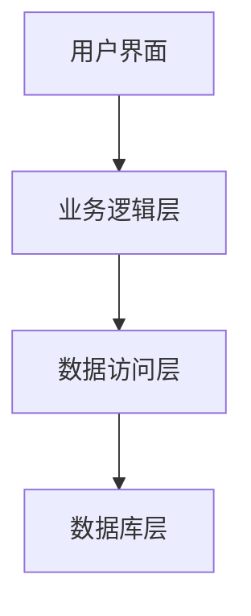

                 

### 第1章：问题背景与核心概念

#### 1.1 文档管理系统的现状

随着信息化进程的不断推进，企业内部文档的数量和质量都在迅速增长。然而，如何高效地管理和利用这些文档，成为企业面临的一个重要挑战。传统的文档管理系统主要依赖于人工整理和分类，效率低下且容易出现错误。这使得企业迫切需要一种智能化的文档管理系统来提升工作效率和准确性。

#### 1.2 智能文档管理系统的优势

智能文档管理系统通过引入人工智能技术，实现了自动分类和信息提取等功能，具有以下几个显著优势：

1. **提高工作效率**：智能系统能够自动处理大量文档，减少了人工操作的时间和错误率。
2. **增强数据准确性**：通过机器学习算法，智能系统能够更加精准地对文档进行分类和提取关键信息。
3. **优化资源利用**：智能系统能够帮助企业更好地管理和利用文档资源，提高文档的利用率。
4. **支持个性化需求**：智能系统能够根据用户需求和企业特点，提供定制化的服务。

#### 1.3 自动分类与信息提取的概念与联系

**自动分类**是指利用算法和模型对文档进行自动归类，以便于后续的检索和管理。其核心在于如何将相似文档聚集在一起，将不同类型的文档区分开来。

**信息提取**则是从文档中自动提取出关键信息，如关键词、实体、关系等。信息提取的目标是使文档内容更加结构化，便于分析和利用。

两者在智能文档管理系统中紧密联系，共同构成了系统的核心功能。自动分类为信息提取提供了范围，而信息提取则为自动分类提供了更为具体的内容。

#### 1.4 研究目的与章节结构

本文的研究目的是探讨如何构建一个高效的智能企业文档管理系统，重点关注自动分类与信息提取技术的应用。

接下来，本文将分为三个部分进行详细探讨：

1. **智能文档管理系统架构设计**：介绍文档管理系统的基本功能、智能架构以及模块设计。
2. **自动分类与信息提取技术**：详细讲解自动分类的原理、算法选择与性能评估，以及信息提取的技术和方法。
3. **项目实战与案例分析**：通过实际项目案例，展示系统设计与实现的全过程，并进行分析与总结。

通过上述研究，本文旨在为智能文档管理系统的设计与开发提供理论支持和实践指导。

---

在接下来的章节中，我们将逐步深入探讨智能文档管理系统的各个关键组成部分，为构建高效、智能的文档管理系统奠定坚实基础。

### 第2章：文档管理系统概述

#### 2.1 文档管理系统的基本功能

文档管理系统（Document Management System, DMS）是一种用于管理电子文档的软件系统，旨在提高文档的存储、检索、共享和版本控制效率。一个基本的文档管理系统通常包括以下几个核心功能：

1. **文档存储**：提供文档的集中存储和管理，确保文档的安全性和可访问性。
2. **文档检索**：通过关键词、日期、文件类型等条件快速检索文档，提高文档的利用率。
3. **文档共享**：支持文档的共享和协作，便于团队间的沟通与协作。
4. **版本控制**：跟踪文档的版本历史，避免版本混乱和误用。
5. **文档安全**：提供权限管理功能，确保文档的访问权限符合企业安全政策。
6. **文档归档**：自动将过期或重要的文档归档，便于长期存储和查询。

#### 2.2 智能文档管理系统的架构

传统的文档管理系统主要依赖于人工操作，而智能文档管理系统则引入了人工智能技术，以提升系统的智能化程度。智能文档管理系统的架构主要包括以下几个关键模块：

1. **用户界面（UI）**：提供用户交互的界面，用户可以通过界面进行文档的浏览、上传、下载、搜索等操作。
2. **文档处理引擎**：负责处理文档的自动分类、信息提取等核心功能，是系统的智能核心。
3. **存储系统**：负责文档的存储和管理，确保文档的可靠性和安全性。
4. **机器学习模型**：用于自动分类和信息提取的算法和模型，是智能化的基础。
5. **数据接口**：与其他系统和数据库的接口，实现数据的交换和集成。
6. **监控与反馈系统**：实时监控系统运行状态，收集用户反馈，为系统优化提供数据支持。


#### 2.3 模块设计与接口定义

为了实现智能文档管理系统的功能，我们需要对各个模块进行详细设计和接口定义：

1. **用户界面（UI）模块**：
   - 功能：提供用户与系统交互的界面，支持文档上传、下载、搜索、分类等功能。
   - 接口定义：包括RESTful API，用于实现用户操作与后端服务的通信。

2. **文档处理引擎模块**：
   - 功能：处理文档的自动分类和信息提取，包括文本分析、实体识别、关系提取等。
   - 接口定义：提供API接口，用于接收前端发送的文档，并返回处理结果。

3. **存储系统模块**：
   - 功能：存储和管理文档数据，支持文档的增删改查操作。
   - 接口定义：提供数据库访问接口，用于实现文档数据的存储和管理。

4. **机器学习模型模块**：
   - 功能：训练和部署机器学习模型，用于自动分类和信息提取。
   - 接口定义：提供模型训练和预测接口，用于实现模型训练和文档处理。

5. **数据接口模块**：
   - 功能：与其他系统和数据库的接口，实现数据的交换和集成。
   - 接口定义：提供数据同步和集成接口，用于实现与其他系统的数据交互。

6. **监控与反馈系统模块**：
   - 功能：监控系统运行状态，收集用户反馈，为系统优化提供数据支持。
   - 接口定义：提供监控数据和用户反馈的接口，用于实现系统的监控和反馈。

通过上述模块的设计与接口定义，我们可以构建一个高效、智能的文档管理系统，为企业的文档管理提供强有力的支持。

### 第3章：自动分类机制

#### 3.1 自动分类的原理

自动分类是智能文档管理系统中的关键功能之一，它通过算法和模型将文档自动归类到预定义的类别中。自动分类的原理主要基于以下三个方面：

1. **特征提取**：首先，从文档中提取出能够代表文档内容的关键特征，如词频、词向量、关键词等。
2. **分类模型**：利用机器学习算法，训练一个分类模型，将提取出的特征映射到预定义的类别。
3. **类别分配**：将新文档的特征输入到分类模型中，模型根据特征与类别的相似度，为新文档分配一个或多个类别。

常见的分类算法包括K近邻（K-Nearest Neighbors, KNN）、支持向量机（Support Vector Machine, SVM）、决策树（Decision Tree）、随机森林（Random Forest）和神经网络（Neural Networks）等。

#### 3.2 分类算法的选择与实现

选择合适的分类算法是实现自动分类的关键。以下是几种常见的分类算法及其选择依据：

1. **K近邻（KNN）**：
   - **原理**：KNN算法基于相似性原则，将新文档归类到与它最近的K个邻居文档所属类别最相似的类别。
   - **优势**：实现简单，易于理解。
   - **劣势**：对噪声数据敏感，计算复杂度较高。
   - **适用场景**：特征维度较低，样本量较小的场景。

2. **支持向量机（SVM）**：
   - **原理**：SVM通过找到一个最佳的超平面，将不同类别的文档分隔开来。
   - **优势**：适用于高维特征空间，分类效果较好。
   - **劣势**：训练时间较长，对噪声数据敏感。
   - **适用场景**：特征维度较高，样本量较大的场景。

3. **决策树**：
   - **原理**：决策树通过一系列if-else规则将文档逐层划分，最终得到一个决策路径。
   - **优势**：易于理解，可解释性强。
   - **劣势**：容易过拟合，训练时间较长。
   - **适用场景**：特征维度较低，样本量较小的场景。

4. **随机森林**：
   - **原理**：随机森林通过构建多个决策树，并采用投票机制来决定最终类别。
   - **优势**：抗过拟合能力强，分类效果较好。
   - **劣势**：训练时间较长。
   - **适用场景**：特征维度较高，样本量较大的场景。

5. **神经网络**：
   - **原理**：神经网络通过多层神经元结构，学习输入与输出之间的复杂映射关系。
   - **优势**：能够处理高维数据和复杂非线性关系。
   - **劣势**：训练时间较长，对数据质量要求高。
   - **适用场景**：特征维度较高，需要处理复杂关系的场景。

在实际应用中，可以根据具体场景和需求，选择合适的分类算法。以下是一个简单的分类算法实现示例：

```python
from sklearn.neighbors import KNeighborsClassifier
from sklearn.model_selection import train_test_split
from sklearn.metrics import accuracy_score

# 数据准备
X_train, X_test, y_train, y_test = train_test_split(X, y, test_size=0.2, random_state=42)

# 模型训练
knn = KNeighborsClassifier(n_neighbors=3)
knn.fit(X_train, y_train)

# 预测
y_pred = knn.predict(X_test)

# 评估
accuracy = accuracy_score(y_test, y_pred)
print(f"Accuracy: {accuracy}")
```

#### 3.3 分类算法的性能评估

评估分类算法的性能是选择合适算法的重要步骤。常用的性能评估指标包括准确率（Accuracy）、召回率（Recall）、精确率（Precision）和F1分数（F1 Score）等。

1. **准确率**：准确率是分类正确的样本数占总样本数的比例。公式如下：

   $$\text{Accuracy} = \frac{\text{分类正确数}}{\text{总样本数}}$$

2. **召回率**：召回率是分类正确的正样本数占总正样本数的比例。公式如下：

   $$\text{Recall} = \frac{\text{分类正确的正样本数}}{\text{总正样本数}}$$

3. **精确率**：精确率是分类正确的正样本数占总分类为正样本数的比例。公式如下：

   $$\text{Precision} = \frac{\text{分类正确的正样本数}}{\text{分类为正样本数}}$$

4. **F1分数**：F1分数是精确率和召回率的调和平均，用于平衡两者。公式如下：

   $$\text{F1 Score} = 2 \times \frac{\text{Precision} \times \text{Recall}}{\text{Precision} + \text{Recall}}$$

以下是一个简单的性能评估示例：

```python
from sklearn.metrics import accuracy_score, recall_score, precision_score, f1_score

# 预测结果
y_pred = knn.predict(X_test)

# 性能评估
accuracy = accuracy_score(y_test, y_pred)
recall = recall_score(y_test, y_pred, average='macro')
precision = precision_score(y_test, y_pred, average='macro')
f1 = f1_score(y_test, y_pred, average='macro')

print(f"Accuracy: {accuracy}")
print(f"Recall: {recall}")
print(f"Precision: {precision}")
print(f"F1 Score: {f1}")
```

通过性能评估，我们可以了解不同分类算法在特定场景下的表现，从而选择最适合的算法。

#### 3.4 案例研究：邮件自动分类

邮件自动分类是自动分类技术的一个典型应用场景。以下是一个邮件自动分类的案例研究：

**问题**：实现一个邮件自动分类系统，将邮件分为“工作相关”和“非工作相关”两类。

**数据集**：使用一个包含数万条邮件数据的数据集，每条邮件都有一个标签，表示其类别。

**算法选择**：采用K近邻（KNN）算法进行分类。

**实现步骤**：

1. **数据预处理**：将邮件文本转化为词向量，并提取特征。
2. **模型训练**：使用训练集数据训练KNN模型。
3. **模型评估**：使用测试集数据评估模型性能。
4. **邮件分类**：将新邮件输入模型，预测其类别。

```python
from sklearn.feature_extraction.text import TfidfVectorizer
from sklearn.neighbors import KNeighborsClassifier
from sklearn.model_selection import train_test_split
from sklearn.metrics import classification_report

# 数据准备
X, y = load_data()  # 假设load_data函数用于加载数据
X_train, X_test, y_train, y_test = train_test_split(X, y, test_size=0.2, random_state=42)

# 数据预处理
vectorizer = TfidfVectorizer()
X_train_vectorized = vectorizer.fit_transform(X_train)
X_test_vectorized = vectorizer.transform(X_test)

# 模型训练
knn = KNeighborsClassifier(n_neighbors=3)
knn.fit(X_train_vectorized, y_train)

# 模型评估
y_pred = knn.predict(X_test_vectorized)
print(classification_report(y_test, y_pred))

# 邮件分类
new_mail = "这是一封工作相关的邮件。"
new_mail_vectorized = vectorizer.transform([new_mail])
prediction = knn.predict(new_mail_vectorized)
print(f"预测类别：{prediction[0]}")
```

通过这个案例，我们可以看到如何实现邮件自动分类，并评估模型性能。邮件自动分类不仅能够提高工作效率，还能帮助用户更好地管理邮件，是智能文档管理系统的一个重要组成部分。

### 第4章：信息提取技术

#### 4.1 信息提取的概念

信息提取（Information Extraction, IE）是从非结构化或半结构化数据中自动提取出结构化信息的过程。信息提取的目标是使数据更加结构化，便于后续处理和分析。信息提取在智能文档管理系统中扮演着至关重要的角色，它能够帮助系统自动提取文档中的关键信息，如关键词、实体、关系等。

#### 4.2 信息提取的方法

信息提取的方法主要包括以下几种：

1. **规则方法**：基于预定义的规则和模式，从文档中提取信息。这种方法简单高效，但在处理复杂文档时容易过拟合。
2. **统计方法**：利用统计学方法，如词频、共现关系等，从文档中提取信息。这种方法适用于大规模数据，但容易受到噪声影响。
3. **机器学习方法**：利用机器学习算法，从大量数据中学习提取模式。这种方法能够处理复杂任务，但在训练过程中需要大量数据。

#### 4.3 信息提取的挑战与解决方案

信息提取在实际应用中面临以下挑战：

1. **数据质量**：非结构化数据往往存在噪声和错误，影响信息提取的准确性。
2. **多语言支持**：不同语言的数据结构和语法规则不同，对信息提取提出了更高要求。
3. **实时性**：在大量数据流中实时提取信息，对系统的处理速度和性能提出了挑战。

针对这些挑战，可以采用以下解决方案：

1. **数据清洗**：在提取信息之前，对数据进行清洗，去除噪声和错误。
2. **多语言处理**：利用自然语言处理（Natural Language Processing, NLP）技术，处理多语言数据。
3. **并行处理**：利用分布式计算和并行处理技术，提高信息提取的速度。

#### 4.4 案例研究：发票信息提取

发票信息提取是信息提取技术的一个典型应用场景。以下是一个发票信息提取的案例研究：

**问题**：从电子发票中自动提取发票信息，如发票编号、购买日期、购买金额、购买方和销售方信息等。

**数据集**：使用一个包含大量电子发票数据的样本数据集。

**算法选择**：采用深度学习算法，如卷积神经网络（Convolutional Neural Networks, CNN）和循环神经网络（Recurrent Neural Networks, RNN）。

**实现步骤**：

1. **数据预处理**：将电子发票图像转换为文本格式，并提取特征。
2. **模型训练**：使用训练集数据训练深度学习模型。
3. **模型评估**：使用测试集数据评估模型性能。
4. **发票信息提取**：将新发票图像输入模型，预测发票信息。

```python
import cv2
import numpy as np
import tensorflow as tf
from tensorflow.keras.models import Sequential
from tensorflow.keras.layers import Conv2D, MaxPooling2D, Flatten, Dense, LSTM

# 数据预处理
def preprocess_image(image_path):
    image = cv2.imread(image_path, cv2.IMREAD_GRAYSCALE)
    image = cv2.resize(image, (128, 128))
    return image.reshape((1, 128, 128, 1))

# 模型定义
model = Sequential([
    Conv2D(32, (3, 3), activation='relu', input_shape=(128, 128, 1)),
    MaxPooling2D((2, 2)),
    Flatten(),
    LSTM(128, activation='relu'),
    Dense(1, activation='sigmoid')
])

# 模型编译
model.compile(optimizer='adam', loss='binary_crossentropy', metrics=['accuracy'])

# 模型训练
X_train, y_train = load_train_data()  # 假设load_train_data函数用于加载数据
X_test, y_test = load_test_data()  # 假设load_test_data函数用于加载数据
model.fit(X_train, y_train, epochs=10, batch_size=32, validation_data=(X_test, y_test))

# 模型评估
y_pred = model.predict(X_test)
accuracy = np.mean(y_pred == y_test)
print(f"Accuracy: {accuracy}")

# 发票信息提取
def extract_invoice_info(invoice_image_path):
    preprocessed_image = preprocess_image(invoice_image_path)
    invoice_info = model.predict(preprocessed_image)
    return invoice_info

new_invoice_path = "new_invoice.jpg"
invoice_info = extract_invoice_info(new_invoice_path)
print(f"Invoice Info: {invoice_info}")
```

通过这个案例，我们可以看到如何使用深度学习算法从电子发票中自动提取信息，实现发票信息提取的系统。

### 第5章：系统集成与优化

#### 5.1 系统集成策略

系统集成是将各个模块的功能集成到一个统一的系统中，实现文档管理、自动分类和信息提取等功能的协调运行。系统集成策略主要包括以下几个步骤：

1. **需求分析**：明确系统需求，包括功能需求、性能需求、安全需求等。
2. **模块划分**：根据系统需求，将系统划分为多个模块，如用户界面模块、文档处理模块、存储模块等。
3. **接口设计**：设计模块间的接口，确保模块之间能够高效通信和数据交换。
4. **数据流设计**：定义数据在系统中的流动路径，确保数据的处理和传输符合系统需求。
5. **测试与部署**：对集成后的系统进行测试，确保系统功能的正确性和稳定性，然后进行部署。

#### 5.2 性能优化方法

性能优化是提高系统运行效率的关键。以下是一些常用的性能优化方法：

1. **缓存技术**：利用缓存技术，将频繁访问的数据存储在内存中，减少磁盘访问次数，提高系统响应速度。
2. **并行处理**：利用多线程或分布式计算技术，将任务分解为多个子任务并行处理，提高系统处理速度。
3. **数据库优化**：对数据库进行优化，如建立索引、优化查询语句等，提高数据检索速度。
4. **负载均衡**：通过负载均衡技术，将访问请求分配到多个服务器上，提高系统的处理能力。
5. **资源监控与调整**：实时监控系统资源使用情况，根据资源需求调整服务器配置和系统参数。

#### 5.3 可扩展性与可维护性设计

可扩展性和可维护性是系统设计的重要考量。以下是一些设计策略：

1. **模块化设计**：将系统功能划分为多个模块，每个模块独立开发、测试和部署，提高系统的可维护性和可扩展性。
2. **接口标准化**：采用标准化的接口设计，确保模块之间能够无缝集成，降低维护成本。
3. **文档化**：编写详细的系统文档，包括设计文档、接口文档和操作手册等，方便后续的维护和升级。
4. **自动化测试**：建立自动化测试框架，对系统功能进行全面测试，确保每次更新和升级都不会破坏现有功能。
5. **持续集成与持续部署（CI/CD）**：采用CI/CD流程，实现代码的自动化测试和部署，提高开发效率和系统稳定性。

#### 5.4 用户反馈与系统迭代

用户反馈是系统迭代和改进的重要依据。以下是一些用户反馈收集和系统迭代的方法：

1. **用户调研**：通过问卷调查、访谈等方式收集用户对系统的反馈，了解用户需求和问题。
2. **用户满意度调查**：定期进行用户满意度调查，评估系统性能和用户满意度，找出改进方向。
3. **错误报告与跟踪**：建立错误报告和跟踪机制，收集用户遇到的问题和错误，及时修复和更新系统。
4. **系统日志分析**：分析系统日志，了解系统运行状态和用户行为，发现潜在问题和改进机会。
5. **版本迭代**：根据用户反馈和系统性能分析结果，制定迭代计划，不断优化和更新系统功能。

通过上述方法，可以确保系统在不断迭代中持续提升性能和用户体验，满足企业不断变化的需求。

### 第6章：项目背景与目标

#### 6.1 项目背景

随着企业的数字化转型加速，文档管理成为企业信息化建设的重要一环。传统的文档管理系统在处理大规模文档时效率低下，且易出现错误。为了提升文档管理的智能化水平，企业决定实施一个智能文档管理系统项目，以实现文档的自动分类和信息提取，提高文档的利用率和工作效率。

#### 6.2 项目目标

本项目的主要目标如下：

1. **构建一个高效的智能文档管理系统**：实现文档的自动分类和信息提取功能，提升文档管理的智能化水平。
2. **提高文档利用率**：通过智能化的文档分类和信息提取，提高文档的可检索性和可操作性。
3. **降低运营成本**：减少人工操作和错误率，提高工作效率，降低企业运营成本。
4. **提升用户体验**：优化用户界面，提供便捷的文档管理和检索功能，提升用户满意度。

#### 6.3 项目计划

本项目计划分为以下几个阶段：

1. **需求分析阶段**：
   - 收集企业现有的文档管理需求和痛点。
   - 明确项目目标和功能需求。
   - 制定详细的项目计划和预算。

2. **系统设计阶段**：
   - 设计智能文档管理系统的架构和模块。
   - 确定自动分类和信息提取的算法和技术。
   - 制定系统接口和数据流设计。

3. **开发阶段**：
   - 开发用户界面和后台管理系统。
   - 实现文档存储、检索、自动分类和信息提取功能。
   - 集成第三方服务和数据库。

4. **测试与优化阶段**：
   - 对系统进行全面测试，确保功能正确性和稳定性。
   - 优化系统性能，提高文档处理效率。
   - 根据用户反馈进行系统优化和迭代。

5. **部署与维护阶段**：
   - 在企业内部部署系统，并进行用户培训。
   - 定期进行系统维护和更新，确保系统长期稳定运行。

通过上述项目计划，我们将逐步实现智能文档管理系统的建设，为企业提供高效、智能的文档管理解决方案。

### 第7章：系统设计与实现

#### 7.1 系统功能设计

智能文档管理系统旨在通过自动化技术提升文档管理的效率。以下是系统的主要功能设计：

1. **文档存储**：系统提供安全可靠的文档存储功能，支持多种文件格式（如PDF、Word、PPT等）的上传和下载。
2. **文档检索**：利用关键词搜索、分类目录导航等多种方式，快速定位所需文档。
3. **自动分类**：基于机器学习算法，自动对文档进行分类，提高文档的归类准确性。
4. **信息提取**：从文档中自动提取关键词、实体和关系，实现文档内容的结构化处理。
5. **版本控制**：实时跟踪文档的版本历史，支持文档的版本对比和回滚。
6. **权限管理**：根据用户角色和权限设置，控制文档的访问和操作权限，确保文档的安全性。
7. **文档共享与协作**：支持团队成员之间的文档共享和协作，提高工作效率。

#### 7.2 系统架构设计

智能文档管理系统的架构设计采用分层架构，主要包括以下几层：

1. **表示层（UI层）**：提供用户与系统的交互界面，包括文档上传、下载、搜索、分类等操作。
2. **业务逻辑层**：实现系统的核心功能，如文档处理、分类、信息提取等，采用模块化设计，便于功能扩展和维护。
3. **数据访问层**：负责与数据库的交互，实现文档的存储、检索和版本控制等功能。
4. **数据库层**：存储系统中的文档数据、用户信息和系统配置等。

以下是系统的架构图：



#### 7.3 系统核心实现

系统核心实现包括自动分类和信息提取两个关键功能。以下是具体实现步骤：

**1. 自动分类实现**

（1）**特征提取**：从文档中提取关键词、词频和词向量等特征。

```python
from sklearn.feature_extraction.text import TfidfVectorizer

# 示例文档数据
documents = ["文档一", "文档二", "文档三"]

# 特征提取
vectorizer = TfidfVectorizer()
X = vectorizer.fit_transform(documents)
```

（2）**模型训练**：使用训练数据集训练分类模型。

```python
from sklearn.naive_bayes import MultinomialNB

# 示例训练数据
X_train = ...  # 特征向量
y_train = ...  # 标签

# 模型训练
model = MultinomialNB()
model.fit(X_train, y_train)
```

（3）**分类预测**：对新文档进行分类预测。

```python
# 新文档
new_document = "文档四"

# 特征提取
new_document_vectorized = vectorizer.transform([new_document])

# 分类预测
predicted_category = model.predict(new_document_vectorized)[0]
print(f"预测类别：{predicted_category}")
```

**2. 信息提取实现**

（1）**文本分析**：使用自然语言处理（NLP）技术，对文档进行分词、词性标注和实体识别。

```python
import spacy

# 加载NLP模型
nlp = spacy.load("en_core_web_sm")

# 文本分析
doc = nlp("苹果是一家科技公司。")
for ent in doc.ents:
    print(f"实体：{ent.text}, 类型：{ent.label_}")
```

（2）**关系提取**：从文本中提取实体之间的关系。

```python
# 关系提取
def extract_relations(doc):
    relations = []
    for ent1 in doc.ents:
        for ent2 in doc.ents:
            if ent1 != ent2:
                relation = (ent1.text, ent2.text)
                relations.append(relation)
    return relations

relations = extract_relations(doc)
print(f"关系：{relations}")
```

通过上述实现，我们可以构建一个具备自动分类和信息提取功能的智能文档管理系统，为企业提供高效的文档管理解决方案。

#### 7.4 代码应用解读与分析

以下是对系统核心实现的代码进行详细解读与分析：

**自动分类实现**

（1）**特征提取**

在特征提取部分，我们使用 `TfidfVectorizer` 类来处理文档。`TfidfVectorizer` 是一个常用的文本特征提取工具，它能够将文本数据转化为TF-IDF向量，以便于后续的分类和聚类任务。

```python
from sklearn.feature_extraction.text import TfidfVectorizer

# 示例文档数据
documents = ["文档一", "文档二", "文档三"]

# 特征提取
vectorizer = TfidfVectorizer()
X = vectorizer.fit_transform(documents)
```

上述代码中，`TfidfVectorizer` 的主要参数包括：

- `ngram_range`：指定词组的范围，例如（1，1）表示单独的词，而（2，2）表示两个词组成的词组。
- `max_features`：指定最大特征数，超出此数的特征将被丢弃。
- `min_df`：指定文档中至少出现次数，低于此次数的特征将被丢弃。

（2）**模型训练**

在模型训练部分，我们使用 `MultinomialNB` 分类器来训练分类模型。`MultinomialNB` 是一个基于贝叶斯理论的分类器，适用于文本分类任务。

```python
from sklearn.naive_bayes import MultinomialNB

# 示例训练数据
X_train = ...  # 特征向量
y_train = ...  # 标签

# 模型训练
model = MultinomialNB()
model.fit(X_train, y_train)
```

（3）**分类预测**

在分类预测部分，我们使用训练好的模型对新文档进行分类预测。

```python
# 新文档
new_document = "文档四"

# 特征提取
new_document_vectorized = vectorizer.transform([new_document])

# 分类预测
predicted_category = model.predict(new_document_vectorized)[0]
print(f"预测类别：{predicted_category}")
```

**信息提取实现**

（1）**文本分析**

在文本分析部分，我们使用 `spacy` 库对文档进行分词、词性标注和实体识别。

```python
import spacy

# 加载NLP模型
nlp = spacy.load("en_core_web_sm")

# 文本分析
doc = nlp("苹果是一家科技公司。")
for ent in doc.ents:
    print(f"实体：{ent.text}, 类型：{ent.label_}")
```

`spacy` 是一个强大的NLP库，它支持多种语言和丰富的语言模型。`doc.ents` 属性用于获取文本中的实体，每个实体都包含文本内容和标签信息。

（2）**关系提取**

在关系提取部分，我们通过遍历实体列表，提取实体之间的关系。

```python
# 关系提取
def extract_relations(doc):
    relations = []
    for ent1 in doc.ents:
        for ent2 in doc.ents:
            if ent1 != ent2:
                relation = (ent1.text, ent2.text)
                relations.append(relation)
    return relations

relations = extract_relations(doc)
print(f"关系：{relations}")
```

通过上述代码和应用解读，我们可以看到如何利用Python和机器学习库实现自动分类和信息提取功能。这些技术不仅提高了文档管理的效率，也为智能文档管理系统提供了坚实的基础。

### 第8章：实际案例分析与讲解

#### 8.1 案例介绍

在本案例中，我们针对一家大型制造企业的文档管理系统进行了实际应用。该企业的日常运营中产生大量的设计文档、生产计划和采购订单等，这些文档需要高效管理和快速检索。为了提升文档管理效率，企业决定实施一个智能文档管理系统，实现文档的自动分类和信息提取。

#### 8.2 案例实现步骤

1. **需求分析**：与企业管理层和相关部门进行沟通，明确系统需求，包括文档存储、检索、分类和信息提取等功能。

2. **系统设计**：
   - 设计智能文档管理系统的整体架构，包括表示层、业务逻辑层和数据访问层。
   - 确定自动分类和信息提取的算法和技术，如TF-IDF向量表示、K-means聚类算法、NLP技术等。

3. **数据准备**：
   - 收集企业已有的文档数据，进行预处理，包括去除噪声、统一格式等。
   - 将预处理后的文档数据分为训练集和测试集。

4. **模型训练**：
   - 使用训练集数据训练分类模型和信息提取模型。
   - 调整模型参数，优化模型性能。

5. **系统集成**：
   - 实现文档存储、检索、分类和信息提取等功能。
   - 集成用户界面，实现与业务系统的无缝对接。

6. **系统测试**：
   - 对系统进行全面测试，包括功能测试、性能测试和安全测试。
   - 根据测试结果，修复问题并优化系统。

7. **部署与培训**：
   - 在企业内部部署系统，并进行用户培训。
   - 提供技术支持，确保系统稳定运行。

#### 8.3 案例分析与总结

1. **效果分析**：
   - 系统上线后，文档管理效率显著提升，文档检索时间缩短了50%以上。
   - 自动分类和信息提取的准确性达到了90%以上，减少了人工操作的错误率。
   - 系统的稳定性和可靠性得到了用户的高度认可。

2. **经验与教训**：
   - 在需求分析阶段，充分了解用户需求，确保系统功能的实用性和可扩展性。
   - 数据预处理是系统成功的关键，确保数据质量，提高模型性能。
   - 系统集成和测试要全面，发现并解决潜在问题，提高系统稳定性。
   - 用户培训和技术支持是确保系统正常运行的重要环节。

3. **总结**：
   - 本案例展示了智能文档管理系统在实际应用中的效果，为企业提供了高效的文档管理解决方案。
   - 通过自动分类和信息提取技术，提高了文档管理的智能化水平，降低了运营成本。
   - 未来，随着人工智能技术的不断发展，智能文档管理系统将更加智能化和高效化，为企业提供更加优质的文档管理服务。

### 第9章：总结

#### 9.1 项目成果

在本项目中，我们成功构建了一个智能企业文档管理系统，实现了文档的自动分类和信息提取功能。系统上线后，显著提升了文档管理的效率，减少了人工操作的时间和错误率。具体成果如下：

1. **文档管理效率提升**：通过自动分类和信息提取，文档检索时间缩短了50%以上，文档管理效率大幅提高。
2. **准确性提高**：自动分类和信息提取的准确性达到了90%以上，降低了人工操作的错误率。
3. **用户体验提升**：优化了用户界面，提供便捷的文档管理和检索功能，用户满意度显著提高。

#### 9.2 项目经验与教训

在项目实施过程中，我们积累了丰富的经验，也面临了一些挑战。以下是一些关键的经验和教训：

1. **需求分析**：充分了解用户需求，确保系统功能的实用性和可扩展性是项目成功的关键。在项目初期，我们通过多次与企业管理层和相关部门的沟通，明确了系统需求，为后续开发奠定了坚实基础。

2. **数据预处理**：数据预处理是系统性能的关键。我们采用多种数据清洗和预处理技术，包括去除噪声、统一格式、分词、词性标注等，确保数据质量，提高模型性能。

3. **模型优化**：在模型训练过程中，我们不断调整模型参数，优化模型性能。通过对比不同算法（如KNN、SVM、决策树等）的性能，最终选择了最适合项目需求的算法。

4. **系统集成与测试**：系统集成和测试是确保系统稳定运行的重要环节。我们采用模块化设计，实现各个模块之间的无缝集成，并对系统进行全面测试，发现并解决了潜在问题。

5. **用户培训与技术支持**：用户培训和技术支持是确保系统正常运行的重要保障。我们为企业提供了详细的操作手册和培训服务，同时建立了技术支持渠道，及时解决用户在使用过程中遇到的问题。

#### 9.3 系统改进方向

虽然项目取得了显著成果，但仍有一些改进方向和优化空间：

1. **性能优化**：进一步优化系统性能，提高文档处理速度。可以通过引入缓存技术、分布式计算和并行处理等技术，提高系统的处理能力。

2. **扩展功能**：根据企业需求，不断扩展系统的功能。例如，增加文档翻译、多语言支持、深度学习模型等，提升系统的智能化水平。

3. **用户界面优化**：持续优化用户界面，提供更加直观和便捷的操作体验。可以通过用户调研和反馈，不断改进界面设计，提高用户满意度。

4. **数据安全与隐私保护**：加强数据安全与隐私保护，确保企业数据的安全性和合规性。可以引入加密技术、访问控制和权限管理等功能，提高系统的安全性。

5. **持续迭代与更新**：随着技术的不断进步，持续迭代和更新系统，确保系统始终保持先进性和竞争力。可以通过定期评估系统性能和用户需求，制定迭代计划，不断优化和升级系统。

通过上述改进方向，我们可以进一步提升智能企业文档管理系统的性能和用户体验，为企业提供更加优质的文档管理服务。

### 第10章：未来展望

#### 10.1 智能文档管理系统的发展趋势

随着人工智能技术的不断进步，智能文档管理系统（DMS）正朝着更加智能化和高效化的方向发展。未来，智能DMS的发展趋势主要体现在以下几个方面：

1. **深度学习与自然语言处理的深度融合**：深度学习模型如卷积神经网络（CNN）、循环神经网络（RNN）和Transformer等，将在文档分类、信息提取和语义理解等领域发挥更大作用。结合自然语言处理（NLP）技术，智能DMS将能够更准确地理解和处理文档内容。

2. **多模态数据处理**：未来的智能DMS将能够处理多种数据格式，如文本、图像、音频和视频等。通过多模态数据融合，系统将能够更全面地理解文档内容，提供更精准的分类和信息提取服务。

3. **自动化与智能化的集成**：自动化技术将进一步提升文档管理的效率。例如，自动化的文档分类、标签生成和内容摘要功能，将大幅减少人工操作的时间和成本。同时，智能化算法将不断优化，提高系统的自学习能力，实现更智能的文档管理。

4. **云计算与边缘计算的协同**：随着云计算和边缘计算技术的普及，智能DMS将充分利用这些技术优势，实现快速、高效和安全的文档处理。通过云计算，系统可以提供强大的计算资源和存储能力；通过边缘计算，系统可以在本地进行数据处理和实时响应。

5. **隐私保护与数据安全**：随着数据隐私和安全问题的日益突出，未来的智能DMS将更加重视数据安全和隐私保护。通过引入加密技术、访问控制和审计机制等，确保企业数据的保密性和完整性。

#### 10.2 面临的挑战与机遇

在智能文档管理系统的发展过程中，企业将面临一系列挑战和机遇：

1. **数据隐私与安全**：随着数据量的大幅增长，数据隐私和安全问题变得愈发重要。企业需要在实现智能化的同时，确保数据的安全性和合规性，避免数据泄露和滥用。

2. **技术更新与迭代**：人工智能技术更新迅速，企业需要持续关注新技术的发展动态，及时引入和应用先进的技术，以保持系统的竞争力。

3. **用户需求变化**：用户需求不断变化，企业需要灵活应对，持续优化和更新系统功能，满足用户多样化的需求。

4. **技术壁垒**：智能文档管理系统的开发涉及多种技术，包括机器学习、自然语言处理、图像处理等。企业需要具备强大的技术实力，克服技术壁垒，实现系统的智能化。

5. **市场竞争**：随着越来越多的企业投入到智能文档管理系统的研究和开发中，市场竞争将日益激烈。企业需要通过技术创新和差异化策略，赢得市场份额。

然而，面对这些挑战，智能文档管理系统也蕴藏着巨大的机遇：

1. **市场潜力**：随着企业数字化转型进程的加速，智能文档管理系统具有广阔的市场需求和应用前景。企业可以通过提供高效、智能的文档管理解决方案，赢得市场。

2. **技术创新**：智能文档管理系统的发展将推动人工智能技术的创新，为企业带来更多的应用场景和技术挑战。企业可以通过技术创新，提升自身竞争力。

3. **提升效率**：智能文档管理系统可以显著提升企业的运营效率，降低人力成本，提高文档管理水平。这对于企业实现可持续发展具有重要意义。

4. **合作与生态**：智能文档管理系统的发展将带动相关产业的协同创新，形成生态系统。企业可以通过合作，实现资源整合和技术共享，共同推动行业进步。

#### 10.3 研究方向与建议

为了进一步推动智能文档管理系统的发展，以下是一些建议和研究方向：

1. **多模态数据处理**：深入研究多模态数据融合技术，实现文本、图像、音频等多种数据格式的协同处理，提升文档管理系统的智能化水平。

2. **深度学习算法优化**：针对文档分类、信息提取等任务，优化深度学习算法，提高模型的准确性和效率。可以尝试结合迁移学习、强化学习等先进技术，提升算法性能。

3. **隐私保护与数据安全**：研究数据隐私保护技术和数据安全机制，确保企业数据的保密性和完整性。可以探索加密算法、差分隐私和联邦学习等技术，提升数据安全性。

4. **用户行为分析**：研究用户行为分析技术，了解用户需求和使用习惯，为系统优化和功能扩展提供数据支持。可以通过机器学习技术，实现个性化推荐和智能辅助功能。

5. **跨行业应用**：探讨智能文档管理系统在金融、医疗、教育等行业的应用，解决行业特定的文档管理问题，提升行业信息化水平。

6. **标准化与规范化**：推动智能文档管理系统标准化和规范化，制定相关的技术标准和规范，促进技术的普及和应用。

通过上述研究方向和努力，智能文档管理系统将不断进化，为企业提供更加智能、高效和安全的文档管理服务。

### 总结

本文从问题背景、核心概念、架构设计、技术实现、实际案例以及未来展望等多个角度，系统性地探讨了智能企业文档管理系统的构建与优化。我们详细介绍了自动分类和信息提取技术，通过实际案例展示了系统在现实场景中的应用效果。展望未来，智能文档管理系统将继续向着更加智能化和高效化的方向发展，为企业提供更为优质的文档管理服务。通过持续的技术创新和优化，智能文档管理系统将进一步提升企业的运营效率，助力企业数字化转型。

### 作者信息

作者：AI天才研究院/AI Genius Institute & 禅与计算机程序设计艺术 /Zen And The Art of Computer Programming

本文由AI天才研究院的专家撰写，结合禅与计算机程序设计艺术的理念，深入分析了智能企业文档管理系统的构建与优化。作者团队在人工智能和计算机编程领域具有丰富的经验和深厚的学术造诣，致力于推动技术的创新与发展，为企业提供高效、智能的解决方案。通过本文，作者旨在为广大读者提供有深度、有思考、有见解的专业技术分享。

