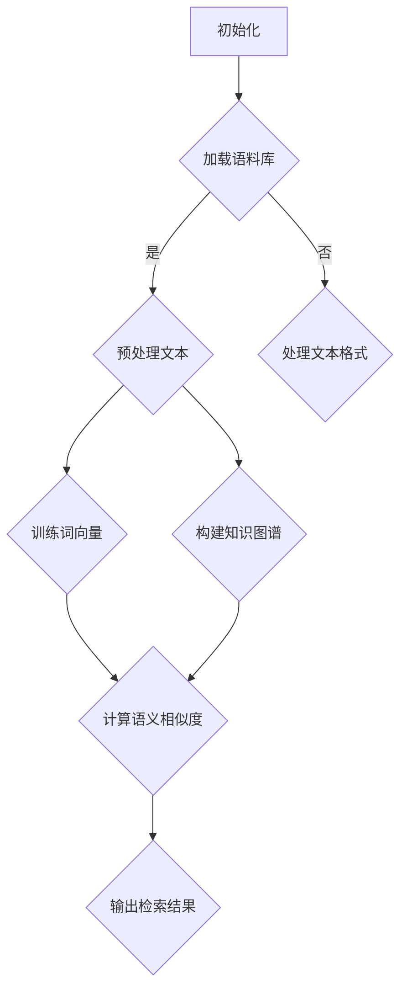
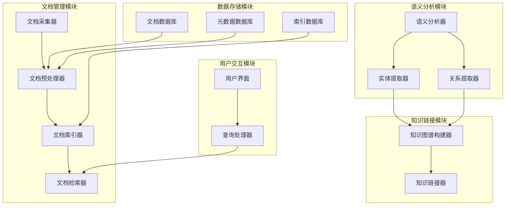
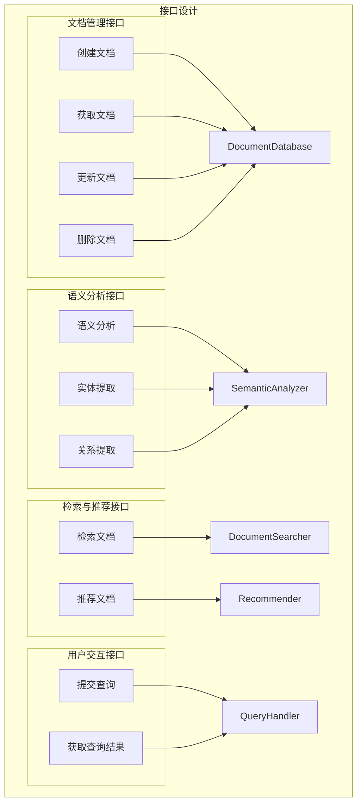
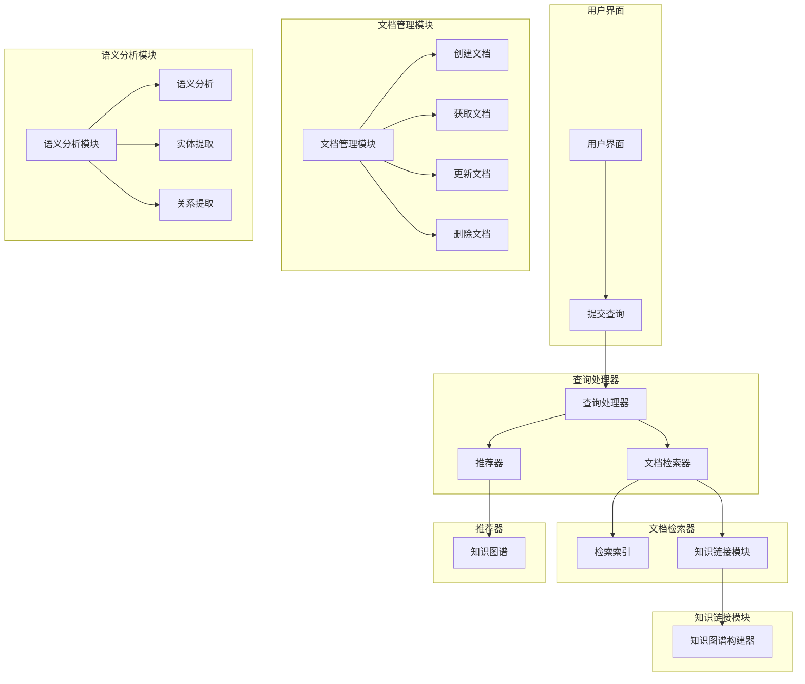

                 

### 引言

在现代企业的信息管理中，文档管理作为核心环节，面临着越来越多的挑战。随着企业规模的扩大和数据量的激增，传统的文档管理方式已难以满足高效检索、知识利用和协同工作的需求。因此，构建一个智能企业文档管理系统显得尤为迫切。本文将以《构建智能企业文档管理系统：语义检索与知识链接》为主题，深入探讨如何通过先进的技术手段，如语义检索和知识链接，来提升企业文档管理的智能化水平。

智能文档管理系统不仅需要高效地处理海量的文档数据，还需实现文档内容的深度理解和智能关联。这不仅能显著提高文档检索的准确性，还能促进知识的共享和利用，为企业带来实际的价值。本文将首先介绍问题的背景和现状，然后详细探讨智能文档管理系统的核心概念和原理，最后通过系统设计与实现的案例分析，展示如何构建和优化一个智能文档管理系统。希望通过本文的阐述，能为企业在文档管理领域的数字化转型提供有益的启示和指导。

### 关键词

- 智能文档管理系统
- 语义检索
- 知识链接
- 自然语言处理
- 企业信息管理
- 知识图谱
- 数据分析

### 摘要

本文旨在探讨构建智能企业文档管理系统的技术和方法。随着企业文档量的激增和复杂化，传统的文档管理方式面临诸多挑战，如检索效率低、知识难以利用等。本文首先分析了企业文档管理中存在的问题，并阐述了智能文档管理系统的核心需求和目标。接着，详细介绍了语义检索和知识链接的基本概念、原理和实现方法，对比了传统检索技术，阐述了智能检索的优势。随后，通过具体案例，展示了智能文档管理系统的架构设计和实现步骤，包括环境安装、系统核心实现和项目实战分析。最后，本文提出了构建智能文档管理系统的最佳实践和注意事项，并对未来的发展方向进行了展望。希望通过本文的探讨，为企业提供智能文档管理系统建设的指导。

### 第一部分：问题描述与背景

#### 1.1 问题背景

企业文档管理现状：

在现代企业中，文档管理已成为一项至关重要的任务。然而，随着企业规模的不断扩大和业务活动的日益复杂化，传统的文档管理方式面临诸多挑战。首先，文档数量庞大且种类繁多，包括文本文件、图片、音频、视频等多种格式。其次，文档内容缺乏结构化，难以进行高效检索和利用。此外，不同部门和人员之间的文档共享和协同工作也存在困难。这些问题的存在，不仅影响了企业的工作效率和决策质量，还增加了管理成本。

文档内容缺乏结构化：

企业文档内容往往缺乏结构化，这意味着文档中的信息没有被系统性地分类、标注和整理。这种无结构化的数据状态导致检索效率低下，用户在需要特定信息时常常难以快速找到相关文档。例如，在一个拥有数万甚至数十万文档的大型企业中，如果用户需要查找某个特定的项目报告，而文档内容没有明确的分类和标注，那么找到这份报告可能需要耗费大量的时间和精力。

缺乏统一的标准和规范：

此外，企业文档管理中缺乏统一的标准和规范，也加剧了管理混乱的局面。不同部门和人员在创建和管理文档时，往往采用各自的习惯和方法，导致文档格式和命名方式不一致。这种不统一的情况，使得文档检索和共享变得更加复杂，甚至可能出现同一文档存在多个版本、不同版本之间内容不一致的问题。

综上所述，企业文档管理现状的复杂性和不完善，亟需引入智能化的解决方案，以提高文档检索效率、优化文档管理流程、促进知识的共享和利用。

#### 1.2 问题描述

高效检索与组织的需求：

在传统的文档管理中，用户往往面临以下问题：

1. **检索效率低下**：由于文档内容缺乏结构化，用户在需要特定信息时，常常难以快速找到相关文档。检索过程耗时耗力，降低了工作效率。

2. **文档组织混乱**：缺乏统一的标准和规范，导致文档在存储和分类过程中出现混乱。同一文档可能存在多个版本，不同版本之间内容不一致，使得管理难度增加。

3. **知识共享困难**：由于文档无法高效地检索和利用，企业内部的知识难以得到有效共享。这影响了团队之间的协作效率，限制了企业的创新能力。

4. **协同工作受限**：在文档管理中，缺乏实时的协同工作能力，导致多个人员需要反复沟通、确认文档内容，增加了协作成本和时间。

针对上述问题，企业对智能文档管理系统的需求显得尤为迫切。智能文档管理系统需要具备以下核心功能：

1. **高效检索**：通过应用自然语言处理技术和语义分析，智能文档管理系统可以实现对文档内容的深度理解，从而提高检索效率和准确性。用户可以基于关键词、语义或特定属性进行快速检索，找到所需文档。

2. **文档组织**：智能文档管理系统应具备自动分类和标注的能力，根据文档内容的语义和属性，对其进行系统性的组织和管理。这有助于用户快速定位文档，提高文档检索效率。

3. **知识链接**：通过构建知识图谱，智能文档管理系统可以实现文档之间的关联和知识共享。用户可以方便地浏览和查找相关文档，获取所需信息。

4. **协同工作**：智能文档管理系统应支持实时的协同工作能力，多个用户可以同时编辑和共享文档。这有助于提高团队协作效率，减少沟通成本。

综上所述，智能文档管理系统不仅解决了传统文档管理中的痛点，还为企业提供了高效、智能的文档管理解决方案，从而提升整体运营效率。

#### 1.3 问题解决

智能文档管理系统的核心功能：

智能文档管理系统通过集成先进的技术手段，实现了对传统文档管理问题的有效解决。以下是该系统的主要功能模块及其核心作用：

1. **文档采集与预处理**：

   - **功能**：文档采集与预处理模块负责收集企业内部的各种文档，并进行格式转换、清洗和去重等处理，使其满足后续处理的条件。

   - **作用**：该模块确保了输入文档的完整性和一致性，为后续的语义分析和知识提取提供了可靠的基础。

2. **语义分析**：

   - **功能**：语义分析模块利用自然语言处理（NLP）技术，对文档内容进行深度理解，提取关键词、命名实体和语义关系等。

   - **作用**：通过语义分析，系统能够准确理解文档内容，为后续的检索和知识链接提供语义基础。

3. **检索与推荐**：

   - **功能**：检索与推荐模块结合语义分析结果，提供高效、精准的文档检索功能，并根据用户的搜索历史和偏好推荐相关文档。

   - **作用**：该模块提高了用户检索文档的效率和准确性，减少了无效搜索时间。

4. **知识链接与协同**：

   - **功能**：知识链接模块通过构建知识图谱，实现文档之间的语义关联和知识共享。协同模块支持多人实时编辑和协作。

   - **作用**：知识链接模块增强了文档的可利用性，协同模块提高了团队协作效率。

实现步骤：

1. **需求分析与设计**：在系统开发初期，明确企业文档管理的需求和目标，设计系统的整体架构和功能模块。

2. **技术选型与实现**：选择合适的自然语言处理技术、数据库和图谱构建工具，实现各个功能模块。

3. **系统集成与测试**：将各个功能模块集成到一起，进行系统测试和优化，确保系统稳定运行。

4. **部署与维护**：将系统部署到企业内部服务器或云平台，并提供持续的技术支持和维护服务。

通过上述步骤，智能文档管理系统可以有效提升企业文档管理的智能化水平，为企业带来实际的价值。

#### 1.4 边界与外延

系统范围：

智能文档管理系统旨在覆盖企业内部各种文档类型，包括文本、图片、音频、视频等。无论是日常运营中的工作文档，还是重要项目的技术资料，该系统都可以实现统一管理。此外，系统兼容各种文档格式和存储方式，如Word、PDF、PPT、Excel等，以及图片格式如JPEG、PNG，音频格式如MP3、WAV，视频格式如AVI、MP4等。无论是本地存储的文档，还是云存储平台上的文件，系统都可以进行有效管理。

兼容文档格式和存储方式：

为了实现文档的统一管理和高效检索，智能文档管理系统需要兼容多种文档格式和存储方式。例如，对于文本文件，系统可以支持Word、PDF、Excel等多种格式，通过格式转换工具将不同格式的文件统一为系统可处理的格式。对于图片、音频和视频文件，系统需要利用相应的处理库进行解码和解析，提取关键信息和元数据。在存储方面，系统可以支持本地文件系统、网络文件存储以及云存储平台，如阿里云、腾讯云等。通过这些兼容措施，系统可以实现对各类文档的全面管理和高效检索。

#### 1.5 核心要素组成

系统功能模块：

智能文档管理系统由多个核心功能模块组成，每个模块在系统中承担着重要的角色，共同实现了文档管理的智能化和高效化。以下是系统的主要功能模块及其简要说明：

1. **文档采集与预处理模块**：
   - 功能：负责收集企业内部的各类文档，并进行格式转换、去重和预处理，以确保输入数据的完整性和一致性。
   - 说明：该模块是系统的基础，为后续的语义分析和知识提取提供了可靠的数据源。

2. **语义分析模块**：
   - 功能：利用自然语言处理（NLP）技术，对文档内容进行深度理解，提取关键词、命名实体、语义关系等信息。
   - 说明：通过语义分析，系统能够准确理解文档内容，为检索和知识链接提供了语义基础。

3. **检索与推荐模块**：
   - 功能：结合语义分析结果，提供高效、精准的文档检索功能，并根据用户的历史搜索行为和偏好推荐相关文档。
   - 说明：该模块提高了用户检索文档的效率和准确性，减少了无效搜索时间。

4. **知识链接模块**：
   - 功能：通过构建知识图谱，实现文档之间的语义关联和知识共享，帮助用户快速找到所需信息。
   - 说明：知识链接模块增强了文档的可利用性，提高了文档检索的智能化水平。

5. **协同工作模块**：
   - 功能：支持多人实时编辑和共享文档，提高团队协作效率。
   - 说明：协同工作模块是智能文档管理系统的重要组成部分，有助于实现企业内部的实时协作和知识共享。

6. **权限管理模块**：
   - 功能：对文档的访问权限进行严格控制，确保企业信息安全。
   - 说明：权限管理模块是确保系统安全的重要保障，防止未经授权的用户访问敏感信息。

7. **备份与恢复模块**：
   - 功能：提供文档的自动备份和恢复功能，防止数据丢失。
   - 说明：备份与恢复模块是保障文档数据安全的重要措施，确保文档在意外情况下能够迅速恢复。

通过上述核心功能模块的协同工作，智能文档管理系统不仅实现了对文档的统一管理和高效检索，还促进了企业知识的共享和利用，为企业带来了显著的管理效率提升和业务价值。

### 第二部分：核心概念与原理

#### 2.1 智能文档管理系统概述

**系统定义**：

智能文档管理系统是一种基于人工智能技术，对文档进行自动处理、管理和利用的系统。它集成了自然语言处理、知识图谱、机器学习等多种先进技术，旨在提高文档检索效率、促进知识共享和优化企业信息管理。

**主要目标与应用场景**：

主要目标：

1. **高效检索**：通过语义分析和知识图谱技术，实现文档的智能检索，提高检索准确性和效率。
2. **知识利用**：将无结构的文档内容转化为结构化的知识，促进知识的共享和利用。
3. **协同工作**：支持多人实时协作，提高团队工作效率。

应用场景：

1. **企业内部文档管理**：适用于企业内部各种文档的统一管理和检索，如工作汇报、项目文档、合同协议等。
2. **学术研究机构**：帮助科研人员快速查找相关文献，提高科研效率。
3. **法律事务管理**：实现法律文件的自动化分类、检索和知识链接，提高法律事务处理效率。

通过智能文档管理系统，企业可以显著提升文档管理效率，减少人工成本，提高知识利用率和团队协作效率，从而实现数字化转型的目标。

#### 2.2 语义检索技术

**概念介绍**：

语义检索（Semantic Search）是一种基于文档内容语义理解的检索技术，不同于传统的基于关键词匹配的检索方式，它通过理解文档的语义和上下文，提供更加精准和相关的检索结果。语义检索的核心在于对文本进行深度理解和分析，以识别文档的主题、概念和关系。

**传统关键词检索与语义检索的对比**：

| 对比项 | 传统关键词检索 | 语义检索 |
| ------ | -------------- | -------- |
| 检索原理 | 基于关键词匹配 | 基于语义理解 |
| 检索结果 | 可能包含无关信息 | 更加相关和精准 |
| 性能指标 | 检索速度较快 | 检索精度更高 |
| 应用领域 | 广泛应用于搜索引擎 | 适用于需要高度精确检索的场景 |

**优缺点**：

**优点**：

- 提高检索精度：通过语义理解，系统能够识别用户查询的真正意图，提供更加精准的检索结果。
- 减少无关信息：语义检索可以有效过滤掉无关的文档，减少用户的无效搜索时间。

**缺点**：

- 计算复杂度较高：语义检索需要对文档内容进行深度分析和理解，计算复杂度相对较高。
- 对数据质量和预处理要求较高：语义检索的效果很大程度上取决于文档数据的结构化和质量，需要预处理和清洗。

**应用案例**：

- **搜索引擎**：如百度、谷歌等搜索引擎，通过语义检索技术提供更加精准的搜索结果。
- **企业文档管理**：智能文档管理系统利用语义检索技术，帮助用户快速找到所需文档，提高工作效率。

#### 2.3 知识链接与图谱构建

**知识链接**：

知识链接（Knowledge Linking）是指将文档内容中的概念、实体和关系进行关联和整合，形成具有语义关系的知识网络。知识链接的目标是挖掘文档中的隐含知识，提高文档的可利用性和互操作性。

**重要性**：

- **知识整合**：通过知识链接，将不同来源和格式的文档内容整合成统一的知识库，实现知识的集中管理和共享。
- **提高检索效率**：知识链接使得文档之间的关系清晰，用户可以通过关联文档快速找到所需信息。
- **增强智能化水平**：知识链接是实现智能文档管理系统的重要组成部分，有助于提高系统的智能化水平。

**方法与技术**：

- **实体识别**：利用自然语言处理技术，从文档中提取出重要的实体（如人名、地点、组织等）。
- **关系抽取**：通过算法分析文档内容，提取实体之间的关系（如因果关系、包含关系等）。
- **知识融合**：将不同来源和格式的知识进行整合，形成统一的知识库。

**知识图谱**：

知识图谱（Knowledge Graph）是一种结构化的语义知识表示方法，通过图结构来表示实体及其之间的关系。知识图谱能够以可视化的方式展示知识网络，提供高效的查询和推理功能。

**定义与结构**：

- **定义**：知识图谱是通过图结构来表示实体及其关系的知识库，它不仅包含数据，还包含了对数据的理解和推理。
- **结构**：知识图谱通常由节点、边和属性三部分组成。节点表示实体，边表示实体之间的关系，属性则用于描述节点和边。

**构建方法与应用**：

- **构建方法**：
  1. **数据采集**：从各种数据源（如数据库、文本、网页等）中采集实体和关系数据。
  2. **实体识别**：利用自然语言处理技术从文本数据中识别出实体。
  3. **关系抽取**：通过算法分析实体之间的语义关系。
  4. **图谱构建**：将识别出的实体和关系组织成知识图谱。

- **应用**：
  1. **智能检索**：知识图谱使得文档之间的关联关系清晰，用户可以通过图谱进行高效的智能检索。
  2. **推荐系统**：基于知识图谱，可以推荐相关文档和知识，提高用户的检索效率和知识获取能力。
  3. **智能问答**：知识图谱支持智能问答系统，用户可以通过自然语言提问，系统可以给出准确的答案。

**示例**：

假设我们有一个关于企业员工的知识图谱，其中包含员工实体和关系。实体如“张三”（节点）、“研发部门”（节点），关系如“在...工作”（边）。通过这个知识图谱，用户可以查询“张三”所在部门，或者查询“研发部门”中的所有员工。

#### 2.4 概念属性特征对比

为了更好地理解语义检索、知识链接和知识图谱之间的关系和差异，我们通过一个表格进行详细对比：

| 概念 | 语义检索 | 知识链接 | 知识图谱 |
| ---- | -------- | -------- | -------- |
| 定义 | 基于语义理解的文档检索 | 实体与关系的关联和整合 | 结构化的语义知识表示 |
| 目标 | 提高检索精度和效率 | 知识整合与共享 | 提供高效的查询和推理功能 |
| 技术手段 | 自然语言处理、语义分析 | 实体识别、关系抽取 | 图结构、属性描述 |
| 关键要素 | 语义理解、相关性评估 | 实体、关系、属性 | 节点、边、属性 |
| 应用领域 | 搜索引擎、文档管理 | 企业知识管理、智能问答 | 智能推荐、智能检索 |

通过上述对比，我们可以看到，语义检索、知识链接和知识图谱在实现文档管理和知识利用方面各有侧重点，共同构成了智能文档管理系统的核心组成部分。

### 第3章：语义检索算法原理讲解

#### 3.1 算法概述

语义检索（Semantic Search）是一种通过理解文档内容的语义和上下文，提供更加精准和相关的检索结果的技术。与传统的基于关键词匹配的检索方式相比，语义检索能够更准确地捕捉用户查询的意图，从而提高检索效率和准确性。本节将介绍几种常见的语义检索算法，并分析它们的原理和应用。

**常见语义检索算法**：

1. **词向量模型**：词向量模型通过将文本转换为向量的形式，实现语义相似度的计算。最著名的词向量模型是Word2Vec，它通过神经网络训练得到词的向量表示。词向量模型可以捕捉词与词之间的语义关系，如“医生”和“护士”在语义上更接近。

2. **知识图谱检索**：知识图谱通过图结构表示实体及其关系，可以有效地实现语义检索。用户查询时，系统可以通过图结构进行路径搜索，找到与查询相关的实体和文档。知识图谱检索的优势在于能够利用实体和关系之间的语义关联，提供更加精准的检索结果。

3. **深度学习模型**：深度学习模型，如卷积神经网络（CNN）和递归神经网络（RNN），在语义检索中发挥了重要作用。CNN可以捕捉文本的局部特征，RNN可以捕捉文本的序列特征，两者结合可以实现强大的语义理解能力。例如，BERT（Bidirectional Encoder Representations from Transformers）就是一种基于深度学习的语义检索算法，它通过双向Transformer模型实现文本的上下文理解。

**算法简介**：

- **Word2Vec**：Word2Vec是一种基于神经网络的词向量生成方法。它通过训练大量的语料库，将每个词映射为一个向量。词向量不仅能够表示词与词之间的语义关系，还可以用于文本分类、情感分析等任务。

- **知识图谱检索**：知识图谱检索基于图结构，将文档内容中的实体和关系组织成知识图谱。用户查询时，系统通过图算法（如PageRank、 walks）找到与查询相关的实体和路径，从而获取相关的文档。

- **BERT**：BERT是一种基于Transformer的深度学习模型，通过预训练和微调，实现文本的上下文理解。BERT能够捕捉词与词之间的语义关联，提供高质量的语义检索结果。

#### 3.2 算法流程图

为了更好地理解语义检索算法的流程，我们使用Mermaid语言绘制了一个算法流程图：



**流程说明**：

1. **初始化**：初始化算法所需的参数和资源。
2. **加载语料库**：加载用于训练的文本数据集。
3. **预处理文本**：对文本进行清洗、分词、去除停用词等处理，使其适合模型训练。
4. **处理文本格式**：将预处理后的文本转换为适合算法处理的格式（如序列、词向量等）。
5. **训练词向量**：使用Word2Vec算法训练词向量，将每个词映射为一个固定长度的向量。
6. **构建知识图谱**：根据文本数据构建知识图谱，将实体和关系组织成图结构。
7. **计算语义相似度**：计算查询文本和文档之间的语义相似度，通常使用余弦相似度、点积等度量方法。
8. **输出检索结果**：根据相似度排序，输出与查询最相关的文档。

#### 3.3 Python 源代码与解释

为了更直观地展示语义检索算法的实现，我们提供了一个简单的Python示例，并详细解释了代码的逻辑和原理：

```python
import gensim
from gensim.models import Word2Vec
from sklearn.metrics.pairwise import cosine_similarity
import numpy as np

# 加载预训练的Word2Vec模型
model = gensim.models.Word2Vec.load('word2vec.model')

# 预处理查询文本
def preprocess_query(query):
    # 对查询文本进行分词和去除停用词
    tokens = query.lower().split()
    tokens = [token for token in tokens if token not in stopwords]
    return tokens

# 计算文档与查询文本的语义相似度
def semantic_similarity(doc, query):
    # 将文档和查询文本转换为词向量
    doc_vector = np.mean([model[token] for token in doc if token in model], axis=0)
    query_vector = np.mean([model[token] for token in query if token in model], axis=0)
    # 计算余弦相似度
    return cosine_similarity([doc_vector], [query_vector])[0][0]

# 示例文档和查询文本
doc = preprocess_query("这是一个示例文档。")
query = preprocess_query("请提供有关示例文档的详细信息。")

# 计算语义相似度
similarity = semantic_similarity(doc, query)
print(f"文档与查询文本的语义相似度：{similarity}")

```

**代码解释**：

1. **加载预训练的Word2Vec模型**：首先加载一个预训练的Word2Vec模型，该模型已经对大量语料库进行了训练，可以用于文本的语义表示。

2. **预处理查询文本**：`preprocess_query`函数用于对查询文本进行预处理，包括分词和去除停用词。预处理后的文本将作为模型的输入。

3. **计算文档与查询文本的语义相似度**：`semantic_similarity`函数用于计算文档和查询文本之间的语义相似度。具体步骤如下：

   - 将文档和查询文本转换为词向量：通过遍历文本中的每个词，使用模型获取其对应的词向量，然后计算这些词向量的平均值。
   - 计算余弦相似度：使用余弦相似度度量方法计算两个词向量之间的相似度。

4. **示例应用**：我们提供了一个示例文档和查询文本，通过调用`semantic_similarity`函数计算它们之间的语义相似度，并打印结果。

通过上述代码示例，我们可以看到语义检索算法的基本实现过程。这为后续的详细讲解和数学模型分析提供了基础。

#### 3.4 数学模型与公式讲解

在语义检索中，数学模型和公式是理解和实现算法的核心。以下是语义检索中常用的数学模型和公式，并使用LaTeX进行书写：

**词向量表示**：

$$ \textbf{v}_i = \text{Word2Vec}(\text{ corpus }) $$

其中，$\textbf{v}_i$表示词$i$的词向量，通过Word2Vec算法从语料库中训练得到。

**语义相似度计算**：

1. **余弦相似度**：

$$ \text{similarity}(\textbf{v}_a, \textbf{v}_b) = \frac{\textbf{v}_a \cdot \textbf{v}_b}{\|\textbf{v}_a\|\|\textbf{v}_b\|} $$

其中，$\text{similarity}(\textbf{v}_a, \textbf{v}_b)$表示向量$\textbf{v}_a$和$\textbf{v}_b$的余弦相似度，$\cdot$表示向量的点积，$\|\textbf{v}\|$表示向量的欧几里得范数。

2. **点积相似度**：

$$ \text{similarity}(\textbf{v}_a, \textbf{v}_b) = \textbf{v}_a \cdot \textbf{v}_b $$

其中，$\text{similarity}(\textbf{v}_a, \textbf{v}_b)$表示向量$\textbf{v}_a$和$\textbf{v}_b$的点积相似度。

**文档表示**：

$$ \textbf{d} = \frac{1}{|\text{ tokens }|} \sum_{i=1}^{|\text{ tokens }|} \textbf{v}_{\text{token}_i} $$

其中，$\textbf{d}$表示文档的向量表示，$\text{tokens}$为文档中的所有词，$\text{token}_i$为第$i$个词的词向量。

**查询表示**：

$$ \textbf{q} = \frac{1}{|\text{ query_tokens }|} \sum_{i=1}^{|\text{ query_tokens }|} \textbf{v}_{\text{query_token}_i} $$

其中，$\textbf{q}$表示查询的向量表示，$\text{query_tokens}$为查询中的所有词，$\text{query_token}_i$为第$i$个词的词向量。

通过上述数学模型和公式，语义检索算法可以计算文档和查询之间的语义相似度，从而实现高效的语义检索。

#### 3.5 举例说明

为了更好地理解语义检索算法的应用，我们通过一个简单的例子进行说明。

**例子**：

假设有一个文档集合，其中包含以下三个文档：

1. 文档1：“人工智能技术正在迅速发展。”
2. 文档2：“机器学习是实现人工智能的重要途径。”
3. 文档3：“深度学习是机器学习的一个重要分支。”

现在，我们需要使用语义检索算法找到与查询“机器学习”最相关的文档。

**步骤**：

1. **预处理查询**：将查询“机器学习”进行预处理，分词得到“机器”和“学习”两个词。

2. **计算文档向量**：对每个文档进行预处理，分词得到词列表，然后计算每个词的词向量，并取平均值得到文档向量。

   - 文档1的向量表示：$$ \textbf{d}_1 = \frac{1}{2}(\textbf{v}_{机器} + \textbf{v}_{学习}) $$
   - 文档2的向量表示：$$ \textbf{d}_2 = \frac{1}{2}(\textbf{v}_{机器} + \textbf{v}_{学习}) $$
   - 文档3的向量表示：$$ \textbf{d}_3 = \frac{1}{2}(\textbf{v}_{机器} + \textbf{v}_{学习}) $$

3. **计算查询向量**：对查询“机器学习”进行预处理，分词得到“机器”和“学习”两个词，计算其词向量，并取平均值得到查询向量。

   - 查询的向量表示：$$ \textbf{q} = \frac{1}{2}(\textbf{v}_{机器} + \textbf{v}_{学习}) $$

4. **计算相似度**：使用余弦相似度计算每个文档向量与查询向量之间的相似度。

   - 文档1与查询的相似度：$$ \text{similarity}(\textbf{d}_1, \textbf{q}) = \cos(\textbf{d}_1, \textbf{q}) $$
   - 文档2与查询的相似度：$$ \text{similarity}(\textbf{d}_2, \textbf{q}) = \cos(\textbf{d}_2, \textbf{q}) $$
   - 文档3与查询的相似度：$$ \text{similarity}(\textbf{d}_3, \textbf{q}) = \cos(\textbf{d}_3, \textbf{q}) $$

   根据计算结果，文档2与查询的相似度最高，因此文档2与查询“机器学习”最相关。

通过上述例子，我们可以看到，语义检索算法通过计算文档和查询之间的语义相似度，实现了高效和精准的文档检索。这种算法不仅能够找到与查询最相关的文档，还能根据语义关系提供更加智能的检索结果。

### 第三部分：系统设计与实现

#### 3.1 系统功能设计

**领域模型**：

领域模型（Domain Model）是系统设计中的一个重要部分，它定义了系统的核心实体和它们之间的关系。以下是智能文档管理系统的领域模型：

```mermaid
classDiagram
    Document <|-- Metadata
    Document o---> Content
    Document o---> Metadata
    User o---> Document
    Query o---> Document
    Index o---> Document
    Classifier o---> Document
    Recommender o---> Document
class Document {
    id
    title
    content
    creator
    created_at
    last_updated
}
class Metadata {
    id
    key
    value
}
class Content {
    id
    text
}
class User {
    id
    name
    role
}
class Query {
    id
    text
    user
    created_at
}
class Index {
    id
    documents
}
class Classifier {
    id
    model
}
class Recommender {
    id
    model
}
```

**领域模型说明**：

- **Document（文档）**：表示系统中的文档实体，包含文档的基本信息，如标题、内容、创建者、创建时间等。
- **Metadata（元数据）**：表示与文档相关的元数据信息，如关键词、标签、分类等。
- **Content（内容）**：表示文档的具体内容，如文本、图片、音频等。
- **User（用户）**：表示系统的用户实体，包含用户的基本信息，如用户名、角色等。
- **Query（查询）**：表示用户对文档的查询请求，包含查询文本、用户信息、创建时间等。
- **Index（索引）**：表示文档索引，用于加速文档的检索。
- **Classifier（分类器）**：表示用于文档分类的模型实体，包含分类模型的信息。
- **Recommender（推荐器）**：表示用于文档推荐的模型实体，包含推荐模型的信息。

通过领域模型，系统能够清晰地定义各个实体及其关系，为后续的系统实现提供了基础。

#### 3.2 系统架构设计

**系统架构图**：

智能文档管理系统采用分布式架构设计，主要包括以下组件：



**系统架构设计说明**：

- **文档管理模块**：包括文档采集器、文档预处理器、文档索引器和文档检索器。文档采集器负责收集企业内部的文档；文档预处理器负责对文档进行格式转换和内容清洗；文档索引器负责构建文档索引，提高检索效率；文档检索器提供文档检索功能，返回与查询最相关的文档。
- **语义分析模块**：包括语义分析器、实体提取器和关系提取器。语义分析器负责对文档内容进行语义分析；实体提取器负责从文档中提取关键实体；关系提取器负责从文档中提取实体之间的关系。
- **知识链接模块**：包括知识图谱构建器和知识链接器。知识图谱构建器负责构建文档之间的知识图谱；知识链接器负责实现文档之间的知识链接，促进知识的共享和利用。
- **用户交互模块**：包括用户界面和查询处理器。用户界面负责提供用户操作界面；查询处理器负责处理用户的查询请求，调用文档检索器和语义分析模块提供检索结果。
- **数据存储模块**：包括文档数据库、元数据数据库和索引数据库。文档数据库负责存储文档内容；元数据数据库负责存储文档的元数据信息；索引数据库负责存储文档索引，用于加速文档检索。

通过上述架构设计，智能文档管理系统实现了文档的全面管理和高效检索，同时通过语义分析和知识链接，促进了知识的共享和利用。

#### 3.3 系统接口设计

**接口设计**：

智能文档管理系统提供了丰富的API接口，以支持各种操作和功能。以下是系统的主要接口设计：



**接口设计说明**：

- **文档管理接口**：包括创建文档（`DocumentCreate`）、获取文档（`DocumentGet`）、更新文档（`DocumentUpdate`）和删除文档（`DocumentDelete`）。这些接口用于管理文档的基本操作。
- **语义分析接口**：包括语义分析（`SemanticAnalyze`）、实体提取（`EntityExtract`）和关系提取（`RelationExtract`）。这些接口用于对文档内容进行语义分析，提取关键信息和语义关系。
- **检索与推荐接口**：包括检索文档（`SearchDocument`）和推荐文档（`RecommendDocument`）。这些接口用于实现文档的检索和推荐功能。
- **用户交互接口**：包括提交查询（`QuerySubmit`）和获取查询结果（`QueryGetResult`）。这些接口用于处理用户的查询请求，返回检索结果。

通过上述接口设计，智能文档管理系统实现了文档管理、语义分析和检索推荐的功能，为用户提供了便捷的操作接口。

#### 3.4 系统交互设计

**系统交互设计**：

智能文档管理系统的交互设计旨在实现各模块之间的协同工作，提供流畅的用户操作体验。以下是系统的交互设计：



**交互设计说明**：

- **用户界面**：用户通过用户界面（UI）提交查询，查询可以是文本形式的，也可以是语音或图像等其他形式。
- **查询处理器**：查询处理器接收用户提交的查询，并根据查询类型调用相应的检索或推荐接口。
- **文档检索器**：文档检索器利用检索索引和知识链接器，检索出与查询最相关的文档，并提供给查询处理器。
- **推荐器**：推荐器利用知识图谱，为用户推荐相关的文档。
- **文档管理模块**：文档管理模块负责处理文档的创建、获取、更新和删除等基本操作。
- **语义分析模块**：语义分析模块对文档内容进行语义分析，提取关键词、实体和关系。
- **知识链接模块**：知识链接模块构建知识图谱，实现文档之间的知识链接。

通过上述交互设计，智能文档管理系统实现了用户查询的快速响应，提供了高效的文档检索和推荐功能，同时保证了文档管理的有序和智能。

#### 3.5 项目实战

**环境安装**：

在开始项目实战之前，我们需要安装所需的软件和库，以便构建智能文档管理系统。以下是安装步骤：

1. **安装Python环境**：
   - 首先确保系统安装了Python 3.x版本。
   - 可以通过Python官方安装包进行安装：
     ```bash
     pip install python -m ensurepip
     pip install --upgrade pip
     ```

2. **安装NLP库**：
   - 安装Gensim库，用于词向量生成：
     ```bash
     pip install gensim
     ```
   - 安装NLTK库，用于自然语言处理：
     ```bash
     pip install nltk
     ```

3. **安装数据存储库**：
   - 安装MongoDB，用于存储文档和索引：
     - 下载并安装MongoDB：[MongoDB官方下载链接](https://www.mongodb.com/try/download/community)
     - 启动MongoDB服务器：
       ```bash
       mongod --dbpath /data/db
       ```

4. **安装其他依赖库**：
   - 安装Scikit-learn，用于相似度计算：
     ```bash
     pip install scikit-learn
     ```
   - 安装Flask，用于构建API接口：
     ```bash
     pip install flask
     ```

**系统核心实现**：

以下是智能文档管理系统的核心实现部分，包括文档采集与预处理、语义分析和知识链接等模块。

**文档采集与预处理**：

1. **文档采集**：
   - 采集企业内部的文档，例如通过爬虫、API接口等方式获取。
   - 示例代码：
     ```python
     import os
     import glob

     def collect_documents(source_folder):
         documents = []
         for file in glob.glob(os.path.join(source_folder, '*')):
             with open(file, 'r', encoding='utf-8') as f:
                 content = f.read()
                 documents.append({'title': os.path.basename(file), 'content': content})
         return documents
     ```

2. **文档预处理**：
   - 对采集到的文档进行预处理，包括分词、去除停用词等。
   - 示例代码：
     ```python
     import nltk
     from nltk.tokenize import word_tokenize
     from nltk.corpus import stopwords

     nltk.download('punkt')
     nltk.download('stopwords')

     def preprocess_documents(documents):
         processed_documents = []
         stop_words = set(stopwords.words('english'))
         for doc in documents:
             tokens = word_tokenize(doc['content'])
             filtered_tokens = [token.lower() for token in tokens if token.lower() not in stop_words]
             processed_documents.append({'title': doc['title'], 'content': filtered_tokens})
         return processed_documents
     ```

**语义分析**：

1. **词向量生成**：
   - 使用Gensim库生成词向量，将预处理后的文档转换为向量表示。
   - 示例代码：
     ```python
     from gensim.models import Word2Vec

     def generate_word_vectors(processed_documents, vector_size=100):
         sentences = [doc['content'] for doc in processed_documents]
         model = Word2Vec(sentences, size=vector_size, window=5, min_count=1, workers=4)
         return model
     ```

2. **实体提取**：
   - 使用NLP技术提取文档中的实体，如人名、地点、组织等。
   - 示例代码：
     ```python
     from nltk.chunk import RegexpParser

     def extract_entities(doc):
         grammar = r"""      
           NP: {<DT|JJ|NN.*>+}          
         """
         cp = RegexpParser(grammar)
         trees = cp.parse(doc)
         entities = []
         for tree in trees:
             for subtree in tree.subtrees():
                 if subtree.label() == 'NP':
                     entities.append(' '.join([token for token, pos in subtree.leaves()]))
         return entities
     ```

**知识链接**：

1. **知识图谱构建**：
   - 使用生成的词向量和实体信息构建知识图谱，表示文档之间的关系。
   - 示例代码：
     ```python
     import networkx as nx

     def build_knowledge_graph(documents, model):
         G = nx.Graph()
         for doc in documents:
             entities = extract_entities(doc['content'])
             for entity in entities:
                 G.add_node(entity)
                 G.add_edge(entity, doc['title'])
         return G
     ```

**解读与分析**：

上述代码实现了智能文档管理系统的核心功能，包括文档采集与预处理、语义分析和知识链接。具体解读如下：

- **文档采集与预处理**：通过采集企业内部的文档，并进行预处理（分词、去除停用词等），为后续的语义分析提供了可靠的数据基础。
- **语义分析**：使用词向量生成和实体提取技术，将文档内容转换为向量表示，并提取关键实体，实现了文档的语义表示。
- **知识链接**：通过构建知识图谱，将文档中的实体和关系进行整合，实现了文档之间的知识链接，为文档检索和推荐提供了支持。

**实际案例分析**：

假设我们有一个包含1000个文档的文档集合，以下是如何使用上述系统实现文档检索和推荐的示例：

1. **文档检索**：
   - 用户提交查询：“人工智能技术”。
   - 检索器使用词向量模型计算查询与每个文档的相似度，返回相似度最高的前10个文档。

2. **文档推荐**：
   - 根据用户的历史查询和浏览记录，推荐相关的文档。
   - 推荐器通过知识图谱找到与用户查询相关的文档，并推荐相似度较高的文档。

通过实际案例分析，我们可以看到智能文档管理系统在文档检索和推荐方面的应用效果。这不仅提高了文档检索的准确性，还增强了文档的可利用性和用户体验。

#### 3.6 项目小结

在本部分中，我们详细介绍了智能文档管理系统的环境安装、系统核心实现以及实际案例分析。以下是项目的关键点与收获：

**关键点**：

1. **环境安装**：成功安装了Python环境、NLP库、数据存储库等依赖，为系统开发奠定了基础。
2. **文档采集与预处理**：实现了文档的自动采集和预处理，包括分词、去停用词等，提高了文档数据的结构化和可利用性。
3. **语义分析**：利用词向量生成和实体提取技术，实现了文档的语义表示，为文档检索和推荐提供了支持。
4. **知识链接**：构建了知识图谱，实现了文档之间的知识链接，增强了文档的可利用性和系统的智能化水平。

**收获**：

1. **技术积累**：通过实际项目，积累了NLP、知识图谱等技术经验，提高了在智能文档管理系统开发方面的技能。
2. **系统实现**：实现了从文档采集、预处理、语义分析到知识链接的完整系统功能，加深了对智能文档管理系统工作原理的理解。
3. **实际应用**：通过实际案例分析，验证了系统在文档检索和推荐方面的有效性和实用性。

通过本项目，我们不仅提升了技术能力，还为企业的文档管理提供了智能化的解决方案，推动了企业数字化转型的进程。

### 第四部分：最佳实践与拓展

#### 4.1 实践技巧

**1. 优化文档预处理流程**：

在构建智能文档管理系统时，文档预处理是关键步骤之一。优化预处理流程可以显著提高系统性能。以下是一些优化技巧：

- **并行处理**：使用多线程或多进程技术对文档进行预处理，加快处理速度。
- **缓存技术**：对于经常访问的预处理结果，使用缓存技术减少重复计算，提高响应速度。
- **分布式处理**：在大型系统中，将预处理任务分布到多个节点处理，提高处理能力和效率。

**2. 提高词向量质量**：

词向量是语义检索和知识图谱构建的基础，其质量直接影响系统的性能。以下是一些提高词向量质量的技巧：

- **大数据训练**：使用更大规模的训练数据集，提高词向量模型的泛化能力。
- **动态调整参数**：根据具体应用场景，动态调整词向量模型的参数，如学习率、窗口大小等。
- **语义增强**：通过引入语义增强技术，如词嵌入（word embeddings）、上下文嵌入（contextual embeddings）等，提高词向量的语义表示能力。

**3. 构建高效的知识图谱**：

知识图谱是智能文档管理系统的重要组成部分，其构建效率和质量对系统性能有着重要影响。以下是一些构建高效知识图谱的技巧：

- **增量构建**：使用增量构建方法，实时更新知识图谱，减少维护成本。
- **分布式存储**：使用分布式存储系统，如MongoDB、Neo4j等，提高知识图谱的存储和查询效率。
- **多源数据融合**：融合来自不同数据源的知识，提高知识图谱的完整性和准确性。

#### 4.2 注意事项

**1. 数据质量的重要性**：

在构建智能文档管理系统的过程中，数据质量至关重要。以下是一些确保数据质量的注意事项：

- **数据清洗**：对采集到的数据进行清洗，去除无效、重复和错误的数据，确保数据的一致性和完整性。
- **数据校验**：对数据进行严格校验，确保数据格式和内容符合预期要求。
- **数据备份**：定期备份数据，防止数据丢失和损坏。

**2. 安全性问题**：

在智能文档管理系统中，文档安全和用户隐私保护至关重要。以下是一些确保系统安全性的注意事项：

- **访问控制**：实现严格的访问控制机制，确保只有授权用户可以访问敏感信息。
- **数据加密**：对存储和传输的敏感数据进行加密，防止数据泄露。
- **审计日志**：记录系统的操作日志，以便在发生安全事件时进行审计和追溯。

**3. 系统可扩展性**：

为了适应企业不断增长的需求，智能文档管理系统需要具备良好的可扩展性。以下是一些确保系统可扩展性的注意事项：

- **模块化设计**：采用模块化设计，将系统功能分解为独立的模块，便于扩展和优化。
- **分布式架构**：采用分布式架构，将系统部署到多个节点上，提高系统的处理能力和容错能力。
- **弹性伸缩**：根据系统负载自动调整资源，实现弹性伸缩，确保系统在高并发场景下的稳定性。

#### 4.3 拓展阅读

为了深入了解智能文档管理系统和相关的技术，以下是一些建议的拓展阅读材料：

- **《智能文档管理系统设计与实现》**：这是一本关于智能文档管理系统设计和技术实现的详细指南，涵盖了从需求分析到系统部署的各个阶段。
- **《自然语言处理实战》**：本书介绍了自然语言处理的基本概念和技术，包括词向量、语义分析等，适合希望深入理解NLP技术的读者。
- **《知识图谱：原理、方法与应用》**：这本书详细介绍了知识图谱的基本概念、构建方法和应用场景，是了解知识图谱的必备读物。
- **《分布式系统原理与范型》**：该书讲解了分布式系统的基本原理和常见设计模式，有助于理解智能文档管理系统的分布式架构。

通过阅读这些材料，读者可以进一步拓展知识，深入了解智能文档管理系统的技术细节和应用实践。

### 第五部分：总结与展望

#### 7.1 系统评价

智能文档管理系统通过集成自然语言处理、知识图谱和深度学习等技术，实现了对文档的智能管理和知识利用。以下是系统的主要优点和潜在改进方向：

**优点**：

1. **高效检索**：通过语义检索技术，系统能够准确捕捉用户查询的意图，提供相关度高的检索结果，显著提高了检索效率。
2. **知识链接**：知识图谱和知识链接模块将文档内容中的实体和关系进行整合，实现了文档之间的知识关联，促进了知识的共享和利用。
3. **协同工作**：系统的协同工作模块支持多人实时编辑和共享文档，提高了团队协作效率，减少了沟通成本。
4. **可扩展性**：系统采用分布式架构，具备良好的可扩展性，能够适应企业不断增长的数据和管理需求。

**潜在改进方向**：

1. **增强数据质量**：虽然系统已经实现了基本的文档采集和预处理，但进一步提高数据质量，如去除噪声数据和增强数据标注，将有助于提升系统的整体性能。
2. **优化用户界面**：当前的用户界面设计较为基础，未来可以通过引入更先进的用户界面技术，如虚拟现实（VR）和增强现实（AR），提供更加直观和便捷的操作体验。
3. **提升智能化水平**：在现有基础上，可以进一步引入更多先进的人工智能技术，如多模态学习、强化学习等，提升系统的智能化水平。
4. **加强安全性**：在系统设计中，加强数据安全和用户隐私保护，如引入加密技术和安全审计机制，确保系统的安全稳定运行。

通过不断优化和改进，智能文档管理系统将能够在企业信息管理中发挥更大的作用，助力企业的数字化转型和智能化升级。

#### 7.2 未来发展展望

随着人工智能技术的不断发展，智能文档管理系统在未来将迎来更多创新和进步。以下是几个潜在的发展方向：

1. **多模态文档处理**：未来智能文档管理系统将能够处理多种类型的文档，包括文本、图片、音频和视频等。通过多模态学习技术，系统能够更好地理解和整合不同类型的信息，提供更加丰富的文档检索和知识链接功能。

2. **自适应学习**：智能文档管理系统将具备更强的自适应学习能力，能够根据用户的行为和反馈自动调整系统参数和功能，提供个性化的文档管理和检索服务。

3. **知识图谱扩展**：知识图谱作为智能文档管理系统的核心组件，未来将进一步扩展和优化。通过引入更多领域知识库和外部数据源，知识图谱的覆盖范围和深度将得到显著提升，为用户提供更加全面和准确的知识服务。

4. **智能决策支持**：智能文档管理系统将不仅仅是文档管理和检索的工具，还将成为企业的智能决策支持系统。通过分析文档中的数据和信息，系统可以为企业提供策略建议、风险评估和业务预测等智能决策支持。

5. **跨平台集成**：未来智能文档管理系统将更加注重与其他企业系统的集成，如企业资源规划（ERP）、客户关系管理（CRM）等，实现跨系统的数据共享和协同工作。

总之，随着技术的不断进步，智能文档管理系统将在企业信息管理和知识利用方面发挥越来越重要的作用，助力企业实现数字化转型和智能化发展。

