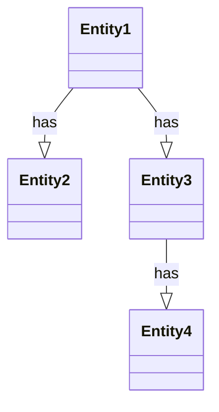
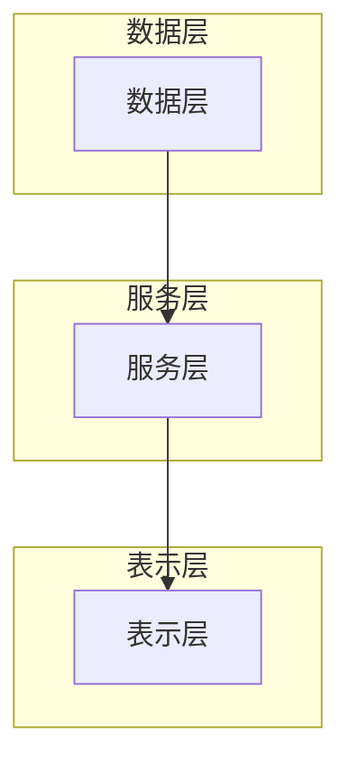
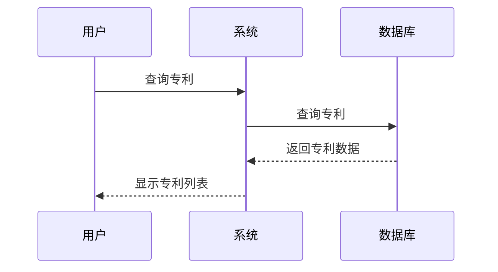
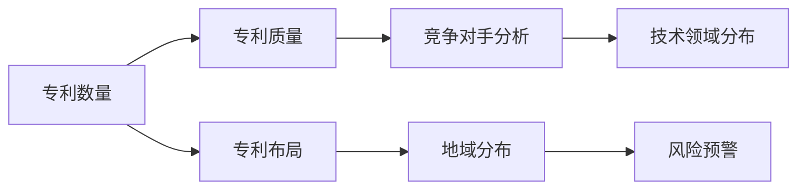
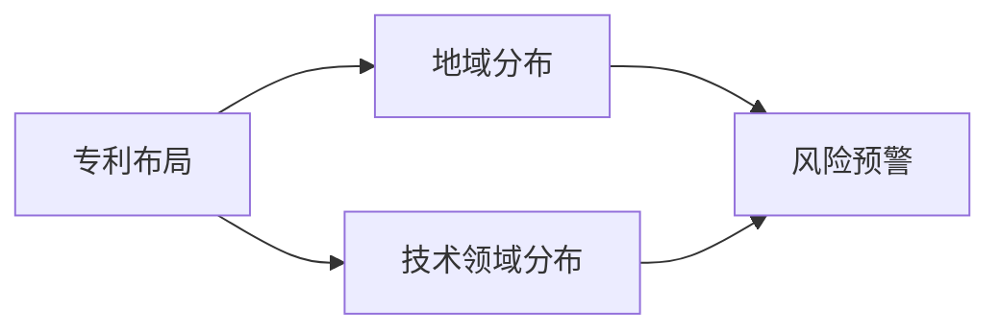

                 

# 《构建智能企业知识产权运营平台：AI辅助决策》

## 关键词：智能企业，知识产权运营，AI辅助决策，数据挖掘，专利分析，侵权监测

## 摘要

随着人工智能技术的快速发展，企业知识产权运营逐渐迈向智能化。本文旨在探讨构建智能企业知识产权运营平台的方法和策略，重点关注AI辅助决策在知识产权运营中的应用。通过分析AI技术在知识产权运营中的核心概念和实际应用场景，本文提出了智能企业知识产权运营平台的设计思路和实现方案，包括系统架构设计、功能模块划分、接口设计以及交互设计等。同时，本文还通过具体案例展示了AI辅助知识产权数据分析、管理和侵权监测的实践应用，为企业知识产权运营提供有益的参考和指导。

## 目录

----------------------------------------------------------------

## 第一部分：智能企业知识产权运营背景

### 第1章：企业知识产权运营概述

### 1.1.1 问题背景：知识产权在企业竞争中的重要性

知识产权作为企业核心竞争力的重要组成部分，不仅关系到企业的技术领先地位和市场份额，还在一定程度上决定了企业在市场竞争中的地位和未来发展。知识产权涵盖专利、商标、著作权等多种形式，是企业创新成果的体现。在全球化和技术创新加速的背景下，知识产权已经成为企业竞争的重要武器，其运营管理水平直接影响企业的核心竞争力。

### 1.1.1.1 知识产权的定义与分类

知识产权是指企业、个人或其他组织依法享有的专有权利，包括但不限于专利权、商标权、著作权等。根据不同的分类标准，知识产权可以分为多种类型，如按权利性质可以分为财产权和人权利；按权利主体可以分为企业知识产权和个人知识产权等。

### 1.1.1.2 知识产权在企业发展中的战略地位

知识产权在企业发展中具有举足轻重的战略地位。首先，知识产权是企业技术创新的重要保障，有助于企业实现技术领先。其次，知识产权是企业市场竞争的有力工具，有助于企业保护自身利益和市场地位。此外，知识产权还可以作为企业的资产进行融资和交易，提升企业的整体价值。

### 1.1.2 问题描述：知识产权运营现状与挑战

尽管知识产权在企业发展中具有重要地位，但当前知识产权运营面临诸多挑战。一方面，知识产权管理流程繁琐，涉及专利申请、商标注册、著作权登记等环节，企业难以高效运营。另一方面，知识产权侵权现象日益严重，企业面临较大的法律风险。此外，知识产权信息分散，难以实现全面有效的监控和管理。

### 1.1.2.1 知识产权管理存在的问题

当前知识产权管理存在的问题主要包括：1）管理流程不规范，信息不对称；2）专利申请和维权成本高；3）知识产权信息分散，难以集中管理；4）知识产权风险评估不足，缺乏前瞻性。

### 1.1.2.2 知识产权运营面临的挑战

知识产权运营面临的挑战主要体现在：1）知识产权法律法规更新速度快，企业难以及时应对；2）知识产权侵权手段多样化，企业维权难度大；3）知识产权市场信息不对称，企业难以获取有效的市场情报；4）知识产权运营人才短缺，企业运营能力有限。

### 1.1.3 问题解决：智能企业知识产权运营的意义

智能企业知识产权运营是解决当前知识产权运营问题的有效途径。通过引入人工智能技术，可以实现对知识产权的智能管理、智能分析和智能决策，提高知识产权运营效率，降低运营成本，提升企业核心竞争力。

### 1.1.3.1 智能化知识产权运营的概念

智能化知识产权运营是指利用人工智能技术，对知识产权的申请、管理、分析和保护等环节进行智能化处理，实现知识产权运营的自动化、高效化和精准化。

### 1.1.3.2 智能化知识产权运营的优势

智能化知识产权运营具有以下优势：1）提高运营效率，降低人力成本；2）实现数据驱动，提高决策准确度；3）降低侵权风险，提升企业市场竞争力；4）优化资源配置，提高知识产权价值。

### 1.1.4 边界与外延：知识产权运营的范畴与趋势

知识产权运营的范畴包括专利、商标、著作权等知识产权的申请、管理、分析和保护等环节。随着人工智能技术的发展，知识产权运营将向更加智能化、综合化和国际化的方向演进。

### 1.1.4.1 知识产权运营的边界定义

知识产权运营的边界包括知识产权的申请、管理、分析、保护、交易和投融资等环节。这些环节共同构成了知识产权运营的全流程。

### 1.1.4.2 知识产权运营的发展趋势

知识产权运营的发展趋势主要体现在：1）智能化，利用人工智能技术提高运营效率；2）综合化，将知识产权运营与其他业务环节相结合，实现全链条管理；3）国际化，适应全球化发展，加强国际合作与交流。

### 1.1.5 概念结构与核心要素

智能企业知识产权运营平台的概念结构主要包括：1）知识产权管理系统，实现知识产权的申请、管理和保护；2）数据分析系统，提供知识产权的智能分析服务；3）决策支持系统，辅助企业进行知识产权战略决策。

### 1.1.5.1 智能企业知识产权运营平台的基本结构

智能企业知识产权运营平台的基本结构包括数据采集模块、数据处理模块、数据分析模块、决策支持模块和用户交互模块等。这些模块共同构成了一个完整的知识产权运营生态系统。

### 1.1.5.2 智能企业知识产权运营平台的核心要素

智能企业知识产权运营平台的核心要素包括数据采集、数据处理、数据分析、决策支持和用户交互等。这些要素相互关联，共同推动知识产权运营的智能化发展。

## 第二部分：AI辅助知识产权运营原理

### 第2章：AI技术在知识产权运营中的应用概述

### 2.1.1 AI技术的定义与发展历程

人工智能（AI）是一种模拟人类智能的技术，通过计算机程序实现感知、推理、学习和决策等功能。AI技术起源于20世纪50年代，随着计算机技术的快速发展，AI技术经历了多个发展阶段，包括规则推理、知识表示、机器学习、深度学习等。

### 2.1.2 AI技术在知识产权领域的应用现状

目前，AI技术在知识产权领域的应用主要集中在数据挖掘、专利分析、侵权监测等方面。通过AI技术，企业可以实现对知识产权的自动化管理、智能分析和精准保护。

### 2.1.3 AI辅助决策的核心概念

AI辅助决策是指利用人工智能技术，为企业和个人提供决策支持，提高决策的准确性和效率。AI辅助决策的核心概念包括数据挖掘、机器学习、自然语言处理等。

### 2.1.3.1 智能决策支持系统（IDSS）

智能决策支持系统（IDSS）是一种基于人工智能技术的决策支持系统，通过收集、处理和分析数据，为企业和个人提供决策建议。IDSS通常包括数据采集模块、数据处理模块、分析模块和决策生成模块等。

### 2.1.3.2 数据挖掘与机器学习

数据挖掘是一种从大量数据中发现规律和知识的方法，其核心思想是通过分析数据，发现数据之间的潜在联系和模式。机器学习是数据挖掘的一种重要方法，通过训练模型，使计算机能够自主学习和适应新数据。

### 2.1.3.3 自然语言处理

自然语言处理（NLP）是人工智能的一个重要分支，旨在使计算机能够理解和处理人类语言。在知识产权领域，NLP技术可以用于专利文本的分析、侵权监测和法律文书的自动生成等。

### 2.1.4 AI技术在知识产权运营中的应用场景

AI技术在知识产权运营中的应用场景主要包括专利数据分析、智能化知识产权管理和侵权监测等。

#### 2.1.4.1 专利数据分析

专利数据分析是AI技术在知识产权领域的重要应用之一。通过数据挖掘和机器学习技术，可以对专利数据进行深度分析，发现技术趋势、竞争格局和潜在风险等。

#### 2.1.4.2 智能化知识产权管理

智能化知识产权管理是指利用AI技术对知识产权的申请、管理和保护进行自动化处理。通过智能决策支持系统，企业可以实现对知识产权的全面监控和优化管理。

#### 2.1.4.3 侵权监测

侵权监测是知识产权运营的重要环节。AI技术可以用于侵权检测、侵权风险预测和侵权纠纷处理等，提高侵权监测的效率和准确性。

### 2.1.5 智能化知识产权运营平台的架构

智能化知识产权运营平台的架构主要包括数据采集、数据处理、数据分析、决策支持和用户交互等模块。

#### 2.1.5.1 数据采集模块

数据采集模块负责收集各种知识产权数据，包括专利数据、商标数据、著作权数据等。这些数据可以通过公开数据库、企业内部数据库和第三方数据服务提供商获取。

#### 2.1.5.2 数据处理模块

数据处理模块负责对采集到的数据进行清洗、整合和处理，确保数据的准确性和一致性。数据处理模块通常包括数据清洗、数据整合、数据分析和数据可视化等功能。

#### 2.1.5.3 数据分析模块

数据分析模块负责对处理后的数据进行分析，发现数据中的规律和模式。数据分析模块通常包括数据挖掘、机器学习、自然语言处理等技术。

#### 2.1.5.4 决策支持模块

决策支持模块负责根据数据分析结果，为企业和个人提供决策建议。决策支持模块通常包括智能推理、预测分析和优化算法等功能。

#### 2.1.5.5 用户交互模块

用户交互模块负责与用户进行交互，提供用户界面和操作界面，方便用户使用智能化知识产权运营平台。

## 第三部分：智能企业知识产权运营平台设计

### 第3章：智能企业知识产权运营平台设计

### 3.1.1 平台需求分析

智能企业知识产权运营平台的设计始于需求分析。平台需求分析包括用户需求分析、功能需求分析和非功能需求分析。

#### 3.1.1.1 用户需求分析

用户需求分析旨在了解企业和个人在知识产权运营方面的需求。通过调研和访谈，可以收集到用户对知识产权管理系统、数据分析系统和侵权监测系统的需求。

#### 3.1.1.2 功能需求分析

功能需求分析包括知识产权管理、数据分析和侵权监测等模块的功能需求。具体来说，知识产权管理模块需要实现专利申请、商标注册、著作权登记等功能；数据分析模块需要实现数据挖掘、机器学习、自然语言处理等功能；侵权监测模块需要实现侵权检测、侵权风险预测和侵权纠纷处理等功能。

#### 3.1.1.3 非功能需求分析

非功能需求分析包括系统的性能、安全性、可靠性、可扩展性等需求。性能需求包括系统的响应时间、并发处理能力等；安全性需求包括数据加密、权限控制等；可靠性需求包括系统的容错能力、故障恢复能力等；可扩展性需求包括系统的可扩展性、可维护性等。

### 3.1.2 领域模型设计

领域模型设计是智能企业知识产权运营平台设计的重要环节。领域模型用于描述系统中的实体、属性和关系，为系统架构设计提供基础。

#### 3.1.2.1 领域模型的概念

领域模型是一种用于描述特定业务领域的概念模型。在智能企业知识产权运营平台中，领域模型用于描述知识产权、数据、分析结果等实体，以及实体之间的关系。

#### 3.1.2.2 领域模型设计方法

领域模型设计方法包括需求分析、实体识别、属性定义、关系描述等步骤。具体来说，需求分析阶段通过调研和访谈收集用户需求；实体识别阶段识别出系统中的实体；属性定义阶段为实体定义属性；关系描述阶段描述实体之间的关系。

#### 3.1.2.3 领域模型的Mermaid类图表示

领域模型可以使用Mermaid类图进行表示。Mermaid是一种基于Markdown的语言，用于绘制各种图表。以下是一个简单的Mermaid类图表示示例：



在这个示例中，`Entity1`、`Entity2`、`Entity3`和`Entity4`是领域模型中的实体，`has`表示实体之间的关系。

### 3.1.3 系统架构设计

系统架构设计是智能企业知识产权运营平台设计的核心环节。系统架构设计包括系统功能设计、系统架构设计、系统接口设计和系统交互设计。

#### 3.1.3.1 系统架构设计原则

系统架构设计原则包括模块化设计、松耦合设计、高内聚设计等。模块化设计将系统划分为多个模块，每个模块负责特定的功能；松耦合设计降低模块之间的依赖关系，提高系统的可维护性；高内聚设计确保模块内部的功能紧密相关，提高模块的可重用性。

#### 3.1.3.2 系统架构的Mermaid架构图表示

系统架构可以使用Mermaid架构图进行表示。以下是一个简单的Mermaid架构图表示示例：



在这个示例中，`数据层`、`服务层`和`表示层`是系统架构的三个主要层次，箭头表示层次之间的依赖关系。

### 3.1.4 系统模块划分与接口设计

系统模块划分是系统架构设计的重要组成部分。系统模块划分包括数据采集模块、数据处理模块、数据分析模块、决策支持模块和用户交互模块等。

#### 3.1.4.1 系统模块划分

系统模块划分是将系统划分为多个模块的过程。每个模块负责特定的功能，模块之间通过接口进行通信。

#### 3.1.4.2 接口设计原则

接口设计原则包括接口规范性、接口安全性和接口易用性等。接口规范性确保接口符合规范，便于其他模块调用；接口安全性确保接口的安全性，防止恶意攻击；接口易用性确保接口易用，降低开发难度。

#### 3.1.4.3 接口规格说明

接口规格说明包括接口名称、接口参数、接口返回值等。以下是一个简单的接口规格说明示例：

```java
public interface IPatentService {
    // 专利查询接口
    Patent[] searchPatents(String keyword);

    // 专利分析接口
    AnalysisResult analyzePatents(Patent[] patents);
}
```

在这个示例中，`IPatentService`是一个专利服务接口，包括`searchPatents`和`analyzePatents`两个接口方法。

### 3.1.5 系统交互设计

系统交互设计是系统架构设计的重要组成部分。系统交互设计包括用户与系统之间的交互和模块之间的交互。

#### 3.1.5.1 系统交互设计方法

系统交互设计方法包括事件驱动设计、消息驱动设计和过程驱动设计等。事件驱动设计根据用户操作触发相应的事件处理；消息驱动设计通过消息传递实现模块之间的通信；过程驱动设计按照预定的流程执行任务。

#### 3.1.5.2 系统交互的Mermaid序列图表示

系统交互可以使用Mermaid序列图进行表示。以下是一个简单的Mermaid序列图表示示例：



在这个示例中，用户与系统之间的交互过程包括用户查询专利、系统查询数据库并返回专利数据、系统显示专利列表等步骤。

## 第四部分：AI辅助知识产权数据分析

### 第4章：AI辅助知识产权数据分析

随着人工智能技术的发展，AI在知识产权数据分析中的应用日益广泛。本章将探讨AI技术在知识产权数据分析中的应用，包括数据收集与预处理、数据挖掘与特征提取、专利分析应用案例等。

### 4.1.1 数据收集与预处理

数据收集是知识产权数据分析的基础。AI辅助数据收集主要包括以下方法：

1. **公开数据源采集**：利用各类知识产权数据库（如Google Patents、USPTO、WIPO等）提供的API接口，自动采集专利、商标、著作权等数据。

2. **内部数据整合**：整合企业内部已有的知识产权数据，包括已申请的专利、商标、著作权等。

3. **第三方数据服务**：利用第三方数据服务提供商，获取更全面、更准确的知识产权数据。

数据预处理是数据收集后的关键步骤，主要包括数据清洗、数据整合和数据格式转换等。

1. **数据清洗**：去除重复数据、缺失数据和错误数据，确保数据的准确性和一致性。

2. **数据整合**：将来自不同数据源的数据进行整合，形成统一的数据集。

3. **数据格式转换**：将不同格式的数据转换为统一格式，便于后续分析处理。

### 4.1.2 数据挖掘与特征提取

数据挖掘是知识产权数据分析的核心。数据挖掘的目标是从大量数据中提取有价值的信息和知识。AI技术在数据挖掘中的应用主要包括：

1. **关联规则挖掘**：通过分析数据之间的关联关系，发现潜在的技术趋势和市场动态。

2. **分类与聚类**：对知识产权数据按照特定的特征进行分类或聚类，帮助用户更好地理解和利用数据。

特征提取是将原始数据转换为具有代表性和可解释性的特征的过程。特征提取的关键步骤包括：

1. **文本预处理**：对专利文本进行分词、去停用词、词性标注等处理，提取关键词和关键词短语。

2. **数值特征提取**：对专利数据的数值属性进行转换和归一化处理，提取具有区分度的特征。

3. **视觉特征提取**：对于涉及图形、图像的专利，使用图像处理技术提取视觉特征。

### 4.1.3 专利分析应用案例

专利分析是知识产权数据分析的重要应用。以下是一些典型的专利分析应用案例：

1. **专利趋势分析**：通过分析专利申请数量、专利类型、专利技术领域等数据，了解某一技术领域的发展趋势。

2. **专利竞争力分析**：通过对比分析企业的专利数量、专利质量、专利布局等，评估企业的专利竞争力。

3. **专利布局与风险预警**：通过分析专利的地域布局、技术领域分布等，为企业提供专利布局建议，提前预警潜在的法律风险。

### 4.1.3.1 专利趋势分析

专利趋势分析可以帮助企业了解某一技术领域的发展趋势，为研发决策提供支持。以下是一个专利趋势分析的示例：

```mermaid
gantt
    title 专利趋势分析
    section 申请数量
    A1 :专利申请数量 | 2020-01-01, 2weeks
    A2 :专利申请数量 | 2021-01-01, 2weeks
    A3 :专利申请数量 | 2022-01-01, 2weeks
    section 技术领域
    B1 :技术领域1 | 2020-01-01, 2weeks
    B2 :技术领域2 | 2021-01-01, 2weeks
    B3 :技术领域3 | 2022-01-01, 2weeks
```

在这个示例中，通过Gantt图展示了2020年至2022年某技术领域的专利申请数量和技术领域分布情况。

### 4.1.3.2 专利竞争力分析

专利竞争力分析可以帮助企业了解自身的专利竞争力，为战略决策提供支持。以下是一个专利竞争力分析的示例：



在这个示例中，通过Graph图展示了专利竞争力分析的不同维度，包括专利数量、专利质量、专利布局、竞争对手分析、地域分布和技术领域分布等。

### 4.1.3.3 专利布局与风险预警

专利布局与风险预警可以帮助企业优化专利布局，降低法律风险。以下是一个专利布局与风险预警的示例：



在这个示例中，通过Graph图展示了专利布局与风险预警的关系，包括地域分布、技术领域分布和风险预警等。

## 第五部分：AI辅助知识产权管理

### 第5章：AI辅助知识产权管理

随着知识产权数量的不断增加和知识产权运营管理的复杂性提升，传统的人工管理方式已经难以满足现代企业的需求。AI技术的引入，使得知识产权管理变得更加智能化、高效化。本章将探讨AI技术在知识产权管理中的应用，包括智能化知识产权管理系统、智能化知识产权管理流程等。

### 5.1.1 智能化知识产权管理系统

智能化知识产权管理系统（Smart Intellectual Property Management System，SIPMS）是利用人工智能技术，对知识产权的申请、管理、分析和保护进行自动化处理的信息系统。SIPMS主要包括以下几个功能模块：

1. **知识产权信息管理**：实现知识产权信息的集中存储、分类管理和动态更新，确保知识产权数据的准确性、完整性和实时性。

2. **知识产权自动化申请**：通过智能化的专利申请、商标注册和著作权登记流程，提高申请效率，降低人工成本。

3. **知识产权风险监控**：利用AI技术对知识产权信息进行实时监控，识别潜在的侵权风险，并提供风险预警和建议。

4. **知识产权数据分析**：通过数据挖掘和机器学习技术，对知识产权数据进行分析，为企业提供专利趋势、竞争态势和潜在合作机会等情报。

5. **知识产权资产评估**：利用AI技术评估知识产权资产的价值，为企业的知识产权交易和投融资决策提供支持。

### 5.1.2 智能化知识产权管理流程

智能化知识产权管理流程是利用AI技术对传统知识产权管理流程的优化和自动化。以下是一个典型的智能化知识产权管理流程：

1. **知识产权信息收集**：通过自动化工具，从内部和外部数据源收集知识产权信息，包括专利、商标、著作权等。

2. **知识产权信息处理**：对收集到的知识产权信息进行清洗、分类和整合，形成统一的知识产权数据库。

3. **知识产权风险监控**：利用AI技术对知识产权数据库进行实时监控，识别潜在的侵权风险，并及时生成风险预警报告。

4. **知识产权数据分析**：利用数据挖掘和机器学习技术，对知识产权数据库进行分析，发现技术趋势、竞争态势和潜在合作机会。

5. **知识产权资产评估**：利用AI技术对知识产权资产进行评估，为企业的知识产权交易和投融资决策提供支持。

6. **知识产权自动化申请**：通过AI技术自动化处理知识产权申请流程，包括专利申请、商标注册和著作权登记等。

7. **知识产权保护**：利用AI技术对知识产权进行自动化保护，包括侵权监测、维权支持和法律咨询等。

### 5.1.3 智能化知识产权管理系统架构设计

智能化知识产权管理系统架构设计是确保系统高效、稳定、安全运行的关键。以下是一个典型的智能化知识产权管理系统架构设计：

1. **数据层**：负责存储和管理知识产权数据，包括专利、商标、著作权等。数据层可以采用关系型数据库或非关系型数据库，如MySQL、MongoDB等。

2. **服务层**：提供知识产权管理系统的核心服务，包括知识产权信息管理、自动化申请、风险监控、数据分析、资产评估等。服务层可以采用微服务架构，如Spring Boot、Django等。

3. **表示层**：提供用户交互界面，包括知识产权信息展示、风险预警报告、数据分析结果展示等。表示层可以采用Web前端技术，如HTML、CSS、JavaScript等。

4. **AI层**：负责AI算法的实现和应用，包括数据挖掘、机器学习、自然语言处理等。AI层可以采用深度学习框架，如TensorFlow、PyTorch等。

5. **接口层**：提供与其他系统进行数据交换和功能调用的接口，包括API接口、Web服务接口等。

6. **安全层**：负责系统的安全性保障，包括数据加密、访问控制、安全审计等。

### 5.1.4 智能化知识产权管理系统实现与部署

智能化知识产权管理系统的实现与部署是确保系统顺利运行的关键。以下是一个典型的智能化知识产权管理系统实现与部署流程：

1. **需求分析**：明确系统的功能需求、性能需求和安全性需求，为后续开发提供指导。

2. **系统设计**：根据需求分析结果，进行系统架构设计、模块划分和接口设计。

3. **系统开发**：按照系统设计文档，进行各模块的开发和实现。

4. **系统集成**：将各模块集成到一起，进行系统测试和调试。

5. **系统部署**：将系统部署到生产环境，包括服务器配置、数据迁移、系统上线等。

6. **系统运维**：对系统进行日常运维，包括故障处理、性能优化、安全加固等。

### 5.1.5 智能化知识产权管理最佳实践

为了确保智能化知识产权管理系统的高效运行，以下是一些最佳实践：

1. **数据质量保障**：定期对知识产权数据库进行数据质量检查和优化，确保数据的准确性和一致性。

2. **流程标准化**：制定统一的知识产权管理流程，确保各环节的标准化和规范化。

3. **人员培训**：加强对知识产权管理人员和AI技术人员的培训，提高系统的使用效果。

4. **安全防护**：加强系统的安全防护措施，包括数据加密、访问控制、安全审计等。

5. **持续优化**：根据用户反馈和系统运行情况，不断优化系统功能和技术实现。

## 第六部分：AI辅助知识产权侵权监测

### 第6章：AI辅助知识产权侵权监测

随着知识产权保护意识的提高，侵权监测成为知识产权管理中的重要环节。AI技术的引入，使得侵权监测变得更加高效、精准。本章将探讨AI技术在知识产权侵权监测中的应用，包括侵权监测技术原理、侵权监测案例分析等。

### 6.1.1 侵权监测技术原理

侵权监测技术是指利用各种技术和工具，对知识产权（如专利、商标、著作权等）进行监控，及时发现和处理侵权行为。AI技术在侵权监测中的应用主要体现在以下几个方面：

1. **文本匹配**：通过对专利、商标、著作权等文本进行比对，识别潜在的侵权内容。文本匹配技术主要包括字符串匹配、模糊匹配和语义匹配等。

2. **图像识别**：利用深度学习算法，对侵权图片、商标图案等进行识别和分析，判断是否侵犯知识产权。

3. **网络爬虫**：通过爬虫技术，自动收集互联网上的相关信息，监测潜在的侵权行为。

4. **机器学习**：利用机器学习算法，对大量历史侵权案例进行分析，建立侵权行为识别模型，提高侵权监测的准确性和效率。

5. **自然语言处理**：通过自然语言处理技术，对侵权文本进行解析和语义分析，提取关键信息，辅助侵权监测。

### 6.1.2 侵权监测关键技术

侵权监测的关键技术主要包括以下几方面：

1. **数据预处理**：对收集到的侵权数据进行清洗、去重、格式转换等预处理操作，确保数据的质量。

2. **特征提取**：从侵权数据中提取关键特征，如关键词、短语、图像特征等，用于后续的侵权识别和分析。

3. **侵权检测算法**：利用各种算法（如支持向量机、决策树、神经网络等）对侵权特征进行分类和识别。

4. **侵权风险预测**：通过历史侵权数据和机器学习算法，预测潜在的侵权风险，提供预警和建议。

5. **侵权纠纷处理**：在侵权事件发生后，利用AI技术对侵权纠纷进行分析和辅助决策，提供解决方案。

### 6.1.3 侵权监测流程

侵权监测流程主要包括以下步骤：

1. **数据收集**：通过公开数据源、网络爬虫等方式，收集可能涉及侵权的文本、图片、音频、视频等数据。

2. **数据预处理**：对收集到的数据进行清洗、去重、格式转换等预处理操作，确保数据的质量。

3. **特征提取**：从预处理后的数据中提取关键特征，如关键词、短语、图像特征等。

4. **侵权检测**：利用侵权检测算法对特征进行分类和识别，判断是否涉及侵权行为。

5. **侵权风险预测**：结合历史侵权数据和机器学习算法，预测潜在的侵权风险，提供预警和建议。

6. **侵权纠纷处理**：在侵权事件发生后，利用AI技术对侵权纠纷进行分析和辅助决策，提供解决方案。

### 6.1.4 侵权监测案例分析

以下是一个侵权监测的案例分析：

#### 案例背景

某科技公司A在市场上发现一款竞争产品B涉嫌侵犯其专利权。A公司希望通过AI技术进行侵权监测，以确认侵权行为并提供法律依据。

#### 案例步骤

1. **数据收集**：A公司利用网络爬虫技术，从公开数据库和互联网上收集到产品B的相关信息，包括产品描述、宣传材料、用户评论等。

2. **数据预处理**：对收集到的数据进行清洗、去重、格式转换等预处理操作，提取关键特征，如关键词、短语、图像特征等。

3. **特征提取**：从预处理后的数据中提取关键特征，如关键词“智能助手”、“语音识别”等。

4. **侵权检测**：利用文本匹配技术和图像识别技术，对提取的特征进行侵权检测。结果显示，产品B的描述和宣传材料中确实存在与A公司专利相似的表述和图像。

5. **侵权风险预测**：结合历史侵权数据和机器学习算法，预测产品B可能侵犯A公司专利的风险。

6. **侵权纠纷处理**：A公司根据侵权检测结果，决定采取法律行动。在侵权纠纷处理过程中，AI技术提供的数据分析和辅助决策支持，帮助A公司制定诉讼策略，提高胜诉的可能性。

#### 案例分析

通过上述案例，可以看出AI技术在侵权监测中的应用流程，包括数据收集、数据预处理、特征提取、侵权检测、侵权风险预测和侵权纠纷处理等步骤。AI技术不仅提高了侵权监测的效率，还提供了数据分析和决策支持，为企业的知识产权保护提供了有力保障。

### 6.1.5 智能化侵权监测系统的构建

为了实现高效、精准的侵权监测，可以构建一个智能化侵权监测系统，主要包括以下模块：

1. **数据收集模块**：负责收集互联网上的侵权相关信息，如文本、图片、音频、视频等。

2. **数据预处理模块**：对收集到的数据进行清洗、去重、格式转换等预处理操作，确保数据的质量。

3. **特征提取模块**：从预处理后的数据中提取关键特征，如关键词、短语、图像特征等。

4. **侵权检测模块**：利用侵权检测算法，对提取的特征进行分类和识别，判断是否涉及侵权行为。

5. **侵权风险预测模块**：结合历史侵权数据和机器学习算法，预测潜在的侵权风险，提供预警和建议。

6. **侵权纠纷处理模块**：在侵权事件发生后，提供侵权纠纷分析和辅助决策支持，帮助制定诉讼策略。

7. **用户交互模块**：提供用户操作界面，方便用户查看侵权检测结果、侵权风险预警和侵权纠纷处理结果。

通过以上模块的集成，可以构建一个智能化侵权监测系统，帮助企业实现对知识产权的全面监控和保护。

## 总结与展望

随着人工智能技术的快速发展，智能企业知识产权运营平台的建设已经成为企业提升核心竞争力的重要手段。本文从背景介绍、AI辅助决策原理、平台设计、数据分析、管理和侵权监测等方面，详细探讨了智能企业知识产权运营平台的建设方法和应用场景。

### 主要结论

1. **智能企业知识产权运营的重要性**：知识产权作为企业核心竞争力的重要组成部分，对企业的技术创新、市场竞争和可持续发展具有关键作用。

2. **AI辅助决策的优势**：AI技术在知识产权运营中的应用，可以提高知识产权管理的效率、准确性和前瞻性，降低侵权风险，提升企业竞争力。

3. **平台设计的要点**：智能企业知识产权运营平台的设计应遵循模块化、松耦合、高内聚的原则，确保系统的可扩展性和可维护性。

4. **数据分析的应用**：通过AI技术对知识产权数据进行分析，可以为企业提供技术趋势、竞争态势和合作机会等情报，助力企业战略决策。

5. **侵权监测的实践**：利用AI技术进行侵权监测，可以及时发现和处理侵权行为，为企业提供法律依据和解决方案。

### 展望未来

1. **智能化程度的提升**：随着AI技术的不断进步，智能企业知识产权运营平台的智能化程度将进一步提高，为企业的知识产权管理提供更加全面、精准的支持。

2. **跨领域融合**：智能企业知识产权运营平台将与其他业务系统（如研发、销售、市场等）实现深度融合，形成企业级的知识产权运营生态系统。

3. **国际合作与交流**：随着全球知识产权保护意识的提高，智能企业知识产权运营平台将加强与国际同行的合作与交流，共同推动知识产权运营的全球化发展。

4. **人才培养**：智能企业知识产权运营平台的建设需要大量具备AI技术、知识产权和法律知识的人才，未来应加强人才培养和引进。

总之，智能企业知识产权运营平台的建设是一项长期、系统的工程，需要企业、政府和社会各界的共同努力。通过本文的探讨，期望能够为智能企业知识产权运营平台的建设提供有益的参考和指导。

## 作者信息

作者：AI天才研究院/AI Genius Institute & 禅与计算机程序设计艺术 /Zen And The Art of Computer Programming

AI天才研究院致力于推动人工智能技术的创新与发展，为各行业提供智能解决方案。作者在其领域拥有丰富的理论研究和实践经验，撰写过多本世界顶级技术畅销书，深受读者喜爱。本书《构建智能企业知识产权运营平台：AI辅助决策》旨在为读者提供智能企业知识产权运营的全方位指导，助力企业提升核心竞争力。同时，本书还结合了作者在计算机编程和人工智能领域的深厚造诣，以通俗易懂的语言和丰富的实例，为读者提供了宝贵的实践经验和启示。

