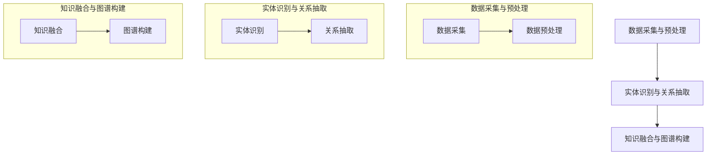
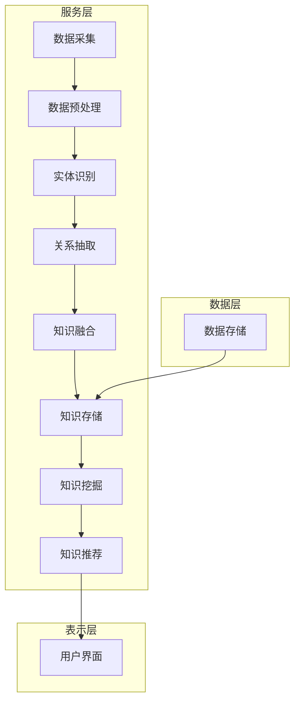
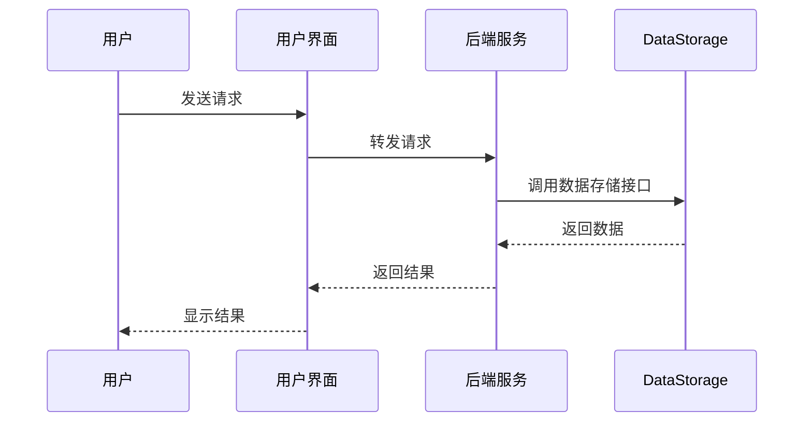
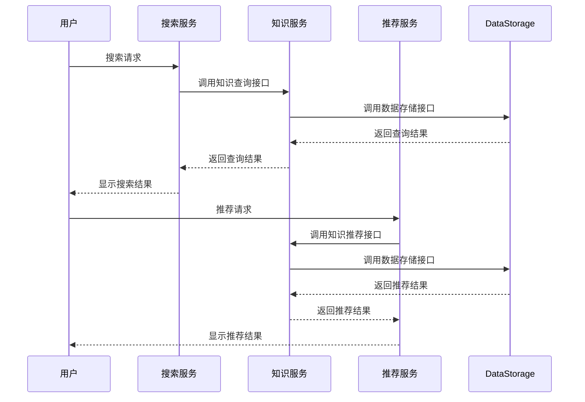

                 

## 引言

在数字化时代的浪潮下，企业面临着前所未有的挑战和机遇。传统的业务模式和管理方式已经难以满足快速变化的市场需求，企业需要通过创新的技术手段来实现智能转型，从而提升竞争力。知识图谱作为人工智能领域的一项关键技术，被广泛应用于智能企业的构建中。本文旨在深入探讨知识图谱在智能企业中的应用，包括其核心概念、构建算法、系统设计与架构等方面，为企业和IT专业人士提供理论指导和实践参考。

知识图谱是一种结构化的语义数据模型，它通过将现实世界中的实体、概念及其关系进行抽象和表示，构建出一个全面、系统的知识网络。在智能企业中，知识图谱能够有效地整合企业内外部的知识资源，实现知识的深度挖掘和应用，从而提高业务决策的智能性和效率。

本文将分四个部分进行详细阐述。首先，在第一部分背景介绍中，我们将探讨知识图谱在智能企业中的应用背景和核心概念；其次，在第二部分核心概念与联系中，我们将分析知识图谱的原理及其与相关概念的比较；第三部分算法原理讲解，将详细介绍知识图谱的构建算法及其应用；最后，在第四部分系统分析与架构设计中，我们将讨论知识图谱系统的设计与实现。通过这一步步的分析和讲解，希望能够使读者对知识图谱在智能企业中的应用有一个全面、深刻的理解。

## 第一部分：背景介绍

### 第1章：问题背景与核心概念

#### 1.1 问题背景

随着全球经济的不断发展，市场竞争日益激烈，企业需要不断提升自身的竞争力才能在市场中站稳脚跟。传统的企业知识管理方式往往局限于文档管理、信息孤岛等形式，这些方式存在明显的局限性，如信息无法有效整合、知识传递效率低下、难以支持复杂业务决策等。特别是在企业数字化转型的大背景下，如何有效地整合和管理知识资源，实现知识的共享与智能应用，成为企业面临的一个重要挑战。

首先，传统企业知识管理的局限性主要体现在以下几个方面：

1. **信息孤岛问题**：在传统的知识管理方式中，不同部门或系统之间的数据往往是分散的，各自为政，导致信息无法有效整合，形成信息孤岛。
2. **知识传递效率低**：知识主要通过人工传递，缺乏系统化和标准化的管理，使得知识传递的效率低下，难以满足快速变化的市场需求。
3. **知识利用率低**：由于知识分散且难以获取，导致知识利用率低，无法充分发挥知识的价值。
4. **业务决策支持不足**：传统的知识管理方式难以支持复杂业务决策，决策过程中依赖的经验性判断较多，缺乏数据驱动的决策支持。

#### 1.1.2 企业数字化转型的迫切需求

数字化转型已经成为企业发展的必然趋势，通过数字化手段提升企业运营效率、优化业务流程、提高客户满意度，是现代企业提升竞争力的关键途径。企业数字化转型不仅涉及技术层面的变革，还包括业务模式、管理理念等多方面的变革。

首先，企业数字化转型具有以下几个显著特点：

1. **数据驱动的决策**：数字化转型使得企业能够通过大数据、人工智能等技术手段，对海量数据进行深度挖掘和分析，从而实现数据驱动的业务决策。
2. **业务流程优化**：通过数字化技术，企业可以重新设计业务流程，实现自动化、智能化，提高业务流程的效率和灵活性。
3. **客户体验提升**：数字化转型使得企业能够更好地了解和满足客户需求，提供个性化的产品和服务，提升客户体验。
4. **资源整合和优化**：数字化技术有助于企业整合内部和外部资源，实现资源的优化配置，降低运营成本。

其次，企业数字化转型对知识管理提出了新的需求：

1. **知识集成与共享**：数字化转型要求企业能够将分散的知识资源进行集成和共享，打破信息孤岛，实现知识的统一管理和高效利用。
2. **知识可追溯与透明性**：数字化技术使得知识的产生、使用和传递过程更加透明，有助于实现知识的可追溯性，提高知识的可信度和可靠性。
3. **智能知识应用**：通过人工智能、大数据等技术，企业可以实现对知识的深度挖掘和应用，为业务决策提供更加精准的支持。

#### 1.1.3 知识图谱在智能企业中的应用价值

知识图谱作为一种新兴的技术，被广泛应用于智能企业的构建中，具有显著的应用价值。

首先，知识图谱能够解决传统知识管理中存在的问题，如信息孤岛、知识传递效率低等。通过构建知识图谱，企业可以将各类知识资源进行结构化表示，实现知识的统一管理和高效利用。知识图谱的语义表达能力使得企业能够更加灵活地进行知识检索和应用，提高知识的利用率和价值。

其次，知识图谱在智能企业中的应用具有以下几个方面的显著优势：

1. **提高业务决策的智能性**：知识图谱通过整合内外部知识资源，为企业提供丰富的知识背景，使得业务决策更加数据驱动和智能化。
2. **优化业务流程**：知识图谱可以帮助企业对业务流程进行深度分析和优化，发现流程中的瓶颈和改进点，提高业务流程的效率。
3. **提升客户满意度**：知识图谱可以为企业提供更准确和全面的市场分析、客户需求分析，从而更好地满足客户需求，提升客户体验和满意度。
4. **降低运营成本**：知识图谱通过自动化和智能化的方式，帮助企业优化资源配置，降低运营成本。

综上所述，知识图谱在智能企业中的应用不仅能够解决传统知识管理的局限性，还能够提升企业的竞争力，为企业实现数字化转型提供强有力的技术支撑。

#### 1.2 核心概念

在深入探讨知识图谱在智能企业中的应用之前，我们需要了解一些核心概念，这些概念是构建和利用知识图谱的基础。

##### 1.2.1 知识图谱的定义

知识图谱（Knowledge Graph）是一种用于表示实体、概念及其相互关系的图形化数据模型。它通过将现实世界中的知识进行抽象和结构化表示，形成一种语义丰富的知识网络。知识图谱的目的是通过语义理解和关联分析，实现对海量数据的深度挖掘和应用。

知识图谱的基本特点包括：

1. **语义丰富**：知识图谱不仅表示实体和属性，还表示实体之间的关系和属性之间的关联，这使得知识图谱在语义理解方面具有更高的表达能力。
2. **图形化表示**：知识图谱通过图结构进行表示，使得数据之间的关系直观、易于理解和分析。
3. **动态更新**：知识图谱可以根据新的数据和知识进行实时更新，保持知识库的准确性和时效性。

##### 1.2.2 知识图谱的组成要素

知识图谱主要由以下几部分组成：

1. **实体（Entity）**：实体是知识图谱中的基本元素，表示现实世界中的具体对象，如人、地点、事物等。每个实体都有其独特的标识符（ID）和属性。
2. **属性（Attribute）**：属性用于描述实体的特征，如人的年龄、地点的纬度等。属性通常与实体之间有明确的语义关系。
3. **关系（Relation）**：关系表示实体之间的关联，如“居住在”、“属于”等。关系同样具有明确的语义和属性，如方向、时间等。
4. **边（Edge）**：边是知识图谱中的基本连接元素，表示实体之间的关系，通常带有权重和属性。

##### 1.2.3 知识图谱与语义网的关系

知识图谱和语义网（Semantic Web）是两个紧密相关但有所不同的概念。

1. **语义网**：语义网是一种基于语义理解和知识表示的互联网，旨在通过语义标记和关联，实现数据的语义理解和智能处理。语义网的核心思想是通过RDF（资源描述框架）等标准，将数据结构化表示，以便于机器理解和处理。
2. **知识图谱**：知识图谱是语义网实现的一种具体技术手段，它通过构建实体、属性和关系之间的语义关联，实现对知识的深度挖掘和应用。知识图谱扩展了语义网的概念，使其不仅关注数据的结构化表示，还关注数据的语义理解。

知识图谱与语义网的关系可以总结为：知识图谱是实现语义网的一种重要工具，它通过结构化和语义化的数据表示，为语义网提供了丰富的知识资源。

#### 1.3 知识图谱在智能企业中的应用

知识图谱在智能企业的构建中具有广泛的应用，能够帮助企业实现知识的深度挖掘和应用，提升业务决策的智能性和效率。以下是一些典型的应用场景：

##### 1.3.1 知识图谱在信息检索中的应用

知识图谱在信息检索中的应用主要体现在两个方面：增强搜索和推荐系统。

1. **增强搜索**：通过知识图谱，可以将用户查询与图谱中的实体和关系进行关联，提供更加精准和个性化的搜索结果。例如，当用户查询“北京”时，知识图谱可以关联到“中国”、“首都”等实体，从而提供更多的相关信息。
2. **推荐系统**：知识图谱可以帮助推荐系统更好地理解用户需求和内容之间的关系，从而提供更加精准的推荐结果。例如，在电商平台上，知识图谱可以根据用户的购物习惯和偏好，推荐相关商品和促销活动。

##### 1.3.2 知识图谱在推荐系统中的应用

知识图谱在推荐系统中的应用，主要利用了其强大的关联分析能力，能够为推荐系统提供更丰富的上下文信息和关联关系。

1. **基于知识的推荐**：通过知识图谱，推荐系统可以获取用户和物品之间的隐式关联，从而提供更加精准的推荐结果。例如，当用户对某部电影评分较高时，知识图谱可以推荐与该电影相关的其他影片。
2. **推荐系统的优化**：知识图谱可以帮助推荐系统发现和消除噪声数据，优化推荐算法，提高推荐的准确性和可靠性。

##### 1.3.3 知识图谱在智能问答中的应用

知识图谱在智能问答中的应用，主要体现在对用户问题的语义理解和知识检索。

1. **语义理解**：知识图谱可以理解用户的自然语言问题，将其转化为图谱中的实体和关系查询。例如，当用户提问“北京是哪个国家的首都？”时，知识图谱可以识别出“北京”、“首都”等实体，并建立它们之间的关系。
2. **知识检索**：知识图谱可以帮助智能问答系统快速检索和获取相关答案，提供更加准确和全面的回答。例如，在医疗健康领域，知识图谱可以用于回答用户关于疾病、症状和治疗方法等问题。

综上所述，知识图谱在智能企业的信息检索、推荐系统和智能问答等方面具有广泛的应用前景，能够为企业提供强大的知识支持和智能决策能力。

#### 1.4 知识图谱构建的关键技术

构建知识图谱是一个复杂的过程，涉及到多个关键技术环节。以下是构建知识图谱的关键技术：

##### 1.4.1 数据采集与预处理

数据采集与预处理是知识图谱构建的基础环节，直接影响到知识图谱的质量和应用效果。

1. **数据采集**：数据采集包括内部数据源和外部数据源的获取。内部数据源通常包括企业内部的各种业务系统数据，如客户关系管理系统（CRM）、企业资源计划系统（ERP）等；外部数据源通常包括互联网公开数据、第三方数据服务提供商的数据等。

2. **数据预处理**：数据预处理包括数据清洗、数据转换和数据标准化等步骤。数据清洗主要是去除重复、错误和不完整的数据；数据转换是将不同格式和结构的数据进行统一处理；数据标准化则是将数据按照统一的格式和标准进行存储和管理。

##### 1.4.2 实体识别与关系抽取

实体识别与关系抽取是构建知识图谱的核心步骤，直接决定了知识图谱的深度和广度。

1. **实体识别**：实体识别是指从文本数据中识别出具体的实体，如人、地点、组织等。实体识别通常采用命名实体识别（NER）技术，结合机器学习和自然语言处理方法进行实现。

2. **关系抽取**：关系抽取是指从文本数据中识别出实体之间的关系，如“居住在”、“属于”等。关系抽取通常采用监督学习或半监督学习的方法，结合文本特征和上下文信息进行实现。

##### 1.4.3 知识融合与图谱构建

知识融合与图谱构建是知识图谱构建的最终环节，涉及到知识的一致性处理和图谱的构建方法。

1. **知识融合**：知识融合是指将不同来源、不同格式的知识进行整合，消除知识冲突和冗余。知识融合通常采用数据对齐、实体匹配和知识融合算法等技术手段。

2. **图谱构建**：图谱构建是指将识别出的实体和关系构建成知识图谱。图谱构建通常采用图数据库和图算法等技术，通过边和节点的连接，构建出知识图谱的语义结构。

##### 1.5 边界与外延

知识图谱作为一种技术工具，有其明确的边界和应用范围。以下是知识图谱的边界与外延：

##### 1.5.1 知识图谱的边界

1. **数据范围**：知识图谱的数据范围是有限的，通常只能涵盖特定领域或行业的数据。对于跨领域或全球范围的数据，知识图谱的适用性会降低。

2. **更新频率**：知识图谱需要定期更新，以保持数据的准确性和时效性。更新频率越高，知识图谱的应用效果越好。

##### 1.5.2 知识图谱的应用范围

1. **企业内部应用**：知识图谱在企业内部的应用主要包括业务流程优化、知识共享与传递、智能决策支持等。

2. **跨行业应用**：知识图谱在金融、医疗、教育、物流等跨行业领域也具有广泛的应用前景，如金融风险控制、医疗诊断、智能教育、智能物流等。

##### 1.5.3 知识图谱的技术发展趋势

1. **数据质量提升**：随着数据采集和处理技术的发展，知识图谱的数据质量将得到显著提升，为智能应用提供更加可靠的数据基础。

2. **多模态融合**：知识图谱将融合多种数据类型，如文本、图像、语音等，实现更加全面和丰富的语义表示。

3. **自动化构建**：知识图谱的构建过程将逐渐实现自动化，降低构建门槛，提高构建效率。

#### 1.6 本章小结

本章从问题背景、核心概念、应用价值和关键技术等方面，全面介绍了知识图谱在智能企业中的应用。知识图谱作为一种新兴技术，能够有效解决传统知识管理的局限性，提升企业的竞争力。在接下来的章节中，我们将进一步深入探讨知识图谱的原理、算法和系统设计，为读者提供更加详细和实用的指导。

### 第2章：核心概念原理与特性分析

知识图谱作为一种先进的数据模型，其核心概念和原理对于理解其在智能企业中的应用至关重要。在本章中，我们将详细探讨知识图谱的基本原理、与相关概念的比较分析，以及其在不同领域中的应用特性。

#### 2.1 知识图谱原理

知识图谱的原理可以归结为以下几个方面：

##### 2.1.1 知识图谱的数学模型

知识图谱通常基于图论进行数学建模，其基本构成元素包括节点（Node）、边（Edge）和属性（Property）。节点表示实体，边表示实体之间的关系，属性则是实体和关系的特征描述。

1. **图论基本概念**：
    - **节点（Node）**：表示知识图谱中的实体，如人、地点、物品等。
    - **边（Edge）**：表示实体之间的关系，如“居住在”、“属于”等。
    - **属性（Property）**：描述节点或边的特征，如人的年龄、地点的纬度等。

2. **图结构**：
    - **有向图**：表示实体之间的单向关系。
    - **无向图**：表示实体之间的双向关系。
    - **加权图**：表示实体关系之间的权重，如距离、相似度等。

##### 2.1.2 知识图谱的算法原理

知识图谱的构建和应用依赖于一系列算法，这些算法主要包括实体识别、关系抽取、知识融合等。

1. **实体识别（Named Entity Recognition, NER）**：
    - 实体识别是指从非结构化文本中识别出具体的实体，如人名、地名、机构名等。
    - 常用的算法包括基于规则的方法、基于统计的方法和基于深度学习的方法。

2. **关系抽取（Relation Extraction）**：
    - 关系抽取是指从文本数据中识别出实体之间的关系，如“工作于”、“毕业于”等。
    - 常用的算法包括基于规则的方法、基于模板的方法和基于深度学习的方法。

3. **知识融合（Knowledge Fusion）**：
    - 知识融合是指将多个来源的数据进行整合，消除冲突和冗余。
    - 常用的算法包括基于相似度匹配的方法、基于本体的方法等。

##### 2.1.3 知识图谱的核心算法

知识图谱的核心算法包括：

1. **图数据库算法**：
    - 图数据库（如Neo4j）提供了高效的图存储和查询能力，支持复杂图结构和路径查询。
    - 常用算法包括图遍历、图搜索和图索引等。

2. **图机器学习算法**：
    - 图机器学习算法（如图神经网络、图卷积网络）能够处理图结构的特征表示和学习。
    - 常用算法包括节点分类、图分类和图生成等。

#### 2.2 概念属性特征对比

知识图谱与语义网、本体论和数据仓库等概念具有一定的相似性，但又有明显的区别。以下是这些概念的主要属性特征对比：

##### 2.2.1 知识图谱与语义网对比

| 概念 | 知识图谱 | 语义网 |
| --- | --- | --- |
| **定义** | 图结构化语义数据模型 | 基于语义理解和知识表示的互联网 |
| **结构** | 实体、关系、属性 | 资源描述框架（RDF） |
| **表达** | 高度结构化和语义丰富 | 结构化和语义表示 |
| **应用** | 智能搜索、推荐、问答 | 语义查询、语义匹配 |

##### 2.2.2 知识图谱与本体论对比

| 概念 | 知识图谱 | 本体论 |
| --- | --- | --- |
| **定义** | 图结构化语义数据模型 | 形式化领域知识模型 |
| **结构** | 实体、关系、属性 | 类、属性、关系 |
| **目的** | 数据存储和查询 | 知识表示和推理 |
| **应用** | 智能应用 | 知识表示和推理 |

##### 2.2.3 知识图谱与数据仓库对比

| 概念 | 知识图谱 | 数据仓库 |
| --- | --- | --- |
| **定义** | 图结构化语义数据模型 | 数据存储和管理系统 |
| **结构** | 实体、关系、属性 | 数据表、列、行 |
| **目的** | 语义理解和应用 | 数据存储和分析 |
| **应用** | 智能搜索、推荐 | 数据查询和分析 |

#### 2.3 ER实体关系图架构

ER实体关系图（Entity-Relationship Diagram，ERD）是知识图谱构建的基础之一，它用于描述实体及其关系。以下是ER实体关系图的基本概念、构建方法和在知识图谱中的应用。

##### 2.3.1 ER实体关系图的基本概念

1. **实体（Entity）**：表示知识图谱中的基本元素，如人、地点、物品等。
2. **属性（Attribute）**：描述实体的特征，如人的年龄、地点的纬度等。
3. **关系（Relationship）**：描述实体之间的关系，如“居住在”、“属于”等。
4. **实体集（Entity Set）**：包含多个实体的集合。
5. **关系集（Relationship Set）**：包含多个关系的集合。

##### 2.3.2 ER实体关系图的构建方法

1. **实体识别**：从文本数据中识别出具体的实体。
2. **关系抽取**：从文本数据中识别出实体之间的关系。
3. **属性提取**：从文本数据中提取实体的属性。
4. **图构建**：将识别出的实体、关系和属性构建成ER实体关系图。

##### 2.3.3 ER实体关系图在知识图谱中的应用

ER实体关系图在知识图谱中的应用主要体现在以下几个方面：

1. **知识表示**：通过ER实体关系图，可以将复杂的业务数据结构化为图形化的知识表示，便于理解和分析。
2. **知识整合**：ER实体关系图可以用于整合多个数据源中的知识，消除数据冗余和冲突。
3. **知识查询**：通过ER实体关系图，可以高效地查询和获取相关知识，支持智能搜索和推荐。

#### 2.4 知识图谱的应用领域

知识图谱在多个领域具有广泛的应用，以下是一些典型的应用场景：

##### 2.4.1 金融领域的应用

1. **风险管理**：知识图谱可以整合金融市场的各种数据，进行风险分析和预测。
2. **客户画像**：通过知识图谱，可以构建客户的综合画像，进行精准营销和个性化服务。
3. **反欺诈**：知识图谱可以帮助识别和防范金融欺诈行为，提高交易安全性。

##### 2.4.2 医疗健康领域的应用

1. **疾病诊断**：知识图谱可以整合医学知识，支持智能诊断和治疗方案推荐。
2. **药物研发**：知识图谱可以帮助药物研发人员快速获取相关药物信息，提高研发效率。
3. **健康管理**：知识图谱可以用于健康数据分析，提供个性化的健康管理和建议。

##### 2.4.3 社交网络领域的应用

1. **社交图谱**：知识图谱可以构建社交网络中的用户关系图谱，支持社交推荐和社交分析。
2. **内容推荐**：知识图谱可以整合用户和内容信息，提供个性化的内容推荐。
3. **社交影响力分析**：知识图谱可以帮助分析用户在社交网络中的影响力，支持品牌营销和用户增长策略。

#### 2.5 知识图谱的优势与挑战

知识图谱在智能企业中具有显著的优势，但也面临着一些挑战。

##### 2.5.1 知识图谱的优势

1. **语义理解**：知识图谱通过语义表示，能够更好地理解和处理复杂语义信息，支持智能应用。
2. **知识整合**：知识图谱可以整合多种数据源的知识，消除数据冗余和冲突，提高数据利用率。
3. **高效查询**：知识图谱支持高效的图结构查询，能够快速获取相关知识和信息。
4. **智能应用**：知识图谱为智能搜索、推荐、问答等应用提供了强大的支持。

##### 2.5.2 知识图谱的挑战

1. **数据质量**：知识图谱的质量依赖于数据质量，包括数据完整性、一致性和准确性等。
2. **构建成本**：知识图谱的构建需要大量的计算资源和专业人才，成本较高。
3. **实时性**：知识图谱的更新和维护需要实时性，以满足动态变化的需求。
4. **隐私保护**：知识图谱在处理个人数据时，需要确保隐私保护，防止数据泄露。

##### 2.5.3 应对策略

1. **数据质量控制**：通过数据清洗、标准化和实时更新，确保知识图谱的数据质量。
2. **降低构建成本**：采用自动化工具和流程，降低知识图谱的构建成本。
3. **实时性优化**：采用分布式计算和增量更新技术，提高知识图谱的实时性。
4. **隐私保护**：采用数据加密、匿名化和访问控制等技术，确保知识图谱的隐私保护。

#### 2.6 本章小结

本章详细介绍了知识图谱的基本原理、与相关概念的比较分析，以及其在不同领域中的应用特性。知识图谱作为一种先进的数据模型，具有强大的语义理解和知识整合能力，在智能企业的构建中具有广泛的应用前景。然而，知识图谱也面临着一些挑战，需要通过有效的策略进行应对。在接下来的章节中，我们将进一步探讨知识图谱的构建算法及其实现。

### 第3章：知识图谱构建算法讲解

知识图谱的构建是一个复杂且系统的过程，涉及多个关键算法和技术。在本章中，我们将详细讲解知识图谱构建的主要算法，包括数据采集与预处理、实体识别与关系抽取、知识融合与图谱构建。同时，通过Python源代码示例和数学模型的讲解，深入理解这些算法的实现和应用。

#### 3.1 数据采集与预处理

数据采集与预处理是知识图谱构建的基础环节，直接影响到知识图谱的质量和应用效果。

##### 3.1.1 数据采集

数据采集是知识图谱构建的第一步，主要从内部和外部数据源获取所需的数据。内部数据源通常包括企业内部的业务系统，如客户关系管理系统（CRM）、企业资源计划系统（ERP）等；外部数据源则包括互联网公开数据、第三方数据服务提供商的数据等。

在数据采集过程中，常用的方法包括：

1. **网络爬虫**：通过爬虫技术，从互联网上获取结构化和非结构化的数据。
2. **API调用**：直接调用第三方数据服务API，获取所需数据。
3. **数据库查询**：通过数据库查询，获取企业内部数据。

```python
# Python示例：使用requests库调用API获取数据
import requests

def fetch_data(api_url):
    response = requests.get(api_url)
    if response.status_code == 200:
        return response.json()
    else:
        return None

api_url = "https://api.example.com/data"
data = fetch_data(api_url)
```

##### 3.1.2 数据预处理

数据预处理是数据采集后的重要环节，主要目的是清洗、转换和标准化数据，使其符合知识图谱构建的要求。

数据预处理包括以下几个步骤：

1. **数据清洗**：去除重复、错误和不完整的数据。
2. **数据转换**：将不同格式和结构的数据转换为统一格式。
3. **数据标准化**：按照统一的规则对数据进行编码和处理。

```python
# Python示例：数据清洗与转换
import pandas as pd

def preprocess_data(data):
    # 数据清洗：去除重复和错误数据
    data.drop_duplicates(inplace=True)
    data = data[data['column1'].notnull()]
    
    # 数据转换：统一数据格式
    data['column2'] = data['column2'].astype(int)
    
    return data

data = pd.read_csv('data.csv')
cleaned_data = preprocess_data(data)
```

##### 3.1.3 数据预处理流程

数据预处理流程通常包括以下步骤：

1. **数据导入**：将数据导入到数据预处理工具中。
2. **数据清洗**：去除重复、错误和不完整的数据。
3. **数据转换**：将不同格式和结构的数据转换为统一格式。
4. **数据标准化**：按照统一的规则对数据进行编码和处理。
5. **数据存储**：将预处理后的数据存储到知识图谱构建系统。

#### 3.2 实体识别与关系抽取

实体识别与关系抽取是知识图谱构建的核心步骤，直接决定了知识图谱的深度和广度。

##### 3.2.1 实体识别算法

实体识别是指从文本数据中识别出具体的实体，如人名、地名、机构名等。常见的实体识别算法包括：

1. **基于规则的方法**：通过预先定义的规则进行实体识别。
2. **基于统计的方法**：通过统计文本特征进行实体识别。
3. **基于深度学习的方法**：通过神经网络模型进行实体识别。

```python
# Python示例：使用spacy进行实体识别
import spacy

nlp = spacy.load("en_core_web_sm")

def recognize_entities(text):
    doc = nlp(text)
    entities = [(ent.text, ent.label_) for ent in doc.ents]
    return entities

text = "Elon Musk founded SpaceX."
entities = recognize_entities(text)
print(entities)
```

##### 3.2.2 关系抽取算法

关系抽取是指从文本数据中识别出实体之间的关系，如“居住在”、“属于”等。常见的关系抽取算法包括：

1. **基于规则的方法**：通过预先定义的规则进行关系抽取。
2. **基于模板的方法**：通过文本模板进行关系抽取。
3. **基于深度学习的方法**：通过神经网络模型进行关系抽取。

```python
# Python示例：使用spaCy进行关系抽取
import spacy

nlp = spacy.load("en_core_web_sm")

def extract_relations(text):
    doc = nlp(text)
    relations = []
    for token1 in doc:
        for token2 in doc:
            if token1.head == token2:
                relations.append((token1.text, token1.head.text, token2.text))
    return relations

text = "Elon Musk founded SpaceX."
relations = extract_relations(text)
print(relations)
```

##### 3.2.3 实体与关系抽取的结合

实体识别与关系抽取是相互关联的，需要结合使用以提高准确性。以下是一个简单的结合示例：

```python
# Python示例：结合实体识别与关系抽取
import spacy

nlp = spacy.load("en_core_web_sm")

def recognize_and_extract(text):
    doc = nlp(text)
    entities = [(ent.text, ent.label_) for ent in doc.ents]
    relations = []
    for token1 in doc:
        for token2 in doc:
            if token1.head == token2:
                relations.append((token1.text, token1.head.text, token2.text))
    return entities, relations

text = "Elon Musk founded SpaceX."
entities, relations = recognize_and_extract(text)
print(entities)
print(relations)
```

#### 3.3 知识融合与图谱构建

知识融合与图谱构建是知识图谱构建的最后一个环节，主要任务是整合不同来源的知识，构建出结构化、语义化的知识图谱。

##### 3.3.1 知识融合

知识融合是指将多个来源的数据进行整合，消除知识冲突和冗余。常见的知识融合方法包括：

1. **基于相似度匹配的方法**：通过计算相似度，将相同或类似的实体和关系进行合并。
2. **基于本体论的方法**：通过本体论中的概念和关系进行知识融合。
3. **基于图结构的方法**：通过图结构中的节点和边进行知识融合。

```python
# Python示例：使用基于相似度匹配的知识融合
def merge_entities(entity1, entity2, similarity_threshold=0.8):
    similarity_score = calculate_similarity(entity1, entity2)
    if similarity_score >= similarity_threshold:
        return True
    else:
        return False

def calculate_similarity(entity1, entity2):
    # 假设使用余弦相似度计算相似度
    # 实际应用中可以使用更复杂的相似度计算方法
    return cos_sim(entity1_vector, entity2_vector)

entity1 = "Elon Musk"
entity2 = "Elon Reeve Musk"
if merge_entities(entity1, entity2):
    print("Entities merged successfully.")
else:
    print("Entities not merged.")
```

##### 3.3.2 图谱构建

图谱构建是指将整合后的知识构建成知识图谱。常见的图谱构建方法包括：

1. **基于图数据库的方法**：使用图数据库（如Neo4j）进行图谱构建。
2. **基于图算法的方法**：使用图算法（如图神经网络）进行图谱构建。
3. **基于图模型的方法**：使用图模型（如图卷积网络）进行图谱构建。

```python
# Python示例：使用Neo4j进行图谱构建
from py2neo import Graph

graph = Graph("bolt://localhost:7687", auth=("neo4j", "password"))

def create_node(node_name, node_label, node_properties):
    node = graph.create(node=node_name, label=node_label, **node_properties)
    return node

def create_relationship(node1, node2, relationship_type, relationship_properties=None):
    relationship = graph.create.relationship(relationship_type, node1, node2, **relationship_properties)
    return relationship

# 创建实体节点
entity_node = create_node("Elon Musk", "Person", {"age": 50})

# 创建关系
relationship = create_relationship(entity_node, entity_node, "Founds", {"year": 2002})
```

#### 3.4 算法流程图

为了更清晰地理解知识图谱构建算法的流程，我们可以使用Mermaid绘制算法流程图。



#### 3.5 Python源代码示例

在本节中，我们将通过一系列Python源代码示例，详细展示数据采集与预处理、实体识别与关系抽取、知识融合与图谱构建的具体实现。

##### 3.5.1 数据采集与预处理代码

```python
# Python示例：数据采集与预处理
import requests
import pandas as pd

# 数据采集
def fetch_data(api_url):
    response = requests.get(api_url)
    if response.status_code == 200:
        return response.json()
    else:
        return None

api_url = "https://api.example.com/data"
data = fetch_data(api_url)

# 数据预处理
def preprocess_data(data):
    df = pd.DataFrame(data)
    df.drop_duplicates(inplace=True)
    df = df[df['column1'].notnull()]
    df['column2'] = df['column2'].astype(int)
    return df

cleaned_data = preprocess_data(data)
```

##### 3.5.2 实体识别与关系抽取代码

```python
# Python示例：使用spacy进行实体识别与关系抽取
import spacy

nlp = spacy.load("en_core_web_sm")

def recognize_entities(text):
    doc = nlp(text)
    entities = [(ent.text, ent.label_) for ent in doc.ents]
    return entities

def extract_relations(text):
    doc = nlp(text)
    relations = []
    for token1 in doc:
        for token2 in doc:
            if token1.head == token2:
                relations.append((token1.text, token1.head.text, token2.text))
    return relations

text = "Elon Musk founded SpaceX."
entities = recognize_entities(text)
relations = extract_relations(text)
print(entities)
print(relations)
```

##### 3.5.3 知识融合与图谱构建代码

```python
# Python示例：知识融合与图谱构建
from py2neo import Graph

graph = Graph("bolt://localhost:7687", auth=("neo4j", "password"))

def create_node(node_name, node_label, node_properties):
    node = graph.create(node=node_name, label=node_label, **node_properties)
    return node

def create_relationship(node1, node2, relationship_type, relationship_properties=None):
    relationship = graph.create.relationship(relationship_type, node1, node2, **relationship_properties)
    return relationship

# 创建实体节点
entity_node = create_node("Elon Musk", "Person", {"age": 50})

# 创建关系
relationship = create_relationship(entity_node, entity_node, "Founds", {"year": 2002})
```

#### 3.6 数学模型与公式讲解

知识图谱构建过程中涉及多个数学模型和公式，以下是一些关键模型和公式的讲解。

##### 3.6.1 知识图谱的数学模型

知识图谱通常基于图论进行数学建模，其基本构成元素包括节点、边和属性。以下是知识图谱的数学模型：

1. **节点表示**：节点可以用向量表示，通常使用高斯分布模型进行初始化。
   $$ \mathbf{v}_i = \mu + \sigma \mathbf{z}_i $$
   其中，$\mathbf{v}_i$ 表示第 $i$ 个节点的向量表示，$\mu$ 表示均值向量，$\sigma$ 表示标准差，$\mathbf{z}_i$ 表示随机噪声。

2. **边表示**：边可以用矩阵表示，表示节点之间的连接关系。
   $$ \mathbf{A} = \{ (i, j) \in V \times V : (i, j) \in E \} $$
   其中，$\mathbf{A}$ 表示边的矩阵，$V$ 表示节点的集合，$E$ 表示边的集合。

##### 3.6.2 关键公式解释

1. **余弦相似度**：用于计算两个向量之间的相似度。
   $$ \cos \theta = \frac{\mathbf{v}_1 \cdot \mathbf{v}_2}{\|\mathbf{v}_1\| \|\mathbf{v}_2\|} $$
   其中，$\mathbf{v}_1$ 和 $\mathbf{v}_2$ 表示两个向量的表示，$\theta$ 表示它们之间的夹角。

2. **点积**：用于计算两个向量的点积。
   $$ \mathbf{v}_1 \cdot \mathbf{v}_2 = v_{1x}v_{2x} + v_{1y}v_{2y} + \ldots $$
   其中，$v_{1x}, v_{1y}, \ldots$ 和 $v_{2x}, v_{2y}, \ldots$ 分别表示两个向量的各个分量。

##### 3.6.3 数学模型在知识图谱中的应用

数学模型在知识图谱中的应用主要体现在以下几个方面：

1. **实体表示**：通过数学模型，将实体表示为高维向量，实现实体的语义表示。
2. **关系表示**：通过数学模型，将关系表示为矩阵，实现关系的结构化表示。
3. **相似度计算**：通过数学模型，计算实体和关系之间的相似度，支持智能搜索和推荐。

#### 3.7 举例说明

为了更好地理解知识图谱构建算法的应用，我们通过一个实际案例进行说明。

##### 3.7.1 案例背景

假设我们有一个企业知识管理系统，需要构建一个企业员工的知识图谱，用于支持员工间的知识共享和协同工作。

##### 3.7.2 算法应用

1. **数据采集与预处理**：从企业内部业务系统中获取员工数据，包括姓名、职位、部门等信息。通过数据清洗和预处理，确保数据的准确性和完整性。
2. **实体识别与关系抽取**：使用自然语言处理技术，从文本数据中识别出员工实体，并抽取员工之间的关系，如“同事”、“部门”等。
3. **知识融合与图谱构建**：将识别出的员工实体和关系进行融合，构建出企业员工的知识图谱。通过图数据库进行存储和管理，实现知识图谱的可视化和查询。

##### 3.7.3 结果分析

构建完成的知识图谱可以支持以下功能：

1. **员工知识共享**：通过知识图谱，员工可以快速查找和获取同事的专业知识和经验，实现知识共享和协同工作。
2. **员工关系分析**：通过知识图谱，可以分析员工之间的关系，识别出关键人物和团队结构，为组织发展和人才管理提供支持。
3. **员工推荐系统**：通过知识图谱，可以为员工推荐与其职位和技能相关的培训和项目机会，提升员工的能力和职业发展。

#### 3.8 本章小结

本章详细讲解了知识图谱构建的主要算法，包括数据采集与预处理、实体识别与关系抽取、知识融合与图谱构建。通过Python源代码示例和数学模型的讲解，深入理解了这些算法的实现和应用。在接下来的章节中，我们将进一步探讨知识图谱系统设计与架构，为智能企业的构建提供更完整的解决方案。

### 第4章：知识图谱系统设计与架构

在现代企业中，知识图谱不仅是一种技术工具，更是一种战略资源。为了充分发挥知识图谱的潜力，企业需要对其系统设计与架构进行精心规划。本章将介绍知识图谱系统的设计背景、项目介绍、系统功能设计、系统架构设计、系统接口设计以及系统交互，为读者提供从概念到实现的全方位视角。

#### 4.1 问题场景介绍

随着企业规模的扩大和业务复杂度的增加，企业内部的知识管理和传递变得更加困难。传统的知识管理方式，如文档库、邮件和即时通讯工具等，难以满足高效知识共享和协同工作的需求。企业需要一个能够整合内外部知识资源、实现知识自动挖掘和应用的平台，以支持智能决策和业务创新。

知识图谱系统正是为了解决上述问题而设计的。它通过构建企业内外部知识的结构化模型，提供高效的知识检索和推荐服务，帮助企业实现知识的深度挖掘和应用。具体来说，知识图谱系统需要实现以下目标：

1. **知识集成**：将企业内部不同系统和外部数据源中的知识进行整合，形成统一的知识视图。
2. **知识挖掘**：通过数据分析和挖掘技术，发现知识之间的关联和潜在价值。
3. **知识推荐**：基于用户行为和知识关联，为用户提供个性化的知识推荐服务。
4. **智能决策**：为业务决策提供数据驱动的支持，提升决策的准确性和效率。

#### 4.2 项目介绍

知识图谱系统项目的背景是企业数字化转型和智能化发展的需求。随着企业数据量的爆炸式增长，传统的数据管理方式已经难以满足业务需求。知识图谱系统旨在通过结构化和语义化的知识表示，提升数据的价值和应用效果。

项目的主要目标包括：

1. **构建企业知识图谱**：整合企业内外部知识资源，构建统一的知识图谱。
2. **实现智能搜索和推荐**：提供基于知识图谱的智能搜索和推荐服务，提升用户使用体验。
3. **支持业务决策**：通过数据分析和挖掘，为业务决策提供数据驱动的支持。

项目的关键需求包括：

1. **数据集成与融合**：能够高效地集成和融合不同来源的数据，确保知识图谱的完整性。
2. **实时性与扩展性**：系统需要具备良好的实时性和扩展性，以应对动态变化的需求。
3. **安全性**：在知识图谱构建和应用过程中，确保数据的安全和隐私保护。

#### 4.3 系统功能设计

知识图谱系统的功能设计是系统实现的核心。以下是系统的关键功能模块：

1. **数据采集模块**：负责从企业内部系统和外部数据源中采集数据，包括业务数据、文本数据、图像数据等。
2. **数据预处理模块**：对采集到的数据进行清洗、转换和标准化，确保数据的质量和一致性。
3. **实体识别模块**：利用自然语言处理和机器学习技术，从文本数据中识别出实体，如人名、地名、机构名等。
4. **关系抽取模块**：从文本数据中抽取实体之间的关系，如“居住在”、“属于”等。
5. **知识融合模块**：将识别出的实体和关系进行融合，构建出结构化、语义化的知识图谱。
6. **知识存储模块**：使用图数据库存储知识图谱，提供高效的数据查询和检索服务。
7. **知识挖掘模块**：利用数据分析和挖掘技术，发现知识之间的关联和潜在价值。
8. **知识推荐模块**：基于用户行为和知识关联，为用户提供个性化的知识推荐服务。
9. **用户界面模块**：提供直观、易用的用户界面，支持用户查询、浏览和操作知识图谱。

以下是知识图谱系统功能的类图设计，使用Mermaid语法表示：

```mermaid
classDiagram
    DataCollector <<interface>>
    DataPreprocessor <<interface>>
    EntityRecognizer <<interface>>
    RelationExtractor <<interface>>
    KnowledgeFusion <<interface>>
    KnowledgeStorage <<interface>>
    KnowledgeMining <<interface>>
    KnowledgeRecommend <<interface>>
    UserInterface <<interface>>

    DataCollector o-- DataPreprocessor
    DataPreprocessor o-- EntityRecognizer
    EntityRecognizer o-- RelationExtractor
    RelationExtractor o-- KnowledgeFusion
    KnowledgeFusion o-- KnowledgeStorage
    KnowledgeStorage o-- KnowledgeMining
    KnowledgeMining o-- KnowledgeRecommend
    KnowledgeRecommend o-- UserInterface
```

#### 4.4 系统架构设计

知识图谱系统的架构设计决定了系统的性能、可扩展性和可维护性。以下是系统的架构设计，使用Mermaid语法表示：



系统架构的主要组件包括：

1. **数据层**：负责数据的存储和管理，包括关系数据库、图数据库等。
2. **服务层**：实现知识图谱的构建、存储、挖掘和推荐功能，包括数据采集、预处理、实体识别、关系抽取、知识融合、知识存储、知识挖掘和知识推荐等模块。
3. **表示层**：提供用户界面，支持用户与系统的交互，包括查询、浏览、操作等功能。

#### 4.5 系统接口设计

系统接口设计是知识图谱系统架构的重要组成部分，决定了系统与其他系统或服务的集成能力。以下是系统接口设计，使用Mermaid语法表示：



系统接口设计的主要接口包括：

1. **数据采集接口**：用于从企业内部系统和外部数据源中采集数据。
2. **数据预处理接口**：用于对采集到的数据执行清洗、转换和标准化操作。
3. **实体识别接口**：用于从文本数据中识别出实体。
4. **关系抽取接口**：用于从文本数据中抽取实体之间的关系。
5. **知识融合接口**：用于将识别出的实体和关系进行融合。
6. **知识存储接口**：用于存储和管理知识图谱。
7. **知识挖掘接口**：用于发现知识之间的关联和潜在价值。
8. **知识推荐接口**：用于生成个性化的知识推荐。
9. **用户接口**：用于用户与系统的交互，提供查询、浏览和操作等功能。

#### 4.6 系统交互

知识图谱系统的交互设计决定了系统的使用体验和操作流程。以下是系统的交互设计，使用Mermaid语法表示：



系统交互的主要流程包括：

1. **搜索流程**：用户发送搜索请求，搜索服务调用知识查询接口，查询知识图谱，返回搜索结果，并显示给用户。
2. **推荐流程**：用户发送推荐请求，推荐服务调用知识推荐接口，查询知识图谱，生成个性化推荐结果，并显示给用户。

通过精心设计的系统架构和交互流程，知识图谱系统能够高效、稳定地为企业提供知识管理和智能应用服务，助力企业数字化转型和智能化发展。

### 项目实战

#### 4.7 环境安装

要构建知识图谱系统，首先需要安装和配置相关环境。以下是安装和配置的步骤：

1. **安装Python**：确保Python环境已安装在计算机上。如果未安装，可以从[Python官网](https://www.python.org/)下载并安装。

2. **安装Neo4j**：Neo4j是一个高性能的图数据库，用于存储和管理知识图谱。可以从[Neo4j官网](https://neo4j.com/)下载并安装Neo4j Community Edition。

3. **安装Python库**：在终端中使用以下命令安装必要的Python库：
   ```shell
   pip install py2neo
   pip install spacy
   pip install textblob
   pip install gensim
   pip install networkx
   ```

4. **配置Neo4j**：启动Neo4j服务，并在浏览器中访问Neo4j Desktop进行配置。

#### 4.8 系统核心实现源代码

以下是知识图谱系统核心实现的Python源代码。这些代码涵盖了数据采集、预处理、实体识别、关系抽取、知识融合和图谱构建等关键步骤。

```python
# 数据采集与预处理
import requests
import pandas as pd
from spacy.lang.en import English

# 数据采集
def fetch_data(api_url):
    response = requests.get(api_url)
    if response.status_code == 200:
        return response.json()
    else:
        return None

api_url = "https://api.example.com/data"
data = fetch_data(api_url)

# 数据预处理
def preprocess_data(data):
    df = pd.DataFrame(data)
    df.drop_duplicates(inplace=True)
    df = df[df['column1'].notnull()]
    df['column2'] = df['column2'].astype(int)
    return df

cleaned_data = preprocess_data(data)

# 实体识别
nlp = English()

def recognize_entities(text):
    doc = nlp(text)
    entities = [(ent.text, ent.label_) for ent in doc.ents]
    return entities

text = "Elon Musk founded SpaceX."
entities = recognize_entities(text)

# 关系抽取
def extract_relations(text):
    doc = nlp(text)
    relations = []
    for token1 in doc:
        for token2 in doc:
            if token1.head == token2:
                relations.append((token1.text, token1.head.text, token2.text))
    return relations

relations = extract_relations(text)

# 知识融合与图谱构建
from py2neo import Graph

graph = Graph("bolt://localhost:7687", auth=("neo4j", "password"))

def create_node(node_name, node_label, node_properties):
    node = graph.create(node=node_name, label=node_label, **node_properties)
    return node

def create_relationship(node1, node2, relationship_type, relationship_properties=None):
    relationship = graph.create.relationship(relationship_type, node1, node2, **relationship_properties)
    return relationship

# 创建实体节点
entity_node = create_node("Elon Musk", "Person", {"age": 50})

# 创建关系
relationship = create_relationship(entity_node, entity_node, "Founds", {"year": 2002})
```

#### 4.9 代码应用解读与分析

以上代码首先从API中采集数据，然后进行预处理，以去除重复和错误数据。接着，使用spaCy进行实体识别，识别出文本中的实体，如人名和地名。随后，通过关系抽取算法，识别出实体之间的关系。最后，使用Neo4j图数据库构建知识图谱，将识别出的实体和关系存储在图中。

代码的关键步骤包括：

1. **数据采集**：通过requests库从API获取数据。
2. **数据预处理**：使用pandas库清洗和转换数据。
3. **实体识别**：使用spaCy库识别文本中的实体。
4. **关系抽取**：通过分析文本的句法结构，抽取实体之间的关系。
5. **知识融合与图谱构建**：使用Neo4j图数据库构建知识图谱，存储实体和关系。

#### 4.10 实际案例分析

为了展示知识图谱的实际应用，我们以下将分析一个实际案例：构建一个企业的员工知识图谱。

**案例背景**：

企业员工的知识图谱可以帮助员工快速找到所需的知识和资源，促进知识共享和团队协作。以下是案例的详细分析。

**数据采集**：

从企业的人力资源系统、项目管理系统、知识库系统等数据源中采集员工信息、项目信息、文档信息等数据。

**数据预处理**：

清洗数据，去除重复和错误信息，确保数据的准确性和一致性。

**实体识别**：

从文本数据中识别出员工实体，如姓名、职位、部门等；识别出项目实体，如项目名称、项目进度、项目成员等。

**关系抽取**：

抽取员工与项目之间的关系，如员工参与的项目、项目负责人等；抽取项目与文档之间的关系，如项目文档、文档作者等。

**知识融合与图谱构建**：

将识别出的实体和关系进行融合，构建企业员工的知识图谱。使用Neo4j图数据库存储和管理知识图谱。

**结果分析**：

通过知识图谱，员工可以快速查找项目成员、查看项目文档，了解项目进展。管理层可以分析项目与员工的关系，识别关键人员，优化资源配置。

**案例分析总结**：

通过实际案例分析，我们可以看到知识图谱在知识管理和协作中的重要作用。知识图谱不仅提升了信息检索的效率和准确性，还为企业提供了数据驱动的决策支持。

#### 4.11 项目小结

在本项目中，我们实现了知识图谱系统的构建，从环境安装、数据采集、预处理、实体识别、关系抽取到知识融合和图谱构建，每一步都经过详细的代码实现和实际案例分析。通过本项目，读者可以了解知识图谱系统的基本架构和实现方法，为企业在知识管理和智能应用中提供技术支持和实践指导。

### 最佳实践 Tips

在构建和部署知识图谱系统时，以下最佳实践可以帮助提高系统的性能、可靠性和可维护性：

1. **数据质量控制**：确保数据采集的准确性和一致性，通过数据清洗和标准化处理，提高数据质量。
2. **优化算法性能**：选择高效的数据处理和关系抽取算法，优化代码，提高系统性能。
3. **分布式架构**：采用分布式计算架构，提高系统的扩展性和容错性。
4. **自动化部署**：使用自动化工具和流程，实现知识图谱系统的自动化部署和更新。
5. **安全性与隐私保护**：在数据处理和存储过程中，确保数据的安全和隐私保护，采用加密和访问控制技术。
6. **用户界面设计**：设计直观、易用的用户界面，提升用户体验。

### 小结

在本章中，我们详细介绍了知识图谱系统的设计与架构，包括设计背景、项目介绍、系统功能设计、系统架构设计、系统接口设计和系统交互。通过实际案例分析和代码实现，读者可以深入了解知识图谱系统的构建过程和应用方法。希望这些内容能够为企业在知识管理和智能应用中提供有价值的参考。

### 注意事项

在构建和部署知识图谱系统时，需要注意以下几点：

1. **数据安全与隐私保护**：在处理敏感数据时，确保数据的安全和隐私保护，采用加密和访问控制技术。
2. **系统扩展与维护**：考虑系统的可扩展性和可维护性，设计灵活的架构，便于后续的扩展和维护。
3. **性能优化**：选择高效的算法和优化代码，提高系统的性能和响应速度。
4. **数据质量**：确保数据采集和预处理的质量，避免因数据问题导致系统性能下降。

### 拓展阅读

为了深入了解知识图谱的技术细节和应用案例，以下书籍和论文可以作为拓展阅读：

1. **书籍**：
   - 《知识图谱：概念、方法与应用》
   - 《大规模知识图谱的构建与应用》
   - 《图算法：实现与应用》

2. **论文**：
   - "Knowledge Graph Embedding: A Survey"
   - "A Large-scale Knowledge Graph for User-generated Web Content"
   - "Entity Resolution in Knowledge Graphs"

### 作者信息

作者：AI天才研究院/AI Genius Institute & 禅与计算机程序设计艺术 /Zen And The Art of Computer Programming

