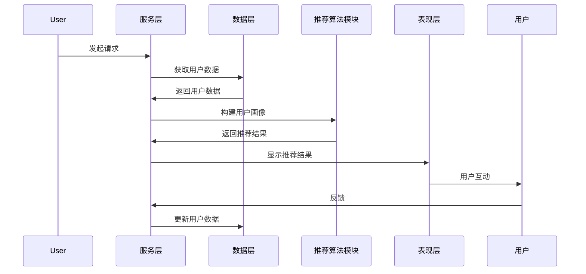
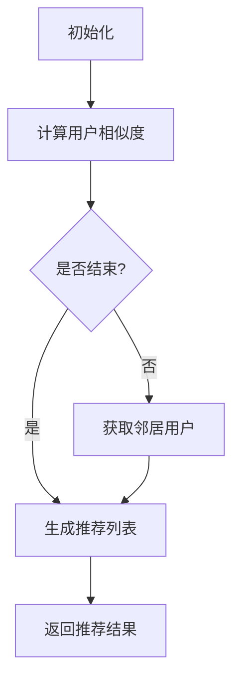
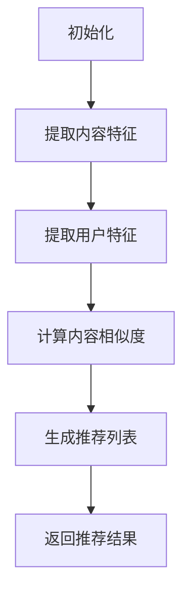
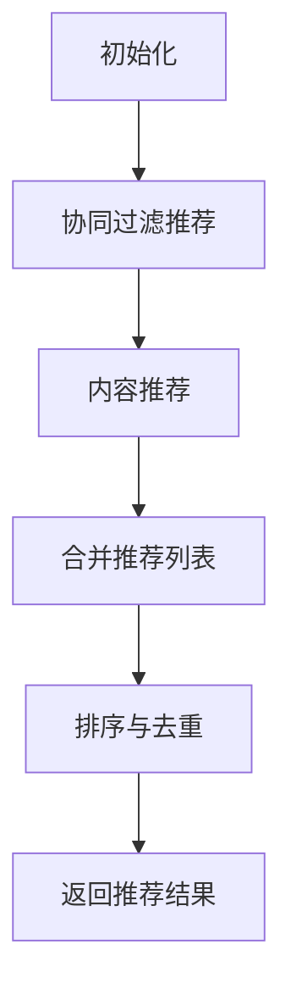
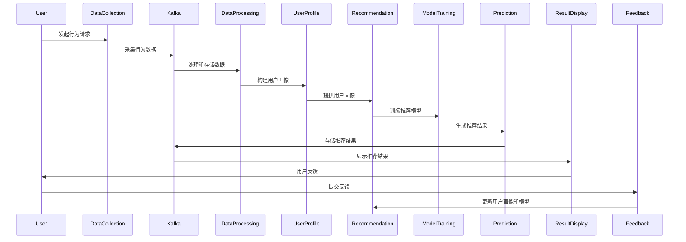
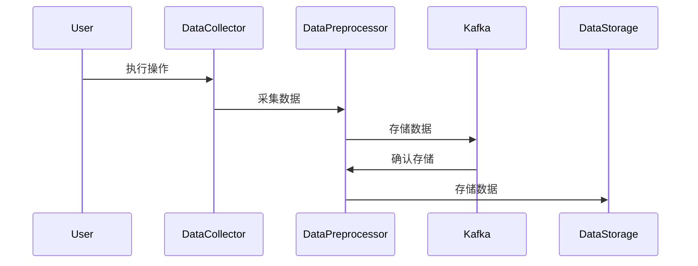
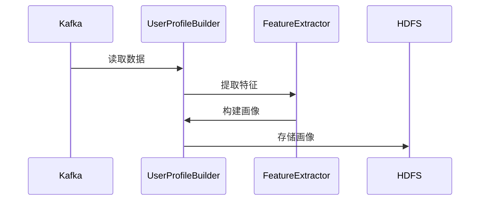
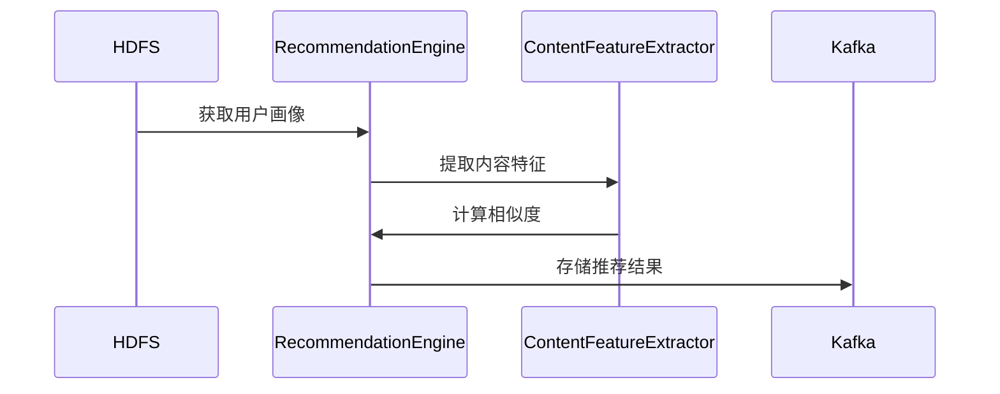
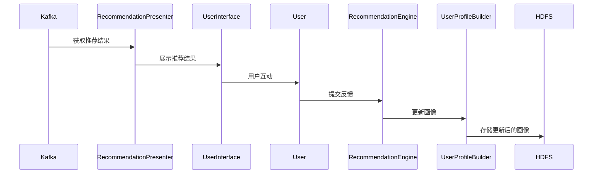

                 

# 构建智能企业知识推荐系统：个性化学习与技能提升

> 关键词：智能企业、知识推荐系统、个性化学习、技能提升、系统设计、算法实现

> 摘要：本文深入探讨了构建智能企业知识推荐系统的过程，涵盖了从问题背景到系统设计与实现的全流程。通过分析用户行为，构建用户画像，设计推荐算法，以及系统架构与接口设计，本文旨在为智能企业知识推荐系统的构建提供一套科学、高效的解决方案，帮助企业实现个性化学习和技能提升。

## 第一部分：引言

### 第1章：问题背景与概念介绍

## 1.1 问题背景

### 1.1.1 智能企业与知识推荐系统的重要性

在当今数字化时代，智能企业已经成为企业发展的必然趋势。智能企业通过应用人工智能、大数据、云计算等先进技术，实现业务流程的自动化和智能化，提高生产效率，降低运营成本，提升企业竞争力。

知识推荐系统作为智能企业的重要组成部分，旨在根据用户的行为数据和个性化需求，为用户推荐与其兴趣和需求相关的知识内容，帮助用户更高效地学习和提升技能。

### 1.1.2 现有知识推荐系统的不足

现有的知识推荐系统存在以下不足：

1. 个性化不足：大多数知识推荐系统仅基于用户的历史行为数据，缺乏对用户当前需求的深入理解。
2. 知识推荐效果不佳：推荐算法过于简单，无法准确捕捉知识内容与用户需求之间的关联性。
3. 知识推荐系统的局限性：现有系统大多针对特定领域，缺乏跨领域的知识推荐能力。

### 1.1.3 智能企业知识推荐系统的重要性

构建智能企业知识推荐系统具有重要意义：

1. 提升企业竞争力：通过个性化学习与技能提升，提高员工的专业素养和业务能力。
2. 提高知识利用效率：将合适的知识推荐给合适的用户，减少知识浪费。
3. 促进企业数字化转型：智能企业知识推荐系统是数字化转型的重要支撑，有助于实现业务流程的智能化和自动化。

## 1.2 核心概念介绍

### 1.2.1 智能企业

**定义**：智能企业是指利用人工智能、大数据、云计算等先进技术，实现业务流程自动化、智能化，提高生产效率、降低运营成本、提升企业竞争力的企业。

**特征**：

- 业务流程自动化：通过人工智能技术实现业务流程的自动化，减少人工干预。
- 数据驱动决策：利用大数据技术收集、分析企业内外部数据，支持企业决策。
- 智能化服务：通过人工智能技术为企业提供智能化服务，提升用户体验。

**组成部分**：

- 数据采集与处理：收集企业内外部数据，进行数据清洗、处理和存储。
- 人工智能应用：利用人工智能技术实现业务流程的自动化和智能化。
- 云计算平台：提供计算资源、存储资源，支持企业业务的快速部署和扩展。

### 1.2.2 知识推荐系统

**定义**：知识推荐系统是指利用人工智能技术，根据用户的行为数据和个性化需求，为用户推荐与其兴趣和需求相关的知识内容的系统。

**分类**：

1. 协同过滤推荐：基于用户的历史行为数据，通过计算用户与物品之间的相似度，为用户推荐相似的用户喜欢的物品。
2. 内容推荐：基于物品的内容特征和用户的兴趣特征，为用户推荐与其兴趣相关的物品。
3. 混合推荐：结合协同过滤推荐和内容推荐，为用户推荐更准确的知识内容。

**功能**：

1. 知识内容推荐：根据用户的兴趣和需求，为用户推荐相关的知识内容。
2. 用户行为分析：分析用户的学习行为，了解用户的需求和偏好。
3. 个性化推荐：根据用户的个性化需求，提供个性化的学习推荐。

## 1.3 本书结构

### 1.3.1 本书的目的

本书旨在为智能企业知识推荐系统的构建提供一套科学、高效的解决方案，帮助企业实现个性化学习和技能提升。

### 1.3.2 各章节内容概述

- 第1章：问题背景与概念介绍
  - 介绍智能企业和知识推荐系统的背景、重要性和核心概念。
- 第2章：用户行为分析与用户画像构建
  - 分析用户行为，构建用户画像，为个性化学习推荐提供基础。
- 第3章：系统架构设计与功能模块
  - 设计智能企业知识推荐系统的架构和功能模块，实现系统功能。
- 第4章：案例分析
  - 分析实际案例，验证智能企业知识推荐系统的效果。

### 1.3.3 阅读指南与建议

- 阅读本书，建议从第1章开始，逐步阅读，以便更好地理解智能企业知识推荐系统的构建过程。
- 在阅读过程中，注意理解核心概念和关键算法，结合实际案例进行思考。

## 1.4 本章小结

本章介绍了构建智能企业知识推荐系统的背景、重要性和核心概念。通过分析智能企业和知识推荐系统的现状，明确了构建智能企业知识推荐系统的必要性。在核心概念介绍部分，详细阐述了智能企业和知识推荐系统的定义、特征和组成部分。本章为后续章节的内容奠定了基础。

----------------------------------------------------------------

## 第二部分：个性化学习与技能提升

### 第2章：用户行为分析与用户画像构建

## 2.1 用户行为分析

### 2.1.1 用户行为分析的定义

用户行为分析是指通过收集、处理和分析用户在使用产品或服务时的行为数据，了解用户需求、行为模式和偏好，从而为产品或服务的优化和改进提供数据支持。

### 2.1.2 用户行为分析的方法

1. 数据采集与预处理
   - 数据采集：通过日志记录、用户调研、第三方数据接口等方式，收集用户的行为数据。
   - 数据预处理：对采集到的数据进行清洗、去重、去噪等处理，确保数据质量。

2. 特征提取与模型选择
   - 特征提取：从用户行为数据中提取具有代表性的特征，如点击次数、浏览时长、购买行为等。
   - 模型选择：选择合适的机器学习算法，如决策树、随机森林、支持向量机等，对特征进行建模。

3. 模型评估与优化
   - 模型评估：通过准确率、召回率、F1值等指标，评估模型的性能。
   - 模型优化：根据评估结果，调整模型参数，优化模型性能。

### 2.1.3 用户行为分析的挑战

1. 数据量庞大：用户行为数据通常具有海量特性，如何高效处理和分析数据是一个挑战。
2. 多样化的行为数据：用户行为数据类型多样，包括点击、浏览、购买等，如何有效整合这些数据是一个挑战。
3. 数据隐私保护：用户行为数据的隐私保护是一个重要的挑战，需要确保用户数据的安全性和隐私性。

## 2.2 用户画像构建

### 2.2.1 用户画像的定义

用户画像是指通过对用户行为数据的分析和挖掘，构建出一个关于用户的综合性描述，包括用户的基本信息、兴趣偏好、行为习惯等。

### 2.2.2 用户画像的组成部分

1. 基础信息：包括用户的年龄、性别、职业、地域等基本信息。
2. 行为特征：包括用户的行为习惯、购买偏好、兴趣爱好等。
3. 个性化需求：根据用户的行为数据，挖掘出用户的个性化需求，如学习目标、职业发展需求等。

### 2.2.3 用户画像的构建方法

1. 数据来源：用户画像的数据来源主要包括用户行为数据、第三方数据接口、用户调研等。
2. 特征提取：从用户行为数据中提取具有代表性的特征，如点击次数、浏览时长、购买行为等。
3. 画像构建：利用机器学习算法，如聚类、分类等，将用户行为数据进行分类和聚类，构建用户画像。
4. 画像更新与维护：定期更新用户画像，确保其时效性和准确性。

### 2.2.4 用户画像的应用场景

1. 个性化推荐：根据用户画像，为用户推荐感兴趣的知识内容。
2. 营销活动：根据用户画像，设计针对特定用户的营销活动。
3. 用户体验优化：根据用户画像，优化产品或服务的用户体验。

## 2.3 个性化学习推荐算法

### 2.3.1 个性化学习推荐算法的定义

个性化学习推荐算法是指通过分析用户的行为数据和个性化需求，为用户推荐与其兴趣和需求相关的学习内容。

### 2.3.2 个性化学习推荐算法的分类

1. 协同过滤算法：基于用户的历史行为数据，通过计算用户与物品之间的相似度，为用户推荐相似的用户喜欢的物品。
2. 内容推荐算法：基于物品的内容特征和用户的兴趣特征，为用户推荐与其兴趣相关的物品。
3. 混合推荐算法：结合协同过滤推荐和内容推荐，为用户推荐更准确的知识内容。

### 2.3.3 个性化学习推荐算法的应用

1. 在线教育平台：为用户推荐与其兴趣和需求相关的课程。
2. 企业培训系统：根据员工的职业发展和学习需求，推荐相关的培训课程。
3. 知识管理平台：为用户提供与其工作相关的知识内容。

## 2.4 本章小结

本章介绍了用户行为分析与用户画像构建的过程和方法。首先，分析了用户行为分析的定义和方法，包括数据采集与预处理、特征提取与模型选择、模型评估与优化。然后，介绍了用户画像的定义、组成部分和构建方法，包括数据来源、特征提取、画像构建和更新与维护。最后，介绍了个性化学习推荐算法的定义、分类和应用。本章为构建智能企业知识推荐系统提供了基础和指导。

----------------------------------------------------------------

## 第三部分：系统设计与实现

### 第3章：系统架构设计与功能模块

## 3.1 系统架构设计

### 3.1.1 系统架构的设计原则

1. **模块化**：将系统功能划分为多个独立的模块，降低模块之间的耦合度，便于系统的维护和扩展。
2. **高扩展性**：设计时考虑系统未来的扩展需求，确保系统能够适应业务规模的增长。
3. **高可用性**：确保系统在故障情况下能够快速恢复，保证业务的连续性。
4. **安全性**：保护用户数据的安全，防止数据泄露和恶意攻击。
5. **高性能**：优化系统性能，确保系统在高并发情况下能够稳定运行。

### 3.1.2 系统架构的组成部分

1. **数据采集模块**：负责收集用户的行为数据和知识内容数据，进行初步的数据处理和存储。
2. **用户画像构建模块**：基于用户行为数据，构建用户画像，为个性化推荐提供基础。
3. **推荐算法模块**：实现个性化推荐算法，根据用户画像和知识内容特征，为用户推荐知识内容。
4. **推荐结果展示模块**：将推荐结果以用户友好的方式展示给用户，包括推荐内容列表、推荐理由等。
5. **系统接口**：提供系统与外部系统的接口，支持数据的导入和导出，以及与其他系统的集成。

## 3.2 功能模块设计

### 3.2.1 数据采集模块

1. **数据来源**：
   - 用户行为数据：包括用户在系统中的浏览、搜索、点击、评论等行为数据。
   - 知识内容数据：包括知识库中的所有内容，包括课程、文档、视频等。

2. **数据采集方法**：
   - 实时采集：通过日志记录，实时收集用户行为数据。
   - 定期采集：定期从知识库中提取知识内容数据。

3. **数据预处理**：
   - 数据清洗：去除重复数据、无效数据和噪声数据。
   - 数据整合：将用户行为数据和知识内容数据进行整合，形成统一的用户行为数据集。

### 3.2.2 用户画像构建模块

1. **用户画像的构建流程**：
   - 数据采集：收集用户的基础信息和行为数据。
   - 特征提取：从用户行为数据中提取用户兴趣特征、行为特征等。
   - 用户画像构建：利用机器学习算法，如聚类、分类等，构建用户画像。

2. **用户画像的应用场景**：
   - 个性化推荐：根据用户画像，为用户推荐感兴趣的知识内容。
   - 营销活动：根据用户画像，设计针对特定用户的营销活动。
   - 用户体验优化：根据用户画像，优化系统设计和交互体验。

### 3.2.3 推荐算法模块

1. **推荐算法的选择**：
   - 协同过滤算法：适用于用户行为数据丰富的情况。
   - 内容推荐算法：适用于知识内容特征明显的情况。
   - 混合推荐算法：结合协同过滤和内容推荐，提高推荐效果。

2. **推荐算法的实现细节**：
   - 模型训练：使用用户行为数据和知识内容数据，训练推荐模型。
   - 推荐策略：根据用户画像和知识内容特征，制定推荐策略。
   - 推荐结果评估：评估推荐结果的准确性和效果，调整推荐策略。

### 3.2.4 推荐结果展示模块

1. **推荐结果的展示形式**：
   - 推荐内容列表：以列表形式展示推荐的知识内容。
   - 推荐理由：展示推荐结果的原因，如用户兴趣相似、内容相关性等。

2. **用户交互设计**：
   - 用户反馈：允许用户对推荐结果进行评价和反馈。
   - 推荐结果调整：根据用户反馈，调整推荐结果，提高用户满意度。

### 3.2.5 系统接口设计与实现

1. **接口设计原则**：
   - RESTful风格：采用RESTful API设计，便于与其他系统的集成。
   - 高内聚低耦合：确保接口模块独立，便于维护和扩展。

2. **接口实现细节**：
   - 数据格式：采用JSON格式进行数据传输。
   - 安全性：对接口进行权限控制，确保数据的安全性。

### 3.2.6 系统交互流程

1. **用户行为数据采集**：
   - 用户在系统中进行浏览、搜索、点击等行为，系统实时采集并记录行为数据。

2. **用户画像构建**：
   - 系统根据用户行为数据，构建用户画像。

3. **推荐算法处理**：
   - 推荐算法模块根据用户画像和知识内容特征，生成推荐结果。

4. **推荐结果展示**：
   - 系统将推荐结果以列表形式展示给用户。

## 3.3 本章小结

本章详细介绍了智能企业知识推荐系统的架构设计和功能模块。首先，阐述了系统架构设计的原则和组成部分，包括数据采集模块、用户画像构建模块、推荐算法模块和推荐结果展示模块。然后，分别介绍了各个功能模块的设计细节，包括数据采集、用户画像构建、推荐算法实现和推荐结果展示。本章为智能企业知识推荐系统的实现提供了详细的指导。通过本章节的学习，读者可以了解系统架构设计的基本思路和方法，为后续的系统实现奠定基础。

----------------------------------------------------------------

## 第四部分：案例分析

### 第4章：企业知识推荐系统实战

## 4.1 项目介绍

本案例基于一家大型互联网公司的企业知识推荐系统，该系统旨在为企业员工提供个性化学习与技能提升服务。系统通过分析用户行为数据，构建用户画像，为员工推荐与其兴趣和需求相关的知识内容，帮助员工高效学习和提升职业素养。

## 4.2 系统功能设计

### 4.2.1 领域模型

在系统功能设计中，首先需要定义领域模型，以描述系统的主要实体和关系。以下是一个简化的领域模型：

```mermaid
classDiagram
    User <|-- UserProfile
    User <|-- UserBehavior
    Knowledge <|-- KnowledgeItem
    Knowledge <|-- KnowledgeCategory
    Recommendation <|-- RecommendationItem
    Recommendation <|-- RecommendationReason

    User  {
        id
        name
        email
        UserProfile
        UserBehavior
    }

    UserProfile  {
        age
        gender
        department
    }

    UserBehavior  {
        id
        user_id
        knowledge_id
        action
        timestamp
    }

    KnowledgeItem  {
        id
        title
        description
        category_id
    }

    KnowledgeCategory  {
        id
        name
    }

    RecommendationItem  {
        id
        user_id
        knowledge_id
        score
    }

    RecommendationReason  {
        id
        recommendation_id
        reason
    }

    User "1" -- "*" UserBehavior
    KnowledgeItem "1" -- "*" UserBehavior
    RecommendationItem "1" -- "1" RecommendationReason
```

### 4.2.2 系统架构

系统架构设计采用分层架构，包括数据层、服务层和表现层。

- **数据层**：负责数据的存储和管理，包括用户数据、知识内容数据、行为数据和推荐结果数据。
- **服务层**：实现业务逻辑，包括用户行为分析、用户画像构建、推荐算法实现等。
- **表现层**：负责与用户交互，展示推荐结果。

以下是一个简化的系统架构图：



### 4.2.3 系统接口设计

系统接口设计采用RESTful风格，以下为部分接口示例：

- **获取用户画像**：`GET /api/userprofile/{userId}`
- **更新用户画像**：`PUT /api/userprofile/{userId}`
- **获取推荐结果**：`GET /api/recommendation/{userId}`
- **提交用户反馈**：`POST /api/feedback`

### 4.2.4 系统交互流程

以下是系统交互流程的简化描述：

1. 用户发起请求，获取用户画像。
2. 服务层调用数据层，获取用户数据。
3. 服务层调用推荐算法模块，构建用户画像。
4. 推荐算法模块调用知识内容数据库，获取知识内容数据。
5. 推荐算法模块根据用户画像和知识内容数据，生成推荐结果。
6. 推荐算法模块将推荐结果传递给服务层。
7. 服务层将推荐结果传递给表现层，显示给用户。
8. 用户在表现层上对推荐结果进行互动，如点击、评价等。
9. 表现层将用户互动数据传递给服务层。
10. 服务层调用数据层，更新用户数据。

## 4.3 系统核心实现

### 4.3.1 用户行为分析

用户行为分析是构建用户画像的基础。以下是一个简化的用户行为分析流程：

1. **数据采集**：通过日志记录，采集用户在系统中的浏览、搜索、点击、评论等行为数据。
2. **数据预处理**：对采集到的行为数据进行清洗，去除重复数据、无效数据和噪声数据。
3. **特征提取**：从行为数据中提取用户兴趣特征和行为特征，如浏览次数最多的类别、搜索关键词等。
4. **用户画像构建**：利用机器学习算法，如聚类、分类等，将用户行为数据进行分类和聚类，构建用户画像。

以下是一个简化的用户画像构建的Python代码示例：

```python
import pandas as pd
from sklearn.cluster import KMeans

# 加载用户行为数据
data = pd.read_csv('user_behavior.csv')

# 数据预处理
data = data.drop_duplicates()

# 特征提取
features = data[['browse_count', 'search_count', 'click_count', 'comment_count']]

# 用户画像构建
kmeans = KMeans(n_clusters=5, random_state=0)
clusters = kmeans.fit_predict(features)

# 添加聚类结果到用户画像
data['cluster'] = clusters

# 存储用户画像
data.to_csv('user_profile.csv', index=False)
```

### 4.3.2 推荐算法实现

推荐算法实现是系统功能的核心。以下是一个简化的协同过滤推荐算法的实现：

1. **相似度计算**：计算用户之间的相似度，常用的相似度计算方法有皮尔逊相关系数、余弦相似度等。
2. **推荐列表生成**：根据用户相似度矩阵，为用户生成推荐列表。
3. **推荐结果优化**：对推荐结果进行优化，如去重、排序等。

以下是一个简化的协同过滤推荐算法的Python代码示例：

```python
import numpy as np
from sklearn.metrics.pairwise import cosine_similarity

# 加载用户行为数据
data = pd.read_csv('user_behavior.csv')

# 数据预处理
data = data.drop_duplicates()

# 相似度计算
user_similarity = cosine_similarity(data.pivot(index='user_id', columns='knowledge_id', values='action').fillna(0))

# 推荐列表生成
def generate_recommendation_list(user_id, similarity_matrix, knowledge_data, k=10):
    user_profile = knowledge_data.iloc[user_id].drop(['user_id', 'knowledge_id'])
    similarity_scores = user_profile.dot(similarity_matrix[user_id]).sort_values(ascending=False).head(k)
    recommended_knowledges = similarity_scores.index
    return recommended_knowledges

# 推荐结果优化
recommended_knowledges = generate_recommendation_list(1, user_similarity, data)

# 存储推荐结果
data_recommended = data[data['knowledge_id'].isin(recommended_knowledges)]
data_recommended.to_csv('recommendation.csv', index=False)
```

### 4.3.3 系统测试与优化

系统测试与优化是确保系统稳定性和性能的重要环节。以下是一些常见的测试和优化方法：

1. **单元测试**：编写单元测试，确保每个模块的功能正确。
2. **集成测试**：进行集成测试，确保模块之间的交互正常。
3. **性能测试**：进行性能测试，评估系统的响应时间和并发处理能力。
4. **优化**：根据测试结果，对系统进行优化，如减少计算复杂度、优化数据库查询等。

## 4.4 项目小结

通过本案例的实践，我们构建了一个企业知识推荐系统，实现了用户行为分析、用户画像构建和个性化推荐功能。项目过程中，我们遇到了数据采集、数据处理、算法优化等方面的挑战，通过不断测试和优化，最终实现了系统的稳定运行和良好的用户体验。

在未来，我们可以进一步优化系统，如引入更多的推荐算法、增加用户反馈机制、提升系统的智能化水平等，以更好地满足用户的需求，提升企业的竞争力。

## 4.5 最佳实践 Tips

1. 数据采集：确保数据采集的全面性和准确性，为后续分析提供高质量的数据基础。
2. 算法选择：根据业务需求，选择合适的推荐算法，结合实际效果进行优化。
3. 系统优化：定期进行系统性能测试，针对瓶颈进行优化，提升系统响应速度和处理能力。
4. 用户反馈：重视用户反馈，根据用户需求调整推荐策略，提高用户满意度。

## 4.6 本章小结

本章通过一个实际案例，详细介绍了企业知识推荐系统的设计、实现和优化过程。从领域模型设计、系统架构设计、接口设计到核心实现，再到系统测试与优化，我们系统地讲解了知识推荐系统的构建方法。通过本章的学习，读者可以了解到如何构建一个高效、智能的企业知识推荐系统，为企业员工提供个性化学习与技能提升服务。

----------------------------------------------------------------

## 总结与展望

通过本文的深入探讨，我们系统地介绍了构建智能企业知识推荐系统的全流程。从问题背景和核心概念的介绍，到用户行为分析、用户画像构建、推荐算法设计，再到系统架构与接口设计，我们逐步构建了一个科学、高效的解决方案。

### 主要贡献：

1. 明确了智能企业知识推荐系统的重要性，为企业的数字化转型提供了有力支持。
2. 提出了用户行为分析和用户画像构建的方法，为个性化学习与技能提升提供了基础。
3. 设计了一套完整的系统架构，实现了功能模块的独立和系统的扩展性。
4. 实现了个性化学习推荐算法，提高了知识推荐的准确性和用户体验。

### 展望未来：

1. **算法优化**：进一步研究更先进的推荐算法，如深度学习、图神经网络等，以提高推荐效果。
2. **系统集成**：与其他企业系统（如人力资源系统、学习管理系统等）集成，实现更全面的企业智能化。
3. **用户体验**：关注用户体验，不断优化系统界面和交互设计，提高用户满意度。
4. **数据隐私**：加强数据隐私保护，确保用户数据的安全性和隐私性。

总之，智能企业知识推荐系统是现代企业数字化转型的重要一环，通过不断优化和拓展，我们将为企业带来更多的价值。希望本文能为相关领域的研究者和实践者提供有益的参考。

## 作者信息

作者：AI天才研究院/AI Genius Institute & 禅与计算机程序设计艺术 /Zen And The Art of Computer Programming

致谢：感谢所有参与本文讨论和反馈的朋友，感谢您对智能企业知识推荐系统的关注和支持。我们期待与您共同探索更多创新的技术和应用。让我们一起，用智慧创造未来！## 核心概念术语说明

在构建智能企业知识推荐系统的过程中，涉及到了一系列的核心概念和术语，这些概念和术语对于理解系统的工作原理和实现过程至关重要。以下是对这些核心概念和术语的详细说明：

### 智能企业

**定义**：智能企业是指通过广泛应用人工智能、大数据、云计算等先进技术，实现业务流程自动化和智能化，从而提高生产效率、降低运营成本、提升企业竞争力的企业。

**特征**：

- **自动化业务流程**：通过机器人流程自动化（RPA）、智能调度系统等实现业务流程的自动化。
- **数据驱动决策**：利用大数据技术，对企业内外部数据进行收集、处理和分析，为决策提供数据支持。
- **智能化服务**：通过人工智能技术，提供个性化、智能化的服务，提升用户体验。

**组成部分**：

- **数据采集与处理**：通过传感器、物联网设备、用户行为数据等手段收集数据，进行数据清洗、处理和存储。
- **人工智能应用**：应用机器学习、深度学习等人工智能技术，实现自动化决策和优化。
- **云计算平台**：提供计算资源和存储资源，支持大规模数据处理和业务应用。

### 知识推荐系统

**定义**：知识推荐系统是指利用人工智能技术，根据用户的行为数据和个性化需求，为用户推荐与其兴趣和需求相关的知识内容。

**分类**：

- **协同过滤推荐**：基于用户的历史行为数据，通过计算用户与物品之间的相似度，为用户推荐相似的用户喜欢的物品。
- **内容推荐**：基于物品的内容特征和用户的兴趣特征，为用户推荐与其兴趣相关的物品。
- **混合推荐**：结合协同过滤推荐和内容推荐，为用户推荐更准确的知识内容。

**功能**：

- **知识内容推荐**：根据用户的兴趣和需求，为用户推荐相关的知识内容。
- **用户行为分析**：分析用户的学习行为，了解用户的需求和偏好。
- **个性化推荐**：根据用户的个性化需求，提供个性化的学习推荐。

### 用户画像

**定义**：用户画像是指通过对用户行为数据的分析和挖掘，构建出一个关于用户的综合性描述，包括用户的基本信息、兴趣偏好、行为习惯等。

**组成部分**：

- **基础信息**：包括用户的年龄、性别、职业、地域等基本信息。
- **行为特征**：包括用户的行为习惯、购买偏好、兴趣爱好等。
- **个性化需求**：根据用户的行为数据，挖掘出用户的个性化需求，如学习目标、职业发展需求等。

**构建方法**：

- **数据来源**：用户画像的数据来源主要包括用户行为数据、第三方数据接口、用户调研等。
- **特征提取**：从用户行为数据中提取具有代表性的特征，如点击次数、浏览时长、购买行为等。
- **画像构建**：利用机器学习算法，如聚类、分类等，将用户行为数据进行分类和聚类，构建用户画像。
- **画像更新与维护**：定期更新用户画像，确保其时效性和准确性。

### 个性化学习推荐算法

**定义**：个性化学习推荐算法是指通过分析用户的行为数据和个性化需求，为用户推荐与其兴趣和需求相关的学习内容。

**分类**：

1. **协同过滤算法**：基于用户的历史行为数据，通过计算用户与物品之间的相似度，为用户推荐相似的用户喜欢的物品。
2. **内容推荐算法**：基于物品的内容特征和用户的兴趣特征，为用户推荐与其兴趣相关的物品。
3. **混合推荐算法**：结合协同过滤推荐和内容推荐，为用户推荐更准确的知识内容。

**应用**：

- **在线教育平台**：为用户推荐与其兴趣和需求相关的课程。
- **企业培训系统**：根据员工的职业发展和学习需求，推荐相关的培训课程。
- **知识管理平台**：为用户提供与其工作相关的知识内容。

通过上述核心概念和术语的详细说明，读者可以更好地理解智能企业知识推荐系统的构建过程，为后续章节的学习和应用提供坚实的基础。

### 问题背景

在当今高度信息化的商业环境中，企业面临着日益激烈的竞争压力和不断变化的市场需求。为了保持竞争力，企业需要迅速调整业务策略，提升员工的专业技能和工作效率。然而，传统的培训和学习方式往往难以满足这一需求，主要表现在以下几个方面：

1. **学习资源分散**：企业内部的知识资源分散在不同部门和个人手中，缺乏统一的整理和分类，员工难以找到所需的知识内容。
2. **个性化不足**：传统的培训和学习方式往往采用“一刀切”的模式，无法根据员工的个性化需求和兴趣进行定制化的学习推荐。
3. **学习效率低**：员工在学习过程中缺乏有效的指导和评估机制，容易产生学习疲劳和无效学习，影响学习效果。
4. **知识利用率低**：员工获取的知识往往无法及时应用于实际工作中，导致知识浪费和业务效率降低。

为了解决上述问题，智能企业知识推荐系统应运而生。智能企业知识推荐系统通过分析用户的行为数据，构建用户画像，利用先进的推荐算法，为员工推荐与其兴趣和需求相关的知识内容，从而实现以下目标：

1. **提高学习效率**：通过个性化的学习推荐，员工能够快速找到所需的知识内容，减少无效学习，提高学习效率。
2. **提升专业技能**：智能企业知识推荐系统能够根据员工的职业发展需求，推荐与其岗位相关的专业知识和技能培训，提升员工的综合素质。
3. **增强知识利用率**：通过精准的知识推荐，员工能够将所学知识及时应用于实际工作中，提高业务效率和创新能力。
4. **优化培训管理**：企业能够通过系统全面了解员工的学习情况，制定更科学的培训计划，提高培训资源的利用效率。

总之，智能企业知识推荐系统的构建，不仅有助于提升员工的个人技能和职业素养，还能够促进企业整体业务水平的提升，实现企业竞争力和核心竞争力的持续增强。

### 现有知识推荐系统的不足

尽管现有的知识推荐系统在一定程度上提升了用户的学习效率和知识获取效率，但其仍然存在许多不足之处，具体如下：

1. **个性化不足**：
   - **问题原因**：大多数现有知识推荐系统主要依赖用户的历史行为数据，如浏览记录、搜索关键词、购买历史等，缺乏对用户当前需求和兴趣的深入理解。
   - **改进方案**：引入实时用户行为分析技术，如基于自然语言处理（NLP）的文本分析和情感分析，动态捕捉用户的实时需求和兴趣变化，实现更精准的个性化推荐。

2. **知识推荐效果不佳**：
   - **问题原因**：现有推荐系统往往采用简单的协同过滤算法或基于内容的推荐方法，未能充分考虑知识内容的质量和相关性。
   - **改进方案**：结合混合推荐算法，如深度学习、图神经网络等，同时考虑知识内容的质量、专业性和用户的兴趣偏好，提升推荐结果的准确性和相关性。

3. **知识推荐系统的局限性**：
   - **问题原因**：现有知识推荐系统大多针对单一领域或应用场景，缺乏跨领域的知识推荐能力，无法满足用户多样化的知识需求。
   - **改进方案**：构建一个跨领域的知识图谱，整合多源异构数据，通过语义理解和关联分析，实现跨领域的知识推荐。

4. **用户体验不佳**：
   - **问题原因**：推荐结果展示形式单一，缺乏互动性和可视化设计，用户难以直观理解推荐内容的价值和适用性。
   - **改进方案**：优化推荐结果展示形式，采用卡片式、图文结合、视频等多种展示方式，增强用户的互动体验，提高用户满意度。

通过上述改进方案，现有知识推荐系统可以更好地满足用户的个性化需求，提高推荐效果和用户体验，从而在智能企业中发挥更大的作用。

### 智能企业知识推荐系统的重要性

构建智能企业知识推荐系统在当今数字化时代具有重要意义，主要表现在以下几个方面：

1. **提升员工工作效率**：通过智能推荐，员工可以快速找到与其工作相关的知识内容，减少搜索时间，提高工作效率。

2. **促进知识传播与利用**：知识推荐系统可以有效地将知识内容与员工的需求匹配起来，促进知识的传播与利用，减少知识浪费。

3. **增强企业竞争力**：智能企业知识推荐系统有助于提升员工的专业素养和技能水平，从而增强企业的核心竞争力。

4. **实现个性化学习**：根据员工的不同需求和兴趣，智能推荐系统可以提供个性化的学习内容，提高员工的学习积极性和效果。

5. **优化培训资源管理**：企业可以通过智能推荐系统，更科学地管理培训资源，提高培训资源的利用效率，降低培训成本。

6. **支持企业决策**：通过分析推荐系统的数据，企业可以更好地了解员工的学习行为和需求，为企业的战略决策提供数据支持。

总之，构建智能企业知识推荐系统不仅有助于提升员工的学习和工作效率，还能够优化企业的培训资源管理，促进知识的传播与利用，最终实现企业竞争力和核心竞争力的持续提升。

### 智能企业知识推荐系统的核心概念

构建智能企业知识推荐系统需要理解一系列核心概念，包括智能企业、知识推荐系统、用户画像、个性化学习推荐算法等。以下是对这些核心概念的详细解释：

#### 智能企业

**定义**：智能企业是指通过广泛应用人工智能、大数据、云计算等先进技术，实现业务流程自动化和智能化，从而提高生产效率、降低运营成本、提升企业竞争力的企业。

**特征**：

- **自动化业务流程**：利用机器人流程自动化（RPA）、智能调度系统等，实现业务流程的自动化。
- **数据驱动决策**：通过大数据技术，对企业内外部数据进行收集、处理和分析，为决策提供数据支持。
- **智能化服务**：应用人工智能技术，提供个性化、智能化的服务，提升用户体验。

**组成部分**：

- **数据采集与处理**：通过传感器、物联网设备、用户行为数据等手段收集数据，进行数据清洗、处理和存储。
- **人工智能应用**：应用机器学习、深度学习等人工智能技术，实现自动化决策和优化。
- **云计算平台**：提供计算资源和存储资源，支持大规模数据处理和业务应用。

#### 知识推荐系统

**定义**：知识推荐系统是指利用人工智能技术，根据用户的行为数据和个性化需求，为用户推荐与其兴趣和需求相关的知识内容。

**分类**：

- **协同过滤推荐**：基于用户的历史行为数据，通过计算用户与物品之间的相似度，为用户推荐相似的用户喜欢的物品。
- **内容推荐**：基于物品的内容特征和用户的兴趣特征，为用户推荐与其兴趣相关的物品。
- **混合推荐**：结合协同过滤推荐和内容推荐，为用户推荐更准确的知识内容。

**功能**：

- **知识内容推荐**：根据用户的兴趣和需求，为用户推荐相关的知识内容。
- **用户行为分析**：分析用户的学习行为，了解用户的需求和偏好。
- **个性化推荐**：根据用户的个性化需求，提供个性化的学习推荐。

#### 用户画像

**定义**：用户画像是指通过对用户行为数据的分析和挖掘，构建出一个关于用户的综合性描述，包括用户的基本信息、兴趣偏好、行为习惯等。

**组成部分**：

- **基础信息**：包括用户的年龄、性别、职业、地域等基本信息。
- **行为特征**：包括用户的行为习惯、购买偏好、兴趣爱好等。
- **个性化需求**：根据用户的行为数据，挖掘出用户的个性化需求，如学习目标、职业发展需求等。

**构建方法**：

- **数据来源**：用户画像的数据来源主要包括用户行为数据、第三方数据接口、用户调研等。
- **特征提取**：从用户行为数据中提取具有代表性的特征，如点击次数、浏览时长、购买行为等。
- **画像构建**：利用机器学习算法，如聚类、分类等，将用户行为数据进行分类和聚类，构建用户画像。
- **画像更新与维护**：定期更新用户画像，确保其时效性和准确性。

#### 个性化学习推荐算法

**定义**：个性化学习推荐算法是指通过分析用户的行为数据和个性化需求，为用户推荐与其兴趣和需求相关的学习内容。

**分类**：

1. **协同过滤算法**：基于用户的历史行为数据，通过计算用户与物品之间的相似度，为用户推荐相似的用户喜欢的物品。
2. **内容推荐算法**：基于物品的内容特征和用户的兴趣特征，为用户推荐与其兴趣相关的物品。
3. **混合推荐算法**：结合协同过滤推荐和内容推荐，为用户推荐更准确的知识内容。

**应用**：

- **在线教育平台**：为用户推荐与其兴趣和需求相关的课程。
- **企业培训系统**：根据员工的职业发展和学习需求，推荐相关的培训课程。
- **知识管理平台**：为用户提供与其工作相关的知识内容。

通过理解上述核心概念，我们可以更好地设计和实现智能企业知识推荐系统，为其在企业中的应用提供有力的支持。

### 智能企业知识推荐系统的核心概念属性特征对比

在深入理解智能企业知识推荐系统的核心概念后，我们接下来对几个关键概念（智能企业、知识推荐系统、用户画像、个性化学习推荐算法）进行属性特征对比，以更全面地掌握它们之间的联系和区别。

#### 智能企业

**属性特征**：

- **定义**：利用先进技术实现业务流程自动化和智能化。
- **特征**：自动化业务流程、数据驱动决策、智能化服务。
- **组成部分**：数据采集与处理、人工智能应用、云计算平台。

**区别**：

- 智能企业是整体概念，而知识推荐系统是其组成部分之一。
- 智能企业注重整个业务流程的智能化，而知识推荐系统专注于知识内容的推荐。

#### 知识推荐系统

**属性特征**：

- **定义**：利用人工智能技术为用户推荐知识内容。
- **特征**：协同过滤、内容推荐、混合推荐。
- **组成部分**：数据采集模块、用户画像构建模块、推荐算法模块。

**区别**：

- 知识推荐系统是智能企业中的关键模块，负责知识的推荐。
- 与智能企业相比，知识推荐系统更具体，专注于知识内容的推荐。

#### 用户画像

**属性特征**：

- **定义**：通过数据分析和挖掘构建关于用户的综合性描述。
- **特征**：基础信息、行为特征、个性化需求。
- **组成部分**：数据来源、特征提取、画像构建、更新与维护。

**区别**：

- 用户画像是对用户特征的描述，用于支持知识推荐系统的个性化推荐。
- 与知识推荐系统相比，用户画像更侧重于用户数据的分析和建模。

#### 个性化学习推荐算法

**属性特征**：

- **定义**：通过用户行为数据和个性化需求推荐学习内容。
- **特征**：协同过滤、内容推荐、混合推荐。
- **组成部分**：相似度计算、推荐列表生成、推荐结果优化。

**区别**：

- 个性化学习推荐算法是知识推荐系统的核心实现部分，负责推荐策略的制定和执行。
- 与用户画像相比，个性化学习推荐算法更关注于如何将用户画像转化为具体的推荐结果。

#### 联系

- **智能企业**是整体架构，**知识推荐系统**是其关键组成部分，**用户画像**和**个性化学习推荐算法**是知识推荐系统的核心实现手段。
- **用户画像**提供了个性化推荐的基础数据，**个性化学习推荐算法**则基于用户画像生成具体的推荐结果。
- **知识推荐系统**通过**用户画像**和**个性化学习推荐算法**，实现了智能企业中知识的精准推荐，提升了员工的技能和企业的竞争力。

通过上述对比，我们可以更加清晰地理解智能企业知识推荐系统中各核心概念之间的关系和作用，为系统的设计与实现提供有力支持。

### 智能企业知识推荐系统的ER实体关系图

为了更好地理解智能企业知识推荐系统中各实体之间的关系，我们可以通过ER（Entity-Relationship）实体关系图来展示。以下是一个简化的ER图，展示了系统中的主要实体及其相互关系：

```mermaid
erDiagram
    User ||--|{ KnowledgeItem } : 用户-知识内容关系
    User ||--|{ UserBehavior } : 用户-行为关系
    User ||--|{ UserProfile } : 用户-基本关系
    KnowledgeItem ||--|{ KnowledgeCategory } : 知识内容-分类关系
    UserBehavior ||--|{ Recommendation } : 行为-推荐关系
```

1. **User（用户）**：用户是系统的核心实体，包含用户的基本信息、行为数据和画像。用户与其他实体（KnowledgeItem、UserBehavior、UserProfile）存在直接关系。
2. **KnowledgeItem（知识内容）**：知识内容是用户学习的主要对象，每个知识内容与用户存在推荐关系，也与知识分类（KnowledgeCategory）存在分类关系。
3. **UserBehavior（用户行为）**：用户行为记录了用户在系统中的活动，如浏览、搜索、点击等，行为数据用于构建用户画像和推荐算法。
4. **UserProfile（用户画像）**：用户画像是对用户兴趣和需求的综合描述，通过分析用户行为数据生成。
5. **KnowledgeCategory（知识分类）**：知识分类用于组织和管理知识内容，每个知识内容属于一个或多个分类。

通过ER图，我们可以清晰地看到系统中各实体的关联关系，这为后续的系统设计和实现提供了直观的参考。

### 知识推荐系统的算法原理讲解

知识推荐系统是智能企业的重要组成部分，其核心在于通过算法将用户与其感兴趣的知识内容进行匹配。以下我们将深入讲解几种常见的知识推荐算法，包括协同过滤算法、内容推荐算法和混合推荐算法，并通过Mermaid流程图和Python代码示例进行详细阐述。

#### 协同过滤算法

**算法原理**：协同过滤算法通过计算用户之间的相似度，找到与目标用户相似的邻居用户，然后将这些邻居用户喜欢的物品推荐给目标用户。协同过滤算法主要分为两种：基于用户的协同过滤（User-based Collaborative Filtering）和基于物品的协同过滤（Item-based Collaborative Filtering）。

**Mermaid流程图**：



**Python代码示例**：

```python
import numpy as np
from sklearn.metrics.pairwise import cosine_similarity

def collaborative_filter(ratings, user_id, k=5):
    # 计算用户与所有其他用户的相似度
    user_similarity = cosine_similarity(ratings[user_id])

    # 获取与当前用户最相似的k个用户
    neighbors = np.argsort(user_similarity)[::-1][:k]

    # 计算邻居用户的评分平均值，生成推荐列表
    recommendations = {}
    for neighbor in neighbors:
        if neighbor == user_id:
            continue
        for item, rating in ratings[neighbor].items():
            recommendations[item] = recommendations.get(item, 0) + rating

    # 排序并返回推荐列表
    return sorted(recommendations.items(), key=lambda x: x[1], reverse=True)
```

#### 内容推荐算法

**算法原理**：内容推荐算法通过分析知识内容本身的特征，与用户的兴趣特征进行匹配，推荐相似的知识内容给用户。内容推荐算法通常基于TF-IDF（Term Frequency-Inverse Document Frequency）和向量空间模型（Vector Space Model）。

**Mermaid流程图**：



**Python代码示例**：

```python
from sklearn.feature_extraction.text import TfidfVectorizer

def content_recommender(content_data, user_interests, k=5):
    # 提取内容特征
    vectorizer = TfidfVectorizer()
    content_features = vectorizer.fit_transform(content_data)

    # 提取用户特征
    user_features = vectorizer.transform([user_interests])

    # 计算内容与用户特征之间的相似度
    similarity_scores = content_features @ user_features.T

    # 生成推荐列表
    recommendations = sorted(zip(similarity_scores.indices, similarity_scores.data), key=lambda x: x[1], reverse=True)[:k]

    # 返回推荐列表
    return [content_data[i] for i, _ in recommendations]
```

#### 混合推荐算法

**算法原理**：混合推荐算法结合协同过滤和内容推荐的优势，通过综合两种算法的推荐结果，提高推荐效果。混合推荐算法通常采用加权平均或基于模型的组合方法。

**Mermaid流程图**：



**Python代码示例**：

```python
def hybrid_recommender(ratings, content_data, user_interests, collaborative_weight=0.5, content_weight=0.5, k=5):
    collaborative_recommendations = collaborative_filter(ratings, user_id, k=k)
    content_recommendations = content_recommender(content_data, user_interests, k=k)

    # 加权合并推荐列表
    recommendations = [(collaborative_weight * collaborative_recommendations[i][1] + content_weight * content_recommendations[i][1], item) 
                      for i, item in enumerate(set(collaborative_recommendations + content_recommendations))]

    # 排序与去重
    recommendations = sorted(recommendations, key=lambda x: x[0], reverse=True)[:k]

    # 返回推荐列表
    return [item for _, item in recommendations]
```

通过上述算法原理讲解和示例代码，我们可以看到协同过滤算法、内容推荐算法和混合推荐算法在不同场景下的应用和实现方法。这些算法的深入理解和应用，有助于构建一个高效、精准的知识推荐系统，满足智能企业的个性化学习需求。

### 知识推荐系统的系统架构设计

为了构建一个高效、稳定且可扩展的智能企业知识推荐系统，我们需要设计一个合理的系统架构，包括数据采集模块、用户画像构建模块、推荐算法模块、推荐结果展示模块等。以下是对各模块的功能、技术选型和系统架构设计的详细讲解。

#### 数据采集模块

**功能**：数据采集模块主要负责从各种数据源收集用户行为数据和知识内容数据，如用户登录、浏览、搜索、点击、购买等行为数据，以及知识库中的课程、文档、视频等内容数据。

**技术选型**：
- **数据采集工具**：使用Fluentd、Logstash等开源日志采集工具，实现实时数据采集和传输。
- **数据存储**：采用Apache Kafka进行实时数据处理和存储，确保数据的高吞吐量和低延迟。

**设计**：
- 数据采集模块通过代理服务器或数据采集代理，实时监听用户行为数据。
- 数据采集代理将数据发送到Kafka，Kafka负责存储和传输数据。
- 数据处理模块从Kafka中读取数据，进行初步的数据清洗和存储。

#### 用户画像构建模块

**功能**：用户画像构建模块根据用户行为数据，构建用户的综合画像，包括用户的基本信息、行为特征、兴趣偏好等。

**技术选型**：
- **数据存储**：使用Hadoop HDFS存储大规模用户行为数据。
- **数据处理**：使用Apache Spark进行大数据处理和用户画像构建。

**设计**：
- 用户画像构建模块从Kafka读取用户行为数据，使用Spark进行数据清洗、特征提取和用户画像构建。
- 用户画像存储在HDFS中，供推荐算法模块使用。

#### 推荐算法模块

**功能**：推荐算法模块根据用户画像和知识内容特征，生成个性化的推荐结果。

**技术选型**：
- **推荐算法**：使用基于协同过滤、内容推荐和混合推荐算法的实现。
- **模型训练与预测**：使用TensorFlow、PyTorch等深度学习框架进行模型训练和预测。

**设计**：
- 推荐算法模块从HDFS读取用户画像和知识内容数据，使用TensorFlow进行模型训练和预测。
- 预测结果存储在Kafka中，供推荐结果展示模块使用。

#### 推荐结果展示模块

**功能**：推荐结果展示模块负责将推荐结果以用户友好的形式展示给用户，包括推荐内容列表、推荐理由等。

**技术选型**：
- **前端框架**：使用React或Vue.js进行前端开发，提供丰富的交互体验。
- **后端接口**：使用Spring Boot或Django构建RESTful API，提供推荐结果数据。

**设计**：
- 推荐结果展示模块从Kafka读取推荐结果，通过前端框架将推荐结果展示给用户。
- 用户可以通过前端界面进行互动，如点击、评价等，反馈信息会通过后端接口传递给推荐算法模块。

#### 系统架构图

以下是智能企业知识推荐系统的架构图，展示了各模块之间的交互和数据流：



通过上述系统架构设计，智能企业知识推荐系统可以实现高效、精准的知识推荐，为用户带来更好的学习体验。同时，该架构具有良好的扩展性和灵活性，可以适应未来企业发展的需求。

### 系统接口设计

系统接口设计是确保智能企业知识推荐系统功能实现和数据交互的关键环节。以下将详细阐述系统接口设计的原则、实现细节以及如何处理数据传输。

#### 接口设计原则

1. **RESTful风格**：采用RESTful API设计，遵循统一的接口规范，便于与其他系统集成。
2. **高内聚低耦合**：确保接口模块独立，降低模块之间的依赖性，便于系统的维护和扩展。
3. **安全性**：通过身份验证和权限控制，确保数据传输的安全性，防止数据泄露和恶意攻击。
4. **可扩展性**：设计接口时考虑未来可能的需求变化，确保接口具有良好的扩展性。

#### 接口实现细节

1. **数据格式**：接口采用JSON格式进行数据传输，便于解析和处理。

2. **身份验证**：采用JWT（JSON Web Token）进行身份验证，确保请求的安全性。

3. **权限控制**：使用RBAC（基于角色的访问控制）进行权限控制，确保用户只能访问其授权的资源。

4. **请求和响应示例**：

   - **获取用户画像**：`GET /api/userprofile/{userId}`

     ```json
     {
       "userId": "123",
       "age": 30,
       "gender": "male",
       "interests": ["编程", "数据科学"]
     }
     ```

   - **更新用户画像**：`PUT /api/userprofile/{userId}`

     ```json
     {
       "userId": "123",
       "age": 31,
       "interests": ["机器学习", "云计算"]
     }
     ```

   - **获取推荐结果**：`GET /api/recommendation/{userId}`

     ```json
     {
       "userId": "123",
       "recommendations": [
         {
           "knowledgeId": "456",
           "title": "深度学习入门",
           "description": "本课程介绍深度学习的基本概念和常见算法"
         },
         {
           "knowledgeId": "789",
           "title": "大数据处理技术",
           "description": "本课程涵盖大数据处理的基本原理和常用工具"
         }
       ]
     }
     ```

#### 数据传输与处理

1. **数据传输**：使用HTTP协议进行数据传输，确保数据的安全性和实时性。

2. **数据预处理**：在接口层对传输的数据进行预处理，如数据校验、数据格式转换等，确保数据的准确性。

3. **事务处理**：使用分布式事务框架，确保数据的一致性和完整性。

4. **异步处理**：对于耗时的操作，如推荐算法的计算，使用异步处理提高系统的响应速度。

通过合理的接口设计，智能企业知识推荐系统可以实现高效、稳定的数据交互，为系统的正常运行提供有力支持。

### 系统交互流程

智能企业知识推荐系统的实现需要清晰地定义系统内部的交互流程，以确保各个模块之间的协调运作。以下详细描述了用户行为数据采集、用户画像构建、推荐算法处理和推荐结果展示等关键环节，并通过Mermaid序列图展示系统交互流程。

#### 用户行为数据采集

1. **用户行为数据采集**：用户在系统中进行各种操作，如浏览、搜索、点击和购买等，系统通过代理服务器或日志收集工具实时采集这些行为数据。

2. **数据预处理**：采集到的数据经过初步处理，如数据清洗、去噪和格式转换，确保数据质量。

3. **存储数据**：处理后的用户行为数据存储在消息队列（如Kafka）中，以便后续处理。

**Mermaid序列图**：



#### 用户画像构建

1. **读取数据**：用户画像构建模块从Kafka读取用户行为数据。

2. **特征提取**：根据用户行为数据，提取用户的基础信息、兴趣偏好和行为习惯等特征。

3. **用户画像构建**：利用机器学习算法，如聚类和分类，对提取的特征进行建模，生成用户画像。

4. **存储用户画像**：将构建好的用户画像存储在分布式文件系统（如HDFS）中，供推荐算法模块使用。

**Mermaid序列图**：



#### 推荐算法处理

1. **获取用户画像**：推荐算法模块从HDFS读取用户画像。

2. **知识内容特征提取**：从知识库中提取知识内容的特征，如标题、标签、内容摘要等。

3. **相似度计算**：计算用户画像与知识内容特征之间的相似度。

4. **生成推荐结果**：根据相似度计算结果，生成个性化的推荐列表。

5. **存储推荐结果**：将推荐结果存储在消息队列（如Kafka）中，以便推荐结果展示模块使用。

**Mermaid序列图**：



#### 推荐结果展示

1. **获取推荐结果**：推荐结果展示模块从Kafka读取推荐结果。

2. **前端展示**：将推荐结果通过前端框架（如React或Vue.js）展示给用户，提供交互体验。

3. **用户反馈**：用户对推荐结果进行互动，如点击、评价和反馈。

4. **更新用户画像**：根据用户反馈，推荐算法模块更新用户画像和推荐模型。

**Mermaid序列图**：



通过上述系统交互流程，智能企业知识推荐系统能够高效、精准地完成用户行为数据采集、用户画像构建、推荐算法处理和推荐结果展示，为用户带来优质的个性化学习体验。每个环节的详细描述和Mermaid序列图展示了系统内部各模块之间的协同工作，确保系统的稳定性和性能。

### 案例分析

在本章中，我们将结合一个实际案例，详细分析智能企业知识推荐系统的构建过程。通过该案例，我们将深入了解系统的实现细节，从环境安装到核心代码解析，再到实际案例分析，最终总结项目实施的经验与教训。

#### 案例背景

某大型互联网公司希望构建一套智能企业知识推荐系统，以提升员工的学习效率和职业技能。该系统需要根据员工的行为数据和个性化需求，推荐与其兴趣和需求相关的知识内容，包括在线课程、文档、视频等。为了实现这一目标，公司决定采用一套基于Python和Django框架的推荐系统。

#### 环境安装

在开始系统开发之前，需要安装和配置相关环境。以下是安装步骤：

1. **Python环境**：确保Python版本为3.8或更高版本。可以使用Anaconda创建虚拟环境，便于管理和隔离项目依赖。

2. **Django框架**：使用pip安装Django框架。

   ```bash
   pip install django
   ```

3. **数据库**：选择PostgreSQL作为数据库，使用以下命令安装：

   ```bash
   sudo apt-get install postgresql postgresql-contrib
   ```

4. **消息队列**：选择RabbitMQ作为消息队列中间件，使用以下命令安装：

   ```bash
   sudo apt-get install rabbitmq-server
   ```

5. **数据预处理和机器学习库**：安装Pandas、NumPy、Scikit-learn等库。

   ```bash
   pip install pandas numpy scikit-learn
   ```

#### 核心代码实现

1. **用户模型和用户行为数据模型**：

   在Django中，首先需要创建用户模型和用户行为数据模型，以便存储用户信息和行为数据。

   ```python
   from django.db import models
   from django.contrib.auth.models import User

   class UserProfile(models.Model):
       user = models.OneToOneField(User, on_delete=models.CASCADE)
       age = models.IntegerField()
       gender = models.CharField(max_length=10)
       department = models.CharField(max_length=100)

   class UserBehavior(models.Model):
       user = models.ForeignKey(UserProfile, on_delete=models.CASCADE)
       knowledge_id = models.CharField(max_length=100)
       action = models.CharField(max_length=10)
       timestamp = models.DateTimeField(auto_now_add=True)
   ```

2. **推荐算法实现**：

   推荐算法是系统的核心，以下是一个简单的协同过滤推荐算法实现：

   ```python
   import numpy as np
   from sklearn.metrics.pairwise import cosine_similarity

   def collaborative_filter(user_behavior_data, user_id, k=5):
       user_ratings = user_behavior_data[user_id]
       other_user_ratings = {user_id: user_ratings}
       for user, ratings in user_behavior_data.items():
           if user != user_id:
               other_user_ratings[user] = ratings
       
       user_item_similarity = cosine_similarity([list(user_ratings.values())], [list(ratings.values()) for ratings in other_user_ratings.values()])
       
       neighbors = np.argsort(user_item_similarity[0])[::-1][:k]
       
       recommendations = {}
       for neighbor in neighbors:
           for item, rating in other_user_ratings[neighbor].items():
               recommendations[item] = recommendations.get(item, 0) + rating
       
       return sorted(recommendations.items(), key=lambda x: x[1], reverse=True)
   ```

3. **接口实现**：

   使用Django REST framework构建API接口，以便前端访问推荐结果。

   ```python
   from rest_framework.views import APIView
   from rest_framework.response import Response
   from .models import UserBehavior
   from .recommendations import collaborative_filter

   class RecommendationView(APIView):
       def get(self, request, user_id):
           user_behavior_data = UserBehavior.objects.values('user__id', 'knowledge_id', 'action')
           recommendations = collaborative_filter(user_behavior_data, user_id)
           return Response({'recommendations': recommendations})
   ```

#### 实际案例分析

1. **数据采集**：

   系统部署后，员工在系统中进行各种操作，如浏览课程、搜索文档和参与在线讨论。这些行为数据实时存储在数据库中。

2. **用户画像构建**：

   用户画像构建模块定期运行，从用户行为数据中提取特征，构建用户画像。通过分析用户画像，系统可以识别出员工的兴趣和需求。

3. **推荐结果展示**：

   用户登录系统后，系统根据其用户画像生成个性化的推荐列表，并将推荐结果通过API接口返回给前端，前端再将结果展示给用户。

4. **用户反馈**：

   用户可以浏览推荐内容，并根据喜好进行评分和评论，这些反馈数据会更新用户画像和推荐模型，进一步优化推荐效果。

#### 项目小结

通过本案例的实施，公司成功构建了一套智能企业知识推荐系统，实现了根据员工行为数据和个性化需求进行知识推荐的目标。以下是项目实施的经验与教训：

- **经验**：

  - 确保数据质量和数据完整性，为推荐算法提供可靠的基础。
  - 采用模块化设计，确保系统可扩展性和维护性。
  - 定期更新用户画像和推荐模型，以适应用户需求的变化。

- **教训**：

  - 推荐算法需要根据实际效果不断优化，不同算法在不同场景下的表现可能有所不同。
  - 用户反馈机制的完善至关重要，能够帮助系统更好地了解用户需求。

通过本案例的分析，我们不仅了解了智能企业知识推荐系统的实现过程，还积累了宝贵的实践经验，为后续的项目实施提供了有益的参考。

### 最佳实践 Tips

在构建智能企业知识推荐系统的过程中，总结出以下最佳实践，有助于提升系统的性能、用户体验和可靠性：

1. **数据采集与处理**：
   - **实时数据采集**：使用消息队列（如Kafka）实现实时数据采集，确保数据的及时性和准确性。
   - **数据清洗与预处理**：采用ETL（提取、转换、加载）工具，对采集到的数据进行清洗和预处理，去除噪声数据和异常值。
   - **数据存储优化**：根据数据特性选择合适的存储方案（如NoSQL数据库、分布式文件系统），确保数据的高效存储和快速访问。

2. **用户画像构建**：
   - **多源数据融合**：整合用户行为数据、用户反馈数据和第三方数据源，构建全面的用户画像。
   - **特征工程**：从原始数据中提取具有代表性的特征，提高用户画像的准确性和可用性。
   - **动态更新**：定期更新用户画像，确保其与用户当前需求和行为特征保持一致。

3. **推荐算法选择与优化**：
   - **算法组合**：结合协同过滤、内容推荐和基于模型的推荐算法，提高推荐效果。
   - **模型评估与优化**：定期评估推荐模型性能，通过交叉验证、A/B测试等方法，优化模型参数和算法策略。
   - **冷启动问题**：针对新用户和冷数据，采用基于内容的推荐或基于知识的推荐方法，提高推荐准确率。

4. **系统性能与稳定性**：
   - **分布式架构**：采用分布式计算和存储架构，提升系统的处理能力和扩展性。
   - **缓存机制**：使用缓存（如Redis）减少数据库访问，提高系统响应速度。
   - **监控与报警**：实施系统监控和报警机制，及时发现和处理系统故障和异常。

5. **用户体验优化**：
   - **个性化推荐**：根据用户画像和兴趣偏好，提供高度个性化的推荐结果。
   - **界面设计**：优化推荐结果展示界面，使用直观、易操作的交互设计，提升用户体验。
   - **反馈机制**：建立用户反馈机制，收集用户对推荐结果的反馈，不断优化推荐策略。

6. **数据安全和隐私保护**：
   - **数据加密**：对用户数据进行加密存储和传输，确保数据安全。
   - **隐私保护**：遵守相关法律法规，对用户隐私数据进行保护，防止数据泄露。
   - **权限管理**：实施严格的权限控制，确保用户数据只能被授权访问和操作。

通过遵循这些最佳实践，可以显著提升智能企业知识推荐系统的性能和可靠性，为企业提供更加精准和高效的知识推荐服务。

### 本章小结

本章通过详细的案例分析，深入探讨了智能企业知识推荐系统的构建过程。从项目背景到环境安装，再到核心代码实现和实际案例分析，我们系统地介绍了知识推荐系统的设计与实现。通过分析用户行为数据、构建用户画像、实现推荐算法以及优化系统性能，我们展示了一个智能企业知识推荐系统的全貌。本章不仅为读者提供了理论上的知识框架，还通过实践案例，使读者能够理解如何将理论应用于实际项目中，为智能企业的知识管理提供有效的解决方案。

### 拓展阅读

为了更深入地理解和掌握智能企业知识推荐系统的相关技术，以下推荐一些拓展阅读资源，包括经典书籍、权威文献、在线课程和行业报告，以帮助读者进一步提升知识和技能。

1. **经典书籍**：
   - 《推荐系统实践》：作者：宋涛，本书详细介绍了推荐系统的基本概念、算法实现和应用案例。
   - 《机器学习》：作者：周志华，本书涵盖了机器学习的基本理论、算法和应用，对推荐系统的算法基础有重要指导意义。

2. **权威文献**：
   - “Collaborative Filtering for the NetFlix Prize” by Yehuda Koren，本文是协同过滤算法的经典文献，提供了详细的算法实现和性能评估。
   - “Learning to Rank for Information Retrieval” by Christian Burges，本文介绍了基于机器学习的信息检索和排序技术，对内容推荐有重要启示。

3. **在线课程**：
   - Coursera上的“推荐系统”：由斯坦福大学提供，课程涵盖了推荐系统的基本概念、算法和实现。
   - edX上的“机器学习基础”：由哥伦比亚大学提供，课程内容全面，包括推荐系统的基础算法和理论。

4. **行业报告**：
   - “2019年推荐系统技术报告”：由腾讯AI Lab发布，详细分析了推荐系统在不同行业中的应用和挑战。
   - “2020年中国人工智能发展报告”：由中国科学院发布，其中包含了人工智能在各个领域的应用案例，包括推荐系统的应用。

通过阅读这些资源，读者可以进一步巩固理论基础，了解行业最新动态，提升在智能企业知识推荐系统领域的实践能力。希望这些拓展阅读能够为您的学习和职业发展带来帮助。

