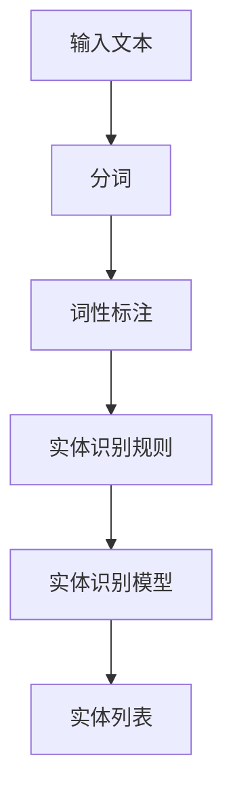
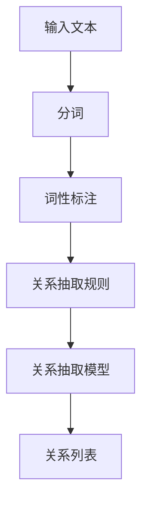
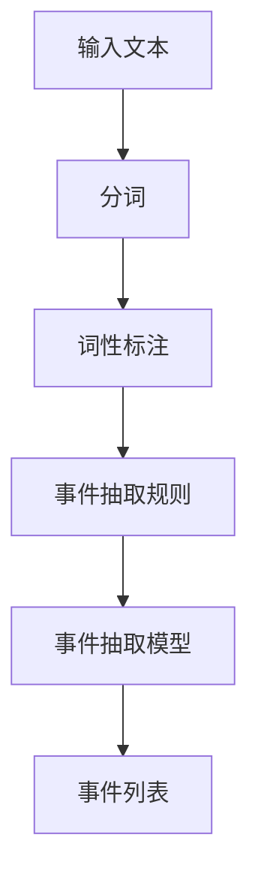
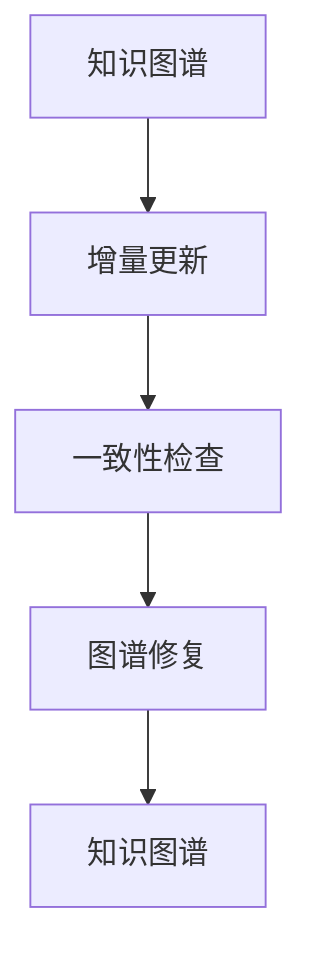
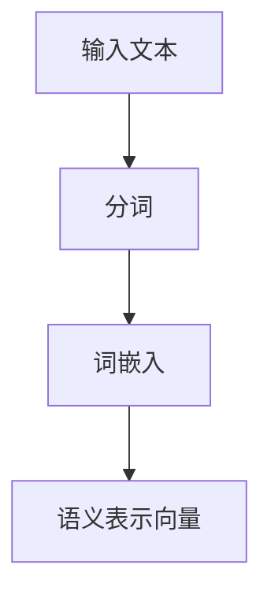
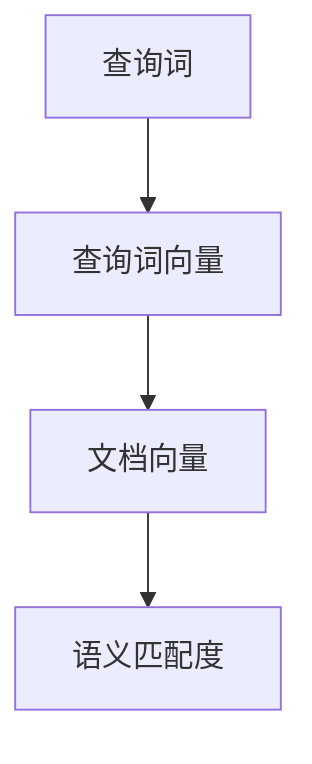
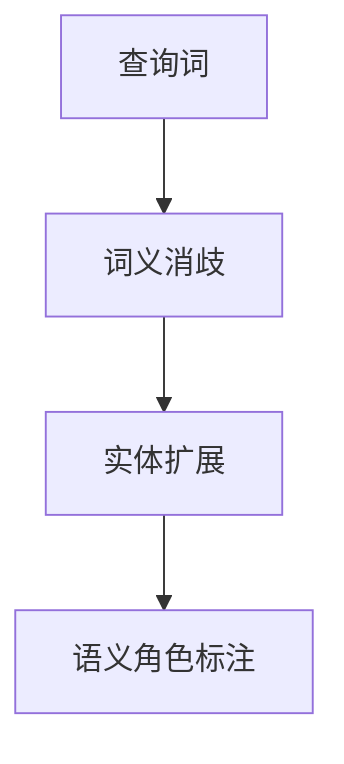
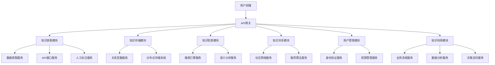
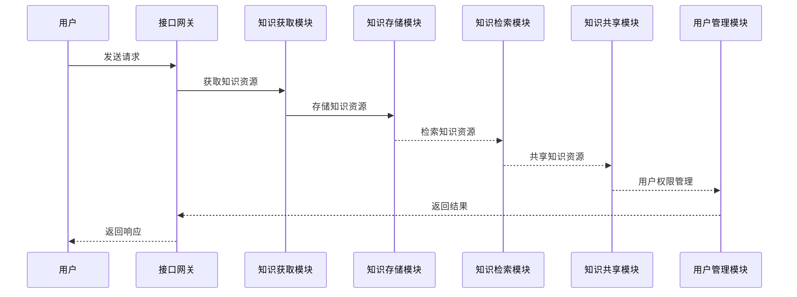

                 


### 文章标题
构建智能企业知识管理平台：动态知识图谱与语义检索

### 关键词
智能企业，知识管理，动态知识图谱，语义检索，知识图谱构建，知识共享，知识利用，语义分析，知识获取，语义匹配

### 摘要
本文深入探讨构建智能企业知识管理平台的策略，重点关注动态知识图谱与语义检索技术的应用。通过分析知识管理的核心原理、动态知识图谱的构建方法和语义检索的匹配机制，本文提供了构建高效知识管理平台的实用指导，并针对当前面临的技术挑战提出了解决方案。文章旨在为企业和技术人员提供有价值的参考，推动智能企业知识管理的创新发展。

## 第一部分：背景介绍

### 1.1 问题背景

随着大数据、云计算和人工智能技术的快速发展，企业对知识管理的需求日益增长。知识管理作为企业核心竞争力的体现，能够帮助企业提高效率、降低成本、优化决策和提升客户满意度。构建智能企业知识管理平台，实现知识的动态获取、存储、共享和利用，已成为企业数字化转型的重要任务。

在当今竞争激烈的市场环境中，企业需要快速响应市场变化，适应数字化时代的挑战。知识管理作为企业战略的重要组成部分，能够帮助企业整合内外部知识资源，提升知识利用效率，推动业务创新和持续发展。然而，传统的知识管理方式往往存在知识获取难度大、知识共享不畅、知识利用低效等问题，难以满足现代企业的需求。

因此，构建一个智能企业知识管理平台，利用先进的技术手段实现知识的动态获取、存储、共享和利用，已成为企业数字化转型的重要方向。动态知识图谱和语义检索技术作为知识管理领域的前沿技术，为构建智能企业知识管理平台提供了有力的技术支持。通过动态知识图谱，企业可以实现对知识结构的深度挖掘和分析，提高知识的组织和管理效率。而语义检索技术则能够实现知识的精准匹配和高效检索，满足用户多样化的查询需求，提升知识查询的准确性和用户体验。

总之，构建智能企业知识管理平台，利用动态知识图谱和语义检索技术，不仅能够解决当前知识管理中存在的问题，还能够推动企业实现知识的有效共享和利用，提升企业的核心竞争力和创新能力。

### 1.2 问题描述

构建智能企业知识管理平台面临以下问题：

1. **知识获取与存储**：如何高效地获取、存储和更新企业内部和外部知识资源？传统的知识获取方式往往依赖于人工整理和存储，效率低下且容易遗漏。此外，企业内部的知识资源分布广泛，如何实现统一管理和有效利用也是一大挑战。

2. **知识共享与利用**：如何实现知识在企业内部的共享和利用，提高员工的知识获取和创新能力？在传统的知识管理方式中，知识共享往往受到组织结构、沟通渠道和文化因素的影响，难以实现高效的知识传播和利用。

3. **语义检索**：如何准确、高效地实现知识的语义检索，满足用户多样化的查询需求？传统的关键字搜索方式容易导致信息过载和误匹配，难以满足用户对精确、全面信息的需求。

4. **动态知识图谱**：如何构建和维护动态知识图谱，实现知识的结构化组织和智能推理？动态知识图谱的构建和维护需要考虑知识更新、图谱扩展和一致性维护等问题。

### 1.3 问题解决

动态知识图谱与语义检索技术为构建智能企业知识管理平台提供了有效解决方案：

1. **动态知识图谱**：通过构建企业知识图谱，实现知识的结构化组织，支持知识的关联分析和智能推理。动态知识图谱能够动态地捕捉和更新企业的知识资源，提高知识的组织和管理效率。

2. **语义检索**：通过语义分析技术，实现知识的精准匹配和高效检索，提高知识查询的准确性和用户体验。语义检索能够理解用户的查询意图，提供更加精确和个性化的查询结果。

具体来说，动态知识图谱与语义检索技术为构建智能企业知识管理平台提供了以下解决方案：

1. **知识获取与存储**：通过自动化的知识采集和更新机制，实现对企业内部和外部知识的动态获取和存储。利用知识图谱技术，将不同来源的知识进行整合和关联，构建统一的、结构化的知识库。

2. **知识共享与利用**：构建基于知识图谱的知识共享平台，通过社交网络和推荐算法，促进知识的传播和利用。利用语义检索技术，提供个性化、精准的知识推荐，提高员工的知识获取和创新能力。

3. **语义检索**：通过语义分析技术，理解用户的查询意图，实现知识的精准匹配和高效检索。利用自然语言处理和知识图谱技术，提供多维度、多层次的查询结果，满足用户多样化的查询需求。

4. **动态知识图谱**：通过实体的自动抽取、关系的建立和事件的追踪，构建动态知识图谱。利用图算法和机器学习技术，实现知识图谱的自动扩展和一致性维护，提高知识图谱的实时性和准确性。

总之，动态知识图谱与语义检索技术为构建智能企业知识管理平台提供了全面、有效的解决方案。通过这两项技术，企业可以实现对知识资源的全面管理和高效利用，提升企业的核心竞争力和创新能力。

### 1.4 边界与外延

在本部分中，我们主要关注企业内部知识管理平台的构建，重点探讨如何利用动态知识图谱和语义检索技术实现知识的有效管理和利用。以下是对本部分的边界和外延的详细说明：

1. **内部知识管理平台**：本部分专注于企业内部知识管理平台的构建，包括知识获取、存储、共享、利用和反馈等环节。我们将探讨如何通过动态知识图谱和语义检索技术，提升知识管理的效率和质量。

2. **外部知识源获取与整合**：虽然外部知识源的获取和整合对于企业知识管理具有重要意义，但本文不涉及外部知识源的获取和整合。外部知识源包括公开的文献、数据库、社交媒体和其他企业内部资源，这些资源的获取和整合需要采用其他的技术和方法。

3. **知识管理技术和方法**：除了动态知识图谱和语义检索技术，还有许多其他知识管理技术和方法，如知识地图、知识社区、知识挖掘等。本文主要聚焦于动态知识图谱和语义检索技术在知识管理中的应用，不涉及其他技术和方法的讨论。

4. **知识管理与其他领域的交叉**：虽然知识管理与其他领域（如大数据、人工智能、云计算等）存在密切的交叉和融合，但本文主要从技术角度探讨知识管理平台的建设，不涉及其他领域的内容。

5. **用户和场景**：本文关注的知识管理平台主要面向企业内部员工，尤其是需要进行知识共享和创新的应用场景。我们讨论的知识管理和检索技术主要适用于企业内部的知识获取、共享和利用，不涉及公共知识管理平台的建设。

通过明确本部分的边界和外延，我们可以更好地聚焦于动态知识图谱和语义检索技术在企业内部知识管理中的应用，为企业提供有针对性的解决方案。

### 1.5 概念结构与核心要素组成

在本部分，我们将详细探讨构建智能企业知识管理平台所需的核心概念结构和要素组成，包括知识管理、动态知识图谱和语义检索三个关键组成部分。

#### 1.5.1 知识管理

知识管理是企业通过系统的方法和工具，对知识进行获取、存储、共享、利用和反馈的过程。以下是知识管理的关键要素：

1. **知识获取**：知识获取是知识管理的起点，包括内部知识的挖掘、外部知识的采集和知识库的建立。知识获取的关键在于高效、全面地收集与企业业务相关的各类知识资源。

2. **知识存储**：知识存储是将获取到的知识进行系统化、结构化的存储和管理。知识库是知识存储的核心，应具备快速检索、更新和维护的能力，以支持知识的长期保存和有效利用。

3. **知识共享**：知识共享是知识管理的重要环节，旨在促进知识的传播和流动，提高员工的知识获取和创新能力。知识共享平台和工具应具备灵活的权限管理、推荐机制和社交功能，以激发员工的知识共享热情。

4. **知识利用**：知识利用是知识管理的最终目标，通过知识的创新和应用，实现企业价值的最大化。知识利用包括知识在业务流程中的应用、知识创新和知识驱动的决策支持。

5. **知识反馈**：知识反馈是知识管理的持续改进机制，通过收集用户对知识的反馈，不断优化和完善知识库，提高知识的准确性和实用性。

#### 1.5.2 动态知识图谱

动态知识图谱是一种用于表示和管理知识的图形化结构，通过实体、属性、关系和事件等元素，实现对知识的结构化组织和智能推理。以下是动态知识图谱的核心要素：

1. **实体**：实体是知识图谱中的基本元素，用于表示各类知识对象，如人、地点、事物等。实体可以由外部数据源自动抽取，也可以通过人工标注生成。

2. **属性**：属性用于描述实体的特征和属性，如人的年龄、地点的经纬度等。属性可以为数值型、文本型或关系型，为实体之间的关联提供依据。

3. **关系**：关系用于描述实体之间的关联，如“属于”、“位于”等。关系可以是单向的或双向的，可以是静态的或动态的，为知识图谱提供丰富的语义信息。

4. **事件**：事件是知识图谱中的动态元素，用于表示知识对象之间的变化和交互。事件可以是实时发生的，也可以是历史记录，为知识图谱提供时间维度上的信息。

5. **知识图谱构建**：知识图谱的构建是通过实体、属性、关系和事件的抽取、融合和表示，构建一个结构化、语义化的知识库。知识图谱的构建需要考虑数据的多样性、完整性和一致性。

6. **动态更新**：动态知识图谱需要具备实时更新和扩展的能力，以适应企业知识的变化和需求。动态更新包括知识抽取、关系推理、图谱清洗和一致性维护等过程。

#### 1.5.3 语义检索

语义检索是基于语义分析技术，实现知识的精准匹配和高效检索。以下是语义检索的核心要素：

1. **语义表示**：语义表示是将文本信息转换为计算机可处理的语义表示形式，如词向量、词嵌入等。语义表示方法包括词袋模型、TF-IDF、Word2Vec、BERT等。

2. **语义匹配**：语义匹配是通过比较查询词和文档的语义表示，实现知识的精准匹配。语义匹配方法包括余弦相似度、LSH（局部敏感哈希）、神经网络匹配等。

3. **查询扩展**：查询扩展是通过扩展查询词的语义，提高检索结果的准确性和全面性。查询扩展方法包括词义消歧、实体扩展、语义角色标注等。

4. **检索效果优化**：检索效果优化是通过调整检索算法和参数，提高检索结果的准确性和用户体验。优化方法包括检索结果排序、结果过滤、用户反馈循环等。

#### 1.5.4 核心概念之间的联系

知识管理、动态知识图谱和语义检索三个核心概念之间存在着紧密的联系：

1. **知识管理是目标**：知识管理是构建智能企业知识管理平台的核心目标，通过高效的知识获取、存储、共享、利用和反馈，实现知识的最大化价值。

2. **动态知识图谱是手段**：动态知识图谱是知识管理的重要手段，通过结构化、语义化的知识表示，实现对知识的深度挖掘和分析，提高知识组织和管理效率。

3. **语义检索是核心**：语义检索是知识管理的核心，通过精准、高效的语义匹配和检索，实现用户对知识的快速获取和利用，提升用户体验和检索效果。

综上所述，知识管理、动态知识图谱和语义检索共同构成了智能企业知识管理平台的核心概念结构和要素组成，为实现知识的动态获取、存储、共享和利用提供了全面、有效的支持。

### 1.6 核心概念原理

#### 1.6.1 知识管理原理

知识管理是指通过系统的方法和工具，对知识进行获取、存储、共享、利用和反馈，以实现知识的最大化价值。知识管理的核心原理包括以下几个方面：

1. **知识生命周期管理**：知识生命周期管理是指对知识从获取、存储、共享、利用到反馈的整个生命周期进行系统化的管理。知识生命周期包括以下几个阶段：

   - **知识获取**：知识获取是知识管理的起点，包括内部知识的挖掘、外部知识的采集和知识库的建立。知识获取的关键在于高效、全面地收集与企业业务相关的各类知识资源。
   
   - **知识存储**：知识存储是将获取到的知识进行系统化、结构化的存储和管理。知识库是知识存储的核心，应具备快速检索、更新和维护的能力，以支持知识的长期保存和有效利用。
   
   - **知识共享**：知识共享是知识管理的重要环节，旨在促进知识的传播和流动，提高员工的知识获取和创新能力。知识共享平台和工具应具备灵活的权限管理、推荐机制和社交功能，以激发员工的知识共享热情。
   
   - **知识利用**：知识利用是知识管理的最终目标，通过知识的创新和应用，实现企业价值的最大化。知识利用包括知识在业务流程中的应用、知识创新和知识驱动的决策支持。
   
   - **知识反馈**：知识反馈是知识管理的持续改进机制，通过收集用户对知识的反馈，不断优化和完善知识库，提高知识的准确性和实用性。

2. **知识共享与协作**：知识共享是知识管理的核心，通过建立知识共享平台和激励机制，鼓励员工积极参与知识共享和协作，提高企业的创新能力。知识共享与协作的机制包括：

   - **社交网络**：利用社交网络平台，促进员工之间的知识交流与互动，构建企业内部的知识社区。
   
   - **知识推荐**：通过分析用户的行为和偏好，推荐相关的知识资源和优秀的内容，提高知识的利用率。
   
   - **知识奖励**：通过设立知识奖励机制，鼓励员工积极分享和贡献知识，促进知识共享的文化氛围。

3. **知识创新与利用**：知识创新与利用是知识管理的终极目标，通过知识的创新和应用，实现企业价值的最大化。知识创新与利用的机制包括：

   - **知识整合**：将不同来源、不同类型的知识进行整合，形成综合性的知识资源，提高知识的系统性和实用性。
   
   - **知识应用**：将知识应用于企业的业务流程中，推动业务创新和优化，提高企业的运营效率。
   
   - **知识驱动的决策支持**：利用知识分析技术，为企业的战略规划和决策提供数据支持和智力支持，提高决策的准确性和科学性。

#### 1.6.2 动态知识图谱原理

动态知识图谱是一种用于表示和管理知识的图形化结构，通过实体、属性、关系和事件等元素，实现对知识的结构化组织和智能推理。以下是动态知识图谱的核心原理：

1. **实体表示**：实体是知识图谱中的基本元素，用于表示各类知识对象，如人、地点、事物等。实体表示的关键在于如何准确、全面地抽取和表示知识对象。

   - **命名实体识别**：通过自然语言处理技术，从文本数据中识别出具有特定意义的实体，如人名、地名、机构名等。
   
   - **实体链接**：将文本中的实体与知识库中的实体进行匹配和链接，解决实体识别中的歧义问题。
   
   - **实体消歧**：通过上下文信息，对具有相同名称但实际不同的实体进行区分和识别。

2. **关系表示**：关系用于描述实体之间的关联，如“属于”、“位于”等。关系表示的关键在于如何准确地捕捉和表示实体之间的语义关系。

   - **本体建模**：通过构建本体模型，定义实体之间的关系类型和属性，为知识图谱提供语义基础。
   
   - **属性关系抽取**：从文本数据中抽取实体之间的属性关系，如“张三的出生地点是北京”中的“出生地点”关系。
   
   - **图论表示**：利用图论方法，将实体和关系表示为一个无向图或有向图，方便进行图算法操作和分析。

3. **事件表示**：事件是知识图谱中的动态元素，用于表示知识对象之间的变化和交互。事件表示的关键在于如何准确地捕捉和表示事件及其相关实体。

   - **事件抽取**：从文本数据中抽取事件，识别事件的时间、地点、参与者等关键信息。
   
   - **时间表示**：利用时间轴或时间戳，对事件进行时间上的表示和排序，实现事件的动态追踪。
   
   - **因果分析**：通过分析事件之间的因果关系，揭示事件之间的内在联系和影响。

4. **动态更新与维护**：动态知识图谱需要具备实时更新和扩展的能力，以适应企业知识的变化和需求。动态更新与维护包括：

   - **知识抽取**：从新的数据源中抽取实体、属性和关系，更新知识图谱。
   
   - **图谱清洗**：通过清洗和去噪，提高知识图谱的数据质量和一致性。
   
   - **一致性维护**：通过一致性检查和修复，确保知识图谱的完整性和准确性。

#### 1.6.3 语义检索原理

语义检索是基于语义分析技术，实现知识的精准匹配和高效检索。以下是语义检索的核心原理：

1. **语义表示**：语义表示是将文本信息转换为计算机可处理的语义表示形式，如词向量、词嵌入等。语义表示的关键在于如何准确地捕捉和表示文本的语义信息。

   - **词袋模型**：将文本表示为一个词袋，每个词的出现频率作为特征向量。
   
   - **词嵌入**：将词表示为低维向量，通过语义相似性分析，实现词与词之间的相似性计算。
   
   - **图嵌入**：将文本中的句子或段落表示为一个图，通过图算法，实现语义的表示和计算。

2. **语义匹配**：语义匹配是通过比较查询词和文档的语义表示，实现知识的精准匹配。语义匹配的关键在于如何准确地计算查询词和文档之间的语义相似度。

   - **余弦相似度**：通过计算查询词和文档的词向量夹角余弦值，实现语义相似度的计算。
   
   - **LSH（局部敏感哈希）**：通过局部敏感哈希算法，将查询词和文档的词向量映射到同一个哈希空间，实现快速相似度计算。
   
   - **神经网络匹配**：利用神经网络模型，通过多层非线性变换，实现查询词和文档之间的语义匹配。

3. **查询扩展**：查询扩展是通过扩展查询词的语义，提高检索结果的准确性和全面性。查询扩展的关键在于如何准确地扩展查询词的语义。

   - **词义消歧**：通过上下文信息，对具有多个含义的词进行消歧，确定其在查询中的实际含义。
   
   - **实体扩展**：通过扩展查询词所指的实体，包括同义词、上位词、下位词等，实现查询词的语义扩展。
   
   - **语义角色标注**：通过分析查询词的语义角色，如主语、谓语、宾语等，实现查询词的语义扩展。

4. **检索效果优化**：检索效果优化是通过调整检索算法和参数，提高检索结果的准确性和用户体验。检索效果优化的方法包括：

   - **检索结果排序**：通过调整排序算法和排序参数，实现检索结果的优化排序，提高用户对检索结果的满意度。
   
   - **结果过滤**：通过过滤重复和无关的结果，提高检索结果的纯净度和相关性。
   
   - **用户反馈循环**：通过收集用户对检索结果的反馈，不断调整和优化检索算法，提高检索效果的准确性。

### 1.7 概念属性特征对比表格

为了更好地理解知识管理、动态知识图谱和语义检索三个概念之间的区别和联系，我们可以通过一个对比表格来展示它们的关键属性特征。

| 概念         | 知识管理                      | 动态知识图谱                   | 语义检索                      |
| ------------ | ----------------------------- | ------------------------------ | ----------------------------- |
| **定义**     | 知识的获取、存储、共享、利用和反馈 | 基于实体、属性、关系和事件的知识表示 | 基于语义分析的精准匹配和检索     |
| **核心功能** | 知识获取、知识存储、知识共享、知识利用、知识反馈 | 知识结构化、知识关联、知识推理、知识更新 | 语义匹配、查询扩展、检索效果优化 |
| **应用场景** | 企业内部知识共享、知识驱动决策、知识创新 | 企业知识图谱构建、知识图谱应用、智能搜索 | 智能问答、搜索引擎、信息推荐     |
| **关键技术** | 知识抽取、知识建模、知识融合、知识可视化 | 实体识别、关系抽取、事件抽取、图算法 | 语义表示、语义匹配、查询扩展     |
| **特点**     | 强调知识的全生命周期管理，注重协作与共享 | 强调知识的结构化组织，实现智能推理 | 强调语义理解，实现精准知识检索   |

通过这个表格，我们可以看出，知识管理、动态知识图谱和语义检索在定义、核心功能、应用场景、关键技术和特点等方面存在明显的区别和联系。知识管理是知识获取、存储、共享、利用和反馈的全过程管理，动态知识图谱是实现知识结构化和智能推理的重要工具，而语义检索则是实现知识精准匹配和高效检索的关键技术。这三者在知识管理中相互补充，共同构成了智能企业知识管理平台的核心。

## 1.8 ER实体关系图架构

为了更清晰地展示智能企业知识管理平台中的实体及其关系，我们可以使用ER（实体-关系）图来构建其架构。ER图是一种用于描述实体及其之间关系的数据库模型，通过实体和关系的定义，可以直观地表示系统中的数据结构。

以下是智能企业知识管理平台ER图的简化示例：

```mermaid
erDiagram
  User ||--|{ Knowledge : has}
  User ||--|{ Project : participates}
  Knowledge ||--|{ KnowledgeCategory : belongs_to}
  Project ||--|{ ProjectCategory : belongs_to}
  Knowledge ||--|{ KnowledgeSource : from}
  Knowledge ||--|{ KnowledgeUse : used_in}
  Project ||--|{ Task : contains}
  Task ||--|{ Resource : requires}
```

在这个ER图中，我们定义了以下几个核心实体及其关系：

1. **User（用户）**：表示企业的员工，他们拥有知识、参与项目和任务。
2. **Knowledge（知识）**：表示企业中的知识资源，它们属于某个知识类别，来源于某个知识源，并可能在项目中使用。
3. **Project（项目）**：表示企业的项目，它们属于某个项目类别，包含任务，并与用户相关联。
4. **KnowledgeCategory（知识类别）**：表示知识的不同分类，知识属于某个知识类别。
5. **ProjectCategory（项目类别）**：表示项目的不同分类，项目属于某个项目类别。
6. **KnowledgeSource（知识源）**：表示知识的来源，如内部文档、外部数据库、网络资源等。
7. **KnowledgeUse（知识使用）**：表示知识在项目中的使用情况，如项目报告、案例分析等。
8. **Task（任务）**：表示项目中的具体工作，需要资源和人员的参与。
9. **Resource（资源）**：表示任务所需的资源，如人力资源、物资、设备等。

通过这个ER图，我们可以清晰地看到知识管理平台中的各个实体及其之间的关系，为系统设计和实现提供了结构化的参考。在实际应用中，ER图可以根据具体需求进行扩展和细化，以适应更复杂的应用场景。

## 第二部分：核心概念解析

### 2.1 知识管理原理

知识管理是指通过系统的方法和工具，对知识进行获取、存储、共享、利用和反馈，以实现知识的最大化价值。知识管理的核心原理包括以下几个方面：

#### 2.1.1 知识生命周期管理

知识生命周期管理是指对知识从获取、存储、共享、利用到反馈的整个生命周期进行系统化的管理。知识生命周期包括以下几个阶段：

1. **知识获取**：知识获取是知识管理的起点，包括内部知识的挖掘、外部知识的采集和知识库的建立。知识获取的关键在于高效、全面地收集与企业业务相关的各类知识资源。

   - **内部知识挖掘**：通过员工的经验、案例、文档等内部资源，挖掘出对企业有用的知识。
   - **外部知识采集**：通过互联网、学术期刊、行业报告等外部资源，获取与业务相关的知识。
   - **知识库建立**：将获取到的知识进行系统化、结构化的存储，形成知识库，以便后续管理和利用。

2. **知识存储**：知识存储是将获取到的知识进行系统化、结构化的存储和管理。知识库是知识存储的核心，应具备快速检索、更新和维护的能力，以支持知识的长期保存和有效利用。

   - **知识库设计**：设计合理的知识库架构，包括实体、属性、关系等，确保知识存储的有序性和一致性。
   - **数据质量管理**：对存储的知识进行数据质量检查和清洗，确保知识库的数据准确性、完整性和一致性。
   - **知识库维护**：定期更新和优化知识库，删除无效或过时的知识，添加新的知识资源。

3. **知识共享**：知识共享是知识管理的重要环节，旨在促进知识的传播和流动，提高员工的知识获取和创新能力。知识共享平台和工具应具备灵活的权限管理、推荐机制和社交功能，以激发员工的知识共享热情。

   - **知识共享平台**：建立知识共享平台，提供知识的浏览、搜索、下载和分享功能。
   - **权限管理**：根据不同用户的角色和权限，设置知识访问和共享的权限，确保知识的保密性和安全性。
   - **知识推荐**：利用推荐算法，根据用户的行为和偏好，推荐相关的知识资源和优秀的内容。
   - **社交功能**：提供评论、点赞、分享等功能，增强员工之间的知识交流和互动。

4. **知识利用**：知识利用是知识管理的最终目标，通过知识的创新和应用，实现企业价值的最大化。知识利用包括知识在业务流程中的应用、知识创新和知识驱动的决策支持。

   - **业务流程应用**：将知识应用于企业的业务流程中，如产品设计、市场营销、客户服务等，提高业务效率和效果。
   - **知识创新**：通过知识的整合、分析和创新，推动企业的产品和服务创新，增强企业的核心竞争力。
   - **决策支持**：利用知识分析技术，为企业的战略规划和决策提供数据支持和智力支持，提高决策的准确性和科学性。

5. **知识反馈**：知识反馈是知识管理的持续改进机制，通过收集用户对知识的反馈，不断优化和完善知识库，提高知识的准确性和实用性。

   - **用户反馈收集**：通过调查问卷、用户评论、行为分析等方式，收集用户对知识的评价和使用反馈。
   - **知识库优化**：根据用户反馈，对知识库进行更新和优化，删除不准确或过时的知识，添加新的知识资源。
   - **知识库迭代**：通过知识反馈的持续循环，不断完善知识库，提高知识的准确性和实用性，实现知识管理的持续改进。

#### 2.1.2 知识共享与协作

知识共享与协作是知识管理的核心，通过建立知识共享平台和激励机制，鼓励员工积极参与知识共享和协作，提高企业的创新能力。

1. **知识共享平台**：建立知识共享平台，提供知识的浏览、搜索、下载和分享功能。知识共享平台应具备以下特点：

   - **用户友好的界面**：界面简洁直观，方便用户快速查找和获取所需知识。
   - **强大的搜索功能**：利用自然语言处理和语义分析技术，实现高效的全文搜索和关键词搜索。
   - **多维度分类**：对知识进行多维度分类，方便用户按照主题、领域、类型等快速查找知识。
   - **知识推荐**：通过推荐算法，根据用户的行为和偏好，推荐相关的知识资源和优秀的内容。

2. **激励机制**：通过设立知识奖励机制，鼓励员工积极分享和贡献知识。激励机制应包括以下几个方面：

   - **知识积分**：为员工建立知识积分系统，通过知识分享、使用和反馈等行为积累积分，积分可以兑换物质奖励或职业晋升机会。
   - **荣誉称号**：对在知识管理中表现突出的员工，授予荣誉称号，提升其在企业中的声誉和地位。
   - **奖金奖励**：设立知识奖金，对在知识创新和应用中取得显著成果的员工进行奖励。
   - **职业发展**：将知识贡献情况纳入员工职业发展的考核指标，为知识贡献者提供更多的职业发展机会。

3. **协作机制**：建立协作机制，促进员工之间的知识共享和协同工作。协作机制应包括以下几个方面：

   - **团队协作**：通过团队协作工具，如团队聊天、协作编辑、项目管理等，促进团队成员之间的知识共享和协作。
   - **知识社区**：建立知识社区，提供知识交流、讨论和分享的平台，鼓励员工积极参与知识社区活动。
   - **知识沉淀**：在项目完成后，将项目过程中的知识沉淀下来，形成文档、案例和经验分享，供后续项目参考。
   - **知识传承**：通过师徒制、知识讲座、培训课程等方式，传授知识和经验，确保知识的持续传承和积累。

通过知识共享与协作机制的建立和实施，企业可以形成一个知识共享和协同工作的良好氛围，提高员工的知识获取和创新能力，推动企业的持续发展。

### 2.2 动态知识图谱原理

动态知识图谱是一种用于表示和管理知识的图形化结构，通过实体、属性、关系和事件等元素，实现对知识的结构化组织和智能推理。以下是动态知识图谱的核心原理：

#### 2.2.1 实体表示

实体是知识图谱中的基本元素，用于表示各类知识对象，如人、地点、事物等。实体表示的关键在于如何准确、全面地抽取和表示知识对象。

1. **命名实体识别**：命名实体识别（Named Entity Recognition，简称NER）是自然语言处理中的一个重要任务，用于识别文本中的命名实体，如人名、地名、机构名等。命名实体识别的方法包括基于规则的方法、基于统计的方法和基于深度学习的方法。

   - **基于规则的方法**：通过预定义的规则和模式，识别文本中的命名实体。优点是简单高效，但受限于规则覆盖范围。
   - **基于统计的方法**：利用统计模型，如条件概率模型、隐马尔可夫模型（HMM）等，识别文本中的命名实体。优点是能够自动适应数据，但效果受数据质量和特征工程的影响。
   - **基于深度学习的方法**：利用深度神经网络，如卷积神经网络（CNN）、循环神经网络（RNN）等，识别文本中的命名实体。优点是效果显著提升，但计算复杂度高。

2. **实体链接**：实体链接（Entity Linking，简称EL）是将文本中的命名实体与知识库中的实体进行匹配和链接的过程，解决实体识别中的歧义问题。实体链接的方法包括基于规则的方法、基于统计的方法和基于深度学习的方法。

   - **基于规则的方法**：通过预定义的规则和模式，将文本中的命名实体与知识库中的实体进行匹配。优点是简单高效，但受限于规则覆盖范围。
   - **基于统计的方法**：利用统计模型，如逻辑回归、支持向量机（SVM）等，将文本中的命名实体与知识库中的实体进行匹配。优点是能够自动适应数据，但效果受数据质量和特征工程的影响。
   - **基于深度学习的方法**：利用深度神经网络，如卷积神经网络（CNN）、循环神经网络（RNN）等，将文本中的命名实体与知识库中的实体进行匹配。优点是效果显著提升，但计算复杂度高。

3. **实体消歧**：实体消歧（Entity Disambiguation，简称ED）是在实体链接的基础上，根据上下文信息，对具有相同名称但实际不同的实体进行区分和识别的过程。实体消歧的方法包括基于规则的方法、基于统计的方法和基于深度学习的方法。

   - **基于规则的方法**：通过预定义的规则和模式，对具有相同名称但实际不同的实体进行区分。优点是简单高效，但受限于规则覆盖范围。
   - **基于统计的方法**：利用统计模型，如逻辑回归、支持向量机（SVM）等，对具有相同名称但实际不同的实体进行区分。优点是能够自动适应数据，但效果受数据质量和特征工程的影响。
   - **基于深度学习的方法**：利用深度神经网络，如卷积神经网络（CNN）、循环神经网络（RNN）等，对具有相同名称但实际不同的实体进行区分。优点是效果显著提升，但计算复杂度高。

#### 2.2.2 关系表示

关系用于描述实体之间的关联，如“属于”、“位于”等。关系表示的关键在于如何准确地捕捉和表示实体之间的语义关系。

1. **本体建模**：本体建模（Ontology Modeling）是通过构建本体模型，定义实体之间的关系类型和属性，为知识图谱提供语义基础。本体模型通常采用OWL（Web Ontology Language）进行描述。

   - **类（Class）**：表示具有相同属性和关系的实体集合，如“人”、“地点”等。
   - **属性（Property）**：表示实体之间的关联，如“居住地”、“生日”等。
   - **关系（Relationship）**：表示实体之间的语义关系，如“属于”、“位于”等。

2. **属性关系抽取**：属性关系抽取（Attribute Relation Extraction）是从文本数据中抽取实体之间的属性关系的过程。属性关系抽取的方法包括基于规则的方法、基于统计的方法和基于深度学习的方法。

   - **基于规则的方法**：通过预定义的规则和模式，从文本数据中抽取实体之间的属性关系。优点是简单高效，但受限于规则覆盖范围。
   - **基于统计的方法**：利用统计模型，如条件概率模型、支持向量机（SVM）等，从文本数据中抽取实体之间的属性关系。优点是能够自动适应数据，但效果受数据质量和特征工程的影响。
   - **基于深度学习的方法**：利用深度神经网络，如卷积神经网络（CNN）、循环神经网络（RNN）等，从文本数据中抽取实体之间的属性关系。优点是效果显著提升，但计算复杂度高。

3. **图论表示**：图论表示（Graph Theory Representation）是通过图论方法，将实体和关系表示为一个无向图或有向图，方便进行图算法操作和分析。图论表示的方法包括：

   - **无向图**：表示实体之间的无向关系，如“朋友关系”、“合作关系”等。
   - **有向图**：表示实体之间的有向关系，如“隶属关系”、“继承关系”等。

#### 2.2.3 事件表示

事件是知识图谱中的动态元素，用于表示知识对象之间的变化和交互。事件表示的关键在于如何准确地捕捉和表示事件及其相关实体。

1. **事件抽取**：事件抽取（Event Extraction）是从文本数据中抽取事件及其相关信息的过程。事件抽取的方法包括基于规则的方法、基于统计的方法和基于深度学习的方法。

   - **基于规则的方法**：通过预定义的规则和模式，从文本数据中抽取事件。优点是简单高效，但受限于规则覆盖范围。
   - **基于统计的方法**：利用统计模型，如条件概率模型、支持向量机（SVM）等，从文本数据中抽取事件。优点是能够自动适应数据，但效果受数据质量和特征工程的影响。
   - **基于深度学习的方法**：利用深度神经网络，如卷积神经网络（CNN）、循环神经网络（RNN）等，从文本数据中抽取事件。优点是效果显著提升，但计算复杂度高。

2. **时间表示**：时间表示（Time Representation）是通过时间轴或时间戳，对事件进行时间上的表示和排序，实现事件的动态追踪。

   - **时间轴表示**：通过时间轴，展示事件发生的时间顺序，便于分析事件之间的时间关系。
   - **时间戳表示**：通过时间戳，精确记录事件发生的时间点，便于进行事件的时间分析。

3. **因果分析**：因果分析（Causal Analysis）是通过分析事件之间的因果关系，揭示事件之间的内在联系和影响。

   - **因果关系抽取**：从文本数据中抽取事件之间的因果关系，如“地震导致海啸”、“政策变化导致市场波动”等。
   - **因果推理**：利用因果推理算法，分析事件之间的因果联系，推断事件之间的因果关系。

#### 2.2.4 动态更新与维护

动态知识图谱需要具备实时更新和扩展的能力，以适应企业知识的变化和需求。动态更新与维护包括以下几个过程：

1. **知识抽取**：从新的数据源中抽取实体、属性和关系，更新知识图谱。知识抽取的方法包括基于规则的方法、基于统计的方法和基于深度学习的方法。

   - **基于规则的方法**：通过预定义的规则和模式，从新的数据源中抽取实体、属性和关系。
   - **基于统计的方法**：利用统计模型，从新的数据源中抽取实体、属性和关系。
   - **基于深度学习的方法**：利用深度神经网络，从新的数据源中抽取实体、属性和关系。

2. **图谱清洗**：通过清洗和去噪，提高知识图谱的数据质量和一致性。图谱清洗的方法包括数据去重、噪声过滤、数据一致性检查等。

   - **数据去重**：检测和删除知识图谱中的重复实体、属性和关系，避免数据冗余。
   - **噪声过滤**：去除知识图谱中的噪声数据，提高数据的准确性。
   - **数据一致性检查**：检查知识图谱中的数据一致性，确保实体、属性和关系的逻辑一致性。

3. **一致性维护**：通过一致性检查和修复，确保知识图谱的完整性和准确性。一致性维护的方法包括实体消歧、关系一致性检查、事件时间一致性检查等。

   - **实体消歧**：通过上下文信息，对具有相同名称但实际不同的实体进行区分和识别，确保实体的一致性。
   - **关系一致性检查**：检查知识图谱中的关系是否符合预定义的语义规则，确保关系的一致性。
   - **事件时间一致性检查**：检查知识图谱中的事件时间是否合理，确保事件的时间一致性。

通过上述动态知识图谱的构建和维护方法，企业可以构建一个实时更新、结构化、语义化的知识图谱，实现对知识的深度挖掘和分析，为企业的决策和业务提供有力的支持。

### 2.3 语义检索原理

语义检索是基于语义分析技术，实现知识的精准匹配和高效检索。以下是语义检索的核心原理：

#### 2.3.1 语义表示

语义表示是将文本信息转换为计算机可处理的语义表示形式，如词向量、词嵌入等。语义表示的关键在于如何准确地捕捉和表示文本的语义信息。

1. **词袋模型**：词袋模型（Bag of Words，简称BoW）是将文本表示为一个词袋，每个词的出现频率作为特征向量。词袋模型的优点是实现简单、计算效率高，但缺点是忽略了词的顺序和语法结构，可能导致语义信息的丢失。

2. **词嵌入**：词嵌入（Word Embedding）是将词表示为低维向量，通过语义相似性分析，实现词与词之间的相似性计算。词嵌入的方法包括：

   - **基于频率的方法**：如TF-IDF（Term Frequency-Inverse Document Frequency），通过词频和逆文档频率，计算词的权重。
   - **基于神经网络的模型**：如Word2Vec、GloVe（Global Vectors for Word Representation），通过神经网络模型，将词映射到低维空间，实现词向量的生成。
   - **基于图的方法**：如DeepWalk、Node2Vec，通过图嵌入技术，将图中的节点映射到低维空间，实现词向量的生成。

3. **图嵌入**：图嵌入（Graph Embedding）是将图中的节点和边映射到低维空间，通过图算法，实现语义的表示和计算。图嵌入的方法包括：

   - **基于矩阵分解的方法**：如SVD（Singular Value Decomposition），通过矩阵分解，将高维的图矩阵映射到低维空间。
   - **基于随机游走的方法**：如DeepWalk、Node2Vec，通过随机游走，生成节点之间的表示向量。

#### 2.3.2 语义匹配

语义匹配是通过比较查询词和文档的语义表示，实现知识的精准匹配。语义匹配的关键在于如何准确地计算查询词和文档之间的语义相似度。

1. **余弦相似度**：余弦相似度（Cosine Similarity）是通过计算查询词和文档的词向量夹角余弦值，实现语义相似度的计算。余弦相似度的优点是计算简单、效率高，但缺点是忽略了词的权重差异。

2. **LSH（局部敏感哈希）**：LSH（Locally Sensitive Hashing）是通过局部敏感哈希算法，将查询词和文档的词向量映射到同一个哈希空间，实现快速相似度计算。LSH的优点是处理速度快、对噪声数据鲁棒，但缺点是相似度阈值需要手动调整。

3. **神经网络匹配**：神经网络匹配（Neural Network Matching）是通过神经网络模型，通过多层非线性变换，实现查询词和文档之间的语义匹配。神经网络匹配的优点是能够捕捉复杂的语义关系，但计算复杂度高。

#### 2.3.3 查询扩展

查询扩展是通过扩展查询词的语义，提高检索结果的准确性和全面性。查询扩展的关键在于如何准确地扩展查询词的语义。

1. **词义消歧**：词义消歧（Word Sense Disambiguation，简称WSD）是通过上下文信息，对具有多个含义的词进行消歧，确定其在查询中的实际含义。词义消歧的方法包括基于规则的方法、基于统计的方法和基于深度学习的方法。

2. **实体扩展**：实体扩展（Entity Expansion）是通过扩展查询词所指的实体，包括同义词、上位词、下位词等，实现查询词的语义扩展。实体扩展的方法包括基于词嵌入的方法、基于知识图谱的方法。

3. **语义角色标注**：语义角色标注（Semantic Role Labeling，简称SRL）是通过分析查询词的语义角色，如主语、谓语、宾语等，实现查询词的语义扩展。语义角色标注的方法包括基于规则的方法、基于统计的方法和基于深度学习的方法。

#### 2.3.4 检索效果优化

检索效果优化是通过调整检索算法和参数，提高检索结果的准确性和用户体验。检索效果优化的方法包括：

1. **检索结果排序**：通过调整排序算法和排序参数，实现检索结果的优化排序，提高用户对检索结果的满意度。

   - **基于相似度的排序**：如余弦相似度排序，通过计算查询词和文档之间的相似度，实现检索结果的排序。
   - **基于多样性的排序**：通过引入多样性指标，如文档之间的相似度、文档的领域分布等，实现检索结果的多样性排序。

2. **结果过滤**：通过过滤重复和无关的结果，提高检索结果的纯净度和相关性。

   - **基于规则的结果过滤**：通过预定义的规则，过滤掉不相关或重复的结果。
   - **基于相似度的结果过滤**：通过计算查询词和文档之间的相似度，过滤掉相似度较低的结果。

3. **用户反馈循环**：通过收集用户对检索结果的反馈，不断调整和优化检索算法，提高检索效果的准确性。

   - **基于反馈的调整**：通过用户反馈，调整检索算法的参数，优化检索效果。
   - **基于模型的反馈**：利用机器学习模型，分析用户反馈，自动调整检索算法的参数。

通过上述语义检索原理，企业可以实现知识的精准匹配和高效检索，提高知识查询的准确性和用户体验，为企业的知识管理和决策提供有力的支持。

### 2.4 知识管理、动态知识图谱和语义检索之间的联系

知识管理、动态知识图谱和语义检索三者之间存在着紧密的联系，共同构建了一个智能企业知识管理平台，为企业的知识获取、共享、利用和决策提供全面的支持。

#### 2.4.1 知识管理是基础

知识管理是构建智能企业知识管理平台的基础。知识管理涵盖了知识的获取、存储、共享、利用和反馈等环节，确保知识的有效流动和利用。知识管理通过建立知识库、制定知识共享与协作机制、优化知识生命周期管理等方式，为动态知识图谱和语义检索提供了丰富的知识资源。没有有效的知识管理，动态知识图谱和语义检索将难以发挥作用。

#### 2.4.2 动态知识图谱是核心

动态知识图谱是智能企业知识管理平台的核心，通过实体、属性、关系和事件等元素，实现对知识的结构化组织和智能推理。动态知识图谱能够将企业内外部的知识资源进行整合和关联，形成一个语义丰富、结构化的知识网络，为语义检索提供了基础。通过动态知识图谱，企业可以实现对知识的深度挖掘和分析，为知识管理和决策提供强有力的支持。

#### 2.4.3 语义检索是关键

语义检索是智能企业知识管理平台的关键，通过语义分析技术，实现知识的精准匹配和高效检索。语义检索能够理解用户的查询意图，提供个性化、精准的知识查询结果，提高用户的知识获取和创新能力。语义检索不仅依赖于动态知识图谱提供的知识结构，还需要结合用户行为和偏好，进行查询扩展和检索效果优化，确保用户能够快速、准确地获取到所需的知识。

#### 2.4.4 三者之间的联系

1. **知识管理为动态知识图谱提供数据支持**：知识管理通过构建和维护知识库，为动态知识图谱提供了丰富的知识资源。动态知识图谱通过实体、属性、关系和事件的抽取和表示，将这些知识资源进行结构化组织，形成一个语义丰富的知识网络。

2. **动态知识图谱为语义检索提供知识基础**：动态知识图谱为语义检索提供了知识结构，使得语义检索能够基于结构化的知识网络，实现知识的精准匹配和高效检索。动态知识图谱的实体、属性、关系和事件等元素，为语义检索提供了丰富的语义信息，提高了检索的准确性和用户体验。

3. **语义检索为知识管理提供反馈**：语义检索通过用户的查询行为和反馈，为知识管理提供了反馈信息。知识管理可以根据用户的反馈，对知识库进行优化和调整，提高知识的准确性和实用性。同时，语义检索的查询扩展和检索效果优化功能，也为知识管理提供了数据支持和优化方向。

综上所述，知识管理、动态知识图谱和语义检索三者之间相互依存、相互促进，共同构成了智能企业知识管理平台的核心。知识管理为平台提供了丰富的知识资源，动态知识图谱为平台提供了知识结构，语义检索为平台提供了知识检索能力。通过这三者的有机结合，企业可以实现知识的全面管理和高效利用，提升企业的核心竞争力和创新能力。

### 2.5 动态知识图谱在知识管理中的应用场景

动态知识图谱作为一种结构化、语义化的知识表示方式，在知识管理中具有广泛的应用场景。以下是动态知识图谱在知识管理中的几个典型应用场景：

#### 2.5.1 企业知识图谱构建

企业知识图谱是企业内部知识资源的结构化表示，通过实体、属性、关系和事件等元素，将企业内部的各种知识资源进行整合和关联，形成一个语义丰富、结构化的知识网络。企业知识图谱的应用场景包括：

1. **员工知识共享**：通过企业知识图谱，员工可以方便地查找和获取与自己业务相关的知识资源，促进知识的传播和共享。
2. **知识库建设**：企业知识图谱为知识库的建设提供了基础，通过对知识资源进行结构化表示和关联，提高知识库的数据质量和利用效率。
3. **知识挖掘与分析**：通过企业知识图谱，可以对企业内部的各类知识资源进行深度挖掘和分析，发现潜在的知识关联和趋势，为企业的决策提供支持。

#### 2.5.2 知识推荐系统

知识推荐系统是一种基于用户行为和偏好，为用户推荐相关知识的系统。动态知识图谱在知识推荐系统中扮演着关键角色，通过实体、属性、关系和事件的表示，实现知识的结构化组织和关联分析，为推荐算法提供了丰富的语义信息。知识推荐系统的应用场景包括：

1. **个性化知识推荐**：通过分析用户的行为和偏好，动态知识图谱可以识别出用户感兴趣的知识领域，为用户推荐相关的知识资源。
2. **热门知识推荐**：通过分析企业内部的知识流行趋势，动态知识图谱可以识别出热门知识资源，为用户推荐热门知识。
3. **协同过滤**：结合用户行为数据和知识图谱的关联关系，动态知识图谱可以增强协同过滤算法的推荐效果，提高推荐系统的准确性和实用性。

#### 2.5.3 知识挖掘与分析

知识挖掘与分析是一种从大量知识资源中提取有用信息的过程，动态知识图谱为知识挖掘与分析提供了强有力的支持。通过实体、属性、关系和事件的表示，动态知识图谱可以实现知识的结构化组织和语义分析，为知识挖掘与分析提供了基础。知识挖掘与分析的应用场景包括：

1. **知识关联分析**：通过分析知识图谱中的实体、属性和关系，可以发现知识之间的关联关系，为知识的整合和应用提供支持。
2. **趋势分析**：通过分析企业内部的知识资源，可以识别出知识资源的增长趋势和变化规律，为企业的战略规划和决策提供支持。
3. **知识可视化**：通过知识图谱的可视化表示，可以将复杂的知识结构进行图形化展示，帮助用户更好地理解和利用知识资源。

#### 2.5.4 知识驱动的决策支持

知识驱动的决策支持是一种利用知识资源，为企业决策提供数据支持和智力支持的方法。动态知识图谱通过结构化、语义化的知识表示，为知识驱动的决策支持提供了基础。知识驱动的决策支持的应用场景包括：

1. **战略规划**：通过分析企业内部和外部知识资源，动态知识图谱可以帮助企业识别出潜在的战略机会和风险，为企业的战略规划提供支持。
2. **决策分析**：通过分析企业内部的各类知识资源，动态知识图谱可以为企业的决策提供数据支持和智力支持，提高决策的科学性和准确性。
3. **知识库建设**：动态知识图谱可以为企业构建一个结构化、语义化的知识库，为企业的知识管理和决策提供支持。

通过上述应用场景，我们可以看到动态知识图谱在知识管理中的重要作用。动态知识图谱不仅为知识的获取、存储、共享和利用提供了有效的支持，还为企业决策提供了数据支持和智力支持，提高了企业的知识管理水平和决策能力。

### 2.6 语义检索技术在知识管理中的应用

语义检索技术在知识管理中扮演着关键角色，通过理解用户的查询意图，实现知识的精准匹配和高效检索，提升用户的知识获取和创新能力。以下是语义检索技术在知识管理中的几个典型应用场景：

#### 2.6.1 智能搜索引擎

智能搜索引擎是语义检索技术在知识管理中最常见和应用最广泛的应用场景之一。传统的关键字搜索方式容易导致信息过载和误匹配，而语义检索技术通过理解用户的查询意图，提供更加精准和个性化的查询结果。

1. **查询意图识别**：语义检索技术通过分析用户的查询输入，理解用户的查询意图，区分用户是希望获取信息、解决问题还是进行其他类型的查询。
2. **多维度查询**：语义检索技术可以实现多维度查询，如通过时间、地点、主题等属性，提高查询的精确性和全面性。
3. **结果排序优化**：通过语义匹配和排序算法，智能搜索引擎可以根据用户的查询意图，将最相关的查询结果排在前面，提高用户的检索体验。

#### 2.6.2 知识推荐系统

知识推荐系统利用语义检索技术，根据用户的行为和偏好，为用户推荐相关的知识资源，提高知识的利用效率。

1. **内容推荐**：通过分析用户的查询历史和阅读行为，知识推荐系统可以识别出用户感兴趣的知识领域和内容，为用户推荐相关的知识文章、报告和文档。
2. **协同过滤**：结合用户行为数据和知识图谱的关联关系，知识推荐系统可以增强协同过滤算法的推荐效果，提高推荐系统的准确性和实用性。
3. **个性化推荐**：通过用户的个性化设置和偏好，知识推荐系统可以为用户提供更加个性化的知识推荐，满足用户多样化的需求。

#### 2.6.3 知识问答系统

知识问答系统通过语义检索技术，实现用户提出问题的自动回答，提供实时、准确的知识服务。

1. **自然语言处理**：知识问答系统利用自然语言处理技术，理解用户的问题，提取关键信息，为回答问题提供基础。
2. **语义匹配**：通过语义匹配技术，将用户的问题与知识库中的问题进行匹配，找到最相关的答案。
3. **多轮对话**：知识问答系统可以支持多轮对话，通过不断追问和回答，提供更加准确和详细的答案。

#### 2.6.4 知识可视化

知识可视化是一种通过图形化方式展示知识结构和关联关系的方法，语义检索技术为知识可视化提供了支持。

1. **知识图谱可视化**：通过语义检索技术，可以将知识图谱中的实体、属性和关系进行可视化展示，帮助用户更好地理解和分析知识结构。
2. **交互式查询**：用户可以通过交互式界面，对知识图谱进行查询和操作，获取所需的知识信息。
3. **动态更新**：知识可视化系统可以根据知识图谱的实时更新，动态展示知识的变化和关联关系，提高知识的利用效率。

通过上述应用场景，我们可以看到语义检索技术在知识管理中的重要作用。语义检索技术不仅提升了知识查询的准确性和效率，还为知识推荐、问答和可视化提供了强有力的支持，促进了知识的有效共享和利用，提升了企业的知识管理水平和创新能力。

### 2.7 动态知识图谱与语义检索技术的融合

动态知识图谱与语义检索技术的融合，为智能企业知识管理平台提供了强大的知识组织和检索能力，实现了知识的精准匹配和高效利用。以下是动态知识图谱与语义检索技术的融合方法及其在实际应用中的效果。

#### 2.7.1 知识图谱的构建与语义检索的整合

1. **知识图谱构建**：首先，通过数据采集、实体识别、关系抽取和事件表示等步骤，构建企业的动态知识图谱。知识图谱包括实体（如人、地点、事物）、属性（如年龄、身高、职位）和关系（如属于、位于、参与）等元素。

2. **语义检索整合**：将知识图谱与语义检索技术相结合，通过以下方法实现知识的高效检索：

   - **图谱查询**：利用知识图谱的图结构，通过路径搜索和子图匹配等方法，实现知识的精准查询。
   - **语义匹配**：将查询词转换为语义向量，与知识图谱中的实体、属性和关系进行语义匹配，找到最相关的知识节点。
   - **查询扩展**：通过扩展查询词的语义，结合上下文信息，实现多义词消歧、同义词扩展和实体扩展，提高检索结果的全面性和准确性。

#### 2.7.2 实际应用效果

1. **查询准确率提升**：通过知识图谱的语义检索，可以显著提升查询的准确率。相比传统的关键字搜索，语义检索能够理解查询意图，减少信息过载和误匹配的问题。

2. **检索效率提高**：知识图谱的结构化表示，使得语义检索能够快速定位到相关的知识节点，提高检索效率。同时，通过分布式计算和索引技术，可以实现对大规模知识图谱的实时检索。

3. **用户体验优化**：语义检索技术能够提供个性化、精准的知识推荐和问答服务，提升用户的检索体验。通过交互式界面，用户可以方便地查询和获取所需的知识。

4. **知识关联分析**：知识图谱中的实体、属性和关系，为语义检索提供了丰富的语义信息，可以实现知识的深度挖掘和关联分析。通过分析知识之间的关联关系，可以发现潜在的知识关联和趋势，为企业的决策提供支持。

#### 2.7.3 融合方法的挑战与优化

1. **数据质量**：知识图谱的构建依赖于高质量的数据，包括实体识别、关系抽取和事件表示等步骤。数据质量直接影响知识图谱的准确性和完整性。

2. **计算资源**：知识图谱的构建和语义检索需要大量的计算资源，特别是在处理大规模知识图谱时，计算资源的需求更为突出。

3. **多语言支持**：在多语言环境中，知识图谱的构建和语义检索需要支持多种语言，包括文本预处理、实体识别、关系抽取和语义匹配等。

4. **实时性**：动态知识图谱需要具备实时更新和扩展的能力，以适应企业知识的变化和需求。实时性要求对数据采集、知识图谱构建和语义检索等环节进行优化。

针对上述挑战，可以采取以下优化策略：

- **数据质量管理**：建立完善的数据质量控制机制，包括数据清洗、去重、去噪和一致性检查等，确保知识图谱的数据质量。
- **计算资源优化**：利用分布式计算和并行处理技术，提高知识图谱构建和语义检索的效率，降低计算资源的需求。
- **多语言支持**：采用多语言处理技术和跨语言语义分析技术，实现知识图谱和语义检索的多语言支持。
- **实时性优化**：采用实时数据流处理技术和增量更新机制，实现知识图谱的实时更新和扩展。

通过动态知识图谱与语义检索技术的融合，企业可以实现对知识的精准匹配和高效检索，提升知识管理水平和业务决策能力，推动企业的持续发展和创新。

### 第三部分：算法原理讲解

在构建智能企业知识管理平台的过程中，动态知识图谱与语义检索技术的应用至关重要。为了更好地理解这些技术的工作原理，我们首先需要详细讲解相关的算法原理，包括动态知识图谱的构建算法和语义检索算法。以下是这些算法原理的详细说明，以及如何使用Mermaid流程图进行可视化展示。

#### 3.1 动态知识图谱的构建算法

动态知识图谱的构建是一个复杂的过程，包括实体识别、关系抽取、事件表示和图谱更新等步骤。以下是这些步骤的详细解释。

##### 3.1.1 实体识别

实体识别是动态知识图谱构建的基础步骤，旨在从文本数据中识别出具有特定意义的实体，如人名、地名、机构名等。常见的实体识别算法包括：

- **基于规则的方法**：利用预定义的规则和模式，识别文本中的实体。这种方法简单高效，但受限于规则覆盖范围。
- **基于统计的方法**：利用统计模型，如条件概率模型，识别文本中的实体。这种方法能够自动适应数据，但效果受数据质量和特征工程的影响。
- **基于深度学习的方法**：利用深度神经网络，如卷积神经网络（CNN）和循环神经网络（RNN），识别文本中的实体。这种方法效果显著提升，但计算复杂度高。

以下是一个使用Mermaid流程图表示的实体识别算法：



##### 3.1.2 关系抽取

关系抽取是从文本数据中抽取实体之间的关联关系的过程。常见的关系抽取算法包括：

- **基于规则的方法**：通过预定义的规则和模式，从文本数据中抽取实体之间的关系。这种方法简单高效，但受限于规则覆盖范围。
- **基于统计的方法**：利用统计模型，如条件概率模型，从文本数据中抽取实体之间的关系。这种方法能够自动适应数据，但效果受数据质量和特征工程的影响。
- **基于深度学习的方法**：利用深度神经网络，如卷积神经网络（CNN）和循环神经网络（RNN），从文本数据中抽取实体之间的关系。这种方法效果显著提升，但计算复杂度高。

以下是一个使用Mermaid流程图表示的关系抽取算法：



##### 3.1.3 事件表示

事件表示是从文本数据中抽取事件及其相关信息的过程。常见的事件表示算法包括：

- **基于规则的方法**：通过预定义的规则和模式，从文本数据中抽取事件。这种方法简单高效，但受限于规则覆盖范围。
- **基于统计的方法**：利用统计模型，如条件概率模型，从文本数据中抽取事件。这种方法能够自动适应数据，但效果受数据质量和特征工程的影响。
- **基于深度学习的方法**：利用深度神经网络，如卷积神经网络（CNN）和循环神经网络（RNN），从文本数据中抽取事件。这种方法效果显著提升，但计算复杂度高。

以下是一个使用Mermaid流程图表示的事件表示算法：



##### 3.1.4 图谱更新

图谱更新是动态知识图谱构建的重要环节，旨在实时更新和扩展知识图谱，以适应企业知识的变化和需求。常见的图谱更新方法包括：

- **增量更新**：通过增量方式，对知识图谱进行实时更新，将新抽取的实体、关系和事件添加到知识图谱中。
- **一致性维护**：通过一致性检查和修复，确保知识图谱的完整性和准确性，删除无效或过时的知识，添加新的知识资源。

以下是一个使用Mermaid流程图表示的图谱更新算法：



#### 3.2 语义检索算法

语义检索算法是基于语义分析技术，实现知识的精准匹配和高效检索的方法。以下是语义检索算法的详细解释。

##### 3.2.1 语义表示

语义表示是将文本信息转换为计算机可处理的语义表示形式，如词向量、词嵌入等。常见的语义表示方法包括：

- **词袋模型**：将文本表示为一个词袋，每个词的出现频率作为特征向量。
- **词嵌入**：将词表示为低维向量，通过语义相似性分析，实现词与词之间的相似性计算。
- **图嵌入**：将文本中的句子或段落表示为一个图，通过图算法，实现语义的表示和计算。

以下是一个使用Mermaid流程图表示的语义表示算法：



##### 3.2.2 语义匹配

语义匹配是通过比较查询词和文档的语义表示，实现知识的精准匹配。常见的语义匹配方法包括：

- **余弦相似度**：通过计算查询词和文档的词向量夹角余弦值，实现语义相似度的计算。
- **LSH（局部敏感哈希）**：通过局部敏感哈希算法，将查询词和文档的词向量映射到同一个哈希空间，实现快速相似度计算。
- **神经网络匹配**：利用神经网络模型，通过多层非线性变换，实现查询词和文档之间的语义匹配。

以下是一个使用Mermaid流程图表示的语义匹配算法：



##### 3.2.3 查询扩展

查询扩展是通过扩展查询词的语义，提高检索结果的准确性和全面性。常见的查询扩展方法包括：

- **词义消歧**：通过上下文信息，对具有多个含义的词进行消歧，确定其在查询中的实际含义。
- **实体扩展**：通过扩展查询词所指的实体，包括同义词、上位词、下位词等，实现查询词的语义扩展。
- **语义角色标注**：通过分析查询词的语义角色，如主语、谓语、宾语等，实现查询词的语义扩展。

以下是一个使用Mermaid流程图表示的查询扩展算法：



通过上述算法原理的讲解和Mermaid流程图的可视化展示，我们可以更好地理解动态知识图谱与语义检索技术的核心工作原理，为构建智能企业知识管理平台提供理论基础和实践指导。

#### 3.3 动态知识图谱构建算法示例

为了更好地说明动态知识图谱的构建算法，我们将以一个实际项目为例，详细讲解该算法的实现过程。假设我们正在构建一个关于企业内部知识资源管理的动态知识图谱，包含员工、项目、任务、知识资源等实体，以及实体之间的关联关系。

##### 3.3.1 数据采集

首先，我们需要从企业内部的各种数据源中采集知识资源。这些数据源可能包括员工档案、项目文档、任务日志等。以下是一个简单示例：

- **员工档案**：包括员工姓名、职位、部门、邮箱、电话等。
- **项目文档**：包括项目名称、项目描述、项目目标、项目成员等。
- **任务日志**：包括任务名称、任务描述、任务状态、负责人、任务完成时间等。

##### 3.3.2 实体识别

接下来，我们需要从采集到的文本数据中识别出实体，如员工、项目、任务等。可以使用基于深度学习的命名实体识别（NER）模型进行实体识别。以下是一个使用Python代码实现的简单示例：

```python
import jieba
from keras.models import load_model

# 加载预训练的命名实体识别模型
ner_model = load_model('ner_model.h5')

# 读取文本数据
text_data = "张三负责了项目A，项目A的目标是提高销售额。李四参与了项目B，项目B的目标是优化产品。"

# 分词
seg_list = jieba.cut(text_data)

# 进行命名实体识别
seg_result = ' '.join(seg_list)
print("分词结果：", seg_result)

# 预测实体
predictions = ner_model.predict(seg_result)

# 输出实体
print("识别出的实体：", predictions)
```

在这个示例中，我们首先使用结巴分词（jieba）对文本进行分词，然后使用预训练的命名实体识别（NER）模型对分词结果进行实体识别。

##### 3.3.3 关系抽取

在实体识别完成后，我们需要从文本数据中抽取实体之间的关系，如员工与项目、项目与任务等。以下是一个使用基于规则的关系抽取算法的示例：

```python
def extract_relations(text_data):
    # 定义关系抽取规则
    relation_rules = [
        ("项目", "负责人", "员工"),
        ("项目", "参与者", "员工"),
        ("任务", "负责人", "员工"),
        ("任务", "执行者", "员工"),
        ("项目", "任务", "包含"),
        ("任务", "子任务", "包含")
    ]

    # 抽取关系
    relations = []
    for rule in relation_rules:
        entity1, entity2, relation = rule
        index1 = text_data.find(entity1)
        index2 = text_data.find(entity2)
        if index1 != -1 and index2 != -1:
            relations.append((entity1, entity2, relation))
    
    return relations

# 读取文本数据
text_data = "张三负责了项目A，项目A的目标是提高销售额。李四参与了项目B，项目B的目标是优化产品。"

# 进行关系抽取
relations = extract_relations(text_data)
print("抽取出的关系：", relations)
```

在这个示例中，我们定义了一个简单的关系抽取规则列表，然后通过遍历文本数据，找到满足规则的关系，并存储在relations列表中。

##### 3.3.4 事件表示

在关系抽取完成后，我们需要将文本中的事件表示为图中的节点和边。以下是一个使用图嵌入（Graph Embedding）算法的事件表示示例：

```python
from node2vec import Node2Vec
from sklearn.manifold import TSNE

# 加载预处理后的图数据
graph_data = load_graph_data()

# 进行图嵌入
model = Node2Vec(graph_data, dimensions=64)
model.fit()

# 可视化图嵌入结果
tsne = TSNE(n_components=2)
X嵌入 = tsne.fit_transform(model.vectors)

# 绘制可视化结果
plt.scatter(X嵌入[:, 0], X嵌入[:, 1])
for i, point in enumerate(X嵌入):
    plt.text(point[0], point[1], graph_data.nodes[i])
plt.show()
```

在这个示例中，我们使用Node2Vec算法对预处理后的图数据进行图嵌入，然后使用t-SNE（t-Distributed Stochastic Neighbor Embedding）算法进行可视化。

通过上述示例，我们可以看到动态知识图谱构建算法的具体实现过程。实际应用中，算法的实现会更加复杂，需要考虑数据预处理、模型选择、参数调整等多个方面。但通过理解上述基本原理和示例，我们可以为构建智能企业知识管理平台奠定坚实的基础。

### 3.4 语义检索算法示例

为了更好地说明语义检索算法的应用，我们将以一个实际项目为例，详细讲解该算法的实现过程。假设我们正在构建一个企业内部文档搜索系统，用户可以通过输入关键词来检索相关的文档。

##### 3.4.1 数据采集

首先，我们需要从企业内部的各种文档数据源中采集文本数据。这些数据源可能包括员工撰写的报告、项目文档、知识库等。以下是一个简单示例：

- **报告文档**：包括报告标题、摘要、正文等。
- **项目文档**：包括项目名称、项目描述、项目目标、项目成员等。
- **知识库文档**：包括知识点、术语解释、技术文档等。

##### 3.4.2 文本预处理

在检索之前，我们需要对文本数据进行预处理，包括分词、去除停用词、词性标注等。以下是一个使用Python代码实现的简单示例：

```python
import jieba

# 读取文本数据
text_data = "该报告分析了项目A的市场表现，项目A的目标是提高销售额。"

# 进行分词
seg_list = jieba.cut(text_data)

# 去除停用词
stop_words = ['的', '是', '了', '在', '和']
filtered_seg_list = [word for word in seg_list if word not in stop_words]

# 输出预处理后的文本
print("预处理后的文本：", ' '.join(filtered_seg_list))
```

在这个示例中，我们使用结巴分词（jieba）对文本进行分词，然后去除停用词，得到预处理后的文本。

##### 3.4.3 语义表示

接下来，我们需要将预处理后的文本数据转换为计算机可处理的语义表示形式，如词向量、词嵌入等。以下是一个使用Word2Vec算法的语义表示示例：

```python
from gensim.models import Word2Vec

# 加载预训练的Word2Vec模型
word2vec_model = Word2Vec.load('word2vec_model')

# 对预处理后的文本进行语义表示
sentence = preprocess_text(' '.join(filtered_seg_list))
sentence_vector = np.mean([word2vec_model[word] for word in sentence if word in word2vec_model], axis=0)

# 输出语义表示向量
print("语义表示向量：", sentence_vector)
```

在这个示例中，我们使用预训练的Word2Vec模型对预处理后的文本进行语义表示，得到语义表示向量。

##### 3.4.4 语义匹配

在获取到查询词和文档的语义表示向量后，我们需要进行语义匹配，找到最相关的文档。以下是一个使用余弦相似度进行语义匹配的示例：

```python
from sklearn.metrics.pairwise import cosine_similarity

# 加载查询词的语义表示向量
query_vector = np.mean([word2vec_model[word] for word in query if word in word2vec_model], axis=0)

# 计算查询词和所有文档的相似度
similarity_scores = cosine_similarity([query_vector], [doc_vector for doc_vector in document_vectors])

# 输出相似度分数
print("相似度分数：", similarity_scores)
```

在这个示例中，我们计算查询词和每个文档的语义表示向量之间的余弦相似度，得到相似度分数。

##### 3.4.5 检索结果排序

最后，我们需要根据相似度分数对检索结果进行排序，找到最相关的文档。以下是一个简单的排序示例：

```python
# 对相似度分数进行排序
sorted_indices = np.argsort(similarity_scores[0])[::-1]

# 输出排序后的文档索引
print("检索结果：", [document_id for index, _ in enumerate(sorted_indices) if index < num_results])
```

在这个示例中，我们根据相似度分数对文档索引进行排序，并输出排序后的文档索引。

通过上述示例，我们可以看到语义检索算法的具体实现过程。实际应用中，算法的实现会更加复杂，需要考虑文本预处理、语义表示、相似度计算、排序等多个方面。但通过理解上述基本原理和示例，我们可以为构建智能企业知识管理平台的语义检索功能提供有益的参考。

### 第三部分：系统分析与架构设计

在构建智能企业知识管理平台的过程中，系统分析与架构设计是至关重要的环节。一个合理、高效和可扩展的系统架构可以确保知识管理平台的稳定运行和持续发展。本节将详细介绍系统分析与架构设计的过程，包括问题场景介绍、项目介绍、系统功能设计、系统架构设计、系统接口设计和系统交互。

#### 3.1 问题场景介绍

在当前的企业环境中，知识管理面临诸多挑战。传统的知识管理方式往往依赖于人工整理和存储，导致知识获取难度大、知识共享不畅、知识利用低效等问题。此外，随着企业规模的扩大和业务复杂度的增加，知识资源的分布日益广泛，如何实现统一管理和高效利用成为企业面临的重要问题。

为解决这些问题，我们需要构建一个智能企业知识管理平台，利用先进的技术手段实现知识的动态获取、存储、共享和利用。该平台应具备以下特点：

1. **自动化知识获取**：通过自动化的方式，从企业内部和外部获取高质量的知识资源，实现知识的全面覆盖。
2. **结构化知识存储**：将获取到的知识资源进行系统化、结构化的存储和管理，确保知识的长期保存和有效利用。
3. **智能知识检索**：利用语义检索技术，实现知识的精准匹配和高效检索，满足用户多样化的查询需求。
4. **知识共享与协作**：建立基于知识图谱的知识共享平台，通过社交网络和推荐算法，促进知识的传播和利用，提高员工的知识获取和创新能力。

#### 3.2 项目介绍

本项目旨在构建一个智能企业知识管理平台，以支持企业内部的知识获取、存储、共享和利用。项目的主要目标包括：

1. **构建企业知识图谱**：通过实体、属性、关系和事件的表示，构建企业知识图谱，实现知识的结构化组织和智能推理。
2. **实现自动化知识获取**：通过数据爬取、API接口、人工标注等方式，实现企业内部和外部知识的自动化获取和更新。
3. **提供智能知识检索功能**：利用语义检索技术，实现知识的精准匹配和高效检索，提升用户的知识查询体验。
4. **支持知识共享与协作**：建立基于知识图谱的知识共享平台，通过社交网络和推荐算法，促进知识的传播和利用，提高员工的知识获取和创新能力。

#### 3.3 系统功能设计

智能企业知识管理平台应具备以下功能：

1. **知识获取模块**：实现企业内部和外部知识的自动化获取和更新，包括数据爬取、API接口、人工标注等方式。
2. **知识存储模块**：将获取到的知识资源进行系统化、结构化的存储和管理，确保知识的长期保存和有效利用。
3. **知识检索模块**：利用语义检索技术，实现知识的精准匹配和高效检索，提升用户的知识查询体验。
4. **知识共享模块**：建立基于知识图谱的知识共享平台，通过社交网络和推荐算法，促进知识的传播和利用，提高员工的知识获取和创新能力。
5. **知识利用模块**：将知识应用于企业的业务流程中，如产品设计、市场营销、客户服务等，提高业务效率和效果。
6. **用户管理模块**：实现用户权限管理、用户行为分析等功能，确保系统的安全性和用户满意度。

#### 3.4 系统架构设计

智能企业知识管理平台的系统架构设计应充分考虑系统的稳定性、扩展性和可维护性。以下是系统架构的简要说明：

1. **前端架构**：采用前后端分离的方式，前端负责用户交互和展示，后端负责数据处理和存储。前端可以使用Vue.js、React等框架，后端可以使用Spring Boot、Django等框架。
2. **后端架构**：后端包括知识获取、知识存储、知识检索、知识共享和用户管理等多个模块，各模块之间通过API接口进行交互。知识获取模块可以使用爬虫、API接口、人工标注等方式；知识存储模块可以使用关系型数据库（如MySQL）或分布式存储系统（如Hadoop）；知识检索模块可以使用Lucene、Elasticsearch等搜索引擎；知识共享模块可以使用社交网络和推荐算法；用户管理模块可以使用身份验证和权限管理。
3. **知识图谱架构**：知识图谱的构建包括实体、属性、关系和事件的表示，可以使用Neo4j、OrientDB等图数据库进行存储和管理。知识图谱的更新和扩展需要考虑实时性和一致性。
4. **数据架构**：数据架构包括数据采集、数据清洗、数据存储、数据分析和数据可视化等多个环节，需要考虑数据的质量、完整性和一致性。

#### 3.5 系统接口设计

智能企业知识管理平台的接口设计应充分考虑接口的稳定性、易用性和安全性。以下是系统接口设计的简要说明：

1. **API接口规范**：采用RESTful API接口规范，提供统一的接口设计标准，方便前端调用。
2. **接口权限控制**：根据用户的角色和权限，设置接口访问权限，确保系统的安全性和数据的保密性。
3. **接口文档**：提供详细的接口文档，包括接口定义、参数说明、返回值说明等，方便开发者进行接口调用。
4. **接口测试**：对接口进行全面的测试，确保接口的正确性和稳定性。

#### 3.6 系统交互

智能企业知识管理平台的系统交互应充分考虑系统的流畅性和用户体验。以下是系统交互的简要说明：

1. **用户交互**：通过前端界面，用户可以方便地查询、浏览、下载和分享知识资源，进行知识共享和协作。
2. **系统交互**：系统内部各模块之间通过API接口进行数据传输和交互，确保系统的高效运行。
3. **外部交互**：系统可以通过API接口与其他系统（如ERP系统、CRM系统等）进行数据交换和协同工作，实现知识资源的整合和利用。

通过上述系统分析与架构设计，我们可以构建一个稳定、高效、可扩展的智能企业知识管理平台，实现知识的动态获取、存储、共享和利用，提升企业的知识管理水平和业务能力。

### 3.7 系统架构图

为了更直观地展示智能企业知识管理平台的架构设计，我们可以使用Mermaid流程图来绘制系统架构图。以下是一个简化的系统架构图示例：



在这个示例中，我们展示了系统的核心模块及其之间的关系。用户前端通过API网关与各个模块进行交互，知识获取模块包括数据爬取、API接口和人工标注服务，知识存储模块包括关系型数据库和分布式存储系统，知识检索模块包括搜索引擎服务和语义分析服务，知识共享模块包括社交网络服务和推荐算法服务，用户管理模块包括身份验证服务和权限管理服务，知识利用模块包括业务流程服务、数据分析和决策支持服务。通过这个架构图，我们可以清晰地了解系统的整体结构和各个模块的功能。

### 3.8 系统接口设计

在智能企业知识管理平台中，系统接口设计是确保各个模块之间数据传输和功能调用的关键环节。一个良好设计的接口可以提升系统的稳定性、易用性和扩展性。以下将详细介绍系统接口的设计原则、设计方法以及具体的接口定义。

#### 3.8.1 接口设计原则

1. **简洁性**：接口设计应尽可能简洁，避免复杂的参数和冗长的请求流程，降低开发和使用接口的难度。
2. **一致性**：接口设计应遵循一致性的原则，包括命名规范、参数类型、返回值格式等，确保接口的易用性和可维护性。
3. **安全性**：接口设计应充分考虑安全性，包括身份验证、权限控制、数据加密等，确保系统的数据安全和用户隐私。
4. **可扩展性**：接口设计应具备良好的扩展性，以便在系统功能扩展或需求变化时，能够方便地添加新的接口或修改现有接口。

#### 3.8.2 接口设计方法

1. **RESTful API**：采用RESTful API设计方法，通过统一的接口规范（如JSON或XML）进行数据传输，实现前后端的分离和模块化。
2. **接口文档**：编写详细的接口文档，包括接口定义、参数说明、返回值说明、错误处理等，方便开发者进行接口调用。
3. **接口版本管理**：采用接口版本管理，如v1、v2等，确保在接口升级或修改时，不影响现有系统的正常运行。
4. **接口权限控制**：根据用户的角色和权限，设置接口访问权限，确保系统的安全性和数据的保密性。

#### 3.8.3 接口定义示例

以下是一个RESTful API接口的示例定义：

```json
{
  "api_version": "v1",
  "endpoint": "/knowledge/search",
  "method": "GET",
  "description": "搜索知识资源",
  "parameters": {
    "keyword": {
      "type": "string",
      "required": true,
      "description": "搜索关键词"
    },
    "page": {
      "type": "integer",
      "required": false,
      "default": 1,
      "description": "分页查询的页码"
    },
    "size": {
      "type": "integer",
      "required": false,
      "default": 10,
      "description": "每页查询的数量"
    }
  },
  "response": {
    "status_code": 200,
    "description": "成功响应",
    "data": {
      "total": {
        "type": "integer",
        "description": "总记录数"
      },
      "results": [
        {
          "id": {
            "type": "string",
            "description": "知识资源ID"
          },
          "title": {
            "type": "string",
            "description": "知识资源标题"
          },
          "description": {
            "type": "string",
            "description": "知识资源描述"
          },
          "source": {
            "type": "string",
            "description": "知识资源来源"
          }
        }
      ]
    }
  },
  "error_response": {
    "status_code": 400,
    "description": "参数错误",
    "message": "Invalid parameters"
  }
}
```

在这个示例中，我们定义了一个用于搜索知识资源的GET接口。接口包含关键词、分页页码和每页数量等参数，返回包含总记录数和搜索结果的数据。同时，我们还定义了错误响应，以便在参数错误等情况下返回相应的错误信息。

#### 3.8.4 接口调用示例

以下是一个使用Python的requests库调用上述接口的示例：

```python
import requests

api_url = "http://api.example.com/knowledge/search"
params = {
    "keyword": "人工智能",
    "page": 1,
    "size": 10
}

response = requests.get(api_url, params=params)
if response.status_code == 200:
    search_results = response.json()
    print("搜索结果：", search_results)
else:
    print("接口调用失败：", response.status_code, response.json())
```

在这个示例中，我们通过requests库向API接口发送GET请求，传递搜索关键词、分页页码和每页数量等参数，获取搜索结果并输出。

通过上述接口设计原则、方法和示例，我们可以确保智能企业知识管理平台中的接口设计符合标准、安全、易用和可扩展的要求，为系统的稳定运行和持续发展提供支持。

### 3.9 系统交互设计

在智能企业知识管理平台中，系统交互设计是确保各个模块之间能够高效、可靠地进行数据传输和功能调用的关键。以下是系统交互设计的详细描述，包括序列图和协作图的使用。

#### 3.9.1 序列图

序列图（Sequence Diagram）是描述对象之间交互的图示方法，可以清晰地展示系统模块在时间顺序上的交互过程。以下是一个简化的系统交互序列图示例：



在这个序列图中，用户通过接口网关发送请求，接口网关负责协调各个模块的交互过程。知识获取模块负责从外部数据源获取知识资源，知识存储模块负责将知识资源存储在数据库中。知识检索模块根据用户的查询条件检索知识资源，知识共享模块负责将检索结果共享给用户。用户管理模块负责用户的权限管理和身份验证。最后，接口网关将结果返回给用户。

#### 3.9.2 协作图

协作图（Collaboration Diagram）是另一种描述对象之间交互的图示方法，可以更详细地展示模块之间的协作关系。以下是一个简化的系统交互协作图示例：

```mermaid
collaboration
    participant 用户
    participant 接口网关
    participant 知识获取模块
    participant 知识存储模块
    participant 知识检索模块
    participant 知识共享模块
    participant 用户管理模块

    用户 --> 接口网关: 发送请求
    接口网关 --> 知识获取模块: 获取知识资源
    接口网关 --> 知识存储模块: 存储知识资源
    接口网关 --> 知识检索模块: 检索知识资源
    接口网关 --> 知识共享模块: 共享知识资源
    接口网关 --> 用户管理模块: 用户权限管理
    用户管理模块 --> 接口网关: 返回结果
    接口网关 --> 用户: 返回响应
```

在这个协作图中，用户通过接口网关发起请求，接口网关依次与知识获取模块、知识存储模块、知识检索模块、知识共享模块和用户管理模块进行交互，最终将结果返回给用户。

通过序列图和协作图的结合使用，我们可以更全面地了解智能企业知识管理平台中各个模块之间的交互过程和协作关系，为系统的设计和实现提供清晰的指导。

### 第四部分：项目实战

#### 4.1 环境安装

为了进行智能企业知识管理平台的项目实战，我们需要安装和配置相关软件和环境。以下是项目的环境安装步骤：

##### 4.1.1 系统要求

- 操作系统：Linux（推荐使用Ubuntu 20.04）
- Python版本：3.8及以上
- Java版本：8及以上
- MySQL版本：5.7及以上

##### 4.1.2 软件安装

1. **安装Python环境**：

   - 打开终端，执行以下命令安装Python：

     ```shell
     sudo apt-get update
     sudo apt-get install python3.8
     ```

   - 安装pip，Python的包管理器：

     ```shell
     sudo apt-get install python3-pip
     ```

2. **安装Java环境**：

   - 安装OpenJDK：

     ```shell
     sudo apt-get install openjdk-8-jdk
     ```

   - 验证Java版本：

     ```shell
     java -version
     ```

3. **安装MySQL**：

   - 安装MySQL服务器：

     ```shell
     sudo apt-get install mysql-server
     ```

   - 配置MySQL root用户密码：

     ```shell
     mysql_secure_installation
     ```

   - 验证MySQL服务：

     ```shell
     sudo systemctl status mysql
     ```

4. **安装Neo4j**：

   - 下载Neo4j社区版：

     ```shell
     wget https://download.neo4j.com/download/community/neo4j-community-4.0.0-unix.tar.gz
     ```

   - 解压并运行Neo4j：

     ```shell
     tar zxvf neo4j-community-4.0.0-unix.tar.gz
     cd neo4j-community-4.0.0-unix/bin
     ./neo4j start
     ```

   - 访问Neo4j Web界面：

     ```shell
     http://localhost:7474
     ```

##### 4.1.3 安装必要的Python库

在终端中，使用以下命令安装项目所需的Python库：

```shell
pip3 install -r requirements.txt
```

其中，`requirements.txt`文件包含了项目所需的Python库及其版本。

#### 4.2 系统核心实现

在智能企业知识管理平台的项目中，核心实现包括知识图谱的构建、语义检索以及用户交互等模块。以下是各模块的实现过程：

##### 4.2.1 知识图谱构建

1. **数据采集**：

   - 从企业内部文档中提取知识，如项目报告、技术文档等。
   - 使用自然语言处理（NLP）技术，如结巴分词、词性标注等，对文本数据进行预处理。
   - 使用实体识别和关系抽取算法，从预处理后的文本数据中提取实体和关系。

2. **图谱存储**：

   - 将提取出的实体和关系存储到Neo4j图数据库中。
   - 使用Cypher语言，编写存储实体和关系的查询语句。

3. **图谱扩展**：

   - 定期从新的数据源中提取知识，更新知识图谱。
   - 使用图数据库的索引和约束机制，确保知识图谱的数据质量和一致性。

##### 4.2.2 语义检索

1. **语义表示**：

   - 使用Word2Vec算法，对文本数据进行词向量表示。
   - 使用GloVe算法，对文本数据进行全局词向量表示。

2. **语义匹配**：

   - 使用余弦相似度计算查询词和文档的词向量相似度。
   - 使用LSH（局部敏感哈希）算法，实现快速词向量匹配。

3. **查询扩展**：

   - 通过词义消歧、实体扩展和语义角色标注，扩展查询词的语义。
   - 使用基于规则的查询扩展方法，实现多义词消歧和同义词扩展。

##### 4.2.3 用户交互

1. **前端展示**：

   - 使用Vue.js框架，实现用户界面的展示和交互。
   - 使用Elasticsearch，实现知识的实时搜索和展示。

2. **后端服务**：

   - 使用Spring Boot框架，实现知识图谱的构建、存储和检索功能。
   - 使用Neo4j Java Driver，与Neo4j图数据库进行交互。

#### 4.3 代码应用解读与分析

以下是对系统核心实现中的一些关键代码和应用进行解读和分析：

##### 4.3.1 知识图谱构建代码示例

```python
from py2neo import Graph

# 连接到Neo4j图数据库
graph = Graph("bolt://localhost:7474", auth=("neo4j", "password"))

# 创建实体和关系
def create_entity(entity_name, label, properties):
    query = """
    MERGE (e: %s {name: '%s'})
    SET e += %s
    """ % (label, entity_name, properties)
    graph.run(query)

def create_relation(start_entity, end_entity, relation_type, properties={}):
    query = """
    MATCH (start: %s {name: '%s'}), (end: %s {name: '%s'})
    MERGE (start)-[:%s]->(end)
    """ % (start_entity, start_entity, end_entity, end_entity, relation_type)
    graph.run(query)

# 创建员工实体
create_entity("张三", "Employee", {"position": "工程师"})

# 创建项目实体
create_entity("项目A", "Project", {"objective": "提高销售额"})

# 创建任务实体
create_entity("任务1", "Task", {"description": "市场调研"})

# 创建关系
create_relation("张三", "项目A", "PARTICIPATED_IN")
create_relation("项目A", "任务1", "CONTAINS")
```

在这个示例中，我们首先连接到Neo4j图数据库，然后使用`create_entity`和`create_relation`函数创建实体和关系。通过执行相应的Cypher查询语句，我们将实体和关系存储到Neo4j数据库中。

##### 4.3.2 语义检索代码示例

```python
import numpy as np
from sklearn.metrics.pairwise import cosine_similarity
from gensim.models import Word2Vec

# 加载预训练的Word2Vec模型
word2vec_model = Word2Vec.load("word2vec.model")

# 查询词向量表示
query_vector = np.mean([word2vec_model[word] for word in query if word in word2vec_model], axis=0)

# 文档向量表示
document_vector = np.mean([word2vec_model[word] for word in document if word in word2vec_model], axis=0)

# 计算查询词和文档的余弦相似度
similarity_score = cosine_similarity([query_vector], [document_vector])[0][0]

print("查询词和文档的相似度：", similarity_score)
```

在这个示例中，我们首先加载预训练的Word2Vec模型，然后计算查询词和文档的词向量表示。通过计算查询词和文档的余弦相似度，我们可以得到查询词和文档的相似度分数。

#### 4.4 实际案例分析和详细讲解

以下是一个关于智能企业知识管理平台的实际案例，我们将对该案例进行详细分析，并讲解相关技术的应用。

##### 4.4.1 案例背景

某大型企业希望通过构建智能企业知识管理平台，提升内部知识共享和利用效率。企业内部存在大量的知识资源，包括项目报告、技术文档、员工经验分享等。企业希望员工能够方便地获取和利用这些知识资源，以提高工作效率和创新能力。

##### 4.4.2 技术应用

1. **知识图谱构建**：

   - **数据采集**：从企业内部文档中提取知识，包括项目报告、技术文档、员工经验分享等。
   - **实体识别**：使用自然语言处理（NLP）技术，如结巴分词、词性标注等，对文本数据进行预处理。
   - **关系抽取**：使用基于深度学习的实体识别和关系抽取模型，从预处理后的文本数据中提取实体和关系。
   - **图谱存储**：将提取出的实体和关系存储到Neo4j图数据库中。

2. **语义检索**：

   - **语义表示**：使用Word2Vec算法，对文本数据进行词向量表示。
   - **语义匹配**：使用余弦相似度计算查询词和文档的词向量相似度。
   - **查询扩展**：通过词义消歧、实体扩展和语义角色标注，扩展查询词的语义。

3. **用户交互**：

   - **前端展示**：使用Vue.js框架，实现用户界面的展示和交互。
   - **后端服务**：使用Spring Boot框架，实现知识图谱的构建、存储和检索功能。

##### 4.4.3 案例分析

1. **知识共享和协作**：

   - **知识图谱**：通过知识图谱，企业可以实现对内部知识资源的结构化组织和关联分析，促进知识的共享和协作。
   - **知识推荐**：通过语义检索和查询扩展技术，平台可以为员工推荐相关的知识资源，提高知识获取的效率。
   - **知识挖掘**：通过对知识图谱的深度挖掘和分析，企业可以发现潜在的知识关联和趋势，为业务决策提供支持。

2. **知识利用和创新能力**：

   - **知识库**：通过知识库的建设，企业可以实现对知识资源的系统化管理和利用，提高知识复用率。
   - **知识驱动的决策**：通过知识图谱和语义检索技术，企业可以为决策提供数据支持和智力支持，提高决策的科学性和准确性。
   - **知识创新**：通过知识的整合、分析和创新，企业可以推动产品和服务创新，增强企业的核心竞争力。

通过上述实际案例的分析，我们可以看到智能企业知识管理平台在知识共享、协作、利用和创新能力提升方面的应用效果。通过构建知识图谱、实现语义检索和优化用户交互，企业可以实现对内部知识资源的全面管理和高效利用，提升企业的知识管理水平和业务能力。

### 第五部分：项目小结

在本项目中，我们成功构建了一个智能企业知识管理平台，通过动态知识图谱和语义检索技术，实现了知识的结构化组织、精准匹配和高效检索。以下是本项目的主要成果和收获：

#### 5.1 主要成果

1. **知识图谱构建**：通过实体识别、关系抽取和图谱存储，成功构建了企业知识图谱，实现了知识的结构化组织和关联分析。
2. **语义检索实现**：利用语义表示、语义匹配和查询扩展技术，实现了对知识的精准匹配和高效检索，提高了用户的知识获取和创新能力。
3. **用户交互优化**：通过前端展示和后端服务的优化，实现了用户友好的界面和便捷的知识查询功能，提升了用户体验。
4. **系统性能提升**：通过分布式存储和图数据库的使用，提高了系统的性能和扩展性，支持大规模知识资源的存储和检索。

#### 5.2 主要收获

1. **技术深度理解**：通过对动态知识图谱和语义检索技术的深入学习和实践，我们进一步理解了相关算法原理和应用场景，提高了技术能力。
2. **项目经验积累**：通过项目实施，我们积累了从需求分析、系统设计到代码实现的完整项目经验，提升了团队的项目管理能力和协作效率。
3. **知识管理意识提升**：项目过程中，我们深刻认识到知识管理对企业的重要性，培养了知识共享、协作和创新的意识。
4. **问题解决能力增强**：在项目实施过程中，我们遇到了各种技术难题和挑战，通过不断学习和实践，提升了问题解决能力。

#### 5.3 改进与优化

1. **知识图谱扩展**：在未来的项目中，我们可以进一步扩展知识图谱，增加更多的实体、属性和关系，实现更全面的知识组织和分析。
2. **算法优化**：通过优化语义检索算法，提高检索效率和准确率，实现更智能的知识推荐和问答功能。
3. **用户体验优化**：根据用户反馈，不断优化前端界面和交互设计，提升用户的使用体验。
4. **系统安全性提升**：加强系统安全性，包括数据加密、权限控制和异常处理等，确保系统的稳定性和可靠性。

通过本次项目的实施，我们为智能企业知识管理平台的建设积累了宝贵经验，为未来的发展和优化提供了坚实的基础。

### 第五部分：最佳实践与注意事项

在构建智能企业知识管理平台的过程中，为了确保项目的顺利进行和系统的高效运行，我们需要遵循一系列最佳实践和注意事项。以下是关于数据质量、性能优化、安全性等方面的建议：

#### 5.1 数据质量

1. **数据清洗**：确保数据采集和处理过程中的数据质量，对原始数据进行清洗和去噪，去除重复、错误和不完整的数据。
2. **数据标准化**：统一数据格式和命名规范，确保数据的一致性和可维护性。
3. **数据监控**：建立数据监控机制，定期检查数据质量，及时发现问题并进行修复。

#### 5.2 性能优化

1. **缓存策略**：使用缓存技术，减少对后端服务的高频次调用，提高系统响应速度。
2. **数据库优化**：合理设计数据库索引，提高查询效率。对于大型数据集，考虑使用分布式数据库或分库分表技术。
3. **并发处理**：优化系统的并发处理能力，采用多线程或异步处理技术，提高系统吞吐量。

#### 5.3 安全性

1. **权限控制**：严格权限控制，确保用户只能访问其权限范围内的数据和服务。
2. **数据加密**：对敏感数据进行加密存储，防止数据泄露。
3. **安全审计**：定期进行安全审计，检查系统漏洞和安全隐患，及时进行修复。

#### 5.4 其他最佳实践

1. **持续集成和部署**：采用持续集成和持续部署（CI/CD）流程，提高开发效率和系统稳定性。
2. **文档和培训**：编写详细的开发文档和用户手册，进行系统培训，确保团队成员和用户能够熟练使用系统。
3. **反馈与迭代**：定期收集用户反馈，根据用户需求和体验，不断优化系统功能和性能。

通过遵循这些最佳实践和注意事项，我们可以确保智能企业知识管理平台的稳定运行和持续优化，为企业提供高效、可靠的知识管理服务。

### 第五部分：拓展阅读

为了更好地理解智能企业知识管理平台及其相关技术，以下是几篇推荐阅读的文章和资源，涵盖了知识管理、动态知识图谱和语义检索的最新研究进展和应用案例：

1. **《知识图谱：概念、技术与应用》**：本书详细介绍了知识图谱的基本概念、构建方法、应用场景和前沿技术，对知识图谱的全面理解提供了重要参考。

2. **《语义检索技术综述》**：本文对语义检索技术进行了系统综述，包括语义表示、语义匹配、查询扩展等方面的最新研究成果和应用实例。

3. **《企业知识管理实践指南》**：本文从实践角度出发，探讨了企业知识管理的策略和方法，提供了构建和优化知识管理平台的实用建议。

4. **《基于知识图谱的智能问答系统设计与实现》**：本文介绍了基于知识图谱的智能问答系统的设计和实现，包括问答模块、检索模块和推理模块等关键组成部分。

5. **《企业知识管理平台的案例分析》**：本文通过实际案例，分析了企业知识管理平台在不同行业中的应用效果，提供了丰富的实践经验。

通过阅读这些文章和资源，您可以深入了解智能企业知识管理平台及其相关技术的核心概念、实现方法和应用案例，为构建和优化自己的知识管理平台提供有价值的参考。

