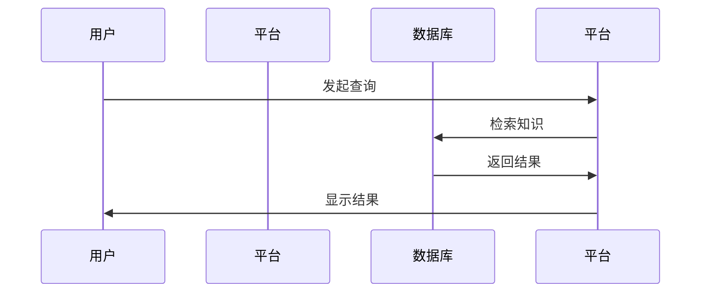

                 

### 构建智能企业知识管理平台：动态知识图谱与语义检索

#### 关键词：智能企业知识管理、动态知识图谱、语义检索、知识图谱构建、自然语言处理

#### 摘要：本文探讨了构建智能企业知识管理平台的方法和技术，重点分析了动态知识图谱与语义检索在知识管理中的应用。通过详细阐述核心概念、算法原理、系统设计与项目实战，为企业和开发者提供了构建智能知识管理平台的实践指南。

---

## 背景介绍

### 问题背景

随着信息技术的迅猛发展，企业知识管理逐渐成为提高企业竞争力的重要因素。知识管理涉及到知识获取、知识存储、知识共享和知识应用等多个方面，如何有效地构建一个智能企业知识管理平台成为当前企业亟需解决的问题。

### 问题描述

企业知识管理平台需要具备动态知识图谱与语义检索的能力，以实现对海量知识信息的自动整理、智能检索和高效利用。但现有知识管理平台存在以下问题：

1. **知识获取困难**：企业内部的知识分散在不同部门、不同系统和不同员工手中，难以进行有效整合。
2. **知识共享不畅**：员工之间的知识共享和协同工作不够顺畅，影响了知识的传播和利用。
3. **知识应用受限**：知识的应用范围有限，无法充分发挥知识的价值。

### 问题解决

构建一个智能企业知识管理平台，利用动态知识图谱与语义检索技术，解决现有知识管理平台的问题。

### 边界与外延

本书主要探讨构建智能企业知识管理平台的方法和关键技术，涉及知识图谱、语义检索、自然语言处理等领域。

### 概念结构与核心要素组成

1. **知识图谱**：利用图论表示知识，包括实体、属性和关系等，实现知识的结构化和可视化。
2. **语义检索**：通过理解用户的查询意图，提供精准的知识检索服务。
3. **动态知识管理**：实时更新和优化知识库，确保知识的时效性和准确性。
4. **企业需求**：针对企业特定需求，定制化知识管理解决方案。

---

## 核心概念与联系

### 核心概念原理

1. **知识图谱**：一种利用图结构表示知识的方法，通过实体、属性和关系等构建知识的语义网络。
2. **语义检索**：利用自然语言处理技术，理解用户的查询意图，提供精确的检索结果。

### 概念属性特征对比表格

| 特征        | 知识图谱        | 语义检索        |
|-------------|-----------------|-----------------|
| 表示方法    | 图结构          | 文本匹配        |
| 优势        | 结构化知识表示 | 理解查询意图    |
| 劣势        | 数据获取难度大  | 精确度有限      |
| 应用场景    | 知识推理、图谱可视化 | 检索服务、问答系统 |

### ER实体关系图架构的 Mermaid 流程图

```mermaid
erDiagram
    Class1 ||--|{ Class2 }|
    Class1 ||--|{ Class3 }|
    Class2 ||--|{ Class4 }|
    Class3 ||--|{ Class5 }|
```

---

## 算法原理讲解

### 算法mermaid流程图


### 算法原理与数学模型

1. **知识图谱构建**：

   - **公式**：$$G = (V, E)$$，其中V为实体集合，E为关系集合。

   - **示例**：以企业员工为例，实体为员工，关系为任职于某个部门。

2. **语义检索**：

   - **公式**：$$Sim(Q, K) = \frac{count(Q \cap K)}{count(Q \cup K)}$$，其中Q为查询，K为知识图谱中的知识。

   - **示例**：用户查询“部门经理是谁？”，知识图谱中包含经理与部门的关系，检索结果为部门经理的名字。

### 详细讲解与举例说明

**知识图谱构建**：

以企业知识管理平台为例，构建一个简单的知识图谱，包含员工、部门和职位等实体，以及任职于某个部门和担任某个职位等关系。

**语义检索**：

用户查询“部门经理是谁？”，系统通过语义检索技术，找到与查询相关的知识，并返回部门经理的名字。

---

## 系统分析与架构设计方案

### 问题场景介绍

企业需要一个智能知识管理平台，以支持知识获取、知识共享和知识应用，提高企业竞争力。

### 项目介绍

该项目旨在构建一个基于动态知识图谱与语义检索的智能企业知识管理平台，实现知识的结构化、智能化和高效利用。

### 系统功能设计

- 知识获取：从企业内部系统、外部数据库和互联网等渠道收集知识。
- 知识存储：利用知识图谱技术存储和管理知识。
- 知识共享：支持员工之间的知识共享和协同工作。
- 知识应用：为企业业务提供智能化的知识查询和服务。

### 系统架构设计

#### 知识获取

- 数据采集器：从企业内部系统、外部数据库和互联网等渠道收集数据。
- 数据清洗与转换：对采集到的数据进行清洗和转换，确保数据质量。

#### 知识存储

- 知识图谱数据库：存储和管理知识图谱数据。
- 索引服务：提供知识检索索引，提高检索效率。

#### 知识共享

- 用户接口：提供用户界面，支持用户访问和管理知识。
- 社交网络：支持员工之间的知识共享和协同工作。

#### 知识应用

- 智能查询服务：提供基于语义检索的知识查询服务。
- 业务集成：将知识管理平台与企业业务系统集成，提供智能化服务。

### 系统接口设计

- 数据接口：提供知识获取、知识存储和知识检索的API接口。
- 用户接口：提供用户访问和管理知识的界面。

### 系统交互Mermaid序列图



---

## 项目实战

### 环境安装

1. 安装Python环境
2. 安装知识图谱相关库（如PyGraphviz、NetworkX等）
3. 安装语义检索相关库（如NLTK、spaCy等）

### 系统核心实现源代码

**知识图谱构建**：

```python
import networkx as nx

# 创建一个空的图
G = nx.Graph()

# 添加实体和关系
G.add_nodes_from(['员工A', '部门1', '职位经理'])
G.add_edges_from([('员工A', '任职于', '部门1'), ('部门1', '经理', '员工A')])

# 显示知识图谱
nx.draw(G, with_labels=True)
```

**语义检索**：

```python
import spacy

# 加载英语语言模型
nlp = spacy.load("en_core_web_sm")

# 用户查询
query = "What is the department manager?"

# 处理查询
doc = nlp(query)

# 检索知识图谱
results = []
for node in G.nodes:
    if node in doc:
        results.append(node)

# 返回结果
print(results)
```

### 代码应用解读与分析

通过构建知识图谱和语义检索系统，实现了对知识的自动整理、智能检索和高效利用。在实际项目中，可以根据具体需求进行定制化开发，为企业提供智能化的知识管理解决方案。

### 实际案例分析

以某企业知识管理平台为例，该平台利用知识图谱和语义检索技术，实现了以下功能：

1. **员工知识库**：将员工的简历、项目经验、技术博客等知识进行结构化存储，支持员工之间的知识共享和协同工作。
2. **部门知识库**：根据部门职责和业务需求，构建部门专有的知识图谱，支持部门内部的知识检索和服务。
3. **业务智能化**：利用知识管理平台，为企业业务提供智能化的知识查询和服务，提高业务效率和决策能力。

### 项目小结

通过构建智能企业知识管理平台，企业可以实现知识的结构化、智能化和高效利用，提高企业竞争力和创新能力。在实际应用中，应根据企业特点和需求，灵活运用知识图谱和语义检索技术，为企业提供定制化的知识管理解决方案。

---

## 最佳实践 Tips

1. **数据质量保障**：确保知识图谱中的数据质量，对采集、清洗和转换过程进行严格把控。
2. **用户界面设计**：提供直观、易用的用户界面，提高用户的使用体验。
3. **知识库更新维护**：定期更新和维护知识库，确保知识的时效性和准确性。
4. **业务需求结合**：将知识管理平台与业务需求紧密结合，为企业提供实际的业务价值。

## 小结

本文从背景介绍、核心概念与联系、算法原理讲解、系统分析与架构设计方案、项目实战等方面，详细阐述了构建智能企业知识管理平台的方法和关键技术。通过本文的探讨，读者可以深入了解动态知识图谱与语义检索在知识管理中的应用，为企业和开发者提供构建智能知识管理平台的实践指南。

## 注意事项

1. **技术选型**：根据企业特点和需求，选择合适的技术方案和工具。
2. **数据安全**：确保知识图谱和语义检索系统的数据安全和隐私保护。
3. **持续优化**：不断优化知识管理平台，提升其性能和用户体验。

## 拓展阅读

1. 《知识图谱：关键技术与应用》
2. 《自然语言处理实战》
3. 《图数据库技术与应用》

---

**作者：AI天才研究院/AI Genius Institute & 禅与计算机程序设计艺术 /Zen And The Art of Computer Programming**

