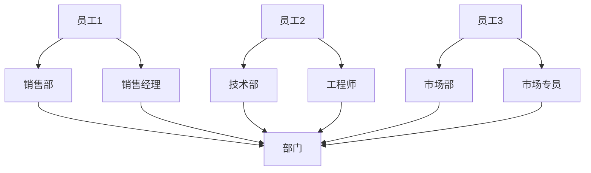
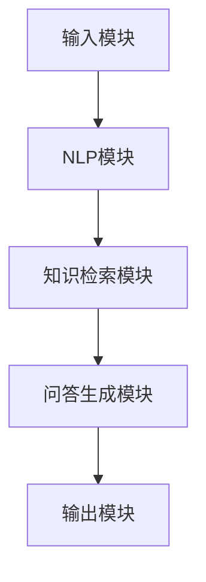
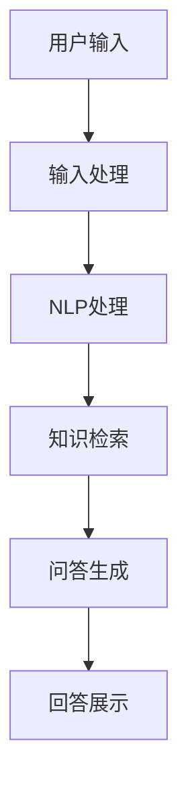

                 

### 文章标题

在数字化转型的浪潮中，构建智能企业知识管理平台已成为企业提升竞争力、优化知识流动的重要手段。本文将以《构建智能企业知识管理平台：知识图谱与智能问答》为主题，深入探讨知识图谱与智能问答在智能企业知识管理平台中的核心作用与实现方法。我们将通过逻辑清晰、结构紧凑的讨论，帮助读者了解这一领域的最新发展与应用。

本文的核心关键词包括：知识图谱、智能问答、智能企业知识管理平台、知识管理、数据存储、算法原理、应用场景。通过这些关键词，我们将梳理出本文的主要内容结构，并在接下来的章节中逐一展开讨论。

首先，在**背景介绍**部分，我们将阐述当前企业知识管理的困境，并介绍知识图谱与智能问答的定义、基本概念及其联系。接着，我们将深入分析知识图谱的原理与实现，探讨其在数据采集、数据清洗、数据建模和数据存储等方面的具体方法。同时，我们将介绍几种典型的知识图谱算法，如图谱嵌入算法、图谱聚类算法和图谱挖掘算法，并通过实际案例展示其应用场景。

在**第三部分：智能问答系统**中，我们将介绍智能问答系统的基本概念、架构设计和算法原理，特别是基于规则、机器学习和深度学习的方法。接下来，我们将探讨智能问答系统的应用场景，包括企业内部问答系统、在线客服问答系统和智能问答机器人。

**第四部分：智能企业知识管理平台**将讨论平台的整体架构设计、知识管理流程、平台实施与部署以及平台运营与维护。我们将结合实际案例，详细分析平台的构建过程和关键技术研究。

最后，在**第五部分：案例与最佳实践**中，我们将分享一些成功案例和最佳实践经验，帮助读者更好地理解和应用知识图谱与智能问答技术。通过本文的深入探讨，我们希望读者能够全面掌握智能企业知识管理平台的设计与实现方法，为企业的数字化转型提供有力支持。

### 文章关键词

- 知识图谱
- 智能问答
- 智能企业知识管理平台
- 知识管理
- 数据存储
- 算法原理
- 应用场景

### 文章摘要

本文旨在探讨构建智能企业知识管理平台中的关键组件——知识图谱与智能问答。首先，我们介绍了知识图谱与智能问答的基本概念、背景和定义，并探讨了它们在知识管理中的重要性。随后，我们深入分析了知识图谱的构建方法、核心算法和应用场景，详细介绍了图谱嵌入算法、聚类算法和挖掘算法。接着，我们探讨了智能问答系统的架构、算法及其实际应用场景，包括企业内部问答系统、在线客服系统和智能问答机器人。最后，本文全面阐述了智能企业知识管理平台的设计与实现方法，包括平台架构设计、知识管理流程、平台实施与部署以及平台运营与维护。通过本文的探讨，读者将全面了解并掌握智能企业知识管理平台的构建方法和关键技术，为企业的数字化转型提供有力支持。

### 第一部分：背景介绍

在当今快速变化的市场环境中，企业面临的竞争压力越来越大，如何有效管理和利用知识资源成为提升企业核心竞争力的关键。然而，传统的企业知识管理方式往往存在诸多问题，如知识分散、难以检索、知识流转不畅等。这些困境不仅影响了企业内部的知识共享和创新能力，还制约了企业的整体运营效率。因此，构建智能企业知识管理平台成为许多企业的迫切需求。

#### 第1章：问题背景与定义

**1.1 问题背景**

当前，企业面临的主要知识管理问题可以概括为以下几点：

1. **知识分散**：企业内部的知识往往分散在不同的部门和系统中，难以进行统一管理和检索。
2. **知识老化**：随着时间的推移，知识内容逐渐陈旧，不能及时更新和优化，导致知识价值降低。
3. **知识流动不畅**：企业内部的知识流转过程复杂，沟通和协作成本高，影响知识共享和利用效率。
4. **知识不透明**：企业知识管理体系的透明度不高，员工难以了解和获取所需的知识资源。

**1.2 问题定义**

针对上述问题，企业知识管理的核心目标是实现知识的全面整合、高效检索和有效利用。具体而言，需要解决以下几个问题：

1. **如何将分散的知识资源进行统一管理和整合？**
2. **如何确保知识内容的质量和及时更新？**
3. **如何优化知识流转过程，提高知识共享和利用效率？**
4. **如何提升知识管理的透明度，方便员工获取所需知识资源？**

**1.3 解决方案概述**

为了解决上述问题，构建智能企业知识管理平台成为了一种有效的解决方案。该平台通过引入知识图谱和智能问答技术，实现对知识的结构化管理和智能化检索，从而提升知识管理的整体效率。

**1.4 边界与外延**

智能企业知识管理平台的边界主要包括以下几个方面：

1. **知识范围**：平台需要涵盖企业各个业务部门和领域的知识，包括业务数据、文档资料、培训资料等。
2. **用户范围**：平台需要支持企业内部所有员工以及合作伙伴和客户的访问和使用。
3. **技术范围**：平台需要集成熟知图谱构建、数据存储、智能问答、用户交互等多个技术模块。

智能企业知识管理平台的外延则体现在以下几个方面：

1. **业务拓展**：平台需要与企业其他业务系统进行无缝集成，实现知识的全方位应用。
2. **技术升级**：随着技术的不断发展，平台需要不断升级和优化，以适应新的需求。
3. **用户体验**：平台需要提供便捷友好的用户界面，提升用户的操作体验和满意度。

**1.5 核心要素组成**

智能企业知识管理平台的核心要素主要包括以下几个方面：

1. **知识图谱**：用于对知识资源进行结构化表示和整合，提高知识检索和利用效率。
2. **智能问答**：通过自然语言处理和机器学习技术，实现用户问题的自动回答和知识检索。
3. **数据存储**：采用高效的数据存储和管理技术，确保知识数据的可靠性和安全性。
4. **用户交互**：提供便捷友好的用户界面和交互方式，方便用户进行知识查询和操作。

通过上述核心要素的有机结合，智能企业知识管理平台能够实现知识的全面整合、高效检索和智能利用，从而提升企业的知识管理水平，推动企业的数字化转型。

### 第2章：核心概念与联系

在构建智能企业知识管理平台的过程中，理解知识图谱与智能问答的基本概念及其相互联系至关重要。知识图谱和智能问答作为知识管理的重要组成部分，不仅提升了知识的组织与利用效率，还为企业提供了智能化服务。以下是这两个概念的定义、属性特征对比以及它们在智能企业知识管理平台中的关系。

#### 2.1 核心概念

**2.1.1 知识图谱**

知识图谱（Knowledge Graph）是一种结构化的知识表示方法，通过图形化的方式展示知识实体及其相互关系。知识图谱的核心目的是将无序的数据转化为有序的知识，从而便于快速检索和利用。它通常由节点（知识实体）、边（关系）和属性（描述节点属性的属性值）组成。

**2.1.2 智能问答**

智能问答（Intelligent Question-Answering）是一种通过自然语言处理（NLP）和机器学习技术，实现用户问题和答案自动匹配与生成的方法。智能问答系统能够理解用户输入的自然语言问题，并从知识库或知识图谱中检索出相关答案，提供智能化服务。

#### 2.2 概念属性特征对比

为了更好地理解知识图谱与智能问答的区别和联系，我们可以通过表格来对比它们的属性特征：

| 特征       | 知识图谱                         | 智能问答                         |
|------------|--------------------------------|--------------------------------|
| 定义       | 结构化知识表示，图形化展示       | 自然语言问题自动回答与匹配     |
| 主要功能   | 知识整合、关系映射、知识检索     | 自动回答、信息抽取、自然语言生成 |
| 数据模型   | 图数据模型，RDF/OWL等           | 文本数据模型，基于规则/机器学习  |
| 技术难度   | 较高，涉及图数据库、图谱构建算法  | 较高，涉及NLP、深度学习等技术   |
| 应用领域   | 搜索引擎、推荐系统、智能客服     | 客户服务、企业内部问答、智能助手 |

通过上述表格，我们可以看到知识图谱与智能问答在功能、数据模型和技术难度等方面存在差异，但它们在智能企业知识管理平台中相辅相成，共同提升知识管理效率。

#### 2.3 ER实体关系图架构

在知识图谱与智能问答的实现过程中，实体关系图（Entity-Relationship Diagram，ERD）是一种常用的架构设计工具。ERD用于描述知识图谱中的实体、关系和属性，为知识图谱的构建提供清晰的结构框架。

下面是一个简单的ERD示例，展示了知识图谱中的实体、关系及其属性：

```mermaid
graph ERD
  entity Node {
    "ID" [id]
    "Type" [type]
    "Label" [label]
    "Attributes" [attributes]
  }
  
  entity Edge {
    "ID" [id]
    "Type" [type]
    "Source" [source]
    "Target" [target]
    "Relation" [relation]
  }
  
  relationship "Has" {
    Node [has]
    Edge [hasEdge]
  }
  
  relationship "Belongs" {
    Node [belongsTo]
    Edge [belongsToEdge]
  }
  
  Node(1) ["Person" "Person1" {"Age": 30, "Occupation": "Engineer"}]
  Node(2) ["Organization" "CompanyA" {"Size": 1000, "Industry": "Tech"}]
  Node(3) ["Project" "ProjectX" {"Start Date": "2023-01-01", "End Date": "2023-12-31"}]
  Edge(1) ["Works For"] [Node(1)] [Node(2)]
  Edge(2) ["Participates In"] [Node(1)] [Node(3)]
```

在这个ERD中，我们定义了三个主要实体：Node（节点）、Edge（边）和关系（Has、Belongs）。节点表示知识图谱中的实体，如人员、组织、项目等；边表示实体之间的关系，如“Works For”（工作于）、“Participates In”（参与）；关系用于描述节点和边之间的关联。

通过这个简单的ERD示例，我们可以更好地理解知识图谱的基本结构，从而为后续的知识图谱构建和智能问答实现提供参考。

### 第3章：知识图谱基础

知识图谱作为一种高效的知识表示和利用工具，在智能企业知识管理平台中发挥着关键作用。在本节中，我们将详细探讨知识图谱的基础概念、核心要素及其表示方法，帮助读者建立对知识图谱的基本理解。

#### 3.1 知识图谱概述

**3.1.1 知识图谱的定义**

知识图谱（Knowledge Graph）是一种将数据以图形化的形式进行组织、存储和表示的技术。它通过节点（实体）、边（关系）和属性（描述节点或边的额外信息）来构建知识网络，实现知识的结构化组织和智能查询。与传统的表格或关系数据库不同，知识图谱能够更好地表示实体间的复杂关系和层次结构。

**3.1.2 知识图谱的核心要素**

知识图谱由以下三个核心要素组成：

1. **实体（Entity）**：知识图谱中的基本元素，代表各种知识对象，如人、物、事件等。每个实体都有唯一的标识符和属性。
2. **关系（Relationship）**：连接两个或多个实体的关联，表示实体之间的相互作用或归属关系。关系通常具有方向性和权重。
3. **属性（Attribute）**：描述实体或关系的额外信息，如实体的年龄、职位、位置等。属性可以为实体提供更详细的描述，增强知识图谱的语义表达能力。

**3.2 知识图谱的表示方法**

知识图谱的表示方法主要有以下几种：

**1. 图数据模型**

图数据模型是知识图谱最常用的表示方法。在这种模型中，实体用节点表示，关系用边表示，节点的属性和关系的属性则通过键值对或标签附加在节点和边上。图数据模型能够灵活地表示实体和关系之间的复杂网络结构，并提供高效的查询性能。

**2. RDF数据模型**

RDF（Resource Description Framework）是一种基于图的数据模型，用于描述Web上的资源和它们之间的关系。在RDF中，实体被称为“资源”，关系被称为“属性”，属性值则称为“对象”。RDF使用URI（统一资源标识符）来唯一标识实体和属性，并通过三元组（主体，谓词，客体）来表示关系。

**3.3 知识图谱的构建方法**

知识图谱的构建是一个复杂的过程，通常包括以下步骤：

**1. 数据采集**

数据采集是知识图谱构建的第一步，包括从各种数据源（如数据库、文档、网页等）收集原始数据。这些数据可以是结构化数据、半结构化数据或非结构化数据。

**2. 数据清洗**

数据清洗是确保数据质量的关键步骤。它包括数据去重、数据格式转换、数据填充和错误修正等操作。数据清洗的目的是去除噪声数据，提高数据的一致性和准确性。

**3. 数据建模**

数据建模是将采集到的数据转化为知识图谱表示的过程。在这一步中，需要定义实体、关系和属性的语义，并确定它们之间的映射关系。常用的数据建模方法包括ER模型、OWL本体模型等。

**4. 数据存储**

数据存储是将构建好的知识图谱存储到图数据库或其他数据存储系统中，以便进行查询和更新。常见的图数据库包括Neo4j、OrientDB和ArangoDB等。

**3.4 知识图谱的构建方法**

以下是一个简单的知识图谱构建流程：

1. **数据采集**：从企业内部数据库、文档库和互联网等渠道收集原始数据。
2. **数据清洗**：去除重复数据、修正错误、统一格式等，确保数据质量。
3. **数据建模**：定义实体、关系和属性的语义，构建知识图谱的模型。
4. **数据存储**：将知识图谱存储到图数据库中，为后续查询和更新提供支持。

通过上述步骤，我们可以构建一个结构清晰、语义丰富的知识图谱，为智能企业知识管理平台提供强大的知识表示和查询能力。

#### 3.2.1 图数据模型

图数据模型是知识图谱中表示和存储数据的基础。在这种模型中，每个实体被视为一个节点，实体之间的关系则通过边来表示。图数据模型的核心是能够灵活地表示实体和关系之间的复杂网络结构，并提供高效的查询性能。

**1. 节点（Node）**

节点是知识图谱中的基本元素，代表各种知识对象。节点通常具有唯一的标识符（ID）和一组属性。例如，在组织架构知识图谱中，每个员工都可以是一个节点，具有如姓名、职位、部门等属性。

**2. 边（Edge）**

边是连接两个或多个节点的元素，表示实体之间的关系。边具有方向性和权重，方向性表示关系的方向，权重则表示关系的重要性或强度。例如，在社交网络中，朋友关系可以用一个有向边表示，方向是从一个人指向另一个人。

**3. 属性（Attribute）**

属性是描述节点或边的额外信息。例如，在人员节点中，除了基本属性（如姓名、职位）外，还可以包括如年龄、性别、工作经历等属性。在边中，属性可以表示关系的额外信息，如关系的持续时间、关系强度等。

**4. 图数据模型的表示**

图数据模型可以用图形化的方式表示，如图3-1所示：

```mermaid
graph G
    A("员工A") --> B("员工B") [label="同事关系", color=red]
    A --> C("员工C") [label="上级关系", color=blue]
    B --> C [label="下属关系", color=blue]
```

在这个示例中，A、B、C是三个员工节点，它们之间通过不同的边连接，表示了同事、上级和下属等关系。每个边都有一个标签和颜色，用于区分不同类型的关系。

通过图数据模型，知识图谱能够灵活地表示实体和关系之间的复杂网络结构，为智能企业知识管理平台提供强大的知识表示和查询能力。

#### 3.2.2 RDF数据模型

RDF（Resource Description Framework）是一种基于图的数据模型，用于描述Web上的资源和它们之间的关系。RDF使用统一资源标识符（URI）来唯一标识资源和属性，并通过三元组（主体，谓词，客体）来表示关系。RDF数据模型在知识图谱构建中具有重要作用，特别是在语义网和Web数据集成领域。

**1. RDF的基本概念**

- **资源**：任何可以被标识的事物，如网页、文档、物品等，都可以被视为资源。RDF使用URI（统一资源标识符）来唯一标识资源。
- **属性**：描述资源的属性，如标题、作者、日期等。属性也用URI表示，称为属性URI。
- **值**：属性的值，可以是文字、数字、日期等。值可以是文本形式或通过URI引用其他资源。
- **三元组**：RDF的核心表示形式，由主体、谓词和客体组成。主体是资源，谓词是属性，客体是属性的值或另一个资源。

**2. RDF的表示方法**

RDF使用三元组（主体，谓词，客体）来表示知识。以下是RDF数据模型的示例：

```plaintext
<http://example.org/employee#1> <http://example.org/hasName> "Alice".
<http://example.org/employee#1> <http://example.org/hasAge> "30".
<http://example.org/employee#2> <http://example.org/hasName> "Bob".
<http://example.org/employee#2> <http://example.org/hasAge> "35".
```

在这个示例中，我们定义了两个员工资源，每个员工都有名字和年龄属性。这些属性通过URI进行标识，并通过三元组形式进行描述。

**3. RDF在知识图谱中的应用**

RDF在知识图谱构建中有着广泛的应用。通过将数据以RDF的形式表示，知识图谱能够更好地进行语义理解和查询。例如，在一个企业知识图谱中，可以使用RDF来描述员工、项目、组织结构等实体及其关系。

以下是一个简单的企业知识图谱RDF示例：

```plaintext
<http://example.org/employee#1> a <http://example.org/Employee>.
<http://example.org/employee#1> <http://example.org/hasName> "Alice".
<http://example.org/employee#1> <http://example.org/hasAge> "30".
<http://example.org/employee#1> <http://example.org/isMemberOf> <http://example.org/department#1>.

<http://example.org/department#1> a <http://example.org/Department>.
<http://example.org/department#1> <http://example.org/hasName> "Development".
```

在这个示例中，我们定义了一个员工实体和一个部门实体，并描述了员工属于某个部门的关系。通过RDF表示，知识图谱能够清晰地表示实体和关系，并提供语义查询能力。

通过RDF数据模型，知识图谱能够更好地进行语义理解和查询，为智能企业知识管理平台提供强大的知识表示和利用能力。

#### 3.3.1 数据采集

数据采集是知识图谱构建的第一步，是确保知识图谱质量和实用性的基础。数据采集的目的是从各种数据源（如数据库、文档、网页等）中收集原始数据，为后续的数据清洗、建模和存储提供数据基础。

**1. 数据源类型**

知识图谱的数据源通常包括以下几种类型：

- **结构化数据源**：如关系数据库、数据仓库等，这些数据源中的数据具有固定的格式和结构，易于进行自动化采集和解析。
- **半结构化数据源**：如XML、JSON、HTML等，这些数据源中的数据具有部分结构，但缺乏严格的格式规范，需要通过特定的解析方法进行采集。
- **非结构化数据源**：如文本文件、图片、音频、视频等，这些数据源中的数据缺乏明确的结构，通常需要通过自然语言处理、图像识别等技术进行采集和处理。

**2. 数据采集方法**

数据采集方法主要包括以下几种：

- **自动化采集**：使用爬虫、数据提取工具等自动化工具从互联网或内部系统中采集数据。这种方法适用于结构化或半结构化数据源，具有较高的效率和自动化程度。
- **手动采集**：通过人工方式从文档、表格等数据源中收集数据。这种方法适用于数据量较小或数据来源不明确的情况，但效率较低。
- **API采集**：通过访问外部系统的API接口，获取数据。这种方法适用于需要与其他系统集成的场景，但需要确保API的可用性和安全性。

**3. 数据采集示例**

以下是一个简单的数据采集示例，假设我们需要从企业内部员工数据库中采集员工信息：

```python
import pymysql

# 连接数据库
connection = pymysql.connect(host='localhost', user='root', password='password', database='employees')

# 创建游标
cursor = connection.cursor()

# 执行查询语句
cursor.execute("SELECT * FROM employee WHERE department = 'Development';")

# 获取查询结果
results = cursor.fetchall()

# 遍历结果并打印
for row in results:
    print(f"ID: {row[0]}, Name: {row[1]}, Age: {row[2]}, Department: {row[3]}")

# 关闭游标和数据库连接
cursor.close()
connection.close()
```

在这个示例中，我们使用Python的pymysql库连接企业内部员工数据库，并执行SQL查询语句，从开发部门中采集员工信息。通过遍历查询结果，我们可以获取每个员工的ID、姓名、年龄和部门等信息。

通过有效的数据采集，我们能够从多种数据源中获取所需的数据，为知识图谱的构建提供丰富的数据基础。

#### 3.3.2 数据清洗

数据清洗是知识图谱构建过程中的重要步骤，其目的是去除噪声数据、修正错误数据，确保数据的一致性和准确性。数据清洗的效果直接影响到知识图谱的质量和实用性。

**1. 数据清洗的目标**

数据清洗的主要目标包括以下几个方面：

- **去除噪声数据**：噪声数据是指不符合数据规范或数据质量要求的数据，如重复记录、无效记录等。通过数据清洗，可以去除这些噪声数据，提高数据的纯净度。
- **修正错误数据**：错误数据是指数据值错误或不完整的数据，如数据格式错误、数据丢失等。通过数据清洗，可以修正这些错误数据，提高数据的质量。
- **统一数据格式**：不同数据源的数据格式可能不同，如日期格式、文本格式等。通过数据清洗，可以统一数据格式，确保数据的兼容性和一致性。
- **提高数据一致性**：通过数据清洗，可以消除数据中的不一致性，如数据值的不同表示、数据来源的不同版本等。

**2. 数据清洗的方法**

数据清洗的方法主要包括以下几种：

- **去重**：通过比对数据记录的唯一标识，如ID、名称等，去除重复的数据记录。
- **格式转换**：将不同格式的数据转换为统一的格式，如将日期从YYYY-MM-DD格式转换为DD-MM-YYYY格式。
- **错误修正**：通过检查数据值的有效性，修正错误数据，如将空值修正为合理值。
- **数据填充**：通过数据源或外部数据集，补充缺失的数据值，如使用相似数据记录的值填充缺失字段。

**3. 数据清洗示例**

以下是一个简单的数据清洗Python代码示例，用于清洗员工信息数据：

```python
import pandas as pd

# 读取原始数据
data = pd.read_csv('employees.csv')

# 去除重复记录
data.drop_duplicates(inplace=True)

# 格式转换
data['出生日期'] = pd.to_datetime(data['出生日期'], format='%Y-%m-%d')

# 修正错误数据
data.replace({'部门': {'无效部门1': '开发部', '无效部门2': '市场部'}}, inplace=True)

# 填充缺失数据
data.fillna(method='ffill', inplace=True)

# 输出清洗后的数据
print(data.head())
```

在这个示例中，我们使用Pandas库读取CSV格式的员工信息数据，并进行去重、格式转换、错误修正和缺失数据填充等操作。通过这些数据清洗步骤，我们可以获得高质量的数据，为知识图谱的构建提供可靠的数据基础。

通过有效的数据清洗，我们能够确保数据的一致性和准确性，为知识图谱的构建提供高质量的数据支持。

#### 3.3.3 数据建模

数据建模是知识图谱构建过程中至关重要的一步，其目的是将原始数据转化为结构化的知识表示，为后续的存储和查询奠定基础。数据建模主要包括实体识别、关系抽取和属性提取等步骤，通过这些步骤，我们可以将原始数据中的隐含知识显式地表示出来。

**1. 实体识别**

实体识别（Entity Recognition）是数据建模的第一步，其目标是识别出原始数据中的关键实体。这些实体可以是人、地点、组织、事件等。实体识别通常基于自然语言处理技术，如命名实体识别（Named Entity Recognition，NER），通过模型或规则识别文本中的实体。

**2. 关系抽取**

关系抽取（Relationship Extraction）的目的是识别出实体之间的关系。关系可以是简单的“属于”（如员工属于某个部门）或复杂的“参与”（如某人在某个项目中工作）。关系抽取可以通过规则匹配、机器学习或深度学习等方法实现。例如，使用条件随机场（CRF）模型或BERT等预训练模型进行关系抽取。

**3. 属性提取**

属性提取（Attribute Extraction）是识别出实体或关系的额外信息。这些属性可以用来描述实体的特征，如员工的年龄、职位、工作年限等。属性提取可以通过信息抽取（Information Extraction）技术实现，如命名实体识别、关键字提取等。

**4. 数据建模示例**

以下是一个简单的数据建模示例，假设我们有一份员工信息数据：

| 员工ID | 姓名 | 部门 | 职位 | 入职日期 | 工作年限 |
|--------|------|------|------|----------|----------|
| 1      | 张三 | 销售 | 销售经理 | 2020-01-01 | 5        |
| 2      | 李四 | 技术 | 工程师 | 2018-05-10 | 3        |
| 3      | 王五 | 市场 | 市场专员 | 2019-09-01 | 2        |

**实体识别**：从数据中识别出关键实体，如员工、部门、职位等。

**关系抽取**：抽取实体之间的关系，如员工属于某个部门、员工担任某个职位等。

**属性提取**：提取实体的属性信息，如员工的工作年限、入职日期等。

**知识表示**：将上述识别出的实体、关系和属性构建为知识图谱，如下所示：



在这个知识图谱中，每个实体（如员工、部门、职位）都用节点表示，实体之间的关系（如属于、担任）用边表示，实体的属性（如工作年限、入职日期）则附加在节点上。通过这样的数据建模，我们可以将原始数据转化为结构化的知识表示，为后续的知识存储和查询提供支持。

数据建模是知识图谱构建的关键步骤，通过实体识别、关系抽取和属性提取，我们能够将原始数据转化为结构化的知识表示，为知识图谱的构建打下坚实基础。

#### 3.3.4 数据存储

数据存储是知识图谱构建过程中的关键环节，其目的是确保知识图谱中的数据结构化和高效查询。知识图谱的数据存储主要采用图数据库，图数据库通过图数据模型（如Neo4j）和RDF数据模型（如Dolmen）进行数据的存储和管理。

**1. 图数据库**

图数据库是一种基于图数据模型的数据库系统，能够高效地存储和查询具有复杂关系结构的数据。图数据库的核心概念包括节点（Node）、边（Edge）和属性（Attribute）。节点表示知识图谱中的实体，边表示实体之间的关系，属性则是描述节点或边的额外信息。图数据库通过图索引技术（如B+树、LSM树）和图遍历算法（如深度优先搜索、广度优先搜索）实现高效的查询和更新。

**2. RDF数据模型**

RDF（Resource Description Framework）数据模型是一种基于图的数据模型，用于描述Web上的资源和它们之间的关系。在RDF数据模型中，资源（Resource）通过URI（Uniform Resource Identifier）进行标识，属性（Property）也通过URI进行标识，并通过三元组（Subject, Predicate, Object）来表示资源之间的关系。RDF数据模型支持语义查询和高级数据操作，如数据集成、数据转换和推理。

**3. 数据存储示例**

以下是一个简单的知识图谱数据存储示例，假设我们有一个企业知识图谱，其中包含员工、部门和项目等实体及其关系：

**员工实体**：
- 张三：销售部、销售经理、5年
- 李四：技术部、工程师、3年
- 王五：市场部、市场专员、2年

**关系**：
- 张三属于销售部
- 李四属于技术部
- 王五属于市场部

**项目实体**：
- 项目1：张三、李四
- 项目2：王五

**关系**：
- 张三参与项目1
- 李四参与项目1
- 王五参与项目2

使用Neo4j图数据库存储上述知识图谱，数据存储过程如下：

1. **创建节点**：为每个实体创建一个节点，并添加属性。
   ```python
   CREATE (zhangsan:Employee {name: '张三', department: '销售部', position: '销售经理', work_experience: 5});
   CREATE (liisi:Employee {name: '李四', department: '技术部', position: '工程师', work_experience: 3});
   CREATE (wangwu:Employee {name: '王五', department: '市场部', position: '市场专员', work_experience: 2});
   CREATE (xiangmu1:Project {name: '项目1', members: ['张三', '李四']});
   CREATE (xiangmu2:Project {name: '项目2', members: ['王五']});
   ```

2. **创建边**：为实体之间的关系创建边。
   ```python
   MATCH (zhangsan:Employee), (department:Department {name: '销售部'})
   CREATE (zhangsan)-[:BELONGS_TO]->(department);

   MATCH (liisi:Employee), (department:Department {name: '技术部'})
   CREATE (liisi)-[:BELONGS_TO]->(department);

   MATCH (wangwu:Employee), (department:Department {name: '市场部'})
   CREATE (wangwu)-[:BELONGS_TO]->(department);

   MATCH (zhangsan:Employee), (xiangmu1:Project)
   CREATE (zhangsan)-[:PARTICIPATES_IN]->(xiangmu1);

   MATCH (liisi:Employee), (xiangmu1:Project)
   CREATE (liisi)-[:PARTICIPATES_IN]->(xiangmu1);

   MATCH (wangwu:Employee), (xiangmu2:Project)
   CREATE (wangwu)-[:PARTICIPATES_IN]->(xiangmu2);
   ```

通过以上步骤，我们将企业知识图谱存储在Neo4j图数据库中，实现了数据的高效存储和管理。图数据库通过索引和遍历算法，可以快速查询实体和关系，为智能企业知识管理平台提供强大的数据支持。

#### 3.4 知识图谱算法概述

知识图谱的构建和优化依赖于一系列高效的算法，这些算法在数据采集、清洗、建模以及图谱优化等环节中发挥着关键作用。以下我们将概述几种常见的知识图谱算法，并简要介绍其在知识图谱构建中的具体应用。

**1. 图谱嵌入算法**

图谱嵌入算法（Graph Embedding Algorithms）将图中的节点、边和整个图映射到一个低维空间中，从而便于进行后续的机器学习和数据分析。常见的图谱嵌入算法包括DeepWalk、Node2Vec和GraphSAGE等。这些算法能够有效地捕捉节点之间的相似性和关系，在推荐系统、社交网络分析和图数据分析等领域有广泛应用。

**2. 图谱聚类算法**

图谱聚类算法（Graph Clustering Algorithms）用于将图中的节点划分为若干个群组，使得同一群组内的节点之间具有较高的相似性，而不同群组之间的节点相似性较低。常见的图谱聚类算法包括基于模块度的聚类（如Gaussian Mixture Model）、基于图分解的聚类（如Multilevel community detection）和基于邻域的聚类（如DBSCAN）。这些算法在社区发现、节点分类和图谱结构分析等领域具有重要作用。

**3. 图谱挖掘算法**

图谱挖掘算法（Graph Mining Algorithms）用于从知识图谱中挖掘潜在的知识和模式。常见的图谱挖掘算法包括图模式识别（如频繁子图挖掘）、图结构化数据分析（如矩阵分解）和图深度学习（如图神经网络）。这些算法能够发现图中的隐含关系和知识，为智能推荐、知识发现和图分析提供有力支持。

**4. 图谱优化算法**

图谱优化算法（Graph Optimization Algorithms）用于改进知识图谱的结构和性能，以提高查询效率和数据质量。常见的图谱优化算法包括图同构图（如Graph Isomorphism）、图谱压缩（如Graph Compression）和图谱清洗（如Graph Cleaning）。这些算法在知识图谱的构建、部署和运维过程中至关重要。

通过上述算法的综合运用，知识图谱能够实现高效的知识表示、检索和分析，为智能企业知识管理平台提供强大的技术支持。

#### 4.2 算法1：图谱嵌入算法

图谱嵌入算法（Graph Embedding Algorithms）是一种将图中的节点、边和图结构映射到低维向量空间的方法。通过图谱嵌入，我们可以利用向量计算技术进行节点分类、相似性计算、图数据分析等任务。以下我们将详细介绍图谱嵌入算法的基本原理、常见算法及其在知识图谱中的应用。

**4.2.1 嵌入算法原理**

图谱嵌入算法的核心思想是将图中的节点映射到低维空间，使得在图空间中相似度较高的节点在嵌入空间中也具有较高的相似度。这一过程可以通过以下步骤实现：

1. **节点表示**：将图中的每个节点表示为一个向量。这些向量可以表示节点的属性、邻居信息或整个图的结构。
2. **损失函数**：定义一个损失函数来衡量节点嵌入向量的质量。常见的损失函数包括基于相似度的损失函数（如余弦相似度）和基于图的损失函数（如图损失函数）。
3. **优化过程**：通过优化损失函数，调整节点的嵌入向量，使得节点在嵌入空间中的相似度符合图空间中的相似度。

**4.2.2 常见嵌入算法对比**

以下介绍几种常见的图谱嵌入算法，并比较它们的优缺点：

1. **DeepWalk**

DeepWalk是一种基于随机游走的图谱嵌入算法。DeepWalk通过模拟随机游走过程，生成大量的序列数据，然后利用Word2Vec算法对节点进行嵌入。DeepWalk的优点在于其简单性和有效性，适用于大规模图数据的嵌入。但DeepWalk在处理稀疏图时性能较差，且无法捕捉图中的长距离依赖关系。

2. **Node2Vec**

Node2Vec是一种基于随机游走的增强版算法，旨在平衡节点嵌入的局部和全局信息。Node2Vec通过调节游走过程中的随机性，控制节点嵌入的局部密度和全局多样性。Node2Vec在处理稀疏图和长距离依赖关系方面表现较好，但算法的复杂度较高，需要大量计算资源。

3. **GraphSAGE**

GraphSAGE（Graph Sample and Aggregate）是一种基于邻居信息聚合的图谱嵌入算法。GraphSAGE通过聚合节点及其邻居的信息，生成节点的嵌入向量。GraphSAGE的优点在于其灵活性，适用于不同类型的图数据和应用场景。但GraphSAGE在处理大规模图数据时，计算复杂度较高。

**4.2.3 算法原理示例**

以下是一个简单的Node2Vec算法原理示例，假设有一个图包含节点A、B、C和D，每个节点有两个邻居。我们使用Node2Vec算法将这些节点嵌入到一个低维空间中。

1. **节点表示**：首先，我们将每个节点表示为一个向量，如：

| 节点 | 向量 |
|------|------|
| A    | [1, 0] |
| B    | [0, 1] |
| C    | [1, 1] |
| D    | [0, 0] |

2. **损失函数**：定义一个基于余弦相似度的损失函数，用于衡量节点嵌入向量的质量。

$$
\text{loss} = 1 - \frac{\vec{u} \cdot \vec{v}}{||\vec{u}|| \cdot ||\vec{v}||}
$$

其中，$\vec{u}$和$\vec{v}$分别是节点A和节点B的嵌入向量。

3. **优化过程**：通过梯度下降算法优化节点的嵌入向量，使得损失函数最小化。

$$
\vec{u}_{\text{new}} = \vec{u}_{\text{old}} - \alpha \cdot \nabla_{\vec{u}} \text{loss}
$$

其中，$\alpha$是学习率，$\nabla_{\vec{u}} \text{loss}$是损失函数关于节点A的嵌入向量$\vec{u}$的梯度。

通过上述步骤，我们可以将节点A、B、C和D嵌入到一个低维空间中，使得节点之间的相似度符合图空间中的相似度。这一过程可以通过深度学习框架（如TensorFlow或PyTorch）实现。

通过图谱嵌入算法，我们能够将复杂的图数据转化为低维向量表示，为后续的图分析、推荐系统和其他机器学习任务提供基础。

#### 4.3 算法2：图谱聚类算法

图谱聚类算法（Graph Clustering Algorithms）是一种将图中的节点划分为多个群组的无监督学习算法，使得同一群组内的节点之间具有较高的相似性，而不同群组之间的节点相似性较低。图谱聚类在社区发现、图谱结构分析、节点分类等领域有广泛应用。以下将介绍几种常见的图谱聚类算法及其原理。

**4.3.1 聚类算法原理**

图谱聚类算法的基本原理是通过某种相似性度量，将图中的节点划分为若干个群组。常见的相似性度量方法包括基于边权重、基于节点度数和基于邻居密度等。

1. **基于边权重的聚类**：这类算法通过计算节点之间的边权重，将节点划分为相似度较高的群组。常用的算法包括K-Means、谱聚类等。
2. **基于节点度的聚类**：这类算法通过计算节点的度数（即节点的邻居数量），将具有相似度较高的节点划分为同一群组。常用的算法包括基于节点的度数分布的聚类方法。
3. **基于邻居密度的聚类**：这类算法通过计算节点的邻居密度，将具有较高邻居密度的节点划分为同一群组。常用的算法包括基于区域的聚类方法。

**4.3.2 常见聚类算法对比**

以下介绍几种常见的图谱聚类算法，并比较它们的优缺点：

1. **K-Means**

K-Means是一种基于距离度量的聚类算法。K-Means通过初始化K个聚类中心，然后迭代更新聚类中心和节点分配，直至收敛。K-Means的优点在于其简单和高效，适用于节点数量较少、聚类中心已知的场景。但K-Means在处理高维度数据和初始聚类中心选择敏感，且无法处理非球形聚类。

2. **谱聚类**

谱聚类是一种基于图拉普拉斯矩阵的聚类算法。谱聚类通过计算图拉普拉斯矩阵的特征值和特征向量，将节点划分为多个群组。谱聚类的优点在于其能够处理复杂数据结构和非线性聚类，且对初始聚类中心选择不敏感。但谱聚类的计算复杂度较高，需要大量计算资源。

3. **基于模块度的聚类**

基于模块度的聚类（如Gaussian Mixture Model）是一种基于概率模型的聚类算法。这类算法通过构建概率模型，最大化数据中的模块度，将节点划分为多个群组。基于模块度的聚类适用于高维度数据和复杂结构聚类，但模型选择和参数调优较为复杂。

**4.3.3 算法原理示例**

以下是一个简单的K-Means聚类算法原理示例，假设有一个图包含节点A、B、C、D和E，每个节点有两个邻居，边权重如下：

| 节点 | 邻居 |
|------|------|
| A    | B, C |
| B    | A, D |
| C    | A, D |
| D    | B, C |
| E    | -    |

1. **初始化聚类中心**：随机选择K个节点作为初始聚类中心，如选择A和B作为聚类中心。
2. **分配节点**：计算每个节点到两个聚类中心的距离，将节点分配到最近的聚类中心。
3. **更新聚类中心**：计算每个聚类中心的新位置，即该聚类中所有节点的平均位置。
4. **迭代更新**：重复步骤2和3，直至聚类中心不再变化或达到最大迭代次数。

在K-Means聚类过程中，节点A和C将分配到同一聚类中心，而节点B和D将分配到另一聚类中心。通过多次迭代，最终得到稳定的聚类结果。

通过图谱聚类算法，我们能够将复杂的图数据转化为具有明确结构的群组，为图谱分析、节点分类和知识发现提供有力支持。

#### 4.4 算法3：图谱挖掘算法

图谱挖掘算法（Graph Mining Algorithms）是从大规模图数据中挖掘潜在知识、模式和结构的方法。这些算法在知识图谱构建、推荐系统、社交网络分析等领域具有重要应用。以下将介绍几种常见的图谱挖掘算法，包括图模式识别、图结构化数据分析、图深度学习等。

**4.4.1 挖掘算法原理**

图谱挖掘算法的核心任务是发现图中的结构化知识。以下介绍几种常见的图谱挖掘算法及其基本原理：

1. **图模式识别**：这类算法用于识别图中的频繁子图、周期性和异常模式。常用的算法包括频繁子图挖掘、图同构图、周期性检测等。
2. **图结构化数据分析**：这类算法通过分析图中的结构化信息，如节点度分布、聚类系数、路径长度等，发现图中的潜在关系和结构。常用的算法包括矩阵分解、图拉普拉斯矩阵分析、网络流分析等。
3. **图深度学习**：这类算法利用深度学习技术，如卷积神经网络（CNN）、循环神经网络（RNN）和图神经网络（GNN）等，从图数据中学习复杂的结构和关系。常用的算法包括GraphSAGE、GraphConv和Graph Attention Network等。

**4.4.2 常见挖掘算法对比**

以下介绍几种常见的图谱挖掘算法，并比较它们的优缺点：

1. **频繁子图挖掘**

频繁子图挖掘是一种用于识别图中频繁出现的子图的方法。常用的算法包括GFS（Graphlet Frequency Signature）和FSG（Fast Subgraph Mining）。频繁子图挖掘的优点在于其能够发现图中的关键结构和特征，但算法的计算复杂度较高，需要大量计算资源。

2. **图同构图**

图同构图是一种用于识别两个图是否结构相同的算法。常用的算法包括Nauty和Traces。图同构图的优点在于其能够发现图中的结构相似性，但算法的复杂性较高，适用于小规模图数据。

3. **矩阵分解**

矩阵分解是一种用于分析图结构和关系的算法。常用的算法包括奇异值分解（SVD）和谱分解。矩阵分解的优点在于其能够高效地分析图中的结构和关系，但算法需要大量的计算资源。

**4.4.3 算法原理示例**

以下是一个简单的频繁子图挖掘算法（FSG）原理示例，假设有一个图包含节点A、B、C、D和E，边权重如下：

| 节点 | 邻居 |
|------|------|
| A    | B, C |
| B    | A, D |
| C    | A, D |
| D    | B, C |
| E    | -    |

1. **构建候选子图**：首先，从图中构建所有可能的子图，如A-B、A-C、A-B-C等。
2. **计算支持度**：计算每个候选子图在图中的支持度，即包含该子图的节点对数量。例如，A-B子图的支持度为3（A-B、B-A、A-B-C）。
3. **筛选频繁子图**：根据支持度阈值，筛选出频繁子图。例如，假设支持度阈值为2，则A-B、A-C和A-B-C是频繁子图。
4. **识别最大频繁子图**：从频繁子图中识别出最大频繁子图，即包含节点数量最多的频繁子图。

通过以上步骤，我们可以发现图中的关键结构和特征，为图谱分析提供有力支持。

通过图谱挖掘算法，我们能够从大规模图数据中挖掘潜在的知识和模式，为知识图谱构建、推荐系统和其他图分析任务提供重要依据。

### 5.1 应用场景概述

知识图谱和智能问答技术在企业中具有广泛的应用场景，能够显著提升企业知识管理效率和业务智能化水平。以下将详细介绍知识图谱和智能问答技术在搜索引擎优化、智能推荐系统和智能客服系统等具体应用场景中的实际应用。

#### 5.1.1 搜索引擎优化（SEO）

搜索引擎优化（SEO）是提高网站在搜索引擎结果页面（SERP）中排名的重要手段。知识图谱技术在SEO中的应用主要体现在以下几个方面：

1. **语义理解**：知识图谱能够捕捉网页内容的语义信息，通过将关键词和实体进行关联，提高搜索引擎对网页内容的理解能力。例如，当用户搜索“苹果”时，知识图谱可以将结果区分成水果类和科技企业类，从而提供更精确的搜索结果。
2. **关系网络**：知识图谱中的关系网络可以帮助搜索引擎发现网页之间的关联性，提升搜索结果的多样性和相关性。例如，通过知识图谱，搜索引擎可以发现“苹果”（科技企业）和“iPhone”之间的关系，并在搜索结果中优先展示相关网页。
3. **实体识别**：知识图谱中的实体识别功能可以帮助搜索引擎更准确地匹配用户查询和网页内容。例如，当用户输入“苹果CEO是谁”时，搜索引擎可以通过知识图谱快速识别“苹果”为实体，并提供准确的答案。

#### 5.1.2 智能推荐系统

智能推荐系统是提升用户体验和促进业务增长的关键工具。知识图谱在智能推荐系统中的应用主要包括：

1. **个性化推荐**：知识图谱可以捕捉用户的兴趣和行为数据，构建用户兴趣图谱。通过分析用户兴趣图谱，推荐系统可以为用户提供个性化推荐，如商品推荐、内容推荐等。
2. **关联挖掘**：知识图谱中的关系网络可以帮助推荐系统发现用户兴趣之间的关联。例如，通过知识图谱，推荐系统可以发现喜欢阅读科幻小说的用户可能对科幻电影也感兴趣，从而进行交叉推荐。
3. **内容理解**：知识图谱可以增强推荐系统对推荐内容的理解能力。例如，当推荐系统需要推荐一篇科学论文时，知识图谱可以帮助系统理解论文的主题、作者、引用关系等，从而提高推荐的质量。

#### 5.1.3 智能客服系统

智能客服系统是提升企业服务效率和客户满意度的重要手段。智能问答技术在智能客服系统中的应用主要体现在：

1. **自动问答**：智能问答系统可以自动理解用户的查询意图，并提供准确的答案。例如，当用户咨询“如何办理退款”时，智能问答系统可以通过预定义的规则库或机器学习模型，快速生成回复。
2. **知识库管理**：智能问答系统可以集成企业知识库，通过知识图谱实现知识点的关联和快速检索。例如，当用户咨询“公司的财务报表如何解读”时，智能问答系统可以通过知识图谱快速定位相关的财务报告和数据，并提供详细解读。
3. **情感分析**：智能问答系统可以通过自然语言处理技术，分析用户的情感倾向，提供更加人性化的服务。例如，当用户表示不满时，智能问答系统可以识别用户的负面情绪，并自动转接到人工客服，以提供更有效的解决方案。

通过在搜索引擎优化、智能推荐系统和智能客服系统等应用场景中的实际应用，知识图谱和智能问答技术为企业提供了强大的知识管理和智能化服务能力，显著提升了企业的竞争力。

#### 5.2 应用场景1：搜索引擎优化

搜索引擎优化（SEO）是提高网站在搜索引擎结果页面（SERP）中排名的重要手段。知识图谱技术在SEO中的应用具有显著的优势，能够提高搜索引擎对网页内容的理解能力，从而优化搜索结果的质量和相关性。以下将详细介绍知识图谱在搜索引擎优化中的具体应用。

**1. 语义理解**

知识图谱能够捕捉网页内容的语义信息，实现更精确的语义搜索。通过将关键词和实体进行关联，知识图谱能够将用户查询与网页内容进行匹配，提供更准确的搜索结果。例如，当用户搜索“苹果”时，知识图谱可以识别出“苹果”既可以是水果，也可以是苹果公司。因此，搜索引擎可以同时提供水果类的搜索结果和科技类的搜索结果，提升用户体验。

**2. 关系网络**

知识图谱中的关系网络可以帮助搜索引擎发现网页之间的关联性，提高搜索结果的多样性和相关性。通过构建实体之间的关系网络，搜索引擎可以更全面地理解网页内容。例如，当用户搜索“苹果手机”时，知识图谱可以帮助搜索引擎发现“苹果手机”与“iPhone”、“iOS系统”等实体之间的关系，从而在搜索结果中展示更相关的网页。

**3. 实体识别**

知识图谱中的实体识别功能可以帮助搜索引擎更准确地匹配用户查询和网页内容。通过识别查询中的实体，搜索引擎可以更快速地定位相关网页。例如，当用户输入“苹果公司CEO是谁”时，搜索引擎可以通过知识图谱识别出“苹果公司”和“CEO”两个实体，并迅速找到相关网页。

**应用案例**

以下是一个知识图谱在搜索引擎优化中的实际应用案例：

假设有一个电子商务网站，其内容包括各种商品的详细信息、用户评价、价格等。为了优化网站在搜索引擎中的表现，网站管理员决定利用知识图谱技术提升搜索引擎的搜索质量。

1. **构建实体和关系网络**：首先，管理员需要构建一个包含商品、品牌、用户、评价等实体的知识图谱。例如，商品实体之间可以存在“属于品牌”关系，用户实体之间可以存在“评价商品”关系。

2. **优化搜索引擎配置**：管理员将知识图谱与搜索引擎集成，使其能够利用知识图谱进行语义理解、关系网络和实体识别。例如，当用户搜索“苹果手机”时，搜索引擎可以调用知识图谱，识别出“苹果手机”与“iPhone”、“iOS系统”等实体之间的关系，并优先展示相关网页。

3. **提升搜索结果质量**：通过知识图谱的辅助，搜索引擎能够更准确地匹配用户查询和网页内容，提升搜索结果的质量和相关性。例如，当用户搜索“苹果手机”时，搜索引擎可以优先展示包含“iPhone”、“iOS系统”等关键词的网页，提高用户满意度。

通过知识图谱技术的应用，电子商务网站在搜索引擎优化方面取得了显著成效，搜索结果的准确性和相关性得到了大幅提升，从而提高了用户的访问量和转化率。

#### 5.3 应用场景2：智能推荐系统

智能推荐系统是提升用户体验和促进业务增长的关键工具。知识图谱技术在智能推荐系统中的应用主要体现在以下几个方面：个性化推荐、关联挖掘和内容理解。以下将详细介绍知识图谱在智能推荐系统中的具体应用。

**1. 个性化推荐**

个性化推荐是智能推荐系统的核心功能，通过捕捉用户的兴趣和行为数据，为用户提供个性化的内容推荐。知识图谱可以帮助推荐系统更准确地理解用户兴趣，实现更精准的个性化推荐。

**案例**：假设一个电商网站希望利用知识图谱技术提升其推荐系统的个性化推荐能力。

1. **构建用户兴趣图谱**：首先，网站管理员需要构建一个包含用户、商品、品牌、分类等实体的知识图谱。例如，用户实体之间可以存在“购买商品”关系，商品实体之间可以存在“同类商品”关系。

2. **分析用户行为数据**：管理员通过分析用户的浏览、购买和评价等行为数据，将用户兴趣映射到知识图谱中。例如，当用户频繁浏览某个分类的商品时，管理员可以将该用户与该分类建立兴趣关系。

3. **生成个性化推荐**：通过知识图谱，推荐系统可以为每个用户生成个性化的推荐列表。例如，当用户浏览了某个品牌的商品后，推荐系统可以根据知识图谱中的关系，为该用户推荐同类商品或相关品牌的其他商品。

**2. 关联挖掘**

关联挖掘是发现用户兴趣之间关联的重要方法，通过挖掘用户兴趣之间的关联，推荐系统可以提供更具多样性和实用性的推荐。

**案例**：假设一个视频流媒体平台希望利用知识图谱技术提高其推荐系统的关联挖掘能力。

1. **构建内容图谱**：首先，平台管理员需要构建一个包含视频、用户、分类、标签等实体的知识图谱。例如，视频实体之间可以存在“同类视频”关系，用户实体之间可以存在“喜欢视频”关系。

2. **挖掘用户兴趣关联**：管理员通过分析用户行为数据，挖掘用户兴趣之间的关联。例如，当用户喜欢某个类型的电影时，管理员可以将该用户与该类型电影的其他用户兴趣进行关联。

3. **生成推荐列表**：通过知识图谱，推荐系统可以为用户生成关联性的推荐列表。例如，当用户喜欢了某部科幻电影后，推荐系统可以推荐同类型的科幻电影或其他相关类型的电影。

**3. 内容理解**

内容理解是提高推荐系统推荐质量的重要手段，通过理解推荐内容的相关属性和特征，推荐系统可以提供更高质量的推荐。

**案例**：假设一个新闻平台希望利用知识图谱技术提升其推荐系统的内容理解能力。

1. **构建新闻图谱**：首先，平台管理员需要构建一个包含新闻、用户、分类、标签等实体的知识图谱。例如，新闻实体之间可以存在“同类新闻”关系，用户实体之间可以存在“关注新闻”关系。

2. **分析新闻特征**：管理员通过分析新闻的内容、标题、标签等特征，将新闻映射到知识图谱中。例如，当一篇文章被标记为“科技新闻”时，管理员可以将该新闻与“科技”标签建立关系。

3. **生成内容推荐**：通过知识图谱，推荐系统可以理解新闻的内容特征，并生成高质量的推荐列表。例如，当用户阅读了多篇科技新闻后，推荐系统可以根据用户兴趣和新闻特征，为该用户推荐更多科技类的新闻。

通过知识图谱技术的应用，智能推荐系统能够更精准地理解用户兴趣和内容特征，提供个性化的、关联性强和高质量的推荐，从而提升用户体验和平台活跃度。

#### 5.4 应用场景3：智能客服系统

智能客服系统是现代企业提升客户服务质量和效率的重要工具。知识图谱和智能问答技术的结合，使智能客服系统能够更智能地理解用户问题和提供准确回答，从而提高客户满意度和服务效率。以下将详细介绍知识图谱和智能问答技术在智能客服系统中的应用。

**1. 自动问答**

自动问答是智能客服系统的核心功能之一，通过自然语言处理（NLP）技术和知识图谱，智能客服系统能够自动理解用户的问题并给出准确的回答。

**案例**：假设一个电商平台希望利用知识图谱和智能问答技术提升其客服系统的自动问答能力。

1. **构建知识图谱**：首先，平台管理员需要构建一个包含常见问题、答案、产品信息、用户评价等实体的知识图谱。例如，问题实体之间可以存在“相关问题”关系，答案实体之间可以存在“相似答案”关系。

2. **构建问答模型**：管理员通过训练问答模型（如基于规则的方法或基于机器学习的方法），使其能够理解用户问题的语义和意图。例如，当用户询问“如何退货”时，问答模型可以识别出用户意图并从知识图谱中检索相关答案。

3. **自动回答用户问题**：当用户提问时，智能客服系统通过问答模型自动理解问题，并从知识图谱中检索相关答案。例如，当用户询问“如何退货”时，系统可以自动回答“您可以在15天内无理由退货，请查看帮助中心详细步骤”。

**2. 知识库管理**

知识库管理是智能客服系统的关键组成部分，通过知识图谱，智能客服系统能够更好地管理和组织知识库中的信息，提高知识共享和利用效率。

**案例**：假设一个金融机构希望利用知识图谱技术提升其客服系统的知识库管理能力。

1. **构建知识图谱**：首先，金融机构需要构建一个包含产品信息、服务流程、常见问题、政策法规等实体的知识图谱。例如，产品实体之间可以存在“相关产品”关系，服务流程实体之间可以存在“流程步骤”关系。

2. **知识库整合**：管理员将不同来源的知识整合到知识图谱中，实现知识的统一管理和检索。例如，当用户询问关于理财产品的问题时，系统可以从知识图谱中检索相关产品信息、服务流程和常见问题，为用户提供全面回答。

3. **动态更新知识库**：通过知识图谱，智能客服系统可以实时更新和优化知识库中的信息。例如，当政策法规发生变化时，管理员可以及时更新知识图谱中的相关内容，确保用户获得最新和准确的信息。

**3. 情感分析**

情感分析是智能客服系统理解用户情感状态的重要手段，通过自然语言处理技术，智能客服系统能够分析用户的问题，识别其情感倾向，提供更加人性化的服务。

**案例**：假设一个在线教育平台希望利用情感分析技术提升其客服系统的服务质量。

1. **情感分析模型**：管理员通过训练情感分析模型，使其能够识别用户问题的情感倾向。例如，当用户表达不满时，模型可以识别出用户的负面情感。

2. **情感识别与响应**：当用户提问时，智能客服系统通过情感分析模型识别其情感状态，并根据情感状态提供相应的回答。例如，当用户表达不满时，系统可以回答“非常抱歉给您带来不便，我们将尽快解决您的问题”。

3. **情感跟踪与反馈**：智能客服系统可以跟踪用户在问题解决过程中的情感变化，并根据情感变化调整回答策略。例如，当用户在问题解决过程中逐渐满意时，系统可以提供积极的反馈，如“感谢您的反馈，我们非常高兴能为您解决问题”。

通过知识图谱和智能问答技术的应用，智能客服系统能够更准确地理解用户问题，提供准确的答案，并实现知识库的有效管理，从而提升客户服务质量和效率。这不仅提高了用户的满意度，还降低了企业的运营成本，为企业创造了更大的价值。

### 第三部分：智能问答系统

智能问答系统是一种利用自然语言处理（NLP）和机器学习技术，实现用户问题自动回答和知识检索的系统。在智能企业知识管理平台中，智能问答系统扮演着重要的角色，能够为用户提供便捷、高效的知识服务。以下将详细探讨智能问答系统的基本概念、架构设计和算法原理。

#### 6.1 智能问答概述

**6.1.1 智能问答的定义**

智能问答（Intelligent Question-Answering）是指通过自然语言处理和机器学习技术，实现对用户提出的问题进行理解和回答的系统。智能问答系统能够理解用户问题的语义，从知识库或知识图谱中检索相关答案，并提供准确的回答。与传统的基于规则或关键字匹配的问答系统相比，智能问答系统具有更强的语义理解和自适应能力。

**6.1.2 智能问答的核心要素**

智能问答系统的核心要素包括：

1. **自然语言处理（NLP）**：NLP技术用于处理和分析用户输入的自然语言问题，包括分词、词性标注、命名实体识别、句法分析等。通过NLP技术，智能问答系统能够理解用户问题的意图和语义。
2. **知识库或知识图谱**：知识库或知识图谱是智能问答系统的数据基础，存储了大量的知识信息和实体关系。智能问答系统通过检索知识库或知识图谱中的相关数据，为用户提供答案。
3. **问答算法**：问答算法是智能问答系统的核心，用于匹配用户问题和知识库中的知识，生成回答。常见的问答算法包括基于规则的方法、基于机器学习的方法和基于深度学习的方法。
4. **用户交互界面**：用户交互界面用于接收用户问题、展示答案和提供额外的操作选项。通过友好的用户交互界面，智能问答系统能够更好地与用户进行沟通，提高用户体验。

#### 6.2 智能问答系统架构

智能问答系统的架构主要包括以下几个模块：

1. **输入模块**：接收用户输入的问题，并进行预处理，如去除无关字符、标点符号等。
2. **NLP模块**：利用NLP技术对用户问题进行语义解析，提取关键信息，如关键词、命名实体、问题类型等。
3. **知识检索模块**：根据NLP模块提取的关键信息，从知识库或知识图谱中检索相关的知识，并进行筛选和排序。
4. **问答生成模块**：利用问答算法，根据检索到的知识，生成准确的回答。
5. **输出模块**：将生成的回答展示给用户，并支持用户进行评论、反馈和纠错等操作。

以下是一个简单的智能问答系统架构图：



通过上述模块的协同工作，智能问答系统能够实现用户问题的自动回答和知识检索，提供高效、准确的知识服务。

#### 6.2.1 系统架构概述

智能问答系统架构主要包括以下几个核心模块：

1. **输入模块**：负责接收用户的查询请求，并进行初步处理，如去噪、标准化等。此模块是智能问答系统的入口，直接影响到用户的使用体验。

2. **NLP模块**：利用自然语言处理技术，对用户输入的问题进行语义分析，包括分词、词性标注、实体识别、句法解析等。通过NLP技术，系统能够提取出问题的核心语义和关键信息，为后续的知识检索和问答生成提供依据。

3. **知识检索模块**：根据NLP模块输出的关键信息，在知识库或知识图谱中检索相关的知识。知识库通常包含结构化的知识数据，而知识图谱则通过实体和关系的复杂网络结构表示知识。该模块的关键在于快速、准确地匹配用户问题和知识库中的知识点。

4. **问答生成模块**：利用问答算法，根据知识检索模块返回的结果，生成自然流畅的回答。常见的问答算法包括基于规则的方法、基于机器学习的方法和基于深度学习的方法。该模块的目标是生成符合用户需求的、准确且易理解的回答。

5. **输出模块**：将问答生成模块生成的回答展示给用户，并通过友好的用户界面提供交互选项，如提问、评论、纠错等。输出模块不仅需要展示回答，还需要能够处理用户的反馈，实现问答的迭代和优化。

下面是一个简化的智能问答系统架构图：



通过上述架构的设计，智能问答系统能够高效、准确地响应用户查询，提供高质量的知识服务。

#### 6.2.2 系统模块介绍

智能问答系统的模块化设计有助于提高系统的灵活性和可扩展性。以下是智能问答系统中的主要模块及其功能介绍：

**1. 用户输入模块**

用户输入模块是智能问答系统的入口，主要负责接收和处理用户的查询请求。该模块的功能包括：

- **输入接收**：从用户界面接收输入的文本，如问题或查询语句。
- **预处理**：对输入文本进行预处理，如去除无关字符、标点符号、停用词等，提高文本的清洗质量。
- **分词与词性标注**：利用自然语言处理技术对输入文本进行分词，并为每个词标注词性（如名词、动词等），为后续的语义分析提供基础。

**2. 自然语言处理（NLP）模块**

NLP模块负责对用户输入的文本进行深度语义分析，核心功能包括：

- **句法解析**：分析句子结构，提取出主语、谓语、宾语等成分，理解句子的语法关系。
- **实体识别**：识别文本中的命名实体，如人名、地名、组织名、日期等，为后续的知识检索提供具体的实体信息。
- **语义理解**：通过语义分析，提取出文本的关键语义和意图，为知识检索和问答生成提供依据。

**3. 知识检索模块**

知识检索模块是智能问答系统的核心组件，主要负责从知识库或知识图谱中检索与用户查询相关的信息。其主要功能包括：

- **查询意图识别**：根据NLP模块提取的关键信息，确定用户的查询意图，如查询某一具体信息、获取某个知识点的解释等。
- **知识检索**：根据查询意图，从知识库或知识图谱中检索相关的知识点。知识库通常包含结构化数据，如文档、表格等，而知识图谱则通过实体和关系网络进行知识表示。
- **结果筛选与排序**：对检索到的结果进行筛选和排序，选出最符合用户查询意图的信息，为问答生成模块提供输入。

**4. 问答生成模块**

问答生成模块负责根据知识检索模块返回的结果，生成自然流畅的回答。其主要功能包括：

- **回答生成**：利用自然语言生成（NLG）技术，根据知识检索结果生成符合语法和语义要求的回答。
- **回答优化**：根据用户的反馈和上下文信息，对生成的回答进行优化，确保回答的准确性和易理解性。
- **多模态回答**：支持生成不同形式的信息输出，如文本、图表、音频等，以适应不同用户的需求。

**5. 用户交互模块**

用户交互模块负责与用户进行交互，接收用户的反馈和纠错，并展示问答结果。其主要功能包括：

- **反馈收集**：收集用户对问答结果的反馈，如满意度评价、错误纠正等，为系统的改进提供依据。
- **界面展示**：将问答结果以友好的用户界面展示给用户，支持用户进行提问、评论、纠错等操作。
- **个性化推荐**：根据用户的查询历史和行为，提供个性化的推荐服务，提高用户的满意度。

通过以上模块的协同工作，智能问答系统能够为用户提供高效、准确的知识服务，提升用户的使用体验和满意度。

### 7.1 智能问答算法概述

智能问答算法是智能问答系统的核心组成部分，负责将用户的问题映射到知识库中的相关知识点，并生成准确的回答。智能问答算法可以分为基于规则的方法、基于机器学习的方法和基于深度学习的方法。以下将详细介绍这些算法的基本原理、实现步骤和优缺点。

#### 7.1.1 基于规则的方法

基于规则的方法是通过预定义的规则集来匹配用户问题和知识库中的答案。这种方法的核心思想是将用户的问题转化为一系列的规则匹配操作，从而生成回答。

**1. 实现步骤**

- **规则定义**：定义一系列匹配用户问题的规则，每个规则包含一个或多个条件，以及对应的回答。例如，“如果用户问题中包含‘如何’，那么回答‘请查看操作手册’”。
- **规则匹配**：将用户问题与预定义的规则集进行匹配，找到所有匹配的规则。
- **答案生成**：根据匹配到的规则，生成回答。如果存在多个匹配规则，可以选择优先级最高的规则。

**2. 优缺点**

- **优点**：实现简单，可维护性强，适用于规则明确、问题相对固定的场景。
- **缺点**：扩展性较差，难以处理复杂或模糊的问题，且规则维护成本高。

#### 7.1.2 基于机器学习的方法

基于机器学习的方法利用大量的训练数据和机器学习算法，自动从数据中学习用户问题和答案之间的映射关系，从而生成回答。

**1. 实现步骤**

- **数据准备**：收集大量的用户问题和对应的答案数据，用于训练模型。
- **特征提取**：对用户问题进行特征提取，如关键词、词向量、句法结构等，作为模型的输入特征。
- **模型训练**：使用机器学习算法（如朴素贝叶斯、支持向量机、决策树等），训练生成用户问题和答案之间的映射模型。
- **回答生成**：利用训练好的模型，对用户问题进行特征提取，并预测相应的答案。

**2. 优缺点**

- **优点**：适应性强，能够处理复杂的、模糊的问题，且不需要人工编写规则。
- **缺点**：训练过程复杂，需要大量的数据和计算资源，且模型解释性较差。

#### 7.1.3 基于深度学习的方法

基于深度学习的方法利用深度神经网络（如卷积神经网络、循环神经网络、变换器等），自动学习用户问题和答案之间的复杂映射关系。

**1. 实现步骤**

- **数据准备**：收集大量的用户问题和对应的答案数据，用于训练模型。
- **特征提取**：使用预训练的词向量模型（如Word2Vec、BERT等），将用户问题转换为词向量表示。
- **模型训练**：使用深度学习算法，如序列到序列（Seq2Seq）模型、Transformer模型等，训练生成用户问题和答案之间的映射模型。
- **回答生成**：利用训练好的模型，将用户问题转换为词向量表示，并预测相应的答案。

**2. 优缺点**

- **优点**：能够自动学习用户问题和答案之间的复杂映射关系，生成高质量的回答，且能够处理长文本问题。
- **缺点**：训练过程复杂，需要大量的数据和计算资源，且模型解释性较差。

通过比较，我们可以根据具体的业务需求和场景选择适合的智能问答算法。基于规则的方法适用于规则明确、问题相对固定的场景，基于机器学习的方法适用于复杂、模糊的问题，而基于深度学习的方法适用于生成高质量、复杂回答的需求。

### 7.2 算法1：基于规则的方法

基于规则的方法是智能问答系统中常见的一种简单且高效的算法。它通过预定义的规则集，将用户输入的问题与知识库中的答案进行匹配，从而生成回答。以下将详细介绍基于规则的方法的原理、实现步骤和规则引擎的实现。

**7.2.1 规则构建原理**

规则构建原理主要包括以下几个步骤：

1. **问题分类**：首先，根据问题的类型和特征，将用户输入的问题进行分类。例如，可以将问题分为查询类、解释类、操作指导类等。
2. **规则定义**：对于每个问题类别，定义一组规则，每个规则包含一个或多个条件和一个对应的答案。规则的条件可以是关键词、关键词组合、文本模式等。例如，“如果用户问题中包含‘如何’，那么回答‘请查看操作手册’”。
3. **规则匹配**：在用户输入问题后，将问题与预定义的规则集进行匹配。匹配过程可以根据规则的条件，使用关键字匹配、正则表达式匹配、模式匹配等方法。

**7.2.2 规则引擎实现**

规则引擎是用于管理、执行和调度规则的核心组件。以下是一个简单的规则引擎实现步骤：

1. **规则库管理**：首先，需要构建一个规则库，存储所有的预定义规则。规则库可以是一个文件、数据库或内存数据结构。
2. **规则解析**：解析规则库中的规则，将规则条件转换为可执行的表达式或函数。例如，将“如果用户问题中包含‘如何’，那么回答‘请查看操作手册’”解析为包含关键词“如何”的条件函数。
3. **规则匹配**：当用户输入问题时，将问题与规则库中的规则进行匹配。可以通过顺序匹配、优先级匹配等方法，确定最匹配的规则。
4. **规则执行**：执行匹配到的规则，生成回答。例如，根据匹配到的规则，调用知识库中的相关答案，并生成最终的回答。

以下是一个简单的基于规则的智能问答系统示例：

```python
# 规则库
rules = [
    {"pattern": "如何", "response": "请查看操作手册"},
    {"pattern": "是什么", "response": "这是一个定义"},
    {"pattern": "如何使用", "response": "请参阅用户手册"}
]

# 用户输入
user_input = "如何安装软件？"

# 规则匹配
matched_rules = []
for rule in rules:
    if rule["pattern"] in user_input:
        matched_rules.append(rule)

# 规则执行
if matched_rules:
    response = matched_rules[0]["response"]
    print(response)
else:
    print("无法找到相关答案")
```

在这个示例中，我们定义了一个简单的规则库，并使用用户输入与规则库中的规则进行匹配，生成回答。通过这样的规则引擎实现，我们可以构建一个基本但高效的智能问答系统。

通过基于规则的方法，我们可以快速实现一个智能问答系统，适用于问题明确、规则简单的场景。然而，该方法在处理复杂、模糊的问题时效果有限，需要不断优化和扩展规则库。

### 7.3 算法2：基于机器学习的方法

基于机器学习的方法在智能问答系统中具有强大的适应性和表现力，能够处理复杂、模糊的问题，并生成高质量的自然语言回答。以下将详细介绍基于机器学习的方法的原理、常用算法对比及其实现步骤。

**7.3.1 机器学习方法原理**

基于机器学习的方法利用大量的标注数据进行训练，通过学习用户问题和答案之间的映射关系，实现对未知问题的自动回答。其核心思想是通过特征提取和模型训练，构建一个能够预测答案的预测模型。

1. **特征提取**：在机器学习模型中，特征提取是将用户问题转换为一个向量表示的过程。常见的特征提取方法包括词袋模型（Bag of Words，BOW）、词嵌入（Word Embedding）和句法特征提取等。词袋模型将问题中的每个词作为特征，词嵌入将每个词映射为一个高维向量，句法特征提取则从句法结构中提取特征。

2. **模型训练**：通过训练算法，如朴素贝叶斯（Naive Bayes）、支持向量机（Support Vector Machine，SVM）、决策树（Decision Tree）和神经网络（Neural Networks）等，将特征向量映射到答案空间。训练过程中，模型学习如何根据用户问题的特征，预测最可能的答案。

3. **预测与回答生成**：在模型训练完成后，利用训练好的模型对用户输入的问题进行特征提取，并预测相应的答案。预测结果通常是一个概率分布，选择概率最高的答案作为最终回答。为提高回答的质量，可以结合自然语言生成（Natural Language Generation，NLG）技术，生成更自然、流畅的回答。

**7.3.2 常见机器学习算法对比**

以下是几种常见的机器学习算法及其优缺点对比：

1. **朴素贝叶斯（Naive Bayes）**

- **原理**：基于贝叶斯定理，通过计算用户问题的特征和答案的概率，生成回答。
- **优点**：实现简单，对特征维度较低的问题表现较好，适用于文本分类和文本相似度计算。
- **缺点**：对特征维度较高的问题性能较差，且假设特征之间相互独立，可能导致准确率降低。

2. **支持向量机（Support Vector Machine，SVM）**

- **原理**：通过寻找一个最优的超平面，将不同类别的特征向量分开，实现分类。
- **优点**：在文本分类和文本相似度计算中表现较好，适用于高维度特征空间。
- **缺点**：计算复杂度较高，训练时间较长，且需要手工调整超参数。

3. **决策树（Decision Tree）**

- **原理**：通过一系列条件判断，将问题空间划分为不同的子空间，并分配相应的答案。
- **优点**：易于理解和解释，计算复杂度较低，适用于特征维度较低的问题。
- **缺点**：对特征维度较高的问题性能较差，且可能产生过拟合。

4. **神经网络（Neural Networks）**

- **原理**：通过多层神经网络结构，将用户问题的特征映射到答案空间，实现复杂函数的拟合。
- **优点**：能够自动学习特征和模式，适用于高维度特征和复杂问题的处理。
- **缺点**：训练过程复杂，需要大量数据和计算资源，且模型解释性较差。

**7.3.3 实现步骤**

以下是基于机器学习的方法实现智能问答系统的基本步骤：

1. **数据准备**：收集大量的用户问题和对应的答案数据，用于训练模型。数据集应包括多样化的问题类型和场景，以提高模型的泛化能力。
2. **特征提取**：对用户问题进行特征提取，转换为向量表示。常用的特征提取方法包括词袋模型、词嵌入和句法特征提取等。
3. **模型选择与训练**：选择合适的机器学习算法，如朴素贝叶斯、支持向量机、决策树或神经网络等，对特征进行训练，生成预测模型。
4. **模型评估**：通过交叉验证等方法，评估模型的性能，如准确率、召回率、F1值等，选择最优模型。
5. **预测与回答生成**：利用训练好的模型，对用户输入的问题进行特征提取和预测，生成自然语言回答。

通过基于机器学习的方法，智能问答系统能够更好地理解用户问题，生成高质量的自然语言回答，为用户提供更智能、便捷的服务。

### 7.4 算法3：基于深度学习的方法

基于深度学习的方法在智能问答系统中得到了广泛应用，因其能够自动学习复杂的语义关系和模式，生成更加自然和准确的自然语言回答。以下将详细介绍基于深度学习的方法的原理、常见算法对比及其实现步骤。

**7.4.1 深度学习方法原理**

深度学习方法利用多层神经网络结构，通过逐层提取特征，从原始数据中学习到高层次、抽象的语义表示。以下是深度学习方法在智能问答系统中的核心原理：

1. **多层神经网络结构**：深度学习模型通常包含多个隐层，每个隐层对输入数据进行特征提取和转换，逐渐生成更高层次的语义表示。通过多层次的变换，模型能够从原始数据中学习到复杂的语义关系和模式。
2. **非线性变换**：神经网络通过激活函数（如ReLU、Sigmoid、Tanh等）引入非线性变换，使得模型能够捕捉到输入数据中的非线性关系，从而提高模型的表示能力。
3. **大规模参数优化**：深度学习模型包含大量参数，通过梯度下降等优化算法，模型能够自动调整参数，以最小化损失函数，从而优化模型的性能。
4. **端到端训练**：深度学习模型通常采用端到端训练方法，将输入和输出直接映射到目标函数，从而实现从输入到输出的直接预测，简化了传统机器学习中的特征工程和模型选择过程。

**7.4.2 常见深度学习算法对比**

以下是几种常见的深度学习算法及其优缺点对比：

1. **循环神经网络（Recurrent Neural Networks，RNN）**

- **原理**：RNN是一种基于时间序列数据的神经网络，能够处理序列输入，通过隐藏状态的记忆机制，捕捉序列中的长期依赖关系。
- **优点**：能够处理变长序列数据，适用于文本处理和时间序列分析。
- **缺点**：存在梯度消失和梯度爆炸问题，训练过程不稳定，且难以捕捉长距离依赖关系。

2. **长短期记忆网络（Long Short-Term Memory，LSTM）**

- **原理**：LSTM是RNN的一种改进，通过引入记忆单元和门控机制，有效解决了梯度消失问题，能够捕捉长距离依赖关系。
- **优点**：在文本处理和时间序列分析中表现优异，能够处理长时间依赖问题。
- **缺点**：参数较多，训练时间较长，且在极长序列数据中性能仍不理想。

3. **变换器（Transformer）**

- **原理**：Transformer是近年来兴起的一种基于注意力机制的深度学习模型，通过自注意力机制和编码器-解码器结构，实现了高效的序列到序列预测。
- **优点**：在自然语言处理任务中表现优异，能够处理长距离依赖关系，训练速度快。
- **缺点**：模型复杂度较高，计算资源消耗大，且在极短序列数据中性能有所下降。

4. **生成对抗网络（Generative Adversarial Networks，GAN）**

- **原理**：GAN由生成器和判别器组成，生成器生成数据，判别器判断生成数据的真实性。通过对抗训练，生成器逐渐生成更加真实的数据。
- **优点**：能够生成高质量的自然语言回答，适用于文本生成任务。
- **缺点**：训练过程复杂，需要大量数据和计算资源，且难以确保生成的回答与真实回答完全一致。

**7.4.3 实现步骤**

以下是基于深度学习的方法实现智能问答系统的基本步骤：

1. **数据准备**：收集大量的用户问题和对应的答案数据，用于训练模型。数据集应包括多样化的问题类型和场景，以提高模型的泛化能力。
2. **特征提取**：对用户问题进行特征提取，转换为向量表示。常用的特征提取方法包括词嵌入（如Word2Vec、BERT等）和句法特征提取。
3. **模型选择与训练**：选择合适的深度学习算法，如RNN、LSTM、Transformer或GAN等，对特征进行训练，生成预测模型。
4. **模型评估**：通过交叉验证等方法，评估模型的性能，如准确率、召回率、F1值等，选择最优模型。
5. **预测与回答生成**：利用训练好的模型，对用户输入的问题进行特征提取和预测，生成自然语言回答。

通过基于深度学习的方法，智能问答系统能够更好地理解用户问题，生成高质量的自然语言回答，为用户提供更加智能和便捷的服务。随着深度学习技术的不断发展，未来智能问答系统在自然语言理解、回答生成和交互体验等方面将取得更大突破。

### 7.4.1 深度学习方法原理

深度学习方法在智能问答系统中取得了显著的成效，其核心在于通过多层神经网络结构，自动学习复杂的语义表示和模式。以下将详细介绍深度学习方法在智能问答系统中的原理。

**1. 多层神经网络结构**

多层神经网络（Multi-Layer Neural Networks）是深度学习的基础，通过多个隐层对输入数据进行特征提取和转换，生成更高层次的语义表示。在智能问答系统中，多层神经网络结构通常包括以下几个部分：

- **输入层**：接收用户问题的文本输入，进行初步处理，如分词和词嵌入。
- **隐层**：每个隐层对输入数据进行特征提取和转换，逐步提取更高层次的语义信息。隐层中常用的激活函数包括ReLU、Sigmoid和Tanh等。
- **输出层**：根据隐层的输出，生成最终的回答。输出层可以是分类层（用于多分类任务）或回归层（用于回归任务）。

**2. 非线性变换**

非线性变换是多层神经网络的核心特征，通过引入激活函数，使得神经网络能够捕捉输入数据中的非线性关系。常见的激活函数包括ReLU（Rectified Linear Unit）、Sigmoid（Sigmoid Function）和Tanh（Hyperbolic Tangent）等。

- **ReLU**：将输入值设置为大于零的值，否则设置为负零。ReLU函数能够加速神经网络的训练，防止梯度消失问题。
- **Sigmoid**：将输入值映射到（0，1）区间内，常用于分类任务。Sigmoid函数的优点是输出值的范围较小，易于计算梯度。
- **Tanh**：将输入值映射到（-1，1）区间内，类似于Sigmoid函数，但输出值的范围更窄，梯度更平滑。

**3. 大规模参数优化**

深度学习模型包含大量参数，通过梯度下降（Gradient Descent）等优化算法，自动调整参数，以最小化损失函数。在智能问答系统中，常用的优化算法包括：

- **随机梯度下降（Stochastic Gradient Descent，SGD）**：每次迭代使用一个样本进行参数更新，计算简便，但收敛速度较慢。
- **Adam优化器**：结合SGD和动量法的优点，通过自适应学习率调整，收敛速度快，适用于大规模数据集。

**4. 端到端训练**

端到端训练（End-to-End Training）是深度学习方法在智能问答系统中的一个重要特点，通过直接将输入映射到输出，简化了传统机器学习中的特征工程和模型选择过程。在智能问答系统中，端到端训练方法主要包括：

- **序列到序列（Sequence to Sequence，Seq2Seq）模型**：通过编码器-解码器结构，将输入序列（用户问题）编码为固定长度的向量表示，再解码为输出序列（回答）。Seq2Seq模型能够自动学习序列中的长期依赖关系。
- **注意力机制（Attention Mechanism）**：在编码器和解码器之间引入注意力机制，使得解码器能够根据输入序列的不同部分，动态调整对编码器输出的关注程度，提高模型的表示能力和生成质量。

通过多层神经网络结构、非线性变换、大规模参数优化和端到端训练，深度学习方法能够自动学习复杂的语义表示和模式，生成高质量的自然语言回答，为智能问答系统提供强大的技术支持。

### 7.4.2 常见深度学习算法对比

在智能问答系统中，深度学习算法因其强大的表示能力和自适应能力，被广泛应用于各种任务。以下将对比几种常见的深度学习算法，包括循环神经网络（RNN）、长短期记忆网络（LSTM）、变换器（Transformer）等，分析它们的优缺点及其适用场景。

**1. 循环神经网络（Recurrent Neural Networks，RNN）**

**原理**：RNN是深度学习的基础之一，通过隐藏状态的记忆机制，能够处理变长序列数据。RNN的隐藏状态保存了前一个时间步的信息，并将其传递到下一个时间步，从而捕捉序列中的长期依赖关系。

**优点**：
- 简单实现，能够处理变长序列。
- 对短期依赖关系有较好的捕捉能力。

**缺点**：
- 存在梯度消失和梯度爆炸问题，导致长距离依赖关系难以捕捉。
- 训练过程不稳定，收敛速度较慢。

**适用场景**：适用于处理短文本和简单序列数据的任务，如时间序列预测和情感分析。

**2. 长短期记忆网络（Long Short-Term Memory，LSTM）**

**原理**：LSTM是RNN的一种改进，通过引入记忆单元和门控机制，有效解决了梯度消失问题，能够捕捉长距离依赖关系。LSTM通过遗忘门、输入门和输出门控制信息的流动，灵活调整记忆单元的状态。

**优点**：
- 有效地解决了梯度消失问题，能够捕捉长距离依赖关系。
- 对变长序列数据有较好的处理能力。

**缺点**：
- 参数较多，训练时间较长。
- 在极长序列数据中，性能可能不如Transformer。

**适用场景**：适用于处理长文本和复杂序列数据的任务，如机器翻译、问答系统和文本生成。

**3. 变换器（Transformer）**

**原理**：变换器是一种基于注意力机制的深度学习模型，通过自注意力机制和编码器-解码器结构，实现了高效的序列到序列预测。变换器摒弃了传统的循环结构，采用多头注意力机制和位置编码，使得模型能够捕捉长距离依赖关系。

**优点**：
- 能够高效捕捉长距离依赖关系。
- 训练速度快，收敛速度快。
- 参数较少，计算效率高。

**缺点**：
- 在处理极短序列数据时，性能可能不如LSTM。
- 模型复杂度较高，计算资源消耗大。

**适用场景**：适用于处理长文本和复杂序列数据的任务，如机器翻译、问答系统和文本生成。

**4. 前馈网络（Feedforward Networks）**

**原理**：前馈网络是一种简单的深度学习模型，通过多层感知器（Perceptron）结构，逐层对输入数据进行特征提取和变换。前馈网络没有隐藏状态，每次输入和输出之间直接映射。

**优点**：
- 实现简单，易于理解。
- 对线性关系有较好的捕捉能力。

**缺点**：
- 难以捕捉复杂的非线性关系。
- 对序列数据的处理能力较弱。

**适用场景**：适用于处理线性关系的任务，如回归分析和图像分类。

通过对比，我们可以根据具体的任务需求和数据特点，选择适合的深度学习算法。RNN适用于简单序列数据的处理，LSTM和Transformer适用于复杂序列数据的处理，前馈网络适用于线性关系数据的处理。在不同场景下，合理选择和应用深度学习算法，能够显著提升智能问答系统的性能和效果。

### 7.4.3 实现步骤

基于深度学习的方法实现智能问答系统需要经过多个步骤，包括数据准备、特征提取、模型选择与训练、模型评估和预测与回答生成。以下将详细介绍这些步骤及其实现过程。

**1. 数据准备**

数据准备是智能问答系统实现的基础，主要包括数据收集、数据清洗和数据标注。

- **数据收集**：收集大量的问题和答案对，可以是公开数据集、企业内部数据或第三方数据源。数据应涵盖多种场景和类型，以提升模型的泛化能力。
- **数据清洗**：去除无关数据、噪声数据和重复数据，确保数据质量。数据清洗还包括去除停用词、标点符号等，以及文本统一格式的转换。
- **数据标注**：对问题进行语义标注，如问题类型、关键词、情感等。标注过程可以是人工标注或半监督标注，以提高模型的训练质量。

**2. 特征提取**

特征提取是将原始文本数据转换为适合深度学习模型处理的形式。以下是一些常用的特征提取方法：

- **词袋模型（Bag of Words，BOW）**：将文本转换为词频向量，每个词作为一个特征。BOW方法简单有效，但无法捕捉词的顺序和语义关系。
- **词嵌入（Word Embedding）**：将词映射为高维向量表示，如Word2Vec、GloVe等。词嵌入能够捕捉词的语义关系，提高模型的表示能力。
- **句法特征提取**：从句法结构中提取特征，如词性标注、句法树等。句法特征有助于捕捉文本的语法关系，提升模型的语义理解能力。

**3. 模型选择与训练**

选择合适的深度学习模型并对其进行训练是智能问答系统的关键。以下是一些常见的模型及其选择依据：

- **循环神经网络（RNN）**：适用于处理短文本和简单序列数据的任务。RNN具有简单实现和较好的短期依赖捕捉能力。
- **长短期记忆网络（LSTM）**：适用于处理长文本和复杂序列数据的任务。LSTM通过门控机制有效解决了梯度消失问题，能够捕捉长距离依赖关系。
- **变换器（Transformer）**：适用于处理长文本和复杂序列数据的任务。Transformer采用自注意力机制，能够高效捕捉长距离依赖关系，具有较好的性能。
- **编码器-解码器（Encoder-Decoder）模型**：适用于序列到序列的预测任务，如机器翻译和问答系统。编码器将输入序列编码为固定长度的向量表示，解码器将其解码为输出序列。

训练过程中，采用适当的优化算法（如随机梯度下降、Adam等）和正则化方法（如dropout、L2正则化等），以避免过拟合和提高模型性能。

**4. 模型评估**

模型评估是验证模型性能的重要步骤，常用的评估指标包括准确率、召回率、F1值等。以下是一些评估方法：

- **交叉验证**：将数据集划分为多个子集，每次使用一个子集作为验证集，其余子集作为训练集，评估模型的泛化能力。
- **混淆矩阵**：展示模型预测结果与实际结果之间的关系，用于分析模型的分类效果。
- **ROC曲线和AUC值**：评估模型的分类性能，ROC曲线展示了真阳性率与假阳性率之间的关系，AUC值表示曲线下面积，值越大表示模型性能越好。

**5. 预测与回答生成**

在模型训练和评估完成后，利用训练好的模型对用户输入的问题进行特征提取和预测，生成自然语言回答。以下是一个简单的回答生成过程：

- **特征提取**：将用户输入的问题转换为词嵌入向量表示。
- **预测**：利用训练好的深度学习模型，对词嵌入向量进行编码和解码，生成问题对应的回答。
- **回答生成**：对解码结果进行后处理，如去除冗余信息、补全缺失部分等，生成最终的回答。

通过上述实现步骤，我们可以构建一个基于深度学习的智能问答系统，为用户提供高质量的问答服务。在实际应用中，根据具体需求和数据特点，选择合适的模型和算法，并进行优化和调参，以提高系统的性能和用户体验。

### 8.1 应用场景概述

智能问答系统在多个领域具有广泛的应用场景，能够为企业和用户提供高效的智能化服务。以下将详细介绍智能问答系统在企业内部问答系统、在线客服问答系统和智能问答机器人等具体应用场景中的实现和实际效果。

**8.1.1 企业内部问答系统**

企业内部问答系统主要用于支持企业内部员工之间的知识共享和问题解决。通过智能问答系统，员工可以在内部知识库中快速检索相关信息，提高工作效率。

**实现方法**：

1. **知识库构建**：构建包含公司政策、业务流程、技术文档、培训资料等内容的内部知识库。知识库可以使用结构化数据存储，也可以采用知识图谱技术进行存储和管理，提高数据检索效率。

2. **智能问答**：利用自然语言处理技术和深度学习算法，实现员工问题的自动回答。问答系统可以基于规则、机器学习或深度学习方法进行设计，根据具体需求选择合适的方法。

3. **用户界面**：设计直观易用的用户界面，支持员工输入问题、查看答案和提交反馈。界面可以集成到企业现有的办公系统或员工门户中，便于员工使用。

**实际效果**：

- **提高工作效率**：员工可以快速获取所需信息，减少重复劳动，提高工作效率。
- **促进知识共享**：通过问答系统，员工可以分享自己的经验和知识，促进企业内部的知识流动和积累。
- **降低培训成本**：智能问答系统可以作为员工培训的工具，提供即时的指导和帮助，降低培训成本。

**8.1.2 在线客服问答系统**

在线客服问答系统主要用于企业对外服务的客服支持，通过自动回答用户常见问题，提高客服效率和用户体验。

**实现方法**：

1. **多渠道接入**：集成多种接入渠道，如网页、APP、微信、电话等，方便用户随时提问。

2. **知识库构建**：构建包含常见问题、解决方案、产品介绍等内容的在线客服知识库。知识库可以使用结构化数据存储，也可以采用知识图谱技术进行存储和管理。

3. **智能问答**：利用自然语言处理技术和深度学习算法，实现用户问题的自动回答。问答系统可以基于规则、机器学习或深度学习方法进行设计，根据具体需求选择合适的方法。

4. **情感分析**：结合情感分析技术，识别用户情感，提供更加人性化的服务。

**实际效果**：

- **提高客服效率**：智能问答系统能够自动回答用户问题，减轻客服人员的负担，提高客服效率。
- **提升用户体验**：用户可以快速获取所需信息，提升用户满意度。
- **降低运营成本**：通过减少人工客服的负担，降低企业运营成本。

**8.1.3 智能问答机器人**

智能问答机器人是智能问答系统在社交平台、虚拟助手等场景中的实现形式，通过自然语言交互，为用户提供个性化服务。

**实现方法**：

1. **场景适配**：根据不同场景的需求，设计合适的问答流程和交互方式。例如，在社交平台中，问答机器人需要具备简洁、幽默的交互风格。

2. **知识库构建**：构建包含多种领域知识点的知识库，以满足不同场景的用户需求。知识库可以使用结构化数据存储，也可以采用知识图谱技术进行存储和管理。

3. **智能问答**：利用自然语言处理技术和深度学习算法，实现用户问题的自动回答。问答系统可以基于规则、机器学习或深度学习方法进行设计，根据具体需求选择合适的方法。

4. **多模态交互**：支持文本、语音、图像等多种交互方式，提供更加丰富的用户交互体验。

**实际效果**：

- **提升用户体验**：智能问答机器人能够提供24小时不间断的服务，为用户提供及时、准确的回答。
- **降低运营成本**：通过减少人工干预，降低企业运营成本。
- **拓展服务范围**：智能问答机器人可以应用于多种场景，拓展企业的服务范围。

通过在不同应用场景中的具体实现，智能问答系统为企业提供了强大的智能化服务能力，提高了工作效率和用户体验，降低了运营成本。

### 8.2 应用场景1：企业内部问答系统

企业内部问答系统是一种基于智能问答技术的系统，旨在为企业内部员工提供快速、准确的知识共享和问题解决服务。该系统通过自然语言处理、知识图谱和机器学习等技术，实现对员工提问的自动回答，从而提高工作效率和知识利用率。以下将详细介绍企业内部问答系统的应用场景、功能特点及其实际效果。

**1. 应用场景**

企业内部问答系统主要适用于以下场景：

- **日常问题解决**：员工在日常工作中遇到的各种问题，如业务流程、工作方法、政策法规等，可以通过问答系统快速查询到相关解答。
- **知识共享与传播**：通过问答系统，员工可以将自己的经验、技巧和知识分享给其他同事，促进企业内部知识的积累和传播。
- **培训与学习**：问答系统可以作为员工培训和学习的重要工具，提供即时的指导和帮助，降低培训成本。
- **团队协作**：通过问答系统，团队成员可以快速获取所需信息，提高团队协作效率。

**2. 功能特点**

企业内部问答系统具有以下功能特点：

- **知识库管理**：系统内置一个结构化或基于知识图谱的知识库，包含公司政策、业务流程、技术文档、常见问题等。知识库可以方便地进行更新和维护。
- **智能问答**：利用自然语言处理和机器学习技术，系统能够自动理解员工提出的问题，并在知识库中快速检索相关答案。问答系统可以基于规则、机器学习或深度学习方法进行设计。
- **多渠道接入**：系统支持多种接入方式，如网页、APP、微信等，方便员工随时随地进行提问和获取答案。
- **用户交互**：系统提供友好的用户界面，支持员工输入问题、查看答案、提交反馈等操作。界面设计直观易用，符合企业内部使用习惯。
- **个性化推荐**：系统可以根据员工的提问和浏览历史，提供个性化推荐的知识点和答案，提高知识利用率。

**3. 实际效果**

通过在企业内部引入问答系统，企业取得了以下实际效果：

- **提高工作效率**：员工可以快速获取所需信息，减少重复劳动，提高工作效率。问答系统减少了员工在寻找答案上的时间成本，使得员工能够更专注于核心工作。
- **促进知识共享**：通过问答系统，员工可以分享自己的经验和知识，促进企业内部的知识流动和积累。问答系统为员工提供了一个知识交流的平台，使得企业知识得到充分利用。
- **降低培训成本**：问答系统可以作为员工培训的重要工具，提供即时的指导和帮助，降低培训成本。员工可以通过问答系统自主学习，提高自身技能水平。
- **提升员工满意度**：问答系统提供了便捷的知识查询和问题解决服务，提高了员工的工作满意度。员工感受到企业的支持与关怀，增强了归属感和凝聚力。

总之，企业内部问答系统通过智能问答技术，为企业提供了一个高效、便捷的知识共享和问题解决平台，显著提升了企业的工作效率和知识管理水平。

### 8.3 应用场景2：在线客服问答系统

在线客服问答系统是一种基于智能问答技术的系统，旨在为企业提供高效、智能的在线客户服务。通过自然语言处理、知识图谱和机器学习等技术，该系统可以自动理解客户的问题，并快速提供准确的答案，从而提高客服效率和用户体验。以下将详细介绍在线客服问答系统的应用场景、功能特点及其实际效果。

**1. 应用场景**

在线客服问答系统主要适用于以下场景：

- **客户常见问题解答**：客户在购买产品或使用服务过程中，可能会遇到各种常见问题，如产品使用方法、退换货政策、售后服务等。在线客服问答系统可以自动回答这些问题，减少人工客服的工作负担。
- **智能导购**：在线客服问答系统可以根据客户的购买需求和偏好，提供个性化的产品推荐，帮助客户更快地找到所需产品。
- **客户关怀**：系统可以通过主动推送消息、提醒客户订单状态或生日祝福等方式，增强客户与企业之间的互动，提高客户满意度和忠诚度。
- **多渠道接入**：系统支持网页、APP、微信、电话等多种接入方式，使得客户可以随时随地获得帮助。

**2. 功能特点**

在线客服问答系统具有以下功能特点：

- **知识库管理**：系统内置一个结构化或基于知识图谱的知识库，包含常见问题、解决方案、产品信息等。知识库可以方便地进行更新和维护，确保答案的准确性和时效性。
- **智能问答**：利用自然语言处理和机器学习技术，系统可以自动理解客户的问题，并在知识库中快速检索相关答案。问答系统可以基于规则、机器学习或深度学习方法进行设计，提高回答的准确性和效率。
- **情感分析**：系统通过情感分析技术，识别客户的情感状态，如满意度、焦虑等，从而提供更加人性化的服务。情感分析可以帮助客服人员及时发现潜在的客户问题，提供更有效的解决方案。
- **多模态交互**：系统支持文本、语音、图像等多种交互方式，为客户提供更丰富的互动体验。例如，客户可以通过文本输入问题，也可以通过语音或图像上传来获取帮助。
- **实时监控与反馈**：系统可以实时监控客户的问答过程，并收集客户的反馈。这些数据有助于企业了解客户需求和满意度，持续优化客服服务。

**3. 实际效果**

通过在线客服问答系统的应用，企业取得了以下实际效果：

- **提高客服效率**：在线客服问答系统能够自动回答客户常见问题，减轻人工客服的工作负担，提高客服效率和响应速度。客户可以在短时间内获得所需的帮助，提升整体服务体验。
- **提升客户满意度**：系统提供的准确、快速的回答和个性化服务，提高了客户的满意度和忠诚度。客户感受到企业的关注和关怀，增强了与企业之间的信任关系。
- **降低运营成本**：通过减少人工客服的负担，降低客服成本。企业可以将节省的人力资源投入到其他重要业务领域，提高整体运营效率。
- **拓展服务范围**：在线客服问答系统支持多种接入方式，使得客户可以随时随地获得帮助。企业可以扩大服务范围，提高市场竞争力。

总之，在线客服问答系统通过智能问答技术，为企业提供了一个高效、智能的在线客户服务平台，显著提升了客户服务质量和运营效率。

### 8.4 应用场景3：智能问答机器人

智能问答机器人是一种基于智能问答技术的自动化服务系统，通过自然语言处理、知识图谱和机器学习等技术，实现与用户的智能对话，提供便捷、高效的服务。智能问答机器人广泛应用于社交媒体、虚拟助手、客户服务平台等多个领域，以下将详细介绍其应用场景、功能特点及实际效果。

**1. 应用场景**

智能问答机器人的应用场景包括但不限于：

- **社交媒体平台**：智能问答机器人可以作为企业官方账号的客服助手，实时回答用户的提问，提供产品信息、服务支持等。
- **虚拟助手**：智能问答机器人可以嵌入到企业的官方网站、APP或微信小程序中，为用户提供即时帮助，提升用户体验。
- **客户服务平台**：智能问答机器人可以作为企业客服中心的一部分，处理大量客户的常见问题，减轻人工客服的负担。
- **智能客服**：智能问答机器人可以集成到电话客服系统，通过语音交互，提供更加人性化的服务。
- **教育领域**：智能问答机器人可以作为教育平台的辅导助手，解答学生的疑问，提供学习资源。

**2. 功能特点**

智能问答机器人具有以下功能特点：

- **自然语言理解**：智能问答机器人利用自然语言处理技术，能够自动理解用户的语言输入，识别用户的意图和问题。
- **多模态交互**：智能问答机器人支持文本、语音、图像等多种交互方式，根据用户偏好选择最适合的交互方式，提高用户体验。
- **知识库管理**：智能问答机器人内置知识库，包含丰富的产品信息、服务流程、常见问题等。知识库可以方便地进行更新和维护。
- **情感分析**：智能问答机器人通过情感分析技术，识别用户的情感状态，如满意度、焦虑等，提供更加人性化的服务。
- **上下文理解**：智能问答机器人具备上下文理解能力，能够根据用户的历史提问和对话上下文，提供更加准确的回答。
- **多语言支持**：智能问答机器人可以支持多种语言，为不同国家和地区的用户提供服务。
- **个性化推荐**：智能问答机器人可以根据用户的提问和浏览历史，提供个性化的推荐服务，提升用户满意度。

**3. 实际效果**

通过智能问答机器人的应用，企业取得了以下实际效果：

- **提高响应速度**：智能问答机器人可以实时响应用户的提问，提供快速准确的答案，提升用户满意度。
- **减轻人工负担**：智能问答机器人可以处理大量客户的常见问题，减轻人工客服的负担，降低人力成本。
- **拓展服务范围**：智能问答机器人可以24小时在线服务，不受时间和地域限制，为企业拓展服务范围，提高市场竞争力。
- **提升用户体验**：智能问答机器人提供个性化、人性化的服务，提升用户体验，增强用户忠诚度。
- **数据积累与分析**：智能问答机器人可以收集用户的提问和反馈数据，为企业提供有价值的数据分析，助力企业优化服务和产品。

总之，智能问答机器人通过智能问答技术，为企业提供了一个高效、智能的服务平台，显著提升了用户体验和运营效率。

### 第四部分：智能企业知识管理平台

智能企业知识管理平台是现代企业提升知识管理水平、优化知识流动和利用的重要工具。通过整合知识图谱、智能问答和大数据分析等先进技术，智能企业知识管理平台能够实现知识的全面整合、高效检索和智能利用，为企业的数字化转型提供有力支持。以下将详细探讨智能企业知识管理平台的整体架构设计、知识管理流程、平台实施与部署以及平台运营与维护。

#### 9.1 平台概述

智能企业知识管理平台是一个集知识获取、存储、管理、共享和利用为一体的综合性系统，旨在实现企业知识的结构化、智能化和高效化。该平台通过以下核心功能和模块，全面提升企业知识管理水平：

- **知识采集**：从企业内部和外部各种数据源（如数据库、文档、网页等）中收集和整合知识。
- **知识存储**：采用高效的存储技术（如图数据库、NoSQL数据库等）存储和管理知识。
- **知识整合**：通过知识图谱等技术，将结构化和非结构化知识进行整合，实现知识的统一管理和检索。
- **知识共享**：提供便捷的知识共享和交流平台，促进企业内部知识流动和共享。
- **知识利用**：通过智能问答、数据分析等技术，实现知识的智能利用，为企业的决策和业务提供支持。

#### 9.2 平台架构设计

智能企业知识管理平台的架构设计需要综合考虑功能需求、性能要求、可扩展性和安全性等方面。以下是一个典型的智能企业知识管理平台架构设计：

**1. 总体架构设计**

智能企业知识管理平台的总体架构包括以下主要层次：

- **数据层**：包括数据采集模块、数据存储模块和数据清洗模块。数据采集模块负责从各种数据源中收集知识；数据存储模块负责存储和管理知识；数据清洗模块负责对采集到的数据进行清洗和预处理。
- **应用层**：包括知识图谱模块、智能问答模块、大数据分析模块和用户交互模块。知识图谱模块负责构建和维护知识图谱；智能问答模块负责实现智能问答功能；大数据分析模块负责对知识进行深入分析和挖掘；用户交互模块负责提供用户界面和交互功能。
- **平台层**：包括平台管理模块、安全模块和运维模块。平台管理模块负责平台的整体管理和配置；安全模块负责数据安全和用户权限管理；运维模块负责平台的监控、维护和升级。

**2. 各模块功能设计**

- **知识采集模块**：负责从企业内部数据库、文档库、网页等数据源中收集知识。采集模块可以采用自动化工具或API接口进行数据采集。
- **知识存储模块**：采用图数据库、NoSQL数据库等技术，高效存储和管理知识。知识存储模块需要支持快速检索和查询，并提供数据备份和恢复功能。
- **知识整合模块**：通过知识图谱技术，将结构化和非结构化知识进行整合，建立知识图谱。知识整合模块需要支持实体的识别、关系的抽取和属性的提取。
- **知识图谱模块**：负责构建和维护知识图谱。知识图谱模块需要支持图谱的构建、更新、查询和可视化等功能。
- **智能问答模块**：实现智能问答功能，通过自然语言处理和机器学习技术，自动理解用户的问题，并从知识图谱中检索相关答案。智能问答模块需要支持多语言和多模态交互。
- **大数据分析模块**：利用大数据分析技术，对知识进行深入分析和挖掘，发现潜在的知识关联和模式。大数据分析模块需要支持数据挖掘、机器学习和预测分析等功能。
- **用户交互模块**：提供用户界面和交互功能，支持用户输入问题、查看答案、提交反馈等操作。用户交互模块需要支持多种接入方式（如网页、APP、微信等），并提供友好的用户界面。
- **平台管理模块**：负责平台的整体管理和配置，包括用户管理、权限管理、日志管理等。
- **安全模块**：负责数据安全和用户权限管理，包括数据加密、访问控制、安全审计等。
- **运维模块**：负责平台的监控、维护和升级，包括系统监控、性能优化、故障处理等。

通过以上各模块的协同工作，智能企业知识管理平台能够实现知识的全面整合、高效检索和智能利用，为企业的数字化转型提供有力支持。

#### 9.3 平台关键技术研究

智能企业知识管理平台的建设涉及多项关键技术，以下将详细介绍这些关键技术的原理、实现方法以及在实际应用中的重要性。

**1. 数据存储技术**

数据存储技术是智能企业知识管理平台的基础。平台需要处理大量结构化和非结构化数据，因此选择合适的数据存储技术至关重要。

- **图数据库**：图数据库（如Neo4j、OrientDB等）适用于存储复杂的关系数据，通过节点、边和属性构建知识图谱，提供高效的查询和更新性能。图数据库的优点在于能够处理多对多关系和层次结构，但在存储大规模数据时可能会有性能瓶颈。
- **NoSQL数据库**：NoSQL数据库（如MongoDB、Cassandra等）适用于存储大规模半结构化或非结构化数据。NoSQL数据库具有高扩展性、高可用性和高性能，但可能在处理复杂关系和层次结构时存在困难。
- **关系数据库**：关系数据库（如MySQL、PostgreSQL等）适用于存储结构化数据，提供强大的SQL查询功能。关系数据库在处理复杂查询和事务处理方面具有优势，但在处理大规模非结构化数据时可能不够高效。

**2. 知识图谱构建技术**

知识图谱构建技术是实现智能企业知识管理平台核心功能的关键。

- **实体识别**：实体识别是通过自然语言处理技术识别文本中的实体（如人、地点、组织等）。常见的实体识别方法包括基于规则的方法、机器学习方法和深度学习方法。
- **关系抽取**：关系抽取是通过自然语言处理技术提取实体之间的关系（如属于、参与、关联等）。关系抽取方法包括基于规则的方法、依存句法分析和语义角色标注。
- **属性提取**：属性提取是通过自然语言处理技术提取实体的额外信息（如年龄、职位、学历等）。属性提取方法包括实体名识别、实体值识别和实体属性匹配。

**3. 智能问答技术**

智能问答技术是智能企业知识管理平台的用户交互接口，通过自然语言处理和机器学习技术，实现用户问题的自动回答。

- **基于规则的方法**：基于规则的方法通过预定义的规则集匹配用户问题和答案，实现简单的问答功能。优点是开发简单、可维护性强，缺点是扩展性和适应性较差。
- **基于机器学习的方法**：基于机器学习的方法通过训练大量的标注数据集，学习用户问题和答案之间的映射关系，实现自动问答。优点是适应性强、能够处理复杂问题，缺点是训练过程复杂、需要大量数据。
- **基于深度学习的方法**：基于深度学习的方法通过深度神经网络模型（如LSTM、Transformer等），自动学习用户问题和答案之间的复杂映射关系。优点是能够生成高质量的自然语言回答，缺点是训练过程复杂、需要大量计算资源。

**4. 大数据分析技术**

大数据分析技术用于对知识进行深入分析和挖掘，发现潜在的知识关联和模式。

- **数据挖掘**：数据挖掘是通过算法从大量数据中发现有趣的知识和模式。常见的数据挖掘方法包括关联规则挖掘、聚类分析、分类分析和异常检测等。
- **机器学习**：机器学习是通过训练模型从数据中学习规律和模式。常见的机器学习方法包括朴素贝叶斯、支持向量机、决策树和神经网络等。
- **预测分析**：预测分析是通过历史数据预测未来的趋势和模式。常见的预测分析方法包括时间序列分析、回归分析和马尔可夫模型等。

通过以上关键技术的综合应用，智能企业知识管理平台能够实现知识的全面整合、高效检索和智能利用，为企业的数字化转型提供有力支持。

#### 9.4 平台实施与部署

智能企业知识管理平台的实施与部署是确保系统高效运行、满足企业需求的关键步骤。以下将详细讨论平台实施与部署的概述、具体步骤以及面临的挑战。

**1. 实施概述**

平台实施与部署的主要目标是确保系统按照设计要求顺利运行，满足企业的业务需求和用户需求。实施过程包括以下关键环节：

- **需求分析**：与企业的各个部门沟通，了解业务需求、用户需求和系统功能需求，明确平台建设的目标和范围。
- **技术选型**：根据需求分析结果，选择合适的技术架构、数据库、开发工具等，确保平台的技术先进性和可扩展性。
- **系统设计**：制定详细的系统架构设计，包括数据层、应用层、平台层等各层次的设计，以及模块功能和接口设计。
- **开发与测试**：按照系统设计，进行平台开发，并进行功能测试、性能测试和安全性测试，确保系统的稳定性和可靠性。
- **部署与上线**：将开发完成的平台部署到生产环境，进行系统上线，并进行上线后的试运行和优化。

**2. 具体步骤**

平台实施与部署的具体步骤如下：

- **步骤1：需求分析**
  - 与企业各部门沟通，收集业务需求、用户需求和系统功能需求。
  - 分析需求，确定平台的功能模块、技术架构和性能要求。
  - 编写需求分析报告，明确平台建设的目标和范围。

- **步骤2：技术选型**
  - 根据需求分析结果，选择合适的技术架构、数据库、开发工具等。
  - 分析各种技术的优缺点，确保平台的技术先进性和可扩展性。
  - 编写技术选型报告，确定平台的技术方案。

- **步骤3：系统设计**
  - 制定详细的系统架构设计，包括数据层、应用层、平台层等各层次的设计。
  - 设计模块功能和接口，确保各模块之间的高内聚、低耦合。
  - 编写系统设计文档，明确系统架构、模块功能和接口设计。

- **步骤4：开发与测试**
  - 根据系统设计文档，进行平台开发，包括前端开发、后端开发和系统集成。
  - 进行单元测试、集成测试和系统测试，确保系统的功能、性能和安全性。
  - 分析测试结果，修复发现的问题，进行多次迭代优化。

- **步骤5：部署与上线**
  - 将开发完成的平台部署到生产环境，包括服务器配置、数据库部署、应用部署等。
  - 进行系统上线，并进行上线后的试运行，确保系统稳定运行。
  - 收集上线后的反馈，进行系统优化和调整，确保用户满意度。

**3. 面临的挑战**

在平台实施与部署过程中，可能会面临以下挑战：

- **需求变更**：随着项目的进展，用户需求可能会发生变化，需要及时调整系统设计和功能实现。
- **技术难题**：选择合适的技术方案和实现方法，解决技术难题，如高性能数据处理、知识图谱构建、智能问答等。
- **数据迁移**：从旧系统迁移到新系统，确保数据的完整性和一致性，避免数据丢失和错误。
- **系统安全**：确保系统的安全性，防范数据泄露、恶意攻击等安全风险。
- **用户培训**：为用户培训平台使用方法，确保用户能够熟练使用平台，提高系统的使用效果。

通过科学的实施与部署过程，智能企业知识管理平台能够顺利上线并稳定运行，为企业的数字化转型提供有力支持。

### 10.1 知识管理概述

知识管理（Knowledge Management，KM）是企业通过系统的方法，对知识进行采集、存储、共享、应用和创新，以提高企业整体竞争力和创新能力的过程。知识管理涉及多个方面，包括知识获取、知识存储、知识共享、知识应用和知识创新。以下将详细讨论知识管理的核心概念、流程和在企业中的重要性。

**1. 核心概念**

知识管理包括以下核心概念：

- **知识**：知识是指通过经验、信息、理解、技能和洞察等，能够帮助个体或组织解决问题和创造价值的任何形式的信息。
- **知识获取**：知识获取是指从内部和外部获取有价值的信息和经验，通过学习、研究、交流和合作等方式，丰富个体的知识库。
- **知识存储**：知识存储是指将获取到的知识以结构化和系统化的方式存储起来，以便于检索和应用。知识存储可以是文档、数据库、知识图谱等多种形式。
- **知识共享**：知识共享是指通过各种渠道和方式，将知识在企业内部或外部进行传播和分享，提高知识的利用效率。
- **知识应用**：知识应用是指将知识应用到实际工作中，通过知识的应用，提高工作效率、创新能力和竞争优势。
- **知识创新**：知识创新是指通过知识整合、重构和创造，产生新的知识，推动企业持续发展和创新。

**2. 知识管理流程**

知识管理的流程包括以下几个关键步骤：

- **知识识别**：识别企业内外部有价值的信息和知识，包括显性知识和隐性知识。显性知识是指以文档、数据等形式存在的知识，隐性知识是指存在于员工头脑中的经验、技能和洞察等。
- **知识获取**：通过学习、培训、研究、交流等方式，获取新的知识和经验。获取知识的过程可以通过内部学习、外部合作、知识分享等方式进行。
- **知识存储**：将获取到的知识进行整理、分类和存储，确保知识的结构化和系统化。知识存储可以利用数据库、知识库、文档管理系统等工具。
- **知识共享**：通过内部和外部渠道，将知识在企业内部和外部进行传播和分享。知识共享可以通过会议、培训、论坛、社交媒体等方式进行。
- **知识应用**：将知识应用到实际工作中，通过知识的实际应用，提高工作效率、创新能力和竞争力。知识应用可以体现在产品开发、业务决策、客户服务等方面。
- **知识创新**：通过知识整合、重构和创造，产生新的知识，推动企业持续发展和创新。知识创新可以体现在新产品开发、新业务模式、新技术应用等方面。

**3. 知识管理的重要性**

知识管理在企业发展中具有重要作用，主要体现在以下几个方面：

- **提高工作效率**：知识管理可以确保员工能够快速获取所需的知识和经验，提高工作效率和生产力。
- **促进创新**：知识管理鼓励知识的分享和交流，激发员工的创造力，推动企业不断创新和发展。
- **增强竞争力**：通过知识管理，企业可以积累和利用丰富的知识资源，提高市场竞争力，实现持续发展。
- **降低运营成本**：知识管理可以减少重复劳动，提高资源利用效率，降低企业的运营成本。
- **提高客户满意度**：知识管理可以为企业提供高质量的服务和支持，提高客户满意度，增强客户忠诚度。

总之，知识管理是企业实现可持续发展和创新能力的关键手段。通过有效的知识管理，企业可以充分利用内外部知识资源，提高工作效率和竞争力，推动企业的持续发展。

#### 10.2 知识采集

知识采集是知识管理的重要环节，它涉及从各种渠道收集和获取企业内部和外部有价值的信息和知识。有效的知识采集能够为企业提供丰富的知识资源，支持知识管理和应用。以下将详细讨论知识采集的方法、来源和具体步骤。

**1. 方法**

知识采集的方法可以分为以下几种：

- **自动采集**：通过自动化工具和系统，从互联网、内部数据库、文档库等数据源中自动采集知识。常用的自动采集方法包括爬虫技术、API调用和数据流处理等。
- **人工采集**：通过人工方式，从各种渠道（如员工经验、专家意见、外部文献等）收集知识。人工采集方法适用于非结构化或复杂知识信息的收集，但效率较低。
- **混合采集**：结合自动采集和人工采集的方法，综合利用自动化工具和人工参与，提高知识采集的效率和准确性。

**2. 来源**

知识采集的来源包括企业内部和外部两个方面：

- **内部来源**：企业内部的知识来源主要包括员工经验、文档资料、会议记录、培训资料、项目文件等。内部来源的知识通常具有较高的实用性和针对性，但信息量相对有限。
- **外部来源**：外部知识来源主要包括公开数据、行业报告、学术论文、专家意见、社交媒体、新闻资讯等。外部来源的知识具有广泛性和多样性，能够为企业的知识库提供丰富的信息。

**3. 具体步骤**

知识采集的具体步骤如下：

- **需求分析**：分析企业知识管理的需求，确定需要采集的知识类型和范围。需求分析包括业务需求、用户需求和技术需求等。
- **数据源选择**：根据需求分析结果，选择合适的知识数据源。数据源的选择应考虑数据的可用性、完整性和可靠性。
- **采集方法确定**：根据数据源的特点，选择合适的采集方法。例如，对于内部数据，可以采用自动采集方法；对于外部数据，可以采用人工采集方法。
- **数据采集**：执行具体的采集操作，从选定的数据源中获取知识信息。对于自动采集，可以使用爬虫、API调用等技术；对于人工采集，可以使用问卷调查、访谈、文献检索等方法。
- **数据预处理**：对采集到的知识信息进行清洗、去重和格式转换等预处理操作，确保数据的准确性和一致性。
- **知识整合**：将采集到的知识信息进行整合，构建企业知识库。知识整合包括实体识别、关系抽取、属性提取等步骤，通过知识图谱等技术实现知识的结构化和系统化。

通过有效的知识采集，企业可以建立丰富的知识库，为知识管理和应用提供坚实的基础。

#### 10.3 知识整理

知识整理是知识管理的关键环节，它通过系统化和结构化的方式，将采集到的知识进行分类、标注和归档，以便于后续的检索和使用。有效的知识整理能够提高知识的利用效率，支持企业的决策和创新。以下将详细讨论知识整理的方法、流程和注意事项。

**1. 方法**

知识整理的方法主要包括以下几种：

- **分类整理**：根据知识的主题、用途、来源等属性，将知识进行分类。分类整理有助于知识的组织和管理，便于用户快速查找所需信息。
- **标注整理**：为知识添加标签、关键词或分类号等，以便于后续的检索和分类。标注整理能够提高知识的可检索性和利用效率。
- **归档整理**：将知识按照一定的规则和标准，存放到知识库或文档管理系统中，以便于长期存储和管理。归档整理确保知识的完整性和可追溯性。

**2. 流程**

知识整理的流程通常包括以下步骤：

- **分类体系构建**：根据企业的业务需求和知识特性，构建一个合理的分类体系。分类体系应具有层次性、灵活性和扩展性，能够满足企业不同部门、不同场景的知识整理需求。
- **标签和关键词提取**：对知识进行深入分析，提取出标签、关键词或分类号等，为知识标注提供基础。标签和关键词应具有语义丰富性和独特性，能够准确描述知识的主题和内容。
- **知识标注**：根据分类体系和标签提取结果，对知识进行标注。知识标注应遵循统一的标准和规范，确保标注的一致性和准确性。
- **知识归档**：将标注好的知识按照分类和标注规则，存放到知识库或文档管理系统中。归档过程中应确保知识的完整性和安全性，避免知识丢失或损坏。
- **知识更新和维护**：定期对知识库进行更新和维护，确保知识的时效性和准确性。知识更新和维护包括知识内容的更新、分类体系的调整、标签和关键词的优化等。

**3. 注意事项**

在知识整理过程中，需要注意以下几点：

- **标准化**：知识整理应遵循统一的标准和规范，确保知识分类、标注和归档的一致性。标准化有助于提高知识的管理效率，减少混淆和误解。
- **灵活性**：分类体系、标签和关键词应具有灵活性，能够适应企业业务的变化和知识更新的需求。灵活的分类体系有助于知识整理的动态调整和优化。
- **用户参与**：知识整理过程应鼓励用户的参与和反馈，通过用户需求调查、知识审核和反馈机制等，确保知识整理的实用性和有效性。
- **安全性**：知识整理过程中应确保知识的安全性和保密性，防止知识泄露和未经授权的访问。数据加密、访问控制和权限管理是确保知识安全的关键措施。
- **持续优化**：知识整理是一个持续优化的过程，应定期评估和改进知识整理的效果，根据用户反馈和企业需求，不断调整和优化知识整理策略。

通过科学的知识整理方法，企业能够实现知识的结构化和系统化，提高知识的利用效率，支持企业的决策和创新。

#### 10.4 知识存储

知识存储是知识管理的关键环节，它涉及到如何有效地保存和管理知识，确保知识的安全、可靠和可访问。以下将详细讨论知识存储的类型、技术以及管理策略。

**1. 类型**

知识存储的类型可以分为以下几种：

- **结构化存储**：结构化存储是将知识以固定的格式和结构存储在数据库或表结构中。这种存储方式适用于数据量较小、结构相对简单的知识，如企业数据、关系型数据库中的数据等。结构化存储的优点在于查询速度快、数据管理方便，但缺点是灵活性较差，难以存储复杂的关系和大量的非结构化数据。
- **半结构化存储**：半结构化存储是将知识以部分结构化的形式存储，如XML、JSON等。这种存储方式适用于数据量较大、结构较为复杂的知识，如网页数据、日志文件等。半结构化存储的优点在于数据格式灵活、易于扩展，但缺点是查询复杂度较高，数据处理难度较大。
- **非结构化存储**：非结构化存储是将知识以无固定结构的形式存储，如文本文件、图片、音频、视频等。这种存储方式适用于数据量极大、结构非常复杂且变化频繁的知识，如用户生成内容、社交媒体数据等。非结构化存储的优点在于数据格式灵活、扩展性强，但缺点是查询复杂度高、数据处理难度大。

**2. 技术**

知识存储的技术主要包括以下几种：

- **关系数据库**：关系数据库（如MySQL、PostgreSQL等）适用于存储结构化数据。关系数据库通过表结构、关系和SQL查询语言，实现数据的存储和管理。关系数据库的优点在于查询速度快、数据管理方便，但缺点是灵活性较差，难以存储复杂的关系和大量的非结构化数据。
- **文档数据库**：文档数据库（如MongoDB、Cassandra等）适用于存储半结构化或非结构化数据。文档数据库通过文档对象模型（JSON、XML等），实现数据的存储和管理。文档数据库的优点在于数据格式灵活、易于扩展，但缺点是查询复杂度较高，数据处理难度较大。
- **分布式存储系统**：分布式存储系统（如Hadoop、Spark等）适用于存储和管理大规模的非结构化数据。分布式存储系统通过分布式架构、并行处理和数据存储优化，实现海量数据的存储和管理。分布式存储系统的优点在于数据存储和处理的扩展性强，但缺点是系统复杂度高、管理难度较大。
- **知识图谱**：知识图谱（如Neo4j、OrientDB等）适用于存储和表示复杂的关系网络。知识图谱通过节点、边和属性，实现知识的结构化和语义表示。知识图谱的优点在于能够灵活表示复杂的关系和层次结构，但缺点是查询性能和扩展性相对较低。

**3. 管理策略**

知识存储的管理策略主要包括以下几个方面：

- **数据备份和恢复**：定期对知识库进行备份，防止数据丢失和损坏。备份策略应包括全量备份和增量备份，以及备份存储位置的选择，如本地备份、远程备份等。在数据恢复方面，应确保备份数据的完整性和可用性，支持快速恢复。
- **访问控制和安全**：设置严格的访问控制策略，确保只有授权用户才能访问和操作知识库。访问控制应包括用户身份验证、权限管理、数据加密等。安全策略应包括防火墙、入侵检测、数据加密等，防止数据泄露和恶意攻击。
- **数据一致性和可靠性**：确保知识库中的数据一致性和可靠性，防止数据损坏、错误和丢失。一致性策略应包括数据校验、数据同步、分布式一致性协议等。可靠性策略应包括数据备份、容错机制、故障恢复等。
- **性能优化**：针对知识库的查询性能和读写性能进行优化，提高知识检索和操作的速度。性能优化策略应包括索引优化、缓存策略、查询优化等。
- **用户界面和交互**：设计直观、易用的用户界面，支持用户对知识库的访问和操作。用户界面应包括查询界面、编辑界面、权限管理界面等，满足用户的不同需求。

通过科学的知识存储类型选择和技术应用，以及有效的管理策略，企业能够实现知识的可靠、安全、高效存储，为知识管理和应用提供坚实的基础。

#### 10.5 知识共享

知识共享是知识管理的关键环节，它通过有效的渠道和机制，使企业内部和外部成员能够方便地获取和利用知识，从而提高知识的利用效率和企业的整体创新能力。以下将详细讨论知识共享的方法、渠道和机制。

**1. 方法**

知识共享的方法主要包括以下几种：

- **文档分享**：通过文档管理系统或共享平台，将知识文档以电子形式共享给相关人员。这种方法适用于结构化知识，如政策文件、业务流程文档、技术手册等。
- **社交网络**：利用企业内部的社交网络平台，如企业微信、内部论坛等，促进员工之间的交流和知识分享。这种方法适用于非结构化知识，如经验分享、问题讨论、心得体会等。
- **会议和培训**：通过定期组织会议和培训，使员工能够在面对面的交流中分享知识和经验。这种方法适用于需要深入讲解和讨论的知识，如新产品发布、新政策解读、技能培训等。
- **在线协作**：通过在线协作工具，如项目管理软件、团队协作平台等，实现团队成员之间的知识共享和协同工作。这种方法适用于项目型工作，如软件开发、市场推广等。

**2. 渠道**

知识共享的渠道主要包括以下几种：

- **内部渠道**：企业内部的知识共享渠道，如文档管理系统、内部论坛、内部培训等。内部渠道是知识共享的主要途径，能够确保知识在企业内部的高效传递和利用。
- **外部渠道**：企业外部的知识共享渠道，如公开论坛、专业社区、行业会议等。外部渠道能够帮助企业获取行业前沿知识、借鉴先进经验，提高企业的知识水平。
- **线上线下渠道**：结合线上和线下的知识共享渠道，如线上培训、线下交流会等。线上线下渠道的结合能够满足不同用户的需求，提高知识共享的覆盖面和效果。

**3. 机制**

知识共享的机制主要包括以下几个方面：

- **激励机制**：建立知识共享的激励机制，如奖励制度、荣誉表彰等，鼓励员工积极参与知识分享。激励机制能够激发员工的积极性和创造力，促进知识共享的持续发展。
- **知识库管理**：建立完善的知识库管理系统，对知识进行分类、标注和归档，确保知识的有序管理和高效检索。知识库管理能够提高知识的可访问性和利用效率。
- **知识审核**：对共享的知识进行审核和评估，确保知识的准确性和可靠性。知识审核能够提高知识共享的质量，减少错误信息的传播。
- **知识反馈**：建立知识反馈机制，收集员工对知识共享的意见和建议，不断优化知识共享的过程和效果。知识反馈能够促进知识共享的持续改进和优化。

通过科学的知识共享方法、丰富的共享渠道和完善的共享机制，企业能够实现知识的有效传递和利用，提升知识管理水平，推动企业的持续发展。

#### 10.6 知识应用

知识应用是将知识转化为实际业务价值的关键环节，通过知识的有效利用，提高工作效率、创新能力和竞争力。以下将详细讨论知识应用的方法、工具和最佳实践。

**1. 方法**

知识应用的方法主要包括以下几种：

- **知识嵌入**：将知识嵌入到日常业务流程中，使其成为业务决策和操作的一部分。例如，将市场分析报告嵌入到销售系统的推荐模块，帮助销售人员做出更好的销售决策。
- **知识引导**：通过知识引导，帮助员工在日常工作中快速获取所需的知识，提高工作效率。例如，在员工培训中引入知识图谱，帮助员工快速查找相关知识和教程。
- **知识创新**：通过知识创新，将现有知识进行重新组合、扩展和改进，产生新的知识和业务模式。例如，通过跨部门的知识交流，产生新的产品创意或业务解决方案。
- **知识服务**：通过知识服务，为企业内外部的用户提供专业的知识支持和解决方案。例如，建立知识咨询服务团队，为其他部门或客户提供专业的技术支持和业务指导。

**2. 工具**

知识应用需要借助各种工具和平台，以下是一些常用的知识应用工具：

- **知识库**：知识库是存储和管理知识的平台，能够方便地检索和应用知识。常见的知识库工具有Confluence、SharePoint、Wiki等。
- **知识图谱**：知识图谱是一种结构化的知识表示方法，能够高效地展示和利用知识。常见的知识图谱工具有Neo4j、OrientDB、Dolmen等。
- **知识管理系统（KMS）**：知识管理系统是一种集成化的知识管理平台，能够实现知识的采集、整理、存储、共享和应用。常见的知识管理系统有IBM Knowledge Center、SAP Knowledge Platform等。
- **协作工具**：协作工具能够促进团队成员之间的知识共享和协作。常见的协作工具有Microsoft Teams、Slack、Trello等。

**3. 最佳实践**

以下是知识应用的几个最佳实践：

- **明确知识需求**：在知识应用前，明确业务部门的知识需求，确保知识应用的方向和目标与业务需求相匹配。
- **知识整合**：将分散的知识进行整合，构建统一的知识库或知识图谱，提高知识的可访问性和利用率。
- **知识培训**：定期组织知识培训，帮助员工掌握和应用知识，提高知识应用的效果。
- **知识反馈**：建立知识反馈机制，收集员工对知识应用的意见和建议，不断优化知识应用的流程和效果。
- **知识创新**：鼓励员工在知识应用过程中进行知识创新，通过知识重组、扩展和改进，产生新的知识和业务模式。
- **知识传播**：通过多种渠道和方式，如内部论坛、会议、内部培训等，广泛传播知识应用的经验和成果，促进知识在企业内部的传播和利用。

通过科学的知识应用方法、合适的工具和最佳实践，企业能够充分发挥知识的价值，提高工作效率、创新能力和竞争力。

### 11.1 实施概述

智能企业知识管理平台的实施是一项系统工程，涉及多个阶段和环节，需要充分规划和协调。以下将详细讨论智能企业知识管理平台实施的主要阶段、关键任务和实施过程中需要注意的关键点。

**1. 实施阶段**

智能企业知识管理平台实施主要包括以下阶段：

- **需求分析阶段**：与企业的各个部门沟通，收集业务需求、用户需求和系统功能需求，明确平台建设的目标和范围。
- **系统设计阶段**：根据需求分析结果，制定详细的系统架构设计，包括数据层、应用层、平台层等各层次的设计，以及模块功能和接口设计。
- **开发阶段**：按照系统设计文档，进行平台开发，包括前端开发、后端开发和系统集成。在开发过程中，进行单元测试、集成

