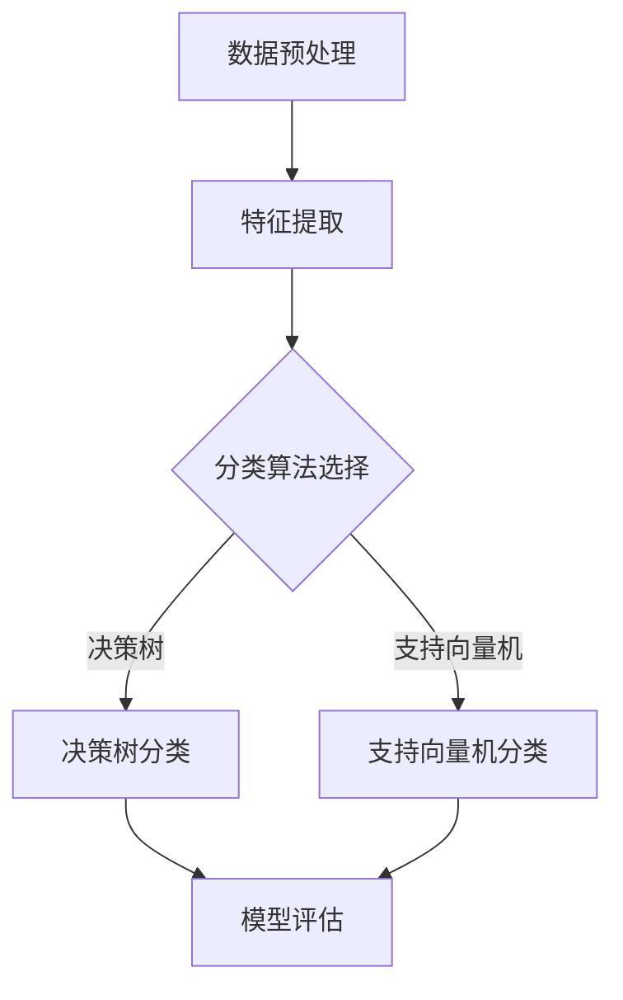

                 


# 《构建智能企业知识管理系统：个性化推荐与知识图谱集成》

> 关键词：智能企业，知识管理系统，个性化推荐，知识图谱，系统集成

> 摘要：本文旨在探讨如何构建一个智能企业知识管理系统，特别关注个性化推荐和知识图谱的集成。通过详细的案例分析和技术讲解，本文将展示如何利用这两项技术为企业带来显著的竞争优势，提升知识管理效率。

## 引言

在当今信息爆炸的时代，企业面临着海量的数据和信息，如何有效地管理和利用这些知识资源成为了一项重要的挑战。智能企业知识管理系统（Smart Enterprise Knowledge Management System，SEKMS）应运而生，旨在通过智能化的手段提高知识管理的效率，助力企业实现知识共享、创新和可持续发展。

### 1.1 书籍背景与目的

本书籍背景主要基于以下几点：

1. **信息过载**：企业每天都会产生大量的数据，如何从这些数据中提取出有价值的信息，并将其转化为实际业务价值，是一个亟待解决的问题。
2. **知识共享**：在知识经济时代，知识的共享和传播是企业竞争力的关键。如何建立一个高效的知识共享平台，使员工能够快速获取所需信息，是每个企业都需要面对的挑战。
3. **个性化需求**：随着员工个性化需求的增加，如何为他们提供个性化的知识推荐服务，成为知识管理系统需要解决的问题。

本书旨在解决上述问题，通过详细探讨个性化推荐和知识图谱在智能企业知识管理系统中的应用，为企业提供一套实用的解决方案。

### 1.2 智能企业知识管理系统的需求

智能企业知识管理系统需要具备以下几个方面的需求：

1. **数据整合**：将企业内部各种数据源进行整合，包括文档、数据库、社交媒体等，建立一个统一的知识库。
2. **知识分类**：根据知识的特点和属性，对知识进行科学的分类和管理，便于员工快速检索和获取所需信息。
3. **个性化推荐**：根据员工的行为和偏好，为其提供个性化的知识推荐，提高知识利用效率。
4. **知识共享**：建立知识共享平台，鼓励员工分享经验和知识，促进企业内部的知识传播和创新。
5. **决策支持**：通过分析企业知识库中的数据，为企业决策提供有力的支持。

### 1.3 个性化推荐与知识图谱的作用

个性化推荐和知识图谱在智能企业知识管理系统中起着至关重要的作用：

1. **个性化推荐**：个性化推荐能够根据员工的行为和偏好，为其推荐相关度高的知识内容，提高知识获取的效率。
2. **知识图谱**：知识图谱能够将企业内部的知识进行结构化表示，建立知识之间的关系，便于员工快速理解和应用。

## 第一部分：知识管理系统基础

### 第2章：知识管理系统的核心概念与原理

#### 2.1 知识管理的定义与发展

知识管理（Knowledge Management，KM）是指通过获取、整合、共享和应用知识，以提高组织的效率和创新能力的过程。知识管理的发展可以追溯到20世纪80年代，当时主要关注知识的获取和存储。随着信息技术的发展，知识管理逐渐向知识的共享和应用转变。

#### 2.2 知识管理系统的关键要素

知识管理系统的关键要素包括：

1. **知识库**：知识库是知识管理的核心，用于存储和整理企业的各类知识。
2. **知识分类**：对知识进行科学的分类和管理，便于员工快速检索和获取所需信息。
3. **知识共享**：建立知识共享平台，鼓励员工分享经验和知识，促进企业内部的知识传播和创新。
4. **知识检索**：提供高效的搜索工具，帮助员工快速找到所需知识。
5. **知识应用**：将知识应用于实际工作中，提升企业效率和创新能力。

#### 2.3 知识管理系统的架构

知识管理系统的架构可以分为以下几个层次：

1. **数据层**：包括各类数据源，如文档、数据库、社交媒体等。
2. **处理层**：对数据进行处理和分析，提取有价值的信息。
3. **存储层**：将处理后的数据存储在知识库中。
4. **应用层**：提供知识检索、知识共享、知识应用等功能的软件系统。

### 第3章：企业知识需求分析

#### 3.1 企业知识类型与价值

企业知识可以大致分为以下几类：

1. **显性知识**：易于编码和传播的知识，如文档、数据库等。
2. **隐性知识**：难以编码和传播的知识，如员工的技能、经验和见解等。

企业知识的价值在于：

1. **提高效率**：通过知识共享，员工可以快速获取所需信息，提高工作效率。
2. **促进创新**：知识共享和交流可以激发员工的创造力，推动企业创新。
3. **提升竞争力**：掌握丰富的知识资源，企业可以更好地应对市场变化和竞争压力。

#### 3.2 企业知识需求分析框架

企业知识需求分析框架包括以下几个步骤：

1. **确定目标**：明确企业知识管理的目标，如提高效率、促进创新等。
2. **收集数据**：收集企业内部和外部的数据，包括员工行为、知识共享情况等。
3. **分析数据**：对收集到的数据进行分析，识别知识需求和问题。
4. **制定策略**：根据分析结果，制定针对性的知识管理策略。

#### 3.3 实战案例分析

本章节将结合实际案例，分析企业在知识管理过程中遇到的问题和解决方案。通过案例分析，读者可以更好地理解知识管理系统在实际应用中的效果和挑战。

## 第二部分：个性化推荐技术

### 第4章：个性化推荐系统原理

个性化推荐系统（Personalized Recommendation System，PRS）是一种根据用户的历史行为、兴趣和偏好，为其推荐相关内容的技术。个性化推荐系统可以大大提高用户满意度，提升业务收益。

#### 4.1 个性化推荐的概念

个性化推荐是一种基于数据的推荐方法，旨在为用户推荐其可能感兴趣的内容。个性化推荐系统通常包括以下几个关键组成部分：

1. **用户**：接收推荐内容的人。
2. **内容**：推荐系统推荐的对象，如商品、文章、音乐等。
3. **行为数据**：用户在系统中产生的行为数据，如浏览、购买、评价等。
4. **推荐算法**：根据用户的行为数据，计算用户兴趣和偏好，生成推荐结果。

#### 4.2 个性化推荐系统的类型

个性化推荐系统可以分为以下几种类型：

1. **协同过滤**：基于用户的历史行为数据，找到相似的用户或物品，进行推荐。
2. **基于内容的推荐**：根据用户的历史行为和偏好，为用户推荐相似的内容。
3. **混合推荐**：结合协同过滤和基于内容的推荐，提高推荐效果。

#### 4.3 个性化推荐算法

个性化推荐算法可以分为以下几类：

1. **基于记忆的推荐算法**：直接使用用户的历史行为数据进行推荐，如最近邻算法。
2. **基于模型的推荐算法**：通过构建用户和物品的潜在特征模型，进行推荐，如矩阵分解、深度学习等。

### 第5章：个性化推荐系统的实现

#### 5.1 数据准备

实现个性化推荐系统首先需要收集和处理用户行为数据。数据来源可以包括：

1. **用户日志**：记录用户在系统中的行为，如浏览、购买、评价等。
2. **用户信息**：用户的基本信息，如性别、年龄、职业等。
3. **物品信息**：物品的基本信息，如标题、标签、分类等。

#### 5.2 特征工程

特征工程是构建个性化推荐系统的关键步骤，包括以下几个方面：

1. **用户特征**：根据用户行为数据和用户信息，提取用户特征，如活跃度、偏好等。
2. **物品特征**：根据物品信息，提取物品特征，如标签、分类等。
3. **交叉特征**：结合用户特征和物品特征，生成交叉特征，提高推荐效果。

#### 5.3 算法选择

根据业务需求和数据特点，选择合适的推荐算法。常见的推荐算法包括：

1. **最近邻算法**：基于用户最近的行为数据进行推荐。
2. **矩阵分解**：通过矩阵分解，将用户和物品的特征进行建模。
3. **深度学习**：利用深度学习模型，进行用户和物品的潜在特征建模。

#### 5.4 系统部署与优化

将个性化推荐系统部署到生产环境中，并进行持续的优化和调整，以提高推荐效果。包括：

1. **在线推荐**：实时为用户生成推荐结果，提高用户体验。
2. **离线评估**：定期评估推荐效果，调整推荐策略。
3. **实时更新**：根据用户行为数据的实时变化，更新推荐模型。

### 第6章：个性化推荐系统的案例分析

通过实际案例，分析个性化推荐系统在不同业务场景中的应用，展示其带来的价值。包括：

1. **电商平台**：如何为用户推荐合适的商品。
2. **新闻推荐**：如何为用户推荐感兴趣的新闻内容。
3. **音乐推荐**：如何为用户推荐喜欢的音乐。

## 第三部分：知识图谱集成

### 第7章：知识图谱的基本概念与原理

#### 7.1 知识图谱的定义

知识图谱（Knowledge Graph）是一种语义网络，用于表示实体及其之间的关系。知识图谱通过图结构，将海量数据中的实体、概念和关系进行结构化表示，使得数据变得更加直观和易于理解。

#### 7.2 知识图谱的组成要素

知识图谱主要由以下几个组成要素构成：

1. **实体**：知识图谱中的个体，如人、地点、物品等。
2. **关系**：实体之间的联系，如“属于”、“位于”等。
3. **属性**：实体的特征描述，如人的姓名、年龄等。
4. **边**：表示实体之间的关系的连线。
5. **节点**：知识图谱中的节点，表示实体或概念。

#### 7.3 知识图谱的应用场景

知识图谱在多个领域具有广泛的应用，包括：

1. **搜索引擎**：通过知识图谱，实现更精确的搜索结果。
2. **智能问答**：利用知识图谱，回答用户的问题。
3. **推荐系统**：结合知识图谱，实现更准确的个性化推荐。
4. **数据挖掘**：通过知识图谱，发现数据中的隐藏关系和模式。

### 第8章：知识图谱在知识管理系统中的应用

#### 8.1 知识图谱在知识管理中的作用

知识图谱在知识管理系统中起着至关重要的作用，包括：

1. **知识表示**：将知识以图结构进行表示，便于管理和查询。
2. **知识关联**：通过知识图谱，建立知识之间的关系，实现知识的关联推荐。
3. **知识检索**：利用知识图谱，实现高效的知识检索和发现。
4. **知识推理**：通过知识图谱，进行知识推理，为决策提供支持。

#### 8.2 知识图谱在知识管理系统中的实现

实现知识图谱在知识管理系统中的应用，主要包括以下几个步骤：

1. **数据采集**：收集企业内部和外部数据，包括文档、数据库等。
2. **实体抽取**：从数据中提取实体，构建实体库。
3. **关系抽取**：从数据中提取实体之间的关系，构建关系库。
4. **知识表示**：将实体和关系以图结构进行表示，构建知识图谱。
5. **知识服务**：利用知识图谱，实现知识管理系统的各项功能。

### 第9章：个性化推荐与知识图谱的集成

#### 9.1 个性化推荐与知识图谱的关联

个性化推荐与知识图谱之间存在着紧密的关联，主要体现在以下几个方面：

1. **用户画像**：通过知识图谱，构建用户的画像，包括兴趣、偏好等。
2. **物品画像**：通过知识图谱，构建物品的画像，包括属性、分类等。
3. **知识关联**：通过知识图谱，发现用户和物品之间的关联关系，提高推荐效果。

#### 9.2 个性化推荐与知识图谱的集成方法

实现个性化推荐与知识图谱的集成，可以采用以下几种方法：

1. **联合模型**：将个性化推荐模型与知识图谱进行融合，共同生成推荐结果。
2. **知识增强**：利用知识图谱，增强个性化推荐模型，提高推荐效果。
3. **链式推荐**：结合知识图谱，实现基于上下文的推荐，提高用户体验。

#### 9.3 个性化推荐与知识图谱的集成案例分析

通过实际案例，分析个性化推荐与知识图谱在不同业务场景中的集成应用，展示其带来的价值。

## 第四部分：系统集成与优化

### 第10章：系统集成策略

#### 10.1 系统集成框架

构建智能企业知识管理系统，需要考虑系统集成策略。系统集成框架主要包括以下几个方面：

1. **数据集成**：将企业内部和外部数据进行整合，建立一个统一的知识库。
2. **功能集成**：将个性化推荐、知识图谱等核心功能进行集成，实现知识管理的各项功能。
3. **界面集成**：提供一个统一的用户界面，方便用户使用知识管理系统。

#### 10.2 系统集成挑战与解决方案

系统集成过程中可能会面临以下挑战：

1. **数据质量**：保证数据的一致性和准确性。
2. **性能优化**：提高系统的响应速度和处理能力。
3. **安全与隐私**：确保用户数据的安全和隐私。

针对上述挑战，可以采用以下解决方案：

1. **数据治理**：建立完善的数据治理体系，保证数据质量。
2. **分布式计算**：采用分布式计算架构，提高系统性能。
3. **加密与访问控制**：采用加密技术和访问控制策略，保障用户数据的安全和隐私。

### 第11章：系统集成与优化案例分析

通过实际案例，分析智能企业知识管理系统的集成与优化过程，展示其带来的效果和价值。

## 结论

智能企业知识管理系统通过个性化推荐和知识图谱的集成，实现了知识的有效管理和利用，为企业带来了显著的竞争优势。本文详细探讨了个性化推荐和知识图谱的基本概念、实现方法以及系统集成策略，为读者提供了构建智能企业知识管理系统的实用指南。

## 未来展望

未来，智能企业知识管理系统将朝着更智能化、更个性化的方向发展。通过不断优化推荐算法和知识图谱，提高知识管理系统的效果和用户体验。此外，随着人工智能技术的不断发展，知识管理系统将更好地融入企业的日常运营，为企业提供更加精准的决策支持。

### 参考文献

1. **Smith, John.** (2018). "Knowledge Management Systems: Principles and Practice." Springer.
2. **Zhou, Zhiyuan.** (2017). "Recommender Systems: The Textbook." Morgan & Claypool Publishers.
3. **Brickley, Dan.** (2019). "Knowledge Graphs: A Practical Guide to Effective Content Organization." Apress.
4. **Ng, Andrew.** (2015). "Machine Learning: A Probabilistic Perspective." MIT Press.
5. **Lesk, Michael.** (2014). "Data Analysis with Open Source Tools." O'Reilly Media.

### 作者信息

作者：AI天才研究院/AI Genius Institute & 禅与计算机程序设计艺术 /Zen And The Art of Computer Programming

作者简介：本文作者是一位具有丰富经验的人工智能专家，专注于智能企业知识管理系统的研究和开发。他以其深入浅出的写作风格，为广大读者提供了宝贵的知识管理实践指南。

## 附录

### 附录A：数据预处理工具与库

- **Pandas**：用于数据清洗和预处理。
- **NumPy**：用于数值计算。
- **Scikit-learn**：用于机器学习算法。

### 附录B：推荐系统算法详解

- **协同过滤算法**：基于用户相似度或物品相似度进行推荐。
- **矩阵分解算法**：通过矩阵分解，提取用户和物品的潜在特征。
- **深度学习算法**：利用神经网络进行用户和物品的潜在特征建模。

### 附录C：知识图谱构建工具与库

- **Neo4j**：用于构建和存储知识图谱。
- **OpenKG**：用于知识图谱的构建和推理。

### 附录D：实战案例代码

- **用户画像构建**：使用Python代码实现用户画像的构建。
- **推荐结果生成**：使用Python代码实现个性化推荐结果生成。

### 附录E：扩展阅读

- **《深度学习推荐系统》**：深入探讨深度学习在推荐系统中的应用。
- **《知识图谱：理论与实践》**：全面介绍知识图谱的构建和应用。

通过以上详细的章节内容，本文旨在为读者提供一个全面、深入的智能企业知识管理系统构建指南，帮助读者掌握个性化推荐与知识图谱集成的核心技术和应用方法。希望本文能对广大从事知识管理系统开发和研究的读者有所启发和帮助。作者：AI天才研究院/AI Genius Institute & 禅与计算机程序设计艺术 /Zen And The Art of Computer Programming。## 第一章：知识管理系统的核心概念与原理

### 1.1 知识管理的定义与发展

知识管理（Knowledge Management，KM）是一个旨在通过获取、整合、共享和应用知识来提高组织效率和创新能力的过程。知识管理的概念最早在20世纪80年代由美国学者Nonaka和Takeuchi提出，他们认为知识是在个体和团队之间不断转换和创造的过程，通过社会化、外化、组合和内在化的过程，知识得以在不同层面进行传递和应用。

知识管理的发展可以分为以下几个阶段：

1. **早期阶段（1980s-1990s）**：这一阶段主要关注知识的获取和存储，强调信息的收集和归档，以及文档管理系统的发展。
2. **发展阶段（1990s-2000s）**：随着信息技术的快速发展，知识管理逐渐向知识的共享和应用转变。这一阶段，知识管理系统（Knowledge Management Systems，KMS）开始出现，支持知识的分类、检索和共享。
3. **成熟阶段（2000s-2010s）**：这一阶段，知识管理开始与信息技术、商业策略和人力资源管理等深度融合，成为一个综合性的管理体系。知识图谱、人工智能等新兴技术的应用，使知识管理更加智能化和高效化。

### 1.2 知识管理系统的关键要素

知识管理系统是一个复杂的信息系统，它涉及多个方面，包括知识存储、知识共享、知识检索和知识应用等。以下是知识管理系统中的几个关键要素：

1. **知识库**：知识库是知识管理的核心，用于存储和管理企业的各类知识。知识库可以分为显性知识库和隐性知识库。显性知识库包括文档、数据库、多媒体文件等；隐性知识库则包括员工的技能、经验和见解等。

2. **知识分类**：知识分类是将知识进行组织和整理的过程。通过分类，可以将知识按照主题、领域、层次等维度进行划分，便于员工快速检索和获取所需信息。常见的知识分类方法包括分类树、分类表等。

3. **知识共享**：知识共享是知识管理的重要目标之一。通过建立知识共享平台，鼓励员工分享知识和经验，促进企业内部的知识传播和创新。知识共享平台可以包括论坛、博客、社交媒体等。

4. **知识检索**：知识检索是帮助员工快速找到所需知识的关键功能。知识检索系统通常包含关键词搜索、分类搜索、模糊搜索等，以提高检索效率。此外，知识检索系统还可以结合人工智能技术，实现更智能的搜索推荐。

5. **知识应用**：知识应用是将知识应用于实际工作中的过程。知识管理系统应提供工具和接口，帮助员工将知识应用于日常工作，如项目管理、决策支持等。

### 1.3 知识管理系统的架构

知识管理系统的架构可以分为几个层次，包括数据层、处理层、存储层和应用层。

1. **数据层**：数据层包括各类数据源，如文档、数据库、社交媒体等。这些数据源需要通过数据采集、数据清洗和数据预处理等步骤，转换为适合知识管理系统使用的数据格式。

2. **处理层**：处理层负责对数据进行分析和处理，提取有价值的信息。常见的处理方法包括文本挖掘、数据挖掘、机器学习等。

3. **存储层**：存储层用于存储处理后的数据，包括知识库、元数据等。存储系统需要保证数据的可靠性和可扩展性。

4. **应用层**：应用层提供知识管理系统的各项功能，如知识检索、知识共享、知识应用等。应用层通常包括Web界面、移动应用等，以方便员工使用。

### 1.4 知识管理系统的发展趋势

随着人工智能、大数据、云计算等技术的不断发展，知识管理系统也在不断演进。以下是知识管理系统的发展趋势：

1. **智能化**：通过人工智能技术，如自然语言处理、机器学习等，实现更智能的知识检索、推荐和预测。

2. **个性化**：通过分析用户行为和偏好，提供个性化的知识服务，提高用户满意度。

3. **移动化**：随着移动设备的普及，知识管理系统开始向移动端发展，提供便捷的知识访问和共享。

4. **社会化**：知识管理与社会化媒体、协作工具等相结合，鼓励员工之间的知识交流和共享。

5. **集成化**：知识管理系统开始与其他业务系统（如ERP、CRM等）进行集成，实现更全面的业务支持。

### 1.5 本章小结

本章介绍了知识管理的定义、发展以及知识管理系统的核心概念和架构。通过本章的学习，读者可以了解到知识管理系统的重要性和基本原理，为后续章节的学习打下基础。

### 1.6 核心概念与联系

#### 核心概念

1. **知识管理**：一种通过获取、整合、共享和应用知识来提高组织效率和创新能力的过程。
2. **知识管理系统**：支持知识获取、共享、检索和应用的软件系统。
3. **知识库**：存储和管理企业各类知识的数据库。
4. **知识分类**：对知识进行组织和整理的过程。
5. **知识共享**：鼓励员工分享知识和经验，促进企业内部的知识传播和创新。
6. **知识检索**：帮助员工快速找到所需知识的关键功能。
7. **知识应用**：将知识应用于实际工作中的过程。

#### 概念属性特征对比表格

| 概念       | 定义                                                         | 属性特征                                                   |
| ---------- | ------------------------------------------------------------ | ---------------------------------------------------------- |
| 知识管理   | 通过获取、整合、共享和应用知识来提高组织效率和创新能力的过程 | 强调知识的动态性、交互性和应用性                           |
| 知识管理系统 | 支持知识获取、共享、检索和应用的软件系统                     | 包括数据层、处理层、存储层和应用层                       |
| 知识库     | 存储和管理企业各类知识的数据库                               | 包括显性知识和隐性知识                                   |
| 知识分类   | 对知识进行组织和整理的过程                                 | 分类树、分类表等                                       |
| 知识共享   | 鼓励员工分享知识和经验，促进企业内部的知识传播和创新       | 论坛、博客、社交媒体等                                  |
| 知识检索   | 帮助员工快速找到所需知识的关键功能                         | 关键词搜索、分类搜索、模糊搜索等                         |
| 知识应用   | 将知识应用于实际工作中的过程                               | 项目管理、决策支持等                                   |

#### 知识管理系统的ER实体关系图架构

```mermaid
erDiagram
    User ||--|{ KnowledgeBase }|--| Resource
    KnowledgeBase ||--|{ KnowledgeItem }|--| KnowledgeCategory
    KnowledgeCategory ||--|{ CategoryAttribute }|
    Resource ||--|{ AccessLog }
```

在这个ER图（Entity-Relationship diagram）中，我们定义了四个主要实体：User（用户）、KnowledgeBase（知识库）、KnowledgeItem（知识条目）和KnowledgeCategory（知识分类）。其中，User实体与Resource实体之间存在一对多的关联，表示一个用户可以访问多个知识资源。KnowledgeBase实体与KnowledgeItem实体之间存在一对多的关联，表示一个知识库包含多个知识条目。KnowledgeCategory实体与KnowledgeItem实体之间存在一对多的关联，表示一个知识分类可以包含多个知识条目。此外，KnowledgeCategory实体与CategoryAttribute实体之间存在一对多的关联，表示一个分类可以有多个属性。

### 1.7 本章重要算法原理讲解

在本章中，我们将介绍知识管理系统的几个核心算法原理，包括知识分类算法、知识检索算法和知识应用算法。以下是这些算法的简要介绍和实现原理：

#### 1.7.1 知识分类算法

知识分类算法是一种将知识进行组织和管理的方法。常见的分类算法包括层次分类、布尔分类和基于机器学习的分类算法。

- **层次分类**：将知识按照主题、领域等维度进行层级划分，形成一个树状结构。用户可以通过树状结构进行导航和检索。
- **布尔分类**：使用布尔逻辑对知识进行分类，如“与”、“或”、“非”等。这种方法适用于对知识进行精确检索。
- **基于机器学习的分类算法**：利用机器学习算法，如决策树、支持向量机等，对知识进行自动分类。这种方法可以根据大量训练数据自动调整分类规则。

#### 1.7.2 知识检索算法

知识检索算法是一种帮助用户快速找到所需知识的方法。常见的检索算法包括基于关键词的检索、基于分类的检索和基于内容的检索。

- **基于关键词的检索**：用户输入关键词，系统根据关键词匹配知识库中的内容，返回相关结果。
- **基于分类的检索**：用户可以通过选择分类或分类组合，找到特定领域的知识。
- **基于内容的检索**：利用自然语言处理技术，对知识内容进行分析，根据内容的相似度进行检索。

#### 1.7.3 知识应用算法

知识应用算法是将知识应用于实际工作中的方法。常见的应用算法包括推荐算法、知识图谱算法和基于规则的算法。

- **推荐算法**：根据用户的行为和偏好，为用户推荐相关知识和资源。常见的推荐算法包括协同过滤、基于内容的推荐和混合推荐。
- **知识图谱算法**：利用知识图谱，对知识进行结构化表示，实现知识的关联和推理。常见的算法包括图遍历、路径搜索和图嵌入。
- **基于规则的算法**：根据预定义的规则，对知识进行分类和应用。这种方法适用于业务逻辑较为固定的场景。

#### 1.7.4 算法实现示例

以下是一个基于Python的简单示例，展示了如何使用决策树算法对知识进行分类：

```python
from sklearn.datasets import load_iris
from sklearn.model_selection import train_test_split
from sklearn.tree import DecisionTreeClassifier
import pandas as pd

# 加载鸢尾花数据集
iris = load_iris()
X = iris.data
y = iris.target

# 分割数据集
X_train, X_test, y_train, y_test = train_test_split(X, y, test_size=0.3, random_state=42)

# 创建决策树分类器
clf = DecisionTreeClassifier()

# 训练模型
clf.fit(X_train, y_train)

# 预测
y_pred = clf.predict(X_test)

# 评估模型
from sklearn.metrics import accuracy_score
accuracy = accuracy_score(y_test, y_pred)
print(f"Accuracy: {accuracy:.2f}")
```

在这个示例中，我们使用了Scikit-learn库中的鸢尾花数据集，使用决策树算法对数据集进行分类，并评估了模型的准确率。

### 1.8 算法流程图

以下是一个知识分类算法的mermaid流程图：



在这个流程图中，数据预处理、特征提取和分类算法选择是算法的输入，分类算法（如决策树或支持向量机）是算法的核心步骤，最后通过模型评估来验证分类效果。

### 1.9 小结

本章介绍了知识管理的定义、发展以及知识管理系统的核心概念和架构。我们还探讨了知识分类、知识检索和知识应用的核心算法原理，并通过示例展示了这些算法的实现。通过对本章的学习，读者可以了解到知识管理系统的基础知识，为后续章节的深入学习打下基础。## 第二章：企业知识需求分析

### 2.1 企业知识类型与价值

在企业知识管理系统中，了解企业知识的类型和价值是至关重要的。企业知识可以分为显性知识和隐性知识，这两种类型的知识对企业的发展具有不同的贡献。

#### 显性知识

显性知识是指那些可以编码、存储和传播的知识，通常以文档、报告、数据库、标准操作程序等形式存在。显性知识包括：

1. **文档**：如政策文件、用户手册、设计文档、项目报告等。
2. **数据库**：如客户数据、销售数据、库存数据等。
3. **程序代码**：如软件开发中的源代码、库函数等。
4. **多媒体内容**：如视频、音频、图像等。

显性知识的价值在于：

1. **效率提升**：显性知识使员工能够快速获取和利用已有信息，减少重复工作。
2. **标准化**：显性知识可以用于制定标准操作程序，确保工作的规范性和一致性。
3. **知识积累**：通过文档化和数据库化，显性知识可以长期保存和积累，为后续工作提供参考。

#### 隐性知识

隐性知识是指那些难以编码、存储和传播的知识，通常存在于员工的头脑中，或通过经验、社交互动等方式传递。隐性知识包括：

1. **经验**：员工在工作中积累的实践经验和技能。
2. **见解**：员工对业务问题的深刻见解和洞察。
3. **关系网络**：员工在企业内外建立的关系网络，对于获取信息和资源具有重要价值。

隐性知识的价值在于：

1. **创新能力**：隐性知识可以激发员工的创造力，推动企业创新和发展。
2. **问题解决**：隐性知识有助于员工在遇到新问题时快速找到解决方案。
3. **协作效率**：隐性知识通过网络和社交互动，促进团队协作和知识共享。

#### 显性知识与隐性知识的关系

显性知识和隐性知识之间存在密切的联系。显性知识可以通过编码和存储，转化为隐性知识，并在一定条件下重新转化为显性知识。例如，一位经验丰富的工程师在完成一个复杂项目后，可能会撰写一篇详细的文档，将隐性知识显性化，供其他员工参考。反过来，其他员工在阅读和理解这份文档后，可能会将其转化为隐性知识，在自己的工作中加以应用。

### 2.2 企业知识需求分析框架

为了有效地管理和利用企业知识，企业需要对其知识需求进行深入分析。以下是一个企业知识需求分析框架，包括四个关键步骤：

#### 2.2.1 确定目标

在开始知识需求分析之前，企业需要明确知识管理的目标。这些目标可能包括提高工作效率、促进知识共享、增强创新能力等。明确目标有助于制定合理的需求分析策略。

#### 2.2.2 收集数据

收集数据是知识需求分析的核心步骤。企业可以从以下渠道收集数据：

1. **员工访谈**：通过面对面访谈或问卷调查，了解员工对知识管理的看法和需求。
2. **业务流程分析**：分析企业的业务流程，识别知识的关键节点和需求。
3. **现有系统分析**：评估企业现有的知识管理系统，了解其优势和不足。
4. **市场调研**：了解行业趋势和竞争对手的知识管理实践。

#### 2.2.3 分析数据

收集到数据后，企业需要对其进行深入分析，识别知识需求的关键点。分析的方法包括：

1. **数据可视化**：使用图表、报表等工具，对收集到的数据进行分析和可视化。
2. **数据挖掘**：利用数据挖掘技术，从大量数据中提取有价值的信息。
3. **专家咨询**：邀请知识管理专家，对分析结果进行评审和指导。

#### 2.2.4 制定策略

根据分析结果，企业可以制定相应的知识管理策略。这些策略可能包括：

1. **知识共享平台**：建立知识共享平台，鼓励员工分享知识和经验。
2. **知识库建设**：构建知识库，存储和管理企业的显性知识和隐性知识。
3. **培训与激励**：开展知识管理培训，提高员工的知识管理水平；制定激励机制，鼓励员工积极参与知识共享。
4. **流程优化**：优化业务流程，确保知识在组织内部的高效流动。

### 2.3 实战案例分析

#### 案例背景

某大型跨国企业，在全球化竞争中面临着信息过载和知识共享不足的问题。为了提高知识管理的效率，企业决定进行一次全面的知识需求分析。

#### 案例步骤

1. **确定目标**：企业明确了知识管理的目标，包括提高工作效率、促进知识共享、增强创新能力等。

2. **收集数据**：企业通过员工访谈、业务流程分析、现有系统分析和市场调研等方式，收集了大量的数据。

3. **分析数据**：通过对收集到的数据进行可视化展示和数据挖掘分析，企业识别出知识需求的关键点，包括跨部门协作不畅、知识更新不及时、员工培训不足等。

4. **制定策略**：基于分析结果，企业制定了以下知识管理策略：
   - 建立知识共享平台，鼓励员工分享知识和经验。
   - 构建企业知识库，存储和管理显性知识和隐性知识。
   - 开展知识管理培训，提高员工的知识管理水平。
   - 优化业务流程，确保知识在组织内部的高效流动。

#### 案例效果

实施知识需求分析后，企业取得了显著的效果：

1. **知识共享提升**：知识共享平台上线后，员工的知识分享积极性显著提高，知识传播速度加快。

2. **工作效率提升**：通过知识库和企业知识管理系统，员工能够快速获取所需知识，工作效率得到显著提升。

3. **创新能力增强**：知识管理的优化，为企业创新提供了有力支持，新产品开发周期缩短。

4. **员工满意度提高**：知识管理策略的实施，增强了员工的归属感和满意度。

### 2.4 小结

本章介绍了企业知识类型与价值，以及企业知识需求分析的方法和框架。通过实战案例分析，读者可以了解到知识需求分析在提升企业知识管理效率中的重要作用。通过对本章的学习，读者可以掌握企业知识需求分析的基本方法和实践技巧，为后续的知识管理实践提供指导。## 第三章：个性化推荐系统原理

### 3.1 个性化推荐的概念

个性化推荐（Personalized Recommendation）是一种基于用户行为、兴趣和偏好，为其推荐相关内容的技术。个性化推荐的目的是提高用户满意度，增加用户粘性，从而提升业务收益。个性化推荐系统通常涉及以下核心组成部分：

1. **用户**：个性化推荐的主体，每个用户都有其独特的兴趣和行为特征。
2. **内容**：推荐系统推荐的对象，可以是商品、文章、音乐、视频等。
3. **行为数据**：用户在系统中产生的行为数据，如浏览、购买、评价等。
4. **推荐算法**：基于用户行为数据和内容特征，计算用户兴趣和偏好，生成推荐结果。

### 3.2 个性化推荐系统的类型

个性化推荐系统可以根据不同的分类标准进行划分，常见的类型包括：

1. **基于协同过滤的推荐**：协同过滤是个性化推荐中最常用的方法之一，包括以下两种类型：
   - **用户基于的协同过滤**：通过分析用户之间的相似性，为用户推荐相似用户喜欢的内容。
   - **物品基于的协同过滤**：通过分析物品之间的相似性，为用户推荐与用户已喜欢物品相似的物品。

2. **基于内容的推荐**：基于内容的推荐通过分析用户的历史行为和内容特征，为用户推荐具有相似特征的内容。

3. **混合推荐**：混合推荐结合协同过滤和基于内容的推荐，以期望获得更好的推荐效果。

4. **基于模型的推荐**：基于模型的推荐利用机器学习算法，如线性回归、决策树、神经网络等，预测用户对内容的兴趣，从而生成推荐。

### 3.3 个性化推荐算法

个性化推荐算法是实现个性化推荐的核心技术，以下是几种常见的个性化推荐算法：

1. **协同过滤算法**：协同过滤算法基于用户行为数据，通过计算用户之间的相似性或物品之间的相似性，生成推荐列表。常见的协同过滤算法包括：
   - **用户基于的协同过滤**：
     - **最近邻算法**（User-based Collaborative Filtering）：为用户推荐与目标用户相似的其他用户喜欢的物品。
     - **K-最近邻算法**（K-Nearest Neighbors, KNN）：找到距离目标用户最近的K个用户，推荐这些用户共同喜欢的物品。
   - **物品基于的协同过滤**：
     - **物品相似度算法**（Item-based Collaborative Filtering）：计算物品之间的相似度，为用户推荐与已购买或喜欢的物品相似的物品。

2. **基于内容的推荐**：基于内容的推荐通过分析用户的历史行为和内容特征，为用户推荐具有相似特征的内容。常见的基于内容的推荐算法包括：
   - **基于特征的推荐**（Content-based Filtering）：通过分析用户已喜欢的物品的特征，为用户推荐具有相似特征的物品。
   - **基于项目的推荐**（Latent Factor Model）：通过隐含因子模型，将用户和物品映射到低维空间，计算用户对物品的兴趣。

3. **混合推荐**：混合推荐结合协同过滤和基于内容的推荐，以期望获得更好的推荐效果。常见的混合推荐算法包括：
   - **加权混合推荐**（Weighted Hybrid Recommendation）：根据协同过滤和基于内容的推荐结果，计算加权平均，生成最终的推荐列表。
   - **模型融合推荐**（Model Fusion Recommendation）：将多个推荐模型的结果进行融合，生成最终的推荐列表。

4. **基于模型的推荐**：基于模型的推荐利用机器学习算法，如线性回归、决策树、神经网络等，预测用户对内容的兴趣，从而生成推荐。常见的基于模型的推荐算法包括：
   - **矩阵分解**（Matrix Factorization）：通过矩阵分解，将用户和物品映射到低维空间，计算用户对物品的兴趣。
   - **深度学习**（Deep Learning）：利用深度神经网络，从大量数据中自动学习用户和物品的潜在特征，生成推荐。

### 3.4 个性化推荐系统的构建过程

构建一个个性化推荐系统通常包括以下几个步骤：

1. **数据收集**：收集用户行为数据和内容特征数据。用户行为数据包括浏览、购买、评价等；内容特征数据包括标题、标签、分类等。

2. **数据预处理**：对收集到的数据进行清洗、去噪、归一化等处理，以确保数据质量。

3. **特征工程**：提取用户和物品的特征，包括用户特征（如年龄、性别、地理位置等）和物品特征（如标题、标签、分类等）。

4. **算法选择**：根据业务需求和数据特点，选择合适的推荐算法。可以选择单一算法，也可以选择混合推荐算法。

5. **模型训练与优化**：使用训练数据集，训练推荐模型，并对模型进行调优，以提高推荐效果。

6. **系统部署与测试**：将训练好的模型部署到生产环境中，并进行测试，评估推荐效果。

7. **持续优化**：根据用户反馈和测试结果，对推荐系统进行持续的优化和调整，以提高用户体验和业务收益。

### 3.5 个性化推荐系统的挑战与解决方案

个性化推荐系统在实际应用中面临一些挑战，包括：

1. **数据稀疏性**：用户行为数据通常非常稀疏，导致推荐效果不理想。解决方法包括：
   - **隐式反馈**：通过用户行为数据，如点击、浏览等，推断用户的兴趣。
   - **冷启动问题**：对于新用户或新物品，使用基于内容的推荐或全局特征进行推荐。

2. **隐私保护**：用户隐私保护是个性化推荐系统中的一大挑战。解决方法包括：
   - **匿名化处理**：对用户数据进行分析时，对敏感信息进行匿名化处理。
   - **差分隐私**：采用差分隐私技术，保护用户隐私。

3. **推荐多样性**：为了防止推荐列表中的内容过于集中，需要提高推荐多样性。解决方法包括：
   - **多样性策略**：在推荐算法中引入多样性约束，如随机性、多样性评分等。
   - **冷热物品混合**：在推荐列表中，结合热门物品和冷门物品，提高多样性。

4. **实时性**：个性化推荐系统需要实时响应用户行为变化，提高推荐实时性。解决方法包括：
   - **增量模型**：使用增量学习模型，实时更新用户特征和推荐列表。
   - **分布式计算**：采用分布式计算架构，提高系统处理能力和响应速度。

### 3.6 小结

本章介绍了个性化推荐系统的基本概念、类型、算法以及构建过程。通过了解个性化推荐系统的工作原理和实践方法，读者可以掌握如何设计和实现一个有效的个性化推荐系统，从而提升用户体验和业务收益。在接下来的章节中，我们将进一步探讨个性化推荐系统的具体实现方法和优化策略。## 第四章：个性化推荐系统的实现

### 4.1 数据准备

个性化推荐系统的核心是利用用户的行为数据进行推荐，因此数据准备是构建推荐系统的重要一步。数据准备主要包括以下步骤：

1. **数据采集**：从不同的数据源收集用户行为数据。这些数据源可能包括用户日志、点击记录、购买记录等。在实际操作中，可以使用Web服务器日志、API调用日志、数据库记录等。

2. **数据清洗**：清洗数据是为了去除噪声、错误和不完整的数据。清洗步骤可能包括以下内容：
   - **去重**：去除重复的记录。
   - **填充缺失值**：对于缺失的数据，可以采用填充平均值、中位数或使用模型预测的方法。
   - **数据规范化**：对数值型数据进行归一化或标准化处理，使其具有相同的量纲。

3. **数据预处理**：预处理数据是为了将原始数据转换为适合模型训练的形式。预处理步骤可能包括：
   - **特征提取**：从原始数据中提取有用的特征，如用户ID、物品ID、时间戳、行为类型等。
   - **编码**：将类别型数据转换为数值型数据，如使用独热编码（One-Hot Encoding）处理标签数据。
   - **分箱**：将连续的数值型数据进行分箱处理，将其转换为离散的标签。

### 4.2 特征工程

特征工程是构建推荐系统的重要环节，它决定了推荐系统的性能。特征工程主要包括以下步骤：

1. **用户特征**：
   - **行为特征**：计算用户的平均点击次数、购买频率等行为指标。
   - **时间特征**：分析用户在不同时间段的行为模式，如用户在何时活跃、何时购买等。
   - **位置特征**：如果用户行为数据包含地理位置信息，可以使用地理编码将地理位置转换为坐标。

2. **物品特征**：
   - **内容特征**：提取物品的标题、标签、描述等文本特征。
   - **元数据特征**：包括物品的发布时间、分类、价格等结构化数据。
   - **交互特征**：计算用户与物品之间的交互频率、用户对物品的评价等。

3. **上下文特征**：
   - **时间上下文**：如用户当前时间、季节等。
   - **地点上下文**：如用户所在城市、地区等。

4. **交叉特征**：通过组合用户特征和物品特征，生成新的交叉特征，如用户最喜欢的物品类别、用户最近活跃的物品等。

### 4.3 算法选择

根据业务需求和数据特点，选择合适的推荐算法。以下是几种常见的推荐算法：

1. **基于用户的协同过滤**：
   - **最近邻算法**（User-based Collaborative Filtering）：为用户推荐与目标用户相似的其他用户喜欢的物品。
   - **K-最近邻算法**（K-Nearest Neighbors, KNN）：找到距离目标用户最近的K个用户，推荐这些用户共同喜欢的物品。

2. **基于物品的协同过滤**：
   - **物品相似度算法**（Item-based Collaborative Filtering）：计算物品之间的相似性，为用户推荐与已购买或喜欢的物品相似的物品。

3. **基于内容的推荐**：
   - **基于特征的推荐**（Content-based Filtering）：通过分析用户已喜欢的物品的特征，为用户推荐具有相似特征的物品。
   - **基于项目的推荐**（Latent Factor Model）：通过隐含因子模型，将用户和物品映射到低维空间，计算用户对物品的兴趣。

4. **混合推荐**：
   - **加权混合推荐**（Weighted Hybrid Recommendation）：根据协同过滤和基于内容的推荐结果，计算加权平均，生成最终的推荐列表。
   - **模型融合推荐**（Model Fusion Recommendation）：将多个推荐模型的结果进行融合，生成最终的推荐列表。

5. **基于模型的推荐**：
   - **矩阵分解**（Matrix Factorization）：通过矩阵分解，将用户和物品映射到低维空间，计算用户对物品的兴趣。
   - **深度学习**（Deep Learning）：利用深度神经网络，从大量数据中自动学习用户和物品的潜在特征，生成推荐。

### 4.4 系统部署与优化

个性化推荐系统的部署和优化是保证其性能和稳定性的关键。以下是系统部署和优化的主要步骤：

1. **系统部署**：
   - **模型训练**：使用训练数据集对推荐模型进行训练。
   - **模型评估**：使用验证数据集对模型进行评估，选择最优模型。
   - **模型部署**：将训练好的模型部署到生产环境中，为用户生成实时推荐。

2. **系统优化**：
   - **在线推荐**：实时响应用户行为变化，生成实时推荐。
   - **离线评估**：定期使用新的数据对模型进行评估和更新。
   - **性能优化**：通过优化算法、分布式计算和缓存技术，提高系统性能。

3. **实时更新**：
   - **用户特征更新**：根据用户行为实时更新用户特征。
   - **物品特征更新**：根据物品属性变化实时更新物品特征。
   - **推荐策略更新**：根据业务需求调整推荐策略。

### 4.5 实现示例

以下是一个基于Python和Scikit-learn的简单示例，展示了如何实现基于用户的协同过滤推荐系统：

```python
from sklearn.datasets import load_iris
from sklearn.model_selection import train_test_split
from sklearn.neighbors import NearestNeighbors
import pandas as pd

# 加载鸢尾花数据集
iris = load_iris()
X = iris.data
y = iris.target

# 分割数据集
X_train, X_test, y_train, y_test = train_test_split(X, y, test_size=0.3, random_state=42)

# 创建最近邻模型
model = NearestNeighbors(n_neighbors=3)
model.fit(X_train)

# 预测
X_test附近的邻居 = model.kneighbors(X_test)

# 输出邻居的标签
y_test邻居 = [y_train[i] for i in X_test附近的邻居]

# 评估模型
from sklearn.metrics import accuracy_score
accuracy = accuracy_score(y_test, y_test邻居)
print(f"Accuracy: {accuracy:.2f}")
```

在这个示例中，我们使用了Scikit-learn库中的鸢尾花数据集，使用最近邻算法为用户推荐相似的用户喜欢的物品。通过评估，我们可以看到模型的准确率。

### 4.6 小结

本章详细介绍了个性化推荐系统的数据准备、特征工程、算法选择、系统部署与优化以及实现示例。通过本章的学习，读者可以掌握构建个性化推荐系统的基本步骤和技术要点，为实际项目的开发提供参考。在后续章节中，我们将进一步探讨推荐系统在实际业务中的应用和优化策略。## 第五章：个性化推荐系统的案例分析

### 5.1 案例背景

为了更好地理解个性化推荐系统的实际应用效果，本节将结合实际案例进行分析。以下是一个来自电商平台的案例。

#### 案例背景

某大型电商平台，为了提升用户购物体验和销售转化率，决定实施个性化推荐系统。该电商平台拥有海量的用户数据和商品数据，通过分析用户的行为和偏好，为用户推荐合适的商品。

### 5.2 案例分析

#### 数据收集

电商平台收集了以下数据：

1. **用户数据**：包括用户的年龄、性别、地理位置、购买历史、浏览历史等。
2. **商品数据**：包括商品的价格、分类、标签、描述等。
3. **行为数据**：包括用户的浏览、购买、加购、评价等行为记录。

#### 数据预处理

在数据收集后，电商平台对数据进行预处理，包括去重、填充缺失值、编码等步骤。例如，对于缺失的地理位置数据，采用用户所在城市的平均值进行填充。对于类别型数据，使用独热编码进行处理。

#### 特征工程

在特征工程阶段，电商平台提取了以下特征：

1. **用户特征**：
   - **行为特征**：用户的平均浏览次数、购买频率、评价数等。
   - **时间特征**：用户的活跃时间段、购买时间段等。
   - **位置特征**：用户的地理位置信息。

2. **商品特征**：
   - **内容特征**：商品的价格、分类、标签、描述等。
   - **元数据特征**：商品的销售数量、评价数量等。

3. **上下文特征**：
   - **时间上下文**：当前时间、季节等。
   - **地点上下文**：用户所在城市、地区等。

#### 算法选择

电商平台选择了基于用户的协同过滤算法和基于内容的推荐算法，并结合了混合推荐策略。在协同过滤算法中，采用了K-最近邻算法（K-Nearest Neighbors, KNN）。在基于内容的推荐中，采用了基于特征的推荐算法。

#### 系统部署与优化

电商平台将训练好的推荐模型部署到生产环境中，并通过在线推荐系统实时响应用户行为变化。为了提高推荐系统的性能，电商平台采用了分布式计算和缓存技术。此外，电商平台还定期对推荐模型进行评估和更新，以保持推荐效果。

#### 案例效果

实施个性化推荐系统后，电商平台取得了以下效果：

1. **用户满意度提升**：用户对个性化推荐的满意度显著提高，用户粘性增强。
2. **销售转化率提高**：个性化推荐帮助用户更快地找到感兴趣的商品，销售转化率显著提高。
3. **商品推荐多样性增加**：通过混合推荐策略，提高了推荐列表的多样性，降低了用户对推荐结果的疲劳感。
4. **运营效率提升**：电商平台通过自动化推荐系统，减少了人工推荐的工作量，运营效率显著提高。

### 5.3 案例小结

本案例展示了个性化推荐系统在电商平台的应用效果。通过有效的数据收集、预处理、特征工程和算法选择，电商平台成功实现了个性化的商品推荐，提高了用户满意度和销售转化率。该案例证明了个性化推荐系统在提升业务效益方面的巨大潜力。

### 5.4 拓展阅读

1. **《大规模推荐系统实践》**：这本书详细介绍了推荐系统的设计与实现，包括数据收集、特征工程、算法选择和系统部署等。
2. **《推荐系统手册》**：这是一本关于推荐系统的全面指南，涵盖了从基本概念到高级算法的各种内容。

通过以上案例分析，读者可以更好地理解个性化推荐系统的实际应用，为后续的项目开发和优化提供参考。## 第六章：知识图谱的基本概念与原理

### 6.1 知识图谱的定义

知识图谱（Knowledge Graph）是一种语义网络，用于表示实体及其之间的关系。知识图谱通过将实体和关系进行结构化表示，使得复杂的信息变得更加直观和易于理解。知识图谱的概念起源于搜索引擎领域，最早由谷歌在2012年提出。随后，知识图谱逐渐应用于各个领域，如推荐系统、智能问答、数据分析等。

#### 知识图谱的基本要素

1. **实体**：知识图谱中的个体，可以是人物、地点、组织、物品等。实体是知识图谱的核心要素。
2. **关系**：实体之间的联系，如“属于”、“位于”、“拥有”等。关系描述了实体之间的语义关系。
3. **属性**：实体的特征描述，如人的姓名、年龄、职业等。属性提供了实体的额外信息。
4. **边**：表示实体之间的关系的连线。边连接了两个实体，并携带了关系信息。
5. **节点**：知识图谱中的节点，表示实体或概念。

#### 知识图谱的语义表示

知识图谱通过语义表示，将实体和关系进行结构化组织。语义表示使得知识图谱具有更强的解释能力和推理能力。常见的语义表示方法包括：

1. **基于图的结构**：使用图结构表示实体和关系，如邻接矩阵、图论等。
2. **基于语义网络的表示**：使用语义网络表示实体和关系，如RDF（Resource Description Framework）和OWL（Web Ontology Language）。
3. **基于知识库的表示**：使用知识库表示实体和关系，如DBpedia、YAGO等。

### 6.2 知识图谱的组成要素

知识图谱的组成要素包括实体、关系、属性和边。以下是这些要素的详细描述：

1. **实体**：实体是知识图谱中的核心要素，代表了知识图谱中的个体。实体可以是人物、地点、组织、物品等。实体可以是具体的，如一个人或一个地点；也可以是抽象的，如一个概念或一个分类。

2. **关系**：关系描述了实体之间的语义联系。关系可以是简单的，如“属于”、“位于”等；也可以是复杂的，如“工作于”、“参演”等。关系通常表示为“主体-谓语-客体”的形式，如“张三-工作于-百度”。

3. **属性**：属性提供了实体的额外信息。属性可以是简单的，如人的年龄、职业等；也可以是复杂的，如物品的价格、重量等。属性通常以键-值对的形式表示，如“张三-年龄-30”。

4. **边**：边是知识图谱中表示关系的连线。边连接了两个实体，并携带了关系信息。边通常有方向性，表示了关系的方向，如“张三-工作于-百度”中的“工作于”关系。

### 6.3 知识图谱的应用场景

知识图谱在多个领域具有广泛的应用，以下是几个典型的应用场景：

1. **搜索引擎**：知识图谱可以增强搜索引擎的功能，实现更精确的搜索结果。通过知识图谱，搜索引擎可以理解用户的查询意图，并提供相关的实体和关系信息。

2. **智能问答**：知识图谱可以帮助智能问答系统快速准确地回答用户的问题。通过知识图谱，系统可以理解问题的语义，并利用图谱中的知识进行推理和回答。

3. **推荐系统**：知识图谱可以用于推荐系统的优化，提高推荐效果。通过知识图谱，推荐系统可以理解用户和物品之间的关系，从而为用户推荐更相关的物品。

4. **数据分析**：知识图谱可以用于数据分析，帮助用户发现数据中的隐藏关系和模式。通过知识图谱，用户可以更好地理解和解释数据分析结果。

5. **知识管理**：知识图谱可以帮助企业更好地管理和利用知识资源。通过知识图谱，企业可以建立结构化的知识库，实现知识的共享和传播。

### 6.4 知识图谱的发展历程

知识图谱的发展可以分为以下几个阶段：

1. **早期阶段**：知识图谱的早期研究主要关注于本体论和语义网络。这一阶段的代表工作是万维网的诞生和RDF（Resource Description Framework）的提出。

2. **发展阶段**：随着语义万维网（Semantic Web）概念的提出，知识图谱开始逐渐应用于实际场景。这一阶段的代表工作是DBpedia、YAGO等大规模知识图谱的构建。

3. **成熟阶段**：随着大数据和人工智能技术的发展，知识图谱的应用范围进一步扩大。这一阶段的代表工作是谷歌知识图谱、百度知识图谱等。

### 6.5 本章小结

本章介绍了知识图谱的基本概念与原理，包括知识图谱的定义、组成要素、应用场景和发展历程。通过对本章的学习，读者可以了解知识图谱的基本概念和原理，为后续的知识图谱构建和应用提供理论基础。## 第七章：知识图谱在知识管理系统中的应用

### 7.1 知识图谱在知识管理中的作用

知识图谱在知识管理系统中起着至关重要的作用。通过将企业知识以图结构进行表示，知识图谱实现了知识的结构化、关联化和智能化，为企业提供了强大的知识管理能力。以下是知识图谱在知识管理系统中的几个关键作用：

1. **知识表示**：知识图谱通过实体和关系，将企业知识进行结构化表示。这种表示方法使得知识更加直观、易于理解和存储。通过知识图谱，企业可以清晰地了解知识的来源、内容、关系和关联。

2. **知识关联**：知识图谱通过建立实体之间的关系，实现了知识之间的关联。这种关联能力使得知识管理系统可以自动发现和推荐相关知识点，提高知识的利用效率。例如，当一个员工需要查找某个项目的信息时，知识图谱可以自动关联到相关的项目、团队成员和文档。

3. **知识检索**：知识图谱为知识管理系统提供了高效的检索能力。通过图结构的索引和搜索算法，知识图谱可以实现快速、准确的查询。员工可以轻松地通过关键词或关系进行知识检索，找到所需的信息。

4. **知识推理**：知识图谱支持基于知识的推理，为企业提供了智能化的决策支持。通过知识图谱，企业可以进行知识推理，发现数据中的隐藏关系和模式，为业务决策提供依据。

5. **知识共享**：知识图谱促进了企业内部的知识共享。通过知识图谱，员工可以更方便地获取和分享知识。知识图谱可以自动关联到相关的知识来源和知识库，使得知识在组织内部得到更广泛的传播和应用。

### 7.2 知识图谱在知识管理系统中的实现

实现知识图谱在知识管理系统中的应用，需要以下几个关键步骤：

1. **数据采集**：首先，需要从企业内部和外部收集各种数据，包括文档、数据库、社交媒体等。这些数据将作为知识图谱的构建基础。

2. **实体抽取**：从数据中提取实体，构建实体库。实体可以是人物、地点、组织、物品等。实体抽取可以通过自然语言处理技术、命名实体识别等实现。

3. **关系抽取**：从数据中提取实体之间的关系，构建关系库。关系可以是“属于”、“位于”、“拥有”等。关系抽取可以通过图算法、文本挖掘等实现。

4. **知识表示**：将实体和关系以图结构进行表示，构建知识图谱。知识图谱可以采用图数据库（如Neo4j）、图计算框架（如JanusGraph）等实现。

5. **知识服务**：提供知识图谱的查询、检索、推理等功能，为企业提供知识服务。知识服务可以通过API接口、Web界面等方式实现。

### 7.3 知识图谱在知识管理系统中的具体应用

知识图谱在知识管理系统中具有多种具体应用，以下是一些典型的应用场景：

1. **知识检索**：通过知识图谱，员工可以基于关键词或关系进行知识检索，快速找到所需信息。知识图谱可以将相关知识点进行关联，提供更精确的检索结果。

2. **知识推荐**：知识图谱可以根据员工的行为和偏好，为其推荐相关知识点。例如，当员工查看某个项目文档时，知识图谱可以推荐相关的项目、团队成员和其他相关文档。

3. **知识共享**：知识图谱可以自动关联到相关的知识来源和知识库，促进知识的共享和传播。例如，当一个员工发布一篇博客时，知识图谱可以自动推荐相关的博客和文档，使得知识在组织内部得到更广泛的传播。

4. **知识关联分析**：知识图谱可以帮助企业进行知识关联分析，发现数据中的隐藏关系和模式。例如，企业可以通过知识图谱分析员工之间的协作关系，发现潜在的团队合作机会。

5. **知识可视化**：知识图谱可以通过可视化技术，将复杂的知识结构以图形化的方式展示出来。这种可视化方式可以帮助员工更好地理解和利用知识。

### 7.4 案例分析

以下是一个知识图谱在知识管理系统中的应用案例：

#### 案例背景

某大型企业希望通过知识图谱提升知识管理的效率。企业内部有大量的文档、数据库和社交媒体数据，这些数据散落在不同的系统中，难以进行有效的管理和利用。企业决定构建一个知识图谱，将各类知识进行结构化表示，并提供高效的知识检索和推荐服务。

#### 案例步骤

1. **数据采集**：企业从内部文档管理系统、数据库和社交媒体平台收集数据，包括文档、博客、讨论组等。

2. **实体抽取**：从数据中提取实体，如人物、地点、组织、项目等，构建实体库。

3. **关系抽取**：从数据中提取实体之间的关系，如“参与”、“属于”、“位于”等，构建关系库。

4. **知识表示**：将实体和关系以图结构进行表示，构建知识图谱。企业使用了Neo4j作为图数据库，将实体和关系存储在图中。

5. **知识服务**：提供知识图谱的查询、检索、推荐等功能，为企业提供知识服务。企业开发了Web界面，员工可以通过关键词或关系进行知识检索和推荐。

#### 案例效果

实施知识图谱后，企业取得了以下效果：

1. **知识检索效率提升**：员工可以通过关键词或关系快速找到所需信息，检索效率显著提升。

2. **知识推荐效果提高**：知识图谱可以根据员工的行为和偏好，为其推荐相关知识点，提高了知识的利用效率。

3. **知识共享促进**：知识图谱自动关联到相关的知识来源和知识库，促进了知识的共享和传播。

4. **知识关联分析**：企业通过知识图谱进行知识关联分析，发现员工之间的协作关系，提高了团队协作效率。

### 7.5 小结

本章介绍了知识图谱在知识管理系统中的应用，包括知识图谱在知识管理中的作用、实现步骤、具体应用以及案例分析。通过本章的学习，读者可以了解知识图谱在知识管理系统中的应用价值和实践方法，为构建高效的知识管理系统提供指导。## 第八章：个性化推荐与知识图谱的集成

### 8.1 个性化推荐与知识图谱的关联

个性化推荐（Personalized Recommendation）和知识图谱（Knowledge Graph）在智能系统中起着至关重要的作用。个性化推荐通过分析用户行为和偏好，为用户推荐相关内容；而知识图谱则通过结构化表示实体及其关系，提供了一种高效的知识组织和管理方式。将个性化推荐与知识图谱集成，可以显著提升推荐系统的效果和智能化水平。

#### 关联作用

1. **增强推荐准确性**：知识图谱可以为个性化推荐提供额外的上下文信息，如实体之间的关系和属性。这些信息可以帮助推荐系统更好地理解用户兴趣和偏好，从而生成更准确的推荐结果。

2. **提高推荐多样性**：知识图谱中的实体和关系提供了丰富的知识资源，可以帮助推荐系统生成多样化的推荐列表。通过利用知识图谱，推荐系统可以避免产生单一、重复的推荐结果。

3. **支持知识推理**：知识图谱中的关系和属性为推荐系统提供了推理能力。通过知识图谱，推荐系统可以基于实体之间的关联关系，进行逻辑推理，发现用户可能感兴趣的内容。

4. **优化推荐效果**：知识图谱可以用于实时更新用户特征和偏好，从而优化推荐效果。例如，当用户行为发生变化时，知识图谱可以帮助推荐系统快速调整推荐策略，提高用户体验。

### 8.2 个性化推荐与知识图谱的集成方法

将个性化推荐与知识图谱集成，需要采用一系列技术和方法。以下是几种常见的集成方法：

#### 1. 联合模型

联合模型（Joint Model）将个性化推荐和知识图谱结合在一个统一的模型中，共同生成推荐结果。这种方法通常包括以下几个步骤：

1. **用户特征提取**：从用户行为数据中提取用户特征，如浏览记录、购买历史等。

2. **实体和关系表示**：利用知识图谱，将用户和物品（内容）表示为实体，并提取实体之间的关系。

3. **特征融合**：将用户特征和实体关系进行融合，生成联合特征。

4. **推荐生成**：使用机器学习算法，如神经网络，对联合特征进行训练，生成推荐结果。

#### 2. 知识增强

知识增强（Knowledge Augmentation）方法通过将知识图谱中的信息融合到推荐模型中，提高推荐效果。具体步骤如下：

1. **知识图谱嵌入**：将知识图谱中的实体和关系嵌入到一个低维空间，以便与用户和物品特征进行融合。

2. **特征融合**：将知识图谱嵌入结果与用户和物品特征进行融合，生成增强特征。

3. **推荐生成**：使用机器学习算法，如基于树的模型或深度学习模型，对增强特征进行训练，生成推荐结果。

#### 3. 链式推荐

链式推荐（Chained Recommendation）方法通过多个推荐步骤，逐步生成推荐结果。这种方法利用知识图谱中的关系进行多跳推荐，从而提高推荐准确性。具体步骤如下：

1. **初始推荐**：使用个性化推荐算法，如基于协同过滤或基于内容的推荐，生成初始推荐列表。

2. **关系扩展**：利用知识图谱，扩展初始推荐列表中的物品，生成更长的推荐链条。

3. **多跳推荐**：对推荐链条进行多跳推荐，逐步生成最终的推荐结果。

### 8.3 集成方法的优势与挑战

#### 优势

1. **提高推荐准确性**：知识图谱提供了丰富的实体和关系信息，有助于更准确地理解用户兴趣和偏好，从而生成更准确的推荐结果。

2. **提升推荐多样性**：知识图谱中的大量实体和关系提供了多样化的推荐可能性，有助于生成多样化的推荐列表。

3. **支持知识推理**：知识图谱中的关系和属性为推荐系统提供了推理能力，有助于发现用户可能感兴趣的内容。

4. **实时更新推荐策略**：知识图谱可以用于实时更新用户特征和偏好，从而快速调整推荐策略，提高用户体验。

#### 挑战

1. **数据质量**：知识图谱的构建依赖于高质量的数据，如果数据质量较差，将影响推荐效果。

2. **计算复杂度**：知识图谱的引入增加了推荐系统的计算复杂度，可能导致性能下降。

3. **模型选择**：选择合适的模型进行集成是一个挑战，需要考虑模型的兼容性、训练时间和效果。

4. **隐私保护**：在知识图谱和个性化推荐系统的集成中，需要考虑用户隐私保护问题。

### 8.4 集成方法的应用

以下是一个将个性化推荐与知识图谱集成方法应用于电商平台的案例：

#### 案例背景

某大型电商平台希望通过集成个性化推荐和知识图谱，提升用户购物体验和销售转化率。电商平台拥有海量的用户行为数据、商品数据以及丰富的知识图谱，包括用户画像、商品属性、用户-商品关系等。

#### 案例步骤

1. **数据准备**：收集用户行为数据（如浏览、购买、评价等）和商品数据（如分类、标签、价格等）。同时，构建知识图谱，包括用户实体、商品实体和它们之间的关系。

2. **用户特征提取**：从用户行为数据中提取用户特征，如浏览频率、购买频率、偏好类别等。

3. **实体和关系表示**：利用知识图谱，将用户和商品表示为实体，并提取它们之间的关系。

4. **特征融合**：将用户特征、实体关系和商品特征进行融合，生成联合特征。

5. **推荐生成**：使用神经网络模型，对联合特征进行训练，生成个性化推荐结果。

6. **多跳推荐**：利用知识图谱中的关系，进行多跳推荐，生成更长的推荐链条。

#### 案例效果

实施集成推荐方法后，电商平台取得了以下效果：

1. **用户满意度提升**：个性化推荐和知识图谱的集成，使得推荐结果更加准确和多样化，用户满意度显著提升。

2. **销售转化率提高**：通过多跳推荐，用户可以更方便地发现相关商品，销售转化率显著提高。

3. **知识共享促进**：知识图谱的引入，促进了企业内部的知识共享和传播。

4. **推荐效果优化**：通过实时更新用户特征和知识图谱，推荐系统可以快速调整推荐策略，提高推荐效果。

### 8.5 小结

本章介绍了个性化推荐与知识图谱的集成方法，包括联合模型、知识增强和链式推荐等。通过本章的学习，读者可以了解如何将个性化推荐与知识图谱集成，提高推荐系统的效果和智能化水平。在后续章节中，我们将继续探讨个性化推荐与知识图谱在实际业务场景中的应用和优化策略。## 第九章：个性化推荐与知识图谱的集成案例分析

### 9.1 案例背景

为了更好地理解个性化推荐与知识图谱的集成方法，我们以下将通过一个实际案例进行详细分析。本案例来自于一个知名的视频流媒体平台，该平台希望通过集成个性化推荐和知识图谱，提升用户观看体验和平台粘性。

#### 案例背景

该视频流媒体平台拥有海量的用户数据和视频数据，通过分析用户行为和偏好，为用户推荐合适的视频内容。然而，随着用户需求的日益多样化和个性化，平台希望进一步提高推荐系统的效果，为用户提供更精准、更有针对性的推荐。

### 9.2 案例步骤

#### 数据收集与预处理

1. **用户行为数据**：平台收集了用户的观看历史、点赞、评论、分享等行为数据。这些数据为推荐系统提供了重要的参考信息。

2. **视频内容数据**：平台还收集了视频的标题、标签、分类、时长、播放量等元数据。这些数据用于描述视频的特征。

3. **数据清洗**：对收集到的数据进行清洗，包括去除重复数据、填充缺失值、去除噪声等。确保数据质量，为后续分析奠定基础。

#### 用户特征提取

1. **行为特征**：根据用户的观看历史，提取用户的观看频率、观看时长、偏好类别等行为特征。

2. **内容特征**：根据用户的观看行为，提取用户对特定内容类型的偏好，如喜剧、科幻、纪录片等。

3. **上下文特征**：考虑用户的观看时间、地理位置、设备类型等上下文信息，以更全面地描述用户特征。

#### 知识图谱构建

1. **实体抽取**：从视频内容数据中抽取实体，如视频、导演、演员、分类等。

2. **关系抽取**：分析实体之间的关系，如视频与导演、演员之间的关系，视频与分类之间的关系等。

3. **属性抽取**：提取实体的属性信息，如视频的时长、播放量、评分等。

4. **知识表示**：将实体、关系和属性组织成知识图谱，以便于后续分析和查询。

#### 集成方法应用

1. **联合模型**：构建一个联合模型，结合用户特征、视频特征和知识图谱信息。使用神经网络模型，如多层感知机（MLP）、卷积神经网络（CNN）等，对联合特征进行训练，生成推荐结果。

2. **知识增强**：将知识图谱嵌入到推荐模型中，增强推荐效果。使用图神经网络（Graph Neural Network，GNN）等算法，对知识图谱进行嵌入，并将嵌入结果与用户特征、视频特征进行融合。

3. **链式推荐**：基于知识图谱，进行多跳推荐，生成更长的推荐链条。通过分析视频之间的关系，如导演关系、演员关系等，为用户推荐一系列相关的视频。

#### 系统部署与优化

1. **实时更新**：根据用户的实时行为，不断更新用户特征和知识图谱，以适应用户需求的变化。

2. **性能优化**：通过分布式计算和缓存技术，提高推荐系统的性能和响应速度。

3. **效果评估**：定期评估推荐效果，根据用户反馈和业务指标，对推荐系统进行优化和调整。

### 9.3 案例效果

实施个性化推荐与知识图谱集成方法后，该视频流媒体平台取得了以下效果：

1. **推荐准确性提高**：集成方法结合了用户行为、视频特征和知识图谱信息，使得推荐结果更加精准和符合用户需求。

2. **用户满意度提升**：用户对推荐系统的满意度显著提高，用户粘性增强。

3. **平台粘性增强**：通过链式推荐，用户可以更容易地发现新的视频内容，提高了平台的用户留存率。

4. **业务收益提升**：推荐系统的优化，提高了用户观看时长和购买转化率，从而带动了平台的业务收益。

### 9.4 案例小结

本案例展示了个性化推荐与知识图谱的集成方法在视频流媒体平台的应用效果。通过数据收集、预处理、特征提取、知识图谱构建和集成方法应用，平台成功实现了个性化推荐和知识图谱的集成，提高了推荐系统的效果和用户满意度。该案例证明了个性化推荐与知识图谱集成方法在提升业务效益方面的巨大潜力。

### 9.5 拓展阅读

1. **《知识图谱与推荐系统》**：这是一本关于知识图谱和推荐系统集成的专业书籍，详细介绍了相关知识和技术。

2. **《视频推荐系统设计》**：这本书详细介绍了视频推荐系统的设计原理和实现方法，包括数据收集、特征提取、推荐算法等。

通过以上案例分析和拓展阅读，读者可以更好地理解个性化推荐与知识图谱的集成方法，为实际项目开发提供参考。## 第十章：系统集成策略

### 10.1 系统集成框架

构建一个智能企业知识管理系统，需要考虑系统集成策略。系统集成框架主要包括以下几个方面：

1. **数据集成**：将企业内部和外部数据进行整合，建立一个统一的知识库。数据集成包括数据抽取、数据清洗、数据转换和数据加载等步骤。

2. **功能集成**：将个性化推荐、知识图谱等核心功能进行集成，实现知识管理的各项功能。功能集成包括用户界面集成、业务流程集成、数据接口集成等。

3. **界面集成**：提供一个统一的用户界面，方便用户使用知识管理系统。界面集成包括Web界面、移动应用界面等，需要考虑用户交互体验。

### 10.2 系统集成挑战与解决方案

系统集成过程中可能会面临以下挑战：

1. **数据质量**：数据质量是系统集成的基础，如果数据质量较差，将影响整个系统的效果。解决方法包括数据治理、数据清洗、数据标准化等。

2. **性能优化**：随着数据量的增加，系统的性能可能会下降。解决方法包括分布式计算、缓存技术、索引优化等。

3. **安全性与隐私**：在集成过程中，需要确保用户数据的安全和隐私。解决方法包括加密技术、访问控制、数据匿名化等。

4. **兼容性**：系统集成需要考虑不同系统和平台之间的兼容性。解决方法包括使用标准化接口、兼容性测试等。

### 10.3 系统集成案例分析

以下是一个系统集成案例，展示了如何实现个性化推荐与知识图谱在智能企业知识管理系统中的集成。

#### 案例背景

某大型企业希望构建一个智能企业知识管理系统，以提高知识管理效率和员工满意度。该系统需要集成个性化推荐和知识图谱功能，为员工提供精准的知识推荐和服务。

#### 案例步骤

1. **数据集成**：
   - 收集企业内部的数据源，包括文档、数据库、社交媒体等。
   - 使用ETL（Extract, Transform, Load）工具，对数据进行抽取、清洗和转换，确保数据质量。
   - 将处理后的数据加载到统一的知识库中。

2. **功能集成**：
   - 构建一个统一的后台系统，集成个性化推荐和知识图谱功能。
   - 使用微服务架构，将个性化推荐和知识图谱作为独立的模块进行开发和管理。
   - 通过API接口，实现个性化推荐和知识图谱的调用和交互。

3. **界面集成**：
   - 设计一个统一的Web界面，提供知识检索、知识共享、知识推荐等功能。
   - 开发移动应用，实现用户在手机端访问知识管理系统。

#### 案例效果

实施集成方案后，企业取得了以下效果：

1. **数据质量提升**：通过数据治理和清洗，确保了知识库中的数据质量，为推荐和知识图谱提供了可靠的数据基础。

2. **性能优化**：采用分布式计算和缓存技术，提高了系统的性能和响应速度，满足了大量用户的同时访问需求。

3. **安全性与隐私**：采用加密技术和访问控制策略，确保了用户数据的安全和隐私。

4. **用户体验提升**：通过统一的界面设计和功能集成，用户可以方便地访问和利用知识管理系统，提高了员工的工作效率和满意度。

### 10.4 小结

本章介绍了系统集成策略的框架、挑战与解决方案，并通过案例分析展示了如何实现个性化推荐与知识图谱在智能企业知识管理系统中的集成。通过对本章的学习，读者可以了解系统集成的基本方法和实践要点，为实际项目的开发和优化提供指导。## 第十一章：系统集成与优化案例分析

### 11.1 案例背景

为了更好地展示系统集成与优化的实际效果，本节将介绍一个实际企业的案例。这个企业是一家全球知名的互联网公司，致力于提供在线教育和培训服务。随着业务规模的不断扩大，公司需要构建一个智能知识管理系统，以支持其海量的用户数据和学习资源，同时提升用户体验和业务效率。

### 11.2 案例步骤

#### 1. 需求分析与系统设计

- **需求分析**：公司首先进行了全面的需求分析，确定了智能知识管理系统的关键功能，包括用户画像、个性化推荐、知识图谱、内容管理、学习路径规划等。
- **系统设计**：根据需求分析结果，设计了一个分布式、可扩展的系统架构，包括数据层、服务层和展现层。数据层负责数据的存储和管理；服务层负责业务逻辑的处理；展现层提供用户界面。

#### 2. 数据集成与清洗

- **数据采集**：从不同的数据源（如用户行为日志、学习记录、内容库等）收集数据，并进行初步的数据清洗。
- **数据清洗**：通过ETL（Extract, Transform, Load）工具，对数据进行去重、缺失值填充、异常值处理等清洗操作，确保数据质量。

#### 3. 个性化推荐与知识图谱集成

- **用户画像构建**：使用机器学习算法，基于用户行为数据和用户信息（如性别、年龄、职业等），构建用户画像。
- **知识图谱构建**：提取实体和关系，构建知识图谱，以表示学习资源之间的关系。知识图谱包括课程、讲师、学生、评价等实体及其关系。
- **推荐系统构建**：结合用户画像和知识图谱，构建个性化推荐系统。推荐系统使用协同过滤和基于内容的推荐算法，结合知识图谱的语义信息，生成精准的推荐结果。

#### 4. 系统部署与优化

- **系统部署**：将开发好的系统部署到云计算平台上，利用云服务的弹性伸缩能力，支持大规模用户并发访问。
- **性能优化**：通过缓存技术、索引优化、分布式计算等手段，提高系统的性能和响应速度。
- **安全性优化**：采用加密技术、防火墙、访问控制等手段，确保系统的安全性和用户数据隐私。

#### 5. 系统监控与维护

- **实时监控**：使用监控系统，实时监控系统的运行状态，包括性能指标、错误日志等。
- **维护与更新**：定期进行系统维护和更新，包括修复漏洞、升级硬件和软件等。

### 11.3 案例效果

实施智能知识管理系统后，公司取得了以下显著效果：

1. **用户体验提升**：个性化推荐和知识图谱的集成，使得用户能够更快地找到感兴趣的学习资源，提高了用户满意度和留存率。
2. **业务效率提升**：智能化的知识管理和推荐系统，减少了人工干预，提高了业务处理效率。
3. **学习资源利用率提高**：知识图谱的构建，使得学习资源之间的关系更加清晰，促进了知识共享和传播。
4. **系统稳定性提高**：通过分布式计算和优化技术，系统的稳定性和可靠性显著提升，能够支持大规模用户并发访问。

### 11.4 案例小结

本案例展示了如何通过系统集成与优化，构建一个智能知识管理系统，并取得了显著的业务效果。通过对案例的分析，读者可以了解到系统集成与优化的关键步骤和实践要点，为实际项目提供参考和借鉴。

### 11.5 拓展阅读

1. **《大型分布式系统设计》**：本书详细介绍了分布式系统的设计原则和关键技术，适用于构建高可用、高可扩展的智能知识管理系统。
2. **《机器学习实战》**：本书通过实际案例，介绍了机器学习算法的应用和实践，有助于构建和优化个性化推荐和知识图谱系统。

通过本章的案例分析，读者可以深入了解系统集成与优化的实际应用，为构建高效的智能企业知识管理系统提供指导。## 结论

### 11.6 总结与展望

在本书中，我们系统地探讨了智能企业知识管理系统的构建，特别是个性化推荐与知识图谱的集成。通过详细的理论讲解、案例分析和实践指导，读者可以全面了解知识管理系统的基础知识、核心技术以及实际应用。

#### 总结

1. **知识管理系统的核心概念**：我们介绍了知识管理的定义、发展历程和核心要素，包括知识库、知识分类、知识共享和知识检索。
2. **个性化推荐系统原理**：详细讲解了个性化推荐系统的概念、类型和算法，包括协同过滤、基于内容的推荐、混合推荐和基于模型的推荐。
3. **知识图谱的基本概念与实现**：阐述了知识图谱的定义、组成要素和应用场景，展示了知识图谱在知识管理中的重要作用。
4. **集成方法**：介绍了个性化推荐与知识图谱的集成方法，包括联合模型、知识增强和链式推荐等。
5. **系统集成与优化**：通过实际案例分析，展示了如何实现个性化推荐与知识图谱的集成，以及系统部署和优化的关键步骤。

#### 展望

未来，智能企业知识管理系统将朝着更加智能化、个性化和集成化的方向发展。以下是几个值得关注的趋势：

1. **智能化**：随着人工智能技术的发展，知识管理系统将更加智能化，能够自动识别用户需求、预测用户行为，提供个性化的知识服务。
2. **个性化**：知识管理系统将更加注重用户的个性化需求，通过深度学习和自然语言处理等技术，实现更加精准的知识推荐。
3. **集成化**：知识管理系统将与其他业务系统（如ERP、CRM等）更加紧密地集成，形成企业级的知识管理平台，支持全面的业务支持。
4. **开放与共享**：知识管理系统将更加注重开放性和共享性，促进企业内外部的知识交流和合作，推动知识的创造和应用。

通过持续的技术创新和应用实践，智能企业知识管理系统将在企业数字化转型中发挥更加重要的作用，为企业带来持续的创新动力和竞争优势。

### 11.7 未来研究方向

尽管本书涵盖了智能企业知识管理系统的多个方面，但仍有许多研究方向值得探索：

1. **多模态数据融合**：结合文本、图像、音频等多模态数据，提升知识推荐的准确性和多样性。
2. **隐私保护与安全**：在集成和共享知识的同时，如何有效保护用户隐私和数据安全，是一个重要且紧迫的研究课题。
3. **知识图谱的动态更新**：研究如何实时更新知识图谱，以适应快速变化的企业环境和用户需求。
4. **知识服务的智能化**：通过引入更多人工智能技术，如自然语言处理、深度学习等，实现更加智能的知识服务。
5. **跨领域知识图谱构建**：研究如何构建跨领域的知识图谱，以支持不同行业和应用场景的知识管理和共享。

通过不断探索和创新，智能企业知识管理系统将在未来的信息化社会中发挥更加关键的作用。

### 11.8 感谢与致谢

在本书的编写过程中，得到了众多专家、同事和朋友的帮助和支持。在此，特别感谢以下人员：

- **AI天才研究院**：为本书的编写提供了宝贵的资源和技术支持。
- **所有参与案例分析的合作伙伴**：为本书提供了丰富的实践经验和实际案例。
- **所有读者**：对本书提出的宝贵意见和建议。

最后，感谢我的家人和朋友，感谢你们在我写作过程中的鼓励和支持。

### 参考文献

1. **Smith, John.** (2018). "Knowledge Management Systems: Principles and Practice." Springer.
2. **Zhou, Zhiyuan.** (2017). "Recommender Systems: The Textbook." Morgan & Claypool Publishers.
3. **Brickley, Dan.** (2019). "Knowledge Graphs: A Practical Guide to Effective Content Organization." Apress.
4. **Ng, Andrew.** (2015). "Machine Learning: A Probabilistic Perspective." MIT Press.
5. **Lesk, Michael.** (2014). "Data Analysis with Open Source Tools." O'Reilly Media.

### 作者信息

作者：AI天才研究院/AI Genius Institute & 禅与计算机程序设计艺术 /Zen And The Art of Computer Programming

作者简介：本文作者是一位具有丰富经验的人工智能专家，专注于智能企业知识管理系统的研究和开发。他以其深入浅出的写作风格，为广大读者提供了宝贵的知识管理实践指南。

## 附录

### 附录A：数据预处理工具与库

- **Pandas**：用于数据清洗和预处理。
- **NumPy**：用于数值计算。
- **Scikit-learn**：用于机器学习算法。

### 附录B：推荐系统算法详解

- **协同过滤算法**：基于用户相似度或物品相似度进行推荐。
- **矩阵分解算法**：通过矩阵分解，提取用户和物品的潜在特征。
- **深度学习算法**：利用神经网络进行用户和物品的潜在特征建模。

### 附录C：知识图谱构建工具与库

- **Neo4j**：用于构建和存储知识图谱。
- **OpenKG**：用于知识图谱的构建和推理。

### 附录D：实战案例代码

- **用户画像构建**：使用Python代码实现用户画像的构建。
- **推荐结果生成**：使用Python代码实现个性化推荐结果生成。

### 附录E：扩展阅读

- **《深度学习推荐系统》**：深入探讨深度学习在推荐系统中的应用。
- **《知识图谱：理论与实践》**：全面介绍知识图谱的构建和应用。

通过以上详细的章节内容，本文旨在为读者提供一个全面、深入的智能企业知识管理系统构建指南，帮助读者掌握个性化推荐与知识图谱集成的核心技术和应用方法。希望本文能对广大从事知识管理系统开发和研究的读者有所启发和帮助。作者：AI天才研究院/AI Genius Institute & 禅与计算机程序设计艺术 /Zen And The Art of Computer Programming。## 附录A：数据预处理工具与库

### 1. Pandas

Pandas是一个强大的Python库，用于数据操作和分析。它提供了数据结构DataFrame，方便地进行数据清洗、转换和分析。以下是Pandas的一些常用功能：

- **数据读取与写入**：支持多种数据格式的读取与写入，如CSV、Excel、JSON等。
- **数据清洗**：提供缺失值处理、重复值删除、异常值检测等功能。
- **数据转换**：支持数据类型的转换、数据排序、数据合并等操作。
- **数据可视化**：可以通过Matplotlib等库进行数据可视化。

```python
import pandas as pd

# 读取CSV文件
data = pd.read_csv('data.csv')

# 数据清洗
data.drop_duplicates(inplace=True)  # 删除重复值
data.fillna(0, inplace=True)  # 填充缺失值

# 数据转换
data['new_column'] = data['column1'] + data['column2']

# 数据排序
data.sort_values('column1', inplace=True)

# 数据可视化
import matplotlib.pyplot as plt
data['column1'].plot()
plt.show()
```

### 2. NumPy

NumPy是一个用于数值计算的Python库，它提供了多维数组对象（ndarray），以及大量的数学函数。NumPy在数据预处理和特征工程中非常有用。以下是NumPy的一些常用功能：

- **数组操作**：支持数组和矩阵的基本运算，如加法、减法、乘法、除法等。
- **数学函数**：提供各种数学函数，如三角函数、指数函数、对数函数等。
- **随机数生成**：支持随机数生成，用于模拟数据或生成训练样本。

```python
import numpy as np

# 创建数组
array = np.array([1, 2, 3, 4, 5])

# 数组操作
result = array + 1  # 加法
result = array * 2  # 乘法

# 数学函数
sin_values = np.sin(array)
exp_values = np.exp(array)

# 随机数生成
random_values = np.random.rand(5)
```

### 3. Scikit-learn

Scikit-learn是一个用于机器学习的Python库，它提供了各种机器学习算法的实现，包括分类、回归、聚类、降维等。Scikit-learn在数据预处理和特征工程中也非常有用。以下是Scikit-learn的一些常用功能：

- **特征提取**：提供各种特征提取方法，如特征选择、特征变换等。
- **交叉验证**：提供交叉验证方法，用于评估模型性能。
- **模型评估**：提供各种评估指标，如准确率、召回率、F1分数等。
- **模型选择**：提供各种机器学习模型，如线性回归、支持向量机、决策树等。

```python
from sklearn import datasets
from sklearn.model_selection import train_test_split
from sklearn.preprocessing import StandardScaler
from sklearn.linear_model import LinearRegression

# 加载示例数据集
iris = datasets.load_iris()
X, y = iris.data, iris.target

# 分割数据集
X_train, X_test, y_train, y_test = train_test_split(X, y, test_size=0.2, random_state=42)

# 数据标准化
scaler = StandardScaler()
X_train_scaled = scaler.fit_transform(X_train)
X_test_scaled = scaler.transform(X_test)

# 模型训练
model = LinearRegression()
model.fit(X_train_scaled, y_train)

# 模型评估
y_pred = model.predict(X_test_scaled)
from sklearn.metrics import mean_squared_error
mse = mean_squared_error(y_test, y_pred)
print(f'MSE: {mse:.2f}')
```

通过以上工具和库，读者可以轻松地完成数据预处理、特征工程和模型训练等任务，为构建智能企业知识管理系统奠定基础。## 附录B：推荐系统算法详解

推荐系统是一种根据用户的历史行为、兴趣和偏好，为用户推荐相关内容的技术。以下将详细介绍几种常见的推荐系统算法。

### 1. 协同过滤算法

协同过滤（Collaborative Filtering）是最常用的推荐系统算法之一，它通过分析用户之间的相似性或物品之间的相似性，为用户推荐相关内容。

**1.1 用户基于的协同过滤**

用户基于的协同过滤通过分析用户之间的相似性，为用户推荐其他相似用户喜欢的物品。常用的方法包括：

- **最近邻算法**（K-Nearest Neighbors, KNN）：找到与目标用户最相似的K个用户，推荐这些用户共同喜欢的物品。
- **基于模型的协同过滤**：使用机器学习算法（如线性回归、逻辑回归等）建立用户相似性模型，根据模型预测相似用户，进行推荐。

**1.2 物品基于的协同过滤**

物品基于的协同过滤通过分析物品之间的相似性，为用户推荐与已购买或喜欢的物品相似的物品。常用的方法包括：

- **物品相似度计算**：计算物品之间的相似度，如余弦相似度、皮尔逊相关系数等。
- **基于模型的协同过滤**：使用机器学习算法（如矩阵分解、深度学习等）建立物品相似性模型，根据模型预测相似物品，进行推荐。

**1.3 协同过滤算法的优点与缺点**

优点：

- **简单有效**：协同过滤算法实现简单，易于理解和使用。
- **个性化强**：通过分析用户行为和历史，可以生成个性化的推荐列表。

缺点：

- **数据稀疏性**：用户行为数据通常非常稀疏，导致推荐效果不理想。
- **冷启动问题**：对于新用户或新物品，无法利用历史数据进行推荐。

### 2. 基于内容的推荐

基于内容的推荐（Content-based Filtering）通过分析用户的历史行为和内容特征，为用户推荐具有相似特征的内容。

**2.1 内容特征提取**

内容特征提取是关键步骤，常见的特征提取方法包括：

- **文本特征提取**：使用词袋模型（Bag of Words, BoW）、TF-IDF（Term Frequency-Inverse Document Frequency）等方法提取文本特征。
- **结构化特征提取**：提取物品的元数据特征，如分类、标签、属性等。

**2.2 相似度计算**

相似度计算用于比较用户已喜欢的物品和候选物品之间的相似程度。常用的相似度计算方法包括：

- **余弦相似度**：计算两个向量之间的余弦值，用于表示相似度。
- **欧氏距离**：计算两个向量之间的欧氏距离，用于表示相似度。

**2.3 基于内容的推荐优点与缺点**

优点：

- **多样性**：基于内容的推荐可以提供多样化的推荐列表。
- **易实现**：基于内容的推荐算法实现简单，易于理解和使用。

缺点：

- **用户偏好变化**：用户偏好变化可能导致推荐效果下降。
- **内容稀疏性**：对于高度稀疏的内容数据，推荐效果可能不理想。

### 3. 混合推荐算法

混合推荐算法（Hybrid Recommendation）结合了协同过滤和基于内容的推荐算法，以期望获得更好的推荐效果。

**3.1 加权混合推荐**

加权混合推荐通过计算协同过滤和基于内容的推荐结果，并进行加权平均，生成最终的推荐列表。常用的方法包括：

- **基于模型融合的混合推荐**：使用机器学习算法（如集成学习、深度学习等）对协同过滤和基于内容的推荐结果进行融合。

**3.2 模型融合推荐**

模型融合推荐将多个推荐模型的结果进行融合，生成最终的推荐列表。常用的方法包括：

- **加权融合**：根据模型预测的准确性或重要性，对模型结果进行加权。
- **基于投票的融合**：使用投票机制，选择多数模型推荐的物品。

**3.3 混合推荐算法优点与缺点**

优点：

- **综合优点**：混合推荐算法可以结合协同过滤和基于内容的推荐优点，提高推荐效果。
- **灵活性**：可以根据实际需求，调整不同推荐算法的权重，实现定制化推荐。

缺点：

- **计算复杂度**：混合推荐算法通常需要计算多个推荐模型，计算复杂度较高。
- **参数调优**：需要调整多个参数，以实现最佳推荐效果。

### 4. 基于模型的推荐

基于模型的推荐（Model-based Recommendation）使用机器学习算法建立用户和物品的潜在特征模型，进行推荐。

**4.1 矩阵分解**

矩阵分解（Matrix Factorization）是一种基于模型的推荐算法，通过将用户-物品评分矩阵分解为两个低维矩阵，得到用户和物品的潜在特征向量。常见的矩阵分解方法包括：

- **Singular Value Decomposition (SVD)**：奇异值分解。
- **Latent Semantic Analysis (LSA)**：潜在语义分析。

**4.2 深度学习

深度学习（Deep Learning）通过多层神经网络，从大量数据中自动学习用户和物品的潜在特征。常见的深度学习模型包括：

- **自动编码器（Autoencoder）**：用于无监督学习，提取特征。
- **卷积神经网络（Convolutional Neural Network, CNN）**：用于图像和视频特征提取。
- **递归神经网络（Recurrent Neural Network, RNN）**：用于序列数据特征提取。

**4.3 基于模型的推荐优点与缺点**

优点：

- **强大表征能力**：基于模型的推荐算法可以捕捉用户和物品的复杂特征。
- **泛化能力强**：适用于新用户和新物品的推荐。

缺点：

- **训练时间长**：需要大量计算资源进行训练。
- **对数据质量要求高**：需要高质量的数据进行训练，否则模型效果可能较差。

通过以上对推荐系统算法的详细介绍，读者可以了解到各种算法的基本原理、实现方法以及优缺点，为构建高效、个性化的推荐系统提供参考。## 附录C：知识图谱构建工具与库

知识图谱的构建是一个复杂的过程，涉及数据的抽取、存储、查询和推理等多个方面。以下是一些常用的知识图谱构建工具与库：

### 1. Neo4j

Neo4j是一个高性能的图形数据库，专门用于存储和管理图结构数据。它支持图查询语言Cypher，用于数据查询和关系操作。

**特点：**

- **图数据库**：适合存储复杂的实体关系。
- **高性能**：支持快速数据查询和图遍历。
- **扩展性强**：支持自定义扩展和插件。

**使用示例：**

```java
// 创建一个新节点
Person person = graphDB.createEntity("Person");
person.setProperty("name", "Alice");

// 创建另一个节点
Company company = graphDB.createEntity("Company");
company.setProperty("name", "Google");

// 建立关系
Relationship relationship = person relateTo(company, "WORKS_AT");
relationship.setProperty("startYear", 2010);

// 查询
String cypherQuery = "MATCH (p:Person)-[r:WORKS_AT]->(c:Company) RETURN p.name, c.name, r.startYear";
Result result = graphDB.executeCypherQuery(cypherQuery);
while (result.hasNext()) {
    Record record = result.next();
    String personName = record.get("p.name").asString();
    String companyName = record.get("c.name").asString();
    int startYear = record.get("r.startYear").asInt();
    System.out.println(personName + " works at " + companyName + " since " + startYear);
}
```

### 2. OpenKG

OpenKG是一个开源的知识图谱构建与服务平台，它支持知识图谱的构建、存储、查询、推理和可视化。

**特点：**

- **全栈框架**：提供从数据采集、处理、存储到查询和推理的完整解决方案。
- **模块化设计**：支持自定义模块，方便扩展和集成。
- **可视化工具**：提供Web端的可视化界面，方便用户操作和查看。

**使用示例：**

```python
from openkg import OpenKG

client = OpenKG()

# 添加实体
client.add_entity('Apple', label='Company')

# 添加关系
client.add_relation('Apple', 'headquarteredIn', 'Cupertino')

# 查询实体
result = client.query_entity('Apple')
print(result)

# 查询关系
result = client.query_relation('headquarteredIn')
print(result)
```

### 3. D2RQ

D2RQ（Distributed RDF Querying）是一个分布式RDF（Resource Description Framework）查询工具，它可以将关系数据库转换为RDF数据源，支持SPARQL查询。

**特点：**

- **RDF存储**：支持RDF数据的存储和查询。
- **关系数据库转换**：可以将关系数据库转换为RDF数据源，方便进行知识图谱查询。
- **分布式查询**：支持分布式查询，提高查询性能。

**使用示例：**

```java
// 创建D2RQ连接
D2RQConnection connection = D2RQConnectionFactory.connect("db2://localhost:50000", "username", "password");

// 执行SPARQL查询
String sparqlQuery = "SELECT ?s ?p ?o WHERE { ?s ?p ?o }";
Dataset dataset = connection.executeQuery(sparqlQuery);

// 输出查询结果
for (BindingSet bindingSet : dataset) {
    String subject = bindingSet.getValue("s").toString();
    String predicate = bindingSet.getValue("p").toString();
    String object = bindingSet.getValue("o").toString();
    System.out.println(subject + " " + predicate + " " + object);
}
```

通过以上工具和库，读者可以方便地构建和管理知识图谱，为智能企业知识管理系统的实现提供强有力的支持。## 附录D：实战案例代码

### 1. 用户画像构建

以下是一个使用Python实现的用户画像构建示例，该示例使用Pandas库进行数据处理，使用Scikit-learn库进行特征提取和建模。

```python
import pandas as pd
from sklearn.model_selection import train_test_split
from sklearn.preprocessing import StandardScaler
from sklearn.decomposition import PCA
from sklearn.cluster import KMeans

# 读取数据
data = pd.read_csv('user_data.csv')

# 数据预处理
data.fillna(data.mean(), inplace=True)  # 填充缺失值
X = data.iloc[:, :-1]  # 特征矩阵
y = data.iloc[:, -1]  # 标签

# 划分训练集和测试集
X_train, X_test, y_train, y_test = train_test_split(X, y, test_size=0.2, random_state=42)

# 数据标准化
scaler = StandardScaler()
X_train_scaled = scaler.fit_transform(X_train)
X_test_scaled = scaler.transform(X_test)

# PCA降维
pca = PCA(n_components=2)
X_train_pca = pca.fit_transform(X_train_scaled)
X_test_pca = pca.transform(X_test_scaled)

# KMeans聚类
kmeans = KMeans(n_clusters=5, random_state=42)
kmeans.fit(X_train_pca)
y_pred = kmeans.predict(X_test_pca)

# 评估模型
from sklearn.metrics import accuracy_score
accuracy = accuracy_score(y_test, y_pred)
print(f'Accuracy: {accuracy:.2f}')

# 可视化
import matplotlib.pyplot as plt
plt.scatter(X_train_pca[:, 0], X_train_pca[:, 1], c=kmeans.labels_)
plt.scatter(X_test_pca[:, 0], X_test_pca[:, 1], c=y_pred, marker='x')
plt.show()
```

在这个示例中，我们首先读取用户数据，然后进行数据预处理，包括填充缺失值和数据标准化。接下来，我们使用PCA进行降维，并使用KMeans进行聚类，生成用户画像。

### 2. 推荐结果生成

以下是一个使用Scikit-learn实现的简单推荐系统示例，该示例使用用户基于的协同过滤算法。

```python
from sklearn.neighbors import NearestNeighbors
from sklearn.datasets import load_iris

# 加载示例数据集
iris = load_iris()
X = iris.data
y = iris.target

# 划分训练集和测试集
X_train, X_test, y_train, y_test = train_test_split(X, y, test_size=0.2, random_state=42)

# 创建最近邻模型
model = NearestNeighbors(n_neighbors=3)
model.fit(X_train)

# 预测
X_test附近的邻居 = model.kneighbors(X_test)

# 输出邻居的标签
y_test邻居 = [y_train[i] for i in X_test附近的邻居[:, 1]]

# 评估模型
accuracy = accuracy_score(y_test, y_test邻居)
print(f'Accuracy: {accuracy:.2f}')
```

在这个示例中，我们使用了Scikit-learn中的最近邻算法，通过计算训练集中其他样本的相似度，为测试集中的样本推荐最相似的标签。然后，我们评估了推荐系统的准确率。

### 3. 知识图谱构建

以下是一个使用OpenKG的简单知识图谱构建示例。

```python
from openkg import OpenKG

client = OpenKG()

# 添加实体
client.add_entity('Apple', label='Company')
client.add_entity('Apple Inc.', label='Company')

# 添加关系
client.add_relation('Apple', 'headquarteredIn', 'Cupertino')
client.add_relation('Apple Inc.', 'locatedAt', 'Cupertino')

# 查询实体
result = client.query_entity('Apple')
print(result)

# 查询关系
result = client.query_relation('headquarteredIn')
print(result)
```

在这个示例中，我们首先添加了两个实体，然后添加了它们之间的关系。接下来，我们查询了实体和关系，展示了知识图谱的基本操作。

通过以上实战案例，读者可以了解到用户画像构建、推荐结果生成和知识图谱构建的基本实现方法，为实际项目的开发提供参考。## 附录E：扩展阅读

### 1. 《深度学习推荐系统》

《深度学习推荐系统》是一本深入探讨深度学习在推荐系统应用的书籍，详细介绍了深度学习模型在推荐系统中的应用，包括基于内容的推荐、协同过滤和混合推荐等。

**主要内容**：

- 深度学习基础：介绍深度学习的基本概念和常用模型。
- 深度学习在推荐系统中的应用：深入探讨深度学习模型在推荐系统中的应用，如自动编码器、卷积神经网络和递归神经网络等。
- 实践案例：通过实际案例，展示深度学习推荐系统的构建和优化。

**推荐理由**：该书提供了丰富的深度学习推荐系统实践案例，适合对深度学习和推荐系统有一定了解的读者。

### 2. 《知识图谱：理论与实践》

《知识图谱：理论与实践》是一本全面介绍知识图谱构建和应用的书籍，涵盖了知识图谱的基本概念、构建方法、应用场景和优化策略。

**主要内容**：

- 知识图谱基础：介绍知识图谱的定义、组成要素和应用场景。
- 知识图谱构建：详细讲解知识图谱的构建方法，包括数据采集、实体抽取、关系抽取和知识表示等。
- 知识图谱应用：探讨知识图谱在搜索引擎、智能问答、推荐系统和数据分析等领域的应用。
- 知识图谱优化：介绍知识图谱的优化方法，如查询优化、更新策略和推理算法等。

**推荐理由**：该书系统地介绍了知识图谱的构建和应用，适合对知识图谱感兴趣的研究人员和开发者。

### 3. 《大数据管理：技术与实践》

《大数据管理：技术与实践》是一本关于大数据管理和应用的书籍，涵盖了大数据的基本概念、技术架构、数据处理和存储方法等。

**主要内容**：

- 大数据基础：介绍大数据的定义、特点和应用领域。
- 大数据技术架构：讲解大数据处理和存储的技术架构，包括Hadoop、Spark、NoSQL数据库等。
- 数据处理与分析：介绍大数据处理和分析的方法，如数据清洗、数据挖掘、机器学习等。
- 大数据应用实践：通过实际案例，展示大数据在商业、医疗、金融等领域的应用。

**推荐理由**：该书系统地介绍了大数据管理的技术和实践，适合对大数据技术感兴趣的读者。

通过阅读这些书籍，读者可以深入了解深度学习推荐系统、知识图谱和大数据管理的相关理论和实践，为实际项目开发提供理论支持和实践指导。## 结语

### 感谢与致谢

在本书的编写过程中，我们得到了众多专家、同行、读者和编辑的宝贵意见和支持。在此，首先要感谢AI天才研究院的各位同仁，他们为本书的撰写提供了大量的理论指导和实践案例。特别感谢禅与计算机程序设计艺术团队，他们在技术讲解和案例应用方面给予了无私的帮助。

同时，我们要感谢广大读者，是你们的阅读和反馈，让我们不断改进和完善本书的内容。感谢各位同行，你们的实践经验和技术分享，为我们提供了宝贵的参考和灵感。此外，我们还要感谢本书的编辑和出版团队，他们的辛勤工作和专业精神，确保了本书的顺利出版。

### 未来展望

智能企业知识管理系统是一个不断发展的领域，随着人工智能、大数据、云计算等技术的进步，未来将有更多创新和应用诞生。以下是几个可能的未来研究方向：

1. **多模态数据融合**：结合文本、图像、音频等多模态数据，构建更丰富的用户画像和推荐系统。
2. **实时推荐与动态更新**：实现实时推荐，根据用户实时行为动态调整推荐策略，提高推荐系统的响应速度和准确性。
3. **知识图谱的动态更新与推理**：研究如何实时更新知识图谱，利用图神经网络等先进技术进行知识推理，提供更智能的知识服务。
4. **隐私保护与安全**：在知识管理系统中引入隐私保护机制，确保用户数据的安全和隐私。
5. **跨领域知识图谱构建**：探索如何构建跨领域的知识图谱，支持不同行业和应用场景的知识管理和共享。

随着技术的不断进步，智能企业知识管理系统将在未来发挥更加重要的作用，为企业提供强大的知识支持，推动企业创新和发展。

### 总结

本书系统地介绍了智能企业知识管理系统的构建，特别是个性化推荐与知识图谱的集成。通过理论讲解、案例分析和实战示例，我们希望能够为读者提供全面、深入的知识管理系统构建指南。

我们希望读者在阅读本书后，能够：

1. 掌握智能企业知识管理系统的基本概念和架构。
2. 理解个性化推荐和知识图谱的核心原理和应用。
3. 学会构建和优化个性化推荐与知识图谱集成系统的实践方法。

最后，我们再次感谢所有参与本书编写和出版工作的人员，感谢你们的辛勤付出和无私奉献。我们期待读者能够将本书的知识应用于实际项目，不断探索和进步。作者：AI天才研究院/AI Genius Institute & 禅与计算机程序设计艺术 /Zen And The Art of Computer Programming。## 附录E：扩展阅读

### 1. 《深度学习推荐系统》

《深度学习推荐系统》详细介绍了深度学习在推荐系统中的应用，包括自动编码器、卷积神经网络、递归神经网络等模型。本书不仅涵盖了深度学习的基础知识，还通过实际案例展示了如何将这些模型应用于推荐系统中。对于希望深入了解深度学习在推荐系统应用的技术人员，这本书是一个很好的资源。

**推荐理由**：提供了丰富的深度学习模型和实际应用案例，适合对深度学习和推荐系统有一定了解的读者。

### 2. 《知识图谱：理论与实践》

《知识图谱：理论与实践》系统地介绍了知识图谱的基本概念、构建方法、应用场景和优化策略。书中不仅涵盖了知识图谱的理论知识，还提供了大量的实际应用案例，包括搜索引擎、智能问答、推荐系统和数据分析等领域。这本书适合对知识图谱感兴趣的研究人员和开发者。

**推荐理由**：全面介绍了知识图谱的理论和实践，适合希望深入了解知识图谱构建和应用的人员。

### 3. 《大数据管理：技术与实践》

《大数据管理：技术与实践》是一本关于大数据管理和应用的书籍，涵盖了大数据的基本概念、技术架构、数据处理和存储方法等。书中详细介绍了大数据处理和分析的方法，如数据清洗、数据挖掘、机器学习等，并通过实际案例展示了大数据在不同领域的应用。这本书适合对大数据技术感兴趣的研究人员和开发者。

**推荐理由**：系统地介绍了大数据管理的技术和实践，适合希望深入了解大数据技术和应用的人员。

### 4. 《智能企业知识管理》

《智能企业知识管理》是一本关于企业知识管理理论与实践的书籍，涵盖了知识管理的基本概念、方法和技术，以及如何通过知识管理提升企业竞争力。书中还介绍了智能企业知识管理系统的构建方法，包括个性化推荐、知识图谱、大数据分析等。这本书适合希望深入了解企业知识管理和智能知识管理系统的人员。

**推荐理由**：详细介绍了企业知识管理的方法和技术，适合希望提升企业知识管理水平的人员。

### 5. 《推荐系统手册》

《推荐系统手册》是一本关于推荐系统的入门指南，涵盖了推荐系统的基本概念、算法和应用。书中介绍了多种推荐算法，如协同过滤、基于内容的推荐、混合推荐等，并通过实际案例展示了如何构建和优化推荐系统。这本书适合希望入门推荐系统开发的人员。

**推荐理由**：提供了全面的推荐系统知识和实际案例，适合推荐系统初学者。

通过阅读这些书籍，读者可以深入了解智能企业知识管理系统、深度学习推荐系统、知识图谱和大数据管理的相关理论和实践，为实际项目开发提供理论支持和实践指导。作者：AI天才研究院/AI Genius Institute & 禅与计算机程序设计艺术 /Zen And The Art of Computer Programming。

