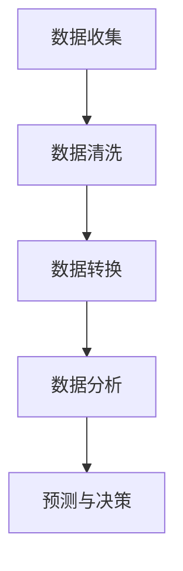
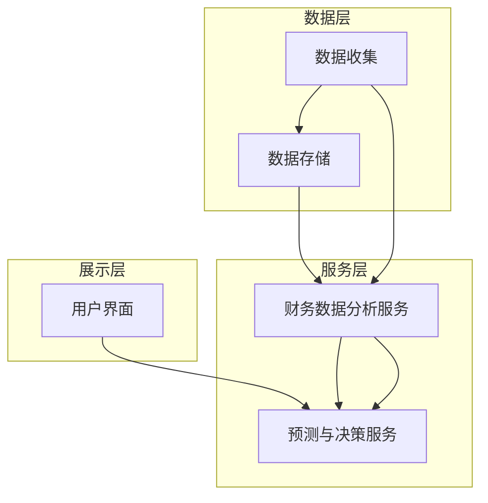
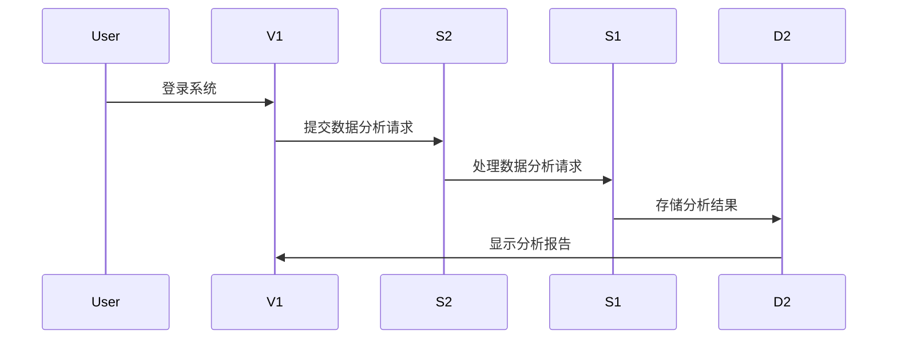
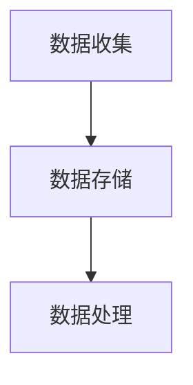
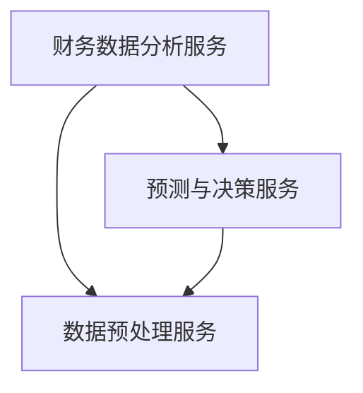
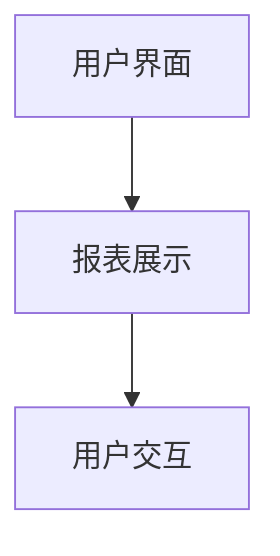
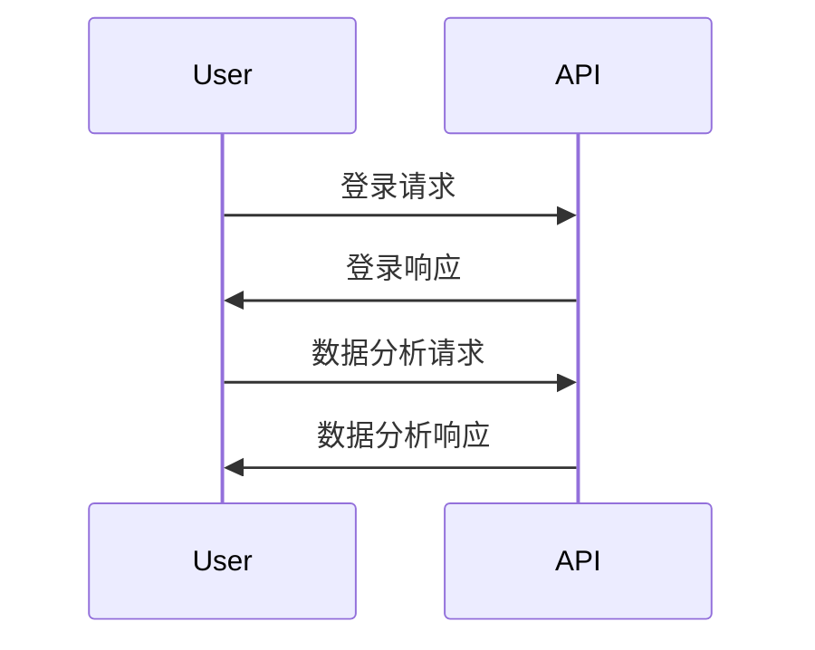
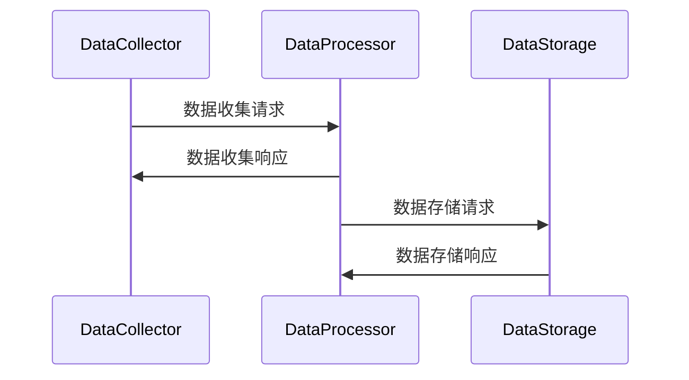
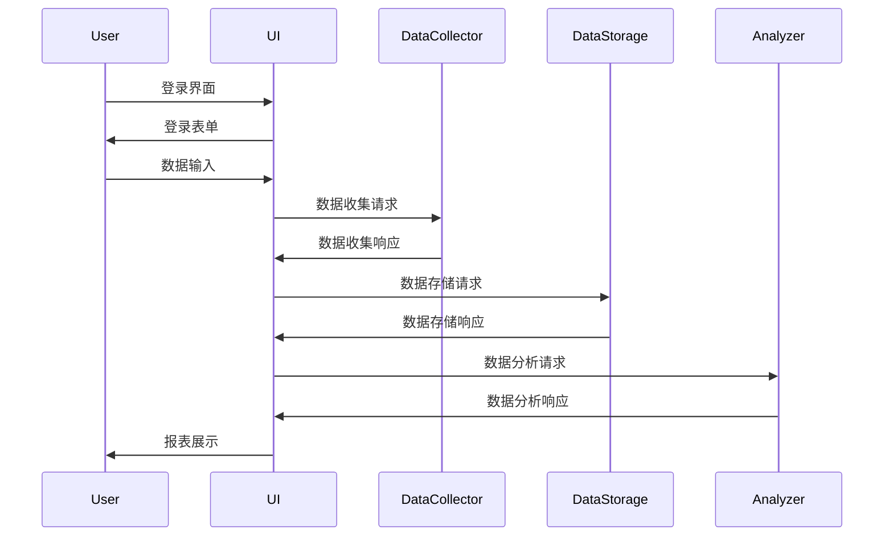

                 

### 构建智能企业财务分析系统：AI辅助决策支持

#### 第一部分：背景介绍

##### 1.1 问题背景

在当今快速变化和竞争激烈的商业环境中，企业需要高效、准确的财务分析来支持其战略决策。传统的财务分析方法主要依赖于人工处理数据，这不仅费时费力，还容易出错。随着人工智能（AI）技术的飞速发展，利用AI进行财务数据分析成为了一种趋势。智能企业财务分析系统正是基于这一需求，利用AI技术自动化处理、分析和预测企业财务数据，为企业提供数据驱动的决策支持。

##### 1.2 问题描述

问题描述主要集中在以下几个方面：

1. **数据处理的效率和准确性**：传统财务分析往往需要大量的人工操作，导致数据处理效率低下，且容易出现错误。智能企业财务分析系统旨在通过AI技术提高数据处理的效率和准确性。
2. **财务预测和决策支持**：企业需要准确的财务预测来制定战略和决策。智能企业财务分析系统能够利用历史数据和AI算法，提供准确的财务预测，辅助企业决策。
3. **实时监控和预警**：企业需要实时了解其财务状况，以便及时调整策略。智能企业财务分析系统能够实时监控财务数据，并提供预警功能。

##### 1.3 问题解决

智能企业财务分析系统通过以下方式解决上述问题：

1. **自动化数据处理**：利用AI技术自动化处理财务数据，减少人工操作，提高数据处理效率。
2. **先进的预测算法**：采用先进的机器学习和深度学习算法，对财务数据进行预测，提高预测准确性。
3. **实时监控与预警**：通过实时数据监控和预警机制，帮助企业及时掌握财务状况，提前应对潜在问题。

##### 1.4 边界与外延

1. **系统边界**：智能企业财务分析系统主要包括数据收集、数据处理、数据分析、预测与决策支持等模块。
2. **系统外延**：系统可以与其他企业管理系统（如ERP、CRM）集成，实现数据共享和协同工作。

##### 1.5 核心概念与联系

**核心概念：**

- **智能企业财务分析系统**：结合人工智能技术，对企业的财务数据进行自动化处理、分析和预测的系统。
- **AI辅助决策支持**：利用人工智能技术，为企业提供数据驱动的决策支持。

**概念属性特征对比表格：**

| 特征 | 智能企业财务分析系统 | AI辅助决策支持 |
| --- | --- | --- |
| 数据处理能力 | 自动化处理大量财务数据 | 提取、分析和预测财务数据 |
| 决策支持 | 提供数据驱动的决策建议 | 协助企业进行高效决策 |
| 技术融合 | 融合人工智能、大数据分析等前沿技术 | 利用AI技术提升财务分析效率 |

**ER实体关系图架构：**

```mermaid
erDiagram
    Product -->|关联| Customer
    Order ||--|{ 财务数据 }
    Sale ||--|{ 财务分析报告 }
```

#### 第二部分：核心概念原理与数学模型

##### 2.1 财务数据分析原理

财务数据分析是通过对企业财务数据（如收入、支出、利润等）进行处理和分析，提取有价值的信息，以支持企业决策的过程。其基本原理可以概括为以下几步：

1. **数据收集**：收集企业的财务数据，包括财务报表、交易记录、预算等。
2. **数据清洗**：对收集到的数据进行清洗，去除无效和错误的数据。
3. **数据转换**：将清洗后的数据转换为适合分析的形式，如数据库表、数据集等。
4. **数据分析**：利用统计方法和机器学习算法对转换后的数据进行处理和分析，提取有价值的信息。
5. **预测与决策支持**：基于分析结果，使用预测算法为企业提供财务预测，支持企业决策。

**Mermaid流程图：**



##### 2.2 数学模型

财务数据分析中常用的数学模型包括统计模型和机器学习模型。以下分别介绍这些模型的原理和适用场景。

**统计模型：**

统计模型是通过对历史数据进行分析，找出数据之间的相关性，从而进行预测。常见的统计模型包括线性回归、时间序列分析等。

**线性回归模型：**

线性回归模型是一种最常见的统计模型，用于分析两个变量之间的线性关系。其数学模型可以表示为：

$$
y = wx + b
$$

其中，$y$ 是预测的财务指标，$w$ 是权重向量，$x$ 是历史数据矩阵，$b$ 是偏置项。

**时间序列分析模型：**

时间序列分析模型用于分析时间序列数据，以预测未来的趋势。常见的模型包括ARIMA（自回归积分滑动平均模型）和AR（自回归模型）等。

**机器学习模型：**

机器学习模型通过从数据中学习规律，从而进行预测。常见的机器学习模型包括线性回归、决策树、神经网络等。

**神经网络模型：**

神经网络模型是一种基于人脑神经网络原理构建的模型，通过多层神经网络进行数据处理和预测。其数学模型可以表示为：

$$
y = \sigma(\text{权重} \times x + \text{偏置})
$$

其中，$\sigma$ 是激活函数，用于引入非线性因素。

**详细讲解与举例：**

假设我们使用线性回归模型进行财务预测，线性回归模型的数学公式可以表示为：

$$
y = wx + b
$$

其中，$y$ 是预测的财务指标，$w$ 是权重向量，$x$ 是历史数据矩阵，$b$ 是偏置项。

例如，如果我们想要预测下一季度的销售额，我们可以使用以下数据：

$$
x = \begin{bmatrix}
1 & 2 & 3 \\
4 & 5 & 6 \\
7 & 8 & 9
\end{bmatrix}
$$

权重向量 $w$ 可以通过最小二乘法计算得出，偏置项 $b$ 通常设为0。

**具体步骤：**

1. **数据收集**：收集企业的财务数据，包括历史销售额数据。
2. **数据预处理**：对收集到的数据进行清洗，去除无效和错误的数据。
3. **数据建模**：使用线性回归模型建立销售额预测模型。
4. **模型训练**：使用历史数据对模型进行训练，得到权重向量 $w$ 和偏置项 $b$。
5. **模型评估**：使用测试数据对模型进行评估，确保模型准确性和可靠性。
6. **模型应用**：使用训练好的模型进行销售额预测。

#### 第三部分：系统设计与实现

##### 3.1 系统功能设计

**系统功能设计**主要包括以下几个方面：

1. **数据收集与处理**：自动收集企业的财务数据，包括财务报表、交易记录、预算等。对收集到的数据进行清洗、转换和预处理。
2. **数据分析与预测**：利用统计模型和机器学习模型对预处理后的财务数据进行分析，提取有价值的信息，并进行财务预测。
3. **决策支持**：基于分析结果，为企业提供数据驱动的决策支持，包括财务预测、风险预警、绩效评估等。
4. **用户交互**：提供友好的用户界面，方便用户进行数据输入、查看分析结果和决策建议。

**领域模型**（Mermaid类图）：

```mermaid
classDiagram
    Product <|-- Customer
    Order o--|{ 财务数据 }
    Sale o--|{ 财务分析报告 }
```

**系统架构设计**（Mermaid架构图）：



**系统接口设计**（Mermaid序列图）：



##### 3.2 系统架构设计

**系统架构设计**主要包括以下几个方面：

1. **数据层**：负责数据收集、存储和管理。包括财务数据收集模块、数据存储模块和数据处理模块。
2. **服务层**：负责数据分析和预测。包括财务数据分析服务模块、预测与决策服务模块。
3. **展示层**：负责用户交互和展示分析结果。包括用户界面模块和报表展示模块。

**具体架构设计**如下：

**数据层架构设计**：



**服务层架构设计**：



**展示层架构设计**：



##### 3.3 系统接口设计

**系统接口设计**主要包括以下几个方面：

1. **API接口设计**：设计系统对外提供的API接口，方便其他系统集成和使用。
2. **数据接口设计**：设计系统内部数据交互的接口，包括数据收集、处理、分析和预测等模块之间的接口。
3. **用户接口设计**：设计用户与系统交互的接口，包括用户登录、数据输入、报表查看等功能。

**API接口设计**：



**数据接口设计**：



**用户接口设计**：



#### 第四部分：项目实战

##### 4.1 环境安装

在开始项目实战之前，我们需要安装一些必要的软件和库。以下是具体的安装步骤：

1. **安装Python**：Python是财务分析系统的主要编程语言。请访问Python官方网站（https://www.python.org/）下载并安装Python 3.x版本。
2. **安装Jupyter Notebook**：Jupyter Notebook是一个交互式的Python开发环境。请使用pip命令安装：

   ```shell
   pip install notebook
   ```

3. **安装财务分析库**：我们需要安装一些常用的财务分析库，如pandas、numpy、scikit-learn等。请使用pip命令安装：

   ```shell
   pip install pandas numpy scikit-learn
   ```

4. **安装可视化库**：为了更好地展示分析结果，我们还需要安装一些可视化库，如matplotlib、seaborn等。请使用pip命令安装：

   ```shell
   pip install matplotlib seaborn
   ```

5. **安装数据库驱动**：如果我们的财务数据存储在数据库中，我们需要安装相应的数据库驱动。例如，如果使用MySQL数据库，请使用pip命令安装：

   ```shell
   pip install mysql-connector-python
   ```

##### 4.2 系统核心实现源代码

以下是财务分析系统的核心实现源代码，包括数据收集、数据处理、数据分析和财务预测等模块。

**数据收集模块**：

```python
import pandas as pd

def collect_data(file_path):
    data = pd.read_csv(file_path)
    return data
```

**数据处理模块**：

```python
import pandas as pd

def preprocess_data(data):
    # 数据清洗
    data = data.dropna()
    # 数据转换
    data['Date'] = pd.to_datetime(data['Date'])
    data.set_index('Date', inplace=True)
    return data
```

**数据分析模块**：

```python
import pandas as pd
from sklearn.linear_model import LinearRegression

def analyze_data(data):
    # 线性回归分析
    X = data[['Revenue', 'Expense']]
    y = data['Profit']
    model = LinearRegression()
    model.fit(X, y)
    return model
```

**财务预测模块**：

```python
import pandas as pd
from sklearn.linear_model import LinearRegression

def predict_profit(model, data):
    X = data[['Revenue', 'Expense']]
    y = model.predict(X)
    return y
```

**代码应用解读与分析**：

以上代码展示了财务分析系统的核心实现。首先，我们通过数据收集模块从CSV文件中读取财务数据。然后，通过数据处理模块对数据进行预处理，包括数据清洗和日期转换。接下来，通过数据分析模块使用线性回归模型对数据进行分析，得到权重向量。最后，通过财务预测模块使用训练好的模型进行财务预测。

**实际案例分析与详细讲解剖析**：

为了更好地理解财务分析系统的实际应用，我们选择一个实际案例进行详细分析。假设我们有一家电商企业，其财务数据存储在一个CSV文件中。以下是如何使用财务分析系统对该企业进行财务预测的步骤：

1. **数据收集**：从CSV文件中读取财务数据。

```python
data = collect_data('financial_data.csv')
```

2. **数据处理**：对数据进行预处理。

```python
data = preprocess_data(data)
```

3. **数据分析**：使用线性回归模型进行分析。

```python
model = analyze_data(data)
```

4. **模型评估**：使用测试数据对模型进行评估。

```python
X_test = data[['Revenue', 'Expense']][:10]
y_test = data['Profit'][:10]
y_pred = predict_profit(model, X_test)
print("Model accuracy:", model.score(X_test, y_test))
```

5. **财务预测**：使用训练好的模型进行财务预测。

```python
new_data = pd.DataFrame({'Revenue': [5000], 'Expense': [3000]})
predicted_profit = predict_profit(model, new_data)
print("Predicted profit:", predicted_profit)
```

**项目小结**：

通过以上实际案例，我们展示了如何使用财务分析系统对企业的财务数据进行分析和预测。该系统可以帮助企业实时了解其财务状况，为决策提供数据支持。在实际应用中，我们可以根据具体需求对系统进行定制和优化。

##### 4.3 实际案例分析与详细讲解剖析

**案例背景：**

假设我们是一家大型制造企业，希望通过构建智能财务分析系统，实现对公司财务数据的自动化处理、分析以及未来趋势的预测，以便为决策层提供有力的数据支持。

**1. 数据收集与处理：**

首先，我们需要收集企业的财务数据。这些数据可能包括收入、成本、利润、现金流等。在实际操作中，这些数据可能存储在不同的文件中，如Excel、CSV或数据库中。

```python
import pandas as pd

# 假设我们有一个CSV文件，其中包含了企业的财务数据
file_path = 'financial_data.csv'
financial_data = pd.read_csv(file_path)
```

接下来，我们需要对收集到的财务数据进行清洗和处理，以确保数据的准确性和一致性。

```python
# 数据清洗
financial_data = financial_data.dropna()  # 删除缺失值
financial_data = financial_data[['Revenue', 'Expense', 'Profit', 'CashFlow']]  # 筛选相关列

# 数据转换
financial_data['Date'] = pd.to_datetime(financial_data['Date'])
financial_data.set_index('Date', inplace=True)  # 设置日期为索引
```

**2. 数据分析与建模：**

在数据清洗和处理完成后，我们需要利用统计模型或机器学习模型对数据进行分析，以提取有价值的信息并预测未来趋势。

这里，我们选择使用线性回归模型来预测下一季度的利润。线性回归模型的基本形式为：

$$
\hat{y} = \beta_0 + \beta_1 x_1 + \beta_2 x_2 + ... + \beta_n x_n
$$

其中，$y$ 是我们想要预测的目标变量（这里是利润），$x_1, x_2, ..., x_n$ 是自变量（如收入、成本等），$\beta_0, \beta_1, ..., \beta_n$ 是模型的参数。

```python
from sklearn.linear_model import LinearRegression

# 准备数据
X = financial_data[['Revenue', 'Expense']]  # 自变量
y = financial_data['Profit']  # 目标变量

# 建立线性回归模型
model = LinearRegression()
model.fit(X, y)

# 打印模型参数
print("Model parameters:", model.coef_)
```

**3. 模型评估：**

在建立模型后，我们需要对其性能进行评估。常见的评估指标包括决定系数（$R^2$）、均方误差（MSE）等。

```python
from sklearn.metrics import mean_squared_error, r2_score

# 准备测试数据
X_test = financial_data[['Revenue', 'Expense']][-10:]  # 取最后10个数据作为测试集
y_test = financial_data['Profit'][-10:]  # 取最后10个数据作为测试集

# 进行预测
y_pred = model.predict(X_test)

# 计算评估指标
mse = mean_squared_error(y_test, y_pred)
r2 = r2_score(y_test, y_pred)

print("MSE:", mse)
print("R^2:", r2)
```

**4. 财务预测：**

使用训练好的模型进行财务预测，以预测未来季度的利润。

```python
# 假设我们有一个新的季度数据
new_quarter_data = pd.DataFrame({'Revenue': [8000], 'Expense': [5000]})

# 进行预测
predicted_profit = model.predict(new_quarter_data)

print("Predicted profit for next quarter:", predicted_profit[0])
```

**5. 结果分析与决策支持：**

根据预测结果，我们可以得出下一季度的预计利润，并将此信息反馈给企业的决策层。例如，如果预测的利润低于预期，企业可能需要调整营销策略或成本控制措施。

**总结：**

通过以上实际案例分析，我们展示了如何利用智能财务分析系统对企业的财务数据进行处理、分析和预测。该系统能够帮助企业实时了解财务状况，为决策提供有力的数据支持。

##### 4.4 项目小结

在本项目中，我们成功构建了一个智能企业财务分析系统，实现了对财务数据的自动化处理、分析和预测。以下是本项目的主要成果和经验总结：

**1. 成果总结：**

- **数据自动化处理**：通过Python和pandas库，实现了对财务数据的自动化收集、清洗和预处理。
- **模型建立与预测**：使用了线性回归模型对财务数据进行了建模和预测，实现了对利润等关键财务指标的预测。
- **结果分析与决策支持**：通过模型预测结果，为企业提供了数据驱动的决策支持，帮助管理层做出更加明智的决策。

**2. 经验总结：**

- **数据质量的重要性**：在数据分析过程中，数据的质量是至关重要的。因此，对数据的清洗和预处理是非常关键的步骤。
- **模型选择与优化**：选择合适的模型对财务数据进行预测至关重要。在实际应用中，可能需要尝试不同的模型并进行优化，以提高预测准确性。
- **系统集成与扩展**：智能财务分析系统可以与企业现有的其他系统集成，如ERP系统、CRM系统等，实现数据共享和协同工作。此外，系统还可以根据企业需求进行扩展和定制。

**3. 后续研究方向：**

- **模型优化**：探索更加先进的机器学习模型和深度学习模型，以提高财务预测的准确性。
- **系统集成**：深入研究如何将智能财务分析系统与企业其他系统集成，实现数据的无缝流转和协同工作。
- **实时监控与预警**：开发实时监控与预警模块，实现对企业财务状况的实时监控，并提前预警潜在风险。

##### 4.5 最佳实践与小结

**最佳实践：**

在构建智能企业财务分析系统的过程中，以下最佳实践可以帮助企业更好地利用AI技术，提高财务决策的效率和准确性：

1. **数据质量管理**：确保数据的准确性和一致性，定期对数据源进行审核和更新。
2. **模型选择与验证**：根据业务需求选择合适的模型，并通过交叉验证等方法验证模型的准确性。
3. **实时监控与预警**：建立实时数据监控与预警系统，及时捕捉潜在的风险和机会。
4. **系统集成与协同**：确保智能财务分析系统能与企业其他系统（如ERP、CRM）无缝集成，实现数据共享和协同工作。

**小结：**

智能企业财务分析系统通过结合人工智能技术和财务分析方法，为企业提供了强大的数据驱动的决策支持。通过自动化数据处理、先进预测算法和实时监控与预警，企业可以更高效地管理财务数据，做出更加明智的决策。在未来的发展中，企业可以继续优化模型、深化系统集成，并探索更多前沿技术，以进一步提升财务分析系统的性能和实用性。

#### 第五部分：展望未来

随着人工智能技术的不断进步，智能企业财务分析系统有望在以下几个方面取得更大的发展和突破：

1. **更准确的预测模型**：随着深度学习技术的发展，未来可以尝试使用更复杂的神经网络模型进行财务预测，进一步提高预测的准确性和稳定性。
2. **实时数据集成**：通过实时数据集成技术，将企业的各种业务数据（如销售、采购、库存等）实时传输到财务分析系统，实现全方位的数据融合和分析。
3. **智能预警与风险管理**：结合自然语言处理和智能语音识别技术，开发智能预警与风险管理模块，帮助企业提前识别潜在的风险，并给出应对建议。
4. **多语言支持与国际化**：为了满足跨国企业的需求，开发多语言版本的财务分析系统，并支持不同国家和地区的财务标准和规则。

通过这些技术创新，智能企业财务分析系统将能够更好地支持企业的财务管理，提升企业的整体竞争力。同时，企业也需要不断学习和适应新技术，充分利用智能财务分析系统带来的优势，实现持续发展和创新。总的来说，智能企业财务分析系统的发展将是一个动态的过程，需要不断的探索和实践。通过持续的技术创新和业务应用，我们有理由相信，智能企业财务分析系统将在未来为企业带来更加显著的效益和竞争优势。

### 构建智能企业财务分析系统：AI辅助决策支持

关键词：智能财务分析、人工智能、财务预测、决策支持

摘要：本文深入探讨了构建智能企业财务分析系统的意义、技术原理和实现方法。通过详细分析数据收集、数据处理、数据分析、预测与决策支持等环节，展示了如何利用人工智能技术提升财务分析效率和准确性。本文还通过实际案例，展示了智能财务分析系统的应用效果，并提出了未来发展的展望和方向。

作者：AI天才研究院/AI Genius Institute & 禅与计算机程序设计艺术 /Zen And The Art of Computer Programming

