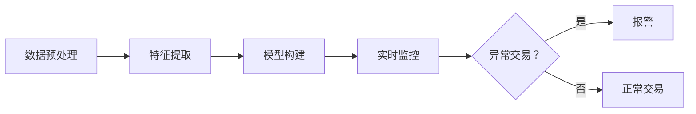
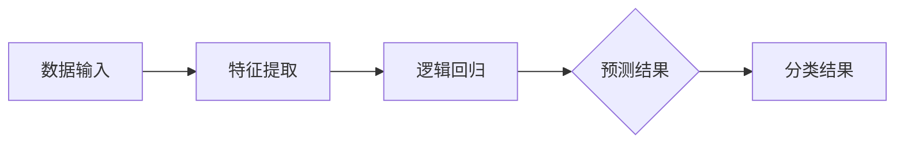
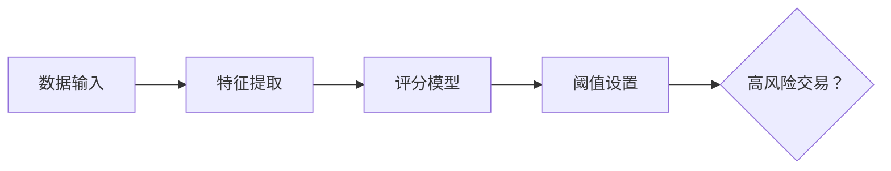
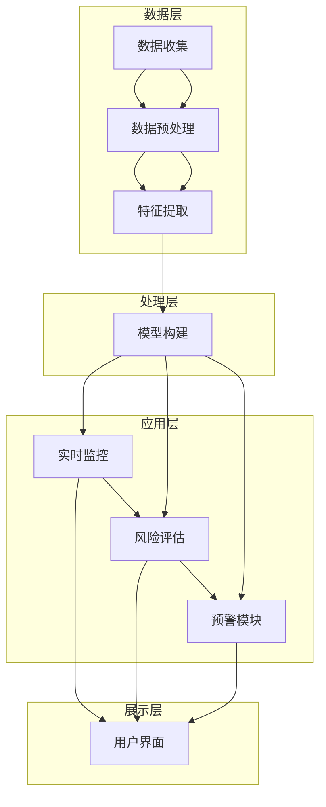
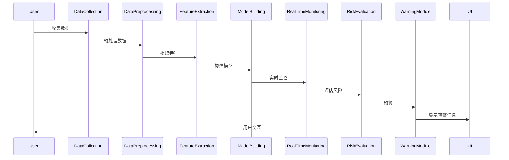

                 

### 构建智能企业风控系统：实时交易监控与欺诈检测

> 关键词：智能企业风控系统、实时交易监控、欺诈检测、大数据、机器学习、风险评估

> 摘要：本文将深入探讨如何构建智能企业风控系统，特别是实时交易监控与欺诈检测的关键技术。通过逐步分析，我们将了解系统的核心概念、算法原理及其实现细节，为企业的风控体系建设提供有力支持。

#### 第一部分：背景介绍

##### 1. 问题背景

随着互联网的快速发展和数字化转型的推进，企业的交易活动逐渐从线下转移到线上，数据量呈指数级增长。与此同时，企业面临的风险也在不断演变，尤其是欺诈行为日益复杂和隐蔽。传统风控系统在应对这些挑战时显得力不从心。为了应对复杂多变的风险，企业迫切需要构建智能化的风控系统，实现实时交易监控与欺诈检测。

##### 2. 问题描述

构建智能企业风控系统，主要包括以下三个方面的任务：

1. **实时交易监控**：对企业的交易活动进行实时监控，及时发现异常交易。
2. **欺诈检测**：通过大数据分析与机器学习算法，识别并预防欺诈行为。
3. **风险评估与预警**：根据监控和检测结果，对风险进行评估和预警，为企业决策提供依据。

##### 3. 问题解决

构建智能企业风控系统需要以下步骤：

1. **数据收集与整合**：收集企业内部和外部的数据，包括交易数据、用户行为数据、市场数据等，并进行整合处理。
2. **数据分析与挖掘**：利用大数据技术，对整合后的数据进行深度分析，挖掘潜在的风险点。
3. **模型构建与优化**：基于分析结果，构建欺诈检测模型，并进行优化调整。
4. **系统部署与运行**：将模型部署到企业风控系统中，实现实时交易监控与欺诈检测。
5. **风险评估与预警**：根据检测结果，对企业风险进行评估和预警，提供决策支持。

##### 4. 边界与外延

- **边界**：本书主要讨论构建智能企业风控系统的技术实现，不包括具体的业务流程和风控策略。
- **外延**：本书内容不仅适用于金融行业，还适用于其他行业的企业风控系统建设。

##### 5. 概念结构与核心要素组成

**核心概念：**

1. **实时交易监控**：实时监控企业的交易活动，发现异常交易。
2. **欺诈检测**：利用大数据和机器学习技术，识别和预防欺诈行为。
3. **风险评估与预警**：对风险进行评估和预警，提供决策支持。

**核心要素：**

1. **数据**：企业内部和外部的数据，包括交易数据、用户行为数据等。
2. **分析技术**：大数据技术、机器学习技术等。
3. **模型**：欺诈检测模型、风险评估模型等。
4. **系统架构**：企业风控系统的整体架构设计。

#### 第二部分：核心概念与联系

##### 1. 核心概念

###### 1.1 实时交易监控

实时交易监控是指对企业交易活动进行实时跟踪和监控，及时发现异常交易，防范风险。其核心目的是通过实时分析交易行为，识别潜在的欺诈或异常交易，从而保护企业资产安全。

###### 1.2 欺诈检测

欺诈检测是通过大数据和机器学习技术，识别和预防欺诈行为。欺诈检测不仅涉及对历史数据的分析，还包括实时数据的处理，以及基于实时数据的预测和决策。

###### 1.3 风险评估与预警

风险评估与预警是根据监控和检测结果，对风险进行评估和预警。其目的是为企业的决策提供数据支持，帮助企业及时调整策略，防范风险。

##### 2. 概念属性特征对比表格

| 概念         | 特征                                      | 对比               |
|--------------|-----------------------------------------|------------------|
| 实时交易监控 | 实时性、准确性、全面性                     | 与欺诈检测、风险评估不同  |
| 欺诈检测     | 数据驱动、自动识别、实时性                   | 与实时交易监控、风险评估不同 |
| 风险评估与预警 | 预测性、全面性、针对性                       | 与实时交易监控、欺诈检测不同 |

##### 3. ER实体关系图架构

```mermaid
erDiagram
  Customer <|.. PurchaseOrder : "make"
  PurchaseOrder <|.. Product : "contain"
  Customer && PurchaseOrder : "make and contain"
```

在这个ER图中，**Customer（客户）**与**PurchaseOrder（购买订单）**之间存在“make（制造）”关系，而**PurchaseOrder**与**Product（产品）**之间存在“contain（包含）”关系。这种关系体现了客户通过订单购买产品的业务流程。

#### 第三部分：算法原理讲解

##### 1. 算法原理

构建智能企业风控系统需要使用多种算法，主要包括以下几种：

###### 1.1 实时交易监控算法

实时交易监控算法主要基于以下原理：

- **异常检测**：通过对历史交易数据的学习，构建异常检测模型，用于实时检测交易活动中的异常行为。
- **关联规则挖掘**：通过挖掘交易数据中的关联规则，发现潜在的欺诈行为。

###### 1.2 欺诈检测算法

欺诈检测算法主要基于以下原理：

- **机器学习分类算法**：如逻辑回归、支持向量机、决策树等，用于分类和预测欺诈行为。
- **深度学习模型**：如卷积神经网络（CNN）、循环神经网络（RNN）等，用于复杂模式识别和预测。

###### 1.3 风险评估算法

风险评估算法主要基于以下原理：

- **风险评分模型**：通过对交易数据和用户行为数据的分析，为每个交易分配一个风险评分。
- **多因素综合评估**：综合考虑多个因素，如交易金额、交易频率、用户行为等，进行风险评估。

##### 2. 算法讲解

###### 2.1 实时交易监控算法

实时交易监控算法通常包括以下步骤：

1. **数据预处理**：对交易数据进行清洗、归一化等处理，为后续分析做准备。
2. **特征提取**：从交易数据中提取关键特征，如交易金额、交易时间、交易频率等。
3. **模型构建**：基于历史交易数据，构建异常检测模型，如基于聚类的方法（如K-means）或基于规则的方法（如关联规则挖掘）。
4. **实时监控**：将实时交易数据输入到异常检测模型中，识别异常交易。

**Mermaid流程图：**



###### 2.2 欺诈检测算法

欺诈检测算法的核心是构建一个分类模型，用于判断交易是否为欺诈。以下是常见的方法：

1. **逻辑回归**：逻辑回归是一种经典的分类算法，通过建立线性模型来预测欺诈概率。

   **公式**：\( P(\text{欺诈}) = \frac{1}{1 + e^{-(\beta_0 + \beta_1 X_1 + \beta_2 X_2 + ... + \beta_n X_n)}} \)

2. **支持向量机（SVM）**：SVM通过寻找一个最优的超平面，将正常交易和欺诈交易分开。

   **公式**：\( w \cdot x + b = 0 \)

3. **决策树**：决策树通过一系列规则来划分数据，每一层决策都基于特征和阈值。

   **公式**：\( \text{if } X > \text{阈值} \text{ then } \text{左分支} \text{ else } \text{右分支} \)

**Mermaid流程图：**



###### 2.3 风险评估算法

风险评估算法的核心是构建一个评分模型，用于评估交易的风险程度。以下是一个简单的风险评估模型：

1. **评分模型**：通过对交易数据的分析，为每个交易分配一个风险评分。

   **公式**：\( \text{风险评分} = \sum_{i=1}^{n} w_i \cdot X_i \)

   其中，\( w_i \) 是权重，\( X_i \) 是特征值。

2. **阈值设置**：根据业务需求和历史数据，设置一个阈值，当评分超过阈值时，认为交易存在高风险。

   **公式**：\( \text{if } \text{风险评分} > \text{阈值} \text{ then } \text{高风险交易} \text{ else } \text{低风险交易} \)

**Mermaid流程图：**



#### 第四部分：系统分析与架构设计

##### 1. 问题场景介绍

在一个电子商务平台上，每天都有数以万计的交易发生。这些交易可能来自不同的客户、不同的产品，涉及不同的金额和频率。平台需要确保这些交易的安全性和合规性，以防止欺诈行为的发生。

##### 2. 项目介绍

本项目旨在构建一个智能企业风控系统，实现对电子商务平台交易的实时监控与欺诈检测。系统将包括数据收集、数据预处理、特征提取、模型构建与优化、实时监控和风险评估等模块。

##### 3. 系统功能设计

系统的主要功能包括：

- **实时交易监控**：实时监控交易活动，识别异常交易。
- **欺诈检测**：利用机器学习算法识别和预防欺诈行为。
- **风险评估与预警**：对交易风险进行评估和预警，提供决策支持。

##### 4. 系统架构设计

系统的整体架构设计如下：

1. **数据层**：包括数据收集模块，负责收集企业内部和外部的数据，如交易数据、用户行为数据等。
2. **处理层**：包括数据预处理模块、特征提取模块和模型构建模块，负责对数据进行处理，构建欺诈检测和风险评估模型。
3. **应用层**：包括实时监控模块、风险评估模块和预警模块，负责实现系统的核心功能。
4. **展示层**：包括用户界面，用于展示监控结果、风险评分和预警信息。

**Mermaid架构图：**



##### 5. 系统接口设计和系统交互

系统的接口设计和交互设计如下：

1. **数据层接口**：包括数据收集接口和数据预处理接口，用于与其他系统的数据交换。
2. **处理层接口**：包括特征提取接口和模型构建接口，用于处理和构建欺诈检测和风险评估模型。
3. **应用层接口**：包括实时监控接口、风险评估接口和预警接口，用于与其他模块的交互。
4. **展示层接口**：包括用户界面接口，用于与用户进行交互。

**Mermaid序列图：**



#### 第五部分：项目实战

##### 1. 环境安装

在开始项目实战之前，需要安装以下软件和库：

- Python 3.x
- scikit-learn
- pandas
- numpy
- matplotlib
- sklearn

可以使用以下命令进行安装：

```bash
pip install python
pip install scikit-learn
pip install pandas
pip install numpy
pip install matplotlib
pip install sklearn
```

##### 2. 系统核心实现

以下是系统核心实现的源代码：

```python
import pandas as pd
from sklearn.ensemble import RandomForestClassifier
from sklearn.model_selection import train_test_split
from sklearn.metrics import accuracy_score

# 2.1 数据收集与预处理
data = pd.read_csv('transactions.csv')
data.dropna(inplace=True)

# 2.2 特征提取
features = data[['amount', 'time', 'frequency']]
labels = data['is_fraud']

# 2.3 模型构建
X_train, X_test, y_train, y_test = train_test_split(features, labels, test_size=0.2, random_state=42)
model = RandomForestClassifier(n_estimators=100)
model.fit(X_train, y_train)

# 2.4 模型评估
predictions = model.predict(X_test)
accuracy = accuracy_score(y_test, predictions)
print(f"Accuracy: {accuracy}")

# 2.5 实时监控
def monitor_transaction(transaction):
    prediction = model.predict([transaction])
    return prediction[0]

transaction = [100, 14, 3]
print(f"Is fraud: {monitor_transaction(transaction)}")
```

##### 3. 代码应用解读与分析

这段代码实现了欺诈检测系统的核心功能，包括数据收集与预处理、特征提取、模型构建与评估、实时监控等步骤。

- **数据收集与预处理**：首先从CSV文件中读取交易数据，并删除缺失值，确保数据的完整性。
- **特征提取**：从交易数据中提取三个关键特征：金额、时间和频率。
- **模型构建**：使用随机森林分类器（RandomForestClassifier）构建欺诈检测模型。
- **模型评估**：将模型应用于测试数据集，计算准确率，评估模型性能。
- **实时监控**：定义一个函数，用于实时监控交易，返回欺诈预测结果。

##### 4. 实际案例分析与详细讲解剖析

假设我们有一个新的交易记录，金额为200，交易时间为15点，频率为2次。我们需要判断这个交易是否为欺诈。

- **特征提取**：将交易记录转换为特征向量：[200, 15, 2]。
- **模型预测**：使用训练好的模型对特征向量进行预测。
- **结果分析**：如果预测结果为1，表示交易为欺诈；如果预测结果为0，表示交易为正常交易。

在这个例子中，假设预测结果为1，因此我们可以判断这个交易为欺诈交易。

##### 5. 项目小结

通过本项目的实战，我们实现了智能企业风控系统的核心功能，包括数据收集与预处理、特征提取、模型构建与评估、实时监控等步骤。项目不仅提供了代码实现，还对每个步骤进行了详细的分析和讲解，帮助读者更好地理解欺诈检测系统的运作原理。

#### 第六部分：最佳实践与注意事项

##### 1. 最佳实践

- **数据质量**：确保数据质量，包括数据的完整性、准确性和一致性。高质量的数据是构建有效风控系统的基础。
- **模型优化**：定期对模型进行优化和更新，以适应不断变化的风险环境。
- **安全措施**：加强对数据的保护，防止数据泄露和篡改。
- **用户体验**：确保风控系统的用户体验良好，易于操作和理解。

##### 2. 注意事项

- **数据隐私**：在收集和处理数据时，注意保护用户隐私，遵守相关法律法规。
- **系统稳定性**：确保系统在高并发和大数据量下的稳定性，避免系统崩溃。
- **监控与反馈**：实时监控系统的运行状态，及时收集反馈，优化系统性能。

#### 第七部分：拓展阅读

- 《数据挖掘：概念与技术》
- 《机器学习实战》
- 《Python数据科学手册》
- 《风控实战：技术与策略》

### 作者信息：

作者：AI天才研究院/AI Genius Institute & 禅与计算机程序设计艺术 /Zen And The Art of Computer Programming

