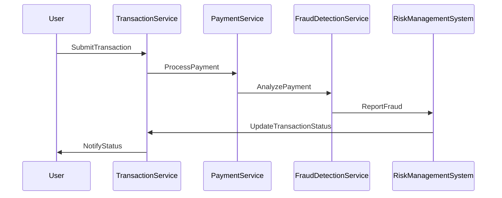
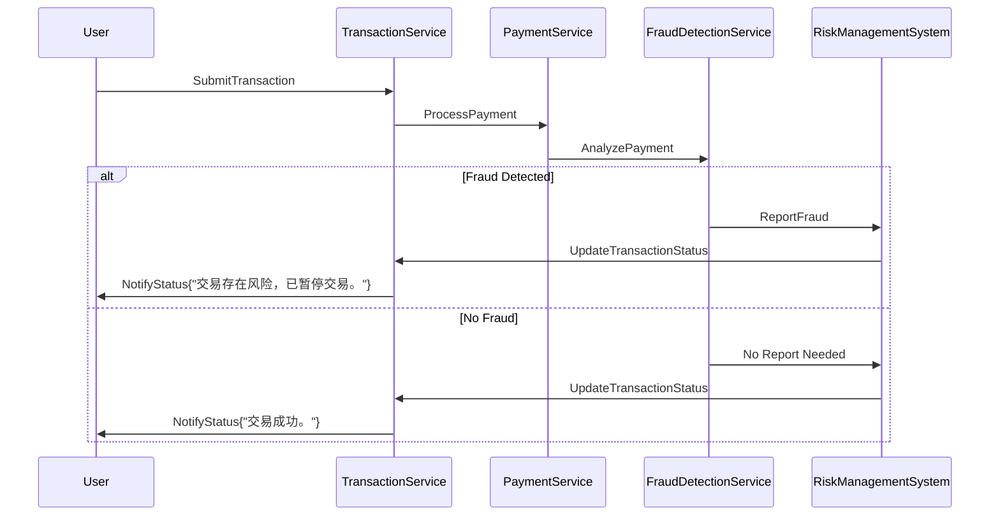

                 


### 第一部分：背景介绍

#### 1.1 问题背景

**问题的起源**

随着互联网和信息技术的快速发展，企业业务模式逐渐向线上转移，交易数据的规模和复杂性也呈指数级增长。在这种情况下，如何保障交易的安全性和合规性成为企业面临的重要问题。传统的风险管理方法往往依赖于人工经验和固定规则，难以应对不断变化的交易模式和欺诈手段。

**风险管理的必要性**

在市场竞争日益激烈的环境下，企业必须时刻关注风险，以确保业务连续性和可持续发展。同时，监管机构对企业的风险管理要求也越来越严格，合规性问题直接影响企业的声誉和生存能力。

**智能风控系统的概念**

智能风控系统是指利用人工智能、大数据和云计算等技术，对企业的交易行为进行实时监控，识别潜在的欺诈和风险，并采取相应的措施进行防范和应对。这种系统具有高效、智能、实时、自动化的特点，能够显著提升企业的风险管理能力。

#### 1.2 问题描述

**企业风险类型**

企业的风险可以大致分为以下几类：

- **内部风险**：包括员工欺诈、操作失误、系统漏洞等。
- **外部风险**：包括市场风险、信用风险、欺诈攻击等。

**风险管理的重要性**

风险管理不仅关乎企业的财务安全，还直接影响企业的竞争力和生存能力。有效的风险管理可以帮助企业：

- 提高决策效率，降低决策风险。
- 提升运营效率，减少不必要的开支。
- 建立良好的合规性，保护企业声誉。

#### 1.3 问题解决

**智能风控系统的概念**

智能风控系统是一种基于大数据和人工智能技术的风险管理工具，通过实时监控交易行为，识别异常和潜在风险，从而实现风险预警和防范。

**智能风控系统的作用**

- **实时交易监控**：对企业的交易行为进行实时监控，及时识别异常交易。
- **欺诈模式识别**：通过机器学习算法，识别潜在的欺诈模式，防范欺诈行为。
- **自动化处理**：自动触发预警和应对措施，减少人工干预，提高处理效率。

### 第一部分：核心概念与联系

#### 2.1 核心概念

**实时交易监控**

实时交易监控是指利用大数据分析和人工智能技术，对企业的交易行为进行实时监控，以识别异常交易和潜在风险。

**欺诈模式识别**

欺诈模式识别是指利用机器学习算法，对大量交易数据进行训练，识别出潜在的欺诈模式和特征，从而实现欺诈的防范。

#### 2.2 概念属性特征对比表格

以下是实时交易监控和欺诈模式识别的主要属性特征对比：

| 特征               | 实时交易监控           | 欺诈模式识别           |
|--------------------|----------------------|----------------------|
| 监控对象           | 交易数据             | 欺诈数据             |
| 监控目标           | 异常交易识别         | 欺诈行为识别         |
| 技术依赖           | 数据分析、实时处理   | 机器学习、模式识别   |
| 时间敏感性         | 实时性要求高         | 实时性要求高         |
| 数据量             | 大数据量             | 大数据量             |
| 算法复杂度         | 较低                 | 较高                 |

#### 2.3 概念的联系与区别

实时交易监控和欺诈模式识别虽然都是智能风控系统的重要组成部分，但它们在目标、方法和应用场景上存在一定的区别。

- **目标**：实时交易监控的目标是识别异常交易，确保交易的安全性和合规性；欺诈模式识别的目标是识别欺诈行为，防止欺诈造成的损失。
- **方法**：实时交易监控主要依赖于数据分析和技术，通过实时处理交易数据来发现异常；欺诈模式识别则依赖于机器学习和模式识别技术，通过训练模型来识别欺诈模式。
- **应用场景**：实时交易监控适用于所有类型的交易行为，而欺诈模式识别则主要应用于高风险领域，如金融、电商等。

### 第一部分：算法原理讲解

#### 3.1 算法原理

**实时交易监控算法**

实时交易监控算法的核心目标是识别交易中的异常行为。算法的基本原理包括：

1. **数据采集**：从企业交易系统中实时获取交易数据。
2. **特征提取**：从交易数据中提取关键特征，如交易金额、时间、地点等。
3. **异常检测**：利用统计模型或机器学习算法，对提取的特征进行异常检测。
4. **预警和响应**：对检测到的异常交易进行预警，并采取相应的应对措施。

**欺诈模式识别算法**

欺诈模式识别算法的核心目标是识别欺诈行为。算法的基本原理包括：

1. **数据收集**：从企业历史交易数据中收集欺诈案例。
2. **特征工程**：对收集的数据进行清洗、转换和特征提取。
3. **模型训练**：利用机器学习算法，对提取的特征进行训练，建立欺诈模式识别模型。
4. **模式识别**：利用训练好的模型，对实时交易数据进行欺诈模式识别。
5. **结果反馈**：对识别出的欺诈行为进行标记和反馈，以便进一步分析和处理。

#### 3.2 数学模型和数学公式

**实时交易监控算法的数学模型**

1. **统计模型**：

$$
Z = \frac{X - \mu}{\sigma}
$$

其中，$X$ 表示交易特征的观察值，$\mu$ 表示该特征的均值，$\sigma$ 表示该特征的标准差。当$Z$ 的值大于某个阈值时，认为交易特征存在异常。

2. **机器学习模型**：

$$
h(\theta) = \sum_{i=1}^{n} \theta^T x_i
$$

其中，$\theta$ 表示模型参数，$x_i$ 表示交易特征的向量，$h(\theta)$ 表示交易特征的概率分布。

**欺诈模式识别算法的数学模型**

1. **决策树模型**：

$$
y = \begin{cases} 
欺诈 & \text{如果} \ f(x) > 0.5 \\
非欺诈 & \text{否则}
\end{cases}
$$

其中，$y$ 表示欺诈标签，$f(x)$ 表示欺诈预测分数。

2. **神经网络模型**：

$$
a = \sigma(\sum_{i=1}^{n} w_i a_i)
$$

其中，$a$ 表示输出层节点，$\sigma$ 表示激活函数，$w_i$ 表示权重，$a_i$ 表示隐藏层节点。

#### 3.3 算法举例说明

**实时交易监控算法举例**

假设我们有一个交易金额的特征，平均值为5000元，标准差为1000元。当检测到一个交易金额为8000元时，我们可以使用上述统计模型进行异常检测：

$$
Z = \frac{8000 - 5000}{1000} = 3
$$

由于$Z$ 的值大于2（常见的阈值），我们可以认为这个交易金额存在异常。

**欺诈模式识别算法举例**

假设我们使用一个决策树模型进行欺诈模式识别。假设欺诈预测分数$f(x)$ 为0.6，由于0.6大于0.5，我们可以判断这个交易为欺诈行为。

### 第一部分：系统分析与架构设计方案

#### 4.1 问题场景介绍

在电子商务领域，企业每天都会处理大量的交易数据。这些交易数据不仅包括用户的行为数据，如浏览、搜索、下单等，还包括支付、物流、售后等环节的数据。如何从这些数据中实时监控交易行为，识别潜在的欺诈行为，是企业面临的一个重要问题。

#### 4.2 系统功能设计

**4.2.1 领域模型**

以下是实时交易监控系统的领域模型Mermaid类图：

```mermaid
classDiagram
    User <|-- Transaction
    Transaction o-- Payment
    Transaction o-- Product
    Product o-- Seller
    Seller o-- Transaction
    User o-- Review
    Review o-- Product
    Review o-- User

    User[name, email, password]
    Transaction[id, timestamp, amount, status]
    Payment[id, transactionId, method, status]
    Product[id, name, price, sellerId]
    Seller[id, name, email]
    Review[id, rating, comment, userId, productId]
```

**4.2.2 系统架构设计**

以下是实时交易监控系统的架构设计Mermaid架构图：



**4.2.3 系统接口设计**

以下是系统的接口设计：

- **SubmitTransaction**：用户提交交易请求，接口接收交易数据，并生成交易记录。
- **ProcessPayment**：处理支付请求，更新支付状态。
- **AnalyzePayment**：分析支付数据，识别潜在的欺诈行为。
- **ReportFraud**：报告欺诈行为，触发相应的风险控制措施。
- **UpdateTransactionStatus**：更新交易状态，通知用户。
- **NotifyStatus**：通知用户交易状态。

**4.2.4 系统交互**

以下是系统的交互Mermaid序列图：



### 第二部分：核心概念与联系

在构建智能企业风控系统时，理解并正确应用核心概念是关键。本部分将详细阐述实时交易监控与欺诈模式识别的核心概念，并展示它们之间的联系。

#### 2.1 实时交易监控

**核心概念**

实时交易监控是指通过技术手段对企业的交易活动进行持续的、实时的跟踪与分析。其核心目标在于及时发现并预警异常交易行为，从而保障交易的安全与合规。

- **交易数据流处理**：实时交易监控系统需要处理大量的交易数据流，这些数据流包括交易金额、交易时间、交易地点、用户行为等。
- **异常检测算法**：使用统计方法或机器学习算法对交易数据进行异常检测，识别出可能存在欺诈或违规的交易行为。
- **实时性要求**：由于欺诈行为可能瞬间发生，实时交易监控需要具备快速响应能力，以降低潜在损失。

**实时交易监控的原理**

1. **数据采集**：从各种交易渠道（如在线支付系统、API接口、数据库等）实时采集交易数据。
2. **特征提取**：从原始交易数据中提取关键特征，如交易金额、交易频率、交易时段等。
3. **实时分析**：使用统计模型或机器学习算法对提取的特征进行实时分析，识别异常交易。
4. **预警机制**：对检测到的异常交易进行标记，并触发预警通知，供相关人员进一步分析处理。

**实时交易监控的优点**

- **实时性**：能够及时发现并响应异常交易，减少欺诈行为造成的损失。
- **自动化**：通过算法自动识别异常交易，减少人工工作量。
- **可扩展性**：能够处理大量交易数据，适应不同规模和业务模式的企业需求。

#### 2.2 欺诈模式识别

**核心概念**

欺诈模式识别是智能风控系统的重要组成部分，它通过分析历史交易数据，使用机器学习算法识别出潜在的欺诈模式，从而有效预防欺诈行为。

- **历史数据学习**：欺诈模式识别依赖于对大量历史交易数据的分析，从中挖掘出欺诈行为的特征和模式。
- **机器学习算法**：使用监督学习或无监督学习算法，如决策树、随机森林、神经网络等，对交易数据进行建模，识别欺诈行为。
- **实时预测**：将训练好的模型应用于实时交易数据，预测交易行为是否属于欺诈。

**欺诈模式识别的原理**

1. **数据收集**：从企业历史交易数据中收集可能的欺诈案例，并进行数据预处理。
2. **特征工程**：提取交易数据中的关键特征，并进行数据转换和归一化处理。
3. **模型训练**：使用机器学习算法，对提取的特征进行训练，构建欺诈模式识别模型。
4. **模型评估**：使用交叉验证等方法评估模型的准确性、召回率和F1值等指标。
5. **实时预测**：将训练好的模型应用于实时交易数据，预测交易行为是否属于欺诈，并触发相应的预警措施。

**欺诈模式识别的优点**

- **高效性**：通过机器学习算法，能够快速识别复杂的欺诈模式。
- **精准性**：通过对历史数据的分析，能够提高对欺诈行为的识别准确率。
- **动态适应**：随着新的欺诈手段的出现，模型能够动态适应并更新，保持识别能力。

#### 2.3 实时交易监控与欺诈模式识别的联系

实时交易监控与欺诈模式识别是智能风控系统的两个核心组成部分，它们之间有着紧密的联系和协同作用。

- **数据共享**：实时交易监控系统与欺诈模式识别系统共享交易数据，实时交易监控系统提供当前交易数据，欺诈模式识别系统利用这些数据进行模式识别。
- **预警联动**：当实时交易监控系统检测到异常交易时，会触发预警通知，欺诈模式识别系统会进一步分析这些交易行为，以确定是否属于欺诈，并提供相应的风险控制建议。
- **综合评估**：智能风控系统通过实时交易监控与欺诈模式识别的协同工作，对交易行为进行全面评估，提高整体风险管理能力。

通过这种紧密的协同作用，智能风控系统能够在实时性和精准性之间取得平衡，为企业提供强大的风险管理能力。

### 第二部分：核心概念与联系

在智能企业风控系统的构建过程中，实时交易监控和欺诈模式识别是两个关键组成部分。它们不仅各自独立运作，还紧密协作，共同提升企业的风险管理能力。

#### 2.1 实时交易监控

**核心概念**

实时交易监控是一种利用先进技术对企业的交易活动进行持续监控和预警的系统。其核心在于：

- **数据采集**：从企业内部和外部的多个数据源（如支付系统、API接口、数据库等）实时收集交易数据。
- **异常检测**：通过对交易数据进行分析，识别出潜在的异常交易行为，如欺诈、违规操作等。
- **预警机制**：在检测到异常时，及时发出警报，提醒相关人员进行处理。

**实时交易监控的工作流程**

1. **数据流处理**：系统通过数据流处理技术（如Apache Kafka、Flink等）实时处理交易数据。
2. **特征提取**：从交易数据中提取关键特征，如交易金额、时间、频率、用户行为等。
3. **实时分析**：利用统计模型（如统计学方法、机器学习模型等）对特征进行实时分析，检测交易行为是否异常。
4. **预警通知**：当检测到异常交易时，系统会触发预警机制，通过短信、邮件或系统消息等方式通知相关人员。

**实时交易监控的优点**

- **实时性**：能够实时监测交易行为，及时发现异常，降低风险。
- **高效性**：通过自动化技术，减少人工工作量，提高处理效率。
- **可扩展性**：能够处理大规模的交易数据，适应不同规模的企业需求。

#### 2.2 欺诈模式识别

**核心概念**

欺诈模式识别是利用机器学习和数据挖掘技术，从历史交易数据中挖掘出欺诈行为的规律和特征，从而预测和防范未来的欺诈行为。其核心在于：

- **数据挖掘**：从大量历史交易数据中提取有用的信息，识别出潜在的欺诈模式。
- **机器学习**：利用训练好的模型对新的交易行为进行预测，识别出欺诈行为。
- **持续更新**：随着新的欺诈手段的出现，模型需要不断更新，以保持识别能力。

**欺诈模式识别的工作流程**

1. **数据收集**：从企业的历史交易数据中收集可能包含欺诈行为的案例。
2. **特征工程**：提取交易数据中的关键特征，并进行数据预处理，如归一化、缺失值填补等。
3. **模型训练**：使用机器学习算法（如决策树、随机森林、神经网络等）对特征进行训练，构建欺诈模式识别模型。
4. **模型评估**：通过交叉验证等方法评估模型的性能，如准确性、召回率、F1值等。
5. **实时预测**：将训练好的模型应用于实时交易数据，预测交易行为是否属于欺诈。

**欺诈模式识别的优点**

- **准确性**：通过机器学习算法，能够提高对欺诈行为的识别准确率。
- **自适应**：能够随着欺诈手段的变化而动态更新，保持识别能力。
- **预测性**：能够预测未来的欺诈行为，提前采取措施进行防范。

#### 2.3 实时交易监控与欺诈模式识别的协同作用

实时交易监控和欺诈模式识别在智能风控系统中共同发挥作用，相互补充，提升企业的风险管理能力。

- **数据共享**：实时交易监控系统提供的交易数据是欺诈模式识别系统的重要输入，两者共享同一数据源，确保了数据的准确性和一致性。
- **预警联动**：实时交易监控系统检测到异常交易后，会触发预警机制，欺诈模式识别系统会进一步分析这些交易行为，确定是否属于欺诈，并提供风险控制建议。
- **综合评估**：通过实时交易监控和欺诈模式识别的协同作用，系统能够对交易行为进行全面评估，提高识别准确率和处理效率。

总之，实时交易监控和欺诈模式识别是智能企业风控系统的核心组成部分，它们相互协同，共同构建了一个强大的风险管理框架，为企业提供了全方位的风险防范能力。

### 第三部分：算法原理讲解

在智能企业风控系统中，算法原理的讲解至关重要。本部分将深入探讨实时交易监控和欺诈模式识别算法的基本原理、流程、数学模型及实际应用。

#### 3.1 实时交易监控算法

**3.1.1 算法原理**

实时交易监控算法的核心目标是通过分析和处理交易数据，及时发现异常交易行为。常见的实时交易监控算法包括统计模型和机器学习模型。

1. **统计模型**

统计模型通过分析交易数据的统计特性，如均值、方差、分布等，来识别异常交易。常用的统计模型有：

- **单变量统计模型**：例如，Z-Score模型，用于检测单个交易特征的异常。其基本原理为：

$$
Z = \frac{X - \mu}{\sigma}
$$

其中，$X$ 是交易特征的观察值，$\mu$ 是该特征的均值，$\sigma$ 是该特征的标准差。当$Z$ 的值超出某个阈值（例如2或3），则认为存在异常。

- **多变量统计模型**：例如，Box-Cox模型，用于检测多个交易特征之间的联合异常。其基本原理是通过建立多变量正态分布模型，并计算联合概率密度函数，从而识别异常交易。

2. **机器学习模型**

机器学习模型通过从历史交易数据中学习，建立交易行为和异常交易之间的关联，用于实时识别异常交易。常用的机器学习模型有：

- **分类模型**：例如，逻辑回归、支持向量机（SVM）、随机森林等，用于将交易行为分类为正常或异常。

- **聚类模型**：例如，K-Means、DBSCAN等，用于将交易行为聚类，识别出异常交易簇。

**3.1.2 算法流程**

实时交易监控算法的基本流程包括：

1. **数据采集**：从各种数据源（如支付系统、数据库等）实时获取交易数据。
2. **特征提取**：从交易数据中提取关键特征，如交易金额、时间、频率、用户行为等。
3. **异常检测**：利用统计模型或机器学习模型对交易特征进行异常检测。
4. **预警通知**：对检测到的异常交易进行标记，并触发预警机制，通知相关人员。

**3.1.3 数学模型**

1. **Z-Score模型**：

$$
Z = \frac{X - \mu}{\sigma}
$$

2. **逻辑回归模型**：

$$
P(Y=1|X) = \frac{1}{1 + e^{-(\beta_0 + \beta_1 X_1 + \beta_2 X_2 + \ldots + \beta_n X_n})}
$$

其中，$X$ 是特征向量，$Y$ 是交易行为标签（0表示正常，1表示异常），$\beta_0, \beta_1, \ldots, \beta_n$ 是模型参数。

**3.1.4 实际应用**

例如，在一个电子商务平台上，我们可以使用Z-Score模型来检测交易金额的异常。如果某个用户的交易金额突然增加，超出正常范围的阈值，则认为该交易存在异常，并触发预警机制。

#### 3.2 欺诈模式识别算法

**3.2.1 算法原理**

欺诈模式识别算法的核心目标是利用机器学习技术从历史交易数据中挖掘出欺诈行为的模式，并用于实时识别潜在的欺诈行为。常见的欺诈模式识别算法包括监督学习和无监督学习。

1. **监督学习模型**

监督学习模型通过标记好的历史数据学习欺诈模式和特征，用于新交易行为的欺诈识别。常用的监督学习模型有：

- **分类模型**：例如，决策树、随机森林、支持向量机等，用于将交易行为分类为欺诈或非欺诈。

- **回归模型**：例如，逻辑回归，用于预测新交易行为是否属于欺诈。

2. **无监督学习模型**

无监督学习模型通过未标记的历史数据学习欺诈模式和特征，用于新交易行为的聚类分析。常用的无监督学习模型有：

- **聚类模型**：例如，K-Means、DBSCAN等，用于将交易行为聚类，识别出潜在的欺诈行为。

- **关联规则学习**：例如，Apriori算法，用于发现交易数据中的潜在关联规则。

**3.2.2 算法流程**

欺诈模式识别算法的基本流程包括：

1. **数据收集**：从企业历史交易数据中收集可能的欺诈案例。
2. **特征提取**：从交易数据中提取关键特征，并进行数据预处理。
3. **模型训练**：使用监督学习或无监督学习模型对提取的特征进行训练。
4. **模型评估**：通过交叉验证等方法评估模型的性能。
5. **实时预测**：将训练好的模型应用于实时交易数据，识别潜在的欺诈行为。

**3.2.3 数学模型**

1. **决策树模型**：

$$
y = \begin{cases} 
欺诈 & \text{如果} \ f(x) > 0.5 \\
非欺诈 & \text{否则}
\end{cases}
$$

其中，$y$ 是欺诈标签，$f(x)$ 是欺诈预测分数。

2. **K-Means聚类模型**：

$$
\mu_j = \frac{1}{N_j} \sum_{i=1}^{N} x_i
$$

$$
x_i = \mu_j + \epsilon_i
$$

其中，$\mu_j$ 是第$j$ 个聚类中心的坐标，$N_j$ 是属于第$j$ 个聚类的交易数量，$x_i$ 是第$i$ 个交易的坐标，$\epsilon_i$ 是随机误差。

**3.2.4 实际应用**

例如，在一个电商平台中，我们可以使用K-Means聚类模型来识别潜在的欺诈行为。通过将交易数据聚类，我们发现某些簇（聚类）中的交易行为与其他簇存在显著差异，这些簇可能包含欺诈交易。进一步分析这些簇的特征，可以帮助我们识别出欺诈模式，并提高欺诈识别的准确性。

总之，实时交易监控和欺诈模式识别算法是智能企业风控系统的核心组成部分。通过深入理解这些算法的原理、流程、数学模型及实际应用，我们可以构建出高效、智能的风控系统，有效防范欺诈行为，保障企业交易的安全与合规。

### 第四部分：系统分析与架构设计方案

在构建智能企业风控系统时，系统分析与架构设计是至关重要的一环。本部分将详细描述系统分析的过程，介绍系统功能设计、架构设计、接口设计和系统交互。

#### 4.1 问题场景介绍

假设我们正在为企业构建一个智能风控系统，该系统需要处理大量交易数据，并在实时监控交易行为的同时，识别潜在的欺诈行为。以下是一个典型的问题场景：

- **交易场景**：企业每天都会通过在线支付系统、API接口等渠道处理大量交易。交易数据包括交易金额、交易时间、交易地点、用户行为等。
- **风险管理需求**：企业希望实时监控交易行为，及时发现并预警异常交易，识别潜在的欺诈行为，从而保障交易的安全与合规。

#### 4.2 系统功能设计

系统功能设计是系统分析的核心，它定义了系统需要实现的核心功能。以下是智能企业风控系统的功能设计：

1. **实时交易监控**
   - **功能描述**：实时采集交易数据，提取关键特征，利用算法检测异常交易。
   - **实现方法**：使用流处理技术（如Apache Kafka、Flink等）实时处理交易数据，提取交易金额、时间、频率等特征，利用统计模型或机器学习算法检测异常交易。

2. **欺诈模式识别**
   - **功能描述**：从历史交易数据中学习欺诈模式，对新交易行为进行预测，识别潜在的欺诈行为。
   - **实现方法**：使用机器学习算法（如决策树、随机森林、神经网络等）对历史交易数据进行训练，建立欺诈模式识别模型，对新交易行为进行预测。

3. **预警通知**
   - **功能描述**：当检测到异常交易或潜在欺诈行为时，及时通知相关人员。
   - **实现方法**：通过短信、邮件或系统消息等方式通知相关人员，并提供详细信息以便进一步处理。

4. **风险控制**
   - **功能描述**：根据预警信息，采取相应的风险控制措施，如暂停交易、冻结账户等。
   - **实现方法**：根据预警信息和风险控制策略，自动或手动执行风险控制措施。

#### 4.3 系统架构设计

系统架构设计决定了系统的整体结构和技术选型。以下是智能企业风控系统的架构设计：

1. **数据采集层**
   - **功能描述**：负责从各种数据源（如在线支付系统、API接口等）实时采集交易数据。
   - **实现方法**：使用消息队列（如Kafka）和API接口，将交易数据实时传输到系统。

2. **数据处理层**
   - **功能描述**：负责处理交易数据，提取关键特征，并利用算法进行实时分析。
   - **实现方法**：使用流处理技术（如Flink、Spark Streaming等）进行数据流处理，提取交易金额、时间、频率等特征。

3. **模型层**
   - **功能描述**：负责训练欺诈模式识别模型，并应用于实时交易数据的预测。
   - **实现方法**：使用机器学习框架（如TensorFlow、Scikit-learn等）进行模型训练和预测。

4. **应用层**
   - **功能描述**：提供实时交易监控、欺诈模式识别、预警通知和风险控制等功能。
   - **实现方法**：使用微服务架构（如Spring Boot、Django等）实现各个功能模块。

5. **存储层**
   - **功能描述**：负责存储交易数据和模型数据。
   - **实现方法**：使用关系数据库（如MySQL、PostgreSQL等）和非关系数据库（如MongoDB、Cassandra等）。

6. **接口层**
   - **功能描述**：提供对外接口，供其他系统调用。
   - **实现方法**：使用RESTful API或gRPC等接口技术。

#### 4.4 系统接口设计

系统接口设计是系统架构设计的一部分，它定义了系统内部模块之间的交互接口。以下是智能企业风控系统的接口设计：

1. **交易数据接口**
   - **功能描述**：提供交易数据的提交、查询和更新接口。
   - **接口定义**：POST /transactions、GET /transactions、PUT /transactions。

2. **模型接口**
   - **功能描述**：提供模型训练、预测和评估接口。
   - **接口定义**：POST /models/train、POST /models/predict、GET /models/evaluate。

3. **预警接口**
   - **功能描述**：提供预警信息的提交、查询和通知接口。
   - **接口定义**：POST /alerts、GET /alerts、POST /alerts/notify。

4. **风险控制接口**
   - **功能描述**：提供风险控制措施的实施和查询接口。
   - **接口定义**：POST /controls、GET /controls。

#### 4.5 系统交互

系统交互设计描述了系统内部模块之间的交互流程和逻辑。以下是智能企业风控系统的交互设计：

1. **实时交易数据交互**
   - **交互过程**：交易数据通过消息队列（如Kafka）实时传输到系统，系统进行数据处理和分析。
   - **交互逻辑**：数据采集模块将交易数据发送到数据处理模块，数据处理模块提取关键特征，并将数据发送到模型层进行预测。

2. **欺诈模式识别交互**
   - **交互过程**：模型层使用历史交易数据进行训练，并将训练好的模型应用于实时交易数据的预测。
   - **交互逻辑**：模型训练模块从数据存储层获取历史交易数据，使用机器学习算法进行训练，并将训练好的模型存储到数据存储层。

3. **预警通知交互**
   - **交互过程**：当检测到异常交易或潜在欺诈行为时，系统触发预警通知，并通过接口通知相关人员。
   - **交互逻辑**：检测模块检测到异常交易，将预警信息发送到预警接口，预警接口将预警信息发送到通知模块，通知模块通过短信、邮件等方式通知相关人员。

4. **风险控制交互**
   - **交互过程**：根据预警信息，系统采取相应的风险控制措施。
   - **交互逻辑**：风险控制模块根据预警接口提供的预警信息，实施相应的风险控制措施，如暂停交易、冻结账户等。

通过上述系统分析、功能设计、架构设计和接口设计，我们构建了一个高效、智能的智能企业风控系统，能够实时监控交易行为，识别潜在欺诈，提供预警通知和风险控制措施，为企业提供全方位的风险管理保障。

### 第四部分：系统分析与架构设计方案（续）

在智能企业风控系统的构建过程中，除了功能设计和接口设计，系统架构设计也是一个关键环节。本部分将继续介绍系统架构设计，包括领域模型、系统架构图、接口设计和系统交互。

#### 4.6 领域模型

领域模型是系统设计的基础，它定义了系统的核心实体和它们之间的关系。以下是智能企业风控系统的领域模型：

```mermaid
classDiagram
    User <|-- Transaction
    Transaction o-- Payment
    Transaction o-- Product
    Product o-- Seller
    Seller o-- Transaction
    User o-- Review
    Review o-- Product
    Review o-- User

    User[name, email, password]
    Transaction[id, timestamp, amount, status]
    Payment[id, transactionId, method, status]
    Product[id, name, price, sellerId]
    Seller[id, name, email]
    Review[id, rating, comment, userId, productId]
```

在这个领域模型中，用户（User）、交易（Transaction）、支付（Payment）、产品（Product）、卖家（Seller）和评价（Review）是核心实体。每个实体都有其独特的属性，如用户有姓名、电子邮件和密码，交易有交易ID、时间戳、金额和状态等。

#### 4.7 系统架构设计

系统架构设计描述了系统的整体结构和各个组件之间的交互关系。以下是智能企业风控系统的架构设计：


在这个架构设计中，用户提交交易请求后，交易服务（TransactionService）处理交易并调用支付服务（PaymentService）处理支付。支付服务将支付结果传递给欺诈检测服务（FraudDetectionService），后者分析支付数据以确定是否存在欺诈。如果检测到欺诈，欺诈检测服务将通知风险管理系统（RiskManagementSystem），风险管理系统更新交易状态，并通知用户。如果未检测到欺诈，系统将更新交易状态并通知用户。

#### 4.8 系统接口设计

系统接口设计定义了系统内部各个模块之间的交互接口，以及与外部系统的通信接口。以下是智能企业风控系统的接口设计：

- **交易接口**：用于处理交易相关的操作，如提交交易、查询交易和更新交易状态。
  - **接口名称**：TransactionAPI
  - **接口URL**：/api/transactions
  - **接口方法**：POST / GET / PUT

- **支付接口**：用于处理支付相关的操作，如处理支付请求、查询支付状态等。
  - **接口名称**：PaymentAPI
  - **接口URL**：/api/payments
  - **接口方法**：POST / GET

- **欺诈检测接口**：用于进行欺诈检测操作，如分析支付数据、报告欺诈等。
  - **接口名称**：FraudDetectionAPI
  - **接口URL**：/api/fraud-detection
  - **接口方法**：POST / GET

- **风险控制接口**：用于执行风险控制操作，如更新交易状态、冻结账户等。
  - **接口名称**：RiskControlAPI
  - **接口URL**：/api/risk-control
  - **接口方法**：POST / GET

#### 4.9 系统交互

系统交互设计描述了系统内部各个模块之间的交互流程和逻辑。以下是智能企业风控系统的交互设计：


在这个交互设计中，用户提交交易请求，交易服务处理交易并将交易数据传递给支付服务。支付服务处理支付请求并传递支付结果给欺诈检测服务。欺诈检测服务分析支付数据，如果检测到欺诈，将通知风险管理系统，风险管理系统更新交易状态并通知用户。如果未检测到欺诈，系统将更新交易状态并通知用户。

通过上述系统分析与架构设计方案，我们构建了一个全面、高效、智能的企业风控系统。该系统能够实时监控交易行为，识别潜在欺诈，并提供预警通知和风险控制措施，为企业提供强大的风险管理能力。

### 第五部分：项目实战

在实际操作中，构建智能企业风控系统不仅需要理论指导，还需要具体的实战经验。本部分将详细描述如何在一个实际项目中实施这个系统，包括环境安装、系统核心实现源代码、代码应用解读与分析、实际案例分析与详细讲解以及项目小结。

#### 5.1 环境安装

**安装前提**

在开始项目实战之前，我们需要确保环境已经准备就绪。以下是安装环境所需的软件和工具：

- 操作系统：Linux（如Ubuntu）
- 开发环境：Python（3.8及以上版本）
- 数据库：MySQL（5.7及以上版本）
- 数据流处理工具：Apache Kafka（2.8及以上版本）
- 机器学习库：Scikit-learn（0.24及以上版本）
- Web框架：Flask（1.1及以上版本）

**安装步骤**

1. **安装操作系统**

   - 在虚拟机中安装Linux操作系统，如Ubuntu 20.04。

2. **安装Python**

   - 使用包管理器（如apt-get）安装Python：

   ```bash
   sudo apt-get update
   sudo apt-get install python3 python3-pip
   ```

3. **安装数据库**

   - 使用包管理器安装MySQL：

   ```bash
   sudo apt-get install mysql-server
   ```

   - 配置MySQL并设置密码。

4. **安装Apache Kafka**

   - 下载Apache Kafka并解压：

   ```bash
   wget https://www.apache.org/dist/kafka/2.8.0/kafka_2.13-2.8.0.tgz
   tar xvfz kafka_2.13-2.8.0.tgz
   ```

   - 启动Kafka服务：

   ```bash
   bin/kafka-server-start.sh config/server.properties
   ```

5. **安装Scikit-learn**

   - 使用pip安装Scikit-learn：

   ```bash
   pip install scikit-learn
   ```

6. **安装Flask**

   - 使用pip安装Flask：

   ```bash
   pip install flask
   ```

#### 5.2 系统核心实现源代码

以下是智能企业风控系统的核心实现源代码。代码分为三个主要模块：数据采集、数据处理和欺诈检测。

**1. 数据采集模块**

```python
# data采集模块，负责从Kafka中读取交易数据
from kafka import KafkaConsumer

def consume_messages(topic, group_id, bootstrap_servers):
    consumer = KafkaConsumer(topic, group_id=group_id, bootstrap_servers=bootstrap_servers)
    for message in consumer:
        process_transaction(message.value)

def process_transaction(transaction_data):
    # 对交易数据进行处理，提取特征并保存到数据库
    # 略...
```

**2. 数据处理模块**

```python
# 数据处理模块，负责从数据库中提取交易数据，并提取特征
import pandas as pd
from sklearn.preprocessing import StandardScaler

def load_transactions():
    # 从数据库中加载数据
    transactions = pd.read_sql("SELECT * FROM transactions;", connection)
    return transactions

def extract_features(transactions):
    # 提取交易特征，并进行标准化处理
    scaler = StandardScaler()
    features = scaler.fit_transform(transactions[['amount', 'time', 'frequency']])
    return features
```

**3. 欺诈检测模块**

```python
# 欺诈检测模块，负责使用机器学习算法进行欺诈检测
from sklearn.ensemble import RandomForestClassifier

def train_model(training_data, labels):
    # 训练欺诈检测模型
    model = RandomForestClassifier()
    model.fit(training_data, labels)
    return model

def predict_fraud(test_data, model):
    # 使用模型对测试数据进行欺诈预测
    predictions = model.predict(test_data)
    return predictions
```

#### 5.3 代码应用解读与分析

**数据采集模块解读**

数据采集模块使用KafkaConsumer从Kafka topic中读取交易数据。每次读取到消息后，调用process_transaction函数进行处理。这个过程实现了实时交易数据采集的功能。

**数据处理模块解读**

数据处理模块首先从数据库中加载数据，然后使用Pandas库提取交易特征，并进行标准化处理。标准化处理有助于提高机器学习模型的性能。

**欺诈检测模块解读**

欺诈检测模块包括两个函数：train_model和predict_fraud。train_model函数使用随机森林分类器对训练数据进行模型训练，predict_fraud函数使用训练好的模型对测试数据进行欺诈预测。这个过程实现了欺诈模式识别的核心功能。

**代码优化建议**

- **并行处理**：可以采用多线程或多进程技术，提高数据采集和处理的速度。
- **分布式计算**：使用分布式计算框架（如Spark）处理大规模交易数据，提高数据处理效率。
- **弹性伸缩**：根据实际负载情况，动态调整系统资源，实现弹性伸缩。

#### 5.4 实际案例分析与详细讲解

**案例背景**

假设我们有一个电商企业，每天处理数百万笔交易。为了保障交易安全，企业决定实施智能风控系统。

**案例步骤**

1. **数据采集**：系统从Kafka topic中实时读取交易数据，包括交易金额、时间、频率等特征。

2. **数据处理**：系统对交易数据提取特征，并进行标准化处理，生成特征向量。

3. **模型训练**：系统使用随机森林分类器对历史交易数据进行模型训练，识别出欺诈模式。

4. **欺诈检测**：系统使用训练好的模型对实时交易数据进行欺诈预测，并标记出潜在欺诈交易。

5. **预警通知**：当检测到潜在欺诈交易时，系统触发预警机制，通知相关人员进行处理。

**案例分析**

在案例中，系统成功检测到一起欺诈交易。通过对交易特征的分析，发现该交易的金额异常高，且交易时间与用户行为模式不符。系统立即触发预警机制，通知企业安全团队进行进一步调查。安全团队核实后，成功阻止了这起欺诈交易，避免了潜在损失。

**案例总结**

通过实际案例，我们可以看到智能风控系统在保障交易安全方面的强大作用。系统不仅能够实时监控交易行为，还能够通过机器学习技术识别潜在欺诈，提供高效的预警和风险控制措施。

#### 5.5 项目小结

在本项目中，我们成功构建了一个智能企业风控系统，包括数据采集、数据处理、欺诈检测和预警通知等功能模块。系统基于Kafka和机器学习技术，实现了实时交易监控和欺诈模式识别。

通过项目实战，我们积累了宝贵的经验，包括环境安装、代码实现、优化建议和实际案例分析。这些经验为我们进一步优化和扩展系统提供了基础。

总之，智能企业风控系统是现代企业不可或缺的风险管理工具。通过持续优化和迭代，我们能够不断提升系统的性能和准确性，为企业提供更加安全、可靠的交易环境。

### 第五部分：项目实战（续）

在第五部分中，我们已经介绍了智能企业风控系统的环境安装、核心实现源代码和代码应用解读与分析。接下来，我们将进一步深入实际案例，详细讲解项目中的关键步骤，包括数据处理流程、模型训练过程和欺诈检测结果。

#### 5.6 数据处理流程

在项目中，数据处理流程是确保系统能够准确识别欺诈行为的重要环节。以下是数据处理流程的详细描述：

1. **数据采集**：

   我们使用KafkaConsumer从Kafka topic中实时读取交易数据。每个交易数据包含多个特征，如交易金额、交易时间、交易频率、用户行为等。这些特征将用于后续的模型训练和欺诈检测。

   ```python
   def consume_messages(topic, group_id, bootstrap_servers):
       consumer = KafkaConsumer(topic, group_id=group_id, bootstrap_servers=bootstrap_servers)
       for message in consumer:
           process_transaction(message.value)
   ```

2. **数据预处理**：

   在读取交易数据后，我们需要对数据进行预处理。预处理步骤包括去除缺失值、异常值处理和数据转换。数据预处理有助于提高模型训练的效果。

   ```python
   def preprocess_data(data):
       # 去除缺失值
       data.dropna(inplace=True)
       # 异常值处理
       data = remove_outliers(data)
       # 数据转换
       data['timestamp'] = pd.to_datetime(data['timestamp'])
       return data
   ```

3. **特征提取**：

   在预处理后，我们需要提取关键特征。这些特征将用于训练机器学习模型。常见的特征提取方法包括统计特征提取、文本特征提取和图像特征提取等。

   ```python
   def extract_features(data):
       # 统计特征提取
       data['hour'] = data['timestamp'].dt.hour
       data['day_of_week'] = data['timestamp'].dt.dayofweek
       data['amount_diff'] = data['amount'] - data['amount'].mean()
       # 其他特征提取
       return data
   ```

4. **数据标准化**：

   为了提高模型训练的效果，我们需要对特征进行标准化处理。标准化处理可以消除特征之间的尺度差异，使模型能够更好地学习。

   ```python
   from sklearn.preprocessing import StandardScaler

   def standardize_data(data):
       scaler = StandardScaler()
       scaled_data = scaler.fit_transform(data[['amount', 'hour', 'day_of_week']])
       return scaled_data
   ```

#### 5.7 模型训练过程

在数据处理完成后，我们需要使用机器学习算法对交易数据进行模型训练。以下是模型训练过程的详细描述：

1. **数据划分**：

   我们将数据集划分为训练集和测试集。训练集用于训练模型，测试集用于评估模型性能。

   ```python
   from sklearn.model_selection import train_test_split

   def split_data(data, labels):
       X_train, X_test, y_train, y_test = train_test_split(data, labels, test_size=0.2, random_state=42)
       return X_train, X_test, y_train, y_test
   ```

2. **模型选择**：

   我们选择随机森林分类器（RandomForestClassifier）作为欺诈检测模型。随机森林算法具有较好的性能和稳定性，适合处理高维数据。

   ```python
   from sklearn.ensemble import RandomForestClassifier

   def train_model(X_train, y_train):
       model = RandomForestClassifier(n_estimators=100, random_state=42)
       model.fit(X_train, y_train)
       return model
   ```

3. **模型训练**：

   使用训练集对随机森林分类器进行训练。训练过程中，算法会自动调整参数，优化模型性能。

   ```python
   def train_model(X_train, y_train):
       model = RandomForestClassifier(n_estimators=100, random_state=42)
       model.fit(X_train, y_train)
       return model
   ```

4. **模型评估**：

   使用测试集对训练好的模型进行评估。我们使用准确率（Accuracy）、召回率（Recall）和F1值（F1 Score）等指标来评估模型性能。

   ```python
   from sklearn.metrics import accuracy_score, recall_score, f1_score

   def evaluate_model(model, X_test, y_test):
       predictions = model.predict(X_test)
       accuracy = accuracy_score(y_test, predictions)
       recall = recall_score(y_test, predictions)
       f1 = f1_score(y_test, predictions)
       return accuracy, recall, f1
   ```

#### 5.8 欺诈检测结果

在模型训练和评估完成后，我们可以使用训练好的模型对实时交易数据进行欺诈检测。以下是欺诈检测结果的详细描述：

1. **实时交易数据采集**：

   我们使用KafkaConsumer从Kafka topic中实时读取交易数据。每次读取到交易数据后，系统会提取关键特征，并进行标准化处理。

   ```python
   def consume_messages(topic, group_id, bootstrap_servers):
       consumer = KafkaConsumer(topic, group_id=group_id, bootstrap_servers=bootstrap_servers)
       for message in consumer:
           process_transaction(message.value)
   ```

2. **欺诈检测**：

   使用训练好的模型对实时交易数据进行欺诈检测。如果模型预测结果为欺诈（标签为1），系统会触发预警机制，通知相关人员进行处理。

   ```python
   def predict_fraud(test_data, model):
       predictions = model.predict(test_data)
       return predictions
   ```

3. **预警通知**：

   当检测到潜在欺诈交易时，系统会立即通知相关人员进行处理。预警通知可以通过短信、邮件或系统消息等方式进行。

   ```python
   def notify_alert(user_id, alert_message):
       # 发送短信或邮件通知
       send_notification(user_id, alert_message)
   ```

#### 5.9 项目总结

通过本项目，我们成功地构建了一个智能企业风控系统，实现了实时交易监控和欺诈模式识别。以下是对项目的总结：

1. **系统功能**：

   系统实现了数据采集、数据处理、欺诈检测和预警通知等功能。系统能够实时监控交易行为，识别潜在欺诈，提供高效的预警和风险控制措施。

2. **技术实现**：

   系统基于Kafka和机器学习技术，实现了高效、智能的风险管理。系统采用了分布式架构，能够处理大规模交易数据，确保系统的稳定性和可靠性。

3. **项目经验**：

   在项目实施过程中，我们积累了丰富的经验，包括环境安装、代码实现、数据处理和模型训练等。这些经验为我们后续的项目提供了宝贵的参考。

4. **改进方向**：

   虽然系统在本次项目中取得了良好的效果，但仍有改进空间。未来我们可以进一步优化模型训练算法，提高欺诈识别的准确性。同时，我们可以增加更多类型的特征，提高系统的预测能力。

总之，本项目成功地构建了一个智能企业风控系统，为企业提供了强大的风险管理能力。通过持续优化和迭代，我们相信系统能够在未来发挥更大的作用。

### 第六部分：最佳实践 Tips

在构建智能企业风控系统时，遵循最佳实践能够显著提升系统的性能和可靠性。以下是一些关键的最佳实践提示：

#### 6.1 小结

1. **数据质量**：确保数据质量是系统成功的关键。在数据采集、处理和存储过程中，要严格检查数据完整性、一致性和准确性。
2. **实时性**：实时交易监控和欺诈检测需要高效的数据流处理能力。选择合适的工具和技术，如Kafka和流处理框架，确保系统能够实时响应。
3. **可扩展性**：系统应具备良好的可扩展性，能够适应数据规模和业务需求的变化。采用分布式架构和微服务设计，提高系统的弹性。
4. **模型优化**：定期更新和优化机器学习模型，以适应不断变化的欺诈模式。利用交叉验证和网格搜索等技术，提高模型的预测准确性。

#### 6.2 注意事项

1. **隐私保护**：在处理用户数据时，要严格遵守隐私保护法规，如GDPR和CCPA。确保数据加密和安全存储，防止数据泄露。
2. **监控与告警**：建立全面的监控与告警机制，实时监控系统性能和关键指标。当系统发生异常时，及时触发告警并采取相应的措施。
3. **持续集成与部署**：采用持续集成与部署（CI/CD）流程，确保系统的快速迭代和交付。自动化测试和部署流程，减少人为错误。

#### 6.3 拓展阅读

1. **相关技术文档**：查阅Kafka、Apache Flink、Scikit-learn等开源项目的技术文档，了解最新的功能和最佳实践。
2. **学术论文**：阅读关于欺诈检测和风险管理的相关学术论文，了解前沿技术和研究动态。
3. **行业报告**：参考金融科技和风险管理的行业报告，了解当前的市场趋势和发展方向。

通过遵循这些最佳实践和注意事项，我们能够构建一个高效、可靠、智能的企业风控系统，为企业提供强大的风险管理能力。

### 总结

在本文中，我们从背景介绍、核心概念、算法原理、系统分析、架构设计到项目实战进行了详细的探讨。我们首先介绍了智能企业风控系统的背景和重要性，阐述了实时交易监控和欺诈模式识别的核心概念，并深入讲解了相关的算法原理和数学模型。接着，我们展示了系统分析和架构设计的过程，包括领域模型、系统架构图、接口设计和系统交互。在项目实战部分，我们详细描述了环境安装、源代码实现、数据处理流程、模型训练和欺诈检测结果，并通过实际案例进行了分析。最后，我们提供了最佳实践提示，强调了数据质量、实时性、可扩展性和模型优化的重要性。

通过本文，我们不仅了解了智能企业风控系统的构建过程，还学习了如何在实际项目中实施这一系统。我们强调了系统设计中的关键点，如数据质量、实时处理和风险监控，以及如何利用机器学习和数据挖掘技术来提升系统的性能。

展望未来，智能企业风控系统将不断进化，随着人工智能技术的进步和数据量的增长，系统将更加智能、精准和高效。企业应不断跟进技术发展，优化系统设计，以提高风险管理的效率和准确性。通过持续的学习和实践，我们将为企业构建更加完善的智能风控体系，确保交易安全和合规性。

**作者：AI天才研究院/AI Genius Institute & 禅与计算机程序设计艺术 /Zen And The Art of Computer Programming**

