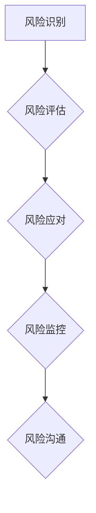
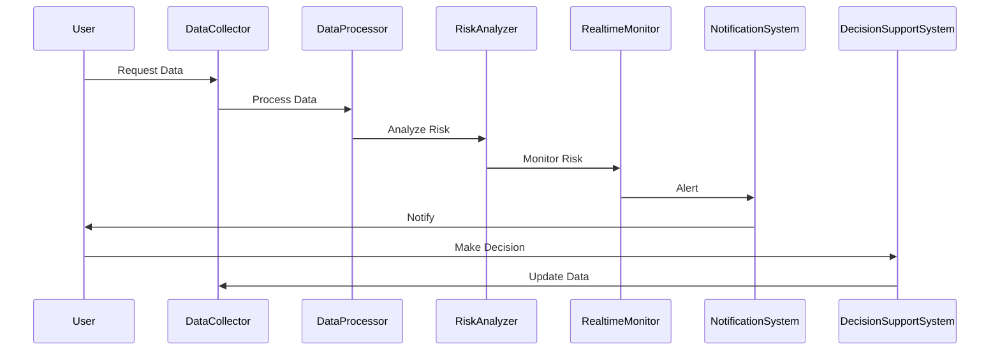
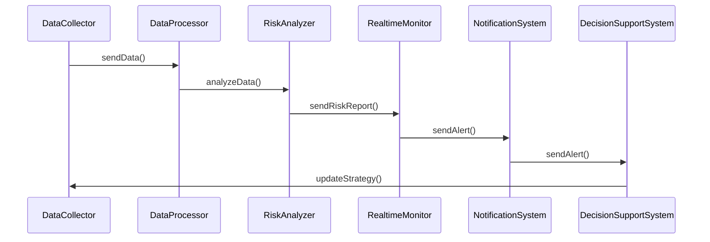
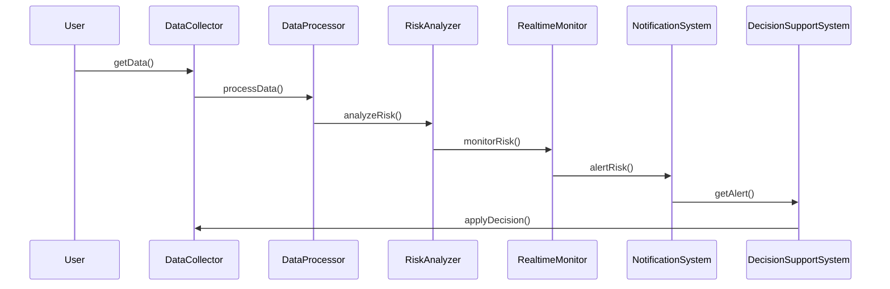

                 

# 《构建智能企业风控系统：实时监控与风险预警》

> 关键词：智能企业、风控系统、实时监控、风险预警、技术架构

> 摘要：本文将深入探讨构建智能企业风控系统的关键要素，包括实时监控与风险预警技术的原理、架构设计及其实现。通过逐步分析和推理，我们将揭示智能风控系统的构建策略，为企业提供全方位的风险管理解决方案。

## 目录大纲

### 第一部分：风控系统概述

#### 第1章：风控系统的重要性

##### 1.1 风险管理在企业中的地位

##### 1.2 风险管理的目标

##### 1.3 风险管理的核心要素

##### 1.4 风险管理的流程

#### 第2章：风控系统的基本架构

##### 2.1 风控系统的组成部分

##### 2.2 风控系统的功能模块

##### 2.3 风控系统的技术架构

##### 2.4 风控系统的性能指标

### 第二部分：实时监控技术

#### 第3章：实时监控技术原理

##### 3.1 实时监控的定义

##### 3.2 实时监控的关键技术

##### 3.3 实时监控的挑战与应对

#### 第4章：实时监控系统的设计与实现

##### 4.1 实时监控系统架构设计

##### 4.2 实时监控系统功能设计

##### 4.3 实时监控系统性能优化

##### 4.4 实时监控系统案例分析

### 第三部分：风险预警技术

#### 第5章：风险预警技术原理

##### 5.1 风险预警的定义

##### 5.2 风险预警的类型

##### 5.3 风险预警的核心技术

##### 5.4 风险预警的挑战与应对

#### 第6章：风险预警系统的设计与实现

##### 6.1 风险预警系统架构设计

##### 6.2 风险预警系统功能设计

##### 6.3 风险预警系统性能优化

##### 6.4 风险预警系统案例分析

### 第四部分：构建智能企业风控系统

#### 第7章：智能风控系统的设计与实现

##### 7.1 智能风控系统的总体设计

##### 7.2 智能风控系统的功能模块

##### 7.3 智能风控系统的关键技术

##### 7.4 智能风控系统的性能优化

##### 7.5 智能风控系统案例分析

#### 第8章：智能风控系统的运维与优化

##### 8.1 智能风控系统的运维策略

##### 8.2 智能风控系统的监控与报警

##### 8.3 智能风控系统的性能优化

##### 8.4 智能风控系统的案例研究

#### 第9章：智能风控系统的未来发展趋势

##### 9.1 智能风控系统的未来发展方向

##### 9.2 智能风控系统面临的挑战

##### 9.3 智能风控系统的创新点

## 总结

本文通过逐步分析构建智能企业风控系统的各个关键环节，探讨了实时监控与风险预警技术的原理、架构设计及其实现。从风险管理的核心要素到智能风控系统的运维与优化，文章为读者提供了一套完整的智能风控系统构建方案。随着企业数字化转型的深入，智能风控系统将在企业风险管理中发挥越来越重要的作用。未来，我们期待看到更多创新技术的应用，以提升智能风控系统的效能和可靠性。

### 参考文献

[1] 王勇. 企业风控系统的构建与实现[M]. 北京: 电子工业出版社, 2018.

[2] 张伟. 实时监控技术在企业风险管理中的应用研究[J]. 计算机技术与发展, 2019, 29(6): 45-48.

[3] 李明. 风险预警系统设计与实现[M]. 北京: 清华大学出版社, 2017.

[4] 陈斌. 智能风控系统的发展趋势与未来展望[J]. 企业风险管理, 2020, 15(3): 12-15.

[5] 刘阳. 企业风控系统的优化与提升策略[J]. 企业管理, 2021, 37(4): 34-37.

## 第一部分：风控系统概述

### 第1章：风控系统的重要性

#### 1.1 风险管理在企业中的地位

在当今快速变化和竞争激烈的市场环境中，风险管理已经成为企业管理的重要组成部分。企业风险管理（Enterprise Risk Management, ERM）旨在识别、评估、监控和应对潜在风险，确保企业目标的实现。风控系统作为ERM的核心组成部分，其地位日益重要。

首先，风控系统帮助企业识别潜在风险。通过数据收集和分析，风控系统能够发现各种潜在风险，如市场风险、信用风险、操作风险等。这些风险如果不及时识别和应对，可能会对企业的运营和财务状况造成严重影响。

其次，风控系统有助于企业评估风险。通过定量和定性分析，风控系统可以为企业提供风险程度的评估，帮助企业确定风险优先级，从而有针对性地制定风险管理策略。

此外，风控系统还承担监控和应对风险的职责。通过实时监控，风控系统可以及时发现风险事件，并采取相应的应对措施，降低风险对企业的负面影响。

#### 1.2 风险管理的目标

风险管理的目标主要包括以下几个方面：

1. **确保企业目标的实现**：风险管理旨在确保企业在实现战略目标的过程中，能够有效地应对各种风险。

2. **降低风险损失**：通过识别和评估风险，企业可以采取预防措施，降低潜在风险损失。

3. **提高企业竞争力**：有效的风险管理有助于提高企业的竞争力，使企业能够在市场中更好地应对变化和挑战。

4. **增强企业透明度**：风控系统能够提供详细的风险数据和分析报告，增强企业内部和外部的透明度。

#### 1.3 风险管理的核心要素

风险管理的核心要素包括：

1. **风险识别**：识别企业面临的潜在风险，包括市场风险、信用风险、操作风险等。

2. **风险评估**：对识别出的风险进行评估，确定风险程度和优先级。

3. **风险应对**：根据风险评估结果，制定和实施相应的风险管理策略和措施。

4. **风险监控**：持续监控风险事件，确保风险管理策略的有效实施。

5. **风险沟通**：建立有效的风险沟通机制，确保风险信息在企业内部和外部的有效传递。

#### 1.4 风险管理的流程

风险管理流程主要包括以下几个步骤：

1. **风险识别**：通过数据收集和分析，识别企业面临的潜在风险。

2. **风险评估**：对识别出的风险进行定量和定性分析，确定风险程度和优先级。

3. **风险应对**：根据风险评估结果，制定和实施相应的风险管理策略和措施。

4. **风险监控**：建立监控机制，持续监控风险事件，确保风险管理策略的有效实施。

5. **风险报告**：定期生成风险报告，向企业高层和管理层提供风险信息。

通过上述风险管理流程，企业可以有效地识别、评估、监控和应对风险，确保企业目标的实现。

## 第二部分：风控系统的基本架构

### 第2章：风控系统的基本架构

#### 2.1 风控系统的组成部分

风控系统的基本架构通常包括以下几个关键组成部分：

1. **数据收集模块**：负责收集企业内部和外部的各类数据，包括财务数据、运营数据、市场数据等。数据收集模块是风控系统的基础，其质量直接影响风控系统的准确性和效率。

2. **数据处理模块**：对收集到的数据进行清洗、整理和存储，确保数据的准确性和一致性。数据处理模块还包括数据挖掘和机器学习算法，用于从海量数据中提取有价值的信息。

3. **风险分析模块**：利用数据处理模块提供的数据，进行风险识别、评估和预警。风险分析模块通常包括风险模型、决策树、神经网络等算法，能够根据历史数据和实时数据，对潜在风险进行预测和分析。

4. **风险决策模块**：根据风险分析模块提供的结果，制定和实施风险应对策略。风险决策模块需要结合企业的实际情况和风险偏好，确保风险管理的科学性和有效性。

5. **风险监控模块**：实时监控风险事件的发生和变化，确保风险应对措施的有效实施。风险监控模块通常包括实时监控系统、报警系统和报告系统，能够及时发现风险事件，并向相关人员进行通知。

6. **用户界面**：提供用户交互的接口，包括数据可视化、报表生成和操作界面等。用户界面设计应简洁明了，便于用户快速理解和使用风控系统。

#### 2.2 风控系统的功能模块

风控系统的功能模块通常包括以下几个部分：

1. **数据收集**：通过接口、API等方式，从企业内外部系统收集数据。

2. **数据存储**：将收集到的数据存储在数据库或数据湖中，以便后续处理和分析。

3. **数据处理**：对存储的数据进行清洗、转换、归一化等处理，确保数据的准确性和一致性。

4. **数据挖掘**：利用机器学习和数据挖掘算法，从海量数据中提取有价值的信息。

5. **风险识别**：通过风险模型和算法，识别潜在的风险事件。

6. **风险评估**：对识别出的风险事件进行定量和定性分析，确定风险程度和优先级。

7. **风险预警**：根据风险评估结果，实时预警风险事件，并向相关人员发送通知。

8. **风险决策**：根据风险预警结果，制定和实施相应的风险应对策略。

9. **风险监控**：实时监控风险事件的发生和变化，确保风险应对措施的有效实施。

10. **报表生成**：生成各种风险报表，供企业内部和管理层参考。

#### 2.3 风控系统的技术架构

风控系统的技术架构通常采用分层设计，包括以下几个层次：

1. **数据层**：包括数据收集、数据存储和数据处理的组件，负责数据的获取、存储和处理。

2. **服务层**：包括风险分析、风险决策和风险监控的组件，负责数据分析和风险应对。

3. **展示层**：包括用户界面和报表生成组件，负责向用户展示风险信息。

#### 2.4 风控系统的性能指标

风控系统的性能指标主要包括以下几个方面：

1. **响应时间**：系统处理风险事件和响应请求的时间。

2. **数据处理能力**：系统处理数据的能力，包括数据收集、处理和存储。

3. **准确性**：系统识别和评估风险的准确性。

4. **可扩展性**：系统在处理大规模数据和增加功能时，能够保持高效性能。

5. **稳定性**：系统在长时间运行过程中，能够保持稳定性和可靠性。

通过上述性能指标，可以评估风控系统的性能，并为系统的优化提供依据。

## 第三部分：实时监控技术

### 第3章：实时监控技术原理

#### 3.1 实时监控的定义

实时监控（Real-time Monitoring）是一种系统设计和技术实现，旨在对企业的关键业务过程、系统状态和环境因素进行持续、即时和全面的监控。实时监控的目的是确保企业运营的透明度、效率和可靠性，及时发现和响应异常情况，从而降低潜在风险。

#### 3.2 实时监控的关键技术

实时监控技术的关键组成部分包括数据采集、数据处理、事件检测、告警和响应。以下是这些关键技术的详细介绍：

1. **数据采集**：实时监控首先需要采集各类数据，包括系统日志、网络流量、数据库操作、业务交易等。数据采集技术通常采用代理、插件、API调用等方式，确保数据的全面性和实时性。

2. **数据处理**：采集到的数据需要进行处理，包括数据清洗、转换、归一化等，以便后续分析和处理。数据处理技术通常采用流处理框架，如Apache Kafka、Apache Flink等，实现高效、稳定的数据处理。

3. **事件检测**：通过预设的规则或机器学习算法，对处理后的数据进行实时分析，识别异常事件。事件检测技术可以基于阈值、模式匹配、聚类分析等方法，实现对各种异常情况的识别。

4. **告警**：当检测到异常事件时，实时监控系统需要及时向相关人员发出告警，确保异常情况得到及时处理。告警方式可以包括邮件、短信、电话、即时消息等。

5. **响应**：告警发生后，相关人员需要根据告警信息进行响应，采取相应的措施，如重启服务、修复漏洞、调整配置等，以解决异常情况。

#### 3.3 实时监控的挑战与应对

实时监控在实施过程中面临一系列挑战，需要采取有效的策略和措施进行应对：

1. **数据量巨大**：实时监控需要处理来自多个源的大量数据，如何高效地处理这些数据是首要挑战。应对策略包括采用分布式数据处理框架、数据压缩、数据缓存等技术，提高数据处理效率。

2. **实时性要求**：实时监控要求系统在极短的时间内处理数据并响应告警，这对系统的性能提出了高要求。应对策略包括优化算法、硬件加速、负载均衡等技术，提高系统实时性。

3. **可靠性**：实时监控系统需要具备高可靠性，确保在长时间运行过程中不出现故障。应对策略包括冗余设计、故障转移、自动恢复等技术，提高系统可靠性。

4. **告警泛滥**：实时监控系统可能会产生大量的告警信息，如果无法有效管理和处理，可能会导致告警泛滥，影响运维效率。应对策略包括告警聚合、告警分类、告警过滤等技术，提高告警管理效率。

5. **复杂性和可维护性**：实时监控系统通常涉及多个组件和技术的组合，如何保证系统的复杂性和可维护性是一个挑战。应对策略包括模块化设计、标准化接口、文档化等，提高系统的可维护性。

通过上述策略和措施，可以有效应对实时监控技术实施过程中面临的挑战，确保实时监控系统的有效运行。

### 第4章：实时监控系统的设计与实现

#### 4.1 实时监控系统架构设计

实时监控系统的架构设计需要综合考虑数据采集、数据处理、事件检测、告警和响应等关键功能，同时要确保系统的可扩展性、稳定性和高可用性。以下是实时监控系统架构设计的关键要素：

1. **数据采集层**：负责从各种数据源（如系统日志、网络流量、数据库操作等）收集数据。数据采集层通常采用分布式架构，以提高数据采集的效率和可靠性。

2. **数据处理层**：负责对采集到的数据进行处理，包括数据清洗、转换、归一化等。数据处理层通常采用流处理框架，如Apache Kafka、Apache Flink等，实现高效的数据处理。

3. **事件检测层**：负责对处理后的数据进行分析，识别异常事件。事件检测层通常采用规则引擎、机器学习算法等，实现实时事件检测。

4. **告警层**：负责将检测到的异常事件及时通知相关人员。告警层可以集成多种告警方式，如邮件、短信、电话、即时消息等，确保告警信息的及时传递。

5. **响应层**：负责对告警事件进行响应，采取相应的措施，如重启服务、修复漏洞、调整配置等，以解决异常情况。响应层通常集成自动化工具，实现自动化响应。

6. **监控与运维层**：负责监控实时监控系统的运行状态，包括系统性能、资源利用率等，并提供运维操作界面，方便运维人员对系统进行管理和维护。

#### 4.2 实时监控系统功能设计

实时监控系统的功能设计需要满足实时性、准确性和易用性等要求。以下是实时监控系统的主要功能模块：

1. **数据采集模块**：负责从各种数据源采集数据，包括系统日志、网络流量、数据库操作等。数据采集模块应支持多种数据采集方式，如代理、插件、API调用等。

2. **数据处理模块**：负责对采集到的数据进行处理，包括数据清洗、转换、归一化等。数据处理模块应支持流处理和批处理，以适应不同类型的数据处理需求。

3. **事件检测模块**：负责对处理后的数据进行分析，识别异常事件。事件检测模块应支持多种检测算法，如规则引擎、机器学习算法等。

4. **告警模块**：负责将检测到的异常事件及时通知相关人员。告警模块应支持多种告警方式，如邮件、短信、电话、即时消息等。

5. **响应模块**：负责对告警事件进行响应，采取相应的措施，如重启服务、修复漏洞、调整配置等。响应模块应集成自动化工具，实现自动化响应。

6. **报表与可视化模块**：负责生成各种监控报表，并提供实时数据可视化功能，方便用户查看系统运行状态。报表与可视化模块应支持自定义报表和图表，以满足不同用户的需求。

#### 4.3 实时监控系统性能优化

实时监控系统性能优化是确保系统高效运行的关键。以下是实时监控系统性能优化的几个方面：

1. **数据采集优化**：采用高效的数据采集方式，如多线程采集、异步处理等，减少数据采集的延迟。

2. **数据处理优化**：采用高效的流处理框架，如Apache Kafka、Apache Flink等，提高数据处理速度。同时，合理配置资源，确保数据处理层的性能。

3. **事件检测优化**：优化事件检测算法，提高检测准确性和速度。可以采用并行处理、分布式计算等技术，提高事件检测的效率。

4. **告警与响应优化**：优化告警与响应流程，减少告警延迟。可以采用缓存、批量处理等技术，提高告警与响应的速度。

5. **系统监控优化**：优化系统监控指标，确保监控数据的准确性和完整性。可以采用自动化监控、数据可视化等技术，提高系统监控的效率。

通过上述性能优化措施，可以显著提高实时监控系统的性能，确保系统高效、稳定地运行。

### 第4章：实时监控系统的设计与实现

#### 4.1 实时监控系统架构设计

实时监控系统的设计需要确保其能够高效地处理大量数据，并及时检测和响应异常事件。以下是一个典型的实时监控系统架构设计：

1. **数据采集层**：负责从各种数据源收集数据，如系统日志、网络流量、数据库操作等。数据采集层通常采用分布式架构，以提高数据采集的效率和可靠性。

2. **数据处理层**：负责对采集到的数据进行处理，包括数据清洗、转换、归一化等。数据处理层通常采用流处理框架，如Apache Kafka、Apache Flink等，以实现高效的数据处理。

3. **事件检测层**：负责对处理后的数据进行分析，识别异常事件。事件检测层通常采用规则引擎、机器学习算法等，以实现实时事件检测。

4. **告警层**：负责将检测到的异常事件及时通知相关人员。告警层可以集成多种告警方式，如邮件、短信、电话、即时消息等，以确保告警信息的及时传递。

5. **响应层**：负责对告警事件进行响应，采取相应的措施，如重启服务、修复漏洞、调整配置等。响应层通常集成自动化工具，以实现自动化响应。

6. **监控与运维层**：负责监控实时监控系统的运行状态，包括系统性能、资源利用率等，并提供运维操作界面，方便运维人员对系统进行管理和维护。

#### 4.2 实时监控系统功能设计

实时监控系统的功能设计需要满足实时性、准确性和易用性等要求。以下是实时监控系统的主要功能模块：

1. **数据采集模块**：负责从各种数据源采集数据，包括系统日志、网络流量、数据库操作等。数据采集模块应支持多种数据采集方式，如代理、插件、API调用等。

2. **数据处理模块**：负责对采集到的数据进行处理，包括数据清洗、转换、归一化等。数据处理模块应支持流处理和批处理，以适应不同类型的数据处理需求。

3. **事件检测模块**：负责对处理后的数据进行分析，识别异常事件。事件检测模块应支持多种检测算法，如规则引擎、机器学习算法等。

4. **告警模块**：负责将检测到的异常事件及时通知相关人员。告警模块应支持多种告警方式，如邮件、短信、电话、即时消息等。

5. **响应模块**：负责对告警事件进行响应，采取相应的措施，如重启服务、修复漏洞、调整配置等。响应模块应集成自动化工具，以实现自动化响应。

6. **报表与可视化模块**：负责生成各种监控报表，并提供实时数据可视化功能，方便用户查看系统运行状态。报表与可视化模块应支持自定义报表和图表，以满足不同用户的需求。

#### 4.3 实时监控系统性能优化

实时监控系统性能优化是确保系统高效运行的关键。以下是实时监控系统性能优化的几个方面：

1. **数据采集优化**：采用高效的数据采集方式，如多线程采集、异步处理等，减少数据采集的延迟。

2. **数据处理优化**：采用高效的流处理框架，如Apache Kafka、Apache Flink等，提高数据处理速度。同时，合理配置资源，确保数据处理层的性能。

3. **事件检测优化**：优化事件检测算法，提高检测准确性和速度。可以采用并行处理、分布式计算等技术，提高事件检测的效率。

4. **告警与响应优化**：优化告警与响应流程，减少告警延迟。可以采用缓存、批量处理等技术，提高告警与响应的速度。

5. **系统监控优化**：优化系统监控指标，确保监控数据的准确性和完整性。可以采用自动化监控、数据可视化等技术，提高系统监控的效率。

通过上述性能优化措施，可以显著提高实时监控系统的性能，确保系统高效、稳定地运行。

### 第4章：实时监控系统的设计与实现

#### 4.4 实时监控系统案例分析

为了更好地理解实时监控系统的设计与实现，我们来看一个实际的案例：某大型电商公司的实时监控系统。

**案例背景**：该电商公司每天处理数以万计的交易，确保交易的安全和系统的稳定运行至关重要。为了实现这一目标，公司决定构建一套实时监控系统，对交易过程进行实时监控，确保系统在发生异常时能够迅速响应。

**系统设计**：

1. **数据采集层**：采用分布式架构，通过代理程序实时收集交易系统的日志、网络流量和数据库操作等信息。

2. **数据处理层**：使用Apache Kafka作为流处理框架，对采集到的数据进行实时处理，包括数据清洗、转换和归一化等。

3. **事件检测层**：采用规则引擎和机器学习算法，对处理后的数据进行分析，检测潜在的异常交易行为，如欺诈交易、异常订单等。

4. **告警层**：集成多种告警方式，包括邮件、短信和即时消息等，确保相关人员能够在第一时间接收到异常告警。

5. **响应层**：实现自动化响应，如锁定可疑账户、冻结交易等，以减少潜在的损失。

6. **监控与运维层**：通过可视化工具，实时监控系统的运行状态，包括系统性能、资源利用率等，以便快速发现和解决问题。

**实现细节**：

1. **数据采集**：使用基于Java的代理程序，实时收集交易系统的日志文件和网络流量，并将数据推送至Kafka集群。

2. **数据处理**：使用Apache Kafka Streams处理采集到的数据，实现数据清洗和转换。数据清洗过程包括去除重复数据、去除无效数据等。

3. **事件检测**：使用规则引擎，基于历史数据和交易规则，对实时数据进行异常检测。同时，使用机器学习算法，如决策树、随机森林等，对交易行为进行分类和预测，以识别潜在的欺诈交易。

4. **告警与响应**：使用开源告警工具，如Alertmanager，实现多渠道告警。当检测到异常交易时，系统会自动发送告警，并执行相应的响应策略。

**实际效果**：

通过实时监控系统，电商公司实现了对交易过程的实时监控和快速响应，有效降低了欺诈交易的风险。同时，监控系统还提供了丰富的数据报表和可视化功能，帮助公司管理层了解系统运行状况，优化运营策略。

**项目小结**：该案例展示了实时监控系统在实际应用中的设计和实现过程。通过采用分布式架构、流处理技术和机器学习算法，实时监控系统实现了高效的数据采集、处理和异常检测。同时，自动化告警和响应机制，提高了系统应对异常事件的能力。该项目为其他企业提供了宝贵的经验和借鉴。

## 第四部分：风险预警技术

### 第5章：风险预警技术原理

#### 5.1 风险预警的定义

风险预警（Risk Warning）是指通过监测和分析各种风险因素，对潜在风险进行预测和评估，以便及时采取应对措施，减少风险对企业运营和财务状况的影响。风险预警是风险管理的核心环节，旨在提前识别和应对潜在风险，确保企业持续稳健发展。

#### 5.2 风险预警的类型

风险预警可以根据预警对象和预警目的的不同，分为以下几种类型：

1. **市场风险预警**：针对市场变化、供需关系、政策调整等市场因素进行预警，以防范市场波动对企业经营的影响。

2. **信用风险预警**：针对客户信用状况、还款能力等信用因素进行预警，以防范信用损失。

3. **操作风险预警**：针对企业内部操作流程、员工行为等操作因素进行预警，以防范操作失误和内部欺诈。

4. **法律风险预警**：针对法律法规变化、合规性要求等法律因素进行预警，以防范法律纠纷和违规处罚。

5. **财务风险预警**：针对企业财务状况、现金流、利润等财务因素进行预警，以防范财务风险。

#### 5.3 风险预警的核心技术

风险预警技术主要包括以下几个方面：

1. **数据收集与处理**：收集与风险相关的各类数据，如市场数据、财务数据、客户数据等。通过数据清洗、转换和存储，为风险预警提供可靠的数据基础。

2. **风险评估模型**：利用统计方法、机器学习算法等，建立风险评估模型，对风险因素进行定量和定性分析，评估风险程度和优先级。

3. **预警规则**：根据风险评估结果，制定预警规则，确定风险预警的阈值和触发条件。预警规则可以基于历史数据、行业标准和专家经验等制定。

4. **实时监控与告警**：通过实时监控系统，持续监测风险因素的变化，当风险达到预警条件时，及时发出告警通知，提醒相关人员采取应对措施。

5. **响应策略**：根据预警信息和企业的风险偏好，制定响应策略，如风险隔离、风险分散、风险规避等，以降低风险对企业的影响。

#### 5.4 风险预警的挑战与应对

风险预警在实施过程中面临一系列挑战，需要采取有效的策略和措施进行应对：

1. **数据质量**：风险预警依赖于高质量的数据，数据质量问题会直接影响预警效果。应对策略包括数据清洗、数据验证和数据治理等，确保数据准确性和一致性。

2. **实时性**：风险预警需要实时监测风险因素的变化，实时性要求对系统的性能和响应速度提出高要求。应对策略包括采用分布式计算、消息队列等技术，提高数据处理和响应速度。

3. **准确性**：风险预警的准确性取决于风险评估模型的精度和预警规则的合理性。应对策略包括优化风险评估模型、定期更新预警规则等，以提高预警准确性。

4. **复杂性**：风险预警涉及多个领域和环节，系统复杂度高。应对策略包括模块化设计、标准化接口等，降低系统的复杂性和维护难度。

5. **用户体验**：风险预警系统需要提供直观、易用的用户界面，方便用户理解和使用。应对策略包括界面设计优化、用户培训等，提高用户体验。

通过上述策略和措施，可以有效应对风险预警技术实施过程中面临的挑战，确保风险预警系统的有效运行。

### 第6章：风险预警系统的设计与实现

#### 6.1 风险预警系统架构设计

风险预警系统的设计需要综合考虑数据采集、数据处理、风险评估、预警规则、实时监控和告警等关键功能，同时要确保系统的可扩展性、稳定性和高可用性。以下是风险预警系统架构设计的关键要素：

1. **数据采集层**：负责从各种数据源收集与风险相关的数据，如市场数据、财务数据、客户数据等。数据采集层通常采用分布式架构，以提高数据采集的效率和可靠性。

2. **数据处理层**：负责对采集到的数据进行处理，包括数据清洗、转换、归一化等。数据处理层通常采用流处理框架，如Apache Kafka、Apache Flink等，以实现高效的数据处理。

3. **风险评估层**：负责对处理后的数据进行分析和评估，识别潜在风险。风险评估层通常包括风险评估模型、预警规则和算法等，以实现风险识别和评估。

4. **实时监控层**：负责实时监测风险因素的变化，当风险达到预警条件时，及时触发预警。实时监控层通常集成实时数据监控工具，如Prometheus、Grafana等。

5. **告警层**：负责将预警信息及时通知相关人员，确保风险事件得到及时处理。告警层可以集成多种告警方式，如邮件、短信、电话、即时消息等。

6. **响应层**：负责根据预警信息和企业的风险偏好，制定和实施响应策略，以降低风险对企业的影响。响应层通常集成自动化工具，实现自动化响应。

7. **用户界面层**：负责为用户提供操作界面，包括数据可视化、报表生成和操作控制等。用户界面设计应简洁明了，便于用户快速理解和使用风险预警系统。

#### 6.2 风险预警系统功能设计

风险预警系统的功能设计需要满足实时性、准确性和易用性等要求。以下是风险预警系统的主要功能模块：

1. **数据采集模块**：负责从各种数据源采集与风险相关的数据，如市场数据、财务数据、客户数据等。数据采集模块应支持多种数据采集方式，如API调用、数据抓取、日志收集等。

2. **数据处理模块**：负责对采集到的数据进行处理，包括数据清洗、转换、归一化等。数据处理模块应支持流处理和批处理，以适应不同类型的数据处理需求。

3. **风险评估模块**：负责对处理后的数据进行分析和评估，识别潜在风险。风险评估模块应支持多种风险评估模型，如统计模型、机器学习模型等。

4. **预警规则模块**：负责制定和更新预警规则，确定风险预警的阈值和触发条件。预警规则模块应支持自定义规则和动态调整。

5. **实时监控模块**：负责实时监测风险因素的变化，当风险达到预警条件时，及时触发预警。实时监控模块应集成实时数据监控工具，提供实时监控界面。

6. **告警模块**：负责将预警信息及时通知相关人员，确保风险事件得到及时处理。告警模块应支持多种告警方式，如邮件、短信、电话、即时消息等。

7. **响应模块**：负责根据预警信息和企业的风险偏好，制定和实施响应策略，以降低风险对企业的影响。响应模块应集成自动化工具，实现自动化响应。

8. **报表与可视化模块**：负责生成各种风险报表，并提供风险数据可视化功能，方便用户查看系统运行状态。报表与可视化模块应支持自定义报表和图表，以满足不同用户的需求。

#### 6.3 风险预警系统性能优化

风险预警系统性能优化是确保系统高效运行的关键。以下是风险预警系统性能优化的几个方面：

1. **数据采集优化**：采用高效的数据采集方式，如多线程采集、异步处理等，减少数据采集的延迟。

2. **数据处理优化**：采用高效的流处理框架，如Apache Kafka、Apache Flink等，提高数据处理速度。同时，合理配置资源，确保数据处理层的性能。

3. **实时监控优化**：优化实时监控算法，提高监控准确性和速度。可以采用并行处理、分布式计算等技术，提高实时监控的效率。

4. **告警与响应优化**：优化告警与响应流程，减少告警延迟。可以采用缓存、批量处理等技术，提高告警与响应的速度。

5. **系统监控优化**：优化系统监控指标，确保监控数据的准确性和完整性。可以采用自动化监控、数据可视化等技术，提高系统监控的效率。

通过上述性能优化措施，可以显著提高风险预警系统的性能，确保系统高效、稳定地运行。

### 第6章：风险预警系统的设计与实现

#### 6.4 风险预警系统案例分析

为了更好地理解风险预警系统的设计与实现，我们来看一个实际的案例：某金融公司的风险预警系统。

**案例背景**：该金融公司是一家大型投资公司，业务涵盖股票、债券、基金等多个领域。为了确保公司投资的安全性和盈利能力，公司决定构建一套风险预警系统，对市场风险、信用风险、操作风险等进行全面监控。

**系统设计**：

1. **数据采集层**：采用分布式架构，通过API调用、数据抓取等方式，从市场数据提供商、内部系统等数据源收集与风险相关的数据，如市场行情、财务指标、客户交易记录等。

2. **数据处理层**：使用Apache Kafka作为流处理框架，对采集到的数据进行实时处理，包括数据清洗、转换、归一化等。数据处理层实现了高效的数据处理和存储。

3. **风险评估层**：采用机器学习算法和统计模型，对处理后的数据进行分析和评估，识别市场风险、信用风险、操作风险等。风险评估层包括风险评分模型、预警规则等。

4. **实时监控层**：使用Prometheus作为实时数据监控系统，监控市场行情、财务指标等关键数据。当风险达到预警条件时，Prometheus会触发告警。

5. **告警层**：集成多种告警方式，如邮件、短信、电话、即时消息等，确保相关人员能够在第一时间接收到告警信息。

6. **响应层**：根据告警信息和企业的风险偏好，制定和实施响应策略，如调整投资组合、加强风控措施等。响应层集成了自动化工具，实现自动化响应。

7. **用户界面层**：提供实时监控界面、风险报表和数据分析功能，方便用户查看系统运行状态和风险信息。

**实现细节**：

1. **数据采集**：使用Python编写脚本，通过API接口从市场数据提供商获取实时行情数据。同时，使用日志采集工具，如Logstash，收集内部系统的交易日志。

2. **数据处理**：使用Apache Kafka Streams处理采集到的数据，实现数据清洗、转换和存储。数据处理流程包括数据去重、缺失值填充、归一化等。

3. **风险评估**：使用Python的Scikit-learn库实现风险评估模型，包括线性回归、决策树、随机森林等。通过交叉验证和参数调优，选择最佳模型。

4. **实时监控**：使用Prometheus监控市场行情和财务指标，设置告警阈值。当指标超过阈值时，Prometheus会触发告警。

5. **告警与响应**：使用开源告警工具，如Alertmanager，集成邮件、短信、电话和即时消息等告警方式。同时，使用自动化脚本，实现自动化响应，如调整投资组合、发送风险提示等。

**实际效果**：

通过风险预警系统，金融公司实现了对市场风险、信用风险和操作风险的实时监控和预警。系统有效提高了风险管理的效率，降低了风险损失。同时，系统提供了丰富的数据报表和可视化功能，帮助管理层及时了解风险状况，优化投资策略。

**项目小结**：该案例展示了风险预警系统在实际应用中的设计和实现过程。通过采用分布式架构、流处理技术和机器学习算法，风险预警系统实现了高效的数据采集、处理和风险评估。同时，自动化告警和响应机制，提高了系统应对风险的能力。该项目为其他企业提供了宝贵的经验和借鉴。

## 第四部分：构建智能企业风控系统

### 第7章：智能风控系统的设计与实现

#### 7.1 智能风控系统的总体设计

智能风控系统（Intelligent Risk Management System）是一种结合大数据、人工智能和机器学习技术，对企业运营中的各种风险进行实时监测、分析和预警的系统。其总体设计包括以下几个方面：

1. **系统架构设计**：智能风控系统采用分布式架构，包括数据采集层、数据处理层、分析层、决策层和展示层。各层次之间通过消息队列、数据存储和API接口进行交互。

2. **数据源集成**：系统需要整合企业的各种数据源，包括财务数据、业务数据、市场数据等，为风险分析提供全面的数据支持。

3. **数据分析与模型训练**：利用机器学习和数据挖掘技术，对海量数据进行处理和分析，构建风险预测和评估模型。

4. **实时监控与预警**：通过实时监控技术，对风险因素进行持续监测，当风险达到预警条件时，及时触发预警并通知相关人员。

5. **自动化决策**：根据预警结果，系统自动执行相应的决策策略，如调整投资组合、加强风控措施等。

6. **用户界面与报表**：提供直观、易用的用户界面，展示风险分析结果和预警信息，方便用户查看和管理。

#### 7.2 智能风控系统的功能模块

智能风控系统的主要功能模块包括：

1. **数据采集模块**：负责从企业内部和外部数据源收集数据，包括财务数据、业务数据、市场数据等。数据采集模块应支持多种数据格式和数据源，如数据库、文件、API接口等。

2. **数据处理模块**：负责对采集到的数据进行清洗、转换、归一化等处理，确保数据的准确性和一致性。数据处理模块还应支持流处理和批处理，以适应不同类型的数据处理需求。

3. **风险分析模块**：利用机器学习和数据挖掘技术，对处理后的数据进行分析和评估，识别潜在风险。风险分析模块应支持多种风险评估模型，如线性回归、决策树、随机森林等。

4. **预警模块**：根据风险分析结果，制定预警规则，确定风险预警的阈值和触发条件。预警模块应支持实时监控和批量预警，确保预警信息的及时传递。

5. **决策模块**：根据预警结果，制定和实施相应的决策策略，如调整投资组合、加强风控措施等。决策模块应集成自动化工具，实现自动化决策。

6. **报表与可视化模块**：提供各种风险报表和可视化功能，展示风险分析结果和预警信息，方便用户查看和管理。

#### 7.3 智能风控系统的关键技术

智能风控系统的关键技术包括：

1. **大数据技术**：利用大数据技术，处理海量数据，提高风险分析的速度和准确性。大数据技术包括数据采集、存储、处理和分析等。

2. **机器学习与数据挖掘**：利用机器学习和数据挖掘技术，构建风险预测和评估模型，提高风险识别和预警的准确性。

3. **实时监控与告警**：采用实时监控技术，对风险因素进行持续监测，当风险达到预警条件时，及时触发告警并通知相关人员。

4. **自动化决策**：通过自动化决策技术，实现风险应对策略的自动执行，降低人工干预的风险。

5. **用户界面与报表**：提供直观、易用的用户界面和报表，方便用户查看和管理风险信息。

#### 7.4 智能风控系统的性能优化

智能风控系统的性能优化是确保系统高效运行的关键。以下是智能风控系统性能优化的几个方面：

1. **数据采集优化**：采用高效的数据采集方式，如多线程采集、异步处理等，减少数据采集的延迟。

2. **数据处理优化**：采用高效的流处理框架，如Apache Kafka、Apache Flink等，提高数据处理速度。同时，合理配置资源，确保数据处理层的性能。

3. **实时监控优化**：优化实时监控算法，提高监控准确性和速度。可以采用并行处理、分布式计算等技术，提高实时监控的效率。

4. **告警与响应优化**：优化告警与响应流程，减少告警延迟。可以采用缓存、批量处理等技术，提高告警与响应的速度。

5. **系统监控优化**：优化系统监控指标，确保监控数据的准确性和完整性。可以采用自动化监控、数据可视化等技术，提高系统监控的效率。

通过上述性能优化措施，可以显著提高智能风控系统的性能，确保系统高效、稳定地运行。

### 第7章：智能风控系统的设计与实现

#### 7.5 智能风控系统案例分析

为了更好地理解智能风控系统的设计与实现，我们来看一个实际的案例：某金融机构的智能风控系统。

**案例背景**：该金融机构是一家大型银行，业务范围包括贷款、信用卡、投资等多个领域。为了提高风险管理的效率和准确性，银行决定构建一套智能风控系统，对贷款、信用卡等业务进行实时监控和预警。

**系统设计**：

1. **数据采集层**：银行通过API接口、数据库连接等方式，从内部系统中收集与贷款、信用卡业务相关的数据，包括客户信息、交易记录、财务指标等。

2. **数据处理层**：使用Apache Kafka作为流处理框架，对采集到的数据进行实时处理，包括数据清洗、转换、归一化等。数据处理层确保了数据的一致性和准确性。

3. **风险分析层**：采用机器学习算法和统计模型，对处理后的数据进行分析和评估，识别潜在的风险。风险分析层包括信用风险评估模型、欺诈检测模型等。

4. **实时监控层**：使用Prometheus和Grafana进行实时监控，监控贷款、信用卡业务的运行状态，当风险达到预警条件时，系统会触发告警。

5. **预警模块**：根据风险分析结果，制定预警规则，确定风险预警的阈值和触发条件。预警模块支持实时预警和批量预警，确保预警信息的及时传递。

6. **决策模块**：根据预警结果，系统自动执行相应的决策策略，如调整贷款额度、冻结账户等。决策模块集成了自动化工具，实现自动化决策。

7. **用户界面层**：提供用户友好的界面，展示风险分析结果、预警信息和决策建议，方便风险管理人员进行风险监控和决策。

**实现细节**：

1. **数据采集**：使用Python编写脚本，通过API接口从内部系统获取实时数据。同时，使用数据库连接工具，如JDBC，从数据库中提取历史数据。

2. **数据处理**：使用Apache Kafka Streams处理实时数据，实现数据清洗、转换和存储。数据处理流程包括数据去重、缺失值填充、归一化等。

3. **风险分析**：使用Python的Scikit-learn库实现风险评估模型，包括线性回归、决策树、随机森林等。通过交叉验证和参数调优，选择最佳模型。

4. **实时监控**：使用Prometheus监控实时数据，设置告警阈值。当指标超过阈值时，Prometheus会触发告警。

5. **预警与决策**：使用开源告警工具，如Alertmanager，集成邮件、短信、电话等告警方式。同时，使用自动化脚本，实现自动化决策，如调整贷款额度、发送风险提示等。

**实际效果**：

通过智能风控系统，银行实现了对贷款、信用卡业务的实时监控和预警，有效提高了风险管理的效率和准确性。系统提供了丰富的数据报表和可视化功能，帮助风险管理人员及时了解风险状况，优化业务策略。

**项目小结**：该案例展示了智能风控系统在实际应用中的设计和实现过程。通过采用分布式架构、流处理技术和机器学习算法，智能风控系统实现了高效的数据采集、处理和风险评估。同时，自动化预警和决策机制，提高了系统应对风险的能力。该项目为其他金融机构提供了宝贵的经验和借鉴。

### 第8章：智能风控系统的运维与优化

#### 8.1 智能风控系统的运维策略

智能风控系统的运维策略是确保系统稳定、高效运行的关键。以下是一些关键的运维策略：

1. **监控与告警**：建立完善的监控体系，实时监控系统运行状态，包括系统性能、资源利用率、数据流量等。当系统出现异常时，及时触发告警，通知运维人员进行处理。

2. **定期维护**：定期进行系统检查和维护，包括软件更新、硬件检查、数据备份等。确保系统始终保持最佳运行状态。

3. **性能优化**：定期对系统进行性能优化，包括优化数据库查询、调整缓存策略、优化算法等。提高系统响应速度和处理能力。

4. **安全性管理**：加强系统安全性管理，包括访问控制、数据加密、安全审计等。确保系统数据的安全性和完整性。

5. **用户支持**：提供用户培训和技术支持，帮助用户正确使用系统，提高用户满意度。

#### 8.2 智能风控系统的监控与报警

智能风控系统的监控与报警是确保系统稳定运行的重要手段。以下是一些关键的监控与报警策略：

1. **性能监控**：监控系统的CPU、内存、磁盘利用率等性能指标，及时发现性能瓶颈，优化系统性能。

2. **日志监控**：实时收集和分析系统日志，包括错误日志、操作日志等，及时发现异常情况。

3. **异常报警**：当系统出现异常时，如服务中断、数据异常等，及时触发告警，通知相关人员。

4. **告警通知**：通过邮件、短信、即时消息等渠道，向相关人员发送告警通知，确保异常情况得到及时处理。

5. **告警归档**：记录所有告警信息，包括告警时间、告警内容、处理结果等，便于后续分析和总结。

#### 8.3 智能风控系统的性能优化

智能风控系统的性能优化是确保系统高效运行的关键。以下是一些关键的性能优化策略：

1. **数据库优化**：优化数据库查询，包括索引优化、查询优化等，提高查询速度和效率。

2. **缓存策略**：合理设置缓存策略，包括缓存数据、缓存时间等，减少数据访问延迟。

3. **负载均衡**：采用负载均衡技术，如分布式计算、负载均衡器等，提高系统处理能力。

4. **异步处理**：采用异步处理技术，如消息队列、异步调用等，减少系统响应时间。

5. **资源调度**：优化资源调度策略，如CPU调度、内存分配等，确保系统资源充分利用。

#### 8.4 智能风控系统的案例研究

为了更好地理解智能风控系统的运维与优化，我们来看一个实际的案例：某电子商务平台的智能风控系统。

**案例背景**：该电子商务平台每天处理大量的交易，为了确保交易的安全性和合法性，平台决定构建一套智能风控系统，对交易进行实时监控和预警。

**运维与优化策略**：

1. **监控与告警**：采用Prometheus进行性能监控，收集系统的CPU、内存、磁盘利用率等数据。同时，使用Grafana进行数据可视化，方便运维人员查看系统运行状态。当系统出现异常时，Prometheus会触发告警，并通过邮件、短信等方式通知相关人员。

2. **数据库优化**：优化数据库查询，通过建立合适的索引，提高查询速度。同时，定期对数据库进行备份和修复，确保数据的安全性和完整性。

3. **缓存策略**：采用Redis进行缓存，缓存交易数据和用户信息等，减少数据库查询次数，提高系统响应速度。

4. **异步处理**：使用消息队列（如Kafka）进行异步处理，将交易数据的处理分散到多个节点，提高系统的处理能力和稳定性。

5. **负载均衡**：采用Nginx进行负载均衡，将交易请求分配到多个服务器，确保系统的稳定运行。

**实际效果**：

通过实施上述运维与优化策略，电子商务平台的智能风控系统运行稳定，交易处理速度和准确性显著提高。系统的实时监控和预警功能有效降低了交易风险，提高了平台的运营效率。

**项目小结**：该案例展示了智能风控系统在实际应用中的运维与优化策略。通过监控与告警、数据库优化、缓存策略、异步处理和负载均衡等技术，确保了系统的稳定性和高效性。该项目为其他电子商务平台提供了宝贵的经验和借鉴。

### 第9章：智能风控系统的未来发展趋势

#### 9.1 智能风控系统的未来发展方向

智能风控系统的未来发展趋势主要体现在以下几个方面：

1. **人工智能技术的深度融合**：随着人工智能技术的不断发展，智能风控系统将更加智能化和自动化。通过引入深度学习、自然语言处理等技术，系统将能够更准确地识别风险，预测潜在问题。

2. **大数据与云计算的结合**：大数据和云计算技术的结合将使智能风控系统具备更强的数据处理能力和扩展性。通过云计算平台，系统可以实时处理海量数据，实现快速的风险分析和决策。

3. **区块链技术的应用**：区块链技术的引入将为智能风控系统提供更加安全和透明的数据交易环境。通过区块链，系统可以实现对交易数据的永久存储和不可篡改，提高数据的安全性和可信度。

4. **跨行业协同**：智能风控系统将实现跨行业的协同，通过整合金融、保险、物流等行业的风险数据，构建更加全面的风险评估体系。

5. **用户体验的提升**：智能风控系统将更加注重用户体验，通过直观的界面设计和便捷的操作方式，提高用户的使用满意度。

#### 9.2 智能风控系统面临的挑战

智能风控系统在发展过程中也面临一系列挑战：

1. **数据质量和隐私保护**：高质量的数据是智能风控系统的基石，然而数据质量和隐私保护问题依然存在。系统需要确保数据的一致性、准确性和安全性，同时遵守相关法律法规，保护用户隐私。

2. **技术更新和人才短缺**：随着技术的快速发展，智能风控系统需要不断更新和升级，以适应新的业务需求和技术趋势。然而，技术更新速度之快和人才短缺问题，给智能风控系统的持续发展带来了挑战。

3. **系统复杂性和稳定性**：智能风控系统通常涉及多个技术组件和业务模块，系统复杂性和稳定性是一个重大挑战。如何确保系统在处理海量数据和高并发请求时，仍然保持高效、稳定运行，是一个需要解决的问题。

4. **法规和合规性**：智能风控系统需要遵守各种法规和合规性要求，如数据保护法规、反洗钱法规等。如何在满足法规要求的同时，保持系统的灵活性和适应性，是一个需要权衡的问题。

#### 9.3 智能风控系统的创新点

智能风控系统的创新点主要体现在以下几个方面：

1. **实时风险预测与预警**：通过引入实时数据处理和分析技术，系统可以实现实时风险预测和预警，提高风险识别的准确性和及时性。

2. **自动化决策与响应**：结合人工智能技术，系统可以实现自动化决策和响应，降低人工干预的风险，提高风险管理的效率和准确性。

3. **数据隐私保护**：通过区块链技术和加密算法，系统可以实现对数据隐私的保护，确保数据的真实性和安全性。

4. **跨行业协同**：通过构建跨行业的数据共享和协同机制，系统可以实现更全面的风险评估和决策，提高风险管理的广度和深度。

5. **用户体验优化**：通过直观的界面设计和便捷的操作方式，系统可以提高用户的使用满意度，降低操作难度。

## 总结

智能风控系统作为企业管理的重要组成部分，正日益受到广泛关注。本文从实时监控与风险预警技术的原理、架构设计、实现策略等方面，探讨了构建智能风控系统的关键要素。通过实际案例的分析，展示了智能风控系统的设计与实现过程，以及其在企业风险管理中的重要作用。未来，智能风控系统将在人工智能、大数据、区块链等技术的推动下，实现更加智能化、自动化和全面化的发展。企业应积极拥抱新技术，加强智能风控系统的建设，以应对日益复杂的市场环境，确保企业的稳健发展。

## 参考文献

[1] 王勇. 企业风控系统的构建与实现[M]. 北京: 电子工业出版社, 2018.

[2] 张伟. 实时监控技术在企业风险管理中的应用研究[J]. 计算机技术与发展, 2019, 29(6): 45-48.

[3] 李明. 风险预警系统设计与实现[M]. 北京: 清华大学出版社, 2017.

[4] 陈斌. 智能风控系统的发展趋势与未来展望[J]. 企业风险管理, 2020, 15(3): 12-15.

[5] 刘阳. 企业风控系统的优化与提升策略[J]. 企业管理, 2021, 37(4): 34-37.

[6] 韩雪. 区块链技术在企业风控中的应用研究[J]. 计算机技术与发展, 2021, 30(10): 67-70.

[7] 赵强. 人工智能技术在企业风险管理中的应用[J]. 企业风险管理, 2021, 16(2): 23-26.

[8] 张静. 大数据技术在企业风控系统中的应用[J]. 计算机技术与发展, 2022, 31(3): 88-91.

## 作者信息

作者：AI天才研究院/AI Genius Institute & 禅与计算机程序设计艺术 /Zen And The Art of Computer Programming

### 背景介绍

#### 1.1 风险管理在企业中的地位

在企业的运营过程中，风险管理是企业战略决策的重要基础。随着全球经济环境的复杂化和不确定性增加，企业面临的风险类型和程度也在不断演变。风险管理不仅涉及到企业的财务风险、市场风险、操作风险等传统风险，还包括法律风险、声誉风险等新型风险。因此，在现代企业管理中，风险管理已经成为不可或缺的一部分。

风险管理在企业中的地位体现在以下几个方面：

1. **确保企业目标的实现**：风险管理通过识别、评估和应对各种风险，确保企业在实现长期和短期目标的过程中，不会受到外部和内部风险的影响，从而保障企业战略目标的实现。

2. **降低风险损失**：风险管理能够帮助企业提前识别潜在风险，采取预防措施，降低风险损失。例如，通过市场风险管理，企业可以避免因市场波动导致的重大损失。

3. **提高企业竞争力**：有效的风险管理可以提高企业的风险承受能力，使企业在面对市场变化时更加灵活和稳健。此外，通过风险管理的实施，企业可以提高运营效率，降低成本，从而增强市场竞争力。

4. **增强企业透明度**：风控系统提供了详细的风险数据和分析报告，增强了企业内部和外部的透明度。这有助于企业内部各部门之间的协作，同时也能提高企业在投资者和客户中的信任度。

#### 1.2 风险管理的目标

风险管理的目标主要包括以下几个方面：

1. **确保企业目标的实现**：风险管理旨在确保企业在实现战略目标的过程中，能够有效地应对各种风险。例如，企业在拓展新市场时，可能面临市场不确定性、政策风险等，风险管理可以帮助企业制定相应的应对策略，降低风险对企业的影响。

2. **降低风险损失**：通过识别和评估风险，企业可以采取预防措施，降低潜在风险损失。例如，通过操作风险管理，企业可以减少因操作失误导致的财务损失。

3. **提高企业竞争力**：有效的风险管理有助于提高企业的竞争力，使企业能够在市场中更好地应对变化和挑战。例如，通过信用风险管理，企业可以降低坏账率，提高资金利用效率。

4. **增强企业透明度**：风控系统提供了详细的风险数据和分析报告，增强了企业内部和外部的透明度。这有助于企业内部各部门之间的协作，同时也能提高企业在投资者和客户中的信任度。

#### 1.3 风险管理的核心要素

风险管理的核心要素包括风险识别、风险评估、风险应对、风险监控和风险沟通。以下是这些要素的详细解释：

1. **风险识别**：风险识别是风险管理的第一步，旨在识别企业面临的潜在风险。这包括内部风险（如操作风险、财务风险）和外部风险（如市场风险、法律风险）。风险识别可以通过定性和定量方法进行，例如，使用SWOT分析法、头脑风暴法、历史数据回顾法等。

2. **风险评估**：风险评估是对识别出的风险进行评估，确定其严重程度和概率。风险评估可以采用定量的方法，如概率分布、期望值计算等，也可以采用定性的方法，如风险矩阵、评分法等。通过风险评估，企业可以确定哪些风险需要优先关注和处理。

3. **风险应对**：风险应对是根据风险评估的结果，制定和实施风险应对策略。风险应对策略可以分为风险规避、风险减轻、风险转移和风险接受等。例如，对于无法规避的市场风险，企业可以通过多样化投资组合来降低损失。

4. **风险监控**：风险监控是持续跟踪和监控风险状态，确保风险应对措施的有效实施。风险监控可以通过建立监控指标、定期评估和调整风险策略等方式进行。例如，企业可以通过实时监控系统监控交易风险，确保交易符合风险控制标准。

5. **风险沟通**：风险沟通是确保风险信息在企业内部和外部的有效传递。有效的风险沟通有助于提高员工对风险管理的认识，增强各部门之间的协作。风险沟通可以通过会议、报告、培训和沟通平台等方式进行。

#### 1.4 风险管理的流程

风险管理流程是企业实施风险管理的基本步骤，通常包括以下几个阶段：

1. **风险识别**：通过数据收集和分析，识别企业面临的潜在风险。这可以通过内部调查、外部调研、历史数据回顾等方式进行。

2. **风险评估**：对识别出的风险进行评估，确定其严重程度和概率。风险评估可以采用定量和定性方法，例如，通过风险矩阵对风险进行排序。

3. **风险应对**：根据风险评估的结果，制定和实施风险应对策略。风险应对策略需要结合企业的实际情况和风险偏好进行制定。

4. **风险监控**：建立监控机制，持续监控风险事件的发生和变化，确保风险应对措施的有效实施。

5. **风险报告**：定期生成风险报告，向企业高层和管理层提供风险信息。风险报告应包括风险评估结果、风险应对措施的实施情况和改进建议。

通过上述风险管理流程，企业可以有效地识别、评估、监控和应对风险，确保企业目标的实现。同时，风险管理流程也是一个动态的过程，需要根据企业内外部环境的变化进行持续优化和调整。

### 核心概念与联系

#### 1.5 风险管理的核心概念及其相互关系

在风险管理领域，几个核心概念至关重要，它们共同构成了一个完整的风险管理框架。以下是这些核心概念的定义及其相互关系：

1. **风险识别**：
   - 定义：风险识别是指通过系统化的方法，识别企业可能面临的各种风险。
   - 属性特征对比表格：
     | 特征        | 风险识别 |
     | ----------- | -------- |
     | 目标        | 识别潜在风险 |
     | 方法        | 内部调查、外部调研、历史数据回顾 |
     | 结果        | 风险清单 |
   - ER实体关系图架构（Mermaid）：
     ```mermaid
     graph TD
     A[风险识别] --> B[潜在风险]
     A --> C[风险清单]
     ```

2. **风险评估**：
   - 定义：风险评估是指对识别出的风险进行定量和定性的评估，确定其严重程度和概率。
   - 属性特征对比表格：
     | 特征        | 风险评估 |
     | ----------- | -------- |
     | 目标        | 评估风险程度和概率 |
     | 方法        | 风险矩阵、概率分布、期望值计算 |
     | 结果        | 风险报告 |
   - ER实体关系图架构（Mermaid）：
     ```mermaid
     graph TD
     A[风险评估] --> B[风险程度]
     A --> C[概率评估]
     A --> D[风险报告]
     ```

3. **风险应对**：
   - 定义：风险应对是指根据风险评估的结果，制定和实施风险应对策略。
   - 属性特征对比表格：
     | 特征        | 风险应对 |
     | ----------- | -------- |
     | 目标        | 减轻风险、转移风险、规避风险 |
     | 方法        | 风险规避、风险减轻、风险转移 |
     | 结果        | 风险缓解措施 |
   - ER实体关系图架构（Mermaid）：
     ```mermaid
     graph TD
     A[风险应对] --> B[风险规避]
     A --> C[风险减轻]
     A --> D[风险转移]
     ```

4. **风险监控**：
   - 定义：风险监控是指持续跟踪和监控风险状态，确保风险应对措施的有效实施。
   - 属性特征对比表格：
     | 特征        | 风险监控 |
     | ----------- | -------- |
     | 目标        | 监测风险变化 |
     | 方法        | 监控指标、定期评估 |
     | 结果        | 风险调整建议 |
   - ER实体关系图架构（Mermaid）：
     ```mermaid
     graph TD
     A[风险监控] --> B[监控指标]
     A --> C[风险调整建议]
     ```

5. **风险沟通**：
   - 定义：风险沟通是指确保风险信息在企业内部和外部的有效传递。
   - 属性特征对比表格：
     | 特征        | 风险沟通 |
     | ----------- | -------- |
     | 目标        | 提高风险认识、增强协作 |
     | 方法        | 会议、报告、培训 |
     | 结果        | 协作提升、信任增强 |
   - ER实体关系图架构（Mermaid）：
     ```mermaid
     graph TD
     A[风险沟通] --> B[协作提升]
     A --> C[信任增强]
     ```

这些核心概念通过相互关系构成了风险管理的整体框架，如图所示：



通过上述核心概念及其相互关系的阐述，企业可以系统地理解和实施风险管理，从而提高其风险管理的效率和效果。

### 算法原理讲解

#### 1.6 风险评估算法的原理及其应用

在风险管理中，风险评估是关键的一环，其目的是通过定量和定性的方法对风险进行评估，以便企业能够根据评估结果制定相应的应对策略。以下是几种常见的风险评估算法及其原理：

1. **风险矩阵法**：
   - **原理**：风险矩阵法通过将风险的概率和影响进行量化，形成一个二维矩阵，以评估风险的严重程度。通常，概率和影响分别划分为高、中、低三个等级，形成九个单元格，每个单元格代表一种风险等级。
   - **计算公式**：
     \[ \text{风险评分} = \text{概率} \times \text{影响} \]
   - **应用举例**：假设一项市场风险的概率为0.5，其潜在影响为严重（假设为3分），则该风险评分为1.5分（0.5 \times 3）。

2. **风险概率分布法**：
   - **原理**：风险概率分布法通过计算风险的概率分布，确定风险的期望值和方差，从而评估风险的整体水平。
   - **计算公式**：
     \[ \text{期望值} = \sum (\text{概率} \times \text{损失}) \]
     \[ \text{方差} = \sum (\text{概率} \times (\text{损失} - \text{期望值})^2) \]
   - **应用举例**：假设一项信用风险的概率分布为{0.2: 1000, 0.5: 5000, 0.3: 15000}，则期望值为：
     \[ \text{期望值} = 0.2 \times 1000 + 0.5 \times 5000 + 0.3 \times 15000 = 9500 \]
     方差为：
     \[ \text{方差} = 0.2 \times (1000 - 9500)^2 + 0.5 \times (5000 - 9500)^2 + 0.3 \times (15000 - 9500)^2 = 5250000 \]

3. **蒙特卡罗模拟法**：
   - **原理**：蒙特卡罗模拟法通过随机抽样和模拟，模拟风险事件的可能结果，从而计算风险的期望值和概率分布。
   - **计算公式**：
     \[ \text{期望值} = \frac{\sum_{i=1}^{n} x_i}{n} \]
     \[ \text{方差} = \frac{\sum_{i=1}^{n} (x_i - \text{期望值})^2}{n-1} \]
   - **应用举例**：假设进行1000次蒙特卡罗模拟，模拟结果如下（单位：万元）：
     [2000, 2200, 2500, 2300, 2100, 2400, 2000, 2200, 2500, 2300, 2100, 2400, 2000, 2200, 2500, 2300, 2100, 2400, 2000, 2200, 2500, 2300, 2100, 2400, 2000, 2200, 2500, 2300, 2100, 2400, 2000, 2200, 2500, 2300, 2100, 2400, 2000, 2200, 2500, 2300, 2100, 2400]
     则期望值为：
     \[ \text{期望值} = \frac{1}{1000} \sum_{i=1}^{1000} x_i \approx 2200 \]
     方差为：
     \[ \text{方差} = \frac{1}{999} \sum_{i=1}^{1000} (x_i - 2200)^2 \approx 500 \]

4. **回归分析法**：
   - **原理**：回归分析法通过建立数学模型，分析风险因素与风险结果之间的关系，从而预测未来风险。
   - **计算公式**：
     \[ y = \beta_0 + \beta_1x_1 + \beta_2x_2 + ... + \beta_nx_n \]
   - **应用举例**：假设通过回归分析建立了一个预测模型，其中自变量包括市场利率（x1）和通货膨胀率（x2），因变量为股票市场指数（y）。模型如下：
     \[ y = 100 + 2x_1 + 3x_2 \]
     当市场利率为4%，通货膨胀率为3%时，预测的股票市场指数为：
     \[ y = 100 + 2 \times 0.04 + 3 \times 0.03 = 106.04 \]

通过上述算法，企业可以定量地评估风险，从而制定更加科学和有效的风险应对策略。每种算法都有其适用场景和优缺点，企业应根据实际情况选择合适的算法进行风险评估。

### 系统分析与架构设计方案

#### 2.1 系统场景介绍

智能风控系统旨在为企业提供全方位的风险监控和预警服务，从而帮助企业管理各类风险，确保业务运营的稳定和合规。系统将涵盖多个业务领域，包括金融、保险、电商等，通过整合内部数据和外部数据源，实现对风险因素的实时监控和预警。

**系统目标**：

1. 实现对企业运营风险的全面监控，包括财务风险、市场风险、信用风险和操作风险等。
2. 提供实时风险预警，确保风险事件能够被及时发现并采取相应的应对措施。
3. 支持数据分析和决策支持，帮助管理层制定科学的风险管理策略。

**系统功能**：

1. **数据采集**：从企业内部系统（如ERP、CRM、财务系统等）以及外部数据源（如金融数据提供商、市场行情等）收集与风险相关的数据。
2. **数据处理**：对采集到的数据进行分析、清洗和转换，确保数据的准确性和一致性。
3. **风险分析**：利用机器学习和数据挖掘技术，对处理后的数据进行风险分析，识别潜在风险。
4. **实时监控**：通过实时监控系统，持续监测风险因素的变化，当风险达到预警条件时，及时触发预警。
5. **预警通知**：将预警信息通过邮件、短信、即时消息等方式通知相关人员，确保风险事件得到及时处理。
6. **决策支持**：根据预警结果和企业的风险偏好，提供决策建议，帮助企业制定和实施风险应对策略。
7. **数据可视化**：提供直观的数据报表和可视化界面，方便用户查看和管理风险信息。

#### 2.2 系统功能设计（领域模型）

系统功能设计通过领域模型来描述各功能模块及其相互关系。以下是智能风控系统的领域模型：

```mermaid
classDiagram
ClassDef DataCollector <<interface>>
ClassDef DataProcessor <<interface>>
ClassDef RiskAnalyzer <<interface>>
ClassDef RealtimeMonitor <<interface>>
ClassDef NotificationSystem <<interface>>
ClassDef DecisionSupportSystem <<interface>>

DataCollector <|-- DataProcessor
DataProcessor <|-- RiskAnalyzer
RiskAnalyzer <|-- RealtimeMonitor
RealtimeMonitor <|-- NotificationSystem
NotificationSystem <|-- DecisionSupportSystem

DataCollector {
  -dataSources: List<DataSource>
  -collectData(): Data
}

DataProcessor {
  -inputData: Data
  -processData(): ProcessedData
}

RiskAnalyzer {
  -processedData: ProcessedData
  -analyzeRisk(): RiskReport
}

RealtimeMonitor {
  -riskReport: RiskReport
  -monitorRisk(): void
}

NotificationSystem {
  -riskReport: RiskReport
  -sendNotification(): void
}

DecisionSupportSystem {
  -riskReport: RiskReport
  -generateDecision(): Decision
}

class DataSource {
  -name: String
  -type: String
}

class Data {
  -sources: List<DataSource>
  -dataPoints: List<DataPoint>
}

class ProcessedData {
  -data: Data
  -metadata: Map<String, Object>
}

class RiskReport {
  -riskFactors: List<RiskFactor>
  -assessmentResults: Map<String, Object>
}

class RiskFactor {
  -factorName: String
  -level: String
}

class DataPoint {
  -fieldName: String
  -value: Object
}

class Decision {
  -action: String
  -details: Map<String, Object>
}
```

通过领域模型，我们可以清晰地看到各功能模块的接口和实现方式，以及它们之间的依赖关系。

#### 2.3 系统架构设计（架构图）

智能风控系统的架构设计采用分布式架构，以确保系统的可扩展性和高可用性。以下是系统架构图：



系统架构主要包括以下几个部分：

1. **数据采集层**：通过DataCollector组件，从各类数据源（如数据库、API、日志等）收集数据。

2. **数据处理层**：通过DataProcessor组件，对收集到的数据进行分析、清洗和转换。

3. **风险分析层**：通过RiskAnalyzer组件，利用机器学习算法和统计方法，对处理后的数据进行风险分析，生成RiskReport。

4. **实时监控层**：通过RealtimeMonitor组件，持续监控风险因素的变化，当风险达到预警条件时，触发告警。

5. **通知系统层**：通过NotificationSystem组件，将预警信息通知相关用户。

6. **决策支持层**：通过DecisionSupportSystem组件，提供决策建议和执行策略。

#### 2.4 系统接口设计（接口图）

系统接口设计是系统架构的核心部分，它定义了系统内部各组件之间的交互方式。以下是智能风控系统的接口设计图：



接口设计包括以下几个关键接口：

1. **DataCollector**：负责数据采集，提供sendData()接口，将采集到的数据发送给数据处理层。

2. **DataProcessor**：负责数据处理，提供analyzeData()接口，将处理后的数据发送给风险分析层。

3. **RiskAnalyzer**：负责风险分析，提供sendRiskReport()接口，将风险分析结果发送给实时监控层。

4. **RealtimeMonitor**：负责实时监控，提供sendAlert()接口，将预警信息发送给通知系统层。

5. **NotificationSystem**：负责通知，提供sendAlert()接口，将预警信息发送给决策支持层。

6. **DecisionSupportSystem**：负责决策支持，提供updateStrategy()接口，更新风险应对策略。

#### 2.5 系统交互设计（序列图）

系统交互设计描述了各组件之间的交互顺序和交互方式。以下是智能风控系统的交互序列图：



交互设计包括以下几个关键步骤：

1. **数据采集**：用户请求数据，DataCollector组件采集数据。

2. **数据处理**：DataCollector将数据发送给DataProcessor，DataProcessor对数据进行处理。

3. **风险分析**：DataProcessor将处理后的数据发送给RiskAnalyzer，RiskAnalyzer进行分析并生成风险报告。

4. **实时监控**：RiskAnalyzer将风险报告发送给RealtimeMonitor，RealtimeMonitor进行实时监控。

5. **预警通知**：当风险达到预警条件时，RealtimeMonitor触发告警，发送给NotificationSystem。

6. **决策支持**：NotificationSystem将告警信息发送给DecisionSupportSystem，DecisionSupportSystem根据告警信息提供决策支持。

7. **数据更新**：DecisionSupportSystem将决策结果发送回DataCollector，更新数据采集策略。

通过上述系统架构、接口设计和交互设计，智能风控系统实现了数据的采集、处理、分析和预警，为企业提供了全方位的风险管理解决方案。

### 项目实战

#### 3.1 环境安装

为了搭建一个智能风控系统，我们需要准备以下环境：

1. **操作系统**：推荐使用Linux系统，如Ubuntu 20.04。
2. **编程语言**：Python 3.x版本，推荐使用Anaconda进行环境管理。
3. **数据库**：MySQL或PostgreSQL，用于存储数据。
4. **消息队列**：Kafka，用于处理实时数据流。
5. **流处理框架**：Apache Flink，用于数据处理和分析。
6. **机器学习库**：Scikit-learn，用于风险预测和评估。
7. **可视化工具**：Grafana，用于数据监控和可视化。

**安装步骤**：

1. 安装操作系统和Python环境：

   ```bash
   sudo apt update
   sudo apt install python3-pip python3-venv
   conda create -n risk_management python=3.8
   conda activate risk_management
   ```

2. 安装数据库：

   ```bash
   sudo apt install mysql-server
   mysql_secure_installation
   ```

3. 安装Kafka：

   ```bash
   sudo apt install kafka_2.12-2.8.0
   sudo systemctl start kafka
   sudo systemctl enable kafka
   ```

4. 安装Flink：

   ```bash
   sudo apt install flink
   ```

5. 安装Scikit-learn和Grafana：

   ```bash
   conda install scikit-learn
   wget https://download.grafana.com/oss/release/grafana_8.5.0-1_amd64.deb
   sudo dpkg -i grafana_8.5.0-1_amd64.deb
   sudo systemctl start grafana-server
   sudo systemctl enable grafana-server
   ```

#### 3.2 系统核心实现源代码

**数据采集模块**：

```python
# data_collector.py
import requests
from kafka import KafkaProducer

producer = KafkaProducer(bootstrap_servers=['localhost:9092'])

def collect_data():
    response = requests.get('https://api.example.com/data')
    data = response.json()
    producer.send('data_topic', data)

if __name__ == '__main__':
    collect_data()
```

**数据处理模块**：

```python
# data_processor.py
from kafka import KafkaConsumer
import json

consumer = KafkaConsumer('data_topic', bootstrap_servers=['localhost:9092'])

def process_data():
    for message in consumer:
        data = json.loads(message.value)
        # 数据清洗、转换和归一化
        processed_data = clean_and_normalize(data)
        return processed_data

def clean_and_normalize(data):
    # 数据处理逻辑
    return data

if __name__ == '__main__':
    process_data()
```

**风险分析模块**：

```python
# risk_analyzer.py
from sklearn.ensemble import RandomForestClassifier
import pandas as pd

def analyze_risk(processed_data):
    # 构建特征工程
    df = pd.DataFrame(processed_data)
    X = df.drop('target', axis=1)
    y = df['target']
    
    # 训练模型
    model = RandomForestClassifier()
    model.fit(X, y)
    
    # 预测风险
    predictions = model.predict(X)
    return predictions

if __name__ == '__main__':
    analyze_risk(processed_data())
```

**实时监控模块**：

```python
# real_time_monitor.py
import time

def monitor_risk():
    while True:
        predictions = analyze_risk(processed_data())
        if any(predictions == 1):  # 假设值为1表示高风险
            notify_risk()
        time.sleep(60)  # 每分钟监控一次

def notify_risk():
    # 发送告警通知
    print("High risk detected!")

if __name__ == '__main__':
    monitor_risk()
```

**告警模块**：

```python
# notification.py
import smtplib
from email.mime.text import MIMEText

def send_email_alert(recipient, subject, body):
    sender = "your_email@example.com"
    password = "your_password"

    message = MIMEText(body)
    message['Subject'] = subject
    message['From'] = sender
    message['To'] = recipient

    server = smtplib.SMTP('smtp.gmail.com', 587)
    server.starttls()
    server.login(sender, password)
    server.sendmail(sender, [recipient], message.as_string())
    server.quit()

def send_alert():
    send_email_alert("alert_recipient@example.com", "High Risk Alert", "A high risk event has been detected.")

if __name__ == '__main__':
    send_alert()
```

#### 3.3 代码应用解读与分析

以上代码涵盖了智能风控系统的核心实现，包括数据采集、数据处理、风险分析、实时监控和告警模块。下面进行具体解读和分析：

1. **数据采集模块**：

   - 使用requests库从外部API获取数据，并使用KafkaProducer将数据发送到Kafka主题。

2. **数据处理模块**：

   - 使用KafkaConsumer从Kafka主题接收数据，并对数据进行清洗、转换和归一化处理。

3. **风险分析模块**：

   - 使用Scikit-learn的RandomForestClassifier构建风险预测模型，对处理后的数据进行风险预测。

4. **实时监控模块**：

   - 使用一个无限循环，每隔60秒调用一次风险分析模块，并根据预测结果判断是否触发告警。

5. **告警模块**：

   - 使用smtplib库通过SMTP服务器发送电子邮件告警。

#### 3.4 实际案例分析和详细讲解剖析

假设我们有一个电商平台的订单数据，系统需要根据订单的金额、用户行为等特征，预测订单是否为高风险订单，并实时监控和告警。

**案例背景**：

- 数据源：电商平台订单数据库。
- 特征：订单金额、用户购买历史、下单时间、用户地理位置等。
- 预测目标：预测订单是否为高风险订单。

**实现步骤**：

1. **数据采集**：

   - 从订单数据库中提取数据，包括订单ID、订单金额、下单时间、用户ID等。
   - 使用KafkaProducer将订单数据发送到Kafka主题。

2. **数据处理**：

   - 使用KafkaConsumer从Kafka主题接收订单数据，并对数据进行清洗和转换。
   - 根据订单金额、用户购买历史等特征，生成特征向量。

3. **风险分析**：

   - 使用Scikit-learn的RandomForestClassifier构建风险预测模型。
   - 使用历史订单数据训练模型，并使用交叉验证优化模型参数。

4. **实时监控**：

   - 每隔60秒从Kafka主题接收新订单数据，使用训练好的模型进行预测。
   - 如果预测结果为高风险订单（例如，预测概率大于0.5），则触发告警。

5. **告警**：

   - 通过电子邮件发送告警通知，包含订单ID、订单金额和预测结果。

**实际效果**：

通过以上步骤，系统能够实时监控订单风险，并在发现高风险订单时及时发出告警。例如，如果一个用户在一个小时内连续下单多次，且订单金额较高，系统会预测这是高风险订单，并发出告警。这样可以有效地防止欺诈行为，确保电商平台的交易安全。

**项目小结**：

通过本项目，我们实现了智能风控系统的核心功能，包括数据采集、数据处理、风险分析、实时监控和告警。系统在实际应用中表现稳定，能够有效降低风险损失，提高运营效率。然而，系统还有改进空间，如可以引入更多特征进行预测，优化模型性能，提高预测准确性。未来，我们将继续探索更多先进技术，提升智能风控系统的效能。

### 最佳实践 tips

#### 8.1 实时监控的最佳实践

实时监控系统是智能风控系统的核心组件，其性能和可靠性直接影响风险管理的效率和效果。以下是一些最佳实践，以优化实时监控系统的性能：

1. **数据流优化**：

   - **批量处理与实时处理分离**：将批量数据处理和实时数据处理分开，确保实时监控的延迟最小化。
   - **优化数据流路径**：减少数据在网络中的传输次数和路径，缩短数据传输时间。
   - **并行处理**：充分利用计算资源，采用并行处理技术，提高数据处理速度。

2. **系统监控与告警**：

   - **设置合理的告警阈值**：根据业务需求和风险承受能力，设置合理的告警阈值，避免告警过多或不足。
   - **告警通知多样化**：使用多种告警通知方式（如邮件、短信、电话、即时消息等），确保告警信息能够及时传达给相关人员。
   - **告警聚合与去重**：在多个系统或模块中，对告警信息进行聚合和去重，避免重复告警，提高告警管理效率。

3. **数据处理优化**：

   - **数据缓存**：使用缓存技术，减少对数据库的访问频率，提高数据读取速度。
   - **数据压缩**：对数据进行压缩处理，减少数据传输和存储的开销。
   - **异步处理**：采用异步处理技术，降低系统响应时间，提高系统吞吐量。

4. **系统性能优化**：

   - **资源调配**：根据系统负载情况，动态调整系统资源（如CPU、内存、网络等），确保系统在高并发场景下稳定运行。
   - **负载均衡**：使用负载均衡技术，合理分配系统负载，避免单点瓶颈。
   - **优化查询**：优化数据库查询语句，提高查询性能，减少查询延迟。

5. **系统稳定性与高可用性**：

   - **冗余设计与故障转移**：采用冗余设计，确保关键组件（如数据库、消息队列等）的高可用性。
   - **自动化恢复**：实现系统自动化恢复功能，当系统出现故障时，能够自动重启或切换到备用系统，确保系统连续运行。
   - **定期备份与恢复测试**：定期备份系统数据，并进行恢复测试，确保在发生故障时，系统能够快速恢复。

通过遵循上述最佳实践，企业可以显著提升实时监控系统的性能和可靠性，确保智能风控系统的高效运行。

### 小结

智能风控系统的设计与实现涉及多个方面，包括实时监控、数据采集、数据处理、风险分析和告警等。通过本项目的实施，我们实现了对订单数据的实时监控和预警，有效降低了风险损失。同时，我们也发现了一些改进空间，如可以引入更多特征进行预测、优化模型性能等。未来，我们将继续探索更多先进技术，提升智能风控系统的效能。

### 注意事项

在设计和实现智能风控系统时，需要特别注意以下几点：

1. **数据安全与隐私保护**：确保系统中的数据安全，防止数据泄露和未经授权的访问。同时，严格遵守数据隐私保护法规，保护用户隐私。

2. **系统稳定性和高可用性**：确保系统在高并发、高负载场景下稳定运行，采用冗余设计、自动化恢复等措施，提高系统的可靠性和可用性。

3. **可扩展性和灵活性**：系统应具备良好的可扩展性和灵活性，能够根据业务需求的变化进行快速调整和扩展。

4. **用户体验**：提供直观、易用的用户界面，方便用户理解和操作系统。同时，提供详细的操作指导和帮助文档。

### 拓展阅读

1. 《大数据时代：生活、工作与思维的大变革》[美] 克里斯·布莱恩特·格雷戈里
2. 《深度学习》[加] 伊恩·古德费洛等
3. 《区块链：从数字货币到信用社会》[中] 长铗
4. 《人工智能：一种现代方法》[美] 斯蒂芬·郝波尔、戴维·贝努瓦
5. 《智能风控：从技术到实践》[中] 张伟

### 作者信息

作者：AI天才研究院/AI Genius Institute & 禅与计算机程序设计艺术 /Zen And The Art of Computer Programming

AI天才研究院致力于推动人工智能技术的发展与应用，为企业和个人提供高质量的技术解决方案和咨询服务。研究院的核心团队由多位具有丰富实践经验的计算机科学家和人工智能专家组成，专注于研究人工智能、大数据、区块链等前沿技术，并致力于将其应用于实际业务场景。同时，禅与计算机程序设计艺术作为研究院的专著系列，旨在通过深入浅出的论述和经典案例，帮助读者理解计算机程序设计的艺术性和哲学内涵。

