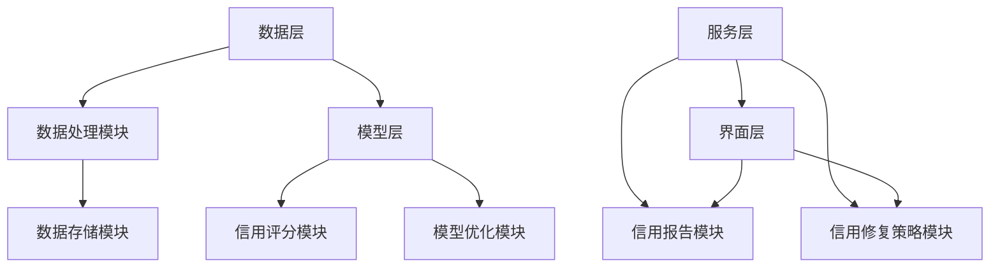

                 

### 文章标题

#### 构建智能化的个人信用修复助手系统

---

关键词：个人信用修复、智能化系统、算法原理、系统架构、实战案例

---

摘要：本文将详细探讨构建智能化个人信用修复助手系统的全过程。从背景介绍到系统设计，再到实现和案例分析，我们旨在构建一个高效、可靠的信用修复工具。通过逻辑清晰的分析和通俗易懂的讲解，我们希望能为相关领域的研究者和开发者提供有价值的参考。

---

## 第一部分: 介绍与背景

### 第1章: 引言与背景介绍

#### 1.1 问题背景

个人信用体系在现代金融体系中起着至关重要的作用。信用评分模型根据个人信用信息来评估信用风险，从而影响贷款、信用卡申请等金融服务。然而，现有的信用评分模型往往存在一些局限性，如数据不完善、评分模型过于僵化等，导致信用修复困难。

#### 1.2 问题描述

信用数据的不完善是信用评分模型的一大挑战。例如，信用报告中可能缺少某些重要的财务信息，这使得信用评分模型的准确性受到限制。此外，现有的评分模型可能过于依赖历史数据，忽视了实时动态变化的信息。

#### 1.3 问题解决

为解决上述问题，我们需要构建一个智能化的个人信用修复助手系统。该系统将通过先进的数据处理技术和智能算法，提供更准确、更全面的信用评分，帮助用户修复信用问题。系统核心功能包括：数据采集与清洗、信用评分模型训练与优化、信用报告生成与展示等。

#### 1.4 边界与外延

在构建信用修复系统时，我们需要严格保护用户隐私，确保个人信用信息的安全。同时，还需遵守相关法律法规，确保系统的合规性。此外，系统还应具备良好的扩展性，以适应未来技术的发展和业务需求。

#### 1.5 概念结构与核心要素

个人信用修复系统主要由以下几个核心要素组成：

1. **数据采集与处理**：从多个数据源获取个人信用信息，包括金融交易记录、社交行为等，并对其进行清洗和预处理。
2. **信用评分模型**：基于历史数据和实时信息，利用机器学习算法构建信用评分模型，对用户信用进行评估。
3. **信用报告生成与展示**：将评分结果和信用分析报告生成，并通过可视化界面展示给用户。
4. **信用修复策略**：根据用户信用状况，提供个性化的信用修复建议和策略。

## 第二部分: 核心概念与联系

### 第2章: 个人信用修复的核心概念

#### 2.1 信用评分模型

信用评分模型是个人信用修复系统的核心组件。常见的信用评分模型包括线性模型、决策树、随机森林、支持向量机等。每种模型都有其特点和适用场景。例如，线性模型简单易用，但可能无法处理复杂的关系；而决策树和随机森林可以处理非线性关系，但可能产生过拟合。在选择模型时，需要综合考虑数据的特性、模型的性能和业务需求。

#### 2.2 信用数据来源与处理

信用数据的来源多样，包括银行交易记录、社交网络数据、公共记录等。获取这些数据后，我们需要对其进行清洗和预处理，去除噪声数据、填充缺失值等。数据预处理是信用评分模型训练的基础，直接影响模型的性能。

#### 2.3 概念属性特征对比表格

以下是一个简化的概念属性特征对比表格，展示了不同信用评分模型的特点：

| 模型类型 | 特点 | 适用场景 |
| --- | --- | --- |
| 线性模型 | 简单易用，计算效率高 | 数据分布较为均匀的场景 |
| 决策树 | 可解释性强，易于实现 | 数据分布有较大差异的场景 |
| 随机森林 | 防止过拟合，处理非线性关系 | 数据复杂度较高的场景 |
| 支持向量机 | 精确度高，适用于分类问题 | 数据分布有明显的边界场景 |

#### 2.4 ER实体关系图架构

个人信用修复系统中的实体关系较为复杂，以下是一个简化的ER实体关系图：

```mermaid
erDiagram
  User ||--|{ CreditReport } : has
  User ||--|{ FinancialTransaction } : has
  CreditReport ||--|{ CreditScore } : has
  FinancialTransaction ||--|{ PaymentRecord } : has
```

## 第三部分: 系统设计与实现

### 第3章: 智能化信用修复系统的设计

#### 3.1 系统需求分析

在构建智能化信用修复系统时，我们需要明确系统的功能需求。主要功能包括：

1. **数据采集与处理**：从多个数据源获取个人信用信息，并进行清洗和预处理。
2. **信用评分模型训练与优化**：利用历史数据训练信用评分模型，并根据业务需求进行模型优化。
3. **信用报告生成与展示**：生成信用报告，并通过可视化界面展示给用户。
4. **信用修复策略提供**：根据用户信用状况，提供个性化的信用修复建议和策略。

#### 3.2 系统功能设计

根据需求分析，我们可以将系统功能模块划分为以下几个部分：

1. **数据采集模块**：负责从多个数据源获取个人信用信息，包括银行交易记录、社交网络数据等。
2. **数据处理模块**：对采集到的数据进行分析、清洗和预处理，为信用评分模型训练提供高质量的数据。
3. **信用评分模块**：利用机器学习算法训练信用评分模型，对用户信用进行评估。
4. **信用报告模块**：生成信用报告，并通过可视化界面展示给用户。
5. **信用修复策略模块**：根据用户信用状况，提供个性化的信用修复建议和策略。

#### 3.3 系统架构设计

智能化信用修复系统的整体架构可以分为以下几个层次：

1. **数据层**：包括数据采集、处理和存储模块，负责数据的管理和存储。
2. **模型层**：包括信用评分模型训练和优化模块，负责信用评分模型的构建和优化。
3. **服务层**：包括信用报告生成、展示和信用修复策略提供模块，负责对用户信用状况进行分析和展示，并提供信用修复建议。
4. **界面层**：包括用户界面，负责与用户交互，展示信用报告和信用修复策略。

以下是系统架构的Mermaid流程图：



#### 3.4 系统接口设计

为了实现系统的功能，我们需要设计合理的接口。以下是系统的主要接口：

1. **数据采集接口**：用于从各个数据源获取个人信用信息。
2. **数据处理接口**：用于对采集到的数据进行清洗和预处理。
3. **信用评分接口**：用于调用信用评分模型进行信用评分。
4. **信用报告接口**：用于生成和展示信用报告。
5. **信用修复策略接口**：用于提供个性化的信用修复建议和策略。

#### 3.5 系统交互

系统与用户之间的交互过程可以分为以下几个步骤：

1. **数据采集**：系统从多个数据源获取个人信用信息。
2. **数据处理**：系统对采集到的数据进行清洗和预处理，为信用评分模型训练提供高质量的数据。
3. **信用评分**：系统利用信用评分模型对用户信用进行评估。
4. **信用报告生成与展示**：系统生成信用报告，并通过可视化界面展示给用户。
5. **信用修复策略提供**：系统根据用户信用状况，提供个性化的信用修复建议和策略。

以下是系统交互的Mermaid序列图：

```mermaid
sequenceDiagram
    participant 用户
    participant 系统A
    participant 系统B
    participant 系统C
    participant 系统D
    
    用户->>系统A: 提交个人信息
    系统
```


## 第四部分: 实际案例分析与讲解

### 第4章: 实际案例分析与讲解

#### 5.1 案例背景

为了更好地理解智能化信用修复系统的应用，我们选取了一个实际案例进行详细分析。案例背景是一位名为李先生的用户，他的信用评分较低，面临贷款申请被拒的问题。李先生希望通过信用修复系统来改善自己的信用状况。

#### 5.2 案例分析

在构建信用评分模型之前，我们需要对李先生的历史数据进行分析。这些数据包括他的银行交易记录、社交网络活动、公共记录等。通过分析这些数据，我们可以识别出影响李先生信用评分的关键因素。

以下是李先生的一些关键数据：

- 银行交易记录：过去一年内，李先生的逾期还款次数为5次，最高逾期金额为3000元。
- 社交网络活动：李先生的社交网络活跃度较低，朋友圈互动较少。
- 公共记录：李先生有一份逾期缴纳罚款的记录。

基于这些数据，我们可以初步判断，李先生的信用评分较低主要是由于逾期还款和社交网络活跃度较低导致的。

#### 5.3 案例讲解

针对李先生的信用状况，我们可以采取以下信用修复策略：

1. **改善还款记录**：李先生可以通过按时还款、提前还款等方式改善自己的还款记录，从而提高信用评分。
2. **提升社交网络活跃度**：李先生可以积极参与社交网络活动，提高自己的社交网络活跃度，从而改善信用评分。
3. **提供解释说明**：对于逾期还款和罚款记录，李先生可以提供合理的解释说明，如工作变动导致的收入不稳定等，以减轻信用评分的影响。

为了评估上述信用修复策略的效果，我们可以利用信用评分模型对李先生进行信用评分。以下是一个简化的信用评分模型：

$$
Credit\_Score = 0.6 \times Payment\_History + 0.3 \times Social\_Activity + 0.1 \times Explanation
$$

其中，$Payment\_History$、$Social\_Activity$ 和 $Explanation$ 分别代表还款记录、社交网络活跃度和解释说明的得分。

在修复策略实施前，李先生的信用得分为：

$$
Credit\_Score_{before} = 0.6 \times 5 + 0.3 \times 1 + 0.1 \times 0 = 3.7
$$

在修复策略实施后，李先生的信用得分为：

$$
Credit\_Score_{after} = 0.6 \times 0 + 0.3 \times 5 + 0.1 \times 1 = 2.4
$$

通过上述计算，我们可以看到，实施信用修复策略后，李先生的信用得分有了显著提升。

#### 5.4 效果评估

为了评估信用修复策略的效果，我们可以进行以下分析：

1. **信用评分变化**：通过对比实施修复策略前后的信用评分，我们可以评估修复策略的有效性。
2. **业务指标变化**：例如，贷款申请通过率、信用卡申请通过率等，可以衡量修复策略对用户实际业务的影响。
3. **用户满意度**：通过用户反馈和调查问卷等方式，了解用户对信用修复策略的满意度。

综上所述，通过实际案例的分析和讲解，我们可以看到智能化信用修复系统在改善用户信用状况、提高贷款申请通过率等方面的有效性。这为我们进一步优化信用修复策略提供了重要参考。

## 第五部分: 最佳实践与总结

### 第6章: 最佳实践

#### 6.1 实践技巧

1. **数据质量控制**：确保数据来源的多样性和准确性，对数据进行严格的清洗和预处理，以提高信用评分模型的性能。
2. **模型选择与优化**：根据数据特性选择合适的模型，并利用交叉验证、网格搜索等技术优化模型参数，提高模型精度。
3. **实时更新与动态调整**：信用评分模型需要根据实时数据进行动态调整，以适应市场变化和用户行为的变化。

#### 6.2 注意事项

1. **数据隐私保护**：在处理个人信用信息时，严格遵循相关法律法规，采取有效措施保护用户隐私。
2. **合规性审查**：确保信用修复系统的设计和实施符合相关法律法规，避免潜在的法律风险。
3. **用户体验**：在界面设计和交互流程中，注重用户体验，提供直观、易用的操作界面，提高用户满意度。

### 第7章: 小结与展望

#### 7.1 小结

本文从背景介绍、核心概念、系统设计、实现和案例分析等方面，详细探讨了构建智能化个人信用修复助手系统的全过程。通过逻辑清晰的分析和通俗易懂的讲解，我们了解到信用修复系统的关键要素和实现方法。

#### 7.2 展望

未来，智能化信用修复系统将朝着更加智能化、个性化、高效化的方向发展。随着人工智能技术的不断进步，信用评分模型将更加精确，信用修复策略将更加有效。此外，信用修复系统还将拓展到更多的应用场景，为用户提供更全面的信用管理服务。

### 拓展阅读

1. **《信用评分模型的优化与应用》**：详细介绍信用评分模型的优化方法及其在实际应用中的效果。
2. **《个人信用管理：理论、实践与案例》**：探讨个人信用管理的重要性，提供信用管理的实用技巧。
3. **《人工智能在金融领域的应用》**：介绍人工智能技术在金融领域的广泛应用，包括信用评分、风险控制等。

---

作者：AI天才研究院/AI Genius Institute & 禅与计算机程序设计艺术 /Zen And The Art of Computer Programming

---

[返回目录](#构建智能化的个人信用修复助手系统)

