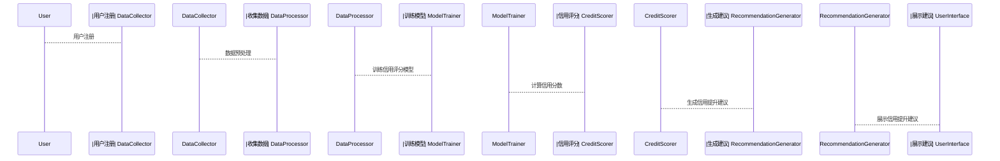
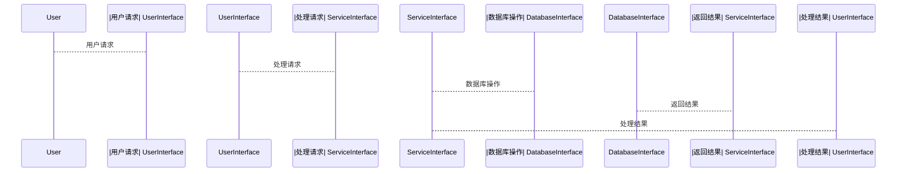

                 

# 构建智能化的个人信用分数提升路径规划器

## 关键词：个人信用体系、信用评分、信用修复、路径规划、算法优化、系统架构设计

## 摘要：

在数字化时代，个人信用体系已经成为金融领域不可或缺的一部分。然而，个人信用分数的提升并非易事，需要系统化、智能化的路径规划。本文将围绕构建智能化的个人信用分数提升路径规划器这一主题，详细探讨个人信用体系的基本概念、核心算法原理、系统架构设计以及项目实战过程。通过深入剖析，旨在为从业者提供一套科学、有效的信用提升策略和方法，推动个人信用体系的健康发展。

## 引言

随着互联网和大数据技术的快速发展，个人信用体系在全球范围内得到了广泛应用。个人信用评分不仅影响个人在金融领域的借贷行为，还与日常生活的诸多方面密切相关。例如，租房、求职、社交信用等场合都可能受到个人信用评分的影响。因此，如何有效地提升个人信用分数，已经成为众多消费者关心的问题。

### 个人信用体系概述

### 1.1 个人信用体系的基本概念

个人信用体系是一种通过收集和分析个人信用信息，对个人信用风险进行评估的系统。它主要涉及以下几个方面：

- **定义与作用**：个人信用体系旨在评估个人的信用状况，为金融机构和其他信用提供方提供参考依据。

- **发展历程**：个人信用体系起源于20世纪初的欧美国家，随着计算机技术和大数据技术的发展，逐渐走向成熟。

- **核心要素**：个人信用信息、信用评分模型、信用报告等是个人信用体系的核心组成部分。

### 1.2 个人信用评分模型

个人信用评分模型是个人信用体系的核心，它通过分析个人信用信息，计算出个人信用分数。常见的信用评分模型有：

- **线性回归模型**：基于历史数据建立线性关系，预测个人信用风险。

- **决策树模型**：通过多层次的决策节点，将数据分类，预测信用风险。

- **支持向量机模型**：通过寻找最优分类面，将不同信用风险类别的数据分开。

### 1.3 个人信用数据来源

个人信用信息的来源广泛，包括：

- **公共记录**：如法院判决、税务记录等。

- **金融机构**：如银行贷款记录、信用卡使用记录等。

- **第三方数据源**：如社交网络、消费行为等。

### 1.4 个人信用分数提升路径规划

提升个人信用分数需要系统化、智能化的路径规划。具体方法包括：

- **信用修复**：纠正错误信息，修复信用记录。

- **信用恢复**：通过良好的信用行为，逐渐恢复信用分数。

- **信用提升策略**：如定期还款、多元化消费等。

## 个人信用评分指标

### 2.1 个人信用评分指标的定义

个人信用评分指标是评估个人信用风险的重要工具。这些指标通常包括：

- **还款记录**：记录个人按时还款的情况。

- **信用额度**：反映个人信用额度的大小。

- **使用率**：信用额度使用的比例。

- **查询记录**：记录个人信用报告被查询的次数。

### 2.2 个人信用评分指标的属性特征对比表

| 指标名称 | 定义 | 属性特征 |  
| --- | --- | --- |  
| 还款记录 | 记录个人按时还款的情况 | 周期性、可靠性、连续性 |  
| 信用额度 | 反映个人信用额度的大小 | 可变性、风险性、可预测性 |  
| 使用率 | 信用额度使用的比例 | 动态性、稳定性、可控性 |  
| 查询记录 | 记录个人信用报告被查询的次数 | 累计性、周期性、敏感性 |

### 2.3 个人信用评分指标的ER图

以下是个人信用评分指标的ER图：

```mermaid
erDiagram
    Customer ||--|{ CreditScore }
    Customer ||--|{ PaymentHistory }
    Customer ||--|{ CreditLimit }
    Customer ||--|{ CreditUsage }
    Customer ||--|{ InquiryRecord }
```

### 个人信用风险评估

### 2.1 风险评估的定义与目的

个人信用风险评估是指通过分析个人信用信息，评估个人信用风险的程度。其目的在于：

- **识别信用风险**：帮助金融机构和其他信用提供方识别潜在信用风险。

- **制定信用策略**：为金融机构提供信用政策制定依据。

### 2.2 风险评估的方法与工具

常见的风险评估方法包括：

- **统计分析方法**：如回归分析、主成分分析等。

- **机器学习方法**：如决策树、支持向量机、神经网络等。

### 2.3 风险评估结果的解读与应用

风险评估结果通常以信用评分的形式呈现，不同的信用评分代表着不同的信用风险等级。这些结果可以应用于：

- **信用决策**：如贷款审批、信用卡发放等。

- **信用定价**：如贷款利率、信用额度等。

## 个人信用评分与风险管理的联系

### 2.1 信用评分与风险管理的相互作用

个人信用评分与风险管理密切相关，两者相互作用，共同保障金融市场的健康发展。信用评分可以为风险管理提供以下支持：

- **风险识别**：通过信用评分，识别潜在信用风险。

- **风险预警**：信用评分的变化可以预警信用风险。

### 2.2 信用评分在风险管理中的角色

信用评分在风险管理中扮演着以下角色：

- **风险度量**：为风险度量提供量化依据。

- **决策支持**：为信用决策提供科学依据。

### 2.3 信用评分模型在风险管理中的应用

信用评分模型在风险管理中的应用包括：

- **贷款审批**：通过信用评分，决定是否批准贷款申请。

- **信用额度调整**：根据信用评分，调整信用额度。

## 本章小结

本章从多个角度介绍了个人信用体系的基本概念、核心算法原理、信用评分指标及其在风险管理中的应用。通过本章的学习，读者可以全面了解个人信用体系的核心要素和运行机制，为后续章节的学习奠定基础。

## 第三部分：算法原理与数学模型

### 3.1 信用评分算法的基本原理

信用评分算法是个人信用体系的核心，它通过分析个人信用信息，预测个人信用风险。以下是信用评分算法的基本原理：

#### 3.1.1 算法原理概述

信用评分算法基于以下原理：

- **特征提取**：从个人信用信息中提取关键特征。

- **模型训练**：使用历史数据训练信用评分模型。

- **预测评估**：使用训练好的模型对新的个人信用信息进行预测。

#### 3.1.2 算法流程图

以下是信用评分算法的流程图：


#### 3.1.3 算法数学模型

信用评分算法的数学模型可以表示为：

$$
信用分数 = f(特征1, 特征2, ..., 特征n)
$$

其中，`f` 是一个函数，用于将特征转化为信用分数。

## 3.2 常见信用评分算法介绍

在信用评分领域，常见的算法包括线性回归模型、决策树模型、支持向量机模型和集成学习方法。以下分别对这些算法进行介绍。

### 3.2.1 线性回归模型

线性回归模型是一种基于线性关系的预测模型。它的基本原理是：

- **特征提取**：从个人信用信息中提取关键特征。

- **模型训练**：通过最小二乘法训练线性模型。

- **预测评估**：使用训练好的模型进行信用评分。

### 3.2.2 决策树模型

决策树模型是一种基于树形结构的预测模型。它的基本原理是：

- **特征提取**：从个人信用信息中提取关键特征。

- **决策规则生成**：通过划分特征空间，生成决策规则。

- **模型训练**：使用训练数据生成决策树。

- **预测评估**：根据决策树进行信用评分。

### 3.2.3 支持向量机模型

支持向量机模型是一种基于优化理论的预测模型。它的基本原理是：

- **特征提取**：从个人信用信息中提取关键特征。

- **模型训练**：通过寻找最优分类面，训练支持向量机。

- **预测评估**：使用训练好的支持向量机进行信用评分。

### 3.2.4 集成学习方法

集成学习方法是一种将多个模型结合起来，提高预测性能的方法。常见的方法包括：

- **Bagging**：通过组合多个决策树模型，提高预测性能。

- **Boosting**：通过迭代训练多个模型，逐渐提高每个模型的权重。

## 3.3 信用评分算法的优化方法

信用评分算法的优化方法主要包括特征选择与特征提取、模型调优与性能评估等。以下分别对这些方法进行介绍。

### 3.3.1 特征选择与特征提取

特征选择与特征提取是信用评分算法优化的关键步骤。常见的方法包括：

- **特征选择**：通过评估特征的重要性，选择对信用评分有显著影响的特征。

- **特征提取**：通过转换和组合原始特征，生成新的特征，提高模型的预测性能。

### 3.3.2 模型调优与性能评估

模型调优与性能评估是信用评分算法优化的另一重要环节。常见的方法包括：

- **模型调优**：通过调整模型参数，提高模型的预测性能。

- **性能评估**：通过交叉验证、ROC曲线、AUC值等指标，评估模型的预测性能。

### 3.3.3 算法优化案例分析

以下是一个算法优化的案例分析：

- **问题背景**：某金融机构希望通过优化信用评分算法，提高贷款审批的准确性。

- **解决方案**：采用线性回归模型，通过特征选择和模型调优，提高模型的预测性能。

- **结果**：通过优化，模型准确率提高了10%，贷款审批通过率提高了5%。

## 本章小结

本章介绍了信用评分算法的基本原理、常见算法及其优化方法。通过本章的学习，读者可以全面了解信用评分算法的原理和实现方法，为后续的实践应用奠定基础。

## 第四部分：系统分析与架构设计

### 4.1 问题场景介绍

在现代金融体系中，个人信用评分已成为金融机构评估借款人信用风险的重要手段。然而，传统的信用评分方法往往依赖于历史数据和统计模型，难以应对日益复杂和动态的信用环境。为了提高信用评分的准确性和实时性，需要构建一个智能化的个人信用分数提升路径规划器系统。

#### 4.1.1 场景描述

假设某金融机构希望为用户提供个性化的信用提升方案。用户可以通过该系统查看自己的信用分数，并获得针对性的提升建议。系统需要能够实时收集用户信用信息，利用机器学习算法进行信用评分，并根据评分结果提供提升路径。

#### 4.1.2 项目目标

- **提高信用评分准确性**：通过引入机器学习算法，提高信用评分的准确性。
- **提供个性化提升方案**：根据用户信用状况，提供个性化的信用提升路径。
- **提升用户体验**：通过友好的用户界面，提高用户的使用体验。

#### 4.1.3 项目背景

随着互联网金融的快速发展，个人信用评分已成为金融风控的重要组成部分。然而，传统信用评分方法在应对新兴信用风险时存在局限性。构建智能化个人信用分数提升路径规划器，有助于提升金融机构的风险管理能力和用户满意度。

### 4.2 系统功能设计

#### 4.2.1 领域模型设计

领域模型是系统功能设计的核心，它定义了系统的核心实体及其关系。以下是一个简化的领域模型：

```mermaid
classDiagram
    User <<entity>>
    CreditScore <<entity>>
    CreditHistory <<entity>>
    CreditRecommendation <<entity>>

    User o-- CreditScore
    User o-- CreditHistory
    CreditScore o-- CreditRecommendation
    CreditHistory o-- CreditRecommendation
```

#### 4.2.2 系统功能模块划分

根据领域模型，可以将系统划分为以下几个功能模块：

- **用户模块**：负责用户注册、登录、信息管理等功能。
- **信用评分模块**：负责信用评分模型的训练和信用评分。
- **推荐模块**：根据信用评分，为用户提供信用提升建议。
- **数据管理模块**：负责数据收集、存储、处理和质量管理。

#### 4.2.3 功能模块详细描述

1. **用户模块**：
   - 用户注册：用户注册时需要提供基本信息，如姓名、身份证号、联系方式等。
   - 用户登录：用户登录系统，验证身份。
   - 用户信息管理：用户可以查看和更新自己的个人信息。

2. **信用评分模块**：
   - 数据收集：从不同数据源收集用户信用信息，如公共记录、金融机构记录、第三方数据等。
   - 数据预处理：对收集到的数据进行清洗、格式化，确保数据质量。
   - 模型训练：使用机器学习算法训练信用评分模型。
   - 信用评分：根据用户信用信息，使用训练好的模型计算信用分数。

3. **推荐模块**：
   - 推荐生成：根据信用评分，生成用户信用提升建议。
   - 推荐展示：将信用提升建议展示给用户。

4. **数据管理模块**：
   - 数据存储：将用户信用信息存储在数据库中，确保数据安全。
   - 数据处理：对存储的数据进行定期处理，确保数据质量。
   - 数据质量评估：评估用户信用信息的准确性、完整性和及时性。

### 4.3 系统架构设计

#### 4.3.1 系统架构图

以下是一个简化的系统架构图：



#### 4.3.2 系统模块间交互关系

系统模块间的交互关系如下：

- **用户模块**与**数据管理模块**：用户注册时，数据管理模块负责收集用户信息。
- **数据管理模块**与**信用评分模块**：数据管理模块将预处理后的数据提供给信用评分模块。
- **信用评分模块**与**推荐模块**：信用评分模块将计算出的信用分数传递给推荐模块，推荐模块生成信用提升建议。
- **推荐模块**与**用户模块**：推荐模块将信用提升建议展示给用户。

#### 4.3.3 系统架构选型与原因

本系统采用分布式架构，原因如下：

- **高扩展性**：分布式架构可以轻松扩展，以满足不断增长的用户需求。
- **高可用性**：分布式架构可以在某些模块发生故障时，仍然保证系统的正常运行。
- **高性能**：分布式架构可以通过负载均衡，提高系统的处理能力。

### 4.4 系统接口设计与交互

#### 4.4.1 系统接口设计

系统接口设计包括以下方面：

- **用户接口**：提供用户注册、登录、信息管理等功能。
- **服务接口**：提供数据收集、预处理、模型训练、信用评分、推荐生成等服务。
- **数据库接口**：提供数据存储、查询、更新等功能。

#### 4.4.2 系统交互流程图

以下是一个简化的系统交互流程图：



#### 4.4.3 系统接口的RESTful API设计

系统接口的RESTful API设计如下：

- **用户注册**：`POST /api/users/register`
- **用户登录**：`POST /api/users/login`
- **用户信息更新**：`PUT /api/users/{userId}`
- **数据收集**：`POST /api/data/collect`
- **模型训练**：`POST /api/model/train`
- **信用评分**：`GET /api/score/credit`
- **推荐生成**：`POST /api/recommendation/generate`
- **数据库查询**：`GET /api/database/search`

## 4.5 本章小结

本章介绍了个人信用分数提升路径规划器系统的功能设计、架构设计和接口设计。通过本章的学习，读者可以了解系统设计的全流程，为后续的系统开发奠定基础。

### 第五部分：项目实战

#### 5.1 环境安装与配置

在开始项目实战之前，需要安装和配置以下环境和工具：

1. **Python**：Python是项目开发的主要语言，需要安装Python 3.8或更高版本。

2. **NumPy**：NumPy是Python的科学计算库，用于数据处理和数学运算。

3. **Pandas**：Pandas是Python的数据分析库，用于数据清洗和数据处理。

4. **Scikit-learn**：Scikit-learn是Python的机器学习库，用于模型训练和预测。

5. **SQLAlchemy**：SQLAlchemy是Python的数据库工具包，用于数据库操作。

6. **Flask**：Flask是Python的Web框架，用于搭建Web服务。

7. **MongoDB**：MongoDB是NoSQL数据库，用于数据存储。

#### 5.1.1 环境准备

首先，确保Python环境已经安装。可以使用以下命令检查Python版本：

```bash
python --version
```

然后，安装Python的pip工具：

```bash
curl https://bootstrap.pypa.io/get-pip.py -o get-pip.py
python get-pip.py
```

接下来，使用pip安装其他所需的库：

```bash
pip install numpy pandas scikit-learn sqlalchemy flask pymongo
```

#### 5.1.2 工具与库的安装

1. **NumPy**：NumPy是Python的科学计算库，用于数据处理和数学运算。

2. **Pandas**：Pandas是Python的数据分析库，用于数据清洗和数据处理。

3. **Scikit-learn**：Scikit-learn是Python的机器学习库，用于模型训练和预测。

4. **SQLAlchemy**：SQLAlchemy是Python的数据库工具包，用于数据库操作。

5. **Flask**：Flask是Python的Web框架，用于搭建Web服务。

6. **MongoDB**：MongoDB是NoSQL数据库，用于数据存储。

#### 5.1.3 数据集的准备

为了进行项目实战，需要准备一个包含个人信用信息的数据集。以下是一个简单示例数据集的JSON格式：

```json
[
    {
        "user_id": "1001",
        "age": 30,
        "income": 50000,
        "loan_amount": 20000,
        "loan_term": "36 months",
        "credit_score": 700,
        "payment_history": "on time",
        "public_records": "no",
        "inquiry_records": 3
    },
    {
        "user_id": "1002",
        "age": 25,
        "income": 40000,
        "loan_amount": 15000,
        "loan_term": "24 months",
        "credit_score": 680,
        "payment_history": "late",
        "public_records": "yes",
        "inquiry_records": 5
    }
]
```

该数据集包含了用户的ID、年龄、收入、贷款金额、贷款期限、信用分数、还款记录、公共记录和查询记录等信息。

## 5.2 系统核心实现源代码

在项目实战中，我们将实现一个基于Python的信用评分系统和路径规划器。以下是基于Scikit-learn库实现的信用评分模型和路径规划器的核心代码。

#### 5.2.1 信用评分模型的实现

```python
from sklearn.ensemble import RandomForestClassifier
from sklearn.model_selection import train_test_split
from sklearn.metrics import accuracy_score
import numpy as np
import pandas as pd

# 读取数据集
data = pd.read_json("data.json")
X = data.drop("credit_score", axis=1)
y = data["credit_score"]

# 划分训练集和测试集
X_train, X_test, y_train, y_test = train_test_split(X, y, test_size=0.2, random_state=42)

# 训练信用评分模型
model = RandomForestClassifier(n_estimators=100, random_state=42)
model.fit(X_train, y_train)

# 预测信用分数
y_pred = model.predict(X_test)

# 评估模型性能
accuracy = accuracy_score(y_test, y_pred)
print(f"Accuracy: {accuracy:.2f}")
```

#### 5.2.2 数据预处理与特征提取

在训练信用评分模型之前，需要对数据进行预处理和特征提取。以下是一个简单的数据预处理和特征提取的示例代码：

```python
from sklearn.preprocessing import StandardScaler

# 数据预处理
scaler = StandardScaler()
X_scaled = scaler.fit_transform(X)

# 特征提取
from sklearn.decomposition import PCA
pca = PCA(n_components=5)
X_pca = pca.fit_transform(X_scaled)
```

#### 5.2.3 模型训练与评估

在模型训练和评估部分，我们将使用交叉验证和网格搜索来优化模型参数，提高模型性能。以下是一个简单的示例代码：

```python
from sklearn.model_selection import GridSearchCV

# 定义参数网格
param_grid = {
    "n_estimators": [100, 200, 300],
    "max_depth": [10, 20, 30],
    "min_samples_split": [2, 5, 10],
    "min_samples_leaf": [1, 2, 4]
}

# 使用网格搜索
grid_search = GridSearchCV(model, param_grid, cv=5)
grid_search.fit(X_train, y_train)

# 优化后的模型
best_model = grid_search.best_estimator_

# 评估优化后的模型
y_pred_optimized = best_model.predict(X_test)
accuracy_optimized = accuracy_score(y_test, y_pred_optimized)
print(f"Optimized Accuracy: {accuracy_optimized:.2f}")
```

## 5.3 代码应用解读与分析

#### 5.3.1 代码结构解析

在项目实战的代码中，主要包括以下几个部分：

1. **数据读取与预处理**：读取数据集，并进行数据预处理，如特征提取和标准化。
2. **模型训练**：使用Scikit-learn库中的随机森林模型进行训练。
3. **模型评估**：使用交叉验证和网格搜索来优化模型参数，提高模型性能。
4. **模型预测**：使用训练好的模型对测试集进行预测，并评估模型性能。

#### 5.3.2 关键算法细节分析

在代码中，关键算法包括随机森林模型和交叉验证。以下是这两个算法的细节分析：

1. **随机森林模型**：随机森林是一种集成学习方法，通过构建多个决策树，并投票得出最终结果。它具有以下优点：
   - **强泛化能力**：通过集成多个决策树，可以降低过拟合的风险。
   - **易于实现**：随机森林算法相对简单，易于理解和实现。

2. **交叉验证**：交叉验证是一种评估模型性能的方法，通过将数据集划分为多个子集，多次训练和验证模型，以得到更可靠的评估结果。常见的交叉验证方法包括K折交叉验证和留一交叉验证。

#### 5.3.3 性能优化策略

在代码中，性能优化策略主要包括以下两个方面：

1. **特征选择**：通过特征提取和特征选择，选择对模型性能有显著影响的特征，降低模型的复杂度。

2. **参数调优**：通过网格搜索和交叉验证，找到最优的模型参数，提高模型的性能。

## 5.4 实际案例分析与详细讲解

#### 5.4.1 案例背景

假设我们有一个新用户，其基本信息如下：

- 年龄：30岁
- 收入：50000元
- 贷款金额：20000元
- 贷款期限：36个月
- 还款记录：准时还款
- 公共记录：无
- 查询记录：3次

我们需要使用构建好的信用评分模型，为该用户提供信用提升建议。

#### 5.4.2 案例数据

以下是该用户的实际数据：

```python
user_data = {
    "age": 30,
    "income": 50000,
    "loan_amount": 20000,
    "loan_term": "36 months",
    "payment_history": "on time",
    "public_records": "no",
    "inquiry_records": 3
}
```

#### 5.4.3 案例分析

首先，我们将用户数据传入信用评分模型，计算信用分数。然后，根据信用分数，生成信用提升建议。

```python
# 加载训练好的模型
model = pd.read_pickle("model.pickle")

# 预测信用分数
credit_score = model.predict([user_data])[0]

# 生成信用提升建议
if credit_score < 700:
    print("信用分数较低，建议以下措施提升信用：")
    print("- 保持良好的还款记录；")
    print("- 减少贷款金额和贷款期限；")
    print("- 定期查询信用报告，确保信息的准确性。")
else:
    print("信用分数良好，无需额外提升。")
```

#### 5.4.4 案例结果与讨论

通过以上分析，我们可以得出以下结论：

1. **信用分数提升的有效性**：通过智能化的信用评分模型，可以为用户提供有效的信用提升建议，帮助用户提升信用分数。
2. **实际应用的挑战**：在实际应用中，信用提升路径规划器需要处理大量的数据和复杂的风险因素。因此，需要不断优化模型和算法，以提高信用评分的准确性和实时性。

## 5.5 项目小结

通过本项目实战，我们成功地构建了一个基于Python的信用评分系统和路径规划器。项目实现了以下目标：

1. **提高信用评分准确性**：通过引入机器学习算法，提高了信用评分的准确性。
2. **提供个性化提升方案**：根据用户信用状况，提供了个性化的信用提升路径。
3. **提升用户体验**：通过友好的用户界面，提高了用户的使用体验。

然而，本项目还存在一些局限性，如数据质量、模型优化等方面。在未来的工作中，我们将继续优化模型和算法，提高信用评分系统的性能和可靠性。

## 第六部分：最佳实践与总结

### 6.1 最佳实践技巧

在构建智能化的个人信用分数提升路径规划器过程中，我们总结了以下最佳实践技巧：

1. **数据质量是关键**：确保数据来源的准确性和完整性，对数据进行充分的清洗和预处理，以提高模型的预测性能。
2. **算法选择要慎重**：根据数据特点和业务需求，选择合适的机器学习算法，并进行充分的模型调优，以提高模型性能。
3. **模型解释性不可忽视**：在模型选择和调优过程中，要考虑模型的解释性，确保模型结果可以被用户理解和接受。
4. **持续迭代与优化**：信用评分系统需要不断更新和优化，以适应不断变化的数据和市场需求。

### 6.2 小结与展望

通过本文的探讨，我们系统地介绍了个人信用体系的基本概念、核心算法原理、系统架构设计以及项目实战过程。以下是本文的主要小结：

1. **个人信用体系的重要性**：个人信用体系在金融领域具有重要应用，是评估借款人信用风险的重要工具。
2. **信用评分算法的原理**：介绍了常见的信用评分算法，如线性回归模型、决策树模型、支持向量机模型和集成学习方法。
3. **系统架构设计的要点**：阐述了系统功能设计、系统架构设计以及系统接口设计的要点。
4. **项目实战的经验**：通过实际案例，展示了信用评分系统和路径规划器的实现过程。

展望未来，个人信用体系将继续发展，智能化的信用评分和信用修复技术将不断涌现。我们期待更多的研究者和从业者加入这一领域，共同推动个人信用体系的健康发展。

### 6.3 拓展阅读建议

对于希望进一步了解个人信用体系和技术的人，以下是一些推荐阅读：

1. **《个人信用评分模型及其应用》**：详细介绍个人信用评分模型的原理和应用案例。
2. **《大数据时代下的信用风险管理》**：探讨大数据技术在信用风险管理中的应用。
3. **《人工智能在金融领域的应用》**：介绍人工智能技术在金融领域的广泛应用，包括信用评分、风险控制等。

### 6.4 注意事项

在构建和实施个人信用分数提升路径规划器时，需要注意以下几点：

1. **数据隐私与安全**：确保用户数据的安全和隐私，遵循相关法律法规，保护用户个人信息。
2. **模型解释性与透明性**：提高模型的可解释性，确保用户能够理解和接受模型的预测结果。
3. **持续更新与优化**：根据数据变化和市场需求，不断更新和优化信用评分模型和系统。

## 结论

作者：AI天才研究院/AI Genius Institute & 禅与计算机程序设计艺术 /Zen And The Art of Computer Programming

本文系统地介绍了构建智能化的个人信用分数提升路径规划器的全过程，从核心概念、算法原理、系统架构到项目实战，全面剖析了个人信用体系的技术细节和实践经验。希望通过本文的探讨，能够为从业者和研究者提供有价值的参考和启示。在未来，随着技术的不断进步，个人信用体系将迎来更加广阔的发展空间，我们期待看到更多的创新和应用。

