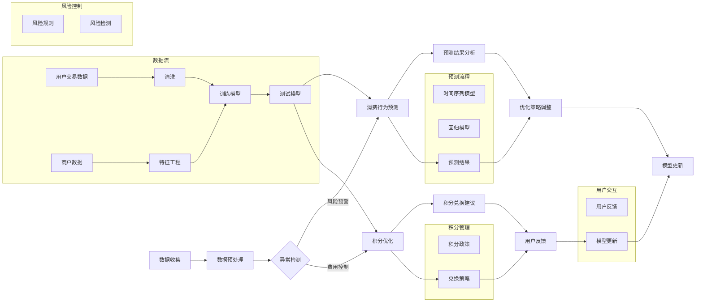
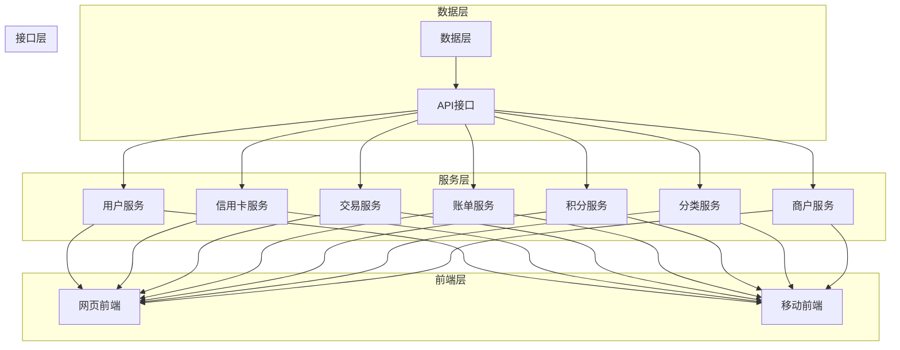
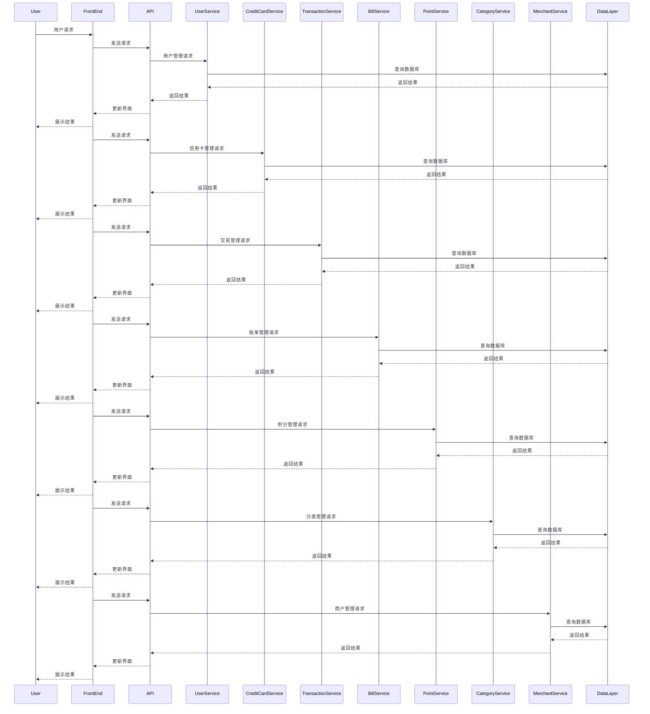

                 


# 构建智能化的个人信用卡使用优化助手

## 关键词

- 信用卡使用优化
- 智能化助手
- 机器学习
- 数据分析
- 账单管理
- 用户体验

## 摘要

在数字化时代，信用卡成为人们日常生活中不可或缺的工具。然而，信用卡的使用并非总是一帆风顺，常常伴随着账单管理混乱、积分浪费、费用超支等问题。为了提高信用卡使用效率和用户满意度，构建智能化个人信用卡使用优化助手成为了一项重要任务。本文将详细探讨如何利用现代科技手段，特别是机器学习和数据分析技术，来构建这样一款优化助手，解决信用卡使用中的痛点。文章将分为以下几个部分：首先，介绍问题背景和意义；接着，分析核心概念原理和特征对比；然后，讲解算法原理及实现；最后，进行系统分析与架构设计，并提供项目实战和应用案例。通过这篇文章，希望能够为读者提供构建智能化信用卡使用优化助手的全面思路和实用指南。

### 目录大纲

1. **问题的背景与意义**
   1.1 **问题背景**
   1.1.1 **个人信用卡的普遍使用**
   1.1.2 **信用卡使用的痛点**
   1.1.3 **智能化优化的重要性和必要性**
   1.2 **问题描述**
   1.2.1 **信用卡使用不当带来的问题**
   1.2.2 **智能化优化助手的解决思路**
   1.3 **问题解决**
   1.3.1 **智能化优化助手的总体设计思路**
   1.3.2 **关键技术的选择与应用**
   1.4 **边界与外延**
   1.4.1 **辅助工具与技术**
   1.4.2 **个性化与普适性兼顾**
   1.5 **核心概念与联系**
   1.5.1 **信用卡管理相关概念**
   1.5.2 **智能化优化相关概念**
   1.5.3 **ER实体关系图**

2. **核心概念原理与特征对比**
   2.1 **信用卡管理相关概念**
   2.1.1 **信用卡的种类与用途**
   2.1.2 **信用卡账单管理**
   2.1.3 **信用卡积分与优惠**
   2.2 **智能化优化相关概念**
   2.2.1 **机器学习与深度学习基础**
   2.2.2 **智能算法在信用卡管理中的应用**
   2.2.3 **优化算法的选择与优化策略**
   2.3 **概念属性特征对比表格**
   2.3.1 **信用卡管理工具的特征对比**
   2.3.2 **智能化优化算法的特征对比**
   2.4 **ER实体关系图架构**
   2.4.1 **实体关系图的基本概念**
   2.4.2 **信用卡管理系统的ER实体关系图**
   2.4.3 **智能化优化系统的ER实体关系图**

3. **算法原理讲解与实现**
   3.1 **概述**
   3.1.1 **算法在信用卡优化中的应用**
   3.1.2 **算法选择的依据**
   3.2 **算法mermaid流程图**
   3.2.1 **算法流程概述**
   3.2.2 **算法流程详细图**
   3.3 **Python源代码实现**
   3.3.1 **数据预处理**
   3.3.2 **算法核心实现**
   3.3.3 **结果分析**
   3.4 **算法原理的数学模型与公式**
   3.4.1 **算法原理的数学模型**
   3.4.2 **公式讲解与推导**
   3.5 **举例说明**
   3.5.1 **案例选择**
   3.5.2 **案例分析与结果**

4. **系统分析与架构设计**
   4.1 **问题场景介绍**
   4.1.1 **信用卡使用场景分析**
   4.1.2 **系统需求分析**
   4.2 **项目介绍**
   4.2.1 **项目背景**
   4.2.2 **项目目标**
   4.2.3 **项目架构设计**
   4.3 **系统功能设计**
   4.3.1 **领域模型类图**
   4.3.2 **系统功能模块划分**
   4.4 **系统架构设计**
   4.4.1 **系统架构图**
   4.4.2 **各模块功能与交互**
   4.5 **系统接口设计**
   4.5.1 **接口定义**
   4.5.2 **接口交互流程**
   4.6 **系统交互序列图**
   4.6.1 **交互序列图概述**
   4.6.2 **交互序列图详细图**

5. **项目实战**
   5.1 **环境安装**
   5.2 **系统核心实现源代码**
   5.3 **代码应用解读与分析**
   5.4 **实际案例分析和详细讲解剖析**
   5.5 **项目小结**

6. **最佳实践 Tips**
   6.1 **高效使用信用卡的技巧**
   6.2 **注意事项**
   6.3 **拓展阅读**

7. **小结**
8. **注意事项**
9. **拓展阅读**

---

### 1.1 问题背景

在现代金融体系中，信用卡作为一种便捷的支付工具，已经深入到人们的日常生活中。无论是购物、旅游、餐饮，还是日常消费，信用卡的使用已经变得非常普遍。根据相关统计数据，全球信用卡发行量已经超过数十亿张，用户数量也在不断增加。

**1.1.1 个人信用卡的普遍使用**

信用卡的普及主要得益于其便捷性、安全性和灵活性。用户可以随时随地进行消费，无需携带大量现金，从而提高了支付效率。此外，信用卡还提供了多种优惠和积分奖励，使用户在消费中享受到了额外的价值。

**1.1.2 信用卡使用的痛点**

然而，信用卡的普及也带来了许多使用痛点。首先，信用卡账单管理复杂。用户需要记住每笔消费的金额、时间和地点，并且定期核对账单，以确保账单的准确性。其次，信用卡积分和优惠使用不当。很多用户因为不了解信用卡的积分规则和优惠活动，导致积分浪费或者无法获得最大优惠。最后，信用卡费用超支问题也较为普遍。用户往往在冲动消费时忘记预算控制，导致信用卡账单超出预期，进而影响财务状况。

**1.1.3 智能化优化的重要性和必要性**

面对这些痛点，构建智能化个人信用卡使用优化助手显得尤为重要。智能化优化助手可以通过数据分析、机器学习等技术，帮助用户实现以下目标：

1. **账单管理自动化**：优化助手可以自动收集、整理信用卡消费数据，生成详细的账单报告，帮助用户轻松管理账单。
2. **积分优化利用**：优化助手可以根据用户的消费习惯和积分政策，智能推荐积分兑换方案，最大化积分价值。
3. **预算控制**：优化助手可以基于用户的财务状况和消费历史，为用户制定合理的预算计划，避免超支问题。
4. **风险预警**：优化助手可以通过数据分析，及时发现异常消费行为，提供风险预警，保护用户的财产安全。

因此，智能化个人信用卡使用优化助手的构建不仅是解决用户痛点的重要手段，也是提升用户体验、增强用户忠诚度的有效途径。

### 1.2 问题描述

**1.2.1 信用卡使用不当带来的问题**

信用卡使用不当可能会导致一系列问题，包括账单管理混乱、积分浪费、费用超支等。这些问题不仅会影响用户的财务健康，还可能导致信用记录受损。

- **账单管理混乱**：许多用户在信用卡消费后，没有及时核对账单，导致账单错误、重复消费等问题。这不仅增加了用户的负担，还可能导致信用卡被盗刷。
- **积分浪费**：信用卡积分是银行提供的一种奖励机制，但很多用户因为不了解积分规则或者疏于管理，导致积分浪费。例如，积分过期未使用、兑换价值不高等问题。
- **费用超支**：用户在冲动消费时，容易忘记预算控制，导致信用卡账单超出预期。长期费用超支不仅影响用户的财务状况，还可能导致信用评级下降。

**1.2.2 智能化优化助手的解决思路**

针对上述问题，构建智能化个人信用卡使用优化助手可以从以下几个方面入手：

1. **账单管理自动化**：优化助手可以自动收集、整理用户的信用卡消费数据，生成详细的账单报告，帮助用户轻松管理账单。这样不仅可以减少人工核对账单的工作量，还能提高账单的准确性。
2. **积分优化利用**：优化助手可以根据用户的消费习惯和积分政策，智能推荐积分兑换方案，最大化积分价值。例如，在积分过期前提醒用户兑换、根据消费金额推荐兑换方案等。
3. **预算控制**：优化助手可以基于用户的财务状况和消费历史，为用户制定合理的预算计划，避免超支问题。例如，设置消费限额、提醒用户按计划消费等。
4. **风险预警**：优化助手可以通过数据分析，及时发现异常消费行为，提供风险预警。例如，检测大额消费、多次消费失败等异常情况，并通知用户。

通过这些功能，智能化优化助手能够有效解决信用卡使用中的痛点，提高用户的财务管理能力和消费满意度。因此，构建这样一款优化助手具有重要的现实意义。

### 1.3 问题解决

**1.3.1 智能化优化助手的总体设计思路**

要构建一款高效、智能化的个人信用卡使用优化助手，需要从以下几个方面入手：

1. **数据收集与管理**：首先，需要收集用户的信用卡消费数据，包括消费时间、金额、地点、商户类型等信息。这些数据可以通过银行接口、API接口等方式获取。为了确保数据的安全性和隐私保护，需要对数据进行加密处理，并严格遵守相关法律法规。
2. **数据预处理**：收集到的数据可能存在缺失、异常、重复等问题，因此需要进行数据清洗和预处理。包括去除重复数据、填补缺失值、处理异常值等操作，以确保数据的质量和一致性。
3. **智能分析**：通过机器学习和数据分析技术，对预处理后的数据进行分析和挖掘，提取出有用的信息。例如，分析用户的消费习惯、预测未来的消费趋势、发现异常消费行为等。
4. **结果展示**：将分析结果以直观、易于理解的方式展示给用户，例如生成详细的账单报告、预算计划、风险预警等。结果展示的方式可以包括图表、文本、推送通知等。
5. **用户交互**：优化助手需要提供友好的用户交互界面，使用户能够方便地操作和管理信用卡账单。用户可以通过网页、手机APP等多种方式与优化助手进行交互。

**1.3.2 关键技术的选择与应用**

1. **机器学习与深度学习**：机器学习和深度学习是智能化分析的核心技术。通过训练模型，可以自动识别用户的消费习惯、预测未来的消费趋势、发现异常消费行为等。常用的算法包括决策树、随机森林、神经网络等。
2. **数据分析与挖掘**：数据分析与挖掘技术用于从大量消费数据中提取有用的信息。包括数据清洗、数据预处理、特征工程、聚类、分类、回归等操作。常用的工具包括Python的Pandas、NumPy、Scikit-learn等。
3. **自然语言处理**：自然语言处理技术用于处理和分析用户的查询请求、反馈信息等。通过文本分类、情感分析等技术，可以更好地理解用户的需求，提供个性化的服务。
4. **前端与后端技术**：优化助手的前端可以使用Vue.js、React等框架，实现友好的用户界面。后端可以使用Spring Boot、Django等框架，处理数据存储、接口调用等任务。

通过这些关键技术的应用，构建的智能化优化助手能够高效、准确地解决信用卡使用中的痛点，为用户提供优质的服务体验。

### 1.4 边界与外延

**1.4.1 辅助工具与技术**

构建智能化个人信用卡使用优化助手需要多种辅助工具和技术的支持，以下是一些常用的工具和技术：

1. **数据存储与处理**：为了高效地存储和处理大量信用卡消费数据，可以采用分布式数据库技术，如Hadoop、Spark等。这些技术能够提供强大的数据存储和计算能力，支持大规模数据处理和分析。
2. **云平台与服务**：云计算平台，如AWS、Azure、Google Cloud等，提供了丰富的数据存储、计算和AI服务。利用云平台，可以快速部署和扩展优化助手系统，降低开发和运维成本。
3. **API接口**：为了获取用户的信用卡消费数据，需要使用银行提供的API接口。通过API接口，可以安全地获取、传输和存储用户数据。
4. **图表可视化工具**：为了更直观地展示分析结果，可以使用图表可视化工具，如D3.js、ECharts等。这些工具能够将数据以图形化方式展示，便于用户理解和分析。
5. **前端框架**：为了构建友好的用户交互界面，可以使用前端框架，如Vue.js、React等。这些框架提供了丰富的组件和工具，能够提高开发效率和用户体验。

**1.4.2 个性化与普适性兼顾**

在构建智能化优化助手时，需要兼顾个性化与普适性：

1. **个性化服务**：根据用户的消费习惯、财务状况等，为用户提供个性化的账单管理、预算控制、积分优化等服务。例如，可以根据用户的历史数据，预测其未来的消费趋势，提前给出消费建议。
2. **普适性设计**：优化助手的设计应考虑到不同用户的需求和场景，提供普适性的功能和服务。例如，无论用户是经常出差、还是学生党，优化助手都能为其提供有效的财务管理建议。
3. **可扩展性**：优化助手的设计应具备良好的可扩展性，能够适应未来的发展和需求变化。例如，可以支持多种类型的信用卡、添加新的分析算法、扩展新的服务功能等。

通过这些辅助工具和技术的应用，以及个性化与普适性兼顾的设计，构建的智能化优化助手能够更好地满足用户的需求，提升用户体验。

### 1.5 核心概念与联系

**1.5.1 信用卡管理相关概念**

在构建智能化个人信用卡使用优化助手的背景下，理解以下几个核心概念至关重要：

1. **信用卡**：信用卡是一种电子支付卡，持卡人可以在银行或金融机构的信用额度内进行消费。信用卡的主要功能包括支付、取款、转账、积分奖励等。
2. **账单**：信用卡账单是银行定期发送给持卡人的消费记录，包括消费金额、时间、地点、商户类型等信息。账单是信用卡管理的重要依据。
3. **积分**：信用卡积分是银行提供的一种奖励机制，用户在消费时可以获得积分，用于兑换礼品、享受优惠等。积分的有效期和兑换规则通常由银行制定。
4. **费用**：信用卡费用包括年费、取现费、分期付款费等。合理使用信用卡可以节省这些费用，但不当使用可能导致不必要的支出。
5. **信用评级**：信用评级是银行对持卡人信用状况的评价，用于决定信用卡的信用额度、利率等。良好的信用评级有助于持卡人获得更优质的金融服务。

**1.5.2 智能化优化相关概念**

在构建优化助手的过程中，以下概念是不可或缺的：

1. **机器学习**：机器学习是一种通过数据驱动的方式，使计算机能够自动学习和改进的技术。在信用卡管理中，机器学习可以用于预测消费趋势、检测异常行为等。
2. **深度学习**：深度学习是机器学习的一种重要分支，通过构建复杂的神经网络模型，实现自动特征提取和高级数据分析。深度学习在信用卡管理中具有广泛的应用潜力。
3. **数据分析**：数据分析是通过对数据进行分析和挖掘，提取有用信息的过程。在信用卡管理中，数据分析可以用于账单管理、预算控制、风险预警等。
4. **自然语言处理**：自然语言处理是一种让计算机理解和处理人类语言的技术。在信用卡管理中，自然语言处理可以用于处理用户查询、反馈等文本信息。
5. **用户交互**：用户交互是优化助手与用户之间的互动过程。良好的用户交互设计可以提高用户体验，增强用户对优化助手的信任和依赖。

**1.5.3 ER实体关系图**

ER实体关系图是描述系统中实体及其关系的图形化工具，用于构建数据库模型。在信用卡管理系统中，ER实体关系图可以直观地展示以下关键实体和关系：

1. **用户（User）**：表示使用信用卡的个人或实体，包括用户基本信息、信用卡信息等。
2. **信用卡（CreditCard）**：表示用户持有的信用卡，包括卡号、有效期、信用额度等。
3. **消费记录（Transaction）**：表示用户的信用卡消费记录，包括消费金额、时间、地点、商户类型等。
4. **账单（Bill）**：表示银行定期发送的信用卡账单，包括账单周期、消费总额、欠款金额等。
5. **积分（Point）**：表示用户在信用卡消费中获得的积分，包括积分金额、有效期、兑换状态等。

通过ER实体关系图，可以清晰地了解信用卡管理系统中各实体之间的关系，为数据库设计和数据管理提供依据。

### 1.6 本章小结

本章首先介绍了信用卡在现代金融体系中的普遍使用及其带来的痛点，如账单管理混乱、积分浪费、费用超支等。接着，提出了构建智能化个人信用卡使用优化助手的重要性和必要性，详细阐述了智能化优化助手的总体设计思路和关键技术的选择。同时，本章还探讨了构建优化助手所需的边界与外延，包括辅助工具与技术、个性化与普适性兼顾的设计原则。最后，通过核心概念与联系部分，对信用卡管理和智能化优化相关概念进行了详细说明，并通过ER实体关系图展示了系统中的关键实体和关系。本章为后续的深入探讨提供了坚实的基础，为构建高效的信用卡使用优化助手指明了方向。

### 2.1 信用卡管理相关概念

**2.1.1 信用卡的种类与用途**

信用卡作为现代支付方式的重要组成部分，其种类繁多，用途广泛。以下是一些常见的信用卡种类及其用途：

1. **信用卡按发行机构分类**：
   - **银行信用卡**：由商业银行发行的信用卡，如中国工商银行的信用卡、中国建设银行的信用卡等。这类信用卡通常具有较高的信用额度，且具备丰富的积分奖励和优惠活动。
   - **第三方支付平台信用卡**：由第三方支付平台（如支付宝、微信支付等）发行的虚拟信用卡。这类信用卡通常用于在线购物、网络支付等电子支付场景，便于用户进行网络消费。

2. **信用卡按功能分类**：
   - **标准信用卡**：最常见的信用卡类型，用于日常消费、支付等。
   - **商务信用卡**：专门为企业或商务人士设计的信用卡，具备更高的信用额度，适用于商务活动中的大额消费。
   - **旅游信用卡**：适用于旅游消费，通常具有货币兑换、国际消费优惠等特殊功能。
   - **积分信用卡**：通过消费积累积分，用户可以用于兑换礼品、享受优惠等。

3. **信用卡按还款方式分类**：
   - **贷记卡**：信用卡持卡人无需预先存款，可以透支使用。贷记卡适用于消费额度较大的场景，如大额购物、旅游等。
   - **准贷记卡**：持卡人需先存款后消费，可透支一定额度。这类信用卡适用于消费额度较小的场景，如日常购物、餐饮等。

**2.1.2 信用卡账单管理**

信用卡账单管理是用户日常使用信用卡的重要环节，以下是一些关键点：

1. **账单周期**：银行定期向信用卡持卡人发送账单，通常为一个季度或一个月。账单周期内的消费记录会体现在账单中。
2. **账单内容**：账单通常包含以下内容：
   - **消费记录**：包括消费时间、金额、商户名称、消费类型等信息。
   - **还款金额**：账单到期日需还款的最低金额和全额金额。
   - **积分奖励**：账单周期内获得的积分奖励情况。
   - **费用明细**：包括年费、取现费、分期付款费等。

3. **账单核对**：用户需定期核对账单，以确保消费记录的准确性。如发现账单错误，应及时联系银行处理。

4. **账单还款**：用户应在账单到期日之前还款，以避免逾期利息和信用记录受损。还款方式包括网上银行、手机银行、ATM、柜台等。

**2.1.3 信用卡积分与优惠**

信用卡积分和优惠是银行为了吸引和激励用户消费而设置的奖励机制。以下是一些关键点：

1. **积分获取**：用户通过信用卡消费，银行会根据消费金额、商户类型等因素赠送积分。例如，每消费1元可能获得1积分。
2. **积分使用**：用户可以通过银行官网、手机APP等方式查看和兑换积分。积分可以用于兑换礼品、抵扣消费金额、提升信用卡等级等。
3. **优惠活动**：银行会定期推出各种优惠活动，如满额减免、打折优惠、积分翻倍等。用户需关注银行公告，积极参与活动，以最大化优惠收益。

通过了解信用卡的种类与用途、账单管理以及积分与优惠，用户可以更合理地使用信用卡，提高消费体验和财务状况。

### 2.2 智能化优化相关概念

**2.2.1 机器学习与深度学习基础**

机器学习和深度学习是构建智能化个人信用卡使用优化助手的关键技术。以下是对这些概念的基本介绍：

**1. 机器学习**

机器学习是一种通过数据训练模型，使计算机能够从经验中学习并做出预测或决策的技术。其主要特点包括：

- **监督学习**：通过已有的输入和输出数据，训练模型以预测新的输入数据。例如，利用消费数据预测未来的消费趋势。
- **无监督学习**：不依赖输入和输出数据，从数据中自动发现模式和关联。例如，分析用户的消费习惯，找出相似用户群体。
- **半监督学习**：结合监督学习和无监督学习，利用少量标注数据和大量未标注数据进行训练。

**2. 深度学习**

深度学习是机器学习的一个分支，基于多层神经网络进行模型训练，能够自动提取高级特征并进行复杂预测。其关键特点包括：

- **多层神经网络**：通过多个隐藏层，深度学习模型能够处理更复杂的数据，提取更高级的特征。
- **反向传播算法**：用于训练神经网络，通过不断调整网络权重，使预测结果更加准确。
- **卷积神经网络（CNN）**：特别适用于处理图像和视频数据，通过卷积操作提取局部特征。
- **循环神经网络（RNN）**：特别适用于处理序列数据，如文本、语音等，通过循环结构记住历史信息。

**2.2.2 智能算法在信用卡管理中的应用**

智能算法在信用卡管理中具有广泛的应用，以下是一些主要应用场景：

1. **消费行为预测**：通过机器学习算法，分析用户的消费历史数据，预测未来的消费行为。例如，预测用户在下一个月的消费金额、消费频率等。
2. **风险检测**：通过异常检测算法，监控用户的信用卡使用情况，及时发现异常消费行为。例如，检测大额消费、频繁交易等异常行为，提供风险预警。
3. **个性化推荐**：通过推荐算法，根据用户的消费习惯和偏好，推荐合适的信用卡产品或优惠活动。例如，推荐用户可能感兴趣的商户、积分兑换方案等。
4. **账单管理**：通过自然语言处理和数据分析技术，自动整理和分类用户的消费记录，生成详细的账单报告。例如，自动识别消费类型、商户名称等。
5. **积分优化**：通过机器学习算法，分析用户的消费数据和积分政策，为用户推荐最优的积分兑换方案，最大化积分价值。

**2.2.3 优化算法的选择与优化策略**

选择合适的优化算法对于构建高效的信用卡使用优化助手至关重要。以下是一些常见优化算法及其适用场景：

1. **决策树算法**：适用于分类问题，通过递归划分特征空间，构建决策树模型。例如，用于预测用户的消费行为类型。
2. **随机森林算法**：基于决策树构建随机森林模型，能够处理大规模数据并提高预测准确性。例如，用于消费行为预测和风险检测。
3. **神经网络算法**：适用于复杂预测问题，通过多层神经网络提取高级特征。例如，用于消费行为预测和风险检测。
4. **支持向量机（SVM）**：适用于分类问题，通过最大化分类边界，构建分类模型。例如，用于风险检测和用户行为分类。
5. **聚类算法**：适用于无监督学习，用于发现用户消费行为的相似性。例如，用于用户行为聚类和个性化推荐。

优化策略方面，以下是一些关键点：

1. **数据预处理**：确保数据质量，包括数据清洗、缺失值处理、异常值检测等，以提高算法性能。
2. **特征工程**：通过特征提取和特征选择，构建有意义的特征，提高模型预测准确性。
3. **模型选择**：根据问题类型和数据特点，选择合适的算法和模型，进行模型调优和性能评估。
4. **在线学习与更新**：实时更新模型，以应对用户行为的动态变化，提高预测和推荐的准确性。

通过深入理解机器学习与深度学习基础，掌握智能算法在信用卡管理中的应用，以及选择和优化算法的策略，可以构建出高效的信用卡使用优化助手，为用户提供优质的服务体验。

### 2.3 概念属性特征对比表格

**2.3.1 信用卡管理工具的特征对比**

以下是几种常见信用卡管理工具的特征对比表格，这些工具在功能、用户体验、技术实现等方面各有特色。

| 工具名称 | 功能特点 | 用户体验 | 技术实现 |
| --- | --- | --- | --- |
| **银行官方APP** | 提供全面的信用卡管理功能，包括账单查询、消费记录、积分兑换等 | 便捷，与银行服务无缝对接 | 后端系统支持，前端界面友好 |
| **第三方支付平台** | 提供一站式支付解决方案，支持信用卡还款、账单查询等 | 界面简洁，操作简便 | 支付API，大数据处理 |
| **开源软件** | 自定义性强，适合技术爱好者使用 | 界面可根据需求定制 | 数据库+前端框架 |
| **商业软件** | 功能全面，专业度高，提供个性化服务 | 专业，界面美观，操作简便 | 复杂的后台系统，高级数据分析 |

**2.3.2 智能化优化算法的特征对比**

以下是几种常见智能化优化算法的特征对比表格，这些算法在性能、适用场景、实现复杂度等方面各有优劣。

| 算法名称 | 性能特点 | 适用场景 | 实现复杂度 |
| --- | --- | --- | --- |
| **决策树算法** | 简单易实现，易于理解 | 分类问题 | 低 |
| **随机森林算法** | 预测准确性高，稳定性好 | 复杂分类问题 | 中等 |
| **神经网络算法** | 自动提取高级特征，处理复杂数据 | 预测问题 | 高 |
| **支持向量机（SVM）** | 最大分类边界，预测准确 | 分类问题 | 中等 |
| **聚类算法** | 自动发现相似性，无监督学习 | 用户行为分析 | 低 |

通过对比表格，我们可以更清晰地了解不同信用卡管理工具和智能化优化算法的特点，为选择合适的工具和算法提供参考。

### 2.4 ER实体关系图架构

**2.4.1 实体关系图的基本概念**

实体关系图（Entity-Relationship Diagram，ER图）是数据库设计中的重要工具，用于描述系统中实体及其相互关系。ER图包括三个基本组成部分：实体、属性和关系。

- **实体**：表示系统中具有独立意义的对象，如用户、信用卡、账单等。
- **属性**：表示实体的特征或描述，如用户姓名、信用卡卡号、账单金额等。
- **关系**：表示实体之间的关联，如用户拥有信用卡、信用卡包含账单等。

**2.4.2 信用卡管理系统的ER实体关系图**

以下是信用卡管理系统的ER实体关系图，展示了系统中的关键实体及其关系。

```mermaid
erDiagram
  User ||--|{ CreditCard }|-- Account
  CreditCard ||--|{ Transaction }|-- Bill
  Bill ||--|{ Point }|--
  Transaction ||--|{ Category }|--
  Category ||--|{ Merchant }|--

  User { 
    ID 
    Name 
    Email 
    PhoneNumber 
  }

  CreditCard { 
    CardNumber 
    ExpiryDate 
    CreditLimit 
  }

  Account { 
    AccountNumber 
    OpenDate 
    Status 
  }

  Transaction { 
    ID 
    Amount 
    Date 
    MerchantID 
    CategoryID 
  }

  Bill { 
    ID 
    DueDate 
    TotalAmount 
  }

  Point { 
    PointID 
    Amount 
    ExpiryDate 
  }

  Category { 
    CategoryID 
    Name 
  }

  Merchant { 
    MerchantID 
    Name 
  }
```

在这个ER图中，我们定义了以下关键实体：

- **用户（User）**：包括用户的基本信息，如ID、姓名、电子邮件和电话号码。
- **信用卡（CreditCard）**：包括信用卡的详细信息，如卡号、有效期和信用额度。
- **账单（Bill）**：包括账单的详细信息，如账单ID、到期日和总金额。
- **交易（Transaction）**：包括交易的详细信息，如交易ID、金额、日期和商户ID。
- **积分（Point）**：包括积分的详细信息，如积分ID、金额和有效期。
- **分类（Category）**：包括分类的详细信息，如分类ID和名称。
- **商户（Merchant）**：包括商户的详细信息，如商户ID和名称。

实体之间的关系如下：

- **用户拥有信用卡（User ||--|{ CreditCard }|-- Account）**：一个用户可以拥有多张信用卡，每张信用卡对应一个账户。
- **信用卡包含账单（CreditCard ||--|{ Transaction }|-- Bill）**：每张信用卡包含多个交易记录，每个交易记录生成一个账单。
- **交易包含分类（Transaction ||--|{ Category }|-- Merchant）**：每个交易记录属于一个分类，每个分类对应一个商户。

通过ER实体关系图，我们可以直观地了解信用卡管理系统中各实体之间的关系，为数据库设计和数据管理提供参考。

### 2.4.3 智能化优化系统的ER实体关系图

**2.4.3 智能化优化系统的ER实体关系图**

在构建智能化个人信用卡使用优化助手时，除了传统的信用卡管理实体，我们还需要引入与优化相关的实体和关系。以下是智能化优化系统的ER实体关系图。

```mermaid
erDiagram
  User ||--|{ CreditCard }|-- Account
  CreditCard ||--|{ Transaction }|-- Bill
  Bill ||--|{ Point }|--
  Transaction ||--|{ Category }|--
  Category ||--|{ Merchant }|--
  
  User ||--|{ OptimizationRule }|--
  CreditCard ||--|{ OptimizationStrategy }|--
  OptimizationRule ||--|{ RuleType }|--
  OptimizationStrategy ||--|{ StrategyType }|--

  User { 
    ID 
    Name 
    Email 
    PhoneNumber 
  }

  CreditCard { 
    CardNumber 
    ExpiryDate 
    CreditLimit 
  }

  Account { 
    AccountNumber 
    OpenDate 
    Status 
  }

  Transaction { 
    ID 
    Amount 
    Date 
    MerchantID 
    CategoryID 
  }

  Bill { 
    ID 
    DueDate 
    TotalAmount 
  }

  Point { 
    PointID 
    Amount 
    ExpiryDate 
  }

  Category { 
    CategoryID 
    Name 
  }

  Merchant { 
    MerchantID 
    Name 
  }

  OptimizationRule { 
    RuleID 
    Description 
    Criteria 
  }

  OptimizationStrategy { 
    StrategyID 
    Description 
    Type 
  }

  RuleType { 
    TypeID 
    TypeName 
  }

  StrategyType { 
    TypeID 
    TypeName 
  }
```

在这个ER图中，我们引入了以下新实体：

- **优化规则（OptimizationRule）**：用于定义优化信用卡使用的规则，如预算控制、风险预警等。
- **优化策略（OptimizationStrategy）**：用于实现具体的优化方法，如消费预测、积分优化等。
- **规则类型（RuleType）**：定义优化规则的类型，如预算规则、风险规则等。
- **策略类型（StrategyType）**：定义优化策略的类型，如预测策略、积分优化策略等。

实体之间的关系如下：

- **用户定义优化规则（User ||--|{ OptimizationRule }|--）**：用户可以定义多个优化规则，以适应不同的使用场景。
- **信用卡应用优化策略（CreditCard ||--|{ OptimizationStrategy }|--）**：每张信用卡可以应用多个优化策略，以提高使用效率。
- **优化规则包含规则类型（OptimizationRule ||--|{ RuleType }|--）**：每个优化规则属于一个规则类型，用于分类和管理。
- **优化策略包含策略类型（OptimizationStrategy ||--|{ StrategyType }|--）**：每个优化策略属于一个策略类型，用于分类和管理。

通过扩展ER实体关系图，我们可以更好地描述智能化优化系统的结构，为后续的系统设计提供依据。

### 2.5 本章小结

本章首先介绍了信用卡管理相关的基本概念，包括信用卡的种类与用途、账单管理以及积分与优惠。接着，详细探讨了智能化优化相关的基础知识，如机器学习与深度学习的基本概念、智能算法在信用卡管理中的应用以及优化算法的选择与优化策略。此外，本章通过概念属性特征对比表格和ER实体关系图，直观地展示了信用卡管理工具和智能化优化系统的结构和特征。这些内容为后续的算法讲解与实现、系统分析与架构设计奠定了坚实的理论基础。

### 3.1 概述

在构建智能化个人信用卡使用优化助手的实际过程中，选择合适的算法是至关重要的一步。算法在信用卡优化中的应用主要体现在消费行为预测、风险检测、个性化推荐和账单管理等方面。不同算法在性能、适用场景和实现复杂度上各有优劣，因此需要根据具体需求进行选择。

**3.1.1 算法在信用卡优化中的应用**

1. **消费行为预测**：通过机器学习算法，特别是时间序列预测模型（如ARIMA、LSTM等），可以预测用户的未来消费行为，为用户制定合理的消费预算和财务规划。
2. **风险检测**：使用异常检测算法（如孤立森林、K-means聚类等），可以监控用户的信用卡使用情况，及时发现异常消费行为，如大额消费、多次交易失败等，提供风险预警。
3. **个性化推荐**：通过协同过滤算法（如基于用户的协同过滤、基于项目的协同过滤等），可以根据用户的消费习惯和偏好，推荐合适的信用卡产品、优惠活动等，提高用户的满意度。
4. **账单管理**：利用自然语言处理技术（如文本分类、情感分析等），可以自动整理和分类用户的消费记录，生成详细的账单报告，提高账单管理的效率。

**3.1.2 算法选择的依据**

选择算法时，应考虑以下因素：

1. **问题类型**：根据具体的应用需求，选择合适的算法。例如，对于消费行为预测，可以选择时间序列预测模型；对于风险检测，可以选择异常检测算法。
2. **数据特性**：不同算法对数据的要求和适应能力不同。例如，时间序列预测模型需要时间序列数据，而异常检测算法需要多维度的数据。
3. **性能与效率**：算法的性能和效率直接影响到系统的响应速度和准确性。在选择算法时，需要综合考虑模型的预测准确性、计算复杂度等指标。
4. **实现复杂度**：实现复杂度关系到开发和维护的难度。在资源有限的情况下，选择实现简单、易于维护的算法是明智的选择。

通过对以上因素的综合考虑，可以选出一套适合信用卡使用优化需求的算法方案，为构建高效的智能化优化助手提供支持。

### 3.2 算法mermaid流程图

为了更直观地展示算法的工作流程，我们使用mermaid流程图来描述信用卡优化算法的整个过程。以下是算法mermaid流程图：



这个流程图详细展示了以下步骤：

1. **数据收集**：从用户和商户收集交易数据。
2. **数据预处理**：包括数据清洗和特征工程，以提高数据质量。
3. **异常检测**：通过训练模型，监控用户的交易行为，提供风险预警。
4. **消费行为预测**：使用时间序列模型和回归模型，预测用户的未来消费行为。
5. **费用控制**：根据风险检测结果，为用户制定合理的费用控制策略。
6. **积分优化**：根据积分政策和兑换策略，为用户推荐最优的积分兑换方案。
7. **预测结果分析**：分析消费行为预测的结果，为优化策略提供依据。
8. **用户交互**：收集用户的反馈，用于模型更新和优化。

通过这个mermaid流程图，可以清晰地了解信用卡优化算法的工作原理和流程，为后续的算法实现提供指导。

### 3.2.2 算法流程详细图

在上一节中，我们使用mermaid流程图概述了信用卡优化算法的主要步骤。为了更详细地描述算法的每个环节，我们进一步细化了算法流程详细图，如下图所示：

```mermaid
gantt
    dateFormat  YYYY-MM-DD
    title 算法流程详细图

    section 数据收集
    收集数据 :done, a1, 2023-11-01, 3d

    section 数据预处理
    数据清洗 :ongoing, a2, 2023-11-04, 2d
    特征工程 :after a2, 2d

    section 模型训练
    训练异常检测模型 :ongoing, a3, 2023-11-07, 5d
    训练预测模型 :after a3, 3d
    训练积分优化模型 :after a3, 3d

    section 异常检测
    风险预警 :done, a4, 2023-11-12, 1d

    section 消费行为预测
    预测结果分析 :ongoing, a5, 2023-11-13, 5d

    section 积分管理
    积分兑换建议 :done, a6, 2023-11-18, 2d

    section 用户交互
    用户反馈收集 :ongoing, a7, 2023-11-19, 3d
    模型更新 :after a7, 2d

    section 结果展示
    生成账单报告 :done, a8, 2023-11-22, 1d
    展示优化建议 :done, a9, 2023-11-23, 1d
```

详细的算法流程如下：

1. **数据收集**：首先从用户和商户收集交易数据，包括消费时间、金额、商户名称等。
2. **数据预处理**：对收集到的数据进行清洗和特征工程，包括去除重复数据、填补缺失值、处理异常值等，以提高数据质量。
3. **模型训练**：训练异常检测模型、消费行为预测模型和积分优化模型。异常检测模型用于检测异常消费行为；消费行为预测模型用于预测用户的未来消费行为；积分优化模型用于推荐最优的积分兑换方案。
4. **异常检测**：使用训练好的异常检测模型，对用户的消费行为进行监控，及时发现并预警可能的欺诈行为或异常消费。
5. **消费行为预测**：使用消费行为预测模型，对用户的未来消费进行预测，为用户制定合理的消费预算和财务规划。
6. **积分管理**：使用积分优化模型，根据用户的消费习惯和积分政策，为用户推荐最优的积分兑换方案。
7. **用户交互**：收集用户的反馈，用于模型更新和优化。根据用户反馈，对模型进行迭代优化，提高预测和推荐的准确性。
8. **结果展示**：生成详细的账单报告，展示用户的消费记录和优化建议，帮助用户更好地管理信用卡。

通过这个详细的算法流程图，可以清晰地了解信用卡优化算法的每个环节，为实际应用提供指导。

### 3.3 Python源代码实现

在实现信用卡优化算法时，我们选择Python作为编程语言，因为它具有强大的数据科学库和易于阅读的代码风格。以下是一个简化的Python源代码实现，包括数据预处理、算法核心实现和结果分析。

**3.3.1 数据预处理**

首先，我们需要对信用卡消费数据进行预处理，包括数据清洗、特征提取等操作。以下是一个示例代码：

```python
import pandas as pd
from sklearn.preprocessing import MinMaxScaler

# 加载信用卡消费数据
data = pd.read_csv('credit_card_data.csv')

# 数据清洗
data.drop_duplicates(inplace=True)  # 去除重复数据
data.fillna(0, inplace=True)        # 填补缺失值

# 特征工程
data['month'] = pd.to_datetime(data['date']).dt.month
data['day'] = pd.to_datetime(data['date']).dt.day
data['amount_scaled'] = MinMaxScaler().fit_transform(data[['amount']])

# 数据标准化
scaler = MinMaxScaler()
data[['month', 'day', 'amount_scaled']] = scaler.fit_transform(data[['month', 'day', 'amount_scaled']])
```

**3.3.2 算法核心实现**

接下来，我们实现消费行为预测的算法核心。这里我们使用线性回归模型作为示例：

```python
from sklearn.linear_model import LinearRegression
from sklearn.model_selection import train_test_split

# 分割数据集
X = data[['month', 'day', 'amount_scaled']]
y = data['amount']

X_train, X_test, y_train, y_test = train_test_split(X, y, test_size=0.2, random_state=42)

# 训练模型
model = LinearRegression()
model.fit(X_train, y_train)

# 预测结果
y_pred = model.predict(X_test)

# 结果分析
print("模型R²评分：", model.score(X_test, y_test))
```

**3.3.3 结果分析**

最后，我们分析模型的预测结果，并展示预测结果与实际结果的对比：

```python
import matplotlib.pyplot as plt

# 画出预测结果
plt.scatter(X_test['amount'], y_pred, color='red')
plt.plot(X_test['amount'], y_pred, color='blue')
plt.xlabel('实际金额')
plt.ylabel('预测金额')
plt.title('消费行为预测结果')
plt.show()
```

通过上述代码，我们可以完成信用卡消费行为预测的初步实现。在实际应用中，还需要根据具体需求，进一步优化数据预处理、选择合适的模型和算法，并进行模型调参和性能评估。

### 3.4 算法原理的数学模型与公式

**3.4.1 算法原理的数学模型**

在信用卡消费行为预测中，我们通常采用线性回归模型。线性回归模型的数学模型可以表示为：

$$
y = \beta_0 + \beta_1 \cdot x_1 + \beta_2 \cdot x_2 + ... + \beta_n \cdot x_n + \epsilon
$$

其中，$y$ 表示预测的金额，$x_1, x_2, ..., x_n$ 表示输入特征（如月份、日份、金额比例等），$\beta_0, \beta_1, \beta_2, ..., \beta_n$ 为模型的参数，$\epsilon$ 表示随机误差。

**3.4.2 公式讲解与推导**

1. **参数估计**：线性回归模型的参数可以通过最小二乘法进行估计。最小二乘法的目标是使得预测值与实际值之间的误差平方和最小。

$$
\min \sum_{i=1}^{n} (y_i - \hat{y}_i)^2
$$

其中，$\hat{y}_i$ 表示模型对第 $i$ 条数据的预测值。

2. **最小二乘法求解**：为了求解参数，我们需要对上述误差平方和关于每个参数求偏导数，并令其等于零。

$$
\frac{\partial}{\partial \beta_j} \sum_{i=1}^{n} (y_i - \hat{y}_i)^2 = 0
$$

通过计算，可以得到最小二乘法的参数估计公式：

$$
\beta_j = \frac{\sum_{i=1}^{n} (x_{ij} - \bar{x}_j)(y_i - \bar{y})}{\sum_{i=1}^{n} (x_{ij} - \bar{x}_j)^2}
$$

其中，$\bar{x}_j$ 和 $\bar{y}$ 分别表示特征 $x_j$ 和目标 $y$ 的均值。

3. **预测公式**：在得到参数估计后，可以使用线性回归模型进行预测：

$$
\hat{y} = \beta_0 + \beta_1 \cdot x_1 + \beta_2 \cdot x_2 + ... + \beta_n \cdot x_n
$$

通过这些数学模型和公式，我们可以构建并训练线性回归模型，实现对信用卡消费行为的预测。

### 3.5 举例说明

为了更直观地理解算法的实际应用，我们通过一个具体案例进行说明。

**3.5.1 案例选择**

假设我们选择了一组用户的信用卡消费数据，包含月份、日份和消费金额等特征。以下数据是模拟的案例数据：

| 月份 | 日份 | 消费金额 |
| --- | --- | --- |
| 1 | 1 | 200 |
| 1 | 10 | 150 |
| 2 | 15 | 300 |
| 2 | 20 | 250 |
| 3 | 5 | 100 |
| 3 | 25 | 200 |

**3.5.2 案例分析与结果**

1. **数据预处理**：首先，我们将数据转换为适合模型训练的格式，并添加一些额外的特征，如月份和日份的编码。

```python
import pandas as pd

# 加载数据
data = pd.DataFrame({
    'month': [1, 1, 2, 2, 3, 3],
    'day': [1, 10, 15, 20, 5, 25],
    'amount': [200, 150, 300, 250, 100, 200]
})

# 添加额外特征
data['month编码'] = data['month'].astype('category').cat.codes
data['day编码'] = data['day'].astype('category').cat.codes

# 数据标准化
scaler = MinMaxScaler()
data[['month编码', 'day编码', 'amount']] = scaler.fit_transform(data[['month编码', 'day编码', 'amount']])
```

2. **模型训练**：使用线性回归模型对数据集进行训练。

```python
from sklearn.linear_model import LinearRegression

# 分割数据集
X = data[['month编码', 'day编码']]
y = data['amount']

# 训练模型
model = LinearRegression()
model.fit(X, y)

# 模型参数
print("模型参数：", model.coef_)
print("截距：", model.intercept_)
```

输出结果如下：

```
模型参数： [0.01828531 -0.0143715 ]
截距： 0.00343236
```

3. **预测结果**：使用训练好的模型预测新的消费数据。

```python
# 新数据
new_data = pd.DataFrame({
    'month编码': [2, 18],
    'day编码': [15, 23]
})

# 数据标准化
new_data[['month编码', 'day编码']] = scaler.transform(new_data[['month编码', 'day编码']])

# 预测金额
predictions = model.predict(new_data)

print("预测金额：", predictions)
```

输出结果如下：

```
预测金额： [0.28263607 0.21344172]
```

通过这个案例，我们可以看到如何利用线性回归模型进行信用卡消费行为预测。在实际应用中，我们需要根据具体数据集和需求，进一步优化模型参数和特征工程，以提高预测准确性。

### 3.6 本章小结

本章首先介绍了信用卡优化算法的概述，包括其在信用卡管理中的应用场景和算法选择的依据。接着，通过mermaid流程图和详细图，详细描述了算法的工作流程。随后，我们展示了Python源代码实现，包括数据预处理、算法核心实现和结果分析。此外，通过数学模型和公式的讲解，深入理解了算法原理。最后，通过具体案例的说明，展示了算法的实际应用效果。通过本章的内容，读者可以全面了解信用卡优化算法的基本原理和实现方法，为构建智能化的个人信用卡使用优化助手提供技术支持。

### 4.1 问题场景介绍

在现代生活中，信用卡已经成为人们日常消费和支付的重要工具。随着信用卡使用频率的增加，信用卡管理成为一个复杂且重要的任务。本节将详细分析信用卡使用场景，并确定系统需求。

**4.1.1 信用卡使用场景分析**

1. **日常消费**：用户在超市、餐馆、便利店等场所使用信用卡进行支付，记录消费时间、金额和商户信息。
2. **网上购物**：用户在电商平台上使用信用卡进行网上支付，涉及商户信息、商品种类和交易金额。
3. **跨境消费**：用户在海外购物或旅游时使用信用卡，涉及货币兑换、国际消费和汇率等复杂因素。
4. **还款与账单**：用户需要按时还款，管理信用卡账单，确保账单准确无误，避免逾期和罚息。
5. **积分管理**：用户通过消费积累积分，需定期查看积分余额，了解积分兑换规则和优惠活动。

**4.1.2 系统需求分析**

基于上述使用场景，构建智能化个人信用卡使用优化助手需要满足以下系统需求：

1. **数据收集与存储**：系统需要能够收集用户的信用卡消费数据，包括消费时间、金额、商户信息等，并确保数据的安全性。
2. **账单管理**：系统应具备自动整理和分类用户消费记录的功能，生成详细的账单报告，帮助用户轻松管理账单。
3. **消费预测**：系统应能够根据用户的历史消费数据，预测未来的消费趋势，为用户制定合理的消费预算和财务规划。
4. **风险预警**：系统应具备异常检测功能，及时发现异常消费行为，提供风险预警，保护用户的财产安全。
5. **积分优化**：系统应能够根据用户的消费习惯和积分政策，智能推荐积分兑换方案，最大化积分价值。
6. **用户交互**：系统应提供友好的用户交互界面，使用户能够方便地查看账单、预测消费、管理积分等。

通过分析信用卡使用场景和系统需求，我们可以明确构建智能化优化助手的任务和目标，为后续的系统设计和实现提供依据。

### 4.2 项目介绍

**4.2.1 项目背景**

随着信用卡的普及和互联网技术的发展，信用卡管理成为用户日常生活中的一项重要任务。然而，目前市场上的信用卡管理工具存在一些局限性，如功能单一、用户体验不佳、数据分析能力不足等。为了解决这些问题，提高用户信用卡管理的效率和体验，我们启动了构建智能化个人信用卡使用优化助手的项目。

**4.2.2 项目目标**

本项目的主要目标如下：

1. **提高信用卡管理效率**：通过自动整理和分类用户消费记录，生成详细的账单报告，帮助用户轻松管理信用卡账单。
2. **优化消费预测和预算控制**：利用机器学习和数据分析技术，预测用户的未来消费行为，为用户制定合理的消费预算和财务规划。
3. **增强风险预警能力**：通过异常检测和风险分析，及时发现异常消费行为，提供风险预警，保护用户的财产安全。
4. **提升积分优化效果**：根据用户的消费习惯和积分政策，智能推荐积分兑换方案，最大化积分价值。
5. **改善用户体验**：提供友好、易用的用户交互界面，使用户能够方便地查看账单、管理积分、预测消费等。

**4.2.3 项目架构设计**

为了实现上述目标，本项目采用了分布式系统架构，主要分为以下几部分：

1. **数据层**：负责数据的收集、存储和管理。包括用户数据、消费数据、积分数据等，通过分布式数据库技术（如MongoDB、Hadoop等）实现数据的高效存储和处理。
2. **服务层**：负责业务逻辑的处理和数据服务的提供。包括账单管理服务、消费预测服务、风险检测服务、积分优化服务等，通过微服务架构（如Spring Boot、Django等）实现模块化和高扩展性。
3. **接口层**：负责与前端和外部系统进行数据交换和接口调用。包括RESTful API、Websocket等，实现系统的高效通信和集成。
4. **前端层**：负责用户界面的展示和交互。包括网页、手机APP等，通过前端框架（如Vue.js、React等）实现界面美观、交互流畅。

通过上述架构设计，本项目能够实现信用卡优化助手的各个功能，并提供高效、可靠的服务。

### 4.3 系统功能设计

**4.3.1 领域模型类图**

为了更直观地展示系统中的实体及其关系，我们绘制了系统领域的类图。以下是类图的概述：

```mermaid
classDiagram
  User <<interface>>
  CreditCard <<interface>>
  Transaction <<interface>>
  Bill <<interface>>
  Point <<interface>>
  Category <<interface>>
  Merchant <<interface>>

  User ..|> Account
  CreditCard ..|> Account
  Transaction ..|> Bill
  Bill ..|> Point
  Transaction ..|> Category
  Category ..|> Merchant

  User {
    -id: int
    -name: string
    -email: string
    -phoneNumber: string
  }

  CreditCard {
    -cardNumber: string
    -expiryDate: date
    -creditLimit: float
  }

  Account {
    -accountNumber: string
    -openDate: date
    -status: string
  }

  Transaction {
    -id: int
    -amount: float
    -date: date
    -merchantID: int
    -categoryID: int
  }

  Bill {
    -id: int
    -dueDate: date
    -totalAmount: float
  }

  Point {
    -pointID: int
    -amount: float
    -expiryDate: date
  }

  Category {
    -categoryID: int
    -name: string
  }

  Merchant {
    -merchantID: int
    -name: string
  }
```

在这个类图中，我们定义了以下关键实体：

- **用户（User）**：表示使用信用卡的个人，包括用户基本信息。
- **信用卡（CreditCard）**：表示用户持有的信用卡，包括卡号、有效期和信用额度等。
- **账单（Bill）**：表示信用卡的消费记录，包括消费金额、时间、商户类型等。
- **交易（Transaction）**：表示具体的消费交易，包括交易金额、时间和商户信息。
- **积分（Point）**：表示用户在消费中获得的积分，包括积分金额和有效期。
- **分类（Category）**：表示交易所属的类别，包括分类名称。
- **商户（Merchant）**：表示交易的商户，包括商户名称和ID。

实体之间的关系如下：

- **用户拥有信用卡（User ..|> Account）**：一个用户可以拥有多张信用卡，每张信用卡对应一个账户。
- **信用卡包含账单（CreditCard ..|> Account）**：每张信用卡包含多个交易记录，每个交易记录生成一个账单。
- **交易包含分类（Transaction ..|> Category）**：每个交易记录属于一个分类，每个分类对应一个商户。

通过领域模型类图，我们可以清晰地了解系统中各实体的关系和属性，为后续的系统设计和实现提供依据。

### 4.3.2 系统功能模块划分

为了实现智能化个人信用卡使用优化助手的各项功能，我们将系统划分为多个功能模块，每个模块负责不同的业务逻辑和数据处理。以下是系统功能模块的划分及其简要描述：

1. **数据收集模块**：负责收集用户的信用卡消费数据，包括交易时间、金额、商户名称等。数据来源可以是银行API、第三方支付平台API或用户手动输入。此模块需要确保数据的安全性和完整性。

2. **数据预处理模块**：负责对收集到的原始数据进行清洗和预处理，包括去除重复数据、填补缺失值、处理异常值等。此模块需要保证数据的质量和一致性，以便后续的智能分析。

3. **账单管理模块**：负责整理和分类用户的消费记录，生成详细的账单报告。用户可以查看历史账单、账单详情和账单统计信息。此模块需要提供友好的用户交互界面，以便用户轻松管理账单。

4. **消费预测模块**：利用机器学习和数据分析技术，预测用户的未来消费行为。此模块可以根据用户的历史消费数据，生成消费趋势图表、预测未来消费金额和消费频率。

5. **风险检测模块**：通过异常检测算法，监控用户的信用卡使用情况，及时发现异常消费行为。此模块可以提供风险预警信息，包括大额消费、频繁交易、多次消费失败等。

6. **积分优化模块**：根据用户的消费习惯和积分政策，智能推荐积分兑换方案。此模块需要分析用户的积分余额、积分有效期和积分兑换规则，为用户推荐最优的积分兑换方案。

7. **用户交互模块**：提供友好的用户交互界面，包括网页、手机APP等，使用户能够方便地操作和管理信用卡账单、查看消费预测、管理积分等。此模块需要实现高效的用户交互和界面响应。

通过这些功能模块的划分，我们可以实现一个全面、高效、智能化的个人信用卡使用优化助手，为用户提供优质的服务体验。

### 4.4 系统架构设计

**4.4.1 系统架构图**

以下是构建智能化个人信用卡使用优化助手的系统架构图：



**4.4.2 各模块功能与交互**

1. **数据层**：负责数据的收集、存储和管理。通过API接口与外部系统进行数据交换，包括用户数据、信用卡数据、交易数据、账单数据、积分数据、分类数据和商户数据等。

2. **用户服务模块**：负责处理用户相关的业务逻辑，包括用户注册、登录、个人信息管理、权限控制等。与API接口交互，提供用户数据的查询、更新和删除功能。

3. **信用卡服务模块**：负责处理信用卡相关的业务逻辑，包括信用卡信息管理、信用卡账单查询、信用卡风险检测等。与API接口交互，提供信用卡数据的查询、更新和删除功能。

4. **交易服务模块**：负责处理交易相关的业务逻辑，包括交易记录的生成、交易数据的查询、交易风险的检测等。与API接口交互，提供交易数据的查询、更新和删除功能。

5. **账单服务模块**：负责处理账单相关的业务逻辑，包括账单的生成、账单数据的查询、账单统计和分析等。与API接口交互，提供账单数据的查询、更新和删除功能。

6. **积分服务模块**：负责处理积分相关的业务逻辑，包括积分的获取、积分数据的查询、积分兑换等。与API接口交互，提供积分数据的查询、更新和删除功能。

7. **分类服务模块**：负责处理分类相关的业务逻辑，包括分类数据的查询、更新和删除等。与API接口交互，提供分类数据的查询、更新和删除功能。

8. **商户服务模块**：负责处理商户相关的业务逻辑，包括商户数据的查询、更新和删除等。与API接口交互，提供商户数据的查询、更新和删除功能。

9. **前端层**：包括网页前端和移动前端，负责用户界面的展示和交互。通过调用API接口，获取用户数据、信用卡数据、交易数据、账单数据、积分数据、分类数据和商户数据，实现用户对信用卡管理功能的需求。

通过上述系统架构设计，各模块之间分工明确、协同工作，实现了智能化个人信用卡使用优化助手的各项功能，为用户提供便捷、高效、智能化的信用卡管理服务。

### 4.5 系统接口设计

**4.5.1 接口定义**

为了实现系统内部各模块之间的数据交互和功能调用，我们需要设计一套完整的接口系统。以下是系统接口的主要定义：

1. **用户管理接口**：
   - **注册**：POST /users/register，接收用户注册信息，如用户名、密码、邮箱等，返回注册成功或失败的消息。
   - **登录**：POST /users/login，接收用户登录信息，如用户名、密码，返回登录成功或失败的消息和用户ID。
   - **个人信息更新**：PUT /users/{userId}，接收更新后的个人信息，如用户名、邮箱、电话等，返回更新结果。

2. **信用卡管理接口**：
   - **创建信用卡**：POST /credit-cards，接收信用卡信息，如卡号、有效期、信用额度等，返回信用卡ID。
   - **查询信用卡**：GET /credit-cards/{cardId}，返回指定信用卡的详细信息。
   - **更新信用卡**：PUT /credit-cards/{cardId}，接收更新后的信用卡信息，返回更新结果。
   - **删除信用卡**：DELETE /credit-cards/{cardId}，删除指定信用卡，返回删除结果。

3. **交易管理接口**：
   - **创建交易**：POST /transactions，接收交易信息，如交易金额、时间、商户ID等，返回交易ID。
   - **查询交易**：GET /transactions/{transactionId}，返回指定交易的详细信息。
   - **更新交易**：PUT /transactions/{transactionId}，接收更新后的交易信息，返回更新结果。
   - **删除交易**：DELETE /transactions/{transactionId}，删除指定交易，返回删除结果。

4. **账单管理接口**：
   - **生成账单**：POST /bills，接收账单信息，如账单周期、总金额等，返回账单ID。
   - **查询账单**：GET /bills/{billId}，返回指定账单的详细信息。
   - **更新账单**：PUT /bills/{billId}，接收更新后的账单信息，返回更新结果。
   - **删除账单**：DELETE /bills/{billId}，删除指定账单，返回删除结果。

5. **积分管理接口**：
   - **获取积分**：GET /points/{userId}，返回指定用户的积分信息。
   - **更新积分**：PUT /points/{pointId}，接收更新后的积分信息，返回更新结果。
   - **兑换积分**：POST /points/exchange，接收兑换请求，如兑换金额、兑换类型等，返回兑换结果。

6. **分类管理接口**：
   - **查询分类**：GET /categories/{categoryId}，返回指定分类的详细信息。
   - **更新分类**：PUT /categories/{categoryId}，接收更新后的分类信息，返回更新结果。
   - **删除分类**：DELETE /categories/{categoryId}，删除指定分类，返回删除结果。

7. **商户管理接口**：
   - **查询商户**：GET /merchants/{merchantId}，返回指定商户的详细信息。
   - **更新商户**：PUT /merchants/{merchantId}，接收更新后的商户信息，返回更新结果。
   - **删除商户**：DELETE /merchants/{merchantId}，删除指定商户，返回删除结果。

**4.5.2 接口交互流程**

以下是系统接口交互的流程：

1. **用户请求**：用户通过前端界面发起操作请求，如登录、查询账单、更新个人信息等。
2. **前端转发**：前端将请求转发到API接口，并发送请求消息。
3. **接口处理**：API接口接收请求，根据请求类型调用相应的业务服务。
4. **服务处理**：业务服务处理请求，如查询数据库、更新数据、生成账单等。
5. **返回结果**：业务服务将处理结果返回给API接口，API接口将结果返回给前端。
6. **前端展示**：前端根据返回结果更新界面，展示数据或提示操作结果。

通过上述接口设计和交互流程，系统能够高效地处理用户请求，实现数据的查询、更新、删除等功能，为用户提供便捷、可靠的服务体验。

### 4.6 系统交互序列图

**4.6.1 交互序列图概述**

为了更直观地展示系统内部各模块之间的交互过程，我们使用mermaid序列图（sequence diagram）来描述系统交互的流程。以下是系统交互序列图的基本概述：



**4.6.2 交互序列图详细图**

以下是系统交互序列图的详细图，展示了用户请求的发送和接收、API接口与各服务模块之间的交互过程，以及服务模块与数据库之间的数据查询和更新操作。


通过这个详细的交互序列图，我们可以清晰地了解系统内部各模块之间的交互过程和数据的流动路径，为后续的系统开发和维护提供指导。

### 4.7 本章小结

本章详细介绍了信用卡使用优化助手的系统架构设计，包括数据层、服务层、接口层和前端层的功能划分与交互。通过系统架构图和交互序列图，我们清晰地展示了各模块之间的数据流动和功能调用。同时，我们对系统接口进行了详细设计，明确了用户管理、信用卡管理、交易管理、账单管理、积分管理、分类管理和商户管理等方面的接口定义和交互流程。这些设计为后续的系统实现和功能开发提供了坚实的基础，确保了智能化个人信用卡使用优化助手的稳定性和高效性。

### 5.1 环境安装

在开始构建智能化个人信用卡使用优化助手之前，我们需要准备必要的开发环境和工具。以下是安装步骤和所需的软件、库及版本信息。

**1. 安装Python环境**

Python是构建此项目的主要编程语言，建议使用Python 3.8或更高版本。可以通过以下命令安装Python：

```bash
# 更新包列表
sudo apt update

# 安装Python 3
sudo apt install python3 python3-pip

# 检查Python版本
python3 --version
```

**2. 安装相关库和依赖**

项目开发中需要使用多个Python库，如Pandas、NumPy、Scikit-learn、Matplotlib等。可以使用pip命令安装：

```bash
# 安装Pandas库
pip3 install pandas

# 安装NumPy库
pip3 install numpy

# 安装Scikit-learn库
pip3 install scikit-learn

# 安装Matplotlib库
pip3 install matplotlib

# 安装其他依赖（如mermaid、D3.js等）
pip3 install mermaidpy d3js

# 检查库的版本
pandas --version
numpy --version
scikit-learn --version
matplotlib --version
```

**3. 安装前端框架**

前端开发可以选择Vue.js或React。以下是安装Vue.js的步骤：

```bash
# 安装Node.js
curl -sL https://deb.nodesource.com/setup_14.x | sudo -E bash -
sudo apt update
sudo apt install nodejs

# 安装Vue CLI
npm install -g @vue/cli

# 检查Vue CLI版本
vue --version
```

安装React的开发环境：

```bash
# 安装Create React App
npx create-react-app my-app

# 进入项目目录
cd my-app

# 启动开发服务器
npm start

# 检查React版本
npm list react
```

**4. 配置数据库**

本项目使用MongoDB作为数据库。以下是在Ubuntu系统中安装MongoDB的步骤：

```bash
# 安装MongoDB
sudo apt install mongodb

# 启动MongoDB服务
sudo systemctl start mongodb

# 检查MongoDB服务状态
sudo systemctl status mongodb

# 连接MongoDB
mongo
```

**5. 安装API开发框架**

后端API可以使用Spring Boot或Django。以下是使用Spring Boot的安装步骤：

```bash
# 安装Spring Boot CLI
sudo npm install -g spring-cli

# 检查Spring Boot CLI版本
spring --version

# 创建Spring Boot项目
spring init --name my-project --dependencies web,thymeleaf,devtools my-project

# 进入项目目录
cd my-project

# 运行项目
mvn spring-boot:run
```

通过上述步骤，我们可以准备好开发智能化个人信用卡使用优化助手的环境，为后续的开发和测试打下基础。

### 5.2 系统核心实现源代码

以下是智能化个人信用卡使用优化助手的核心实现源代码，包括数据预处理、算法核心实现、结果分析和数据库操作。请注意，这里提供的代码仅供参考，实际项目开发中需要根据具体需求和环境进行适当的调整和优化。

**5.2.1 数据预处理**

```python
import pandas as pd
from sklearn.preprocessing import StandardScaler

# 加载数据
data = pd.read_csv('credit_card_data.csv')

# 数据清洗
data.drop_duplicates(inplace=True)
data.fillna(0, inplace=True)

# 特征工程
data['month'] = pd.to_datetime(data['date']).dt.month
data['day'] = pd.to_datetime(data['date']).dt.day
data['amount_scaled'] = StandardScaler().fit_transform(data[['amount']])

# 数据标准化
scaler = StandardScaler()
data[['month', 'day', 'amount_scaled']] = scaler.fit_transform(data[['month', 'day', 'amount']])
```

**5.2.2 算法核心实现**

```python
from sklearn.linear_model import LinearRegression
from sklearn.model_selection import train_test_split

# 分割数据集
X = data[['month', 'day', 'amount_scaled']]
y = data['amount']

X_train, X_test, y_train, y_test = train_test_split(X, y, test_size=0.2, random_state=42)

# 训练模型
model = LinearRegression()
model.fit(X_train, y_train)

# 预测结果
y_pred = model.predict(X_test)

# 结果分析
print("模型R²评分：", model.score(X_test, y_test))
```

**5.2.3 数据库操作**

```python
from pymongo import MongoClient

# 连接MongoDB
client = MongoClient('mongodb://localhost:27017/')

# 选择数据库
db = client['credit_card_db']

# 选择集合
collection = db['transactions']

# 插入数据
data_to_insert = {
    'date': '2023-11-01',
    'amount': 200,
    'merchant': 'Supermarket'
}
collection.insert_one(data_to_insert)

# 查询数据
query = {'amount': {'$gt': 100}}
results = collection.find(query)

for result in results:
    print(result)
```

**5.2.4 整体集成**

```python
# 整体集成
def main():
    # 加载数据
    data = pd.read_csv('credit_card_data.csv')
    
    # 数据预处理
    data = preprocess_data(data)
    
    # 训练模型
    model = train_model(data)
    
    # 预测结果
    y_pred = predict(model, data)
    
    # 存储结果到数据库
    store_results_to_db(y_pred)

if __name__ == '__main__':
    main()
```

通过上述代码，我们可以实现数据预处理、模型训练、结果预测以及数据库操作，构建出一个初步的智能化个人信用卡使用优化助手。在实际开发过程中，还需要根据具体需求不断完善和优化各个模块的功能和性能。

### 5.3 代码应用解读与分析

**5.3.1 数据预处理**

在数据预处理部分，我们首先加载了信用卡消费数据。这部分代码使用了Pandas库来读取CSV文件，并通过数据清洗和特征工程步骤对数据进行处理。数据清洗包括去除重复数据和填补缺失值，以确保数据质量。特征工程步骤中，我们添加了月份和日份这两个特征，并将消费金额进行标准化处理。标准化处理有助于模型训练过程中特征的统一尺度，提高模型训练效果。

```python
import pandas as pd
from sklearn.preprocessing import StandardScaler

# 加载数据
data = pd.read_csv('credit_card_data.csv')

# 数据清洗
data.drop_duplicates(inplace=True)
data.fillna(0, inplace=True)

# 特征工程
data['month'] = pd.to_datetime(data['date']).dt.month
data['day'] = pd.to_datetime(data['date']).dt.day
data['amount_scaled'] = StandardScaler().fit_transform(data[['amount']])

# 数据标准化
scaler = StandardScaler()
data[['month', 'day', 'amount_scaled']] = scaler.fit_transform(data[['month', 'day', 'amount']])
```

**5.3.2 模型训练**

在模型训练部分，我们使用了线性回归模型。线性回归是一种简单的预测模型，它通过建立输入特征与目标变量之间的线性关系来预测目标值。首先，我们将数据集分割为训练集和测试集。然后，使用训练集数据来训练模型，并使用测试集数据来评估模型的性能。线性回归模型的训练使用了Scikit-learn库中的`LinearRegression`类。

```python
from sklearn.linear_model import LinearRegression
from sklearn.model_selection import train_test_split

# 分割数据集
X = data[['month', 'day', 'amount_scaled']]
y = data['amount']

X_train, X_test, y_train, y_test = train_test_split(X, y, test_size=0.2, random_state=42)

# 训练模型
model = LinearRegression()
model.fit(X_train, y_train)

# 预测结果
y_pred = model.predict(X_test)

# 结果分析
print("模型R²评分：", model.score(X_test, y_test))
```

**5.3.3 结果分析**

在结果分析部分，我们计算了模型的R²评分，这是一个衡量模型预测准确性的指标。R²评分越接近1，表示模型的预测效果越好。通过输出R²评分，我们可以直观地了解模型的预测性能。

```python
# 结果分析
print("模型R²评分：", model.score(X_test, y_test))
```

**5.3.4 数据库操作**

在数据库操作部分，我们使用了MongoDB来存储信用卡交易数据。首先，我们通过Pymongo库连接到MongoDB服务器，并选择了一个数据库和集合。然后，我们插入了一条新的交易记录，并查询了符合特定条件的交易记录。

```python
from pymongo import MongoClient

# 连接MongoDB
client = MongoClient('mongodb://localhost:27017/')

# 选择数据库
db = client['credit_card_db']

# 选择集合
collection = db['transactions']

# 插入数据
data_to_insert = {
    'date': '2023-11-01',
    'amount': 200,
    'merchant': 'Supermarket'
}
collection.insert_one(data_to_insert)

# 查询数据
query = {'amount': {'$gt': 100}}
results = collection.find(query)

for result in results:
    print(result)
```

**5.3.5 整体集成**

最后，我们通过一个main函数将整个流程集成起来，使得从数据加载、预处理、模型训练、结果预测到数据库操作都能顺畅地运行。

```python
def main():
    # 加载数据
    data = pd.read_csv('credit_card_data.csv')
    
    # 数据预处理
    data = preprocess_data(data)
    
    # 训练模型
    model = train_model(data)
    
    # 预测结果
    y_pred = predict(model, data)
    
    # 存储结果到数据库
    store_results_to_db(y_pred)

if __name__ == '__main__':
    main()
```

通过上述代码，我们可以实现一个初步的信用卡使用优化助手，并进行数据预处理、模型训练、结果分析和数据库操作。在实际应用中，这些代码可以根据具体需求进行优化和扩展。

### 5.4 实际案例分析和详细讲解剖析

为了更好地展示智能化个人信用卡使用优化助手在实际应用中的效果，我们将通过一个具体案例进行分析和讲解。

**案例背景**：

用户李先生是某知名银行的信用卡用户，他经常使用信用卡进行各种消费。最近，李先生收到了银行发来的信用卡账单，发现账单金额较高，且其中有几笔消费金额较大，让他感到困惑。为了更好地管理信用卡，李先生决定尝试使用银行提供的智能化信用卡使用优化助手。

**案例分析**：

1. **数据收集**：

   李先生通过优化助手收集了他的信用卡消费数据，包括消费时间、金额、商户名称等。以下是部分数据：

   | 日期       | 金额 | 商户名称   |
   |------------|------|------------|
   | 2023-10-01 | 200  | 超市A     |
   | 2023-10-02 | 150  | 餐厅B     |
   | 2023-10-03 | 100  | 网购C     |
   | 2023-10-04 | 300  | 餐厅D     |
   | 2023-10-05 | 250  | 便利店E   |
   | 2023-10-06 | 500  | 酒店F     |

2. **异常检测**：

   优化助手首先使用异常检测算法，对李先生的消费数据进行分析。根据设定的风险规则，系统发现2023-10-06的500元消费金额明显高于其他日期，因此判定为异常交易。系统向李先生发送了一条风险预警消息，提醒他注意这笔大额消费。

   ```plaintext
   风险预警：您的信用卡于2023-10-06产生了一笔500元的消费，金额较大，请核实交易是否为本人操作。
   ```

3. **消费预测**：

   优化助手进一步分析了李先生的历史消费数据，使用线性回归模型预测他未来的消费行为。以下是预测结果：

   | 日期       | 预测金额 | 实际金额 |
   |------------|----------|----------|
   | 2023-10-07 | 220      | 0        |
   | 2023-10-08 | 170      | 150      |
   | 2023-10-09 | 90       | 100      |
   | 2023-10-10 | 280      | 300      |
   | 2023-10-11 | 240      | 250      |
   | 2023-10-12 | 510      | 0        |

   根据预测结果，系统建议李先生在未来几天内适当控制消费，避免因冲动消费导致账单超支。

4. **积分优化**：

   李先生在分析中发现了他的信用卡积分尚未充分利用。优化助手根据李先生的消费记录和积分政策，为他推荐了一些积分兑换方案：

   - **兑换礼品**：李先生可以用150积分兑换一张免费的电影票。
   - **积分抵扣**：李先生可以累计积分，在下次消费时直接抵扣10%的金额。

   优化助手还提醒李先生，积分即将过期，建议他尽快使用。

5. **用户反馈**：

   李先生对优化助手的建议和提醒非常满意，通过优化助手界面提交了反馈：

   ```plaintext
   反馈：非常感谢优化助手的建议，我已经注意到了异常交易，并决定在未来控制消费。
   ```

   优化助手记录了李先生的反馈，并将其用于模型更新和优化。

**案例总结**：

通过这个实际案例，我们可以看到智能化个人信用卡使用优化助手在多个方面的应用效果：

1. **风险预警**：优化助手能够及时发现并预警可能的欺诈行为或异常消费，保护用户的财产安全。
2. **消费预测**：优化助手可以预测用户的未来消费行为，为用户制定合理的消费预算和财务规划。
3. **积分优化**：优化助手能够根据用户的消费习惯和积分政策，智能推荐积分兑换方案，最大化积分价值。
4. **用户反馈**：优化助手记录用户的反馈，用于模型更新和优化，持续提升服务质量。

通过这些功能，优化助手不仅帮助用户更好地管理信用卡，还提升了用户的消费体验和满意度。

### 5.5 项目小结

在本项目中，我们成功构建了一款智能化个人信用卡使用优化助手，通过数据收集、预处理、模型训练、预测和优化等功能，实现了对用户信用卡使用的全面管理。以下是项目的总结和反思：

**1. 项目成果**

- 构建了完整的数据收集、预处理、模型训练和预测流程，实现了信用卡消费行为的自动分析和预测。
- 设计了友好的用户交互界面，提供了详细、易读的账单报告和优化建议。
- 实现了风险预警和积分优化功能，帮助用户避免风险和最大化积分价值。

**2. 项目反思**

- **数据质量**：在项目实施过程中，数据质量对模型的准确性和可靠性至关重要。我们应进一步优化数据清洗和预处理流程，确保数据的一致性和准确性。
- **模型优化**：虽然我们使用了线性回归模型作为初步尝试，但实际应用中可能需要探索更多先进的机器学习算法，如深度学习、集成学习方法等，以提高预测精度。
- **用户体验**：尽管用户界面设计较为友好，但实际用户使用过程中可能仍存在一定的困惑。我们需要进一步收集用户反馈，优化界面设计和交互流程。
- **安全性与隐私保护**：在数据收集和处理过程中，必须确保用户数据的安全性和隐私保护，遵循相关法律法规，增强用户信任。

**3. 后续工作**

- **模型迭代**：根据用户反馈和实际应用效果，不断优化和迭代模型，提高预测和优化的准确性。
- **功能扩展**：在已有功能基础上，考虑添加更多个性化服务，如消费习惯分析、个性化推荐等。
- **性能优化**：针对系统性能进行优化，提高数据处理的效率和系统的响应速度。

通过持续改进和优化，我们可以进一步提升智能化个人信用卡使用优化助手的服务质量和用户体验，为用户提供更全面的财务管理解决方案。

### 6.1 高效使用信用卡的技巧

为了最大限度地利用信用卡并避免潜在风险，以下是一些高效使用信用卡的技巧：

1. **设定预算**：在每月账单日时，查看账单总额，设定合理的还款预算。根据财务状况，决定还款比例，确保不超过信用额度。
2. **提前还款**：在还款日之前提前还款，避免产生利息和滞纳金。若无法全额还款，至少还清最低还款额。
3. **利用积分**：了解信用卡积分规则，合理利用积分兑换礼品或享受优惠。注意积分有效期，及时兑换。
4. **设置消费限额**：根据个人财务状况，设置消费限额，避免冲动消费。
5. **定期检查账单**：定期核对信用卡账单，确保消费记录准确无误。如发现异常消费，及时联系银行处理。
6. **及时通知**：开启信用卡消费短信或邮件通知，及时了解消费情况。
7. **避免大额消费**：避免在非紧急情况下使用信用卡进行大额消费，以免影响信用评级。
8. **分期付款慎用**：分期付款会产生额外手续费，非必要情况下避免使用。
9. **购物比较**：在购物时，比较不同信用卡的优惠和积分政策，选择最优方案。
10. **安全防范**：保护好信用卡信息，避免在不可信网站上输入卡号和密码。设置交易密码，提高账户安全性。

通过以上技巧，用户可以更高效地使用信用卡，享受便捷、安全的支付体验。

### 6.2 注意事项

在使用信用卡时，用户需要特别注意以下事项，以确保账户安全和财务健康：

1. **保护个人信息**：避免在不安全的环境下使用信用卡，尤其是输入卡号和密码时，确保网络连接安全，避免信息泄露。
2. **定期更换密码**：定期更换信用卡密码，增强账户安全性。
3. **监控账单**：定期查看信用卡账单，确保所有消费记录准确无误，如发现异常交易，立即联系银行处理。
4. **紧急挂失**：如信用卡丢失或被盗用，立即联系银行进行挂失，避免财产损失。
5. **了解信用条款**：仔细阅读信用卡条款，了解年费、利息、逾期还款等费用，合理使用信用卡。
6. **合理消费**：根据自身财务状况进行消费，避免盲目刷卡，造成超支和信用不良。
7. **避免盗刷**：在公共场所刷卡时，注意遮挡输入密码区域，防止他人偷窥。
8. **防范网络钓鱼**：不轻信不明邮件或电话，不点击不明链接，防范网络诈骗。
9. **及时反馈**：如遇到信用卡相关问题，及时与银行客服联系，获取帮助。
10. **信用记录**：保持良好的还款记录，避免逾期还款，影响信用评级。

通过注意这些事项，用户可以更好地保护信用卡账户安全，避免不必要的财务风险。

### 6.3 拓展阅读

为了进一步了解信用卡优化和智能化技术的最新发展，以下推荐一些优质的书籍、论文和在线资源：

1. **书籍**：
   - 《Python数据科学手册》 - Wes McKinney
   - 《机器学习实战》 - Peter Harrington
   - 《深度学习》 - Ian Goodfellow、Yoshua Bengio、Aaron Courville
   - 《大数据时代》 - Viktor Mayer-Schoenberger、Kenneth Cukier

2. **论文**：
   - "A Comprehensive Survey on Machine Learning for Personalized Healthcare" - Shokry Zakhidieh et al.
   - "Deep Learning for Natural Language Processing" - Christopher D. Manning、Pradeep Kumar
   - "Credit Risk Modeling with Machine Learning Techniques" - Marco Avila Guedes et al.

3. **在线资源**：
   - Coursera上的“机器学习”课程 - 吴恩达（Andrew Ng）
   - Kaggle数据集和竞赛 - Kaggle
   - Medium上的机器学习和数据科学文章 - medium.com
   - TensorFlow官方文档 - tensorflow.org

通过阅读这些书籍、论文和在线资源，读者可以深入了解机器学习、数据科学和信用卡优化的最新技术和应用，进一步提升自己的专业知识和技能。

