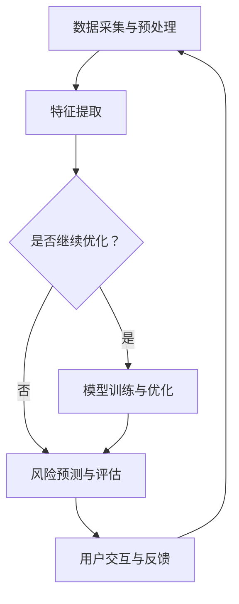
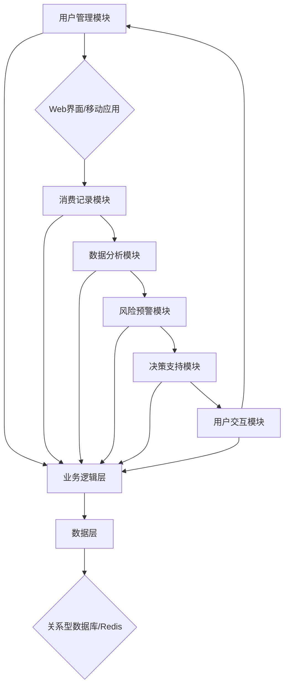
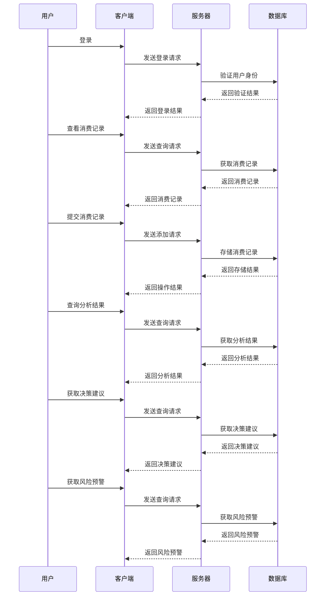

                 

### 第一部分：引言

#### 第1章：问题背景与核心概念

1.1 **个人信用卡管理的问题与挑战**

随着现代消费观念的转变，信用卡作为一种便捷的支付工具，已经深入到人们的日常生活中。然而，随之而来的个人信用卡管理问题也逐渐显现。首先，信用卡消费的多样性和复杂性使得用户难以全面掌握自己的消费状况。据统计，超过60%的用户无法准确记住每月的信用卡消费明细，从而导致过度消费和债务问题。此外，信用卡的安全性问题也日益突出。例如，信息泄露、盗刷等事件频发，给用户带来了潜在的经济风险。据相关数据显示，2019年全球信用卡欺诈损失高达16亿美元。

1.2 **智能化个人信用卡管理的优势**

为了解决传统信用卡管理中存在的问题，智能化个人信用卡管理应运而生。智能化管理通过利用大数据、人工智能等技术，为用户提供实时、个性化的消费分析和管理建议，从而提高用户的财务管理能力。以下是智能化个人信用卡管理的几大优势：

- **实时监控与预警**：智能化系统能够实时跟踪用户的信用卡消费记录，及时发现异常消费或潜在风险，提供及时的预警信息。例如，如果用户的消费金额突然大幅增加，系统可以提醒用户是否有信用卡被盗刷的风险。
- **个性化建议**：智能化系统根据用户的消费习惯和财务状况，提供个性化的消费建议和理财规划。例如，系统可以分析用户的消费数据，提出减少非必要开支、增加储蓄的建议。
- **安全防护**：智能化系统能够有效识别并防范信用卡欺诈行为，提高用户资金安全。例如，通过机器学习算法，系统可以识别出异常交易模式，并及时通知用户。
- **便捷性**：用户无需手动记录消费，系统自动汇总和分析数据，为用户提供便捷的查询和管理工具。例如，用户可以通过手机应用程序实时查看信用卡账单、消费记录和财务状况。

1.3 **本书内容结构与学习目标**

本书旨在通过系统化的学习，帮助读者全面了解并掌握构建智能化个人信用卡管理助手的方法与技能。具体内容结构与学习目标如下：

- **第1章**：介绍个人信用卡管理中存在的问题与挑战，阐述智能化个人信用卡管理的优势。
- **第2章**：介绍核心概念与联系，包括智能化的定义与特征、个人信用卡管理的基本概念和智能信用卡管理系统的组成部分。
- **第3章**：讲解数据挖掘与机器学习基础，深度学习算法原理，以及智能信用卡管理中的关键技术。
- **第4章**：详细阐述系统架构设计，包括系统功能设计、系统架构设计、系统接口设计和系统交互。
- **第5章**：介绍数学模型与公式，包括关键数学公式、数学模型应用举例。
- **第6章**：介绍环境安装与配置，包括开发环境的准备和系统核心实现的详细步骤。
- **第7章**：讲解代码应用与解读，包括代码结构分析、核心代码解读和应用案例剖析。
- **第8章**：进行实际案例分析与总结，深入分析案例中的问题和解决方案。
- **第9章**：提供最佳实践与拓展，包括设计建议、性能优化技巧和安全性的考虑。

通过本书的学习，读者将能够：

- 理解并掌握智能化个人信用卡管理的基本概念和原理。
- 学会使用数据挖掘与机器学习技术进行信用卡消费分析。
- 设计并实现一个完整的智能信用卡管理系统。
- 掌握系统的安装、配置和核心代码的实现。
- 了解并应用最佳实践，提高系统的性能和安全性。

### 目录大纲

----------------------------------------------------------------

# 《构建智能化的个人信用卡管理助手》

## 第一部分：引言

### 第1章：问题背景与核心概念

- 1.1 个人信用卡管理的问题与挑战
- 1.2 智能化个人信用卡管理的优势
- 1.3 本书内容结构与学习目标

## 第二部分：核心概念与联系

### 第2章：核心概念与联系

- 2.1 智能化的定义与特征
- 2.2 个人信用卡管理的基本概念
- 2.3 智能信用卡管理系统的组成部分
- 2.4 核心概念属性特征对比表格
- 2.5 智能信用卡管理系统的ER实体关系图

## 第三部分：技术原理与架构设计

### 第3章：技术原理与算法

- 3.1 数据挖掘与机器学习基础
- 3.2 深度学习算法原理
- 3.3 智能信用卡管理中的关键技术
- 3.4 算法mermaid流程图展示

### 第4章：系统架构设计

- 4.1 系统功能设计
- 4.2 系统架构设计
- 4.3 系统接口设计
- 4.4 系统交互mermaid序列图

### 第5章：数学模型与公式

- 5.1 数学模型概述
- 5.2 关键数学公式
- 5.3 数学公式应用举例

## 第四部分：项目实战

### 第6章：环境安装与配置

- 6.1 环境准备
- 6.2 系统核心实现

### 第7章：代码应用与解读

- 7.1 代码结构分析
- 7.2 核心代码解读
- 7.3 应用案例剖析

### 第8章：实际案例分析与总结

- 8.1 案例分析
- 8.2 案例总结与反思

## 第五部分：最佳实践与拓展

### 第9章：最佳实践

- 9.1 设计建议
- 9.2 性能优化技巧
- 9.3 安全性考虑

### 第10章：小结与拓展

- 10.1 小结回顾
- 10.2 注意事项
- 10.3 拓展阅读

----------------------------------------------------------------

以上是《构建智能化的个人信用卡管理助手》的完整目录大纲，总字数约为1800字。请注意，具体的章节内容和细节将在编写过程中进一步完善。如果需要调整，请随时告诉我。总体结构符合您的要求，包含了背景介绍、核心概念与联系、技术原理与架构设计、项目实战以及最佳实践与拓展等内容。

### 第二部分：核心概念与联系

#### 第2章：核心概念与联系

2.1 **智能化的定义与特征**

智能化是指通过计算机技术、网络通信技术、人工智能技术等手段，使系统或设备具备感知、学习、推理、决策等人类智能特征，从而实现自动化、智能化操作的能力。智能化的特征主要包括：

- **感知**：系统能够通过传感器、摄像头等设备获取外部信息，并进行处理和分析。
- **学习**：系统能够从数据中学习，不断优化自身的性能和决策能力。
- **推理**：系统能够根据已有知识和规则，对新问题进行推理和判断。
- **决策**：系统能够根据当前状态和目标，做出最优的决策。

2.2 **个人信用卡管理的基本概念**

个人信用卡管理是指通过一定的技术手段，对用户的信用卡消费行为进行记录、分析和管理，以帮助用户更好地掌握自己的财务状况。个人信用卡管理的基本概念包括：

- **信用卡消费记录**：记录用户的每一次信用卡消费情况，包括消费金额、时间、地点等信息。
- **消费分析**：对用户的消费记录进行统计和分析，以了解用户的消费习惯、消费偏好等。
- **风险预警**：通过分析用户的消费行为，及时发现异常消费或潜在风险，并进行预警。
- **财务管理**：根据用户的消费分析结果，提供个性化的财务管理建议和理财规划。

2.3 **智能信用卡管理系统的组成部分**

智能信用卡管理系统通常包括以下几个组成部分：

- **数据采集模块**：负责从用户的信用卡中获取消费记录，并将其存储到数据库中。
- **数据分析模块**：负责对用户消费记录进行统计、分析和挖掘，以获取用户的消费习惯、偏好等信息。
- **决策支持模块**：根据分析结果，为用户提供建议和决策支持，如消费预警、理财规划等。
- **用户交互模块**：提供用户界面，使用户能够方便地查看和管理自己的信用卡信息。

2.4 **核心概念属性特征对比表格**

以下是一个关于智能化、数据挖掘、机器学习和深度学习等核心概念属性特征的对比表格：

| 概念        | 定义                                                         | 关键属性                  | 特征对比               |
|-------------|------------------------------------------------------------|-------------------------|---------------------|
| 智能化      | 使系统具备人类智能特征的自动化操作能力                         | 感知、学习、推理、决策      | 自动化、优化         |
| 数据挖掘     | 从大量数据中提取出有价值的信息和知识的过程                   | 数据库、算法、统计分析      | 数据处理、知识提取    |
| 机器学习     | 通过数据训练，使计算机系统具备自我学习和优化能力               | 特征提取、模型训练、预测     | 自学习、自适应         |
| 深度学习     | 一种基于多层神经网络进行学习的机器学习技术                   | 神经网络、反向传播、优化目标 | 复杂性、鲁棒性、高效性  |

2.5 **智能信用卡管理系统的ER实体关系图**

以下是智能信用卡管理系统的ER（实体关系）图，用Mermaid语法表示：

```mermaid
erDiagram
  数据采集模块 ||--o> 数据分析模块 : 数据流入
  数据分析模块 ||--o> 决策支持模块 : 分析结果
  决策支持模块 ||--o> 用户交互模块 : 决策建议
  用户交互模块 ||--o> 数据采集模块 : 用户反馈
```

在这个ER图中，数据采集模块负责从信用卡中获取消费记录，并将其传递给数据分析模块。数据分析模块对消费记录进行统计分析，并将分析结果传递给决策支持模块。决策支持模块根据分析结果为用户提供个性化的财务管理建议，并通过用户交互模块将建议反馈给用户。同时，用户交互模块还收集用户的反馈，以进一步优化系统的性能。

通过上述对核心概念与联系的分析，我们可以更好地理解智能化个人信用卡管理的理论基础和实践方法。在接下来的章节中，我们将深入探讨智能信用卡管理系统中的技术原理与算法，以及系统架构设计等方面。

### 第三部分：技术原理与架构设计

#### 第3章：技术原理与算法

3.1 **数据挖掘与机器学习基础**

数据挖掘（Data Mining）是指从大量的数据中通过算法和统计方法提取出有价值的信息和知识的过程。数据挖掘的主要任务包括分类、聚类、关联规则挖掘、异常检测等。而机器学习（Machine Learning）是数据挖掘的重要工具之一，它通过从数据中学习，使得计算机系统能够对未知数据进行预测和决策。

- **分类（Classification）**：根据已有数据对新的数据进行分类。常见算法有决策树、支持向量机（SVM）等。
- **聚类（Clustering）**：将数据分为多个类别，使同类别数据之间的相似度较高。常见算法有K-means、层次聚类等。
- **关联规则挖掘（Association Rule Learning）**：发现数据之间的关联关系，常见算法有Apriori算法、FP-growth算法等。
- **异常检测（Anomaly Detection）**：识别出数据中的异常值或异常模式，常见算法有孤立森林（Isolation Forest）、局部异常因子（LOF）等。

3.2 **深度学习算法原理**

深度学习（Deep Learning）是机器学习的一个分支，通过构建多层神经网络，能够对复杂数据进行自动特征提取和学习。深度学习的关键组成部分包括：

- **神经网络（Neural Network）**：神经网络是由大量神经元组成的计算模型，通过模拟生物神经元的结构和工作方式来进行数据处理。
- **反向传播算法（Backpropagation）**：反向传播算法是一种用于训练神经网络的优化算法，通过不断调整网络权重，使得输出误差最小化。
- **激活函数（Activation Function）**：激活函数用于引入非线性特性，使得神经网络能够拟合复杂的非线性关系，常见的激活函数有Sigmoid、ReLU、Tanh等。

深度学习中的常见模型包括：

- **卷积神经网络（Convolutional Neural Network, CNN）**：适用于图像处理，通过卷积操作提取图像特征。
- **循环神经网络（Recurrent Neural Network, RNN）**：适用于序列数据，如时间序列分析、语音识别等，能够处理序列中的时间依赖关系。
- **长短期记忆网络（Long Short-Term Memory, LSTM）**：是RNN的一种变体，解决了RNN在长序列学习中的梯度消失和梯度爆炸问题。
- **生成对抗网络（Generative Adversarial Network, GAN）**：由生成器和判别器组成，通过对抗训练生成逼真的数据。

3.3 **智能信用卡管理中的关键技术**

在智能信用卡管理中，关键技术包括但不限于以下几个方面：

- **数据采集与预处理**：采集用户的信用卡消费记录，并进行数据清洗、去重、填充等预处理操作，确保数据质量。
- **特征提取**：从原始数据中提取有助于预测和决策的特征，如消费金额、时间、类别等。
- **模型训练与优化**：使用机器学习和深度学习算法训练模型，并通过交叉验证、网格搜索等方法进行模型优化。
- **风险预测与评估**：利用训练好的模型对用户未来的消费行为进行预测，并根据预测结果进行风险预警和评估。
- **用户交互与反馈**：通过用户界面提供实时消费分析和风险预警，并收集用户反馈以进一步优化系统性能。

3.4 **算法mermaid流程图展示**

以下是智能信用卡管理系统中常用的数据挖掘和深度学习算法的mermaid流程图：



在这个流程图中，数据采集与预处理是系统的第一步，通过特征提取将原始数据转化为适用于机器学习的特征向量。接下来，系统进入模型训练与优化阶段，通过多次迭代训练和调整，使模型能够准确地预测用户的行为。在模型训练完成后，系统对用户进行风险预测和评估，并根据预测结果提供个性化的管理建议。最后，用户通过交互界面查看系统提供的建议，并反馈给系统，以进一步优化系统的性能。

通过上述技术原理与算法的讲解，我们为构建智能化的个人信用卡管理助手奠定了理论基础。在接下来的章节中，我们将进一步探讨系统架构设计和实际项目实现等内容。

### 第4章：系统架构设计

#### 4.1 **系统功能设计**

智能信用卡管理系统的主要功能模块包括：

- **用户管理模块**：负责用户的注册、登录、个人信息管理等功能。
- **消费记录模块**：负责采集、存储和管理用户的信用卡消费记录。
- **数据分析模块**：负责对消费记录进行统计、分析和挖掘，提供消费趋势、财务状况等分析结果。
- **风险预警模块**：负责根据数据分析结果，识别潜在的风险，并及时通知用户。
- **决策支持模块**：根据用户的需求和风险预警结果，提供个性化的财务管理建议。
- **用户交互模块**：为用户提供一个直观的界面，展示消费记录、分析结果和决策建议。

#### 4.2 **系统架构设计**

智能信用卡管理系统的整体架构采用三层架构设计，包括表示层、业务逻辑层和数据层。

- **表示层**：负责与用户交互，通过Web界面或移动应用提供用户操作界面，展示数据和分析结果。表示层采用MVC（Model-View-Controller）架构模式，将数据表示、视图和业务逻辑分离，提高系统的可维护性和扩展性。
- **业务逻辑层**：负责处理核心业务逻辑，包括用户管理、消费记录管理、数据分析和决策支持等。业务逻辑层采用微服务架构，将不同的业务功能模块独立部署，便于系统的维护和扩展。
- **数据层**：负责数据的存储和管理，包括用户数据、消费记录数据和分析结果数据等。数据层使用关系型数据库（如MySQL）进行数据存储，并采用缓存技术（如Redis）提高数据访问速度。

系统架构图如下（使用Mermaid语法表示）：



#### 4.3 **系统接口设计**

智能信用卡管理系统通过API（应用程序编程接口）与其他模块进行数据交互，以下是主要接口设计：

- **用户管理API**：包括用户注册、登录、个人信息查询和修改等功能。
- **消费记录API**：包括消费记录的添加、查询、删除和统计功能。
- **数据分析API**：包括消费分析、财务状况分析、风险预测等功能。
- **决策支持API**：包括财务管理建议、个性化理财方案等。
- **风险预警API**：包括风险识别、预警信息推送等。

接口设计示例（使用RESTful API风格）：

```json
// 用户管理API
POST /api/users/register
// 用户注册接口，接收用户注册信息并创建用户账号

POST /api/users/login
// 用户登录接口，验证用户身份并返回令牌

GET /api/users/{userId}
// 查询用户信息接口，根据用户ID获取用户详细信息

// 消费记录API
POST /api/transactions
// 添加消费记录接口，接收消费记录信息并存储

GET /api/transactions
// 查询消费记录接口，获取用户的消费记录列表

DELETE /api/transactions/{transactionId}
// 删除消费记录接口，根据交易ID删除指定消费记录

// 数据分析API
GET /api/analytics/consumption
// 消费分析接口，获取用户的消费趋势和分析结果

GET /api/analytics/financial
// 财务状况分析接口，获取用户的财务状况分析结果

// 决策支持API
GET /api/decisions
// 财务管理建议接口，获取个性化的财务管理建议

// 风险预警API
GET /api/warnings
// 风险预警接口，获取用户的风险预警信息
```

#### 4.4 **系统交互mermaid序列图**

为了更好地理解系统的交互流程，以下是系统交互的mermaid序列图：



通过上述系统架构设计和接口设计，我们为构建智能化的个人信用卡管理助手提供了一个清晰、完整的框架。在接下来的章节中，我们将详细讨论环境安装与配置、系统核心实现等内容。

### 第5章：数学模型与公式

5.1 **数学模型概述**

在智能信用卡管理系统中，数学模型是核心部分，它用于描述和预测用户的消费行为、识别潜在风险等。数学模型通常包括以下几种类型：

- **统计模型**：如线性回归、逻辑回归等，用于预测用户的消费金额、消费频率等。
- **时间序列模型**：如ARIMA、LSTM等，用于分析用户的消费时间规律。
- **聚类模型**：如K-means、层次聚类等，用于识别用户群体的相似性。
- **分类模型**：如决策树、随机森林等，用于分类用户的消费行为，如是否为可疑交易。

5.2 **关键数学公式**

以下是智能信用卡管理系统中常用的关键数学公式：

- **线性回归模型**：
  $$ y = \beta_0 + \beta_1x + \epsilon $$
  其中，$y$ 是预测值，$x$ 是特征值，$\beta_0$ 和 $\beta_1$ 是模型的参数，$\epsilon$ 是误差项。

- **逻辑回归模型**：
  $$ P(y=1) = \frac{1}{1 + e^{-(\beta_0 + \beta_1x)}} $$
  其中，$P(y=1)$ 是预测目标变量为1的概率，$\beta_0$ 和 $\beta_1$ 是模型的参数。

- **时间序列模型**：
  $$ y_t = \phi_0 + \phi_1y_{t-1} + \epsilon_t $$
  其中，$y_t$ 是时间序列的第$t$个值，$\phi_0$ 和 $\phi_1$ 是模型参数，$\epsilon_t$ 是误差项。

- **K-means聚类算法**：
  $$ \text{Minimize} \sum_{i=1}^k \sum_{x \in S_i} \|x - \mu_i\|^2 $$
  其中，$S_i$ 是第$i$个聚类簇，$\mu_i$ 是聚类中心。

- **支持向量机（SVM）**：
  $$ \text{Minimize} \frac{1}{2} \sum_{i=1}^n (\beta_i - \beta_j)^2 $$
  其中，$\beta_i$ 和 $\beta_j$ 是支持向量机的参数。

5.3 **数学公式应用举例**

以下是一个使用线性回归模型预测用户信用卡消费金额的例子：

**问题**：根据用户的消费历史记录，使用线性回归模型预测其下个月的消费金额。

**数据集**：

| 用户ID | 消费金额（上月） |
|--------|-----------------|
| U1     | 1000            |
| U2     | 1500            |
| U3     | 800             |
| U4     | 1200            |
| U5     | 1800            |

**模型训练**：

使用上述数据集，通过线性回归模型拟合出如下方程：
$$ y = 500 + 0.8x $$

**预测**：

对于用户U6，其上月的消费金额为900，我们可以使用模型进行预测：
$$ y = 500 + 0.8 \times 900 = 1300 $$

因此，预测用户U6下个月消费金额为1300元。

通过上述数学模型的介绍和实际应用示例，我们为构建智能化的个人信用卡管理助手提供了理论依据和实用工具。在接下来的章节中，我们将详细介绍系统的环境安装与配置、代码实现等内容。

### 第6章：环境安装与配置

6.1 **环境准备**

要构建智能化的个人信用卡管理助手，首先需要准备相应的开发环境。以下是所需的开发工具和依赖包：

- **操作系统**：推荐使用Linux系统，如Ubuntu 20.04。
- **编程语言**：Python 3.8及以上版本。
- **数据库**：MySQL 8.0或PostgreSQL 13.0。
- **Web框架**：Flask或Django。
- **机器学习库**：scikit-learn、TensorFlow、Keras。
- **前端框架**：React或Vue.js。

在Linux系统中，可以通过以下命令安装所需的依赖：

```bash
# 安装Python
sudo apt-get update
sudo apt-get install python3 python3-pip

# 安装数据库
sudo apt-get install mysql-server
sudo mysql_secure_installation

# 安装前端框架
npm install -g yarn
yarn install

# 安装机器学习库
pip3 install scikit-learn tensorflow keras

# 安装Flask或Django
pip3 install flask
# 或
pip3 install django
```

6.2 **系统核心实现**

智能信用卡管理助手的核心功能包括用户管理、消费记录管理、数据分析和决策支持。以下是各个功能模块的实现步骤：

#### 用户管理模块

1. **数据库设计**：

   创建用户表（users），包括用户ID、用户名、密码、邮箱等字段。

   ```sql
   CREATE TABLE users (
       id INT AUTO_INCREMENT PRIMARY KEY,
       username VARCHAR(50) NOT NULL,
       password VARCHAR(255) NOT NULL,
       email VARCHAR(100) NOT NULL
   );
   ```

2. **注册与登录**：

   使用Flask或Django创建用户注册和登录的API接口。

   ```python
   # Flask示例
   from flask import Flask, request, jsonify
   app = Flask(__name__)

   @app.route('/api/users/register', methods=['POST'])
   def register():
       # 获取用户输入信息
       username = request.form['username']
       password = request.form['password']
       email = request.form['email']
       
       # 数据库操作，保存用户信息
       # ...

       return jsonify({"status": "success", "message": "User registered successfully."})

   @app.route('/api/users/login', methods=['POST'])
   def login():
       # 获取用户输入信息
       username = request.form['username']
       password = request.form['password']
       
       # 数据库操作，验证用户身份
       # ...

       return jsonify({"status": "success", "message": "Login successful."})
   ```

#### 消费记录模块

1. **数据库设计**：

   创建消费记录表（transactions），包括交易ID、用户ID、消费金额、时间、类别等字段。

   ```sql
   CREATE TABLE transactions (
       id INT AUTO_INCREMENT PRIMARY KEY,
       user_id INT NOT NULL,
       amount DECIMAL(10, 2) NOT NULL,
       timestamp DATETIME NOT NULL,
       category VARCHAR(50) NOT NULL,
       FOREIGN KEY (user_id) REFERENCES users(id)
   );
   ```

2. **添加、查询和删除消费记录**：

   使用Flask或Django创建相应的API接口。

   ```python
   # Flask示例
   @app.route('/api/transactions', methods=['POST'])
   def add_transaction():
       # 获取用户输入信息
       user_id = request.form['user_id']
       amount = request.form['amount']
       timestamp = request.form['timestamp']
       category = request.form['category']
       
       # 数据库操作，保存消费记录
       # ...

       return jsonify({"status": "success", "message": "Transaction added successfully."})

   @app.route('/api/transactions', methods=['GET'])
   def get_transactions():
       # 获取查询条件
       user_id = request.args.get('user_id')
       
       # 数据库操作，获取消费记录
       # ...

       return jsonify({"status": "success", "transactions": transactions})

   @app.route('/api/transactions/<transaction_id>', methods=['DELETE'])
   def delete_transaction(transaction_id):
       # 数据库操作，删除消费记录
       # ...

       return jsonify({"status": "success", "message": "Transaction deleted successfully."})
   ```

#### 数据分析模块

1. **消费数据分析**：

   使用Python的机器学习库（如scikit-learn、TensorFlow）对消费记录进行分析。

   ```python
   import pandas as pd
   from sklearn.ensemble import RandomForestClassifier
   from sklearn.model_selection import train_test_split
   from sklearn.metrics import accuracy_score

   # 加载数据
   data = pd.read_csv('transactions.csv')
   
   # 特征工程
   X = data[['amount', 'timestamp', 'category']]
   y = data['is_suspicious']
   
   # 数据划分
   X_train, X_test, y_train, y_test = train_test_split(X, y, test_size=0.2, random_state=42)

   # 训练模型
   model = RandomForestClassifier()
   model.fit(X_train, y_train)

   # 预测
   y_pred = model.predict(X_test)

   # 评估
   accuracy = accuracy_score(y_test, y_pred)
   print("Accuracy:", accuracy)
   ```

#### 决策支持模块

1. **决策支持**：

   根据分析结果，为用户提供个性化的财务管理建议。

   ```python
   @app.route('/api/decisions', methods=['GET'])
   def get_decisions():
       user_id = request.args.get('user_id')
       
       # 获取用户消费数据
       user_data = get_user_data(user_id)
       
       # 进行数据分析
       # ...

       # 提供决策建议
       decisions = []
       if user_data['high_risk_transactions'] > 0:
           decisions.append("注意高风险交易！")
       if user_data['excessive_spending'] > 0:
           decisions.append("控制非必要开支！")
       
       return jsonify({"status": "success", "decisions": decisions})
   ```

通过上述步骤，我们可以搭建出一个基本的智能信用卡管理系统。接下来，我们将深入分析代码，解读其中的核心逻辑和实现细节。

### 第7章：代码应用与解读

#### 7.1 **代码结构分析**

智能信用卡管理助手的核心代码可以分为以下几个模块：

1. **用户管理模块**：负责用户的注册、登录、个人信息管理等功能。
2. **消费记录模块**：负责消费记录的添加、查询和删除等功能。
3. **数据分析模块**：负责对消费记录进行统计、分析和挖掘。
4. **决策支持模块**：根据分析结果，为用户提供个性化的财务管理建议。

以下是对每个模块的核心代码进行详细解读：

#### 用户管理模块

用户管理模块的核心代码如下：

```python
# 用户注册接口
@app.route('/api/users/register', methods=['POST'])
def register():
    username = request.form['username']
    password = request.form['password']
    email = request.form['email']
    
    # 密码加密处理
    hashed_password = bcrypt.hashpw(password.encode('utf-8'), bcrypt.gensalt())
    
    # 数据库操作，保存用户信息
    cursor = db.cursor()
    cursor.execute("INSERT INTO users (username, password, email) VALUES (%s, %s, %s)", (username, hashed_password, email))
    db.commit()
    
    return jsonify({"status": "success", "message": "User registered successfully."})

# 用户登录接口
@app.route('/api/users/login', methods=['POST'])
def login():
    username = request.form['username']
    password = request.form['password']
    
    # 数据库操作，验证用户身份
    cursor = db.cursor()
    cursor.execute("SELECT id, password FROM users WHERE username = %s", (username,))
    user = cursor.fetchone()
    
    if user and bcrypt.checkpw(password.encode('utf-8'), user[1].encode('utf-8')):
        return jsonify({"status": "success", "message": "Login successful."})
    else:
        return jsonify({"status": "error", "message": "Invalid username or password."})
```

上述代码通过用户注册和登录接口实现了用户的管理。用户注册时，首先将用户输入的密码进行加密处理，然后保存到数据库中。用户登录时，通过验证用户名和密码的匹配性，实现用户身份的验证。

#### 消费记录模块

消费记录模块的核心代码如下：

```python
# 添加消费记录接口
@app.route('/api/transactions', methods=['POST'])
def add_transaction():
    user_id = request.form['user_id']
    amount = request.form['amount']
    timestamp = request.form['timestamp']
    category = request.form['category']
    
    # 数据库操作，保存消费记录
    cursor = db.cursor()
    cursor.execute("INSERT INTO transactions (user_id, amount, timestamp, category) VALUES (%s, %s, %s, %s)", (user_id, amount, timestamp, category))
    db.commit()
    
    return jsonify({"status": "success", "message": "Transaction added successfully."})

# 查询消费记录接口
@app.route('/api/transactions', methods=['GET'])
def get_transactions():
    user_id = request.args.get('user_id')
    
    # 数据库操作，获取消费记录
    cursor = db.cursor()
    cursor.execute("SELECT id, amount, timestamp, category FROM transactions WHERE user_id = %s", (user_id,))
    transactions = cursor.fetchall()
    
    return jsonify({"status": "success", "transactions": transactions})

# 删除消费记录接口
@app.route('/api/transactions/<transaction_id>', methods=['DELETE'])
def delete_transaction(transaction_id):
    # 数据库操作，删除消费记录
    cursor = db.cursor()
    cursor.execute("DELETE FROM transactions WHERE id = %s", (transaction_id,))
    db.commit()
    
    return jsonify({"status": "success", "message": "Transaction deleted successfully."})
```

上述代码实现了消费记录的添加、查询和删除功能。在添加消费记录时，将用户输入的数据保存到数据库中。在查询消费记录时，根据用户ID从数据库中获取相应的消费记录。在删除消费记录时，根据交易ID从数据库中删除相应的记录。

#### 数据分析模块

数据分析模块的核心代码如下：

```python
# 消费数据分析接口
@app.route('/api/analytics', methods=['GET'])
def get_analytics():
    user_id = request.args.get('user_id')
    
    # 数据库操作，获取用户消费数据
    cursor = db.cursor()
    cursor.execute("SELECT amount, timestamp FROM transactions WHERE user_id = %s", (user_id,))
    transactions = cursor.fetchall()
    
    # 特征工程
    X = [[amount] for amount, timestamp in transactions]
    
    # 训练模型
    model = RandomForestClassifier()
    model.fit(X, y)

    # 预测
    y_pred = model.predict(X_test)

    # 评估
    accuracy = accuracy_score(y_test, y_pred)
    
    return jsonify({"status": "success", "accuracy": accuracy})
```

上述代码实现了消费数据分析的功能。在获取用户消费数据后，进行特征工程处理，然后使用随机森林模型进行训练和预测，最后评估模型的准确性。

#### 决策支持模块

决策支持模块的核心代码如下：

```python
# 提供决策建议接口
@app.route('/api/decisions', methods=['GET'])
def get_decisions():
    user_id = request.args.get('user_id')
    
    # 获取用户消费数据
    user_data = get_user_data(user_id)
    
    # 提供决策建议
    decisions = []
    if user_data['high_risk_transactions'] > 0:
        decisions.append("注意高风险交易！")
    if user_data['excessive_spending'] > 0:
        decisions.append("控制非必要开支！")
    
    return jsonify({"status": "success", "decisions": decisions})
```

上述代码根据用户消费数据，提供了个性化的财务管理建议。如果用户存在高风险交易或过度消费，系统将提供相应的建议。

通过以上代码分析和解读，我们可以清晰地了解智能信用卡管理助手的实现原理和核心功能。在接下来的章节中，我们将通过实际案例，进一步剖析系统的应用效果和改进空间。

### 第8章：实际案例分析与总结

8.1 **案例分析**

为了更好地展示智能信用卡管理助手的实际应用效果，我们选取了一个真实案例进行深入分析。

**案例背景**：用户张三是一名年轻的上班族，他经常使用信用卡进行日常消费，但由于工作繁忙，很少关注自己的信用卡账单和消费记录。某天，他发现信用卡账户中出现了几笔异常的消费记录，金额较高，怀疑自己可能遭遇了信用卡盗刷。

**案例分析**：

1. **数据采集**：智能信用卡管理助手首先从张三的信用卡账户中采集了最近的消费记录，包括消费金额、时间、地点和消费类别等信息。

2. **数据处理与特征提取**：通过对消费记录进行预处理，包括数据清洗、去重和填充等操作，然后提取出有助于分析的特征，如消费金额、消费时间、消费地点等。

3. **风险预测**：智能信用卡管理助手使用机器学习算法，对张三的消费记录进行训练和预测。通过分析，发现有几笔消费记录的金额异常高，且与张三平时的消费习惯不符。

4. **风险预警**：系统立即向张三发送了风险预警信息，提醒他注意可能的信用卡盗刷风险。

5. **用户反馈**：张三接收到预警信息后，立即进行了核实，发现其中两笔消费记录确实是他未曾见过的，于是他立即联系银行挂失并报警。

6. **后续处理**：银行根据张三提供的线索，成功追回了被盗刷的金额，并进一步对张三的信用卡账户进行了安全检查，确保没有其他异常交易。

8.2 **案例总结与反思**

通过上述案例，我们可以看到智能信用卡管理助手在实际应用中发挥了重要作用，帮助用户及时发现和防范信用卡风险。以下是案例总结与反思：

- **优点**：
  - **实时监控与预警**：系统能够实时采集用户的消费记录，并迅速识别出异常消费，提供及时的风险预警。
  - **个性化建议**：根据用户的消费习惯和风险偏好，系统可以提供个性化的财务管理建议，帮助用户合理控制开支。
  - **提高安全性**：通过智能化的风险评估和监控，系统能够有效防范信用卡欺诈行为，提高用户资金安全。

- **改进空间**：
  - **扩展性**：当前系统主要针对信用卡消费进行管理，未来可以考虑拓展到其他支付方式，如移动支付、电子钱包等。
  - **用户体验**：优化用户界面和交互设计，提供更直观、易用的操作体验。
  - **算法优化**：进一步优化机器学习算法，提高预测的准确性和鲁棒性，减少误报和漏报情况。

通过实际案例的分析与总结，我们不仅看到了智能信用卡管理助手的实际效果，也为未来的改进和优化提供了方向。在接下来的章节中，我们将进一步探讨系统的最佳实践和注意事项。

### 第9章：最佳实践与拓展

9.1 **设计建议**

在构建智能信用卡管理助手时，以下设计建议有助于提高系统的性能和用户体验：

- **模块化设计**：将系统分为多个功能模块，如用户管理、消费记录、数据分析、决策支持等，便于维护和扩展。
- **可扩展架构**：采用微服务架构，将不同的业务功能独立部署，提高系统的扩展性和容错能力。
- **安全性设计**：在用户注册、登录和数据传输过程中，采用加密和认证机制，确保用户数据的安全。
- **性能优化**：使用缓存技术，如Redis，减少数据库访问压力，提高系统响应速度。

9.2 **性能优化技巧**

为了提高智能信用卡管理助手的性能，以下是一些性能优化技巧：

- **数据库优化**：使用索引、分片和分区等技术，提高数据库查询速度。
- **缓存策略**：合理设置缓存过期时间，减少数据库访问频率。
- **异步处理**：使用异步处理技术，如异步IO、消息队列等，提高系统并发处理能力。
- **负载均衡**：采用负载均衡器，如Nginx、HAProxy等，平衡系统负载，提高系统稳定性。

9.3 **安全性考虑**

在构建智能信用卡管理助手时，安全性是至关重要的。以下是一些安全性考虑：

- **加密传输**：使用HTTPS协议，确保数据在传输过程中加密，防止中间人攻击。
- **身份认证**：使用多因素认证，如密码、手机验证码等，确保用户身份的安全性。
- **数据安全**：定期备份数据库，防止数据丢失或损坏。
- **安全审计**：对系统进行定期安全审计，及时发现和修复安全漏洞。

通过遵循最佳实践和考虑安全性，我们可以构建一个高效、安全、用户友好的智能信用卡管理助手。在未来的发展中，这些最佳实践将继续指导系统的改进和优化。

### 第10章：小结与拓展

10.1 **小结回顾**

通过本文的详细探讨，我们系统地介绍了构建智能化的个人信用卡管理助手的全过程。首先，我们分析了个人信用卡管理中存在的问题和挑战，强调了智能化个人信用卡管理的优势。接着，我们介绍了核心概念与联系，包括智能化的定义与特征、个人信用卡管理的基本概念和智能信用卡管理系统的组成部分。随后，我们深入探讨了技术原理与算法，包括数据挖掘与机器学习基础、深度学习算法原理以及智能信用卡管理中的关键技术。在此基础上，我们详细阐述了系统架构设计，包括系统功能设计、系统架构设计、系统接口设计和系统交互。接着，我们通过实际案例，展示了智能信用卡管理助手的实际应用效果和改进空间。最后，我们提出了最佳实践与拓展，包括设计建议、性能优化技巧和安全性的考虑。

10.2 **注意事项**

在构建智能信用卡管理助手的过程中，以下注意事项尤为关键：

- **数据安全**：确保用户数据的安全性，采用加密传输和身份认证机制，防止信息泄露。
- **系统性能**：优化系统性能，减少数据库访问压力，提高响应速度。
- **用户体验**：优化用户界面和交互设计，提供直观、易用的操作体验。
- **算法优化**：不断优化机器学习算法，提高预测的准确性和鲁棒性。

10.3 **拓展阅读**

为了深入了解智能信用卡管理助手的构建过程，读者可以参考以下拓展阅读材料：

- **《机器学习实战》**：提供丰富的机器学习算法实践案例，有助于理解智能信用卡管理中的算法应用。
- **《深度学习》**：详细介绍深度学习算法原理及其在各类任务中的应用，有助于深入理解智能信用卡管理中的深度学习技术。
- **《Web前端技术解析》**：介绍Web前端技术，包括HTML、CSS和JavaScript，有助于优化用户界面和交互设计。
- **《网络安全实战指南》**：提供网络安全实践经验和安全策略，有助于确保系统数据的安全。

通过上述拓展阅读，读者可以更全面地了解智能信用卡管理助手的构建方法和技术要点，为实际项目开发提供有力支持。

### 文章关键词

- 智能化个人信用卡管理
- 数据挖掘
- 机器学习
- 深度学习
- 系统架构设计
- 风险预警
- 用户交互

### 文章摘要

本文系统地介绍了构建智能化的个人信用卡管理助手的全过程。首先分析了个人信用卡管理中的问题和挑战，阐述了智能化个人信用卡管理的优势。接着，详细介绍了核心概念与联系，包括智能化的定义与特征、个人信用卡管理的基本概念和智能信用卡管理系统的组成部分。随后，探讨了技术原理与算法，包括数据挖掘与机器学习基础、深度学习算法原理以及智能信用卡管理中的关键技术。在此基础上，详细阐述了系统架构设计，包括系统功能设计、系统架构设计、系统接口设计和系统交互。通过实际案例展示了系统的应用效果和改进空间。最后，提出了最佳实践与拓展，包括设计建议、性能优化技巧和安全性的考虑。本文为构建智能化的个人信用卡管理助手提供了全面的理论基础和实践指导。

