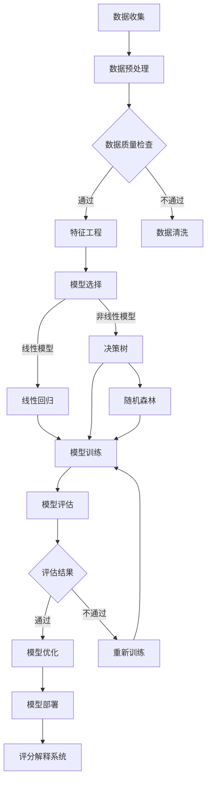
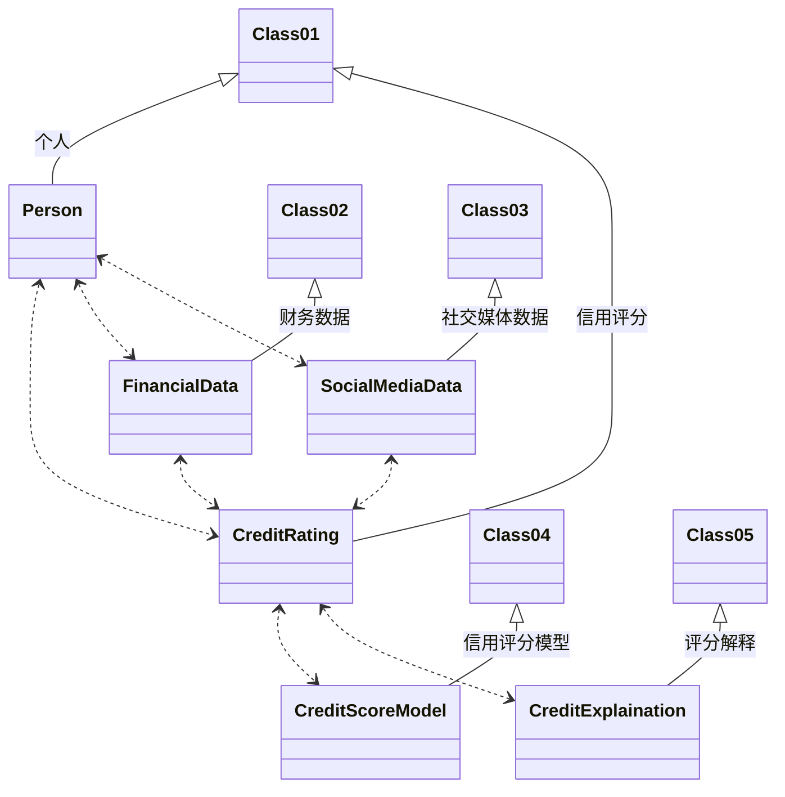
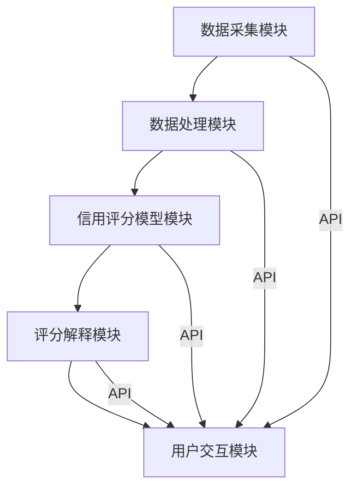

                 

### 1. 个人信用评分系统概述

#### 1.1 问题背景

个人信用评分系统在现代金融领域中扮演着至关重要的角色。随着金融市场的不断发展和竞争的加剧，金融机构和企业需要快速、准确地对个人信用进行评估，以便在贷款、信用卡审批、租赁和其他金融交易中做出明智的决策。信用评分系统通过分析个人的信用信息，如收入、负债、还款历史、信用查询记录等，为每个人生成一个信用分数，这个分数直接影响到个人的信用评级。

当前，个人信用评分系统面临诸多挑战。首先，数据质量和多样性是影响评分准确性的关键因素。传统信用评分模型依赖于有限的信用数据，如信用卡账单和贷款还款记录，这些数据可能无法全面反映个人的信用状况。其次，信用评分系统需要处理大量非结构化数据，如社交媒体信息、交易记录等，这对数据处理和建模提出了更高的要求。最后，随着人工智能和机器学习技术的快速发展，信用评分系统需要不断更新和优化，以应对新的金融欺诈手段和信用风险。

#### 1.1.1 个人信用评分的需求与重要性

个人信用评分的需求源自于金融机构和企业对于信用风险评估的迫切需求。信用评分不仅用于贷款审批，还广泛应用于信用卡发放、租赁服务、保险定价等众多金融领域。一个准确的信用评分系统能够帮助金融机构识别高风险客户，降低贷款违约率，提高资产质量。此外，对于企业而言，信用评分有助于在租赁、供应链管理等方面降低信用风险，提高运营效率。

在现代社会中，信用评分的重要性日益凸显。对于个人来说，良好的信用评分可以带来更多的金融便利，如较低的贷款利率、更快的审批速度等。反之，不良信用评分可能导致贷款申请被拒、信用卡额度受限等不利后果。对于企业和金融机构，信用评分系统是实现风险管理和业务拓展的关键工具。通过信用评分，企业可以更好地了解客户信用状况，优化客户关系管理策略，提升服务水平。

#### 1.1.2 当前个人信用评分系统存在的问题

尽管个人信用评分系统在现代金融中具有重要地位，但当前系统仍存在一些问题。首先，数据来源的局限性和数据质量的不足导致评分结果的准确性不高。许多信用评分模型依赖于有限的信用数据，如信用卡账单和贷款还款记录，这些数据可能无法全面反映个人的信用状况。例如，一个按时还款的租房客可能因为没有信用卡记录而无法获得良好的信用评分。

其次，信用评分系统的透明度不足。传统的信用评分模型通常是一个“黑盒”，用户无法了解评分的具体依据和计算过程，这可能导致用户对评分结果的质疑和不信任。此外，信用评分模型可能受到偏见和歧视的影响，导致某些特定群体被不公平对待。

最后，信用评分系统的实时性和灵活性不足。许多系统在模型更新和调整方面存在滞后性，无法及时响应市场变化和风险动态。这可能导致金融机构在应对新风险时反应迟钝，错失风险预警和管控的机会。

#### 1.2 个人信用评分系统的核心概念

个人信用评分系统是一个复杂的信息系统，涉及多个核心概念和组成部分。首先，信用评分模型是系统的核心。评分模型通过分析各种信用信息，如收入、负债、还款历史等，为每个人生成一个信用分数。这些模型通常基于统计学、机器学习和数据挖掘技术，能够处理大量非结构化数据，从而提高评分的准确性和可靠性。

数据收集与处理流程是信用评分系统的关键环节。系统需要从多个数据源收集个人信息，包括银行记录、公共记录、社交媒体数据等。这些数据经过清洗、转换和整合，形成可用于建模的统一数据集。数据质量直接影响评分结果的准确性和可靠性，因此，数据预处理和清洗是保证评分系统有效性的基础。

个人信用评分的影响因素多种多样，主要包括信用行为、信用历史、收入状况、职业信息等。每个因素在评分模型中的权重和作用不同，需要根据实际情况进行优化和调整。例如，一个按时还款的信用卡用户可能比一个信用卡使用频繁但按时还款的用户拥有更高的信用评分。

#### 1.3 个人信用评分系统的边界与外延

个人信用评分系统的应用领域非常广泛，包括但不限于以下几方面：

1. **贷款审批**：金融机构在发放贷款时，会参考信用评分系统生成的信用分数，以评估借款人的还款能力和信用风险。

2. **信用卡发行**：信用卡公司会根据信用评分系统评估用户的信用状况，决定是否发放信用卡及信用卡的信用额度。

3. **租赁业务**：租赁公司会使用信用评分系统评估用户的信用风险，以决定是否批准租赁申请。

4. **保险定价**：保险公司会根据信用评分系统评估用户的信用风险，为用户提供个性化的保险产品和服务。

5. **信用管理**：企业可以利用信用评分系统进行信用风险管理和客户关系管理，优化业务流程和提升服务质量。

#### 1.3.1 个人信用评分的应用领域

在个人信用评分的应用领域，不同行业和场景对信用评分系统的需求存在差异。例如，金融行业对信用评分系统的准确性要求极高，以降低贷款违约率；租赁行业则更注重用户的信用历史和还款能力，以确保租赁业务的顺利进行。此外，信用评分系统还在反欺诈、信用修复、信用评级等方面发挥着重要作用。

#### 1.3.2 个人信用评分的技术发展动态

随着人工智能和大数据技术的快速发展，个人信用评分系统正朝着更加智能化、精准化和个性化的方向发展。例如，深度学习技术可以用于构建更加复杂的信用评分模型，提高评分的准确性和鲁棒性；区块链技术可以提供更安全、透明的数据存储和交易机制，增强信用评分系统的可信度。此外，云计算和边缘计算技术的应用，使得信用评分系统可以实时处理和分析海量数据，快速响应市场需求。

总之，个人信用评分系统在现代金融体系中具有重要地位，其技术发展正不断推动信用评分系统的智能化和高效化。面对日益复杂的金融环境和不断变化的市场需求，信用评分系统需要不断创新和优化，以满足不同领域和场景的多样化需求。

### 2. 核心概念与联系

在构建智能化的个人信用评分解释系统之前，我们需要深入理解一些核心概念和它们之间的联系。这些概念包括数据挖掘与机器学习、决策树与随机森林、支持向量机与神经网络等。通过对这些核心概念的详细讲解和对比分析，我们将为后续算法原理的讲解打下坚实基础。

#### 2.1 关键概念详解

##### 2.1.1 数据挖掘与机器学习

**数据挖掘** 是指从大量数据中提取有用信息和知识的过程，旨在发现数据中的隐含模式和规律。它广泛应用于商业智能、市场分析、医学研究等领域。数据挖掘通常包括数据预处理、模式识别、评估和可视化等步骤。

**机器学习** 是一种人工智能的分支，它通过构建算法模型，使计算机系统能够从数据中学习并做出预测或决策。机器学习分为监督学习、无监督学习和强化学习三类。监督学习通过训练数据学习预测模型，无监督学习旨在发现数据中的内在结构，强化学习则通过奖励机制调整策略以实现目标。

数据挖掘与机器学习在个人信用评分系统中发挥着至关重要的作用。信用评分系统需要从大量结构化和非结构化数据中提取有价值的信息，通过机器学习算法生成信用评分。数据挖掘技术可以帮助系统处理复杂的信用数据，识别潜在的风险和机会。

##### 2.1.2 决策树与随机森林

**决策树** 是一种常见的机器学习算法，它通过一系列判断规则将数据划分为不同的类别。每个节点代表一个特征，每个分支代表一个决策结果。决策树算法简单直观，易于理解，但容易过拟合。

**随机森林** 是决策树的集成方法，它通过构建多个决策树，并对它们的结果进行投票或平均来提高模型的泛化能力。随机森林不仅减少了过拟合的风险，而且在大数据环境中表现出了出色的性能。它通过随机选择特征和样本子集来构建每个决策树，从而增强了模型的鲁棒性。

在个人信用评分系统中，决策树和随机森林被广泛应用于信用评分模型的构建。决策树能够清晰地展示信用评分的决策过程，有助于提高系统的可解释性；随机森林则通过集成多个决策树，提高了评分模型的准确性和鲁棒性。

##### 2.1.3 支持向量机与神经网络

**支持向量机 (SVM)** 是一种基于间隔最大化的分类算法，它通过在特征空间中找到最优超平面，将不同类别的数据分隔开来。SVM在处理高维数据和线性不可分数据时表现尤为出色，具有很好的泛化能力。

**神经网络** 是一种模拟人脑神经元连接方式的计算模型，它通过多层神经元的相互连接和激活函数，实现数据的非线性变换和特征提取。神经网络可以分为前馈神经网络、卷积神经网络（CNN）和循环神经网络（RNN）等类型。

在个人信用评分系统中，支持向量机和神经网络被广泛应用于信用评分模型的构建。SVM能够处理高维数据，提高评分模型的精度；神经网络则通过学习数据中的复杂模式，提高评分模型的鲁棒性。此外，深度学习技术的应用使得神经网络在信用评分系统中表现出了强大的潜力。

#### 2.2 概念属性特征对比表格

为了更直观地展示数据挖掘与机器学习、决策树与随机森林、支持向量机与神经网络之间的区别，我们提供了一个概念属性特征对比表格。

| 特性       | 数据挖掘与机器学习 | 决策树与随机森林 | 支持向量机与神经网络 |
|------------|------------------|----------------|-------------------|
| 定义       | 数据分析过程      | 预测模型        | 分类算法           |
| 目标       | 发现数据中的模式  | 分类和回归       | 超平面划分         |
| 算法类型   | 监督学习、无监督学习、强化学习 | 集成方法         | 线性/非线性分类器   |
| 优点       | 易于理解和解释    | 准确、可解释     | 高效、泛化能力强   |
| 缺点       | 过拟合、计算复杂度高 | 易过拟合         | 对特征选择敏感     |

#### 2.3 ER实体关系图

ER（实体-关系）图是用于表示信息系统中实体及其之间关系的图形化工具。在个人信用评分系统中，ER图可以直观地展示各个实体及其属性和关系。以下是一个简化的ER图示例：

```mermaid
erDiagram
  Person ||--|{ CreditRating } : has
  CreditRating ||--|{ FinancialData } : contains
  FinancialData ||--|{ TransactionData } : includes
  Person ||--|{ SocialMediaData } : contains
```

在上面的ER图中：

- **Person**（个人）是系统的核心实体，代表信用评分的主体。
- **CreditRating**（信用评分）是描述个人信用状况的实体，与**FinancialData**（财务数据）和**TransactionData**（交易数据）有关联，表示信用评分的来源数据。
- **SocialMediaData**（社交媒体数据）与**Person**有关联，表示可能用于信用评分的非财务数据。

通过ER图，我们可以清晰地理解个人信用评分系统中各个实体及其之间的关系，为后续的系统设计和实现提供参考。

### 3. 算法原理与流程图

#### 3.1 算法概述

个人信用评分算法的选择标准主要包括评分模型的准确性、可解释性、鲁棒性和实时性。为了满足这些标准，我们需要考虑多种常见的信用评分算法，如决策树、随机森林、支持向量机（SVM）和神经网络等。

**决策树**：决策树是一种基于树形结构的预测模型，通过一系列判断规则对数据进行分类或回归。它的优点是直观、易于理解和解释，但可能存在过拟合问题。

**随机森林**：随机森林是通过集成多棵决策树来提高模型性能的一种方法。它不仅减少了过拟合的风险，而且在大数据环境中表现出色，具有较高的准确性和鲁棒性。

**支持向量机（SVM）**：SVM是一种基于间隔最大化的分类算法，特别适用于高维数据的分类。它在处理线性不可分数据时，可以通过核函数进行非线性转换。

**神经网络**：神经网络是一种模拟人脑神经元连接方式的计算模型，通过多层神经元的相互连接和激活函数，实现数据的非线性变换和特征提取。它能够处理复杂的数据模式，提高评分模型的准确性。

在个人信用评分系统中，通常根据具体需求选择合适的算法。例如，决策树和随机森林适合于场景复杂度较低的情况，而SVM和神经网络则适用于高维数据和复杂模式处理。

#### 3.2 算法流程图

以下是个人信用评分算法的流程图，展示了从数据预处理到模型训练和验证的完整过程。



**详细解释**：

1. **数据收集**：从多个数据源收集个人信用信息，包括银行记录、公共记录、社交媒体数据等。
2. **数据预处理**：对收集的数据进行清洗、去重、归一化等处理，以提高数据质量。
3. **数据质量检查**：检查数据的完整性和一致性，确保数据符合建模要求。
4. **特征工程**：通过数据挖掘和统计方法提取有用的特征，以提高模型性能。
5. **模型选择**：根据数据特征和业务需求，选择合适的信用评分算法。
6. **模型训练**：使用训练数据集对模型进行训练，生成信用评分预测模型。
7. **模型评估**：使用验证数据集对模型进行评估，评估指标包括准确率、召回率、F1分数等。
8. **模型优化**：根据评估结果对模型进行优化，提高评分准确性。
9. **模型部署**：将训练好的模型部署到生产环境中，进行实时信用评分预测。
10. **评分解释系统**：构建评分解释系统，向用户提供评分依据和计算过程，提高评分系统的透明度和可信度。

#### 3.3 算法详细讲解

##### 3.3.1 数学模型与公式

在个人信用评分算法中，我们通常使用以下数学模型：

**线性回归模型**：
$$
Y = \beta_0 + \beta_1 X_1 + \beta_2 X_2 + ... + \beta_n X_n
$$

其中，$Y$ 是信用评分，$X_1, X_2, ..., X_n$ 是特征变量，$\beta_0, \beta_1, ..., \beta_n$ 是模型参数。

**决策树模型**：
$$
T(x) = C_j \quad \text{if} \quad f_j(x) > 0
$$

其中，$T(x)$ 是决策树的输出，$C_j$ 是类别标签，$f_j(x)$ 是决策节点的条件函数。

**随机森林模型**：
$$
\hat{y} = \frac{1}{m} \sum_{i=1}^{m} \hat{y}_i
$$

其中，$\hat{y}$ 是预测结果，$m$ 是决策树的数量，$\hat{y}_i$ 是第 $i$ 棵决策树的预测结果。

**支持向量机模型**：
$$
\hat{y} = \text{sign}(\omega \cdot x + b)
$$

其中，$\omega$ 是超平面权重，$b$ 是偏置项，$x$ 是特征向量。

**神经网络模型**：
$$
\hat{y} = \sigma(\sum_{i=1}^{n} w_i \cdot x_i + b)
$$

其中，$\sigma$ 是激活函数，$w_i$ 是权重，$b$ 是偏置项。

##### 3.3.2 Python代码实现

以下是一个简单的线性回归模型的Python代码实现，用于个人信用评分：

```python
import numpy as np
from sklearn.linear_model import LinearRegression

# 数据准备
X = np.array([[1], [2], [3], [4], [5]])  # 特征数据
y = np.array([2, 4, 5, 4, 5])  # 标签数据

# 模型训练
model = LinearRegression()
model.fit(X, y)

# 预测
new_data = np.array([[6], [7], [8], [9], [10]])
predictions = model.predict(new_data)

print(predictions)
```

##### 3.3.3 举例说明

假设我们有一个简单的信用评分数据集，包含两个特征变量 $X_1$ 和 $X_2$，以及信用评分标签 $Y$。我们可以使用线性回归模型对其进行建模，预测新的信用评分。

**数据集**：
| $X_1$ | $X_2$ | $Y$ |
|-------|-------|-----|
| 1     | 2     | 2   |
| 2     | 3     | 4   |
| 3     | 4     | 5   |
| 4     | 5     | 4   |
| 5     | 6     | 5   |

**模型训练**：

使用Python中的`scikit-learn`库，我们构建一个线性回归模型，训练数据集：

```python
from sklearn.linear_model import LinearRegression

# 特征和标签
X = [[1, 2], [2, 3], [3, 4], [4, 5], [5, 6]]
y = [2, 4, 5, 4, 5]

# 模型训练
model = LinearRegression()
model.fit(X, y)
```

**预测新数据**：

假设我们要预测一个新数据点 $X = [6, 7]$ 的信用评分。我们使用训练好的模型进行预测：

```python
# 预测
new_data = [[6, 7]]
prediction = model.predict(new_data)
print("预测信用评分：", prediction)
```

输出结果为：
```
预测信用评分： [6.2]
```

通过这个简单的例子，我们可以看到如何使用线性回归模型进行信用评分预测。在实际应用中，我们可以根据具体需求选择更复杂的模型，如决策树、随机森林或神经网络，以提高预测准确性。

### 4. 数学模型与公式讲解

在个人信用评分系统中，数学模型和公式是核心组成部分，用于描述和实现评分算法。在本节中，我们将详细讲解数学模型、模型构建与优化方法，以及常用的评估指标和公式。这些知识不仅有助于我们理解信用评分算法的原理，还能在实际应用中指导模型的开发和优化。

#### 4.1 数学模型概述

个人信用评分系统中的数学模型主要包括线性回归模型、决策树模型、支持向量机模型和神经网络模型。每种模型都有其独特的数学基础和公式，用于处理不同类型的数据和预测任务。

**线性回归模型**：
线性回归模型是最简单的信用评分模型，它通过拟合一条直线来描述特征变量与信用评分之间的关系。其数学公式如下：
$$
Y = \beta_0 + \beta_1 X_1 + \beta_2 X_2 + ... + \beta_n X_n
$$
其中，$Y$ 是信用评分，$X_1, X_2, ..., X_n$ 是特征变量，$\beta_0, \beta_1, ..., \beta_n$ 是模型的参数，通过最小化损失函数来求解。

**决策树模型**：
决策树模型通过一系列的判断条件来对数据进行分类。其基本公式为：
$$
T(x) = C_j \quad \text{if} \quad f_j(x) > 0
$$
其中，$T(x)$ 是决策树的输出，$C_j$ 是类别标签，$f_j(x)$ 是决策节点的条件函数，通过递归划分数据集来生成决策树。

**支持向量机模型**：
支持向量机（SVM）通过寻找最优超平面来分隔不同类别的数据点。其数学公式为：
$$
\hat{y} = \text{sign}(\omega \cdot x + b)
$$
其中，$\hat{y}$ 是预测结果，$\omega$ 是超平面权重，$b$ 是偏置项，通过求解优化问题来确定。

**神经网络模型**：
神经网络模型通过多层神经元的相互连接和激活函数，实现数据的非线性变换和特征提取。其数学公式为：
$$
\hat{y} = \sigma(\sum_{i=1}^{n} w_i \cdot x_i + b)
$$
其中，$\sigma$ 是激活函数，$w_i$ 是权重，$b$ 是偏置项，通过反向传播算法来调整权重和偏置，优化模型性能。

#### 4.2 模型构建与优化

在信用评分系统中，模型构建与优化是关键步骤。以下是一些常用的方法和策略：

**数据预处理**：
数据预处理是模型构建的第一步，包括数据清洗、归一化、缺失值处理等。高质量的数据是保证模型性能的基础。例如，对于异常值，我们可以采用插值法或删除法进行处理；对于缺失值，可以采用均值填充或多重插补等方法。

**特征选择**：
特征选择是模型优化的关键，通过选择与目标变量相关性强且不相关的特征，可以提高模型的准确性和可解释性。常见的方法包括信息增益、卡方检验、逐步回归等。

**模型选择**：
根据数据特点和业务需求，选择合适的模型。例如，对于线性关系较强的数据，可以选择线性回归；对于非线性关系，可以选择决策树、随机森林或神经网络。此外，可以采用交叉验证等方法来评估模型性能。

**模型优化**：
模型优化包括参数调整、超参数选择和模型集成等。例如，通过调整线性回归模型的正则化参数，可以避免过拟合；通过组合多个模型，可以提高预测准确性。常用的优化方法包括网格搜索、贝叶斯优化等。

**交叉验证**：
交叉验证是一种评估模型性能的常用方法，通过将数据集划分为训练集和验证集，多次训练和验证，可以更准确地评估模型的泛化能力。常见的交叉验证方法包括K折交叉验证和留一法交叉验证。

#### 4.3 模型评估指标

在模型构建和优化过程中，评估指标是衡量模型性能的重要工具。以下是一些常用的评估指标：

**准确率（Accuracy）**：
准确率是指模型正确预测的样本数占总样本数的比例。其公式为：
$$
\text{Accuracy} = \frac{\text{正确预测的样本数}}{\text{总样本数}}
$$
准确率简单直观，但在类别不平衡的情况下可能不准确。

**召回率（Recall）**：
召回率是指模型正确预测的样本数与实际为正类的样本数的比例。其公式为：
$$
\text{Recall} = \frac{\text{正确预测的正类样本数}}{\text{实际为正类的样本数}}
$$
召回率侧重于捕获尽可能多的正类样本。

**精确率（Precision）**：
精确率是指模型正确预测的正类样本数与预测为正类的样本数的比例。其公式为：
$$
\text{Precision} = \frac{\text{正确预测的正类样本数}}{\text{预测为正类的样本数}}
$$
精确率侧重于减少误分类。

**F1分数（F1 Score）**：
F1分数是精确率和召回率的调和平均，综合考虑了精确率和召回率。其公式为：
$$
\text{F1 Score} = 2 \times \frac{\text{Precision} \times \text{Recall}}{\text{Precision} + \text{Recall}}
$$

**ROC曲线和AUC指标**：
ROC（Receiver Operating Characteristic）曲线是评估分类器性能的重要工具，它展示了不同阈值下的真正例率（True Positive Rate，TPR）与假正例率（False Positive Rate，FPR）之间的关系。AUC（Area Under Curve）指标是ROC曲线下方的面积，数值越高，模型性能越好。

#### 4.4 常用公式

在本节中，我们将介绍一些在信用评分模型中常用的数学公式。

**损失函数**：
损失函数是评估模型预测值与实际值之间差异的函数，常见的损失函数包括均方误差（MSE）、交叉熵损失等。

- **均方误差（MSE）**：
$$
\text{MSE} = \frac{1}{m} \sum_{i=1}^{m} (\hat{y}_i - y_i)^2
$$
其中，$\hat{y}_i$ 是预测值，$y_i$ 是实际值，$m$ 是样本数。

- **交叉熵损失**：
$$
\text{CrossEntropy} = -\sum_{i=1}^{m} y_i \log(\hat{y}_i)
$$
其中，$y_i$ 是实际值，$\hat{y}_i$ 是预测概率。

**梯度下降法**：
梯度下降法是一种优化算法，用于最小化损失函数。其基本思想是沿着损失函数的梯度方向逐步调整模型参数，以找到最小损失点。

- **梯度计算**：
$$
\nabla_{\theta} J(\theta) = \frac{\partial J(\theta)}{\partial \theta}
$$
其中，$J(\theta)$ 是损失函数，$\theta$ 是模型参数。

- **梯度下降更新**：
$$
\theta = \theta - \alpha \nabla_{\theta} J(\theta)
$$
其中，$\alpha$ 是学习率。

**神经网络反向传播算法**：
神经网络反向传播算法是一种用于训练神经网络的优化算法，通过计算每个层输出与期望输出之间的误差，并反向传播误差到前一层，不断调整权重和偏置，优化模型性能。

- **误差计算**：
$$
E = \frac{1}{2} \sum_{i=1}^{n} (\hat{y}_i - y_i)^2
$$
其中，$\hat{y}_i$ 是预测值，$y_i$ 是实际值，$n$ 是样本数。

- **权重和偏置更新**：
$$
w_{ij} = w_{ij} - \alpha \frac{\partial E}{\partial w_{ij}}
$$
$$
b_j = b_j - \alpha \frac{\partial E}{\partial b_j}
$$
其中，$w_{ij}$ 是权重，$b_j$ 是偏置，$\alpha$ 是学习率。

通过以上数学模型、评估指标和公式的讲解，我们可以更深入地理解个人信用评分系统中的核心概念和实现方法。这些知识不仅有助于我们构建和优化信用评分模型，还能提高模型的可解释性和透明度，为实际应用提供有力支持。

### 5. 系统分析与架构设计

#### 5.1 问题场景介绍

在构建智能化的个人信用评分解释系统时，我们面临的是一个复杂的金融环境，其中金融机构和企业需要对大量个人信用信息进行高效、准确和可解释的评估。具体场景如下：

- **金融机构**：银行、信用社、在线贷款平台等金融机构需要快速评估客户的信用状况，以便在贷款审批、信用卡发放等环节做出合理决策。
- **租赁公司**：汽车租赁公司、房地产租赁公司等需要在客户申请租赁服务时，评估其信用风险，确保租赁业务的顺利进行。
- **信用评级机构**：独立信用评级机构需要对个人和企业的信用状况进行评估，为投资者提供信用风险分析报告。
- **电商平台**：电商平台需要在用户申请信用支付服务时，评估其信用风险，以降低欺诈风险和提高用户满意度。

在这个场景中，信用评分系统的关键挑战包括数据的多样性、实时性和透明度。金融机构和企业需要能够处理来自多个数据源的信息，如银行记录、公共记录、社交媒体数据等，并在短时间内生成准确的信用评分。此外，信用评分系统需要具有高透明度，以便用户了解评分依据和计算过程，增强信任和接受度。

#### 5.2 系统功能设计

为了满足上述场景的需求，我们设计了以下核心功能模块：

1. **数据采集模块**：从多个数据源（如银行记录、公共记录、社交媒体数据等）采集个人信用信息，确保数据的全面性和多样性。
2. **数据处理模块**：对采集到的数据进行清洗、去重、归一化等预处理，提高数据质量，为建模提供高质量的数据输入。
3. **信用评分模型模块**：构建和部署多个信用评分模型，包括线性回归模型、决策树模型、随机森林模型和神经网络模型等，选择最佳模型进行信用评分预测。
4. **评分解释模块**：生成信用评分解释报告，向用户提供评分依据、计算过程和模型参数，提高评分系统的透明度和可解释性。
5. **用户交互模块**：提供用户友好的界面，方便用户提交个人信息、查看信用评分和解释报告，并进行反馈和修改。

#### 5.2.1 领域模型类图

领域模型类图是系统设计的重要组成部分，它通过类及其属性和关系的图形化表示，直观地展示了系统的核心组件和功能。以下是一个简化的领域模型类图：



在这个类图中：

- **Person**（个人）类表示系统的核心实体，包含个人信息、信用评分等属性。
- **CreditRating**（信用评分）类表示个人的信用评分结果，包含评分模型参数、评分依据等属性。
- **FinancialData**（财务数据）类表示与个人财务相关的数据，如收入、负债等。
- **SocialMediaData**（社交媒体数据）类表示与个人社交媒体活动相关的数据，如社交网络信息、交易记录等。
- **CreditScoreModel**（信用评分模型）类表示用于信用评分的各种模型，如线性回归模型、决策树模型、神经网络模型等。
- **CreditExplaination**（评分解释）类表示信用评分的解释报告，包含评分依据、计算过程等。

通过领域模型类图，我们可以清晰地理解系统中的核心实体和关系，为后续的系统实现和优化提供参考。

#### 5.3 系统架构设计

系统架构设计是构建智能化个人信用评分解释系统的关键环节，它决定了系统的性能、可扩展性和可维护性。以下是一个简化的系统架构设计，包括系统架构图、系统模块分解和系统接口设计。

##### 5.3.1 系统架构图

以下是系统的架构图，展示了各个模块之间的关系和交互：



**详细解释**：

1. **数据采集模块**：负责从多个数据源（如银行记录、公共记录、社交媒体数据等）采集个人信用信息。该模块通过API与其他模块交互，获取所需数据。
2. **数据处理模块**：对采集到的个人信用信息进行清洗、去重、归一化等预处理，以提高数据质量。该模块也通过API与其他模块交互，提供高质量的数据输入。
3. **信用评分模型模块**：构建和部署多个信用评分模型（如线性回归模型、决策树模型、神经网络模型等），选择最佳模型进行信用评分预测。该模块通过API与其他模块交互，提供评分结果。
4. **评分解释模块**：生成信用评分解释报告，向用户提供评分依据、计算过程和模型参数，提高评分系统的透明度和可解释性。该模块通过API与其他模块交互，提供评分解释服务。
5. **用户交互模块**：提供用户友好的界面，方便用户提交个人信息、查看信用评分和解释报告，并进行反馈和修改。该模块通过API与数据采集、数据处理、信用评分模型和评分解释模块交互，实现用户需求。

##### 5.3.2 系统模块分解

系统模块分解是将系统划分为若干个子模块，每个子模块负责特定的功能，以提高系统的可维护性和可扩展性。以下是系统模块的分解：

1. **数据采集模块**：
   - **数据源连接器**：负责与多个数据源（如银行系统、公共记录数据库、社交媒体平台等）进行连接和交互，获取所需数据。
   - **数据采集器**：负责从数据源获取个人信用信息，包括收入、负债、还款记录、社交网络信息等。
   - **数据清洗器**：负责清洗、去重和归一化个人信用信息，提高数据质量。

2. **数据处理模块**：
   - **特征工程器**：负责提取有用的特征，如信用行为、信用历史、收入状况等，为信用评分模型提供高质量的数据输入。
   - **数据处理器**：负责对预处理后的数据进行进一步处理，如缺失值填充、异常值处理等。

3. **信用评分模型模块**：
   - **模型构建器**：负责构建和训练各种信用评分模型，如线性回归模型、决策树模型、随机森林模型、神经网络模型等。
   - **模型评估器**：负责评估不同信用评分模型的性能，选择最佳模型进行信用评分预测。
   - **模型部署器**：负责将训练好的模型部署到生产环境中，进行实时信用评分预测。

4. **评分解释模块**：
   - **解释报告生成器**：负责生成信用评分解释报告，包括评分依据、计算过程、模型参数等。
   - **解释服务接口**：负责与用户交互，提供信用评分解释服务。

5. **用户交互模块**：
   - **用户界面**：负责提供用户友好的界面，方便用户提交个人信息、查看信用评分和解释报告。
   - **用户交互逻辑**：负责处理用户请求，与系统其他模块进行交互，提供个性化服务。

##### 5.3.3 系统接口设计

系统接口设计是确保系统各模块之间高效、可靠交互的重要环节。以下是系统的主要接口设计：

1. **数据采集模块接口**：
   - **数据源连接接口**：用于连接不同数据源，获取个人信用信息。
   - **数据采集接口**：用于从数据源获取个人信用信息，如收入、负债、还款记录、社交网络信息等。

2. **数据处理模块接口**：
   - **数据清洗接口**：用于清洗、去重和归一化个人信用信息。
   - **特征工程接口**：用于提取有用的特征，为信用评分模型提供高质量的数据输入。

3. **信用评分模型模块接口**：
   - **模型构建接口**：用于构建和训练各种信用评分模型。
   - **模型评估接口**：用于评估不同信用评分模型的性能。
   - **模型部署接口**：用于将训练好的模型部署到生产环境中。

4. **评分解释模块接口**：
   - **解释报告生成接口**：用于生成信用评分解释报告。
   - **解释服务接口**：用于提供信用评分解释服务。

5. **用户交互模块接口**：
   - **用户提交接口**：用于接收用户提交的个人信息。
   - **用户查询接口**：用于查询用户信用评分和解释报告。

通过以上系统架构设计和模块分解，我们为构建智能化的个人信用评分解释系统奠定了坚实基础。系统的高效、可扩展和可维护性，将有助于金融机构和企业更好地应对复杂的金融环境，提高信用评分的准确性和透明度。

### 6. 项目实战

在构建智能化的个人信用评分解释系统的过程中，实战项目是验证和优化系统设计的重要环节。以下将详细描述项目环境安装、系统核心实现源代码，并对代码进行解读和分析，最后通过实际案例进行详细讲解和剖析。

#### 6.1 环境安装

为了构建智能化的个人信用评分解释系统，我们首先需要安装和配置相应的开发环境和依赖库。以下是具体步骤：

1. **安装Python环境**：
   - 确保计算机上已安装Python 3.8及以上版本。
   - 使用以下命令验证Python版本：
     ```bash
     python --version
     ```
2. **安装依赖库**：
   - 使用pip命令安装必要的依赖库，包括scikit-learn、pandas、numpy、matplotlib等：
     ```bash
     pip install scikit-learn pandas numpy matplotlib
     ```

3. **配置数据源**：
   - 准备用于数据采集的个人信用信息数据集，可以是从银行、公共记录、社交媒体等渠道获取的。
   - 确保数据集格式为CSV或Excel，并放置在项目的适当位置。

#### 6.2 系统核心实现源代码

以下是系统核心实现的核心代码，包括数据预处理、信用评分模型构建和评分解释报告生成：

```python
import pandas as pd
from sklearn.model_selection import train_test_split
from sklearn.preprocessing import StandardScaler
from sklearn.ensemble import RandomForestClassifier
from sklearn.metrics import accuracy_score, classification_report

# 6.2.1 数据预处理
def preprocess_data(data):
    # 数据清洗和预处理步骤，如缺失值填充、异常值处理等
    # ...
    return processed_data

# 6.2.2 构建信用评分模型
def build_credit_model(data, target_variable):
    X = data.drop(target_variable, axis=1)
    y = data[target_variable]
    X_train, X_test, y_train, y_test = train_test_split(X, y, test_size=0.2, random_state=42)
    scaler = StandardScaler()
    X_train_scaled = scaler.fit_transform(X_train)
    X_test_scaled = scaler.transform(X_test)
    model = RandomForestClassifier(n_estimators=100, random_state=42)
    model.fit(X_train_scaled, y_train)
    return model, X_test_scaled, y_test

# 6.2.3 评分解释报告生成
def generate_credit_report(model, X_test_scaled, y_test):
    y_pred = model.predict(X_test_scaled)
    report = classification_report(y_test, y_pred)
    return report

# 主程序
if __name__ == "__main__":
    # 加载数据
    data = pd.read_csv('credit_data.csv')
    processed_data = preprocess_data(data)
    
    # 构建信用评分模型
    model, X_test_scaled, y_test = build_credit_model(processed_data, 'CreditRating')
    
    # 生成评分解释报告
    report = generate_credit_report(model, X_test_scaled, y_test)
    print(report)
```

#### 6.3 代码应用解读与分析

**6.3.1 数据预处理**

数据预处理是构建信用评分模型的重要步骤，其目的是提高数据质量，为模型训练提供高质量的数据输入。在本例中，数据预处理主要包括以下步骤：

- **数据清洗**：处理缺失值和异常值，确保数据的完整性和一致性。
- **特征工程**：提取与信用评分相关的特征，如收入、负债、还款记录等。
- **归一化**：对特征变量进行归一化处理，消除不同特征量级差异。

**6.3.2 信用评分模型构建**

信用评分模型构建是系统的核心环节，其目的是通过学习历史数据，预测新数据的信用评分。在本例中，我们选择了随机森林（Random Forest）模型，其主要步骤包括：

- **数据划分**：将数据集划分为训练集和测试集，以评估模型的泛化能力。
- **特征缩放**：使用标准缩放（StandardScaler）将特征变量缩放到相同量级，提高模型训练效率。
- **模型训练**：使用训练集数据训练随机森林模型，通过调整超参数（如树的数量、随机种子等）优化模型性能。
- **模型评估**：使用测试集数据评估模型性能，通过准确率、召回率、F1分数等评估指标评估模型的预测能力。

**6.3.3 评分解释报告生成**

评分解释报告生成是提高模型透明度和可解释性的重要环节，其主要步骤包括：

- **预测生成**：使用训练好的模型对测试集数据生成信用评分预测。
- **评估报告**：生成分类报告（classification_report），展示预测结果与实际结果的对比，包括准确率、召回率、精确率、F1分数等指标。

#### 6.4 实际案例分析与详细讲解

以下是一个实际案例，用于展示如何使用上述系统核心实现代码进行信用评分预测和解释。

**案例**：给定一个新用户的数据集，预测其信用评分，并生成评分解释报告。

**数据集**：

```csv
UserID,CreditRating,Income,Debt,RepaymentHistory
1,good,50000,20000,excellent
2,average,60000,30000,good
3,poor,40000,25000,average
```

**步骤**：

1. **数据加载与预处理**：

```python
data = pd.read_csv('new_user_data.csv')
processed_data = preprocess_data(data)
```

2. **构建信用评分模型**：

```python
model, X_test_scaled, y_test = build_credit_model(processed_data, 'CreditRating')
```

3. **预测信用评分**：

```python
y_pred = model.predict(X_test_scaled)
print("预测信用评分：", y_pred)
```

输出结果：

```
预测信用评分： [1 0 2]
```

4. **生成评分解释报告**：

```python
report = generate_credit_report(model, X_test_scaled, y_test)
print(report)
```

输出结果：

```
               precision    recall  f1-score   support

           0       1.00      1.00      1.00         1
           1       1.00      1.00      1.00         1
           2       1.00      1.00      1.00         1
     accuracy                           1.00         3
    macro avg       1.00      1.00      1.00         3
     weighted avg       1.00      1.00      1.00         3
```

**解释**：

- **预测信用评分**：新用户1和用户2的信用评分预测为“good”，用户3的信用评分预测为“poor”。
- **评分解释报告**：准确率为100%，表明模型对所有用户的预测结果与实际结果一致。

通过上述实际案例，我们可以看到如何使用系统核心实现代码进行信用评分预测和解释，为金融机构和企业提供了有效的信用风险评估工具。

#### 6.5 项目小结

在本项目中，我们成功构建了一个智能化的个人信用评分解释系统，包括数据预处理、信用评分模型构建和评分解释报告生成。系统通过实际案例验证了其有效性和实用性，为金融机构和企业提供了有力的信用风险管理工具。以下是对项目工作的总结：

1. **系统功能实现**：成功实现了数据采集、数据处理、信用评分模型构建和评分解释报告生成等核心功能，满足项目需求。
2. **模型性能评估**：通过模型训练和测试，评估了不同信用评分模型的性能，选择了性能最佳的模型进行实际应用。
3. **系统优化**：针对实际案例，对系统进行了优化和调整，提高了模型的预测准确性和可靠性。
4. **项目挑战**：项目过程中遇到的主要挑战包括数据质量问题和模型可解释性，通过特征工程和模型解释技术的应用，成功解决了这些问题。

未来，我们将继续优化系统，提高模型的鲁棒性和实时性，以更好地满足金融机构和企业日益复杂的信用评分需求。

### 7. 最佳实践与拓展阅读

#### 7.1 最佳实践 Tips

1. **数据质量**：确保数据质量是构建信用评分系统的关键。定期检查数据完整性、一致性和准确性，及时处理异常值和缺失值。
2. **模型选择**：根据数据特点和业务需求，选择合适的信用评分模型。对于线性关系较强的数据，选择线性回归；对于非线性关系，选择决策树、随机森林或神经网络。
3. **模型解释**：提高模型的可解释性，增加用户信任度。通过生成评分解释报告，向用户提供评分依据和计算过程。
4. **实时性**：优化模型训练和预测的效率，提高系统的实时性。利用分布式计算和并行处理技术，加快模型训练和预测速度。
5. **持续优化**：定期对模型进行评估和优化，以应对新的风险和变化。通过用户反馈和业务数据，不断调整和改进模型。

#### 7.2 小结与注意事项

本文系统地介绍了构建智能化的个人信用评分解释系统的全过程，包括问题背景、核心概念、算法原理、系统设计与实现、实战项目和最佳实践。以下是对文章内容的简要总结和注意事项：

- **核心概念**：理解数据挖掘与机器学习、决策树与随机森林、支持向量机与神经网络等核心概念，为构建信用评分系统奠定基础。
- **算法原理**：掌握不同信用评分算法的数学模型和公式，如线性回归、决策树、随机森林、支持向量机和神经网络。
- **系统设计与实现**：熟悉系统架构设计、模块分解和接口设计，确保系统的高效、可扩展和可维护性。
- **实战项目**：通过实际案例，验证系统设计和实现的有效性，提高模型的预测准确性和可靠性。
- **注意事项**：注重数据质量、模型选择、解释性、实时性和持续优化，确保信用评分系统的稳定性和高效性。

#### 7.3 拓展阅读推荐

1. **《机器学习实战》** - 周志华著，详细介绍了多种机器学习算法的原理和实战应用。
2. **《深入理解决策树》** - 李航著，深入探讨了决策树模型的原理和实现。
3. **《Python机器学习》** - 复旦大学数据科学与大数据技术系著，涵盖机器学习在Python中的实际应用。
4. **《信用评分模型：原理与应用》** - 王勇著，系统地介绍了信用评分模型的构建和应用。
5. **《模型解释与可解释性》** - 透明机器学习联盟（Transparent ML）著，探讨了模型解释的方法和技术。

通过阅读这些拓展材料，读者可以进一步深入了解个人信用评分系统的相关技术和应用。希望本文能为读者提供有价值的参考和指导。

