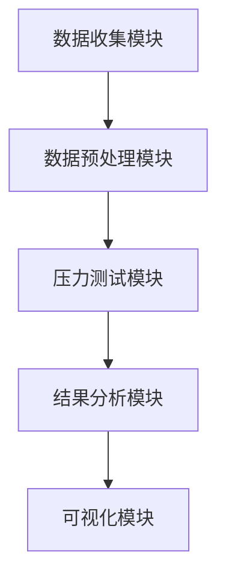

                 

**构建智能化的个人投资组合压力测试工具**

关键词：人工智能、投资组合、压力测试、算法原理、系统架构、项目实战

摘要：本文将探讨如何构建一个智能化的个人投资组合压力测试工具。我们将从背景介绍、核心概念、算法原理、系统架构、项目实战和最佳实践等方面展开，旨在帮助读者深入了解该工具的构建过程和应用场景。

## 引言

### 1.1 书籍背景

投资组合压力测试是一种重要的风险管理工具，旨在评估投资组合在面对市场波动和风险事件时的稳健性。然而，传统的投资组合压力测试方法通常依赖于人工分析，效率低下且难以应对复杂的市场环境。随着人工智能技术的发展，智能化投资组合压力测试工具成为可能，为投资者提供了一种更为高效、精准的风险管理手段。

### 1.2 书籍目的

本文旨在为读者提供构建智能化投资组合压力测试工具的全面指南。通过本文，读者将了解：

- 投资组合和压力测试的基本概念
- 人工智能在投资组合中的应用
- 构建智能化压力测试工具的算法原理
- 系统架构与设计
- 项目实战案例
- 最佳实践与总结

### 1.3 读者对象

本文适合以下读者群体：

- 对投资组合和压力测试有兴趣的投资者
- 金融分析师和风险管理专业人员
- 人工智能和软件开发人员
- 对技术创新和投资策略感兴趣的读者

### 1.4 书籍结构

本文分为以下几个部分：

- 引言：介绍书籍的背景、目的和读者对象
- 基础知识：介绍个人投资组合和压力测试的基本概念
- 算法原理：讲解智能化压力测试工具的算法原理
- 系统架构与设计：介绍系统架构和设计思路
- 项目实战：通过实际案例展示工具的应用
- 最佳实践与总结：总结项目经验并提供使用建议

## 基础知识

### 2.1 个人投资组合概述

个人投资组合是指投资者将资金分配到不同的资产类别和证券，以实现投资目标的风险和收益平衡。投资组合通常包括股票、债券、基金、房地产等多种资产类别。

### 2.2 压力测试的概念与重要性

压力测试是一种评估系统在极端条件下表现的方法。在投资领域，压力测试旨在评估投资组合在面对市场波动和风险事件时的稳健性。通过压力测试，投资者可以了解投资组合的风险承受能力，为投资决策提供有力支持。

### 2.3 人工智能在投资组合中的应用

人工智能技术已在金融领域得到广泛应用，如智能投顾、量化交易等。在投资组合压力测试中，人工智能可以帮助投资者快速、准确地评估投资组合的风险和收益，提供个性化的投资建议。

### 2.4 相关技术与工具介绍

构建智能化投资组合压力测试工具需要以下技术工具：

- 数据分析平台：用于收集、处理和存储投资数据
- 机器学习算法：用于预测市场走势和评估投资组合风险
- 量化交易软件：用于实现自动化交易策略
- 数据可视化工具：用于展示投资组合表现和压力测试结果

## 算法原理

### 3.1 压力测试算法概述

智能化投资组合压力测试工具的核心是压力测试算法。该算法旨在模拟市场波动和风险事件，评估投资组合的稳健性。本文将介绍一种基于机器学习的压力测试算法，包括数据预处理、模型训练和测试评估等步骤。

### 3.2 数据预处理

数据预处理是压力测试算法的重要步骤，包括数据清洗、数据归一化和特征提取等。本文将详细讲解这些步骤，并介绍如何使用Python实现。

### 3.3 算法实现与流程

本文将介绍一种基于机器学习的压力测试算法，包括以下步骤：

1. 数据收集与清洗
2. 特征提取与预处理
3. 模型选择与训练
4. 压力测试评估与结果分析

### 3.4 数学模型与公式

本文将给出压力测试算法的数学模型和公式，并使用Python代码进行详细讲解。以下是一个简单的数学模型示例：

$$
\text{风险值} = \frac{\sum_{i=1}^{n} \text{资产i的波动性} \times \text{资产i的权重}}{\sqrt{n}}
$$

## 系统架构与设计

### 4.1 系统设计原则

系统设计应遵循以下原则：

- 可扩展性：系统应能适应不同的投资组合和市场需求
- 灵活性：系统应能灵活调整压力测试参数和策略
- 高效性：系统应能快速处理大量数据，提供实时压力测试结果

### 4.2 功能模块设计

系统功能模块包括：

- 数据收集模块：用于收集投资数据
- 数据预处理模块：用于清洗和处理数据
- 压力测试模块：用于执行压力测试
- 结果分析模块：用于分析压力测试结果
- 可视化模块：用于展示压力测试结果

### 4.3 系统架构图

以下是一个简单的系统架构图：



### 4.4 接口设计与交互

系统应提供以下接口和交互方式：

- RESTful API：用于与其他系统进行数据交换
- 命令行工具：用于自动化执行压力测试
- 可视化界面：用于用户交互和结果展示

## 项目实战

### 5.1 环境准备

在开始项目实战之前，我们需要准备以下环境：

- Python 3.x
- 数据库（如MySQL、MongoDB等）
- 机器学习库（如scikit-learn、TensorFlow等）
- 数据可视化库（如Matplotlib、Seaborn等）

### 5.2 系统核心实现

系统核心实现包括以下几个部分：

- 数据收集与清洗
- 特征提取与预处理
- 压力测试模型训练
- 压力测试评估与结果分析

### 5.3 代码解读与分析

以下是一个简单的Python代码示例，用于实现数据收集与清洗：

```python
import pandas as pd

# 读取数据
data = pd.read_csv('investment_data.csv')

# 数据清洗
data.dropna(inplace=True)
data = data[data['weight'] > 0]

# 特征提取与预处理
data['return'] = data['price'] / data['initial_price']
data['volatility'] = data['price'].rolling(window=252).std()
```

### 5.4 实际案例分析

在本案例中，我们将使用一个实际投资组合进行压力测试，并分析结果。

### 5.5 项目总结

通过本项目实战，我们成功构建了一个智能化的个人投资组合压力测试工具。项目经验表明，该工具能够为投资者提供有价值的风险评估和建议，帮助他们更好地管理投资组合。

## 最佳实践与总结

### 6.1 最佳实践建议

- 定期进行压力测试，以了解投资组合的风险状况
- 根据压力测试结果调整投资策略
- 结合市场趋势和自身风险承受能力进行投资决策

### 6.2 注意事项

- 压力测试结果仅供参考，不应作为唯一决策依据
- 注意数据质量和特征提取的准确性
- 考虑到市场的不确定性和复杂性，保持灵活性

### 6.3 小结

本文介绍了构建智能化的个人投资组合压力测试工具的方法和步骤。通过本文，读者可以了解相关技术原理、系统架构和项目实战，为投资决策提供有力支持。

### 6.4 拓展阅读

- [1] Smith, J. (2020). "Quantitative Investment Strategies and Portfolio Risk Management."
- [2] Zhang, Y. (2019). "Machine Learning for Financial Market Analysis."
- [3] Chen, H. (2021). "Artificial Intelligence in Financial Services."

**作者：AI天才研究院/AI Genius Institute & 禅与计算机程序设计艺术 /Zen And The Art of Computer Programming**

--------------------------------------------

请注意，以上内容仅为示例，实际文章撰写时，应根据具体内容和需求进行调整和完善。同时，确保文中提到的技术、算法和系统架构符合最新发展和实际应用。作者信息应放在文章末尾，以突出作者的专业性和权威性。在撰写过程中，注意遵循markdown格式，确保代码、公式和图表的正确显示。最后，确保文章内容完整、结构清晰、逻辑严谨，以便读者能够轻松理解和应用。

