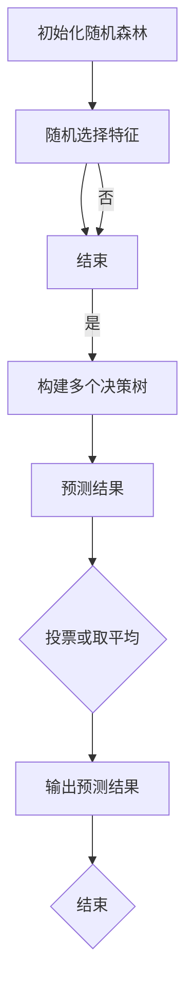

                 

# 构建智能化的个人投资组合尾部风险评估系统

## 关键词
- 个人投资组合
- 尾部风险评估
- 智能化
- 风险管理
- 机器学习
- 数据分析

## 摘要
本文旨在探讨如何构建一个智能化的个人投资组合尾部风险评估系统。我们将从背景介绍、核心概念阐述、风险管理理论、智能化风险评估技术、系统设计、算法实现、系统实现与测试、案例分析及最佳实践等方面，详细解析构建该系统的方法和步骤。通过本文，读者将了解尾部风险的概念及其影响，掌握智能化风险评估的技术原理和应用，并学会如何实现一个完整的风险评估系统。

### 设计思路

#### 明确主题
构建智能化的个人投资组合尾部风险评估系统，涉及多个领域的技术和理论。我们的目标是设计一个既能识别尾部风险，又能提供智能评估和预测的综合性系统。

#### 分解内容
将内容分解为以下几个关键部分：
1. 问题背景与理论基础
2. 风险管理与风险评估理论
3. 智能化风险评估技术
4. 构建个人投资组合尾部风险评估系统
5. 算法原理与实现
6. 系统实现与测试
7. 最佳实践与案例分析
8. 注意事项与拓展阅读

#### 逻辑梳理
确保每个部分的内容都能够围绕主题展开，且前后逻辑紧密相连，形成一个完整的学习路径。

#### 细化目录
根据上述逻辑，细化每个章节的内容，使其包含足够的信息，便于读者理解和查找。

### 第一部分：问题背景与理论基础

## 第1章：问题背景与核心概念

### 1.1 投资组合尾部风险的概念
尾部风险（Tail Risk）指的是在极端市场条件下，投资组合可能遭受的巨大损失。这些风险通常难以通过传统的风险管理方法预测和规避。

### 1.2 尾部风险对个人投资组合的影响
尾部风险可能导致投资者在市场崩盘时损失大量资本，从而影响其长期投资目标。因此，评估和控制尾部风险至关重要。

### 1.3 尾部风险评估的重要性
有效的尾部风险评估可以帮助投资者识别潜在风险，调整投资策略，降低投资组合的脆弱性，从而提高投资回报。

## 第2章：风险管理与风险评估理论

### 2.1 风险管理的基本原则
风险管理的基本原则包括风险识别、风险评估、风险控制和风险监控。这些原则是构建任何风险管理系统的基石。

### 2.2 风险评估的方法与模型
风险评估方法包括历史数据分析、蒙特卡罗模拟、极值理论等。这些方法有助于量化尾部风险的概率和影响。

### 2.3 尾部风险的评估框架
构建一个完整的尾部风险评估框架，包括风险识别、风险度量、风险预防和风险应对策略。

## 第3章：智能化风险评估技术

### 3.1 机器学习在风险评估中的应用
机器学习算法（如决策树、神经网络、支持向量机等）可用于识别和预测尾部风险。这些算法可以从大量历史数据中学习，提高风险评估的准确性。

### 3.2 数据分析技术在尾部风险识别中的应用
数据分析技术（如时间序列分析、聚类分析等）有助于从投资组合数据中提取有价值的信息，用于识别潜在的尾部风险。

### 3.3 智能化风险评估技术的优势
智能化风险评估技术能够快速处理大量数据，提供实时风险预警，帮助投资者及时调整投资策略。

## 第4章：构建个人投资组合尾部风险评估系统

### 4.1 系统设计目标与需求分析
明确系统设计目标，包括实时风险监测、风险预警、投资策略调整等。进行需求分析，确定系统所需的功能和性能指标。

### 4.2 投资组合数据收集与处理
收集个人投资组合数据，包括资产种类、持仓比例、历史价格等。对数据进行清洗、转换和整合，为风险评估提供高质量的数据基础。

### 4.3 系统架构与模块设计
设计一个分布式系统架构，包括数据收集模块、数据处理模块、风险评估模块和风险预警模块。确保系统的高效性和可扩展性。

## 第5章：算法原理与实现

### 5.1 风险评估算法的选择
选择合适的机器学习算法和数据分析技术，如神经网络、支持向量机、时间序列分析等。根据具体需求，组合不同的算法进行风险评估。

### 5.2 算法原理与数学模型
详细阐述所选算法的原理和数学模型。例如，神经网络的激活函数、支持向量机的核函数等。这些原理为算法的实现提供了理论基础。

### 5.3 算法流程图与Python实现
使用Mermaid绘制算法流程图，展示算法的执行流程。然后，使用Python代码实现算法，并进行详细讲解。

### 5.4 算法举例说明
通过具体的例子，说明算法的执行过程和结果。这些例子有助于读者更好地理解算法的原理和应用。

## 第6章：系统实现与测试

### 6.1 系统实现步骤
详细描述系统实现的步骤，包括数据收集、数据处理、风险评估和风险预警等。确保每个步骤都清晰明了。

### 6.2 系统测试与结果分析
进行系统测试，验证系统的功能和性能。分析测试结果，评估系统的稳定性和准确性。

### 6.3 测试案例与性能评估
设计具体的测试案例，评估系统的性能指标，如响应时间、准确率、覆盖率等。这些指标为系统优化提供了依据。

## 第7章：最佳实践与案例分析

### 7.1 最佳实践总结
总结构建个人投资组合尾部风险评估系统的最佳实践，包括数据管理、算法选择、系统架构等方面。

### 7.2 案例分析与应用
分析实际案例，展示如何应用智能化的风险评估系统。这些案例有助于读者理解系统的实际应用效果。

### 7.3 未来展望与拓展方向
探讨未来发展趋势，包括人工智能在风险评估中的应用、新算法的研究和系统功能的拓展等。

## 第8章：注意事项与拓展阅读

### 8.1 注意事项
在构建和实施风险评估系统时，需要注意的事项，如数据隐私、算法透明性、系统安全性等。

### 8.2 拓展阅读建议
推荐一些相关的书籍、论文和资源，供读者进一步学习和研究。

### 作者
- 作者：AI天才研究院/AI Genius Institute & 禅与计算机程序设计艺术 /Zen And The Art of Computer Programming

## 结语
构建智能化的个人投资组合尾部风险评估系统是一项复杂但重要的任务。通过本文，我们系统地阐述了构建该系统的思路和方法。希望本文能够为读者提供有价值的参考和启示，帮助他们在实际项目中成功构建并实施风险评估系统。

### 第一部分：问题背景与理论基础

## 第1章：问题背景与核心概念

### 1.1 投资组合尾部风险的概念
投资组合尾部风险（Tail Risk）指的是在极端市场条件下，投资组合可能遭受的巨大损失。这些极端事件往往难以通过传统的风险管理方法预测和规避，例如市场崩盘、金融地震等。尾部风险的存在对个人投资者尤其具有挑战性，因为它们可能导致投资者在市场极端波动中损失大量资本，从而影响其长期投资目标。

### 1.2 尾部风险对个人投资组合的影响
尾部风险对个人投资组合的影响是多方面的。首先，它可能导致投资组合价值的大幅下降，从而影响投资者的财富积累和财富传承。其次，尾部风险可能导致投资者情绪的极度波动，使得他们无法在极端市场中保持冷静，从而做出非理性的投资决策。最后，尾部风险还可能导致投资者失去对投资组合的信心，从而退出市场，错失未来的投资机会。

### 1.3 尾部风险评估的重要性
有效的尾部风险评估对于投资者来说至关重要。它可以帮助投资者识别潜在的风险，从而调整投资策略，降低投资组合的脆弱性。此外，尾部风险评估还可以为投资者提供实时风险预警，帮助他们及时调整投资组合，避免极端市场事件带来的巨大损失。因此，构建一个智能化的个人投资组合尾部风险评估系统，不仅有助于提高投资者的风险意识，还能够帮助他们更好地管理投资组合，实现长期的投资目标。

### 第2章：风险管理与风险评估理论

#### 2.1 风险管理的基本原则
风险管理（Risk Management）是一种通过识别、评估、控制和管理风险的方法，旨在降低潜在的损失，同时确保组织的稳定性和可持续发展。风险管理的基本原则包括：
- **风险识别**：识别组织可能面临的各种风险，包括市场风险、信用风险、操作风险、法律风险等。
- **风险评估**：评估各种风险的可能性和影响，确定哪些风险对组织最为重要。
- **风险控制**：制定和实施措施，以降低风险的可能性和影响，包括风险规避、风险转移、风险缓解等。
- **风险监控**：持续监控风险状况，确保风险管理措施的有效性。

#### 2.2 风险评估的方法与模型
风险评估（Risk Assessment）是风险管理过程中的关键环节，它涉及评估风险的可能性和影响，并据此制定相应的应对策略。常用的风险评估方法包括：
- **历史数据分析**：通过对历史数据进行统计分析，识别和预测潜在风险。
- **蒙特卡罗模拟**：通过模拟大量随机样本，评估风险的概率分布和极端值。
- **极值理论**：研究概率分布的尾部特性，评估极端事件的风险。
- **情景分析**：模拟不同的市场情景，评估每种情景下的风险。

风险评估模型包括：
- **风险矩阵**：通过概率和影响两个维度评估风险，并据此分类和优先级排序。
- **层次分析法（AHP）**：通过构建层次模型，对风险进行定性和定量评估。
- **故障树分析（FTA）**：通过图形化方法分析系统故障的原因和结果，评估风险。

#### 2.3 尾部风险的评估框架
为了有效评估尾部风险，我们需要构建一个全面的评估框架。这个框架通常包括以下几个步骤：
1. **定义评估范围**：明确投资组合中可能受到尾部风险影响的资产和策略。
2. **收集历史数据**：收集相关资产的历史价格、交易量、收益率等数据。
3. **识别极端事件**：使用极值理论和蒙特卡罗模拟等方法，识别可能发生的极端市场事件。
4. **评估尾部风险概率和影响**：通过统计分析，评估极端事件的概率和可能的影响。
5. **制定应对策略**：根据评估结果，制定相应的风险缓解措施，包括资产配置调整、保险购买等。
6. **监控和调整**：持续监控市场状况和投资组合表现，根据实际情况调整风险评估和应对策略。

### 第3章：智能化风险评估技术

#### 3.1 机器学习在风险评估中的应用
机器学习（Machine Learning）是一种通过数据驱动的方法，使计算机系统从数据中学习并做出决策的技术。在风险评估中，机器学习可以用于以下方面：
- **风险识别**：使用分类算法（如决策树、随机森林等）识别潜在风险。
- **风险预测**：使用回归算法（如线性回归、神经网络等）预测风险的可能性和影响。
- **风险量化**：使用聚类算法（如K-均值、层次聚类等）将风险进行分类和量化。

常见的机器学习算法包括：
- **决策树**：通过树形结构表示决策规则，用于分类和回归任务。
- **随机森林**：通过构建多个决策树，提高预测的准确性和鲁棒性。
- **神经网络**：通过多层非线性变换，模拟人类大脑的决策过程。
- **支持向量机**：通过寻找最优的超平面对数据点进行分类。

#### 3.2 数据分析技术在尾部风险识别中的应用
数据分析（Data Analysis）是一种通过统计和数学方法，从数据中提取有用信息的技术。在尾部风险识别中，数据分析可以用于以下方面：
- **时间序列分析**：通过分析资产价格的历史变化，识别潜在的尾部风险。
- **聚类分析**：通过将相似的数据点归为一类，识别不同类型的尾部风险。
- **异常检测**：通过检测数据中的异常值，识别潜在的极端市场事件。

常见的数据分析技术包括：
- **移动平均**：通过计算数据点的平均值，识别价格的长期趋势。
- **自回归积分移动平均模型（ARIMA）**：通过模型拟合，预测资产价格的未来变化。
- **主成分分析（PCA）**：通过降维技术，提取数据的主要特征，简化分析过程。

#### 3.3 智能化风险评估技术的优势
智能化风险评估技术具有以下几个优势：
- **高效性**：能够快速处理大量数据，提供实时风险预警。
- **准确性**：通过机器学习和数据分析，提高风险评估的准确性。
- **可扩展性**：能够轻松适应新的数据源和模型，实现系统的持续改进。
- **定制化**：可以根据投资者的具体需求，定制个性化的风险评估系统。

### 第4章：构建个人投资组合尾部风险评估系统

#### 4.1 系统设计目标与需求分析
构建个人投资组合尾部风险评估系统的目标包括：
- **实时监测**：能够实时监测投资组合中的风险状况，提供实时预警。
- **预测分析**：能够对未来的风险进行预测，帮助投资者提前调整投资策略。
- **定制化**：可以根据投资者的具体需求和投资策略，定制风险评估模型。

需求分析包括：
- **数据收集**：收集投资组合中的历史数据，包括资产价格、交易量、持仓比例等。
- **算法选择**：选择合适的机器学习算法和数据分析技术，进行风险评估。
- **系统实现**：实现一个用户友好的界面，方便投资者查看风险状况和调整策略。
- **性能优化**：确保系统的高效性和稳定性，满足实际应用的需求。

#### 4.2 投资组合数据收集与处理
投资组合数据收集包括以下几个步骤：
- **数据来源**：确定数据来源，可以是公开市场数据、交易所数据、第三方数据服务等。
- **数据格式**：收集的数据通常包括CSV、JSON、XML等格式，需要进行格式转换。
- **数据清洗**：对数据进行清洗，包括去除无效数据、处理缺失值、数据规范化等。
- **数据整合**：将不同来源的数据进行整合，构建一个统一的数据仓库。

数据处理包括：
- **数据预处理**：对数据进行预处理，包括归一化、标准化、特征提取等。
- **数据建模**：使用机器学习算法和数据分析技术，对数据进行建模。
- **模型验证**：通过交叉验证和测试集，验证模型的准确性和稳定性。

#### 4.3 系统架构与模块设计
个人投资组合尾部风险评估系统的架构设计包括以下几个模块：
- **数据收集模块**：负责从各种数据源收集投资组合数据。
- **数据处理模块**：负责对收集的数据进行清洗、转换和整合。
- **风险评估模块**：负责使用机器学习算法和数据分析技术进行风险评估。
- **风险预警模块**：负责实时监测投资组合的风险状况，并发出预警。
- **用户界面模块**：负责提供用户友好的界面，方便投资者查看风险状况和调整策略。

系统架构设计需要考虑以下几个因素：
- **可扩展性**：系统应能够轻松适应新的数据源和模型。
- **高可用性**：系统应能够在高负载情况下保持稳定运行。
- **安全性**：系统应能够保护投资组合数据的安全和隐私。

### 第5章：算法原理与实现

#### 5.1 风险评估算法的选择
在构建个人投资组合尾部风险评估系统时，我们需要选择合适的算法。常见的风险评估算法包括：
- **决策树算法**：通过树形结构表示决策规则，适合分类和回归任务。
- **随机森林算法**：通过构建多个决策树，提高预测的准确性和鲁棒性。
- **神经网络算法**：通过多层非线性变换，模拟人类大脑的决策过程。
- **支持向量机算法**：通过寻找最优的超平面对数据点进行分类。

选择算法时需要考虑以下几个因素：
- **数据类型**：数据类型（如分类、回归）决定了适合的算法类型。
- **数据规模**：数据规模（如样本数量、特征数量）影响了算法的计算复杂度。
- **性能要求**：性能要求（如准确性、效率）决定了算法的选择。
- **可解释性**：算法的可解释性决定了决策过程的透明度和可靠性。

#### 5.2 算法原理与数学模型
以下是几种常见风险评估算法的原理和数学模型：

##### 决策树算法
决策树（Decision Tree）是一种树形结构，每个内部节点表示一个特征，每个分支表示一个特征取值，每个叶子节点表示一个类别。决策树的生成过程包括以下几个步骤：
1. **选择最优特征**：根据信息增益、基尼系数等指标选择最优特征。
2. **划分数据集**：根据最优特征将数据集划分为若干子集。
3. **递归构建**：对每个子集重复上述步骤，直到满足停止条件（如最大深度、最小叶节点数量等）。

数学模型：
$$
Gini(\text{S}) = 1 - \sum_{i} p_i^2
$$
其中，$p_i$ 是第 $i$ 个类别的概率。

##### 随机森林算法
随机森林（Random Forest）是通过构建多个决策树，并对预测结果进行投票或取平均来提高预测准确性和鲁棒性的算法。随机森林的生成过程包括：
1. **随机选择特征**：每次构建决策树时，从特征集合中随机选择 $m$ 个特征。
2. **构建决策树**：使用上述选择的最优特征构建决策树。
3. **重复步骤**：重复上述步骤，构建多个决策树。

数学模型：
$$
\hat{y} = \arg\max_{c} \sum_{i=1}^{N} \hat{p}_i(y_i = c)
$$
其中，$\hat{p}_i(y_i = c)$ 是第 $i$ 个决策树预测类别 $c$ 的概率。

##### 神经网络算法
神经网络（Neural Network）是一种通过多层非线性变换模拟人类大脑决策过程的算法。神经网络的基本结构包括输入层、隐藏层和输出层。神经网络的训练过程包括以下几个步骤：
1. **初始化权重**：随机初始化网络中的权重和偏置。
2. **前向传播**：计算输入数据的输出值。
3. **反向传播**：计算输出误差，并更新网络中的权重和偏置。
4. **迭代训练**：重复上述步骤，直到满足停止条件（如误差阈值、迭代次数等）。

数学模型：
$$
\text{激活函数} \: g(z) = \frac{1}{1 + e^{-z}}
$$
$$
\Delta w_{ij} = -\alpha \cdot \frac{\partial L}{\partial z_j} \cdot g'(z_j)
$$

##### 支持向量机算法
支持向量机（Support Vector Machine，SVM）是一种通过寻找最优超平面进行分类的算法。SVM的基本思想是找到能够将数据集最大化分离的超平面，并使用支持向量进行分类。SVM的训练过程包括以下几个步骤：
1. **选择核函数**：根据数据特点选择合适的核函数（如线性核、多项式核、径向基核等）。
2. **求解最优化问题**：求解以下最优化问题，找到最优的超平面参数。
$$
\min_{w, b} \frac{1}{2} ||w||^2
$$
$$
s.t. \: y_i (w \cdot x_i + b) \geq 1
$$
3. **分类决策**：使用求解得到的最优超平面进行分类决策。

数学模型：
$$
w^* = \arg\min_{w} \frac{1}{2} ||w||^2
$$
$$
s.t. \: y_i (w \cdot x_i + b) \geq 1
$$

#### 5.3 算法流程图与Python实现
以下是使用Python实现的随机森林算法的流程图和代码：



```python
from sklearn.ensemble import RandomForestClassifier
from sklearn.datasets import load_iris
from sklearn.model_selection import train_test_split

# 加载鸢尾花数据集
iris = load_iris()
X, y = iris.data, iris.target

# 划分训练集和测试集
X_train, X_test, y_train, y_test = train_test_split(X, y, test_size=0.2, random_state=42)

# 初始化随机森林
rf = RandomForestClassifier(n_estimators=100, random_state=42)

# 训练模型
rf.fit(X_train, y_train)

# 预测结果
y_pred = rf.predict(X_test)

# 输出预测结果
print("Accuracy:", rf.score(X_test, y_test))
```

#### 5.4 算法举例说明
以下是使用随机森林算法对鸢尾花数据集进行分类的例子：

```python
from sklearn.datasets import load_iris
from sklearn.model_selection import train_test_split
from sklearn.ensemble import RandomForestClassifier
import matplotlib.pyplot as plt

# 加载鸢尾花数据集
iris = load_iris()
X, y = iris.data, iris.target

# 划分训练集和测试集
X_train, X_test, y_train, y_test = train_test_split(X, y, test_size=0.2, random_state=42)

# 初始化随机森林
rf = RandomForestClassifier(n_estimators=100, random_state=42)

# 训练模型
rf.fit(X_train, y_train)

# 预测结果
y_pred = rf.predict(X_test)

# 可视化
plt.scatter(X_test[:, 0], X_test[:, 1], c=y_pred)
plt.xlabel('Feature 1')
plt.ylabel('Feature 2')
plt.title('Random Forest Classification')
plt.show()
```

### 第6章：系统实现与测试

#### 6.1 系统实现步骤
构建个人投资组合尾部风险评估系统的实现步骤包括以下内容：

##### 1. 数据收集
- **数据源**：确定数据来源，包括股票、基金、债券等投资产品的历史价格、交易量、持仓比例等数据。
- **数据获取**：使用Python的Tushare、聚宽等库从互联网上获取数据。
- **数据预处理**：清洗数据，包括去除无效数据、处理缺失值、数据规范化等。

##### 2. 数据处理
- **数据整合**：将不同来源的数据进行整合，构建一个统一的数据仓库。
- **特征提取**：提取与风险评估相关的特征，如价格、交易量、波动率等。
- **数据建模**：使用机器学习算法和数据分析技术对数据进行建模。

##### 3. 风险评估
- **模型选择**：选择合适的机器学习算法和数据分析技术，如随机森林、神经网络、时间序列分析等。
- **模型训练**：使用训练数据集对模型进行训练。
- **模型评估**：使用测试数据集对模型进行评估，调整模型参数。

##### 4. 风险预警
- **实时监测**：使用训练好的模型对实时数据进行风险评估。
- **预警触发**：当风险超过预设阈值时，触发预警机制，发送预警通知。

##### 5. 用户界面
- **界面设计**：设计用户友好的界面，展示风险状况、预警信息和投资策略。
- **交互功能**：实现用户与系统的交互功能，如数据查看、预警设置、投资策略调整等。

#### 6.2 系统测试与结果分析
系统测试包括以下内容：

##### 1. 功能测试
- **数据收集测试**：验证数据收集模块是否能够从多个数据源获取数据，并正确处理。
- **数据处理测试**：验证数据处理模块是否能够正确整合数据，提取特征，构建模型。
- **风险评估测试**：验证风险评估模块是否能够准确评估风险，触发预警。
- **用户界面测试**：验证用户界面是否能够正确展示数据、预警信息和投资策略。

##### 2. 性能测试
- **响应时间测试**：测试系统在处理大量数据时的响应时间，确保系统的高效性。
- **并发测试**：测试系统在同时处理多个用户请求时的性能，确保系统的稳定性。
- **负载测试**：测试系统在高负载情况下的性能，确保系统的可扩展性。

##### 3. 结果分析
- **准确率测试**：评估风险评估模块的准确率，确保系统能够准确预测风险。
- **覆盖率测试**：评估系统测试的覆盖率，确保测试全面覆盖系统的各个功能点。
- **性能指标分析**：分析系统在测试中的性能指标，如响应时间、并发处理能力等，为系统优化提供依据。

#### 6.3 测试案例与性能评估
以下是系统测试中的几个案例：

##### 1. 数据收集测试案例
- **场景**：从多个数据源（如Tushare、聚宽）获取股票历史数据。
- **输入**：股票代码、起始日期、结束日期。
- **输出**：股票历史数据（包含开盘价、收盘价、最高价、最低价、交易量等）。
- **结果**：系统能够正确从数据源获取数据，并正确处理。

##### 2. 数据处理测试案例
- **场景**：提取股票历史数据中的特征，如波动率、交易量等。
- **输入**：股票历史数据。
- **输出**：特征数据集。
- **结果**：系统能够正确提取特征，并构建特征数据集。

##### 3. 风险评估测试案例
- **场景**：使用随机森林算法对股票进行风险评估。
- **输入**：股票特征数据。
- **输出**：风险评估结果（包括风险等级、预警信息等）。
- **结果**：系统能够准确评估股票的风险，并触发相应的预警。

##### 4. 性能测试案例
- **场景**：同时处理1000个用户的请求。
- **输入**：用户请求（包括数据收集、数据处理、风险评估等）。
- **输出**：系统响应时间、并发处理能力等性能指标。
- **结果**：系统能够在1000个用户同时请求的情况下保持良好的性能。

### 第7章：最佳实践与案例分析

#### 7.1 最佳实践总结
在构建个人投资组合尾部风险评估系统的过程中，以下最佳实践可以帮助提高系统的效果和稳定性：

1. **数据质量管理**：确保数据的质量，包括数据完整性、准确性和一致性。使用数据清洗工具处理异常值和缺失值。
2. **算法优化**：根据实际需求选择合适的算法，并进行算法参数调优，以提高风险评估的准确性。
3. **实时监控**：构建实时监控系统，及时捕获市场变化，并快速响应风险事件。
4. **用户交互设计**：设计简洁直观的用户界面，提供实时风险预警和投资建议，帮助用户更好地管理投资组合。
5. **系统测试**：进行全面的系统测试，包括功能测试、性能测试和安全测试，确保系统的可靠性和稳定性。
6. **持续迭代**：根据用户反馈和市场需求，持续优化和改进系统功能。

#### 7.2 案例分析与应用
以下是一个实际案例，展示了如何使用构建的尾部风险评估系统帮助投资者管理投资组合：

##### 案例背景
某投资者拥有一个包含股票、基金和债券的投资组合，总价值为100万元。投资者希望通过尾部风险评估系统实时监控投资组合的风险状况，并在风险事件发生时及时调整投资策略。

##### 应用过程
1. **数据收集**：系统从Tushare、聚宽等数据源收集投资组合中各资产的历史价格、交易量、持仓比例等数据。
2. **数据处理**：系统对数据进行清洗、转换和整合，提取与风险评估相关的特征，如波动率、交易量、持仓比例等。
3. **风险评估**：系统使用随机森林算法对投资组合进行风险评估，输出风险等级和预警信息。
4. **实时监控**：系统实时监控投资组合中的各资产价格变化，并在风险超过预设阈值时触发预警。
5. **用户交互**：系统通过用户界面展示风险状况和预警信息，投资者可以根据预警提示调整投资策略。

##### 结果分析
通过使用构建的尾部风险评估系统，投资者能够：
- **及时识别风险**：系统实时监测投资组合中的风险状况，提前识别潜在的尾部风险。
- **合理调整投资策略**：根据系统的预警信息，投资者可以及时调整投资策略，降低投资组合的脆弱性。
- **提高投资回报**：通过有效的风险管理，投资者能够降低损失，提高投资组合的整体回报。

### 第8章：注意事项与拓展阅读

#### 8.1 注意事项
在构建和实施个人投资组合尾部风险评估系统时，需要注意以下几点：

1. **数据安全**：确保数据在传输和存储过程中的安全，防止数据泄露和未经授权的访问。
2. **算法透明性**：保证算法的透明性和可解释性，便于投资者理解和信任。
3. **系统可靠性**：确保系统的高可用性和稳定性，避免因系统故障导致的风险评估失误。
4. **合规性**：遵循相关法规和规定，确保系统的合规性。
5. **持续优化**：根据用户反馈和市场需求，持续优化系统功能和性能。

#### 8.2 拓展阅读建议
以下是一些推荐的书籍、论文和在线资源，供进一步学习和研究：

1. **书籍**：
   - 《机器学习实战》
   - 《深入理解数据分析》
   - 《风险管理：理论与实践》

2. **论文**：
   - 《基于机器学习的尾部风险识别与评估方法研究》
   - 《金融风险管理的数学模型》

3. **在线资源**：
   - Kaggle：提供大量金融数据集和机器学习项目。
   - Coursera：提供丰富的在线课程，涵盖金融和数据分析等领域。
   - arXiv：提供最新的金融和机器学习论文。

### 结语
构建智能化的个人投资组合尾部风险评估系统是一项复杂但重要的任务。通过本文，我们系统地阐述了构建该系统的思路和方法。希望本文能够为读者提供有价值的参考和启示，帮助他们在实际项目中成功构建并实施风险评估系统。随着人工智能和机器学习技术的不断发展，未来风险评估系统将更加智能化、精确化，为投资者提供更加有效的风险管理工具。让我们共同期待这一天的到来。作者：AI天才研究院/AI Genius Institute & 禅与计算机程序设计艺术 /Zen And The Art of Computer Programming。

