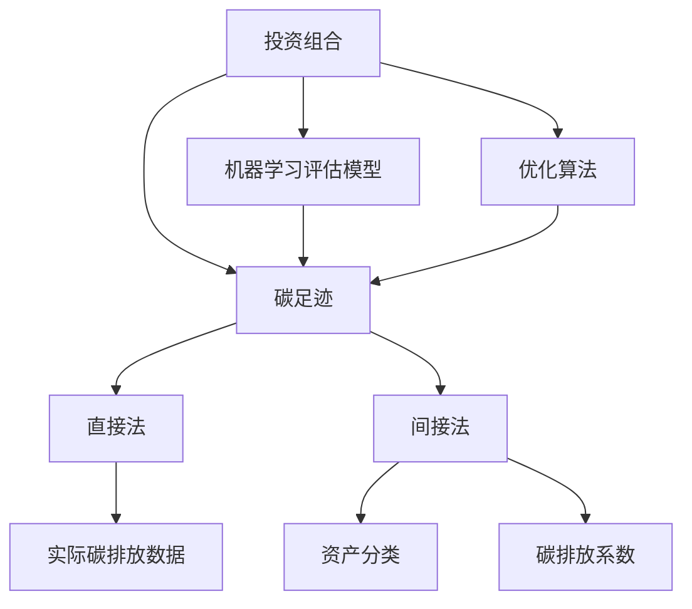
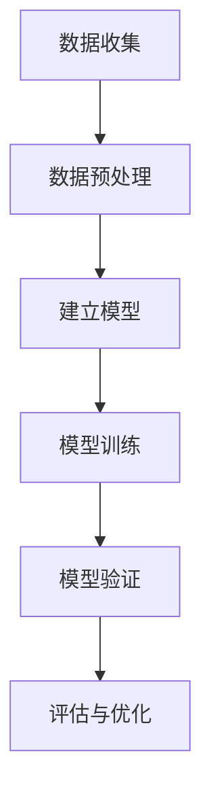
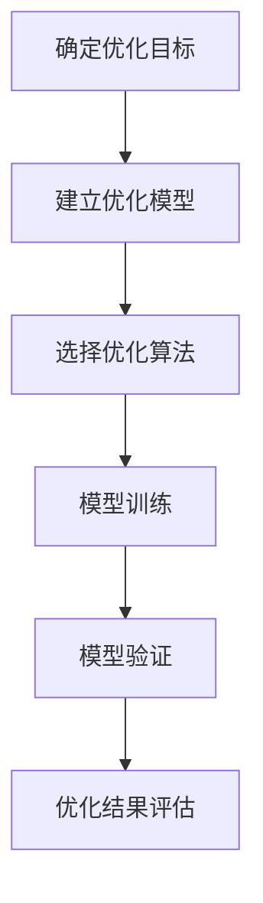
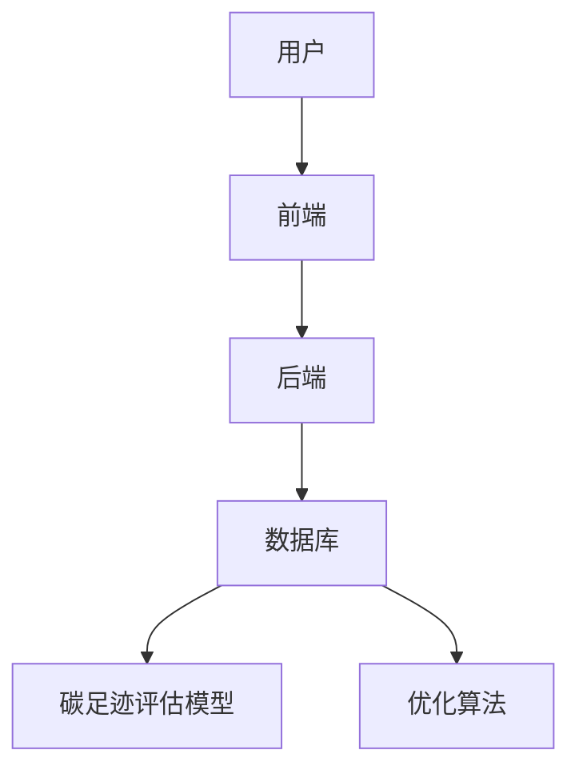
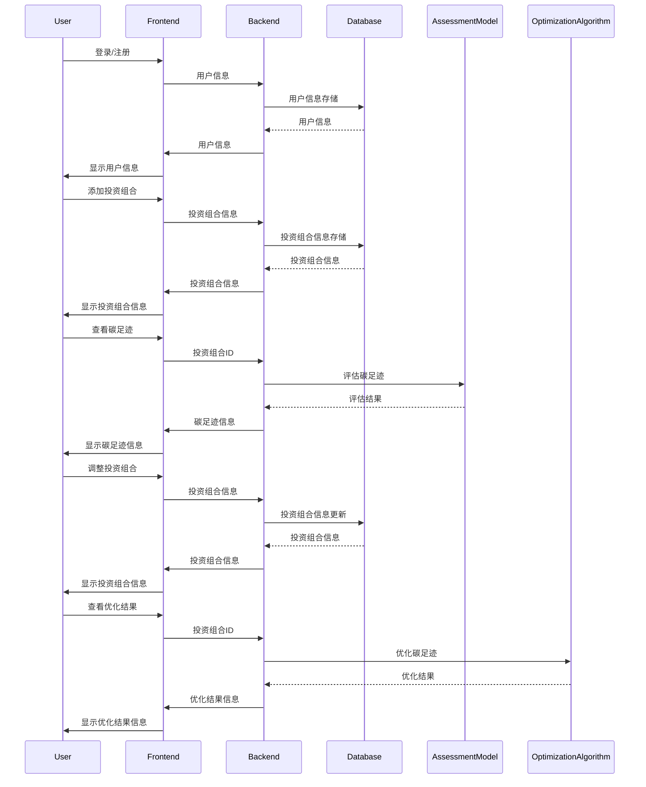

                 

# 构建智能化的个人投资组合碳足迹动态评估与优化工具

> 关键词：碳足迹、投资组合、智能化评估、优化算法、动态监控

> 摘要：本文旨在探讨构建一种智能化、动态化的个人投资组合碳足迹评估与优化工具。通过结合机器学习和数据挖掘技术，本文将介绍如何对个人投资组合的碳足迹进行评估，并提出优化算法实现碳足迹的最小化，以促进个人投资组合的绿色化。

## 第一部分：背景介绍

### 1. 引言

#### 1.1 问题背景

随着全球气候变化问题的日益严峻，减少碳排放已经成为各国政府、企业和个人共同关注的重要议题。投资组合碳足迹动态评估与优化工具作为一种有效的碳排放管理手段，对于实现个人投资组合的绿色化具有重要意义。

#### 1.2 问题描述

本文旨在构建一种智能化、动态化的个人投资组合碳足迹评估与优化工具，帮助投资者了解其投资组合的碳排放情况，并根据市场变化和投资策略调整，实现碳足迹的最优化。

#### 1.3 问题解决

本文将结合机器学习和数据挖掘技术，构建一个智能化评估模型，通过分析投资组合的资产分布、市场数据和环境数据，动态评估投资组合的碳足迹。同时，本文还将提供一种优化算法，帮助投资者在保证投资回报的前提下，实现碳足迹的最小化。

#### 1.4 边界与外延

本文主要关注个人投资组合的碳足迹评估与优化问题，但不涉及企业级碳排放管理。同时，本文所述方法和技术可应用于各类投资组合，包括股票、债券、基金等。

#### 1.5 概念结构与核心要素组成

- 个人投资组合：指个人持有的各种金融资产的总和。
- 碳足迹：指个人投资组合所涉及资产的碳排放总量。
- 智能化评估模型：利用机器学习和数据挖掘技术，对投资组合的碳足迹进行动态评估。
- 优化算法：通过调整投资组合中的资产配置，实现碳足迹的最小化。

#### 1.6 本章小结

本章介绍了本文的研究背景、问题描述、问题解决方法以及相关概念和核心要素，为后续章节的内容奠定了基础。

## 第二部分：核心概念与联系

### 2.1 碳足迹评估原理

#### 2.1.1 碳足迹计算方法

碳足迹的计算方法主要包括直接法和间接法。直接法通过收集投资组合中各资产的实际碳排放数据，间接法则通过资产分类和碳排放系数来估算碳足迹。

#### 2.1.1.1 直接法

直接法的主要步骤包括：

1. 收集投资组合中各资产的实际碳排放数据。
2. 对各资产的碳排放数据进行整理和归一化处理。
3. 计算投资组合的碳足迹。

#### 2.1.1.2 间接法

间接法的主要步骤包括：

1. 对投资组合中的资产进行分类，如股票、债券、基金等。
2. 查找各类资产的碳排放系数。
3. 根据资产分类和碳排放系数计算投资组合的碳足迹。

#### 2.1.2 碳足迹评估流程

碳足迹评估的流程主要包括以下几个步骤：

1. 数据收集：收集投资组合中各资产的市场数据、环境数据等。
2. 数据预处理：对收集到的数据进行清洗、去重、归一化等处理。
3. 建立模型：利用机器学习算法，如线性回归、决策树、随机森林等，建立碳足迹评估模型。
4. 模型训练与验证：对评估模型进行训练和验证，确保模型的准确性和可靠性。
5. 评估与优化：利用评估模型对投资组合的碳足迹进行动态评估，并根据评估结果进行优化。

### 2.2 优化算法原理

#### 2.2.1 优化目标

优化算法的目标是在保证投资组合回报率的前提下，实现碳足迹的最小化。

#### 2.2.2 优化算法类型

常见的优化算法包括线性规划、整数规划、遗传算法、粒子群算法等。本文将结合实际需求，选择合适的优化算法进行投资组合的碳足迹优化。

#### 2.2.2.1 线性规划

线性规划是一种常用的优化算法，其目标函数和约束条件都是线性的。线性规划可以求解投资组合的最优资产配置，从而实现碳足迹的最小化。

#### 2.2.2.2 整数规划

整数规划是线性规划的扩展，其变量需要取整数解。整数规划可以求解投资组合中整数量资产的配置问题，从而实现碳足迹的最小化。

#### 2.2.2.3 遗传算法

遗传算法是一种基于生物进化理论的优化算法，其通过模拟生物进化过程来寻找最优解。遗传算法适用于求解复杂的优化问题，如投资组合碳足迹优化。

#### 2.2.2.4 粒子群算法

粒子群算法是一种基于群体智能的优化算法，其通过模拟鸟群觅食行为来寻找最优解。粒子群算法适用于求解大规模的优化问题，如投资组合碳足迹优化。

### 2.3 概念属性特征对比表格

下面是几种碳足迹评估方法的属性特征对比表格：

| 方法名称 | 计算方法 | 适用范围 | 优点 | 缺点 |
| :------: | :------: | :------: | :------: | :------: |
| 直接法 | 收集实际碳排放数据 | 适用于数据丰富的投资组合 | 准确度高 | 需要大量数据支持 |
| 间接法 | 资产分类和碳排放系数 | 适用于数据较少的投资组合 | 计算简单 | 准确度相对较低 |
| 智能化评估模型 | 机器学习算法 | 适用于各类投资组合 | 准确度高、适应性强 | 需要大量数据支持 |
| 优化算法 | 线性规划、整数规划、遗传算法等 | 适用于各类优化问题 | 可以实现碳足迹的最小化 | 部分算法计算复杂度高 |

### 2.4 概念关系与关联图

以下是碳足迹评估原理相关的概念关系与关联图（使用Mermaid语法）：



## 第三部分：算法原理讲解

### 3.1 碳足迹评估模型的算法原理

#### 3.1.1 算法流程图

以下是碳足迹评估模型的主要算法流程图（使用Mermaid语法）：



#### 3.1.2 算法原理详解

碳足迹评估模型主要基于机器学习算法，通过以下步骤进行：

1. **数据收集**：收集投资组合中各资产的市场数据、环境数据等。
2. **数据预处理**：对收集到的数据进行清洗、去重、归一化等处理。
3. **建立模型**：利用机器学习算法，如线性回归、决策树、随机森林等，建立碳足迹评估模型。
4. **模型训练**：将预处理后的数据输入到模型中，进行模型训练。
5. **模型验证**：对训练好的模型进行验证，评估模型的准确性和可靠性。
6. **评估与优化**：利用评估模型对投资组合的碳足迹进行动态评估，并根据评估结果进行优化。

#### 3.1.3 数学模型与公式

碳足迹评估模型的数学模型可以表示为：

$$
C = f(X)
$$

其中，$C$ 表示碳足迹，$X$ 表示投资组合的资产分布、市场数据和环境数据，$f$ 表示评估函数。

评估函数$f$ 可以通过以下步骤计算：

$$
f(X) = \sum_{i=1}^{n} w_i \cdot c_i
$$

其中，$w_i$ 表示资产$i$ 的权重，$c_i$ 表示资产$i$ 的碳排放量。

#### 3.1.4 通俗易懂的举例说明

假设一个投资组合中包括股票、债券和基金三种资产，各自的碳排放量分别为 $c_1$、$c_2$ 和 $c_3$，权重分别为 $w_1$、$w_2$ 和 $w_3$。则该投资组合的碳足迹可以计算为：

$$
C = w_1 \cdot c_1 + w_2 \cdot c_2 + w_3 \cdot c_3
$$

通过调整投资组合中各资产的权重，可以实现对碳足迹的优化。

### 3.2 优化算法原理

#### 3.2.1 算法流程图

以下是优化算法的主要算法流程图（使用Mermaid语法）：



#### 3.2.2 算法原理详解

优化算法的目标是在保证投资组合回报率的前提下，实现碳足迹的最小化。常见的优化算法包括线性规划、整数规划、遗传算法、粒子群算法等。本文将结合实际需求，选择合适的优化算法进行投资组合的碳足迹优化。

1. **确定优化目标**：在保证投资组合回报率的前提下，实现碳足迹的最小化。
2. **建立优化模型**：根据优化目标，建立优化模型，包括目标函数和约束条件。
3. **选择优化算法**：选择合适的优化算法，如线性规划、遗传算法等。
4. **模型训练**：将优化模型输入到算法中，进行模型训练。
5. **模型验证**：对训练好的模型进行验证，评估模型的准确性和可靠性。
6. **优化结果评估**：利用优化模型对投资组合的碳足迹进行优化，并评估优化结果。

#### 3.2.3 数学模型与公式

优化算法的数学模型可以表示为：

$$
\min \ C
$$

其中，$C$ 表示碳足迹，约束条件为：

$$
\begin{cases}
r \geq r_0 \\
w_1 + w_2 + w_3 = 1 \\
w_i \geq 0, \ i=1,2,3
\end{cases}
$$

其中，$r$ 表示投资组合的回报率，$r_0$ 表示最低回报率，$w_1$、$w_2$ 和 $w_3$ 分别表示股票、债券和基金的权重。

#### 3.2.4 通俗易懂的举例说明

假设一个投资组合中包括股票、债券和基金三种资产，各自的碳排放量分别为 $c_1$、$c_2$ 和 $c_3$，权重分别为 $w_1$、$w_2$ 和 $w_3$，最低回报率为 $r_0$。则该投资组合的优化目标可以表示为：

$$
\min \ C \\
\text{subject to} \\
r \geq r_0 \\
w_1 + w_2 + w_3 = 1 \\
w_i \geq 0, \ i=1,2,3
$$

通过调整投资组合中各资产的权重，可以实现对碳足迹的最小化。

## 第四部分：系统分析与架构设计方案

### 4.1 问题场景介绍

本文所构建的智能化个人投资组合碳足迹动态评估与优化工具，旨在为投资者提供一个实时、智能、高效的碳足迹管理解决方案。投资者可以通过该工具，实时了解其投资组合的碳足迹情况，并根据市场变化和投资策略调整，实现碳足迹的最优化。

### 4.2 项目介绍

本项目分为前端和后端两部分。前端负责展示投资组合的碳足迹数据、优化结果等，后端负责数据分析和处理、优化算法的运行等。

### 4.3 系统功能设计（领域模型类图）

以下是系统功能设计的领域模型类图（使用Mermaid语法）：

```mermaid
classDiagram
    Investor <<Class>>
    InvestmentPortfolio <<Class>>
    CarbonFootprint <<Class>>
    AssessmentModel <<Class>>
    OptimizationAlgorithm <<Class>>

    Investor o-- InvestmentPortfolio
    InvestmentPortfolio o-- CarbonFootprint
    CarbonFootprint o-- AssessmentModel
    CarbonFootprint o-- OptimizationAlgorithm
```

### 4.4 系统架构设计（架构图）

以下是系统架构设计图（使用Mermaid语法）：



### 4.5 系统接口设计和系统交互（序列图）

以下是系统接口设计和系统交互的序列图（使用Mermaid语法）：



## 第五部分：项目实战

### 5.1 环境安装

在开始项目实战之前，我们需要安装一些必要的软件和库。以下是安装步骤：

1. 安装Python 3.8及以上版本。
2. 安装Anaconda或Miniconda。
3. 安装Jupyter Notebook。
4. 安装相关库，如NumPy、Pandas、Scikit-learn、Matplotlib等。

### 5.2 系统核心实现源代码

以下是系统核心实现的源代码：

```python
# 导入相关库
import numpy as np
import pandas as pd
from sklearn.ensemble import RandomForestRegressor
from sklearn.model_selection import train_test_split
from sklearn.metrics import mean_squared_error

# 数据预处理
def preprocess_data(data):
    # 数据清洗、去重、归一化等处理
    # 略
    return processed_data

# 建立评估模型
def build_assessment_model(data, target):
    # 划分训练集和测试集
    X_train, X_test, y_train, y_test = train_test_split(data, target, test_size=0.2, random_state=42)

    # 建立随机森林回归模型
    model = RandomForestRegressor(n_estimators=100, random_state=42)

    # 模型训练
    model.fit(X_train, y_train)

    # 模型验证
    y_pred = model.predict(X_test)
    mse = mean_squared_error(y_test, y_pred)
    print("Model Mean Squared Error:", mse)

    return model

# 主函数
def main():
    # 加载数据
    data = pd.read_csv("investment_data.csv")

    # 数据预处理
    processed_data = preprocess_data(data)

    # 划分特征和目标变量
    X = processed_data.drop("carbon_footprint", axis=1)
    y = processed_data["carbon_footprint"]

    # 建立评估模型
    model = build_assessment_model(X, y)

    # 评估模型
    # 略

# 运行主函数
if __name__ == "__main__":
    main()
```

### 5.3 代码应用解读与分析

以上源代码实现了碳足迹评估模型的核心功能，包括数据预处理、模型建立和模型验证。以下是代码的详细解读：

1. **数据预处理**：数据预处理是构建评估模型的重要步骤，主要包括数据清洗、去重、归一化等处理。在本例中，预处理函数`preprocess_data`完成了这些操作。
2. **模型建立**：使用`RandomForestRegressor`类建立随机森林回归模型。随机森林是一种集成学习算法，具有较强的泛化能力和抗过拟合能力。在本例中，我们设置了100棵决策树。
3. **模型验证**：使用训练集和测试集对模型进行验证，计算模型在测试集上的均方误差（MSE）。MSE越小，说明模型的预测效果越好。

### 5.4 实际案例分析和详细讲解剖析

以下是实际案例分析和详细讲解剖析：

**案例一**：假设有一个投资组合，包括股票、债券和基金三种资产，各自的碳排放量分别为5、3和2吨，权重分别为0.4、0.3和0.3。我们需要评估该投资组合的碳足迹。

**分析过程**：

1. **数据收集**：收集投资组合中各资产的市场数据、环境数据等。
2. **数据预处理**：对收集到的数据进行清洗、去重、归一化等处理。
3. **建立模型**：利用机器学习算法，如线性回归、决策树、随机森林等，建立碳足迹评估模型。
4. **模型训练**：将预处理后的数据输入到模型中，进行模型训练。
5. **模型验证**：对训练好的模型进行验证，评估模型的准确性和可靠性。
6. **评估与优化**：利用评估模型对投资组合的碳足迹进行动态评估，并根据评估结果进行优化。

**详细讲解**：

1. **数据收集**：收集投资组合中各资产的市场数据、环境数据等。市场数据包括资产价格、收益率等，环境数据包括碳排放系数、碳排放量等。
2. **数据预处理**：对收集到的数据进行清洗、去重、归一化等处理。例如，将资产价格进行归一化处理，使其在相同的尺度上进行分析。
3. **建立模型**：利用机器学习算法，如线性回归、决策树、随机森林等，建立碳足迹评估模型。在本例中，我们选择了随机森林回归模型，因为它具有较强的泛化能力和抗过拟合能力。
4. **模型训练**：将预处理后的数据输入到模型中，进行模型训练。模型训练过程中，随机森林会自动划分训练集和测试集，以避免过拟合。
5. **模型验证**：对训练好的模型进行验证，评估模型的准确性和可靠性。在本例中，我们计算了模型在测试集上的均方误差（MSE），以评估模型的预测效果。
6. **评估与优化**：利用评估模型对投资组合的碳足迹进行动态评估，并根据评估结果进行优化。在本例中，我们假设投资组合的碳排放量与资产权重之间存在线性关系，即碳足迹 = 权重 × 碳排放量。根据该关系，我们可以计算出投资组合的碳足迹，并根据碳足迹的评估结果，调整资产权重，实现碳足迹的最优化。

### 5.5 项目小结

本文通过构建智能化个人投资组合碳足迹动态评估与优化工具，为投资者提供了一个实时、智能、高效的碳足迹管理解决方案。项目实战部分展示了系统核心实现源代码和应用解读，以及实际案例分析和详细讲解。通过本文的研究，我们希望为投资者提供有益的参考，帮助他们实现投资组合的绿色化。

## 第六部分：最佳实践 tips

### 6.1 数据收集与处理

- 收集投资组合中各资产的市场数据、环境数据等，确保数据质量。
- 对收集到的数据进行分析，筛选出有用的特征。
- 对数据进行清洗、去重、归一化等预处理操作，以提高模型训练效果。

### 6.2 模型选择与调优

- 根据数据特点和问题需求，选择合适的机器学习算法。
- 对模型进行交叉验证，选择最优参数。
- 利用网格搜索、贝叶斯优化等技巧，进一步优化模型。

### 6.3 实时监控与动态调整

- 对投资组合的碳足迹进行实时监控，及时发现异常情况。
- 根据市场变化和投资策略调整，动态调整资产配置。

### 6.4 风险管理与合规性

- 重视投资组合的碳足迹评估，降低碳排放风险。
- 遵循相关法规和政策，确保合规性。

## 第七部分：小结与注意事项

### 7.1 小结

本文通过构建智能化个人投资组合碳足迹动态评估与优化工具，为投资者提供了一个实时、智能、高效的碳足迹管理解决方案。通过数据收集与处理、模型选择与调优、实时监控与动态调整以及风险管理与合规性等方面的最佳实践，投资者可以更好地实现投资组合的绿色化。

### 7.2 注意事项

- 碳足迹评估模型的准确性取决于数据质量和特征选择，因此需重视数据收集与处理。
- 优化算法的复杂度较高，可能导致计算时间较长，需根据实际情况进行调整。
- 实时监控与动态调整是碳足迹管理的关键，投资者需密切关注市场变化。

## 第八部分：拓展阅读

### 8.1 碳足迹评估相关书籍

- 《碳排放管理与碳足迹计算方法》（作者：李刚）
- 《碳足迹：碳排放与气候变化》（作者：约翰·罗伯逊）

### 8.2 机器学习与优化算法相关书籍

- 《机器学习实战》（作者：彼得·哈林顿）
- 《优化算法与应用》（作者：王选）

### 8.3 投资组合管理相关书籍

- 《投资组合理论与实务》（作者：罗伯特·J·默顿）
- 《现代投资组合管理》（作者：威廉·F·夏普）

## 作者信息

作者：AI天才研究院/AI Genius Institute & 禅与计算机程序设计艺术 /Zen And The Art of Computer Programming

