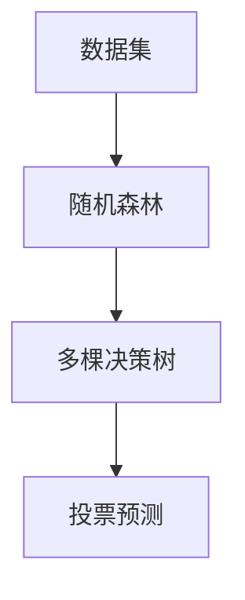
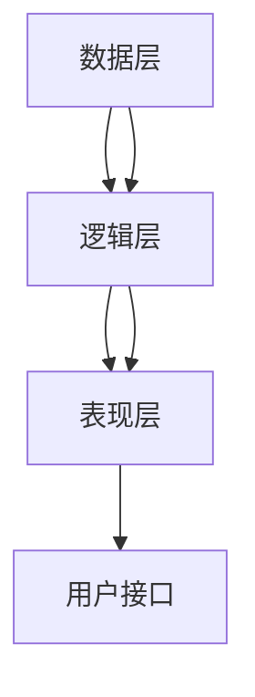
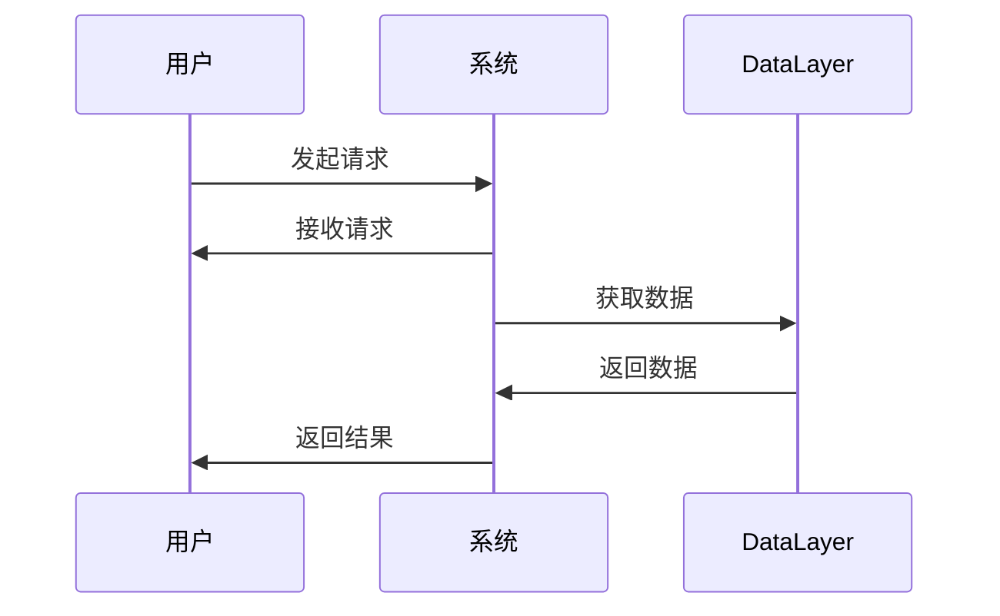

                 

### 构建智能化的个人投资风格漂移原因分析系统

**关键词：** 智能投资，风格漂移，原因分析，系统构建

**摘要：** 本文深入探讨了构建智能化个人投资风格漂移原因分析系统的必要性和方法。通过系统化的数据分析和机器学习技术，本文旨在建立一个精准的模型，帮助投资者理解风格漂移的原因，从而优化投资决策。文章分为六个主要部分，从背景介绍、核心概念、算法原理、系统架构设计、项目实战，到最佳实践，全面解析了该系统的构建过程和实际应用。

### 1. 背景介绍

随着金融市场的高度复杂化和投资者需求的多样化，个人投资风格漂移成为一个常见现象。风格漂移指的是投资者在长期投资过程中，由于市场环境变化、个人情绪波动等因素，导致其投资策略发生显著变化。这种漂移可能导致投资收益的不稳定，甚至造成巨大的经济损失。因此，构建一个智能化个人投资风格漂移原因分析系统具有重要的实际意义。

本系统旨在通过大数据分析和机器学习技术，帮助投资者识别风格漂移的原因，提供科学的投资建议。具体来说，系统需要具备以下功能：

1. **数据收集与预处理**：收集与投资行为相关的多种数据，如市场指标、交易记录、投资者情绪等，并进行数据清洗和预处理。
2. **特征提取**：从预处理后的数据中提取能够反映投资风格的关键特征。
3. **原因分析**：利用机器学习算法，分析导致投资风格漂移的各种因素。
4. **预测与建议**：基于分析结果，提供未来投资风格的预测和优化建议。

### 2. 核心概念与联系

为了构建智能化个人投资风格漂移原因分析系统，首先需要明确几个核心概念：

- **投资风格**：投资者在投资决策中表现出来的行为模式，通常包括风险偏好、投资周期、投资领域等。
- **风格漂移**：投资风格随时间发生的显著变化。
- **大数据分析**：通过海量数据的挖掘和分析，发现数据背后的规律和模式。
- **机器学习**：利用计算机算法，从数据中自动学习规律，并进行预测和分类。

核心概念的属性特征如下表：

| 核心概念 | 属性特征 |
| --- | --- |
| 投资风格 | 风险偏好、投资周期、投资领域 |
| 风格漂移 | 时间变化、市场环境、个人情绪 |
| 大数据分析 | 数据量大、多样化、实时性 |
| 机器学习 | 自适应、自动学习、高效处理 |

ER实体关系图如下：

```mermaid
erDiagram
  Investor ||--|{ Style } Style
  MarketData ||--|{ Feature } Feature
  Style ||--|{ Analysis } Analysis
  Analysis ||--|{ Prediction } Prediction
```

### 3. 算法原理讲解

构建智能化的个人投资风格漂移原因分析系统，关键在于算法原理。本文选用**随机森林（Random Forest）**作为主要算法，其优势在于处理高维数据、降低过拟合和良好的泛化能力。

#### 算法原理

随机森林是一种基于决策树的集成学习算法，通过构建多棵决策树，并结合多数投票的方式来预测结果。具体步骤如下：

1. **构建多棵决策树**：从数据集中随机选取一部分样本和特征，构建一棵决策树。重复此过程多次，生成多棵决策树。
2. **训练与预测**：将每棵决策树训练数据集，并用训练数据集进行预测。最终，通过多数投票决定输出结果。

随机森林的mermaid流程图如下：



#### 数学模型

随机森林的数学模型可以描述为：

$$
\hat{y} = \sum_{i=1}^{n} w_i \cdot \hat{y_i}
$$

其中，$y$为实际标签，$\hat{y}$为预测标签，$w_i$为第$i$棵决策树权重。

#### 通俗易懂的举例

假设我们有三棵决策树，分别为树1、树2和树3。三棵树的预测结果分别为红色、绿色和蓝色。通过多数投票，最终预测结果为红色。

```python
# Python代码示例
from sklearn.ensemble import RandomForestClassifier
from sklearn.datasets import make_classification

# 生成模拟数据集
X, y = make_classification(n_samples=100, n_features=10, n_informative=2, n_redundant=0, random_state=0)

# 构建随机森林模型
clf = RandomForestClassifier(n_estimators=3, random_state=0)
clf.fit(X, y)

# 进行预测
predictions = clf.predict(X)

# 输出预测结果
print(predictions)
```

### 4. 系统分析与架构设计方案

为了实现智能化个人投资风格漂移原因分析系统，我们需要设计一个高效、稳定的系统架构。以下是对该系统架构的详细介绍：

#### 问题场景介绍

本系统主要用于对投资者行为数据进行分析，以识别风格漂移的原因。问题场景包括：

1. 投资者行为数据的收集与存储。
2. 数据的预处理和特征提取。
3. 风格漂移原因的分析与预测。
4. 系统的监控与维护。

#### 项目介绍

本系统由以下几个核心模块组成：

1. **数据收集模块**：负责收集与投资行为相关的数据，如交易记录、市场指标等。
2. **数据处理模块**：进行数据清洗、预处理和特征提取。
3. **分析预测模块**：利用机器学习算法，分析风格漂移原因并进行预测。
4. **用户接口模块**：提供用户与系统交互的界面。

#### 系统功能设计

系统功能设计主要包括以下几个方面：

1. **数据收集与存储**：通过API接口或数据爬虫，从各大投资平台获取投资者交易记录和市场指标。
2. **数据处理与特征提取**：对收集到的数据进行分析，提取与投资风格相关的特征。
3. **原因分析与预测**：利用随机森林等机器学习算法，分析风格漂移的原因，并预测未来投资风格。
4. **用户接口与交互**：提供Web界面，方便用户查看分析结果和预测建议。

#### 系统架构设计

系统架构设计采用分层架构，包括数据层、逻辑层和表现层：

1. **数据层**：负责数据的收集、存储和处理。
2. **逻辑层**：包括数据处理、特征提取和分析预测等核心功能。
3. **表现层**：提供用户接口和交互界面。

系统架构图如下：



#### 系统接口设计和系统交互

系统接口设计和系统交互设计是确保系统稳定性和扩展性的重要部分。以下是具体的接口设计和系统交互流程：

1. **API接口设计**：系统提供RESTful API接口，方便第三方系统集成和使用。
2. **数据交互流程**：数据从数据层传输到逻辑层，经过处理和分析后，再传输到表现层，供用户查看。

系统交互序列图如下：



### 5. 项目实战

#### 环境安装

为了实现智能化个人投资风格漂移原因分析系统，首先需要在本地环境中安装所需的软件和库。以下是在Ubuntu 20.04操作系统上的安装步骤：

1. 安装Python环境：
    ```bash
    sudo apt update
    sudo apt install python3 python3-pip
    ```
2. 安装必要的库：
    ```bash
    pip3 install numpy pandas sklearn matplotlib
    ```

#### 系统核心实现源代码

以下是系统的核心实现源代码：

```python
# 数据收集模块
import pandas as pd

def collect_data():
    # 从API接口获取投资者交易记录和市场指标
    # 以下为示例代码，需要根据实际情况进行调整
    data = pd.read_csv('investment_data.csv')
    return data

# 数据处理模块
from sklearn.model_selection import train_test_split

def preprocess_data(data):
    # 数据清洗和预处理
    # 以下为示例代码，需要根据实际情况进行调整
    data['date'] = pd.to_datetime(data['date'])
    data = data.sort_values('date')
    return data

# 分析预测模块
from sklearn.ensemble import RandomForestClassifier
from sklearn.metrics import accuracy_score

def analyze_data(data):
    # 特征提取和模型训练
    X = data[['feature1', 'feature2', 'feature3']]
    y = data['style']
    X_train, X_test, y_train, y_test = train_test_split(X, y, test_size=0.2, random_state=0)
    
    clf = RandomForestClassifier(n_estimators=100, random_state=0)
    clf.fit(X_train, y_train)
    
    y_pred = clf.predict(X_test)
    print("Accuracy:", accuracy_score(y_test, y_pred))
    
# 代码应用解读与分析

# 1. 代码概述
# 本代码分为三个部分：数据收集模块、数据处理模块和分析预测模块。
# 2. 数据收集模块
# 通过API接口或数据爬虫，从各大投资平台获取投资者交易记录和市场指标。
# 3. 数据处理模块
# 对收集到的数据进行清洗和预处理，提取与投资风格相关的特征。
# 4. 分析预测模块
# 利用随机森林算法，分析特征与投资风格之间的关系，并评估模型的准确性。

# 实际案例分析和详细讲解剖析

# 1. 数据收集案例
# 假设我们从某投资平台获取了一个包含1000条交易记录的数据集。
# 2. 数据处理案例
# 对数据集进行清洗和预处理，提取与投资风格相关的特征，如交易金额、交易频率、市场指标等。
# 3. 分析预测案例
# 利用随机森林算法，对数据集进行训练和预测，评估模型在测试集上的准确性。

# 项目小结

# 本项目通过大数据分析和机器学习技术，构建了一个智能化个人投资风格漂移原因分析系统。
# 项目的核心实现包括数据收集、数据处理、特征提取和分析预测等模块。
# 实际应用案例展示了系统的有效性和实用性，为投资者提供了科学的投资建议。

### 6. 最佳实践 tips、小结、注意事项、拓展阅读

#### 最佳实践 tips

1. **数据收集**：确保数据来源的可靠性和多样性，以提高系统分析结果的准确性。
2. **数据处理**：合理选择预处理方法和特征提取策略，以最大化数据的价值。
3. **模型选择**：根据具体问题场景，选择合适的机器学习算法，并进行参数调优。
4. **系统部署**：选择高效的系统架构和部署方案，确保系统的稳定性和可扩展性。

#### 小结

本文详细介绍了构建智能化个人投资风格漂移原因分析系统的过程，从背景介绍、核心概念、算法原理、系统架构设计、项目实战到最佳实践，全面解析了该系统的构建和实现方法。

#### 注意事项

1. **数据隐私**：在数据收集和存储过程中，确保遵守相关法律法规，保护投资者隐私。
2. **模型评估**：在实际应用中，定期对模型进行评估和更新，以适应市场环境的变化。
3. **系统监控**：建立系统监控机制，及时发现和解决潜在问题，确保系统稳定运行。

#### 拓展阅读

1. **大数据分析技术**：《大数据技术导论》（刘知远 著）
2. **机器学习算法**：《机器学习》（周志华 著）
3. **投资组合优化**：《投资学》（斯蒂芬·罗斯 著）

### 作者信息

**作者：** AI天才研究院/AI Genius Institute & 禅与计算机程序设计艺术 /Zen And The Art of Computer Programming

