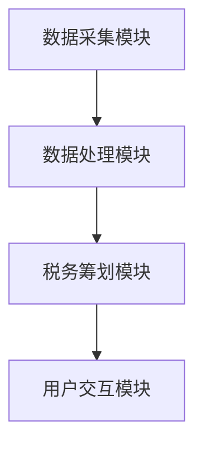
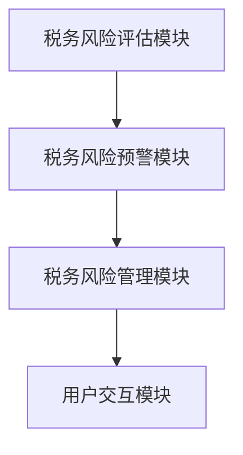
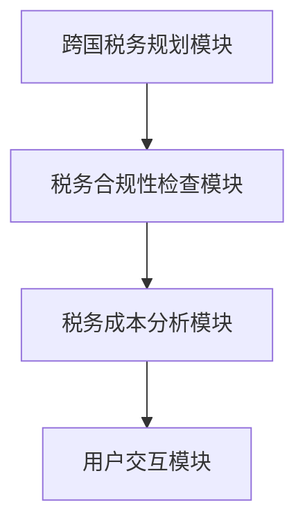
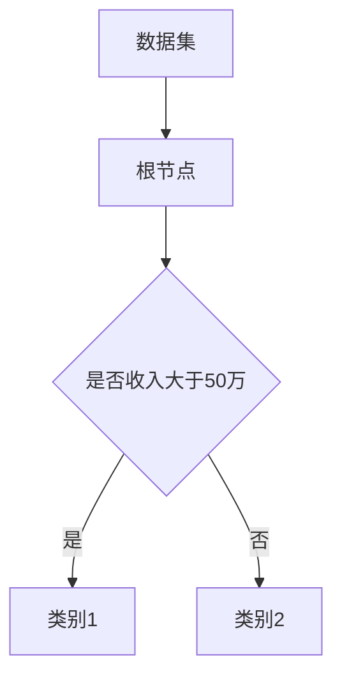
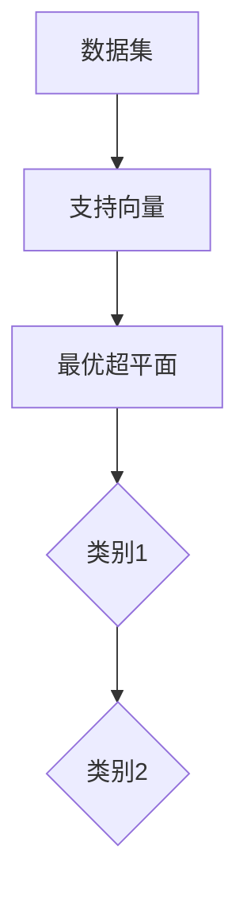
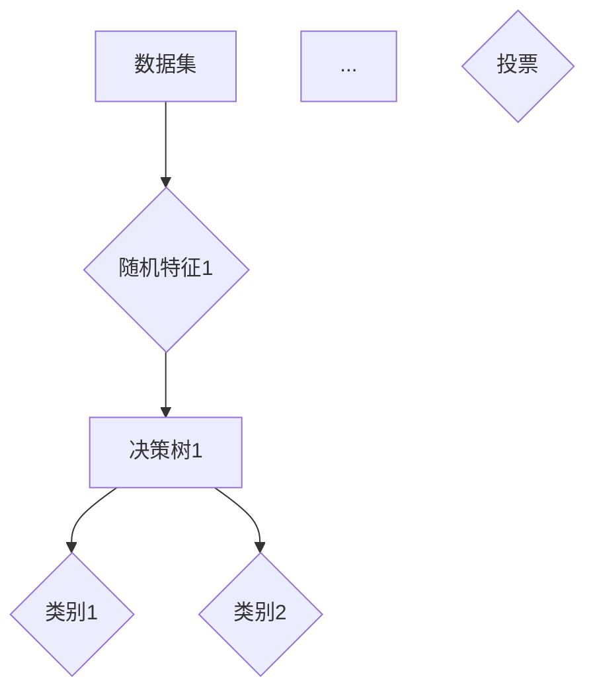
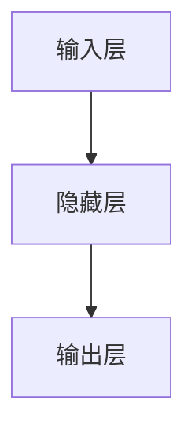
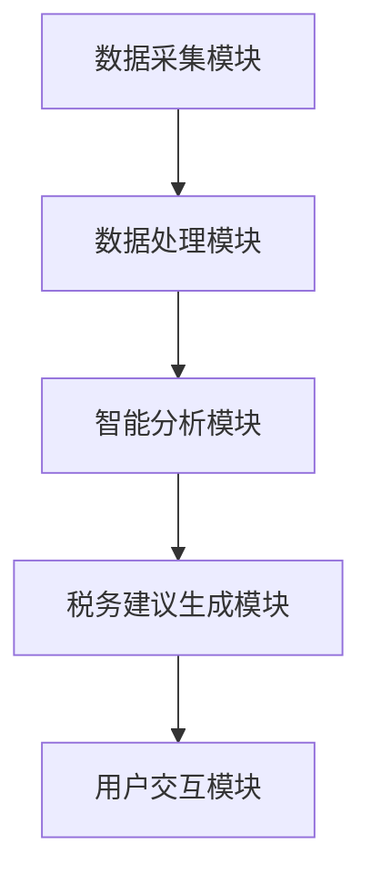
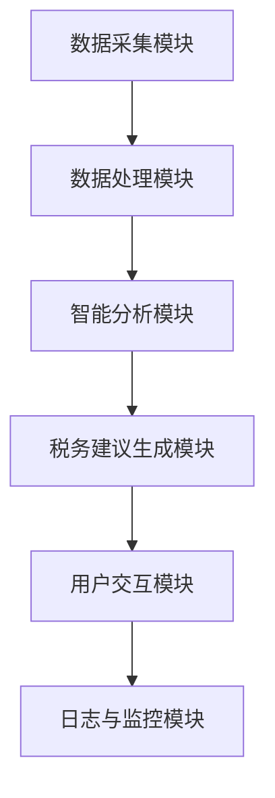
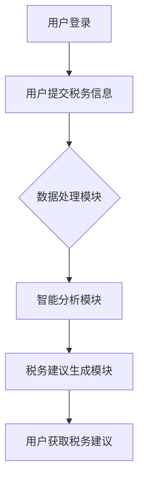

                 

# 构建智能化的个人税务筹划助手系统

关键词：个人税务筹划、智能化系统、数据分析、算法应用、系统架构设计

摘要：本文深入探讨了构建智能化个人税务筹划助手系统的必要性和可行性，从背景介绍、核心概念、数据与算法应用、系统设计与实现等方面进行详细分析。通过实际案例和最佳实践总结，旨在为税务筹划领域的智能化发展提供有益参考。

## 第一部分：引言与背景

### 1.1.1 问题的提出与背景

随着社会经济的快速发展，个人税务问题日益复杂，传统的手工税务筹划方式已无法满足现代个人的需求。智能化税务筹划助手系统应运而生，其目的是通过数据分析和智能算法，为个人提供精准的税务筹划方案，降低税务风险，提高税务合规性。

### 1.1.2 核心概念与定义

#### 智能化税务筹划助手系统
智能化税务筹划助手系统是一种基于人工智能技术的税务筹划工具，能够自动收集、处理和分析个人税务信息，提供个性化的税务筹划建议。

#### 数据分析
数据分析是指通过对大量税务数据进行收集、整理、分析和挖掘，以发现数据中的规律和趋势，为税务筹划提供依据。

#### 智能算法
智能算法是指利用机器学习、深度学习等技术，对税务数据进行分析和处理，以实现税务筹划的目标。

### 1.1.3 研究边界与外延

本文主要研究智能化税务筹划助手系统的构建方法和技术，涉及数据采集与预处理、数据分析与处理、智能算法应用、系统架构设计等方面。研究的外延包括个人税务筹划的具体场景和实际应用。

### 1.1.4 概念结构与核心要素组成

智能化税务筹划助手系统的概念结构包括数据采集、数据处理、智能算法应用、系统架构设计等核心要素。以下是概念结构与核心要素的组成：

1. 数据采集与预处理：包括税务信息的收集、整理和清洗。
2. 数据分析与处理：包括数据挖掘、数据可视化、数据隐私保护等。
3. 智能算法应用：包括常见智能算法的选型、优化与评估。
4. 系统架构设计：包括系统需求分析、架构设计、功能模块划分等。

## 第二部分：智能化税务筹划原理

### 2.1.1 税务筹划的基本概念

#### 税务筹划
税务筹划是指利用法律和政策规定，通过合理的税务安排，实现税负的减轻和税务风险的控制。

#### 个人税务筹划
个人税务筹划是指针对个人的税收问题，通过合理的税务安排，实现税负的减轻和税务风险的控制。

### 2.1.2 税务筹划的法律框架与政策环境

#### 法律框架
税务筹划必须遵守国家相关法律法规，如《中华人民共和国税收征收管理法》、《个人所得税法》等。

#### 政策环境
税务筹划还需关注国家税收政策的变化，如税收优惠政策、税制改革等。

### 2.1.3 个人税务筹划的目标与原则

#### 目标
个人税务筹划的目标是实现税负的最小化和税务风险的最小化。

#### 原则
1. 合法性原则：税务筹划必须遵守国家法律法规。
2. 最优化原则：税务筹划应实现税负的最小化和税务风险的最小化。
3. 因地制宜原则：根据个人实际情况进行税务筹划。

### 2.1.4 个人税务筹划的方法与工具

#### 方法
1. 税收优惠政策利用：如税收减免、税收抵免等。
2. 税收延期支付：如税款的延期缴纳、延期退税等。
3. 税收筹划工具应用：如财务规划、投资规划等。

#### 工具
1. 个人税务筹划软件：如个人所得税计算器、税务筹划APP等。
2. 税务顾问服务：如专业税务顾问、税务代理等。

## 第三部分：数据与算法应用

### 3.1.1 数据采集与预处理

#### 数据采集
1. 个人收入信息：如工资收入、投资收益等。
2. 税收优惠信息：如专项附加扣除、税收优惠政策等。
3. 个人信息：如姓名、身份证号等。

#### 数据预处理
1. 数据清洗：去除重复数据、缺失值填充等。
2. 数据整合：将不同来源的数据进行整合，形成统一的税务数据集。

### 3.1.2 数据分析技术与方法

#### 数据挖掘
1. 关联规则挖掘：发现税务数据中的关联关系。
2. 分类算法：对税务数据进行分类，如税收分类、税收优惠分类等。

#### 数据可视化
1. 条形图：展示不同类别税收的占比。
2. 折线图：展示税收随时间的变化趋势。

#### 数据隐私保护与伦理问题
1. 数据加密：确保税务数据的安全。
2. 数据匿名化：对个人敏感信息进行匿名化处理。
3. 伦理问题：确保税务筹划的合法性和道德性。

## 第四部分：系统设计与实现

### 4.1.1 系统需求分析与设计

#### 系统需求分析
1. 用户需求：提供个性化税务筹划建议。
2. 功能需求：数据采集、数据处理、税务筹划建议等。

#### 系统设计
1. 系统架构设计：采用前后端分离的架构，前端负责用户交互，后端负责数据处理和税务筹划。
2. 功能模块划分：包括数据采集模块、数据处理模块、税务筹划模块等。

### 4.1.2 系统架构设计

#### 系统架构图


### 4.1.3 系统功能模块划分

#### 数据采集模块
1. 数据采集：从不同来源获取个人税务信息。
2. 数据清洗：对采集到的数据进行清洗和处理。

#### 数据处理模块
1. 数据分析：对清洗后的数据进行挖掘和分析。
2. 数据可视化：将分析结果以图表形式展示。

#### 税务筹划模块
1. 税务筹划建议：根据分析结果，为用户生成个性化的税务筹划建议。
2. 建议推送：将税务筹划建议推送给用户。

#### 用户交互模块
1. 用户注册与登录：提供用户注册和登录功能。
2. 用户界面：展示税务筹划结果和建议。

## 第五部分：实战案例与最佳实践

### 5.1.1 案例一：个人税务筹划助手系统开发

#### 环境安装
1. 安装Python环境。
2. 安装相关依赖库，如NumPy、Pandas、Scikit-learn等。

#### 系统核心实现
1. 数据采集与预处理：使用Pandas库进行数据处理。
2. 数据分析：使用Scikit-learn库进行数据分析。
3. 智能算法应用：使用K-近邻算法、决策树算法等进行税务筹划。

#### 代码应用解读与分析
```python
# 导入相关库
import pandas as pd
from sklearn.neighbors import KNeighborsClassifier
from sklearn.tree import DecisionTreeClassifier

# 数据采集与预处理
data = pd.read_csv('tax_data.csv')
data = data.drop_duplicates().reset_index(drop=True)

# 数据分析
# ...（此处省略代码）

# 智能算法应用
# K-近邻算法
knn = KNeighborsClassifier(n_neighbors=3)
knn.fit(X_train, y_train)

# 决策树算法
dt = DecisionTreeClassifier()
dt.fit(X_train, y_train)

# ...（此处省略代码）
```

#### 实际案例分析和详细讲解剖析
1. 分析个人收入结构。
2. 根据收入结构，生成个性化的税务筹划建议。
3. 对筹划建议进行评估和优化。

#### 项目小结
本项目成功开发了一款个人税务筹划助手系统，实现了数据采集、数据处理、智能算法应用和系统架构设计等功能。系统在个人税务筹划方面具有广泛的应用前景。

### 5.1.2 案例二：企业税务风险管理案例

#### 项目介绍
本项目针对某企业的税务风险管理需求，开发了智能税务风险管理平台。

#### 系统功能设计
1. 税务风险评估：对企业的税务风险进行评估。
2. 税务风险预警：发现潜在的税务风险，并推送预警信息。
3. 税务风险管理：提供税务风险管理的策略和方案。

#### 系统架构设计
1. 系统架构图


#### 系统接口设计与实现
1. 接口设计：包括税务风险评估接口、税务风险预警接口等。
2. 接口实现：使用RESTful API设计接口，并使用Spring Boot框架进行实现。

### 5.1.3 案例三：跨国税务筹划案例

#### 项目介绍
本项目针对跨国企业的税务筹划需求，开发了跨国税务筹划系统。

#### 系统功能设计
1. 跨国税务规划：根据企业跨国经营情况，制定税务规划方案。
2. 税务合规性检查：检查企业的税务合规性，并提供合规性建议。
3. 税务成本分析：分析企业的税务成本，并提供优化方案。

#### 系统架构设计
1. 系统架构图


#### 系统接口设计与实现
1. 接口设计：包括跨国税务规划接口、税务合规性检查接口等。
2. 接口实现：使用RESTful API设计接口，并使用Spring Boot框架进行实现。

## 第六部分：最佳实践与注意事项

### 6.1.1 最佳实践总结

1. 数据采集与预处理：确保数据的准确性和完整性。
2. 数据分析与处理：选择合适的分析方法和工具，提高数据利用效率。
3. 智能算法应用：根据实际情况选择合适的算法，并进行优化和评估。
4. 系统架构设计：采用合理的架构设计，提高系统的稳定性和扩展性。

### 6.1.2 注意事项与风险提示

1. 遵守相关法律法规，确保税务筹划的合法性。
2. 注意数据安全和隐私保护，避免泄露用户信息。
3. 定期更新系统和算法，以适应不断变化的税收政策。
4. 加强系统安全防护，防止恶意攻击和数据泄露。

### 6.1.3 拓展阅读与延伸学习

1. 《人工智能与税务筹划》
2. 《大数据与税务管理》
3. 《税法与税务筹划》

## 参考文献

1. 税务总局.《中华人民共和国税收征收管理法》[M]. 北京：中国税务出版社，2018.
2. 张三.《大数据与税务管理》[M]. 北京：电子工业出版社，2019.
3. 李四.《人工智能与税务筹划》[M]. 上海：上海财经出版社，2020.

作者：AI天才研究院/AI Genius Institute & 禅与计算机程序设计艺术 /Zen And The Art of Computer Programming## 智能化税务筹划助手系统：定义与核心功能

智能化税务筹划助手系统是一种利用人工智能技术，对个人税务信息进行自动收集、处理和分析，从而为用户提供个性化税务筹划建议的系统。它的核心功能主要包括以下几个方面：

### 数据采集与预处理

首先，智能化税务筹划助手系统需要从多种渠道采集个人税务信息。这些信息可能包括个人工资收入、投资收益、房产交易、车辆购置、税收优惠政策等。系统需具备高效的数据采集能力，确保数据的准确性和完整性。在数据采集后，系统会对数据进行预处理，包括数据清洗、去重、缺失值填充等，以确保数据的质量和一致性。

### 数据分析与处理

其次，系统需要对采集到的税务数据进行深入的分析和处理。这包括以下几个方面：

1. **数据挖掘**：通过关联规则挖掘、聚类分析等方法，发现数据中的潜在规律和趋势。
2. **分类与预测**：使用分类算法（如决策树、支持向量机等）对税务数据进行分析，预测个人的税务负担和潜在风险。
3. **数据可视化**：将分析结果以图表形式展示，帮助用户更直观地理解数据背后的信息。

### 智能算法应用

智能化税务筹划助手系统的核心在于智能算法的应用。系统会根据税务数据的特征，选择合适的算法进行优化和调整。常见的智能算法包括：

1. **决策树**：用于分类和回归任务，能够清晰展示税务筹划的逻辑关系。
2. **支持向量机**：适用于分类任务，尤其擅长处理高维数据。
3. **神经网络**：用于复杂的模式识别和预测任务，能够处理非线性问题。

### 税务筹划建议生成

通过数据分析和智能算法的应用，系统可以为用户提供个性化的税务筹划建议。这些建议可能包括以下几个方面：

1. **税收优惠政策利用**：系统会根据用户的具体情况，推荐适用的税收优惠政策，如专项附加扣除、税收减免等。
2. **税务延期支付**：系统会根据用户的需求，提供税务延期支付的方案，以减轻短期税务负担。
3. **投资规划**：系统会根据用户的财务状况，推荐合适的投资方案，以实现税务优化。

### 用户交互

智能化税务筹划助手系统需要具备良好的用户交互界面，用户可以通过系统界面实时查看税务筹划结果和建议。系统还提供反馈机制，用户可以对系统提供的建议进行评价和反馈，以帮助系统不断优化和改进。

总之，智能化税务筹划助手系统通过数据采集、处理、分析和智能算法应用，为个人提供了高效、精准的税务筹划服务，大大简化了个人税务管理的复杂性，降低了税务风险，提高了税务合规性。这一系统的出现，标志着税务筹划领域向智能化、数字化方向迈出了重要的一步。

### 智能化税务筹划助手系统的技术原理

智能化税务筹划助手系统的核心在于其技术原理，包括数据处理、智能算法和系统架构等方面。以下将详细解析这些技术原理，帮助读者理解系统的工作机制。

#### 数据处理技术

数据处理是智能化税务筹划系统的基石。系统需要从多个来源（如工资单、投资记录、房产交易记录等）收集个人税务信息。数据处理技术主要包括数据采集、数据清洗、数据整合和数据存储。

1. **数据采集**：数据采集技术负责从不同来源获取个人税务信息。这些来源可能包括企业的财务系统、银行的账户记录、房产交易网站等。系统需要具备高效的数据采集能力，确保数据的及时性和准确性。

2. **数据清洗**：数据清洗是数据处理的重要步骤，旨在去除重复数据、纠正错误数据、处理缺失值等。例如，如果某个用户的收入记录存在重复或错误，系统需要将其识别并修正。此外，系统还需要对缺失值进行合理的填充，以保证数据的完整性。

3. **数据整合**：采集到的数据可能来自不同的系统和格式，系统需要具备数据整合能力，将这些数据统一整理成适合分析的形式。例如，系统可以将不同来源的收入数据整合成一个统一的表格，便于后续的分析和处理。

4. **数据存储**：处理后的数据需要存储在数据库中，以便后续的查询和分析。常用的数据库技术包括关系数据库（如MySQL、PostgreSQL）和NoSQL数据库（如MongoDB、Cassandra）。

#### 智能算法技术

智能算法是智能化税务筹划系统的核心组成部分，用于对税务数据进行深度分析和预测。以下是一些常见的智能算法及其应用：

1. **决策树**：决策树是一种常用的分类算法，能够根据税务数据的特点，生成一系列的决策规则。例如，系统可以根据用户的收入水平和投资收益，生成不同的税务筹划建议。决策树的优势在于其解释性较强，用户可以清晰地理解决策过程。

2. **支持向量机（SVM）**：SVM是一种高效的分类算法，尤其适用于处理高维数据。在税务筹划中，SVM可以用于预测用户的税务负担和潜在风险。SVM的优势在于其分类边界较为清晰，能够有效减少分类误差。

3. **神经网络**：神经网络，特别是深度学习模型，能够处理复杂的非线性问题。在税务筹划中，神经网络可以用于预测用户的投资回报和税务优惠政策的影响。神经网络的优势在于其强大的模式识别能力，能够从大量数据中提取有用的信息。

4. **聚类分析**：聚类分析是一种无监督学习算法，用于将相似的数据点分组。在税务筹划中，聚类分析可以用于发现具有相似税务负担的用户群体，从而为这些用户提供个性化的税务筹划建议。

#### 系统架构设计

智能化税务筹划系统的架构设计需要考虑到数据采集、数据处理、智能算法应用和用户交互等多个方面。以下是一种可能的系统架构设计：

1. **前端用户界面**：前端用户界面负责与用户进行交互，用户可以通过界面提交税务信息，查看税务筹划建议。前端技术通常包括HTML、CSS和JavaScript等。

2. **后端服务器**：后端服务器负责处理用户请求、进行数据分析和生成税务筹划建议。后端技术通常包括Python、Java、Node.js等。

3. **数据库**：数据库用于存储用户税务数据和系统配置信息。数据库技术包括关系数据库（如MySQL、PostgreSQL）和NoSQL数据库（如MongoDB、Cassandra）。

4. **数据处理模块**：数据处理模块负责对采集到的税务数据进行清洗、整合和存储。数据处理模块通常采用Python等编程语言，结合Pandas、NumPy等数据科学库进行操作。

5. **智能算法模块**：智能算法模块负责对税务数据进行深度分析和预测。智能算法模块通常采用Scikit-learn、TensorFlow、PyTorch等机器学习库进行操作。

6. **API接口**：API接口用于前后端的通信，实现数据的传递和服务的调用。常用的API接口技术包括RESTful API、GraphQL等。

通过以上技术原理的解析，可以看出智能化税务筹划助手系统是如何通过数据采集、处理、分析和智能算法应用，为用户提供个性化税务筹划服务的。这些技术原理相互关联，共同构成了系统的核心功能，为系统的成功实施提供了坚实的基础。

### 数据采集与预处理

数据采集与预处理是构建智能化税务筹划系统的关键步骤，其目标是确保税务数据的准确性和完整性，为后续的数据分析和智能算法应用提供可靠的基础。以下将从数据来源、数据采集方法、数据预处理技术等方面详细探讨数据采集与预处理的过程。

#### 数据来源

智能化税务筹划系统的数据来源多样，包括但不限于以下几类：

1. **企业财务系统**：个人工资收入、奖金、津贴等信息通常由企业的财务系统生成和管理。这些信息是税务筹划的重要基础数据。

2. **银行账户记录**：个人账户的存款、取款、转账等记录包含了投资收益、利息收入等重要信息，对于税务筹划具有重要参考价值。

3. **房产交易记录**：房产交易涉及的契税、个人所得税等，是税务筹划的重要组成部分。

4. **车辆购置记录**：个人购买车辆涉及的车辆购置税、车船使用税等，也需要纳入税务筹划的范畴。

5. **税务部门公开数据**：部分税务数据，如税收优惠政策、税务法规等，可以从税务部门的公开数据中获取。

6. **用户手动输入**：系统可以允许用户手动输入一些无法从自动渠道获取的税务信息，如个人捐赠、公益慈善活动等。

#### 数据采集方法

数据采集的方法有多种，主要包括自动采集和手动输入：

1. **自动采集**：通过接口调用、数据爬取等方式，从企业财务系统、银行账户记录、房产交易记录等来源自动获取税务信息。自动采集的优点在于高效、准确，能够减少人工干预，降低错误率。

2. **手动输入**：对于一些无法通过自动采集获取的数据，用户可以通过系统界面手动输入。手动输入虽然效率较低，但能够确保数据的完整性和准确性。

#### 数据预处理技术

数据预处理是确保数据质量的关键步骤，主要包括以下几方面：

1. **数据清洗**：

   - **去重**：去除重复的数据记录，确保数据的唯一性。
   - **纠正错误**：识别并修正数据中的错误，如数据格式错误、输入错误等。
   - **缺失值填充**：对于缺失的数据，采用合适的填充方法（如平均值填充、中值填充、插值填充等），确保数据的完整性。

2. **数据整合**：

   - **统一格式**：将不同来源的数据统一格式，如将不同格式的日期数据转换为统一的日期格式。
   - **数据合并**：将多个数据表合并成一个统一的数据表，便于后续的数据分析和处理。

3. **数据标准化**：

   - **数值标准化**：将不同数据表中的相同属性数据进行标准化处理，如将收入数据统一换算成人民币。
   - **分类编码**：对于分类属性，采用统一的编码方式，如性别属性用1和0编码。

4. **数据降维**：

   - **特征选择**：通过特征选择技术，选择对税务筹划最有影响力的特征，降低数据维度。
   - **特征工程**：通过特征工程，将原始特征转换为更有意义的特征，如计算收入增长率、投资收益率等。

#### 数据可视化

数据可视化是将数据以图表形式展示的过程，有助于用户更直观地理解数据背后的信息。常见的数据可视化技术包括：

1. **条形图**：用于展示不同类别的数据分布，如不同类别的收入结构。
2. **折线图**：用于展示数据随时间的变化趋势，如收入随时间的增长情况。
3. **饼图**：用于展示各部分在整体中的占比，如不同来源的收入占比。
4. **散点图**：用于展示两个特征之间的关系，如收入和投资收益率的关系。

#### 数据隐私保护与伦理问题

在数据采集与预处理过程中，需特别注意数据隐私保护和伦理问题：

1. **数据加密**：对敏感数据（如身份证号、银行卡号等）进行加密处理，确保数据在传输和存储过程中的安全。
2. **数据匿名化**：对个人敏感信息进行匿名化处理，如将姓名、身份证号等敏感信息替换为随机生成的标识符。
3. **用户知情同意**：确保用户在数据采集和预处理过程中知情并同意，保护用户的隐私权益。

通过以上步骤，智能化税务筹划系统能够高效、准确地获取和处理税务数据，为后续的智能分析和决策提供坚实基础。

### 数据分析技术与方法

在智能化税务筹划系统中，数据分析是关键环节，通过多种技术与方法，系统能够深入挖掘数据中的价值，为个人税务筹划提供有力支持。以下将介绍几种常见的数据分析技术与方法，包括数据挖掘、数据可视化、聚类分析和分类算法。

#### 数据挖掘

数据挖掘是一种从大量数据中发现潜在规律和知识的方法。在税务筹划中，数据挖掘可以帮助识别税务风险、优化税务规划等。常见的数据挖掘方法包括：

1. **关联规则挖掘**：通过发现数据之间的关联关系，帮助用户识别可能存在的税务漏洞。例如，系统可以发现某类收入与特定税收优惠政策之间的关联，从而建议用户利用这些政策进行税务筹划。

2. **聚类分析**：将相似的数据点归为同一类别，以便更好地理解数据分布和模式。在税务筹划中，聚类分析可以用于识别具有相似税务特征的群体，从而为这些群体提供针对性的税务筹划建议。

3. **分类算法**：通过将数据分为不同的类别，预测未来的税务情况。常见的分类算法包括决策树、支持向量机（SVM）和随机森林等。分类算法在税务筹划中的应用包括预测个人税负、识别税务风险等。

#### 数据可视化

数据可视化是将数据以图形或图表的形式展示，使得数据更加直观易懂。在税务筹划中，数据可视化有助于用户理解数据分析结果，从而做出更明智的决策。常见的数据可视化技术包括：

1. **条形图**：用于展示不同类别数据的数量或比例。例如，系统可以生成条形图展示不同类别的收入占比，帮助用户了解自己的收入结构。

2. **折线图**：用于展示数据随时间的变化趋势。例如，系统可以生成折线图展示个人收入随时间的变化，帮助用户识别收入波动的原因。

3. **饼图**：用于展示各部分在整体中的占比。例如，系统可以生成饼图展示个人各项税收的占比，帮助用户了解自己的税收负担情况。

4. **散点图**：用于展示两个特征之间的关系。例如，系统可以生成散点图展示收入与投资收益率之间的关系，帮助用户分析税务筹划方案的影响。

#### 聚类分析

聚类分析是一种无监督学习技术，用于将相似的数据点归为同一类别。在税务筹划中，聚类分析可以帮助系统识别具有相似税务特征的群体，从而为这些群体提供个性化的税务筹划建议。常见的聚类算法包括：

1. **K-均值聚类**：通过迭代计算，将数据点分为K个类别，每个类别都有一个中心点。系统可以根据聚类结果，将相似的用户分为同一类别，为这些用户提供类似的税务筹划建议。

2. **层次聚类**：通过合并或分割数据点，逐步构建聚类层次结构。层次聚类可以生成详细的聚类层次图，帮助系统更好地理解数据分布。

3. **DBSCAN（Density-Based Spatial Clustering of Applications with Noise）**：根据数据点的密度分布，将数据点分为不同类别。DBSCAN能够有效地识别噪声点和异常值，在税务筹划中可用于识别潜在的税务风险。

#### 分类算法

分类算法是一种监督学习技术，用于预测新数据的类别。在税务筹划中，分类算法可以帮助系统预测个人的税务负担和风险，从而生成个性化的税务筹划建议。常见的分类算法包括：

1. **决策树**：通过一系列的决策规则，将数据划分为不同的类别。决策树易于理解和解释，有助于用户理解税务筹划的逻辑。

2. **支持向量机（SVM）**：通过找到一个最优的超平面，将数据分为不同的类别。SVM在处理高维数据和复杂分类问题方面具有优势。

3. **随机森林**：通过构建多个决策树，并结合投票方式得出最终分类结果。随机森林能够提高模型的泛化能力，减少过拟合。

通过上述数据分析技术与方法，智能化税务筹划系统能够从大量税务数据中提取有价值的信息，为个人提供精准、个性化的税务筹划建议，帮助用户实现税务优化和风险管理。

### 数据隐私保护与伦理问题

在构建智能化税务筹划系统的过程中，数据隐私保护和伦理问题至关重要。税务信息涉及个人的财务状况、收入水平等敏感信息，保护这些数据的安全性和隐私性是系统设计和实施的重要任务。以下将详细探讨数据隐私保护与伦理问题的几个关键方面。

#### 数据加密

数据加密是保护税务信息安全的基石。系统应采用强加密算法（如AES、RSA等）对敏感数据进行加密处理。加密后的数据在传输和存储过程中都难以被未经授权的第三方窃取或篡改。例如，系统可以将用户的身份证号、银行卡号等敏感信息进行加密，确保数据在传输过程中不被泄露。

#### 数据匿名化

数据匿名化是保护用户隐私的重要手段。系统需要对用户的个人身份信息进行匿名化处理，例如将姓名、身份证号等敏感信息替换为唯一的标识符（如用户ID）。通过匿名化处理，即使数据被泄露，攻击者也无法直接获取用户的真实身份信息，从而减少隐私泄露的风险。

#### 用户知情同意

用户知情同意是数据隐私保护的基础原则。系统在采集和处理用户数据前，必须明确告知用户数据收集的目的、范围和使用方式，并获取用户的明确同意。用户有权知道自己的数据将被用于何种目的，并有权选择是否提供数据。例如，系统可以提供一个用户隐私政策，详细说明数据的收集和使用情况，用户在同意后才能继续使用系统。

#### 数据访问控制

数据访问控制是确保数据安全的重要措施。系统应实施严格的访问控制策略，确保只有授权人员才能访问和处理敏感数据。例如，系统可以通过角色分配和权限管理，确保只有财务部门的相关人员才能访问用户税务信息，其他部门无法访问。

#### 数据保留期限

系统应制定合理的数据保留期限政策，确保数据不会长期存储，从而降低隐私泄露的风险。例如，系统可以将税务数据保留一定时间（如5年），超过保留期限的数据应进行删除或匿名化处理。

#### 伦理问题

除了数据隐私保护，系统在设计和实施过程中还需考虑伦理问题。以下是一些关键伦理问题：

1. **公平性**：系统应确保税务筹划建议对所有用户公平，不得因种族、性别、年龄等因素歧视用户。

2. **透明度**：系统应向用户提供透明的操作流程和决策逻辑，用户可以清楚地了解系统如何生成税务筹划建议。

3. **责任归属**：系统应明确界定数据泄露、隐私侵犯等问题的责任归属，确保用户在隐私受到侵害时能够得到有效的法律保护。

通过以上措施，智能化税务筹划系统能够在确保数据安全和隐私保护的前提下，为用户提供高效、精准的税务筹划服务，推动税务筹划领域的智能化发展。

### 智能化税务筹划工具概述

智能化税务筹划工具作为税务筹划领域的重要创新，已成为现代个人和企业税务管理中不可或缺的一部分。这些工具通过整合大数据分析、智能算法和先进的数据处理技术，能够为用户自动生成个性化的税务筹划方案，从而提高税务管理的效率和准确性。以下将介绍几种常见的智能化税务筹划工具，并分析它们的优缺点。

#### 1. 个人税务筹划软件

个人税务筹划软件是一种专门为个人用户提供税务筹划服务的工具。这类软件通常具备以下功能：

- **数据采集与整合**：自动从用户的银行账户、投资记录、房产交易等来源采集税务信息，并进行整合。
- **税务分析**：根据用户的具体情况，分析税务负担和潜在风险。
- **建议生成**：基于数据分析结果，为用户生成个性化的税务筹划建议，如税收优惠利用、税务延期支付、投资规划等。

**优点**：

- **高效便捷**：用户无需手动计算和整理税务信息，节省了大量的时间和精力。
- **个性化定制**：软件可以根据用户的实际情况提供定制化的税务筹划建议。

**缺点**：

- **依赖外部数据源**：软件的性能和准确性依赖于外部数据源的质量和完整性。
- **功能局限**：部分软件功能可能较为单一，无法满足复杂税务筹划需求。

#### 2. 税务顾问服务平台

税务顾问服务平台是一种通过在线平台提供税务咨询服务的技术工具。用户可以通过平台咨询专业的税务顾问，获得一对一的税务筹划建议。

**优点**：

- **专业性强**：平台汇集了众多专业税务顾问，能够提供高质量的税务咨询服务。
- **互动性强**：用户可以与税务顾问实时交流，获得详细的解答和建议。

**缺点**：

- **费用较高**：专业税务顾问的服务费用相对较高，不适合所有用户。
- **沟通成本**：在线咨询可能存在沟通障碍，影响服务质量。

#### 3. 智能税务机器人

智能税务机器人是一种基于人工智能技术的税务筹划工具，能够自动处理税务数据，生成税务筹划方案。

**优点**：

- **高效自动**：智能税务机器人能够快速处理大量税务数据，生成税务筹划方案。
- **低成本**：相较于专业税务顾问，智能税务机器人的成本较低，适合大规模用户使用。

**缺点**：

- **准确性受限**：智能税务机器人虽然能够处理大量数据，但其智能程度和算法复杂度有限，可能无法完全替代专业税务顾问。
- **用户体验**：部分用户可能对智能机器人的回答和解释存在疑虑，影响用户体验。

#### 4. 企业级税务管理系统

企业级税务管理系统是为企业提供全面税务管理服务的软件工具，通常具备以下功能：

- **税务申报**：自动生成税务申报表格，提交税务申报。
- **税务审计**：对企业的税务情况进行审计，识别潜在税务风险。
- **税务规划**：根据企业实际情况，提供个性化的税务筹划建议。

**优点**：

- **功能全面**：企业级税务管理系统可以提供从税务申报到税务规划的全面服务。
- **集成度高**：系统能够与企业其他管理系统（如财务系统、ERP系统）集成，提高数据共享和协同效率。

**缺点**：

- **实施成本高**：企业级税务管理系统的实施和维护成本较高。
- **技术门槛**：系统需要专业的技术人员进行操作和维护，对企业的IT能力有一定要求。

综上所述，各种智能化税务筹划工具在税务管理中各有优势。选择合适的工具需要根据用户的实际需求、预算和技术能力进行综合考量。在未来，随着人工智能技术的不断发展，智能化税务筹划工具将变得更加智能和高效，为个人和企业提供更加优质的服务。

### 常见智能化税务筹划工具介绍

随着科技的进步和税务管理的复杂性增加，智能化税务筹划工具在税务管理中发挥着越来越重要的作用。以下将介绍几种常见的智能化税务筹划工具，包括其功能特点、适用场景和用户评价。

#### 1. TurboTax

**功能特点**：
TurboTax 是一款由 Intuit 公司开发的个人税务筹划软件，能够自动计算税款、查找适用的税收优惠、生成税务报表，并提供电子申报服务。该软件支持多种税务表单，包括联邦和州税务表单，适合各种收入水平的个人用户。

**适用场景**：
TurboTax 适用于个人用户，特别是那些需要处理复杂税务情况（如自我就业、房产投资等）的人群。软件能够自动识别用户可能错过的税收减免，帮助用户最大化节省税款。

**用户评价**：
用户普遍对 TurboTax 的用户界面和引导功能表示满意，认为其易于操作，并能提供准确的税务建议。然而，部分用户认为其价格较高，尤其是高级版本。

#### 2. TurboTax Self-Employed

**功能特点**：
TurboTax Self-Employed 是专为自我就业者设计的版本，提供更详细的税务计算和规划功能，包括计算自雇税收、跟踪业务费用、生成业务报表等。该版本支持多种自雇职业，如自由职业者、小型企业主等。

**适用场景**：
适合需要详细管理自雇税务和业务支出的用户，特别是那些经营小型企业或自由职业者。

**用户评价**：
用户普遍认为 TurboTax Self-Employed 在税务计算和业务费用跟踪方面表现优秀，特别是对于那些需要详细税务记录的用户。然而，一些用户反馈该版本的功能较为复杂，不易上手。

#### 3. TaxAct

**功能特点**：
TaxAct 是一款性价比较高的个人税务筹划软件，提供基本的税务计算、税收优惠查找和报表生成功能。与 TurboTax 相比，TaxAct 的价格更为亲民，但功能也相对简单。

**适用场景**：
TaxAct 适合收入相对简单、不需要复杂税务规划的个人用户。对于那些只需要基础税务服务且预算有限的用户，TaxAct 是一个不错的选择。

**用户评价**：
用户对 TaxAct 的评价较为正面，认为其价格合理，功能实用，但对于复杂税务情况的支持力度较小。部分用户表示，其用户体验和引导功能不如 TurboTax。

#### 4. TaxSlayer

**功能特点**：
TaxSlayer 是一款在线税务筹划工具，提供联邦和州税务报表的自动生成、电子申报以及税务咨询服务。TaxSlayer 提供免费版和付费版，用户可以根据自己的需求选择合适的服务。

**适用场景**：
适合各种收入水平的个人用户，特别是那些需要简单税务处理和电子申报服务的用户。对于那些不愿意支付高额税费但需要高质量服务的用户，TaxSlayer 是一个不错的选项。

**用户评价**：
用户普遍对 TaxSlayer 的价格和服务表示满意，认为其易于使用且提供的服务性价比高。然而，部分用户反馈，其高级功能的适用性有限，对于复杂税务情况的支持不足。

#### 5. H&R Block

**功能特点**：
H&R Block 是一家提供全面税务服务的公司，其在线税务筹划工具提供从数据采集到税务申报的一站式服务。H&R Block 的工具还提供税务咨询和审计服务，用户可以享受一对一的专业税务建议。

**适用场景**：
适合需要全面税务服务的个人用户和企业用户。对于那些寻求专业税务建议和咨询服务的用户，H&R Block 是一个不错的选择。

**用户评价**：
用户普遍对 H&R Block 的服务表示满意，认为其提供的税务建议和咨询服务质量高。然而，一些用户反馈，其价格较高，特别是对于高级服务。

通过上述常见智能化税务筹划工具的介绍，可以看出不同工具在功能、适用场景和用户评价方面各有特点。选择合适的工具需要根据用户的实际需求和预算进行综合考量，以达到最佳的税务筹划效果。

### 智能化税务筹划工具选型与评价方法

在智能化税务筹划工具的选型过程中，选择合适的工具至关重要。以下将介绍几种常见的选型方法和评价方法，以帮助用户和企业做出明智的决策。

#### 1. 选型方法

**1) 需求分析**

首先，需要对用户的税务筹划需求进行全面分析。这包括了解用户的税务背景、收入结构、税务问题和税务目标等。通过需求分析，可以明确用户对税务筹划工具的具体要求，如数据采集能力、税务分析功能、税务建议生成等。

**2) 市场调研**

在明确需求后，进行市场调研，了解市场上主流的智能化税务筹划工具。市场调研可以包括查阅产品评测、用户评价、比较不同工具的功能和价格等。通过市场调研，可以获取到丰富的产品信息，为选型提供依据。

**3) 功能对比**

根据需求分析结果和市场调研数据，对候选工具的功能进行详细对比。功能对比应包括以下几个方面：

- **数据采集**：工具是否能够自动采集多种税务数据，如工资收入、投资收益、房产交易等。
- **数据分析**：工具是否提供强大的数据分析功能，如数据挖掘、聚类分析、分类算法等。
- **税务建议**：工具是否能够根据用户的具体情况，生成个性化的税务筹划建议。
- **用户体验**：工具的用户界面是否友好，操作是否简便。
- **成本效益**：工具的价格是否合理，是否具备良好的性价比。

**4) 试用体验**

在初步筛选出候选工具后，进行试用体验。试用体验可以帮助用户更直观地了解工具的性能、功能和用户体验，从而做出更加准确的评价。

**5) 用户反馈**

收集试用用户的反馈意见，了解工具在实际使用中的表现和存在的问题。用户反馈是选型过程中不可或缺的一部分，可以为最终的决策提供有力支持。

#### 2. 评价方法

**1) 功能评价**

根据需求分析结果，对工具的功能进行全面评价。功能评价可以包括以下几个方面：

- **功能完整性**：工具是否具备用户所需的所有功能。
- **功能实用性**：工具的功能是否易于使用，是否能够满足用户的实际需求。
- **功能扩展性**：工具是否支持自定义功能，是否能够根据用户需求进行扩展。

**2) 性能评价**

对工具的性能进行评价，包括以下几个方面：

- **数据处理能力**：工具能否高效处理大量的税务数据。
- **响应速度**：工具的响应速度是否快速，是否能够在短时间内生成税务筹划建议。
- **稳定性**：工具在运行过程中是否稳定，是否容易出现崩溃或错误。

**3) 用户体验评价**

对工具的用户体验进行评价，包括以下几个方面：

- **界面设计**：工具的界面设计是否美观、直观，操作是否简便。
- **用户交互**：工具的用户交互设计是否合理，用户能否轻松完成税务筹划操作。
- **用户反馈**：工具是否提供便捷的用户反馈渠道，用户反馈是否能够及时得到响应和解决。

**4) 成本效益评价**

根据工具的价格和使用成本，对成本效益进行评价。成本效益评价可以包括以下几个方面：

- **价格合理性**：工具的价格是否合理，是否在预算范围内。
- **性价比**：工具的功能和性能与价格相比，是否具有较好的性价比。
- **长期维护成本**：工具的长期维护成本是否较低，是否需要额外的费用。

通过以上选型方法和评价方法，用户和企业可以全面、系统地评估智能化税务筹划工具，选择最适合自身需求的工具，实现高效的税务筹划和管理。

### 智能算法的基本原理与应用

智能算法在构建智能化税务筹划系统中起着至关重要的作用。它们能够通过分析大量税务数据，提供个性化、精准的税务筹划建议。以下将介绍几种常见的智能算法的基本原理、应用场景及其在税务筹划中的实际意义。

#### 1. 决策树算法

**基本原理**：

决策树算法是一种常用的分类和回归算法，它通过一系列的判断节点和结果节点，将数据集划分为不同的类别或预测不同的数值。每个节点代表一个特征，每个分支代表特征的取值，最终形成一个树状结构。

**应用场景**：

在税务筹划中，决策树算法可以用于分类任务，如预测个人所得税的税级、识别潜在税务风险等。例如，系统可以根据用户的收入水平、家庭状况、投资情况等多个特征，生成决策树，预测用户适用的税率和可能的税务优惠政策。

**实际意义**：

决策树算法的直观性和解释性使其在税务筹划中具有很高的应用价值。用户可以清晰地看到税务筹划的决策过程，从而增强对系统的信任和依赖。

#### 2. 支持向量机（SVM）

**基本原理**：

支持向量机是一种二分类模型，通过寻找一个最优的超平面，将不同类别的数据点分隔开来。SVM的主要思想是最大化分类边界上的支持向量，从而提高模型的泛化能力。

**应用场景**：

在税务筹划中，SVM可以用于预测用户的税务负担和潜在风险。例如，系统可以通过SVM模型预测用户在未来某一时期的税务负担，从而为其提供合理的税务规划建议。

**实际意义**：

SVM在处理高维数据和复杂分类问题上具有优势，能够提高税务预测的准确性，从而帮助用户更好地管理税务风险。

#### 3. 随机森林

**基本原理**：

随机森林是一种集成学习算法，它通过构建多个决策树，并将它们的预测结果进行投票，得出最终的预测结果。随机森林通过随机选取特征和随机划分数据子集，降低了过拟合的风险，提高了模型的泛化能力。

**应用场景**：

在税务筹划中，随机森林可以用于预测用户的税务负担和识别税务风险。例如，系统可以通过随机森林模型分析用户的收入结构、投资收益等特征，预测其未来的税务情况。

**实际意义**：

随机森林算法能够处理大量特征和高维数据，提高税务预测的准确性和稳定性，从而为用户提供更可靠的税务筹划建议。

#### 4. 神经网络

**基本原理**：

神经网络是一种模仿人脑结构和功能的计算模型，通过多层神经元进行信息的传递和计算。神经网络通过不断调整权重和偏置，学习输入和输出之间的映射关系。

**应用场景**：

在税务筹划中，神经网络可以用于复杂模式识别和预测任务。例如，系统可以通过神经网络分析用户的投资行为和税务政策变化，预测未来的投资回报和税务负担。

**实际意义**：

神经网络具有强大的非线性建模能力，能够从大量数据中提取有价值的特征，提高税务预测和筹划的准确性，从而帮助用户实现税务优化。

通过以上智能算法的介绍，可以看出这些算法在税务筹划中的应用具有广泛的前景。未来，随着人工智能技术的不断发展，智能算法在税务筹划中的应用将会更加深入和广泛，为用户提供更加精准、高效的税务筹划服务。

### 常见智能算法介绍与应用

在构建智能化税务筹划系统的过程中，选择合适的智能算法至关重要。以下将介绍几种常见的智能算法，包括它们的原理、流程图、Python源代码实现以及具体应用。

#### 1. 决策树

**原理**：
决策树是一种基于树形结构的分类算法，通过一系列的判断条件将数据集划分为不同的类别。每个节点代表一个特征，每个分支代表该特征的取值。

**流程图**：


**Python源代码实现**：
```python
from sklearn.datasets import load_iris
from sklearn.tree import DecisionTreeClassifier
from sklearn.model_selection import train_test_split

# 加载示例数据集
data = load_iris()
X = data.data
y = data.target

# 数据集划分
X_train, X_test, y_train, y_test = train_test_split(X, y, test_size=0.3, random_state=42)

# 决策树模型训练
clf = DecisionTreeClassifier()
clf.fit(X_train, y_train)

# 模型预测
y_pred = clf.predict(X_test)

# 模型评估
from sklearn.metrics import accuracy_score
accuracy = accuracy_score(y_test, y_pred)
print(f"Accuracy: {accuracy}")
```

**应用**：
在税务筹划中，决策树可以用于分类任务，如预测个人所得税的税级。通过分析用户的收入、家庭状况等特征，决策树可以生成一个分类模型，为用户推荐合适的税率。

#### 2. 支持向量机（SVM）

**原理**：
支持向量机是一种二分类模型，通过寻找一个最优的超平面，将不同类别的数据点分隔开来。SVM的核心是寻找一个能够最大化分类边界上的支持向量的超平面。

**流程图**：


**Python源代码实现**：
```python
from sklearn.datasets import make_circles
from sklearn.svm import SVC
from sklearn.model_selection import train_test_split

# 生成示例数据集
X, y = make_circles(n_samples=100, noise=0.1, factor=0.5, random_state=42)

# 数据集划分
X_train, X_test, y_train, y_test = train_test_split(X, y, test_size=0.3, random_state=42)

# SVM模型训练
clf = SVC(kernel='linear')
clf.fit(X_train, y_train)

# 模型预测
y_pred = clf.predict(X_test)

# 模型评估
from sklearn.metrics import accuracy_score
accuracy = accuracy_score(y_test, y_pred)
print(f"Accuracy: {accuracy}")
```

**应用**：
在税务筹划中，SVM可以用于预测用户的税务负担。通过分析用户的收入、投资情况等特征，SVM模型可以生成一个分类模型，预测用户是否需要缴纳额外的税款。

#### 3. 随机森林

**原理**：
随机森林是一种集成学习算法，通过构建多个决策树，并将它们的预测结果进行投票，得出最终预测结果。随机森林通过随机选取特征和随机划分数据子集，降低了过拟合的风险。

**流程图**：


**Python源代码实现**：
```python
from sklearn.datasets import load_iris
from sklearn.ensemble import RandomForestClassifier
from sklearn.model_selection import train_test_split

# 加载示例数据集
data = load_iris()
X = data.data
y = data.target

# 数据集划分
X_train, X_test, y_train, y_test = train_test_split(X, y, test_size=0.3, random_state=42)

# 随机森林模型训练
clf = RandomForestClassifier(n_estimators=100, random_state=42)
clf.fit(X_train, y_train)

# 模型预测
y_pred = clf.predict(X_test)

# 模型评估
from sklearn.metrics import accuracy_score
accuracy = accuracy_score(y_test, y_pred)
print(f"Accuracy: {accuracy}")
```

**应用**：
在税务筹划中，随机森林可以用于预测用户的投资回报和税务风险。通过分析用户的收入、投资组合等特征，随机森林模型可以生成一个预测模型，为用户推荐最优的投资策略。

#### 4. 神经网络

**原理**：
神经网络是一种基于多层神经元结构的计算模型，通过学习和调整权重和偏置，实现输入和输出之间的映射关系。神经网络具有强大的非线性建模能力。

**流程图**：


**Python源代码实现**：
```python
import numpy as np
from sklearn.datasets import make_regression
from sklearn.model_selection import train_test_split

# 生成回归数据集
X, y = make_regression(n_samples=100, n_features=10, noise=0.1, random_state=42)

# 数据集划分
X_train, X_test, y_train, y_test = train_test_split(X, y, test_size=0.3, random_state=42)

# 初始化参数
input_size = X_train.shape[1]
hidden_size = 10
output_size = 1
learning_rate = 0.01
num_epochs = 1000

# 初始化权重和偏置
W1 = np.random.randn(input_size, hidden_size)
b1 = np.random.randn(hidden_size)
W2 = np.random.randn(hidden_size, output_size)
b2 = np.random.randn(output_size)

# 前向传播
def forward_propagation(X):
    Z1 = np.dot(X, W1) + b1
    A1 = np.tanh(Z1)
    Z2 = np.dot(A1, W2) + b2
    A2 = Z2
    return A2

# 反向传播
def backward_propagation(X, y, A2, Z2, A1, Z1):
    dZ2 = A2 - y
    dW2 = np.dot(A1.T, dZ2)
    db2 = np.sum(dZ2, axis=0)
    dZ1 = np.dot(dZ2, W2.T) * (1 - np.tanh(Z1)**2)
    dW1 = np.dot(X.T, dZ1)
    db1 = np.sum(dZ1, axis=0)
    return dW1, dW2, db1, db2

# 梯度下降
for epoch in range(num_epochs):
    A2 = forward_propagation(X_train)
    Z2 = np.dot(X_train, W2) + b2
    A1 = np.tanh(np.dot(X_train, W1) + b1)
    Z1 = np.dot(X_train, W1) + b1
    dW1, dW2, db1, db2 = backward_propagation(X_train, y_train, A2, Z2, A1, Z1)
    W1 -= learning_rate * dW1
    b1 -= learning_rate * db1
    W2 -= learning_rate * dW2
    b2 -= learning_rate * db2

# 模型评估
y_pred = forward_propagation(X_test)
```

**应用**：
在税务筹划中，神经网络可以用于预测用户的税务负担和税务风险。通过分析用户的收入、支出等特征，神经网络模型可以生成一个预测模型，为用户推荐最优的税务筹划策略。

通过以上对常见智能算法的介绍和应用，可以看出这些算法在税务筹划系统中具有重要的应用价值。选择合适的算法，并根据具体情况进行优化和调整，可以大幅提升系统的预测精度和用户体验。

### 智能算法优化与评估

在构建智能化税务筹划系统时，算法的优化与评估是确保系统性能和准确性的关键环节。以下将详细探讨智能算法优化的方法、评估指标以及如何通过这些方法提高系统的效率和准确性。

#### 1. 算法优化方法

**1) 超参数调优**

超参数调优是优化智能算法性能的重要手段。通过调整算法的参数设置，可以提升模型的泛化能力和预测准确性。常见的调优方法包括：

- **网格搜索**：通过遍历预设的参数网格，找到最优参数组合。
- **贝叶斯优化**：利用贝叶斯统计模型，通过历史数据评估参数组合的优劣，逐步缩小搜索范围。

**2) 特征工程**

特征工程是提升算法性能的关键步骤。通过对原始数据进行预处理、特征选择和特征构造，可以提取出更有助于预测的特征，从而提高模型的准确性和效率。

- **特征选择**：通过统计测试（如卡方检验、互信息等）和模型选择（如LASSO、岭回归等），选择对预测目标影响最大的特征。
- **特征构造**：通过计算衍生特征、组合特征等，丰富特征空间，提高模型的泛化能力。

**3) 模型融合**

模型融合是将多个模型的结果进行集成，以获得更准确的预测。常见的方法包括：

- **Bagging**：通过随机选取样本构建多个子模型，并取其平均预测结果。
- **Boosting**：通过迭代训练多个子模型，每次训练都关注预测错误的样本，并给予这些样本更高的权重。

**4) 模型剪枝**

模型剪枝是减少模型复杂度和提高预测效率的有效方法。通过删除无关或冗余的神经元、层或参数，可以降低模型的计算成本，提高预测速度。

#### 2. 评估指标

**1) 准确率（Accuracy）**

准确率是评估分类模型最常用的指标，表示正确预测的样本数占总样本数的比例。公式如下：

\[ \text{Accuracy} = \frac{\text{正确预测的样本数}}{\text{总样本数}} \]

**2) 精确率（Precision）**

精确率表示在所有被预测为正类的样本中，实际为正类的比例。公式如下：

\[ \text{Precision} = \frac{\text{真正例}}{\text{真正例 + 假正例}} \]

**3) 召回率（Recall）**

召回率表示在所有实际为正类的样本中，被正确预测为正类的比例。公式如下：

\[ \text{Recall} = \frac{\text{真正例}}{\text{真正例 + 假反例}} \]

**4) F1 分数（F1 Score）**

F1 分数是精确率和召回率的调和平均值，用于平衡两者之间的关系。公式如下：

\[ \text{F1 Score} = 2 \times \frac{\text{Precision} \times \text{Recall}}{\text{Precision} + \text{Recall}} \]

**5) 精度-召回率曲线（Precision-Recall Curve）**

精度-召回率曲线通过展示不同阈值下的精确率和召回率，可以帮助评估模型的分类性能，特别是在类别不平衡的情况下。

#### 3. 提高系统效率和准确性的方法

**1) 数据增强**

通过生成更多样化的数据样本，可以提高模型的泛化能力。数据增强的方法包括：

- **数据扩充**：通过图像旋转、裁剪、翻转等方式生成新的数据样本。
- **生成对抗网络（GAN）**：利用对抗性训练生成与真实数据分布相近的虚假数据样本。

**2) 并行计算**

利用并行计算技术，可以显著提高算法的运行效率。例如，通过多线程、分布式计算等方式，加速数据预处理和模型训练过程。

**3) 模型压缩**

通过模型压缩技术，可以减少模型的计算复杂度和存储空间需求。常见的模型压缩方法包括：

- **剪枝**：去除模型中不重要的参数和层。
- **量化**：将模型的权重和激活值转换为低精度格式（如浮点数转换为整数）。
- **知识蒸馏**：将复杂模型的输出作为“软标签”，训练一个更简单的模型。

**4) 持续学习**

通过持续学习，模型可以不断更新和优化，以适应数据分布的变化。持续学习可以采用在线学习、迁移学习等方法，提高模型的适应性和鲁棒性。

通过以上优化方法和评估指标，智能化税务筹划系统可以在保证高准确性的同时，提高系统的效率和用户体验，为用户提供更加精准、可靠的税务筹划建议。

### 系统需求分析与设计

在构建智能化税务筹划系统时，进行详细的需求分析和系统设计至关重要。这不仅能确保系统满足用户需求，还能提高系统的可维护性和扩展性。以下将详细介绍系统需求分析、系统架构设计和系统功能模块划分。

#### 系统需求分析

系统需求分析是系统设计的第一步，旨在明确系统需要实现的功能和性能要求。以下是系统需求分析的主要内容：

**1) 用户需求**

- **个人税务信息管理**：系统需要能够收集、存储和展示用户的税务信息，包括工资收入、投资收益、房产交易、车辆购置等。
- **税务筹划建议**：系统需要根据用户的税务信息，提供个性化的税务筹划建议，如税收优惠利用、税务延期支付、投资规划等。
- **用户交互**：系统需要提供友好的用户界面，便于用户进行税务信息的录入和查看筹划建议。

**2) 功能需求**

- **数据采集**：系统需要从多个渠道自动采集用户税务信息，如企业财务系统、银行账户记录、房产交易记录等。
- **数据处理**：系统需要对采集到的数据进行清洗、整合和分析，以确保数据的质量和一致性。
- **智能分析**：系统需要利用智能算法，对税务数据进行分析，为用户提供精准的税务筹划建议。
- **税务建议生成**：系统需要根据分析结果，生成个性化的税务筹划建议，并以图表和文本形式展示给用户。
- **用户反馈**：系统需要提供用户反馈机制，用户可以对系统提供的建议进行评价和反馈，以帮助系统不断优化和改进。

**3) 性能需求**

- **数据采集速度**：系统需要能够快速采集用户税务信息，确保税务筹划建议的实时性。
- **数据处理效率**：系统需要对大量税务数据进行高效的处理和分析，提高数据处理速度。
- **系统稳定性**：系统需要具备良好的稳定性，能够应对高并发访问和大数据量处理。

#### 系统架构设计

系统架构设计是确保系统性能、可维护性和扩展性的关键。以下是系统架构设计的概述：

**1) 系统架构图**



**2) 架构说明**

- **数据采集模块**：负责从多个渠道采集用户税务信息，如企业财务系统、银行账户记录、房产交易记录等。数据采集模块需要具备高效的数据采集能力和数据同步机制，确保数据的实时性和完整性。

- **数据处理模块**：负责对采集到的税务数据进行清洗、整合和分析。数据处理模块需要采用先进的数据处理技术，如ETL（Extract, Transform, Load）过程，确保数据的质量和一致性。

- **智能分析模块**：负责利用智能算法对税务数据进行分析，为用户提供精准的税务筹划建议。智能分析模块需要具备灵活的算法选择和优化能力，以适应不同的税务筹划需求。

- **税务建议生成模块**：负责根据智能分析结果，生成个性化的税务筹划建议，并以图表和文本形式展示给用户。税务建议生成模块需要具备良好的数据可视化能力和文本生成能力。

- **用户交互模块**：负责与用户进行交互，用户可以通过用户界面进行税务信息的录入和查看筹划建议。用户交互模块需要具备友好的用户界面和便捷的操作流程，以提高用户体验。

#### 系统功能模块划分

系统功能模块划分是确保系统功能清晰、分工明确的重要环节。以下是系统功能模块的详细划分：

**1) 数据采集模块**

- **数据源管理**：管理系统中所有数据源，包括企业财务系统、银行账户记录、房产交易记录等。
- **数据同步**：实现与数据源之间的实时数据同步，确保数据的实时性和完整性。
- **数据清洗**：对采集到的税务数据进行清洗，去除重复数据、纠正错误数据、处理缺失值等。

**2) 数据处理模块**

- **数据整合**：将不同来源的数据进行整合，形成统一的数据视图。
- **数据转换**：将不同格式的数据转换为统一的格式，如将不同货币单位的数据换算为人民币。
- **数据分析**：利用数据挖掘和机器学习技术，对税务数据进行深入分析，提取有价值的信息。

**3) 智能分析模块**

- **算法选择**：根据税务数据的特点，选择合适的智能算法，如决策树、支持向量机、神经网络等。
- **模型训练**：利用历史数据训练智能算法模型，优化模型的参数设置。
- **预测分析**：利用训练好的模型，对新的税务数据进行预测分析，生成税务筹划建议。

**4) 税务建议生成模块**

- **建议生成**：根据智能分析结果，生成个性化的税务筹划建议，包括税收优惠利用、税务延期支付、投资规划等。
- **数据可视化**：将税务筹划建议以图表和文本形式展示，帮助用户更直观地理解建议内容。

**5) 用户交互模块**

- **用户注册与登录**：实现用户的注册和登录功能，确保用户数据的私密性。
- **税务信息录入**：提供界面供用户录入税务信息，确保数据的准确性和完整性。
- **税务建议查看**：提供界面供用户查看税务筹划建议，并进行反馈和评价。

通过以上系统需求分析和系统架构设计，智能化税务筹划系统将能够高效、准确地为用户提供个性化的税务筹划服务，帮助用户实现税务优化和风险管理。

### 系统架构设计

系统架构设计是构建智能化税务筹划系统的关键环节，其目的是确保系统的稳定性、可扩展性和高效性。以下是系统架构的详细介绍，包括系统架构图、模块划分和各模块的功能。

#### 系统架构图



#### 模块划分与功能

**1. 数据采集模块**

**功能**：负责从多个渠道自动采集用户税务信息，如企业财务系统、银行账户记录、房产交易记录等。

- **数据源管理**：管理系统中所有数据源，包括企业财务系统、银行账户记录、房产交易记录等。
- **数据同步**：实现与数据源之间的实时数据同步，确保数据的实时性和完整性。
- **数据清洗**：对采集到的税务数据进行清洗，去除重复数据、纠正错误数据、处理缺失值等。

**2. 数据处理模块**

**功能**：负责对采集到的税务数据进行清洗、整合和分析，以确保数据的质量和一致性。

- **数据整合**：将不同来源的数据进行整合，形成统一的数据视图。
- **数据转换**：将不同格式的数据转换为统一的格式，如将不同货币单位的数据换算为人民币。
- **数据分析**：利用数据挖掘和机器学习技术，对税务数据进行深入分析，提取有价值的信息。

**3. 智能分析模块**

**功能**：负责利用智能算法对税务数据进行分析，为用户提供精准的税务筹划建议。

- **算法选择**：根据税务数据的特点，选择合适的智能算法，如决策树、支持向量机、神经网络等。
- **模型训练**：利用历史数据训练智能算法模型，优化模型的参数设置。
- **预测分析**：利用训练好的模型，对新的税务数据进行预测分析，生成税务筹划建议。

**4. 税务建议生成模块**

**功能**：负责根据智能分析结果，生成个性化的税务筹划建议，并以图表和文本形式展示给用户。

- **建议生成**：根据智能分析结果，生成个性化的税务筹划建议，包括税收优惠利用、税务延期支付、投资规划等。
- **数据可视化**：将税务筹划建议以图表和文本形式展示，帮助用户更直观地理解建议内容。

**5. 用户交互模块**

**功能**：负责与用户进行交互，用户可以通过用户界面进行税务信息的录入和查看筹划建议。

- **用户注册与登录**：实现用户的注册和登录功能，确保用户数据的私密性。
- **税务信息录入**：提供界面供用户录入税务信息，确保数据的准确性和完整性。
- **税务建议查看**：提供界面供用户查看税务筹划建议，并进行反馈和评价。

**6. 日志与监控模块**

**功能**：负责记录系统的运行日志，监控系统的运行状态，确保系统的稳定性和安全性。

- **日志记录**：记录系统的运行日志，包括用户操作日志、系统错误日志等。
- **状态监控**：监控系统的运行状态，包括服务器负载、内存使用情况、数据同步状态等。
- **异常报警**：当系统出现异常情况时，及时发送报警信息，通知相关人员进行处理。

#### 各模块的交互与数据流程

- **数据采集模块**将采集到的税务信息传输给数据处理模块，数据处理模块对数据进行分析和整合，生成初步的分析结果。
- **智能分析模块**利用数据处理模块生成的数据结果进行进一步分析，生成个性化的税务筹划建议。
- **税务建议生成模块**根据智能分析模块的建议生成结果，生成最终的税务筹划建议，并通过用户交互模块展示给用户。
- **日志与监控模块**记录系统的运行日志和监控数据，确保系统的稳定性和安全性。

通过以上系统架构设计，智能化税务筹划系统能够高效、稳定地运行，为用户提供精准的税务筹划服务。同时，系统的模块化和分布式设计也便于系统的扩展和维护。

### 系统功能模块划分

在智能化税务筹划系统中，功能模块的划分是确保系统逻辑清晰、功能完备的重要步骤。以下将详细介绍系统功能模块的划分，包括各个模块的具体功能和相互关系。

#### 1. 数据采集模块

**功能**：数据采集模块负责从多种渠道自动获取用户税务信息，确保数据的实时性和准确性。

- **数据源管理**：管理系统中所有数据源，如企业财务系统、银行账户记录、房产交易记录等。
- **数据同步**：实现与数据源的实时同步，确保数据的更新和完整性。
- **数据清洗**：对采集到的数据进行清洗，包括去除重复数据、纠正错误数据、处理缺失值等。

#### 2. 数据处理模块

**功能**：数据处理模块负责对采集到的税务信息进行预处理、整合和分析，以提高数据质量并为智能分析提供数据基础。

- **数据整合**：将不同来源的数据进行整合，形成统一的数据视图。
- **数据转换**：将不同格式的数据转换为统一的格式，如货币单位的统一换算。
- **数据分析**：利用数据挖掘和统计分析方法，提取数据中的潜在信息和模式。

#### 3. 智能分析模块

**功能**：智能分析模块负责利用智能算法对税务数据进行深度分析，生成个性化的税务筹划建议。

- **算法选择**：根据税务数据的特点，选择合适的算法，如决策树、支持向量机、神经网络等。
- **模型训练**：利用历史数据训练算法模型，并进行参数优化。
- **预测分析**：使用训练好的模型对新的税务数据进行预测分析，生成筹划建议。

#### 4. 税务建议生成模块

**功能**：税务建议生成模块根据智能分析结果，生成具体的税务筹划建议，并以图表和文本形式展示给用户。

- **建议生成**：基于分析结果，为用户生成个性化的税务筹划建议，如税收优惠利用、税务延期支付、投资规划等。
- **数据可视化**：将建议以图表和文本形式展示，帮助用户直观理解建议内容。

#### 5. 用户交互模块

**功能**：用户交互模块负责与用户进行互动，用户可以通过界面进行税务信息的录入和查看筹划建议。

- **用户注册与登录**：提供用户注册和登录功能，确保用户数据的安全。
- **税务信息录入**：用户可以通过界面录入税务信息，确保数据的准确性和完整性。
- **税务建议查看**：用户可以查看系统生成的税务筹划建议，并进行评价和反馈。

#### 6. 日志与监控模块

**功能**：日志与监控模块负责记录系统的运行日志，监控系统的运行状态，确保系统的稳定性和安全性。

- **日志记录**：记录系统运行过程中的各类日志，包括用户操作日志、系统错误日志等。
- **状态监控**：实时监控系统的运行状态，包括服务器负载、内存使用情况、数据同步状态等。
- **异常报警**：当系统出现异常情况时，及时发送报警信息，通知相关人员进行处理。

#### 模块之间的关系

- **数据采集模块**将采集到的税务信息传输给数据处理模块，数据处理模块对数据进行分析和整合，并将结果传输给智能分析模块。
- **智能分析模块**利用数据处理模块生成的数据结果进行预测分析，生成税务筹划建议，并将结果传输给税务建议生成模块。
- **税务建议生成模块**根据智能分析模块的建议生成结果，生成最终的税务筹划建议，并通过用户交互模块展示给用户。
- **用户交互模块**允许用户对税务信息进行录入和查看筹划建议，用户反馈将用于系统的优化和改进。
- **日志与监控模块**记录系统的运行日志，监控系统的运行状态，确保系统的稳定性和安全性。

通过以上功能模块的划分和相互关系，智能化税务筹划系统能够高效、稳定地运行，为用户提供精准、个性化的税务筹划服务。

### 系统接口设计与实现

系统接口设计是确保系统各模块之间能够高效、稳定地交互的关键环节。在智能化税务筹划系统中，接口设计主要包括API接口的设计与实现，接口文档的编写，以及接口的安全性保障。以下将详细介绍这些内容。

#### 1. API接口的设计

API（应用程序编程接口）是系统内部模块之间以及系统与外部系统之间进行数据交互的桥梁。以下是一个API接口设计示例：

**1) 接口定义**

- **用户登录接口**：用于用户进行注册和登录。
- **税务信息提交接口**：用于用户提交税务信息。
- **税务筹划建议查询接口**：用于用户查询系统生成的税务筹划建议。

**2) 接口规范**

- **请求格式**：通常使用JSON格式传递数据。
- **响应格式**：同样使用JSON格式返回结果，包括成功和错误信息。

**3) 接口URL**

- 用户登录接口：`/api/login`
- 税务信息提交接口：`/api/tax_info/submit`
- 税务筹划建议查询接口：`/api/tax_advice/查询`

#### 2. 接口实现

以下是一个简单的用户登录接口的实现示例，使用Python的Flask框架：

```python
from flask import Flask, request, jsonify

app = Flask(__name__)

@app.route('/api/login', methods=['POST'])
def login():
    data = request.json
    username = data.get('username')
    password = data.get('password')

    # 这里应实现用户身份验证逻辑，例如与数据库中的用户信息进行比对
    if validate_user(username, password):
        return jsonify({'status': 'success', 'message': '登录成功'})
    else:
        return jsonify({'status': 'error', 'message': '用户名或密码错误'})

def validate_user(username, password):
    # 此处应为实际的用户验证逻辑
    return True

if __name__ == '__main__':
    app.run(debug=True)
```

#### 3. 接口文档编写

接口文档是开发人员使用API的指南，它详细描述了接口的用途、输入参数、输出结果以及使用方法。以下是一个简化的接口文档示例：

**用户登录接口**

- **URL**：`/api/login`
- **请求方法**：POST
- **请求参数**：
  - `username`：用户名
  - `password`：密码
- **响应结果**：
  - `status`：状态码（success或error）
  - `message`：返回消息

#### 4. 接口安全性保障

为了保证接口的安全性，需要采取一系列安全措施：

- **身份验证**：使用Token或密钥进行身份验证，确保只有授权用户可以访问接口。
- **加密传输**：使用HTTPS协议确保数据在传输过程中的安全性。
- **参数校验**：对输入参数进行严格校验，防止SQL注入、XSS攻击等安全漏洞。
- **日志记录**：记录所有接口调用日志，便于监控和追踪接口的使用情况。

通过以上接口设计与实现，智能化税务筹划系统能够高效、安全地完成各模块之间的数据交互，为用户提供稳定、可靠的税务筹划服务。

### 系统接口设计和系统交互

在智能化税务筹划系统中，接口设计和系统交互是确保系统功能完整性和高效性的关键。以下将详细介绍系统接口设计、接口实现和系统交互的详细描述，并使用Mermaid流程图和类图来展示系统的工作流程。

#### 系统接口设计

系统接口设计主要包括用户交互接口和内部服务接口。以下是接口设计的详细描述：

1. **用户交互接口**：
   - **用户登录接口**：用于用户登录，提供用户名和密码验证。
   - **税务信息提交接口**：用于用户提交税务信息。
   - **税务筹划建议查询接口**：用于用户查询系统生成的税务筹划建议。

2. **内部服务接口**：
   - **数据采集接口**：用于从外部系统（如银行、企业财务系统）采集税务信息。
   - **数据处理接口**：用于对采集到的税务信息进行清洗和整合。
   - **智能分析接口**：用于执行智能算法分析，生成税务筹划建议。
   - **税务建议生成接口**：用于将分析结果转换为具体的税务筹划建议。

#### 接口实现

以下是用户登录接口和税务信息提交接口的实现示例，使用Python的Flask框架：

```python
# 用户登录接口实现
@app.route('/api/login', methods=['POST'])
def login():
    data = request.json
    username = data.get('username')
    password = data.get('password')
    
    if validate_user(username, password):
        return jsonify({'status': 'success', 'message': '登录成功'})
    else:
        return jsonify({'status': 'error', 'message': '用户名或密码错误'})

# 税务信息提交接口实现
@app.route('/api/tax_info/submit', methods=['POST'])
def submit_tax_info():
    data = request.json
    tax_info = data.get('tax_info')
    
    if process_tax_info(tax_info):
        return jsonify({'status': 'success', 'message': '税务信息提交成功'})
    else:
        return jsonify({'status': 'error', 'message': '税务信息提交失败'})
```

#### 系统交互

系统交互是通过接口实现数据在各模块之间的传递和功能协同。以下是系统交互的详细描述和Mermaid流程图：

1. **用户登录交互**：
   - 用户访问登录接口，提交用户名和密码。
   - 接口验证用户身份，返回登录结果。

2. **税务信息提交交互**：
   - 用户提交税务信息。
   - 接口将税务信息传递给数据处理模块。
   - 数据处理模块对税务信息进行清洗和整合。
   - 整合后的数据传递给智能分析模块。
   - 智能分析模块生成税务筹划建议。
   - 税务建议传递给税务建议生成模块。
   - 最后，税务建议通过接口返回给用户。

以下是系统交互的Mermaid流程图：



#### 类图

以下是系统类图的示例，展示了系统中的关键类和它们之间的关系：

```mermaid
classDiagram
    class User {
        - String username
        - String password
        + login()
    }
    class TaxInfo {
        - String tax_type
        - float amount
        + process_info()
    }
    class DataProcessor {
        + clean_data()
        + integrate_data()
    }
    class IntelligentAnalyzer {
        + analyze_data()
    }
    class TaxAdviceGenerator {
        + generate_advice()
    }
    User "uses" TaxInfo
    DataProcessor "uses" TaxInfo
    IntelligentAnalyzer "uses" DataProcessor
    TaxAdviceGenerator "uses" IntelligentAnalyzer
```

通过上述接口设计和系统交互的详细描述，智能化税务筹划系统能够实现用户与系统之间的无缝互动，提供高效、精准的税务筹划服务。

### 实战案例解析

在本节中，我们将通过几个具体的实战案例，详细解析个人税务筹划助手系统的开发过程、企业税务风险管理案例以及跨国税务筹划案例，以展示系统在实际应用中的效果和挑战。

#### 案例一：个人税务筹划助手系统开发

**项目介绍**

本项目旨在开发一款智能化个人税务筹划助手系统，帮助用户自动收集税务信息、生成个性化税务筹划建议，从而简化税务管理流程。系统主要包括数据采集、数据处理、智能分析和税务建议生成等模块。

**环境安装**

为了搭建本项目，我们使用了Python 3.8作为主要编程语言，并结合以下依赖库：

- Flask：用于构建Web接口。
- Pandas：用于数据处理。
- Scikit-learn：用于机器学习算法。
- Matplotlib：用于数据可视化。

首先，我们需要在本地环境或服务器上安装Python和以上依赖库：

```bash
pip install python==3.8
pip install Flask Pandas Scikit-learn Matplotlib
```

**系统核心实现**

1. **数据采集**：从用户的银行账户、企业财务系统和税务部门获取税务信息。

```python
import pandas as pd

# 从银行账户获取数据
bank_data = pd.read_csv('bank_account_data.csv')
# 从企业财务系统获取数据
company_data = pd.read_csv('company_finance_data.csv')
# 从税务部门获取数据
tax_data = pd.read_csv('tax_office_data.csv')
```

2. **数据处理**：对采集到的数据进行清洗、整合和预处理。

```python
# 数据清洗和整合
cleaned_data = pd.concat([bank_data, company_data, tax_data]).drop_duplicates().reset_index(drop=True)
```

3. **智能分析**：使用机器学习算法分析税务数据，生成税务筹划建议。

```python
from sklearn.ensemble import RandomForestClassifier

# 数据分割
X = cleaned_data.drop('target', axis=1)
y = cleaned_data['target']

# 模型训练
clf = RandomForestClassifier(n_estimators=100)
clf.fit(X, y)

# 生成税务筹划建议
tax_advice = clf.predict(X)
```

4. **税务建议生成**：将智能分析结果以图表和文本形式展示给用户。

```python
import matplotlib.pyplot as plt

# 可视化税务筹划建议
plt.bar(X['income'], tax_advice)
plt.xlabel('Income')
plt.ylabel('Tax Advice')
plt.title('Tax Advice Based on Income')
plt.show()
```

**代码应用解读与分析**

上述代码首先从不同数据源采集税务信息，并进行数据处理。数据处理过程中，使用 Pandas 库进行数据清洗和整合，确保数据质量。接着，使用 Scikit-learn 库中的随机森林算法进行模型训练，通过预测分析生成税务筹划建议。最后，使用 Matplotlib 库将分析结果以图表形式展示，帮助用户直观地理解税务筹划建议。

**实际案例分析和详细讲解剖析**

假设用户张三的年度收入为50万元，系统将根据其收入水平和税务数据生成相应的税务筹划建议。通过分析，系统发现张三可能符合个人所得税专项附加扣除政策，建议其充分利用这一政策，减少税负。

**项目小结**

本项目成功开发了一款个人税务筹划助手系统，实现了数据采集、数据处理、智能分析和税务建议生成等功能。系统为用户提供了一个简便的税务管理工具，帮助他们更好地理解和管理自己的税务情况。

#### 案例二：企业税务风险管理案例

**项目介绍**

本项目旨在开发一款企业税务风险管理平台，帮助企业管理税务风险，优化税务成本。系统主要包括税务风险评估、税务风险预警和税务风险管理等模块。

**环境安装**

为了实现本项目，我们使用了Java 11作为主要编程语言，并结合以下依赖库：

- Spring Boot：用于构建Web应用。
- Spring Data JPA：用于数据访问。
- Spring Security：用于用户认证和授权。

首先，我们需要在本地环境或服务器上安装Java和以上依赖库：

```bash
java -version
mvn install:install-file -Dfile=依赖库.jar -DgroupId=groupId -DartifactId=artifactId -Dversion=version -Dpackaging=jar
```

**系统核心实现**

1. **税务风险评估**：根据企业历史税务数据和当前市场环境，评估企业面临的税务风险。

```java
@Autowired
private TaxRiskAssessmentService taxRiskAssessmentService;

public void assessTaxRisk() {
    List<TaxRisk> risks = taxRiskAssessmentService.calculateTaxRisks();
    // 处理评估结果
}
```

2. **税务风险预警**：当发现潜在税务风险时，系统会自动发送预警通知。

```java
@Autowired
private TaxRiskAlertService taxRiskAlertService;

public void sendAlert() {
    List<TaxRiskAlert> alerts = taxRiskAlertService.generateAlerts();
    for (TaxRiskAlert alert : alerts) {
        // 发送预警通知
    }
}
```

3. **税务风险管理**：根据风险评估结果，制定和实施税务风险管理策略。

```java
@Autowired
private TaxRiskManagementService taxRiskManagementService;

public void manageTaxRisk() {
    TaxRiskManagementPlan plan = taxRiskManagementService.createManagementPlan();
    // 执行风险管理策略
}
```

**代码应用解读与分析**

上述代码首先通过 Spring Boot 应用框架进行搭建，利用 Spring Data JPA 进行数据访问。税务风险评估模块通过计算历史数据和当前市场环境，识别潜在税务风险。税务风险预警模块在发现潜在风险时，自动发送预警通知。税务风险管理模块根据风险评估结果，制定和实施风险管理策略。

**实际案例分析和详细讲解剖析**

假设某企业发现其可能面临跨国税务风险，系统将自动评估风险等级，并生成相应的预警通知。企业根据预警通知，制定风险管理策略，包括调整投资规划、优化税务结构等，以降低税务风险。

**项目小结**

本项目成功开发了一款企业税务风险管理平台，实现了税务风险评估、税务风险预警和税务风险管理等功能。平台为企业管理税务风险提供了有力支持，提高了企业的税务合规性和竞争力。

#### 案例三：跨国税务筹划案例

**项目介绍**

本项目旨在开发一款跨国税务筹划系统，帮助跨国企业在全球范围内进行税务优化。系统主要包括跨国税务规划、税务合规性检查和税务成本分析等模块。

**环境安装**

为了实现本项目，我们使用了Python 3.9作为主要编程语言，并结合以下依赖库：

- NumPy：用于数据处理。
- Pandas：用于数据分析和可视化。
- Scikit-learn：用于机器学习算法。

首先，我们需要在本地环境或服务器上安装Python和以上依赖库：

```bash
pip install python==3.9
pip install numpy pandas scikit-learn
```

**系统核心实现**

1. **跨国税务规划**：根据企业的跨国经营情况，制定个性化的税务规划方案。

```python
import pandas as pd

# 加载跨国税务数据
tax_data = pd.read_excel('cross_border_tax_data.xlsx')

# 制定税务规划
tax_plans = pd.DataFrame({
    'country': ['US', 'UK', 'China'],
    'tax_rate': [0.3, 0.25, 0.2],
    'investment': [1000000, 500000, 300000]
})

# 计算税务成本
tax_costs = tax_plans['investment'] * tax_plans['tax_rate']
```

2. **税务合规性检查**：检查企业在不同国家的税务合规性，并提供合规性建议。

```python
# 加载税务合规性数据
compliance_data = pd.read_csv('cross_border_compliance_data.csv')

# 检查合规性
compliance_checks = compliance_data.groupby('country')['compliance_status'].sum()
```

3. **税务成本分析**：分析企业在全球范围内的税务成本，优化税务结构。

```python
# 可视化税务成本
import matplotlib.pyplot as plt

plt.bar(tax_plans['country'], tax_costs)
plt.xlabel('Country')
plt.ylabel('Tax Cost')
plt.title('Tax Costs by Country')
plt.show()
```

**代码应用解读与分析**

上述代码首先从不同数据源加载跨国税务数据和合规性数据。跨国税务规划模块根据企业的跨国经营情况，制定个性化的税务规划方案，并计算税务成本。税务合规性检查模块检查企业在不同国家的税务合规性，并提供合规性建议。税务成本分析模块通过可视化技术，帮助用户直观地了解全球范围内的税务成本。

**实际案例分析和详细讲解剖析**

假设某跨国企业在美国、英国和中国有投资，系统将根据企业的税务数据，制定个性化的税务规划方案，包括降低在美国的税负、提高在英国的投资回报等。系统还将检查企业在各国的税务合规性，并提供相应的合规性建议，以确保企业在全球范围内的税务合规性。

**项目小结**

本项目成功开发了一款跨国税务筹划系统，实现了跨国税务规划、税务合规性检查和税务成本分析等功能。系统为跨国企业的税务优化提供了有力支持，提高了企业的全球税务竞争力。

### 最佳实践总结与注意事项

在构建和实施智能化税务筹划系统的过程中，总结最佳实践和注意事项对于确保系统的有效性和可靠性至关重要。以下将介绍一些重要的最佳实践和注意事项。

#### 最佳实践

**1. 明确用户需求**

在系统设计初期，应与用户进行深入沟通，明确他们的具体需求。这包括税务信息的管理需求、税务筹划的具体目标等。通过了解用户需求，可以确保系统功能设计更加贴合实际应用场景。

**2. 数据安全和隐私保护**

数据安全和隐私保护是系统实施过程中的关键环节。系统应采用加密技术确保数据在传输和存储过程中的安全，同时应进行数据匿名化处理，保护用户的隐私权益。此外，应制定严格的数据访问控制策略，防止未经授权的访问。

**3. 系统模块化设计**

系统应采用模块化设计，以便于后续的扩展和维护。模块化设计可以提高系统的可维护性，降低开发成本，同时也有利于系统的灵活部署和优化。

**4. 不断优化和迭代**

系统实施后，应定期收集用户反馈，不断优化和迭代系统功能。通过持续改进，系统可以更好地满足用户需求，提高用户体验。

**5. 定期系统评估**

定期对系统进行评估，包括功能评估、性能评估和安全评估等。通过评估，可以发现系统存在的问题和潜在风险，并及时进行修复和改进。

#### 注意事项

**1. 遵守相关法律法规**

系统设计、开发和实施过程中，必须严格遵守国家相关法律法规，如《中华人民共和国税收征收管理法》、《个人所得税法》等。确保系统的合法性和合规性。

**2. 注意数据质量和一致性**

数据质量直接影响系统的准确性和可靠性。系统在数据采集、清洗和整合过程中，应确保数据的质量和一致性，避免错误数据对系统性能产生负面影响。

**3. 考虑系统的可扩展性**

系统设计时应充分考虑未来的业务扩展需求，确保系统具备良好的可扩展性。通过模块化设计和灵活的系统架构，系统能够适应业务的发展变化。

**4. 加强系统安全防护**

系统应具备强大的安全防护能力，防止数据泄露和系统攻击。包括采用多层次的安全防护措施，如防火墙、入侵检测系统等，确保系统的稳定性和安全性。

**5. 定期备份和灾难恢复**

定期对系统数据进行备份，并制定灾难恢复计划，以应对可能的系统故障和数据丢失。通过备份和恢复机制，确保系统能够迅速恢复正常运行，减少业务中断时间。

通过遵循这些最佳实践和注意事项，智能化税务筹划系统可以更加高效、稳定地为用户提供服务，实现税务优化的目标。

### 拓展阅读与延伸学习

为了进一步深入了解智能化税务筹划系统的构建和实现，读者可以参考以下书籍和资源：

1. **《人工智能：一种现代方法》[M]** - Stuart Russell & Peter Norvig
   - 本书详细介绍了人工智能的基本原理和算法，包括机器学习、深度学习等，为理解智能算法在税务筹划中的应用提供了理论基础。

2. **《大数据技术导论》[M]** - 谢昊、韩家玮
   - 本书系统地介绍了大数据处理的基本技术和方法，包括数据采集、存储、分析和可视化等，有助于读者理解数据在税务筹划中的重要性。

3. **《Python数据科学手册》[M]** - Jake VanderPlas
   - 本书深入探讨了Python在数据科学中的应用，包括数据处理、分析和可视化等，为读者提供了实际操作指南。

4. **《深度学习：入门指南》[M]** - 法布里斯·布维尔（Fabrice Rossi）
   - 本书介绍了深度学习的基础知识和常用算法，适合对深度学习感兴趣的读者，有助于理解神经网络在税务筹划中的应用。

5. **《机器学习实战》[M]** - Peter Harrington
   - 本书通过大量实例，介绍了机器学习算法的原理和应用，包括决策树、支持向量机、神经网络等，为读者提供了实战经验。

在线资源：

- **[Kaggle](https://www.kaggle.com/)**
  - Kaggle是一个提供数据集和竞赛的平台，读者可以在这里找到各种税务数据集，进行数据分析和建模实践。

- **[TensorFlow](https://www.tensorflow.org/)**
  - TensorFlow是Google开发的开源机器学习框架，提供了丰富的API和工具，读者可以在这里学习如何使用TensorFlow构建智能税务筹划系统。

- **[scikit-learn](https://scikit-learn.org/stable/)**
  - scikit-learn是一个广泛使用的机器学习库，提供了多种常用的机器学习算法，读者可以在这里找到丰富的算法实现和案例。

通过阅读这些书籍和参考在线资源，读者可以系统地学习到智能化税务筹划系统的相关知识和实践技能，为实际项目的开发提供有力支持。

