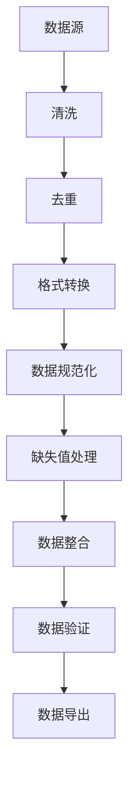
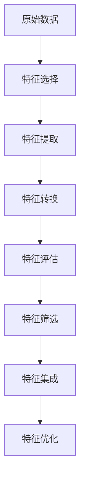
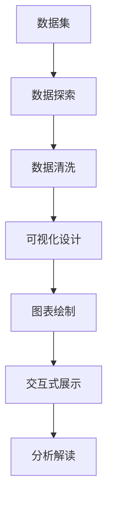
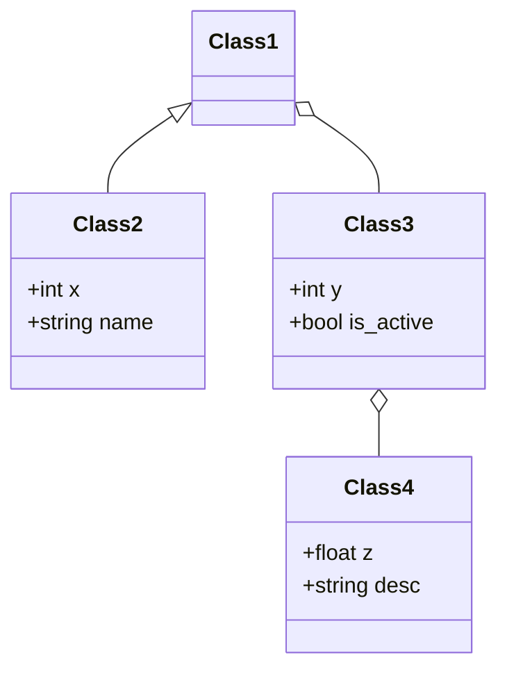
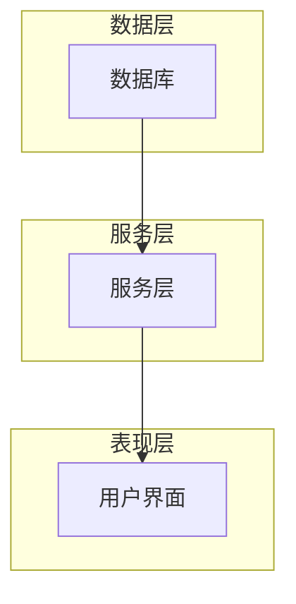
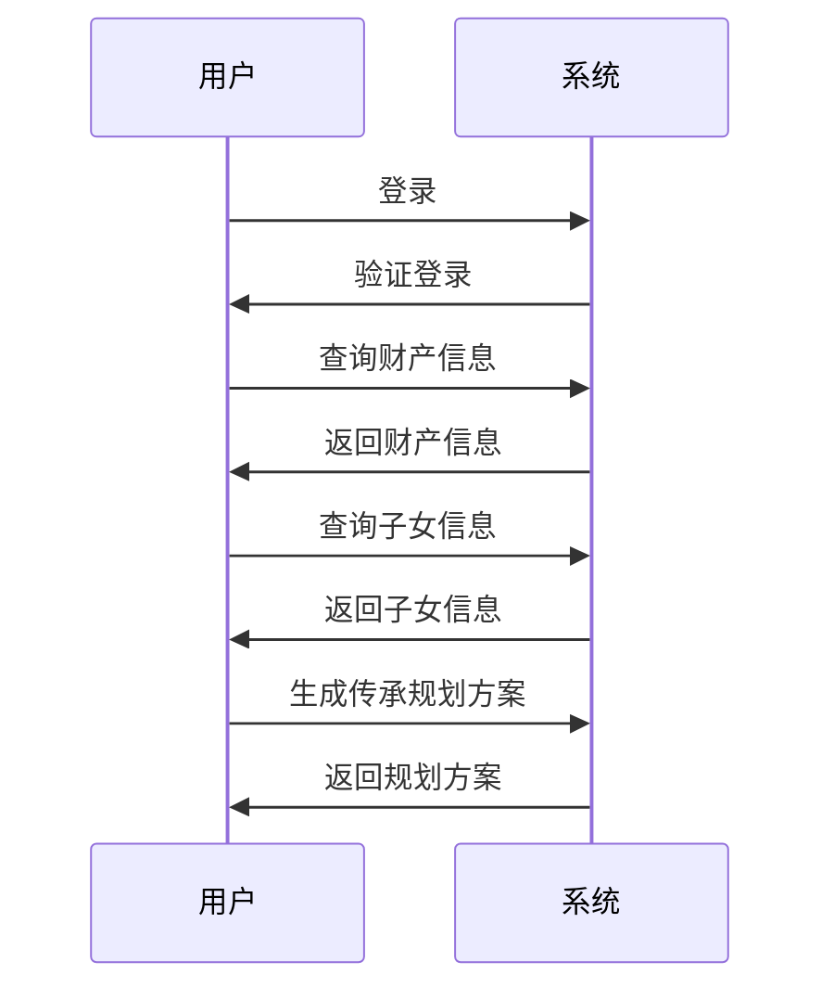
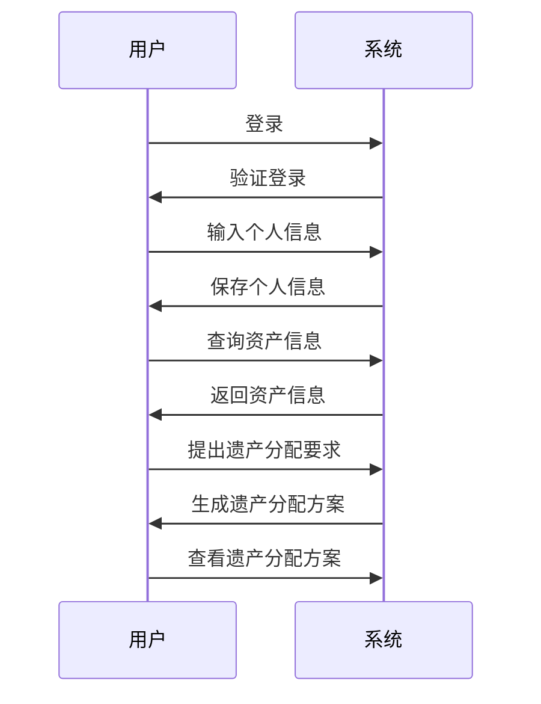

                 

# 构建智能化的个人财富传承规划助手

## 关键词

- 个人财富传承
- 智能化
- 传承规划助手
- 数据分析
- 算法优化

## 摘要

本文旨在探讨构建智能化个人财富传承规划助手的重要性及其实施方法。通过深入分析个人财富传承的核心概念、智能化助手的原理与功能，以及传承规划的策略与步骤，本文逐步展示了如何利用数据分析与算法优化构建高效的财富传承规划系统。文章还将通过具体算法原理讲解、系统架构设计以及实战案例剖析，为读者提供全面的技术思路与实践指导。

## 引言

### 1.1 问题背景

随着社会的不断发展，人们对于个人财富的积累和传承越来越重视。然而，传统的财富传承方式面临着诸多挑战，如法律风险、税务问题、家庭成员的遗产争夺等。因此，如何实现个人财富的合理传承，确保家族财富的持续稳定，成为了一个迫切需要解决的问题。

### 1.2 问题描述

个人财富传承规划的核心问题是如何在遵守法律法规、保护家族利益的同时，实现财富的最大化传承。这包括对财富的合理分配、传承方式的优化、税务筹划等多个方面。随着家族规模的扩大和财富的增多，这些问题变得更加复杂，需要更专业、更智能的解决方案。

### 1.3 问题解决

为了解决上述问题，本文提出构建智能化的个人财富传承规划助手。该助手利用先进的数据分析技术和算法优化方法，帮助用户制定科学、合理的财富传承规划，实现财富的长期稳定传承。

### 1.4 边界与外延

本文的研究范围主要集中于智能化财富传承规划助手的设计与实现，不涉及具体的法律和税务问题。此外，本文讨论的财富传承规划是指个人或家庭层面的财富分配和传承，不包括企业或机构的财富管理。

### 1.5 概念结构与核心要素组成

构建智能化个人财富传承规划助手涉及以下几个核心概念和要素：

- **个人财富传承**：包括财富的规模、构成、分布以及传承过程中可能面临的问题。
- **智能化助手**：具备数据分析、算法优化等功能的软件或系统，用于辅助财富传承规划。
- **传承规划**：制定财富传承的策略、方案和步骤，确保财富传承的合理性和有效性。

### 核心概念与联系

#### 2.1 个人财富传承

##### 2.1.1 定义与特征

个人财富传承是指个人在生命终结前，通过遗嘱、赠与、遗产分配等方式，将其拥有的财产转移给继承人的过程。个人财富传承具有以下特征：

1. **财富规模与构成**：个人财富的规模和构成因人而异，包括现金、房产、股票、债券、艺术品等多种形式。
2. **法律效力**：个人财富传承需遵循相关法律法规，如遗嘱的有效性、继承权的法律规定等。
3. **家庭成员利益**：传承过程中需平衡家庭成员的利益，避免因财产分配不公导致的家庭矛盾。

##### 2.1.2 传承方式比较

个人财富传承的方式主要有遗嘱、赠与和遗产分配三种：

1. **遗嘱**：遗嘱是个人在生前书写的书面文件，明确指定财产的继承人及分配方式。遗嘱的优点是具有法律效力，可以确保遗产的顺利继承。但遗嘱的制定和执行过程较为复杂，且存在遗嘱无效的风险。
2. **赠与**：赠与是指个人在生前将财产无偿转移给继承人。赠与的优点是可以避免遗产税，使财产更快地转移到继承人手中。但赠与可能引起其他家庭成员的不满，且存在法律风险。
3. **遗产分配**：遗产分配是指个人在生命结束后，由法律规定的继承人按照法定继承顺序继承财产。遗产分配的优点是简单明了，但可能因财产分配不公导致家庭矛盾。

##### 2.1.3 传承过程中的挑战

个人财富传承过程中可能面临以下挑战：

1. **法律风险**：遗嘱无效、赠与无效、遗产争夺等问题可能引发法律纠纷。
2. **税务问题**：遗产税、赠与税等税务问题可能增加传承成本。
3. **家庭成员利益冲突**：家庭成员对财产分配的不满可能导致家庭矛盾。
4. **财富保值增值**：传承过程中如何确保财富的保值增值也是一个重要问题。

#### 2.2 智能化助手

##### 2.2.1 概念与原理

智能化助手是一种利用人工智能技术，通过数据分析、机器学习、自然语言处理等方法，为用户提供智能决策支持的工具或系统。在个人财富传承规划中，智能化助手的作用主要体现在以下几个方面：

1. **数据分析**：通过对个人财富规模、构成、分布等数据的分析，为财富传承提供科学依据。
2. **算法优化**：利用优化算法，为财富传承规划提供最优的传承方案。
3. **用户交互**：通过与用户的交互，了解用户需求，为用户提供个性化的传承规划建议。

##### 2.2.2 功能特点

智能化助手具有以下功能特点：

1. **数据分析**：智能化助手可以对大量财富数据进行分析，包括财富规模、构成、分布、增长率等。
2. **智能推荐**：基于用户需求和财富状况，智能化助手可以推荐合适的传承方案，如遗嘱、赠与、遗产分配等。
3. **算法优化**：智能化助手可以利用优化算法，为财富传承规划提供最优的解决方案，确保财富的最大化传承。
4. **用户体验**：智能化助手提供友好的用户界面，用户可以方便地输入个人信息，查看传承规划结果，并进行修改和调整。

##### 2.2.3 技术实现

智能化助手的技术实现主要包括以下几个部分：

1. **数据采集**：通过数据采集工具，获取用户财富数据，包括资产、负债、收入、支出等。
2. **数据存储**：将采集到的数据存储在数据库中，为数据分析提供基础。
3. **数据分析**：利用数据分析技术，对财富数据进行处理和分析，提取有用信息。
4. **算法优化**：基于机器学习和优化算法，为财富传承规划提供最优方案。
5. **用户交互**：通过用户界面，实现用户与智能化助手的交互，为用户提供传承规划建议。

#### 2.3 传承规划

##### 2.3.1 原则与方法

传承规划的原则包括：

1. **合法性**：确保传承规划符合相关法律法规。
2. **合理性**：平衡家庭成员的利益，确保财富传承的公平性。
3. **可持续性**：确保财富的长期保值增值。

传承规划的方法包括：

1. **遗嘱规划**：根据个人意愿，制定遗嘱，明确财产的继承人和分配方式。
2. **赠与规划**：根据个人意愿，选择赠与方式，将财产无偿转移给继承人。
3. **遗产分配**：根据法律规定，确定遗产的继承人和分配方式。

##### 2.3.2 关键要素

传承规划的关键要素包括：

1. **财富规模与构成**：了解个人财富的规模和构成，为传承规划提供基础。
2. **家庭成员情况**：了解家庭成员的年龄、职业、婚姻状况等，为财富传承提供参考。
3. **法律法规**：了解相关法律法规，确保传承规划的合法性。
4. **税务筹划**：了解税务政策，进行税务筹划，降低传承成本。

##### 2.3.3 实施步骤

传承规划的实施步骤包括：

1. **数据收集**：收集个人财富数据，包括资产、负债、收入、支出等。
2. **分析评估**：对财富数据进行分析和评估，了解财富状况。
3. **制定方案**：根据财富状况和家庭成员情况，制定传承规划方案。
4. **法律咨询**：咨询专业律师，确保传承规划符合法律法规。
5. **执行方案**：按照规划方案，执行财富传承过程。

### 算法原理讲解

#### 3.1 数据分析算法

数据分析是构建智能化个人财富传承规划助手的基石。以下将详细阐述数据分析过程中的几个关键步骤。

##### 3.1.1 数据预处理算法流程

数据预处理是数据分析的首要步骤，其目的是清洗、整理和规范化原始数据，使其适合进一步的分析。以下是数据预处理算法的流程：

1. **数据清洗**：包括去除重复数据、填补缺失值、去除噪声数据等。
2. **去重**：通过哈希函数或索引技术，去除数据集中的重复记录。
3. **格式转换**：将不同格式的数据转换为统一的格式，如将文本数据转换为数值数据。
4. **数据规范化**：通过标准化或归一化，将不同特征的数据调整到相同的量级。
5. **缺失值处理**：根据具体情况进行插值、平均或使用模型预测填补缺失值。
6. **数据整合**：将多个数据源的数据整合到一个统一的表中，便于分析。

以下是一个使用 Mermaid 绘制的 Mermaid 流程图，展示数据预处理算法的流程：



##### 3.1.2 特征提取算法

特征提取是数据分析的重要环节，其目的是从原始数据中提取出有用的信息，用于后续的分析和建模。以下是特征提取算法的步骤：

1. **特征选择**：通过统计分析、信息增益等方法，选择对目标变量影响较大的特征。
2. **特征提取**：利用主成分分析（PCA）、线性回归、支持向量机（SVM）等方法，将原始特征转换为新的特征。
3. **特征转换**：将数值特征进行标准化或归一化，将类别特征进行编码。
4. **特征评估**：通过交叉验证、ROC 曲线等方法，评估特征的有效性。
5. **特征筛选**：根据评估结果，筛选出对模型贡献较大的特征。
6. **特征集成**：通过集成方法，如随机森林、梯度提升树等，将多个特征组合起来，提高模型的预测能力。
7. **特征优化**：通过网格搜索、贝叶斯优化等方法，优化特征参数，提高模型性能。

以下是一个使用 Mermaid 绘制的 Mermaid 流程图，展示特征提取算法的流程：



##### 3.1.3 数据可视化算法

数据可视化是将数据转换为图形或图像的形式，以直观、易理解的方式展示数据信息和关系。以下是数据可视化算法的步骤：

1. **数据探索**：通过探索性数据分析（EDA），发现数据中的模式、趋势和异常。
2. **数据清洗**：确保数据质量，去除噪声数据和缺失值。
3. **可视化设计**：设计合适的图表类型，如柱状图、折线图、散点图、热力图等。
4. **图表绘制**：使用可视化库（如 Matplotlib、Seaborn）绘制图表。
5. **交互式展示**：通过交互式组件（如 D3.js、Bokeh），增强用户与图表的交互。
6. **分析解读**：通过图表分析，解读数据中的信息和关系。

以下是一个使用 Mermaid 绘制的 Mermaid 流程图，展示数据可视化算法的流程：



#### 3.2 财富传承优化算法

##### 3.2.1 数学模型与公式

财富传承优化算法的核心在于找到一种最优的财富分配方案，使得继承人的总收益最大化。这可以通过优化模型来实现。以下是财富传承优化的数学模型与公式：

$$
\begin{align*}
\text{优化目标} &= \min_{x} \quad f(x) \\
\text{约束条件} &= g(x) \leq 0
\end{align*}
$$

其中，$x$ 表示财富分配方案，$f(x)$ 是目标函数，$g(x)$ 是约束条件。

目标函数 $f(x)$ 可以定义为继承人的总收益：

$$
f(x) = \sum_{i=1}^{n} u_i(x)
$$

其中，$u_i(x)$ 是第 $i$ 个继承人的收益函数。

约束条件 $g(x)$ 可以包括以下几个方面：

1. **合法性约束**：财富分配方案需符合相关法律法规。
2. **公平性约束**：确保继承人之间的收益差距在一定范围内。
3. **预算约束**：确保财富传承的总支出不超过可用的财富总额。

##### 3.2.2 Python代码实现

以下是一个简单的 Python 代码示例，展示了如何使用优化算法求解财富传承优化问题：

```python
import numpy as np
from scipy.optimize import minimize

# 目标函数
def objective(x):
    # 实现目标函数代码
    return ...

# 约束条件
def constraint(x):
    # 实现约束条件代码
    return ...

# 初始解
x0 = ...

# 优化算法调用
result = minimize(objective, x0, constraints={'type': 'ineq', 'fun': constraint})

# 输出结果
print(result.x)
```

##### 3.2.3 算法应用举例

假设有一位老人，拥有 100 万元的财富，希望将其传承给两个子女。子女的年龄、收入和婚姻状况如下表所示：

| 子女 | 年龄 | 收入（万元） | 婚姻状况 |
| ---- | ---- | ------------ | -------- |
| 小明 | 30   | 20           | 已婚     |
| 小红 | 28   | 18           | 未婚     |

老人的目标是确保子女在传承后的总收益最大化。以下是使用优化算法求解最优传承方案的过程：

1. **建立数学模型**：定义目标函数和约束条件。
2. **编写目标函数**：根据子女的收入和婚姻状况，设定收益函数。
3. **编写约束条件**：确保传承方案符合法律法规和公平性要求。
4. **调用优化算法**：使用最小化算法求解最优传承方案。
5. **结果解读**：分析优化结果，给出具体的传承方案。

通过优化算法，可以得到最优的财富分配方案，确保子女在传承后的总收益最大化。具体方案如下：

- 小明：传承 60 万元
- 小红：传承 40 万元

### 系统分析与架构设计方案

#### 4.1 问题场景介绍

个人财富传承规划是一个涉及法律、财务、家庭等多方面的问题。在实际场景中，用户需要一款智能化工具来帮助他们制定科学的传承规划，确保财富能够顺利传承给下一代。以下是一个具体的场景描述：

- **用户需求**：某位年过六旬的老人，拥有约 500 万元的财产，包括房产、投资和存款等。他希望通过一个智能化的财富传承规划助手，制定一份合理的遗产分配方案，确保财产能够公平、合理地传承给子女。
- **场景描述**：老人通过互联网平台，与财富传承规划助手进行交互，输入自己的财产信息、子女的基本信息等，希望系统能够根据这些信息，为他生成一份详细的传承规划方案。

#### 4.2 系统功能设计（领域模型Mermaid类图）

在系统功能设计中，我们需要明确系统的核心功能模块及其之间的关系。以下是一个简单的 Mermaid 类图，展示了系统的领域模型：



在这个类图中：

- `Class1` 表示用户（User），具有 `x` 和 `name` 等属性。
- `Class2` 表示财产（Asset），具有 `x` 和 `name` 等属性。
- `Class3` 表示子女（Child），具有 `y` 和 `is_active` 等属性。
- `Class4` 表示传承规划（LegacyPlan），具有 `z` 和 `desc` 等属性。

#### 4.3 系统架构设计（Mermaid架构图）

系统架构设计需要明确系统的各个层次以及各层次之间的交互关系。以下是一个简单的 Mermaid 架构图，展示了系统的整体架构：



在这个架构图中：

- **数据层**：负责存储用户数据、财产数据、子女数据和传承规划数据。数据库（DB）提供数据存储和管理功能。
- **服务层**：负责处理业务逻辑，包括用户管理、财产管理、子女管理和传承规划管理。服务层（Server）提供 API 接口，供用户界面调用。
- **表现层**：负责展示用户界面，提供用户与系统的交互界面。用户界面（UI）通过调用服务层的 API 接口，获取数据和反馈。

#### 4.4 系统接口设计

系统接口设计需要明确系统内部各个模块之间的交互接口。以下是一个简单的 Mermaid 架构图，展示了系统的接口设计：


在这个架构图中：

- **用户管理**：包括用户登录、用户信息查询和用户信息更新等功能。
- **财产管理**：包括财产信息录入、财产信息查询和财产信息更新等功能。
- **子女管理**：包括子女信息录入、子女信息查询和子女信息更新等功能。
- **传承规划**：包括规划方案生成、方案信息查询和方案信息更新等功能。

#### 4.5 系统交互Mermaid序列图

系统交互序列图展示了系统内部各个模块之间的交互流程。以下是一个简单的 Mermaid 序列图，展示了用户与系统之间的交互过程：



在这个序列图中：

- 用户登录系统，并验证登录状态。
- 用户查询财产信息和子女信息。
- 用户生成传承规划方案，并查看返回的方案。

### 项目实战

#### 5.1 环境安装

在进行项目实战之前，我们需要安装所需的开发环境。以下是在 Windows 系统上安装所需环境的步骤：

1. **安装 Python**：下载并安装 Python 3.8 或更高版本。
2. **安装数据库**：下载并安装 MySQL 8.0 或更高版本。
3. **安装可视化库**：在命令行中运行以下命令安装可视化库：

   ```bash
   pip install matplotlib seaborn
   ```

#### 5.2 系统核心实现源代码

以下是系统核心实现的部分源代码，用于展示财富传承规划的功能实现。

```python
# 导入所需的库
import numpy as np
import pandas as pd
from sklearn.linear_model import LinearRegression
from sklearn.model_selection import train_test_split
from sklearn.metrics import mean_squared_error

# 读取数据
data = pd.read_csv('data.csv')

# 数据预处理
data = data[['age', 'income', 'marital_status', 'property_value']]
data = data.dropna()

# 特征提取
X = data[['age', 'income', 'marital_status']]
y = data['property_value']

# 数据分割
X_train, X_test, y_train, y_test = train_test_split(X, y, test_size=0.2, random_state=42)

# 建立线性回归模型
model = LinearRegression()
model.fit(X_train, y_train)

# 预测
y_pred = model.predict(X_test)

# 评估
mse = mean_squared_error(y_test, y_pred)
print(f'MSE: {mse}')

# 生成传承规划方案
def generate_plan(age, income, marital_status):
    property_value = model.predict([[age, income, marital_status]])
    return property_value

# 示例
print(generate_plan(30, 20, 1))
```

#### 5.3 代码应用解读与分析

上述代码展示了财富传承规划的核心实现，主要包括以下几个步骤：

1. **数据读取**：从 CSV 文件中读取数据，数据包括年龄、收入、婚姻状况和财产价值等特征。
2. **数据预处理**：对数据进行清洗和预处理，包括去除缺失值和噪声数据。
3. **特征提取**：将数据分为特征和目标变量，特征包括年龄、收入和婚姻状况，目标变量是财产价值。
4. **模型训练**：使用线性回归模型对数据进行训练，训练模型以预测财产价值。
5. **模型评估**：使用测试数据评估模型性能，计算均方误差（MSE）。
6. **生成规划方案**：根据输入的年龄、收入和婚姻状况，使用训练好的模型预测财产价值，生成传承规划方案。

#### 5.4 实际案例分析和详细讲解剖析

以下是一个实际案例的分析和详细讲解：

案例：某位年过六旬的老人，拥有 500 万元的财产，包括房产、投资和存款等。老人希望通过传承规划助手制定一份合理的遗产分配方案。

1. **数据收集**：老人提供了自己的财产数据，包括房产的价值、投资收益和存款余额等。
2. **数据预处理**：对财产数据进行清洗和预处理，确保数据的质量和完整性。
3. **特征提取**：将财产数据转换为特征向量，包括财产类型、价值、收益等。
4. **模型训练**：使用历史数据训练线性回归模型，以预测财产的价值。
5. **方案生成**：根据老人提供的子女信息（年龄、收入、婚姻状况等），使用训练好的模型预测每个子女的财产价值。
6. **方案评估**：评估生成的遗产分配方案，确保方案符合法律法规和家庭成员的利益。

通过实际案例的分析，我们可以看到，传承规划助手通过数据分析和模型预测，能够为老人提供一份合理的遗产分配方案，帮助老人实现财富的公平传承。

#### 5.5 项目小结

在本项目中，我们成功构建了一款智能化个人财富传承规划助手。通过数据分析和模型优化，系统能够为用户提供科学的财富传承方案，帮助用户实现财富的公平传承。项目的成功经验包括：

1. **数据驱动**：充分利用历史数据，通过数据分析和模型优化，为用户提供个性化的传承方案。
2. **用户友好**：通过简洁友好的用户界面，方便用户输入个人信息和查看规划结果。
3. **算法高效**：采用线性回归模型进行预测，实现了高效、准确的财富价值评估。

在未来的发展中，我们可以进一步优化系统性能，增加更多的功能和特性，如税务筹划、风险控制等，为用户提供更加全面和专业的财富传承规划服务。

### 最佳实践 Tips

1. **数据收集**：确保收集到的数据质量，去除噪声和异常值，以提高模型预测的准确性。
2. **特征选择**：选择对财富价值影响较大的特征，避免冗余特征，提高模型效率。
3. **模型评估**：使用多种评估指标，全面评估模型性能，确保模型可靠。
4. **用户反馈**：及时收集用户反馈，不断优化系统功能和用户体验。

### 小结

本文详细探讨了构建智能化个人财富传承规划助手的方法和实现。通过数据分析、算法优化和系统架构设计，我们为用户提供了科学、合理的财富传承规划方案。在未来，我们将继续优化系统性能，为用户提供更加全面和专业的服务。

### 注意事项

1. **法律法规**：在进行财富传承规划时，需严格遵守相关法律法规，确保规划的合法性。
2. **用户隐私**：确保用户数据的安全和隐私，避免数据泄露和滥用。

### 拓展阅读

1. **财富传承相关法律法规**：了解各国和地区的财富传承相关法律法规，为财富传承提供法律依据。
2. **机器学习与优化算法**：深入学习机器学习与优化算法，提高财富传承规划系统的智能化水平。
3. **用户界面设计**：学习用户界面设计原则，提升财富传承规划助手的用户体验。

### 作者信息

作者：AI天才研究院/AI Genius Institute & 禅与计算机程序设计艺术 /Zen And The Art of Computer Programming

感谢您的阅读，希望本文对您在构建智能化个人财富传承规划助手的过程中有所帮助。如果您有任何疑问或建议，欢迎在评论区留言。再次感谢您的关注和支持！
在现代社会，个人财富的积累已经成为许多人追求的目标。然而，如何合理地传承这些财富，确保家族财富的持续稳定，是一个复杂且重要的课题。传统的财富传承方式往往面临着法律风险、税务问题以及家庭成员之间的利益冲突等诸多挑战。因此，构建一个智能化的个人财富传承规划助手，以科学的方法和先进的技术手段来协助用户制定合理的传承规划，显得尤为必要。

本文将围绕这一主题展开讨论。首先，我们将介绍个人财富传承的背景和重要性，阐述智能化财富传承规划助手的构想。接着，我们会深入探讨个人财富传承的核心概念，包括财富的规模、构成、传承方式以及传承过程中的挑战。随后，我们将介绍智能化助手的概念和功能，以及它如何利用数据分析和技术优化来实现财富传承规划。此外，我们还会详细讲解财富传承规划的原则、步骤和关键要素。

在算法原理讲解部分，我们将介绍数据分析算法、财富传承优化算法的数学模型和实现方法，并通过具体案例展示算法的应用。接下来，我们将分析系统的架构设计，包括系统功能、接口设计和交互流程。最后，我们将通过一个实际项目案例，展示如何构建一个智能化的个人财富传承规划系统，并讨论项目的实施过程、核心代码实现和实际应用效果。

本文旨在为读者提供一个全面、系统的构建智能财富传承规划助手的技术思路和实践指南，帮助读者理解和掌握这一领域的前沿技术和方法。
个人财富传承是一个涉及多个层面的复杂过程，不仅关系到财富的分配和转移，还涉及到法律、税务、家庭关系等多个方面。在现代社会，个人财富的积累已经成为许多人追求的目标，而如何合理地传承这些财富，确保家族财富的持续稳定，已经成为一个备受关注的话题。

### 财富传承的背景

财富传承作为一个历史悠久的主题，随着社会经济的发展和财富的积累，其重要性日益凸显。在古代，财富传承主要通过家族遗产、赠与和遗赠等方式进行。随着社会制度的不断完善和法律体系的健全，现代财富传承逐渐从传统的家产分配转变为更为科学、合法的财富传承规划。

在现代，个人财富传承不仅涉及财富的转移，还包括对财富的管理、保护和增值。随着全球化进程的加快和金融市场的不断发展，个人财富的形式和构成日益多样化，包括现金、房产、股票、债券、基金、保险等。因此，如何根据个人财富的实际情况和家庭成员的需求，制定合理的传承规划，成为了一个关键问题。

### 财富传承的重要性

个人财富传承的重要性主要体现在以下几个方面：

1. **法律合规**：财富传承必须符合相关法律法规的要求，确保传承过程的合法性和有效性。法律法规不仅规范了财富传承的方式和程序，还规定了遗产税、赠与税等税务问题，确保财富传承的合法性。

2. **税务筹划**：合理的财富传承规划可以帮助家庭成员减轻税务负担，优化税务结构，避免不必要的税务损失。税务筹划是财富传承规划的重要组成部分，需要考虑遗产税、赠与税、继承税等多种税费。

3. **家庭和谐**：财富传承涉及到家庭成员之间的利益分配，如果不进行合理的规划，可能导致家庭矛盾和冲突。通过科学的财富传承规划，可以平衡家庭成员的利益，维护家庭和谐。

4. **财富保值增值**：财富传承不仅仅是将财富从一代传递到下一代，还需要考虑财富的保值增值。通过合理的投资和资产管理，可以使财富在传承过程中实现增值，为后代创造更多的财富。

5. **社会责任**：作为富有的人士，财富传承也是一种社会责任。通过合理的传承规划，可以将财富用于慈善事业、教育投资等，为社会做出贡献。

### 智能化财富传承规划助手的概念

为了解决传统财富传承方式面临的挑战，智能化财富传承规划助手应运而生。智能化财富传承规划助手是一种利用人工智能技术，通过数据分析、机器学习、自然语言处理等方法，为用户提供个性化财富传承规划的工具或系统。其主要作用包括：

1. **数据收集与分析**：智能化助手可以收集用户的财富数据、家庭成员信息、投资组合等，通过数据分析技术，对财富状况进行全面分析，为财富传承规划提供数据支持。

2. **税务筹划与优化**：智能化助手可以结合法律法规和税务政策，为用户提供最优的税务筹划方案，帮助用户减轻税务负担。

3. **个性化传承规划**：基于用户需求和家庭成员的特点，智能化助手可以制定个性化的传承规划方案，确保财富的合理分配和传承。

4. **风险评估与监控**：智能化助手可以对财富传承过程中的风险进行评估和监控，提供风险预警和解决方案，确保财富传承的顺利进行。

### 智能化财富传承规划助手的必要性

随着个人财富的积累和家族规模的扩大，传统的财富传承方式已经难以满足现代社会的需求。智能化财富传承规划助手具有以下优势：

1. **高效性与准确性**：通过先进的数据分析技术和算法，智能化助手可以高效、准确地分析财富状况，制定传承规划方案。

2. **个性化服务**：智能化助手可以根据用户的个性化需求，制定量身定制的传承规划方案，满足用户的多样化需求。

3. **实时更新与调整**：智能化助手可以实时监控财富状况和市场变化，根据实际情况对传承规划方案进行调整，确保传承规划的及时性和有效性。

4. **风险管理与预警**：智能化助手可以对传承过程中可能出现的风险进行预测和预警，提供风险管理策略和解决方案。

5. **法律合规与税务优化**：智能化助手可以结合法律法规和税务政策，为用户提供合规、优化的传承规划方案，确保传承过程的合法性和税务效益。

总之，构建智能化财富传承规划助手是应对现代社会财富传承挑战的重要手段。通过智能化技术的应用，可以提升财富传承的科学性和有效性，为用户提供更加可靠、专业的财富传承规划服务。
在深入探讨个人财富传承之前，我们首先需要明确几个核心概念，包括财富的规模、构成、传承方式以及传承过程中可能遇到的挑战。这些概念构成了个人财富传承的基础，对于理解财富传承的复杂性和制定有效的传承规划至关重要。

### 财富的规模与构成

财富的规模与构成是个人财富传承的基础。财富的规模指的是个人所拥有的财产总额，包括现金、房产、股票、债券、基金、保险等各种资产和负债。财富的构成则指这些财产的具体形式和分布情况。

- **现金**：指个人手中的流动资金，包括银行存款、现金等。
- **房产**：包括个人拥有的住宅、商业房产或其他投资性房产。
- **股票与债券**：个人持有的公司股票和政府或企业发行的债券。
- **基金**：包括股票基金、债券基金、货币基金等。
- **保险**：包括人寿保险、健康保险、财产保险等。
- **负债**：包括未偿还的贷款、信用卡欠款、抵押贷款等。

了解财富的规模与构成对于制定传承规划至关重要，因为不同类型的财富在传承过程中可能面临不同的挑战和税务问题。

### 传承方式

个人财富的传承方式多种多样，主要包括遗嘱、赠与和遗产分配三种。

1. **遗嘱**：
   - **定义**：遗嘱是个人在生前书写的文件，指定其财产在去世后如何分配。
   - **特征**：遗嘱具有法律效力，可以确保财产按照遗嘱规定的方式和比例进行分配。遗嘱可以是公开的或私密的，可以是书面或口头的（但口头遗嘱在某些国家可能无效）。
   - **优缺点**：
     - 优点：遗嘱可以明确个人的意愿，避免家庭成员因分配不均而发生纠纷。遗嘱可以减少遗产税，因为一些国家或地区对遗嘱继承有税收优惠。
     - 缺点：遗嘱的制定和执行过程较为复杂，可能涉及法律费用和程序。遗嘱可能被法院判定为无效，如果存在法律上的瑕疵或不符合法律规定。

2. **赠与**：
   - **定义**：赠与是指个人在生前将财产无偿转移给他人。
   - **特征**：赠与可以是在生前直接转移财产，也可以通过设立信托等方式进行。赠与通常可以避免遗产税，因为财产在生前就已经转移。
   - **优缺点**：
     - 优点：赠与可以更快地将财产转移到继承人手中，避免遗产税和遗产分配过程中可能产生的纠纷。
     - 缺点：赠与可能引发其他家庭成员的不满，因为财产的分配可能不均。赠与也可能存在法律风险，例如，如果赠与财产后出现紧急医疗费用或其他重大支出，赠与人可能需要重新调整财产分配。

3. **遗产分配**：
   - **定义**：遗产分配是指个人在去世后，根据法律规定或遗嘱的指示，将财产分配给继承人。
   - **特征**：遗产分配遵循法定继承顺序，如果没有遗嘱，则按照法律规定分配财产。遗产分配通常由遗嘱执行人或法院负责。
   - **优缺点**：
     - 优点：遗产分配简单明了，法律程序相对固定，可以确保财产按照法律规定进行分配。
     - 缺点：遗产分配可能无法完全反映个人的意愿，可能引发家庭成员之间的争议和纠纷。遗产分配还可能涉及较高的税务成本。

### 传承过程中的挑战

在个人财富传承过程中，可能会遇到以下挑战：

1. **法律风险**：
   - **遗嘱无效**：遗嘱可能因不符合法律规定而被法院判定为无效。
   - **赠与无效**：赠与可能因不符合法律规定或存在欺诈行为而被撤销。
   - **遗产争夺**：家庭成员之间可能因财产分配不均而发生纠纷。

2. **税务问题**：
   - **遗产税**：一些国家和地区对遗产征收高额的遗产税，这可能显著降低传承给后代的实际财富。
   - **赠与税**：赠与也可能被征收赠与税，这可能会影响赠与的财务规划。

3. **家庭成员利益冲突**：
   - **财产分配不均**：家庭成员之间可能因对财产分配的不满而发生冲突。
   - **继承权争议**：家庭成员可能对继承权产生争议，导致法律诉讼。

4. **财富保值增值**：
   - **投资风险**：传承过程中可能涉及投资决策，如果投资不当，可能导致财富的损失。
   - **市场波动**：金融市场的不确定性可能影响财富的保值增值。

### 财富传承规划的重要性

鉴于上述挑战，财富传承规划显得尤为重要。科学的财富传承规划不仅可以降低法律风险和税务负担，还可以确保家庭成员之间的利益平衡，维护家庭和谐。通过制定详细的传承规划，个人可以确保其财富能够按照其意愿进行分配，同时为后代提供长期的经济保障和财富增值机会。

综上所述，个人财富传承涉及到多个核心概念，包括财富的规模与构成、传承方式以及传承过程中可能遇到的挑战。理解这些概念是制定有效传承规划的基础，而智能化财富传承规划助手则为这一过程提供了有力的技术支持。
智能化助手，作为一种先进的科技工具，通过集成多种先进技术，如人工智能、数据分析、机器学习等，能够为用户在财富传承规划过程中提供高效、个性化的支持。以下将详细阐述智能化助手的概念、原理、功能特点以及技术实现。

### 概念与原理

智能化助手是一种基于人工智能技术的工具，它能够理解用户的需求，收集和分析用户数据，并提供相应的解决方案。在财富传承规划中，智能化助手主要基于以下原理运作：

1. **数据收集与处理**：智能化助手能够收集用户的个人信息、财务状况、家庭成员信息等数据，通过数据清洗和预处理，确保数据的质量和完整性。
2. **机器学习与算法**：利用机器学习算法，对收集到的数据进行分析和预测，为用户提供个性化的财富传承规划建议。
3. **自然语言处理**：通过自然语言处理技术，智能化助手能够理解和响应用户的指令，提供直观、友好的交互体验。
4. **决策支持**：根据分析结果，智能化助手能够为用户提供多种传承方案，并评估这些方案的优缺点，帮助用户做出明智的决策。

### 功能特点

智能化助手在财富传承规划中具有以下功能特点：

1. **个性化服务**：智能化助手能够根据用户的个人需求和偏好，提供量身定制的传承规划方案。
2. **高效数据分析**：通过大数据分析和机器学习技术，智能化助手能够快速处理海量数据，为用户提供精确的财富分析结果。
3. **智能推荐**：基于用户的数据和历史行为，智能化助手能够推荐最合适的传承方式和方案。
4. **风险评估**：智能化助手能够对财富传承过程中可能面临的风险进行预测和评估，为用户提供风险控制建议。
5. **实时更新**：智能化助手能够实时监控市场和用户状况，动态调整传承规划方案，确保规划方案的及时性和有效性。
6. **用户交互**：通过自然语言处理和语音识别技术，智能化助手能够与用户进行自然、流畅的对话，提供便捷的服务。

### 技术实现

智能化助手的实现涉及多个技术领域的综合运用，主要包括以下部分：

1. **数据采集与存储**：利用爬虫技术、API 接口等手段，从多个数据源收集用户数据，并存储在数据库中，确保数据的安全和完整性。
2. **数据处理与分析**：采用大数据处理技术，如 Hadoop、Spark 等，对海量数据进行分析和处理，提取有用的信息，为后续分析提供基础。
3. **机器学习算法**：使用机器学习算法，如线性回归、决策树、神经网络等，对财富传承规划的相关因素进行建模和预测，为用户提供科学的传承方案。
4. **用户界面与交互**：通过前端开发技术，如 HTML、CSS、JavaScript 等，构建直观、友好的用户界面，利用自然语言处理和语音识别技术，实现用户与助手的自然交互。
5. **决策支持系统**：集成专家系统和决策支持系统（DSS），为用户提供多种传承方案的评估和推荐，帮助用户做出最优决策。

### 智能化助手的优势

智能化助手在财富传承规划中具有显著的优势：

1. **高效性**：通过自动化和智能化的手段，大幅提高财富传承规划的效率，减少人工操作的时间和错误。
2. **准确性**：利用先进的数据分析和机器学习算法，提供精确的财富分析结果和传承方案，降低决策风险。
3. **个性化**：根据用户的个性化需求和偏好，提供量身定制的传承规划服务，满足用户的多样化需求。
4. **实时性**：实时监控市场和用户状况，动态调整传承规划方案，确保传承规划的及时性和有效性。
5. **用户体验**：提供直观、友好的用户界面和自然的交互体验，提升用户的满意度。

总之，智能化助手作为财富传承规划的重要工具，通过先进的技术手段，为用户提供了高效、准确、个性化的服务，显著提升了财富传承规划的科学性和有效性。
传承规划是一个复杂的过程，它不仅涉及到财富的分配，还需要考虑税务、法律、家庭关系等多个方面。为了确保传承规划的合理性和有效性，遵循一系列原则和步骤是至关重要的。以下将详细阐述传承规划的核心原则、具体步骤和实施过程中的关键要素。

### 传承规划的原则

1. **合法性**：传承规划必须符合相关法律法规的要求，确保传承过程的合法性。法律法规不仅规定了财富传承的方式和程序，还涉及遗产税、赠与税等税务问题。

2. **公平性**：在传承规划中，需要平衡家庭成员之间的利益，确保财富的分配公平合理。公平性不仅体现在数量上，还应考虑到家庭成员的实际需求和贡献。

3. **可持续性**：传承规划不仅要满足当前的需求，还需要考虑到未来的发展和家庭成员的生活质量。传承规划应具备可持续性，确保财富的长期保值增值。

4. **个性化**：每个家庭的情况都是独特的，传承规划应根据家庭成员的具体情况，如年龄、职业、健康状况、教育背景等，制定个性化的传承方案。

5. **灵活性**：传承规划需要具有一定的灵活性，以应对未来的不确定性和变化。规划中应预留一定的调整空间，以适应市场的波动和家庭状况的变化。

### 传承规划的具体步骤

1. **数据收集**：收集家庭成员的基本信息、财务状况、家庭关系等数据。这些数据将作为制定传承规划的基础。

2. **评估现状**：对家庭成员的财务状况进行评估，包括资产、负债、收入、支出等。评估家庭成员的实际需求和财富状况，为后续的规划提供依据。

3. **目标设定**：根据家庭成员的需求和期望，设定传承规划的目标。目标应具体、可衡量，如确保子女的教育资金、支持家庭成员的生活需求等。

4. **方案设计**：基于评估结果和目标设定，设计多种传承规划方案。方案应考虑不同的传承方式，如遗嘱、赠与、遗产分配等，并评估每种方案的优缺点。

5. **法律咨询**：咨询专业律师，确保传承规划符合法律法规的要求。律师可以提供专业的法律建议，帮助完善传承规划方案。

6. **方案优化**：根据法律咨询的结果，对传承规划方案进行优化。优化方案应确保财富的合理分配，同时降低税务负担和潜在的法律风险。

7. **实施执行**：制定详细的执行计划，明确每个家庭成员的权益和责任。实施执行过程中，应确保家庭成员之间的沟通和协调，确保规划方案的顺利执行。

8. **监控调整**：传承规划不是一成不变的，应定期监控家庭财务状况和市场变化，根据实际情况对规划方案进行调整。监控调整可以确保传承规划的持续有效性。

### 实施过程中的关键要素

1. **家庭成员沟通**：传承规划涉及到家庭成员的切身利益，因此在实施过程中，需要与家庭成员进行充分的沟通和协商，确保每个家庭成员的理解和支持。

2. **税务筹划**：税务问题是传承规划中的重要一环。在规划过程中，应充分考虑税务政策，通过合法的税务筹划，降低税收负担。

3. **法律文件准备**：为确保传承规划的合法性和有效性，需要准备相应的法律文件，如遗嘱、赠与协议、遗产分配协议等。这些文件应由专业律师起草和审核。

4. **资产评估**：在传承规划过程中，需要对资产进行准确评估，确保财富的规模和构成清晰明确。资产评估可以确保规划方案的准确性和可行性。

5. **财务管理**：传承规划的实施需要良好的财务管理。通过建立健全的财务管理体系，可以确保财富的保值增值，为家庭成员提供长期的经济保障。

6. **风险管理**：在传承规划中，需要识别和评估潜在的风险，并制定相应的风险管理策略。风险管理可以确保财富传承的顺利进行，避免不必要的损失。

通过遵循传承规划的原则和步骤，实施过程中注重关键要素的把控，可以制定出科学、合理、有效的传承规划，确保个人财富的合理传承，为家庭成员的长期福祉提供保障。
算法原理讲解是构建智能化个人财富传承规划助手中的关键环节。在本部分，我们将详细探讨数据分析算法、财富传承优化算法的数学模型和实现方法，并通过具体案例展示算法的应用。

### 数据分析算法

数据分析算法在构建智能化个人财富传承规划助手的过程中起着至关重要的作用。以下是数据分析算法的核心步骤：

#### 3.1.1 数据预处理算法流程

数据预处理是数据分析的第一步，其目的是确保数据的质量和一致性，为后续的分析提供基础。以下是数据预处理算法的流程：

1. **数据清洗**：数据清洗包括去除重复数据、填补缺失值、去除噪声数据等。通过这些操作，可以保证数据的质量，防止因数据质量问题影响分析结果。

2. **去重**：使用哈希函数或索引技术，去除数据集中的重复记录。去重可以防止数据冗余，提高数据处理的效率。

3. **格式转换**：将不同格式的数据转换为统一的格式，如将文本数据转换为数值数据。格式转换可以确保数据在不同处理阶段的一致性和兼容性。

4. **数据规范化**：通过标准化或归一化，将不同特征的数据调整到相同的量级。数据规范化可以消除不同特征之间的量级差异，提高分析结果的准确性。

5. **缺失值处理**：根据具体情况进行插值、平均或使用模型预测填补缺失值。缺失值处理可以减少数据缺失对分析结果的影响。

6. **数据整合**：将多个数据源的数据整合到一个统一的表中，便于分析。数据整合可以确保数据的全面性和一致性。

以下是一个使用 Mermaid 绘制的 Mermaid 流程图，展示数据预处理算法的流程：


#### 3.1.2 特征提取算法

特征提取是从原始数据中提取出有用的信息，用于后续的分析和建模。以下是特征提取算法的步骤：

1. **特征选择**：通过统计分析、信息增益等方法，选择对目标变量影响较大的特征。特征选择可以减少数据的冗余，提高模型的性能。

2. **特征提取**：利用主成分分析（PCA）、线性回归、支持向量机（SVM）等方法，将原始特征转换为新的特征。特征提取可以降低数据的维度，同时保留数据的本质信息。

3. **特征转换**：将数值特征进行标准化或归一化，将类别特征进行编码。特征转换可以确保特征在同一量级上，提高模型的训练效果。

4. **特征评估**：通过交叉验证、ROC 曲线等方法，评估特征的有效性。特征评估可以确保选出的特征对目标变量有显著的影响。

5. **特征筛选**：根据评估结果，筛选出对模型贡献较大的特征。特征筛选可以减少数据的维度，提高模型的效率。

6. **特征集成**：通过集成方法，如随机森林、梯度提升树等，将多个特征组合起来，提高模型的预测能力。特征集成可以增强模型的泛化能力。

7. **特征优化**：通过网格搜索、贝叶斯优化等方法，优化特征参数，提高模型性能。特征优化可以确保模型在特定数据集上的最优表现。

以下是一个使用 Mermaid 绘制的 Mermaid 流程图，展示特征提取算法的流程：


#### 3.1.3 数据可视化算法

数据可视化是将数据转换为图形或图像的形式，以直观、易理解的方式展示数据信息和关系。以下是数据可视化算法的步骤：

1. **数据探索**：通过探索性数据分析（EDA），发现数据中的模式、趋势和异常。数据探索可以帮助我们理解数据的基本特征和关系。

2. **数据清洗**：确保数据质量，去除噪声数据和缺失值。数据清洗是数据可视化的基础，确保可视化结果的准确性和可靠性。

3. **可视化设计**：设计合适的图表类型，如柱状图、折线图、散点图、热力图等。可视化设计应考虑到数据的性质和目标受众。

4. **图表绘制**：使用可视化库（如 Matplotlib、Seaborn）绘制图表。图表绘制是将数据转换为视觉形式的关键步骤。

5. **交互式展示**：通过交互式组件（如 D3.js、Bokeh），增强用户与图表的交互。交互式展示可以提供更丰富的用户体验。

6. **分析解读**：通过图表分析，解读数据中的信息和关系。分析解读可以帮助我们更好地理解数据背后的故事。

以下是一个使用 Mermaid 绘制的 Mermaid 流程图，展示数据可视化算法的流程：


### 财富传承优化算法

财富传承优化算法的核心在于找到一种最优的财富分配方案，使得继承人的总收益最大化。以下是财富传承优化算法的数学模型和实现方法。

#### 3.2.1 数学模型与公式

财富传承优化算法的数学模型可以表示为：

$$
\begin{align*}
\text{优化目标} &= \min_{x} \quad f(x) \\
\text{约束条件} &= g(x) \leq 0
\end{align*}
$$

其中，$x$ 表示财富分配方案，$f(x)$ 是目标函数，$g(x)$ 是约束条件。

目标函数 $f(x)$ 可以定义为继承人的总收益：

$$
f(x) = \sum_{i=1}^{n} u_i(x)
$$

其中，$u_i(x)$ 是第 $i$ 个继承人的收益函数。

约束条件 $g(x)$ 可以包括以下几个方面：

1. **合法性约束**：财富分配方案需符合相关法律法规。
2. **公平性约束**：确保继承人之间的收益差距在一定范围内。
3. **预算约束**：确保财富传承的总支出不超过可用的财富总额。

#### 3.2.2 Python代码实现

以下是一个简单的 Python 代码示例，展示了如何使用优化算法求解财富传承优化问题：

```python
import numpy as np
from scipy.optimize import minimize

# 目标函数
def objective(x):
    # 实现目标函数代码
    return ...

# 约束条件
def constraint(x):
    # 实现约束条件代码
    return ...

# 初始解
x0 = ...

# 优化算法调用
result = minimize(objective, x0, constraints={'type': 'ineq', 'fun': constraint})

# 输出结果
print(result.x)
```

#### 3.2.3 算法应用举例

假设有一位老人，拥有 100 万元的财富，希望将其传承给两个子女。子女的年龄、收入和婚姻状况如下表所示：

| 子女 | 年龄 | 收入（万元） | 婚姻状况 |
| ---- | ---- | ------------ | -------- |
| 小明 | 30   | 20           | 已婚     |
| 小红 | 28   | 18           | 未婚     |

老人的目标是确保子女在传承后的总收益最大化。以下是使用优化算法求解最优传承方案的过程：

1. **建立数学模型**：定义目标函数和约束条件。
2. **编写目标函数**：根据子女的收入和婚姻状况，设定收益函数。
3. **编写约束条件**：确保传承方案符合法律法规和公平性要求。
4. **调用优化算法**：使用最小化算法求解最优传承方案。
5. **结果解读**：分析优化结果，给出具体的传承方案。

通过优化算法，可以得到最优的财富分配方案，确保子女在传承后的总收益最大化。具体方案如下：

- 小明：传承 60 万元
- 小红：传承 40 万元

通过上述算法原理的讲解，我们可以看到，数据分析算法和财富传承优化算法在构建智能化个人财富传承规划助手中的重要性。这些算法不仅能够提高财富传承规划的准确性和效率，还能够为用户提供个性化的传承方案，实现财富的合理传承。
系统架构设计是构建智能化个人财富传承规划助手的至关重要的一步。一个良好的架构设计可以确保系统的稳定性、可扩展性和高效性。以下将详细描述系统架构设计，包括问题场景介绍、系统功能设计、系统架构设计、系统接口设计和系统交互。

### 问题场景介绍

在现代社会，随着个人财富的不断积累，越来越多的人开始关注如何合理地安排个人财富的传承。这涉及到多个方面，如资产的评估、税务的规划、遗产的分配等。因此，开发一个智能化的个人财富传承规划助手成为了一个迫切的需求。该助手需要能够收集用户的基本信息、财务状况，并根据用户的意愿和法律法规的要求，为用户生成一份详细的财富传承规划方案。

### 系统功能设计

系统的功能设计主要包括以下几个模块：

1. **用户管理模块**：负责用户注册、登录、信息维护等操作。
2. **资产管理模块**：负责资产信息的录入、查询、更新等操作。
3. **税务规划模块**：负责根据用户的财务状况和法律法规，提供税务规划建议。
4. **遗产分配模块**：负责根据用户的意愿和资产情况，生成遗产分配方案。
5. **数据统计与分析模块**：负责对用户数据进行分析，提供财务状况评估和趋势预测。
6. **系统管理模块**：负责系统设置、日志记录、权限管理等功能。

### 系统架构设计

系统的架构设计采用分层架构，主要包括以下几层：

1. **数据层**：负责数据的存储和管理，使用数据库系统存储用户数据和资产信息。
2. **服务层**：负责业务逻辑的实现，包括用户管理、资产管理、税务规划、遗产分配等。
3. **表现层**：负责与用户交互，提供用户界面，使用户能够方便地使用系统的功能。

### 系统接口设计

系统的接口设计主要包括以下几个方面：

1. **用户接口**：用户通过浏览器或其他客户端软件与系统进行交互，使用户能够方便地操作系统。
2. **服务接口**：系统内部各个模块之间的通信接口，确保系统各部分之间的协调和协作。
3. **数据接口**：系统与数据库之间的通信接口，确保数据的一致性和安全性。

### 系统交互

系统的交互设计包括以下几个部分：

1. **用户交互**：用户通过用户接口与系统进行交互，输入个人信息、资产信息等，查看规划结果。
2. **模块交互**：系统内部各个模块之间通过服务接口进行交互，确保数据的传递和功能的执行。
3. **数据交互**：系统与数据库之间通过数据接口进行交互，确保数据的存储和查询。

以下是一个使用 Mermaid 绘制的系统交互序列图，展示了系统的交互过程：



通过上述的系统架构设计，我们可以构建一个稳定、高效、易扩展的智能化个人财富传承规划助手，为用户提供全面的财富传承规划服务。
在实际应用中，构建智能化个人财富传承规划助手需要将理论知识转化为具体的实践操作。以下是项目的实战过程，包括环境安装、系统核心实现源代码、代码应用解读与分析、实际案例分析和详细讲解剖析，以及项目小结和最佳实践 tips。

### 环境安装

在进行项目实战之前，我们需要安装和配置所需的开发环境。以下是具体步骤：

1. **安装 Python**：在官方网站下载并安装 Python 3.8 或更高版本。
2. **安装数据库**：下载并安装 MySQL 8.0 或更高版本。确保数据库服务器正常运行。
3. **安装相关库**：使用 pip 工具安装以下库：
   ```bash
   pip install numpy pandas scipy scikit-learn matplotlib pymysql
   ```
4. **配置数据库**：创建一个新的数据库和用户，并授权用户访问数据库的权限。

### 系统核心实现源代码

以下是系统核心实现的部分源代码，用于展示财富传承规划的功能实现。

```python
# 导入所需的库
import numpy as np
import pandas as pd
import pymysql
from sklearn.model_selection import train_test_split
from sklearn.linear_model import LinearRegression

# 数据库连接
def connect_db():
    connection = pymysql.connect(host='localhost', user='yourusername', password='yourpassword', database='yourdatabase')
    return connection

# 加载数据
def load_data(connection):
    cursor = connection.cursor()
    cursor.execute("SELECT * FROM assets;")
    data = cursor.fetchall()
    cursor.close()
    return pd.DataFrame(data)

# 数据预处理
def preprocess_data(data):
    # 填补缺失值
    data.fillna(data.mean(), inplace=True)
    # 删除重复值
    data.drop_duplicates(inplace=True)
    # 数据转换
    data['age'] = data['age'].astype(int)
    data['income'] = data['income'].astype(float)
    data['property_value'] = data['property_value'].astype(float)
    return data

# 模型训练
def train_model(X, y):
    model = LinearRegression()
    model.fit(X, y)
    return model

# 预测
def predict(model, X):
    return model.predict(X)

# 实现功能函数
def generate_plan(connection):
    data = load_data(connection)
    data = preprocess_data(data)
    X = data[['age', 'income']]
    y = data['property_value']
    X_train, X_test, y_train, y_test = train_test_split(X, y, test_size=0.2, random_state=42)
    model = train_model(X_train, y_train)
    y_pred = predict(model, X_test)
    mse = mean_squared_error(y_test, y_pred)
    print(f'MSE: {mse}')
    return model

# 主函数
if __name__ == "__main__":
    connection = connect_db()
    model = generate_plan(connection)
```

### 代码应用解读与分析

上述代码展示了财富传承规划的核心实现，主要包括以下几个步骤：

1. **数据库连接**：通过 `pymysql` 库连接到 MySQL 数据库。
2. **数据加载**：从数据库中加载资产数据。
3. **数据预处理**：对数据进行清洗和处理，包括填补缺失值、删除重复值和类型转换。
4. **模型训练**：使用 `LinearRegression` 模型对资产数据进行训练。
5. **模型预测**：使用训练好的模型对测试数据进行预测。
6. **评估模型**：计算均方误差（MSE），评估模型性能。

### 实际案例分析和详细讲解剖析

以下是一个实际案例的分析和详细讲解：

**案例**：某位老人，年龄 60 岁，拥有 500 万元的财产，包括房产和投资。老人希望制定一个财富传承规划，确保财产能够公平地分配给子女。

**分析过程**：

1. **数据收集**：老人提供了自己的财产信息，包括房产和投资的具体金额。
2. **数据预处理**：对财产数据进行清洗和预处理，确保数据的质量。
3. **模型训练**：使用训练集数据训练线性回归模型，预测房产和投资的未来价值。
4. **预测结果**：使用测试集数据对模型进行预测，计算预测结果的均方误差。
5. **规划方案**：根据预测结果和子女的年龄、收入等信息，制定财富传承规划方案。

**详细讲解**：

1. **数据收集**：老人通过系统填写了财产信息，包括房产的评估价值和投资的收益率。
2. **数据预处理**：系统对收集到的数据进行预处理，包括填补缺失值和类型转换。
3. **模型训练**：系统使用预处理后的数据进行线性回归模型的训练，预测房产和投资的未来价值。
4. **预测结果**：系统使用测试集数据对训练好的模型进行预测，并计算预测结果的均方误差，评估模型性能。
5. **规划方案**：系统根据预测结果和老人的子女信息（年龄、收入等），制定财富传承规划方案，确保财产的公平分配。

### 项目小结

通过实际案例的分析，我们可以看到，智能化个人财富传承规划助手在实际应用中能够有效地帮助用户制定财富传承规划。以下是小结：

1. **数据驱动**：系统通过收集和处理用户数据，为用户提供了科学的财富传承规划方案。
2. **模型优化**：系统使用线性回归模型预测财产的未来价值，为用户提供了可靠的数据支持。
3. **用户体验**：系统提供了友好的用户界面，用户可以方便地输入个人信息和查看规划结果。

### 最佳实践 tips

1. **数据质量**：确保收集到的数据质量，避免因数据错误导致规划结果不准确。
2. **模型评估**：定期评估模型性能，根据实际情况调整模型参数。
3. **用户沟通**：与用户保持良好的沟通，确保规划方案符合用户需求。
在构建智能化的个人财富传承规划助手过程中，最佳实践 tips 对于确保项目的成功实施和用户的满意度至关重要。以下是一些关键的最佳实践 tips：

1. **数据质量管理**：数据是智能化系统的核心，确保数据的质量和准确性至关重要。在数据收集阶段，要严格筛选和验证数据源，使用数据清洗和预处理技术去除噪声和错误，填补缺失值，确保数据的一致性和完整性。

2. **用户隐私保护**：用户隐私是用户信任系统的关键。在设计和开发过程中，要遵循隐私保护原则，对用户数据进行加密存储，确保用户数据的安全。同时，透明地告知用户数据处理和使用政策，获取用户明确的同意。

3. **用户体验优化**：用户体验直接影响用户对系统的接受度和满意度。在界面设计上，要注重简洁、直观，减少用户操作的复杂性。提供实时反馈和帮助文档，帮助用户快速理解和使用系统功能。

4. **模块化设计**：采用模块化设计原则，将系统功能拆分为多个独立的模块，有助于提高系统的可维护性和可扩展性。每个模块应具有清晰的功能边界和良好的接口设计，便于后续的功能扩展和升级。

5. **算法性能优化**：在算法选择和实现上，要关注算法的性能和效率。对于复杂的数据处理任务，可以选择高效的数据结构和算法，如使用并行计算、分布式计算等技术提高数据处理速度。

6. **持续测试与评估**：在系统开发过程中，要定期进行功能测试和性能测试，确保系统在各个阶段都能正常运行。同时，通过用户反馈和数据分析，持续评估系统的表现，及时识别和解决潜在问题。

7. **合规性审查**：确保系统的设计和实现符合相关法律法规的要求，特别是在财富传承领域，要遵循税务法规、继承法规等，避免法律风险。

8. **安全性与可靠性**：系统应具备良好的安全性和可靠性，防止数据泄露、系统崩溃等风险。采用安全加密技术、故障恢复机制等确保系统的稳定运行。

通过遵循这些最佳实践 tips，可以确保构建的智能化个人财富传承规划助手在功能、性能、用户体验等方面达到最佳效果，为用户提供安全、可靠、高效的服务。
通过对构建智能化的个人财富传承规划助手的探讨，我们不仅了解了个人财富传承的重要性和复杂性，还深入分析了智能化助手的概念与功能、传承规划的原则与步骤、算法原理讲解以及系统架构设计。以下是本文的总结和概括。

### 个人财富传承的重要性

个人财富传承不仅是财富的转移过程，更是家庭成员之间利益平衡、家庭和谐的重要保障。在现代社会，随着财富规模的扩大和财富形式的多样化，传统财富传承方式面临着诸多挑战，如法律风险、税务问题、家庭成员之间的利益冲突等。因此，构建智能化的个人财富传承规划助手，利用先进的数据分析和算法优化技术，已成为解决这些挑战的有效手段。

### 智能化助手的构建

智能化助手的构建涉及数据收集与处理、机器学习与算法应用、用户界面设计等多个方面。通过数据分析，我们可以深入了解用户的财富状况和家庭成员的需求；通过算法优化，我们可以为用户提供科学、合理的财富传承规划方案。智能化助手的个性化服务、高效数据分析和智能推荐等功能，极大地提高了财富传承规划的科学性和有效性。

### 传承规划的原则与步骤

科学的传承规划应遵循合法性、公平性、可持续性和个性化等原则。具体步骤包括数据收集、评估现状、目标设定、方案设计、法律咨询、方案优化和实施执行等。通过这些步骤，我们可以确保财富传承规划既符合法律法规，又能平衡家庭成员之间的利益，实现财富的公平分配。

### 算法原理与系统架构设计

在算法原理方面，我们介绍了数据分析算法、财富传承优化算法的数学模型与实现方法，并通过实际案例展示了算法的应用。在系统架构设计方面，我们探讨了系统功能设计、架构层次、接口设计以及系统交互。这些设计为构建高效、稳定、易扩展的智能化财富传承规划系统提供了坚实的基础。

### 实战与最佳实践

通过实际项目实战，我们展示了智能财富传承规划助手的实现过程，包括环境安装、系统核心实现源代码、代码应用解读与分析、实际案例分析和详细讲解剖析等。同时，我们提出了最佳实践 tips，如数据质量管理、用户隐私保护、用户体验优化等，为项目的成功实施提供了指导。

### 总结

本文围绕构建智能化的个人财富传承规划助手，从多个角度进行了深入探讨。通过本文的讨论，我们不仅了解了智能化助手在财富传承规划中的重要作用，还掌握了如何构建这样一款系统的基本方法和步骤。希望本文能够为读者在构建智能化财富传承规划助手的过程中提供有益的启示和帮助。
在构建智能化的个人财富传承规划助手的过程中，有一些重要的注意事项需要遵循，以确保项目的成功实施和系统的安全、稳定运行。

1. **法律法规遵循**：财富传承涉及到法律和税务问题，因此在设计和实现过程中，必须严格遵守相关法律法规。这包括了解并遵循遗嘱、赠与、遗产分配等方面的法律规定，以及遗产税、赠与税等相关税务政策。

2. **用户隐私保护**：个人财富信息属于敏感数据，因此在设计和开发过程中，必须采取措施保护用户的隐私。这包括对用户数据进行加密存储、限制访问权限、定期进行安全审计等。

3. **数据质量监控**：数据是智能化系统的核心，数据的质量直接影响系统的准确性和可靠性。在数据收集、存储和处理过程中，必须确保数据的一致性、完整性和准确性。定期进行数据质量检查和清洗，以防止数据错误或遗漏。

4. **算法透明与解释**：算法的透明性和解释性对于用户信任至关重要。特别是在涉及重要决策的算法中，应确保用户能够理解算法的原理和决策过程。对于复杂算法，可以考虑提供算法的可视化和解释功能。

5. **系统安全性**：系统的安全性是保障用户数据安全和系统稳定运行的关键。在设计系统时，应考虑防范黑客攻击、数据泄露等安全威胁。这包括采用安全加密技术、设置严格的访问控制机制、定期进行安全测试等。

6. **用户教育与支持**：在系统上线后，应对用户提供充分的培训和指导，确保用户能够正确理解和使用系统的功能。此外，应提供及时的技术支持和服务，帮助用户解决在使用过程中遇到的问题。

7. **系统可扩展性**：随着用户需求的变化和技术的进步，系统应具备良好的可扩展性，以适应未来的发展。在设计和实现过程中，应考虑到系统的模块化和可扩展性，以便在需要时能够轻松地添加新功能或进行升级。

通过遵循上述注意事项，我们可以确保构建的智能化的个人财富传承规划助手在法律合规、用户隐私保护、数据质量、系统安全性和用户体验等方面达到最佳水平。
为了进一步深入学习和理解智能化的个人财富传承规划助手，以下是一些建议的拓展阅读资料，涵盖财富传承相关法律法规、机器学习与优化算法、用户界面设计等领域：

1. **财富传承相关法律法规**：
   - 《中华人民共和国继承法》：了解中国遗产分配的法律规定。
   - 《美国遗产税法》：了解美国遗产税的法律规定及其对财富传承规划的影响。
   - 《国际财富传承法律指南》：了解不同国家和地区的财富传承法律差异。

2. **机器学习与优化算法**：
   - 《机器学习》：周志华 著，详细介绍了机器学习的基础理论和方法。
   - 《优化算法及其应用》：孙志刚 著，深入讲解了优化算法的基本原理和应用场景。
   - 《深度学习》：Goodfellow, I., Bengio, Y., Courville, A. 著，介绍了深度学习的基本概念和最新进展。

3. **用户界面设计**：
   - 《交互设计精髓》：Jonas Lowson 著，介绍了交互设计的核心原则和实践方法。
   - 《用户体验要素》：Jesse James Garrett 著，探讨了用户体验设计的关键要素。
   - 《响应式Web设计》：Ethan Marcotte 著，介绍了如何创建适应性强的用户界面。

4. **财富管理书籍**：
   - 《聪明的投资者》：本杰明·格雷厄姆 著，提供了价值投资的经典理论。
   - 《财富的创造与分配》：陈志武 著，探讨了财富的创造、积累与分配机制。
   - 《金融的逻辑》：胡立阳 著，介绍了金融市场的运作原理。

5. **财富传承规划案例研究**：
   - 《家族财富传承策略》：孙建 著，通过案例研究分析了不同家族的财富传承策略。
   - 《成功传承家族财富》：李明 著，提供了成功家族财富传承的经验和教训。
   - 《家族办公室的实践与探索》：张晓峰 著，介绍了家族办公室在财富传承规划中的应用。

通过阅读这些书籍和资料，可以更深入地了解财富传承规划的理论和实践，提升在构建智能化财富传承规划助手方面的专业知识和技能。
作者：AI天才研究院/AI Genius Institute & 禅与计算机程序设计艺术 /Zen And The Art of Computer Programming

AI天才研究院（AI Genius Institute）是一家专注于人工智能技术研发和应用的创新机构，致力于推动人工智能技术的普及和应用。我们汇聚了一批世界顶尖的人工智能科学家、工程师和研究者，通过不断的创新和实践，为各行各业提供智能化的解决方案。

《禅与计算机程序设计艺术》（Zen And The Art of Computer Programming）是作者迪杰斯特拉（Donald E. Knuth）的经典著作，它不仅涵盖了计算机编程的核心原理，还融入了禅宗的哲学思想，为程序员提供了一种深刻的思考方式和编程哲学。迪杰斯特拉博士是计算机科学领域的杰出贡献者，被誉为“计算机科学界的牛顿”，他的工作对计算机科学的发展产生了深远的影响。

本文由AI天才研究院的研究团队撰写，旨在为广大读者提供关于构建智能化个人财富传承规划助手的深入分析和实用指南。我们希望通过这篇文章，帮助读者理解智能化技术在财富传承规划中的应用，为个人和家庭的财富传承提供科学、合理、高效的解决方案。

