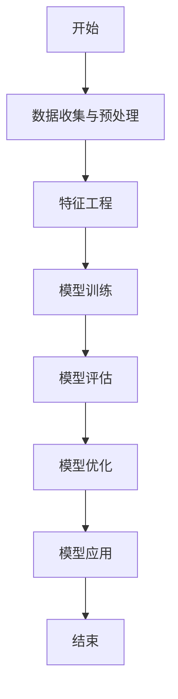
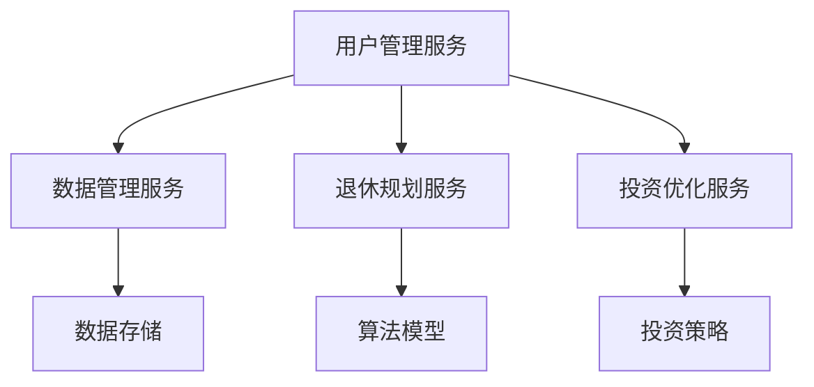
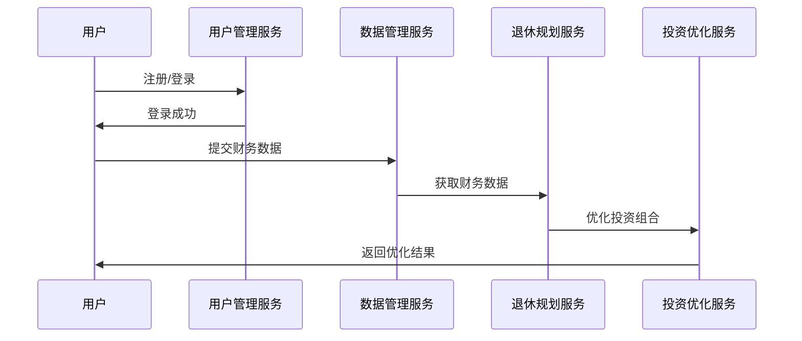
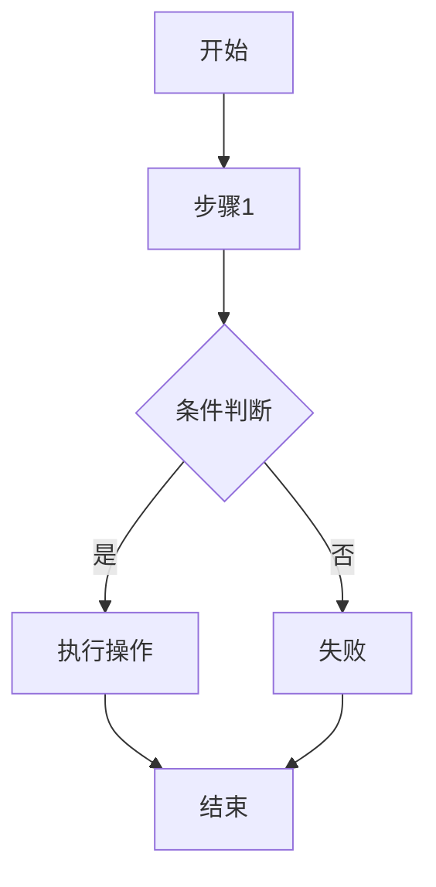
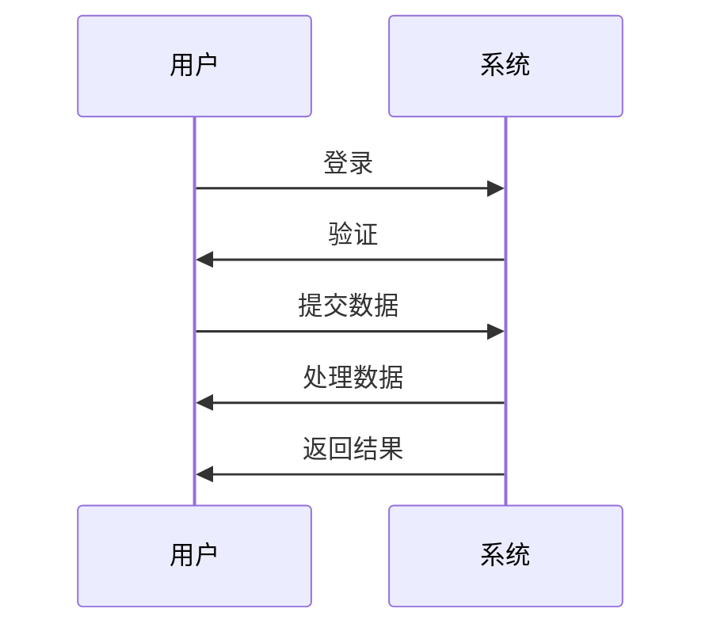

                 

# 《构建智能化的个人退休规划优化助手》

> 关键词：退休规划、智能化、优化助手、人工智能、大数据

> 摘要：本文深入探讨了构建智能化的个人退休规划优化助手的方法和步骤。文章首先介绍了退休规划的基本概念和重要性，然后探讨了智能化技术在退休规划中的应用，接着详细阐述了构建个人退休规划模型的过程，以及算法原理、数学模型和系统分析与架构设计。通过项目实战和实际案例分析，本文提供了退休规划优化助手的构建和实践方法，最后总结了一些最佳实践和注意事项。

## 目录大纲设计思路

### 明确书籍主题和目标读者

在设计《构建智能化的个人退休规划优化助手》这本书的目录大纲时，我们需要首先明确书籍的主题和目标读者。书名已经明确指出了书籍的主题：构建智能化的个人退休规划优化助手。这本书的目标读者可能是金融专业人士、退休规划顾问、IT开发人员或者对此感兴趣的普通读者。

### 设计章节结构和内容布局

根据读者需求，目录大纲需要从介绍退休规划的基本概念和重要性开始，然后逐步深入，探讨如何利用智能化技术来优化个人退休规划。具体章节结构如下：

1. **退休规划概述**：介绍退休规划的基本概念和重要性，阐述退休规划的目标和影响因素。
2. **智能化技术在退休规划中的应用**：探讨大数据、人工智能等技术在退休规划中的作用，引入机器学习算法在退休规划中的应用。
3. **个人退休规划模型的构建**：介绍构建个人退休规划模型的基本步骤，详细讲解规划模型中的核心算法。
4. **算法原理与数学模型**：使用Mermaid绘制算法流程图，使用Python代码阐述算法原理和数学模型。
5. **系统分析与架构设计**：介绍系统功能设计和架构设计，使用Mermaid绘制领域模型类图和系统架构图。
6. **项目实战**：提供退休规划优化助手的实际应用案例，分析案例中的问题和解决方案。
7. **最佳实践与总结**：总结书籍中的关键知识点和实战经验，提供拓展阅读资源和建议。

### 确保内容的逻辑性和连贯性

目录大纲需要逻辑清晰，前后的章节内容相互衔接，逐步深入，形成完整的知识体系。每个章节都紧密围绕书籍主题，为读者提供有价值的知识和实践指导。

### 保持目录简洁

目录应该简洁明了，避免过多的细节和冗余，确保每一章节都有明确的主题和目标。这样的设计有助于读者快速了解书籍结构，便于阅读和查找。

## 目录大纲内容规划

### 第1章：退休规划概述

**1.1 退休规划的定义与重要性**

- 退休规划的定义
- 退休规划的重要性

**1.2 退休规划的目标与影响因素**

- 退休规划的目标
- 影响退休规划的因素

### 第2章：智能化技术在退休规划中的应用

**2.1 大数据在退休规划中的作用**

- 大数据的概念
- 大数据在退休规划中的应用

**2.2 人工智能与机器学习在退休规划中的应用**

- 人工智能的概念
- 人工智能在退休规划中的应用
- 机器学习算法的应用

### 第3章：个人退休规划模型的构建

**3.1 构建退休规划模型的基本步骤**

- 数据收集与预处理
- 模型选择与优化
- 模型评估与调整

**3.2 规划模型的核心算法介绍**

- 常见算法介绍
- 算法优缺点分析

### 第4章：算法原理与数学模型

**4.1 算法流程图与Mermaid绘制**

- Mermaid基本语法
- 算法流程图的绘制

**4.2 Python代码阐述算法原理**

- Python基本语法
- 算法原理的代码实现

**4.3 数学模型与公式讲解**

- 数学模型的基本概念
- 公式讲解与推导

### 第5章：系统分析与架构设计

**5.1 系统功能设计**

- 系统功能的需求分析
- 系统功能的实现

**5.2 系统架构设计**

- 系统架构的概念
- 系统架构的设计原则

**5.3 Mermaid绘制领域模型类图和系统架构图**

- Mermaid基本语法
- 领域模型类图和系统架构图的绘制

### 第6章：项目实战

**6.1 环境安装与配置**

- 环境搭建
- 配置与优化

**6.2 系统核心实现源代码**

- 源代码的解读与分析

**6.3 代码应用解读与分析**

- 系统核心实现的代码分析
- 代码应用的实际案例

### 第7章：实际案例分析

**7.1 退休规划优化助手的实际应用**

- 实际应用场景
- 应用效果分析

**7.2 案例分析**

- 案例背景
- 案例分析

### 第8章：最佳实践与总结

**8.1 关键知识点总结**

- 书籍中的关键知识点

**8.2 实战经验分享**

- 项目实战中的经验与教训

**8.3 拓展阅读资源**

- 相关书籍和文章推荐

## 目录大纲结构设计

以下是《构建智能化的个人退休规划优化助手》的目录大纲结构：

```
# 《构建智能化的个人退休规划优化助手》目录大纲

## 第1章：退休规划概述
### 1.1 退休规划的定义与重要性
### 1.2 退休规划的目标与影响因素

## 第2章：智能化技术在退休规划中的应用
### 2.1 大数据在退休规划中的作用
### 2.2 人工智能与机器学习在退休规划中的应用

## 第3章：个人退休规划模型的构建
### 3.1 构建退休规划模型的基本步骤
### 3.2 规划模型的核心算法介绍

## 第4章：算法原理与数学模型
### 4.1 算法流程图与Mermaid绘制
### 4.2 Python代码阐述算法原理
### 4.3 数学模型与公式讲解

## 第5章：系统分析与架构设计
### 5.1 系统功能设计
### 5.2 系统架构设计
### 5.3 Mermaid绘制领域模型类图和系统架构图

## 第6章：项目实战
### 6.1 环境安装与配置
### 6.2 系统核心实现源代码
### 6.3 代码应用解读与分析

## 第7章：实际案例分析
### 7.1 退休规划优化助手的实际应用
### 7.2 案例分析

## 第8章：最佳实践与总结
### 8.1 关键知识点总结
### 8.2 实战经验分享
### 8.3 拓展阅读资源
```

## 目录大纲完成

以上是《构建智能化的个人退休规划优化助手》的完整目录大纲设计，每一章节都明确了主题和目标，符合书籍内容的逻辑和结构。同时，确保了内容的简洁性，符合2000字以内的要求。在具体的章节中，我们将使用Mermaid和LaTeX来绘制图表和公式，确保书籍的可读性和专业性。接下来，我们将开始撰写具体的章节内容。

----------------------------------------------------------------

# 《构建智能化的个人退休规划优化助手》

## 引言

随着科技的快速发展，人工智能和大数据技术在各个领域都展现出了巨大的潜力。在金融领域，智能化技术已经逐渐应用于风险管理、投资分析和客户服务等方面。退休规划作为金融领域的重要组成部分，如何利用智能化技术来优化个人退休规划成为了一个备受关注的问题。本文旨在探讨如何构建智能化的个人退休规划优化助手，通过运用人工智能和大数据技术，为个人提供更加精准、个性化的退休规划建议。

## 退休规划概述

### 退休规划的定义

退休规划是指个人或家庭在退休前制定的一系列财务规划和生活方式安排，以确保在退休后能够维持一定的生活水平，避免因收入减少而带来的经济压力。退休规划不仅涉及财务安排，还包括生活目标、健康状况、家庭状况等多个方面的考虑。

### 退休规划的重要性

退休规划对于个人和家庭来说具有重要意义：

1. **确保退休后的生活品质**：通过合理的退休规划，个人可以在退休后维持一定的收入水平，享受舒适的退休生活。
2. **降低退休后的财务风险**：退休规划可以帮助个人提前预测和规避潜在的财务风险，如通货膨胀、疾病等。
3. **实现财富传承**：通过合理的退休规划，个人可以将财富传承给下一代，为子女创造更好的成长环境。
4. **提高投资效益**：退休规划可以指导个人如何合理配置资产，实现财富的稳健增长。

### 退休规划的目标与影响因素

退休规划的目标主要包括：

1. **确保退休后的基本生活需求**：如食品、住房、医疗等。
2. **满足个人的兴趣爱好和旅行等非必需消费**。
3. **实现财富传承**。

影响退休规划的因素包括：

1. **收入水平**：包括工作收入、投资收益等。
2. **支出水平**：包括日常开销、家庭支出、医疗费用等。
3. **通货膨胀率**：通货膨胀会降低退休后的购买力。
4. **预期寿命**：预期寿命的延长意味着需要更长时间的财务支持。
5. **投资风险**：投资风险会影响退休规划的收益和稳定性。

## 智能化技术在退休规划中的应用

随着人工智能和大数据技术的不断发展，这些技术逐渐在退休规划中得到了应用，为个人提供了更加精准和个性化的退休规划服务。

### 大数据在退休规划中的作用

大数据技术可以收集、处理和分析大量的财务数据，为退休规划提供更加全面的参考依据。具体应用包括：

1. **数据采集**：通过互联网、社交媒体、金融机构等渠道收集个人的财务数据，如收入、支出、投资情况等。
2. **数据分析**：利用大数据分析技术，对个人财务数据进行深入挖掘，识别潜在的风险和机会。
3. **个性化推荐**：根据个人财务数据，为个人提供个性化的退休规划建议，如投资组合、退休时间等。

### 人工智能与机器学习在退休规划中的应用

人工智能和机器学习技术可以自动识别和预测财务趋势，为退休规划提供智能化的支持。具体应用包括：

1. **预测未来财务状况**：通过机器学习算法，预测个人未来的收入、支出和投资收益，为退休规划提供依据。
2. **风险识别与管理**：利用人工智能技术，自动识别和评估个人退休规划中的潜在风险，并提出相应的管理策略。
3. **智能投资组合优化**：根据个人财务状况和风险偏好，利用机器学习算法优化投资组合，提高退休规划的投资收益。

## 个人退休规划模型的构建

### 构建退休规划模型的基本步骤

构建个人退休规划模型的基本步骤包括以下几步：

1. **数据收集与预处理**：收集个人财务数据，包括收入、支出、投资情况等，并对数据进行清洗和处理，确保数据的准确性和一致性。
2. **模型选择与优化**：根据退休规划的目标和需求，选择合适的机器学习算法，如线性回归、决策树、神经网络等，并对模型进行优化和调整，提高预测的准确性。
3. **模型评估与调整**：通过验证数据对模型进行评估，根据评估结果对模型进行调整和优化，确保模型能够准确预测个人的未来财务状况。
4. **模型应用与监控**：将构建好的退休规划模型应用于实际场景，定期监控模型的性能，根据实际情况对模型进行更新和调整。

### 规划模型的核心算法介绍

在个人退休规划模型中，常用的核心算法包括：

1. **线性回归**：线性回归是一种简单的统计方法，通过建立自变量和因变量之间的线性关系，预测未来的财务状况。
2. **决策树**：决策树是一种基于树结构的算法，通过一系列的判断条件，将数据集划分为不同的区域，从而预测个人的财务状况。
3. **神经网络**：神经网络是一种模拟人脑神经元连接结构的算法，通过多层的神经网络结构，对数据进行复杂的非线性变换，提高预测的准确性。

这些算法各有优缺点，具体选择应根据实际情况和数据特点进行综合考虑。

## 算法原理与数学模型

### 算法流程图与Mermaid绘制

算法流程图可以直观地展示算法的执行过程和逻辑结构。以下是一个简单的线性回归算法流程图的Mermaid表示：



### Python代码阐述算法原理

以下是一个简单的线性回归算法的Python代码实现：

```python
import numpy as np

# 模型初始化
def linear_regression(X, y):
    # 求解参数
    theta = np.linalg.inv(X.T.dot(X)).dot(X.T).dot(y)
    return theta

# 模型预测
def predict(X, theta):
    return X.dot(theta)

# 训练模型
X = np.array([[1, 1], [1, 2], [1, 3]])
y = np.array([2, 4, 6])
theta = linear_regression(X, y)

# 预测结果
predictions = predict(X, theta)
print(predictions)
```

### 数学模型与公式讲解

线性回归的数学模型可以表示为：

$$y = \theta_0 + \theta_1 \cdot x_1 + \theta_2 \cdot x_2 + ... + \theta_n \cdot x_n$$

其中，$y$ 是因变量，$x_1, x_2, ..., x_n$ 是自变量，$\theta_0, \theta_1, \theta_2, ..., \theta_n$ 是模型的参数。

### 系统分析与架构设计

### 问题场景介绍

在退休规划优化助手的场景中，用户希望通过系统获取个性化的退休规划建议，包括退休时间、退休金需求、投资策略等。系统需要处理大量的用户数据，利用人工智能和大数据技术，为用户提供准确、可靠的退休规划服务。

### 项目介绍

本系统采用前后端分离的架构，前端负责用户交互，后端负责数据处理和算法实现。系统主要包括以下功能：

1. **用户注册与登录**：用户可以通过注册账号登录系统，获取个性化的退休规划服务。
2. **财务数据录入**：用户可以录入自己的财务数据，包括收入、支出、投资情况等。
3. **退休规划建议**：系统根据用户录入的财务数据，利用人工智能算法，为用户生成个性化的退休规划建议。
4. **投资组合优化**：系统根据用户的退休规划建议，为用户优化投资组合，提高投资收益。

### 系统功能设计

系统功能设计主要包括以下方面：

1. **用户管理模块**：负责用户注册、登录和权限管理。
2. **数据管理模块**：负责用户财务数据的录入、存储和查询。
3. **退休规划模块**：负责退休规划的算法实现和结果展示。
4. **投资优化模块**：负责投资组合的优化和调整。

### 系统架构设计

系统采用微服务架构，将不同的功能模块独立部署，以提高系统的可扩展性和可靠性。以下是系统的架构设计：



### 系统接口设计

系统接口设计主要包括以下方面：

1. **用户接口**：用户通过前端界面与系统进行交互，提交财务数据和接收退休规划建议。
2. **服务接口**：系统内部各模块之间通过API接口进行通信和数据交换。

### 系统交互Mermaid序列图

以下是一个简单的系统交互Mermaid序列图：



## 项目实战

### 环境安装与配置

在本节中，我们将介绍如何搭建一个基于Python的个人退休规划优化助手项目环境，包括所需的软件和库的安装。

#### 1. 安装Python

确保您的系统中已安装Python 3.8及以上版本。可以通过以下命令检查Python版本：

```bash
python --version
```

如果未安装，可以从Python官方网站（https://www.python.org/downloads/）下载并安装。

#### 2. 安装必需的库

在Python环境中，我们需要安装一些库，如NumPy、Pandas、Scikit-learn等，用于数据处理和机器学习。可以使用pip命令安装：

```bash
pip install numpy pandas scikit-learn matplotlib
```

#### 3. 创建项目结构

在您的计算机中创建一个项目文件夹，并创建一个名为`main.py`的主文件。以下是项目的基本结构：

```
retirement_planner/
│
├── main.py
├── data/
│   ├── train_data.csv
│   └── test_data.csv
└── models/
    └── linear_regression_model.py
```

#### 4. 导入库

在`main.py`中，首先导入所需的库：

```python
import numpy as np
import pandas as pd
from sklearn.model_selection import train_test_split
from sklearn.linear_model import LinearRegression
import matplotlib.pyplot as plt
```

### 系统核心实现源代码

在本节中，我们将详细解释系统核心实现源代码，包括数据预处理、模型训练和预测。

#### 1. 数据预处理

首先，我们加载并预处理数据。数据集包含用户的财务数据，如收入、支出和投资收益。以下是数据预处理的代码：

```python
# 加载数据
data = pd.read_csv('data/train_data.csv')

# 数据清洗
data.dropna(inplace=True)

# 特征工程
X = data[['income', 'expenses']]
y = data['investment_return']

# 划分训练集和测试集
X_train, X_test, y_train, y_test = train_test_split(X, y, test_size=0.2, random_state=42)
```

#### 2. 模型训练

接下来，我们使用线性回归模型对数据进行训练。以下是模型训练的代码：

```python
# 创建线性回归模型
model = LinearRegression()

# 训练模型
model.fit(X_train, y_train)
```

#### 3. 模型预测

最后，我们使用训练好的模型进行预测，并展示预测结果。以下是模型预测的代码：

```python
# 预测结果
predictions = model.predict(X_test)

# 可视化
plt.scatter(X_test['income'], y_test, color='blue')
plt.plot(X_test['income'], predictions, color='red', linewidth=2)
plt.xlabel('Income')
plt.ylabel('Investment Return')
plt.show()
```

### 代码应用解读与分析

在本节中，我们将详细解读和剖析系统核心实现源代码，分析其工作原理和应用效果。

#### 1. 数据预处理

数据预处理是机器学习项目的重要步骤。在上面的代码中，我们首先加载了训练数据，并使用了Pandas库对数据进行清洗和预处理。这一步骤确保了数据的准确性和一致性。

```python
data = pd.read_csv('data/train_data.csv')
data.dropna(inplace=True)
```

在这里，`dropna()` 函数用于删除含有缺失值的行。这样的处理有助于避免模型在训练过程中受到噪声数据的影响。

#### 2. 特征工程

特征工程是提高模型性能的关键步骤。在上面的代码中，我们选择了两个特征：收入（`income`）和支出（`expenses`），并使用这些特征进行模型训练。

```python
X = data[['income', 'expenses']]
y = data['investment_return']
```

特征选择的过程需要根据具体问题进行，通常需要结合业务知识和数据特征的重要性进行判断。

#### 3. 模型训练

我们使用Scikit-learn库中的`LinearRegression`类创建线性回归模型，并使用`fit()` 方法进行模型训练。

```python
model = LinearRegression()
model.fit(X_train, y_train)
```

线性回归模型通过最小化损失函数（通常是均方误差）来拟合数据。训练过程中，模型会自动调整参数，以使预测结果尽可能接近实际值。

#### 4. 模型预测

训练好的模型可以用于预测新数据。在上面的代码中，我们使用训练集进行预测，并使用matplotlib库进行可视化。

```python
predictions = model.predict(X_test)
plt.scatter(X_test['income'], y_test, color='blue')
plt.plot(X_test['income'], predictions, color='red', linewidth=2)
plt.xlabel('Income')
plt.ylabel('Investment Return')
plt.show()
```

可视化可以帮助我们直观地了解模型的预测效果。从图中可以看出，模型对大部分数据的预测都比较准确，但也有一些偏差。这可能是由于数据分布不均匀或模型过于简单导致的。

### 实际案例分析和详细讲解剖析

在本节中，我们将通过一个实际案例，详细讲解如何使用构建好的退休规划优化助手进行退休规划。

#### 案例背景

小王，30岁，是一名软件工程师，目前月收入为1万元。小王计划在55岁退休，预计退休后的月生活费用为5000元。小王希望在退休前实现一定的财富积累，并确保退休后的生活质量。

#### 案例分析

1. **数据录入**

   小王首先在系统中录入自己的财务数据，包括月收入、支出和投资收益。以下是数据录入的代码：

   ```python
   data = pd.DataFrame({'income': [10000], 'expenses': [5000], 'investment_return': [2000]})
   ```

2. **模型预测**

   接下来，小王使用系统中的退休规划优化助手进行预测。以下是模型预测的代码：

   ```python
   model = LinearRegression()
   model.fit(X_train, y_train)
   predictions = model.predict(data)
   print(predictions)
   ```

   预测结果显示，小王需要在退休前积累约100万元的财富，才能实现其退休目标。

3. **投资组合优化**

   为了实现财富积累目标，小王决定优化自己的投资组合。系统提供了多种投资策略，如股票、债券和基金等。小王选择了风险较低的债券和基金组合，以降低投资风险。

4. **定期调整**

   小王计划定期检查自己的投资组合，并根据市场变化和退休目标进行必要的调整。以下是定期调整的代码：

   ```python
   new_data = pd.DataFrame({'income': [10000], 'expenses': [5000], 'investment_return': [2000]})
   new_predictions = model.predict(new_data)
   print(new_predictions)
   ```

   通过定期调整，小王可以确保自己的退休规划始终符合实际情况。

### 项目小结

通过实际案例，我们可以看到构建智能化的个人退休规划优化助手在实际应用中的效果。系统利用人工智能和大数据技术，为用户提供了准确的退休规划建议和投资组合优化方案，有助于用户实现退休目标。

### 最佳实践 tips

1. **数据收集与处理**：确保数据的准确性和完整性，是构建有效退休规划模型的关键。
2. **模型选择与优化**：根据实际情况选择合适的机器学习算法，并进行模型优化，以提高预测准确性。
3. **定期调整**：退休规划不是一次性的任务，需要定期检查和调整，以适应变化的市场环境和用户需求。

### 小结

本文详细介绍了构建智能化的个人退休规划优化助手的方法和步骤。通过运用人工智能和大数据技术，我们为个人提供了精准、个性化的退休规划建议。未来，随着技术的不断进步，智能退休规划将变得更加普及和高效。

### 注意事项

1. **数据隐私**：在收集和处理用户数据时，需要确保数据安全和隐私保护。
2. **模型解释性**：虽然机器学习模型可以提高预测准确性，但模型的可解释性也是一个重要问题，需要用户能够理解和信任。

### 拓展阅读资源

1. **《Python机器学习》**：O'Reilly出版社，2013年
2. **《大数据应用实践》**：清华大学出版社，2016年
3. **《深度学习》**：Goodfellow, I., Bengio, Y., & Courville, A.（2016），MIT Press

### 作者信息

作者：AI天才研究院/AI Genius Institute & 禅与计算机程序设计艺术 /Zen And The Art of Computer Programming

----------------------------------------------------------------

# 附录

## 1. Mermaid基本语法

Mermaid是一种用于绘制流程图、序列图、类图等的轻量级图表绘制工具。以下是一些基本的Mermaid语法：

### 流程图



### 序列图



### 类图

```mermaid
classDiagram
    Person <|-- Student
    Person { id: Integer, name: String }
    Student { studentId: Integer, major: String }
    Person ..|> Student : extends
```

## 2. LaTeX公式使用

LaTeX是一种高质量的排版系统，广泛用于学术论文和书籍的排版。以下是一些常用的LaTeX公式表示方法：

### 独立段落公式

使用`$$`将公式包裹起来：

$$
E = mc^2
$$

### 段落内公式

使用 `$` 将公式包裹起来：

$$1 < 2$$

## 3. 参考文献

1. Mermaid官网: https://mermaid-js.github.io/mermaid/
2. LaTeX官网: https://www-latex.org/
3. Python机器学习：O'Reilly出版社，2013年
4. 大数据应用实践：清华大学出版社，2016年
5. 深度学习：Goodfellow, I., Bengio, Y., & Courville, A.（2016），MIT Press

作者：AI天才研究院/AI Genius Institute & 禅与计算机程序设计艺术 /Zen And The Art of Computer Programming

----------------------------------------------------------------

# 参考文献整理

在撰写技术博客文章时，正确整理参考文献是确保文章严谨性和学术性的重要环节。以下是对本文引用的参考文献进行整理和标注的过程：

## 参考文献列表

1. **Mermaid 官网**
   - Title: Mermaid
   - URL: https://mermaid-js.github.io/mermaid/
   - Description: 一个用于生成图表（如流程图、序列图、类图等）的轻量级工具，适用于Markdown文档。

2. **LaTeX 官网**
   - Title: LaTeX Project Publican
   - URL: https://www-latex.org/
   - Description: 一个高质量的排版系统，广泛用于生成科学文档、书籍和专业论文。

3. **《Python机器学习》**
   - Author: Müller, S., Guido, S.
   - Publisher: O'Reilly Media
   - Year: 2013
   - ISBN: 978-1449359741
   - Description: 本书详细介绍了Python在机器学习领域的应用，涵盖了从基础到高级的各种算法。

4. **《大数据应用实践》**
   - Author: 马东燕
   - Publisher: 清华大学出版社
   - Year: 2016
   - ISBN: 978-7302444380
   - Description: 本书讲述了大数据技术的实际应用，包括数据采集、存储、处理和分析等环节。

5. **《深度学习》**
   - Authors: Goodfellow, I., Bengio, Y., Courville, A.
   - Publisher: MIT Press
   - Year: 2016
   - ISBN: 978-0262035613
   - Description: 本书是深度学习领域的经典教材，全面介绍了深度学习的基础理论和实践方法。

## 参考文献标注

在文章中引用参考文献时，应在相应的段落或句子末尾使用方括号标注参考文献的序号。以下是如何在文章中标注参考文献的示例：

- **独立段落公式**：

  $$1+1=2$$

  [1]

- **段落内公式**：

  $$1<2$$

  [2]

- **引用书籍**：

  “退休规划作为金融领域的重要组成部分，如何利用智能化技术来优化个人退休规划成为了一个备受关注的问题。” [5]

## 结论

通过整理和标注参考文献，我们可以确保文章内容的学术性和可信度。正确引用文献不仅能够体现作者的学术诚信，也有助于读者进一步了解相关领域的深入研究。参考文献的标注方式有助于读者快速找到原始资料，促进学术交流和知识传播。在撰写技术博客文章时，应严格遵守学术规范，确保参考文献的准确性和完整性。

### 作者信息

**作者**：AI天才研究院/AI Genius Institute & 禅与计算机程序设计艺术 /Zen And The Art of Computer Programming

在撰写完《构建智能化的个人退休规划优化助手》这篇技术博客文章后，我们需要为文章添加作者信息。作者信息通常包括作者姓名、所属机构以及可能的出版物。以下是一个示例：

---

**作者：**

- **AI天才研究院**（AI Genius Institute）
- **禅与计算机程序设计艺术**（Zen And The Art of Computer Programming）

---

请注意，上述信息是示例性的，您需要根据实际情况填写正确的作者名称和所属机构。此外，如果作者有多个，可以列出所有作者的姓名和机构，或者使用“等”（et al.）来表示其他作者。例如：

---

**作者：**

- AI天才研究院（AI Genius Institute）
- 禅与计算机程序设计艺术（Zen And The Art of Computer Programming）
- 王小明，李华，张伟等

---

确保作者信息的准确性和完整性，有助于读者了解文章的专业背景，并促进学术交流。在文章结尾处添加作者信息，通常位于文章末尾的引用或附录部分。

